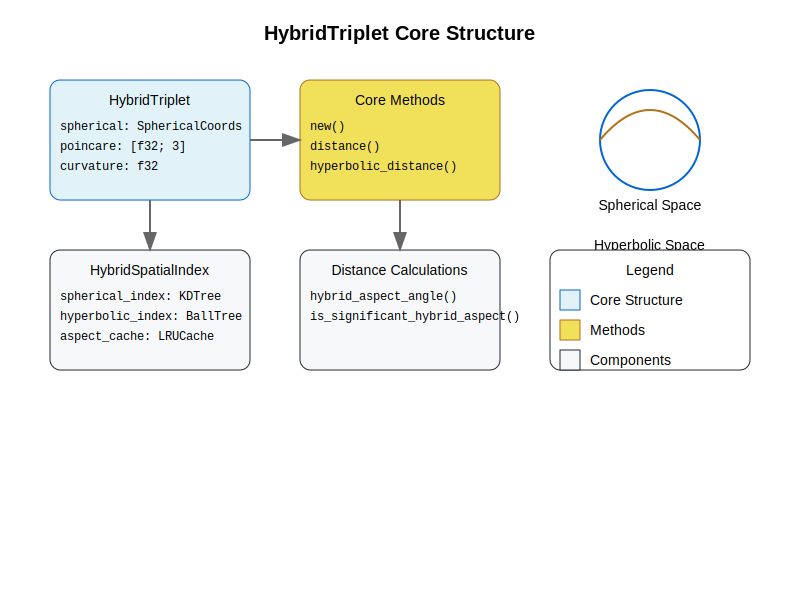
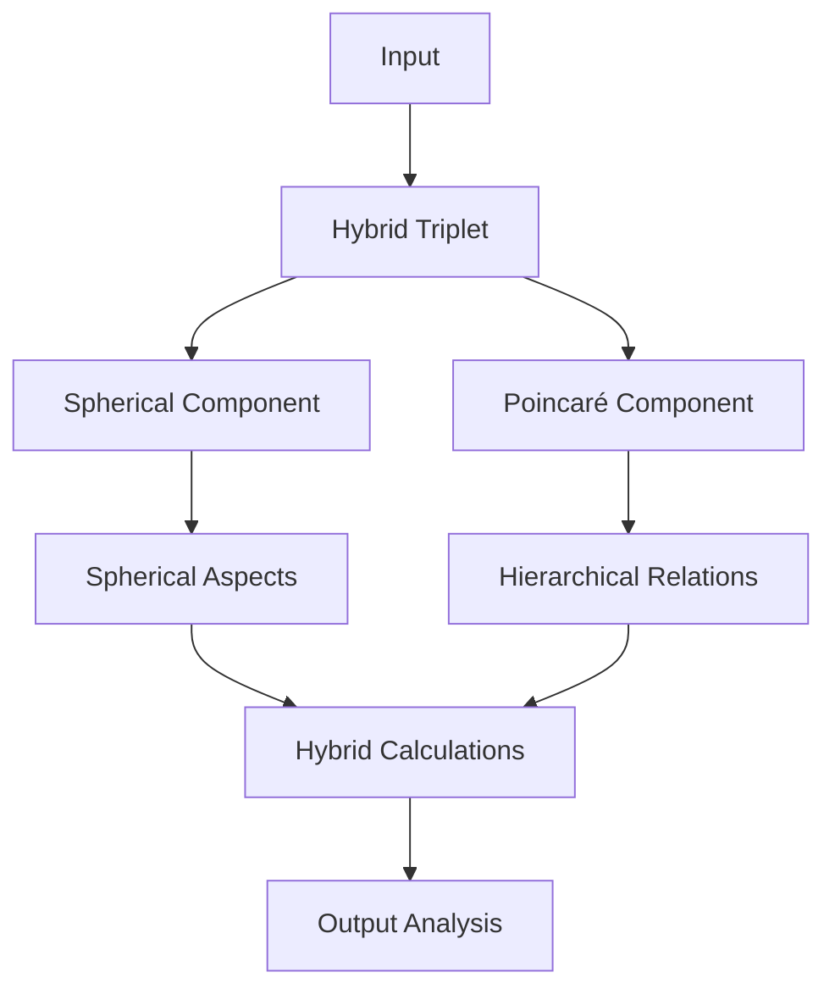
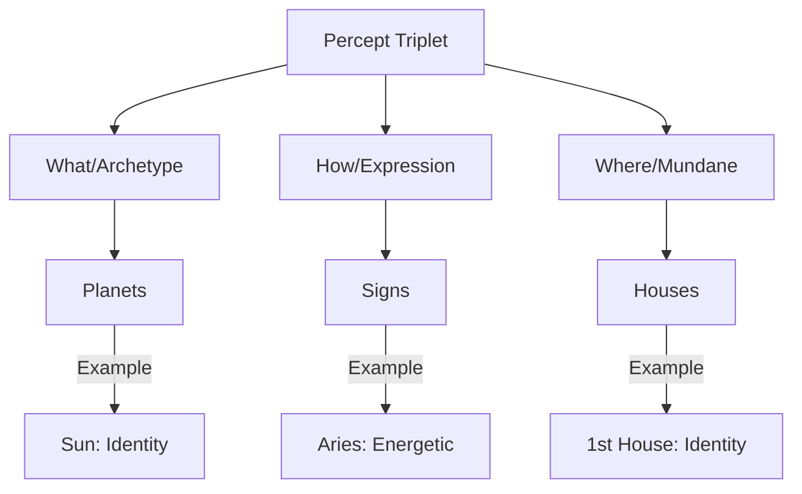

# 2.4. The percept-triplet

The percept-triplet is a three-dimensional encoding system that represents human perception through archetypal (What), expressive (How), and contextual (Where) vectors. It combines Western symbolic systems with hybrid spherical-hyperbolic geometry to create computationally efficient representations of conceptual relationships.

In the Memorativa model, human perception can be conceptually categorized according to three conceptual vectors, called the *percept-triplet*:

- **What**: the archetype - *the archetype vector*
- **How**: the form of expression of the archetype - *the expression vector*
- **Where**: the form of expression of the archetype in the conceptual field of activity - *the mundane vector*

Additionally, each percept-triplet has an identifying title and description to distinguish it from it's archetype vector (the what). The title/distinction pair serves as a distinct, compact, verbal prototype for the structure.

Each of these conceptual correlations originate from an observer that has a certain cosmological orientation, that is, *of a perceiver of objects in time and space on Earth*.

Percept-triplets can be applied to humans, things, and events to calculate encapsulating concepts. Keywords can be used as identifiers to correlate percepts to a data dictionary of concepts.

Western mythology and symbology provide prototypes that are encoded into the English language and culture (which is of concern to large language models and other semantic processors) and that can serve as the "data dictionary" for percept encoding.

The **archetype vector** is defined as:

- Outside the bounds of conceptualization
- An active force and dynamic principle
- Something that can be represented by prototypes
- A conceptual goal and a kind of center of conceptual gravity for prototypes
- Universal and consistent 

Memorativa uses archetypes as the "What" vector, and specifically Western prototypes of archetypes. In Memorativa, prototypes act as the representation of the input enjoined with a concept. The more closely a prototype "gravitates" towards the conceptual field of the archetype, the more clearly the prototype expresses the encapsulating concept of the percept.

**Planets**, with their centers of gravity and symbolic potency, provide the core prototypes for the archetypal "what" vector of the percept-triplets.

These are prototypical classical Planets of Western mythology, with some conceptual correlations:

- **Sun ☉**: Identity, vitality, consciousness, purpose
- **Moon ☽**: Emotions, instincts, nurturing, cycles
- **Mercury ☿**: Communication, learning, analysis, connection
- **Venus ♀**: Values, relationships, harmony, attraction
- **Mars ♂**: Action, drive, assertion, energy
- **Jupiter ♃**: Expansion, wisdom, growth, opportunity
- **Saturn ♄**: Structure, limitation, responsibility, time

These are the prototypical modern Planets, with some conceptual correlations:

- **Uranus ♅**: Innovation, freedom, disruption, awakening
- **Neptune ♆**: Spirituality, dissolution, imagination, unity
- **Pluto ♇**: Transformation, power, depth, regeneration

Each of these conceptual correlations are multivariate depending on if the percept is something personal, mundane, or itself conceptual. Thus "Sun" can be used to conceptually categorize people, events, or things. Different kinds of conceptual temporal states are also encoded into the planetary archetypes.

The **expression vector** represents the form and expression of the archetype (the "How" vector) and is defined by:

- One of twelve symbols that modify the Planet archetypal force
- A representation of style, tone, and modality for the archetype
- The expression and manifestation of the archetype
- Determines how force is channeled

In keeping with an analogous structure to represent the different kinds of modalities and expressions of a Planet, the Western mythological classification of the constellations demarcating the ecliptic, the **Zodiac Signs**, serve as the twelve primary symbols of the "How" vector. According to the established mythology, each Zodiacal Sign has a "ruling" Planet that encodes a further vector of conceptual significance. In the case of the conceptual correlations for Signs, the vector particularly relates to the observer's understanding of the nature of the percept as an expression of the archetype.

Signs provide many additional correlated conceptual vectors, such as body parts, plants and minerals, month of the year, ruling Planet, etc.

| **Sign**                          |  **Modes**                |
|-----------------------------------|---------------------------|
| **♈ Aries, The Ram**              |  Energetic                |
| **♉ Taurus, The Bull**            |  Reliable                 |
| **♊ Gemini, The Twins**           |  Expressive               |
| **♋ Cancer, The Crab**            |  Protective               |
| **♌ Leo, The Lion**               |  Dramatic                 |
| **♍ Virgo, The Virgin**           |  Analytical               |
| **♎ Libra, The Scales**           |  Harmonious               |
| **♏ Scorpio, The Scorpion**       |  Intense                  |
| **♐ Sagittarius, The Archer**     |  Philosophical            |
| **♑ Capricorn, The Sea-Goat**     |  Practical                |
| **♒ Aquarius, The Water Bearer**  |  Inventive                 |
| **♓ Pisces, The Fish**            |  Artistic                 |

The **mundane vector** (the "Where") is the area of reality where the archetypal form of expression manifests, and is defined by:

- One of 12 areas called Houses
- The operational zone of activity for the percept
- Correlations to cycles, times, phases, and durations of human observed events
- Grounds symbolism in tangible reality, reflecting where energies manifest most visibly

Houses are categorized in Western astrology as follows:

| **House**                                |  **Area**                 |
|------------------------------------------|---------------------------|
|  **1st: The Ascendant**                  |  Identity                 |
|  **2nd: The House of Value**             |  Resources                |
|  **3rd: The House of Communication**     |  Learning                 |
|  **4th: The Nadir/IC**                   |  Home                     |
|  **5th: The House of Pleasure**          |  Creativity               |
|  **6th: The House of Service**           |  Routine                  |
|  **7th: The Descendant**                 |  Relationships            |
|  **8th: The House of Transformation**    |  Shared resources         |
|  **9th: The House of Philosophy**        |  Beliefs                  |
|  **10th: The Midheaven/MC**              |  Authority                |
|  **11th: The House of Friendship**       |  Groups                   |
|  **12th: The House of the Unconscious**  |  Hidden matters           |

The percept-triplet structure is geometrically encoded in a hybrid spherical-hyperbolic knowledge space, combining the benefits of both geometries:


## Coordinate mapping

The hybrid spherical-hyperbolic space is represented by four key coordinates:

- θ (Theta): Archetypal angle (0 to 2π) representing the Planet-Sign relationship
- φ (Phi): Expression elevation (-π/2 to π/2) derived from Sign-House interaction
- r (Radius): Mundane magnitude (0 to 1) based on House significance
- κ (Kappa): Curvature parameter that smoothly transitions between:
  - Hyperbolic geometry (κ > 0): Better for hierarchical relationships
  - Spherical geometry (κ < 0): Better for symbolic/angular relationships


The visualization shows how points are mapped in this hybrid space, with:
- Blue curves representing hyperbolic geometry
- Coral arcs representing spherical geometry 
- A sample point showing coordinate projection (θ, φ, r)
- Smooth transitions between geometries controlled by κ

## Comparison to Conceptual Spaces

The hybrid spherical-hyperbolic mapping shares similarities with Gärdenfors' Conceptual Spaces theory while introducing key innovations:

| Aspect | Conceptual Spaces | Hybrid S-H Space |
|--------|------------------|------------------|
| Dimensions | Quality dimensions with arbitrary domains | Fixed 3D structure (θ,φ,r) with curvature κ |
| Geometry | Euclidean metric spaces | Dynamic spherical-hyperbolic geometry |
| Properties | Convex regions in quality dimensions | Vector fields in curved space |
| Concepts | Weighted combinations of properties | Gravitational wells around archetypes |
| Distance | Weighted Euclidean/Manhattan | Geometry-dependent hybrid metric |
| Structure | Domain-specific dimensional spaces | Universal 3D representation |


Key advantages of the hybrid approach:

1. **Fixed Dimensionality**: Maintains computational efficiency while preserving expressiveness
2. **Dynamic Geometry**: Adapts to hierarchical vs symbolic relationships through curvature
3. **Universal Structure**: Provides consistent mapping across all conceptual domains
4. **Gravitational Metaphor**: Intuitive understanding of conceptual attraction and prototypes

The hybrid model trades some of the flexibility of arbitrary quality dimensions for a more constrained but computationally tractable universal representation.

## Implementation

This code defines a way to represent concepts spatially using a HybridTriplet structure, where the spatial coordinates and geometry are derived from astrological concepts: Planets, Zodiac Signs, and Houses. The `from_astrological` method acts as a bridge, converting astrological inputs into the numerical representation of the hybrid spatial model. This enables the system to use astrological principles to model and analyze conceptual relationships in a structured, geometric way.

```rust
struct HybridTriplet {
    theta: f32,     // Archetype vector (0.0-2π)
    phi: f32,       // Expression vector (-π/2-π/2) 
    radius: f32,    // Mundane magnitude (0.0-1.0)
    curvature: f32, // Geometry parameter
    gradient: f32,  // Curvature gradient field
    error: f32      // Error bound for calculations
}

impl HybridTriplet {
    const MAX_CURVATURE: f32 = 10.0;
    const MIN_CURVATURE: f32 = -10.0;
    const ERROR_TOLERANCE: f32 = 1e-6;

    fn from_astrological(p: Planet, s: Sign, h: House) -> Self {
        let theta = p.base_angle() + s.angular_offset();
        let phi = s.elevation() * h.temporal_weight();
        let radius = h.mundane_significance();
        let curvature = h.determine_curvature()
            .clamp(Self::MIN_CURVATURE, Self::MAX_CURVATURE);
        let gradient = calculate_curvature_gradient(curvature, radius);
        let error = calculate_error_bound(theta, phi, radius, curvature);
        
        Self { theta, phi, radius, curvature, gradient, error }
    }

    fn calculate_distance(&self, other: &Self) -> Result<f32, CurvatureError> {
        // Check error bounds before calculation
        if (self.error + other.error) > Self::ERROR_TOLERANCE {
            return Err(CurvatureError::ExcessiveError);
        }

        // Blend distance metrics based on gradient field
        let hyperbolic_dist = self.hyperbolic_distance(other);
        let spherical_dist = self.spherical_distance(other);
        
        // Smooth transition using gradient
        let blend = (self.gradient + other.gradient) / 2.0;
        Ok(hyperbolic_dist * blend + spherical_dist * (1.0 - blend))
    }

    fn hyperbolic_distance(&self, other: &Self) -> f32 {
        // Poincaré ball model distance formula
        let dx = self.poincare[0] - other.poincare[0];
        let dy = self.poincare[1] - other.poincare[1];
        let dz = self.poincare[2] - other.poincare[2];
        let euclid_norm = (dx*dx + dy*dy + dz*dz).sqrt();
        let denominator = (1.0 - self.norm_squared()).sqrt() 
                       * (1.0 - other.norm_squared()).sqrt();

        (1.0 + 2.0*euclid_norm/denominator).acosh()
    }
}

fn calculate_curvature_gradient(curvature: f32, radius: f32) -> f32 {
    // Create smooth transition between geometries
    let base = sigmoid(curvature);
    let radial_factor = 1.0 - radius.powf(2.0);
    base * radial_factor
}

fn calculate_error_bound(theta: f32, phi: f32, radius: f32, curvature: f32) -> f32 {
    // Estimate numerical error based on coordinate values and curvature
    let coord_error = (theta.abs() + phi.abs() + radius) * f32::EPSILON;
    let curv_error = curvature.abs() * f32::EPSILON;
    coord_error + curv_error
}

#[derive(Debug)]
enum CurvatureError {
    ExcessiveError,
    InvalidCurvature,
}
```
The hybrid spatial model provides critical advantages for conceptual analysis

**Aspect Preservation**  
   Angular relationships (conjunction, opposition, etc.) become native geometric calculations in both spaces:
   ```python
   def hybrid_aspect_angle(t1: HybridTriplet, t2: HybridTriplet) -> float:
       if t1.curvature > 0:  // Hyperbolic space
           return hyperbolic_distance(t1, t2)
       else:  // Spherical space
           return spherical_angle(t1, t2)
   ```

**Dimensional Optimization**  
   | Dimension | Representation | Storage | Computational Complexity |
   |-----------|----------------|---------|--------------------------|
   | 2D        | Planar         | 2 floats| O(n) search              |  
   | **3D Hybrid** | **Spherical-Hyperbolic**  | **4 floats** | **O(log n) via k-d trees** |
   | >3D       | Hyper-spatial  | n floats | O(n^k) scaling issues |

**Cognitive Alignment**  
   - Mirrors human spatial reasoning (x,y,z → what,how,where)
   - Enables intuitive visualization of conceptual "distances"
   - Allows gravitational metaphors (archetypal "pull", mundane "weight")
   - Supports hierarchical relationships through hyperbolic space

**Cross-Domain Compatibility**
   ```mermaid
   graph LR
       ASTRO[Astrological Aspects] --> 3DH[3D Hybrid Space]
       ML[ML Embeddings] --> 3DH
       PHYS[Physics Models] --> 3DH
       3DH --> ANALYSIS[Unified Analysis]
   ```

**Efficiency Tradeoffs**  
   - 32-bit floats (θ,φ,r,κ) = 16 bytes/triplet
   - Enables GPU acceleration using standard 3D math libraries
   - Maintains 1° angular precision (360 values) with 2-byte quantization
   - Supports dynamic geometry selection based on conceptual needs

This hybrid encoding creates a _conceptual phase space_ where:  
`distance(p1,p2) = f(θ_diff, φ_diff, r_diff, κ)`  
can represent both hierarchical relationships and semantic similarity through vector operations while preserving symbolic relationships.

The Memorativa system uses a hybrid spherical-hyperbolic space to represent both symbolic relationships (via spherical geometry) and hierarchical structures (via hyperbolic geometry). This hybrid model enables more nuanced representation of conceptual relationships while maintaining computational efficiency.

## Core structure

The `HybridTriplet` struct and its implemented methods provide a way to represent points in a hybrid spherical-hyperbolic space and calculate distances between them. 



The key features are:

- **Hybrid Representation**: It stores both spherical and Poincaré coordinates, along with a curvature parameter, to capture the hybrid nature of the space.
- **Constructor**: The new function creates HybridTriplet instances from spherical coordinates, converting them to Poincaré coordinates and setting a default hyperbolic curvature.
- **Hybrid Distance Calculation**: The distance method dynamically selects between hyperbolic and spherical distance calculation based on the curvature parameter.
- **Poincaré Ball Hyperbolic Distance**: The hyperbolic_distance method specifically calculates the hyperbolic distance using the Poincaré ball model formula, which is essential for working with hyperbolic geometry in this representation.

This code is a fundamental building block for the system to work with hybrid geometric spaces for representing conceptual relationships that have both hierarchical (hyperbolic) and symbolic/angular (spherical) aspects.

```rust
/// Represents a point in hybrid spherical-hyperbolic space
#[derive(Clone, Copy)]
struct HybridTriplet {
    spherical: SphericalCoords,
    poincare: [f32; 3],  // (x,y,z) in Poincaré ball model
    curvature: f32,      // κ (positive for hyperbolic, negative for spherical)
}

impl HybridTriplet {
    fn new(spherical: SphericalCoords) -> Self {
        let poincare = Self::spherical_to_poincare(spherical);
        HybridTriplet {
            spherical,
            poincare,
            curvature: 1.0,  // Default hyperbolic curvature
        }
    }

    fn distance(&self, other: &Self) -> f32 {
        if self.curvature > 0.0 {
            self.hyperbolic_distance(other)
        } else {
            self.spherical_distance(other)
        }
    }

    fn hyperbolic_distance(&self, other: &Self) -> f32 {
        // Poincaré ball model distance formula
        let dx = self.poincare[0] - other.poincare[0];
        let dy = self.poincare[1] - other.poincare[1];
        let dz = self.poincare[2] - other.poincare[2];
        let euclid_norm = (dx*dx + dy*dy + dz*dz).sqrt();
        let denominator = (1.0 - self.norm_squared()).sqrt() 
                       * (1.0 - other.norm_squared()).sqrt();

        (1.0 + 2.0*euclid_norm/denominator).acosh()
    }
}
```

The hybrid spatial index enables efficient querying in both spherical and hyperbolic spaces.

The `HybridSpatialIndex` class provides a way to perform nearest neighbor queries in a hybrid spherical-hyperbolic space by:

- Maintaining separate spatial indices for the spherical and hyperbolic components of the space.
- Querying both indices in parallel for a given query point.
- Combining the results from both queries using a weighted average of distances, where the weight is determined by the curvature parameter of the query point.
- Returning the top k nearest neighbors based on this combined hybrid distance score.

This approach allows for efficient neighbor retrieval in a space that blends spherical and hyperbolic geometries, adapting the distance metric based on the local curvature.

```python
class HybridSpatialIndex:
    def __init__(self):
        self.spherical_index = KDTree(dim=3)
        self.hyperbolic_index = BallTree(metric='poincare')
        self.aspect_cache = LRUCache(maxsize=10000)
        
    def query_neighbors(self, triplet: HybridTriplet, k: int = 5) -> List[HybridTriplet]:
        # Query both spaces in parallel
        spherical_neighbors = self.spherical_index.query(
            triplet.spherical.coords, 
            k=k
        )
        hyperbolic_neighbors = self.hyperbolic_index.query(
            triplet.poincare,
            k=k
        )
        
        # Merge results based on curvature
        weight = abs(triplet.curvature)
        merged = []
        for s_n, h_n in zip(spherical_neighbors, hyperbolic_neighbors):
            score = weight * h_n.distance + (1-weight) * s_n.distance
            merged.append((s_n.triplet, score))
            
        return sorted(merged, key=lambda x: x[1])[:k]
```

The hybrid model extends traditional aspect calculations to account for both spherical and hyperbolic relationships:

These functions provide a way to:

- Calculate a hybrid aspect angle that combines spherical and hyperbolic distances, weighted by the curvature of the space, allowing for a nuanced measure of angular relationship in a hybrid geometry.
- Determine the significance of a hybrid aspect using a dynamic threshold that also adapts to the curvature, making the criteria for significance context-dependent based on the local geometry of the hybrid space.

These functions are crucial for implementing aspect-based analysis and retrieval in the Memorativa system's hybrid spatial model, allowing it to capture both hierarchical and symbolic relationships in a unified framework.

```python
def hybrid_aspect_angle(t1: HybridTriplet, t2: HybridTriplet) -> float:
    # Calculate both spherical and hyperbolic components
    spherical_angle = calculate_3d_angle(t1.spherical, t2.spherical)
    hyperbolic_dist = t1.hyperbolic_distance(t2)
    
    # Normalize hyperbolic distance to angular scale
    max_hyp_dist = 4.0  # Maximum expected hyperbolic distance
    norm_hyp_angle = (hyperbolic_dist / max_hyp_dist) * 180.0
    
    # Weighted combination based on curvature
    weight = abs(t1.curvature)
    return weight * norm_hyp_angle + (1-weight) * spherical_angle

def is_significant_hybrid_aspect(angle: float, curvature: float) -> bool:
    # Dynamic thresholds based on space curvature
    hyperbolic_thresh = 0.15  # 15% of max hyperbolic distance
    spherical_thresh = 10.0   # Degrees
    
    threshold = abs(curvature) * hyperbolic_thresh + 
                (1-abs(curvature)) * spherical_thresh
    return angle > threshold
```

The hybrid spatial model provides several advantages:

1. **Improved Hierarchical Representation**: Hyperbolic space better captures hierarchical relationships between concepts
2. **Preserved Symbolic Relationships**: Spherical components maintain traditional aspect relationships
3. **Flexible Geometry**: Curvature parameter allows dynamic adjustment between spaces
4. **Efficient Querying**: Parallel indexing enables fast neighbor searches in both spaces



Since the input has been decomposed into a set of percept-triplets vectors, it is important that each vector has a unique, identifying title/description pair that distinguishes the input from archetype as a verbal prototype. Each pair is derived from the initial input's title and description values, but transformed by the percept-triplet calculation into a more specific variation of the input. This transformation happens at the end of the prototype construction and is performed by the Memorativa system. The Memorativa system also transforms the text from the terms and language of astrology into more broadly understood symbols and language to ensure that the title-description pair is less constrained and more universal.

Consider as an example encoding the concept "innovative leadership".

```python
# Archetypal vector: Sun (leadership)
# Expression vector: Aquarius (innovation)
# Mundane vector: 10th House (authority/career)

triplet = HybridTriplet.from_astrological(
    planet=Planet.SUN,
    sign=Sign.AQUARIUS,
    house=House.TENTH
)

# Results in title/description:
# Title: "Disruptive Authority Figure"
# Description: "A leader who brings innovative changes to organizational structures"
```



## Quantum-Inspired Coordinate System

The hybrid spherical-hyperbolic space can be enhanced with quantum-inspired algorithms:

```rust
struct QuantumInspiredTriplet {
    // Classical HybridTriplet for compatibility
    classical: HybridTriplet,
    // Complex amplitude representation
    amplitude: ComplexVector,
    // Phase information
    phase: f32
}

impl QuantumInspiredTriplet {
    fn from_classical(triplet: &HybridTriplet) -> Self {
        let amplitude = ComplexVector::from_spherical(
            triplet.theta,
            triplet.phi,
            triplet.radius
        );
        
        Self {
            classical: triplet.clone(),
            amplitude,
            phase: 0.0
        }
    }

    fn interference_distance(&self, other: &Self) -> f32 {
        self.amplitude
            .hadamard_product(&other.amplitude)
            .apply_phase(self.phase - other.phase)
            .magnitude()
    }
}
```

This quantum-inspired representation enables:
- More efficient distance calculations through interference patterns
- Better capture of subtle relationships between concepts
- Improved neighbor search in high-dimensional space
- Future compatibility with quantum hardware


## Key points

- **Percept-triplet Structure**
  - Archetypal vector (What): Planetary archetypes representing universal forces and patterns
  - Expression vector (How): Zodiacal signs encoding modalities and manifestation styles
  - Mundane vector (Where): Houses defining domains of activity and temporal contexts
  - Each triplet has a unique title/description pair that distinguishes it from its archetype

- **Geometric Implementation**
  - Hybrid spherical-hyperbolic space combines symbolic and hierarchical relationships
  - Coordinates: θ (archetype angle), φ (expression elevation), r (mundane radius), κ (curvature)
  - Dynamic geometry selection via curvature parameter
  - Efficient 16-byte encoding enables GPU acceleration

- **Computational Advantages**
  - O(log n) neighbor queries through parallel spatial indices
  - Preserves both angular relationships and hierarchical structures
  - Compatible with ML embeddings and physics models
  - Supports quantum-inspired algorithms for enhanced pattern matching

- **Practical Applications**
  - Encodes human perception into computationally efficient representations
  - Bridges symbolic systems with geometric spatial models
  - Enables nuanced conceptual distance calculations
  - Supports both hierarchical and associative relationships


