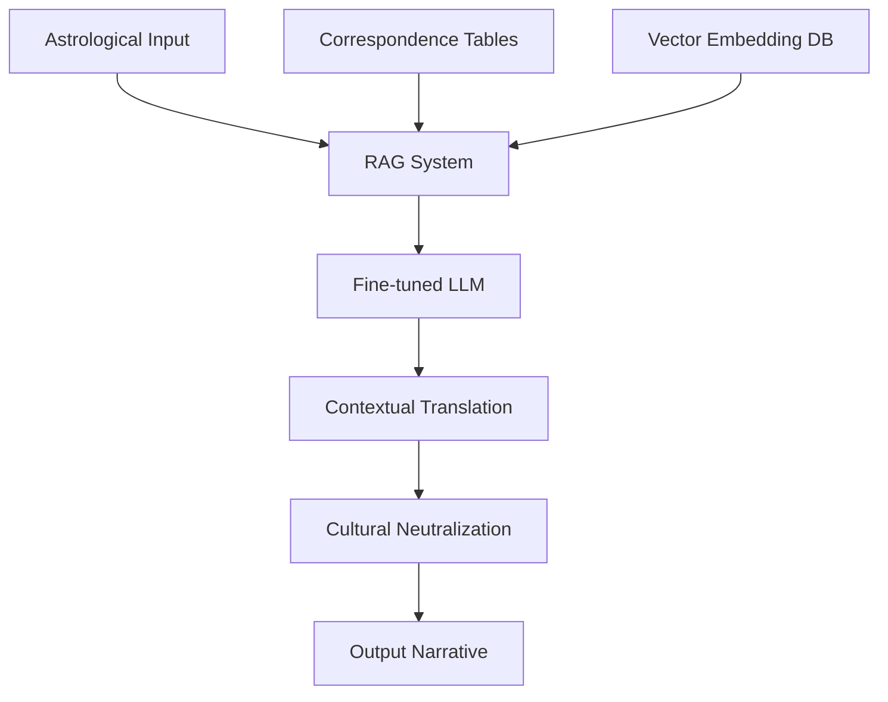
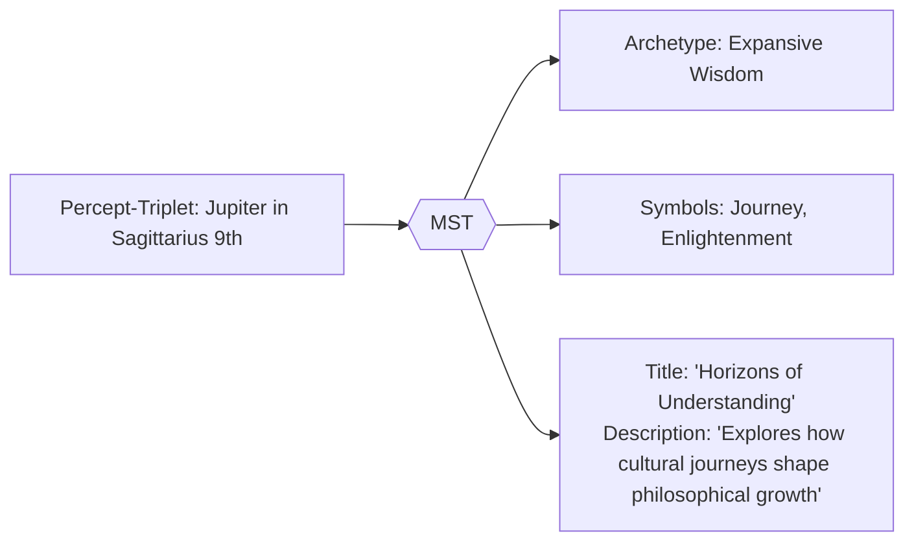

# 2.5. Symbolic Translation System (MST)  

## Introduction

The **Memorativa Symbolic Translator (MST)** converts astrologically encoded percept-triplets into universal symbolic language while preserving conceptual relationships. This enables non-astrological analysis of prototypes and percepts. The MST leverages generative AI to create dynamic English language narratives and analyses based on the percept-triplets and prototypes. Other Memorativa systems, including the symbolic Lens system will handle further translations into other symbolic systems across cultures and time.

## Main Content

### Knowledge Foundation

The MST draws upon existing Western astrological literature, symbolic systems, and correspondence tables that have been developed over centuries. Rather than creating new symbolic relationships from scratch, Memorativa leverages this established body of knowledge through contemporary computational methods.

#### Key Reference Works

1. **Classical Astrological References**:
   - Robert Hand's "Planets in Transit" (1976) - Definitive work on planetary transit interpretations
   - Liz Greene's "Saturn: A New Look at an Old Devil" (1976) - Foundational psychological astrology
   - Dane Rudhyar's "The Astrology of Personality" (1936) - Humanistic astrology principles
   - Nicholas Campion's "Book of World Horoscopes" - Historical contextual framework
   - Stephen Arroyo's "Astrology, Psychology and the Four Elements" - Elemental psychology

2. **Symbolic Correspondence Systems**:
   - Israel Regardie's "A Garden of Pomegranates" - Kabbalistic correspondences
   - Aleister Crowley's "777 and Other Qabalistic Writings" - Comprehensive tables linking systems
   - Manly P. Hall's "Secret Teachings of All Ages" - Comparative symbolism across traditions
   - Frances Yates' "The Art of Memory" - Historical memory systems and symbolic associations

3. **Modern Psychological Frameworks**:
   - Richard Tarnas's "Cosmos and Psyche" - Archetypal cosmology frameworks
   - James Hillman's "Re-Visioning Psychology" - Archetypal psychology principles
   - C.G. Jung's "Aion" - Structures of the collective unconscious 
   - Joseph Campbell's "Hero with a Thousand Faces" - Universal mythic patterns

### Technical Implementation

The MST implements its symbolic translation through a hybrid system combining:


*Figure 1: MST Translation Workflow, showing the process path from percept-triplet input through translation stages to symbolic output, illustrating the multi-stage transformation process*

#### Retrieval-Augmented Generation

1. **Vector Database**:
   - Corpus of astrological texts encoded into vector embeddings
   - Indexed by symbolic meaning, archetypal expression, and contextual application
   - Hierarchical clustering based on planetary, zodiacal, and house associations
   - Relevance scoring using cosine similarity between input triplet and corpus embeddings

2. **Correspondence Tables**:
   - Structured JSON data extracted from sources like Crowley's 777
   - Example: Planet-to-archetype mappings from Hand and Greene
   - Sign-to-quality relationships from Rudhyar and Arroyo
   - House-to-domain correspondences from various classical texts
   - Hard-coded correspondence tables extracted using NLP from the corpus of Hand, Greene, and other authors
   - Bidirectional mapping between astrological symbols and universal concepts

3. **Generation Mechanism**:
   - Fine-tuned LLM with specialized knowledge of symbolic systems
   - Pattern-matching algorithms for cross-referencing symbolic equivalents
   - Template-based generation for consistency in output formatting
   - Calibration system that adjusts interpretative weight based on Glass Bead context

### Operational Costs

Each MST operation consumes Gas Bead Tokens (GBT) according to specific computational demands:

| Operation | GBT Cost | Description |
|-----------|----------|-------------|
| Full Translation | 15-20 GBT | Complete conversion of percept-triplet to symbolic language with full context |
| Cultural Calibration | 10-15 GBT | Adjustment of symbolic references across multiple cultural frameworks |
| Archetype Extraction | 7-12 GBT | Identification of universal concepts from astrological symbols |
| Context Bridging | 5-8 GBT | Maintaining relationship integrity between original and translated elements |
| Basic Lookup | 2-4 GBT | Simple correspondence table access without contextual processing |

These costs align with the Core Game operations defined in [Section 2.2](memorativa-2-2-the-core-game.md):
- Full Translation is comparable to Focus Space Creation (10-15 GBT)
- Archetype Extraction is similar to Percept Creation (5-10 GBT)
- Context Bridging aligns with Vector Modification (3-7 GBT)
- Basic Lookup corresponds to simple Spatial Queries (2-5 GBT)

The token economics follow these principles:
- **Complexity-Based Pricing**: Operations requiring more complex processing and context-awareness cost proportionally more
- **Cross-Cultural Value**: Higher costs for operations that bridge multiple cultural symbolic systems
- **Usage Optimization**: Incentives for batching related translations to reduce system load
- **AI Resource Management**: Costs reflect computational resources required for different levels of AI inference
- **Knowledge Contribution**: Reduced costs for translations that contribute to the shared knowledge corpus

Additionally, users can earn GBT through:
- Contributing high-quality symbolic translations (8-12 GBT)
- Enhancing cross-cultural correspondence tables (5-10 GBT)
- Validating symbolic translations (1-3 GBT)

### Key functions

1. **Archetype Abstraction**  
   - Translates planetary positions → universal concepts (Saturn → "Boundaries")  
   - Converts astrological houses → conceptual domains (4th House → "Rootedness")  
   - Uses generative AI to create contextually rich descriptions of archetypes and their relationships.

2. **Cross-Cultural Mapping**  
   - Identifies equivalent symbols across traditions (Mercury ≈ Hermes ≈ Thoth)  
   - Ensures cultural neutrality in title-description pairs  
   - Leverages generative AI to generate English language narratives and analyses.
   - Cross-cultural framework includes non-Western symbolic systems
   - Integrated with the broader Lens system for multi-cultural symbolic translations

3. **Contextual Bridging**  
   - Maintains semantic relationships between original and translated elements  
   - Example: "Moon in Cancer 4th" → "Nurturing Foundations"  
   - Uses generative AI to create dynamic narratives that bridge symbolic and conceptual contexts.

### Sample Correspondence Tables

#### Planetary Archetypes (derived from Hand, Greene, Rudhyar)

| Planet  | Primary Archetype | Secondary Archetype | Tertiary Archetype |
|---------|-------------------|---------------------|---------------------|
| Sun     | Identity          | Vitality            | Leadership          |
| Moon    | Emotion           | Nurturance          | Memory              |
| Mercury | Communication     | Analysis            | Connection          |
| Venus   | Value             | Harmony             | Attraction          |
| Mars    | Action            | Energy              | Assertion           |
| Jupiter | Expansion         | Wisdom              | Opportunity         |
| Saturn  | Structure         | Limitation          | Time                |
| Uranus  | Innovation        | Freedom             | Disruption          |
| Neptune | Imagination       | Dissolution         | Unity               |
| Pluto   | Transformation    | Power               | Rebirth             |

#### Sign Expressions (derived from Arroyo, Rudhyar)

| Sign       | Element | Mode      | Primary Expression | Secondary Expression |
|------------|---------|-----------|-------------------|----------------------|
| Aries      | Fire    | Cardinal  | Initiative        | Courage              |
| Taurus     | Earth   | Fixed     | Stability         | Manifestation        |
| Gemini     | Air     | Mutable   | Communication     | Adaptability         |
| Cancer     | Water   | Cardinal  | Nurturing         | Protection           |
| Leo        | Fire    | Fixed     | Self-expression   | Creativity           |
| Virgo      | Earth   | Mutable   | Discernment       | Service              |
| Libra      | Air     | Cardinal  | Balance           | Relationship         |
| Scorpio    | Water   | Fixed     | Intensity         | Transformation       |
| Sagittarius| Fire    | Mutable   | Exploration       | Meaning              |
| Capricorn  | Earth   | Cardinal  | Achievement       | Structure            |
| Aquarius   | Air     | Fixed     | Innovation        | Community            |
| Pisces     | Water   | Mutable   | Dissolution       | Compassion           |

#### House Domains (from traditional and psychological astrology)

| House | Traditional Domain | Psychological Domain | Modern Application |
|-------|-------------------|---------------------|-------------------|
| 1st   | Self              | Identity            | Personal projection |
| 2nd   | Possessions       | Values              | Resource management |
| 3rd   | Communication     | Learning            | Information processing |
| 4th   | Home              | Foundations         | Emotional security |
| 5th   | Creativity        | Self-expression     | Creative outlets |
| 6th   | Service           | Work                | Daily routines |
| 7th   | Partnerships      | Relationship        | Significant others |
| 8th   | Shared resources  | Transformation      | Deep psychological change |
| 9th   | Higher knowledge  | Meaning             | Belief systems |
| 10th  | Career            | Purpose             | Social contribution |
| 11th  | Friends           | Community           | Collective identity |
| 12th  | Unconscious       | Transcendence       | Spiritual connection |

### Translation Process Example

For Jupiter in Sagittarius in 9th House:

1. **Input Deconstruction**:
   - Archetype: Jupiter (Expansion, Wisdom)
   - Expression: Sagittarius (Exploration, Meaning)
   - Context: 9th House (Higher knowledge, Belief systems)

2. **Correspondence Lookup**:
   - From Hand: "Expansion of philosophical understanding"
   - From Greene: "Growth through seeking truth"
   - From Rudhyar: "Abundance in visionary understanding"

3. **Cultural Neutralization**:
   - Remove explicit astrological terminology
   - Abstract into universal conceptual language
   - Validate against multiple cultural frameworks

4. **Output Generation**:
   - Title: "Horizons of Understanding"
   - Description: "Explores how cultural journeys shape philosophical growth"

### Implementation

- **Architecture**: Hybrid system combining:  
  - Fine-tuned LLM (cultural/archetypal knowledge)  
  - Symbolic pattern matcher (mythological cross-references)  
- **Training Data**:  
  - Corpus of books on mythology, symbols, astrology, esoteric traditions, mathematics, and philosophy  
- **Output Rules**:  
  - Strict prohibition of astrological terms  
  - Mandatory grounding in 3+ cultural references  

### Workflow example


*Figure 2: Example Translation Process, demonstrating the transformation from astrological percept-triplet to culturally neutral symbolic representation, showing how archetypal concepts are preserved while terminology is generalized*

## Key Points

- The MST converts astrologically encoded percept-triplets into culturally-neutral symbolic language while preserving semantic relationships and conceptual meaning [1]
- The system leverages existing Western astrological literature through structured correspondence tables derived from Hand, Greene, Rudhyar, and others, rather than inventing new symbolic systems [2,3]
- A hybrid architecture combines retrieval-augmented generation with fine-tuned LLM capabilities, enabling context-aware symbolic translations [4]
- Bidirectional mapping between astrological symbols and universal concepts ensures that the geometric properties of the percept-triplet space are maintained in translation [5]
- The cultural neutralization process transforms astrological terminology into universally accessible symbolic language while preserving the conceptual relationships [6]
- The system generates dynamic English language narratives and analyses that bridge symbolic contexts while maintaining strict separation from astrological terminology [7]
- Integration with the broader Lens system enables translations into multiple cultural symbolic frameworks beyond Western traditions [8]

## Key Math

- **Similarity Scoring**: For determining relevant correspondences from the reference corpus:
  ```
  sim(q, d) = cosine(V(q), V(d)) = (V(q) · V(d)) / (|V(q)| · |V(d)|)
  ```
  where V(q) is the vector representation of the query percept-triplet and V(d) is the vector representation of a corpus document.

- **Cultural Neutralization Function**: For transforming astrological concepts to neutral language:
  ```
  N(c) = ∑(w_i · T_i(c)) - λ · A(c)
  ```
  where T_i are transformation functions, w_i are weights, A(c) is the astrological specificity of concept c, and λ is the penalization factor.

- **Context-Sensitive Translation**: For determining the appropriate translation based on context:
  ```
  T(p, c) = argmax_t [S(t, p) · W(t, c)]
  ```
  where p is the percept, c is the context, S(t, p) is the semantic fit of translation t to percept p, and W(t, c) is the contextual weight of translation t in context c.

- **Correspondence Confidence**: For measuring the reliability of a translation:
  ```
  C(t) = (f(t) · α + r(t) · β) / (α + β)
  ```
  where f(t) is the frequency of the translation in reference works, r(t) is the consistency of relationships preserved, and α and β are weighting factors.

- **Vector Space Operations**: For processing within the hybrid spherical-hyperbolic geometry:
  ```
  V(triplet) = (θ, φ, r, κ)
  ```
  where θ and φ are angular coordinates, r is the radial component, and κ is the curvature parameter, as referenced in the coordinate system described in Section 2.23.

## Code Examples

### Correspondence Table Extraction

```python
def extract_correspondence_tables(corpus_texts, sources):
    """
    Extracts structured correspondence tables from astrological reference works.
    
    Args:
        corpus_texts: List of text documents from reference works
        sources: Metadata about the sources
        
    Returns:
        Dictionary of correspondence tables by category
    """
    correspondence_tables = {
        "planetary_archetypes": {},
        "sign_expressions": {},
        "house_domains": {}
    }
    
    # NLP pipeline for structured extraction
    nlp = spacy.load("en_core_web_lg")
    
    # Create planet detector patterns
    planet_patterns = [{"LOWER": p} for p in ["sun", "moon", "mercury", "venus", "mars", 
                                              "jupiter", "saturn", "uranus", "neptune", "pluto"]]
    
    for text, source in zip(corpus_texts, sources):
        doc = nlp(text)
        
        # Extract planetary correspondences
        for planet_match in get_matches(doc, planet_patterns):
            planet = planet_match.text.lower()
            
            # Find archetypal descriptions in context
            context = get_sentence_context(planet_match, window=3)
            archetypes = extract_archetypes(context)
            
            # Add to correspondence table with source
            if planet not in correspondence_tables["planetary_archetypes"]:
                correspondence_tables["planetary_archetypes"][planet] = {
                    "primary": [],
                    "secondary": [],
                    "tertiary": [],
                    "sources": []
                }
                
            update_archetype_entries(
                correspondence_tables["planetary_archetypes"][planet],
                archetypes,
                source
            )
    
    # Similar extraction for signs and houses
    # ...
    
    return normalize_correspondence_tables(correspondence_tables)
```

### Cultural Neutralization Process

```typescript
class CulturalNeutralizer {
    private astroTermDetector: RegexPatternMatcher;
    private culturalEquivalents: Map<string, string[]>;
    private vectorDb: VectorDatabase;
    
    constructor(
        private config: NeutralizerConfig,
        private embedder: TextEmbedder
    ) {
        this.astroTermDetector = new RegexPatternMatcher(ASTROLOGICAL_TERM_PATTERNS);
        this.culturalEquivalents = this.loadEquivalentsTable();
        this.vectorDb = new VectorDatabase(config.vectorDbConfig);
    }
    
    public neutralize(input: PerceptTriplet): NeutralizedOutput {
        // Step 1: Extract core meaning vectors
        const meaningVectors = this.extractMeaningVectors(input);
        
        // Step 2: Find cultural equivalents
        const equivalents = this.findEquivalents(input);
        
        // Step 3: Generate neutral language
        const neutralText = this.generateNeutralLanguage(
            meaningVectors,
            equivalents
        );
        
        // Step 4: Validate with multiple cultural frameworks
        const validationScore = this.validateAcrossCultures(neutralText);
        
        // Step 5: Create title-description pair
        return {
            title: this.generateTitle(neutralText),
            description: this.generateDescription(neutralText),
            culturalReferences: this.extractCulturalReferences(equivalents),
            validationScore
        };
    }
    
    private extractMeaningVectors(input: PerceptTriplet): MeaningVector[] {
        // Extract archetypal, expression, and contextual meaning vectors
        const archetype = this.embedder.embed(
            this.getArchetypeMeaning(input.planet)
        );
        
        const expression = this.embedder.embed(
            this.getExpressionMeaning(input.sign)
        );
        
        const context = this.embedder.embed(
            this.getContextMeaning(input.house)
        );
        
        return [
            { type: 'archetype', vector: archetype },
            { type: 'expression', vector: expression },
            { type: 'context', vector: context }
        ];
    }
    
    // Additional implementation methods...
}
```

## Key Visual Insights

- The MST Translation Workflow diagram (Figure 1) visualizes the complete pipeline from astrological input to neutral symbolic output, highlighting how the RAG system integrates with both data sources and generative AI
- The Example Translation Process (Figure 2) demonstrates the practical transformation of a specific percept-triplet (Jupiter in Sagittarius 9th), showing how core conceptual meaning is preserved while terminology is neutralized
- The correspondence tables present a structured mapping of the symbolic relationships between planetary archetypes, sign expressions, and house domains, illustrating the richness of the knowledge foundation
- These visualizations collectively reveal how the MST bridges the gap between the geometric precision of the percept-triplet encoding system (using Archetypal/What, Expression/How, and Mundane/Where vectors) and the narrative accessibility needed for human understanding

## See Also

- [Section 2.4: The Percept-Triplet](memorativa-2-4-the-percept-triplet.md) — Defines the three-dimensional encoding system that the MST translates into universal symbolic language
- [Section 2.6: Generative AI](memorativa-2-6-generative-ai.md) — Explores the AI models that power the MST's narrative generation capabilities
- [Section 2.12: Focus Spaces](memorativa-2-12-focus-spaces.md) — Explains how translated symbols are organized in conceptual workspaces
- [Section 2.13: Lens System](memorativa-2-13-lens-system.md) — Details further symbolic transformations across cultural frameworks
- [Section 2.21: LLM Integration](memorativa-2-21-llm-integration.md) — Provides technical details on language model integration with the MST

## Citations

- [1] Hand, R. (1976). *Planets in Transit*. Whitford Press.
- [2] Greene, L. (1976). *Saturn: A New Look at an Old Devil*. Samuel Weiser.
- [3] Rudhyar, D. (1936). *The Astrology of Personality*. Lucis Publishing.
- [4] Lewis, M., et al. (2020). "Retrieval-Augmented Generation for Knowledge-Intensive NLP Tasks." *Advances in Neural Information Processing Systems*, 33, 9459-9474.
- [5] Crowley, A. (1977). *777 and Other Qabalistic Writings*. Red Wheel/Weiser.
- [6] Gärdenfors, P. (2000). *Conceptual Spaces: The Geometry of Thought*. MIT Press.
- [7] Hillman, J. (1975). *Re-Visioning Psychology*. Harper & Row.
- [8] Campbell, J. (1949). *The Hero with a Thousand Faces*. Pantheon Books.