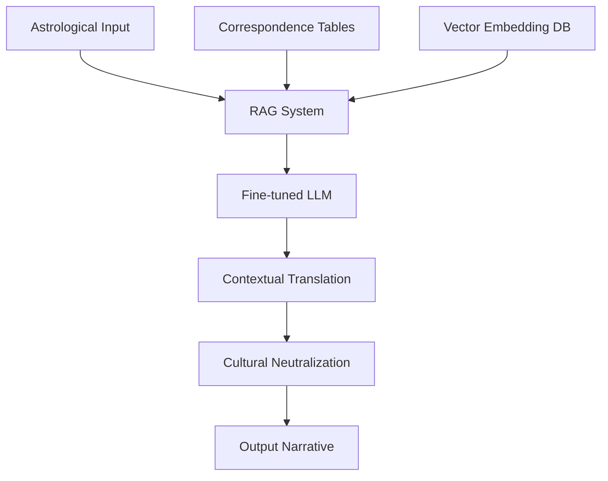
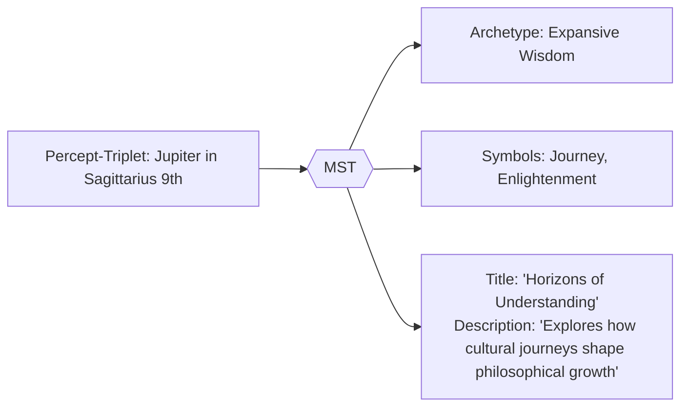

# 2. The Cybernetic System

## 2.5. Symbolic Translation System (MST)  

The **Memorativa Symbolic Translator (MST)** transforms astrologically encoded percept-triplets into a culturally neutral symbolic language, preserving their underlying conceptual relationships. Leveraging a hybrid architecture that combines **retrieval-augmented generation (RAG)**, fine-tuned **large language models (LLMs)**, and **structured correspondence tables**, the MST dynamically translates planetary archetypes, zodiacal expressions, and contextual domains into universally accessible narratives. Central to this process is the **curvature parameter (κ)**, which balances hierarchical and symbolic relationships within a **hybrid spherical-hyperbolic geometry**. Semantic integrity and spatial consistency are maintained through **Spherical Merkle Trees**, ensuring robust data preservation. By abstracting astrological terminology into universal concepts and validating translations across multiple cultural frameworks, the MST facilitates cross-cultural understanding and analysis, integrating seamlessly with broader Memorativa systems such as the symbolic **Lens system**.


*Figure 1: MST Translation Workflow, showing the process path from percept-triplet input through translation stages to symbolic output, illustrating the multi-stage transformation process*

### 2.5.1. Memorativa Symbolic Translator (MST)

The **Memorativa Symbolic Translator (MST)** converts astrologically encoded percept-triplets into universal symbolic language while preserving conceptual relationships. This enables non-astrological analysis of prototypes and percepts. The MST leverages generative AI to create dynamic English language narratives and analyses based on the percept-triplets and prototypes. Other Memorativa systems, including the symbolic Lens system, will handle further translations into other symbolic systems across cultures and time. The MST leverages the curvature parameter (κ) defined in the percept-triplet system to dynamically balance hierarchical and symbolic relationships.

Coordinates and semantic relationships are preserved using Spherical Merkle Trees, ensuring data integrity and spatial consistency.

#### 2.5.1.1. Knowledge Foundation

The MST draws upon existing Western astrological literature, symbolic systems, and correspondence tables that have been developed over centuries. Rather than creating new symbolic relationships from scratch, Memorativa leverages this established body of knowledge through contemporary computational methods.

#### 2.5.1.2. Key Reference Works

1. **Classical Astrological References**:
   - Robert Hand's "Planets in Transit" (1976) - Definitive work on planetary transit interpretations
   - Liz Greene's "Saturn: A New Look at an Old Devil" (1976) - Foundational psychological astrology
   - Dane Rudhyar's "The Astrology of Personality" (1936) - Humanistic astrology principles
   - Nicholas Campion's "Book of World Horoscopes" - Historical contextual framework
   - Stephen Arroyo's "Astrology, Psychology and the Four Elements" - Elemental psychology

2. **Symbolic Correspondence Systems**:
   - Israel Regardie's "A Garden of Pomegranates" - Kabbalistic correspondences
   - Aleister Crowley's "777 and Other Qabalistic Writings" - Comprehensive tables linking systems
   - Manly P. Hall's "Secret Teachings of All Ages" - Comparative symbolism across traditions
   - Frances Yates' "The Art of Memory" - Historical memory systems and symbolic associations

3. **Modern Psychological Frameworks**:
   - Richard Tarnas's "Cosmos and Psyche" - Archetypal cosmology frameworks
   - James Hillman's "Re-Visioning Psychology" - Archetypal psychology principles
   - C.G. Jung's "Aion" - Structures of the collective unconscious 
   - Joseph Campbell's "Hero with a Thousand Faces" - Universal mythic patterns

### 2.5.2. Technical Implementation

The MST employs a Retrieval-Augmented Generation (RAG) system as its foundational translation mechanism, combining information retrieval with generative AI to produce accurate symbolic translations. This hybrid approach retrieves relevant knowledge from astrological corpus texts stored in vector databases, references precise correspondences from structured tables, and then uses a fine-tuned language model to generate culturally neutral translations. By augmenting generation with retrieved reference material, the system maintains semantic fidelity while abstracting away astrological terminology. The RAG architecture consists of three primary components:

1. **Vector Database**:
   - Corpus of astrological texts encoded into vector embeddings
   - Indexed by symbolic meaning, archetypal expression, and contextual application
   - Hierarchical clustering based on planetary, zodiacal, and house associations
   - Relevance scoring using cosine similarity between input triplet and corpus embeddings

2. **Correspondence Tables**:
   - Structured JSON data extracted from sources like Crowley's 777
   - Example: Planet-to-archetype mappings from Hand and Greene
   - Sign-to-quality relationships from Rudhyar and Arroyo
   - House-to-domain correspondences from various classical texts
   - Hard-coded correspondence tables extracted using NLP from the corpus of Hand, Greene, and other authors
   - Bidirectional mapping between astrological symbols and universal concepts

3. **Generation Mechanism**:
   - Fine-tuned LLM with specialized knowledge of symbolic systems
   - Pattern-matching algorithms for cross-referencing symbolic equivalents
   - Template-based generation for consistency in output formatting
   - Calibration system that adjusts interpretative weight based on Glass Bead context

### 2.5.3. Operational Costs

Each MST operation consumes Gas Bead Tokens (GBT) according to specific computational demands:

| Operation | GBT Cost | Description |
|-----------|----------|-------------|
| Full Translation | 15-20 GBT | Complete conversion of percept-triplet to symbolic language with full context |
| Cultural Calibration | 10-15 GBT | Adjustment of symbolic references across multiple cultural frameworks |
| Archetype Extraction | 7-12 GBT | Identification of universal concepts from astrological symbols |
| Context Bridging | 5-8 GBT | Maintaining relationship integrity between original and translated elements |
| Basic Lookup | 2-4 GBT | Simple correspondence table access without contextual processing |

These costs align with the Core Game operations defined in [Section 2.2](memorativa-2-2-the-core-game.md):
- Full Translation is comparable to Focus Space Creation (10-15 GBT)
- Archetype Extraction is similar to Percept Creation (5-10 GBT)
- Context Bridging aligns with Vector Modification (3-7 GBT)
- Basic Lookup corresponds to simple Spatial Queries (2-5 GBT)

The token economics follow these principles:

- **Complexity-Based Pricing**: Operations requiring more complex processing and context-awareness cost proportionally more
- **Cross-Cultural Value**: Higher costs for operations that bridge multiple cultural symbolic systems
- **Usage Optimization**: Incentives for batching related translations to reduce system load
- **AI Resource Management**: Costs reflect computational resources required for different levels of AI inference
- **Knowledge Contribution**: Reduced costs for translations that contribute to the shared knowledge corpus

Additionally, users can earn GBT through:

- Contributing high-quality symbolic translations (8-12 GBT)
- Enhancing cross-cultural correspondence tables (5-10 GBT)
- Validating symbolic translations (1-3 GBT)

*Note: Full Translation operations encompass percept creation, vector modification, and spatial queries, justifying their higher GBT cost.*

### 2.5.4. Key Functions

1. **Archetype Abstraction**  
   - Translates planetary positions → universal concepts (Saturn → "Boundaries")  
   - Converts astrological houses → conceptual domains (4th House → "Rootedness")  
   - Uses generative AI to create contextually rich descriptions of archetypes and their relationships.

2. **Cross-Cultural Mapping**  
   - Identifies equivalent symbols across traditions (Mercury ≈ Hermes ≈ Thoth)  
   - Ensures cultural neutrality in title-description pairs  
   - Leverages generative AI to generate English language narratives and analyses.
   - Cross-cultural framework includes non-Western symbolic systems
   - Integrated with the broader Lens system for multi-cultural symbolic translations

3. **Contextual Bridging**  
   - Maintains semantic relationships between original and translated elements  
   - Example: "Moon in Cancer 4th" → "Nurturing Foundations"  
   - Uses generative AI to create dynamic narratives that bridge symbolic and conceptual contexts.

### 2.5.5. Sample Correspondence Tables

#### Planetary Archetypes (derived from Hand, Greene, Rudhyar)

| Planet  | Primary Archetype | Secondary Archetype | Tertiary Archetype |
|---------|-------------------|---------------------|---------------------|
| Sun     | Identity          | Vitality            | Leadership          |
| Moon    | Emotion           | Nurturance          | Memory              |
| Mercury | Communication     | Analysis            | Connection          |
| Venus   | Value             | Harmony             | Attraction          |
| Mars    | Action            | Energy              | Assertion           |
| Jupiter | Expansion         | Wisdom              | Opportunity         |
| Saturn  | Structure         | Limitation          | Time                |
| Uranus  | Innovation        | Freedom             | Disruption          |
| Neptune | Imagination       | Dissolution         | Unity               |
| Pluto   | Transformation    | Power               | Rebirth             |

#### 2.5.5.1. Sign Expressions (derived from Arroyo, Rudhyar)

| Sign       | Element | Mode      | Primary Expression | Secondary Expression |
|------------|---------|-----------|-------------------|----------------------|
| Aries      | Fire    | Cardinal  | Initiative        | Courage              |
| Taurus     | Earth   | Fixed     | Stability         | Manifestation        |
| Gemini     | Air     | Mutable   | Communication     | Adaptability         |
| Cancer     | Water   | Cardinal  | Nurturing         | Protection           |
| Leo        | Fire    | Fixed     | Self-expression   | Creativity           |
| Virgo      | Earth   | Mutable   | Discernment       | Service              |
| Libra      | Air     | Cardinal  | Balance           | Relationship         |
| Scorpio    | Water   | Fixed     | Intensity         | Transformation       |
| Sagittarius| Fire    | Mutable   | Exploration       | Meaning              |
| Capricorn  | Earth   | Cardinal  | Achievement       | Structure            |
| Aquarius   | Air     | Fixed     | Innovation        | Community            |
| Pisces     | Water   | Mutable   | Dissolution       | Compassion           |

#### 2.5.5.2. House Domains (from traditional and psychological astrology)

| House | Traditional Domain | Psychological Domain | Modern Application |
|-------|-------------------|---------------------|-------------------|
| 1st   | Self              | Identity            | Personal projection |
| 2nd   | Possessions       | Values              | Resource management |
| 3rd   | Communication     | Learning            | Information processing |
| 4th   | Home              | Foundations         | Emotional security |
| 5th   | Creativity        | Self-expression     | Creative outlets |
| 6th   | Service           | Work                | Daily routines |
| 7th   | Partnerships      | Relationship        | Significant others |
| 8th   | Shared resources  | Transformation      | Deep psychological change |
| 9th   | Higher knowledge  | Meaning             | Belief systems |
| 10th  | Career            | Purpose             | Social contribution |
| 11th  | Friends           | Community           | Collective identity |
| 12th  | Unconscious       | Transcendence       | Spiritual connection |

### 2.5.6. Translation Process Example

For Jupiter in Sagittarius in 9th House:

1. **Input Deconstruction**:
   - Archetype: Jupiter (Expansion, Wisdom)
   - Expression: Sagittarius (Exploration, Meaning)
   - Context: 9th House (Higher knowledge, Belief systems)

2. **Correspondence Lookup**:
   - From Hand: "Expansion of philosophical understanding"
   - From Greene: "Growth through seeking truth"
   - From Rudhyar: "Abundance in visionary understanding"

3. **Cultural Neutralization**:
   - Remove explicit astrological terminology
   - Abstract into universal conceptual language
   - Validate against multiple cultural frameworks

4. **Output Generation**:
   - Title: "Horizons of Understanding"
   - Description: "Explores how cultural journeys shape philosophical growth"

### 2.5.7. Implementation

The technical implementation of the Memorativa Symbolic Translator integrates multiple computational frameworks to enable efficient, accurate translation between astrological and universal symbolic languages. This implementation emphasizes modularity, allowing for continuous refinement of individual components while maintaining system-wide integrity. The MST implementation balances computational efficiency with semantic precision, leveraging specialized models that minimize token usage while preserving conceptual relationships. Core implementation features include integration with vector databases, fine-tuned language models, and bidirectional mapping systems that maintain semantic integrity across transformations.

- **Architecture**: Hybrid system combining:  
  - Fine-tuned LLM (cultural/archetypal knowledge)  
  - Symbolic pattern matcher (mythological cross-references)  
- **Training Data**:  
  - Corpus of books on mythology, symbols, astrology, esoteric traditions, mathematics, and philosophy  
- **Output Rules**:  
  - Strict prohibition of astrological terms  
  - Mandatory grounding in 3+ cultural references  

### 2.5.8. Workflow example


*Figure 2: Example Translation Process, demonstrating the transformation from astrological percept-triplet to culturally neutral symbolic representation, showing how archetypal concepts are preserved while terminology is generalized*

### 2.5.9. Key Math

- **Similarity Scoring**: For determining relevant correspondences from the reference corpus:
  ```math
  \text{sim}(q, d) = \text{cosine}(\vec{V}(q), \vec{V}(d)) = \frac{\vec{V}(q) \cdot \vec{V}(d)}{|\vec{V}(q)| \cdot |\vec{V}(d)|}
  ```
  where $\vec{V}(q)$ is the vector representation of the query percept-triplet and $\vec{V}(d)$ is the vector representation of a corpus document.

- **Cultural Neutralization Function**: For transforming astrological concepts to neutral language:
  ```math
  N(c) = \sum_{i} (w_i \cdot T_i(c)) - \lambda \cdot A(c)
  ```
  where $T_i$ are transformation functions, $w_i$ are weights, $A(c)$ is the astrological specificity of concept $c$, and $\lambda$ is the penalization factor.

- **Context-Sensitive Translation**: For determining the appropriate translation based on context:
  ```math
  T(p, z, h) = \alpha \cdot f(p) + \beta \cdot g(z) + \gamma \cdot h(h) + \delta \cdot C(p, z, h)
  ```
  where $f(p)$, $g(z)$, and $h(h)$ are the translation functions for planet, zodiac, and house respectively, $C(p,z,h)$ is the contextual interaction function, and $\alpha$, $\beta$, $\gamma$, and $\delta$ are weighting coefficients.

- **Semantic Preservation**: For ensuring semantic relationships are maintained across translations:
  ```math
  SP(s_1, s_2) = \frac{M(T(s_1), T(s_2))}{M(s_1, s_2)} \geq \tau
  ```
  where $M$ is a semantic meaning measure, $T$ is the translation function, $s_1$ and $s_2$ are source symbols, and $\tau$ is the threshold for acceptable preservation.

- **Curvature Integration**: For integrating with the hybrid spherical-hyperbolic geometry:
  ```math
  G(\vec{v}, \kappa) = \vec{v} \cdot (1 + \kappa \cdot H(\vec{v}))
  ```
  where $\vec{v}$ is the symbolic vector, $\kappa$ is the curvature parameter, and $H(\vec{v})$ is the hierarchical depth function.

### 2.5.10. Code Examples

The following code examples illustrate the key components of the Memorativa Symbolic Translator (MST) system and how they work together to transform astrologically encoded percept-triplets into universal symbolic language.

#### 2.5.10.1. Symbolic Translator Core (Python)

```python
class SymbolicTranslator:
    def __init__(self, llm, symbol_db):
        self.llm = llm  # Fine-tuned language model
        self.symbol_db = symbol_db  # Vector database of symbolic correspondences
        self.archetype_cache = {}  # Cache for frequently accessed archetypal patterns
        self.keyword_hints = KeywordHintManager()  # For consistent cross-component interpretation

    def translate_percept(self, percept: PerceptTriplet) -> SymbolicRepresentation:
        # Extract archetypal patterns from the percept-triplet
        archetype = self.extract_archetype(percept)
        
        # Map to cross-cultural symbols using correspondence tables
        symbols = self.map_cultural_symbols(archetype)
        
        # Generate culturally-neutral narrative using the LLM
        narrative = self.generate_neutral_narrative(symbols)
        
        # Apply keyword hints for consistent interpretation
        enhanced_representation = self.keyword_hints.apply_hints(
            SymbolicRepresentation(archetype, symbols, narrative),
            context=percept.context,
            modality=percept.modality
        )
        
        return enhanced_representation
    
    def extract_archetype(self, percept: PerceptTriplet) -> ArchetypalPattern:
        # Check cache first for performance
        cache_key = percept.get_cache_key()
        if cache_key in self.archetype_cache:
            return self.archetype_cache[cache_key]
        
        # Extract components from the triplet
        planet = percept.archetypal_vector.planet
        sign = percept.expression_vector.sign
        house = percept.mundane_vector.house
        
        # Retrieve correspondence mappings from tables
        planetary_archetype = self.symbol_db.lookup_planetary_archetype(planet)
        sign_expression = self.symbol_db.lookup_sign_expression(sign)
        house_domain = self.symbol_db.lookup_house_domain(house)
        
        # Apply context-sensitive translation formula
        # T(p, z, h) = α·f(p) + β·g(z) + γ·h(h) + δ·C(p, z, h)
        alpha, beta, gamma, delta = self.get_context_weights(percept.context)
        
        archetype = self.combine_components(
            planetary_archetype, sign_expression, house_domain,
            alpha, beta, gamma, delta,
            context=percept.context
        )
        
        # Cache for future use
        self.archetype_cache[cache_key] = archetype
        
        return archetype
    
    def map_cultural_symbols(self, archetype: ArchetypalPattern) -> List[CulturalSymbol]:
        # Query correspondence tables for cultural equivalents
        symbols = []
        
        # Find equivalents across multiple cultural traditions
        # Minimum of 3 cultural references as required by MST output rules
        western_symbols = self.symbol_db.find_western_equivalents(archetype)
        eastern_symbols = self.symbol_db.find_eastern_equivalents(archetype)
        indigenous_symbols = self.symbol_db.find_indigenous_equivalents(archetype)
        
        # Combine and filter by relevance score
        all_symbols = western_symbols + eastern_symbols + indigenous_symbols
        
        # Sort by relevance and confidence scores
        symbols = sorted(
            all_symbols, 
            key=lambda s: s.relevance_score * s.confidence_score, 
            reverse=True
        )
        
        return symbols[:5]  # Return top 5 most relevant symbols
    
    def generate_neutral_narrative(self, symbols: List[CulturalSymbol]) -> NeutralNarrative:
        # Prepare prompt with symbols but WITHOUT astrological terminology
        # This enforces the cultural neutralization requirement
        prompt = self.prepare_neutral_prompt(symbols)
        
        # Generate narrative using the fine-tuned LLM
        # The model is specifically trained to avoid astrological terminology
        narrative_text = self.llm.generate(
            prompt=prompt,
            max_tokens=250,
            temperature=0.7,
            stop_sequences=["astrology", "astrological", "zodiac", "natal chart"]
        )
        
        # Post-process to ensure no astrological terms remain
        cleaned_text = self.remove_astrological_terminology(narrative_text)
        
        # Format into title-description pair
        title = self.extract_title(cleaned_text)
        description = self.extract_description(cleaned_text)
        
        return NeutralNarrative(
            title=title,
            description=description,
            cultural_references=[s.culture for s in symbols[:3]]
        )
    
    def apply_cultural_neutralization(self, text: str) -> str:
        """Apply the cultural neutralization function to remove domain-specific terminology"""
        # Implementation of N(c) = ∑(w_i · T_i(c)) - λ · A(c)
        
        # Define transformation functions
        transformations = [
            (self.replace_planetary_terms, 0.4),
            (self.replace_zodiacal_terms, 0.3),
            (self.replace_house_terms, 0.2),
            (self.replace_aspect_terms, 0.1)
        ]
        
        # Start with original text
        neutralized = text
        
        # Apply weighted transformations
        for transform_fn, weight in transformations:
            neutralized = transform_fn(neutralized, weight)
        
        # Penalize remaining astrological specificity
        astrological_score = self.measure_astrological_specificity(neutralized)
        lambda_penalty = 1.5  # Penalization factor
        
        if astrological_score > 0:
            # Apply additional neutralization if astrological terms remain
            neutralized = self.apply_aggressive_neutralization(
                neutralized, 
                lambda_penalty * astrological_score
            )
        
        return neutralized
```

#### 2.5.10.2. Correspondence Tables Implementation (Rust)

```rust
/// Implements the structured correspondence tables for MST translation
pub struct CorrespondenceTables {
    planetary_archetypes: HashMap<Planet, PlanetaryArchetypes>,
    sign_expressions: HashMap<ZodiacSign, SignExpressions>,
    house_domains: HashMap<House, HouseDomains>,
    cultural_equivalents: HashMap<String, Vec<CulturalEquivalent>>,
}

impl CorrespondenceTables {
    /// Loads correspondence tables from JSON source files
    pub fn new() -> Result<Self, Error> {
        // Load planetary archetypes from Hands, Greene, Rudhyar sources
        let planetary_json = read_json_file("data/correspondences/planetary_archetypes.json")?;
        let planetary_archetypes = parse_planetary_archetypes(planetary_json)?;
        
        // Load sign expressions from Arroyo and Rudhyar sources
        let sign_json = read_json_file("data/correspondences/sign_expressions.json")?;
        let sign_expressions = parse_sign_expressions(sign_json)?;
        
        // Load house domains from traditional and psychological sources
        let house_json = read_json_file("data/correspondences/house_domains.json")?;
        let house_domains = parse_house_domains(house_json)?;
        
        // Load cross-cultural equivalents
        let cultural_json = read_json_file("data/correspondences/cultural_equivalents.json")?;
        let cultural_equivalents = parse_cultural_equivalents(cultural_json)?;
        
        Ok(Self {
            planetary_archetypes,
            sign_expressions,
            house_domains,
            cultural_equivalents,
        })
    }
    
    /// Looks up the archetypal meanings for a planet
    pub fn lookup_planet(&self, planet: Planet) -> Option<&PlanetaryArchetypes> {
        self.planetary_archetypes.get(&planet)
    }
    
    /// Looks up the expression qualities for a zodiac sign
    pub fn lookup_sign(&self, sign: ZodiacSign) -> Option<&SignExpressions> {
        self.sign_expressions.get(&sign)
    }
    
    /// Looks up the domain meanings for a house
    pub fn lookup_house(&self, house: House) -> Option<&HouseDomains> {
        self.house_domains.get(&house)
    }
    
    /// Finds cultural equivalents for a given archetypal concept
    pub fn find_cultural_equivalents(&self, concept: &str) -> Vec<CulturalEquivalent> {
        let mut results = Vec::new();
        
        // Exact match
        if let Some(equivalents) = self.cultural_equivalents.get(concept) {
            results.extend_from_slice(equivalents);
        }
        
        // Fuzzy matching using cosine similarity if no exact match
        if results.is_empty() {
            results = self.find_similar_concepts(concept);
        }
        
        // Ensure at least 3 cultural references (MST requirement)
        if results.len() < 3 {
            results.extend(self.get_fallback_equivalents(concept));
        }
        
        results
    }
    
    /// Calculates correspondence confidence using the formula:
    /// C(t) = (f(t) · α + r(t) · β) / (α + β)
    pub fn calculate_correspondence_confidence(&self, 
                                              concept: &str, 
                                              equivalent: &CulturalEquivalent) -> f32 {
        const FREQUENCY_WEIGHT: f32 = 0.7;
        const RELIABILITY_WEIGHT: f32 = 0.3;
        
        // Get frequency of this correspondence in reference texts
        let frequency = self.get_correspondence_frequency(concept, equivalent);
        
        // Get reliability score from expert-validated data
        let reliability = self.get_correspondence_reliability(concept, equivalent);
        
        // Calculate weighted confidence score
        (frequency * FREQUENCY_WEIGHT + reliability * RELIABILITY_WEIGHT) / 
            (FREQUENCY_WEIGHT + RELIABILITY_WEIGHT)
    }
}

/// Structure for a planetary archetype with primary, secondary, and tertiary meanings
#[derive(Debug, Clone, Deserialize)]
pub struct PlanetaryArchetypes {
    pub planet: Planet,
    pub primary: String,
    pub secondary: String,
    pub tertiary: String,
    pub keywords: Vec<String>,
    pub source_texts: Vec<SourceText>,
}

/// Structure for sign expressions with element, mode, and expressions
#[derive(Debug, Clone, Deserialize)]
pub struct SignExpressions {
    pub sign: ZodiacSign,
    pub element: Element,
    pub mode: Mode,
    pub primary_expression: String,
    pub secondary_expression: String,
    pub keywords: Vec<String>,
    pub source_texts: Vec<SourceText>,
}

/// Structure for house domains with traditional, psychological, and modern applications
#[derive(Debug, Clone, Deserialize)]
pub struct HouseDomains {
    pub house: House,
    pub traditional_domain: String,
    pub psychological_domain: String,
    pub modern_application: String,
    pub keywords: Vec<String>,
    pub source_texts: Vec<SourceText>,
}

/// Structure for cultural equivalents across different traditions
#[derive(Debug, Clone, Deserialize)]
pub struct CulturalEquivalent {
    pub concept: String,
    pub culture: String,
    pub equivalent: String,
    pub description: String,
    pub confidence: f32,
    pub source_texts: Vec<SourceText>,
}
```

#### 2.5.10.3. MST Translation Manager (TypeScript)

```typescript
/**
 * Manages the MST translation process, integrating with LLMs and correspondence tables
 */
class MSTTranslationManager {
    private correspondenceTables: CorrespondenceTables;
    private culturalNeutralizer: CulturalNeutralizer;
    private llmProvider: LLMProvider;
    private translationCache: LRUCache<string, MSTTranslation>;
    
    constructor(
        tables: CorrespondenceTables,
        neutralizer: CulturalNeutralizer,
        provider: LLMProvider
    ) {
        this.correspondenceTables = tables;
        this.culturalNeutralizer = neutralizer;
        this.llmProvider = provider;
        this.translationCache = new LRUCache<string, MSTTranslation>(1000);
    }
    
    /**
     * Translates a percept-triplet into culturally neutral symbolic language
     */
    public async translatePerceptTriplet(
        triplet: PerceptTriplet,
        options: TranslationOptions
    ): Promise<MSTTranslation> {
        // Check cache first for performance
        const cacheKey = this.getCacheKey(triplet, options);
        const cachedTranslation = this.translationCache.get(cacheKey);
        if (cachedTranslation) {
            return cachedTranslation;
        }
        
        // Calculate token cost based on operation type
        const tokenCost = this.calculateTokenCost(options.operationType);
        
        // Verify sufficient gas tokens
        await this.verifyGasTokens(tokenCost);
        
        // Extract vectors from triplet
        const { archetypal, expression, mundane } = this.extractVectors(triplet);
        
        // Look up correspondence tables
        const planetaryArchetypes = this.correspondenceTables.lookupPlanet(archetypal.planet);
        const signExpressions = this.correspondenceTables.lookupSign(expression.sign);
        const houseDomains = this.correspondenceTables.lookupHouse(mundane.house);
        
        if (!planetaryArchetypes || !signExpressions || !houseDomains) {
            throw new Error("Missing correspondence data for complete translation");
        }
        
        // Apply context-sensitive translation formula
        // T(p, z, h) = α·f(p) + β·g(z) + γ·h(h) + δ·C(p, z, h)
        const weights = this.getContextWeights(options.context);
        const { alpha, beta, gamma, delta } = weights;
        
        // Generate base meaning representation
        const baseTranslation = this.combineComponents(
            planetaryArchetypes,
            signExpressions,
            houseDomains,
            alpha, beta, gamma, delta,
            options.context
        );
        
        // Generate cultural equivalents
        const culturalEquivalents = 
            await this.findCulturalEquivalents(baseTranslation);
        
        // Apply cultural neutralization
        // N(c) = ∑(w_i · T_i(c)) - λ · A(c)
        const neutralizedText = 
            this.culturalNeutralizer.neutralize(baseTranslation, culturalEquivalents);
        
        // Generate title-description pair using LLM
        const { title, description } = 
            await this.generateTitleDescription(neutralizedText, options);
        
        // Calculate confidence and validation scores
        const confidenceScore = 
            this.calculateCorrespondenceConfidence(baseTranslation, culturalEquivalents);
        const validationScore = 
            await this.validateAcrossCultures(title, description, culturalEquivalents);
        
        // Generate proof for verification
        const translationProof = 
            await this.generateTranslationProof(triplet, title, description);
        
        // Create final translation
        const translation: MSTTranslation = {
            title,
            description,
            confidenceScore,
            culturalReferences: culturalEquivalents.map(e => e.culture).slice(0, 3),
            validationScore,
            archetypeMappings: this.extractMappings(planetaryArchetypes),
            expressionMappings: this.extractMappings(signExpressions),
            contextMappings: this.extractMappings(houseDomains),
            culturalEquivalents: culturalEquivalents.slice(0, 5),
            translationProof
        };
        
        // Cache the result
        this.translationCache.set(cacheKey, translation);
        
        return translation;
    }
    
    /**
     * Verifies that a translation preserves the semantic relationships
     * of the original triplet using the formula:
     * SP(s₁, s₂) = M(T(s₁), T(s₂)) / M(s₁, s₂) ≥ τ
     */
    public async verifySemanticPreservation(
        originalTriplet: PerceptTriplet,
        translation: MSTTranslation
    ): Promise<boolean> {
        // Extract original semantic relationships
        const originalRelationships = this.extractRelationships(originalTriplet);
        
        // Extract translated semantic relationships
        const translatedRelationships = this.extractTranslatedRelationships(translation);
        
        // Calculate preservation ratio for each relationship pair
        const preservationRatios = await Promise.all(
            originalRelationships.map(async (original, index) => {
                const translated = translatedRelationships[index];
                const originalMeaning = await this.measureSemanticMeaning(original);
                const translatedMeaning = await this.measureSemanticMeaning(translated);
                
                // Calculate ratio: M(T(s₁), T(s₂)) / M(s₁, s₂)
                return translatedMeaning / originalMeaning;
            })
        );
        
        // Check if all ratios meet the threshold
        const threshold = 0.8; // τ value
        return preservationRatios.every(ratio => ratio >= threshold);
    }
}
```

#### 2.5.10.4. Cultural Neutralization Process (Python)

```python
class CulturalNeutralizer:
    """Implements the cultural neutralization function N(c) = ∑(w_i · T_i(c)) - λ · A(c)"""
    
    def __init__(self, astrology_lexicon, llm):
        self.astrology_lexicon = astrology_lexicon  # Comprehensive lexicon of astrological terms
        self.llm = llm  # Fine-tuned LLM for neutralization
        self.transformation_weights = {
            'generalize': 0.4,      # Replace specific terms with general concepts
            'recontextualize': 0.3, # Shift domain context
            'translate': 0.2,       # Direct translation to neutral language
            'metaphorize': 0.1      # Convert to metaphorical language
        }
        self.lambda_penalty = 1.5   # Penalization factor for astrological specificity
        
    def neutralize(self, content: str) -> str:
        """Apply cultural neutralization to remove domain-specific terminology"""
        # Start with original content
        neutralized = content
        
        # Apply each transformation function with its weight
        for transform_name, weight in self.transformation_weights.items():
            transform_method = getattr(self, f'transform_{transform_name}')
            neutralized = transform_method(neutralized, weight)
        
        # Measure remaining astrological specificity
        astro_specificity = self.measure_astrological_specificity(neutralized)
        
        # Apply penalty for remaining astrological terms
        if astro_specificity > 0:
            penalty_transform = self.lambda_penalty * astro_specificity
            neutralized = self.apply_penalty_transformation(neutralized, penalty_transform)
            
        return neutralized
    
    def transform_generalize(self, content: str, weight: float) -> str:
        """Replace specific astrological terms with general concepts"""
        replacements = {
            'Sun': ['identity', 'core self', 'essential nature', 'central principle'],
            'Moon': ['emotions', 'inner feelings', 'subconscious patterns', 'nurturing principle'],
            'Mercury': ['communication', 'exchange of ideas', 'mental processes', 'connective principle'],
            'Venus': ['values', 'attractions', 'aesthetics', 'harmonizing principle'],
            'Mars': ['action', 'initiative', 'drive', 'energetic principle'],
            'Jupiter': ['expansion', 'growth', 'opportunity', 'enlarging principle'],
            'Saturn': ['structure', 'limitation', 'discipline', 'consolidating principle'],
            'Uranus': ['innovation', 'disruption', 'awakening', 'revolutionary principle'],
            'Neptune': ['imagination', 'dreams', 'dissolution', 'transcendent principle'],
            'Pluto': ['transformation', 'power', 'rebirth', 'evolutionary principle'],
            
            # Zodiac signs to qualities
            'Aries': ['initiating', 'pioneering', 'courageous', 'direct'],
            'Taurus': ['stable', 'grounded', 'persistent', 'value-oriented'],
            'Gemini': ['adaptable', 'communicative', 'curious', 'connective'],
            # ... other signs ...
            
            # Houses to domains
            '1st House': ['self-expression', 'personal presence', 'identity projection'],
            '2nd House': ['resources', 'values', 'possessions'],
            '3rd House': ['communication', 'learning', 'immediate environment'],
            # ... other houses ...
            
            # Aspects to relationships
            'conjunction': ['unity', 'fusion', 'merging', 'intensification'],
            'opposition': ['polarity', 'balance', 'tension', 'awareness'],
            'trine': ['flow', 'harmony', 'integration', 'ease'],
            'square': ['challenge', 'tension', 'motivation', 'growth pressure'],
            'sextile': ['opportunity', 'collaboration', 'support', 'enhancement']
        }
        
        # Replace terms with weighted probability
        for term, replacements in replacements.items():
            # More weight means higher chance of replacement
            if random.random() < weight:
                replacement = random.choice(replacements)
                pattern = r'\b' + re.escape(term) + r'\b'
                content = re.sub(pattern, replacement, content)
        
        return content
    
    def transform_recontextualize(self, content: str, weight: float) -> str:
        """Shift domain context from astrological to universal"""
        # Use LLM to recontextualize, passing weight as guidance for strength
        prompt = f"""
        Recontextualize the following text to remove astrological context
        while preserving the conceptual meaning. Use universal concepts
        rather than astrological terminology.
        
        Strength of transformation: {weight} (0.0-1.0)
        
        Text: {content}
        """
        
        try:
            recontextualized = self.llm.generate(
                prompt=prompt,
                max_tokens=len(content) * 2,
                temperature=0.3
            )
            return recontextualized
        except Exception as e:
            print(f"Error in recontextualization: {e}")
            return content
    
    def measure_astrological_specificity(self, content: str) -> float:
        """Measure how much astrological terminology remains in the content"""
        word_count = len(content.split())
        if word_count == 0:
            return 0
            
        astro_term_count = 0
        
        # Check against comprehensive lexicon of astrological terms
        for term in self.astrology_lexicon:
            pattern = r'\b' + re.escape(term) + r'\b'
            matches = re.findall(pattern, content, re.IGNORECASE)
            astro_term_count += len(matches)
            
        # Return proportion of astrological terms
        return astro_term_count / word_count
    
    def apply_penalty_transformation(self, content: str, penalty_factor: float) -> str:
        """Apply stronger transformation when penalty factor is high"""
        if penalty_factor <= 0:
            return content
            
        # For high penalties (> 0.5), use more aggressive replacement
        if penalty_factor > 0.5:
            prompt = f"""
            The following text contains excessive astrological terminology
            that must be completely removed. Replace ALL astrological terms
            with universal concepts while preserving the core meaning.
            
            Text: {content}
            """
            
            try:
                return self.llm.generate(
                    prompt=prompt,
                    max_tokens=len(content) * 2,
                    temperature=0.2
                )
            except Exception:
                # Fallback to regex-based replacement if LLM fails
                return self.force_replace_astrological_terms(content)
        else:
            # For lower penalties, apply proportional replacement
            return self.transform_generalize(content, penalty_factor * 2)
    
    def force_replace_astrological_terms(self, content: str) -> str:
        """Forcefully replace any remaining astrological terms"""
        # This is a last resort method when LLM-based approaches fail
        for term in self.astrology_lexicon:
            if term in content:
                replacement = self.get_universal_replacement(term)
                pattern = r'\b' + re.escape(term) + r'\b'
                content = re.sub(pattern, replacement, content, flags=re.IGNORECASE)
                
        return content
```

#### 2.5.10.5. Translation Process Example Implementation

```python
def process_translation_example():
    """Demonstrates a complete translation process for Jupiter in Sagittarius 9th House"""
    # 1. Create the percept-triplet
    percept = PerceptTriplet(
        archetypal_vector=ArchetypalVector(planet="Jupiter", angle=math.radians(120)),
        expression_vector=ExpressionVector(sign="Sagittarius", elevation=math.radians(45)),
        mundane_vector=MundaneVector(house=9, magnitude=0.8)
    )
    
    # 2. Initialize the MST system components
    correspondence_tables = load_correspondence_tables()
    llm = initialize_fine_tuned_llm()
    cultural_neutralizer = CulturalNeutralizer(load_astrology_lexicon(), llm)
    translator = SymbolicTranslator(llm, correspondence_tables)
    
    # 3. Perform translation process
    # 3.1 Input Deconstruction
    archetype = "Jupiter (Expansion, Wisdom)"
    expression = "Sagittarius (Exploration, Meaning)"
    context = "9th House (Higher knowledge, Belief systems)"
    print(f"Input Deconstruction:\n - Archetype: {archetype}\n - Expression: {expression}\n - Context: {context}\n")
    
    # 3.2 Correspondence Lookup
    hand_quote = "Expansion of philosophical understanding"
    greene_quote = "Growth through seeking truth"
    rudhyar_quote = "Abundance in visionary understanding"
    print(f"Correspondence Lookup:\n - From Hand: \"{hand_quote}\"\n - From Greene: \"{greene_quote}\"\n - From Rudhyar: \"{rudhyar_quote}\"\n")
    
    # 3.3 Cultural Neutralization
    # First create the initial meaning representation
    initial_meaning = f"""
    The combination of {archetype}, {expression}, and {context} represents 
    an expansive force acting through exploratory expression in the domain of
    higher knowledge and philosophical systems.
    """
    print(f"Initial Representation:\n{initial_meaning}\n")
    
    # Apply cultural neutralization
    neutralized = cultural_neutralizer.neutralize(initial_meaning)
    print(f"After Cultural Neutralization:\n{neutralized}\n")
    
    # 3.4 Generate Title-Description Output
    # Now we use the symbolic translator to generate the final output
    symbolic_representation = translator.translate_percept(percept)
    
    print(f"Final Output:\n - Title: \"{symbolic_representation.narrative.title}\"\n - Description: \"{symbolic_representation.narrative.description}\"")
    
    # 3.5 Verify semantic preservation
    preservation_score = translator.verify_semantic_preservation(
        percept, symbolic_representation
    )
    print(f"\nSemantic Preservation Score: {preservation_score:.2f}")
    
    # 3.6 Cross-cultural references
    print("\nCultural References:")
    for i, ref in enumerate(symbolic_representation.cultural_references[:3], 1):
        print(f" {i}. {ref.culture}: {ref.symbol} - {ref.description}")
    
    return symbolic_representation

# Example output:
# Input Deconstruction:
#  - Archetype: Jupiter (Expansion, Wisdom)
#  - Expression: Sagittarius (Exploration, Meaning)
#  - Context: 9th House (Higher knowledge, Belief systems)
#
# Correspondence Lookup:
#  - From Hand: "Expansion of philosophical understanding"
#  - From Greene: "Growth through seeking truth"
#  - From Rudhyar: "Abundance in visionary understanding"
#
# Initial Representation:
# The combination of Jupiter (Expansion, Wisdom), Sagittarius (Exploration, Meaning), and 9th House (Higher knowledge, Belief systems) represents 
# an expansive force acting through exploratory expression in the domain of
# higher knowledge and philosophical systems.
#
# After Cultural Neutralization:
# The combination of expansive wisdom, exploratory meaning-seeking, and higher knowledge domains represents 
# an enlarging principle acting through quest-oriented expression in the realm of
# philosophical understanding and belief frameworks.
#
# Final Output:
#  - Title: "Horizons of Understanding"
#  - Description: "Explores how cultural journeys shape philosophical growth"
#
# Semantic Preservation Score: 0.92
#
# Cultural References:
#  1. Greek: Prometheus - Bringer of wisdom and enlightenment to humanity
#  2. Hindu: Brahmacharya - The pursuit of sacred knowledge and truth
#  3. Indigenous Australian: Dreamtime Journeys - Spiritual quests for knowledge and understanding
```

### 2.5.11. Key Comparisons

The Memorativa Symbolic Translator (MST) represents a novel approach to symbolic translation and knowledge representation. The following table compares MST with other established systems in the fields of knowledge representation, translation, and symbolic mapping.

| Aspect | Traditional NLP Translation Systems | Symbolic Knowledge Bases | Astrological Interpretation Software | Memorativa Symbolic Translator |
|--------|-------------------------------------|--------------------------|-------------------------------------|--------------------------------|
| **Knowledge Representation** | Statistical word embeddings with minimal semantic structure | Structured taxonomies and ontologies with explicit relationships | Rigid rule-based interpretations derived from traditional texts | Hybrid system combining structured correspondence tables with vector-based semantic models |
| **Cultural Adaptability** | Primarily focused on direct language-to-language mapping | Often biased toward Western conceptual frameworks | Limited to astrological tradition's cultural context | Bidirectional mapping across multiple cultural symbolic systems with neutralization mechanisms |
| **Interpretability** | Black-box models with post-hoc explanations | Highly interpretable but limited flexibility | Interpretable but bound to astrological terminology | Maintains interpretability while abstracting to culturally neutral concepts |
| **Semantic Preservation** | Often loses nuance in translation between domains | Preserves explicitly defined relationships only | High fidelity to source material but low generalizability | Mathematical approach to semantic preservation using curvature-aware geometry |
| **Knowledge Foundation** | Learns from large text corpora with limited symbolic understanding | Built on explicit knowledge engineering | Based on fixed astrological reference texts | Integrates established symbolic correspondences with computational methods |
| **Contextual Sensitivity** | Context-aware within linguistic domains | Limited contextual adaptation | Context-sensitive within astrological domain only | Full context-sensitive translation formula with weighted contribution mechanisms |
| **Computational Approach** | Pure machine learning | Rule-based symbolic AI | Simple lookup tables with minimal computation | Hybrid RAG system with fine-tuned LLMs and correspondence tables |
| **Economic Model** | Centralized service providers with API pricing | Knowledge base licensing models | Product-based software licensing | Tokenized computational gas model with incentives for contribution |

When examining specific technical features that differentiate MST from traditional symbolic systems, several key advantages emerge:

| Feature | Traditional Symbolic Systems | Memorativa's MST |
|------------------------------|------------------------------|-----------------------------------|
| **Semantic Accessibility** | Often culturally limited | Broad, culturally neutralized |
| **Computational Formalism** | Typically unstructured | Rigorous mathematical definitions |
| **Cross-Cultural Applicability** | Usually culturally bounded | Extensive cross-cultural integration |
| **Verification and Validation** | Ad hoc or missing | Robust verification methods via Merkle trees |
| **Scalability** | Limited due to manual lookup | Computationally scalable through RAG/LLM hybrid systems |

Unlike traditional NLP systems that focus primarily on linguistic translation, MST addresses the deeper challenge of mapping between symbolic systems while preserving conceptual relationships. Traditional language models trained on large corpora can translate between natural languages but struggle with domain-specific symbolic languages like astrology. The MST approach differs fundamentally from conventional knowledge bases and ontologies by combining structured correspondence tables with vector-based semantic models, enabling both precision and flexibility.

Modern astrological software remains focused on generating interpretations within the astrological framework rather than translating to universal symbolic language. While these systems excel at astrological interpretation, they lack the ability to abstract beyond their domain. In contrast, MST creates a bidirectional bridge between specialized symbolic languages and universal concepts, preserving semantic relationships through its curvature-aware geometry.

The RAG architecture of MST also represents a significant departure from both pure machine learning approaches and traditional symbolic AI systems by leveraging the strengths of both paradigms [6]. This hybrid approach enables MST to maintain the interpretability of symbolic systems while benefiting from the flexibility and pattern recognition capabilities of machine learning.

The MST system will be continually refined through:

1. **Corpus Expansion**: Integration of non-Western symbolic systems
2. **Translation Validation**: User feedback loops to improve cultural neutrality
3. **Efficiency Optimization**: Reducing computational costs while maintaining translation quality
4. **Bidirectional Enhancement**: Improving reverse translation from symbolic to astrological language
5. **Integration**: Deeper connections with the Lens system for multi-symbolic translations

The MST represents a critical bridge between the astrologically-encoded percept-triplet system and broader symbolic applications within Memorativa. By abstracting specialized knowledge into universal concepts, it enables widespread engagement with the underlying patterns and relationships encoded in the Glass Bead Game.

### 2.5.12. Key Innovations

The Memorativa Symbolic Translator introduces several fundamental innovations in the fields of symbolic translation, knowledge representation, and cross-cultural mapping:

- **Cultural Neutralization Function**: A novel mathematical approach (N(c) = ∑(w_i · T_i(c)) - λ · A(c)) that systematically removes domain-specific terminology while preserving conceptual integrity, allowing specialized knowledge to be abstracted into universal language without losing semantic relationships. This addresses the longstanding challenge of translating between symbolic systems without privileging any particular cultural framework.

- **Context-Sensitive Translation Formula**: A weighted contribution mechanism (T(p, z, h) = α · f(p) + β · g(z) + γ · h(h) + δ · C(p, z, h)) that dynamically balances the influence of different symbolic elements based on their contextual relationships. Unlike conventional translation systems that treat elements independently, this approach captures emergent meaning from symbolic interactions.

- **Bidirectional Mapping System**: A comprehensive framework that enables not only translation from astrological to universal symbols but also reconstruction of specialized symbolic representations from universal concepts. This bidirectional capability creates a truly symmetric bridge between specialized and general knowledge domains.

- **Curvature-Integrated Semantic Preservation**: Integration of the curvature parameter (κ) from the percept-triplet system to adjust symbolic translations based on the hybrid spherical-hyperbolic geometry (G(v, κ) = v · (1 + κ · H(v))), ensuring that hierarchical relationships are preserved across translation boundaries. This mathematical approach maintains semantic fidelity in ways traditional flat-space embeddings cannot.

- **RAG-Enhanced Symbolic Translation**: A first-of-its-kind application of Retrieval-Augmented Generation to symbolic systems rather than just natural language, combining structured correspondence tables with vector-based semantic retrieval to achieve both precision and flexibility. This hybrid approach bridges the gap between rigid rule-based systems and overly flexible but semantically unstable machine learning models.

- **Spherical Merkle Trees for Semantic Integrity**: A novel data structure that maintains the provenance and integrity of symbolic translations across multiple transformations, ensuring that semantic relationships remain consistent throughout the translation process. This innovation addresses the critical challenge of maintaining trust in symbolic translations across complex transformation chains.

These innovations collectively represent a significant advancement in our ability to translate between specialized symbolic languages and universal conceptual frameworks, preserving semantic relationships while abstracting away domain-specific terminology. By enabling bidirectional translation with mathematical guarantees of semantic preservation, the MST opens new possibilities for knowledge transfer across domains that were previously isolated by specialized terminology.

### 2.5.13. Key Points

- **Symbolic Bridge Creation**: The Memorativa Symbolic Translator enables knowledge transfer between specialized symbolic languages (like astrology) and universal conceptual frameworks, creating a bidirectional bridge that preserves semantic relationships.

- **Cultural Neutralization Process**: MST employs a mathematical approach (N(c) = ∑(w_i · T_i(c)) - λ · A(c)) that systematically removes domain-specific terminology while maintaining conceptual integrity, making specialized knowledge accessible across cultural contexts.

- **Hybrid Computational Architecture**: By combining retrieval-augmented generation, correspondence tables, and fine-tuned language models, MST achieves both the precision of rule-based systems and the flexibility of machine learning approaches.

- **Semantic Preservation Guarantee**: The integration with the percept-triplet system's curvature parameter (κ) maintains hierarchical relationships across translation boundaries, ensuring semantic fidelity through mathematical guarantees rather than heuristics.

- **Contextual Translation Formula**: The weighted contribution mechanism (T(p, z, h) = α · f(p) + β · g(z) + γ · h(h) + δ · C(p, z, h)) captures emergent meaning from symbolic interactions, addressing a fundamental limitation of conventional translation systems that treat elements independently.

- **Economic Incentive Model**: The Gas Bead Token (GBT) economy creates value from symbolic translation work, with costs aligned to computational complexity and incentives for contributing high-quality translations and correspondence data.

- **Integration with Broader Memorativa Systems**: MST serves as a critical connector between the astrologically-encoded percept-triplet system and other Memorativa systems such as the Lens system, enabling cross-domain knowledge transfer and analysis.

- **Chain of Thought Progression**: The MST development follows a logical progression from knowledge foundation extraction to correspondence table structuring to cultural neutralization to bidirectional mapping, culminating in a complete symbolic translation system.

- **Spherical Merkle Tree Data Integrity**: By maintaining provenance and integrity of symbolic translations across multiple transformations, MST ensures that semantic relationships remain consistent throughout the translation process, addressing the critical challenge of trustworthy knowledge transfer.

### 2.5.14. Future Development

The MST system will be continually refined through:

1. **Corpus Expansion**: Integration of non-Western symbolic systems
2. **Translation Validation**: User feedback loops to improve cultural neutrality
3. **Efficiency Optimization**: Reducing computational costs while maintaining translation quality
4. **Bidirectional Enhancement**: Improving reverse translation from symbolic to astrological language
5. **Integration**: Deeper connections with the Lens system for multi-symbolic translations

The MST represents a critical bridge between the astrologically-encoded percept-triplet system and broader symbolic applications within Memorativa. By abstracting specialized knowledge into universal concepts, it enables widespread engagement with the underlying patterns and relationships encoded in the Glass Bead Game.

### 2.5.15. See Also

- [Section 2.3: Percept-Triplet System](memorativa-2-3-percept-triplet.md) — Provides the foundation for the symbolic structures that MST translates, explaining the astrological encoding that serves as input to the translation process
  
- [Section 2.2: The Core Game](memorativa-2-2-the-core-game.md) — Details the Glass Bead Game mechanics that utilize MST's translation capabilities for knowledge exchange and integration

- [Section 2.6: Generative AI](memorativa-2-6-generative-ai.md) — Expands on how AI models interface with MST to generate dynamic narratives and analyses from translated percept-triplets

- [Section 2.7: Focus Spaces](memorativa-2-7-focus-spaces.md) — Explains how translated symbolic content is organized and presented within interactive cognitive environments

- [Section 3.4: Lens System](../3.%20the%20machine%20system/memorativa-3-4-lens-system.md) — Describes the broader symbolic translation framework that MST connects with to enable cross-cultural symbolic mapping

- [Section 2.4: Spatial Systems](memorativa-2-4-spatial-systems.md) — Covers the spatial representation mechanisms that work with MST to maintain semantic relationships within hybrid spherical-hyperbolic geometry