# 2.6. Generative AI

Generative AI is the engine that powers Memorativa's ability to transform player inputs into percepts, prototypes, and Books. It leverages large language models (LLMs) and retrieval-augmented generation (RAG) to create dynamic narratives, visualizations, and analyses based on the player's inner cosmos.

The generative AI architecture bridges human meaning-making and machine understanding, creating a sustainable ecosystem for personal knowledge development and AI training.

## Key features

- **Multi-Modal Analysis**: Processes text and images to create percepts and prototypes.
- **Symbolic Pattern Recognition**: Identifies archetypal patterns in player inputs, using Western mythology and cultural references as a framework.
- **Contextual Bridging**: Maintains semantic relationships between percepts and prototypes, ensuring conceptual coherence.
- **Feedback-Driven Refinement**: Uses player validation to refine the generative AI's understanding of percepts and prototypes.

## Integration with Glass Beads

- Each glass bead references the percepts, prototypes, and Books generated by the generative AI.
- The **Spherical Merkle Tree** in each bead ensures data integrity and evolution tracking of the generative AI's outputs while preserving angular relationships between percepts in hybrid spherical-hyperbolic space.
- The **SPL token standard** enables verifiable ownership and transfer of the generative AI's outputs, supporting collaborative knowledge development.
- **Privacy Levels**: Glass beads respect the privacy settings of Book entries, percepts, and prototypes, which can be:
  - **Private**: Only accessible to the player.
  - **Not Shared**: Accessible to the player and the system for AI training but not shared with others.
  - **Public**: Accessible to all players and the system.
  - **Shared**: Accessible to specific players or groups, as defined by the player.

```mermaid
graph TD
    GAI[Generative AI] --> |Percept Creation| PC[Percept-Triplets]
    GAI --> |Prototype Aggregation| PA[Prototypes]
    GAI --> |Book Generation| BG[Books]
    GAI --> |Dynamic Knowledge Base| DKB[Layered, Linked, Synthesized Percepts & Prototypes]
    GAI --> |Symbolic Translation| ST[Universal Symbols & Narratives]

    subgraph "Core Functions"
        PC
        PA
        BG
        DKB
        ST
    end

    subgraph "Key Features"
        GAI --> |Multi-Modal Analysis| MMA[Text, Images, Videos]
        GAI --> |Symbolic Pattern Recognition| SPR[Archetypal Patterns]
        GAI --> |Contextual Bridging| CB[Semantic Relationships]
        GAI --> |Feedback-Driven Refinement| FDR[Player Validation]
    end

    subgraph "Integration with Glass Beads"
        GB[Glass Bead] --> |References| PC
        GB --> |References| PA
        GB --> |References| BG
        GB --> |References| ST
        GB --> |Spherical Merkle Tree| MT[Data Integrity & Angular Relationship Preservation]
        GB --> |SPL Token Standard| SPL[On-Chain Operations]
        GB --> |Privacy Levels| PL[Private, Not Shared, Public, Shared]
    end

    classDef gai fill:#e1f5fe,stroke:#01579b
    classDef function fill:#f3e5f5,stroke:#4a148c
    classDef feature fill:#e8f5e9,stroke:#1b5e20
    classDef integration fill:#fff3e0,stroke:#e65100

    class GAI gai
    class PC,PA,BG,DKB,ST function
    class MMA,SPR,CB,FDR feature
    class GB,MT,SPL,PL integration
```



## Core functions

**Percept Creation**

```python
def create_percept_embedding(text: str) -> HybridTriplet:
    # Initial NLP processing to extract conceptual components
    what, how, where = llm.extract_conceptual_vectors(text)
    
    # Create hybrid triplet coordinates
    theta = calculate_archetypal_angle(what)  # 0 to 2π
    phi = calculate_expression_elevation(how)  # -π/2 to π/2
    radius = calculate_mundane_radius(where)  # 0 to 1
    curvature = determine_space_curvature(where)
    
    # Create title/description pair
    title = generate_distinct_title(what, how, where)
    description = generate_neutral_description(what, how, where)
    
    return HybridTriplet(
        theta=theta,
        phi=phi,
        radius=radius,
        curvature=curvature,
        title=title,
        description=description
    )

def determine_space_curvature(context: str) -> float:
    # Positive for hierarchical relationships
    # Negative for symbolic/angular relationships
    # Based on context and relationship type
    return analyze_relationship_type(context)
```

**Prototype Aggregation**

```python
def aggregate_prototypes(triplets: List[HybridTriplet]) -> Prototype:
    # Calculate centroid in hybrid space
    centroid = calculate_hybrid_centroid(triplets)
    
    # Organize triplets using both spherical and hyperbolic distances
    organized = organize_by_hybrid_distance(triplets, centroid)
    
    # Create prototype preserving both geometric relationships
    return create_hybrid_prototype(
        organized,
        spherical_relationships=extract_angular_patterns(organized),
        hyperbolic_relationships=extract_hierarchical_patterns(organized)
    )
```

**Book Generation**

These functions work together to:

- Analyze a Prototype to extract meaningful spatial patterns, including aspect relationships, clusters, and symmetries in its 3D structure.
- Use these patterns to generate a narrative that describes the concept represented by the prototype.
- Create visualizations that illustrate the 3D spatial arrangement of the prototype.
- Package these elements into a Book object, providing a comprehensive output that explains and represents the concept.

```python
def generate_book(prototype: Prototype) -> Book:
    # Extract 3D spatial patterns
    patterns = analyze_spatial_patterns(prototype)
    
    # Generate narrative based on angular relationships
    narrative = generate_from_aspects(patterns)
    
    # Create visualizations of 3D structure
    visuals = create_spatial_visualizations(prototype)
    
    return Book(narrative, patterns, visuals)

def analyze_spatial_patterns(prototype: Prototype) -> List[Pattern]:
    # Find significant aspect patterns
    aspects = find_aspect_patterns(prototype)
    
    # Identify spatial clusters
    clusters = find_spatial_clusters(prototype)
    
    # Analyze symmetries in 3D space
    symmetries = analyze_spatial_symmetries(prototype)
    
    return combine_patterns(aspects, clusters, symmetries)
```

**Symbolic Translation**

```python
class SymbolicTranslator:
    def __init__(self, llm, symbol_db):
        self.llm = llm
        self.symbol_db = symbol_db
        self.archetype_cache = {}

    def translate_percept(self, percept: PerceptTriplet) -> SymbolicRepresentation:
        # Extract archetypal patterns
        archetype = self.extract_archetype(percept)
        
        # Map to cross-cultural symbols
        symbols = self.map_cultural_symbols(archetype)
        
        # Generate culturally-neutral narrative
        narrative = self.generate_neutral_narrative(symbols)
        
        return SymbolicRepresentation(archetype, symbols, narrative)

    def map_cultural_symbols(self, archetype: str) -> List[Symbol]:
        # Query symbol database for cross-cultural equivalents
        symbols = self.symbol_db.find_equivalents(archetype)
        
        # Filter for cultural neutrality
        return [s for s in symbols if self.verify_neutrality(s)]

    def generate_neutral_narrative(self, symbols: List[Symbol]) -> str:
        # Create context for LLM
        context = self.build_symbolic_context(symbols)
        
        # Generate narrative avoiding astrological terms
        prompt = self.create_neutral_prompt(context)
        narrative = self.llm.generate(prompt)
        
        return self.validate_narrative(narrative)
```

**Contextual Bridging**

```python
class ContextualBridge:
    def __init__(self, translator: SymbolicTranslator):
        self.translator = translator
        self.relationship_graph = nx.Graph()

    def maintain_semantic_relationships(
        self, 
        original: PerceptTriplet,
        translated: SymbolicRepresentation
    ) -> SemanticGraph:
        # Map relationships between original and translated elements
        relationships = self.map_relationships(original, translated)
        
        # Update relationship graph
        self.update_graph(relationships)
        
        # Generate bridging narrative
        narrative = self.create_bridge_narrative(relationships)
        
        return SemanticGraph(relationships, narrative)

    def map_relationships(
        self, 
        original: PerceptTriplet,
        translated: SymbolicRepresentation
    ) -> List[Relationship]:
        # Extract key concepts from both representations
        orig_concepts = self.extract_concepts(original)
        trans_concepts = self.extract_concepts(translated)
        
        # Find semantic connections
        return self.find_semantic_bridges(orig_concepts, trans_concepts)
```

## Spherical Merkle Tree Integration

The generative AI system ensures that percept-triplets created during the generation process are properly integrated with Spherical Merkle Trees to preserve both hierarchical and angular relationships:

```python
class PerceptMerkleIntegrator:
    def __init__(self, spatial_index, merkle_manager):
        self.spatial_index = spatial_index
        self.merkle_manager = merkle_manager
        
    def integrate_new_percept(self, percept: HybridTriplet) -> SphericalMerkleNode:
        # Create Merkle node for the new percept
        merkle_node = SphericalMerkleNode(percept.serialize())
        
        # Find spatially related existing percepts
        nearby_percepts = self.spatial_index.query_neighbors(percept, k=15)
        
        # Calculate and store significant angular relationships
        for node_id, nearby in nearby_percepts:
            # Calculate the angle between percepts
            angle = calculate_angle_between(percept, nearby)
            
            # Store angular relationship if significant
            if self.is_significant_angle(angle, percept.curvature):
                merkle_node.add_angular_relationship(node_id, angle)
                
                # Update the corresponding node's relationships 
                other_node = self.merkle_manager.get_node(node_id)
                other_node.add_angular_relationship(merkle_node.id, angle)
                self.merkle_manager.update_node(other_node)
        
        # Calculate hash including angular relationships
        merkle_node.update_hash()
        
        # Add to Merkle tree storage
        self.merkle_manager.add_node(merkle_node)
        
        # Update spatial index with new percept
        self.spatial_index.insert(percept, merkle_node.id)
        
        return merkle_node
        
    def generate_proof(self, node_id: NodeId, target_node_id: NodeId = None) -> SphericalProof:
        # Get Merkle node and its data
        node = self.merkle_manager.get_node(node_id)
        
        if target_node_id:
            # Generate proof of relationship with specific target node
            return self.generate_relationship_proof(node, target_node_id)
        else:
            # Generate proof of inclusion in the tree
            return self.generate_inclusion_proof(node)
    
    def generate_relationship_proof(self, node: SphericalMerkleNode, 
                                    target_id: NodeId) -> SphericalProof:
        # Create proof that includes both standard Merkle path and angular relationship
        merkle_components = self.merkle_manager.create_merkle_path(node.id)
        
        # Get angle between nodes if it exists
        angle = node.angular_relationships.get(target_id)
        
        if not angle:
            raise ValueError(f"No direct relationship between {node.id} and {target_id}")
        
        # Include coordinate data for both nodes
        node_data = self.merkle_manager.get_node(node.id)
        target_data = self.merkle_manager.get_node(target_id)
        
        # Create hybrid proof with both Merkle components and spatial relationship
        return SphericalProof(
            merkle_components=merkle_components,
            primary_node_coords=self.decode_coordinates(node_data.data),
            related_node_coords=self.decode_coordinates(target_data.data),
            angle=angle
        )
        
    def is_significant_angle(self, angle: float, curvature: float) -> bool:
        # Define significance threshold based on curvature
        base_threshold = 30.0  # degrees
        
        # Adjust threshold based on curvature
        # More curved spaces have stricter thresholds
        adjusted_threshold = base_threshold * (1.0 - abs(curvature) * 0.1)
        
        return angle < adjusted_threshold
        
    def decode_coordinates(self, serialized_data: bytes) -> List[float]:
        # Extract coordinate data from serialized percept
        coords = []
        for i in range(0, 16, 4):  # Four 4-byte floats
            coords.append(struct.unpack('f', serialized_data[i:i+4])[0])
        return coords  # [theta, phi, radius, curvature]
```

This integration ensures that:

1. **Angular Preservation**: Relationships between percepts maintain their angular nature
2. **Topological Consistency**: Both hierarchical and curved space relationships are preserved
3. **Efficient Verification**: Spatial relationships can be verified alongside data integrity
4. **Adaptive Significance**: The system adjusts to different curvature values when determining significant relationships

The Spherical Merkle Tree approach enables the generative AI to create and verify complex percept-triplet relationships that would be difficult or impossible with traditional Merkle structures.

## Performance optimizations

**Spatial Indexing**

The `SpatialIndex` class provides a way to:

- Create a spatial index (KDTree) for 3D points.
- Insert new points (represented as `SphericalTriplets`) into the index. The points are converted to Cartesian coordinates for KD-tree compatibility.
- Query the index to find the k nearest neighbors to a given query point (`SphericalTriplet`). The query point is also converted to Cartesian coordinates, and the results are converted back to `SphericalTriplets` before being returned.

This class is a utility for efficiently managing and searching spatial data in the Memorativa system, used for quickly finding conceptually similar percepts based on their positions in the 3D spherical space.

```python
class SpatialIndex:
    def __init__(self):
        self.kdtree = KDTree(dim=3)
        
    def insert(self, triplet: SphericalTriplet):
        point = spherical_to_cartesian(triplet)
        self.kdtree.insert(point)
        
    def query_neighbors(self, triplet: SphericalTriplet, k: int) -> List[SphericalTriplet]:
        point = spherical_to_cartesian(triplet)
        neighbors = self.kdtree.query(point, k)
        return [cartesian_to_spherical(n) for n in neighbors]
```

3. **Aspect Caching**:

The `AspectCache` class implements a simple caching mechanism to store and reuse the results of `calculate_3d_angle` function calls. This is a performance optimization technique. When the system needs to find the aspect between two `SphericalTriplets`, it first checks the `AspectCache`. If the aspect has already been computed and stored, it's retrieved from the cache, saving the computational cost of recalculating it. If it's not in the cache, it's calculated, stored in the cache, and then returned. The LRU cache ensures that the cache doesn't grow indefinitely and prioritizes keeping the most recently used aspect values in memory.

```python
class AspectCache:
    def __init__(self):
        self.cache = LRUCache(maxsize=10000)
        
    def get_aspect(self, t1: SphericalTriplet, t2: SphericalTriplet) -> float:
        key = hash((t1, t2))
        if key not in self.cache:
            angle = calculate_3d_angle(t1, t2)
            self.cache[key] = angle
        return self.cache[key]
```

## Error handling and validation

```python
class InputValidator:
    def validate_percept_input(self, text: str) -> bool:
        return len(text.strip()) > 0 and len(text) < MAX_INPUT_LENGTH
        
    def validate_spherical_coords(self, triplet: SphericalTriplet) -> bool:
        return (0 <= triplet.theta <= 2*pi and 
                0 <= triplet.phi <= pi and 
                triplet.radius > 0)

class ErrorHandler:
    def handle_embedding_error(self, text: str) -> Result:
        try:
            return create_percept_embedding(text)
        except LLMError:
            return fallback_embedding_method(text)
        except ValueError as e:
            log.error(f"Invalid input: {e}")
            return None
```

## Integration details

```python
class GlassBeadIntegration:
    def create_merkle_proof(self, data: Any, relationships: Dict[NodeId, Angle] = None) -> bytes:
        if relationships:
            # Use Spherical Merkle Tree for data with angular relationships
            return SphericalMerkleTree.create_proof(hash(data), relationships)
        else:
            # Fall back to standard Merkle proof for simple data
            return MerkleTree.create_proof(hash(data))
    
    def verify_merkle_proof(self, proof: bytes, root_hash: bytes, 
                            angular_data: Dict[NodeId, Angle] = None) -> bool:
        if angular_data:
            # Verify with both standard hash integrity and angular consistency
            return SphericalMerkleVerifier.verify(
                proof, 
                root_hash, 
                angular_relationships=angular_data
            )
        else:
            return MerkleVerifier.verify(proof, root_hash)
    
    def verify_ownership(self, token_id: int) -> bool:
        return SPLToken.verify_owner(token_id, msg.sender)
        
    def update_privacy_setting(self, data_id: int, level: PrivacyLevel):
        if self.verify_ownership(data_id):
            PrivacyManager.set_level(data_id, level)
            
    def store_percept_triplet(self, triplet: HybridTriplet) -> int:
        # Calculate angular relationships with existing triplets
        relationships = self.calculate_angular_relationships(triplet)
        
        # Filter to significant relationships only
        significant_relationships = {
            node_id: angle for node_id, angle in relationships.items()
            if self.is_significant_angle(angle, triplet.curvature)
        }
        
        # Store triplet with its angular relationships in Spherical Merkle Tree
        merkle_proof = self.create_merkle_proof(triplet.serialize(), significant_relationships)
        
        # Create glass bead token referencing the stored data
        token_id = SPLToken.mint(
            owner=msg.sender,
            data_hash=hash(triplet.serialize()),
            merkle_proof=merkle_proof
        )
        
        return token_id
        
    def calculate_angular_relationships(self, triplet: HybridTriplet) -> Dict[NodeId, Angle]:
        # Find relevant existing triplets using spatial index
        nearby_triplets = SpatialIndex.query_neighbors(triplet, k=10)
        
        # Calculate angular relationship with each nearby triplet
        relationships = {}
        for node_id, nearby in nearby_triplets:
            angle = triplet.calculate_angular_relationship(nearby)
            relationships[node_id] = angle
            
        return relationships
        
    def is_significant_angle(self, angle: float, curvature: float) -> bool:
        # Angular significance threshold varies based on curvature
        base_threshold = 30.0  # degrees
        curvature_factor = abs(curvature) * 0.1
        adjusted_threshold = base_threshold * (1.0 - curvature_factor)
        
        return angle < adjusted_threshold
```

## Performance and scaling

- **Benchmarks**:
  - Percept creation: < 100ms average
  - Prototype aggregation: < 500ms for up to 1000 percepts
  - Book generation: < 2s for standard complexity
  - Spherical Merkle proof generation: < 50ms per relationship
  - Angular relationship validation: < 10ms per relationship
  
- **Scaling Strategies**:
  - Sharded spatial indices for large datasets
  - Distributed caching with Redis
  - Batch processing for prototype aggregation
  - Async Book generation for complex patterns
  - Parallel processing for angular relationship verification
  - Adaptive angular significance thresholds based on system load

- **Spherical Merkle Tree Optimizations**:
  - Cached relationship hashes for frequently accessed angles
  - Lazily evaluated angular relationships for low-use percepts
  - Optimized proof generation for high-density areas
  - Dynamic adjustment of neighbor search radius based on curvature
  - Incremental angular hash updates for performance


## Key points

- **Generative AI Architecture**:
  - Processes inputs through LLMs and RAG to create percepts, prototypes, and Books
  - Uses 3D spherical space for conceptual representation
  - Implements efficient spatial indexing and aspect caching for performance

- **Core Functions**:
  - Percept Creation: Converts inputs to vector representations in 3D space
  - Prototype Aggregation: Calculates spherical centroids and organizes related percepts
  - Book Generation: Analyzes spatial patterns to create narratives and visualizations

- **System Reliability**:
  - Input validation for text and spherical coordinates
  - Graceful error handling with fallback methods
  - Comprehensive logging for error tracking

- **Performance Characteristics**:
  - Sub-100ms percept creation
  - Fast prototype aggregation (500ms/1000 percepts)
  - Distributed caching and sharding for scale
  - Async processing for complex operations

- **Integration Features**:
  - Spherical Merkle Trees preserve both data integrity and angular relationships
  - Hybrid verification system combines traditional and spatial validation
  - SPL token standard for ownership verification
  - Granular privacy controls
  - Feedback loop system for continuous AI refinement
