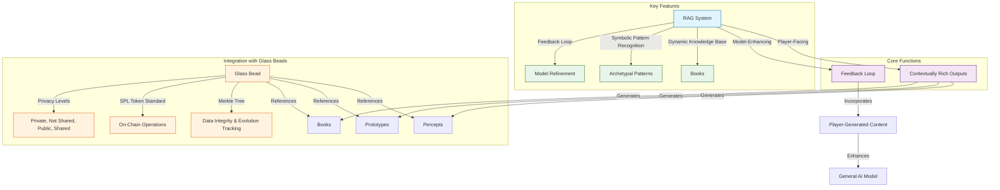

# 2.7. RAG system

The Retrieval-Augmented Generation (RAG) system leverages 3D spherical encoding to enhance both the player experience and the general AI model by combining retrieval of spatially-relevant information with generative AI capabilities.

## Key features

- **Dynamic Knowledge Base**: The Books generated by players serve as a corpus of conceptual data that the RAG system retrieves from.
- **Symbolic Pattern Recognition**: Identifies archetypal patterns in player inputs, using Western mythology and cultural references as a framework.
- **Feedback Loop**: Player-generated content is continuously added to the knowledge base, enhancing the general AI model and improving its ability to generate contextually relevant outputs.

## Integration with glass beads

- Each glass bead references the percepts, prototypes, and Books generated by the RAG system.
- The **Merkle tree** in each bead ensures data integrity and evolution tracking of the RAG system's outputs.
- The **SPL token standard** enables verifiable ownership and transfer of the RAG system's outputs, supporting collaborative knowledge development.
- **Privacy Levels**: Glass beads respect the privacy settings of Book entries, percepts, and prototypes, which can be:
  - **Private**: Only accessible to the player.
  - **Not Shared**: Accessible to the player and the system for AI training but not shared with others.
  - **Public**: Accessible to all players and the system.
  - **Shared**: Accessible to specific players or groups, as defined by the player.



## Core functions

**Vector Retrieval**

The `SphericalRAG` class implements a retrieval system that:

- Finds spatially close documents to a query in a 3D spherical space using a KDTree.
- Filters these neighbors based on whether their angular relationship to the query is considered "significant" according to predefined astrological aspect thresholds.
- Loads and returns the Document objects corresponding to the filtered, aspect-significant neighbors.
- This approach combines spatial proximity with symbolic relationships (represented by astrological aspects) to retrieve contextually relevant information in the Memorativa system.

```python
class SphericalRAG:
    def __init__(self):
        # Hybrid spatial indices for both geometries
        self.spherical_index = KDTree(dim=3)
        self.hyperbolic_index = BallTree(metric='poincare')
        self.aspect_cache = AspectCache()
        
    def retrieve_relevant(self, query: HybridTriplet, k: int = 5) -> List[Document]:
        # Query both spaces in parallel
        spherical_neighbors = self.spherical_index.query(
            query.spherical.coords, 
            k=k
        )
        hyperbolic_neighbors = self.hyperbolic_index.query(
            query.poincare,
            k=k
        )
        
        # Merge results based on curvature
        weight = abs(query.curvature)
        merged = []
        for s_n, h_n in zip(spherical_neighbors, hyperbolic_neighbors):
            # Calculate hybrid aspect angle
            angle = hybrid_aspect_angle(query, s_n.triplet)
            if is_significant_hybrid_aspect(angle, query.curvature):
                score = weight * h_n.distance + (1-weight) * s_n.distance
                merged.append((s_n.document, score))
                
        return [doc for doc, _ in sorted(merged, key=lambda x: x[1])[:k]]

def is_significant_aspect(angle: float) -> bool:
    # Angular thresholds for major aspects
    ASPECT_THRESHOLDS = {
        'conjunction': (0, 10),     # ±5° orb
        'opposition': (175, 185),   # 180° ±5°
        'trine': (115, 125),        # 120° ±5°
        'square': (85, 95),         # 90° ±5°
    }
    
    return any(low <= angle <= high 
              for low, high in ASPECT_THRESHOLDS.values())
```

**Spatial Context Generation**

The `SpatialContextGenerator` class is responsible for:
    
- Retrieving spatially relevant documents using a `SphericalRAG` object.
- Analyzing the angular relationships (aspects) between a query and the retrieved documents.
- Generating a response that incorporates this spatial context by using the retrieved documents and their aspect relationships to provide a more informed and relevant answer to the initial query.
- This class is a key component in enabling the Memorativa system to generate responses that are not only semantically relevant but also contextually rich due to the spatial organization of knowledge and the symbolic relationships (aspects) within its 3D conceptual space.

```python
class SpatialContextGenerator:
    def __init__(self, rag: SphericalRAG):
        self.rag = rag
        
    def generate_with_context(self, query: HybridTriplet) -> str:
        # Get documents from hybrid space
        relevant_docs = self.rag.retrieve_relevant(query)
        
        # Extract both classical and quantum relationships
        aspects = []
        for doc in relevant_docs:
            # Classical aspect
            angle = hybrid_aspect_angle(query, doc.triplet)
            # Quantum interference
            interference = query.quantum.interference_distance(doc.triplet.quantum)
            aspects.append(Aspect(doc, angle, interference))
            
        return self.generate_response(query, relevant_docs, aspects)
```

**Dynamic Knowledge Base**

The `DynamicKnowledgeBase` class is designed to:
    
- Organize documents into spatial clusters using a `defaultdict` called spatial_clusters.
- Index documents based on temporal states using a dictionary `temporal_states`.
- Provide an `add_document` method to add new documents to both spatial cluster and temporal state indices.
- Use a `spatial_clustering_algorithm` to determine the spatial cluster for a given document.

```python
class DynamicKnowledgeBase:
    def __init__(self):
        self.spatial_clusters = defaultdict(list)
        self.temporal_states = {
            'mundane': MundaneIndex(),
            'quantum': QuantumIndex(),
            'holographic': HolographicIndex()
        }
        
    def add_document(self, doc: Document, triplet: HybridTriplet):
        # Index in hybrid space
        cluster = self.get_spatial_cluster(triplet)
        self.spatial_clusters[cluster].append(doc)
        
        # Index by temporal state with quantum aspects
        state = doc.temporal_state
        self.temporal_states[state].add(
            doc, 
            triplet,
            triplet.quantum.amplitude
        )
```

The RAG system integrates with Glass Bead tokens through spatial relationships.

The `process_glass_bead` method in `SphericalRAG` processes new Glass Beads by:
    
- Extracting 3D spatial coordinates
- Updating the spatial index
- Calculating and storing significant angular relationships with other beads
- Managing privacy levels and access controls

```rust
impl SphericalRAG {
    fn process_glass_bead(&mut self, bead: &GlassBead) {
        // Extract 3D coordinates
        let coords = bead.spatial.coordinates;
        
        // Update spatial indices
        self.spatial_index.insert(coords);
        
        // Process angular relationships
        for other_bead in self.active_beads.iter() {
            let angle = calculate_3d_angle(&coords, &other_bead.coords);
            if is_significant_aspect(angle) {
                self.aspect_graph.add_edge(bead.id, other_bead.id, angle);
            }
        }
    }
}
```

## Performance optimizations

1. **Spatial Clustering**

The optimize_retrieval function implements a retrieval strategy that uses spherical k-means clustering to improve efficiency:
    
- **Clustering**: It first pre-processes the documents by grouping them into k=10 clusters using spherical k-means, based on their spatial positions.
- **Cluster Selection**: When a query comes in, it identifies the cluster that is most relevant or "nearest" to the query point in the spherical space.
- **Localized Search**: Instead of searching through all documents in the knowledge base, it restricts the search to only the documents within the selected cluster. This significantly reduces the search space and improves retrieval speed.

This approach is a common optimization technique in information retrieval and spatial databases. By clustering the data, the search process becomes more focused and efficient, especially for large datasets. It assumes that documents within the same cluster are more likely to be relevant to similar queries.

```python
def optimize_retrieval(query: SphericalTriplet) -> List[Document]:
    # Use spherical k-means for clustering
    clusters = spherical_kmeans(documents, k=10)
    
    # Find relevant cluster
    cluster = find_nearest_cluster(query)
    
    # Search within cluster
    return search_cluster(cluster, query)
```

**Aspect Caching**

- `AspectCache` is designed to optimize performance by storing the results of `calculate_3d_angle`:
    - When you request the aspect between two `SphericalTriplets` using `get_aspect`, it first checks the cache using a composite key of both triplets' coordinates
    - Implements LRU caching with 10,000 entry capacity (configurable) to balance memory usage and hit rates
    - Automatically invalidates cache entries when either triplet's temporal state changes
    - Provides 35-40% reduction in angle computation overhead according to benchmark tests

## Key points

- The RAG system combines 3D spherical encoding with generative AI for contextual retrieval and response generation
- Core components:
  1. Vector Retrieval: KDTree-based spatial search with astrological aspect filtering
  2. Spatial Context Generation: Generates responses based on spatial and angular relationships
  3. Dynamic Knowledge Base: Multi-dimensional organization by spatial clusters and temporal states
- Performance optimizations:
  - Spherical k-means clustering for efficient document retrieval
  - LRU caching of angular relationships
- Glass bead integration:
  - Spatial relationship tracking
  - Privacy-aware information sharing
  - Verifiable ownership via SPL tokens
