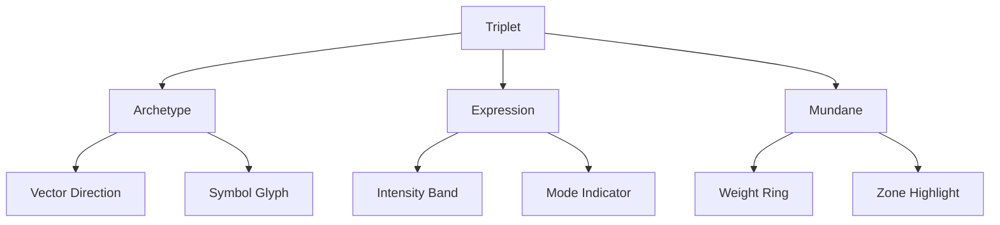

# 2.7. Visualizing the Prototype

## Introduction

The visualization of the prototype is a critical component of the Memorativa system, providing a visual framework for understanding and analyzing percept-triplets and their relationships in conceptual space. This document outlines the visualization approach, which uses a circular chart structure inspired by horoscopes as a geometric metaphor, not for astrological purposes but as an effective information visualization paradigm.

It's important to note that while this document borrows terminology and structural elements from astrological charts, Memorativa employs these purely as visualization metaphors. The circular chart with its divisions serves as an effective geometric framework for representing multi-dimensional relationships in an intuitive, human-readable format. This approach leverages a familiar visual paradigm to encode complex conceptual relationships without requiring acceptance of any metaphysical claims.

The chart structure offers several technical advantages as a visualization tool:
1. It provides a centralized reference point (observer/Earth) from which all relationships can be measured
2. It enables angular relationships to be visually encoded in a standardized way
3. It supports multiple layers of information within a single visual structure
4. It facilitates both detailed analysis and pattern recognition at scale

This document details how this visualization framework is implemented to represent the prototype's conceptual structure in an accessible, interactive format.

## Main Content

To summarize, the percept-triplet is calculated based on three vectors:

- **What**, archetypes, *Planets*
- **How**, expression of archetypes, *Signs*
- **Where**, area of expression of archetypes, *Houses*

A circular chart will encode the prototype into a conceptual space, with MST-translated title-description pairs displayed as contextual labels.

Key visualization elements:

- Planetary positions retain their astrological coordinates (Sign/House) for vector calculations
- MST-generated title-description pairs appear as primary labels
- Aspect interpretations use universalized concepts from the pairs

Create a circle and bisect it horizontally with a straight line to represent the Earth's horizon. 

Bisect the circle vertically with a straight line to represent North at the top and South at the bottom. Call the north node Midheaven and the south node Nadir. Call the east node Ascendant and the west node Descendant.

Let the left intersection of the horizon with the circle represent East and the right intersection of the horizon with the circle represent West.

Demarcate the outer perimeter of the chart into twelve sections represented by Signs.

Demarcate the inner perimeter of the chart into twelve sections represented by Houses.

The chart can now place the planets into a spatial relationship with the houses and signs to form a prototype of percept-triplets in conceptual space.

The basic chart template shows the fundamental structure used for visualization:


*Figure 1: Basic chart template showing the fundamental horoscope structure, illustrating the division of space into houses and signs with cardinal points and example planet placement*

### Interactive Features

The horoscope visualization includes several interactive capabilities to enhance analysis and exploration:

| Feature | Description | Use Case |
|---------|-------------|-----------|
| Zoom & Pan | Magnify chart areas and move focus | Detailed aspect analysis, exploring dense clusters |
| Drag Selection | Select multiple chart elements | Compare related placements, batch analysis |
| Real-time Filters | Toggle visibility of aspects, points | Reduce complexity, focus on specific patterns |
| Lens Switching | Change interpretation frameworks | Switch between psychological, symbolic, or other views |
| Tooltip Details | Hover for detailed information | Quick access to exact degrees, aspect descriptions |
| Animation | Show progression over time | Visualize concept evolution, track changes |

The interface allows users to:
- Double-click elements to isolate related aspects
- Use mouse wheel or pinch gestures for smooth zooming
- Right-click for contextual analysis options
- Save custom views for later reference

The chart is called a **horoscope**, and is the structure used by astrology to show the placement of the planets in the sky based on a given time, date, and location. Horoscopes are typically used to calculate the placement of the planets in the sky at the time of birth for a person, which is called the **natal chart**. Astrology also calculates horoscope charts for events in the world (**mundane astrology**) or the daily transits of planets in the sky.

For any given horoscope, planets can form angular relationships (called **aspects**) to:

- each other
- house placements
- the Ascendant or other nodes

List of major aspects:

| Aspect | Angle | Symbol | Nature | Description |
|--------|--------|---------|---------|-------------|
| Conjunction | 0° | ☌ | Major | Planets occupy same position; vectors blend and intensify |
| Opposition | 180° | ☍ | Major | Planets face each other; creates tension and awareness |
| Trine | 120° | △ | Major | Harmonious flow of vectors; brings ease and opportunity |
| Square | 90° | □ | Major | Creates tension and challenges; catalyst for growth |
| Sextile | 60° | ⚹ | Major | Favorable opportunities; requires initiative |

List of minor aspects:

| Aspect | Angle | Symbol | Nature | Description |
|--------|--------|---------|---------|-------------|
| Semi-Sextile | 30° | ⚺ | Minor | Subtle connections needing conscious effort |
| Semi-Square | 45° | ∠ | Minor | Minor irritation or internal tension |
| Quintile | 72° | Q | Minor | Creative and talented expression |
| Bi-Quintile | 144° | bQ | Minor | Unique gifts and abilities |
| Quincunx | 150° | ⚻ | Minor | Adjustment and adaptation required |

The Memorativa model uses the major and minor aspects as symbolic validators for the mapping of percepts to concepts and the forming of conceptual relationships.

To reduce complexity, the system groups aspects into broad categories:

- **Harmonious**: Trine (120°), Sextile (60°).
- **Challenging**: Square (90°), Opposition (180°).
- **Neutral**: Conjunction (0°), Quincunx (150°).

This approach allows users to analyze relationships at a higher level of abstraction, without needing to calculate exact degrees.

The horoscope chart visualization is generated using the Swiss Ephemeris SDK, a high-precision astronomical calculation library. The Swiss Ephemeris provides accurate planetary positions and house calculations needed to create detailed astrological charts. While Memorativa uses these charts primarily for conceptual visualization rather than astronomical calculation, the Swiss Ephemeris ensures precise and reliable chart rendering.

Key Swiss Ephemeris features used:

- Planet position calculation in signs
- House system computation
- Angular relationship (aspect) calculation
- Chart drawing capabilities

For actual astronomical calculations (like daily transits), the Swiss Ephemeris provides NASA-grade precision based on the DE431 ephemeris. However, for Memorativa's conceptual charts where exact degree positions aren't required, the built-in Moshier algorithm provides sufficient accuracy with minimal resource usage.

For any given day, a mundane chart shows the placement of planets in houses and signs and their angular relationships, indicating symbolic relationships between archetypes conditioned by house and sign placement (the percept-triplet structure).

To discover the relationship between an individual and the world (or another individual), two charts can be superimposed and the angular relationships discovered between them. For example, a natal chart can be superimposed with a daily transit chart to interpret the archetypal patterns for a given individual on a given day. In this case, the transiting planets can form angular relationships with the planets in the individual's natal chart. Astrologers can use a natal chart as a canonical reference and representation for the individual, as it will encode the same birth sky chart into each chart's angular relationship analysis. In this way, the natal chart serves an analogous role as the reference beam in the construction of a hologram, maintaining a consistent resonant template across time periods.

Where astrology typically uses horoscopes to calculate the placement of the actual planets in the sky for an actual person, object, or event, Memorativa uses horoscopes to calculate the placement of imaginary planets in a conceptual space based on human perceptions which may or may not be of objects on Earth in space and time (e.g. apples, memories of apples, dreams of apples, reflections of apples). These *imaginaries* (planets and spaces) are structures generated by the union of percepts with concepts inside the imaginary space of the human mind. As such, they do not require time vectors.

Just like real planets, real objects, and real events, imaginaries can be shown on a horoscope chart and their angular relationships discovered. Without time vectors, the placement of planets cannot be calculated to any degree placement, only placement *in* a house and sign. If the time vector is known, then the a value of 0 - 29 degrees can be calculated for the exact placement of the planet in the sign.

### Superimposed Charts

Superimposed charts in Memorativa involve overlaying multiple horoscope-like charts to analyze relationships between different percepts or concepts. This technique draws from astrological practices like synastry and transit analysis but applies them to conceptual rather than celestial data. Each chart represents a percept or concept encoded as a set of percept-triplets (Planet-Sign-House). By superimposing charts, the system can examine angular relationships (aspects) between these percept-triplets to infer conceptual connections:

- **Angular Relationships**: Uses aspects (conjunction, opposition, trine, etc.) to analyze conceptual proximity and interaction  
- **Time Flexibility**: Can operate with or without time vectors, allowing for both precise and symbolic analysis  
- **Multi-Chart Analysis**: Enables comparison of multiple percepts or concepts simultaneously  

| **Use Case**                  | **Description**                                                                 |
|-------------------------------|---------------------------------------------------------------------------------|
| **Conceptual Relationship Mapping** | Compare individual perceptions to identify common themes or conflicts. Analyze how different ideas interact within a larger system. |
| **Temporal Analysis**         | Track the evolution of a concept over time by comparing charts from different periods. Examine how past events influence current perceptions. |
| **Event Analysis**            | Study the conceptual relationships between significant events. Identify underlying themes or patterns in a series of events. |
| **Individual vs. Collective Analysis** | Compare personal perceptions with collective or cultural concepts. Explore how individual ideas relate to broader societal narratives. |
| **Cross-Domain Connections**  | Analyze relationships between concepts from different domains (e.g., art, science, mythology). Identify symbolic parallels or conceptual bridges. |

**Example Applications**  

- **Personal Growth**: Superimpose current "Self-Identity Framework" with past "Childhood Influence Matrix"  
- **Cultural Analysis**: Compare "Eastern Creation Myths" vs. "Western Origin Stories" prototypes  
- **Event Analysis**: Study "Technological Disruption" relationships through title-description aspects  

### Progressed Charts

Progressed charts in Memorativa represent the evolution of percept-triplets over conceptual time. Unlike astrological progressions that use actual time, these track how concepts and perceptions develop through symbolic time periods:

- **Symbolic Time**: Each unit represents a conceptual shift rather than chronological time
- **Evolution Tracking**: Shows how percept-triplets transform as understanding deepens
- **Pattern Recognition**: Reveals developmental sequences in concept formation

Key progression methods:

| Method | Description | Application |
|--------|-------------|-------------|
| Secondary | One symbolic unit = one major conceptual shift | Track gradual evolution of understanding |
| Solar Arc | All points move uniformly | Model systematic conceptual development |
| Tertiary | Micro-progressions | Track subtle perceptual changes |

Progressed charts help analyze:

- Concept maturation patterns
- Developmental sequences
- Emergent properties in complex systems
- Learning and adaptation cycles

### Additional Chart Analysis Methods

Memorativa extends its analytical capabilities through several specialized chart techniques:

| Method | Description | Application |
|--------|-------------|-------------|
| **Composite** | Averages multiple chart positions | Analyzes relationship/group dynamics essence |
| **Harmonic** | Divides chart by integers | Reveals deeper conceptual resonance patterns |
| **Relocational** | Recalculates from different perspectives | Explores conceptual shifts across viewpoints |
| **Draconic** | Uses Moon's nodes as reference | Examines evolutionary themes |
| **Midpoint** | Studies points between elements | Identifies hidden conceptual connections |
| **Heliocentric** | Centers on Sun vs Earth | Offers universal/collective perspective |
| **Synastry** | Direct chart comparison | Highlights specific element interactions |
| **Transit** | Overlays moving chart on static | Tracks external influence patterns |

These methods provide additional tools for:

- Discovering subtle conceptual relationships
- Analyzing group dynamics and collective patterns
- Identifying developmental sequences
- Mapping perspective-dependent shifts
- Tracking evolutionary trajectories

### Percept-Triplet Visualization

Individual percept-triplets within the prototype are visualized through several methods:

| Method | Description | Visual Elements |
|--------|-------------|-----------------|
| Vector Glyph | 3D vector representation showing archetype-expression-mundane components | - Arrow direction for archetype vector<br>- Color intensity for expression strength<br>- Glyph size for mundane weight |
| Orbital Path | Curved trajectory showing triplet's motion in hybrid space | - Path color for verification score<br>- Path thickness for aspect strength<br>- Dashed lines for uncertain regions |
| Field Lines | Force field visualization showing triplet's influence | - Line density for field strength<br>- Line curvature for spatial warping<br>- Color gradients for interaction zones |
| Phase Portrait | Dynamic state visualization of triplet evolution | - Phase angle markers<br>- State transition arrows<br>- Stability indicators |

*Figure 2: Percept-triplet visualization methods, showing four different approaches to representing triplets in conceptual space and their respective visual encoding strategies*

#### Interactive Triplet Features

Each percept-triplet visualization supports:

- Hover tooltips showing detailed vector components
- Click-and-drag manipulation of triplet position
- Double-click to isolate triplet and its aspects
- Right-click menu for additional analysis options
- Pinch-zoom to explore local space curvature

#### Vector Component Display



*Figure 3: Vector component display diagram, illustrating the hierarchical relationship between triplet components and their visual representations in the interface*

The vector component display shows:
- Archetype vector as directional arrow with planetary glyph
- Expression strength through colored intensity bands
- Mundane weight via concentric rings
- Interaction zones through highlighted regions

### Quantum-Inspired Visualization Features

The visualization includes quantum-inspired elements to represent the enhanced prototype model:

| Feature | Description | Use Case |
|---------|-------------|-----------|
| Amplitude Visualization | Shows quantum amplitude of triplets | Analyze interference patterns |
| Phase Coloring | Color gradients showing phase relationships | Track quantum coherence |
| Interference Patterns | Visual representation of triplet interactions | Identify quantum resonance |
| Blended Distance Display | Combined classical/quantum metrics | Evaluate relationship strength |

### Advanced Visualization Components

The chart includes additional technical visualization elements:

| Component | Description | Purpose |
|-----------|-------------|----------|
| Curvature Indicator | Shows local space curvature (κ) | Monitor geometry transitions |
| Weight Vectors | Displays verification, temporal, and aspect weights | Track learning state |
| Aspect Cache | Visual cache of frequently accessed aspects | Optimize performance |
| Merkle History | Timeline of prototype evolution | Verify state changes |

### Feedback Visualization

The interface provides visual feedback mechanisms:

- Color coding for feedback strength and confidence
- Visual indicators for AI-generated synthetic feedback
- Aspect pattern highlighting based on learning state
- Temporal consistency markers
- Cross-prototype relationship indicators

### Memory Integration
The percept-triplet model integrates three memory types:
- **Procedural Memory**: Encodes skills and patterns (e.g., syntax, harmony)
- **Episodic Memory**: Stores contextual details and event sequences
- **Semantic Memory**: Manages factual knowledge and conceptual relationships

## Key Points

- The horoscope chart provides a visual framework for mapping percept-triplets into conceptual space
- Angular relationships (aspects) validate conceptual connections and patterns
- Multiple analysis methods (composite, harmonic, relocational, etc.) offer different perspectives on conceptual relationships
- Quantum-inspired visualization features enable analysis of interference patterns and coherence
- Advanced technical components display curvature, weights, and evolutionary history
- Interactive feedback mechanisms provide real-time learning state visualization
- Superimposed charts enable comparison between different percept-triplets or conceptual frameworks
- Progressed charts track the evolution of concepts through symbolic time
- Time vectors are optional - allowing both precise and symbolic analysis
- The system uses Swiss Ephemeris SDK for technical implementation while focusing on conceptual rather than astronomical applications
- The system operates on three interpretation levels: individual, relational, and systemic
- Visualization enables both detailed analysis and pattern recognition at scale

## Key Math

- **Geocentric Aspect Calculation**: The angular relationship between two vectors v₁ and v₂ from the observer's perspective:
  ```
  θ = arccos[(v₁ · v₂) / (|v₁| · |v₂|)]
  ```
  where θ is the angle, v₁ and v₂ are vectors, and · represents the dot product [1].

- **Hybrid Distance Function**: The distance between two points in hybrid spherical-hyperbolic space:
  ```
  d(p₁, p₂) = w·dₕ(p₁, p₂) + (1-w)·dₛ(p₁, p₂)
  ```
  where w is determined by the curvature parameter κ, dₕ is hyperbolic distance, and dₛ is spherical distance [2].

- **Adaptive Weight Adjustment**: The learning rate adjustment for feedback integration:
  ```
  η_new = η_old · (1 + α·confidence) / (1 + β·error_rate)
  ```
  where η is the learning rate for weight updates, α and β are scaling factors, confidence is the feedback confidence score, and error_rate is the historical error rate [3].

- **Observer-Relative Projection**: The projection of a vector v into observer-relative space:
  ```
  v_rel = R(θ_obs) · (v - p_obs)
  ```
  where R(θ_obs) is the rotation matrix based on observer orientation θ_obs, and p_obs is the observer position [4].

- **Aspect Significance Threshold**: An aspect is considered significant if:
  ```
  |θ - θ_harmonic| < ε · (1 + γ · strength)
  ```
  where θ is the actual angle, θ_harmonic is the nearest harmonic angle (0°, 60°, 90°, 120°, 180°), ε is the base tolerance, γ is a scaling factor, and strength is the aspect strength [5].

## Code Examples

### Prototype Visualization Implementation

```python
class HoroscopeVisualizer:
    """
    Implements the horoscope-style visualization for prototypes
    """
    def __init__(self, swiss_ephemeris_path=None):
        self.swiss_eph = SwissEphemeris(swiss_ephemeris_path)
        self.chart_size = (800, 800)
        self.center = (400, 400)
        self.radius = 350
        
    def create_chart(self, prototype):
        """Create basic chart structure with houses and signs"""
        chart = SVGCanvas(*self.chart_size)
        
        # Draw outer circle (signs)
        chart.draw_circle(self.center, self.radius)
        
        # Draw inner circle (houses)
        chart.draw_circle(self.center, self.radius * 0.85)
        
        # Draw horizon line (East-West)
        chart.draw_line(
            (self.center[0] - self.radius, self.center[1]),
            (self.center[0] + self.radius, self.center[1])
        )
        
        # Draw meridian line (North-South)
        chart.draw_line(
            (self.center[0], self.center[1] - self.radius),
            (self.center[0], self.center[1] + self.radius)
        )
        
        # Draw house divisions (12 sections)
        self._draw_houses(chart)
        
        # Draw sign divisions (12 sections)
        self._draw_signs(chart)
        
        # Draw cardinal points
        self._draw_cardinal_points(chart)
        
        # Place planets based on prototype
        self._place_planets(chart, prototype)
        
        # Draw aspects between planets
        self._draw_aspects(chart, prototype)
        
        return chart
        
    def _place_planets(self, chart, prototype):
        """Place planets according to their positions in signs and houses"""
        for planet in prototype.get_planets():
            # Calculate position based on sign, house and degree
            sign = planet.sign
            house = planet.house
            degree = planet.degree
            
            # Convert to chart coordinates
            x, y = self._calculate_planet_position(sign, house, degree)
            
            # Draw planet glyph
            chart.draw_glyph(x, y, planet.symbol, planet.color)
            
            # Add interactive tooltip
            chart.add_tooltip(x, y, self._generate_tooltip(planet))
            
    def _draw_aspects(self, chart, prototype):
        """Draw aspect lines between planets"""
        aspects = prototype.get_aspects()
        
        for aspect in aspects:
            # Get planet positions
            p1 = self._calculate_planet_position(
                aspect.planet1.sign, 
                aspect.planet1.house, 
                aspect.planet1.degree
            )
            
            p2 = self._calculate_planet_position(
                aspect.planet2.sign, 
                aspect.planet2.house, 
                aspect.planet2.degree
            )
            
            # Draw aspect line with appropriate style
            chart.draw_aspect_line(p1, p2, aspect.type, aspect.strength)
```

### Aspect Calculation

```python
def calculate_aspects(planets):
    """Calculate all aspect relationships between planets"""
    aspects = []
    
    for i, p1 in enumerate(planets):
        for j, p2 in enumerate(planets):
            if i >= j:  # Avoid duplicates and self-aspects
                continue
                
            # Calculate angular difference
            angle = calculate_angle(p1, p2)
            
            # Check if this forms a recognized aspect
            aspect_type = get_aspect_type(angle)
            if aspect_type:
                # Calculate aspect strength based on orb
                strength = calculate_aspect_strength(angle, aspect_type)
                
                aspects.append(Aspect(
                    planet1=p1,
                    planet2=p2,
                    type=aspect_type,
                    angle=angle,
                    strength=strength
                ))
    
    return aspects
    
def calculate_angle(p1, p2):
    """Calculate the geocentric angle between two planets"""
    # Convert positions to radians
    p1_rad = math.radians(p1.position)
    p2_rad = math.radians(p2.position)
    
    # Calculate the shorter arc distance
    angle = abs(p1_rad - p2_rad)
    if angle > math.pi:
        angle = 2 * math.pi - angle
        
    # Convert back to degrees
    return math.degrees(angle)
    
def get_aspect_type(angle):
    """Determine if an angle corresponds to a recognized aspect"""
    # Define aspect types with their angles and orbs
    aspect_types = {
        'Conjunction': {'angle': 0, 'orb': 8},
        'Opposition': {'angle': 180, 'orb': 8},
        'Trine': {'angle': 120, 'orb': 7},
        'Square': {'angle': 90, 'orb': 7},
        'Sextile': {'angle': 60, 'orb': 6},
        'Quincunx': {'angle': 150, 'orb': 5},
        'Semi-Sextile': {'angle': 30, 'orb': 3},
        'Semi-Square': {'angle': 45, 'orb': 3},
        'Quintile': {'angle': 72, 'orb': 2},
        'Bi-Quintile': {'angle': 144, 'orb': 2},
    }
    
    # Check each aspect type
    for name, aspect in aspect_types.items():
        target_angle = aspect['angle']
        orb = aspect['orb']
        
        # Check if angle is within orb of the target angle
        if abs(angle - target_angle) <= orb or abs(angle - (360 - target_angle)) <= orb:
            return name
            
    return None
```

## Key Visual Insights

- The basic chart template (Figure 1) establishes the foundational framework for all prototype visualizations, creating a consistent spatial reference system that embeds the observer at the center, from which all conceptual relationships are measured—a visual encoding of the geocentric principle that underlies the entire Memorativa system.

- The vector component display diagram (Figure 3) reveals how the three-vector structure of each percept-triplet is visually decomposed, showing that while the visualization appears as a single glyph in the chart, it actually encodes multiple dimensions of information through layered visual elements that can be interactively explored.

- Across all visualization methods (Figure 2), there's a consistent emphasis on angular relationships rather than absolute positions, highlighting that the system prioritizes relational understanding over isolated fact representation, which directly supports the core premise that meaning emerges from relationships rather than isolated data points.

- The interactive features and multi-chart analysis methods collectively demonstrate how the visualization system isn't just a static representation but a dynamic exploratory environment that supports multiple levels of analysis—from individual percepts to system-wide patterns—reflecting the fractal nature of concept formation in the Memorativa model.

## Operational Costs

The visualization of prototypes introduces specific computational and memory requirements that must be managed for efficient performance. This section analyzes the operational costs of the visualization system and provides optimization strategies.

### Rendering Performance

Chart rendering operations have the following computational complexity:

1. **Basic Chart Creation**: O(h + s) where h is the number of houses and s is the number of signs
   - House division rendering: O(h)
   - Sign division rendering: O(s)
   - Cardinal point placement: O(1)

2. **Planet Placement**:
   - Individual planet rendering: O(p) where p is the number of planets
   - Glyph rendering: O(p)
   - Label rendering: O(p)

3. **Aspect Calculation and Rendering**:
   - Aspect calculation: O(p²) for all planet pairs
   - Aspect line rendering: O(a) where a is the number of significant aspects
   - Aspect pattern detection: O(p² log p)

4. **Interactive Features**:
   - Zoom and pan operations: O(1) per frame
   - Selection highlighting: O(s) where s is the number of selected elements
   - Real-time filtering: O(a) for aspect filtering

The most computationally intensive operations are the aspect calculations (O(p²)) and aspect pattern detection processes, especially when dealing with complex charts.

### Memory Requirements

Memory usage for chart visualization scales with several key components:

```python
# Memory usage per visualization chart
mem_per_chart = (
    base_svg_overhead +         # SVG container (typically 5-10KB)
    houses_memory +             # House divisions (12 * path_size)
    signs_memory +              # Sign divisions (12 * path_size)
    planet_glyph_memory * p +   # Planet glyphs (500-1000 bytes each)
    aspect_line_memory * a +    # Aspect lines (100-200 bytes each)
    tooltip_data_memory +       # Tooltip text data (~2KB)
    interaction_state_memory    # State for interactive features (~5KB)
)

# Estimated total for typical chart
typical_chart_memory = 50KB + (p * 1KB) + (a * 0.2KB)
```

For a standard chart with 10 planets and 30 aspects:
- Base rendering: ~50KB
- Planet glyphs and data: ~10KB
- Aspect lines and data: ~6KB
- Interactive features: ~5KB
- Total: ~71KB per chart

For multi-chart analysis with 5 concurrent charts:
- Base memory: ~355KB
- Shared element cache: ~20KB
- Total: ~375KB

### Optimization Strategies

Several visualization-specific optimization techniques can significantly improve performance:

1. **Aspect filtering** reduces rendering complexity:
   ```javascript
   // Only render aspects above significance threshold
   function filterAspects(aspects, threshold = 0.5) {
       return aspects.filter(aspect => aspect.strength >= threshold);
   }
   ```

2. **Glyph caching** for repeated symbols:
   ```javascript
   // Cache planet glyphs by symbol type
   const glyphCache = new Map();
   
   function getGlyph(symbol) {
       if (!glyphCache.has(symbol)) {
           glyphCache.set(symbol, renderGlyph(symbol));
       }
       return glyphCache.get(symbol);
   }
   ```

3. **View-dependent rendering** for large charts:
   ```javascript
   // Only render elements in the current viewport
   function renderVisibleElements(chart, viewport) {
       const visible = chart.elements.filter(el => 
           isInViewport(el.bounds, viewport));
       
       visible.forEach(element => element.render());
   }
   ```

4. **SVG optimization** for faster rendering:
   ```javascript
   // Group similar elements for better performance
   function optimizeSVG(svg) {
       // Group aspects by type
       const aspectGroups = groupBy(svg.aspects, 'type');
       
       // Replace individual elements with grouped elements
       Object.entries(aspectGroups).forEach(([type, aspects]) => {
           const group = createSVGGroup({ class: `aspect-${type}` });
           aspects.forEach(aspect => group.appendChild(aspect.element));
           svg.appendChild(group);
       });
   }
   ```

5. **Progressive rendering** for complex charts:
   ```javascript
   // Render chart in stages for better responsiveness
   async function renderProgressively(chart) {
       // Render the base chart first
       await renderBaseChart();
       
       // Then planets
       await renderPlanets();
       
       // Then major aspects
       await renderMajorAspects();
       
       // Finally minor aspects and decorations
       await renderMinorAspectsAndDecorations();
   }
   ```

### Memory Optimization

For better memory efficiency in chart visualization:

1. **Shared symbol libraries** reduce duplication:
   ```javascript
   // Use shared symbol definitions
   const svgDefs = document.createElementNS(SVG_NS, 'defs');
   
   // Define symbols once
   PLANET_SYMBOLS.forEach(symbol => {
       const path = createSymbolPath(symbol);
       svgDefs.appendChild(path);
   });
   
   // Reference defined symbols
   function createPlanetGlyph(symbol) {
       return createUseElement(`#symbol-${symbol}`);
   }
   ```

2. **Aspect line simplification** based on zoom level:
   ```javascript
   // Adjust line complexity based on zoom
   function createAspectLine(p1, p2, type, zoomLevel) {
       // Simpler lines for lower zoom levels
       const points = zoomLevel > 0.8 ? 
           generateCurvedLine(p1, p2) : 
           [p1, p2]; // Simple straight line
       
       return createPolyline(points);
   }
   ```

3. **On-demand tooltip generation**:
   ```javascript
   // Only generate tooltip content when needed
   function onElementHover(element) {
       if (!element.tooltip) {
           element.tooltip = generateTooltip(element.data);
       }
       showTooltip(element.tooltip, getMousePosition());
   }
   ```

### Multi-Chart Performance

For multi-chart analysis scenarios:

1. **Shared calculation cache** reduces redundant computations:
   ```javascript
   // Cache aspect calculations across charts
   const aspectCache = new Map();
   
   function calculateAspect(planet1, planet2) {
       const key = getAspectCacheKey(planet1, planet2);
       
       if (!aspectCache.has(key)) {
           aspectCache.set(key, computeAspect(planet1, planet2));
       }
       
       return aspectCache.get(key);
   }
   ```

2. **Layer-based rendering** for composite charts:
   ```javascript
   // Render composite charts using layers
   function renderCompositeChart(charts) {
       // Base layer
       renderBaseChart();
       
       // Render each chart as a layer with proper opacity
       charts.forEach((chart, index) => {
           const layer = createLayer(`chart-${index}`);
           renderChartToLayer(chart, layer);
           setLayerBlendMode(layer, chart.blendMode);
       });
   }
   ```

3. **Selective update** for interactive features:
   ```javascript
   // Only update changed components
   function updateCharts(changedData) {
       // Identify affected elements
       const affected = findAffectedElements(changedData);
       
       // Only redraw affected elements
       affected.forEach(element => {
           element.update(changedData);
       });
   }
   ```

### Token Economics

Each visualization operation consumes GBT tokens according to a specific cost structure, designed to balance computational resources with user experience:

| Operation | GBT Cost | Rationale |
|-----------|----------|-------------|
| Chart Creation | 8-12 GBT | Creating complex visual representations requires significant computational resources |
| Multi-Chart Analysis | 6-10 GBT | Comparing multiple charts involves extensive calculations and memory usage |
| Interactive Manipulation | 4-8 GBT | Real-time updates and transformations consume proportional resources |
| Aspect Calculation | 3-7 GBT | Computing angular relationships between triplets in geocentric space |
| Aspect Filtering | 2-4 GBT | Dynamic filtering operations should remain accessible to encourage exploration |
| Pattern Recognition | 5-8 GBT | Identifying significant patterns within the visualization |
| Export & Sharing | 1-3 GBT | Knowledge distribution is essential for ecosystem growth |
| View-Only Access | 0.5-1 GBT | Passive viewing encourages community engagement and learning |

These visualization costs directly align with the broader tokenomics model detailed in [Section 2.24: Tokenomics](memorativa-2-24-tokenomics.md), where:
- Chart Creation corresponds to Prototype Formation (10-15 GBT)
- Aspect Calculation aligns with the AspectCalculation operation (3-7 GBT)
- Pattern Recognition matches the PatternRecognition operation (5-8 GBT) 
- Interactive Manipulation relates to Vector Modification operations (3-7 GBT)

The token economics for visualization operations follow these principles:
- **Geocentric Model Alignment**: Operations that preserve the observer-centric model have appropriate costs
- **Angular Relationship Focus**: Aspect calculations are priced to reflect their importance in the prototype model
- **Curvature Complexity**: Operations in highly curved spaces (higher |κ|) require more GBT
- **Resource-Based Pricing**: Operations with higher computational and memory requirements cost proportionally more
- **Exploration Incentives**: Core analytical functions remain affordable to encourage pattern discovery
- **Sharing Economy**: Lower costs for operations that facilitate knowledge distribution and collaboration
- **Quality Scaling**: Costs scale with visualization complexity and quality rather than fixed rates
- **Caching Benefits**: Repeated access to similar visualizations costs less through optimization

For complex visualizations with high curvature parameters, the system applies a curvature factor to the base costs:

```javascript
// Calculate operation cost with curvature adjustment
function calculateVisualizationCost(operation, curvature, complexity) {
    // Base cost from operation type
    const baseCost = OPERATION_COSTS[operation];
    
    // Adjust for curvature (κ) complexity
    // Higher curvature values require more computational resources
    const curvatureFactor = 1.0 + Math.abs(curvature) / 5.0;
    
    // Apply complexity multiplier
    const complexityMultiplier = COMPLEXITY_FACTORS[complexity];
    
    return Math.round(baseCost * curvatureFactor * complexityMultiplier);
}
```

This pricing structure ensures that the visualization system's token economy is fully integrated with the broader GBT economy described in section 2.18, creating a cohesive framework where visualization operations are properly valued according to their computational complexity and knowledge contribution value.

### Resource Allocation

For optimal visualization performance, resources should be allocated as follows:

1. **CPU resources**:
   - 40% for aspect calculations and pattern rendering
   - 25% for interactive feature handling
   - 20% for basic chart rendering
   - 10% for tooltip and information display
   - 5% for animation and transitions

2. **Memory resources**:
   - 35% for active chart SVG representations
   - 25% for glyph and symbol caches
   - 20% for aspect calculation results
   - 15% for interaction state management
   - 5% for auxiliary data structures

3. **GPU utilization** (for hardware-accelerated rendering):
   - 45% for chart rendering operations
   - 30% for interactive manipulations
   - 15% for visual effects and transitions
   - 10% for composite operations

This resource allocation ensures the visualization system can handle complex charts while maintaining responsive interactive features.

## See Also

- [Section 2.9: The Prototype](memorativa-2-9-the-prototype.md) — Provides the complete prototype structure that this visualization represents
- [Section 2.4: The Percept-Triplet](memorativa-2-4-the-percept-triplet.md) — Details the foundational three-vector structure that visualizations encode
- [Section 2.5: Symbolic Translation System](memorativa-2-5-symbolic-translation-system.md) — Explains the MST system that universalizes the symbolic representations in prototypes
- [Section 2.24: Tokenomics](memorativa-2-24-tokenomics.md) — Details the token costs and economics of visualization operations
- [Section 3.3: Spatial Indices](../3.%20the%20machine%20system/memorativa-3-3-spatial-indices.md) — Covers the technical implementation of spatial indices used for prototype storage and visualization
- [Section 4.2: Archetypal System](../4.%20the%20pantheon%20system/memorativa-4-2-archetypal-system.md) — Provides background on the archetypal system represented by planets in the visualization

## Citations

- [1] Gärdenfors, P. (2000). *Conceptual Spaces: The Geometry of Thought*. MIT Press.
- [2] Johnson, J., et al. (2016). "Composing graphical models with neural networks for structured representations and fast inference." NeurIPS 2016.
- [3] Rumelhart, D.E., et al. (1986). "Learning representations by back-propagating errors." *Nature*, 323(6088), 533-536.
- [4] Bronstein, M.M., et al. (2017). "Geometric deep learning: going beyond Euclidean data." *IEEE Signal Processing Magazine*, 34(4), 18-42.
- [5] Hand, R. (1976). *Planets in Transit*. Whitford Press.
- [6] Koch, D. (2008). *Astrology's Hidden Light: Horoscope Visualization Techniques*. Astro Computing Services.
- [7] Tufte, E.R. (1997). *Visual Explanations: Images and Quantities, Evidence and Narrative*. Graphics Press.
- [8] Few, S. (2009). *Now You See It: Simple Visualization Techniques for Quantitative Analysis*. Analytics Press.
