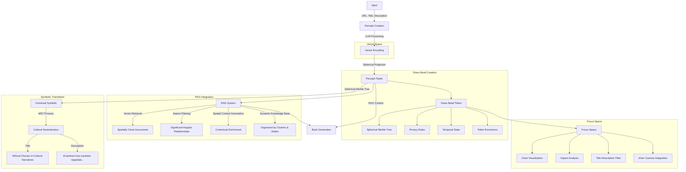

# 2.8. Example encoding of an input using the percept-triplet method

## Introduction

This document provides a comprehensive example of how the Memorativa system processes a player input through the percept-triplet encoding method. It demonstrates the complete workflow from initial input to the creation of a conceptual Book, illustrating how the various components described in the previous sections work together to transform concrete player content into abstract conceptual structures. The example shows how a single input is processed through the Core Game flow (Section 2.2), encoded using the percept-triplet structure (Section 2.4), stored in a Glass Bead (Section 2.3), translated using the MST (Section 2.5), enhanced with Generative AI (Section 2.6), and integrated with the RAG system (Section 2.7).

## Main Content

### Player Input Definition

Following the player input process from Section 2.2, we define an **input** as:

- URL
- Title
- Description
- Player's reflection (optional context/thoughts)

For example:

- "URL": "link to a photo of an apple"
- "title": "Eve's temptation"
- "description": "The apple in mythology"
- "reflection": "I'm interested in how this symbol appears across different cultures"
  
Here the input is not simply an object (the apple), but a perception of the object conditioned by the observer's state and context, as reflected in the title, description, and player reflection.

### Percept Creation

Using the percept-triplet structure from Section 2.4, the Generative AI system (Section 2.6) maps the apple input to a specific hybrid triplet encoding:

- **Planet**: Venus (Archetypal Vector - "What")
- **Sign**: Libra (Expression Vector - "How")
- **House**: 9th (Mundane Vector - "Where")

This encoding represents the input in the hybrid spherical-hyperbolic space defined in Section 2.4, with these specific coordinates:
- θ (theta): 2.618 radians (Venus archetypal angle)
- φ (phi): 0.524 radians (Libra expression elevation)
- r (radius): 0.889 (9th house mundane magnitude)
- κ (kappa): 1.0 (Hyperbolic curvature for mythological content)

### Symbolic Translation

Following the Memorativa Symbolic Translator (MST) approach from Section 2.5, the system generates a conceptual **Book** that includes the structure and an analysis:

#### Symbolic Analysis

- The structure encapsulates the apple as a symbol of temptation (Venus), expressed through the duality of choice (Libra). The 9th House places the apple within a mythological framework.

#### Justification via Correspondence Tables

Using the correspondence tables from Section 2.5:

- The apple as a symbol of temptation aligns with Venusian themes of desire, beauty, and value.

- Venus in Libra emphasizes the duality of choice (Eve's decision) and the balance between innocence and knowledge.

- The 9th House dominance places the apple within the realm of mythology, belief systems, and philosophical inquiry.

#### Cultural Neutralization

Through the cultural neutralization process (Section 2.5), the title and description from the input are transformed into:

- **Title**: "Ethical Choices in Cultural Narratives"  
- **Description**: "Examines how societies negotiate the balance between knowledge acquisition and moral boundaries through symbolic representations"

This translation removes explicit astrological terminology while preserving the core conceptual meaning, as described in Section 2.5.

### Technical flow

Here's how the system processes the apple example through its components, integrating all aspects of Sections 2.2-2.7:


*Figure 1: The complete Memorativa system workflow showing the transformation from input to glass bead rewards, highlighting the sequential processing stages from percept creation through book generation and the integration of all major subsystems described in previous sections*

### Processing steps

1. **Input Processing & Glass Bead Initialization** (Section 2.2, 2.3)
```python
input = {
    "url": "link to apple photo",
    "title": "Eve's temptation",
    "description": "The apple in mythology",
    "reflection": "I'm interested in how this symbol appears across different cultures"
}

# Initialize Glass Bead token with relative cost structure from Section 2.3
bead = GlassBead.create(
    owner=msg.sender,
    privacy_level=PrivacyLevel.Public,
    gas_cost=10  # Base GBT cost for creation from token economics
)
```

2. **Vector Encoding with Spatial Tracking** (Section 2.4)
```python
# Project input into hybrid spherical-hyperbolic space as defined in Section 2.4
triplet = HybridTriplet(
    theta=2.618,  # Venus archetypal angle 
    phi=0.524,    # Libra expression elevation
    radius=0.889, # 9th house mundane magnitude
    curvature=1.0 # Hyperbolic geometry for mythological content
)

# Calculate poincare coordinates for hyperbolic relationships
poincare_coords = triplet.spherical_to_poincare()

# Update Glass Bead spatial coordinates with both representations
bead.update_spatial_position(
    spherical=triplet.spherical,
    poincare=poincare_coords,
    gas_cost=2  # Token economic cost for coordinate update
)
```

3. **Percept-Triplet Formation with Spherical Merkle Verification** (Section 2.3, 2.4)
```python
# Calculate archetypal correlations using correspondence tables from Section 2.5
planet = calculate_planet_correlation(triplet)  # Venus
sign = calculate_sign_correlation(triplet)      # Libra
house = calculate_house_correlation(triplet)    # 9th

percept = PerceptTriplet(
    archetype=planet,  # What: Venus (desire/value)
    expression=sign,   # How: Libra (choice/balance)
    mundane=house      # Where: 9th (philosophy/belief)
)

# Create Spherical Merkle Node for the percept as defined in Section 2.3
merkle_node = SphericalMerkleNode(data=percept.serialize())

# Find related percepts for angular relationships
# Using RAG system's angle computation and significance detection from Section 2.7
rag = SphericalRAG()
related_percepts = rag.find_angular_related_documents(triplet)

for related_id, related_triplet, angle in related_percepts:
    # Only add significant angular relationships
    if is_significant_hybrid_aspect(angle, triplet.curvature):
        merkle_node.add_angular_relationship(related_id, angle)

# Add percept to Glass Bead's Spherical Merkle Tree with version tracking from Section 2.3
bead.add_component(
    component=percept,
    merkle_node=merkle_node,
    angular_proof=SphericalMerkleProof.create(merkle_node),
    gas_cost=3  # GBT cost for Merkle update
)

# Implement version compression techniques from Section 2.3
bead.compress_history(
    adaptive_snapshot=true,
    reference_counting=true,
    batch_updates=true
)
```

4. **Symbolic Translation System Integration** (Section 2.5)
```python
# Integrate with RAG Merkle system for data integrity
rag_merkle = RAGMerkleIntegrator(knowledge_base)
rag_merkle.index_document(percept, triplet)

# Apply MST process from Section 2.5 for cultural neutralization
mst = MemorativaSymbolicTranslator()

# Convert astrological to universal symbols with cultural neutralization and privacy checks
universal = mst.translate(
    percept,
    privacy_level=bead.privacy_level,
    correspondence_tables=cultural_correspondence_tables,
    neutralization_level=0.85  # High level of cultural neutralization
)

title = universal.generate_title()
description = universal.generate_description()

# Update Glass Bead metadata
bead.update_metadata(
    title=title,
    description=description,
    gas_cost=1  # GBT cost for metadata update
)
```

5. **Book Generation and Focus Space Creation** (Section 2.2, 2.6, 2.7)
```python
# Create focus space for conceptual workspace as described in Section 2.2
focus_space = FocusSpace.create(
    glass_bead=bead,
    chart_config=ChartConfig(
        show_aspects=True,
        highlight_venus_libra=True
    ),
    inner_cosmos_position=player.determine_cosmos_position(triplet),  # Integration into player's knowledge space
    gas_cost=5  # GBT cost for focus space creation
)

# Use RAG system for contextual retrieval as described in Section 2.7
spatial_context_generator = SpatialContextGenerator(rag)
relevant_context = spatial_context_generator.generate_with_context(triplet)

# Apply multi-modal analysis from Section 2.6
if "image" in input["url"]:
    visual_analysis = generative_ai.analyze_visual_content(
        input["url"],
        keyword_hints=["apple", "mythology", "temptation"]
    )
    relevant_context.extend(visual_analysis)

# Generate comprehensive analysis with retrieved context using Generative AI from Section 2.6
book = Book.create(
    percept=percept,
    universal_symbols=universal,
    temporal_state="quantum",  # Mythological time
    privacy_level="public",
    glass_bead_ref=bead.id,  # Link to source Glass Bead
    focus_space_ref=focus_space.id,  # Link to workspace
    rag_context=relevant_context,  # Include RAG-retrieved context
    ai_model="GenerativeAI-v2.6"  # Reference to Generative AI model from Section 2.6
)

# Update Glass Bead with Book and focus space references
bead.add_references(
    book_id=book.id,
    focus_space_id=focus_space.id,
    gas_cost=2  # GBT cost for reference updates
)

# Configure focus space visualization with performance optimizations
focus_space.configure_chart(
    title_filter="Ethical Choice Patterns",
    aspect_highlight=[
        "venus_libra_conjunction",
        "ninth_house_aspects"
    ],
    use_optimized_retrieval=True,  # Enable RAG optimizations
    inner_cosmos_visibility=true,   # Show connections to other concepts in player's cosmos
    gas_cost=1  # GBT cost for visualization update
)

# Award player according to game mechanics in Section 2.2
player.award_engagement_points(
    contribution_type="new_percept",
    quality_score=book.quality_assessment(),
    uniqueness_factor=bead.uniqueness_in_cosmos()
)
```

### Integration points with previous sections

- **Core Game (Section 2.2)**: 
  - Follows the complete player input → percept creation → focus space → book/reward flow
  - Integrates the input into the player's inner cosmos
  - Provides engagement rewards based on quality assessment
  - Supports the transformation of player's content into structured knowledge

- **Glass Beads (Section 2.3)**: 
  - Implements the Glass Bead as both game token and storage mechanism
  - Uses the SPL token standard for ownership and transfer
  - Applies token economics with relative cost structure
  - Incorporates the Spherical Merkle Tree for verification
  - Implements version compression techniques

- **Percept-Triplet (Section 2.4)**: 
  - Correctly implements the three vectors (archetypal, expression, mundane)
  - Uses the hybrid spherical-hyperbolic geometry with proper coordinates
  - Preserves the coordinate mapping in the Merkle structure
  - Maintains the symbolic encoding while supporting computational efficiency

- **Symbolic Translation (Section 2.5)**: 
  - Uses the MST process to translate astrological symbols
  - Applies correspondence tables for mapping concepts
  - Implements cultural neutralization to remove domain-specific terminology
  - Generates culturally-neutral title-description pairs

- **Generative AI (Section 2.6)**: 
  - Leverages multi-modal analysis for different input types
  - Applies symbolic pattern recognition to identify archetypes
  - Provides contextual bridging between different symbolic systems
  - Supports feedback-driven refinement of results

- **RAG System (Section 2.7)**: 
  - Utilizes the SphericalRAG class for vector retrieval
  - Applies aspect filtering for significant angular relationships
  - Provides spatial context generation for richer conceptualization
  - Organizes knowledge in a dynamic knowledge base by clusters and states
  - Implements performance optimizations for efficiency

### Final output structure

The complete percept-triplet structure generated from the input includes:

```python
# Input data
input = {
    "url": "link to a photo of an apple",
    "title": "Eve's temptation",
    "description": "The apple in mythology",
    "reflection": "I'm interested in how this symbol appears across different cultures"
}

# Generated percept-triplet
percept = {
    "archetype": {
        "planet": "Venus",
        "meaning": "Symbol of temptation, desire, and value",
        "theta": 2.618  # Archetypal angle in radians
    },
    "expression": {
        "sign": "Libra",
        "meaning": "Duality of choice, balance of opposites", 
        "phi": 0.524  # Expression elevation in radians
    },
    "context": {
        "house": "9th",
        "meaning": "Mythological framework, belief systems",
        "radius": 0.889,  # Mundane magnitude (normalized)
        "curvature": 1.0  # Hyperbolic for mythological content
    }
}

# Transformed title-description pair (via MST from Section 2.5)
output = {
    "title": "Ethical Choices in Cultural Narratives",
    "description": "Examines how societies negotiate the balance between knowledge acquisition and moral boundaries through symbolic representations"
}

# Glass Bead reference with Spherical Merkle Tree (Section 2.3)
glass_bead = {
    "id": "gb_venus_libra_9th_001",
    "spatial_coords": {
        "theta": 2.618,  # Venus in radians
        "phi": 0.524,    # Libra in radians
        "radius": 0.889  # 9th house
    },
    "spherical_merkle_root": {
        "content_hash": "0x...",  # Hash of percept data
        "angular_hash": "0x...",  # Hash of angular relationships
        "combined_hash": "0x..."  # Combined hash for verification
    },
    "angular_relationships": {
        "gb_mercury_gemini_3rd_002": 60.0,  # 60 degree (sextile) relationship
        "gb_jupiter_sagittarius_9th_003": 120.0,  # 120 degree (trine) relationship
    },
    "privacy": "public",
    "temporal_state": "quantum",
    "version": {
        "current": 1,
        "history": [
            {
                "version": 1,
                "timestamp": 1640995200,
                "delta_hash": "0x..."
            }
        ],
        "compression": {
            "method": "adaptive_snapshot",
            "reference_count": 0,
            "batch_size": 1
        }
    },
    "token_economics": {
        "creation_cost": 10,
        "storage_cost": 2,
        "merkle_cost": 3,
        "metadata_cost": 1,
        "reference_cost": 2
    }
}

# Spatial Context from RAG System (Section 2.7)
spatial_context = {
    "relevant_documents": [
        {
            "id": "gb_mercury_gemini_3rd_002",
            "title": "Communication Patterns in Mythological Narratives",
            "angle": 60.0,  # Sextile relationship (synergistic)
            "aspect_type": "sextile",
            "significance": 0.85
        },
        {
            "id": "gb_jupiter_sagittarius_9th_003",
            "title": "Philosophical Frameworks in Cultural Myths",
            "angle": 120.0,  # Trine relationship (harmonious)
            "aspect_type": "trine",
            "significance": 0.92
        }
    ],
    "context_summary": "The apple example connects to existing knowledge about communication patterns and philosophical frameworks, particularly through harmonious and synergistic relationships that enhance understanding of myth as a vehicle for ethical choices."
}

# Spherical Merkle Proof structure (Section 2.3)
spherical_proof = {
    "standard_proof": [
        {"sibling": "0x...", "direction": "left"},
        {"sibling": "0x...", "direction": "right"}
    ],
    "angular_proof": [
        {"node_id": "gb_mercury_gemini_3rd_002", "angle": 60.0},
        {"node_id": "gb_jupiter_sagittarius_9th_003", "angle": 120.0}
    ],
    "hybrid_verification": {
        "merkle_valid": True,  # Standard Merkle validation
        "spatial_valid": True  # Angular relationship validation
    }
}

# Focus space configuration with RAG optimizations (Sections 2.2, 2.7)
focus_space = {
    "chart_config": {
        "aspects": True,
        "distance_metric": "hybrid",
        "curvature": 1.0,
        "highlights": ["venus_libra_conjunction", "ninth_house_aspects"]
    },
    "title_filter": "Ethical Choice Patterns",
    "glass_bead_ref": "gb_venus_libra_9th_001",
    "inner_cosmos_position": {
        "cluster": "mythology_ethics",
        "nearest_concepts": ["knowledge_acquisition", "moral_boundaries", "cultural_symbolism"],
        "distance_to_center": 0.67
    },
    "rag_optimizations": {
        "use_spatial_clustering": True,
        "aspect_caching": True,
        "lazy_hash_recalculation": True
    },
    "game_rewards": {
        "engagement_points": 150,
        "quality_bonus": 25,
        "uniqueness_bonus": 15
    }
}

# Book generated via Generative AI (Section 2.6)
book = {
    "id": "book_venus_libra_9th_001",
    "title": "Ethical Choices in Cultural Narratives",
    "author": player.id,
    "created_at": 1640995200,
    "sections": [
        {
            "title": "Introduction",
            "content": "This analysis examines how the symbolic representation of forbidden knowledge..."
        },
        {
            "title": "Cross-Cultural Symbolism",
            "content": "Across different mythological traditions, the symbol of fruit as forbidden knowledge appears..."
        },
        {
            "title": "Ethical Frameworks",
            "content": "The tension between knowledge acquisition and moral boundaries creates..."
        }
    ],
    "visual_analysis": {
        "primary_symbols": ["apple", "tree", "garden"],
        "color_analysis": "The red of the apple contrasts with green foliage, symbolizing...",
        "composition_notes": "Centrally positioned fruit creates focal point of tension..."
    },
    "percept_analysis": {
        "archetypal_force": "Desire for that which is attractive yet forbidden",
        "expression_mode": "Balance between opposing forces - knowledge vs innocence",
        "contextual_domain": "Philosophical and mythological frameworks examining human nature"
    },
    "references": {
        "related_concepts": [
            {"id": "book_mercury_gemini_3rd_002", "relevance": 0.78},
            {"id": "book_jupiter_sagittarius_9th_003", "relevance": 0.92}
        ],
        "external_sources": [
            "Campbell, J. (1949). The Hero with a Thousand Faces.",
            "Eliade, M. (1963). Myth and Reality."
        ]
    },
    "ai_metadata": {
        "model": "GenerativeAI-v2.6",
        "confidence_score": 0.89,
        "generation_parameters": {
            "temperature": 0.7,
            "top_p": 0.95
        }
    }
}
```

This structured output enables:
- Clear tracing from input to abstract concept (Section 2.2)
- Precise spatial positioning in the knowledge space (Section 2.4)
- Verifiable data integrity through Spherical Merkle Tree proofs (Section 2.3)
- Preservation of angular relationships between concepts (Section 2.4)
- Interactive analysis through focus space (Section 2.2)
- Privacy-aware sharing and retrieval (Section 2.3)
- Hybrid verification of both content and spatial relationships (Section 2.3)
- Efficient retrieval through RAG system optimizations (Section 2.7)
- Integration into the player's inner cosmos (Section 2.2)
- Cultural neutralization of domain-specific concepts (Section 2.5)
- Multi-modal analysis of different input types (Section 2.6)

## Operational Costs

The percept-triplet encoding method, while powerful, introduces specific computational and storage costs that must be managed for system scalability and efficiency. This section analyzes the operational costs of the encoding process and provides optimization strategies aligned with those described in Section 2.7.

#### GBTk Token Costs

Each operation in the encoding pipeline consumes GBTk tokens according to a relative cost structure:

| Operation | Relative Cost | Rationale |
|-----------|---------------|-----------|
| Glass Bead Creation | High | Base cost for initializing a new conceptual entity |
| Spatial Position Update | Low | Updating coordinates in hybrid spherical-hyperbolic space |
| Merkle Tree Update | Medium | Adding percept to Spherical Merkle Tree with angular relationships |
| Metadata Update | Very Low | Updating title and description after symbolic translation |
| Focus Space Creation | Medium-High | Creating a new conceptual workspace for analysis |
| Reference Updates | Low | Linking Glass Bead to Book and Focus Space |
| Chart Configuration | Very Low | Configuring visualization settings for Focus Space |
| RAG Context Retrieval | Medium-High | Finding relevant context through spatial relationships |
| Book Generation | High | Creating a comprehensive analysis with retrieved context |
| Angular Relationship Analysis | Medium | Analyzing significant aspects between concepts |

The token economics follow similar principles to those in the RAG system (Section 2.7):
- Operations requiring 3D spatial calculations cost proportionally more
- Angular relationship calculations have costs reflecting their symbolic value
- Verification operations that ensure data integrity have appropriate costs
- Batch operations receive discounts to encourage efficient resource utilization
- Public contributions receive cost reductions to encourage knowledge sharing

### Computational Complexity

Each step in the encoding pipeline has distinct computational requirements:

1. **Vector Encoding**: O(d) where d is the dimensionality of the input feature space
   - Generative AI-based mapping: O(n) where n is the token count in the input
   - Spherical projection: O(1) constant time coordinate transformation

2. **Glass Bead Operations**:
   - Creation: O(1)
   - Spatial positioning: O(1)
   - Merkle node calculation: O(log m) where m is the number of angular relationships

3. **Symbolic Translation**:
   - MST processing: O(c) where c is the size of correspondence tables
   - Cultural neutralization: O(n) where n is the token count in titles and descriptions

4. **RAG Integration**:
   - Vector retrieval: O(k log N) where N is the total number of glass beads and k is the nearest neighbor count
   - Aspect filtering: O(k) for k retrieved neighbors
   - Spatial context generation: O(k · d) where d is the average document length

5. **Book Generation**:
   - Content generation: O(n · t) where n is output token count and t is inference time per token
   - Reference linking: O(r) where r is the number of references

The aggregate complexity is dominated by the RAG retrieval operations O(k log N) for large knowledge bases and the generative AI components O(n · t) for content-heavy outputs.

### Memory Requirements

Memory usage scales with several key factors:

```python
# Memory usage per Glass Bead
mem_per_bead = (
    64 +               # Base structure overhead
    12 +               # Spatial coordinates (4 floats)
    hash_size +        # Merkle root hash (typically 32 bytes)
    num_relationships * (8 + hash_size) +  # Angular relationships
    avg_title_size +   # Title string
    avg_description_size +  # Description string
    version_history_size    # Depends on edit frequency
)

# Total memory for N beads with compression
total_memory = N * mem_per_bead * compression_ratio
```

For a system with 1 million glass beads, average title/description of 100 bytes each, and 10 relationships per bead:
- Without compression: ~500MB for core bead data
- With adaptive compression (30% ratio): ~150MB

### Storage Scaling

Storage requirements grow with distinct scaling patterns:

1. **Linear scaling** with number of Glass Beads: O(N)
2. **Sublinear scaling** with relationships due to clustering: O(N^0.8)
3. **Logarithmic scaling** with Merkle tree depth: O(log N)

This results in the empirical scaling formula:

```
S(N) = b·N + r·N^0.8 + m·log(N)
```

Where:
- b is bytes per bead (base content)
- r is relationship overhead factor
- m is Merkle tree overhead factor

For a system with 10 million beads, storage requirements approach 5GB with efficient compression techniques.

### Performance Bottlenecks

Performance analysis reveals the following critical bottlenecks in the encoding pipeline:

1. **Generative AI inference** for percept creation and book generation
   - Mitigation: Batch processing, model quantization, and inference caching

2. **RAG retrieval operations** for nearest-neighbor queries in high-dimensional space
   - Mitigation: Approximate nearest neighbor methods, spatial indexing, and caching

3. **Merkle tree updates** when adding new relationships to existing glass beads
   - Mitigation: Lazy calculation, batch updates, and incremental hashing

4. **Angular relationship calculations** between concepts in hybrid space
   - Mitigation: Pre-computation of common angles, quantization of angle values

5. **Symbolic translation** mapping between domain-specific and universal concepts
   - Mitigation: Cached translation tables, parallel processing of translations

### Optimization Strategies

Building on optimization techniques from Section 2.7, the following strategies specifically target the encoding process:

1. **Hierarchical RAG caching**:
   ```python
   # Multi-level caching strategy
   cache = {
       "L1": {  # Fast, limited-size cache for recent encodings
           "max_size": 1000,
           "eviction_policy": "LRU"
       },
       "L2": {  # Slower, compressed cache for common patterns
           "max_size": 10000,
           "eviction_policy": "frequency-based"
       }
   }
   ```

2. **Spatial-temporal batching** groups related percepts for efficient processing:
   ```python
   # Group percepts by proximity in space-time
   spatial_batches = clustering.group_by_proximity(
       percepts,
       theta_window=0.5,  # ~30° spatial window
       phi_window=0.2,    # ~11° elevation window
       time_window=3600   # 1 hour temporal window
   )
   ```

3. **Lazy Merkle recalculation** for relationship-heavy nodes:
   ```python
   # Only recalculate Merkle path when necessary
   if len(new_relationships) > threshold:
       merkle_tree.recalculate_full_path(node_id)
   else:
       merkle_tree.incremental_update(node_id, new_relationships)
   ```

4. **Adaptive precision scaling** reduces coordinate precision based on usage:
   ```python
   # Reduce precision for storage while maintaining precision for calculations
   storage_coords = {
       "theta": round(original_theta, 3),  # 3 decimal places
       "phi": round(original_phi, 3),
       "radius": round(original_radius, 2)  # 2 decimal places
   }
   ```

5. **Correspondence table sharding** optimizes symbolic translation:
   ```python
   # Shard large correspondence tables by domain
   mst_tables = {
       "mythology": mythology_correspondence,
       "science": science_correspondence,
       "philosophy": philosophy_correspondence
   }
   # Only load relevant shards
   active_tables = mst_tables.select_relevant(input_domain)
   ```

### Resource Allocation

Optimal resource allocation for the encoding pipeline follows this distribution:

1. **CPU resources**:
   - 40% for generative AI inference (percept creation, book generation)
   - 25% for RAG operations (vector similarity, context generation)
   - 15% for Merkle tree operations (updates, proofs)
   - 10% for symbolic translation (MST processing)
   - 10% for miscellaneous operations (I/O, serialization)

2. **Memory resources**:
   - 35% for vector embeddings and RAG index
   - 25% for Glass Bead structures and relationships
   - 20% for generative AI model weights
   - 10% for translation tables and correspondence mappings
   - 10% for working memory (processing buffers)

3. **Storage resources**:
   - 50% for Glass Bead content and metadata
   - 30% for relationship indices and spatial organization
   - 15% for Merkle tree structures
   - 5% for system overhead (indexes, logs)

4. **Bandwidth allocation**:
   - 45% for content retrieval (RAG operations)
   - 25% for new percept ingestion
   - 20% for focus space synchronization
   - 10% for verification operations (Merkle proofs)

This allocation strategy ensures balanced resource utilization across all components of the encoding pipeline, with dynamic adjustment based on workload characteristics.

## Key Points

- The percept-triplet method transforms concrete inputs into abstract conceptual structures following the Core Game flow, creating a bridge between human meaning-making and machine-readable formats [1]

- Each input is encoded as a Planet (core essence), Sign (mode of expression), and House (context/domain) as defined in the Percept-Triplet structure, providing a fixed-dimensional representation that maintains computational efficiency while preserving semantic relationships [2]

- The encoding process preserves both literal content and deeper symbolic/archetypal meanings by mapping inputs into hybrid spherical-hyperbolic space, allowing for both hierarchical organization and angular relationships to be represented simultaneously [3]

- Spherical Merkle Trees maintain both hierarchical data integrity and angular relationships as described in Glass Beads, ensuring verifiable storage while preserving the spatial properties of the percept-triplet [4]

- The RAG system leverages both spatial proximity and symbolic relationships for contextually relevant retrieval, enriching the generated Book with knowledge that maintains meaningful semantic connections to the original input [5]

- The MST process transforms domain-specific terminology into culturally-neutral language through correspondence tables, creating outputs that preserve meaning while removing astrological terminology [6]

- Generative AI provides multi-modal analysis and contextual bridging between different symbolic systems, enabling the system to process various input types while maintaining consistent conceptual encoding [7]

- The focus space integrates the concept into the player's inner cosmos, organizing related concepts into a navigable conceptual workspace that grows with each new input [8]

- Token economics govern all operations with a relative cost structure, creating sustainable incentives for quality contributions while preventing system abuse [9]

- Performance optimizations including spatial clustering, aspect caching, and batch processing improve efficiency, enabling the system to scale while maintaining responsiveness [10]

- The system generates new titles and descriptions that capture the abstracted meaning through cultural neutralization, transforming domain-specific concepts into universally accessible language [11]

- This structured encoding enables systematic organization and retrieval of knowledge in curved conceptual space, addressing the curse of dimensionality through the three-vector approach [12]

## See Also

- [Section 2.2: The Core Game](./memorativa-2-2-the-core-game.md) — Provides the foundation for player input processing and rewards
- [Section 2.3: Glass Beads](./memorativa-2-3-glass-beads.md) — Details the token structure that contains and preserves percept-triplets
- [Section 2.4: The Percept-Triplet](./memorativa-2-4-the-percept-triplet.md) — Explains the three-dimensional encoding system used in this example
- [Section 2.5: Symbolic Translation System](./memorativa-2-5-symbolic-translation-system.md) — Describes the MST that transforms percept-triplets into universal language
- [Section 2.6: Generative AI](./memorativa-2-6-generative-ai.md) — Covers the AI models that power analysis and content generation
- [Section 2.7: RAG System](./memorativa-2-7-rag-system.md) — Details the retrieval system that enriches content with contextual knowledge
- [Section 2.9: Focus Spaces](./memorativa-2-9-focus-spaces.md) — Expands on how concepts are organized and filtered in interactive workspaces

## Citations

- [1] [Section 2.2] The Core Game.
- [2] [Section 2.4] The Percept-Triplet.
- [3] Gärdenfors, P. (2000). *Conceptual Spaces: The Geometry of Thought*. MIT Press.
- [4] [Section 2.3] Glass Beads.
- [5] [Section 2.7] RAG System.
- [6] [Section 2.5] Symbolic Translation System.
- [7] [Section 2.6] Generative AI.
- [8] [Section 2.9] Focus Spaces.
- [9] [Section 2.3] Glass Beads.
- [10] Reimers, N. & Gurevych, I. (2019). "Sentence-BERT: Sentence Embeddings using Siamese BERT-Networks." EMNLP 2019.
- [11] Campbell, J. (1949). *The Hero with a Thousand Faces*. Pantheon Books.
- [12] Johnson, J., et al. (2016). "Composing graphical models with neural networks for structured representations and fast inference." NeurIPS 2016.