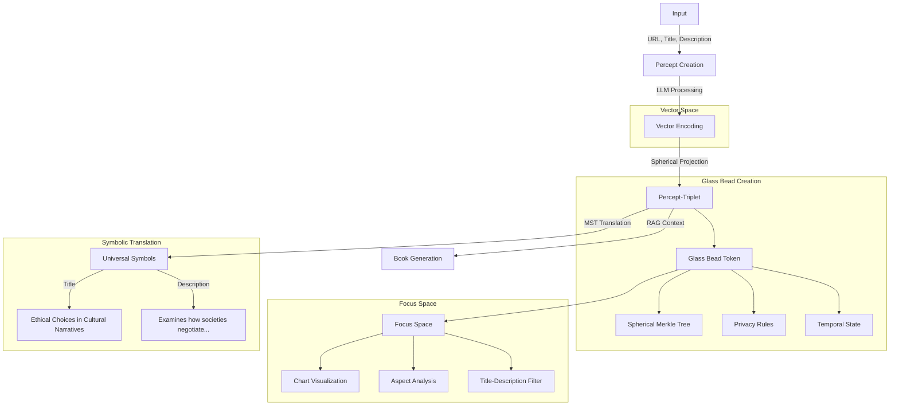

# 2.8. Example encoding of an input using the percept-triplet method

In this example, the Memorativa percept-triplet method is used to conceptualize an input. The output is a Planet expressed in a Sign manifested in a House.

Define an **input** as:

- URL
- Title
- Description

For example:

- "URL": "link to a photo of an apple"
- "title": "Eve's temptation"
- "description": "The apple in mythology"
  
Here the input is not simply an object (the apple), but a perception of the object conditioned by the observer's state and context, as reflected in the title and description.

Here's a hypothetical percept-triplet structure, mapping the apple input to a single prototype:

- **Planet**: Venus
- **Sign**: Libra
- **House**: 9th

The conceptual **Book** written by the system includes the structure and an analysis.

Here's a hypothetical analysis of the derived percept-triplet structure:

- The structure encapsulates the apple as a symbol of temptation (Venus), expressed through the duality of choice (Libra). The 9th House places the apple within a mythological framework.

Here's a hypothetical justification for the structure:

- The apple as a symbol of temptation aligns with Venusian themes of desire, beauty, and value.

- Venus in Libra emphasizes the duality of choice (Eve's decision) and the balance between innocence and knowledge.

- The 9th House dominance places the apple within the realm of mythology, belief systems, and philosophical inquiry.

- The title and description from the input are transformed into:

  - **Title**: "Ethical Choices in Cultural Narratives"  
  - **Description**: "Examines how societies negotiate the balance between knowledge acquisition and moral boundaries through symbolic representations"

## Technical flow

Here's how the system processes the apple example through its components:



### Processing steps

1. **Input Processing & Glass Bead Initialization**
```python
input = {
    "url": "link to apple photo",
    "title": "Eve's temptation",
    "description": "The apple in mythology"
}

# Initialize Glass Bead token
bead = GlassBead.create(
    owner=msg.sender,
    privacy_level=PrivacyLevel.Public,
    gas_cost=10  # Base GBT cost for creation
)
```

2. **Vector Encoding with Spatial Tracking**
```python
# Project input into hybrid spherical-hyperbolic space
triplet = HybridTriplet(
    theta=2.618,  # Venus archetypal angle 
    phi=0.524,    # Libra expression elevation
    radius=0.889, # 9th house mundane magnitude
    curvature=1.0 # Hyperbolic geometry for mythological content
)

# Calculate poincare coordinates for hyperbolic relationships
poincare_coords = triplet.spherical_to_poincare()

# Update Glass Bead spatial coordinates with both representations
bead.update_spatial_position(
    spherical=triplet.spherical,
    poincare=poincare_coords,
    gas_cost=2
)
```

3. **Percept-Triplet Formation with Spherical Merkle Verification**
```python
# Calculate archetypal correlations
planet = calculate_planet_correlation(triplet)  # Venus
sign = calculate_sign_correlation(triplet)      # Libra
house = calculate_house_correlation(triplet)    # 9th

percept = PerceptTriplet(
    archetype=planet,  # What: Venus (desire/value)
    expression=sign,   # How: Libra (choice/balance)
    mundane=house      # Where: 9th (philosophy/belief)
)

# Create Spherical Merkle Node for the percept
merkle_node = SphericalMerkleNode(data=percept.serialize())

# Find related percepts for angular relationships
related_percepts = find_related_percepts(triplet)
for related_id, related_triplet in related_percepts:
    # Calculate angular relationship
    angle = calculate_angular_relationship(triplet, related_triplet)
    
    # Only add significant angular relationships
    if is_significant_aspect(angle):
        merkle_node.add_angular_relationship(related_id, angle)

# Add percept to Glass Bead's Spherical Merkle Tree
bead.add_component(
    component=percept,
    merkle_node=merkle_node,
    angular_proof=SphericalMerkleProof.create(merkle_node),
    gas_cost=3  # GBT cost for Merkle update
)
```

4. **MST Translation with Privacy Controls**
```python
# Convert astrological to universal symbols with privacy checks
universal = mst.translate(
    percept,
    privacy_level=bead.privacy_level
)

title = universal.generate_title()
description = universal.generate_description()

# Update Glass Bead metadata
bead.update_metadata(
    title=title,
    description=description,
    gas_cost=1  # GBT cost for metadata update
)
```

5. **Book Generation with Glass Bead Reference and Focus Space**
```python
# Create focus space for conceptual workspace
focus_space = FocusSpace.create(
    glass_bead=bead,
    chart_config=ChartConfig(
        show_aspects=True,
        highlight_venus_libra=True
    ),
    gas_cost=5  # GBT cost for focus space creation
)

# Generate comprehensive analysis
book = Book.create(
    percept=percept,
    universal_symbols=universal,
    temporal_state="quantum",  # Mythological time
    privacy_level="public",
    glass_bead_ref=bead.id,  # Link to source Glass Bead
    focus_space_ref=focus_space.id  # Link to workspace
)

# Update Glass Bead with Book and focus space references
bead.add_references(
    book_id=book.id,
    focus_space_id=focus_space.id,
    gas_cost=2  # GBT cost for reference updates
)

# Configure focus space visualization
focus_space.configure_chart(
    title_filter="Ethical Choice Patterns",
    aspect_highlight=[
        "venus_libra_conjunction",
        "ninth_house_aspects"
    ],
    gas_cost=1  # GBT cost for visualization update
)
```

### Integration points

- **RAG System**: 
  - Provides contextual knowledge about mythological apple symbolism
  - Indexes Glass Bead spatial coordinates for retrieval
  - Respects privacy settings during context retrieval

- **Glass Bead**: 
  - Stores the percept-triplet with Spherical Merkle Tree verification
  - Preserves angular relationships between percepts
  - Maintains spatial coordinates for 3D conceptual space
  - Tracks GBT costs for all operations
  - Enables verifiable ownership and transfer

- **Temporal States**: 
  - Encodes the mythological narrative in quantum time state
  - Stored in Glass Bead temporal metadata
  - Enables time-aware relationship tracking

- **Privacy Controls**: 
  - Makes analysis publicly available for knowledge sharing
  - Enforced through Glass Bead privacy settings
  - Controls access to spatial coordinates and relationships

- **Focus Space**: 
  - Provides interactive workspace for concept exploration
  - Visualizes percept-triplet through chart interface
  - Enables aspect pattern analysis and filtering
  - Maintains title-description based conceptual filters
  - Links related Glass Beads through aspect relationships

This technical implementation ensures:
- Consistent symbolic encoding through Glass Bead standardization
- Verifiable data integrity via Spherical Merkle Tree validation
- Preservation of angular relationships between percepts
- Efficient retrieval through spatial indexing
- Privacy-aware knowledge sharing with granular controls
- Cross-cultural symbol translation with privacy preservation
- Sustainable operation through GBT cost structure

## Final output structure

The complete percept-triplet structure generated from the input includes:

### Input data
```python
input = {
    "url": "link to a photo of an apple",
    "title": "Eve's temptation",
    "description": "The apple in mythology"
}
```

### Generated percept-triplet
```python
percept = {
    "archetype": {
        "planet": "Venus",
        "meaning": "Symbol of temptation, desire, and value",
        "theta": 2.618  # Archetypal angle in radians
    },
    "expression": {
        "sign": "Libra",
        "meaning": "Duality of choice, balance of opposites", 
        "phi": 0.524  # Expression elevation in radians
    },
    "context": {
        "house": "9th",
        "meaning": "Mythological framework, belief systems",
        "radius": 0.889,  # Mundane magnitude (normalized)
        "curvature": 1.0  # Hyperbolic for mythological content
    }
}
```

### Transformed title-description pair
```python
output = {
    "title": "Ethical Choices in Cultural Narratives",
    "description": "Examines how societies negotiate the balance between knowledge acquisition and moral boundaries through symbolic representations"
}
```

### Glass Bead reference with Spherical Merkle Tree
```python
glass_bead = {
    "id": "gb_venus_libra_9th_001",
    "spatial_coords": {
        "theta": 2.618,  # Venus in radians
        "phi": 0.524,    # Libra in radians
        "radius": 0.889  # 9th house
    },
    "spherical_merkle_root": {
        "content_hash": "0x...",  # Hash of percept data
        "angular_hash": "0x...",  # Hash of angular relationships
        "combined_hash": "0x..."  # Combined hash for verification
    },
    "angular_relationships": {
        "gb_mercury_gemini_3rd_002": 60.0,  # 60 degree (sextile) relationship
        "gb_jupiter_sagittarius_9th_003": 120.0,  # 120 degree (trine) relationship
    },
    "privacy": "public",
    "temporal_state": "quantum"
}
```

### Spherical Merkle Proof structure
```python
spherical_proof = {
    "standard_proof": [
        {"sibling": "0x...", "direction": "left"},
        {"sibling": "0x...", "direction": "right"}
    ],
    "angular_proof": [
        {"node_id": "gb_mercury_gemini_3rd_002", "angle": 60.0},
        {"node_id": "gb_jupiter_sagittarius_9th_003", "angle": 120.0}
    ],
    "hybrid_verification": {
        "merkle_valid": True,  # Standard Merkle validation
        "spatial_valid": True  # Angular relationship validation
    }
}
```

### Focus space configuration
```python
focus_space = {
    "chart_config": {
        "aspects": True,
        "distance_metric": "hybrid",
        "curvature": 1.0,
        "highlights": ["venus_libra_conjunction", "ninth_house_aspects"]
    },
    "title_filter": "Ethical Choice Patterns",
    "glass_bead_ref": "gb_venus_libra_9th_001"
}
```

This structure enables:
- Clear tracing from input to abstract concept
- Precise spatial positioning in the knowledge space
- Verifiable data integrity through Spherical Merkle Tree proofs
- Preservation of angular relationships between concepts
- Interactive analysis through focus space
- Privacy-aware sharing and retrieval
- Hybrid verification of both content and spatial relationships

## Key points

- The percept-triplet method transforms concrete inputs into abstract conceptual structures
- Each input is encoded as a Planet (core essence), Sign (mode of expression), and House (context/domain)
- The encoding preserves both the literal content and deeper symbolic/archetypal meanings
- Spherical Merkle Trees maintain both hierarchical data integrity and angular relationships
- Hybrid verification ensures both content validity and spatial relationship consistency
- The system generates new titles and descriptions that capture the abstracted meaning
- This structured encoding enables systematic organization and retrieval of knowledge in curved conceptual space