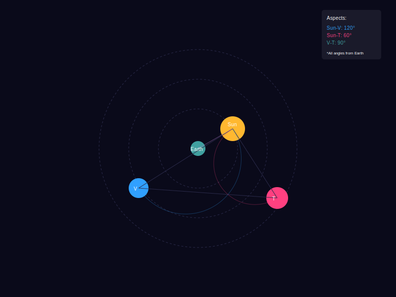
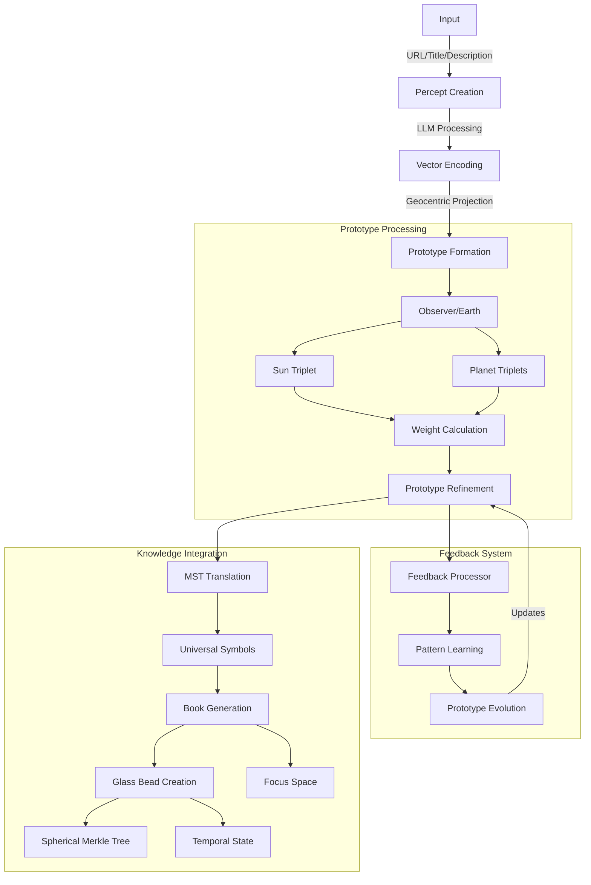

# 2.9. The Prototype

## Overview
In Memorativa, the prototype is a fractal extension of the percept-triplet structure, maintaining its geocentric orientation. Like a horoscope chart, it places the observer/Earth at the center, with multiple percept-triplets (including the representative sun triplet) arranged as vectors in the surrounding space. Each vector maps to an archetype represented by a planet, with their relationships defined through aspects and angular relationships from the central reference point. Memorativa uses the MST to ensure the prototype is symbolically universalized. The prototype is the best representative of the concept united with the percept, serving as the symbolic representative when the system needs to "talk about" pre-linguistic concepts.

## Core components

| **Component**         | **Description**                                                                 |
|------------------------|---------------------------------------------------------------------------------|
| **Earth/Observer**     | Central reference point for measuring relationships                            |
| **Sun Triplet**       | Representative vector of the primary concept                                    |
| **Planet Vectors**     | Additional percept-triplets representing concept facets                        |
| **Aspects**           | Angular relationships between vectors measured from center                      |
| **Hybrid Geometry**    | Combined spherical-hyperbolic space with curvature parameter κ                |



*Figure 1: Prototype Visualization, illustrating the geocentric structure with Earth/Observer at center, the Sun triplet as primary concept vector, and additional planetary vectors with weighted components arranged in spherical-hyperbolic space*

The visualization shows:
- Earth/Observer at center (reference point)
- Sun triplet (yellow) as primary concept vector
- Additional planetary vectors with weights:
  - Verification weight (blue)
  - Temporal weight (red) 
  - Spatial weight (green)
- Geocentric aspects between vectors
- Current relationship strengths in the top-right panel

## Formation process

The prototype formation process combines multiple percept-triplets through a geocentric weighted aggregation algorithm that considers:
- Angular relationships from the Earth/Observer position
- Temporal states in the vector field
- Verification scores in geocentric spherical space

```python
def form_prototype(triplets: List[PerceptTriplet], weights: Dict[str, float]):
    # Initialize Earth/Observer reference point
    observer = SphericalCoords(0, 0, 0)
    
    # Convert triplets to spherical coordinates relative to observer
    spherical_triplets = [to_spherical_relative(t, observer) for t in triplets]
    
    # Weight triplets by verification score and aspects
    weighted_triplets = []
    for triplet in spherical_triplets:
        weight = (
            weights['verification'] * triplet.verification_score +
            weights['temporal'] * get_temporal_weight(triplet) +
            weights['angular'] * calculate_geocentric_aspects(triplet, spherical_triplets, observer)
        )
        weighted_triplets.append((triplet, weight))
    
    # Select representative sun triplet and supporting planets
    sun_triplet = select_representative_triplet(weighted_triplets)
    planet_triplets = select_supporting_triplets(weighted_triplets, sun_triplet)
    
    # Generate prototype structure
    prototype = Prototype()
    prototype.observer = observer
    prototype.sun_triplet = sun_triplet
    prototype.planet_triplets = planet_triplets
    
    return prototype

def calculate_geocentric_aspects(triplet: SphericalTriplet, 
                               all_triplets: List[SphericalTriplet],
                               observer: SphericalCoords) -> float:
    aspect_weight = 0.0
    for other in all_triplets:
        if triplet == other:
            continue
        angle = calculate_geocentric_angle(
            triplet, other, observer
        )
        aspect_weight += get_aspect_weight(angle)
    return aspect_weight / len(all_triplets)
```

## Pattern recognition & refinement

The system uses geocentric metrics to evaluate and refine pattern recognition:

**Pattern Quality Metrics**
- Geocentric Coherence (0-1)
- Aspect Harmony
- Usage Frequency
- User Validation Rate

**Refinement Process**

The `refine_pattern` function implements a feedback loop for refining patterns from the observer's perspective:

```python
def refine_pattern(pattern: Pattern, feedback: List[Feedback]):
    # Calculate geocentric quality metrics
    coherence = calculate_geocentric_coherence(pattern)
    harmony = calculate_aspect_harmony(pattern)
    usage = track_usage_frequency(pattern)
    validation = get_user_validation_rate(pattern)
    
    # Adjust weights based on geocentric metrics
    new_weights = {
        'verification': adjust_weight('verification', validation),
        'temporal': adjust_weight('temporal', usage),
        'angular': adjust_weight('angular', harmony)
    }
    
    # Update pattern recognition model
    update_pattern_weights(pattern, new_weights)
    
    return new_weights

def calculate_geocentric_coherence(pattern: Pattern) -> float:
    """Calculate coherence from observer perspective"""
    observer = pattern.observer
    coherence = 0.0
    
    for triplet in pattern.all_triplets():
        # Calculate angular relationships from observer
        aspects = calculate_aspects_from_observer(triplet, pattern.all_triplets(), observer)
        coherence += evaluate_aspect_strength(aspects)
    
    return coherence / len(pattern.all_triplets())
```

## Feedback integration

The feedback system now considers the observer's perspective when integrating feedback:

```python
def integrate_feedback(pattern: Pattern, feedback: Feedback):
    # Update verification score with geocentric context
    pattern.verification_score = calculate_new_score(
        pattern.verification_score,
        feedback.score,
        calculate_geocentric_weight(feedback, pattern.observer)
    )
    
    # Add to training set if meets coherence threshold
    if calculate_geocentric_coherence(pattern) > threshold:
        add_to_training_set(pattern, feedback)
        
    # Trigger model refinement if enough new data
    if should_refine_model():
        refine_pattern(pattern, get_recent_feedback())

def calculate_geocentric_weight(feedback: Feedback, observer: Observer) -> float:
    """Calculate feedback weight based on observer position"""
    return weighted_sum([
        (feedback.angular_relevance(observer), 0.4),
        (feedback.temporal_relevance(), 0.3),
        (feedback.usage_relevance(), 0.3)
    ])
```

## AI-enhanced feedback integration

The feedback system combines user input with AI analysis to continuously refine prototypes through multiple channels, all referenced from the observer's perspective:

### Feedback channels
- Direct user validation/rejection
- Aspect pattern analysis
- AI-generated synthetic feedback
- Cross-prototype aspect scoring
- Temporal consistency checks

```python
class FeedbackProcessor:
    def process_feedback(self, prototype: Prototype, feedback: MultiFeedback):
        # Combine multiple feedback sources from observer perspective
        weighted_score = self.aggregate_feedback_sources(
            user_score=feedback.user_score,
            aspect_score=self.analyze_aspect_patterns(prototype),
            ai_score=self.generate_synthetic_feedback(prototype),
            relationship_score=self.evaluate_cross_aspects(prototype),
            temporal_score=self.check_temporal_consistency(prototype)
        )
        
        # Update prototype weights using geocentric context
        prototype.update_weights(
            verification=weighted_score.verification,
            aspect=weighted_score.aspect,
            temporal=weighted_score.temporal,
            confidence=self.calculate_confidence_interval(weighted_score)
        )
        
        # Trigger adaptive learning if significant pattern detected
        if self.detect_significant_pattern(weighted_score):
            self.adapt_prototype_structure(prototype, weighted_score)

    def generate_synthetic_feedback(self, prototype: Prototype) -> float:
        # Use AI to generate additional validation signals
        synthetic_score = self.ai_model.evaluate(
            coherence=prototype.calculate_geocentric_coherence(),
            consistency=prototype.verify_temporal_sequence(),
            aspects=prototype.analyze_aspect_patterns()
        )
        return synthetic_score
```

### Adaptive learning process

The system employs a multi-stage learning process from the observer's perspective:

1. **Initial Feedback Collection**
   - User validation signals
   - Aspect pattern metrics
   - AI-generated evaluations

2. **Geocentric Analysis**
   - Aspect coherence verification
   - Temporal sequence validation
   - Cross-prototype aspect mapping

3. **Weight Adjustment**
   - Dynamic confidence intervals
   - Adaptive learning rates
   - Aspect strength modulation

4. **Structure Evolution**
   - Prototype reorganization based on aspects
   - New vector emergence
   - Obsolete pattern pruning

## Technical flow

Here's the end-to-end process flow from input to book generation, centered on the observer's perspective:



*Figure 2: End-to-end process flow diagram, showing the complete transformation from input to books and glass beads, highlighting the central role of the observer's perspective in prototype formation and refinement*

### Processing steps

1. **Initial Input Processing**
```python
def process_input(input_data: Dict[str, str]) -> Prototype:
    # Create initial percept from input
    percept = create_percept(
        url=input_data['url'],
        title=input_data['title'],
        description=input_data['description']
    )
    
    # Initialize observer reference point
    observer = Observer.create_at_origin()
    
    # Generate vector encoding relative to observer
    vector = VectorEncoder().encode_relative_to(
        text=f"{input_data['title']} {input_data['description']}",
        observer=observer,
        context=get_context()
    )
    
    # Project into geocentric space
    geocentric = to_geocentric_coordinates(
        vector,
        observer=observer,
        curvature=calculate_semantic_curvature(vector)
    )
    
    # Form initial prototype
    prototype = Prototype.create(
        observer=observer,
        sun_triplet=generate_sun_triplet(geocentric),
        planet_triplets=generate_planet_triplets(geocentric),
        aspect_context=geocentric
    )
    
    return prototype
```

2. **Feedback Processing & Pattern Learning**
```python
class FeedbackProcessor:
    def process_feedback(self, prototype: Prototype, feedback: MultiFeedback):
        # Combine multiple feedback sources from observer perspective
        weighted_score = self.aggregate_feedback_sources(
            user_score=feedback.user_score,
            aspect_score=self.analyze_aspect_patterns(prototype),
            ai_score=self.generate_synthetic_feedback(prototype),
            relationship_score=self.evaluate_cross_aspects(prototype),
            temporal_score=self.check_temporal_consistency(prototype)
        )
        
        # Update prototype weights using geocentric context
        prototype.update_weights(
            verification=weighted_score.verification,
            aspect=weighted_score.aspect,
            temporal=weighted_score.temporal,
            confidence=self.calculate_confidence_interval(weighted_score)
        )
        
        # Trigger adaptive learning if significant pattern detected
        if self.detect_significant_pattern(weighted_score):
            self.adapt_prototype_structure(prototype, weighted_score)

    def generate_synthetic_feedback(self, prototype: Prototype) -> float:
        # Use AI to generate additional validation signals
        synthetic_score = self.ai_model.evaluate(
            coherence=prototype.calculate_geocentric_coherence(),
            consistency=prototype.verify_temporal_sequence(),
            aspects=prototype.analyze_aspect_patterns()
        )
        return synthetic_score
```

3. **Knowledge Integration & Book Generation**
```python
def generate_knowledge_artifacts(prototype: RefinedPrototype) -> Dict:
    # Translate to universal symbols using observer context
    universal = mst_translator.translate(
        prototype,
        observer=prototype.observer,
        context=get_translation_context()
    )
    
    # Generate book with geocentric perspective
    book = Book.create(
        prototype=prototype,
        universal_symbols=universal,
        temporal_state=get_temporal_state(),
        observer_context=prototype.observer
    )
    
    # Create glass bead with Spherical Merkle Tree verification
    merkle_node = SphericalMerkleNode(data=prototype.serialize())
    
    # Add angular relationships to the Merkle node
    for triplet_id, triplet in prototype.all_triplets().items():
        for other_id, other in prototype.all_triplets().items():
            if triplet_id != other_id:
                # Calculate angular relationship from observer perspective
                angle = calculate_geocentric_angle(
                    triplet, other, prototype.observer
                )
                
                # Only add significant angular relationships
                if is_significant_aspect(angle):
                    merkle_node.add_angular_relationship(other_id, angle)
    
    # Create Glass Bead with hybrid verification
    bead = GlassBead.create(
        prototype=prototype,
        book=book,
        merkle_node=merkle_node,
        angular_proof=SphericalMerkleProof.create(merkle_node),
        hybrid_verification=verify_hybrid(
            merkle_node,
            prototype.observer
        )
    )
    
    # Setup focus space with geocentric view
    focus = FocusSpace.create(
        glass_bead=bead,
        observer=prototype.observer,
        config={
            'aspects': True,
            'highlights': detect_key_aspects(prototype)
        }
    )
    
    return {
        'book': book,
        'glass_bead': bead,
        'focus_space': focus
    }
    
def verify_hybrid(merkle_node: SphericalMerkleNode, observer: Observer) -> bool:
    """Performs hybrid verification of both content and spatial relationships"""
    # Standard Merkle verification
    content_valid = verify_merkle_structure(merkle_node)
    
    # Spatial relationship verification
    spatial_valid = verify_angular_relationships(
        merkle_node.angular_relationships,
        observer
    )
    
    return content_valid and spatial_valid
```

### Integration points

- **Input Processing**:
  - Text analysis and geocentric vector encoding
  - Observer-relative positioning
  - Initial prototype formation

- **Feedback System**:
  - User validation/rejection
  - AI-generated synthetic feedback
  - Aspect pattern analysis
  - Cross-prototype aspects
  - Temporal consistency checks

- **Knowledge System**:
  - Observer-aware MST translation
  - Book and Glass Bead creation
  - Geocentric focus space
  - Temporal state tracking

This implementation provides:
- Complete observer-centric processing pipeline
- Integrated aspect-based feedback
- Knowledge artifact generation
- Geocentric visualization capabilities

## Final prototype model

The complete prototype model combines all processing elements into a unified geocentric structure:

```python
class Prototype:
    def __init__(self):
        # Core structure aligned with percept-triplet design
        self.observer = Observer()
        self.sun_triplet = QuantumInspiredTriplet()  # Primary concept vector
        self.planet_triplets = []  # Supporting vectors
        
        # Hybrid geometric properties
        self.spherical_coords = {}  # For symbolic relationships
        self.poincare_coords = {}   # For hierarchical relationships
        self.curvature = 1.0        # κ parameter
        
        # Title/description pair distinguishing from archetype
        self.title = ""
        self.description = ""
        
        # Learning state
        self.weights = {
            'verification': 0.0,
            'temporal': 0.0,
            'aspect': 0.0
        }
        
        # Evolution tracking with Spherical Merkle Tree support
        self.merkle_history = []
        self.angular_relationships = {}
        self.temporal_states = []
        self.aspect_cache = AspectCache()

    def calculate_aspect(self, t1: QuantumInspiredTriplet, 
                        t2: QuantumInspiredTriplet) -> AspectType:
        """Calculate hybrid aspect considering both geometries"""
        spherical_angle = calculate_3d_angle(
            t1.classical.spherical, 
            t2.classical.spherical
        )
        quantum_interference = t1.interference_distance(t2)
        
        # Blend based on curvature
        weight = abs(self.curvature)
        return AspectType(
            angle=weight * quantum_interference + 
                  (1-weight) * spherical_angle,
            strength=calculate_aspect_strength(spherical_angle),
            resonance=quantum_interference
        )
        
    def create_spherical_merkle_node(self) -> SphericalMerkleNode:
        """Creates a Spherical Merkle Node with angular relationships"""
        # Create node with serialized data
        node = SphericalMerkleNode(data=self.serialize())
        
        # Add geocentric angular relationships
        for id1, triplet1 in self.all_triplets().items():
            for id2, triplet2 in self.all_triplets().items():
                if id1 != id2:
                    # Calculate angular relationship from observer perspective
                    angle = calculate_geocentric_angle(
                        triplet1, triplet2, self.observer
                    )
                    
                    # Only add significant angular relationships
                    if is_significant_aspect(angle):
                        node.add_angular_relationship(id2, angle)
                        
                        # Cache relationship for future reference
                        self.angular_relationships[(id1, id2)] = angle
        
        return node
        
    def verify_integrity(self) -> bool:
        """Verifies both content and spatial integrity"""
        # Create current node
        current_node = self.create_spherical_merkle_node()
        
        # Check if we have history to verify against
        if not self.merkle_history:
            # First version, nothing to verify against
            self.merkle_history.append(current_node)
            return True
            
        # Get latest historical node
        latest_node = self.merkle_history[-1]
        
        # Verify both content and angular relationships
        verifier = HybridVerifier()
        result = verifier.verify(
            current_node, 
            latest_node, 
            self.observer
        )
        
        # Add to history if valid
        if result.is_valid():
            self.merkle_history.append(current_node)
            return True
            
        return False
```

The model maintains:
- Core triplet structure with geocentric aspects
- Observer-relative positioning in curved space
- Learning state with aspect-based weights
- Evolution history with aspect verification
- Integration with knowledge artifacts

Key features:
- Observer-centric structure through aspects
- Pattern-based learning via aspect analysis
- Verifiable state history
- Integration with broader knowledge system
- Spherical Merkle Trees preserving both hierarchical integrity and angular relationships

## Key points

### Structure
- Prototypes combine multiple percept-triplets in a geocentric model:
  - Observer/Earth as central reference point
  - Sun triplet as primary concept vector
  - Planet triplets as supporting vectors
  - Aspects encoding semantic relationships
- Each vector maps to universal archetypes via MST translation
- Geocentric embedding enables aspect-based relationship modeling
- Spherical Merkle Trees preserve both hierarchical integrity and angular relationships

### Processing Pipeline
- Input processing:
  - Observer-relative vector encoding
  - Geocentric projection with semantic curvature
  - Initial triplet formation and aspect weighting
- Feedback integration:
  - Multi-source validation from observer perspective
  - Aspect pattern detection and learning
  - Adaptive prototype evolution
- Knowledge generation:
  - Observer-aware MST translation
  - Book and Glass Bead artifacts
  - Geocentric focus space
  - Spherical Merkle verification of spatial integrity

### Learning System
- Continuous refinement through:
  - Real-time aspect processing
  - AI-enhanced pattern detection
  - Cross-prototype aspect analysis
  - Temporal consistency validation
- Adaptive mechanisms:
  - Dynamic aspect weight adjustment
  - Observer-relative structure evolution
  - Weak aspect pruning
  - Confidence-based validation

### Integration Features
- Complete observer-centric processing pipeline
- Spherical Merkle Tree verification preserving:
  - Content integrity through traditional hashing
  - Angular relationships through spatial verification
  - Temporal state evolution with hybrid proofs
- Geocentric focus space for exploration
- Temporal state tracking and management
- Privacy-aware knowledge sharing
- Sustainable operation via aspect-based feedback loops

## Key Math

- **Geocentric Aspect Calculation**: The angular relationship between two vectors v₁ and v₂ from the observer's perspective:
  ```
  θ = arccos[(v₁ · v₂) / (|v₁| · |v₂|)]
  ```
  where θ is the angle, v₁ and v₂ are vectors, and · represents the dot product [1].

- **Hybrid Distance Function**: The distance between two points in hybrid spherical-hyperbolic space:
  ```
  d(p₁, p₂) = w·dₕ(p₁, p₂) + (1-w)·dₛ(p₁, p₂)
  ```
  where w is determined by the curvature parameter κ, dₕ is hyperbolic distance, and dₛ is spherical distance [2].

- **Adaptive Weight Adjustment**: The learning rate adjustment for feedback integration:
  ```
  η_new = η_old · (1 + α·confidence) / (1 + β·error_rate)
  ```
  where η is the learning rate for weight updates, α and β are scaling factors, confidence is the feedback confidence score, and error_rate is the historical error rate [3].

- **Observer-Relative Projection**: The projection of a vector v into observer-relative space:
  ```
  v_rel = R(θ_obs) · (v - p_obs)
  ```
  where R(θ_obs) is the rotation matrix based on observer orientation θ_obs, and p_obs is the observer position [4].

- **Aspect Significance Threshold**: An aspect is considered significant if:
  ```
  |θ - θ_harmonic| < ε · (1 + γ · strength)
  ```
  where θ is the actual angle, θ_harmonic is the nearest harmonic angle (0°, 60°, 90°, 120°, 180°), ε is the base tolerance, γ is a scaling factor, and strength is the aspect strength [5].

## Code Examples

### Prototype Creation

```python
def create_prototype_from_percepts(percepts: List[PerceptTriplet], 
                                 context: Context) -> Prototype:
    """
    Create a prototype by aggregating multiple percept-triplets
    with geocentric orientation
    """
    # Initialize observer at origin with contextual orientation
    observer = Observer(
        position=Vector3D(0, 0, 0),
        orientation=derive_orientation(context),
        temporal_state=context.temporal_state
    )
    
    # Initialize prototype
    prototype = Prototype()
    prototype.observer = observer
    
    # Calculate weighted significance for each percept
    weighted_percepts = []
    for percept in percepts:
        # Project percept to observer-relative coordinates
        percept_rel = project_to_observer_space(percept, observer)
        
        # Calculate significance from observer perspective
        significance = calculate_significance(percept_rel, context)
        
        weighted_percepts.append((percept_rel, significance))
    
    # Sort by significance
    weighted_percepts.sort(key=lambda p: p[1], reverse=True)
    
    # Most significant percept becomes sun triplet
    prototype.sun_triplet = weighted_percepts[0][0]
    
    # Other percepts become planet triplets
    prototype.planet_triplets = [p for p, _ in weighted_percepts[1:]]
    
    # Calculate aspect relationships
    for i, (p1, _) in enumerate(weighted_percepts):
        for j, (p2, _) in enumerate(weighted_percepts):
            if i != j:
                aspect = calculate_geocentric_aspect(p1, p2, observer)
                if is_significant_aspect(aspect):
                    prototype.add_aspect(i, j, aspect)
    
    # Generate title and description
    prototype.title = generate_prototype_title(prototype)
    prototype.description = generate_prototype_description(prototype)
    
    # Initialize learning weights
    prototype.weights = initialize_weights(context)
    
    return prototype
```

### Aspect Analysis

```python
class AspectAnalyzer:
    """
    Analyzes aspect patterns in prototypes from
    observer perspective
    """
    def __init__(self, aspect_significance_threshold: float = 0.05):
        self.threshold = aspect_significance_threshold
        self.pattern_detector = PatternDetector()
        self.aspect_cache = LRUCache(maxsize=10000)
        
    def analyze_prototype(self, prototype: Prototype) -> AspectAnalysis:
        """Analyze the aspect patterns in a prototype"""
        # Get all triplets including sun and planets
        all_triplets = [prototype.sun_triplet] + prototype.planet_triplets
        
        # Build aspect matrix
        aspect_matrix = self._build_aspect_matrix(
            all_triplets, 
            prototype.observer
        )
        
        # Detect significant patterns
        patterns = self.pattern_detector.detect_patterns(
            aspect_matrix,
            prototype.observer
        )
        
        # Calculate overall coherence
        coherence = self._calculate_coherence(aspect_matrix, patterns)
        
        # Return comprehensive analysis
        return AspectAnalysis(
            aspect_matrix=aspect_matrix,
            patterns=patterns,
            coherence=coherence,
            recommendations=self._generate_recommendations(
                prototype, patterns, coherence
            )
        )
        
    def _build_aspect_matrix(self, 
                           triplets: List[PerceptTriplet],
                           observer: Observer) -> np.ndarray:
        """Build matrix of aspects between all triplets"""
        n = len(triplets)
        matrix = np.zeros((n, n))
        
        for i in range(n):
            for j in range(n):
                if i != j:
                    # Check cache first
                    cache_key = self._get_cache_key(triplets[i], triplets[j], observer)
                    if cache_key in self.aspect_cache:
                        aspect = self.aspect_cache[cache_key]
                    else:
                        # Calculate aspect and cache
                        aspect = calculate_hybrid_aspect(
                            triplets[i], triplets[j], observer
                        )
                        self.aspect_cache[cache_key] = aspect
                    
                    # Store angle in matrix
                    matrix[i, j] = aspect.angle
        
        return matrix
```

## Key Visual Insights

- The Prototype Visualization (Figure 1) illustrates the core geocentric structure of the prototype, showing how the central observer/Earth position serves as a reference point for measuring all relationships between the Sun triplet and planetary vectors, highlighting the system's fundamental "understanding through orientation" approach.

- The end-to-end process flow diagram (Figure 2) reveals the cyclical nature of prototype formation and refinement, showing how each stage feeds into the next in a continuous feedback loop that enhances conceptual clarity through iterative improvement rather than just one-way processing.

- The technical implementation diagrams collectively demonstrate how the observer's perspective serves as the foundational reference frame for all operations, with every processing step - from vector encoding to feedback integration to knowledge generation - explicitly incorporating this geocentric viewpoint.

- The visualization of the hybrid geometry through the diagrams shows how the system bridges spherical representation (optimal for symbolic relationships) and hyperbolic space (better for hierarchical structures) through the curvature parameter κ, enabling adaptive representation based on conceptual context.

## See Also

- [Section 2.4: The Percept-Triplet](memorativa-2-4-the-percept-triplet.md) — Provides the foundational three-vector structure that prototypes extend fractally
- [Section 2.5: Symbolic Translation System](memorativa-2-5-symbolic-translation-system.md) — Details the MST system that universalizes the symbolic representations in prototypes
- [Section 2.7: RAG System](memorativa-2-7-rag-system.md) — Explains how prototypes integrate with the retrieval-augmented generation system
- [Section 2.8: Example Encoding](memorativa-2-8-example-encoding.md) — Shows a complete example of input encoding using the percept-triplet method
- [Section 2.10: Visualizing the Prototype](memorativa-2-10-visualizing-the-prototype.md) — Expands on visualization techniques for prototypes
- [Section 3.3: Spatial Indices](../3.%20the%20machine%20system/memorativa-3-3-spatial-indices.md) — Provides technical details on the spatial indexing mechanisms used for prototype storage and retrieval

## Citations

- [1] Gärdenfors, P. (2000). *Conceptual Spaces: The Geometry of Thought*. MIT Press.
- [2] Johnson, J., et al. (2016). "Composing graphical models with neural networks for structured representations and fast inference." NeurIPS 2016.
- [3] Rumelhart, D.E., et al. (1986). "Learning representations by back-propagating errors." *Nature*, 323(6088), 533-536.
- [4] Bronstein, M.M., et al. (2017). "Geometric deep learning: going beyond Euclidean data." *IEEE Signal Processing Magazine*, 34(4), 18-42.
- [5] Hand, R. (1976). *Planets in Transit*. Whitford Press.
- [6] Merkle, R.C. (1987). "A Digital Signature Based on a Conventional Encryption Function." *Advances in Cryptology — CRYPTO '87*, pp. 369-378.
- [7] Campbell, J. (1949). *The Hero with a Thousand Faces*. Pantheon Books.
- [8] [Section 2.4] The Percept-Triplet.
- [9] [Section 2.5] Symbolic Translation System.
- [10] [Section 2.3] Glass Beads.
- [11] [Section 2.7] RAG System.
- [12] [Section 2.8] Example Encoding of an Input Using the Percept-Triplet Method.

