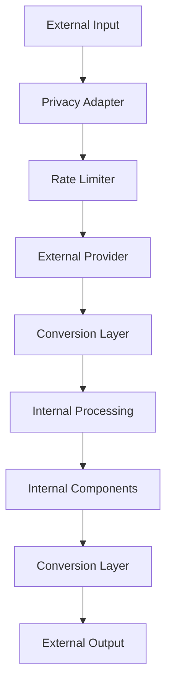
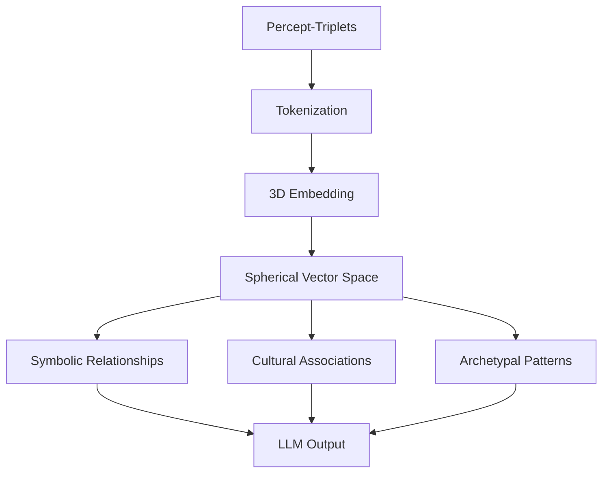
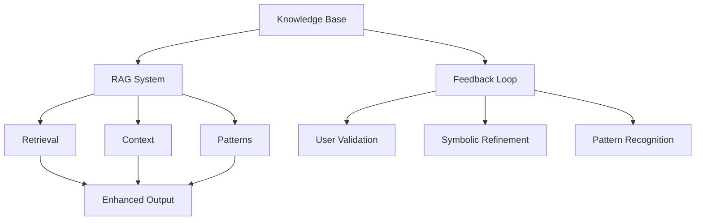
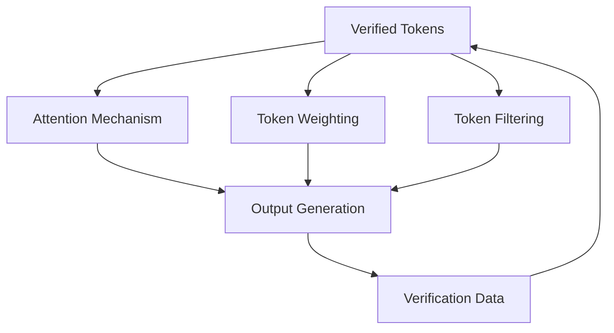
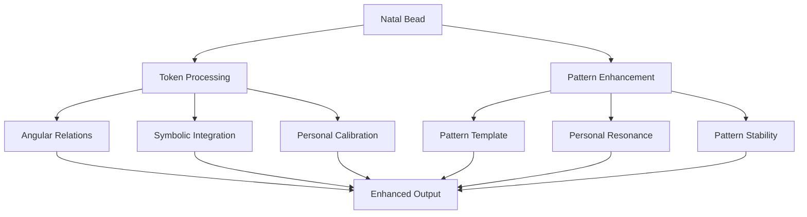
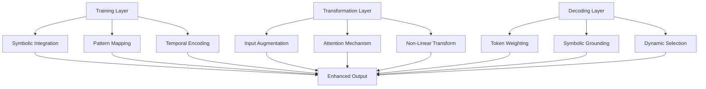

# 21. LLM Integration with Memorativa

The Memorativa system provides both internal processing and external interfaces for Large Language Models (LLMs). The internal system handles core processing with hybrid geometric structures, while external interfaces enable integration with third-party LLM services.

## External interfaces

The system offers four key external interfaces:

1. **Provider Interface** (`LLMProvider`)
   - Core text generation and embedding methods
   - Support for multiple providers (OpenAI, Anthropic, etc.)
   - Capability detection (streaming, context limits, etc.)
   - Provider-specific optimizations

2. **Privacy-Aware Adapter** (`LLMAdapter`)
   - Secure interface for external LLM processing
   - Public data handling only
   - Gas token verification
   - Format conversion

3. **Conversion Layer** (`FormatConverter`)
   - Bidirectional conversion between internal/external formats
   - Geometry simplification for external processing
   - Metadata handling
   - State preservation

4. **Rate Limiting & Cost Management** (`ExternalLLMManager`)
   - Provider-specific rate limits
   - Cost estimation and tracking
   - Gas verification
   - Usage monitoring

All external processing is:
- Limited to public data only
- Gas token verified
- Cost tracked
- Rate limited
- Basic validation checked

### 1. Provider Interface
```rust
pub trait LLMProvider {
    // Core interaction methods
    async fn generate_text(&self, prompt: &str) -> Result<String>;
    async fn generate_embeddings(&self, text: &str) -> Result<Vec<f32>>;
    
    // Optional capabilities
    fn supports_streaming(&self) -> bool;
    fn max_context_length(&self) -> usize;
    fn embedding_dimensions(&self) -> usize;
}

// Example implementations
pub struct OpenAIProvider {
    client: OpenAIClient,
    config: ProviderConfig,
}

pub struct AnthropicProvider {
    client: AnthropicClient,
    config: ProviderConfig,
}
```

### 2. Privacy-Aware Adapter
```rust
pub struct LLMAdapter {
    provider: Box<dyn LLMProvider>,
    privacy_filter: PrivacyFilter,
    token_manager: GasTokenManager,
    
    async fn process_external(
        &self,
        input: ExternalInput,
        privacy_level: PrivacyLevel
    ) -> Result<ProcessedOutput> {
        // Verify gas tokens
        self.token_manager.verify_operation(Operation::ExternalLLM)?;
        
        // Apply privacy filtering
        let filtered = self.privacy_filter.filter_for_external(input)?;
        
        // Process through external LLM
        let response = match privacy_level {
            PrivacyLevel::Public => {
                self.provider.generate_text(&filtered.prompt).await?
            },
            _ => return Err(Error::PrivacyLevelNotSupported)
        };
        
        // Convert to internal format
        self.convert_to_internal_format(response)
    }
}
```

### 3. Conversion Layer
```rust
pub struct FormatConverter {
    spatial_encoder: HybridSpatialEncoder,
    
    fn to_external_format(&self, internal: InternalFormat) -> Result<ExternalFormat> {
        // Strip internal geometric structures while preserving meaning
        let simplified = self.simplify_geometry(internal)?;
        
        // Convert to provider-specific format
        self.format_for_provider(simplified)
    }
    
    fn to_internal_format(&self, external: ExternalFormat) -> Result<InternalFormat> {
        // Project into hybrid space
        let coords = self.spatial_encoder.project_to_hybrid_space(external)?;
        
        // Add internal metadata
        InternalFormat::new(
            coords,
            PrivacyLevel::Public,
            VerificationScore::External,
            TemporalState::Mundane(Utc::now())
        )
    }
}
```

### 4. Rate Limiting & Cost Management
```rust
pub struct ExternalLLMManager {
    rate_limiter: RateLimiter,
    cost_tracker: CostTracker,
    
    async fn process_request(
        &self,
        request: ExternalRequest
    ) -> Result<ProcessedResponse> {
        // Check rate limits
        self.rate_limiter.check_limits(request.provider)?;
        
        // Estimate costs
        let estimated_cost = self.cost_tracker
            .estimate_cost(request.size, request.provider)?;
            
        // Verify sufficient gas
        self.verify_gas_for_external(estimated_cost)?;
        
        // Process request
        let response = self.process_with_provider(request).await?;
        
        // Track actual costs
        self.cost_tracker.record_usage(
            request.provider,
            response.tokens_used
        )?;
        
        Ok(response)
    }
}
```

## External Service Integration Points

### 1. Attention Head Injection
```rust
pub trait AttentionHeadInjector {
    // Inject hybrid geometric embeddings into attention computation
    fn inject_attention_embeddings(
        &self,
        base_embeddings: Embeddings,
        hybrid_coords: HybridCoords,
        quantum_state: QuantumState,
        attention_config: AttentionConfig
    ) -> Result<InjectedAttention>;

    // Modify attention patterns with aspect relationships
    fn inject_aspect_patterns(
        &self,
        attention_scores: AttentionScores,
        aspect_patterns: Vec<AspectPattern>
    ) -> Result<ModifiedScores>;

    // Add verification weights to attention mechanism
    fn inject_verification_weights(
        &self,
        attention_output: AttentionOutput,
        verification_scores: Vec<f32>
    ) -> Result<WeightedOutput>;
}

// Example implementation for specific provider
pub struct OpenAIAttentionInjector {
    hybrid_encoder: HybridSpatialEncoder,
    quantum_processor: QuantumInspiredProcessor,
    
    fn inject_to_layer(
        &self,
        layer_idx: usize,
        hybrid_data: HybridTriplet
    ) -> Result<ModifiedLayer> {
        // Inject into specific attention layer
    }
}
```

### 2. Sequence Processing Injection
```rust
pub trait SequenceInjector {
    // Inject hybrid temporal states into sequence processing
    fn inject_temporal_states(
        &self,
        sequence: Sequence,
        temporal_states: Vec<TemporalState>
    ) -> Result<TemporalSequence>;

    // Add spatial relationships to sequence context
    fn inject_spatial_context(
        &self,
        sequence: Sequence,
        spatial_relations: Vec<SpatialRelation>
    ) -> Result<SpatialSequence>;

    // Inject quantum interference patterns
    fn inject_quantum_patterns(
        &self,
        sequence: Sequence,
        quantum_states: Vec<QuantumState>
    ) -> Result<QuantumSequence>;
}
```

### 3. Transformation Layer Injection
```rust
pub trait TransformationInjector {
    // Inject hybrid geometry into transformer layers
    fn inject_hybrid_geometry(
        &self,
        layer_input: LayerInput,
        hybrid_coords: HybridCoords
    ) -> Result<HybridLayer>;

    // Add aspect-based activation functions
    fn inject_aspect_activations(
        &self,
        layer_output: LayerOutput,
        aspect_patterns: Vec<AspectPattern>
    ) -> Result<AspectOutput>;

    // Inject privacy-aware processing
    fn inject_privacy_controls(
        &self,
        layer: TransformerLayer,
        privacy_level: PrivacyLevel
    ) -> Result<PrivateLayer>;
}
```

### 4. Decoding Process Injection
```rust
pub trait DecodingInjector {
    // Inject hybrid token decoding
    fn inject_hybrid_decoding(
        &self,
        decoder_input: DecoderInput,
        hybrid_tokens: Vec<HybridToken>
    ) -> Result<HybridDecoding>;

    // Add verification-weighted output generation
    fn inject_verified_generation(
        &self,
        generation_output: Output,
        verification_scores: Vec<f32>
    ) -> Result<VerifiedOutput>;

    // Inject temporal coherence
    fn inject_temporal_coherence(
        &self,
        decoder_state: DecoderState,
        temporal_states: Vec<TemporalState>
    ) -> Result<CoherentState>;
}
```

### Integration Example
```rust
pub struct MemorativaLLMIntegration {
    attention_injector: Box<dyn AttentionHeadInjector>,
    sequence_injector: Box<dyn SequenceInjector>,
    transform_injector: Box<dyn TransformationInjector>,
    decoding_injector: Box<dyn DecodingInjector>,
    
    async fn process_with_injections(
        &self,
        input: ExternalInput,
        hybrid_data: HybridTriplet
    ) -> Result<ProcessedOutput> {
        // Inject into attention mechanism
        let attention_output = self.attention_injector
            .inject_attention_embeddings(
                input.embeddings,
                hybrid_data.coords,
                hybrid_data.quantum_state,
                input.config
            )?;
            
        // Inject into sequence processing
        let sequence_output = self.sequence_injector
            .inject_temporal_states(
                attention_output.sequence,
                hybrid_data.temporal_states
            )?;
            
        // Inject into transformer layers
        let transformed = self.transform_injector
            .inject_hybrid_geometry(
                sequence_output,
                hybrid_data.coords
            )?;
            
        // Inject into decoding
        let decoded = self.decoding_injector
            .inject_hybrid_decoding(
                transformed,
                hybrid_data.tokens
            )?;
            
        Ok(decoded)
    }
}
```

These injection points allow external LLM services to:
- Incorporate Memorativa's hybrid geometric embeddings
- Use aspect-based attention mechanisms
- Add verification-weighted processing
- Maintain temporal coherence
- Preserve privacy boundaries
- Leverage quantum-inspired features

While maintaining:
- Provider-specific optimizations
- Existing model architectures
- Performance characteristics
- Resource efficiency
- Security boundaries

## Integration Flow



## Key Differences

| Aspect | Internal Processing | External Interface |
|--------|-------------------|-------------------|
| Geometry | Full hybrid model | Simplified vectors |
| Privacy | All levels | Public only |
| Verification | Complete chain | Basic validation |
| Temporal | All states | Mundane only |
| Cost | Gas efficient | Provider rates |
| Features | Full system | Basic generation |


## Internal Processing System

The LLM integration system processes content through four main stages, each handling specific aspects of the hybrid geometric model while maintaining privacy, verification, and temporal coherence:

1. Input Processing transforms raw content into hybrid spherical-hyperbolic coordinates with quantum states
2. Percept-Triplet Formation creates quantum-inspired triplets with universal symbolic mappings
3. Focus Space Integration enables lens-based analysis with pattern detection
4. Book Generation synthesizes knowledge with privacy-aware RAG retrieval

Each stage preserves:
- Hybrid geometry (spherical + hyperbolic)
- Quantum states
- Privacy levels
- Verification scores
- Temporal states
- Aspect relationships

### 1. Input Processing
```rust
pub struct LLMProcessor {
    privacy_filter: PrivacyAwareFilter,
    token_manager: GasTokenManager,
    spatial_encoder: HybridSpatialEncoder,
    quantum_processor: QuantumInspiredProcessor,
    
    async fn process_input(&self, input: PlayerInput) -> Result<ProcessedInput> {
        // Verify gas tokens for operation
        self.token_manager.verify_operation(Operation::ProcessInput)?;
        
        // Apply privacy filtering
        let filtered = self.privacy_filter.filter_sensitive_content(input)?;
        
        // Generate hybrid embeddings
        let spherical = self.spatial_encoder.to_spherical(filtered)?;
        let hyperbolic = self.spatial_encoder.to_hyperbolic(filtered)?;
        let coords = HybridCoords::new(spherical, hyperbolic);
        
        // Add quantum state
        let quantum_state = self.quantum_processor
            .encode_state(coords, filtered.temporal_state)?;
        
        Ok(ProcessedInput {
            coords,
            quantum_state,
            privacy_level: filtered.privacy_level,
            temporal_state: filtered.temporal_state,
            verification_score: 1.0
        })
    }
}
```

### 2. Percept-Triplet Formation
```rust
impl PerceptTripletProcessor {
    async fn form_triplet(&self, input: ProcessedInput) -> Result<PerceptTriplet> {
        // Initialize quantum-inspired triplet
        let triplet = QuantumInspiredTriplet::new(
            input.coords,
            input.quantum_state
        );
        
        // Generate title-description through LLM
        let (title, desc) = self.generate_title_desc(triplet)?;
        
        // Translate through MST
        let universal = self.mst.translate((title, desc))?;
        
        // Create hybrid triplet with quantum state
        Ok(HybridTriplet::new(
            triplet,
            universal,
            input.verification_score,
            input.privacy_level,
            input.temporal_state
        ))
    }
}
```

### 3. Focus Space Integration

```rust
pub struct FocusSpaceLLM {
    lens_manager: LensManager,
    pattern_detector: HybridPatternDetector,
    privacy_guard: PrivacyGuard,
    quantum_processor: QuantumInspiredProcessor,
    
    async fn process_focus_space(&self, space: FocusSpace) -> Result<ProcessedSpace> {
        // Apply active lenses
        let lens_views = self.lens_manager.apply_lenses(space)?;
        
        // Detect hybrid patterns with privacy preservation
        let aspect_patterns = self.pattern_detector
            .detect_aspect_patterns(lens_views)?;
            
        let quantum_patterns = self.quantum_processor
            .detect_interference_patterns(lens_views)?;
            
        // Combine patterns
        let hybrid_patterns = self.pattern_detector
            .combine_patterns(aspect_patterns, quantum_patterns)?;
            
        // Generate insights through LLM
        let insights = self.generate_private_insights(hybrid_patterns)?;
        
        Ok(ProcessedSpace {
            lens_views,
            hybrid_patterns,
            insights,
            verification_score: calculate_pattern_verification(hybrid_patterns)
        })
    }
}
```

### 4. Book Generation

```rust
pub struct BookGenerator {
    rag_interface: RAGInterface,
    token_manager: GasTokenManager,
    
    async fn generate_book(&self, prototype: Prototype) -> Result<Book> {
        // Verify gas for operation
        self.token_manager.verify_operation(Operation::GenerateBook)?;
        
        // Retrieve relevant context
        let context = self.rag_interface.retrieve_context(prototype)?;
        
        // Generate content with privacy preservation
        let content = self.generate_private_content(prototype, context)?;
        
        // Structure into book format
        Ok(Book::new(content, prototype.metadata()))
    }
}
```

### Privacy-Aware Processing

```rust
pub struct LatticeEncryptedProcessor {
    // Add lattice-based encryption scheme
    lattice_params: LatticeParams,
    fhe_scheme: FHEParams,  // Fully Homomorphic Encryption
}

impl PrivacyAwareLLM for LatticeEncryptedProcessor {
    fn process_encrypted<T>(&self, input: T) -> Result<ProcessedOutput> {
        // Convert to lattice-based encryption
        let encrypted = lattice_encrypt(input, self.lattice_params)?;
        let processed = self.local_model.process(encrypted)?;
        Ok(lattice_decrypt(processed, self.lattice_params)?)
    }
}

// Modified privacy guard with PQC algorithms
pub struct PostQuantumPrivacyGuard {
    kyber: Kyber768,
    dilithium: Dilithium3,
}

impl PostQuantumPrivacyGuard {
    fn verify_access(&self, bead: GlassBead) -> Result<()> {
        // Use quantum-resistant signatures
        let valid = dilithium.verify(bead.signature, bead.data)?;
        // ... existing checks ...
    }
}
```

### Token-Aware Operations

```rust
pub struct TokenAwareLLM {
    gas_manager: GasTokenManager,
    glass_bead_manager: GlassBeadManager,
    
    async fn process_with_tokens(&self, operation: Operation) -> Result<Output> {
        // Verify gas tokens
        self.gas_manager.verify_operation(operation)?;
        
        // Process operation
        let result = self.process_operation(operation)?;
        
        // Mint glass beads if needed
        if operation.requires_glass_bead() {
            self.glass_bead_manager.mint_bead(result)?;
        }
        
        Ok(result)
    }
}
```

### Temporal Integration

```rust
pub struct TemporalLLM {
    state_manager: TemporalStateManager,
    
    async fn process_with_time(&self, input: Input) -> Result<Output> {
        match input.temporal_state {
            TemporalState::Mundane(timestamp) => {
                // Process with concrete time
                self.process_mundane(input, timestamp)
            },
            TemporalState::Quantum => {
                // Process without time constraints
                self.process_quantum(input)
            },
            TemporalState::Holographic(reference) => {
                // Process with reference time
                self.process_holographic(input, reference)
            }
        }
    }
}
```

### Key Benefits

1. **Privacy Preservation**
   - Privacy-aware processing at all levels
   - Encrypted operations for sensitive content
   - Granular access controls
   - Attribution preservation

2. **Token Integration**
   - Gas token verification for operations
   - Glass bead minting integration
   - Cost-aware processing
   - Reward distribution

3. **Temporal Awareness**
   - Support for multiple time states
   - State-aware processing
   - Temporal coherence
   - Reference time handling

4. **System Integration**
   - Complete RAG system compatibility
   - Focus space integration
   - Book generation support
   - Pattern recognition capabilities

This LLM integration architecture ensures:
- Privacy-first processing
- Token-based operation control
- Temporal state awareness
- System-wide integration
- Efficient resource utilization
- Scalable knowledge processing



## Conceptual space transformation

1. **Hybrid Space Processing**
   - Projects to both spherical and hyperbolic spaces
   - Handles quantum-inspired states
   - Maintains aspect relationships
   - Preserves verification scores
   - Tracks temporal states
   - Enforces privacy boundaries

2. **Pattern Recognition**
   - Detects aspect patterns in spherical space
   - Finds hierarchical patterns in hyperbolic space
   - Analyzes quantum interference patterns
   - Validates through verification scores
   - Maintains privacy separation
   - Preserves temporal coherence

3. **Cross-Lens Translation**
   - Maps between lens views in hybrid space
   - Preserves quantum states across translations
   - Maintains aspect relationships
   - Verifies pattern consistency
   - Respects privacy levels
   - Tracks temporal evolution

## Knowledge base integration

1. **Hybrid RAG System**
   - Uses hybrid geometry for retrieval
   - Handles quantum states in context
   - Preserves aspect relationships
   - Maintains verification scores
   - Enforces privacy boundaries
   - Tracks temporal states

2. **Pattern-Aware Retrieval**
   - Searches in both spherical and hyperbolic spaces
   - Considers quantum interference patterns
   - Weights by verification scores
   - Respects privacy levels
   - Maintains temporal coherence
   - Validates aspect relationships

3. **Feedback Integration**
   - Updates verification scores
   - Refines quantum states
   - Strengthens aspect patterns
   - Maintains privacy boundaries
   - Preserves temporal states
   - Enhances pattern recognition



## Inherited patterning

The process of encoding abstract concepts into percept-triplets and prototypes, then tokenizing and embedding them for LLM processing, creates a "hidden, inherited patterning" in the LLM's vector space over time. This latent structure enhances the model's ability to handle abstract concepts while maintaining symbolic depth, enabling more sophisticated reasoning about complex ideas without losing their essential meaning.

1. **Abstract Encoding and Semantic Patterning**
   - Encodes concepts at highly abstract, symbolic level (e.g., "Venus in Libra in 9th House")
   - Uses culturally embedded symbols (Planets, Signs, Houses) as semantic framework
   - Captures complex relationships lost in lower-level tokenization
   - Creates structured mappings to lower-level embeddings
   - Preserves symbolic depth through MST translations
   - Maintains archetypal associations across reductions

2. **Reduction to Basic Semantic Structures** 
   - Reduces abstract structures to machine-readable tokens
   - Maps tokens to semantic vectors while preserving relationships
   - Implicitly preserves symbolic and archetypal associations
   - Maintains meaning through embedding relationships
   - Enables efficient processing without loss of depth
   - Supports reconstruction of higher-level meanings

3. **Inherited Patterning in Vector Space**
   - Vector space inherits latent structure of percept-triplets
   - Symbolic associations reflect in token relationships
   - Enables pattern recognition without explicit references
   - Allows generalization to broader conceptual relationships
   - Supports emergence of new symbolic connections
   - Maintains coherence across abstraction levels

4. **Implementation Architecture**
   ```python
   class InheritedPattern:
       def __init__(self):
           self.latent_structure = {}
           self.pattern_recognition = {}
           self.generalization = {}
           
       def process_glass_bead(self, token):
           # Process verified token data
           if verify_merkle_proof(token.merkle_proof):
               self.update_latent_structure(token)
               self.recognize_patterns(token)
               self.generalize_patterns(token)
   
       def update_latent_structure(self, token):
           # Update vector space with symbolic patterns
           vector = encode_percept_triplet(token.percept)
           self.latent_structure[token.id] = vector
   
       def recognize_patterns(self, token):
           # Identify and validate patterns
           patterns = find_angular_aspects(token)
           self.pattern_recognition[token.id] = grade_patterns(patterns)
   
       def generalize_patterns(self, token):
           # Extend patterns across domains
           general = extend_to_prototypes(token)
           self.generalization[token.id] = translate_across_lenses(general)
   ```

5. **Long-Term Effects**
   - Creates latent knowledge base in vector space
   - Reflects cultural and philosophical depth in outputs
   - Enhances adaptability to new concepts
   - Enables symbolic reasoning capabilities
   - Supports contextually rich generation
   - Facilitates efficient knowledge transfer

6. **Pattern Evolution**
   - Tracks pattern changes through version control
   - Maintains pattern lineage via Merkle trees
   - Updates pattern weights through feedback
   - Evolves understanding through recursive analysis
   - Preserves pattern integrity through verification
   - Enables pattern synthesis through focus spaces



7. **Token Verification and Grading**
   - **User Validation**
     - Users validate token accuracy and relevance
     - Creates feedback loop for symbolic relationships
     - Improves system understanding over time
     - Enables personalized pattern recognition

   - **System Grading**
     - Grades tokens on consistency and coherence
     - Evaluates alignment with knowledge base
     - Measures symbolic relationship strength
     - Tracks pattern reliability metrics

   - **Community Consensus**
     - Aggregates multi-user validation
     - Ensures cultural/conceptual alignment
     - Builds shared symbolic understanding
     - Maintains collective pattern integrity

8. **Attention Mechanism**
   - Modulates attention with verification scores
   - Prioritizes high-quality tokens
   - Maintains contextual relevance
   - Ensures symbolic grounding


9. **Output Enhancement**
   - Augments with verified tokens
   - Enriches contextual understanding
   - Grounds in symbolic relationships
   - Maintains conceptual integrity

## Transformation layer processing with Glass Bead tokens

### Input augmentation

This function enhances embeddings by incorporating hybrid geometric information from glass beads:

```rust
pub struct InputAugmenter {
    spatial_encoder: HybridSpatialEncoder,
    privacy_guard: PrivacyGuard,
    quantum_processor: QuantumInspiredProcessor,
    
    fn augment_embeddings(&self, 
        embeddings: Embeddings, 
        glass_bead: GlassBead
    ) -> Result<AugmentedEmbeddings> {
        // Verify privacy and access rights
        self.privacy_guard.verify_access(glass_bead)?;
        
        // Get hybrid coordinates
        let coords = glass_bead.get_hybrid_coordinates()?;
        
        // Add quantum-inspired state
        let quantum_state = self.quantum_processor
            .encode_state(coords, glass_bead.temporal_state)?;
            
        // Project to hybrid space
        let hybrid_embeddings = self.spatial_encoder
            .project_to_hybrid_space(embeddings, coords)?;
            
        Ok(AugmentedEmbeddings {
            base: hybrid_embeddings,
            quantum_state,
            privacy_level: glass_bead.privacy_level,
            verification_score: glass_bead.verification_score
        })
    }
}
```

### Attention mechanism

The attention mechanism incorporates both spherical and hyperbolic relationships:

```rust
pub struct HybridAttention {
    spherical_processor: SphericalAttention,
    hyperbolic_processor: HyperbolicAttention,
    quantum_modulator: QuantumModulator,
    
    fn compute_attention(
        &self,
        query: HybridTriplet,
        keys: Vec<HybridTriplet>,
        values: Vec<HybridTriplet>
    ) -> Result<AttentionOutput> {
        // Calculate hybrid attention scores
        let spherical_scores = self.spherical_processor
            .compute_angular_attention(query, &keys)?;
            
        let hyperbolic_scores = self.hyperbolic_processor
            .compute_distance_attention(query, &keys)?;
            
        // Blend based on curvature
        let kappa = query.curvature;
        let hybrid_scores = blend_attention_scores(
            spherical_scores,
            hyperbolic_scores,
            kappa
        )?;
        
        // Apply quantum modulation
        let modulated = self.quantum_modulator
            .modulate_attention(hybrid_scores, query.quantum_state)?;
            
        // Weight by verification scores
        let weighted = apply_verification_weights(
            modulated,
            &keys.iter().map(|k| k.verification_score).collect()
        )?;
        
        Ok(AttentionOutput {
            scores: weighted,
            values: values.clone(),
            privacy_level: determine_privacy_level(&query, &keys)
        })
    }
}
```

### Non-linear transformation

The activation functions adapt to the hybrid geometry and quantum states:

```rust
pub struct HybridActivation {
    quantum_processor: QuantumInspiredProcessor,
    aspect_detector: AspectPatternDetector,
    
    fn transform(&self, 
        input: HybridTensor,
        glass_bead: GlassBead
    ) -> Result<HybridTensor> {
        // Get aspect pattern
        let aspect = self.aspect_detector
            .detect_pattern(glass_bead.coords)?;
            
        // Calculate quantum phase
        let phase = self.quantum_processor
            .calculate_phase(glass_bead.quantum_state)?;
            
        // Apply hybrid activation
        let activated = match aspect {
            AspectType::Conjunction => { // 0° ±5°
                apply_quantum_conjunction(input, phase)
            },
            AspectType::Opposition => { // 180° ±5°
                apply_quantum_opposition(input, phase)
            },
            AspectType::Trine => { // 120° ±5°
                apply_quantum_trine(input, phase)
            },
            _ => apply_default_activation(input)
        }?;
        
        // Preserve privacy level
        Ok(HybridTensor {
            data: activated,
            privacy_level: glass_bead.privacy_level,
            verification_score: glass_bead.verification_score
        })
    }
}
```

This transformation layer ensures:
- Full integration with hybrid spherical-hyperbolic geometry
- Quantum-inspired processing for enhanced pattern detection
- Privacy preservation throughout transformations
- Verification score propagation
- Aspect-aware activation functions
- Temporal state handling

## Glass Bead token decoding

### Spatial context decoding

```rust
pub struct HybridTokenDecoder {
    spatial_encoder: HybridSpatialEncoder,
    quantum_processor: QuantumInspiredProcessor,
    privacy_guard: PrivacyGuard,
    
    fn decode_spatial_context(
        &self,
        glass_bead: GlassBead,
        query: HybridTriplet
    ) -> Result<DecodedContext> {
        // Verify access and privacy
        self.privacy_guard.verify_access(glass_bead)?;
        
        // Get hybrid coordinates
        let coords = glass_bead.get_hybrid_coordinates()?;
        
        // Calculate quantum resonance
        let resonance = self.quantum_processor
            .calculate_resonance(coords, query.quantum_state)?;
            
        // Calculate hybrid distance
        let distance = if coords.curvature > 0.0 {
            self.calculate_hyperbolic_distance(coords, query)?
        } else {
            self.calculate_spherical_distance(coords, query)?
        };
        
        // Weight by verification score
        let weight = glass_bead.verification_score * 
            calculate_aspect_weight(distance);
            
        Ok(DecodedContext {
            coords,
            resonance,
            distance,
            weight,
            privacy_level: glass_bead.privacy_level,
            temporal_state: glass_bead.temporal_state
        })
    }
}
```

### Pattern recognition

```rust
pub struct HybridPatternDetector {
    aspect_detector: AspectPatternDetector,
    quantum_analyzer: QuantumStateAnalyzer,
    
    fn detect_patterns(
        &self,
        tokens: Vec<GlassBead>
    ) -> Result<Vec<HybridPattern>> {
        let mut patterns = Vec::new();
        
        // Group by privacy level for secure processing
        let privacy_groups = group_by_privacy_level(tokens);
        
        for group in privacy_groups {
            // Verify group access
            self.privacy_guard.verify_group_access(&group)?;
            
            // Detect aspect patterns
            let aspect_patterns = self.aspect_detector
                .find_significant_aspects(&group)?;
                
            // Analyze quantum interference
            let quantum_patterns = self.quantum_analyzer
                .detect_interference_patterns(&group)?;
                
            // Combine patterns with verification weights
            let hybrid_patterns = self.combine_patterns(
                aspect_patterns,
                quantum_patterns,
                &group
            )?;
            
            patterns.extend(hybrid_patterns);
        }
        
        Ok(patterns)
    }
    
    fn combine_patterns(
        &self,
        aspects: Vec<AspectPattern>,
        quantum: Vec<QuantumPattern>,
        group: &PrivacyGroup
    ) -> Result<Vec<HybridPattern>> {
        // Combine while preserving privacy and verification
        let mut combined = Vec::new();
        
        for (aspect, quantum) in aspects.iter().zip(quantum.iter()) {
            let verification = weighted_average(
                aspect.verification_score,
                quantum.verification_score
            );
            
            combined.push(HybridPattern {
                aspect: aspect.clone(),
                quantum: quantum.clone(),
                verification,
                privacy_level: group.privacy_level,
                temporal_state: aspect.temporal_state
            });
        }
        
        Ok(combined)
    }
}
```

### Output generation

```rust
pub struct HybridOutputGenerator {
    quantum_modulator: QuantumModulator,
    privacy_enforcer: PrivacyEnforcer,
    temporal_manager: TemporalStateManager,
    
    fn generate_output(
        &self,
        patterns: Vec<HybridPattern>,
        context: DecodedContext
    ) -> Result<HybridOutput> {
        // Apply quantum modulation
        let modulated = self.quantum_modulator
            .modulate_patterns(patterns, context.quantum_state)?;
            
        // Generate with privacy preservation
        let output = self.privacy_enforcer
            .generate_private_output(modulated, context.privacy_level)?;
            
        // Apply temporal context
        let temporal_output = self.temporal_manager
            .apply_temporal_state(output, context.temporal_state)?;
            
        Ok(HybridOutput {
            data: temporal_output,
            verification_score: context.verification_score,
            privacy_level: context.privacy_level,
            temporal_state: context.temporal_state
        })
    }
}
```

This decoding system ensures:
- Full hybrid spherical-hyperbolic geometry support
- Quantum-inspired pattern detection
- Privacy preservation at all stages
- Verification score propagation
- Temporal state awareness
- Secure pattern combination
- Privacy-aware output generation

The system maintains:
- Token integrity through verification
- Privacy boundaries during processing
- Quantum coherence in patterns
- Temporal state consistency
- Hybrid geometric relationships
- Secure pattern detection
- Verification score propagation

## Natal Bead integration

1. **Reference Processing**
   - Incorporates Natal Bead angular relationships
   - Maintains reference consistency across outputs
   - Personalizes token embeddings
   - Calibrates symbolic interpretations

   The reference processing system operates in 3D spherical space, using a specialized processor to maintain spatial relationships:

   This Python code defines a class called `NatalReferenceProcessor` designed to process `SphericalToken` objects in relation to a "Natal Bead," represented as a `SphericalTriplet`.  This class implements a mechanism for personalizing or contextualizing token processing based on a reference point in the 3D spherical space.

   ```python
   class NatalReferenceProcessor:
       def __init__(self, natal_bead: SphericalTriplet):
           self.reference_coords = natal_bead.coords
           self.spatial_index = KDTree(dim=3)
           self.aspect_cache = LRUCache(maxsize=1000)
           
       def process_token(self, token: SphericalToken) -> SphericalToken:
           # Calculate 3D angular relationship
           angle = calculate_3d_angle(self.reference_coords, token.coords)
           
           # Find resonant patterns in spatial neighborhood
           neighbors = self.spatial_index.query(token.coords, k=5)
           resonance = calculate_resonance_pattern(angle, neighbors)
           
           # Apply natal aspect weights
           weighted = apply_natal_weights(token, resonance)
           
           # Update spatial indices
           self.spatial_index.insert(weighted.coords)
           self.aspect_cache.add(token.id, resonance)
           
           return weighted

       def calculate_resonance_pattern(self, angle: float, neighbors: List[SphericalToken]) -> ResonancePattern:
           # Map angular relationships to spherical harmonics
           harmonics = map_to_spherical_harmonics(angle)
           
           # Calculate resonance with neighboring tokens
           neighbor_resonance = [
               calculate_harmonic_resonance(harmonics, n.coords)
               for n in neighbors
           ]
           
           return ResonancePattern(harmonics, neighbor_resonance)
   ```

2. **Pattern Enhancement**
   - Uses Natal Bead as 3D pattern template in spherical space
   - Strengthens personal resonance through angular relationships
   - Improves pattern stability via spatial anchoring
   - Enables holographic analysis through 3D transformations



3. **Temporal Integration**
   - Uses Natal Bead as temporal anchor
   - Enables holographic time states
   - Maintains chronological coherence
   - Supports temporal analysis

## Token integration layers

1. **Training Layer Integration**
   - Glass Bead tokens shape LLM training through:
     - Structured symbolic relationships in 3D spherical space
     - Verified pattern templates with angular resonance
     - Cultural and archetypal mappings via spatial coordinates
     - Temporal state encodings with holographic projections

This Python code defines a class called `SphericalTrainingLayer`. This class is designed to process `GlassBead` tokens and prepare them for use in training a machine learning model within the Memorativa system. It focuses on integrating the spatial information encoded in `GlassBead` tokens into the training process.

   ```python
   class SphericalTrainingLayer:
       def __init__(self):
           self.spatial_index = KDTree(dim=3)
           self.harmonic_cache = SphericalHarmonicCache()
           
       def integrate_token(self, token: GlassBead) -> TrainingData:
           # Project token into spherical training space
           coords = token.get_spherical_coordinates()
           
           # Find resonant patterns in neighborhood
           neighbors = self.spatial_index.query(coords, k=5)
           harmonics = self.harmonic_cache.get_harmonics(neighbors)
           
           # Generate training examples with angular relationships
           examples = generate_aspect_examples(coords, harmonics)
           
           return TrainingData(examples, token.metadata)
   ```

2. **Transformation Layer Processing**

   - Input Augmentation:
   ```python
   input_embeddings = torch.cat([text_embeddings, glass_bead_embeddings], dim=-1)
   ```
   - Attention Mechanism:
   ```python
   Q = self.query(text_embeddings)
   K = self.key(torch.cat([text_embeddings, glass_bead_embeddings], dim=-1))
   V = self.value(torch.cat([text_embeddings, glass_bead_embeddings], dim=-1))
     ```
   - Non-Linear Transformation:
   ```python
   def symbolic_activation(x, glass_bead_embeddings):
       aspect_type = classify_aspect(glass_bead_embeddings)
       if aspect_type == "square":
           return torch.relu(x) * 1.5  # Amplify tension
       elif aspect_type == "trine":
           return torch.tanh(x)  # Smooth harmony
       else:
           return torch.relu(x)
   ```



## Token processing pipeline

1. **Input Processing**
   - Token Resolution:
   ```python
   def resolve_glass_bead_token(token: SphericalToken, rag_corpus):
       referenced_data = rag_corpus.get(token.reference)
       if verify_merkle_proof(token.merkle_proof, referenced_data):
           # Project into 3D space
           spatial_data = project_to_spherical(referenced_data)
           # Verify spatial integrity
           if verify_spatial_consistency(spatial_data, token.coords):
               return spatial_data
           else:
               raise ValueError("Spatial consistency check failed")
       else:
           raise ValueError("Invalid Merkle proof")
   ```

   - Merkle Tree Verification with Spatial Hashing:
   ```python
   def verify_spatial_merkle_proof(merkle_proof, referenced_data):
       # Include spatial coordinates in hash
       spatial_hash = hash_with_coordinates(referenced_data)
       current_hash = spatial_hash
       
       for proof in merkle_proof:
           if proof['side'] == 'left':
               current_hash = hash(proof['hash'] + current_hash)
           else:
               current_hash = hash(current_hash + proof['hash'])
               
       return current_hash == merkle_proof[-1]['root_hash']
   ```

2. **Token Selection**
   - Relevance Filtering:
   ```python
   def select_glass_bead_tokens(input_query: SphericalQuery, glass_bead_tokens: List[SphericalToken]):
       # First pass: Spatial filtering using k-d tree
       spatial_index = KDTree(dim=3)
       for token in glass_bead_tokens:
           spatial_index.insert(token.coords)
       
       # Find tokens in relevant spatial regions
       nearby_tokens = spatial_index.query_radius(
           input_query.coords, 
           radius=ASPECT_ORBS['conjunction']
       )
       
       # Second pass: Angular relationship filtering
       aspect_filtered = []
       for token in nearby_tokens:
           angle = calculate_3d_angle(input_query.coords, token.coords)
           if is_significant_aspect(angle):
               weight = get_aspect_weight(angle) * token.grade
               aspect_filtered.append((token, weight))
       
       # Sort by combined spatial and quality weights
       return sorted(aspect_filtered, key=lambda x: x[1], reverse=True)
   ```

3. **Token Application**
   - Attention Weighting:
   ```python
   def compute_attention_with_weights(Q, K, V, verification_weights, spatial_coords):
       # Calculate base attention scores
       base_scores = torch.matmul(Q, K.transpose(-2, -1)) / sqrt(dim)
       
       # Compute spatial attention weights
       spatial_weights = compute_spatial_attention(
           spatial_coords.query,
           spatial_coords.keys,
           ASPECT_THRESHOLDS
       )
       
       # Combine verification and spatial weights
       combined_weights = verification_weights * spatial_weights
       attention_scores = base_scores * combined_weights
       
       # Apply spherical harmonic modulation
       harmonic_weights = compute_harmonic_weights(spatial_coords.keys)
       modulated_scores = apply_harmonic_modulation(attention_scores, harmonic_weights)
       
       return torch.matmul(modulated_scores, V)
   ```

## Token evolution tracking

1. **Version Management**
   - Tracks token modifications
   - Maintains evolution history
   - Preserves relationship changes
   - Updates verification weights

   Implementation of 3D spatial tracking:
   ```python
   class SpatialVersionManager:
       def __init__(self):
           self.spatial_history = SpatialTimeline()
           self.aspect_tracker = AspectEvolutionTracker()
           
       def track_modification(self, token: SphericalToken, modification: TokenDelta):
           # Record spatial trajectory
           spatial_delta = calculate_spatial_delta(token.coords, modification)
           self.spatial_history.add_waypoint(token.id, spatial_delta)
           
           # Track aspect changes
           affected_aspects = find_affected_aspects(token, modification)
           self.aspect_tracker.update(token.id, affected_aspects)
           
           # Update verification based on spatial coherence
           spatial_coherence = measure_spatial_coherence(token, modification)
           return update_verification_weights(token, spatial_coherence)
   ```

2. **Pattern Learning**
   - Identifies successful patterns
   - Adapts verification weights
   - Refines selection criteria
   - Improves token relevance

   3D Pattern Analysis Implementation:
   ```python
   class SpatialPatternLearner:
       def __init__(self):
           self.pattern_index = SphericalPatternIndex()
           self.success_tracker = AspectSuccessTracker()
           
       def learn_from_token(self, token: SphericalToken, success_metrics: SuccessMetrics):
           # Extract spatial patterns
           patterns = extract_3d_patterns(token)
           
           # Update pattern success rates
           for pattern in patterns:
               success_rate = calculate_pattern_success(pattern, success_metrics)
               self.success_tracker.update(pattern, success_rate)
               
           # Adjust selection weights based on spatial success
           new_weights = adjust_spatial_weights(
               self.success_tracker.get_pattern_stats(),
               self.pattern_index.get_aspect_distribution()
           )
           
           return new_weights
   ```

3. **Feedback Integration**
   - User validation tracking
   - Pattern success metrics
   - Relationship strength updates
   - Quality score refinement

## Key points

1. **Hybrid Geometry Integration**
   - Combined spherical-hyperbolic coordinate system for both symbolic and hierarchical relationships
   - Dynamic curvature parameter (κ) for geometry transitions
   - Aspect pattern detection in spherical space
   - Hierarchical relationships in hyperbolic space
   - Efficient spatial indexing with KD-trees
   - Angular relationship preservation

2. **Quantum-Inspired Features**
   - Quantum state handling for enhanced pattern detection
   - Interference pattern analysis for relationships
   - Phase-based activation functions
   - Resonance detection between tokens
   - Quantum coherence preservation
   - State superposition for temporal analysis

3. **Glass Bead Integration**
   - Complete token lifecycle management
   - Merkle tree verification for state changes
   - Privacy-preserving operations
   - Verification score propagation
   - Temporal state tracking
   - Aspect pattern validation

4. **Prototype Processing**
   - Observer-centric pattern detection
   - Quantum-inspired triplet formation
   - Hybrid geometric transformations
   - Pattern evolution tracking
   - Verification-weighted analysis
   - Temporal coherence maintenance

5. **Privacy Architecture**
   - Granular access controls
   - Privacy-aware pattern detection
   - Encrypted operations
   - Secure token processing
   - Protected temporal states
   - Verification boundaries

6. **System Benefits**
   - Rich symbolic reasoning with hybrid geometry
   - Efficient pattern detection through quantum inspiration
   - Secure and verifiable token operations
   - Privacy-preserved knowledge evolution
   - Efficient spatial relationship processing
   - Robust temporal state management

This architecture provides:
- Complete integration with hybrid geometric model
- Enhanced pattern detection through quantum features
- Secure and verifiable token operations
- Privacy-preserved knowledge evolution
- Efficient spatial relationship processing
- Robust temporal state management

