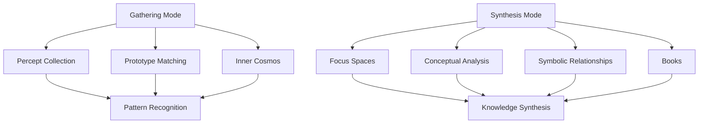
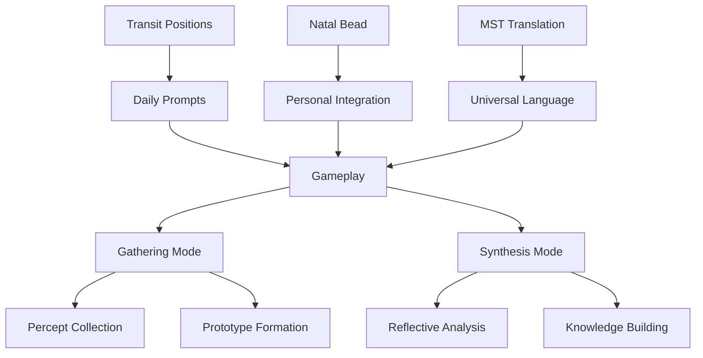
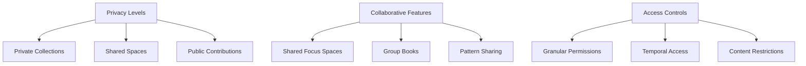
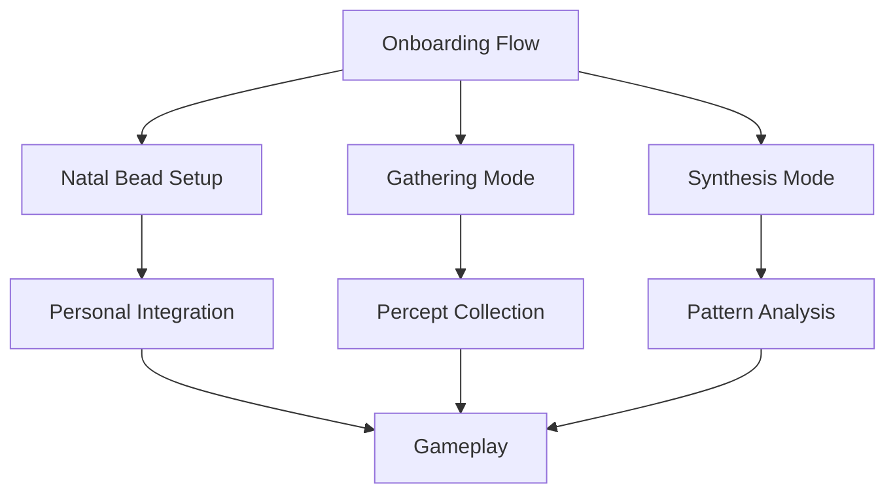
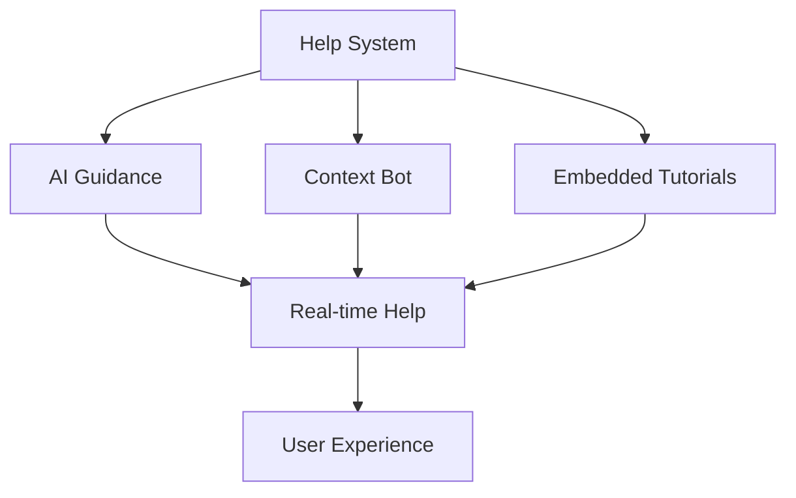

# 23. Gameplay

Memorativa gameplay operates on two distinct cognitive levels, each representing different modes of human thinking and interaction with the system. The game is driven by daily planetary transits and anchored by each player's Natal Glass Bead.

## Cognitive levels

1. **Gathering Mode**
   - Focuses on percept collection and curation
   - Mirrors natural human prototype matching
   - Enables personal cosmos construction
   - Supports intuitive pattern recognition

2. **Synthesis Mode**
   - Enables reflective conceptual analysis
   - Works with focus spaces and structures
   - Creates and analyzes Books
   - Explores deeper symbolic relationships
   - Supports active knowledge construction
   - Enables recursive knowledge development



## Game modes

1. **Gathering Mode**
   - **Digital Scrapbook**: Players collect and curate percepts into their inner cosmos
   - **Prototype Formation**: Natural matching of percepts to archetypal patterns
   - **Intuitive Collection**: Similar to Pinterest-style curation but with symbolic depth
   - **Model Refinement**: Continuous improvement of personal prototype collection
   - **Cultural Anchoring**: Supports both mimetic and cultural prototype development

2. **Synthesis Mode**
   - **Reflective Analysis**: Deep exploration of conceptual foundations
   - **Structure Work**: Active engagement with focus spaces
   - **Pattern Recognition**: Discovery of deeper symbolic connections
   - **Knowledge Construction**: Building and analyzing Books
   - **Self-Directed Learning**: Active rather than passive knowledge development

## Transit-driven gameplay

1. **Daily Prompts**
   - Generated from planetary positions (e.g., Mars at 10° Capricorn)
   - Forms aspects to player's existing beads
   - Creates dynamic, personalized challenges
   - Example: "Mars squares your Venus—add a percept"

2. **Natal Bead Integration**
   - Acts as personal reference beam
   - Derived from player's birth chart (e.g., Sun-Leo-1st at 5°)
   - Tunes quantum bead states
   - Personalizes transit interpretations

3. **MST Translation Layer**
   - Converts astrological encodings to universal language
   - Example: Venus-Libra-9th → "Harmonious Ethics"
   - Ensures accessibility for all players
   - Maintains symbolic depth while removing astrological complexity



## Gameplay progression

1. **Initial Phase**
   - Create personal Natal Bead
   - Learn basic percept collection
   - Begin prototype recognition
   - Explore focus spaces

2. **Development Phase**
   - Build inner cosmos
   - Form complex prototypes
   - Create first Books
   - Engage with transit prompts

3. **Mastery Phase**
   - Deep pattern analysis
   - Advanced Book creation
   - Collaborative synthesis
   - Knowledge network building

## Reward mechanics

1. **Glass Bead Generation**
   - Earned through percept collection
   - Awarded for prototype formation
   - Generated from Book creation
   - Gained through collaboration

2. **Achievement System**
   - Personal development milestones
   - Pattern recognition achievements
   - Knowledge construction goals
   - Collaborative accomplishments

3. **Progress Tracking**
   - Inner cosmos growth metrics
   - Prototype quality measures
   - Book development tracking
   - Collaboration statistics

## Privacy and collaboration

1. **Privacy Levels**
   - Private collections (personal only)
   - Shared spaces (selected collaborators)
   - Public contributions (community visible)
   - System training (AI learning permitted)

2. **Collaborative Features**
   - Shared focus spaces
   - Group Book creation
   - Pattern sharing networks
   - Knowledge synthesis teams

3. **Access Controls**
   - Granular permission settings
   - Temporal access limits
   - Content type restrictions
   - Usage tracking



## UI and progressive onboarding

1. **Guided Onboarding Flow**
   - Multi-stage tutorial ("Beginner's Quest")
   - Progress indicators and achievement badges
   - Contextual help and tooltips
   - Gradual feature introduction



2. **Adaptive Interface**
   - Dynamic UI panels based on user level
   - Context-sensitive tooltips and overlays
   - Progressive feature unveiling
   - Customizable complexity settings

3. **Sandbox Environment**
   - Safe experimentation space
   - Simulated transit prompts
   - Practice percept collection
   - Risk-free prototype formation

4. **Help System**
   - AI-powered guidance
   - Context-aware chatbot
   - Embedded tutorials
   - Real-time explanations



5. **Visual Framework**
   - Unified symbolic language
   - Animated visualizations
   - Interactive horoscope charts
   - Clear visual hierarchies

6. **Feature Progression**
   - Tiered access system
   - Achievement-based unlocks
   - Collaborative tool access
   - Advanced analysis features

## Implementation components

1. **Onboarding Modal**
```jsx
import React, { useState } from 'react';

function OnboardingModal({ onComplete }) {
    const [step, setStep] = useState(0);
    const steps = [
        'Welcome to Memorativa',
        'Create your Natal Bead',
        'Collect percepts in Gathering Mode',
        'Explore Synthesis Mode'
    ];

    const nextStep = () => {
        if (step < steps.length - 1) {
            setStep(step + 1);
        } else {
            onComplete?.();
        }
    };

    return (
        <div className="onboarding-modal">
            <div className="modal-content">
                <p>{steps[step]}</p>
                <button onClick={nextStep}>
                    {step < steps.length - 1 ? 'Next' : 'Start'}
                </button>
            </div>
        </div>
    );
}
```

2. **Progress Tracking**
```typescript
interface ProgressState {
    natalBeadCreated: boolean;
    perceptsCollected: number;
    prototypesFormed: number;
    booksCreated: number;
    focusSpacesExplored: number;
}

class ProgressTracker {
    state: ProgressState;
    
    updateProgress(action: string): void {
        // Update state and trigger achievements
    }
    
    checkUnlocks(): string[] {
        // Return newly unlocked features
    }
}
```

## Gas Bead Token Integration

Gas Bead Tokens (GBT) power all gameplay operations and incentivize participation:

### Core Operations
| Operation | GBT Cost | Description |
|-----------|----------|-------------|
| Percept Collection | 1-5 GBT | Adding new percepts to inner cosmos |
| Prototype Formation | 5-15 GBT | Creating new conceptual patterns |
| Focus Space Creation | 10-30 GBT | Opening new conceptual workspaces |
| Book Generation | 20-50 GBT | Synthesizing knowledge into Books |

### Reward Structure
| Activity | GBT Reward | Description |
|----------|------------|-------------|
| Quality Percepts | 5-10 GBT | Contributing meaningful percepts |
| Prototype Validation | 2-5 GBT | Validating others' prototypes |
| Book Creation | 20-50 GBT | Generating comprehensive Books |
| System Validation | 1-3 GBT | Basic maintenance activities |

### Daily Allocation
- Basic daily activities earn 15-30 GBT
- Active contributors can earn 50-100 GBT
- Monthly active users maintain positive GBT flow
- Bonus rewards for first-time operations
- Community rewards for collaborative work

## Collaborative gameplay

Building on the core gameplay mechanics, **Collaborative Game Play** enables structured knowledge sharing through multiple sharing models. Each model has specific GBT costs and rewards to incentivize meaningful collaboration while preserving privacy and attribution.

### Sharing Models

1. **Read-Only Sharing**
   - Share focus space links with view-only access
   - Cost: 1 GBT per shared link
   - Reward: 0.1 GBT per unique viewer
   - Privacy: Original content remains protected
   - Attribution: Full source tracking

2. **Collaborative Access**
   - Grant edit permissions to specific collaborators
   - Cost: 5 GBT per collaborator
   - Reward: 2 GBT per accepted contribution
   - Privacy: Granular permission settings
   - Attribution: Multi-author tracking

3. **Temporary Sessions**
   - Real-time collaboration with time-limited access
   - Cost: 3 GBT per hour
   - Reward: Split based on contribution metrics
   - Privacy: Session-specific controls
   - Attribution: Session activity logs

4. **Fork-and-Merge**
   - Asynchronous collaboration through forking
   - Cost: 10 GBT to fork
   - Reward: 15 GBT for accepted merge
   - Privacy: Independent workspaces
   - Attribution: Fork lineage tracking

### Collaborative Features

- **Interactive Shared Dashboard**  
  A unified interface displays both personal collections and group contributions, with privacy-aware visualizations showing only permitted content to each collaborator.

- **Group Synthesis Tools**
  - Shared focus spaces with permission inheritance
  - Multi-author Books with attribution tracking
  - Pattern validation through group consensus
  - Merkle-verified version control

- **Real-Time Collaboration**
  - Live co-editing with privacy boundaries
  - Instant chat within permission scope
  - Annotation system with attribution
  - Activity tracking and rewards

- **Transit-Driven Challenges**
  - Daily group tasks based on planetary positions
  - Shared reward pools for collective completion
  - Privacy-preserved contribution tracking
  - Automated attribution and reward distribution

### Access Control Integration

1. **Privacy Levels**
   - Private (owner only)
   - NotShared (AI training allowed)
   - Public (full system access)
   - Shared (specific collaborators)

2. **Permission Types**
   - Read: View content
   - Write: Add/modify content
   - Share: Grant access to others
   - Admin: Manage permissions

3. **Inheritance Rules**
   - Child spaces inherit parent permissions
   - Overridable at each level
   - Mergeable time states
   - Propagating prototype weights

### Reward Distribution

1. **Individual Rewards**
   - Quality contributions: 5-10 GBT
   - Pattern validation: 2-5 GBT
   - Knowledge synthesis: 10-30 GBT

2. **Group Rewards**
   - Collective challenges: 20-50 GBT pool
   - Shared discoveries: 15-30 GBT split
   - Community validation: 5-15 GBT distributed

3. **Bonus Multipliers**
   - Consistent collaboration: 1.5x
   - High-quality patterns: 2x
   - Novel connections: 1.8x
   - Community impact: 1.3x

This collaborative framework ensures:
- Clear sharing models with defined costs/rewards
- Privacy-first collaboration architecture
- Fair attribution and reward distribution
- Scalable group interactions
- Secure version control
- Incentivized quality contributions

## Key points

1. **Core Gameplay Structure**
   - Two cognitive modes: Gathering and Synthesis
   - Transit-driven daily challenges
   - Natal Bead anchoring for personalization
   - Progressive feature unlocking
   - Adaptive interface complexity

2. **Token Economy**
   - Gas Bead Tokens (GBT) power all operations
   - Balanced cost structure for core actions
   - Sustainable daily reward allocation
   - Multiple earning opportunities
   - Incentivized quality contributions

3. **Collaborative Framework**
   - Multiple sharing models with defined costs/rewards
   - Privacy-preserving collaboration tools
   - Clear attribution and reward tracking
   - Scalable group interactions
   - Transit-driven group challenges

4. **Privacy Architecture**
   - Granular privacy levels
   - Hierarchical permission system
   - Inheritance-based access control
   - Secure version tracking
   - Protected collaboration spaces

5. **Progression System**
   - Achievement-based feature unlocks
   - Skill-appropriate interface adaptation
   - Guided onboarding process
   - Safe experimentation environment
   - Comprehensive help system

6. **Reward Mechanics**
   - Individual contribution rewards
   - Group achievement bonuses
   - Quality-based multipliers
   - Community impact incentives
   - Collaborative success sharing

This gameplay design creates:
- Engaging daily activities driven by transits
- Sustainable token economy
- Privacy-first collaboration
- Clear progression paths
- Fair reward distribution
- Rich knowledge synthesis opportunities
