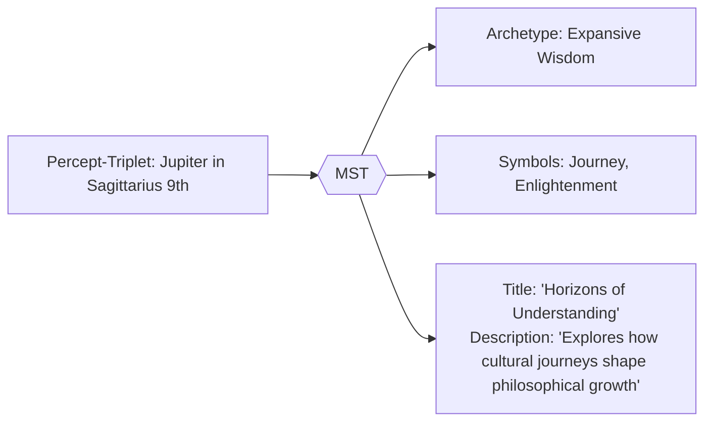

# 2.5. Symbolic Translation System (MST)  

The **Memorativa Symbolic Translator (MST)** converts astrologically encoded percept-triplets into universal symbolic language while preserving conceptual relationships. This enables non-astrological analysis of prototypes and percepts. The MST leverages generative AI to create dynamic English language narratives and analyses based on the percept-triplets and prototypes. Other Memorativa systems, including the symbolic Lens system will handle further translations into other symbolic systems across cultures and time.

## Key functions

1. **Archetype Abstraction**  
   - Translates planetary positions → universal concepts (Saturn → "Boundaries")  
   - Converts astrological houses → conceptual domains (4th House → "Rootedness")  
   - Uses generative AI to create contextually rich descriptions of archetypes and their relationships.

2. **Cross-Cultural Mapping**  
   - Identifies equivalent symbols across traditions (Mercury ≈ Hermes ≈ Thoth)  
   - Ensures cultural neutrality in title-description pairs  
   - Leverages generative AI to generate English language narratives and analyses.

3. **Contextual Bridging**  
   - Maintains semantic relationships between original and translated elements  
   - Example: "Moon in Cancer 4th" → "Nurturing Foundations"  
   - Uses generative AI to create dynamic narratives that bridge symbolic and conceptual contexts.

## Implementation

- **Architecture**: Hybrid system combining:  
  - Fine-tuned LLM (cultural/archetypal knowledge)  
  - Symbolic pattern matcher (mythological cross-references)  
- **Training Data**:  
  - Corupus of books on mythology, symbols, astrology, estorica traditions, mathematics, and philosophy  
- **Output Rules**:  
  - Strict prohibition of astrological terms  
  - Mandatory grounding in 3+ cultural references  

## Workflow example

## Key points

- Converts astrological percept-triplets into culturally-neutral symbolic language
- Preserves semantic relationships and conceptual meaning during translation
- Uses hybrid architecture combining LLM with symbolic pattern matching
- Generates dynamic English narratives and analyses from translated symbols
- Maintains strict separation from astrological terminology in outputs
- Integrates with broader Memorativa systems for additional symbolic translations