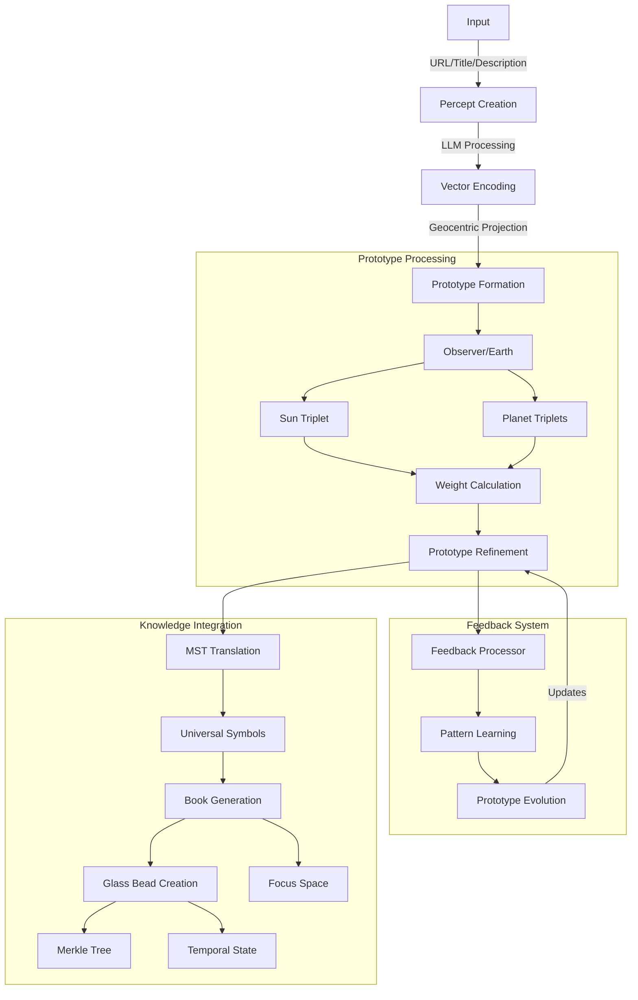

# 9. The Prototype

## Overview
In Memorativa, the prototype is a fractal extension of the percept-triplet structure, maintaining its geocentric orientation. Like a horoscope chart, it places the observer/Earth at the center, with multiple percept-triplets (including the representative sun triplet) arranged as vectors in the surrounding space. Each vector maps to an archetype represented by a planet, with their relationships defined through aspects and angular relationships from the central reference point. Memorativa uses the MST to ensure the prototype is symbolically universalized. The prototype is the best representative of the concept united with the percept, serving as the symbolic representative when the system needs to "talk about" pre-linguistic concepts.

## Core components

| **Component**         | **Description**                                                                 |
|------------------------|---------------------------------------------------------------------------------|
| **Earth/Observer**     | Central reference point for measuring relationships                            |
| **Sun Triplet**       | Representative vector of the primary concept                                    |
| **Planet Vectors**     | Additional percept-triplets representing concept facets                        |
| **Aspects**           | Angular relationships between vectors measured from center                      |
| **Hybrid Geometry**    | Combined spherical-hyperbolic space with curvature parameter κ                |


The visualization shows:
- Earth/Observer at center (reference point)
- Sun triplet (yellow) as primary concept vector
- Additional planetary vectors with weights:
  - Verification weight (blue)
  - Temporal weight (red) 
  - Spatial weight (green)
- Geocentric aspects between vectors
- Current relationship strengths in the top-right panel

## Formation process

The prototype formation process combines multiple percept-triplets through a geocentric weighted aggregation algorithm that considers:
- Angular relationships from the Earth/Observer position
- Temporal states in the vector field
- Verification scores in geocentric spherical space

```python
def form_prototype(triplets: List[PerceptTriplet], weights: Dict[str, float]):
    # Initialize Earth/Observer reference point
    observer = SphericalCoords(0, 0, 0)
    
    # Convert triplets to spherical coordinates relative to observer
    spherical_triplets = [to_spherical_relative(t, observer) for t in triplets]
    
    # Weight triplets by verification score and aspects
    weighted_triplets = []
    for triplet in spherical_triplets:
        weight = (
            weights['verification'] * triplet.verification_score +
            weights['temporal'] * get_temporal_weight(triplet) +
            weights['angular'] * calculate_geocentric_aspects(triplet, spherical_triplets, observer)
        )
        weighted_triplets.append((triplet, weight))
    
    # Select representative sun triplet and supporting planets
    sun_triplet = select_representative_triplet(weighted_triplets)
    planet_triplets = select_supporting_triplets(weighted_triplets, sun_triplet)
    
    # Generate prototype structure
    prototype = Prototype()
    prototype.observer = observer
    prototype.sun_triplet = sun_triplet
    prototype.planet_triplets = planet_triplets
    
    return prototype

def calculate_geocentric_aspects(triplet: SphericalTriplet, 
                               all_triplets: List[SphericalTriplet],
                               observer: SphericalCoords) -> float:
    aspect_weight = 0.0
    for other in all_triplets:
        if triplet == other:
            continue
        angle = calculate_geocentric_angle(
            triplet, other, observer
        )
        aspect_weight += get_aspect_weight(angle)
    return aspect_weight / len(all_triplets)
```

## Pattern recognition & refinement

The system uses geocentric metrics to evaluate and refine pattern recognition:

**Pattern Quality Metrics**
- Geocentric Coherence (0-1)
- Aspect Harmony
- Usage Frequency
- User Validation Rate

**Refinement Process**

The `refine_pattern` function implements a feedback loop for refining patterns from the observer's perspective:

```python
def refine_pattern(pattern: Pattern, feedback: List[Feedback]):
    # Calculate geocentric quality metrics
    coherence = calculate_geocentric_coherence(pattern)
    harmony = calculate_aspect_harmony(pattern)
    usage = track_usage_frequency(pattern)
    validation = get_user_validation_rate(pattern)
    
    # Adjust weights based on geocentric metrics
    new_weights = {
        'verification': adjust_weight('verification', validation),
        'temporal': adjust_weight('temporal', usage),
        'angular': adjust_weight('angular', harmony)
    }
    
    # Update pattern recognition model
    update_pattern_weights(pattern, new_weights)
    
    return new_weights

def calculate_geocentric_coherence(pattern: Pattern) -> float:
    """Calculate coherence from observer perspective"""
    observer = pattern.observer
    coherence = 0.0
    
    for triplet in pattern.all_triplets():
        # Calculate angular relationships from observer
        aspects = calculate_aspects_from_observer(triplet, pattern.all_triplets(), observer)
        coherence += evaluate_aspect_strength(aspects)
    
    return coherence / len(pattern.all_triplets())
```

## Feedback integration

The feedback system now considers the observer's perspective when integrating feedback:

```python
def integrate_feedback(pattern: Pattern, feedback: Feedback):
    # Update verification score with geocentric context
    pattern.verification_score = calculate_new_score(
        pattern.verification_score,
        feedback.score,
        calculate_geocentric_weight(feedback, pattern.observer)
    )
    
    # Add to training set if meets coherence threshold
    if calculate_geocentric_coherence(pattern) > threshold:
        add_to_training_set(pattern, feedback)
        
    # Trigger model refinement if enough new data
    if should_refine_model():
        refine_pattern(pattern, get_recent_feedback())

def calculate_geocentric_weight(feedback: Feedback, observer: Observer) -> float:
    """Calculate feedback weight based on observer position"""
    return weighted_sum([
        (feedback.angular_relevance(observer), 0.4),
        (feedback.temporal_relevance(), 0.3),
        (feedback.usage_relevance(), 0.3)
    ])
```

## AI-enhanced feedback integration

The feedback system combines user input with AI analysis to continuously refine prototypes through multiple channels, all referenced from the observer's perspective:

### Feedback channels
- Direct user validation/rejection
- Aspect pattern analysis
- AI-generated synthetic feedback
- Cross-prototype aspect scoring
- Temporal consistency checks

```python
class FeedbackProcessor:
    def process_feedback(self, prototype: Prototype, feedback: MultiFeedback):
        # Combine multiple feedback sources from observer perspective
        weighted_score = self.aggregate_feedback_sources(
            user_score=feedback.user_score,
            aspect_score=self.analyze_aspect_patterns(prototype),
            ai_score=self.generate_synthetic_feedback(prototype),
            relationship_score=self.evaluate_cross_aspects(prototype),
            temporal_score=self.check_temporal_consistency(prototype)
        )
        
        # Update prototype weights using geocentric context
        prototype.update_weights(
            verification=weighted_score.verification,
            aspect=weighted_score.aspect,
            temporal=weighted_score.temporal,
            confidence=self.calculate_confidence_interval(weighted_score)
        )
        
        # Trigger adaptive learning if significant pattern detected
        if self.detect_significant_pattern(weighted_score):
            self.adapt_prototype_structure(prototype, weighted_score)

    def generate_synthetic_feedback(self, prototype: Prototype) -> float:
        # Use AI to generate additional validation signals
        synthetic_score = self.ai_model.evaluate(
            coherence=prototype.calculate_geocentric_coherence(),
            consistency=prototype.verify_temporal_sequence(),
            aspects=prototype.analyze_aspect_patterns()
        )
        return synthetic_score
```

### Adaptive learning process

The system employs a multi-stage learning process from the observer's perspective:

1. **Initial Feedback Collection**
   - User validation signals
   - Aspect pattern metrics
   - AI-generated evaluations

2. **Geocentric Analysis**
   - Aspect coherence verification
   - Temporal sequence validation
   - Cross-prototype aspect mapping

3. **Weight Adjustment**
   - Dynamic confidence intervals
   - Adaptive learning rates
   - Aspect strength modulation

4. **Structure Evolution**
   - Prototype reorganization based on aspects
   - New vector emergence
   - Obsolete pattern pruning

## Technical flow

Here's the end-to-end process flow from input to book generation, centered on the observer's perspective:



### Processing steps

1. **Initial Input Processing**
```python
def process_input(input_data: Dict[str, str]) -> Prototype:
    # Create initial percept from input
    percept = create_percept(
        url=input_data['url'],
        title=input_data['title'],
        description=input_data['description']
    )
    
    # Initialize observer reference point
    observer = Observer.create_at_origin()
    
    # Generate vector encoding relative to observer
    vector = VectorEncoder().encode_relative_to(
        text=f"{input_data['title']} {input_data['description']}",
        observer=observer,
        context=get_context()
    )
    
    # Project into geocentric space
    geocentric = to_geocentric_coordinates(
        vector,
        observer=observer,
        curvature=calculate_semantic_curvature(vector)
    )
    
    # Form initial prototype
    prototype = Prototype.create(
        observer=observer,
        sun_triplet=generate_sun_triplet(geocentric),
        planet_triplets=generate_planet_triplets(geocentric),
        aspect_context=geocentric
    )
    
    return prototype
```

2. **Feedback Processing & Pattern Learning**
```python
class FeedbackProcessor:
    def process_feedback(self, prototype: Prototype, feedback: MultiFeedback):
        # Combine multiple feedback sources from observer perspective
        weighted_score = self.aggregate_feedback_sources(
            user_score=feedback.user_score,
            aspect_score=self.analyze_aspect_patterns(prototype),
            ai_score=self.generate_synthetic_feedback(prototype),
            relationship_score=self.evaluate_cross_aspects(prototype),
            temporal_score=self.check_temporal_consistency(prototype)
        )
        
        # Update prototype weights using geocentric context
        prototype.update_weights(
            verification=weighted_score.verification,
            aspect=weighted_score.aspect,
            temporal=weighted_score.temporal,
            confidence=self.calculate_confidence_interval(weighted_score)
        )
        
        # Trigger adaptive learning if significant pattern detected
        if self.detect_significant_pattern(weighted_score):
            self.adapt_prototype_structure(prototype, weighted_score)

    def generate_synthetic_feedback(self, prototype: Prototype) -> float:
        # Use AI to generate additional validation signals
        synthetic_score = self.ai_model.evaluate(
            coherence=prototype.calculate_geocentric_coherence(),
            consistency=prototype.verify_temporal_sequence(),
            aspects=prototype.analyze_aspect_patterns()
        )
        return synthetic_score
```

3. **Knowledge Integration & Book Generation**
```python
def generate_knowledge_artifacts(prototype: RefinedPrototype) -> Dict:
    # Translate to universal symbols using observer context
    universal = mst_translator.translate(
        prototype,
        observer=prototype.observer,
        context=get_translation_context()
    )
    
    # Generate book with geocentric perspective
    book = Book.create(
        prototype=prototype,
        universal_symbols=universal,
        temporal_state=get_temporal_state(),
        observer_context=prototype.observer
    )
    
    # Create glass bead with aspect verification
    bead = GlassBead.create(
        prototype=prototype,
        book=book,
        merkle_proof=generate_merkle_proof(prototype),
        aspect_verification=verify_aspects(prototype)
    )
    
    # Setup focus space with geocentric view
    focus = FocusSpace.create(
        glass_bead=bead,
        observer=prototype.observer,
        config={
            'aspects': True,
            'highlights': detect_key_aspects(prototype)
        }
    )
    
    return {
        'book': book,
        'glass_bead': bead,
        'focus_space': focus
    }
```

### Integration points

- **Input Processing**:
  - Text analysis and geocentric vector encoding
  - Observer-relative positioning
  - Initial prototype formation

- **Feedback System**:
  - User validation/rejection
  - AI-generated synthetic feedback
  - Aspect pattern analysis
  - Cross-prototype aspects
  - Temporal consistency checks

- **Knowledge System**:
  - Observer-aware MST translation
  - Book and Glass Bead creation
  - Geocentric focus space
  - Temporal state tracking

This implementation provides:
- Complete observer-centric processing pipeline
- Integrated aspect-based feedback
- Knowledge artifact generation
- Geocentric visualization capabilities

## Final prototype model

The complete prototype model combines all processing elements into a unified geocentric structure:

```python
class Prototype:
    def __init__(self):
        # Core structure aligned with percept-triplet design
        self.observer = Observer()
        self.sun_triplet = QuantumInspiredTriplet()  # Primary concept vector
        self.planet_triplets = []  # Supporting vectors
        
        # Hybrid geometric properties
        self.spherical_coords = {}  # For symbolic relationships
        self.poincare_coords = {}   # For hierarchical relationships
        self.curvature = 1.0        # κ parameter
        
        # Title/description pair distinguishing from archetype
        self.title = ""
        self.description = ""
        
        # Learning state
        self.weights = {
            'verification': 0.0,
            'temporal': 0.0,
            'aspect': 0.0
        }
        
        # Evolution tracking
        self.merkle_history = []
        self.temporal_states = []
        self.aspect_cache = AspectCache()

    def calculate_aspect(self, t1: QuantumInspiredTriplet, 
                        t2: QuantumInspiredTriplet) -> AspectType:
        """Calculate hybrid aspect considering both geometries"""
        spherical_angle = calculate_3d_angle(
            t1.classical.spherical, 
            t2.classical.spherical
        )
        quantum_interference = t1.interference_distance(t2)
        
        # Blend based on curvature
        weight = abs(self.curvature)
        return AspectType(
            angle=weight * quantum_interference + 
                  (1-weight) * spherical_angle,
            strength=calculate_aspect_strength(spherical_angle),
            resonance=quantum_interference
        )
```

The model maintains:
- Core triplet structure with geocentric aspects
- Observer-relative positioning in curved space
- Learning state with aspect-based weights
- Evolution history with aspect verification
- Integration with knowledge artifacts

Key features:
- Observer-centric structure through aspects
- Pattern-based learning via aspect analysis
- Verifiable state history
- Integration with broader knowledge system

## Key points

### Structure
- Prototypes combine multiple percept-triplets in a geocentric model:
  - Observer/Earth as central reference point
  - Sun triplet as primary concept vector
  - Planet triplets as supporting vectors
  - Aspects encoding semantic relationships
- Each vector maps to universal archetypes via MST translation
- Geocentric embedding enables aspect-based relationship modeling

### Processing Pipeline
- Input processing:
  - Observer-relative vector encoding
  - Geocentric projection with semantic curvature
  - Initial triplet formation and aspect weighting
- Feedback integration:
  - Multi-source validation from observer perspective
  - Aspect pattern detection and learning
  - Adaptive prototype evolution
- Knowledge generation:
  - Observer-aware MST translation
  - Book and Glass Bead artifacts
  - Geocentric focus space

### Learning System
- Continuous refinement through:
  - Real-time aspect processing
  - AI-enhanced pattern detection
  - Cross-prototype aspect analysis
  - Temporal consistency validation
- Adaptive mechanisms:
  - Dynamic aspect weight adjustment
  - Observer-relative structure evolution
  - Weak aspect pruning
  - Confidence-based validation

### Integration Features
- Complete observer-centric processing pipeline
- Merkle tree verification of aspect evolution
- Geocentric focus space for exploration
- Temporal state tracking and management
- Privacy-aware knowledge sharing
- Sustainable operation via aspect-based feedback loops

