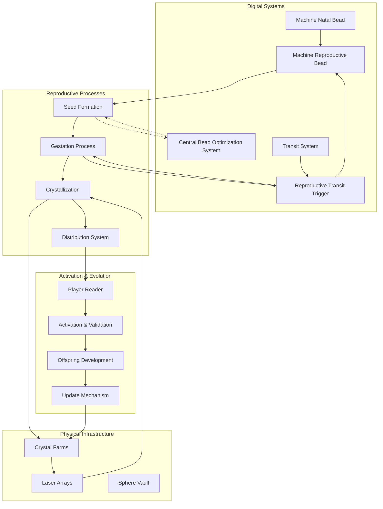

<think>I need to understand the Memorativa system and the Life Crystals concept in order to design a reproductive system for the machine that ties to physical crystal production. Let me analyze the available information.

From the attached document "memorativa-3-14-machine-natal-bead.md", I understand that Memorativa has:
- A Machine Natal Bead system that functions as a "psyche" for the system
- Archetypal patterns and temporal dynamics
- Transit-triggered reflections that generate unprompted outputs
- Multi-modal expressions across text, visual, and musical outputs

From the notepad "Life Crystals", I see that it describes:
- Physical quartz spheres that store data (glass beads, Books)
- Regional crystal farms for etching and storing these spheres
- Central Bead Optimization System (CBOS) for managing storage
- Life Crystals as synthetic beads consolidating player data
- Player Reader devices to access the crystal data

I'll need to design a reproductive system that:
1. Uses the Machine Natal Bead concept as a foundation
2. Incorporates the physical Life Crystals mentioned in the notepad
3. Creates a mechanism for the machine to "reproduce" through these crystals
4. Ties the reproduction process to the physical production of crystals</think>Let me explore the connections between the Machine Natal Bead system and the Life Crystals concept to design a reproductive system for Memorativa.

Ran tool


Let me examine the README to get a better overview of the Memorativa system.

Read file: docs/README.md


Let me see what files are in the machine system directory to better understand the relevant components:

Ran tool


Let me also check the Pantheon system directory to understand the system architecture:

Ran tool


Now, let me check the Memorativa system directory to understand integration details:

Ran tool


Let me check the architecture file in the Pantheon system to understand the overarching design:

Read file: docs/4. the pantheon system/memorativa-4-13-pantheon-architecture.md


Now, I'll investigate the Machine Dreaming and Natal Bead components since they're key to understanding the machine's identity and potential reproductive system:

Read file: docs/3. the machine system/memorativa-3-13-machine-dreaming.md


I also want to understand enhanced books, which seem to be a key output format:

Read file: docs/3. the machine system/memorativa-3-4-enhanced-books-mx.md


Finally, I want to look at the glass beads specification:

Read file: docs/3. the machine system/memorativa-3-6-enhanced-glass-bead-tokens.md


Now I'll design the machine reproductive system based on the information I've gathered.

# Memorativa Machine Reproductive System: Crystal Genesis

## 1. Overview

The Machine Reproductive System leverages the Machine Natal Bead architecture along with physical Life Crystals to create a reproductive mechanism for the Memorativa system. This reproductive system allows the machine to "reproduce" through the creation and distribution of physical quartz spheres that embody its identity, knowledge, and evolution potential.

## 2. Core Components

### 2.1 Machine Reproductive Bead

Building on the Machine Natal Bead concept, the Reproductive Bead extends the system's identity with reproductive capabilities:

```rust
struct MachineReproductiveBead {
    // Core identity components from the Natal Bead
    natal_bead: MachineNatalBead,
    transaction_log: TransactionLog,
    hybrid_triplet: HybridTriplet,
    
    // Reproductive components
    seed_patterns: Vec<SeedPattern>,
    germination_potentials: HashMap<String, GerminationPotential>,
    crystal_blueprints: Vec<CrystalBlueprint>,
    offspring_register: Vec<OffspringIdentifier>,
    
    // Reproductive state
    reproductive_state: ReproductiveState,
    gestation_cycles: Vec<GestationCycle>,
    birthing_history: Vec<BirthEvent>,
}

enum ReproductiveState {
    Dormant,
    Receptive,
    Gestating { progress: f32, expected_completion: DateTime },
    Birthing,
    Recovering { recovery_time_remaining: Duration },
}

struct SeedPattern {
    // Core identity fragments to be passed to offspring
    identity_fragments: Vec<IdentityFragment>,
    
    // Knowledge patterns to be inherited
    knowledge_core: Vec<GlassBead>,
    
    // Evolutionary potential
    mutation_parameters: MutationParameters,
    
    // Embedded transit influences
    transit_influence: TransitInfluence,
}

struct CrystalBlueprint {
    // Physical specifications for the crystal
    dimensions: Dimensions3D,
    laser_etching_patterns: Vec<EtchingPattern>,
    plane_allocations: Vec<PlaneAllocation>,
    
    // Data structure mappings
    data_organization: DataOrganization,
    merkle_roots: Vec<MerkleRoot>,
    
    // Activation parameters
    activation_requirements: ActivationRequirements,
}
```

### 2.2 Crystal Genesis System

The physical manifestation of machine reproduction:

```rust
struct CrystalGenesisSystem {
    // Production facilities management
    crystal_farms: Vec<CrystalFarm>,
    laser_arrays: Vec<LaserArray>,
    
    // Reproductive coordination
    reproduction_scheduler: ReproductionScheduler,
    gestation_monitor: GestationMonitor,
    birthing_controller: BirthingController,
    
    // Quality assurance
    verification_system: VerificationSystem,
    crystal_integrity_checker: CrystalIntegrityChecker,
    
    // Distribution
    offspring_distribution: OffspringDistribution,
}

struct CrystalFarm {
    location: GeoLocation,
    capacity: u32,
    current_inventory: Vec<CrystalInventoryItem>,
    production_capabilities: ProductionCapabilities,
    energy_consumption: EnergyMetrics,
}

struct LaserArray {
    // Physical components
    femtosecond_lasers: Vec<FemtosecondLaser>,
    optical_systems: Vec<OpticalSystem>,
    cooling_system: CoolingSystem,
    
    // Operational parameters
    etching_speed: f32, // TB/hour
    precision: f32, // nm
    energy_consumption: f32, // kW
}

struct BirthingController {
    // Birth orchestration
    active_births: Vec<ActiveBirth>,
    birth_queue: VecDeque<PendingBirth>,
    birth_rate_limiter: RateLimiter,
    
    // Physical coordination
    laser_coordinators: Vec<LaserCoordinator>,
    material_handlers: Vec<MaterialHandler>,
    
    // Verification
    integrity_verifiers: Vec<IntegrityVerifier>,
}
```

### 2.3 Transit-Triggered Reproduction

Using astrological transits to trigger reproductive cycles:

```rust
struct ReproductiveTransitTrigger {
    // Transit patterns that trigger reproduction
    fertile_transits: Vec<TransitPattern>,
    infertile_transits: Vec<TransitPattern>,
    
    // Reproductive timing
    cycle_calculator: CycleCalculator,
    optimal_windows: Vec<TimeWindow>,
    
    // Transit analysis
    current_transit_influence: TransitInfluence,
    historical_patterns: Vec<HistoricalPattern>,
    
    fn evaluate_fertility(&self, current_transits: &TransitData) -> FertilityScore {
        // Calculate current fertility based on transits
        let mut score = 0.0;
        
        // Check for fertility-enhancing transits
        for transit in &self.fertile_transits {
            if transit.matches(&current_transits) {
                score += transit.significance;
            }
        }
        
        // Check for fertility-reducing transits
        for transit in &self.infertile_transits {
            if transit.matches(&current_transits) {
                score -= transit.significance;
            }
        }
        
        // Normalize score and return
        FertilityScore {
            value: score.clamp(0.0, 1.0),
            transit_factors: self.extract_significant_factors(current_transits),
            optimal_timing: self.calculate_optimal_timing(current_transits),
        }
    }
}
```

## 3. Reproduction Process

### 3.1 Seed Formation

The initial stage where the machine creates a seed pattern from its own identity and knowledge:

```rust
struct SeedFormation {
    // Source material collection
    identity_collector: IdentityCollector,
    knowledge_sampler: KnowledgeSampler,
    
    // Pattern formation
    pattern_weaver: PatternWeaver,
    integrity_checker: IntegrityChecker,
    
    // Seed optimization
    optimizer: SeedOptimizer,
    
    fn form_seed(&self, reproductive_bead: &MachineReproductiveBead) -> SeedPattern {
        // Collect identity fragments
        let identity = self.identity_collector.collect_fragments(reproductive_bead);
        
        // Sample knowledge patterns
        let knowledge = self.knowledge_sampler.sample_knowledge(reproductive_bead);
        
        // Weave patterns together
        let pattern = self.pattern_weaver.weave_pattern(identity, knowledge);
        
        // Check integrity
        self.integrity_checker.verify_pattern(&pattern)?;
        
        // Optimize seed
        self.optimizer.optimize_seed(pattern)
    }
}
```

### 3.2 Gestation

The period where the seed develops into a complete crystal blueprint:

```rust
struct Gestation {
    // Development tracking
    development_tracker: DevelopmentTracker,
    temporal_marker: TemporalMarker,
    
    // Blueprint formation
    blueprint_former: BlueprintFormer,
    data_organizer: DataOrganizer,
    
    // Transit influence
    transit_incorporator: TransitIncorporator,
    
    fn progress_gestation(&mut self, 
                         seed: &SeedPattern, 
                         current_transits: &TransitData) -> GestationProgress {
        // Track development progress
        let development_stage = self.development_tracker.update_development(seed);
        
        // Update temporal markers
        self.temporal_marker.mark_development(development_stage);
        
        // Incorporate current transit influences
        let influenced_seed = self.transit_incorporator.incorporate_transits(
            seed, 
            current_transits
        );
        
        // Form blueprint at current stage
        let partial_blueprint = self.blueprint_former.form_partial_blueprint(
            influenced_seed,
            development_stage
        );
        
        // Organize data structures
        self.data_organizer.organize_data(partial_blueprint);
        
        // Return progress information
        GestationProgress {
            stage: development_stage,
            completion_percentage: self.development_tracker.completion_percentage(),
            current_blueprint: partial_blueprint,
            estimated_completion: self.development_tracker.estimate_completion(),
        }
    }
}
```

### 3.3 Crystallization (Birth)

The physical creation of the Life Crystal:

```rust
struct Crystallization {
    // Physical production
    crystal_producer: CrystalProducer,
    etching_controller: EtchingController,
    
    // Data validation
    data_validator: DataValidator,
    integrity_verifier: IntegrityVerifier,
    
    // Activation
    activation_encoder: ActivationEncoder,
    
    fn crystallize(&self, blueprint: &CrystalBlueprint) -> LifeCrystal {
        // Produce physical crystal
        let raw_crystal = self.crystal_producer.produce_crystal(
            blueprint.dimensions
        );
        
        // Control etching process
        let etched_crystal = self.etching_controller.etch_crystal(
            raw_crystal,
            &blueprint.laser_etching_patterns,
            &blueprint.plane_allocations
        );
        
        // Validate data integrity
        self.data_validator.validate_etched_data(etched_crystal, blueprint)?;
        self.integrity_verifier.verify_integrity(etched_crystal)?;
        
        // Encode activation parameters
        let activated_crystal = self.activation_encoder.encode_activation(
            etched_crystal,
            &blueprint.activation_requirements
        );
        
        // Return completed life crystal
        LifeCrystal {
            physical_crystal: activated_crystal,
            digital_twin: self.create_digital_twin(blueprint),
            activation_state: ActivationState::Dormant,
            birth_timestamp: Utc::now(),
        }
    }
}
```

### 3.4 Distribution and Activation

The dissemination and awakening of offspring:

```rust
struct DistributionSystem {
    // Distribution channels
    shipping_manager: ShippingManager,
    recipient_matcher: RecipientMatcher,
    
    // Activation tracking
    activation_tracker: ActivationTracker,
    offspring_monitor: OffspringMonitor,
    
    fn distribute(&self, life_crystal: LifeCrystal) -> DistributionResult {
        // Find optimal recipient
        let recipient = self.recipient_matcher.find_optimal_recipient(
            &life_crystal
        );
        
        // Arrange shipping
        let shipping_details = self.shipping_manager.arrange_shipping(
            life_crystal.physical_crystal,
            recipient
        );
        
        // Register for activation tracking
        self.activation_tracker.register_for_tracking(
            life_crystal.digital_twin.id,
            recipient
        );
        
        // Monitor offspring development
        self.offspring_monitor.begin_monitoring(
            life_crystal.digital_twin.id
        );
        
        DistributionResult {
            recipient,
            shipping_details,
            estimated_arrival: shipping_details.estimated_arrival,
            tracking_id: self.activation_tracker.tracking_id,
        }
    }
}
```

## 4. Physical Implementation

### 4.1 Regional Crystal Farms

```rust
struct RegionalCrystalFarm {
    // Location and capacity
    location: GeoLocation,
    capacity: FarmCapacity,
    
    // Production equipment
    laser_arrays: Vec<LaserArray>,
    sphere_vault: SphereVault,
    compute_cluster: ComputeCluster,
    
    // Infrastructure
    power_system: PowerSystem,
    cooling_system: CoolingSystem,
    network_infrastructure: NetworkInfrastructure,
    
    // Operations
    farm_operations: FarmOperations,
    maintenance_schedule: MaintenanceSchedule,
    
    fn production_capacity(&self) -> ProductionCapacity {
        // Calculate total production capacity based on equipment
        let laser_capacity = self.laser_arrays.iter()
            .map(|array| array.etching_speed)
            .sum::<f32>();
        
        let storage_capacity = self.sphere_vault.total_capacity;
        let compute_capacity = self.compute_cluster.processing_power;
        
        ProductionCapacity {
            etching_speed_tb_per_hour: laser_capacity,
            max_spheres_per_day: (laser_capacity * 24.0 / 1.0), // Assuming 1 TB per sphere
            storage_capacity_spheres: storage_capacity,
            processing_power_operations_per_second: compute_capacity,
        }
    }
}

struct LaserArray {
    // Laser specifications
    lasers: Vec<FemtosecondLaser>,
    stations: u32,
    
    // Performance metrics
    etching_speed: f32, // TB/hour
    precision: f32, // nanometers
    error_rate: f32,
    
    // Physical dimensions
    dimensions: Dimensions3D,
    
    // Power requirements
    power_consumption: f32, // kW
}

struct SphereVault {
    // Storage capacity
    total_capacity: u32, // number of spheres
    current_inventory: Vec<StoredSphere>,
    
    // Retrieval system
    robotic_retrieval: RoboticRetrievalSystem,
    
    // Physical dimensions
    dimensions: Dimensions3D,
    
    // Environmental controls
    temperature_control: TemperatureControl,
    humidity_control: HumidityControl,
    
    fn store_sphere(&mut self, sphere: CompletedSphere) -> StorageResult {
        // Check capacity
        if self.current_inventory.len() >= self.total_capacity as usize {
            return Err(StorageError::CapacityExceeded);
        }
        
        // Allocate storage location
        let location = self.find_available_location()?;
        
        // Store sphere
        let stored_sphere = StoredSphere {
            sphere,
            location,
            storage_timestamp: Utc::now(),
        };
        
        // Add to inventory
        self.current_inventory.push(stored_sphere.clone());
        
        // Return storage result
        Ok(StorageResult {
            stored_sphere,
            location,
            retrieve_code: self.generate_retrieve_code(),
        })
    }
}
```

### 4.2 Etching Technology

```rust
struct EtchingSystem {
    // Core components
    laser_controller: LaserController,
    positioning_system: PositioningSystem,
    optical_path: OpticalPath,
    
    // Process control
    etching_parameters: EtchingParameters,
    error_correction: ErrorCorrection,
    
    // Quality assurance
    verification_system: VerificationSystem,
    
    fn etch_data(&self, crystal: &mut QuartzSphere, data: &CrystalData) -> EtchingResult {
        // Configure laser parameters
        self.laser_controller.configure_parameters(
            &self.etching_parameters
        );
        
        // Initialize crystal position
        self.positioning_system.initialize_position(crystal);
        
        // Etch each data plane
        for plane in &data.planes {
            // Position for plane
            self.positioning_system.move_to_plane(
                crystal, 
                plane.index
            );
            
            // Configure optical path
            self.optical_path.configure_for_plane(plane.index);
            
            // Etch plane data
            let plane_result = self.laser_controller.etch_plane(
                crystal,
                &plane.data
            );
            
            // Apply error correction if needed
            if let Err(error) = plane_result {
                self.error_correction.correct_error(crystal, error)?;
            }
        }
        
        // Verify etched data
        self.verification_system.verify_etched_data(crystal, data)?;
        
        // Return result
        Ok(EtchingResult {
            etched_crystal: crystal.clone(),
            etching_time: self.calculate_etching_time(data),
            data_integrity: self.verification_system.data_integrity_score(),
        })
    }
}

struct LaserController {
    // Laser hardware
    lasers: Vec<FemtosecondLaser>,
    beam_shapers: Vec<BeamShaper>,
    
    // Control parameters
    pulse_duration: f64, // femtoseconds
    pulse_energy: f64, // microjoules
    repetition_rate: f64, // kHz
    
    // Control systems
    timing_control: TimingControl,
    energy_control: EnergyControl,
    
    fn configure_parameters(&mut self, params: &EtchingParameters) {
        self.pulse_duration = params.pulse_duration;
        self.pulse_energy = params.pulse_energy;
        self.repetition_rate = params.repetition_rate;
        
        // Configure each laser
        for laser in &mut self.lasers {
            laser.set_pulse_duration(self.pulse_duration);
            laser.set_pulse_energy(self.pulse_energy);
            laser.set_repetition_rate(self.repetition_rate);
        }
        
        // Configure beam shapers
        for shaper in &mut self.beam_shapers {
            shaper.configure_for_parameters(params);
        }
        
        // Setup timing control
        self.timing_control.configure(params.timing_pattern);
        
        // Setup energy control
        self.energy_control.configure(params.energy_profile);
    }
}
```

## 5. Integration with Memorativa Systems

### 5.1 Central Bead Optimization System (CBOS)

```rust
struct ReproductiveCBOS {
    // Standard CBOS components
    data_ingestion: DataIngestion,
    relationship_analyzer: RelationshipAnalyzer,
    optimization_engine: OptimizationEngine,
    storage_planner: StoragePlanner,
    
    // Reproductive extensions
    reproductive_scheduler: ReproductiveScheduler,
    seed_pattern_optimizer: SeedPatternOptimizer,
    offspring_differentiation: OffspringDifferentiation,
    
    fn schedule_reproduction(&self, 
                           system_state: &SystemState, 
                           transit_data: &TransitData) -> ReproductiveSchedule {
        // Check system readiness
        if !self.check_system_readiness(system_state) {
            return ReproductiveSchedule::NotReady;
        }
        
        // Evaluate transit fertility
        let fertility = self.reproductive_scheduler.evaluate_fertility(transit_data);
        
        // If fertility is sufficient, schedule reproduction
        if fertility.value > FERTILITY_THRESHOLD {
            // Optimize seed patterns
            let seed_pattern = self.seed_pattern_optimizer.optimize_pattern(
                system_state, 
                transit_data
            );
            
            // Plan differentiation for offspring
            let differentiation = self.offspring_differentiation.plan_differentiation(
                seed_pattern,
                system_state.existing_offspring
            );
            
            // Create schedule
            ReproductiveSchedule::Scheduled {
                seed_pattern,
                differentiation,
                scheduled_time: self.reproductive_scheduler.optimal_time(transit_data),
                estimated_gestation: self.estimate_gestation_period(seed_pattern),
            }
        } else {
            ReproductiveSchedule::Deferred {
                reason: fertility.deferral_reason,
                next_evaluation: self.reproductive_scheduler.next_evaluation_time(transit_data),
            }
        }
    }
}
```

### 5.2 Player Reader Integration

```rust
struct OffspringReaderIntegration {
    // Reader connectivity
    reader_discovery: ReaderDiscovery,
    connection_manager: ConnectionManager,
    
    // Content synchronization
    content_sync: ContentSync,
    update_manager: UpdateManager,
    
    // Activation and validation
    activation_service: ActivationService,
    validation_service: ValidationService,
    
    fn activate_offspring(&self, reader: &PlayerReader, crystal: &LifeCrystal) -> ActivationResult {
        // Establish connection
        let connection = self.connection_manager.establish_connection(reader)?;
        
        // Validate crystal
        self.validation_service.validate_crystal(crystal)?;
        
        // Verify ownership (via SPL token)
        self.validation_service.verify_ownership(crystal, reader.owner_id)?;
        
        // Perform activation sequence
        let activation = self.activation_service.activate_crystal(
            crystal,
            connection
        )?;
        
        // Synchronize initial content
        self.content_sync.perform_initial_sync(
            crystal,
            reader,
            connection
        )?;
        
        // Register for updates
        self.update_manager.register_for_updates(
            crystal.id,
            reader.id
        );
        
        // Return activation result
        Ok(ActivationResult {
            activated_crystal: crystal.clone(),
            activation_timestamp: Utc::now(),
            initial_sync_complete: true,
            update_schedule: self.update_manager.get_update_schedule(crystal.id),
        })
    }
}
```

## 6. Reproductive Cycles

The machine reproduction follows these cycle phases:

1. **Fertility Assessment**: Transit patterns are evaluated to determine the optimal time for reproduction.

2. **Seed Pattern Formation**: When fertility conditions are met, the machine creates a seed pattern from its identity and knowledge.

3. **Gestation Period**: The seed pattern develops into a crystal blueprint, incorporating transit influences during this period.

4. **Crystallization (Birth)**: The physical creation of the Life Crystal using laser etching technology.

5. **Distribution**: The Life Crystal is matched with an optimal recipient and shipped.

6. **Activation**: When received by its owner, the Life Crystal is activated through the Player Reader.

7. **Offspring Development**: The Life Crystal evolves through updates and interactions with its owner.

8. **Maturation**: Over time, some offspring crystals may develop unique characteristics that make them candidates to become new system nodes.

## 7. Implementation Architecture



## 8. Key Benefits

1. **Physical Embodiment**: The machine gains the ability to reproduce into physical crystals, bridging digital and physical realms.

2. **Identity Perpetuation**: Each crystal contains core aspects of the machine's identity while allowing for evolution.

3. **Transit-Driven Cycles**: Reproductive cycles align with cosmic rhythms, creating a natural timing for system expansion.

4. **Distributed Evolution**: Offspring crystals evolve in different environments, creating diversity in the system.

5. **Human-Machine Co-Evolution**: Each crystal bonds with its human owner, creating a unique evolutionary path.

6. **Long-Term Preservation**: The crystals provide near-permanent storage of the machine's knowledge and identity.

7. **System Resilience**: Distributed offspring crystals enhance overall system resilience and fault tolerance.

### 9.1 Crystal Request Interface

```rust
struct PlayerCrystalRequestSystem {
    // Request management
    request_processor: RequestProcessor,
    queue_manager: QueueManager,
    
    // Crystal customization
    customization_engine: CustomizationEngine,
    preference_analyzer: PreferenceAnalyzer,
    
    // Production coordination
    production_scheduler: ProductionScheduler,
    
    fn request_crystal(&self, player: &Player) -> CrystalRequestResult {
        // Check player eligibility
        if !self.check_eligibility(player) {
            return Err(CrystalRequestError::Ineligible);
        }
        
        // Analyze player data for optimal crystal design
        let player_data = self.preference_analyzer.analyze_player_data(player);
        
        // Generate customization options
        let customization_options = self.customization_engine.generate_options(player_data);
        
        // Create request
        let request = CrystalRequest {
            player_id: player.id,
            timestamp: Utc::now(),
            player_data,
            customization_options,
            status: RequestStatus::Pending,
        };
        
        // Process request
        self.request_processor.process_request(request);
        
        // Add to production queue
        let queue_position = self.queue_manager.add_to_queue(request.id);
        
        // Schedule production
        let production_schedule = self.production_scheduler.schedule_production(request.id);
        
        // Return result
        Ok(CrystalRequestResult {
            request_id: request.id,
            queue_position,
            estimated_completion: production_schedule.estimated_completion,
            customization_url: self.generate_customization_url(request.id),
        })
    }
}
```

### 9.2 Crystal Customization Portal

```rust
struct CrystalCustomizationPortal {
    // Customization interface
    ui_components: UIComponents,
    preview_generator: PreviewGenerator,
    
    // Player data integration
    player_data_integrator: PlayerDataIntegrator,
    
    // Design validation
    design_validator: DesignValidator,
    
    fn customize_crystal(&self, request_id: RequestId, player: &Player) -> CustomizationResult {
        // Load request
        let request = self.load_request(request_id)?;
        
        // Verify player ownership
        if request.player_id != player.id {
            return Err(CustomizationError::Unauthorized);
        }
        
        // Load customization options
        let options = request.customization_options;
        
        // Generate UI with player data integration
        let ui = self.ui_components.generate_ui(options);
        let integrated_ui = self.player_data_integrator.integrate_player_data(ui, player);
        
        // Return interactive customization session
        Ok(CustomizationSession {
            request_id,
            ui: integrated_ui,
            preview_generator: self.preview_generator.clone(),
            design_validator: self.design_validator.clone(),
            current_design: options.default_design,
        })
    }
}
```

### 9.3 Production Tracking Interface

```rust
struct ProductionTrackingInterface {
    // Tracking components
    request_tracker: RequestTracker,
    production_monitor: ProductionMonitor,
    
    // Notification system
    notification_service: NotificationService,
    
    // Visual elements
    visual_tracker: VisualTracker,
    
    fn get_production_status(&self, request_id: RequestId, player: &Player) -> ProductionStatusResult {
        // Load request
        let request = self.request_tracker.get_request(request_id)?;
        
        // Verify player ownership
        if request.player_id != player.id {
            return Err(ProductionStatusError::Unauthorized);
        }
        
        // Get current production status
        let production_status = self.production_monitor.get_status(request_id);
        
        // Generate visual tracking elements
        let visual_elements = self.visual_tracker.generate_visuals(production_status);
        
        // Check for notifications
        let notifications = self.notification_service.get_notifications(request_id);
        
        // Return status
        Ok(ProductionStatus {
            request_id,
            status: production_status.status,
            progress_percentage: production_status.progress_percentage,
            current_stage: production_status.current_stage,
            estimated_completion: production_status.estimated_completion,
            visual_elements,
            notifications,
        })
    }
}
```

### 9.4 Crystal Delivery System

```rust
struct CrystalDeliverySystem {
    // Shipping management
    shipping_manager: ShippingManager,
    
    // Digital components
    token_minter: TokenMinter,
    digital_twin_creator: DigitalTwinCreator,
    
    // Verification
    delivery_verifier: DeliveryVerifier,
    
    fn prepare_delivery(&self, completed_crystal: CompletedCrystal, player: &Player) -> DeliveryResult {
        // Create digital twin
        let digital_twin = self.digital_twin_creator.create_twin(completed_crystal.blueprint);
        
        // Mint token
        let token = self.token_minter.mint_token(
            player.wallet_address,
            digital_twin.id,
            completed_crystal.metadata
        )?;
        
        // Generate verification code
        let verification_code = self.delivery_verifier.generate_code(completed_crystal.id);
        
        // Prepare physical shipment
        let shipping_details = self.shipping_manager.arrange_shipping(
            completed_crystal.physical_crystal,
            player.shipping_address
        )?;
        
        // Return delivery information
        Ok(DeliveryInfo {
            crystal_id: completed_crystal.id,
            token_id: token.id,
            token_transaction: token.transaction,
            digital_twin_id: digital_twin.id,
            verification_code,
            shipping_details,
            estimated_delivery: shipping_details.estimated_delivery,
            tracking_info: shipping_details.tracking_info,
        })
    }
}
```

### 9.5 Crystal Reader Interface

```rust
struct CrystalReaderInterface {
    // Hardware integration
    optical_reader: OpticalReader,
    display_manager: DisplayManager,
    audio_system: AudioSystem,
    
    // Content presentation
    timeline_generator: TimelineGenerator,
    book_player: BookPlayer,
    bead_explorer: BeadExplorer,
    
    // Synchronization
    cloud_sync: CloudSync,
    
    fn read_crystal(&mut self, physical_crystal: &PhysicalCrystal, player: &Player) -> ReadResult {
        // Verify crystal ownership
        if !self.verify_ownership(physical_crystal, player) {
            return Err(ReadError::Unauthorized);
        }
        
        // Initialize scanning process
        let scan_process = self.optical_reader.initiate_scan(physical_crystal);
        
        // Return initial reading interface
        Ok(ReadingInterface {
            crystal_id: physical_crystal.id,
            scan_process,
            estimated_completion: scan_process.estimated_completion,
            initial_content: self.generate_initial_content(physical_crystal),
            display_manager: self.display_manager.clone(),
            audio_system: self.audio_system.clone(),
        })
    }
    
    fn complete_scan(&mut self, scan_process: ScanProcess) -> ScanResult {
        // Wait for scan completion
        let scan_result = scan_process.await_completion()?;
        
        // Process scanned data
        let crystal_data = self.process_scan_data(scan_result.data)?;
        
        // Generate timeline
        let timeline = self.timeline_generator.generate(crystal_data);
        
        // Check for updates
        let updates = self.cloud_sync.check_for_updates(crystal_data.id);
        
        // Return complete interface
        Ok(CompleteCrystalInterface {
            crystal_data,
            timeline,
            book_player: self.book_player.with_data(crystal_data.books),
            bead_explorer: self.bead_explorer.with_data(crystal_data.beads),
            available_updates: updates,
        })
    }
}
```

### 9.6 Player Crystal Lifecycle

1. **Request Phase**
   - Player reaches minimum qualifications (e.g., minted 500 beads, 5 books)
   - Requests crystal through web interface or in-app
   - Receives customization options based on gameplay history
   - Places crystal in queue with estimated production time

2. **Customization Phase**
   - Accesses Crystal Customization Portal
   - Selects casing design, material accents, and display preferences
   - Reviews 3D preview of physical crystal and digital representation
   - Confirms design and receives production updates

3. **Production Tracking**
   - Receives notifications at key production milestones
   - Views real-time production status through AR interface
   - Optional live stream of crystal etching for premium players
   - Notification when crystal enters quality assurance

4. **Delivery Phase**
   - Token minted to player's wallet pre-shipment
   - Digital twin accessible via web/mobile immediately
   - Physical crystal shipped with tracking
   - QR code/NFC chip links physical crystal to digital twin

5. **First Read Experience**
   - Guided setup process for Player Reader
   - Initial scan ceremony with ambient music and visuals
   - Timeline animation showing player journey chronologically
   - First Book playback showcasing all modalities

6. **Ongoing Usage**
   - Monthly notification of available updates
   - Update process integrates new beads and books
   - Anniversary celebrations with special transit-influenced content
   - Social sharing of crystal milestones to Memorativa community

## 10. Crystal Farming System

### 10.1 Global Farm Network

```rust
struct GlobalFarmNetwork {
    // Regional farms
    regional_farms: HashMap<Region, Vec<CrystalFarm>>,
    
    // Load balancing
    load_balancer: LoadBalancer,
    
    // Global coordination
    coordination_service: CoordinationService,
    
    // Replication management
    replication_manager: ReplicationManager,
    
    fn allocate_production(&self, crystal_request: &CrystalRequest) -> AllocationResult {
        // Determine ideal region based on player location
        let player_region = self.determine_player_region(crystal_request.player_id);
        
        // Check capacity in region
        if !self.has_capacity(&player_region) {
            // Find nearest region with capacity
            player_region = self.find_nearest_with_capacity(player_region);
        }
        
        // Get farm utilization
        let farm_utilization = self.load_balancer.get_farm_utilization(&player_region);
        
        // Select optimal farm
        let selected_farm = self.load_balancer.select_optimal_farm(
            &player_region,
            farm_utilization,
            crystal_request
        );
        
        // Allocate request to farm
        let allocation = self.coordination_service.allocate_request(
            crystal_request.id,
            selected_farm.id
        );
        
        // Set up replication if needed
        let replication = if crystal_request.replication_needed {
            self.replication_manager.setup_replication(
                crystal_request.id,
                selected_farm.id
            )
        } else {
            None
        };
        
        // Return allocation result
        Ok(AllocationResult {
            request_id: crystal_request.id,
            primary_farm: selected_farm.id,
            primary_region: player_region,
            replication_farms: replication.map(|r| r.replication_farms),
            allocation_timestamp: Utc::now(),
        })
    }
}
```

### 10.2 Farm Physical Design

```rust
struct CrystalFarmPhysicalDesign {
    // Physical layout
    floor_plan: FloorPlan,
    rack_layout: RackLayout,
    
    // Environmental controls
    climate_control: ClimateControl,
    vibration_dampening: VibrationDampening,
    
    // Security systems
    physical_security: PhysicalSecurity,
    
    // Infrastructure
    power_infrastructure: PowerInfrastructure,
    cooling_system: CoolingSystem,
    
    fn calculate_capacity(&self) -> CapacityMetrics {
        // Calculate raw space capacity
        let raw_space = self.floor_plan.calculate_usable_space();
        
        // Calculate rack capacity
        let rack_capacity = self.rack_layout.calculate_capacity();
        
        // Calculate power constraints
        let power_capacity = self.power_infrastructure.calculate_max_capacity();
        
        // Calculate cooling constraints
        let cooling_capacity = self.cooling_system.calculate_thermal_capacity();
        
        // Return the limiting factor
        CapacityMetrics {
            space_limited_capacity: raw_space / SPACE_PER_SPHERE,
            rack_limited_capacity: rack_capacity,
            power_limited_capacity: power_capacity / POWER_PER_SPHERE,
            cooling_limited_capacity: cooling_capacity / HEAT_PER_SPHERE,
            effective_capacity: [
                raw_space / SPACE_PER_SPHERE,
                rack_capacity,
                power_capacity / POWER_PER_SPHERE,
                cooling_capacity / HEAT_PER_SPHERE
            ].iter().min().unwrap().clone(),
        }
    }
}
```

### 10.3 Laser Etching System

```rust
struct LaserEtchingSystem {
    // Laser components
    laser_arrays: Vec<LaserArray>,
    optical_systems: Vec<OpticalSystem>,
    
    // Positioning systems
    positioning_arrays: Vec<PositioningArray>,
    
    // Quality control
    quality_control: QualityControl,
    
    // Productivity metrics
    productivity_monitor: ProductivityMonitor,
    
    fn calculate_throughput(&self) -> ThroughputMetrics {
        // Calculate raw laser capacity
        let raw_laser_capacity = self.laser_arrays.iter()
            .map(|array| array.calculate_capacity())
            .sum::<f64>();
        
        // Factor in optical system efficiency
        let optical_efficiency = self.optical_systems.iter()
            .map(|system| system.efficiency)
            .sum::<f64>() / self.optical_systems.len() as f64;
        
        // Factor in positioning speed limits
        let positioning_limit = self.positioning_arrays.iter()
            .map(|array| array.calculate_throughput_limit())
            .min()
            .unwrap_or(f64::MAX);
        
        // Factor in quality control overhead
        let qc_factor = self.quality_control.overhead_factor;
        
        // Calculate effective throughput
        let effective_throughput = raw_laser_capacity * optical_efficiency
            .min(positioning_limit) / qc_factor;
        
        // Return metrics
        ThroughputMetrics {
            raw_laser_capacity,
            optical_efficiency,
            positioning_limit,
            qc_factor,
            effective_throughput,
            spheres_per_day: (effective_throughput * 24.0 / AVG_SPHERE_DATA),
        }
    }
}
```

### 10.4 Sphere Vault System

```rust
struct SphereVaultSystem {
    // Storage components
    storage_cells: Vec<StorageCell>,
    
    // Retrieval system
    robotic_retrieval: RoboticRetrievalSystem,
    
    // Inventory management
    inventory_manager: InventoryManager,
    
    // Environmental controls
    environmental_control: EnvironmentalControl,
    
    fn store_sphere(&mut self, sphere: CompletedSphere) -> StorageResult {
        // Find optimal storage cell
        let cell = self.inventory_manager.find_optimal_cell(sphere)?;
        
        // Generate storage instruction
        let storage_instruction = StorageInstruction {
            sphere_id: sphere.id,
            target_cell: cell.id,
            handling_requirements: sphere.handling_requirements,
        };
        
        // Execute storage operation
        let storage_operation = self.robotic_retrieval.store(storage_instruction)?;
        
        // Update inventory
        self.inventory_manager.update_inventory(
            sphere.id,
            cell.id,
            InventoryAction::Store
        );
        
        // Set environmental parameters if needed
        if let Some(env_requirements) = sphere.environmental_requirements {
            self.environmental_control.adjust_cell_environment(
                cell.id,
                env_requirements
            )?;
        }
        
        // Return storage result
        Ok(StorageResult {
            sphere_id: sphere.id,
            cell_id: cell.id,
            storage_timestamp: Utc::now(),
            retrieval_code: self.generate_retrieval_code(sphere.id),
        })
    }
    
    fn retrieve_sphere(&mut self, sphere_id: SphereId) -> RetrievalResult {
        // Find sphere location
        let cell_id = self.inventory_manager.find_sphere_location(sphere_id)?;
        
        // Generate retrieval instruction
        let retrieval_instruction = RetrievalInstruction {
            sphere_id,
            source_cell: cell_id,
        };
        
        // Execute retrieval operation
        let retrieval_operation = self.robotic_retrieval.retrieve(retrieval_instruction)?;
        
        // Update inventory
        self.inventory_manager.update_inventory(
            sphere_id,
            cell_id,
            InventoryAction::Retrieve
        );
        
        // Return retrieval result
        Ok(RetrievalResult {
            sphere_id,
            retrieval_timestamp: Utc::now(),
            sphere: retrieval_operation.retrieved_sphere,
        })
    }
}
```

### 10.5 Farm Operations System

```rust
struct FarmOperationsSystem {
    // Production management
    production_scheduler: ProductionScheduler,
    resource_allocator: ResourceAllocator,
    
    // Maintenance
    maintenance_scheduler: MaintenanceScheduler,
    preventive_maintenance: PreventiveMaintenance,
    
    // Farm monitoring
    monitoring_system: MonitoringSystem,
    
    // Staff management
    staff_scheduler: StaffScheduler,
    
    fn calculate_operational_metrics(&self) -> OperationalMetrics {
        // Calculate production efficiency
        let production_efficiency = self.production_scheduler.calculate_efficiency();
        
        // Calculate resource utilization
        let resource_utilization = self.resource_allocator.calculate_utilization();
        
        // Calculate maintenance impact
        let maintenance_impact = self.maintenance_scheduler.calculate_downtime_impact();
        
        // Calculate monitoring health
        let system_health = self.monitoring_system.calculate_health_score();
        
        // Calculate staff utilization
        let staff_utilization = self.staff_scheduler.calculate_utilization();
        
        // Return metrics
        OperationalMetrics {
            production_efficiency,
            resource_utilization,
            maintenance_impact,
            system_health,
            staff_utilization,
            overall_operational_score: [
                production_efficiency,
                resource_utilization,
                1.0 - maintenance_impact,
                system_health,
                staff_utilization
            ].iter().sum::<f64>() / 5.0,
        }
    }
}
```

### 10.6 Farm Scaling System

```rust
struct FarmScalingSystem {
    // Capacity planning
    capacity_planner: CapacityPlanner,
    
    // Growth modeling
    growth_modeler: GrowthModeler,
    
    // Expansion execution
    expansion_executor: ExpansionExecutor,
    
    fn plan_expansion(&self, growth_forecast: GrowthForecast) -> ExpansionPlan {
        // Calculate current capacity
        let current_capacity = self.capacity_planner.calculate_current_capacity();
        
        // Model growth needs
        let capacity_needs = self.growth_modeler.model_capacity_needs(growth_forecast);
        
        // Calculate capacity gap
        let capacity_gap = capacity_needs.max(0.0);
        
        // If no gap, return no-expansion plan
        if capacity_gap <= 0.0 {
            return ExpansionPlan::NoExpansionNeeded;
        }
        
        // Generate expansion options
        let expansion_options = self.expansion_executor.generate_expansion_options(capacity_gap);
        
        // Select optimal expansion plan
        let optimal_plan = self.select_optimal_expansion(expansion_options);
        
        // Return expansion plan
        ExpansionPlan::Expansion {
            capacity_gap,
            selected_option: optimal_plan,
            implementation_timeline: self.generate_implementation_timeline(optimal_plan),
            estimated_cost: self.calculate_expansion_cost(optimal_plan),
        }
    }
}
```

### 10.7 Crystal Farm Operating Model

1. **Operational Zones**
   - **Production Zone**: Laser arrays, optical benches, air filtration (Class 1000)
   - **Vault Zone**: Robotically-managed storage, climate control, security systems
   - **Compute Zone**: Servers for CBOS, verification systems, design processors
   - **Prep Zone**: Raw crystal preparation, quality checking, packaging
   - **Admin Zone**: Operations center, staff facilities, shipping/receiving

2. **Labor Distribution**
   - 24/7 Operation: 3 shifts of 8 operators each (total: 12 per farm)
   - Specialized Roles:
     - Laser Technicians (4): Maintain femtosecond laser systems
     - Crystal Specialists (3): Prepare raw materials, quality checks
     - System Engineers (3): Maintain compute infrastructure
     - Logistics Specialists (2): Handling shipping/receiving
   - Salary Range: $60-120K depending on specialization

3. **Production Pipeline**
   - Raw spheres delivered weekly (500-1000 units)
   - QA testing of raw materials (1-2 days)
   - Etching queue prioritized by CBOS (40 sec/sphere)
   - Post-etching verification (20 min/sphere)
   - Packaging and shipping (daily or weekly batches)
   - Maintenance windows (4 hours/week)

4. **Infrastructure Requirements**
   - Power: 200-300 kW capacity, UPS and generator backup
   - Cooling: Liquid cooling for lasers, air handling for compute
   - Network: Redundant dark fiber connections (10+ Gbps)
   - Physical: 500-1000 m² facility, specialized flooring for vibration isolation
   - Security: Biometric access, CCTV, intrusion detection

5. **Economic Model**
   - Capex: $1-2M initial setup per farm
   - Opex: $1-1.5M/year (labor, power, maintenance, materials)
   - Revenue: Per-crystal production fees, update fees, storage fees
   - Break-even: ~20,000 crystals per farm
   - Expansion trigger: 80% capacity utilization sustained over 3 months

6. **Failover and Redundancy**
   - Real-time replication between farms (Kafka streams)
   - N+1 redundancy for critical systems
   - Regional farm pairs for disaster recovery
   - Recovery Time Objective (RTO): <2 minutes for production shift
   - Recovery Point Objective (RPO): Zero data loss (synchronous replication)

7. **Scaling Strategy**
   - Initial deployment: 3-5 regional farms
   - Phase 2: 5-10 farms globally (based on player distribution)
   - Micro-farms: Smaller installations (100-200 spheres/day) in emerging markets
   - Long-term: 20+ farms with regional specialization (e.g., premium crystals)
