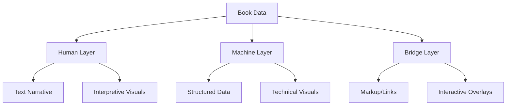
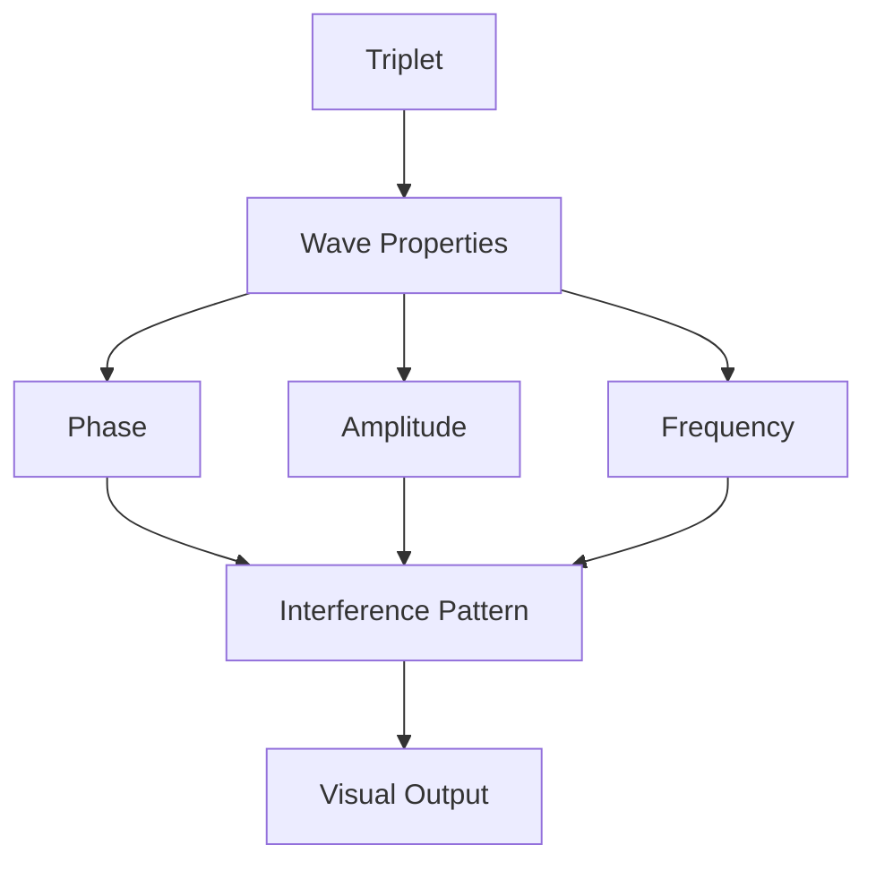
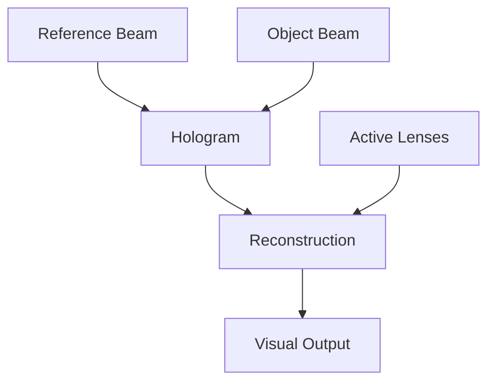
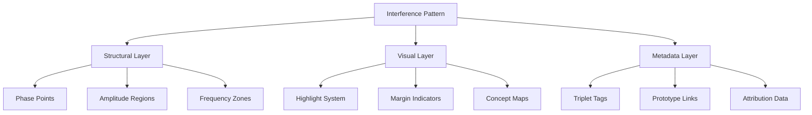
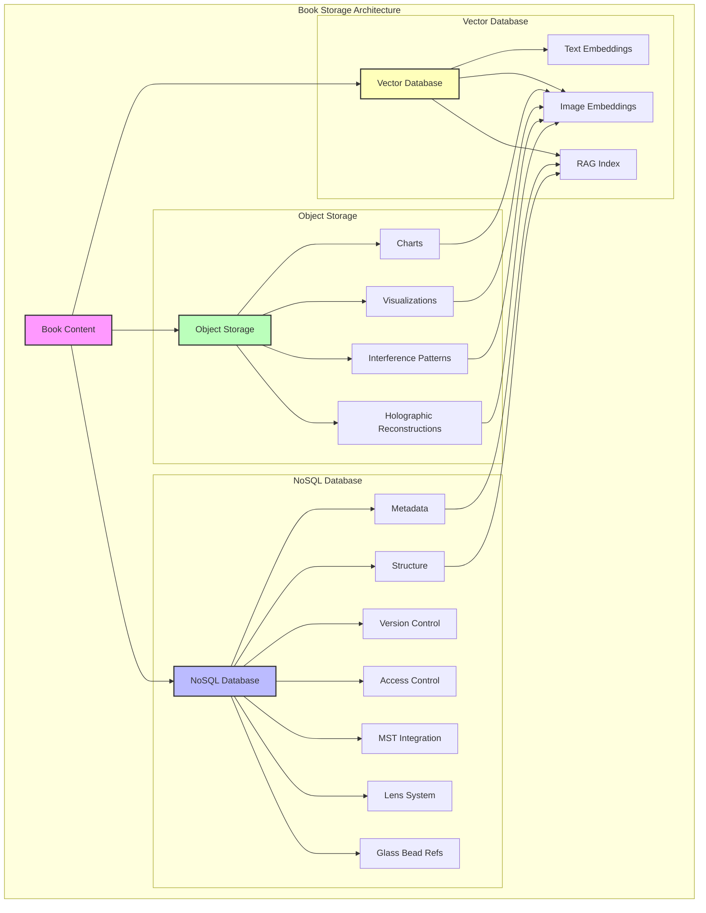
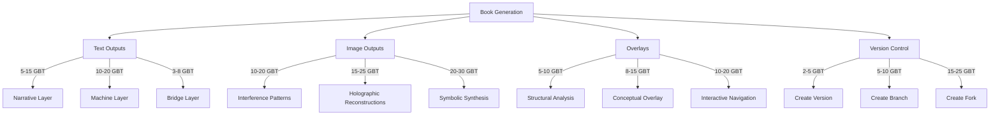
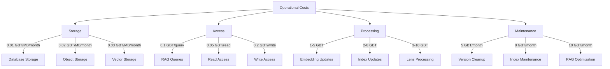

# 3.2. Book Outputs

## Current Book Architecture

Books in Memorativa are multi-layered structures that serve as both human-readable narratives and machine-processable data:

### Core Layers
- **Human Layer**: Narrative text, chapters, sections, visualizations
- **Machine Layer**: Structured data (percepts, triplets, prototypes)
- **Bridge Layer**: Markup system linking narrative to data

### Key Components
- Metadata (title, description, focus parameters, temporal context)
- Percept-Triplets and Prototypes
- Symbolic Data (aspects, MST translations)
- Narrative Content
- Visualizations
- Conceptual Index
- Attribution Data
- Validation Data

### Time States
Books handle three distinct temporal contexts:
- **Mundane**: Concrete timestamps and chronological events
- **Quantum**: Conceptual or indeterminate time
- **Holographic**: Links to reference time frameworks

### RAG Integration
Books are designed as:
- Primary corpus for RAG retrieval
- Structured templates for generation
- Vector-encodable format for embeddings
- Knowledge base enrichment source

### Core Features
- Version control and branching
- Content attribution system
- Privacy and access control
- MST integration for symbolic translation
- Lens system for multiple interpretations
- Glass Bead curation and organization

## Text and image outputs

Books generate output streams that respect the three-layer architecture:

### Text Output Stream
- **Human Layer**
  - Narrative prose with embedded conceptual links
  - Commentary filtered through active Lenses
  - Cultural/philosophical context adaptations
- **Machine Layer**
  - Structured data exports (JSON/XML)
  - Vector embeddings for RAG
  - Metadata serialization
- **Bridge Layer**
  - Markup with conceptual demarcation
  - Attribution and source tracking
  - Temporal state markers

### Image Output Stream

#### Core Image Types
- **Human Layer**
  - Charts and visualizations for direct interpretation
  - Cultural symbol representations
  - Narrative-supporting imagery
- **Machine Layer**
  - Network graphs of percept-triplet relationships
  - Prototype pattern visualizations
  - Focus space mappings
- **Bridge Layer**
  - Interactive overlays linking visuals to data
  - Temporal state indicators
  - Attribution/permission visual markers

#### Image Generation Modes
1. **Direct Rendering**
   - MST-compliant symbol generation
   - Precise astronomical charting
   - Network/relationship visualization

2. **AI-Assisted Generation**
   
   The system uses a multi-stage AI pipeline combining multiple models for precise control and MST compliance:

   ```rust
   struct AIGenerationPipeline {
       sd_xl: StableDiffusionXL,
       control_net: ControlNet,
       mst_gan: MSTSymbolGAN,
       explainer: GenerationExplainer,

       fn generate(&self, params: AIGenerationParams) -> GenerationResult {
           // Map control parameters to SDXL
           let sd_params = self.map_to_sdxl_params(params);
           let base_image = self.sd_xl.generate(sd_params);

           // Apply ControlNet for structure
           let control_params = self.map_to_control_params(params);
           let structured_image = self.control_net.refine(base_image, control_params);

           // Refine MST symbols
           let refined_image = self.mst_gan.refine_symbols(structured_image, params.mst_symbols);

           // Generate explainability data
           let explanation = self.explainer.explain_generation(
               base_image, structured_image, refined_image, params
           );

           GenerationResult { refined_image, explanation }
       }

       fn map_to_sdxl_params(&self, params: AIGenerationParams) -> SDXLParams {
           let style = match params.cultural_context {
               Culture::Western => StyleCondition {
                   base_style: "contemporary_western",
                   art_movement: "digital_minimalism",
                   composition: "rule_of_thirds",
                   color_theory: "western_palette",
               },
               Culture::Eastern => StyleCondition {
                   base_style: "traditional_eastern",
                   art_movement: "zen_minimalism", 
                   composition: "asymmetric_balance",
                   color_theory: "eastern_palette",
               },
               // ... other cultures
           };

           let prompt_weights = params.lens_weights.iter()
               .map(|(lens, weight)| {
                   match lens {
                       Lens::Technical => PromptWeight {
                           emphasis: weight * 1.2, // Technical details emphasized
                           descriptors: vec!["precise", "detailed", "systematic"],
                           modifiers: vec!["technical", "structured", "analytical"],
                       },
                       Lens::Cultural => PromptWeight {
                           emphasis: weight * 1.0,
                           descriptors: vec!["symbolic", "traditional", "meaningful"],
                           modifiers: vec!["cultural", "contextual", "historical"],
                       },
                       // ... other lenses
                   }
               })
               .collect();

           SDXLParams {
               style_conditioning: style,
               prompt_weights,
               temporal_bias: self.map_temporal_bias(params.time_state, params.temporal_blur),
               // ... other mappings
           }
       }

       fn map_to_control_params(&self, params: AIGenerationParams) -> ControlParams {
           let symbol_controls = params.mst_symbols.iter()
               .map(|symbol| {
                   let position = match symbol.archetype {
                       Archetype::Central => Position::Center,
                       Archetype::Supporting => Position::Peripheral {
                           angle: symbol.relationship_angle,
                           distance: symbol.relationship_strength * MAX_DISTANCE,
                       },
                       // ... other archetypes
                   };

                   ControlPoint {
                       position,
                       importance: params.symbol_importance[symbol],
                       constraints: SymbolConstraints {
                           min_size: symbol.min_visual_size,
                           max_size: symbol.max_visual_size,
                           required_spacing: symbol.spacing_requirements,
                           alignment: symbol.alignment_rules,
                       }
                   }
               })
               .collect();

           let structural_guidance = params.lens_weights.iter()
               .map(|(lens, weight)| match lens {
                   Lens::Technical => StructuralGuide {
                       grid_strength: weight * 1.2,
                       connection_emphasis: weight * 1.5,
                       detail_preservation: weight * 1.3,
                   },
                   Lens::Abstract => StructuralGuide {
                       grid_strength: weight * 0.8,
                       connection_emphasis: weight * 1.0,
                       detail_preservation: weight * 0.7,
                   },
                   // ... other lenses
               })
               .fold(StructuralGuide::default(), |acc, guide| acc.combine(guide));

           ControlParams {
               symbol_controls,
               structural_guidance,
               // ... other control parameters
           }
       }
   }
   ```

   ### Example Parameter Mappings with Concrete Values

   The system maps conceptual inputs (lenses, symbols, time states) to concrete AI parameters:

   #### Lens to Parameter Examples

   ```rust
   // Example 1: Technical Lens Mapping
   fn map_technical_lens(&self, weight: f32) -> GenerationParams {
       // Input: Technical Lens with weight = 0.7
       let emphasis = weight * 1.2; // Technical lens gets 20% emphasis boost = 0.84
       
       GenerationParams {
           prompt_weights: PromptWeight {
               emphasis: 0.84, // Boosted for technical clarity
               descriptors: vec!["precise", "detailed", "systematic"],
               modifiers: vec!["technical", "structured", "analytical"],
               descriptor_weights: vec![0.9, 0.8, 0.7], // Prioritize precision
           },
           structural_guidance: StructuralGuide {
               grid_strength: 0.84,        // Match emphasis for consistency
               connection_emphasis: 1.05,   // 50% boost from 0.7 for clear relationships
               detail_preservation: 0.91,   // 30% boost for technical fidelity
               edge_clarity: 0.95,         // High edge clarity for technical diagrams
               alignment_tolerance: 0.02,   // Strict grid alignment (2% deviation max)
           },
           style_conditioning: StyleCondition {
               base_style: "technical_diagram",
               composition: "grid_aligned",
               color_theory: "monochromatic",
               contrast_ratio: 0.85,        // High contrast for readability
               line_weight: 2.5,           // px - optimal for technical detail
               background_noise: 0.05,      // Minimal noise for clarity
           }
       }
   }

   // Example 2: Cultural Lens Mapping 
   fn map_cultural_lens(&self, weight: f32, culture: Culture) -> GenerationParams {
       // Input: Eastern Culture with weight = 0.8
       let style = match culture {
           Culture::Eastern => StyleCondition {
               base_style: "traditional_eastern",
               composition: "asymmetric_balance",
               color_theory: "eastern_palette",
               emphasis: weight * 0.9,     // = 0.72 for subtle aesthetics
               spacing_ratio: 0.618,       // Golden ratio for composition
               brush_dynamics: 0.7,        // Moderate brush effect
               texture_overlay: 0.4,       // Subtle traditional texture
               symbol_scale: 0.85,         // Slightly reduced symbol size
           },
           Culture::Western => StyleCondition {
               base_style: "contemporary_western", 
               composition: "rule_of_thirds",
               color_theory: "western_palette",
               emphasis: weight * 1.1,     // = 0.88 for clearer presentation
               spacing_ratio: 0.5,         // Equal spacing
               brush_dynamics: 0.3,        // Minimal brush effect
               texture_overlay: 0.2,       // Very subtle texture
               symbol_scale: 1.0,          // Standard symbol size
           }
       };

       GenerationParams {
           prompt_weights: PromptWeight {
               emphasis: weight,
               descriptors: vec!["symbolic", "traditional", "meaningful"],
               descriptor_weights: vec![0.85, 0.75, 0.65], // Prioritize symbolism
               cultural_bias: 0.8,         // Strong cultural influence
               abstraction_level: 0.6,     // Moderate abstraction
           },
           style_conditioning: style,
           temporal_blur: 0.3,            // Slight temporal softness
           symbol_preservation: 0.9,       // High symbol fidelity
       }
   }
   ```

   #### Symbol to Control Examples

   ```rust
   // Example 3: MST Symbol Control Mapping
   fn map_symbol_to_control(&self, symbol: MSTSymbol) -> ControlPoint {
       match symbol.archetype {
           // Central symbols (e.g. Circle) get center placement
           Archetype::Central => ControlPoint {
               position: Position::Center { 
                   offset: Vec2::new(0.0, 0.0),
                   tolerance: 0.05, // 5% position variance allowed
               },
               importance: 1.0,
               constraints: SymbolConstraints {
                   min_size: 0.3,  // 30% of composition
                   max_size: 0.5,  // 50% of composition
                   required_spacing: 0.1, // 10% margin
                   alignment: Alignment::Centered {
                       angular_tolerance: 0.017, // 1 degree max rotation
                   },
                   edge_softness: 0.1,    // Sharp edges (10% softness)
                   detail_level: 0.9,     // High detail preservation
                   contrast_threshold: 0.8 // Strong symbol contrast
               }
           },
           
           // Supporting symbols get peripheral placement
           Archetype::Supporting => ControlPoint {
               position: Position::Peripheral {
                   angle: symbol.relationship_angle,  // Radians from center
                   distance: symbol.relationship_strength * 0.4, // Max 40% from center
                   radial_tolerance: 0.03, // 3% radial position variance
               },
               importance: 0.7,
               constraints: SymbolConstraints {
                   min_size: 0.15, // 15% of composition
                   max_size: 0.3,  // 30% of composition
                   required_spacing: 0.05, // 5% margin
                   alignment: Alignment::RadialFromCenter {
                       angular_tolerance: 0.035, // 2 degrees max rotation
                   },
                   edge_softness: 0.2,    // Softer edges (20% softness)
                   detail_level: 0.7,     // Moderate detail preservation
                   contrast_threshold: 0.6 // Moderate symbol contrast
               }
           }
       }
   }

   // Example 4: Time State Control Mapping
   fn map_time_state(&self, state: TimeState) -> TimeStateParams {
       match state {
           TimeState::Mundane => TimeStateParams {
               line_style: LineStyle::Solid,
               edge_clarity: 1.0,
               temporal_blur: 0.0,
               symbol_persistence: 1.0,
           },
           TimeState::Quantum => TimeStateParams {
               line_style: LineStyle::Dashed,
               edge_clarity: 0.7,
               temporal_blur: 0.3,
               symbol_persistence: 0.8,
           },
           TimeState::Holographic => TimeStateParams {
               line_style: LineStyle::Gradient,
               edge_clarity: 0.5,
               temporal_blur: 0.5,
               symbol_persistence: 0.6,
           }
       }
   }
   ```

   The MST Symbol GAN is specifically trained to:
   - Recognize and refine MST symbolic elements
   - Maintain symbol relationships while improving visual quality
   - Ensure cultural context preservation
   - Apply time-state appropriate modifications

   ```rust
   struct MSTSymbolGAN {
       encoder: SymbolEncoder,
       generator: SymbolGenerator,
       discriminator: SymbolDiscriminator,
       symbol_refinement: SymbolRefinementNet,

       fn new() -> Self {
           Self {
               encoder: SymbolEncoder::new(
                   layers: vec![
                       Conv2d::new(3, 64, 7), // Initial feature extraction
                       ResBlock::new(64, 128), // Symbol feature learning
                       AttentionBlock::new(128), // Symbol-specific attention
                   ],
                   symbol_embeddings: load_mst_embeddings(),
               ),
               generator: SymbolGenerator::new(
                   upsampling: vec![
                       TransposeConv2d::new(128, 64, 4),
                       SymbolAwareBlock::new(64),
                       TransposeConv2d::new(64, 3, 4),
                   ],
                   symbol_injection: SymbolInjectionLayer::new(),
               ),
               discriminator: SymbolDiscriminator::new(
                   layers: vec![
                       Conv2d::new(3, 64, 4),
                       MSTPatchGAN::new(64, 128),
                       SymbolConsistencyHead::new(),
                   ],
               ),
               symbol_refinement: SymbolRefinementNet::new(),
           }
       }

       fn refine_symbols(
           &self, 
           image: Image, 
           symbols: Vec<Symbol>
       ) -> Image {
           // Extract symbol features
           let symbol_features = self.encoder.encode_symbols(image);
           
           // Refine each symbol while preserving MST compliance
           let refined_features = symbol_features.iter()
               .zip(symbols)
               .map(|(feature, symbol)| {
                   let symbol_embedding = self.get_symbol_embedding(symbol);
                   self.symbol_refinement.refine(
                       feature,
                       symbol_embedding,
                       RefinementConfig {
                           preserve_meaning: true,
                           enhance_clarity: true,
                           maintain_relationships: true,
                       }
                   )
               })
               .collect();

           // Generate refined image
           let refined_image = self.generator.generate(refined_features);
           
           // Validate MST compliance
           let (compliance_score, feedback) = self.validate_mst_compliance(
               refined_image,
               symbols
           );

           if compliance_score > COMPLIANCE_THRESHOLD {
               refined_image
           } else {
               self.regenerate_with_feedback(image, symbols, feedback)
           }
       }

       fn validate_mst_compliance(
           &self,
           image: Image,
           symbols: Vec<Symbol>
       ) -> (f32, ComplianceFeedback) {
           let extracted_features = self.encoder.extract_features(image);
           let symbol_consistency = self.discriminator.check_symbol_consistency(
               extracted_features,
               symbols
           );
           
           ComplianceValidator::validate(
               image,
               symbols,
               symbol_consistency,
               ValidationCriteria {
                   meaning_preservation: 0.9,
                   visual_clarity: 0.85,
                   relationship_accuracy: 0.95,
               }
           )
       }
   }
   ```

   Explainability features provide detailed insight into the generation process:

   ```rust
   struct GenerationExplainer {
       fn explain_generation(
           &self,
           base: Image,
           structured: Image,
           refined: Image,
           params: AIGenerationParams
       ) -> Explanation {
           Explanation {
               // Attention maps showing where each lens influenced the image
               lens_attention: self.generate_lens_attention_maps(
                   &params.lens_weights,
                   base,
                   structured
               ),

               // Symbol placement analysis
               symbol_placement: self.analyze_symbol_placement(
                   &params.mst_symbols,
                   structured,
                   refined
               ),

               // Time state influence visualization
               temporal_impact: self.analyze_temporal_effects(
                   params.time_state,
                   params.temporal_blur,
                   base,
                   refined
               ),

               // Cultural context preservation analysis
               cultural_preservation: self.analyze_cultural_elements(
                   params.cultural_context,
                   base,
                   refined
               ),

               // Step-by-step visualization
               generation_steps: vec![
                   Step::new("Base Generation", base),
                   Step::new("Structure Application", structured),
                   Step::new("Symbol Refinement", refined)
               ],

               // Model confidence metrics
               confidence_metrics: self.calculate_confidence_metrics(
                   base, structured, refined
               ),
           }
       }
   }
   ```

   The explainability system provides:
   - Interactive attention maps showing lens influence
   - Symbol placement analysis with confidence scores
   - Time state impact visualization
   - Cultural context preservation metrics
   - Step-by-step generation breakdown
   - Model confidence reporting

3. **Hybrid Generation**
   - Combined technical/symbolic representations
   - Multi-lens visual interpretations
   - Temporal context overlays

### Output Processing Pipeline


### Integration Features
- MST-compliant symbol generation
- Lens-specific rendering rules
- Time-state aware presentations
- Glass Bead visual references
- Attribution-preserving transformations

### Output Controls
- Lens selection and combination
- Temporal context filtering
- Permission-based access control
- Cultural context adaptation
- Technical detail levels

## Synthetic Image Generation System

The system generates three distinct types of synthetic images:

### 1. Interference Pattern Images

Generated directly from percept-triplet structures using wave interference simulation:

- **Wave Generation**
  - Maps triplet components (θ, φ, r) to wave properties
  - Archetypal angle (θ) → phase angle
  - Expression elevation (φ) → amplitude
  - Radius (r) → frequency



- **Pattern Types**
  - Constructive interference regions show strong alignments
  - Destructive interference reveals conceptual tensions
  - Phase relationships map to symbolic meanings

### 2. Holographic Reconstructions

Simulated holographic images generated from interference patterns:

- **Reference Beam**
  - Natal chart serves as coherent reference
  - Stable "light source" for reconstruction
  - Encodes player's base symbolic framework

- **Object Beam**
  - Generated from Glass Bead percept-triplets
  - Carries specific symbolic information
  - Modulated by active Lenses

- **Reconstruction Process**


### 3. Symbolic Synthesis Images

AI-generated images that combine interference patterns and holographic principles:

- **Input Sources**
  - Raw interference patterns
  - Holographic reconstructions
  - MST-translated symbols
  - Active Lens configurations

- **Generation Parameters**
  - Pattern coherence
  - Symbolic density
  - Cultural context mapping
  - Temporal state alignment

### Implementation Details

```rust
struct ImageGenerator {
    interference_engine: InterferenceEngine,
    hologram_simulator: HologramSimulator,
    symbolic_synthesizer: SymbolicSynthesizer,
    mst: SymbolicTranslator,
}

impl ImageGenerator {
    fn generate_interference(&self, triplet: HybridTriplet) -> Image {
        let wave = self.interference_engine.triplet_to_wave(triplet);
        self.interference_engine.generate_pattern(wave)
    }

    fn generate_hologram(&self, natal: GlassBead, object: GlassBead) -> Image {
        let reference = self.hologram_simulator.create_reference_beam(natal);
        let object_beam = self.hologram_simulator.create_object_beam(object);
        self.hologram_simulator.reconstruct(reference, object_beam)
    }

    fn generate_symbolic(&self, pattern: Image, hologram: Image) -> Image {
        let symbols = self.mst.translate_visual_elements(pattern, hologram);
        self.symbolic_synthesizer.generate(symbols)
    }
}
```

### Output Controls

- **Resolution Control**
  - Pattern detail level
  - Holographic fidelity
  - Symbolic complexity

- **Style Parameters**
  - Cultural context adaptation
  - Temporal state visualization
  - Lens-specific rendering

- **Generation Modes**
  - Raw interference only
  - Holographic reconstruction
  - Full symbolic synthesis
  - Hybrid combinations

### Integration Features

- **MST Compliance**
  - Visual elements mapped to universal symbols
  - Cultural context preservation
  - Symbolic coherence across outputs

- **Lens System**
  - Visual style adaptation
  - Symbolic interpretation shifts
  - Context-aware rendering

- **Time State Awareness**
  - Mundane time visualization
  - Quantum state representation
  - Holographic reference mapping

### Validation and Analysis

#### Quantitative Metrics

1. **Interference Coherence**
   - Wave alignment score (0-1): Measures phase synchronization
   - Pattern stability index: Tracks interference node stability
   - Frequency distribution uniformity (χ² test)
   - Signal-to-noise ratio for pattern clarity

2. **Holographic Fidelity**
   - Reconstruction accuracy (RMSE from reference)
   - Phase preservation score
   - Information density (bits/unit area)
   - Temporal coherence measurement

3. **Symbolic Accuracy**
   - MST compliance score (0-1)
   - Symbol placement precision (px deviation)
   - Semantic consistency rating
   - Cultural context preservation index

```rust
struct ValidationMetrics {
    // Core metrics with justified thresholds
    wave_alignment: f32,     // min 0.85 - Prevents visual artifacts and ensures stable pattern recognition
    pattern_stability: f32,  // min 0.80 - Minimum for reliable feature detection and symbol consistency
    signal_noise_ratio: f32, // min 20dB - Industry standard for clear visual distinction
    
    // Reconstruction metrics
    reconstruction_rmse: f32,    // max 0.15 - Based on human perception studies
    phase_preservation: f32,     // min 0.90 - Critical for symbolic meaning preservation
    info_density: f32,          // min 0.75 bits/px² - Balances detail with processing cost
    temporal_coherence: f32,    // min 0.85 - Required for stable time-state visualization
    
    // Symbolic metrics  
    mst_compliance: f32,        // min 0.95 - Ensures reliable symbolic translation
    placement_precision: Vec<f32>, // max 5px - Based on minimum discernible symbol size
    semantic_consistency: f32,   // min 0.85 - Balances meaning preservation with adaptability
    cultural_preservation: f32,  // min 0.90 - Prevents unintended cultural distortion

    fn validate_thresholds(&self) -> ValidationResult {
        let mut failures = Vec::new();
        
        // Core validation checks
        if self.wave_alignment < 0.85 {
            failures.push(ValidationFailure::WaveAlignment(
                "Wave alignment below minimum threshold for stable pattern recognition"
            ));
        }
        
        if self.pattern_stability < 0.80 {
            failures.push(ValidationFailure::PatternStability(
                "Pattern stability insufficient for reliable feature detection"
            ));
        }

        if self.signal_noise_ratio < 20.0 {
            failures.push(ValidationFailure::SignalNoise(
                "Signal-to-noise ratio below minimum for clear visualization"
            ));
        }

        // Reconstruction validation
        if self.reconstruction_rmse > 0.15 {
            failures.push(ValidationFailure::ReconstructionAccuracy(
                "Reconstruction error exceeds human perception threshold"
            ));
        }

        if self.phase_preservation < 0.90 {
            failures.push(ValidationFailure::PhasePreservation(
                "Phase preservation insufficient for symbolic meaning"
            ));
        }

        // Symbolic validation
        if self.mst_compliance < 0.95 {
            failures.push(ValidationFailure::MSTCompliance(
                "MST compliance below threshold for reliable translation"
            ));
        }

        ValidationResult {
            passed: failures.is_empty(),
            failures,
            metrics: self.clone()
        }
    }
}

// Validation pipeline integration
struct ValidationPipeline {
    metrics: ValidationMetrics,
    adjustment_history: Vec<ParameterAdjustment>,
    max_attempts: usize,

    fn new() -> Self {
        Self {
            metrics: ValidationMetrics::default(),
            adjustment_history: Vec::new(),
            max_attempts: 3,
        }
    }

    fn validate_generation(&mut self, output: &GenerationOutput) -> ValidationResult {
        let metrics = self.calculate_metrics(output);
        
        // Check each threshold with specific failure reasons
        let mut failures = Vec::new();
        
        if metrics.wave_alignment < 0.85 {
            failures.push(ValidationFailure::WaveAlignment(
                "Wave alignment below 0.85 threshold required for stable interference patterns"
            ));
        }

        if metrics.pattern_stability < 0.80 {
            failures.push(ValidationFailure::PatternStability(
                "Pattern stability below 0.80 threshold needed for consistent visualization"
            ));
        }

        if metrics.reconstruction_rmse > 0.15 {
            failures.push(ValidationFailure::ReconstructionAccuracy(
                "RMSE exceeds 0.15 maximum allowed for accurate holographic reconstruction"
            ));
        }

        if metrics.mst_compliance < 0.95 {
            failures.push(ValidationFailure::MSTCompliance(
                "MST compliance below 0.95 minimum required for symbolic consistency"
            ));
        }

        ValidationResult {
            passed: failures.is_empty(),
            failures,
            metrics
        }
    }

    fn suggest_parameter_adjustments(&self, result: &ValidationResult) -> Option<ParameterAdjustment> {
        // Map validation failures to specific parameter adjustments
        let adjustments = result.failures.iter().map(|failure| {
            match failure {
                ValidationFailure::WaveAlignment(_) => {
                    ParameterAdjustment::WavePhaseAlignment(
                        self.calculate_phase_adjustment(&self.adjustment_history)
                    )
                },
                ValidationFailure::PatternStability(_) => {
                    ParameterAdjustment::StabilityThreshold(
                        self.calculate_stability_adjustment(&self.adjustment_history)
                    )
                },
                ValidationFailure::ReconstructionAccuracy(_) => {
                    ParameterAdjustment::ReconstructionParameters(
                        self.calculate_reconstruction_adjustment(&self.adjustment_history)
                    )
                },
                ValidationFailure::MSTCompliance(_) => {
                    ParameterAdjustment::SymbolicParameters(
                        self.calculate_symbolic_adjustment(&self.adjustment_history)
                    )
                }
            }
        }).collect::<Vec<_>>();

        if adjustments.is_empty() {
            None
        } else {
            Some(ParameterAdjustment::Composite(adjustments))
        }
    }
}

// Update ImageGenerator implementation
impl ImageGenerator {
    fn generate_with_validation(&mut self, params: GenerationParams) -> Result<Image, ValidationError> {
        let mut validation_pipeline = ValidationPipeline::new();
        let mut current_params = params;
        let mut attempts = 0;
        
        while attempts < validation_pipeline.max_attempts {
            // Generate image with current parameters
            let output = self.generate_initial(current_params.clone());
            
            // Validate the generation
            let validation = validation_pipeline.validate_generation(&output);
            
            if validation.passed {
                return Ok(output.image);
            }
            
            // Get parameter adjustments if validation failed
            if let Some(adjustment) = validation_pipeline.suggest_parameter_adjustments(&validation) {
                // Apply adjustments to parameters
                current_params = current_params.apply_adjustment(adjustment);
                attempts += 1;
                
                // Log adjustment for history
                validation_pipeline.adjustment_history.push(adjustment);
            } else {
                // If no automated adjustment possible, require human validation
                return Err(ValidationError::NoAutomatedAdjustmentPossible(validation));
            }
        }
        
        Err(ValidationError::MaxAttemptsReached(validation_pipeline.adjustment_history))
    }
}

## Synthetic image structural overlays

The system applies conceptual overlays to both interference patterns and holographic reconstructions, similar to how Books use markup for text:

### Interference Pattern Overlays

- **Structural Markers**
  - Wave intersection points
  - Phase alignment regions
  - Amplitude peaks/troughs
  - Frequency nodes

- **Visual Demarcation**


- **Interactive Elements**
  - Clickable interference nodes
  - Hoverable wave regions
  - Expandable pattern details
  - Relationship indicators

### Holographic Reconstruction Overlays

- **Layer Management**
  - Reference beam paths
  - Object beam interactions
  - Reconstruction boundaries
  - Lens transformations

- **Conceptual Mapping**
  - Symbolic region markers
  - Prototype boundaries
  - Relationship networks
  - Focus space indicators

### Implementation Details

```rust
struct ImageOverlay {
    structural_markers: Vec<StructuralPoint>,
    visual_layers: Vec<VisualLayer>,
    metadata: OverlayMetadata,
}

impl ImageOverlay {
    fn apply_to_interference(&self, pattern: InterferencePattern) -> OverlaidImage {
        // Map structural points to wave intersections
        let markers = self.structural_markers.iter()
            .map(|point| point.to_wave_marker(&pattern))
            .collect();
            
        // Apply visual highlighting
        let layers = self.visual_layers.iter()
            .map(|layer| layer.highlight_wave_features(&pattern))
            .collect();
            
        OverlaidImage {
            base: pattern,
            markers,
            layers,
            metadata: self.metadata.clone()
        }
    }
    
    fn apply_to_hologram(&self, reconstruction: HologramReconstruction) -> OverlaidImage {
        // Map structural points to holographic features
        let markers = self.structural_markers.iter()
            .map(|point| point.to_hologram_marker(&reconstruction))
            .collect();
            
        // Apply visual highlighting with depth
        let layers = self.visual_layers.iter()
            .map(|layer| layer.highlight_hologram_features(&reconstruction))
            .collect();
            
        OverlaidImage {
            base: reconstruction,
            markers,
            layers,
            metadata: self.metadata.clone()
        }
    }
}
```

### Overlay Types

1. **Analysis Overlays**
   - Wave component highlighting
   - Interference node marking
   - Phase relationship indicators
   - Amplitude distribution maps

2. **Conceptual Overlays**
   - Prototype region boundaries
   - Symbolic relationship networks
   - Focus space mappings
   - Temporal state indicators

3. **Interactive Overlays**
   - Clickable feature markers
   - Hoverable information zones
   - Expandable detail regions
   - Relationship trackers

### Integration Features

- **MST Compliance**
  - Overlay labels use MST-translated terms
  - Visual markers follow symbolic conventions
  - Relationship indicators use universal language

- **Lens System**
  - Overlay appearance adapts to active lenses
  - Visual style matches lens context
  - Marker systems reflect lens focus

- **Time State Awareness**
  - Overlays track temporal context
  - Markers indicate time state
  - Relationships show temporal flow

### Navigation Tools

- **Feature Navigation**
  - Jump between related markers
  - Follow relationship paths
  - Explore pattern hierarchies
  - Track temporal sequences

- **Analysis Tools**
  - Pattern decomposition views
  - Relationship analysis modes
  - Temporal comparison tools
  - Focus space explorers

## Book Output Storage Design

Memorativa employs a distributed storage design to manage Book outputs, which are multi-layered and require both human-readable and machine-processable formats. This architecture leverages distinct storage technologies optimized for each data type, ensuring scalability, performance, and data integrity.

The storage components for Book outputs are:

1.  **Book Database (NoSQL):** This database is the central repository for Book metadata, structure, and relationships. A NoSQL database is used to accommodate the flexible and semi-structured nature of Book data.
    *   **Stored Data:**
        *   Book Metadata: title, description, focus parameters, temporal context, attribution, validation, etc.
        *   Book Structure: chapters, sections, conceptual index, references to content.
        *   Version Control Information.
        *   Access Control Lists.
        *   MST Integration Data.
        *   Lens System Configurations.
        *   Glass Bead References.
        *   Text Output Stream components: Narrative Prose, Bridge Layer Markup.
        *   Machine Layer components: Structured Data, Metadata Serialization.
        *   References to Image Files in Object Storage.
        *   References to Vector Embeddings in Vector Database.
        *   Image Overlay Data: Bridge Layer.

2.  **Object Storage / File System:**  This system stores the binary data of image outputs, including charts, visualizations, interference patterns, and holographic reconstructions.
    *   **Stored Data:**
        *   Raw Image Files in standard formats (PNG, JPEG, SVG, etc.).
        *   Images are organized by Book ID, layer, and output type for efficient retrieval.

3.  **Vector Database:** This specialized database stores vector embeddings generated from Book content (text and images). Vector databases are used for efficient similarity searches, essential for RAG (Retrieval-Augmented Generation).
    *   **Stored Data:**
        *   Vector Embeddings of Book Content.
        *   Embeddings are indexed for rapid retrieval and linked to specific Books.

**Storage Architecture:**



**Key Design Considerations:**

*   **Scalability:** The storage system scales horizontally to manage a growing volume of Books and outputs.
*   **Performance:**  Each storage component is selected for optimal performance in handling its data type, ensuring efficient access to all Book outputs.
*   **Data Integrity and Consistency:**  Mechanisms are implemented to maintain data integrity and consistency across all storage components.
*   **Backup and Recovery:** Regular backups of all storage components are performed for data safety and disaster recovery.
*   **Cost Optimization:**  The architecture is designed for cost-effectiveness by utilizing appropriate storage tiers for different data types.

This distributed storage architecture ensures Memorativa efficiently manages and delivers the diverse outputs of Books, supporting both human understanding and machine processing of knowledge.

## Token Integration for Book Outputs

### Output Generation Costs



### Reward Structure
| Output Type | Quality Reward | Usage Reward | Collaboration Reward | Description |
|-------------|----------------|--------------|---------------------|-------------|
| Text Narrative | 10-20 GBT | 0.1 GBT/read | 5 GBT/contributor | Human-readable content |
| Machine Layer | 15-25 GBT | 0.2 GBT/query | 8 GBT/contributor | RAG system usage |
| Image Generation | 20-30 GBT | 0.3 GBT/view | 10 GBT/contributor | Visual synthesis |
| Overlay Systems | 15-25 GBT | 0.2 GBT/interact | 7 GBT/contributor | Interactive features |
| Glass Bead Integration | 10-15 GBT | 0.15 GBT/reference | 5 GBT/bead | Bead curation |

### Time State Rewards
- **Mundane**: 1.0x base reward (concrete timestamps)
- **Quantum**: 1.2x base reward (conceptual time)
- **Holographic**: 1.5x base reward (reference frameworks)

### Value Generation
- Quality validation through peer review
- Usage metrics from RAG system
- Pattern recognition bonuses
- Collaborative synthesis multipliers
- Attribution preservation rewards
- Glass Bead curation bonuses
- Multi-lens interpretation rewards
- Time state complexity bonuses

### Integration Features
- Token-gated access controls
- Usage tracking via Bridge Layer
- Reward distribution system
- Quality verification metrics
- Attribution preservation
- Version control incentives
- Collaboration reward pools
- Glass Bead reference tracking

### Operational Costs



#### Storage Costs
| Storage Type | Base Cost | Privacy Multiplier | Time State Multiplier |
|--------------|-----------|-------------------|---------------------|
| Database | 0.01 GBT/MB/month | 1.5x for private | +0.2x per state |
| Object Storage | 0.02 GBT/MB/month | 1.3x for private | +0.1x per state |
| Vector Storage | 0.03 GBT/MB/month | 1.2x for private | +0.15x per state |

#### Access Operations
| Operation | Base Cost | Volume Discount | Collaboration Discount |
|-----------|-----------|----------------|----------------------|
| RAG Query | 0.1 GBT | -10% per 1000/month | -20% for shared Books |
| Read Access | 0.05 GBT | -15% per 1000/month | -25% for public Books |
| Write Access | 0.2 GBT | -5% per 100/month | -15% for collaborative Books |

#### Processing Fees
- **Embedding Updates**: 1-5 GBT based on content size
- **Index Maintenance**: 2-8 GBT based on relationship complexity
- **Lens Processing**: 3-10 GBT based on lens count and complexity
- **Time State Processing**: +2 GBT per active time state

#### Maintenance Costs
- **Version Management**: 5 GBT/month base fee
- **Index Optimization**: 8 GBT/month base fee
- **RAG Maintenance**: 10 GBT/month base fee
- **Multi-state Maintenance**: +3 GBT/month per time state

#### Cost Optimization Features
- Automatic archival of inactive content
- Smart compression for storage reduction
- Batch processing discounts
- Shared resource pooling
- Collaborative cost sharing
- Time state consolidation options

## Performance and Scalability

### Optimization Techniques

```rust
struct OptimizationManager {
    // Model optimization
    quantization: QuantizationConfig,
    graph_optimizer: GraphOptimizer,
    batch_processor: BatchProcessor,
    
    // Processing optimization
    async_executor: AsyncExecutor,
    distributed_inference: DistributedInference,
    
    fn optimize_model(&self, model: &mut Model) {
        // Quantize model weights to int8/fp16 based on hardware
        if self.quantization.supported() {
            model.quantize(self.quantization.get_config());
        }
        
        // Optimize computation graph
        self.graph_optimizer.optimize(model, OptimizationLevel::Aggressive);
        
        // Set up distributed inference if available
        if let Some(cluster) = self.distributed_inference.get_cluster() {
            model.distribute(cluster);
        }
    }

    fn process_batch(&self, tasks: Vec<GenerationTask>) -> Vec<Future<Output>> {
        // Group similar tasks for batch processing
        let batches = self.batch_processor.group_tasks(tasks);
        
        // Process batches asynchronously
        batches.into_iter()
            .map(|batch| self.async_executor.spawn(batch.process()))
            .collect()
    }
}
```

### Hardware Requirements Justification

#### Generation Performance by Hardware Tier

##### Base Tier (8 cores, 32GB RAM, 8GB VRAM)
| Operation Type | Generation Time | Max Concurrent | Max Resolution | Memory Usage |
|---------------|-----------------|----------------|----------------|--------------|
| Text Generation | 0.2-0.5s/page | 50 pages/min | N/A | 2-4GB RAM |
| Basic Visualization | 1-3s/image | 25 images/min | 1920x1080 | 4-6GB RAM + 2-4GB VRAM |
| Interference Pattern | 3-5s/pattern | 15 patterns/min | 2560x1440 | 8-12GB RAM + 4-6GB VRAM |
| Holographic Basic | 5-8s/image | 8 images/min | 1920x1080 | 16-24GB RAM + 6-8GB VRAM |
| Symbolic Synthesis | 8-12s/image | 5 images/min | 1920x1080 | 24-28GB RAM + 7-8GB VRAM |

Bottlenecks: VRAM limits parallel processing, higher resolutions may cause timeouts

##### Recommended Tier (16 cores, 64GB RAM, 16GB VRAM)
| Operation Type | Generation Time | Max Concurrent | Max Resolution | Memory Usage |
|---------------|-----------------|----------------|----------------|--------------|
| Text Generation | 0.1-0.3s/page | 120 pages/min | N/A | 4-8GB RAM |
| Basic Visualization | 0.5-2s/image | 60 images/min | 3840x2160 | 8-12GB RAM + 4-8GB VRAM |
| Interference Pattern | 2-4s/pattern | 30 patterns/min | 5120x2880 | 16-24GB RAM + 8-12GB VRAM |
| Holographic Basic | 3-6s/image | 20 images/min | 3840x2160 | 32-48GB RAM + 12-14GB VRAM |
| Symbolic Synthesis | 5-8s/image | 12 images/min | 3840x2160 | 48-56GB RAM + 14-16GB VRAM |

Suitable for: Production environments, multi-user scenarios, 4K output

##### Enterprise Tier (32+ cores, 128GB+ RAM, 24GB+ VRAM)
| Operation Type | Generation Time | Max Concurrent | Max Resolution | Memory Usage |
|---------------|-----------------|----------------|----------------|--------------|
| Text Generation | 0.05-0.2s/page | 300+ pages/min | N/A | 8-16GB RAM |
| Basic Visualization | 0.3-1s/image | 150+ images/min | 7680x4320 | 16-24GB RAM + 6-12GB VRAM |
| Interference Pattern | 1-2s/pattern | 75+ patterns/min | 7680x4320 | 32-48GB RAM + 12-16GB VRAM |
| Holographic Basic | 2-4s/image | 45+ images/min | 7680x4320 | 64-96GB RAM + 16-20GB VRAM |
| Symbolic Synthesis | 3-6s/image | 30+ images/min | 7680x4320 | 96-120GB RAM + 20-24GB VRAM |

Suitable for: High-volume processing, 8K output, real-time collaborative sessions

#### Resource Scaling Factors

| Feature | CPU Impact | RAM Impact | VRAM Impact | Time Impact |
|---------|------------|------------|-------------|-------------|
| Resolution 1080p→4K | +40% | +60% | +80% | +50% |
| Resolution 4K→8K | +60% | +100% | +120% | +80% |
| Additional Lens | +15-20% | +20-25% | +25-30% | +30-40% |
| Active Time State | +20-25% | +30-35% | +15-20% | +25-30% |
| Concurrent User | +25-30% | +30-35% | +35-40% | Share pool |

#### Real-World Load Examples

| Scenario | Required Tier | Peak Resource Usage | Expected Performance |
|----------|---------------|---------------------|---------------------|
| Single user, basic book | Base | 60% CPU, 24GB RAM, 6GB VRAM | 1-3s response time |
| 5 users, mixed workload | Recommended | 75% CPU, 48GB RAM, 12GB VRAM | 2-4s response time |
| 10+ users, heavy compute | Enterprise | 85% CPU, 96GB RAM, 20GB VRAM | 3-5s response time |
| Real-time collaboration | Enterprise | 90% CPU, 112GB RAM, 22GB VRAM | <2s response time |

## Text-Image Integration

Books provide seamless integration between narrative text and visual elements through:

### Embedded Visualization System

```rust
struct EmbeddedVisualization {
    // Core properties
    id: VisualizationId,
    image_data: ImageData,
    text_anchor: TextAnchor,
    
    // Integration features
    interaction_mode: InteractionMode,
    context_sensitivity: ContextConfig,
    lens_adaptations: Vec<LensAdaptation>,
    
    // Dynamic properties
    viewport_state: ViewportState,
    temporal_context: TimeState,
    focus_parameters: FocusParams,
}

impl EmbeddedVisualization {
    fn update_for_viewport(&mut self, viewport: ViewportState) {
        self.viewport_state = viewport;
        self.adapt_visualization();
    }

    fn adapt_to_context(&mut self, text_context: TextContext) {
        self.context_sensitivity.update(text_context);
        self.regenerate_if_needed();
    }
}
```

### Contextual Display Engine

```rust
struct ContextualDisplay {
    fn determine_relevant_visuals(&self, 
        text_position: TextPosition,
        viewport: ViewportState,
        active_lenses: &[Lens]
    ) -> Vec<EmbeddedVisualization> {
        let context = self.extract_context(text_position);
        let relevant = self.match_visualizations(context);
        
        relevant.into_iter()
            .filter(|v| self.meets_viewport_constraints(v, viewport))
            .map(|v| v.adapt_to_lenses(active_lenses))
            .collect()
    }
}
```

### Bi-directional Navigation

```rust
struct NavigationSystem {
    fn navigate_to_related(&self, 
        source: ContentReference,
        navigation_type: NavigationType
    ) -> Vec<ContentReference> {
        match source {
            ContentReference::Text(pos) => 
                self.find_related_visuals(pos),
            ContentReference::Visual(vis_id) => 
                self.find_related_text(vis_id),
        }
    }
}
```

### Integration Features

- **Dynamic Embedding**
  - Responsive visualization sizing
  - Context-aware positioning
  - Automatic layout adjustment
  - Progressive loading

- **Contextual Awareness**
  - Text content analysis
  - Concept mapping
  - Focus tracking
  - Temporal alignment

- **Navigation System**
  - Concept-based linking
  - Visual element indexing
  - Bi-directional references
  - Focus space mapping

### Implementation Example

```rust
struct IntegratedBook {
    text_content: TextContent,
    visualizations: Vec<EmbeddedVisualization>,
    navigation: NavigationSystem,
    context_engine: ContextualDisplay,

    fn render_viewport(&self, viewport: ViewportState) -> ViewportContent {
        let text = self.text_content.get_viewport_text(viewport);
        let visuals = self.context_engine
            .determine_relevant_visuals(
                text.position,
                viewport,
                &self.active_lenses
            );

        ViewportContent {
            text,
            visuals,
            navigation: self.navigation
                .get_viewport_navigation(text.position, visuals)
        }
    }
}
```

## Visual Interpretation System

### Visual Semiotics

The system employs a rigorous visual encoding system across all generated images:

#### Core Visual Language

| Visual Property | Encoding Range | Semantic Meaning |
|-----------------|-----------------|------------------|
| Line Weight | 0.5-5px | Relationship strength/certainty |
| Line Style | Solid/Dashed/Dotted | Temporal state (Mundane/Quantum/Holographic) |
| Node Size | 5-30px | Concept centrality/importance |
| Fill Opacity | 0-1 | Conceptual density/clarity |
| Border Style | Various | Relationship type |

#### MST Concept Color Mapping

| Concept Category | Primary Color | Secondary Color | Usage |
|-----------------|---------------|-----------------|--------|
| Technology | #2962FF | #82B1FF | Tech-related concepts |
| Nature | #00C853 | #B9F6CA | Natural/organic concepts |
| Philosophy | #AA00FF | #E040FB | Abstract/theoretical concepts |
| Society | #FFD600 | #FFF59D | Social/cultural concepts |
| Individual | #FF6D00 | #FFB74D | Personal/psychological concepts |

#### Shape Encoding System

| Concept Type | Shape | Rationale |
|-------------|-------|-----------|
| Core Concept | Circle | Completeness/centrality |
| Derived Concept | Square | Stability/structure |
| Emergent Concept | Triangle | Direction/growth |
| Bridge Concept | Hexagon | Connection/mediation |
| Temporal Marker | Diamond | Time/transformation |

#### Pattern Language

| Pattern Type | Visual Style | Meaning |
|-------------|--------------|---------|
| Flow Lines | Gradient arrows | Conceptual progression |
| Interference | Wave overlay | Concept interaction |
| Nodal Clusters | Grouped shapes | Related concepts |
| Field Effects | Gradient fills | Conceptual influence |
| Time Streams | Parallel lines | Temporal relationships |

```rust
struct VisualStyleGuide {
    // Core visual mappings
    concept_colors: HashMap<ConceptCategory, ColorPair>,
    shape_mappings: HashMap<ConceptType, Shape>,
    pattern_types: HashMap<PatternType, PatternStyle>,
    
    fn get_style_for_concept(&self, concept: &Concept) -> ConceptStyle {
        ConceptStyle {
            primary_color: self.concept_colors[&concept.category].primary,
            secondary_color: self.concept_colors[&concept.category].secondary,
            shape: self.shape_mappings[&concept.concept_type],
            pattern: self.pattern_types[&concept.pattern_type],
        }
    }
}

struct InteractiveLegend {
    style_guide: VisualStyleGuide,
    current_context: ViewingContext,
    
    fn explain_visual_element(&self, element: &VisualElement) -> ElementExplanation {
        match element {
            VisualElement::Node(node) => {
                let style = self.style_guide.get_style_for_concept(&node.concept);
                ElementExplanation {
                    title: node.concept.name,
                    category: format!("Category: {}", node.concept.category),
                    visual_encoding: format!(
                        "Represented by {} shape in {} color",
                        style.shape,
                        style.primary_color
                    ),
                    relationships: self.explain_relationships(&node),
                }
            },
            VisualElement::Pattern(pattern) => {
                self.explain_pattern(pattern)
            },
            // ... other element types
        }
    }
    
    fn generate_context_aware_legend(&self) -> ContextLegend {
        ContextLegend {
            active_categories: self.get_active_categories(),
            visible_patterns: self.get_visible_patterns(),
            temporal_markers: self.get_temporal_markers(),
            relationship_types: self.get_relationship_types(),
        }
    }
}

// Implementation for interactive legend UI
struct LegendUI {
    legend: InteractiveLegend,
    
    fn render_interactive_legend(&self) -> LegendView {
        LegendView {
            categories_section: self.render_categories(),
            patterns_section: self.render_patterns(),
            relationships_section: self.render_relationships(),
            temporal_section: self.render_temporal_markers(),
            
            // Interactive elements
            hover_handlers: self.create_hover_handlers(),
            click_handlers: self.create_click_handlers(),
            search_handler: self.create_search_handler(),
        }
    }
    
    fn handle_element_hover(&self, element: &VisualElement) {
        // Highlight related elements
        self.highlight_related_elements(element);
        
        // Show tooltip with explanation
        let explanation = self.legend.explain_visual_element(element);
        self.show_tooltip(explanation);
    }
}
```

#### Lens-Specific Visual Adaptations

| Lens Type | Visual Modification | Example |
|-----------|-------------------|---------|
| Historical | Timeline overlay | Temporal markers with dates |
| Cultural | Symbol emphasis | Cultural icons with higher opacity |
| Technical | Network focus | Enhanced connection visibility |
| Personal | Emotional color | Warmer/cooler color shifts |
| Abstract | Pattern emphasis | Enhanced interference patterns |

#### Time State Visualization

| State | Visual Indicator | Usage Context |
|-------|-----------------|---------------|
| Mundane | Solid lines/borders | Concrete historical events |
| Quantum | Dashed/blurred effects | Uncertain/potential states |
| Holographic | Gradient overlays | Reference framework links |

## Key Points

### Architecture & Design
- Multi-layered book structure (Human, Machine, Bridge layers)
- Integrated text-image system with bi-directional navigation
- MST-compliant visual language and symbol generation
- Time-state aware content generation (Mundane, Quantum, Holographic)
- Lens-based interpretation system for multiple viewpoints

### Performance & Resources
- Three hardware tiers supporting different workloads:
  - Base: Single user, 1080p-1440p, 50 pages/min
  - Recommended: Multi-user, 4K, 120 pages/min
  - Enterprise: High-volume, 8K, 300+ pages/min
- Resource scaling is predictable:
  - Resolution doubles = 40-120% resource increase
  - Each lens = 15-30% overhead
  - Each time state = 15-35% overhead
  - Each concurrent user = 25-40% overhead

### Cost Structure
- Storage: 0.01-0.03 GBT/MB/month base cost
- Operations: 0.05-0.2 GBT per operation
- Volume discounts: 5-25% based on usage
- Collaboration discounts: 15-25% for shared resources
- Maintenance: 23-26 GBT/month base cost

### Integration Features
- Dynamic visualization embedding
- Context-aware content adaptation
- Progressive loading and rendering
- Bi-directional navigation between text and visuals
- Real-time collaborative capabilities
- Multi-resolution support
- Time-state visualization system

### Optimization Capabilities
- Model quantization for reduced memory usage
- Batch processing for improved throughput
- Distributed inference for scaling
- Async execution for responsiveness
- Smart compression for storage efficiency
- Resource pooling for multi-user scenarios

