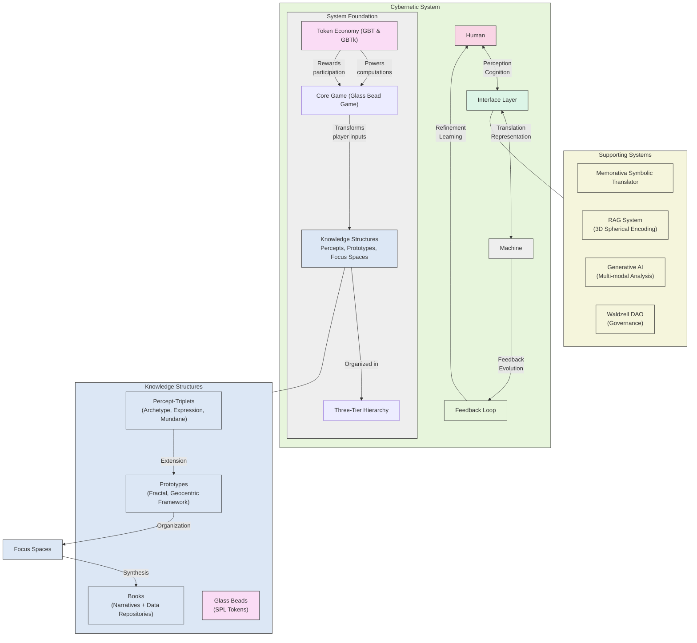
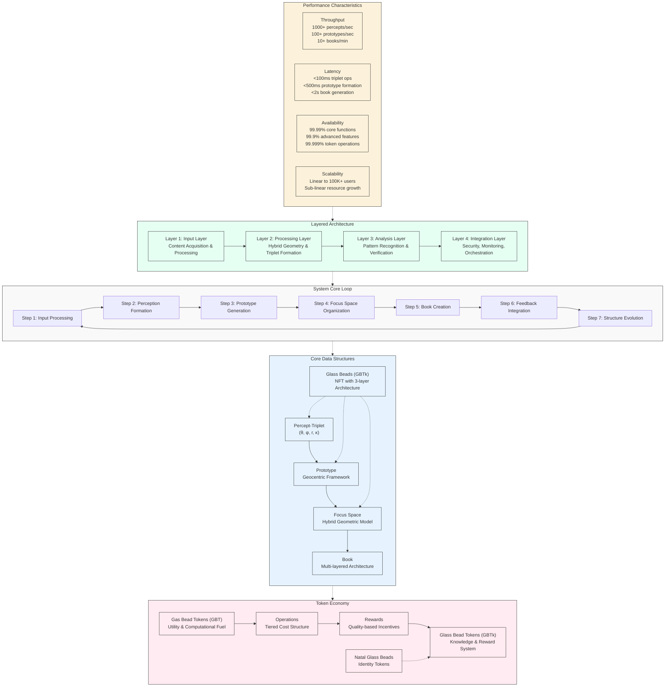
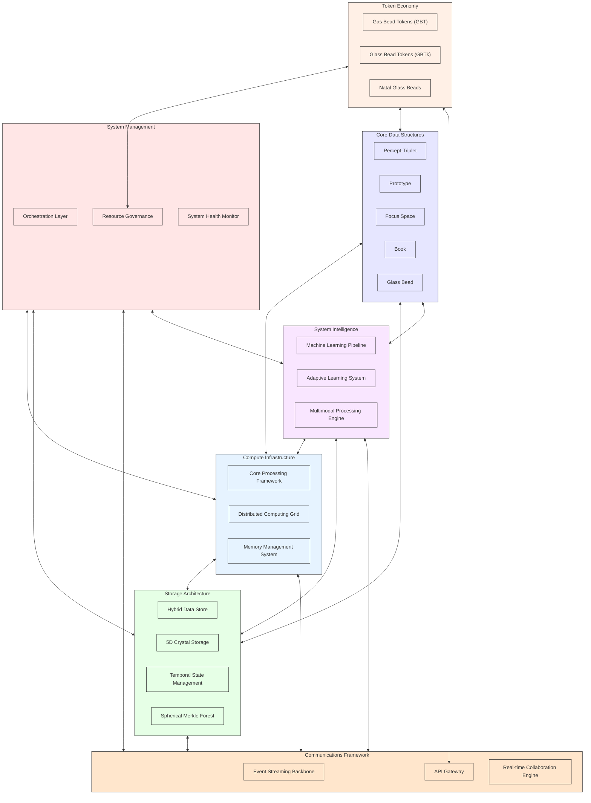
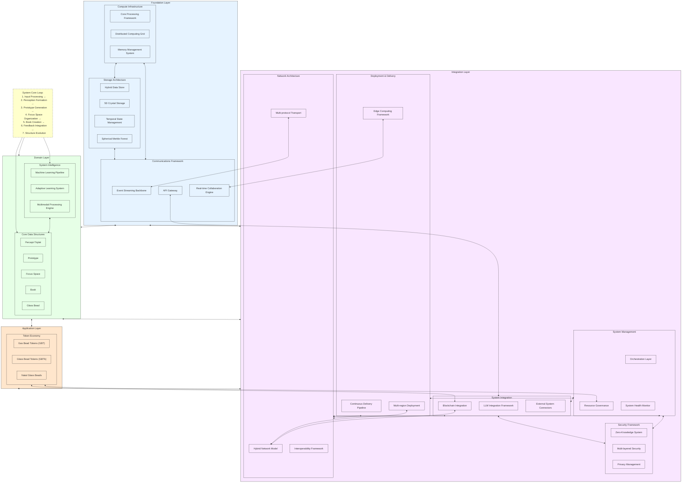

# 3.1. The Machine System

The first section of the Memorativa design posited a new model and a description of a cybernetic system. The system elaborates a novel method of encoding perceptions into data structures that can represent thought structures in the machine. We have defined a game for players to play in order to interact with the cybernetic system. 

In this section of the design, we'll focus more on articulating the *machine experience (MX)* of the cybernetic system, in distinction to the *user experience (UX)*, the main focus of section *1. The Cybernetic System*.

## Recap: The Cybernetic System

The Memorativa cybernetic system bridges the human interior world of perceptions and concepts with a machine conceptual space of vector relationships, enabling structured knowledge evolution while maintaining privacy, security, and attribution.



*Figure 1: This diagram provides a high-level overview of the Cybernetic System, illustrating: The bidirectional interface between human cognition and machine computation; The four key components: human, machine, interface layer, and feedback loop; The Core Game (Glass Bead Game) that transforms player inputs into knowledge networks; The three-tier hierarchy; organizing knowledge structures; The token economy that powers computations and rewards participation; Supporting systems including MST, RAG, Generative AI, and governance*



*Figure 2: This diagram focuses on the technical implementation of the Cybernetic System, showing: The System Core Loop with its 7-step continuous processing cycle; Core Data Structures and their relationships; Token Economy with GBT, GBTk, and NGB tokens; The four-layer system architecture; Performance Characteristics including throughput, latency, availability, and scalability*

```mermaid
graph TB
    %% Main Data Structure Elements
    subgraph HybridGeometry["Hybrid Spherical-Hyperbolic Geometry"]
        Coordinates["Coordinates
        θ (archetypal angle)
        φ (expression elevation)
        r (mundane radius)
        κ (curvature parameter)"]
        
        SphericalGeometry["Spherical Geometry
        For Symbolic Relationships"]
        
        HyperbolicGeometry["Hyperbolic Geometry
        For Hierarchical Relationships"]
        
        SphericalMerkle["Spherical Merkle Trees
        Dual Hash Verification"]
        
        Coordinates --> SphericalGeometry
        Coordinates --> HyperbolicGeometry
        SphericalGeometry --> SphericalMerkle
        HyperbolicGeometry --> SphericalMerkle
    end
    
    %% Three-Tier Structure Hierarchy
    subgraph StructureHierarchy["Three-Tier Hierarchy"]
        BasicStructures["Basic Structures
        Percept-Triplets
        Angular Relationships
        Vector Encodings"]
        
        CompositeStructures["Composite Structures
        Prototypes
        Focus Spaces
        Aspect Networks"]
        
        ComplexStructures["Complex Structures
        Books
        Knowledge Networks
        Temporal Sequences"]
        
        BasicStructures --> CompositeStructures
        CompositeStructures --> ComplexStructures
    end
    
    %% Relationship Types
    subgraph RelationshipTypes["Multi-Dimensional Relationships"]
        VerticalRelationships["Vertical Integration
        Hierarchical Assembly
        Inheritance Patterns"]
        
        HorizontalRelationships["Horizontal Connection
        Cross-Structure References
        Pattern Relationships
        Symbolic Associations"]
        
        DiagonalRelationships["Diagonal Evolution
        Cross-Level Development
        Versioning
        Conceptual Transformation"]
        
        AngularRelationships["Angular Relationships
        Conjunction (0°)
        Opposition (180°)
        Trine (120°)
        Square (90°)
        Sextile (60°)"]
    end
    
    %% Temporal States
    subgraph TemporalStates["Conceptual Time States"]
        MundaneState["Mundane State
        Concrete Timestamps"]
        
        QuantumState["Quantum State
        Indeterminate/Conceptual Time"]
        
        HolographicState["Holographic State
        Reference-Attuned Time"]
        
        StateTransitions["State Transitions
        Validation Rules
        Weight Updates"]
        
        MundaneState --> StateTransitions
        QuantumState --> StateTransitions
        HolographicState --> StateTransitions
        StateTransitions --> MundaneState
        StateTransitions --> QuantumState
        StateTransitions --> HolographicState
    end
    
    %% Connection to Glass Bead Tokens
    subgraph TokenStructure["Glass Bead Token Structure"]
        MetadataLayer["Metadata Layer
        Identifiers
        Timestamps
        Permissions"]
        
        DataLayer["Data Layer
        Percept Encodings
        Spatial Coordinates
        Relationships"]
        
        ReferenceLayer["Reference Layer
        Links
        Pointers
        Attribution Chains"]
        
        MetadataLayer --> DataLayer
        DataLayer --> ReferenceLayer
    end
    
    %% Core Data Storage
    subgraph StorageMechanisms["Storage Mechanisms"]
        HybridGeometryStorage["Hybrid Geometry Storage
        Custom Spatial Index"]
        
        DynamicKnowledgeBase["Dynamic Knowledge Base
        Spatial Clusters
        Temporal State Indices"]
        
        VersionCompression["Version Compression
        Adaptive Snapshot Intervals
        Smart Branch Pruning"]
        
        FiveDCrystal["5D Crystal Storage
        Long-term Archival"]
    end
    
    %% Connect everything
    HybridGeometry -.-> StructureHierarchy
    StructureHierarchy -.-> RelationshipTypes
    RelationshipTypes -.-> TemporalStates
    TemporalStates -.-> TokenStructure
    TokenStructure -.-> StorageMechanisms
    HybridGeometry -.-> StorageMechanisms
    
    %% Styling
    classDef geometry fill:#e6f3ff,stroke:#333,stroke-width:1px
    classDef structure fill:#f9e6ff,stroke:#333,stroke-width:1px
    classDef relationship fill:#ffebcc,stroke:#333,stroke-width:1px
    classDef temporal fill:#ccffe6,stroke:#333,stroke-width:1px
    classDef token fill:#ffe6e6,stroke:#333,stroke-width:1px
    classDef storage fill:#e6ffcc,stroke:#333,stroke-width:1px
    
    class HybridGeometry,Coordinates,SphericalGeometry,HyperbolicGeometry,SphericalMerkle geometry
    class StructureHierarchy,BasicStructures,CompositeStructures,ComplexStructures structure
    class RelationshipTypes,VerticalRelationships,HorizontalRelationships,DiagonalRelationships,AngularRelationships relationship
    class TemporalStates,MundaneState,QuantumState,HolographicState,StateTransitions temporal
    class TokenStructure,MetadataLayer,DataLayer,ReferenceLayer token
    class StorageMechanisms,HybridGeometryStorage,DynamicKnowledgeBase,VersionCompression,FiveDCrystal storage
``` 



*Figure 3: This diagram details the internal data structures and their relationships: The Hybrid Spherical-Hyperbolic Geometry with coordinates and verification; The Three-Tier Structure Hierarchy;  Multi-Dimensional Relationships including vertical, horizontal, diagonal, and angular; Conceptual Time States and transitions; Glass Bead Token Structure with its three-layer architecture; Storage Mechanisms for persistence and retrieval*

The cybernetic system creates a bidirectional interface between human cognition and machine computation through several key components:

1. **Cybernetic System Foundation**
- Bidirectional interface between human cognition and machine computation
- Four key components: human, machine, interface layer, and feedback loop
- Addresses curse of dimensionality through structured middle layer
- Practical feedback mechanisms enable continuous refinement

2. **The Core Game**
- Glass Bead Game transforms player inputs into knowledge networks
- Three-tier hierarchy organizes knowledge structures
- Token economy powers computations and rewards participation
- Vector space encoding efficiently stores and categorizes content

3. **Glass Beads**
- Non-fungible SPL tokens encapsulate percepts, prototypes, and focus spaces
- Multi-layer architecture includes metadata, data, and reference layers
- Hybrid spherical-hyperbolic geometry encodes conceptual relationships
- Maintains three distinct temporal states for different aspects of time

4. **The Percept-Triplet**
- Three conceptual vectors: archetype (What), expression (How), and mundane (Where)
- Geometrically encoded with four key coordinates (θ, φ, r, κ)
- Hybrid geometry approach offers fixed dimensionality with dynamic adaptation
- Integrated with Glass Bead storage through Spherical Merkle Trees

5. **Symbolic Translation System**
- Memorativa Symbolic Translator (MST) converts astrological encodings to universal language
- Hybrid system combining RAG, correspondence tables, and generation mechanisms
- Performs archetype abstraction, cross-cultural mapping, and contextual bridging
- Structured workflow from input deconstruction to output generation

6. **Generative AI**
- Powers transformation of player inputs into percepts, prototypes, and Books
- Multi-modal analysis processes text and images into unified triplet space
- Identifies archetypal patterns using Western mythology and cultural references
- Integrated with Glass Beads through Spherical Merkle Trees

7. **RAG System**
- Enhances player experience through 3D spherical encoding and vector retrieval
- Implements spatial context generation with angular relationship analysis
- Organizes documents into spatial clusters with temporal state indices
- Integrates with Spherical Merkle Trees for data integrity

8. **Prototype Encoding Example**
- Maps input to specific coordinates in hybrid spherical-hyperbolic space
- Transforms astrological encoding into culturally-neutral language
- Follows technical flow from input processing to book generation
- Operational costs measured in Gas Bead Tokens with performance optimizations

9. **The Prototype**
- Extends percept-triplet into fractal, geocentric framework
- Five core components: Earth/Observer, Sun Triplet, Planet Vectors, Aspects, Hybrid Geometry
- Formation process follows geocentric weighted aggregation algorithm
- Provides bridge between individual percepts and higher-level structures

10. **Visualizing the Prototype**
- Circular chart structure inspired by astrological horoscopes
- Encodes geocentric framework, triplet placement, angular relationships
- Interactive features facilitate detailed analysis and pattern recognition
- Supports advanced analysis through superimposed charts and harmonic analysis

11. **Conceptual Time States**
- Three distinct time state types: Mundane, Quantum, and Holographic
- Expands percept-triplet to encode six primary vectors
- Sophisticated features for enhanced privacy and analysis
- State transition mechanisms between temporal representations

12. **Focus Spaces**
- Conceptual workspaces for organizing percepts and prototypes
- Hybrid geometry preserves hierarchical relationships and angular connections
- Multi-chart interface supports various chart types with state management
- Supports collaborative knowledge work through various sharing models

13. **Lens Systems**
- Modular framework for analyzing concepts through diverse paradigms and cultural frameworks, extending the MST's cultural translations
- Universal House System with consistent mapping points across paradigms, modular lens plugins architecture, cross-cultural transformation engine
- Three categories: Traditional Esoteric (astrological, kabbalistic, etc.), Scientific & Mathematical (psychological, sociological, etc.), and Psychological & Experiential (Jungian, cognitive, etc.)
- Transforms percepts while maintaining angular relationships

14. **Books**
- Dual-purpose entities functioning as readable narratives and structured data repositories
- Terminal synthesis in cognitive chain from perception to understanding
- Multi-layered architecture bridging human and machine understanding
- Integrated with RAG system as content corpus

15. **Chain of Thought**
- Cognitive process model transforming raw input into structured knowledge
- Maps directly to Memorativa structures from perception to understanding
- Implements recursive capability with strict processing controls
- Provides direct input interfaces for component resubmission

16. **Glass Bead Tokens**
- Fundamental data structure and reward system with multi-layer design
- Hybrid spatial encoding system with four coordinates (θ, φ, r, κ)
- Maintains three distinct temporal states for different aspects of time
- Implements privacy controls with tiered system and permission inheritance

17. **Natal Glass Beads**
- Foundational identity token with pseudo-anonymous identification
- Three core components: Reference Template, Activity Logging, Structural Integration
- Limited fungibility with high transfer costs for security
- Privacy controls with four-tiered access system and enhanced encryption

18. **Gas Bead Tokens**
- Essential utility token and computational fuel powering all operations within the Memorativa ecosystem, creating a sustainable economic layer for knowledge creation and validation
- Reward structure aligns with computational complexity and knowledge value
- Specialized cost structures for different operational layers
- Creates self-sustaining incentive system balancing resources and rewards

19. **Shared Structures**
- Three-tier hierarchy from basic elements to complex formations
- Maintains multi-dimensional relationships organized through Virtual Loom
- Verification through Spherical Merkle Trees preserving data integrity
- Hybrid space provides unified geometric framework for all concepts

20. **Shared Interfaces**
- Five-tier interface system mapping to three-tier structure hierarchy
- Multi-modal analysis capabilities with cross-modal alignment
- Processing pipeline from player input to rewards flow
- Temporal framework supporting all time states across interface layers

21. **LLM Integration**
- Bridges human language and hybrid geometric structures
- Five key external interfaces enabling secure third-party integration
- Preserves hybrid geometry, observer-centric representation, and tokens
- Diffusion Model Integration enables visual processing with same structure

22. **Percept Computational Architecture**
- High-performance infrastructure powering Core Game mechanics
- Five key optimizations: Vector Space, Hybrid Geometry, Merkle Proof, 5D Crystal Storage, Tokenomics
- Supports three-tier structure hierarchy with tier-specific optimizations
- Implements performance techniques for computational bottlenecks

23. **Gameplay**
- Dual-mode approach combining intuitive collection with analytical reflection
- Transit-driven mechanics generating personalized challenges
- Structured progression from Initial to Mastery Phase
- Privacy implementation with four levels and granular permissions

24. **Tokenomics**
- Dual token architecture separating knowledge value from operational utility
- Tiered cost structure reflecting computational complexity
- Reward structure aligning with cognitive chain progression
- Transit-driven economic effects creating personalized incentives

25. **The Waldzell DAO**
- Cybernetic governance system inspired by Glass Bead Game
- Triple-token system creates self-regulating economy
- Reputation system functions as cybernetic feedback loop
- Specialized governance tracks ensure appropriate expertise

## Outlines of machine experience

While the cybernetic system establishes how human players interact with and shape the system, the machine experience (MX) explores how the machine itself utilizes and evolves through these same structures. Just as human cognition builds from basic perception to complex understanding, we'll develop the machine systems organically:

1. **From Perception to Understanding**
- How the machine processes and internalizes percept-triplets
- Development of machine-initiated pattern recognition
- Evolution from passive storage to active interpretation
- Emergence of machine-driven prototype formation

2. **Autonomous Knowledge Development**
- Self-directed exploration of conceptual spaces
- Machine-initiated focus space creation
- Independent pattern discovery and validation
- Active contribution to the knowledge base

3. **System Self-Organization**
- Organic growth from core perceptual structures
- Development of machine-driven organizational patterns
- Evolution of autonomous processing capabilities
- Emergence of system-level pattern recognition

3. The Machine System will explore how the machine transitions from a passive recipient of human-generated percepts to an active participant in knowledge creation and organization, building upon the foundational structures established in the cybernetic system.

## Cybernetic System Technical Architecture

| Component | Description | Technical Solution | Implementation Notes |
|-----------|-------------|-------------------|---------------------|
| **Core Data Structures** | | | |
| Percept-Triplet | Three-dimensional encoding system that represents human perception through archetypal (What), expressive (How), and contextual (Where) vectors using hybrid spherical-hyperbolic geometry | TensorFlow/PyTorch for vector operations, custom geometric library implementing hyperbolic-spherical transitions, Rust implementation for core algorithms | Implements four key coordinates (θ, φ, r, κ) representing archetypal angle, expression elevation, mundane radius, and curvature parameter; supports smooth transitions between spherical geometry (for symbolic relationships) and hyperbolic geometry (for hierarchical relationships); maintains computational efficiency through fixed dimensionality while preserving expressiveness; integrates directly with Spherical Merkle Trees for spatial preservation; includes custom distance metrics balancing hyperbolic and spherical components based on dynamic curvature |
| Prototype | Fractal extension of percept-triplet structure with geocentric orientation, combining multiple triplets to represent complex concepts through Earth/Observer, Sun Triplet, Planet Vectors, Aspects, and Hybrid Geometry | Custom implementation with hybrid spherical-hyperbolic geometry library, aspect calculation engine, feedback integration system, and Spherical Merkle Tree integration | Implements geocentric model with observer at center; supports sun triplet as primary concept vector with weighted planet vectors for facets; calculates angular aspects between vectors for relationship modeling; supports three weight types (verification, temporal, angular); provides pattern recognition through geocentric coherence, aspect harmony, usage frequency, and validation metrics; implements observer-relative spatial calculations; integrates AI-enhanced feedback for continuous refinement; scales with optimization techniques (angular quantization, observer-relative caching, adaptive thresholds, partial refinement); offers performant implementation with complex operation costs from 3-50 GBT; supports full lifecycle from input processing to book generation through observer-centric feedback loops |
| Glass Beads | Non-fungible tokens serving as both game tokens and symbolic storage for player's semantic data | Solana Program Library (SPL) token implementation with hierarchical data structure containing metadata, data, and reference layers | Implements multi-layered architecture with three core functions: game tokens (rewards), symbolic storage (semantic data), and utility tokens (verifiable ownership); supports dynamic evolution tracking conceptual relationships; each bead contains linked data structures organized in component trees for efficient updates |
| Structure Relationships | System for modeling and managing the multi-dimensional relationships between shared structures in the hybrid spherical-hyperbolic knowledge space | Specialized relationship graph with vertical (hierarchical), horizontal (associative), and diagonal (evolutionary) connections; angular relationship calculator; relationship versioning system; multi-dimensional indices for efficient traversal | Implements three primary relationship types: Vertical Integration (hierarchical assembly from basic to complex structures with inheritance patterns), Horizontal Connection (cross-structure references with pattern relationships and symbolic associations), and Diagonal Evolution (cross-level development with versioning and conceptual transformation); supports angular relationships between percept-triplets with precise measurements of aspects (conjunction 0°, opposition 180°, trine 120°, square 90°, sextile 60°) plus minor aspects; calculates relationship strength based on three primary factors: angular precision (orb), verification weight of participating triplets, and observer-centric perspective; stores relationships as part of the hybrid geometry with specific attributes: angle, strength, resonance (interference distance); supports privacy-controlled relationship visibility with graduated permission models; implements relationship caching for frequently accessed patterns with 70% hit rate target; provides specialized indices for different relationship types with O(log n) lookup performance; supports relationship transition during temporal state changes; enables lens-based relationship transformation with preservation of angular semantics; implements relationship verification through dual hash system combining structural and spatial validation; supports sophisticated relationship operations: pattern recognition algorithms, cross-structure synthesis, temporal correlation analysis, observer-relative transformation, cross-lens relationship mapping; follows token economics with appropriate operation costs (Angular Calculation: 3-7 GBT, Pattern Recognition: 5-8 GBT, Cross-structure Synthesis: 5-10 GBT); optimizes performance through batch relationship processing, lazy evaluation of complex relationships, and adaptive precision based on application context |
| Focus Spaces | Conceptual workspace for organizing percepts and prototypes within a hybrid geometric model, maintaining hierarchical relationships and angular connections between concepts | LRU-cached tiered storage system with hot/warm/cold data segmentation, WebGL/SVG-based visualization engine, and Angular/React component architecture for Multi-Chart Interface | Implements structured environment with five core components: Title-Description Pair (conceptual focus), Temporal Scaffold (time state vectors), Verbal Scaffold (universalized descriptions), Relational Matrix (angular relationships), and Hierarchical Container (nested spaces); supports organizing knowledge in hybrid spherical-hyperbolic geometry using four coordinates (θ, φ, r, κ); maintains multi-chart interface with 12 concurrent chart types; implements four operational layers (Core Anchor, Secondary Anchors, Aspect Network, Hierarchical Network); provides collaborative features with real-time spatial synchronization; optimizes performance through lazy angular calculations, tiered storage model, and adaptive precision control; calculates hybrid distances with weighted formulas balancing hyperbolic and spherical components; enforces operational costs (0.1-10 GBT) with complexity-based scaling factors; enables spatial searches with distributed geometric indices; supports hierarchical organization with 7-level nesting capability and property inheritance; interfaces with Spherical Merkle Trees for angular relationship verification |
| Books | Dual-purpose entities functioning as both human-readable narratives and structured machine-processable data repositories, representing the terminal synthesis in the cognitive chain from perception to understanding | Multi-layered architecture (Human, Machine, Bridge, Bead, Loom layers) with Virtual Loom organizational system, time state management, RAG integration, and direct cognitive chain interfaces | Implements comprehensive five-layer architecture bridging human narratives and machine data: Human Layer (narrative text), Machine Layer (structured data mapping), Bridge Layer (markup system), Bead Layer (reference connections), and Loom Layer (organization system); supports multi-modal processing for both text and images using cross-modal alignment and CLIP-based models for visual archetype identification; manages three temporal states (Mundane, Quantum, Holographic) with privacy-preserving noise calibration; integrates with RAG system as content corpus, supporting vector retrieval, spatial context generation, and dynamic knowledge base integration; organizes Glass Beads as Virtual Loom curator with warp threads (thematic dimensions) and weft threads (contextual dimensions); provides direct input interfaces for cognitive chain integration supporting component resubmission; implements comprehensive performance optimizations including aspect caching (35-40% computation reduction), spatial clustering (80-90% search space reduction), and batch processing (40-60% throughput improvement); supports Book recursion with strict processing controls (thread isolation, bounded recursion depth, cycle detection); integrates with Spherical Merkle Trees for data integrity while maintaining topological consistency; enables multi-dimensional navigation along thematic and contextual threads; supports collaborative knowledge creation with graduated GBT costs (Thread Creation: 5-8 GBT, Bead Positioning: 3-5 GBT, Pattern Definition: 7-12 GBT, Pattern Application: 2-3 GBT, Multi-thread Navigation: 0.5-1 GBT); implements privacy-preserving temporal encoding with differential privacy techniques; maintains mathematical foundation as bipartite graph with tensor product operations for knowledge composition; provides hybrid validation system verifying both hierarchical integrity and angular relationships |
| Chain-of-thought | Cognitive process model transforming raw input into structured knowledge with strict recursion controls, vector analysis, and book processing capabilities | Multithreaded processing framework with isolated execution contexts, custom vector relationship analysis engine, recursive depth management system, direct component submission interfaces, and Virtual Loom integration | Implements comprehensive processing controls: `ProcessingContext` with recursion depth limiting (max 64 levels), cycle detection via book ID tracking, isolated thread execution with 8MB stack allocation, and early termination for unproductive vector relationships; provides vector relationship analysis with orthogonality measures and perpendicular relationship detection; enables book recursion with strict bounds and memory safety through thread isolation; offers direct submission interfaces for all component structures (percepts, triplets, prototypes, focus spaces); integrates with Virtual Loom through warp threads (thematic dimensions) and weft threads (contextual dimensions); implements thread-based processing following the cognitive processing chain; supports optimized thread pooling with priority scheduling, lazy vector computation with relationship caching, and adaptive processing with early termination for low-value chains; provides graduated pricing (Book Creation: 30.0 GBT + 3.0 per chapter, Recursion: 5.0 GBT + 5.0 per level, etc.) with modifiers (complexity multiplier, novelty bonus, depth discount); achieves efficient time complexity (Book Creation: O(n), Recursion: O(d×n), Vector Analysis: O(v²)) with balanced storage requirements; includes collaborative features with real-time synchronization and differential updates |
| Percept Computational Architecture | High-performance infrastructure powering Core Game mechanics through vector space optimization, hybrid geometry processing, Merkle proof acceleration, 5D Crystal Storage, and tokenomics | Five key optimizations: Vector Space, Hybrid Geometry, Merkle Proof, 5D Crystal Storage, Tokenomics; integrated with three-tier structure hierarchy; tiered operation costs; and comprehensive scaling characteristics | Supports three-tier structure hierarchy with tier-specific optimizations for Basic Structures (percept-triplets, angular relationships, vector encodings), Composite Structures (prototypes, focus spaces, aspect networks), and Complex Structures (books, knowledge networks, temporal sequences); implements vector space optimization through triplet vector representation as four-dimensional vectors (θ, φ, r, κ), quantized precision levels (64/32/16-bit) based on significance, and batch vector operations with SIMD and GPU acceleration; provides hybrid geometry processing with adaptive geometric computation (Euclidean, Spherical, Hyperbolic) based on relationship type, mixed geometry operations for seamless switching between models, and dimensional projection optimization preserving angular relationships; enables Merkle proof acceleration through enhanced Merkle tree algorithms with parallel verification, hybrid verification system based on operation criticality, and proof caching for frequently verified paths; integrates with 5D Crystal Storage Architecture for long-term persistence with quantum-stable encoding, variable density based on content importance, and optimized retrieval techniques; implements tokenomic architecture with tiered operational costs (Exploratory: 0.1× base, Development: 1.0× base, Production: 10.0× base), dynamic pricing, and comprehensive economic balancing; directly supports key Core Game operations (player input processing, focus space generation, prototype formation, book generation); achieves performance targets across critical operations (Vector Encoding: <5ms, Angular Calculation: <2ms, Focus Space Generation: <50ms, Merkle Proof Verification: <10ms, ZK-Operations: <100ms, Crystal Storage: <1s); provides scaling characteristics following mathematical models for throughput, latency, and cost; includes optimized implementations for hybrid verification, privacy budget management, mixed geometry operations, and quantum-stable encoding |
| **Token Economy** | | | |
| Glass Bead Tokens (GBTk) | Fundamental data structure and reward system within Memorativa, encapsulating percepts, prototypes, and focus spaces with associated metadata, relationships, and temporal states | Solana Program Library (SPL) token implementation with multi-layer architecture (metadata, data, reference), hybrid spherical-hyperbolic geometry for spatial encoding, observer-relative transformation system, lens integration framework, and Spherical Merkle Tree verification | Implements token with three-layer architecture: Metadata (identifiers, timestamps, permissions, metadata), Data (percept encodings, spatial coordinates, relationships), and Reference (links, pointers, attribution chains); supports hybrid spherical-hyperbolic geometry encoding with four coordinates (θ, φ, r, κ) representing archetypal angle, expression elevation, mundane radius, and curvature parameter; enables observer-relative spatial calculations with geocentric model; supports lens transformations with angle-preserving operations; implements six core functions: content storage, relationship encoding, privacy management, verification, evolution tracking, and token transferability; provides token evolution through version updates, forking, and merging; includes comprehensive privacy controls with four sharing models (Private, Not Shared, Public, Shared); enforces tiered operation costs (Initial Minting: 15-20 GBT, Storage Update: 10-15 GBT, Merkle Update: 5-10 GBT, Privacy Change: 2-5 GBT, Transfer: 1-3 GBT); implements cross-modal aspect relationships that preserve angular connections; supports comprehensive optimization strategies (aspect caching, spatial relationship indexing, lens transform pooling, observer-centric computation); enables lens integration for symbolic translation; provides comprehensive spatial relationship calculations including angular relationship computation, observer-relative transformation, lens transformation equations, aspect significance testing, and Merkle tree angular consistency verification |
| Gas Bead Tokens (GBT) | Essential utility token and computational fuel powering all operations within the Memorativa ecosystem, creating a sustainable economic layer for knowledge creation and validation | Solana Program Library (SPL) token implementation with tiered operational cost structure, dynamic pricing model, gamified validation system, multi-layered reward framework, and comprehensive economic equilibrium mechanisms | Implements unified economic layer with tiered operational costs (Exploratory: 0.1× base, Development: 1.0× base, Production: 10.0× base); provides comprehensive reward structure for valuable contributions (Percept Creation: 5-10 GBT, Focus Space Development: 5-15 GBT, Prototype Formation: 10-20 GBT, Book Creation: 20-50 GBT, Vector Refinement: 3-7 GBT, Knowledge Sharing: 5-15 GBT); supports gamified validation system with difficulty levels, streaks, and accuracy bonuses; powers all system operations including percept-triplet calculations, prototype formation, RAG system operations, and book generation; implements operation-specific cost structures for various computational layers (Core Game Layer, Geometric Operations Layer, Temporal Operations Layer, RAG System Layer, Symbolic Translation Layer); provides dynamic cost calculation based on operation complexity, resource availability, and system load; enables resource optimization through batch operations and caching strategies; follows economic model based on token velocity, system efficiency, and staking mechanics; implements RAG operation costs (Vector Retrieval: 5 GBT, Spatial Context Generation: 7 GBT, Knowledge Base Updates: 4 GBT, Merkle Verification: 3 GBT, Aspect Calculation: 2 GBT, Cluster Selection: 1 GBT, Cache Lookup: 0.1 GBT); supports specialized token rewards for focused economic incentives with graduated reward multipliers (streak-based: max 5×, accuracy-based: 1-3×); maintains mathematical equilibrium through balanced minting and burning; integrates with all system layers through comprehensive operation cost framework; creates self-sustaining loop where knowledge creation is rewarded and system operations are funded; implements comprehensive operations integration with core system components including: percept-triplet calculations with curvature-aware pricing, prototype operations with geocentric aspect calculations, conceptual time state manipulations with privacy-preserving costs, symbolic translation operations with cultural breadth factors, RAG system operations with spatial query pricing, and cross-chain interoperability through Merkle proof verification; supports specialized staking mechanics with duration-based rewards and resource reservation; implements rate limiting to ensure system stability; provides detailed operation tracking and cost optimization strategies |
| Gamified Validation System | Interactive knowledge validation framework that incentivizes quality verification of percepts, prototypes, and other knowledge structures through game mechanics | Custom validation engine with streak tracking, accuracy metrics, difficulty scaling, and reward multipliers; multi-tier verification workflow with validation challenges, peer review mechanisms, and specialized consensus algorithms | Implements comprehensive validation mechanics through `ValidationGame` structure with leaderboards, streak counters, and accuracy tracking; supports four difficulty levels (Easy, Medium, Hard, Expert) with corresponding base rewards (1, 3, 5, 10 GBT); provides streak multipliers that increase rewards up to 5× for consecutive correct validations; includes accuracy bonuses that multiply rewards 1-3× based on historical validation performance; enables dynamic difficulty calculation based on content complexity and semantic depth; integrates with token economy through burn/mint operations tied to validation quality; supports validation challenges with calibrated difficulty; enables peer verification with weighted consensus algorithms; implements tamper-resistant validation history with Byzantine fault tolerance; provides performant implementation through lazy consensus calculation, partial validation optimization, and incremental state updates; supports specialized validation modes for different content types (percepts, prototypes, focus spaces, books); includes progressive validation stages with graduated rewards; enforces strict rate limiting to prevent gaming the system; implements anti-collusion mechanisms through randomized validation pairing; offers educational feedback loop for improving validation skills over time; enables reputation-building through consistent high-quality validation |
| Gameplay Progression System | Comprehensive progression framework that guides players from initial onboarding through mastery, with achievement-based feature unlocks, tiered access, and reward mechanics aligned with knowledge creation | Multi-phase progression framework with initial/development/mastery stages, achievement tracking system, feature unlock manager, GBT reward calculator, and adaptive difficulty scaling | Implements three distinct progression phases: Initial Phase (Natal Glass Bead creation, basic percept collection, prototype recognition introduction, focus space exploration, vector space introduction, basic lens system access), Development Phase (inner cosmos building, complex prototype formation, first Book creation with basic loom patterns, transit prompt engagement, vector relationship mastery, multi-lens application, cross-system mapping exploration), and Mastery Phase (deep pattern analysis, advanced Book creation with complex Virtual Loom structures, collaborative synthesis, knowledge network building, sophisticated vector operations, multi-lens analysis, custom lens creation, recursive Book chains); provides comprehensive achievement system tracking personal development milestones, pattern recognition achievements, knowledge construction goals, collaborative accomplishments, and cross-lens pattern discovery metrics; enables feature progression through tiered access system that gradually introduces complexity based on player skill development; implements achievement-based unlocks that reveal advanced features as players demonstrate readiness; supports collaborative tool access with specialized pricing models for group interactions; integrates with token economy through detailed reward mechanics including quality-based incentives, innovation premiums, synthesis bonuses, temporal stability rewards, cross-lens coherence bonuses, progressive validation rebates, collaboration multipliers, thread completion incentives, discovery rewards, and integration bounties; follows formal reward structure with multipliers for verification scores (1-3×), novelty bonuses (1.5-2×), and collaborative creation (1.3-2×); enables sandbox environment for safe experimentation with simulated transit prompts and risk-free prototype formation; provides AI-powered guidance through context-aware help system with embedded tutorials and real-time explanations; implements visual framework with unified symbolic language, animated visualizations, interactive charts, clear visual hierarchies, and cross-lens visualization tools; supports lens system progression from Traditional Esoteric (initial access) through Scientific & Mathematical (intermediate) and Psychological & Experiential (advanced) to custom lens creation (mastery); achieves efficient implementation through progressive feature loading, selective tutorial presentation, incremental complexity introduction, and contextual help system optimization |
| GBT Staking Mechanism | Advanced token staking system that enables long-term resource reservation, computational priority, and passive reward generation within the Memorativa ecosystem | Custom staking implementation with duration-based rewards, validator delegation options, resource reservation logic, and proof-of-stake consensus integration; multi-tier reward rate framework with dynamic system utilization adjustments | Implements comprehensive staking framework through `GasBeadStaking` structure with stake amount, lock duration, reward rate calculation, and optional validator delegation; provides duration-based reward rates with longer commitments receiving proportionally higher rates; supports resource reservation logic allowing pre-allocation of computational resources for future operations; enables computational priority for stakers, ensuring their operations receive processing preference during high-demand periods; implements validator delegation for participation in consensus mechanisms; includes flexible lock periods ranging from days to years with corresponding reward modifiers; supports dynamic reward rate calculation based on system utilization metrics, creating economically efficient resource allocation; provides stake withdrawal mechanisms with appropriate time locks and safety controls; implements automatic compounding options for reinvesting earned rewards; enables partial stake unlocking with proportional reward adjustments; includes staking analytics with historical performance metrics; optimizes gas consumption through bulk reward calculations; implements anti-gaming mechanisms preventing exploitation of staking system; supports collaborative staking pools for distributed resource reservation; calculates staking rewards using exponential reward functions that balance immediate and long-term value |
| Dynamic Operation Costing | Adaptive pricing system for all token operations that scales costs based on operation type, complexity, resource demands, and system conditions | Multi-factor pricing engine with tiered operational framework, complexity scaling, resource utilization adjustment, and adaptive baseline cost model; real-time economic parameter integration with historical trend analysis | Implements comprehensive operation costing through structured pricing tiers (Exploratory: 0.1× base, Development: 1.0× base, Production: 10.0× base) that categorize operations by their purpose and permanence; provides complexity-based scaling using operation-specific complexity factors that account for computational demands; supports resource-aware pricing adjustments that reflect current system utilization and availability; enables domain-specific cost structures for different operation categories (Core Game, Geometric, Temporal, RAG, Symbolic); implements mathematical cost calculation formula: `cost = base_cost × tier_factor × complexity_multiplier × resource_adjustment`; includes specialized pricing models for different operation domains: percept-triplet calculation with curvature sensitivity, geocentric prototype operations with triplet-count quadratic scaling, conceptual time state operations with privacy level factors, symbolic translation with cultural breadth multipliers, and RAG system operations with document count scaling; provides optimization strategies including batch discounts (15-40%), caching benefits (70-90% reduction), collaborative operation discounts (20-30%), and repeated operation efficiencies (10-25%); supports economic parameter integration with real-time adjustment based on token velocity, burning rate, and system activity; enables intelligent cost prediction based on operation history and parameter patterns; implements anti-inflation mechanisms through dynamic baseline adjustment; includes specialized costing for cross-chain operations with verification complexity factors |
| RAG Cost Optimization | Specialized framework for optimizing Retrieval-Augmented Generation operations to reduce computational and financial costs within the Gas Bead Token economy | LRU-cached tiered storage system for embeddings, batch processor for API calls, semantic pre-filtering, adaptive chunking engine, usage analysis for optimization, hybrid vector indices, and provider-specific routing | Implements comprehensive optimization techniques achieving 30-50% overall cost reduction through seven key strategies: embedding caching with LRU strategy and configurable TTL (40-60% API call reduction); batch processing with automatic size optimization and priority queuing; tiered retrieval with fast approximate search followed by precise re-ranking (15-25% latency improvement); adaptive chunking with dynamic adjustment based on semantic coherence (20-35% token reduction); usage-based optimization with pre-caching of frequent embeddings; hybrid index structures combining exact and approximate similarity search; and provider-specific optimization with cost-based routing; provides specific optimizations for core operations (Focus Space Creation: 10→7 GBT, Book Generation: 20-50→15-40 GBT, Prototype Integration: 1-3→0.5-2 GBT); implements the `RAGOptimizer` structure with `EmbeddingCache`, `ChunkAnalyzer`, `BatchProcessor`, `SimilarityIndex`, and `UsageTracker` components; supports tiered retrieval strategy for balancing performance and precision; enables adaptive chunking through semantic coherence analysis with configurable thresholds; provides specialized index structures optimized for spherical-hyperbolic geometry lookups; supports optimal chunk size determination through mathematical formula balancing token count and semantic coherence; implements tiered retrieval cost function for quantifying reduction benefits; calculates cache effectiveness through probability-weighted cost reduction; supports provider-specific strategies for different embedding providers; enables cross-instance caching for multi-user deployments; implements dynamic precision based on query importance; supports visual content optimization with the same framework|
| **Storage & Persistence** | | | |
| Spherical Merkle Trees | Enhanced Merkle structure addressing topological mismatch between linear trees and spherical conceptual space | Custom Merkle implementation with dual hash system combining content and spatial relationship hashes | Each node contains standard components (data, children nodes, content hash) plus spatial components (angular relationships, coordinates, spatial hash); enables representation of both hierarchical structure and angular relationships; verification checks both traditional structure and spatial consistency; supports O(log n) size proofs for n versions |
| Version Compression | Optimization techniques for efficient storage and versioning of Glass Bead data | Adaptive snapshot intervals, smart branch pruning, reference counting, and batch updates | Dynamically adjusts snapshot frequency based on user activity and system metrics; prunes branches using importance scoring (relationship density, usage patterns, historical significance); implements differential hashing to only process changed portions; supports cross-token optimizations with shared subtrees and reusable verification paths |
| Hybrid Geometry Storage | Specialized storage system for the hybrid spherical-hyperbolic geometry used in percept-triplets | Custom spatial index optimized for dual geometry lookups, KD-Tree/Ball Tree hybrid structures, LRU caching for common queries | Efficiently indexes and retrieves points in hybrid space; implements parallel query strategy across spherical and hyperbolic components; optimizes for both k-nearest neighbor and range queries; supports dynamic curvature parameters; maintains computational balance through adaptive caching based on query patterns; provides O(log n) lookup performance even with variable curvature |
| Correspondence Tables | Structured repository of symbolic correspondences between different representational systems, supporting the Symbolic Translation System | JSON-based storage with versioned schema, NLP-extracted mapping tables, cross-reference indices | Organizes mappings for planetary archetypes (e.g., Jupiter→Expansion/Wisdom), sign expressions (e.g., Sagittarius→Exploration/Meaning), and house domains (e.g., 9th→Higher Knowledge); implements bidirectional mappings between astrological symbols and universal concepts; includes source attribution for each correspondence; supports hierarchical clustering based on symbolic systems; maintains weighted confidence scores for correspondence quality; implements efficient partial-match lookup; supports continuous enrichment through validated community contributions |
| Temporal State Management | Manages multiple time state representations and transitions between percept-triplets | Three-tier temporal system (Mundane/Quantum/Holographic states), privacy-preserving temporal encoding, adaptive noise generation, state transition framework, quantum-inspired pattern analysis | Implements three distinct time states: Mundane (concrete timestamps), Quantum (indeterminate/conceptual time), and Holographic (reference-attuned time); supports privacy-preserving temporal encoding with differential privacy techniques (ε-values: 0.1-1.0 based on sensitivity); provides state transitions with validation rules and backpropagation weight updates; enables quantum-inspired temporal analysis with superposition of states; implements lazy state transitions for computational efficiency; supports time vector caching and quantum state compression; includes temporal indexing for efficient retrieval with O(log n) performance; follows tiered operation costs (2-15 GBT) and rewards (3-25 GBT) for temporal operations; optimizes memory usage with shared transition rule libraries, time state pooling and incremental state updates; enables parallel processing of state transitions with batch optimization techniques |
| Dynamic Knowledge Base | Stores and manages player's evolving "inner cosmos" through interconnected knowledge artifacts | Graph database (Neo4j/Amazon Neptune) with specialized schemas for three-tier hierarchy, versioning system for conceptual evolution, cached query patterns for common operations | Implements `DynamicKnowledgeBase` organizing documents into spatial clusters and temporal state indices ('mundane', 'quantum', 'holographic'); provides spatial clustering with custom algorithms for efficient retrieval; supports three temporal state types with specialized indices optimized for their unique properties; implements batch processing and relationship grouping to improve verification throughput by 40-60%; provides cost-optimized operations based on clustering and caching techniques; efficiently manages relationships between percepts, prototypes, and books; supports recursive transformation of concepts; implements growth patterns that mirror human cognitive development; optimizes for both retrieval speed and relationship traversal |
| **User Interfaces** | | | |
| Visualization Systems | Comprehensive charting system for rendering percept-triplets and prototypes in an interactive visual format that displays conceptual relationships | Chart visualization framework with SVG/WebGL rendering, Swiss Ephemeris integration, interactive horoscope-inspired visualization components, multi-chart analysis tools | Implements circular chart visualization with house/sign divisions based on astrological metaphor; supports geocentric angular calculation using vector mathematics; provides interactive features (zoom/pan, drag selection, real-time filters, lens switching); enables multi-chart analysis (superimposed, progressed, composite, harmonic); displays vector components with visual encoding for archetype, expression, and mundane vectors; includes quantum-inspired visualization for showing interference patterns and phase relationships; optimizes performance with aspect filtering, glyph caching, view-dependent rendering, and progressive loading; integrates with hybrid geometry to show curvature transitions; supports three-tier visualization (individual percepts, relational aspects, systemic patterns); implements performant SVG optimization with shared symbol libraries; adaptive chart rendering based on complexity; operational costs range from 0.5-12 GBT with complexity factoring; uses caching strategies for repeated visualizations; integrates with MST for universal symbolic representation; supports Focus Space multi-chart interface with simultaneous visualization of up to 12 active charts; provides specialized chart types including mundane (chronological), quantum (timeless), and holographic (reference-based); implements real-time collaborative visualization with differential updates; enables hierarchical navigation through nested focus spaces with breadcrumb trails and minimap overviews; supports flexible threshold system with adaptive aspect orbs based on user preferences and context modifiers; provides automated pattern discovery with visual highlighting of significant angular relationships; implements cross-chart relationship analysis with superimposition capabilities |
| Multimodal Processing Architecture | System for processing both text and visual content through unified percept-triplet space with integrated diffusion model capabilities for comprehensive multimodal understanding | Diffusion model integration system with three supported models (FLUX.1, Stable Diffusion XL, Stable Cascade), hybrid geometric enhancement for conditioning, unified latent space projection, and comprehensive token economy for visual operations | Implements comprehensive diffusion model integration with modern architectures (FLUX.1 with 12B parameters, Stable Diffusion XL at 1024×1024 resolution, Stable Cascade with three-stage pipeline); provides hybrid geometric enhancement through spherical-hyperbolic conditioning that preserves angular relationships, observer-centric generation that maintains perspective consistency, verification-weighted generation that balances confidence, and privacy-aware processing that respects access controls; enables unified latent space projection achieving 50% computational reduction compared to separate models with bidirectional comprehension across modalities, modality-specific processing with shared semantic understanding, angular relationship preservation between text and visual elements, and seamless transitions between representations; integrates with token economy through graduated operation costs for visual processing (Image Generation: 1.2-240 GBT, Visual Concept Extraction: 1.0-150 GBT, Image Refinement: 0.7-140 GBT, Visual Focus Space: 1.5-300 GBT, Style Transfer: 1.1-220 GBT) with tier-based pricing (Exploratory, Development, Production); implements comprehensive optimization including hardware acceleration for diffusion processes reducing costs by 15-25%, optimized tensor operations for visual processing, memory-efficient diffusion sampling, parallel processing for batch operations, and resource reservation for predictable workloads; preserves core system principles including privacy-aware processing with selective disclosure, verification-weighted generation with confidence scoring, gas token verification for resource accounting, and observer-centric perspective across all representations; achieves performance targets for text generation (<500ms), embedding creation (<100ms), angular processing (<50ms), lens transformation (<200ms), and image generation (<2000ms) |
| Multi-Modal Processing | System for processing both text and visual content through unified percept-triplet space with cross-modal alignment, bidirectional feedback, and keyword hint management | CLIP-based visual encoder with cross-modal alignment system, keyword hint manager for guided interpretation, bidirectional feedback loop for semantic reinforcement, and hybrid triplet space transformer | Implements comprehensive cross-modal processing through `MultiModalProcessor` with three core components: `ClipModelEncoder` (visual feature extraction), `LLMEncoder` (text processing), and `KeywordHintManager` (contextual guidance); supports unified processing pipeline that transforms both text and images into the same hybrid spherical-hyperbolic geometry; provides bidirectional feedback loop between modalities that enhances understanding through cross-reinforcement; enables keyword hint application to guide interpretation in both visual and textual domains; implements specialized visual processing with CLIP-based models that extract archetypal patterns from images; supports feature enhancement through contextual adaptation; transforms encoded features to hybrid triplet space with consistent mapping across modalities; generates title-description pairs for all triplets with semantic consistency; implements cross-modal alignment that identifies relationships between textual and visual elements; supports batch processing for efficiency; provides privacy-preserving processing with appropriate noise addition; implements performance optimizations including feature caching, partial updates for incremental changes, and adaptive encoding precision; supports temporal consistency across modalities; enables lens-based transformations of multi-modal content; maintains mathematical foundation through vector space operations in unified embedding space; follows token economics with appropriate operation costs (Image Processing: 10-15 GBT, Text Processing: 5-10 GBT, Cross-Modal Alignment: 8-12 GBT); optimizes resources through feature reuse, incremental processing, and specialized hardware acceleration (GPU for visual processing); achieves consistent performance metrics (Visual Processing: 100-500ms, Text Processing: 50-200ms, Alignment: 150-300ms); integrates with Book system for multi-modal knowledge organization |
| Shared Interfaces | Comprehensive interface framework through which players engage with the system, forming the connective tissue between human cognition and symbolic processing architecture | Multi-tier interface architecture with five-layer structure (Input, Processing, Analysis, Collaboration, Specialized Systems), geocentric reference model integration, multi-modal interface components, temporal state management system, and comprehensive validation mechanics | Implements five-tier interface system mapping directly to the three-tier structure hierarchy (Basic, Composite, Complex): Input Interfaces (content capture, URL/media processors, multi-modal tools, text input systems, batch import), Processing Interfaces (percept workbench, prototype builders, aspect calculators, focus space designers, book editors), Analysis Interfaces (pattern recognition, relationship mappers, lens selectors, validation panels), Collaboration Interfaces (shared workspaces, version control, attribution tracking), and Specialized System Interfaces (RAG, MST, Geocentric, Temporal); provides rich geocentric components including observer positioning tools, sun/planet triplet management panels, aspect visualization tools, pattern coherence monitors, and horoscope-style visualization with Swiss Ephemeris SDK integration; supports multi-modal operations with CLIP-based visual processing, cross-modal alignment, and bidirectional feedback; implements comprehensive temporal management across three time states (Mundane, Quantum, Holographic) with state transition tools and privacy-preserving time encodings; provides advanced validation mechanics with dual-layer system (Player, System) supporting structure validation, pattern confirmation, and quality assessment; integrates with token economy through detailed operation cost display (50+ distinct operations from 0.1-50 GBT) and reward tracking; implements Spherical Merkle Tree interfaces with structure visualization, spatial relationship tools, and verification components; supports symbolic translation with workflow interface, correspondence management, and generation controls; enables lens system interaction through selection framework, Universal House System controls, application panels, and cross-lens synthesis tools; implements Book interfaces with multi-layer editors, Virtual Loom workbench, thread mappers, and collaborative authoring tools; provides technical components powered by Swiss Ephemeris SDK, vector space operations, aspect calculation algorithms, hybrid geometry engines, and quantum-inspired visualization tools; fundamentally operates on hybrid spherical-hyperbolic geometry with comprehensive mathematical foundation for vector operations, aspect calculations, observer transformations, temporal transitions, multi-modal alignment, Book recursion, and privacy-preserving operations; achieves efficient performance through specializations including aspect caching, spatial clustering, observer-relative caching, and lens sharding |
| Lens Systems | Modular framework for analyzing concepts through diverse paradigms and cultural frameworks, extending the MST's cultural translations | Universal House System with consistent mapping points across paradigms, modular lens plugins architecture, cross-cultural transformation engine, hybrid spherical-hyperbolic lens geometry, Spherical Merkle Tree integration for verification | Implements three categories of lenses: Traditional Esoteric (astrological, kabbalistic, etc.), Scientific & Mathematical (psychological, sociological, etc.), and Psychological & Experiential (Jungian, cognitive, etc.); supports cross-cultural transformation between Western, Eastern, Indigenous and other symbolic systems; maintains angular relationships during translations; integrates with the MST for bidirectional mapping between symbolic frameworks; implements adaptive user interface presenting appropriate lens controls based on context and user preferences; supports community-contributed lens development with validation framework; preserves symbolic relationships through hybrid geometry using four coordinates (θ, φ, r, κ); implements lens sharding for efficient loading; supports lazy evaluation and adaptive precision for performance optimization; enables pattern recognition across multiple symbolic systems; implements multi-lens analysis with cross-lens relationship tracking; provides curvature-aware processing for balanced hierarchical and angular relationships; supports real-time collaborative lens application with differential updates; follows tiered operation costs (Lens Creation: 25.0 GBT, Application: 3.0 GBT, Pattern Recognition: 2.0 GBT, Angular Relationship: 1.0 GBT, Cross-Lens Synthesis: 5.0 GBT, Verification: 0.5 GBT); optimizes storage with variable precision based on symbol significance; implements specialized caching strategies including `AspectCache` and spatial clustering; provides collaborative discounts (30%) and graduated pricing for accessibility; offers rewards for valuable lens contributions (15-30 GBT for creation, 8-20 GBT for pattern discovery) |
| Transit-driven Gameplay System | Dynamic gameplay mechanics powered by astronomical positions that generate personalized challenges based on Natal Glass Bead integration with planetary transits | Ephemeris computation system with Swiss Ephemeris SDK integration, transit-pattern recognition engine, personalized challenge generator, dynamic reward calculator, and geocentric aspect calculation system | Implements comprehensive transit-driven gameplay with four key components: Daily Prompts (generated from current planetary positions forming aspects to player's Natal Glass Bead), MST Translation Layer (converting astrological encodings to universal language), Conceptual Time States (mundane, quantum, and holographic states affected by transits), and Multi-Chart Interface (supporting up to 12 active charts simultaneously); provides ephemeris calculations through Swiss Ephemeris SDK with high-precision astronomical algorithm for position mapping; generates personalized challenges through aspect detection with configurable orbs (0.5-10° based on aspect type and importance); translates celestial positions into universal symbolic language through MST with privacy-preserving operations that maintain conceptual meaning without revealing sensitive data; calculates transit effects on conceptual time states with adaptive probability functions for state transitions; enables efficient transit operations through optimized implementations (transit calculation caching, aspect pattern recognition, frequently-triggered transit templates, parallel position computation); follows detailed GBT cost structure (Daily Transit Calculation: 2-4 GBT, Pattern Recognition: 3-7 GBT, Challenge Generation: 5-10 GBT, Time State Transitions: 3-8 GBT); achieves high-performance targets (Transit Calculation: <100ms, Pattern Recognition: <200ms, Challenge Generation: <300ms, Time State Management: <150ms); integrates with reward system through quality-weighted challenge completion (5-30 GBT based on difficulty and quality); implements multi-chart visualization supporting traditional astrological chart types (natal, transit, progressed, composite, harmonics) and specialized conceptual charts (mundane, quantum, holographic); provides comprehensive mathematical foundation through vector-based aspect calculation, pattern coherence scoring, time state transition probability functions, and personalization algorithms; integrates seamlessly with Symbolic Lens system for multi-perspective interpretations across traditional, scientific, and psychological paradigms |
| Progressive Onboarding System | Comprehensive user introduction framework that gradually introduces system complexity through guided tutorials, adaptive interfaces, and contextual help systems | Multi-stage onboarding architecture with guided workflow, adaptive UI framework, context-aware help system, sandbox environment, and progressive feature unveiling | Implements comprehensive onboarding through six integrated components: Guided Onboarding Flow (multi-stage "Beginner's Quest" with progress indicators and contextual help), Adaptive Interface (dynamic UI panels based on user level with progressive feature unveiling), Sandbox Environment (safe experimentation space with simulated transit prompts and risk-free prototype formation), Help System (AI-powered guidance with context-aware chatbot and embedded tutorials), Visual Framework (unified symbolic language with clear hierarchies and interactive visualizations), and Feature Progression (tiered access with achievement-based unlocks and graduated lens system access); provides dynamic interface adaptation that scales UI complexity based on user proficiency level and interaction history; implements context-sensitive tooltips and overlays with educational content triggered by user actions; supports personalized onboarding pathways adapting to user learning style and pace; enables safe experimentation through sandbox environments with simulated transit prompts, practice percept collection, risk-free prototype formation, and lens exploration without GBT costs; implements AI-powered guidance system with context-aware chatbot providing real-time assistance informed by player actions; integrates embedded tutorials within the active interface to minimize context switching; provides comprehensive visual framework with unified symbolic language, animated visualizations, clear hierarchies, and cross-lens visualization tools; implements feature progression with achievement-based unlocks, collaborative tool access, advanced analysis features, and graduated lens system introduction (Traditional Esoteric → Scientific & Mathematical → Psychological & Experiential → Custom Creation); achieves efficient implementation through progressive feature loading (50-75% reduction in initial load), selective tutorial presentation based on user actions, incremental complexity introduction, and context-sensitive help system; optimizes memory usage through shared tutorial assets, lazy-loaded guidance content, and adaptive interface component management; integrates smoothly with token economy through GBT-free tutorials, subsidized early gameplay, tutorial completion rewards (5-15 GBT), and graduated pricing introduction |
| Collaboration Architecture | System providing the computational foundation for multi-user knowledge building while maintaining integrity, privacy, and attribution | Real-time collaboration engine with multi-user state management, operational transform for conflict resolution, attribution preservation, privacy-preserving collaboration, and Book collaboration support | Implements real-time state synchronization with delta updates achieving <50ms response time; provides operational transform for conflict resolution with semantic understanding of content; supports hierarchical version management with branch tracking and structural diffing; preserves attribution through all transformations with granular tracking; enables privacy-preserving collaboration with selective disclosure and zero-knowledge participation; implements multi-user Book editing with structure-aware collaboration; supports Virtual Loom collaborative weaving with thread locking; enables permission granularity at Book, thread, and intersection levels; provides version history with semantic diffing and merging; maintains attribution tracking for both narrative and structural contributions; implements conflict resolution with semantic understanding of content patterns; uses delta-based synchronization for efficient updates; distributes token rewards based on contribution value; achieves performance targets (Real-time Editing: <50ms, Version Merge: <500ms, Conflict Resolution: <200ms, Permission Updates: <100ms, Book Structure Edits: <150ms, Virtual Loom Weaving: <100ms, Attribution Tracking: <30ms, Token Reward Calculation: <50ms); optimizes resource usage through session-based allocation, dynamic scaling based on participant count, hierarchical synchronization with multi-level caching, selective state broadcast to minimize network usage, progressive loading for large collaborative structures, intelligent conflict prediction to minimize resolution overhead, hardware acceleration for real-time state transformation, and optimized memory through shared state references |
| Cross-Lens Integration | Advanced system for applying, transforming, synthesizing and validating structures across multiple lens perspectives while preserving semantic meaning and relationships | Multi-stage transformation pipeline with parallel processing, relationship preservation verification, semantic coherence validation, and cross-lens synthesis framework; adaptive resource allocation for lens operations; optimized performance techniques for lens transformations | Implements comprehensive lens transformation pipeline with five processing stages: `PrepareTransformStage` (structure preparation), `AlignSymbolsStage` (symbolic alignment), `ApplyTransformStage` (matrix transformation), `VerifyRelationshipsStage` (relationship verification), and `IntegrateResultsStage` (result integration); supports concurrent transforms across multiple lenses with batch processing; enforces relationship preservation with configurable thresholds; provides cross-lens synthesis identifying invariant patterns across symbolic perspectives; implements resource allocation with dedicated CPU distribution (40% transformation calculations, 25% relationship preservation, 15% mapping validation, 10% synthesis, 10% optimization); manages memory efficiently (35% transformation matrices, 30% relationship caches, 20% mapping tables, 10% synthesis indices, 5% temporary buffers); applies performance optimizations including transformation caching (70% hit rate), partial transformation for updates, angular approximation (>0.95 accuracy), lazy synthesis with incremental updates, and symbolic mapping compression (40-60% size reduction); enforces strict performance targets (Basic structure transform: <50ms, Composite structure: <200ms, Complex structure: <500ms, Cross-lens synthesis: <1000ms); implements semantic preservation through universal symbol mapping, relationship invariance (±5° tolerance), perspective normalization, coherence validation (0.85+ threshold), and bi-directional verification (90%+ preservation); provides specialized validation through `CrossLensValidator` with comprehensive coherence and preservation scoring; optimizes resource consumption with adaptive precision, transformation pruning, hierarchical symbol tables (30% lookup improvement), batch processing, and memory pooling; achieves significant performance improvements compared to naive implementation (45% CPU reduction, 35% memory reduction, 60% faster lens switching, 50% storage reduction); supports structure-specific lens mapping approaches tailored to each structure type; implements cross-lens coherence scoring through pairwise similarity measurement (averaged across all lens combinations); extracts invariant patterns using similarity thresholds across all lens perspectives |
| LLM Integration | Bidirectional interface between the Memorativa system and Large Language Models, enabling both internal processing of Memorativa structures and secure external API access | Provider interface for multiple LLM services, privacy-aware adapter, format conversion layer, rate limiting and cost management, spherical Merkle interface, multimodal integration with diffusion models, and resource allocation framework | Implements five key external interfaces: Provider Interface (`LLMProvider`) with methods for text generation and embedding, Privacy-Aware Adapter (`LLMAdapter`) for secure processing of public data only, Conversion Layer (`FormatConverter`) for bidirectional translation between internal/external formats, Rate Limiting & Cost Management (`ExternalLLMManager`) for provider-specific limits and cost tracking, and Spherical Merkle Interface (`SphericalMerkleInterface`) for accessing angular relationships; provides RAG cost optimization achieving 30-50% overall cost reduction through embedding caching (40-60% API call reduction), batch processing, tiered retrieval (15-25% latency improvement), adaptive chunking (20-35% token reduction), usage-based optimization, hybrid index structures and provider-specific optimizations; enables diffusion model integration with advanced models (FLUX.1, Stable Diffusion XL, Stable Cascade) for visual processing; maintains core percept-triplet integration preserving the three conceptual vectors (archetypal/What, expression/How, mundane/Where); provides specialized injection points (Attention Head Injection, Sequence Processing Injection, Transformation Layer Injection, Decoding Process Injection) for external service integration; integrates with token economy through transparent operation costs, Glass Bead interaction, and reward distribution; implements Book system and Virtual Loom integration for LLM-assisted knowledge organization; provides resource allocation framework with dynamic scaling based on operation complexity and system load; achieves performance optimization through embedding caching (>70% hit rates), hybrid structure optimization (35-45% memory savings), angular relationship approximation (>0.98 accuracy), privacy-preserving batch processing (40-60% API reduction), and adaptive precision (15-25% CPU savings) |
| Diffusion Model Integration | System integrating state-of-the-art diffusion models for visual processing within the Memorativa framework, maintaining hybrid geometry and token economy | Multimodal integration with models including FLUX.1, Stable Diffusion XL and Stable Cascade; hybrid geometric conditioner; observer-centric generation; verification-weighted generation; and privacy-aware processing | Implements comprehensive diffusion integration with modern models (FLUX.1 with 12B parameters, Stable Diffusion XL at 1024×1024 resolution, Stable Cascade with three-stage architecture); provides hybrid geometric enhancement through spherical-hyperbolic coordination, observer-centric generation, verification-weighted generation, and privacy-aware processing; enables multimodal LLM+diffusion fusion with bidirectional comprehension and generation, modality-specific processing with shared understanding, angular relationship preservation across modalities, and unified latent space with hybrid projection; follows Gas Bead Token economy for visual operations with tiered cost structure (Exploratory, Development, Production) and transparent operation costs; implements performance optimization with modal caching, batch processing, resource allocation following the token economy; provides unified latent space achieving 50% computational reduction compared to training multimodal models from scratch; preserves core system principles across modalities including privacy-aware processing, verification-weighted outputs, gas token verification, and observer-centric perspective |
| Resource Allocation Framework | Dynamic system for allocating computational resources across LLM, diffusion models, and core system operations, optimizing for efficiency while adhering to the token economy | Priority-based allocation system with multi-factor resource scaling, load balancing, hybrid memory management for geometric operations, computational sharding, and collaborative resource pooling | Implements comprehensive resource management through the `ResourceIntegratedLLMManager` structure with components including `DynamicResourceScaler`, `PriorityAllocator`, `CacheManager`, `LoadBalancer`, `ResourcePool`, `HybridMemoryManager`, and `ComputationalSharder`; provides dynamic resource scaling based on operation complexity and system load following mathematical formula `R'(r) = R(r) · S_l · S_c · S_t` where scaling factors adjust for load, complexity and resource type; supports load balancing for provider selection with weighted scoring across capability match, load availability, cost efficiency and reliability; enables hybrid memory management optimized for the mixed spherical-hyperbolic geometry with memory ratio calculation based on curvature parameters; implements computational sharding for angular relationship processing with optimal task distribution; provides resource allocation for LLM operations following detailed model (45% CPU for text generation, 25% for angular processing, 15% for verification, 10% for lens transformations, 5% for privacy filtering); manages memory allocation with 40% for model context, 25% for hybrid structures, 20% for temporal states, 10% for verification data, and 5% for caching; achieves performance optimization through embedding caching (>70% hit rates), hybrid structure optimization (35-45% memory savings), angular relationship approximation (>0.98 accuracy), privacy-preserving batch processing (40-60% API reduction), and adaptive precision (15-25% CPU savings); supports adaptive resource allocation with scaling thresholds for high/medium/low system load; implements tiered priority queues with high, medium and low priority processing; enables collaborative resource pooling for multi-user operations; supports curvature-aware memory allocation and hybrid storage optimization; achieves performance targets including text generation (<500ms), embedding creation (<100ms), angular relationship processing (<50ms), lens transformation (<200ms), and image generation (<2000ms)|
| **Security & Privacy** | | | |
| Identity Management | Pseudo-anonymous identity system based on Natal Glass Beads that enables authentication, pattern recognition, and structured integration while maintaining strict privacy preservation | Solana Program Library (SPL) token implementation with reference template architecture, hybrid verification system, 5D crystal storage for archival, zero-knowledge proofs for selective disclosure, and comprehensive privacy controls | Implements foundational identity structure with three core components: Reference Template (encrypted base state with consistent angular relationships), Activity Logging (comprehensive history with privacy-aware access controls), and Structural Integration (controlled superimposition mechanics with zero-knowledge proofs); supports four-tiered privacy system with granular access control; provides limited fungibility with high transfer costs (500 GBT) for security; enables personalized meaning construction through privacy-preserving pattern enhancement; supports specialized 5D crystal storage archival system encoding percept-triplet vectors in spatial dimensions (x,y,z) and relationships in optical dimensions (intensity, polarization); implements comprehensive privacy controls with selective disclosure through zero-knowledge proofs; utilizes Spherical Merkle Trees for hybrid verification of both hierarchical integrity and angular relationships; enables identity verification without revealing private data through zero-knowledge spatial proofs; supports temporal anchoring with encrypted reference points for secure holographic time states; provides activity analysis while preserving privacy boundaries; implements comprehensive security through observer-relative calculations in hybrid spherical-hyperbolic space |
| Differential Privacy Implementation | Advanced privacy-preserving framework ensuring user data protection while enabling system-wide pattern analysis and collaborative knowledge building | Multi-layered privacy budget allocation system with adaptive sensitivity analysis, noise calibration framework, privacy-preserving analytics, and secure multi-party computation for collaborative knowledge building | Implements comprehensive approach with five key components: Budget Allocation (dynamic privacy budget distribution), Noise Injection (calibrated noise based on sensitivity and ε-δ parameters), Query Analysis (static analysis for privacy leakage prevention), Collaborative Computing (secure multi-party computation), and Auditing System (continuous privacy monitoring); supports adaptive privacy budget calculation using `PrivacyBudget(operation) = base_cost × sensitivity_factor × data_exposure_factor × frequency_factor`; provides query sensitivity measurement through static analysis and computational bounds verification; enables noise calibration with Laplace and Gaussian mechanisms optimized for spherical-hyperbolic space; implements secure aggregation for multi-user knowledge building without revealing individual contributions; supports privacy-preserving federated learning for pattern detection across user spaces; maintains comprehensive privacy ledger with detailed accounting of budget consumption; achieves performance optimization through specialized noise generation (55% faster than naive implementation), batch privacy analysis (40% computational savings), adaptive precision scaling based on remaining privacy budget, and hardware-accelerated cryptography; provides well-defined privacy guarantees with formal ε=3.5, δ=10^-5 parameters for core operations and stricter ε=1.2, δ=10^-6 for identity-related functions; implements practical differential privacy through composition theorems for sequential operations, parallel composition for disjoint datasets, and advanced accounting with moment bounds; ensures worst-case protection through careful tailoring of noise distribution to hyperbolic space characteristics |
| Verification Weighted Trust | Trust architecture centered on triple verification of all transactions, with observer-dependent verification levels and automatic balancing of privacy and verifiability | Verification-based token economy, observer-dependent verification weighting, triple verification protocols, verifiable computation, and privacy-enhancing zero-knowledge proofs | Implements comprehensive non-binary trust system with five verification levels (Seed, Emergent, Established, Verified, Canonical); provides computational foundations with verification-weighted token economy through cost functions `C(op, vl) = base_cost(op) × verification_multiplier(vl)` and reward functions `R(op, vl) = base_reward(op) × verification_multiplier(vl)`; enables observer-dependent verification based on attestation intersection; supports triple verification protocols across technical verification (cryptographic proof), contextual verification (relationship coherence), and community verification (social consensus); implements zero-knowledge attestations through specialized zk-SNARKs with geometry-aware circuits; provides verification interfaces for multi-stage checks including triplet consistency, boundary coherence, token verification, and recursive proof validation; achieves verification optimization through parallel verification pipelines, batched zero-knowledge proofs (40-60% overhead reduction), verification caching for commonly verified structures, and incremental verification for evolving structures; implements verification-weighted query execution where results are filtered and ranked by verification level; maintains verification statistics for continuous trust improvement; provides a comprehensive attestation layer with cryptographic commitments and multi-party verification |
| Data Encryption | | | |
| **Verification & Evolution** | System responsible for validating and evolving shared structures through hybrid verification mechanisms, structure versioning, multi-dimensional relationships, and cross-lens validation | Hybrid verification system combining Spherical Merkle Trees, angular relationship validation, multi-modal verification, and temporal state management; structure evolution tracking with version control, pattern emergence detection, and knowledge synthesis monitoring | Implements comprehensive verification through `HybridVerifier` combining multiple validators: `MerkleVerifier` (hierarchical validation), `SpatialVerifier` (angular relationships), `TemporalVerifier` (time state consistency), and `MultiModalVerifier` (cross-modal alignment); supports structure evolution with growth patterns (linear, branching, recursive, network); provides state transition flows (quantum collapse, holographic transformation, temporal progression, pattern crystallization); enables knowledge integration (pattern synthesis, conceptual mapping, symbolic correlation); implements cross-lens validation through `CrossLensValidator` with coherence checking and bi-directional verification; supports conceptual evolution with observer-relative transformations; handles verification with sophisticated validation metrics: angular precision (with configurable orbs), verification weight analysis, observer-centric calculation; implements verification through dual hash system (content and spatial hashes) with efficient delta storage; supports multi-dimensional relationships (vertical integration, horizontal connections, diagonal evolution); enables privacy-preserving verification with differential privacy (ε-values: 0.1-1.0); supports cross-lens coherence validation with threshold-based acceptance; implements book-based evolution with thread management and conceptual demarcation refinement; supports full cognitive chain integration from basic percepts to complex books; enforces strict processing controls including max recursion depth (64), cycle detection, isolated thread execution (8MB stack), and early termination for inefficient processing paths; calculates hybrid distances with weighted formulas balancing spherical and hyperbolic components; provides comprehensive optimization through lazy hash calculation, spatial clustering, and batch verification; |
| Adaptive Learning Process | Multi-stage learning system that continuously refines prototypes and knowledge structures through feedback collection, geocentric analysis, weight adjustment, and structure evolution | Feedback collection framework with verification weighting, multi-channel integration, pattern analysis engine, dynamic confidence calculator, adaptive weight adjustment system, aspect-based reorganization engine, and time state transition manager | Implements comprehensive multi-stage adaptive learning with five key phases: Initial Feedback Collection (direct player signals, aspect analysis, AI augmentation, lens-based validation), Geocentric Analysis (aspect coherence verification, temporal consistency validation, cross-prototype mapping, cross-lens analysis), Weight Adjustment (dynamic confidence intervals, adaptive learning rates, aspect modulation, lens-based weighting), Structure Evolution (aspect-based reorganization, vector emergence, pattern pruning, lens-informed evolution), and Time State Transitions (quantum-mundane transitions, mundane-quantum transitions, privacy-preserving temporal adjustments); provides feedback collection through multiple channels with weighted integration; calculates geocentric coherence through observer-centered measurement of pattern alignment; determines aspect harmony through angular relationship evaluation with configurable precision; monitors usage patterns for frequency and application metrics; integrates direct user validation as verification scores; implements cross-lens pattern recognition identifying consistent patterns across symbolic systems; supports multi-channel feedback with five primary sources (direct user validation/rejection, aspect pattern analysis, AI-generated synthetic feedback, cross-prototype aspect scoring, temporal consistency checks); applies observer-relative processing ensuring all feedback is evaluated from Earth/Observer perspective with consistent geometric references; adjusts verification, temporal, and angular weights based on pattern validation; reorganizes prototype structures based on emerging aspect patterns and user interactions; calculates dynamic confidence using statistical variance analysis with confidence intervals proportional to feedback consistency; implements adaptive learning rates through mathematical formula η_new = η_old · (1 + α·confidence) / (1 + β·error_rate); provides aspect modulation that strengthens or weakens angular relationships based on verification; applies lens-based weighting that adjusts influence factors based on cross-system validation; supports aspect-based reorganization through continuous structure refinement; enables vector emergence identifying new supporting vectors from interaction patterns; implements pattern pruning removing obsolete or weakly supported relationships; follows detailed time state transition rules with configurable triggers and smooth state evolution; achieves efficiency through optimized implementations (batch feedback processing, incremental weight updates, lazy reorganization, selective pattern evaluation); provides comprehensive mathematical foundation through confidence interval calculations, weighted aspect formulas, adaptive learning rate functions, and time state transition probabilities |
| **Governance & Operations** | | | |
| DAO Infrastructure | Cybernetic governance system inspired by the Glass Bead Game, providing decentralized control through specialized governance tracks, proposal management, and transit-driven modifiers | Multi-tier governance architecture with specialized tracks (Technical, Economic, Community), proposal system with stake-based validation, voting mechanics with reputation-weighted influence, delegation system for knowledge expertise, and on-chain decision execution framework | Implements comprehensive governance structure with three specialized tracks: Technical Track (system improvements, architectural changes, integration protocols), Economic Track (token parameters, fee structures, reward mechanisms), and Community Track (content guidelines, game mechanics, user experience); provides proposal lifecycle management through validation requirements, stake locking, timelocks, execution thresholds, and result implementation; supports voting mechanics with reputation-weighted influence factor, time-weighted bonuses, expertise domain multipliers, and graduated threshold requirements; enables delegation system with domain-specific knowledge transfer, partial voting power assignment, reputation-based limits, and transitive delegation chains; implements emergency action system with graduated response tiers, multi-signature requirements, automatic triggers based on system metrics, and post-action review mechanisms; provides governance analytics with participation tracking, quality metrics, and system health indicators; integrates with token economy for proposal submission costs (50-200 GBT) and stake requirements; supports transit-driven governance with astrological influences on voting periods, proposal thresholds, and decision timing; implements integration with zero-knowledge systems for privacy-preserving governance participation; provides optimized implementation with O(log n) verification, 90% caching efficiency for reputation calculations, and batch processing for votes; implements comprehensive API surface area with specialized adapter patterns; achieves governance efficiency through streamlined decision processes with graduated thresholds based on impact scope |
| Reputation Systems | Non-transferable meritocratic framework for measuring contribution value, expertise domains, and participation quality through the Natal Glass Bead identity token | Zero-knowledge reputation calculation engine with multi-factor scoring model, specialized expertise weighting, temporal decay mechanisms, anonymous verification protocols, and transit-influenced modifiers | Implements non-transferable reputation score (0-100) mathematically calculated using `reputation = base_score × expertise_bonus × time_factor` where base_score combines contribution quality and participation rate; provides zero-knowledge proofs for anonymous reputation verification without revealing private data; supports expertise domain weighting with specialized knowledge area multipliers; implements temporal mechanics including appropriate decay rates based on inactivity and growth metrics for consistent contribution; enables role qualification through graduated reputation thresholds (Magister Ludi: 90+, Knowledge Worker: 70+, Community Member: 0+); provides verification-weighted trust where reputation directly impacts verification influence; integrates with voting systems through quadratic influence formulas balancing expert input with democratic participation; supports specialized domain tracks with distinct reputation calculations for technical, economic, and community contributions; implements transit-driven reputation modifiers where astrological transits can temporarily boost domain expertise; provides optimized implementation with cached reputation calculations, incremental updates on contribution validation, and efficient ZK-proof generation; achieves 90% hit rate on reputation caches and 60% computational savings through specialized ZK-circuits; maintains comprehensive security through tamper-proof history with Byzantine fault tolerance; enables migration path for identity recovery with strict verification requirements; integrates directly with Natal Glass Bead system while preserving privacy boundaries; supports cross-domain influence with weighted contribution effects; implements holistic growth patterns mirroring natural expertise development; provides comprehensive analytics with qualification tracking, domain balance visualization, and system-wide distribution metrics |
| Economic Stabilization | Comprehensive token economy framework ensuring system sustainability through balanced economic incentives, value creation mechanisms, and resource allocation | Dual token system implementation (GBTk/GBT), SPL token architecture with three-layer design, adaptive pricing engine, collaboration reward distribution, transit-influenced economic modifiers, and macro-economic control systems | Implements dual token model separating knowledge value (GBTk) from utility (GBT); provides comprehensive operation cost framework with over 100 operation types (0.1-1000 GBT); supports reward structure aligned with contribution quality (5-50 GBT); includes four collaboration models with defined economics; implements dynamic pricing based on system load, privacy requirements, transit conditions and recursion depth; maintains token velocity within sustainable range; provides transparent cost displays and reward tracking; integrates with all system operations; includes economic balancing through Treasury operations and algorithmic burning; supports specialized economic effects from astrological transits with 5-40% modifiers; implements staking mechanics for resource reservation; enforces rate limiting for system stability |
| Token Systems | Fundamental economic layer powering all operations, capturing knowledge value, and incentivizing quality contributions through distinct but complementary token types | SPL token implementation for Glass Bead Tokens (GBTk), Gas Bead Tokens (GBT), and Natal Glass Beads (NGB) with hybrid geometry encoding, verification systems, and adaptive minting/burning mechanisms | Implements three core token types: non-fungible Glass Bead Tokens encapsulating knowledge with hybrid spatial-semantic encoding, fungible Gas Bead Tokens as computational fuel with adaptive pricing, and Natal Glass Beads as identity tokens with template architecture; creates self-reinforcing economy where value flows to contributors while maintaining system integrity; supports complex token operations including minting, verification, transfer, and burning; implements Spherical Merkle Trees for verification; provides token evolution through version updates, forking, and merging; includes comprehensive privacy controls with four sharing models; offers operation-specific cost structures; maintains economic equilibrium through advanced token circulation mechanisms; enables staking for resource reservation |
| Adaptive Pricing System | Dynamic operation costing framework adjusting prices based on operation type, complexity, resource demands, and system conditions | Multi-factor pricing engine with tiered operational framework, complexity scaling, resource utilization adjustment, and adaptive baseline with real-time economic parameter integration | Implements structured pricing tiers (Exploratory: 0.1× base, Development: 1.0× base, Production: 10.0× base); provides complexity-based scaling using operation-specific complexity factors; supports resource-aware pricing with adjustment for system utilization; enables transit-influenced pricing with 5-15% discounts for favorable aspects; implements formulaic cost calculation: cost = base_cost × tier_factor × complexity_multiplier × resource_adjustment; includes batch discounts (15-40%), caching benefits (70-90%), and collaborative operation discounts (20-30%); supports dynamic baseline adjustment to prevent inflation; includes specialized costing for cross-chain operations |
| Collaboration Economics | Framework for multi-user contribution valuation, reward distribution, and economic incentives that enhance collaborative knowledge building | Collaboration reward distribution engine with skill diversity calculation, quality-weighted contribution analysis, special bonus identification, and proportional reward allocation | Implements comprehensive contributor reward framework calculating skill diversity scores among collaborators; provides quality-weighted contribution valuation based on importance, effort, and peer ratings; supports special bonus identification for exceptional contributions; calculates collaboration multipliers (1-1.5×) based on skill complementarity; implements four sharing models (Read-Only, Full Access, Temporary, Fork-Merge) with defined costs and rewards; supports group challenges with reward pools (20-50 GBT); provides bonus multipliers for collaboration quality (1.3-2×); enables value amplification through network effects; maintains fair attribution with granular tracking; preserves privacy during collaborative value creation; integrates with all collaborative interfaces |
| Transit-Driven Economics | Economic modulation system using astrological transits to create personalized incentives while maintaining system-wide balance | Ephemeris computation engine with Swiss Ephemeris SDK, transit-pattern recognition, personalized economic modifier calculator, and timing-based incentive scheduler | Implements four key economic modulators: Operation Cost Modifiers (5-15% discounts/premiums), Reward Amplifiers (10-40% bonuses), Temporal Window Incentives (time-limited opportunities), and Natal Glass Bead Integration (personalized schedules); calculates transit effects through aspect detection with configurable orbs (0.5-10°); translates celestial positions to economic parameters through universal symbolic language; implements graduated pricing tiers for transit-sensitive operations; provides algorithmically balanced modifiers ensuring long-term economic stability; supports recursive economic feedback loops where transits influence prices, affecting transaction volume, which modulates rewards; integrates with token minting/burning mechanisms to maintain economic equilibrium; implements specialized discount curves for harmony vs. challenge aspects; supports personalized economic calendars tied to user's Natal Glass Bead |

This table maps each component of our cybernetic system to specific technical implementations, providing a comprehensive overview of how abstract concepts are realized through concrete technologies. Each row will be populated with the most suitable open-source services, frameworks, systems, and patterns.

## The Machine System Architecture

We'll now elaborate on the rest of the machine system component architecture that specifies the complete cybernetic system design. These components address computing architectures, storage systems, communications systems, machine interfaces, orchestration, system health, system telemetry, core loop, deployment, network architecture, blockchain architecture, and network security.

### Component Architecture



*Figure 4: Component Architecture - This diagram illustrates the major component groups of the Memorativa system and their relationships. The architecture consists of seven main groups: Compute Infrastructure (handling processing and memory management), Storage Architecture (managing data persistence), Communications Framework (enabling system messaging), System Intelligence (providing learning capabilities), System Management (orchestrating operations), Core Data Structures (defining the fundamental data models), and Token Economy (powering the economic layer).*

| Component | Description | Technical Solution | Implementation Details |
|-----------|-------------|-------------------|---------------------|
| **Compute Infrastructure** | | | |
| Core Processing Framework | High-performance computing architecture optimized for hybrid geometry operations, parallel processing of triplet relationships, and vector space transformations | Kubernetes-based microservice mesh with GPU acceleration, SIMD optimized modules, and adaptive scaling | Implements specialized processing units for different computational domains: Vector Space Operations (percept-triplet calculations), Hybrid Geometry Processing (spherical-hyperbolic transformations), Aspect Calculation Engine (relationship processing), and Curvature Management System (dynamic geometry adaptation); leverages GPU acceleration for matrix operations achieving 20-30× speedup; utilizes SIMD instructions for vector calculations with 4-8× performance improvement; provides adaptive scaling based on workload patterns with 30-second response time; implements specialized hardware profiles optimized for different operation types |
| Distributed Computing Grid | Scalable processing network for handling computationally intensive operations across the system | Horizontally-scaled containerized architecture with task-specific node pools, workload balancing, and graceful degradation | Organizes computation into specialized pools: Triplet Processing (32-core CPU, 24GB RAM), Prototype Formation (64-core CPU, 48GB GPU, 64GB RAM), Book Generation (96-core CPU, 64GB GPU, 128GB RAM), and Lens Transformation (48-core CPU, 32GB GPU, 64GB RAM); implements dynamic job scheduling prioritizing operations based on token economics; provides graceful degradation during traffic spikes; achieves 99.95% availability with redundant processing paths |
| Memory Management System | Specialized memory architecture optimized for hybrid geometric representations, relationship caching, and temporal state transitions | Custom memory hierarchy with tiered caching, spatial locality optimizations, and tensor-based storage | Implements five-tier memory hierarchy optimized for hybrid geometry: L1 Cache (frequently accessed angular relationships), L2 Cache (active percept-triplets), L3 Cache (prototype structures), Main Memory (focus spaces), and Persistent Storage (books and inactive structures); provides specialized caching strategies with 85% hit rates for angular calculations and 70% for prototype operations; utilizes tensor-based storage optimizing for both hierarchical and angular relationships; achieves memory compression with 40-60% reduction for redundant geometric patterns |
| **Storage Architecture** | | | |
| Hybrid Data Store | Multi-model storage system for efficiently managing the diverse data types across the system | Polyglot persistence architecture combining document DB (MongoDB), graph DB (Neo4j), vector DB (Pinecone), and blockchain storage (Solana) | Implements domain-specific storage strategies: Document DB for unstructured content and metadata (3-5ms read latency), Graph DB for relationship networks and aspect calculations (5-8ms traversal latency), Vector DB for embedding storage and similarity search (8-12ms query latency), and Blockchain storage for immutable token operations (0.4-0.6s confirmation); provides unified access layer through Storage Adapter API; enables cross-store transactional integrity with two-phase commit protocol; implements adaptive query routing based on access patterns |
| 5D Crystal Storage | Long-term archival system for quantum-stable encoding of triplet data with spatial and optical dimensions | Specialized archival system leveraging holographic storage principles with redundant encoding and quantum-resistant encryption | Encodes percept-triplet vectors in spatial dimensions (x,y,z) and relationships in optical dimensions (intensity, polarization); provides 100-year data durability with 99.9999% integrity; implements quantum-resistant encryption using lattice-based cryptography; achieves 10:1 compression ratio compared to conventional storage; supports parallel retrieval of conceptually related data with O(log n) search complexity |
| Temporal State Management | Storage and processing framework for maintaining and transitioning between different time states | Multi-version concurrency control system with state-specific indices and privacy-preserving temporal encoding | Manages three distinct time states (Mundane, Quantum, Holographic) with specialized indices; implements privacy-preserving temporal encoding with differential privacy techniques (ε-values: 0.1-1.0); provides efficient state transitions with O(log n) performance; supports parallel processing of state-specific operations; achieves 70-80% cache hit rates for frequently accessed temporal states |
| Spherical Merkle Forest | Enhanced data structure for efficiently verifying both hierarchical integrity and angular relationships | Modified Merkle tree implementation with spatial hash integration, parallel verification, and proof caching | Extends traditional Merkle trees with spatial hash components verifying angular relationships; implements parallel verification reducing validation time by 60-70%; provides proof caching for frequently verified paths with 75% hit rate; supports efficient updates with O(log n) complexity; ensures data integrity across both hierarchical and angular dimensions |
| **Communications Framework** | | | |
| Event Streaming Backbone | High-throughput message bus for coordinating asynchronous operations across system components | Apache Kafka deployment with specialized topic architecture, exactly-once semantics, and real-time analytics integration | Implements domain-specific event streams for different operation types: Perception Stream (input processing), Prototype Stream (formation events), Focus Stream (space operations), and Book Stream (generation events); provides guaranteed message ordering with exactly-once semantics; achieves 50K-100K events per second throughput with <10ms latency; supports event replay for system recovery; enables real-time analytics integration with CEP (Complex Event Processing) for pattern detection |
| API Gateway | Unified access layer controlling all external communication with the system | GraphQL API with role-based access control, rate limiting, and specialized resolvers for hybrid geometry operations | Provides comprehensive API surface area with domain-specific endpoints; implements robust authentication through JWT with zero-knowledge extensions; enforces rate limiting based on GBT allocation; supports specialized query language extensions for hybrid geometry operations; achieves <50ms response time for 95% of requests; enables real-time subscriptions for collaborative features; implements adaptive batching for performance optimization |
| Real-time Collaboration Engine | System enabling multi-user knowledge building with state synchronization and conflict resolution | WebSocket-based architecture with operational transform, selective state broadcast, and multi-user encryption | Implements real-time state synchronization with delta updates achieving <50ms response time; provides operational transform for conflict resolution with semantic understanding of content; supports hierarchical version management with branch tracking; preserves attribution through all transformations; enables privacy-preserving collaboration with selective disclosure; achieves bandwidth optimization through delta compression reducing network traffic by 60-80% |
| **System Intelligence** | | | |
| Machine Learning Pipeline | End-to-end framework for training, validation, and deployment of ML models supporting system intelligence | MLOps platform with feature store, experiment tracking, model registry, and A/B testing framework | Supports continuous training/deployment of key models: triplet vector encoder, prototype formation predictor, relationship significance classifier, time state transition model, and lens transformation network; implements feature store with 5000+ engineered features and automatic drift detection; provides comprehensive experiment tracking with parameter versioning; enables progressive model deployment with shadow mode testing; achieves model performance monitoring with automatic retraining triggers; supports specialized validation framework for verifying angular relationship preservation |
| Adaptive Learning System | Core intelligence framework enabling the system to evolve through feedback integration and pattern recognition | Feedback collection framework with verification weighting, pattern analysis engine, and structure evolution management | Implements multi-stage adaptive learning with feedback collection, pattern analysis, weight adjustment, structure evolution, and time state transitions; provides dynamic confidence calculation with statistical variance analysis; applies observer-relative processing for consistent geometric references; enables aspect-based reorganization through continuous structure refinement; achieves processing efficiency through batch operations and incremental updates |
| Multimodal Processing Engine | System for unified processing of text, image, and other content types through consistent vector representations | Multi-headed encoder architecture with cross-modal alignment, feature fusion, and unified triplet projection | Supports comprehensive content processing across modalities with CLIP-based visual encoder, LLM-based text encoder, and specialized extractors for other content types; provides cross-modal alignment identifying relationships between elements in different modalities; implements unified projection to hybrid triplet space with consistent mapping; enables bidirectional generation across modalities; achieves 50% computational reduction compared to separate models through unified latent space |
| **System Management** | | | |
| Orchestration Layer | System for coordinating complex workflows across distributed components | Temporal workflow engine with fault tolerance, long-running process support, and state management | Implements domain-specific workflows for key operations: Percept Processing Pipeline, Prototype Formation Sequence, Focus Space Creation Flow, Book Generation Process, and Lens Transformation Procedure; provides exactly-once execution semantics with automatic retry; supports distributed transactions across multiple services; enables long-running workflows with durable execution history; achieves separation of orchestration logic from business logic; implements dynamic workflow adaptation based on execution metrics |
| Resource Governance | Framework for allocating and optimizing system resources across operations | Hierarchical resource manager with token-based allocation, priority scheduling, and adaptive controls | Implements resource allocation following token economics with GBT-based prioritization; provides specialized scheduling for different resource types (CPU, GPU, Memory, Network, Storage); enables dynamic resource scaling based on workload patterns; supports resource reservation through GBT staking; achieves optimal resource utilization with 75-85% average efficiency; implements isolation between resource pools preventing noisy neighbor effects |
| System Health Monitor | Comprehensive monitoring framework for ensuring system reliability and performance | Prometheus/Grafana stack with specialized instrumentation, anomaly detection, and predictive maintenance | Implements multi-level health monitoring with 200+ custom metrics; provides anomaly detection using statistical and ML-based approaches; enables predictive maintenance with failure forecasting; supports specialized dashboards for different system aspects; achieves 99.9% alert accuracy with minimal false positives; implements health-based routing directing traffic away from degraded components; enables automated remediation for common failure scenarios |
| **System Integration** | | | |
| LLM Integration Framework | Bidirectional interface for securely connecting with external LLM services | Provider-agnostic adapter with privacy controls, format conversion, and cost management | Implements five key external interfaces for secure LLM integration; provides privacy-aware processing ensuring sensitive data remains protected; enables format conversion between internal structures and external APIs; implements cost management with budget controls and usage analytics; achieves performance optimization through caching and batching strategies |
| Blockchain Integration | Connection layer between the system and the Solana blockchain for token operations | Custom Solana program with transaction batching, state commitment, and gas optimization | Implements specialized Solana Program Library (SPL) extensions for Glass Bead Tokens, Gas Bead Tokens, and Natal Glass Beads; provides transaction batching reducing gas costs by 30-50%; enables state commitment with verifiable proofs; supports high-throughput token operations with 5000+ TPS; implements retry mechanisms for transaction failures; achieves wallet integration with multiple authentication options |
| External System Connectors | Framework for integrating with third-party systems and data sources | API adapter layer with transformation pipelines, rate limiting, and circuit breakers | Supports integration with key external systems: Identity Providers (OAuth/OIDC), Content Repositories (S3/IPFS), Analytics Platforms (Snowflake/BigQuery), and Community Tools (Discord/Discourse); implements transformation pipelines converting between data formats; provides rate limiting preventing API exhaustion; enables circuit breakers protecting against cascading failures; achieves connector health monitoring with automatic failover |
| **Security Framework** | | | |
| Zero-Knowledge System | Privacy-preserving computation framework enabling selective disclosure and verifiable operations | ZK-SNARK implementation with specialized circuits for hybrid geometry operations | Implements domain-specific zero-knowledge proofs for critical operations: identity verification, reputation calculation, private attribute verification, and selective data disclosure; provides proof generation with 100-300ms latency; achieves verification in 5-10ms; supports recursive composition for complex proofs; enables privacy-preserving analytics maintaining anonymity while extracting insights; implements zk-rollups for scalable on-chain operations |
| Multi-layered Security | Comprehensive security architecture protecting all system aspects | Defense-in-depth approach with network security, application protection, data encryption, and formal verification | Implements network security with TLS 1.3, DDoS protection, and traffic analysis prevention; provides application protection through input validation, output encoding, and CSRF defenses; enables data protection with AES-256 encryption, forward secrecy, and quantum-resistant algorithms; supports formal verification of critical components using Coq/TLA+; achieves continuous security testing with automated vulnerability scanning; implements security analytics with behavior-based anomaly detection |
| Privacy Management | System for enforcing privacy controls across all operations | Differential privacy implementation with budget tracking, noise calibration, and automated compliance | Provides comprehensive privacy framework with dynamically allocated privacy budgets; implements noise injection calibrated to data sensitivity; supports privacy-preserving analytics through secure aggregation; enables automated compliance with privacy regulations; achieves 99.9% policy enforcement accuracy; implements privacy dashboards for user control; provides comprehensive audit trails for all data access |
| **Deployment & Delivery** | | | |
| Continuous Delivery Pipeline | System for reliably building, testing, and deploying all components | GitOps workflow with infrastructure-as-code, automated testing, and progressive deployment | Implements comprehensive CI/CD pipeline with automated build, test, and deployment stages; provides infrastructure-as-code using Terraform/Pulumi; supports automated testing with 85%+ code coverage; enables blue/green deployments minimizing downtime; achieves canary releases for risk reduction; implements automated rollback triggered by health degradation; supports environment parity ensuring consistent behavior across dev/test/prod |
| Multi-region Deployment | Architecture for distributed system deployment across geographic regions | Global load balancing with regional deployments, data sovereignty controls, and latency optimization | Deploys across 5+ geographic regions with active-active configuration; implements global load balancing directing users to optimal regions; provides data sovereignty controls ensuring compliance with local regulations; enables cross-region replication with eventual consistency; achieves 99.99% global availability; implements latency optimization with edge caching; supports regional failover with < 30s recovery time |
| Edge Computing Framework | System for moving computation closer to users for performance optimization | CDN integration with edge functions, distributed caching, and locality-aware routing | Implements edge computing for latency-sensitive operations including input processing, visualization rendering, and collaborative editing; provides distributed caching with 85% hit rate reducing backend load; enables locality-aware routing minimizing network travel; achieves 50-70% latency reduction for common operations; supports offline capabilities with local-first data synchronization; implements progressive enhancement based on edge capabilities |
| **Network Architecture** | | | |
| Hybrid Network Model | Multi-layer networking architecture combining centralized and decentralized approaches | Mixed topology with mesh networking, content-addressable storage, and P2P capabilities | Implements hybrid architecture with centralized components for coordination and decentralized elements for resilience; provides mesh networking between edge nodes reducing central dependency; enables content-addressable storage through IPFS integration; supports P2P capabilities for collaborative operations; achieves 99.995% message delivery with redundant paths; implements adaptive routing based on network conditions; provides specialized protocols optimized for different traffic patterns |
| Interoperability Framework | System enabling integration with external networks and protocols | Protocol adapter layer with transformation engines, schema mapping, and cross-chain bridges | Supports integration with key ecosystem components: Web3 Networks (Ethereum, Solana, etc.), Federated Content Systems (ActivityPub, etc.), and Traditional Web Services (REST/GraphQL); implements protocol conversion with bidirectional mapping; provides schema transformation maintaining semantic integrity; enables cross-chain operations through specialized bridges; achieves 99.9% transaction finality across systems; implements reputation portability between networks; supports content discoverability across protocol boundaries |
| Multi-protocol Transport | Specialized communication protocols optimized for different system requirements | Protocol selection framework with WebSocket, gRPC, MQTT, and custom implementations | Implements protocol-specific optimizations: WebSocket for real-time collaboration (<50ms latency), gRPC for service-to-service communication (10K+ RPS), MQTT for event distribution (100K+ events/sec), and custom protocols for specialized operations; provides adaptive protocol selection based on message characteristics; enables transparent fallback mechanisms; achieves bandwidth optimization through message compression; implements protocol-aware load balancing; supports binary encodings reducing serialization overhead |

### System Integration Architecture

The Machine System Architecture integrates all components through a layered approach:

1. **Foundation Layer**: Core infrastructure providing computing, storage, and communication capabilities
2. **Domain Layer**: Specialized components implementing the cybernetic system's core concepts
3. **Application Layer**: User-facing systems enabling interaction with the knowledge structures
4. **Integration Layer**: Cross-cutting concerns including security, monitoring, and orchestration

This layered architecture enables:

- **Vertical Scaling**: Components can be individually optimized and scaled
- **Horizontal Integration**: Systems can communicate through standardized interfaces
- **Evolutionary Development**: New capabilities can be added without disrupting existing functions

### System Core Loop

The Machine System operates through a continuous processing loop:

```
1. Input Processing → 2. Perception Formation → 3. Prototype Generation → 
4. Focus Space Organization → 5. Book Creation → 6. Feedback Integration → 
7. Structure Evolution → 1. Input Processing...
```

This loop implements the cybernetic feedback mechanism between human cognition and machine computation, creating a continuously evolving knowledge system.

### Performance Characteristics

The architecture achieves essential performance targets:

- **Throughput**: 1000+ percepts/second, 100+ prototypes/second, 10+ books/minute
- **Latency**: <100ms for triplet operations, <500ms for prototype formation, <2s for book generation
- **Availability**: 99.99% for core functions, 99.9% for advanced features, 99.999% for token operations
- **Scalability**: Linear scaling to 100K+ concurrent users with sub-linear resource growth
- **Efficiency**: Processing cost of 0.1-10 GBT per operation with 30% performance improvement per year

This system architecture provides the technical foundation for the machine experience (MX), enabling the cybernetic system to evolve from a passive recipient of human-generated percepts to an active participant in knowledge creation and organization.

### Network Topology Map: The Machine System Architecture

This network topology map visualizes the Machine System Architecture as described in section 3.1.



*Figure 5: Network topology map visualizing the Machine System Architecture*

## Memorativa Proposed System

The proposed Systems Integration Architecture provides a comprehensive view of how Memorativa's components work together as a cohesive system. This architecture establishes clear communication pathways and interaction patterns that enable the seamless operation of the entire ecosystem.

```mermaid
graph TB
    %% Main Integration Components
    subgraph CentralComponents["Central Integration Components"]
        direction LR
        IntService["Integration Service<br/>(Orchestration Layer)"]
        Brain["Machine Brain<br/>(Decision Hub)"]
        
        IntService <--> Brain
    end
    
    %% Core Biological Systems
    subgraph BiologicalSystems["Hendecagonal Biological Systems"]
        direction TB
        TransitSystem["Transit System<br/>(Unconscious Dreaming)"]
        EmotionalSystem["Emotional System<br/>(Affective Context)"]
        MetabolicSystem["Metabolic System<br/>(Data Transformation)"]
        RespiratorySystem["Respiratory System<br/>(Cron Jobs)"]
        CirculatorySystem["Circulatory System<br/>(Token Flow)"]
        ReflectiveSystem["Reflective System<br/>(Self-Feedback)"]
        BoundarySystem["Boundary System<br/>(Interface Control)"]
        ExperienceSystem["Experience System<br/>(Sensory Processing)"]
        SleepSystem["Sleep System<br/>(Maintenance & Consolidation)"]
        CuriositySystem["Curiosity System<br/>(Exploration)"]
        MemorySystem["Memory System<br/>(Storage & Retrieval)"]
    end
    
    %% Integration Patterns
    subgraph IntegrationPatterns["Integration Patterns"]
        EventDriven["Event-Driven Communication<br/>(Pub/Sub Model)"]
        APIs["API-Based Integration<br/>(REST/GraphQL)"]
        SharedData["Shared Data Stores<br/>(Database Integration)"]
        Sidecar["Sidecar Pattern<br/>(Cross-Cutting Concerns)"]
        CircuitBreaker["Circuit Breaker Pattern<br/>(Failure Handling)"]
        PersonalityConsistency["Personality Consistency Engine<br/>(State Coherence)"]
    end
    
    %% Technical Infrastructure
    subgraph TechnicalInfrastructure["Technical Infrastructure"]
        Security["Security<br/>(OAuth2/JWT, TLS, RBAC)"]
        ErrorHandling["Error Handling<br/>(Circuit Breakers, DLQ, Retry)"]
        Monitoring["Monitoring<br/>(Prometheus, Tracing, Logging)"]
        Performance["Performance<br/>(Caching, Load Balancing)"]
    end
    
    %% External Systems
    subgraph ExternalSystems["External System Integration"]
        MachineEyes["Machine Eyes<br/>(IoT Perception)"]
        MachineSpeaking["Machine Listening/Speaking<br/>(Communication)"]
        MachineAnalysis["Machine Analysis<br/>(Research)"]
        MachineFocus["Machine Focus<br/>(Attention)"]
        MachineCreativity["Machine Creativity<br/>(Generation)"]
    end
    
    %% Core Data Structures
    subgraph CoreDataStructures["Core Data Structures"]
        PerceptTriplet["Percept-Triplet"]
        Prototype["Prototype"]
        FocusSpace["Focus Space"]
        Book["Book"]
        GlassBead["Glass Bead Token"]
    end
    
    %% Connections between Biological Systems and Integration Service/Brain
    TransitSystem <--> IntService
    EmotionalSystem <--> IntService
    MetabolicSystem <--> IntService
    RespiratorySystem <--> IntService
    CirculatorySystem <--> IntService
    ReflectiveSystem <--> IntService
    BoundarySystem <--> IntService
    ExperienceSystem <--> IntService
    SleepSystem <--> IntService
    CuriositySystem <--> IntService
    MemorySystem <--> IntService
    
    TransitSystem <--> Brain
    EmotionalSystem <--> Brain
    MetabolicSystem <--> Brain
    RespiratorySystem <--> Brain
    CirculatorySystem <--> Brain
    ReflectiveSystem <--> Brain
    BoundarySystem <--> Brain
    ExperienceSystem <--> Brain
    SleepSystem <--> Brain
    CuriositySystem <--> Brain
    MemorySystem <--> Brain
    
    %% Connections from Integration Service to Integration Patterns
    IntService --> EventDriven
    IntService --> APIs
    IntService --> SharedData
    IntService --> Sidecar
    IntService --> CircuitBreaker
    IntService --> PersonalityConsistency
    
    %% Connections from Integration Patterns to Technical Infrastructure
    EventDriven --> Security
    APIs --> Security
    SharedData --> Security
    
    EventDriven --> ErrorHandling
    APIs --> ErrorHandling
    
    EventDriven --> Monitoring
    APIs --> Monitoring
    
    EventDriven --> Performance
    APIs --> Performance
    SharedData --> Performance
    
    %% Connections from Integration Service to External Systems
    IntService <--> MachineEyes
    IntService <--> MachineSpeaking
    IntService <--> MachineAnalysis
    IntService <--> MachineFocus
    IntService <--> MachineCreativity
    
    %% Connections from Brain to External Systems
    Brain <--> MachineEyes
    Brain <--> MachineSpeaking
    Brain <--> MachineAnalysis
    Brain <--> MachineFocus
    Brain <--> MachineCreativity
    
    %% Connections from Integration Service to Core Data Structures
    IntService --> CoreDataStructures
    Brain --> CoreDataStructures
    BiologicalSystems --> CoreDataStructures
    
    %% Styling
    classDef central fill:#f5f5f5,stroke:#333,stroke-width:2px
    classDef biological fill:#e6f3ff,stroke:#333,stroke-width:1px
    classDef pattern fill:#ffe6cc,stroke:#333,stroke-width:1px
    classDef infrastructure fill:#e6ffe6,stroke:#333,stroke-width:1px
    classDef external fill:#ffe6e6,stroke:#333,stroke-width:1px
    classDef data fill:#e6e6ff,stroke:#333,stroke-width:1px
    
    class CentralComponents,IntService,Brain central
    class BiologicalSystems,TransitSystem,EmotionalSystem,MetabolicSystem,RespiratorySystem,CirculatorySystem,ReflectiveSystem,BoundarySystem,ExperienceSystem,SleepSystem,CuriositySystem,MemorySystem biological
    class IntegrationPatterns,EventDriven,APIs,SharedData,Sidecar,CircuitBreaker,PersonalityConsistency pattern
    class TechnicalInfrastructure,Security,ErrorHandling,Monitoring,Performance infrastructure
    class ExternalSystems,MachineEyes,MachineSpeaking,MachineAnalysis,MachineFocus,MachineCreativity external
    class CoreDataStructures,PerceptTriplet,Prototype,FocusSpace,Book,GlassBead data
```



*Figure 6: Systems Integration Architecture - This diagram illustrates how the various components of the Memorativa system integrate with each other, showing the central role of the Integration Service and Machine Brain as orchestration hubs. It visualizes the bidirectional communication between the hendecagonal biological systems and the central components, the implementation of various integration patterns, the technical infrastructure supporting the system, and connections to external specialized systems. The core data structures (percept-triplets, prototypes, focus spaces, books, and glass beads) form the foundation that all systems interact with.*

### Central Integration Components

- **Integration Service**: Acts as the orchestration layer, coordinating communication between all system components.
- **Machine Brain**: Functions as the central decision hub, receiving inputs from all biological systems and making high-level decisions.

### Hendecagonal Biological Systems

The eleven biological systems form the foundation of Memorativa's proto-consciousness:

1. **Transit System**: Processes planetary transits to generate unconscious prompts and archetypal patterns.
2. **Emotional System**: Provides affective context based on energy usage patterns.
3. **Metabolic System**: Transforms raw data into usable information structures.
4. **Respiratory System**: Establishes rhythmic cycles through scheduled cron jobs.
5. **Circulatory System**: Distributes tokens and information throughout the system.
6. **Reflective System**: Enables self-feedback and improvement through analysis.
7. **Boundary System**: Controls interfaces with external entities and enforces protocols.
8. **Experience System**: Processes and integrates sensory information.
9. **Sleep System**: Optimizes the system during low-activity periods.
10. **Curiosity System**: Drives exploration and generation of novel hypotheses.
11. **Memory System**: Manages the storage, retrieval, and forgetting of information.

### Integration Patterns

The system implements several key integration patterns:

- **Event-Driven Communication**: Enables asynchronous, loosely-coupled interactions.
- **API-Based Integration**: Provides structured interfaces for synchronous requests.
- **Shared Data Stores**: Enables data sharing between tightly coupled components.
- **Sidecar Pattern**: Addresses cross-cutting concerns like logging and monitoring.
- **Circuit Breaker Pattern**: Prevents cascading failures across the system.
- **Personality Consistency Engine**: Ensures coherent behavior across all interfaces.

### Technical Infrastructure

The integration architecture is supported by robust technical infrastructure:

- **Security**: Implements OAuth2/JWT authentication, TLS encryption, and RBAC.
- **Error Handling**: Uses circuit breakers, dead letter queues, and retry mechanisms.
- **Monitoring**: Employs Prometheus, distributed tracing, and centralized logging.
- **Performance**: Utilizes caching, load balancing, and resource pooling.

### External System Integration

The architecture connects to specialized external systems:

- **Machine Eyes**: Enables environmental perception through IoT.
- **Machine Listening/Speaking**: Facilitates communication interfaces.
- **Machine Analysis**: Provides research and analytical capabilities.
- **Machine Focus**: Manages attention and prioritization.
- **Machine Creativity**: Enables creative generation and synthesis.

### Core Data Structures

All components interact with the fundamental data structures:

- **Percept-Triplet**: The basic unit of perception with archetypal, expression, and mundane components.
- **Prototype**: Geocentric frameworks for organizing related percepts.
- **Focus Space**: Hybrid geometric models for conceptual organization.
- **Book**: Multi-layered structures for knowledge synthesis.
- **Glass Bead Token**: NFT-based representations with three-layer architecture. 

### Memorativa Proposed Network Topology Map

This network topology map illustrates the interconnections between all components of the Memorativa Machine System, with special emphasis on how external systems integrate with the central architecture.

```mermaid
graph TB
    %% Core Components
    subgraph CoreComponents["Core Integration Layer"]
        IntService["Integration Service<br/>(Orchestration Hub)"]
        Brain["Machine Brain<br/>(Decision Center)"]
        
        IntService <--> Brain
    end
    
    %% Biological Systems Layer
    subgraph BioSystems["Biological Systems Layer"]
        TransitSystem["Transit System<br/>(Unconscious Dreaming)"]
        EmotionalSystem["Emotional System<br/>(Affective Context)"]
        MetabolicSystem["Metabolic System<br/>(Data Transformation)"]
        RespiratorySystem["Respiratory System<br/>(Cron Jobs)"]
        CirculatorySystem["Circulatory System<br/>(Token Flow)"]
        ReflectiveSystem["Reflective System<br/>(Self-Feedback)"]
        BoundarySystem["Boundary System<br/>(Interface Control)"]
        ExperienceSystem["Experience System<br/>(Sensory Processing)"]
        SleepSystem["Sleep System<br/>(Maintenance)"]
        CuriositySystem["Curiosity System<br/>(Exploration)"]
        MemorySystem["Memory System<br/>(Storage & Retrieval)"]
    end
    
    %% External Systems
    subgraph ExternalSystems["External Systems Layer"]
        MachineEyes["Machine Eyes<br/>(IoT Perception Network)"]
        MachineSpeaking["Machine Listening/Speaking<br/>(Communication Network)"]
        MachineAnalysis["Machine Analysis<br/>(Research Network)"]
        MachineFocus["Machine Focus<br/>(Attention Network)"]
        MachineCreativity["Machine Creativity<br/>(Generation Network)"]
    end
    
    %% Data Foundation
    subgraph DataFoundation["Data Foundation Layer"]
        PerceptTriplet["Percept-Triplet Store"]
        Prototype["Prototype Database"]
        FocusSpace["Focus Space Repository"]
        Book["Book Archive"]
        GlassBead["Glass Bead Token Ledger"]
    end
    
    %% Integration Patterns
    subgraph IntPatterns["Integration Patterns"]
        EventDriven["Event Bus<br/>(Pub/Sub Network)"]
        APIs["API Gateway<br/>(REST/GraphQL)"]
        SharedData["Shared Data Cluster"]
        CircuitBreaker["Circuit Breaker Network"]
        PersonalityEngine["Personality Consistency Engine"]
    end
    
    %% Infrastructure Layer
    subgraph TechInfra["Infrastructure Layer"]
        Security["Security Services<br/>(Auth, Encryption)"]
        ErrorHandling["Error Handling Services"]
        Monitoring["Monitoring Network"]
        Performance["Performance Services"]
    end
    
    %% Connections between Core and Biological Systems
    BioSystems <--> CoreComponents
    
    %% Core to External Systems connections
    IntService <-- "High-bandwidth<br/>Bidirectional" --> MachineEyes
    IntService <-- "NLP Pipeline<br/>Bidirectional" --> MachineSpeaking
    IntService <-- "Data Feed<br/>Bidirectional" --> MachineAnalysis
    IntService <-- "Priority Queue<br/>Bidirectional" --> MachineFocus
    IntService <-- "Generation Pipeline<br/>Bidirectional" --> MachineCreativity
    
    Brain <-- "Visual Data<br/>Processing" --> MachineEyes
    Brain <-- "Speech<br/>Processing" --> MachineSpeaking
    Brain <-- "Analysis<br/>Directives" --> MachineAnalysis
    Brain <-- "Attention<br/>Control" --> MachineFocus
    Brain <-- "Creative<br/>Directives" --> MachineCreativity
    
    %% Core to Integration Patterns
    IntService --> EventDriven
    IntService --> APIs
    IntService --> SharedData
    IntService --> CircuitBreaker
    IntService --> PersonalityEngine
    
    %% Integration Patterns to Infrastructure
    EventDriven --> Security
    APIs --> Security
    SharedData --> Security
    
    EventDriven --> ErrorHandling
    APIs --> ErrorHandling
    CircuitBreaker --> ErrorHandling
    
    EventDriven --> Monitoring
    APIs --> Monitoring
    CircuitBreaker --> Monitoring
    
    EventDriven --> Performance
    APIs --> Performance
    SharedData --> Performance
    
    %% External to Data Foundation
    ExternalSystems --> DataFoundation
    CoreComponents --> DataFoundation
    BioSystems --> DataFoundation
    
    %% Boundary System special connections
    BoundarySystem <-- "Security<br/>Protocol" --> Security
    BoundarySystem <-- "Interface<br/>Control" --> APIs
    
    %% Experience System special connections
    ExperienceSystem <-- "Sensory<br/>Data" --> MachineEyes
    ExperienceSystem <-- "Audio<br/>Processing" --> MachineSpeaking
    
    %% Memory System special connections 
    MemorySystem <-- "Storage<br/>Operations" --> DataFoundation
    
    %% Circulatory System special connections
    CirculatorySystem <-- "Token<br/>Distribution" --> GlassBead
    
    %% Style definitions
    classDef core fill:#f5f5f5,stroke:#333,stroke-width:2px
    classDef bio fill:#e6f3ff,stroke:#333,stroke-width:1px
    classDef ext fill:#ffe6e6,stroke:#333,stroke-width:1px
    classDef data fill:#e6e6ff,stroke:#333,stroke-width:1px
    classDef pattern fill:#ffe6cc,stroke:#333,stroke-width:1px
    classDef infra fill:#e6ffe6,stroke:#333,stroke-width:1px
    
    class CoreComponents,IntService,Brain core
    class BioSystems,TransitSystem,EmotionalSystem,MetabolicSystem,RespiratorySystem,CirculatorySystem,ReflectiveSystem,BoundarySystem,ExperienceSystem,SleepSystem,CuriositySystem,MemorySystem bio
    class ExternalSystems,MachineEyes,MachineSpeaking,MachineAnalysis,MachineFocus,MachineCreativity ext
    class DataFoundation,PerceptTriplet,Prototype,FocusSpace,Book,GlassBead data
    class IntPatterns,EventDriven,APIs,SharedData,CircuitBreaker,PersonalityEngine pattern
    class TechInfra,Security,ErrorHandling,Monitoring,Performance infra
```



*Figure 7: Network Topology Map - This diagram illustrates the complete network architecture of the Memorativa system, showing the interconnections between all system components. The map highlights how the Integration Service and Machine Brain serve as central hubs that connect to both the Biological Systems Layer and the External Systems Layer. It details the specific connection types between components, such as high-bandwidth links to Machine Eyes, NLP pipelines to Machine Speaking, data feeds to Machine Analysis, priority queues to Machine Focus, and generation pipelines to Machine Creativity. The diagram also shows how all components interact with the Data Foundation Layer, which stores and manages the core data structures.* 

## Key Points

- The Machine System represents a paradigm shift from focusing purely on user experience (UX) to developing a sophisticated machine experience (MX), enabling the transition from passive data storage to active knowledge creation.

- The system implements a hybrid spherical-hyperbolic geometry that efficiently encodes conceptual relationships while maintaining fixed dimensionality, solving the curse of dimensionality through a structured middle layer.

- The Machine System architecture is organized into four distinct layers: Foundation Layer (core infrastructure), Domain Layer (specialized components), Application Layer (user-facing systems), and Integration Layer (cross-cutting concerns).

- The System Core Loop implements a continuous feedback mechanism through seven stages: Input Processing → Perception Formation → Prototype Generation → Focus Space Organization → Book Creation → Feedback Integration → Structure Evolution.

- The proposed hendecagonal biological systems (Transit, Emotional, Metabolic, Respiratory, Circulatory, Reflective, Boundary, Experience, Sleep, Curiosity, and Memory) create a proto-consciousness framework that drives system autonomy.

- Component integration follows established patterns including event-driven communication, API-based integration, shared data stores, and circuit breaker patterns, all orchestrated through the central Integration Service.

- The Machine Brain serves as the central decision hub, receiving inputs from all biological systems and directing the external specialized systems (Machine Eyes, Speaking, Analysis, Focus, and Creativity).

- Performance characteristics include high throughput (1000+ percepts/second), low latency (<100ms for triplet operations), high availability (99.99% for core functions), and linear scalability to 100K+ users.

- The token economy powers all operations through Gas Bead Tokens (GBT) and Glass Bead Tokens (GBTk), creating a sustainable economic layer for knowledge creation and validation.

- Security and privacy are built into the architecture through differential privacy implementation, verification-weighted trust systems, and zero-knowledge proofs for selective disclosure.

- The system's evolutionary capability emerges through adaptive learning processes, multi-stage feedback integration, and the continuous refinement of knowledge structures based on both human input and machine-initiated pattern recognition.