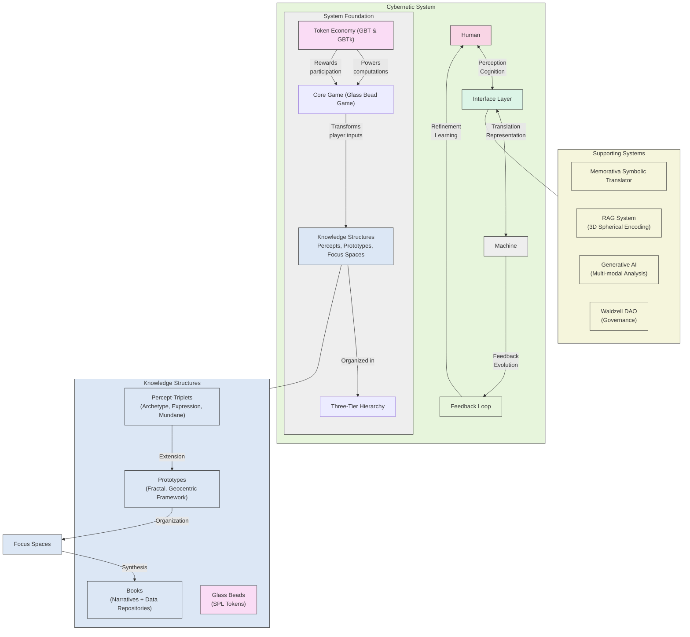
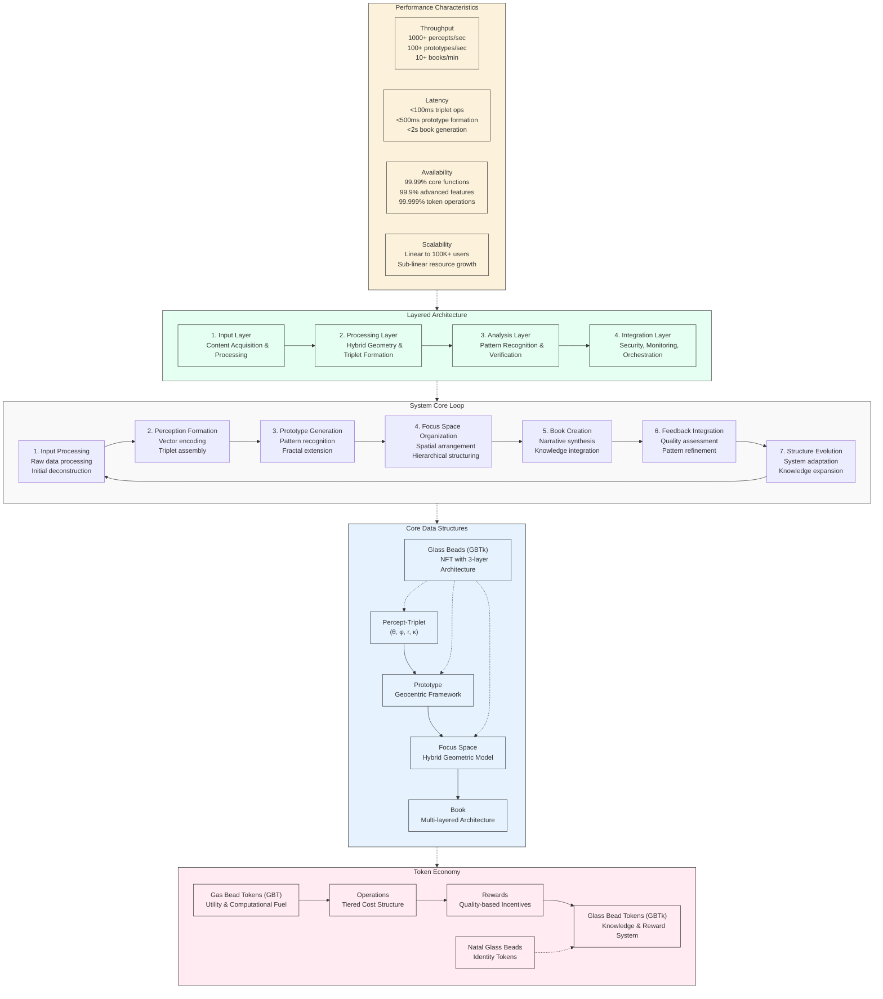

# 3.1. The Machine System

The first section of the Memorativa design posited a new model and a description of a cybernetic system. The system elaborates a novel method of encoding perceptions into data structures that can represent thought structures in the machine. We have defined a game for players to play in order to interact with the cybernetic system. 

In this section of the design, we'll focus more on articulating the *machine experience (MX)* of the cybernetic system, in distinction to the *user experience (UX)*, the main focus of section *1. The Cybernetic System*.

## Recap: The Cybernetic System

The Memorativa cybernetic system bridges the human interior world of perceptions and concepts with a machine conceptual space of vector relationships, enabling structured knowledge evolution while maintaining privacy, security, and attribution.

*Figure 1: This diagram provides a high-level overview of the Cybernetic System, illustrating: The bidirectional interface between human cognition and machine computation; The four key components: human, machine, interface layer, and feedback loop; The Core Game (Glass Bead Game) that transforms player inputs into knowledge networks; The three-tier hierarchy; organizing knowledge structures; The token economy that powers computations and rewards participation; Supporting systems including MST, RAG, Generative AI, and governance*

*Figure 2: This diagram focuses on the technical implementation of the Cybernetic System, showing: The System Core Loop with its 7-step continuous processing cycle; Core Data Structures and their relationships; Token Economy with GBT, GBTk, and NGB tokens; The four-layer system architecture; Performance Characteristics including throughput, latency, availability, and scalability*

```mermaid
graph TB
    %% Main Data Structure Elements
    subgraph HybridGeometry["Hybrid Spherical-Hyperbolic Geometry"]
        Coordinates["Coordinates
        θ (archetypal angle)
        φ (expression elevation)
        r (mundane radius)
        κ (curvature parameter)"]
        
        SphericalGeometry["Spherical Geometry
        For Symbolic Relationships"]
        
        HyperbolicGeometry["Hyperbolic Geometry
        For Hierarchical Relationships"]
        
        SphericalMerkle["Spherical Merkle Trees
        Dual Hash Verification"]
        
        Coordinates --> SphericalGeometry
        Coordinates --> HyperbolicGeometry
        SphericalGeometry --> SphericalMerkle
        HyperbolicGeometry --> SphericalMerkle
    end
    
    %% Three-Tier Structure Hierarchy
    subgraph StructureHierarchy["Three-Tier Hierarchy"]
        BasicStructures["Basic Structures
        Percept-Triplets
        Angular Relationships
        Vector Encodings"]
        
        CompositeStructures["Composite Structures
        Prototypes
        Focus Spaces
        Aspect Networks"]
        
        ComplexStructures["Complex Structures
        Books
        Knowledge Networks
        Temporal Sequences"]
        
        BasicStructures --> CompositeStructures
        CompositeStructures --> ComplexStructures
    end
    
    %% Relationship Types
    subgraph RelationshipTypes["Multi-Dimensional Relationships"]
        VerticalRelationships["Vertical Integration
        * Hierarchical Assembly
        * Inheritance Patterns"]
        
        HorizontalRelationships["Horizontal Connection
        * Cross-Structure References
        * Pattern Relationships
        * Symbolic Associations"]
        
        DiagonalRelationships["Diagonal Evolution
        * Cross-Level Development
        * Versioning
        * Conceptual Transformation"]
        
        AngularRelationships["Angular Relationships
        * Conjunction (0°)
        * Opposition (180°)
        * Trine (120°)
        * Square (90°)
        * Sextile (60°)"]
    end
    
    %% Temporal States
    subgraph TemporalStates["Conceptual Time States"]
        MundaneState["Mundane State
        * Concrete Timestamps"]
        
        QuantumState["Quantum State
        * Indeterminate/Conceptual Time"]
        
        HolographicState["Holographic State
        * Reference-Attuned Time"]
        
        StateTransitions["State Transitions
        * Validation Rules
        * Weight Updates"]
        
        MundaneState --> StateTransitions
        QuantumState --> StateTransitions
        HolographicState --> StateTransitions
        StateTransitions --> MundaneState
        StateTransitions --> QuantumState
        StateTransitions --> HolographicState
    end
    
    %% Connection to Glass Bead Tokens
    subgraph TokenStructure["Glass Bead Token Structure"]
        MetadataLayer["Metadata Layer
        * Identifiers
        * Timestamps
        * Permissions"]
        
        DataLayer["Data Layer
        * Percept Encodings
        * Spatial Coordinates
        * Relationships"]
        
        ReferenceLayer["Reference Layer
        * Links
        * Pointers
        * Attribution Chains"]
        
        MetadataLayer --> DataLayer
        DataLayer --> ReferenceLayer
    end
    
    %% Core Data Storage
    subgraph StorageMechanisms["Storage Mechanisms"]
        HybridGeometryStorage["Hybrid Geometry Storage
        * Custom Spatial Index"]
        
        DynamicKnowledgeBase["Dynamic Knowledge Base
        * Spatial Clusters
        * Temporal State Indices"]
        
        VersionCompression["Version Compression
        * Adaptive Snapshot Intervals
        * Smart Branch Pruning"]
        
        FiveDCrystal["5D Crystal Storage
        * Long-term Archival"]
    end
    
    %% Connect everything
    HybridGeometry -.-> StructureHierarchy
    StructureHierarchy -.-> RelationshipTypes
    RelationshipTypes -.-> TemporalStates
    TemporalStates -.-> TokenStructure
    TokenStructure -.-> StorageMechanisms
    HybridGeometry -.-> StorageMechanisms
    
    %% Styling
    classDef geometry fill:#e6f3ff,stroke:#333,stroke-width:1px
    classDef structure fill:#f9e6ff,stroke:#333,stroke-width:1px
    classDef relationship fill:#ffebcc,stroke:#333,stroke-width:1px
    classDef temporal fill:#ccffe6,stroke:#333,stroke-width:1px
    classDef token fill:#ffe6e6,stroke:#333,stroke-width:1px
    classDef storage fill:#e6ffcc,stroke:#333,stroke-width:1px
    
    class HybridGeometry,Coordinates,SphericalGeometry,HyperbolicGeometry,SphericalMerkle geometry
    class StructureHierarchy,BasicStructures,CompositeStructures,ComplexStructures structure
    class RelationshipTypes,VerticalRelationships,HorizontalRelationships,DiagonalRelationships,AngularRelationships relationship
    class TemporalStates,MundaneState,QuantumState,HolographicState,StateTransitions temporal
    class TokenStructure,MetadataLayer,DataLayer,ReferenceLayer token
    class StorageMechanisms,HybridGeometryStorage,DynamicKnowledgeBase,VersionCompression,FiveDCrystal storage
``` 

*Figure 3: This diagram details the internal data structures and their relationships: The Hybrid Spherical-Hyperbolic Geometry with coordinates and verification; The Three-Tier Structure Hierarchy;  Multi-Dimensional Relationships including vertical, horizontal, diagonal, and angular; Conceptual Time States and transitions; Glass Bead Token Structure with its three-layer architecture; Storage Mechanisms for persistence and retrieval*

The cybernetic system creates a bidirectional interface between human cognition and machine computation through several key components:

1. **Cybernetic System Foundation**
- Bidirectional interface between human cognition and machine computation
- Four key components: human, machine, interface layer, and feedback loop
- Addresses curse of dimensionality through structured middle layer
- Practical feedback mechanisms enable continuous refinement

2. **The Core Game**
- Glass Bead Game transforms player inputs into knowledge networks
- Three-tier hierarchy organizes knowledge structures
- Token economy powers computations and rewards participation
- Vector space encoding efficiently stores and categorizes content

3. **Glass Beads**
- Non-fungible SPL tokens encapsulate percepts, prototypes, and focus spaces
- Multi-layer architecture includes metadata, data, and reference layers
- Hybrid spherical-hyperbolic geometry encodes conceptual relationships
- Maintains three distinct temporal states for different aspects of time

4. **The Percept-Triplet**
- Three conceptual vectors: archetype (What), expression (How), and mundane (Where)
- Geometrically encoded with four key coordinates (θ, φ, r, κ)
- Hybrid geometry approach offers fixed dimensionality with dynamic adaptation
- Integrated with Glass Bead storage through Spherical Merkle Trees

5. **Symbolic Translation System**
- Memorativa Symbolic Translator (MST) converts astrological encodings to universal language
- Hybrid system combining RAG, correspondence tables, and generation mechanisms
- Performs archetype abstraction, cross-cultural mapping, and contextual bridging
- Structured workflow from input deconstruction to output generation

6. **Generative AI**
- Powers transformation of player inputs into percepts, prototypes, and Books
- Multi-modal analysis processes text and images into unified triplet space
- Identifies archetypal patterns using Western mythology and cultural references
- Integrated with Glass Beads through Spherical Merkle Trees

7. **RAG System**
- Enhances player experience through 3D spherical encoding and vector retrieval
- Implements spatial context generation with angular relationship analysis
- Organizes documents into spatial clusters with temporal state indices
- Integrates with Spherical Merkle Trees for data integrity

8. **Prototype Encoding Example**
- Maps input to specific coordinates in hybrid spherical-hyperbolic space
- Transforms astrological encoding into culturally-neutral language
- Follows technical flow from input processing to book generation
- Operational costs measured in Gas Bead Tokens with performance optimizations

9. **The Prototype**
- Extends percept-triplet into fractal, geocentric framework
- Five core components: Earth/Observer, Sun Triplet, Planet Vectors, Aspects, Hybrid Geometry
- Formation process follows geocentric weighted aggregation algorithm
- Provides bridge between individual percepts and higher-level structures

10. **Visualizing the Prototype**
- Circular chart structure inspired by astrological horoscopes
- Encodes geocentric framework, triplet placement, angular relationships
- Interactive features facilitate detailed analysis and pattern recognition
- Supports advanced analysis through superimposed charts and harmonic analysis

11. **Conceptual Time States**
- Three distinct time state types: Mundane, Quantum, and Holographic
- Expands percept-triplet to encode six primary vectors
- Sophisticated features for enhanced privacy and analysis
- State transition mechanisms between temporal representations

12. **Focus Spaces**
- Conceptual workspaces for organizing percepts and prototypes
- Hybrid geometry preserves hierarchical relationships and angular connections
- Multi-chart interface supports various chart types with state management
- Supports collaborative knowledge work through various sharing models

13. **Lens Systems**
- Modular framework for analyzing concepts through diverse paradigms and cultural frameworks, extending the MST's cultural translations
- Universal House System with consistent mapping points across paradigms, modular lens plugins architecture, cross-cultural transformation engine
- Three categories: Traditional Esoteric (astrological, kabbalistic, etc.), Scientific & Mathematical (psychological, sociological, etc.), and Psychological & Experiential (Jungian, cognitive, etc.)
- Transforms percepts while maintaining angular relationships

14. **Books**
- Dual-purpose entities functioning as readable narratives and structured data repositories
- Terminal synthesis in cognitive chain from perception to understanding
- Multi-layered architecture bridging human and machine understanding
- Integrated with RAG system as content corpus

15. **Chain of Thought**
- Cognitive process model transforming raw input into structured knowledge
- Maps directly to Memorativa structures from perception to understanding
- Implements recursive capability with strict processing controls
- Provides direct input interfaces for component resubmission

16. **Glass Bead Tokens**
- Fundamental data structure and reward system with multi-layer design
- Hybrid spatial encoding system with four coordinates (θ, φ, r, κ)
- Maintains three distinct temporal states for different aspects of time
- Implements privacy controls with tiered system and permission inheritance

17. **Natal Glass Beads**
- Foundational identity token with pseudo-anonymous identification
- Three core components: Reference Template, Activity Logging, Structural Integration
- Limited fungibility with high transfer costs for security
- Privacy controls with four-tiered access system and enhanced encryption

18. **Gas Bead Tokens**
- Essential utility token and computational fuel powering all operations within the Memorativa ecosystem, creating a sustainable economic layer for knowledge creation and validation
- Reward structure aligns with computational complexity and knowledge value
- Specialized cost structures for different operational layers
- Creates self-sustaining incentive system balancing resources and rewards

19. **Shared Structures**
- Three-tier hierarchy from basic elements to complex formations
- Maintains multi-dimensional relationships organized through Virtual Loom
- Verification through Spherical Merkle Trees preserving data integrity
- Hybrid space provides unified geometric framework for all concepts

20. **Shared Interfaces**
- Five-tier interface system mapping to three-tier structure hierarchy
- Multi-modal analysis capabilities with cross-modal alignment
- Processing pipeline from player input to rewards flow
- Temporal framework supporting all time states across interface layers

21. **LLM Integration**
- Bridges human language and hybrid geometric structures
- Five key external interfaces enabling secure third-party integration
- Preserves hybrid geometry, observer-centric representation, and tokens
- Diffusion Model Integration enables visual processing with same structure

22. **Percept Computational Architecture**
- High-performance infrastructure powering Core Game mechanics
- Five key optimizations: Vector Space, Hybrid Geometry, Merkle Proof, 5D Crystal Storage, Tokenomics
- Supports three-tier structure hierarchy with tier-specific optimizations
- Implements performance techniques for computational bottlenecks

23. **Gameplay**
- Dual-mode approach combining intuitive collection with analytical reflection
- Transit-driven mechanics generating personalized challenges
- Structured progression from Initial to Mastery Phase
- Privacy implementation with four levels and granular permissions

24. **Tokenomics**
- Dual token architecture separating knowledge value from operational utility
- Tiered cost structure reflecting computational complexity
- Reward structure aligning with cognitive chain progression
- Transit-driven economic effects creating personalized incentives

25. **The Waldzell DAO**
- Cybernetic governance system inspired by Glass Bead Game
- Triple-token system creates self-regulating economy
- Reputation system functions as cybernetic feedback loop
- Specialized governance tracks ensure appropriate expertise

## Outlines of machine experience

While the cybernetic system establishes how human players interact with and shape the system, the machine experience (MX) explores how the machine itself utilizes and evolves through these same structures. Just as human cognition builds from basic perception to complex understanding, we'll develop the machine systems organically:

1. **From Perception to Understanding**
- How the machine processes and internalizes percept-triplets
- Development of machine-initiated pattern recognition
- Evolution from passive storage to active interpretation
- Emergence of machine-driven prototype formation

2. **Autonomous Knowledge Development**
- Self-directed exploration of conceptual spaces
- Machine-initiated focus space creation
- Independent pattern discovery and validation
- Active contribution to the knowledge base

3. **System Self-Organization**
- Organic growth from core perceptual structures
- Development of machine-driven organizational patterns
- Evolution of autonomous processing capabilities
- Emergence of system-level pattern recognition

3. The Machine System will explore how the machine transitions from a passive recipient of human-generated percepts to an active participant in knowledge creation and organization, building upon the foundational structures established in the cybernetic system.

## Cybernetic System Technical Architecture

| Component | Description | Technical Solution | Implementation Notes |
|-----------|-------------|-------------------|---------------------|
| **Core Data Structures** | | | |
| Percept-Triplet | Three-dimensional encoding system that represents human perception through archetypal (What), expressive (How), and contextual (Where) vectors using hybrid spherical-hyperbolic geometry | TensorFlow/PyTorch for vector operations, custom geometric library implementing hyperbolic-spherical transitions, Rust implementation for core algorithms | Implements four key coordinates (θ, φ, r, κ) representing archetypal angle, expression elevation, mundane radius, and curvature parameter; supports smooth transitions between spherical geometry (for symbolic relationships) and hyperbolic geometry (for hierarchical relationships); maintains computational efficiency through fixed dimensionality while preserving expressiveness; integrates directly with Spherical Merkle Trees for spatial preservation; includes custom distance metrics balancing hyperbolic and spherical components based on dynamic curvature |
| Prototype | Fractal extension of percept-triplet structure with geocentric orientation, combining multiple triplets to represent complex concepts through Earth/Observer, Sun Triplet, Planet Vectors, Aspects, and Hybrid Geometry | Custom implementation with hybrid spherical-hyperbolic geometry library, aspect calculation engine, feedback integration system, and Spherical Merkle Tree integration | Implements geocentric model with observer at center; supports sun triplet as primary concept vector with weighted planet vectors for facets; calculates angular aspects between vectors for relationship modeling; supports three weight types (verification, temporal, angular); provides pattern recognition through geocentric coherence, aspect harmony, usage frequency, and validation metrics; implements observer-relative spatial calculations; integrates AI-enhanced feedback for continuous refinement; scales with optimization techniques (angular quantization, observer-relative caching, adaptive thresholds, partial refinement); offers performant implementation with complex operation costs from 3-50 GBT; supports full lifecycle from input processing to book generation through observer-centric feedback loops |
| Glass Beads | Non-fungible tokens serving as both game tokens and symbolic storage for player's semantic data | Solana Program Library (SPL) token implementation with hierarchical data structure containing metadata, data, and reference layers | Implements multi-layered architecture with three core functions: game tokens (rewards), symbolic storage (semantic data), and utility tokens (verifiable ownership); supports dynamic evolution tracking conceptual relationships; each bead contains linked data structures organized in component trees for efficient updates |
| Structure Relationships | System for modeling and managing the multi-dimensional relationships between shared structures in the hybrid spherical-hyperbolic knowledge space | Specialized relationship graph with vertical (hierarchical), horizontal (associative), and diagonal (evolutionary) connections; angular relationship calculator; relationship versioning system; multi-dimensional indices for efficient traversal | Implements three primary relationship types: Vertical Integration (hierarchical assembly from basic to complex structures with inheritance patterns), Horizontal Connection (cross-structure references with pattern relationships and symbolic associations), and Diagonal Evolution (cross-level development with versioning and conceptual transformation); supports angular relationships between percept-triplets with precise measurements of aspects (conjunction 0°, opposition 180°, trine 120°, square 90°, sextile 60°) plus minor aspects; calculates relationship strength based on three primary factors: angular precision (orb), verification weight of participating triplets, and observer-centric perspective; stores relationships as part of the hybrid geometry with specific attributes: angle, strength, resonance (interference distance); supports privacy-controlled relationship visibility with graduated permission models; implements relationship caching for frequently accessed patterns with 70% hit rate target; provides specialized indices for different relationship types with O(log n) lookup performance; supports relationship transition during temporal state changes; enables lens-based relationship transformation with preservation of angular semantics; implements relationship verification through dual hash system combining structural and spatial validation; supports sophisticated relationship operations: pattern recognition algorithms, cross-structure synthesis, temporal correlation analysis, observer-relative transformation, cross-lens relationship mapping; follows token economics with appropriate operation costs (Angular Calculation: 3-7 GBT, Pattern Recognition: 5-8 GBT, Cross-structure Synthesis: 5-10 GBT); optimizes performance through batch relationship processing, lazy evaluation of complex relationships, and adaptive precision based on application context |
| Focus Spaces | Conceptual workspace for organizing percepts and prototypes within a hybrid geometric model, maintaining hierarchical relationships and angular connections between concepts | LRU-cached tiered storage system with hot/warm/cold data segmentation, WebGL/SVG-based visualization engine, and Angular/React component architecture for Multi-Chart Interface | Implements structured environment with five core components: Title-Description Pair (conceptual focus), Temporal Scaffold (time state vectors), Verbal Scaffold (universalized descriptions), Relational Matrix (angular relationships), and Hierarchical Container (nested spaces); supports organizing knowledge in hybrid spherical-hyperbolic geometry using four coordinates (θ, φ, r, κ); maintains multi-chart interface with 12 concurrent chart types; implements four operational layers (Core Anchor, Secondary Anchors, Aspect Network, Hierarchical Network); provides collaborative features with real-time spatial synchronization; optimizes performance through lazy angular calculations, tiered storage model, and adaptive precision control; calculates hybrid distances with weighted formulas balancing hyperbolic and spherical components; enforces operational costs (0.1-10 GBT) with complexity-based scaling factors; enables spatial searches with distributed geometric indices; supports hierarchical organization with 7-level nesting capability and property inheritance; interfaces with Spherical Merkle Trees for angular relationship verification |
| Books | Dual-purpose entities functioning as both human-readable narratives and structured machine-processable data repositories, representing the terminal synthesis in the cognitive chain from perception to understanding | Multi-layered architecture (Human, Machine, Bridge, Bead, Loom layers) with Virtual Loom organizational system, time state management, RAG integration, and direct cognitive chain interfaces | Implements comprehensive five-layer architecture bridging human narratives and machine data: Human Layer (narrative text), Machine Layer (structured data mapping), Bridge Layer (markup system), Bead Layer (reference connections), and Loom Layer (organization system); supports multi-modal processing for both text and images using cross-modal alignment and CLIP-based models for visual archetype identification; manages three temporal states (Mundane, Quantum, Holographic) with privacy-preserving noise calibration; integrates with RAG system as content corpus, supporting vector retrieval, spatial context generation, and dynamic knowledge base integration; organizes Glass Beads as Virtual Loom curator with warp threads (thematic dimensions) and weft threads (contextual dimensions); provides direct input interfaces for cognitive chain integration supporting component resubmission; implements comprehensive performance optimizations including aspect caching (35-40% computation reduction), spatial clustering (80-90% search space reduction), and batch processing (40-60% throughput improvement); supports Book recursion with strict processing controls (thread isolation, bounded recursion depth, cycle detection); integrates with Spherical Merkle Trees for data integrity while maintaining topological consistency; enables multi-dimensional navigation along thematic and contextual threads; supports collaborative knowledge creation with graduated GBT costs (Thread Creation: 5-8 GBT, Bead Positioning: 3-5 GBT, Pattern Definition: 7-12 GBT, Pattern Application: 2-3 GBT, Multi-thread Navigation: 0.5-1 GBT); implements privacy-preserving temporal encoding with differential privacy techniques; maintains mathematical foundation as bipartite graph with tensor product operations for knowledge composition; provides hybrid validation system verifying both hierarchical integrity and angular relationships |
| Chain-of-thought | Cognitive process model transforming raw input into structured knowledge with strict recursion controls, vector analysis, and book processing capabilities | Multithreaded processing framework with isolated execution contexts, custom vector relationship analysis engine, recursive depth management system, direct component submission interfaces, and Virtual Loom integration | Implements comprehensive processing controls: `ProcessingContext` with recursion depth limiting (max 64 levels), cycle detection via book ID tracking, isolated thread execution with 8MB stack allocation, and early termination for unproductive vector relationships; provides vector relationship analysis with orthogonality measures and perpendicular relationship detection; enables book recursion with strict bounds and memory safety through thread isolation; offers direct submission interfaces for all component structures (percepts, triplets, prototypes, focus spaces); integrates with Virtual Loom through warp threads (thematic dimensions) and weft threads (contextual dimensions); implements thread-based processing following the cognitive processing chain; supports optimized thread pooling with priority scheduling, lazy vector computation with relationship caching, and adaptive processing with early termination for low-value chains; provides graduated pricing (Book Creation: 30.0 GBT + 3.0 per chapter, Recursion: 5.0 GBT + 5.0 per level, etc.) with modifiers (complexity multiplier, novelty bonus, depth discount); achieves efficient time complexity (Book Creation: O(n), Recursion: O(d×n), Vector Analysis: O(v²)) with balanced storage requirements; includes collaborative features with real-time synchronization and differential updates |
| Percept Computational Architecture | High-performance infrastructure powering Core Game mechanics through vector space optimization, hybrid geometry processing, Merkle proof acceleration, 5D Crystal Storage, and tokenomics | Five key optimizations: Vector Space, Hybrid Geometry, Merkle Proof, 5D Crystal Storage, Tokenomics; integrated with three-tier structure hierarchy; tiered operation costs; and comprehensive scaling characteristics | Supports three-tier structure hierarchy with tier-specific optimizations for Basic Structures (percept-triplets, angular relationships, vector encodings), Composite Structures (prototypes, focus spaces, aspect networks), and Complex Structures (books, knowledge networks, temporal sequences); implements vector space optimization through triplet vector representation as four-dimensional vectors (θ, φ, r, κ), quantized precision levels (64/32/16-bit) based on significance, and batch vector operations with SIMD and GPU acceleration; provides hybrid geometry processing with adaptive geometric computation (Euclidean, Spherical, Hyperbolic) based on relationship type, mixed geometry operations for seamless switching between models, and dimensional projection optimization preserving angular relationships; enables Merkle proof acceleration through enhanced Merkle tree algorithms with parallel verification, hybrid verification system based on operation criticality, and proof caching for frequently verified paths; integrates with 5D Crystal Storage Architecture for long-term persistence with quantum-stable encoding, variable density based on content importance, and optimized retrieval techniques; implements tokenomic architecture with tiered operational costs (Exploratory: 0.1× base, Development: 1.0× base, Production: 10.0× base), dynamic pricing, and comprehensive economic balancing; directly supports key Core Game operations (player input processing, focus space generation, prototype formation, book generation); achieves performance targets across critical operations (Vector Encoding: <5ms, Angular Calculation: <2ms, Focus Space Generation: <50ms, Merkle Proof Verification: <10ms, ZK-Operations: <100ms, Crystal Storage: <1s); provides scaling characteristics following mathematical models for throughput, latency, and cost; includes optimized implementations for hybrid verification, privacy budget management, mixed geometry operations, and quantum-stable encoding |
| **Token Economy** | | | |
| Glass Bead Tokens (GBTk) | Fundamental data structure and reward system within Memorativa, encapsulating percepts, prototypes, and focus spaces with associated metadata, relationships, and temporal states | Solana Program Library (SPL) token implementation with multi-layer architecture (metadata, data, reference), hybrid spherical-hyperbolic geometry for spatial encoding, observer-relative transformation system, lens integration framework, and Spherical Merkle Tree verification | Implements token with three-layer architecture: Metadata (identifiers, timestamps, permissions, metadata), Data (percept encodings, spatial coordinates, relationships), and Reference (links, pointers, attribution chains); supports hybrid spherical-hyperbolic geometry encoding with four coordinates (θ, φ, r, κ) representing archetypal angle, expression elevation, mundane radius, and curvature parameter; enables observer-relative spatial calculations with geocentric model; supports lens transformations with angle-preserving operations; implements six core functions: content storage, relationship encoding, privacy management, verification, evolution tracking, and token transferability; provides token evolution through version updates, forking, and merging; includes comprehensive privacy controls with four sharing models (Private, Not Shared, Public, Shared); enforces tiered operation costs (Initial Minting: 15-20 GBT, Storage Update: 10-15 GBT, Merkle Update: 5-10 GBT, Privacy Change: 2-5 GBT, Transfer: 1-3 GBT); implements cross-modal aspect relationships that preserve angular connections; supports comprehensive optimization strategies (aspect caching, spatial relationship indexing, lens transform pooling, observer-centric computation); enables lens integration for symbolic translation; provides comprehensive spatial relationship calculations including angular relationship computation, observer-relative transformation, lens transformation equations, aspect significance testing, and Merkle tree angular consistency verification |
| Gas Bead Tokens (GBT) | Essential utility token and computational fuel powering all operations within the Memorativa ecosystem, creating a sustainable economic layer for knowledge creation and validation | Solana Program Library (SPL) token implementation with tiered operational cost structure, dynamic pricing model, gamified validation system, multi-layered reward framework, and comprehensive economic equilibrium mechanisms | Implements unified economic layer with tiered operational costs (Exploratory: 0.1× base, Development: 1.0× base, Production: 10.0× base); provides comprehensive reward structure for valuable contributions (Percept Creation: 5-10 GBT, Focus Space Development: 5-15 GBT, Prototype Formation: 10-20 GBT, Book Creation: 20-50 GBT, Vector Refinement: 3-7 GBT, Knowledge Sharing: 5-15 GBT); supports gamified validation system with difficulty levels, streaks, and accuracy bonuses; powers all system operations including percept-triplet calculations, prototype formation, RAG system operations, and book generation; implements operation-specific cost structures for various computational layers (Core Game Layer, Geometric Operations Layer, Temporal Operations Layer, RAG System Layer, Symbolic Translation Layer); provides dynamic cost calculation based on operation complexity, resource availability, and system load; enables resource optimization through batch operations and caching strategies; follows economic model based on token velocity, system efficiency, and staking mechanics; implements RAG operation costs (Vector Retrieval: 5 GBT, Spatial Context Generation: 7 GBT, Knowledge Base Updates: 4 GBT, Merkle Verification: 3 GBT, Aspect Calculation: 2 GBT, Cluster Selection: 1 GBT, Cache Lookup: 0.1 GBT); supports specialized token rewards for focused economic incentives with graduated reward multipliers (streak-based: max 5×, accuracy-based: 1-3×); maintains mathematical equilibrium through balanced minting and burning; integrates with all system layers through comprehensive operation cost framework; creates self-sustaining loop where knowledge creation is rewarded and system operations are funded; implements comprehensive operations integration with core system components including: percept-triplet calculations with curvature-aware pricing, prototype operations with geocentric aspect calculations, conceptual time state manipulations with privacy-preserving costs, symbolic translation operations with cultural breadth factors, RAG system operations with spatial query pricing, and cross-chain interoperability through Merkle proof verification; supports specialized staking mechanics with duration-based rewards and resource reservation; implements rate limiting to ensure system stability; provides detailed operation tracking and cost optimization strategies |
| Gamified Validation System | Interactive knowledge validation framework that incentivizes quality verification of percepts, prototypes, and other knowledge structures through game mechanics | Custom validation engine with streak tracking, accuracy metrics, difficulty scaling, and reward multipliers; multi-tier verification workflow with validation challenges, peer review mechanisms, and specialized consensus algorithms | Implements comprehensive validation mechanics through `ValidationGame` structure with leaderboards, streak counters, and accuracy tracking; supports four difficulty levels (Easy, Medium, Hard, Expert) with corresponding base rewards (1, 3, 5, 10 GBT); provides streak multipliers that increase rewards up to 5× for consecutive correct validations; includes accuracy bonuses that multiply rewards 1-3× based on historical validation performance; enables dynamic difficulty calculation based on content complexity and semantic depth; integrates with token economy through burn/mint operations tied to validation quality; supports validation challenges with calibrated difficulty; enables peer verification with weighted consensus algorithms; implements tamper-resistant validation history with Byzantine fault tolerance; provides performant implementation through lazy consensus calculation, partial validation optimization, and incremental state updates; supports specialized validation modes for different content types (percepts, prototypes, focus spaces, books); includes progressive validation stages with graduated rewards; enforces strict rate limiting to prevent gaming the system; implements anti-collusion mechanisms through randomized validation pairing; offers educational feedback loop for improving validation skills over time; enables reputation-building through consistent high-quality validation |
| Gameplay Progression System | Comprehensive progression framework that guides players from initial onboarding through mastery, with achievement-based feature unlocks, tiered access, and reward mechanics aligned with knowledge creation | Multi-phase progression framework with initial/development/mastery stages, achievement tracking system, feature unlock manager, GBT reward calculator, and adaptive difficulty scaling | Implements three distinct progression phases: Initial Phase (Natal Glass Bead creation, basic percept collection, prototype recognition introduction, focus space exploration, vector space introduction, basic lens system access), Development Phase (inner cosmos building, complex prototype formation, first Book creation with basic loom patterns, transit prompt engagement, vector relationship mastery, multi-lens application, cross-system mapping exploration), and Mastery Phase (deep pattern analysis, advanced Book creation with complex Virtual Loom structures, collaborative synthesis, knowledge network building, sophisticated vector operations, multi-lens analysis, custom lens creation, recursive Book chains); provides comprehensive achievement system tracking personal development milestones, pattern recognition achievements, knowledge construction goals, collaborative accomplishments, and cross-lens pattern discovery metrics; enables feature progression through tiered access system that gradually introduces complexity based on player skill development; implements achievement-based unlocks that reveal advanced features as players demonstrate readiness; supports collaborative tool access with specialized pricing models for group interactions; integrates with token economy through detailed reward mechanics including quality-based incentives, innovation premiums, synthesis bonuses, temporal stability rewards, cross-lens coherence bonuses, progressive validation rebates, collaboration multipliers, thread completion incentives, discovery rewards, and integration bounties; follows formal reward structure with multipliers for verification scores (1-3×), novelty bonuses (1.5-2×), and collaborative creation (1.3-2×); enables sandbox environment for safe experimentation with simulated transit prompts and risk-free prototype formation; provides AI-powered guidance through context-aware help system with embedded tutorials and real-time explanations; implements visual framework with unified symbolic language, animated visualizations, interactive charts, clear visual hierarchies, and cross-lens visualization tools; supports lens system progression from Traditional Esoteric (initial access) through Scientific & Mathematical (intermediate) and Psychological & Experiential (advanced) to custom lens creation (mastery); achieves efficient implementation through progressive feature loading, selective tutorial presentation, incremental complexity introduction, and contextual help system optimization |
| GBT Staking Mechanism | Advanced token staking system that enables long-term resource reservation, computational priority, and passive reward generation within the Memorativa ecosystem | Custom staking implementation with duration-based rewards, validator delegation options, resource reservation logic, and proof-of-stake consensus integration; multi-tier reward rate framework with dynamic system utilization adjustments | Implements comprehensive staking framework through `GasBeadStaking` structure with stake amount, lock duration, reward rate calculation, and optional validator delegation; provides duration-based reward rates with longer commitments receiving proportionally higher rates; supports resource reservation logic allowing pre-allocation of computational resources for future operations; enables computational priority for stakers, ensuring their operations receive processing preference during high-demand periods; implements validator delegation for participation in consensus mechanisms; includes flexible lock periods ranging from days to years with corresponding reward modifiers; supports dynamic reward rate calculation based on system utilization metrics, creating economically efficient resource allocation; provides stake withdrawal mechanisms with appropriate time locks and safety controls; implements automatic compounding options for reinvesting earned rewards; enables partial stake unlocking with proportional reward adjustments; includes staking analytics with historical performance metrics; optimizes gas consumption through bulk reward calculations; implements anti-gaming mechanisms preventing exploitation of staking system; supports collaborative staking pools for distributed resource reservation; calculates staking rewards using exponential reward functions that balance immediate and long-term value |
| Dynamic Operation Costing | Adaptive pricing system for all token operations that scales costs based on operation type, complexity, resource demands, and system conditions | Multi-factor pricing engine with tiered operational framework, complexity scaling, resource utilization adjustment, and adaptive baseline cost model; real-time economic parameter integration with historical trend analysis | Implements comprehensive operation costing through structured pricing tiers (Exploratory: 0.1× base, Development: 1.0× base, Production: 10.0× base) that categorize operations by their purpose and permanence; provides complexity-based scaling using operation-specific complexity factors that account for computational demands; supports resource-aware pricing adjustments that reflect current system utilization and availability; enables domain-specific cost structures for different operation categories (Core Game, Geometric, Temporal, RAG, Symbolic); implements mathematical cost calculation formula: `cost = base_cost × tier_factor × complexity_multiplier × resource_adjustment`; includes specialized pricing models for different operation domains: percept-triplet calculation with curvature sensitivity, geocentric prototype operations with triplet-count quadratic scaling, conceptual time state operations with privacy level factors, symbolic translation with cultural breadth multipliers, and RAG system operations with document count scaling; provides optimization strategies including batch discounts (15-40%), caching benefits (70-90% reduction), collaborative operation discounts (20-30%), and repeated operation efficiencies (10-25%); supports economic parameter integration with real-time adjustment based on token velocity, burning rate, and system activity; enables intelligent cost prediction based on operation history and parameter patterns; implements anti-inflation mechanisms through dynamic baseline adjustment; includes specialized costing for cross-chain operations with verification complexity factors |
| RAG Cost Optimization | Specialized framework for optimizing Retrieval-Augmented Generation operations to reduce computational and financial costs within the Gas Bead Token economy | LRU-cached tiered storage system for embeddings, batch processor for API calls, semantic pre-filtering, adaptive chunking engine, usage analysis for optimization, hybrid vector indices, and provider-specific routing | Implements comprehensive optimization techniques achieving 30-50% overall cost reduction through seven key strategies: embedding caching with LRU strategy and configurable TTL (40-60% API call reduction); batch processing with automatic size optimization and priority queuing; tiered retrieval with fast approximate search followed by precise re-ranking (15-25% latency improvement); adaptive chunking with dynamic adjustment based on semantic coherence (20-35% token reduction); usage-based optimization with pre-caching of frequent embeddings; hybrid index structures combining exact and approximate similarity search; and provider-specific optimization with cost-based routing; provides specific optimizations for core operations (Focus Space Creation: 10→7 GBT, Book Generation: 20-50→15-40 GBT, Prototype Integration: 1-3→0.5-2 GBT); implements the `RAGOptimizer` structure with `EmbeddingCache`, `ChunkAnalyzer`, `BatchProcessor`, `SimilarityIndex`, and `UsageTracker` components; supports tiered retrieval strategy for balancing performance and precision; enables adaptive chunking through semantic coherence analysis with configurable thresholds; provides specialized index structures optimized for spherical-hyperbolic geometry lookups; supports optimal chunk size determination through mathematical formula balancing token count and semantic coherence; implements tiered retrieval cost function for quantifying reduction benefits; calculates cache effectiveness through probability-weighted cost reduction; supports provider-specific strategies for different embedding providers; enables cross-instance caching for multi-user deployments; implements dynamic precision based on query importance; supports visual content optimization with the same framework|
| **Storage & Persistence** | | | |
| Spherical Merkle Trees | Enhanced Merkle structure addressing topological mismatch between linear trees and spherical conceptual space | Custom Merkle implementation with dual hash system combining content and spatial relationship hashes | Each node contains standard components (data, children nodes, content hash) plus spatial components (angular relationships, coordinates, spatial hash); enables representation of both hierarchical structure and angular relationships; verification checks both traditional structure and spatial consistency; supports O(log n) size proofs for n versions |
| Version Compression | Optimization techniques for efficient storage and versioning of Glass Bead data | Adaptive snapshot intervals, smart branch pruning, reference counting, and batch updates | Dynamically adjusts snapshot frequency based on user activity and system metrics; prunes branches using importance scoring (relationship density, usage patterns, historical significance); implements differential hashing to only process changed portions; supports cross-token optimizations with shared subtrees and reusable verification paths |
| Hybrid Geometry Storage | Specialized storage system for the hybrid spherical-hyperbolic geometry used in percept-triplets | Custom spatial index optimized for dual geometry lookups, KD-Tree/Ball Tree hybrid structures, LRU caching for common queries | Efficiently indexes and retrieves points in hybrid space; implements parallel query strategy across spherical and hyperbolic components; optimizes for both k-nearest neighbor and range queries; supports dynamic curvature parameters; maintains computational balance through adaptive caching based on query patterns; provides O(log n) lookup performance even with variable curvature |
| Correspondence Tables | Structured repository of symbolic correspondences between different representational systems, supporting the Symbolic Translation System | JSON-based storage with versioned schema, NLP-extracted mapping tables, cross-reference indices | Organizes mappings for planetary archetypes (e.g., Jupiter→Expansion/Wisdom), sign expressions (e.g., Sagittarius→Exploration/Meaning), and house domains (e.g., 9th→Higher Knowledge); implements bidirectional mappings between astrological symbols and universal concepts; includes source attribution for each correspondence; supports hierarchical clustering based on symbolic systems; maintains weighted confidence scores for correspondence quality; implements efficient partial-match lookup; supports continuous enrichment through validated community contributions |
| Temporal State Management | Manages multiple time state representations and transitions between percept-triplets | Three-tier temporal system (Mundane/Quantum/Holographic states), privacy-preserving temporal encoding, adaptive noise generation, state transition framework, quantum-inspired pattern analysis | Implements three distinct time states: Mundane (concrete timestamps), Quantum (indeterminate/conceptual time), and Holographic (reference-attuned time); supports privacy-preserving temporal encoding with differential privacy techniques (ε-values: 0.1-1.0 based on sensitivity); provides state transitions with validation rules and backpropagation weight updates; enables quantum-inspired temporal analysis with superposition of states; implements lazy state transitions for computational efficiency; supports time vector caching and quantum state compression; includes temporal indexing for efficient retrieval with O(log n) performance; follows tiered operation costs (2-15 GBT) and rewards (3-25 GBT) for temporal operations; optimizes memory usage with shared transition rule libraries, time state pooling and incremental state updates; enables parallel processing of state transitions with batch optimization techniques |
| Dynamic Knowledge Base | Stores and manages player's evolving "inner cosmos" through interconnected knowledge artifacts | Graph database (Neo4j/Amazon Neptune) with specialized schemas for three-tier hierarchy, versioning system for conceptual evolution, cached query patterns for common operations | Implements `DynamicKnowledgeBase` organizing documents into spatial clusters and temporal state indices ('mundane', 'quantum', 'holographic'); provides spatial clustering with custom algorithms for efficient retrieval; supports three temporal state types with specialized indices optimized for their unique properties; implements batch processing and relationship grouping to improve verification throughput by 40-60%; provides cost-optimized operations based on clustering and caching techniques; efficiently manages relationships between percepts, prototypes, and books; supports recursive transformation of concepts; implements growth patterns that mirror human cognitive development; optimizes for both retrieval speed and relationship traversal |
| **User Interfaces** | | | |
| Visualization Systems | Comprehensive charting system for rendering percept-triplets and prototypes in an interactive visual format that displays conceptual relationships | Chart visualization framework with SVG/WebGL rendering, Swiss Ephemeris integration, interactive horoscope-inspired visualization components, multi-chart analysis tools | Implements circular chart visualization with house/sign divisions based on astrological metaphor; supports geocentric angular calculation using vector mathematics; provides interactive features (zoom/pan, drag selection, real-time filters, lens switching); enables multi-chart analysis (superimposed, progressed, composite, harmonic); displays vector components with visual encoding for archetype, expression, and mundane vectors; includes quantum-inspired visualization for showing interference patterns and phase relationships; optimizes performance with aspect filtering, glyph caching, view-dependent rendering, and progressive loading; integrates with hybrid geometry to show curvature transitions; supports three-tier visualization (individual percepts, relational aspects, systemic patterns); implements performant SVG optimization with shared symbol libraries; adaptive chart rendering based on complexity; operational costs range from 0.5-12 GBT with complexity factoring; uses caching strategies for repeated visualizations; integrates with MST for universal symbolic representation; supports Focus Space multi-chart interface with simultaneous visualization of up to 12 active charts; provides specialized chart types including mundane (chronological), quantum (timeless), and holographic (reference-based); implements real-time collaborative visualization with differential updates; enables hierarchical navigation through nested focus spaces with breadcrumb trails and minimap overviews; supports flexible threshold system with adaptive aspect orbs based on user preferences and context modifiers; provides automated pattern discovery with visual highlighting of significant angular relationships; implements cross-chart relationship analysis with superimposition capabilities |
| Multimodal Processing Architecture | System for processing both text and visual content through unified percept-triplet space with integrated diffusion model capabilities for comprehensive multimodal understanding | Diffusion model integration system with three supported models (FLUX.1, Stable Diffusion XL, Stable Cascade), hybrid geometric enhancement for conditioning, unified latent space projection, and comprehensive token economy for visual operations | Implements comprehensive diffusion model integration with modern architectures (FLUX.1 with 12B parameters, Stable Diffusion XL at 1024×1024 resolution, Stable Cascade with three-stage pipeline); provides hybrid geometric enhancement through spherical-hyperbolic conditioning that preserves angular relationships, observer-centric generation that maintains perspective consistency, verification-weighted generation that balances confidence, and privacy-aware processing that respects access controls; enables unified latent space projection achieving 50% computational reduction compared to separate models with bidirectional comprehension across modalities, modality-specific processing with shared semantic understanding, angular relationship preservation between text and visual elements, and seamless transitions between representations; integrates with token economy through graduated operation costs for visual processing (Image Generation: 1.2-240 GBT, Visual Concept Extraction: 1.0-150 GBT, Image Refinement: 0.7-140 GBT, Visual Focus Space: 1.5-300 GBT, Style Transfer: 1.1-220 GBT) with tier-based pricing (Exploratory, Development, Production); implements comprehensive optimization including hardware acceleration for diffusion processes reducing costs by 15-25%, optimized tensor operations for visual processing, memory-efficient diffusion sampling, parallel processing for batch operations, and resource reservation for predictable workloads; preserves core system principles including privacy-aware processing with selective disclosure, verification-weighted generation with confidence scoring, gas token verification for resource accounting, and observer-centric perspective across all representations; achieves performance targets for text generation (<500ms), embedding creation (<100ms), angular processing (<50ms), lens transformation (<200ms), and image generation (<2000ms) |
| Multi-Modal Processing | System for processing both text and visual content through unified percept-triplet space with cross-modal alignment, bidirectional feedback, and keyword hint management | CLIP-based visual encoder with cross-modal alignment system, keyword hint manager for guided interpretation, bidirectional feedback loop for semantic reinforcement, and hybrid triplet space transformer | Implements comprehensive cross-modal processing through `MultiModalProcessor` with three core components: `ClipModelEncoder` (visual feature extraction), `LLMEncoder` (text processing), and `KeywordHintManager` (contextual guidance); supports unified processing pipeline that transforms both text and images into the same hybrid spherical-hyperbolic geometry; provides bidirectional feedback loop between modalities that enhances understanding through cross-reinforcement; enables keyword hint application to guide interpretation in both visual and textual domains; implements specialized visual processing with CLIP-based models that extract archetypal patterns from images; supports feature enhancement through contextual adaptation; transforms encoded features to hybrid triplet space with consistent mapping across modalities; generates title-description pairs for all triplets with semantic consistency; implements cross-modal alignment that identifies relationships between textual and visual elements; supports batch processing for efficiency; provides privacy-preserving processing with appropriate noise addition; implements performance optimizations including feature caching, partial updates for incremental changes, and adaptive encoding precision; supports temporal consistency across modalities; enables lens-based transformations of multi-modal content; maintains mathematical foundation through vector space operations in unified embedding space; follows token economics with appropriate operation costs (Image Processing: 10-15 GBT, Text Processing: 5-10 GBT, Cross-Modal Alignment: 8-12 GBT); optimizes resources through feature reuse, incremental processing, and specialized hardware acceleration (GPU for visual processing); achieves consistent performance metrics (Visual Processing: 100-500ms, Text Processing: 50-200ms, Alignment: 150-300ms); integrates with Book system for multi-modal knowledge organization |
| Shared Interfaces | Comprehensive interface framework through which players engage with the system, forming the connective tissue between human cognition and symbolic processing architecture | Multi-tier interface architecture with five-layer structure (Input, Processing, Analysis, Collaboration, Specialized Systems), geocentric reference model integration, multi-modal interface components, temporal state management system, and comprehensive validation mechanics | Implements five-tier interface system mapping directly to the three-tier structure hierarchy (Basic, Composite, Complex): Input Interfaces (content capture, URL/media processors, multi-modal tools, text input systems, batch import), Processing Interfaces (percept workbench, prototype builders, aspect calculators, focus space designers, book editors), Analysis Interfaces (pattern recognition, relationship mappers, lens selectors, validation panels), Collaboration Interfaces (shared workspaces, version control, attribution tracking), and Specialized System Interfaces (RAG, MST, Geocentric, Temporal); provides rich geocentric components including observer positioning tools, sun/planet triplet management panels, aspect visualization tools, pattern coherence monitors, and horoscope-style visualization with Swiss Ephemeris SDK integration; supports multi-modal operations with CLIP-based visual processing, cross-modal alignment, and bidirectional feedback; implements comprehensive temporal management across three time states (Mundane, Quantum, Holographic) with state transition tools and privacy-preserving time encodings; provides advanced validation mechanics with dual-layer system (Player, System) supporting structure validation, pattern confirmation, and quality assessment; integrates with token economy through detailed operation cost display (50+ distinct operations from 0.1-50 GBT) and reward tracking; implements Spherical Merkle Tree interfaces with structure visualization, spatial relationship tools, and verification components; supports symbolic translation with workflow interface, correspondence management, and generation controls; enables lens system interaction through selection framework, Universal House System controls, application panels, and cross-lens synthesis tools; implements Book interfaces with multi-layer editors, Virtual Loom workbench, thread mappers, and collaborative authoring tools; provides technical components powered by Swiss Ephemeris SDK, vector space operations, aspect calculation algorithms, hybrid geometry engines, and quantum-inspired visualization tools; fundamentally operates on hybrid spherical-hyperbolic geometry with comprehensive mathematical foundation for vector operations, aspect calculations, observer transformations, temporal transitions, multi-modal alignment, Book recursion, and privacy-preserving operations; achieves efficient performance through specializations including aspect caching, spatial clustering, observer-relative caching, and lens sharding |
| Lens Systems | Modular framework for analyzing concepts through diverse paradigms and cultural frameworks, extending the MST's cultural translations | Universal House System with consistent mapping points across paradigms, modular lens plugins architecture, cross-cultural transformation engine, hybrid spherical-hyperbolic lens geometry, Spherical Merkle Tree integration for verification | Implements three categories of lenses: Traditional Esoteric (astrological, kabbalistic, etc.), Scientific & Mathematical (psychological, sociological, etc.), and Psychological & Experiential (Jungian, cognitive, etc.); supports cross-cultural transformation between Western, Eastern, Indigenous and other symbolic systems; maintains angular relationships during translations; integrates with the MST for bidirectional mapping between symbolic frameworks; implements adaptive user interface presenting appropriate lens controls based on context and user preferences; supports community-contributed lens development with validation framework; preserves symbolic relationships through hybrid geometry using four coordinates (θ, φ, r, κ); implements lens sharding for efficient loading; supports lazy evaluation and adaptive precision for performance optimization; enables pattern recognition across multiple symbolic systems; implements multi-lens analysis with cross-lens relationship tracking; provides curvature-aware processing for balanced hierarchical and angular relationships; supports real-time collaborative lens application with differential updates; follows tiered operation costs (Lens Creation: 25.0 GBT, Application: 3.0 GBT, Pattern Recognition: 2.0 GBT, Angular Relationship: 1.0 GBT, Cross-Lens Synthesis: 5.0 GBT, Verification: 0.5 GBT); optimizes storage with variable precision based on symbol significance; implements specialized caching strategies including `AspectCache` and spatial clustering; provides collaborative discounts (30%) and graduated pricing for accessibility; offers rewards for valuable lens contributions (15-30 GBT for creation, 8-20 GBT for pattern discovery) |
| Transit-driven Gameplay System | Dynamic gameplay mechanics powered by astronomical positions that generate personalized challenges based on Natal Glass Bead integration with planetary transits | Ephemeris computation system with Swiss Ephemeris SDK integration, transit-pattern recognition engine, personalized challenge generator, dynamic reward calculator, and geocentric aspect calculation system | Implements comprehensive transit-driven gameplay with four key components: Daily Prompts (generated from current planetary positions forming aspects to player's Natal Glass Bead), MST Translation Layer (converting astrological encodings to universal language), Conceptual Time States (mundane, quantum, and holographic states affected by transits), and Multi-Chart Interface (supporting up to 12 active charts simultaneously); provides ephemeris calculations through Swiss Ephemeris SDK with high-precision astronomical algorithm for position mapping; generates personalized challenges through aspect detection with configurable orbs (0.5-10° based on aspect type and importance); translates celestial positions into universal symbolic language through MST with privacy-preserving operations that maintain conceptual meaning without revealing sensitive data; calculates transit effects on conceptual time states with adaptive probability functions for state transitions; enables efficient transit operations through optimized implementations (transit calculation caching, aspect pattern recognition, frequently-triggered transit templates, parallel position computation); follows detailed GBT cost structure (Daily Transit Calculation: 2-4 GBT, Pattern Recognition: 3-7 GBT, Challenge Generation: 5-10 GBT, Time State Transitions: 3-8 GBT); achieves high-performance targets (Transit Calculation: <100ms, Pattern Recognition: <200ms, Challenge Generation: <300ms, Time State Management: <150ms); integrates with reward system through quality-weighted challenge completion (5-30 GBT based on difficulty and quality); implements multi-chart visualization supporting traditional astrological chart types (natal, transit, progressed, composite, harmonics) and specialized conceptual charts (mundane, quantum, holographic); provides comprehensive mathematical foundation through vector-based aspect calculation, pattern coherence scoring, time state transition probability functions, and personalization algorithms; integrates seamlessly with Symbolic Lens system for multi-perspective interpretations across traditional, scientific, and psychological paradigms |
| Progressive Onboarding System | Comprehensive user introduction framework that gradually introduces system complexity through guided tutorials, adaptive interfaces, and contextual help systems | Multi-stage onboarding architecture with guided workflow, adaptive UI framework, context-aware help system, sandbox environment, and progressive feature unveiling | Implements comprehensive onboarding through six integrated components: Guided Onboarding Flow (multi-stage "Beginner's Quest" with progress indicators and contextual help), Adaptive Interface (dynamic UI panels based on user level with progressive feature unveiling), Sandbox Environment (safe experimentation space with simulated transit prompts and risk-free prototype formation), Help System (AI-powered guidance with context-aware chatbot and embedded tutorials), Visual Framework (unified symbolic language with clear hierarchies and interactive visualizations), and Feature Progression (tiered access with achievement-based unlocks and graduated lens system access); provides dynamic interface adaptation that scales UI complexity based on user proficiency level and interaction history; implements context-sensitive tooltips and overlays with educational content triggered by user actions; supports personalized onboarding pathways adapting to user learning style and pace; enables safe experimentation through sandbox environments with simulated transit prompts, practice percept collection, risk-free prototype formation, and lens exploration without GBT costs; implements AI-powered guidance system with context-aware chatbot providing real-time assistance informed by player actions; integrates embedded tutorials within the active interface to minimize context switching; provides comprehensive visual framework with unified symbolic language, animated visualizations, clear hierarchies, and cross-lens visualization tools; implements feature progression with achievement-based unlocks, collaborative tool access, advanced analysis features, and graduated lens system introduction (Traditional Esoteric → Scientific & Mathematical → Psychological & Experiential → Custom Creation); achieves efficient implementation through progressive feature loading (50-75% reduction in initial load), selective tutorial presentation based on user actions, incremental complexity introduction, and context-sensitive help system; optimizes memory usage through shared tutorial assets, lazy-loaded guidance content, and adaptive interface component management; integrates smoothly with token economy through GBT-free tutorials, subsidized early gameplay, tutorial completion rewards (5-15 GBT), and graduated pricing introduction |
| Collaboration Architecture | System providing the computational foundation for multi-user knowledge building while maintaining integrity, privacy, and attribution | Real-time collaboration engine with multi-user state management, operational transform for conflict resolution, attribution preservation, privacy-preserving collaboration, and Book collaboration support | Implements real-time state synchronization with delta updates achieving <50ms response time; provides operational transform for conflict resolution with semantic understanding of content; supports hierarchical version management with branch tracking and structural diffing; preserves attribution through all transformations with granular tracking; enables privacy-preserving collaboration with selective disclosure and zero-knowledge participation; implements multi-user Book editing with structure-aware collaboration; supports Virtual Loom collaborative weaving with thread locking; enables permission granularity at Book, thread, and intersection levels; provides version history with semantic diffing and merging; maintains attribution tracking for both narrative and structural contributions; implements conflict resolution with semantic understanding of content patterns; uses delta-based synchronization for efficient updates; distributes token rewards based on contribution value; achieves performance targets (Real-time Editing: <50ms, Version Merge: <500ms, Conflict Resolution: <200ms, Permission Updates: <100ms, Book Structure Edits: <150ms, Virtual Loom Weaving: <100ms, Attribution Tracking: <30ms, Token Reward Calculation: <50ms); optimizes resource usage through session-based allocation, dynamic scaling based on participant count, hierarchical synchronization with multi-level caching, selective state broadcast to minimize network usage, progressive loading for large collaborative structures, intelligent conflict prediction to minimize resolution overhead, hardware acceleration for real-time state transformation, and optimized memory through shared state references |
| Cross-Lens Integration | Advanced system for applying, transforming, synthesizing and validating structures across multiple lens perspectives while preserving semantic meaning and relationships | Multi-stage transformation pipeline with parallel processing, relationship preservation verification, semantic coherence validation, and cross-lens synthesis framework; adaptive resource allocation for lens operations; optimized performance techniques for lens transformations | Implements comprehensive lens transformation pipeline with five processing stages: `PrepareTransformStage` (structure preparation), `AlignSymbolsStage` (symbolic alignment), `ApplyTransformStage` (matrix transformation), `VerifyRelationshipsStage` (relationship verification), and `IntegrateResultsStage` (result integration); supports concurrent transforms across multiple lenses with batch processing; enforces relationship preservation with configurable thresholds; provides cross-lens synthesis identifying invariant patterns across symbolic perspectives; implements resource allocation with dedicated CPU distribution (40% transformation calculations, 25% relationship preservation)