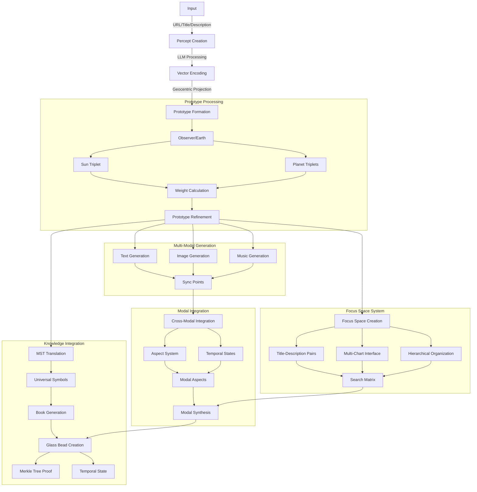
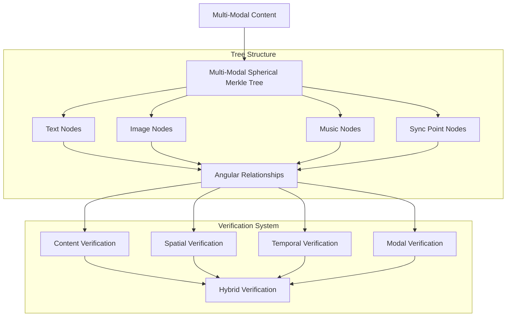
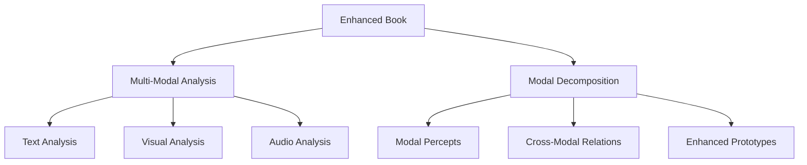
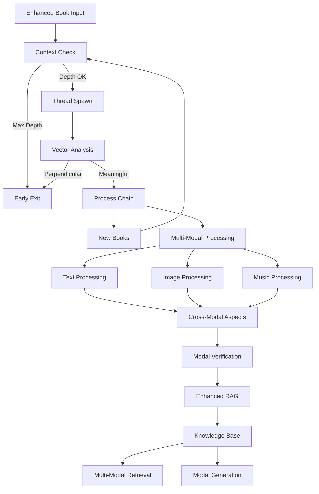
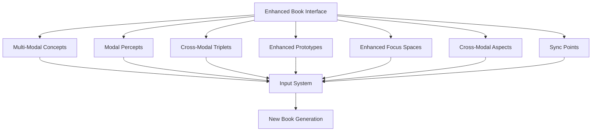

# 3.11. Enhanced Chain of Thought

The enhanced chain-of-thought design extends Memorativa's cognitive progression model to support multi-modal processing, cross-modal aspects, and enhanced temporal states. This design maintains the core transformation of raw perceptual input into structured knowledge while enabling richer pattern recognition and synthesis across modalities.

## Complete System Flow Recap

The Memorativa system transforms raw input into structured knowledge through several key stages:



## Enhanced Chain of Thought

The enhanced cognitive chain now processes information through multiple modalities while maintaining structural coherence:

| Cognitive Process | Enhanced Structure | Description | Multi-Modal Output |
|------------------|---------------------|-------------|-------------------|
| Perception | Enhanced Input Entry | Raw content enters system with multi-modal context | Multi-Modal Percept |
| Conceptualization | Enhanced Percept-Triplet | Input mapped to Planet-Sign-House with modal aspects | Multi-Modal Structure |
| Pattern Recognition | Enhanced Prototype | Multiple percept-triplets form cross-modal patterns | Modal Pattern Network |
| Analysis | Enhanced Focus Space | Prototypes analyzed through multi-modal lenses | Cross-Modal Analysis |
| Synthesis | Enhanced Book | Structured collection with synchronized modal outputs | Multi-Modal Narrative |
| Reflection | Enhanced Library | Books organized with cross-modal relationships | Modal Knowledge Network |
| Understanding | Enhanced Concept Marking | Content boundaries across modalities identified | Cross-Modal Concept Map |

This progression enables:
- Rich multi-modal pattern recognition
- Cross-modal relationship discovery
- Enhanced temporal coherence
- Deep symbolic understanding
- Intuitive knowledge synthesis

## Multi-Modal Spherical Merkle Trees

The enhanced chain of thought is supported by Multi-Modal Spherical Merkle Trees that extend the core Spherical Merkle Tree architecture to maintain integrity and relationship consistency across text, image, and music modalities:



### Multi-Modal Node Structure

```rust
struct MultiModalMerkleNode {
    // Core node data
    id: NodeId,
    parent: Option<NodeId>,
    children: Vec<NodeId>,
    hash: [u8; 32],
    
    // Content by modality (optional for each node)
    text_content: Option<TextContent>,
    image_content: Option<ImageContent>,
    music_content: Option<MusicContent>,
    
    // Hybrid spherical-hyperbolic coordinates
    theta: f32,     // Archetypal angle (0-2π)
    phi: f32,       // Expression elevation (-π/2-π/2)
    radius: f32,    // Mundane magnitude (0-1)
    kappa: f32,     // Curvature parameter
    
    // Cross-modal relationships
    angular_relationships: HashMap<(NodeId, Modality), CrossModalRelationship>,
    
    // Temporal state
    temporal_state: TemporalState,
    
    // Sync points across modalities
    sync_points: Vec<SyncPoint>,
}

struct CrossModalRelationship {
    // Angular distance in spherical-hyperbolic space
    angle: f32,
    
    // Relationship strength/significance
    strength: f32,
    
    // Relationship type
    relation_type: RelationType,
    
    // Modal transfer properties
    modal_transfer: ModalTransferProperties,
}

struct SyncPoint {
    // Position markers in each modality
    text_position: Option<TextPosition>,
    image_marker: Option<ImageMarker>,
    audio_timestamp: Option<AudioTimestamp>,
    
    // Sync point type
    sync_type: SyncType,
    
    // Temporal state at sync point
    temporal_state: TemporalState,
    
    // Verification hash for integrity
    hash: [u8; 32],
}
```

## Cross-Modal Aspect System

The Cross-Modal Aspect System implements astrological-style angular relationships between different types of content (text, images, and music). This creates a coherent multi-sensory experience where elements resonate with each other based on their conceptual and temporal relationships.

Just as planetary aspects in astrology indicate meaningful angular relationships, these cross-modal aspects define how different content types interact and reinforce each other:

| Aspect Type | Angle | Relationship Effect | Resonance Value |
|-------------|-------|---------------------|-----------------|
| Conjunction | 0° | Direct reinforcement between modalities | 1.0 |
| Opposition | 180° | Contrasting elements generate creative tension | 0.8 |
| Trine | 120° | Harmonic flow between modalities | 0.9 |
| Square | 90° | Creative challenges that drive innovation | 0.7 |
| Sextile | 60° | Supportive connections between modalities | 0.6 |

```rust
struct CrossModalAspect {
    angle: f32,  // 0-360 degrees
    source: ModalElement,
    target: ModalElement,
    weight: f32,
    temporal_state: TemporalState,
}

enum ModalElement {
    Text(TextPosition),
    Image(ImageMarker), 
    Music(AudioTimestamp),
}

impl CrossModalAspect {
    fn calculate_resonance(&self) -> f32 {
        match (self.angle, self.temporal_state) {
            // Conjunction (0°) - Direct reinforcement
            (a, _) if (a - 0.0).abs() < 5.0 => 1.0,
            
            // Opposition (180°) - Contrasting elements
            (a, _) if (a - 180.0).abs() < 5.0 => 0.8,
            
            // Trine (120°) - Harmonic flow
            (a, _) if (a - 120.0).abs() < 5.0 => 0.9,
            
            // Square (90°) - Creative tension
            (a, _) if (a - 90.0).abs() < 5.0 => 0.7,
            
            // Sextile (60°) - Supportive connection
            (a, _) if (a - 60.0).abs() < 5.0 => 0.6,
            
            _ => 0.3 // Weak resonance for non-major aspects
        }
    }
}
```

## Terminal synthesis

The enhanced Book structure serves as terminal output with expanded capabilities:

1. **Enhanced Structure Integration**
   - References all modal Glass Beads
   - Maintains cross-modal relationships
   - Preserves temporal coherence
   - Enables synchronized exploration

2. **Multi-Modal Format**
   - Human Layer: Multi-modal narrative
   - Machine Layer: Structured modal data
   - Bridge Layer: Cross-modal markup

3. **Temporal Context**
   - Mundane Time: Concrete events
   - Quantum Time: Modal superposition
   - Holographic Time: Reference framework

### Modal Integration at Terminal Synthesis

```rust
struct ModalSynthesisManager {
    text_synthesizer: TextSynthesizer,
    image_synthesizer: ImageSynthesizer,
    music_synthesizer: MusicSynthesizer,
    sync_manager: SyncManager,
    merkle_generator: SphericalMerkleGenerator,
    
    fn synthesize_book(&self, prototypes: Vec<Prototype>) -> EnhancedBook {
        // Generate modal content
        let text = self.text_synthesizer.generate(prototypes.clone());
        let images = self.image_synthesizer.generate(prototypes.clone());
        let music = self.music_synthesizer.generate(prototypes.clone());
        
        // Establish sync points
        let sync_points = self.sync_manager.create_sync_points(
            &text, &images, &music
        );
        
        // Calculate cross-modal aspects
        let aspects = self.calculate_cross_modal_aspects(
            &text, &images, &music, &sync_points
        );
        
        // Generate Spherical Merkle Tree
        let merkle_tree = self.merkle_generator.generate_multi_modal(
            &text, &images, &music, &aspects, &sync_points
        );
        
        EnhancedBook {
            text,
            images,
            music,
            sync_points,
            aspects,
            merkle_tree,
            // Other book properties
        }
    }
    
    fn calculate_cross_modal_aspects(
        &self,
        text: &TextContent,
        images: &Vec<ImageContent>,
        music: &MusicContent,
        sync_points: &Vec<SyncPoint>
    ) -> Vec<CrossModalAspect> {
        let mut aspects = Vec::new();
        
        // Calculate text-image aspects
        for text_section in &text.sections {
            for image in images {
                let angle = calculate_angular_relationship(
                    text_section.position, 
                    image.position
                );
                
                if is_significant_aspect(angle) {
                    aspects.push(CrossModalAspect {
                        angle,
                        source: ModalElement::Text(text_section.position),
                        target: ModalElement::Image(image.position),
                        weight: 1.0,
                        temporal_state: sync_points[0].temporal_state.clone()
                    });
                }
            }
        }
        
        // Calculate text-music aspects
        for text_section in &text.sections {
            for timestamp in &music.timestamps {
                let angle = calculate_temporal_angle(
                    text_section.position,
                    timestamp
                );
                
                if is_significant_aspect(angle) {
                    aspects.push(CrossModalAspect {
                        angle,
                        source: ModalElement::Text(text_section.position),
                        target: ModalElement::Music(*timestamp),
                        weight: 0.8,
                        temporal_state: sync_points[0].temporal_state.clone()
                    });
                }
            }
        }
        
        // Calculate image-music aspects
        for image in images {
            for timestamp in &music.timestamps {
                let angle = calculate_visual_audio_angle(
                    image.position,
                    timestamp
                );
                
                if is_significant_aspect(angle) {
                    aspects.push(CrossModalAspect {
                        angle,
                        source: ModalElement::Image(image.position),
                        target: ModalElement::Music(*timestamp),
                        weight: 0.9,
                        temporal_state: sync_points[0].temporal_state.clone()
                    });
                }
            }
        }
        
        aspects
    }
}
```

## Book recursion

Enhanced Books entering the system follow an expanded recursive path:

1. **Multi-Modal Input Processing**
   - Extract modal components
   - Map cross-modal relationships
   - Identify temporal states
   - Process through active lenses

2. **Structural Decomposition**
   - Narrative → Modal percepts
   - Relationships → Cross-modal aspects
   - Patterns → Enhanced prototypes
   - Analysis → Multi-modal focus spaces

3. **Example Flow**


## Temporal State Integration

The enhanced system handles three distinct time states across all modalities, mapping percept-triplet temporal vectors to specific parameters:

### Mundane Time
- **Text**: Chronological narratives, concrete timestamps, historical context
- **Images**: Time-stamped visualizations, clear documentation, literal representation  
- **Music**: 
  - Regular rhythmic structures (0.8 regularity)
  - Simple harmonic patterns (0.4 complexity)
  - Stable tempo (0.9 stability)

### Quantum Time  
- **Text**: Conceptual relationships, potential meanings, probabilistic connections
- **Images**: Probability-based patterns, multiple interpretations, fluid symbolism
- **Music**:
  - Semi-regular rhythms (0.4 regularity) 
  - Complex harmonies (0.7 complexity)
  - Variable tempo (0.5 stability)

### Holographic Time
- **Text**: Reference frameworks, archetypal connections, pattern recognition
- **Images**: Multi-dimensional visualizations, reference-based symbolism, nested patterns
- **Music**:
  - Irregular rhythmic layers (0.2 regularity)
  - Dense harmonic structures (0.9 complexity) 
  - Fluid tempo (0.3 stability)

```rust
struct TemporalState {
    mundane: Option<DateTime>,
    quantum: QuantumState,
    holographic: Option<ChartRef>,
    
    fn apply_to_music(&self, music: &mut Music) {
        match self {
            TemporalState::Mundane(_) => {
                music.rhythm = RhythmParams {
                    regularity: 0.8,  // High regularity for concrete time
                    pattern_length: 4, // Standard 4-beat patterns
                    syncopation: 0.2  // Minimal syncopation
                };
                music.harmony = HarmonyParams {
                    complexity: 0.4,   // Simple, clear harmonies
                    modulation: 0.3,   // Minimal key changes
                    consonance: 0.8    // Highly consonant
                };
                music.tempo = TempoParams {
                    stability: 0.9,    // Very stable tempo
                    base_bpm: 120,     // Standard tempo
                    variation: 0.1     // Minimal variation
                };
            },
            TemporalState::Quantum => {
                music.rhythm = RhythmParams {
                    regularity: 0.4,   // Less regular patterns
                    pattern_length: 7,  // Irregular lengths
                    syncopation: 0.6   // More syncopation
                };
                music.harmony = HarmonyParams {
                    complexity: 0.7,    // Complex harmonies
                    modulation: 0.6,    // More key changes
                    consonance: 0.5     // Balance of consonance/dissonance
                };
                music.tempo = TempoParams {
                    stability: 0.5,     // Variable tempo
                    base_bpm: 100,      // Slightly slower base
                    variation: 0.5      // Moderate variation
                };
            },
            TemporalState::Holographic(_) => {
                music.rhythm = RhythmParams {
                    regularity: 0.2,    // Highly irregular
                    pattern_length: 12, // Extended patterns
                    syncopation: 0.8   // Heavy syncopation
                };
                music.harmony = HarmonyParams {
                    complexity: 0.9,    // Very complex harmonies
                    modulation: 0.8,    // Frequent modulation
                    consonance: 0.3     // More dissonant
                };
                music.tempo = TempoParams {
                    stability: 0.3,     // Fluid tempo
                    base_bpm: 80,       // Slower base tempo
                    variation: 0.8      // High variation
                };
            }
        }
    }
}
```

## Book processing controls

The Book→Percept processing chain implements strict recursion controls to prevent infinite loops while preserving meaningful conceptual development across multiple modalities. These controls ensure stable knowledge evolution while preventing computational overflow.

### Processing context

Each Book processing operation maintains an enhanced context that tracks:
- Current recursion depth (max 64 levels)
- Previously visited Books in the chain
- Modal state tracking for each content type
- Cross-modal relationship metrics
- Thread state and stack allocation
- Vector relationship metrics

The `EnhancedProcessingContext` struct and its can_process method are designed to manage and control the execution of multi-modal book processing operations:

```rust
struct EnhancedProcessingContext {
    depth: u32,
    max_depth: u32,
    visited_books: HashSet<BookId>,
    modal_states: HashMap<Modality, ProcessingState>,
    cross_modal_aspects: Vec<CrossModalAspect>,
    thread_stack: Vec<EnhancedBookState>,

    fn can_process(&mut self, book: &EnhancedBook) -> Result<(), ProcessingError> {
        if self.depth >= self.max_depth {
            return Err(ProcessingError::MaxDepthExceeded);
        }
        if !self.visited_books.insert(book.id) {
            return Err(ProcessingError::CycleDetected);
        }
        
        // Check modal state limits
        for (modality, state) in &self.modal_states {
            if state.complexity > self.get_complexity_threshold(*modality) {
                return Err(ProcessingError::ModalComplexityExceeded(*modality));
            }
        }
        
        // Check cross-modal aspect limits
        if self.cross_modal_aspects.len() > self.get_max_aspects() {
            return Err(ProcessingError::TooManyAspects);
        }
        
        Ok(())
    }
    
    fn get_complexity_threshold(&self, modality: Modality) -> f32 {
        match modality {
            Modality::Text => 0.85,
            Modality::Image => 0.8,
            Modality::Music => 0.75,
            _ => 0.7,
        }
    }
    
    fn get_max_aspects(&self) -> usize {
        // Maximum number of cross-modal aspects to track
        // Prevents exponential relationship growth
        100
    }
}
```

### Thread management

Each Book processing chain runs in an isolated thread with dedicated stack space:

```rust
fn process_enhanced_chain(
    book: EnhancedBook,
    context: EnhancedProcessingContext
) -> Result<Vec<MultiModalPercept>> {
    thread::Builder::new()
        .stack_size(16 * 1024 * 1024) // 16MB stack
        .spawn(move || {
            context.can_process(&book)?;
            
            // Process each modality
            let text_percepts = process_text(book.text)?;
            let visual_percepts = process_visual(book.visual)?;
            let audio_percepts = process_audio(book.audio)?;
            
            // Process cross-modal relationships
            let cross_modal = process_cross_modal(
                text_percepts,
                visual_percepts,
                audio_percepts
            )?;
            
            // Verify cross-modal integrity
            verify_cross_modal_integrity(
                &text_percepts,
                &visual_percepts,
                &audio_percepts,
                &cross_modal
            )?;
            
            // Generate Spherical Merkle verification
            let verification = generate_spherical_merkle_proof(
                &text_percepts,
                &visual_percepts,
                &audio_percepts,
                &cross_modal
            )?;
            
            context.depth += 1;
            
            process_derived_content(cross_modal, context, verification)
        })?
}
```

### Multi-Modal Vector Analysis

The system monitors multi-modal vector relationships:

```rust
fn should_terminate_processing(vectors: &MultiModalVectors) -> bool {
    // Check each modality
    let text_perpendicular = count_perpendicular_relationships(&vectors.text);
    let visual_perpendicular = count_perpendicular_relationships(&vectors.visual);
    let audio_perpendicular = count_perpendicular_relationships(&vectors.audio);
    
    // Check cross-modal relationships
    let cross_modal_perpendicular = count_cross_modal_perpendicular(&vectors);
    
    // Check aspect quality
    let significant_aspects = count_significant_aspects(&vectors.aspects);
    let aspect_quality = calculate_aspect_quality(&vectors.aspects);
    
    // Terminate if ≥75% of relationships are perpendicular
    let total_perpendicular = text_perpendicular + visual_perpendicular + 
        audio_perpendicular + cross_modal_perpendicular;
    
    let total_relationships = vectors.total_relationship_count();
    
    // Early termination conditions
    if total_perpendicular as f32 / total_relationships as f32 >= 0.75 {
        return true;
    }
    
    // Terminate if aspects are poor quality
    if significant_aspects > 0 && aspect_quality < 0.4 {
        return true;
    }
    
    // Terminate if modal sync is poor
    if calculate_modal_sync_quality(&vectors) < 0.5 {
        return true;
    }
    
    false
}

fn calculate_modal_sync_quality(vectors: &MultiModalVectors) -> f32 {
    // Calculate how well synchronized the different modalities are
    // Based on sync point consistency and temporal coherence
    
    // Check sync point alignment
    let sync_alignment = vectors.calculate_sync_point_alignment();
    
    // Check temporal state consistency
    let temporal_consistency = vectors.calculate_temporal_consistency();
    
    // Check cross-modal aspect quality
    let aspect_quality = calculate_aspect_quality(&vectors.aspects);
    
    // Weighted average
    (sync_alignment * 0.4) + (temporal_consistency * 0.4) + (aspect_quality * 0.2)
}
```

### Processing flow



This control system ensures:
- Bounded recursion depth (configurable, default 64)
- Cycle detection through Book ID tracking
- Early termination of unproductive chains
- Memory safety through thread isolation
- Cross-modal relationship preservation
- Integration with version control
- Modal state tracking and limiting
- Cross-modal aspect monitoring
- Verification of relationship integrity
- Sync point consistency checking

## Direct input interface

Books provide enhanced submission interfaces:



## Sync Point System

Sync points serve as the critical connectors between different modalities, ensuring temporal and conceptual alignment across text, visual, and musical elements:

```rust
struct SyncPoint {
    // Position markers in each modality
    text_position: Option<TextPosition>,
    image_marker: Option<ImageMarker>,
    audio_timestamp: Option<AudioTimestamp>,
    
    // Sync point type
    sync_type: SyncType,
    
    // Temporal state at sync point
    temporal_state: TemporalState,
    
    // Verification hash for integrity
    hash: [u8; 32],
}

enum SyncType {
    // Major conceptual boundary
    ConceptBoundary,
    
    // Significant thematic shift
    ThematicShift,
    
    // State transition point
    TemporalTransition,
    
    // Harmonic convergence of modalities
    ModalConvergence,
    
    // Significant cross-modal aspect
    AspectPoint
}

struct SyncManager {
    // Creates sync points at natural modality intersection points
    fn create_sync_points(
        &self,
        text: &TextContent,
        images: &Vec<ImageContent>,
        music: &MusicContent
    ) -> Vec<SyncPoint> {
        let mut sync_points = Vec::new();
        
        // Identify conceptual boundaries in text
        for boundary in identify_concept_boundaries(text) {
            // Find closest related image elements
            let image_markers = find_related_image_elements(boundary, images);
            
            // Find closest related music timestamps
            let audio_timestamps = find_related_audio_elements(boundary, music);
            
            // Create sync points for each valid combination
            for image_marker in image_markers {
                for audio_timestamp in &audio_timestamps {
                    let sync_point = SyncPoint {
                        text_position: Some(boundary.position),
                        image_marker: Some(image_marker.clone()),
                        audio_timestamp: Some(*audio_timestamp),
                        sync_type: SyncType::ConceptBoundary,
                        temporal_state: get_dominant_temporal_state(
                            &boundary, &image_marker, audio_timestamp),
                        hash: calculate_sync_hash(
                            &boundary, &image_marker, audio_timestamp)
                    };
                    
                    sync_points.push(sync_point);
                }
            }
        }
        
        // Additional sync points for major modal elements without direct text connections
        add_modal_specific_sync_points(&mut sync_points, images, music);
        
        // Verify and filter sync points
        filter_and_verify_sync_points(sync_points)
    }
}
```

## Key points

- The enhanced chain-of-thought design enables rich multi-modal processing while maintaining the core cognitive progression
- Cross-modal aspect discovery and relationship mapping enhance knowledge synthesis
- Enhanced temporal states support deeper understanding across modalities through specific modal expressions
- Multi-Modal Spherical Merkle Trees verify both content integrity and spatial relationships across modalities
- Sync points ensure temporal and conceptual alignment between different modal expressions
- Strict processing controls ensure computational stability and balance performance
- Direct interfaces enable intuitive multi-modal interaction
- Integration with enhanced RAG and LLM systems enables sophisticated knowledge processing
- Cross-modal angular relationships (conjunction, opposition, trine, square, sextile) create meaningful resonance between modalities
- Modal-specific temporal expression creates rich and varied experiences across mundane, quantum, and holographic states
