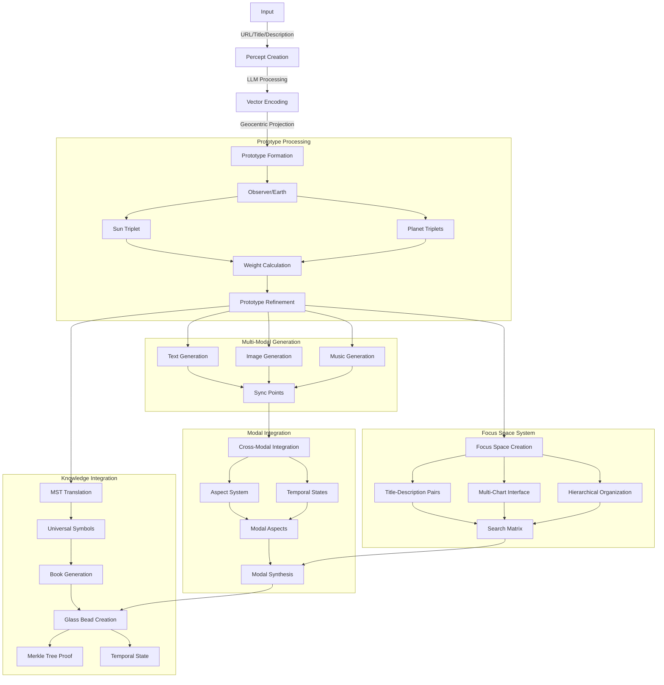
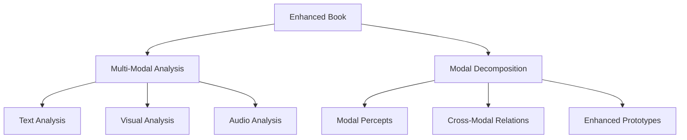
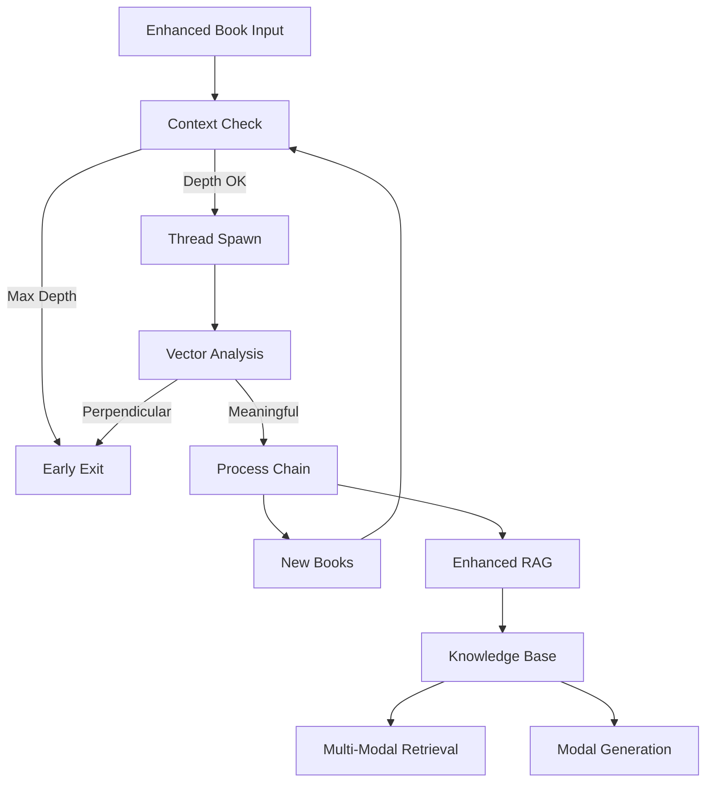
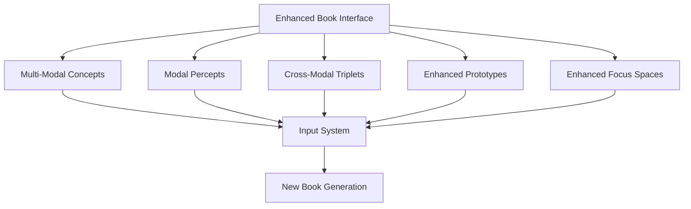

# 3.11. Enhanced Chain of Thought

The enhanced chain-of-thought design extends Memorativa's cognitive progression model to support multi-modal processing, cross-modal aspects, and enhanced temporal states. This design maintains the core transformation of raw perceptual input into structured knowledge while enabling richer pattern recognition and synthesis across modalities.

## Complete System Flow Recap

The Memorativa system transforms raw input into structured knowledge through several key stages:



## Enhanced Chain of Thought

The enhanced cognitive chain now processes information through multiple modalities while maintaining structural coherence:

| Cognitive Process | Enhanced Structure | Description | Multi-Modal Output |
|------------------|---------------------|-------------|-------------------|
| Perception | Enhanced Input Entry | Raw content enters system with multi-modal context | Multi-Modal Percept |
| Conceptualization | Enhanced Percept-Triplet | Input mapped to Planet-Sign-House with modal aspects | Multi-Modal Structure |
| Pattern Recognition | Enhanced Prototype | Multiple percept-triplets form cross-modal patterns | Modal Pattern Network |
| Analysis | Enhanced Focus Space | Prototypes analyzed through multi-modal lenses | Cross-Modal Analysis |
| Synthesis | Enhanced Book | Structured collection with synchronized modal outputs | Multi-Modal Narrative |
| Reflection | Enhanced Library | Books organized with cross-modal relationships | Modal Knowledge Network |
| Understanding | Enhanced Concept Marking | Content boundaries across modalities identified | Cross-Modal Concept Map |

This progression enables:
- Rich multi-modal pattern recognition
- Cross-modal relationship discovery
- Enhanced temporal coherence
- Deep symbolic understanding
- Intuitive knowledge synthesis

## Terminal synthesis

The enhanced Book structure serves as terminal output with expanded capabilities:

1. **Enhanced Structure Integration**
   - References all modal Glass Beads
   - Maintains cross-modal relationships
   - Preserves temporal coherence
   - Enables synchronized exploration

2. **Multi-Modal Format**
   - Human Layer: Multi-modal narrative
   - Machine Layer: Structured modal data
   - Bridge Layer: Cross-modal markup

3. **Temporal Context**
   - Mundane Time: Concrete events
   - Quantum Time: Modal superposition
   - Holographic Time: Reference framework

## Book recursion

Enhanced Books entering the system follow an expanded recursive path:

1. **Multi-Modal Input Processing**
   - Extract modal components
   - Map cross-modal relationships
   - Identify temporal states
   - Process through active lenses

2. **Structural Decomposition**
   - Narrative → Modal percepts
   - Relationships → Cross-modal aspects
   - Patterns → Enhanced prototypes
   - Analysis → Multi-modal focus spaces

3. **Example Flow**


## Book processing controls

The Book→Percept processing chain implements strict recursion controls to prevent infinite loops while preserving meaningful conceptual development across multiple modalities. These controls ensure stable knowledge evolution while preventing computational overflow.

### Processing context

Each Book processing operation maintains an enhanced context that tracks:
- Current recursion depth (max 64 levels)
- Previously visited Books in the chain
- Modal state tracking for each content type
- Cross-modal relationship metrics
- Thread state and stack allocation
- Vector relationship metrics

The `EnhancedProcessingContext` struct and its can_process method are designed to manage and control the execution of multi-modal book processing operations:

```rust
struct EnhancedProcessingContext {
    depth: u32,
    max_depth: u32,
    visited_books: HashSet<BookId>,
    modal_states: HashMap<Modality, ProcessingState>,
    cross_modal_aspects: Vec<CrossModalAspect>,
    thread_stack: Vec<EnhancedBookState>,

    fn can_process(&mut self, book: &EnhancedBook) -> Result<(), ProcessingError> {
        if self.depth >= self.max_depth {
            return Err(ProcessingError::MaxDepthExceeded);
        }
        if !self.visited_books.insert(book.id) {
            return Err(ProcessingError::CycleDetected);
        }
        Ok(())
    }
}
```

### Thread management

Each Book processing chain runs in an isolated thread with dedicated stack space:

```rust
fn process_enhanced_chain(
    book: EnhancedBook,
    context: EnhancedProcessingContext
) -> Result<Vec<MultiModalPercept>> {
    thread::Builder::new()
        .stack_size(16 * 1024 * 1024) // 16MB stack
        .spawn(move || {
            context.can_process(&book)?;
            
            // Process each modality
            let text_percepts = process_text(book.text)?;
            let visual_percepts = process_visual(book.visual)?;
            let audio_percepts = process_audio(book.audio)?;
            
            // Process cross-modal relationships
            let cross_modal = process_cross_modal(
                text_percepts,
                visual_percepts,
                audio_percepts
            )?;
            
            context.depth += 1;
            
            process_derived_content(cross_modal, context)
        })?
}
```

### Vector analysis

The system monitors multi-modal vector relationships:

```rust
fn should_terminate_processing(vectors: &MultiModalVectors) -> bool {
    // Check each modality
    let text_perpendicular = count_perpendicular_relationships(&vectors.text);
    let visual_perpendicular = count_perpendicular_relationships(&vectors.visual);
    let audio_perpendicular = count_perpendicular_relationships(&vectors.audio);
    
    // Check cross-modal relationships
    let cross_modal_perpendicular = count_cross_modal_perpendicular(&vectors);
    
    // Terminate if ≥75% of relationships are perpendicular
    let total_perpendicular = text_perpendicular + visual_perpendicular + 
        audio_perpendicular + cross_modal_perpendicular;
    
    let total_relationships = vectors.total_relationship_count();
    
    total_perpendicular as f32 / total_relationships as f32 >= 0.75
}
```

### Processing flow



This control system ensures:
- Bounded recursion depth (configurable, default 64)
- Cycle detection through Book ID tracking
- Early termination of unproductive chains
- Memory safety through thread isolation
- Cross-modal relationship preservation
- Integration with version control

## Direct input interface

Books provide enhanced submission interfaces:



## Key points

- The enhanced chain-of-thought design enables rich multi-modal processing while maintaining the core cognitive progression
- Cross-modal pattern discovery and relationship mapping enhance knowledge synthesis
- Enhanced temporal states support deeper understanding across modalities
- Strict processing controls ensure computational stability
- Direct interfaces enable intuitive multi-modal interaction
- Integration with enhanced RAG and LLM systems enables sophisticated knowledge processing
