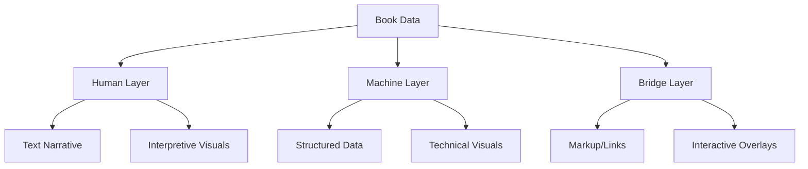
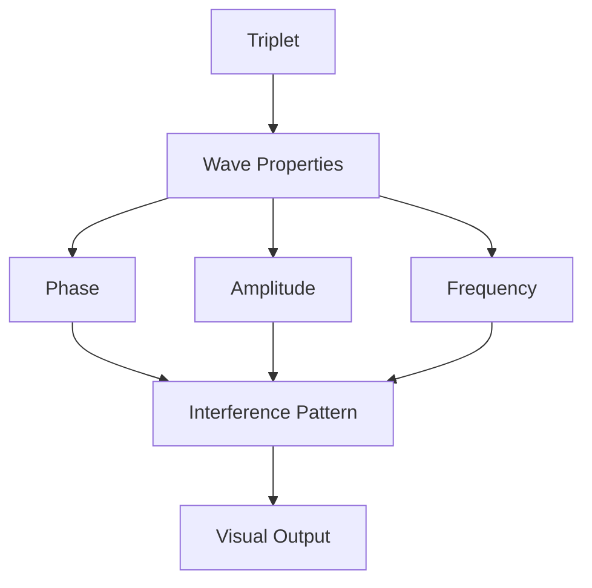
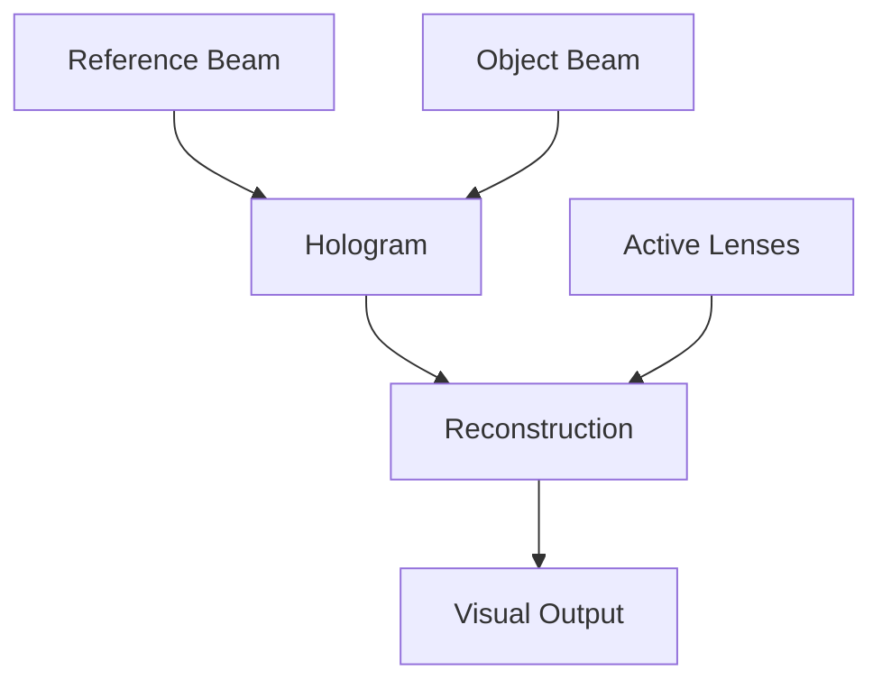
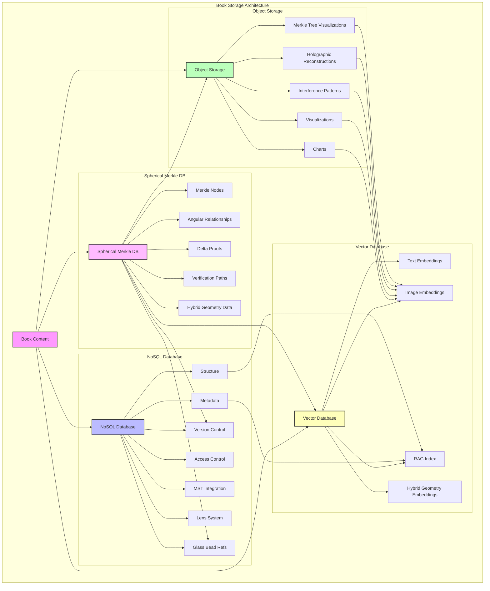

# 3.2. Book Outputs

## Current Book Architecture

Books in Memorativa are multi-layered structures that serve as both human-readable narratives and machine-processable data:

### Core Layers
- **Human Layer**: Narrative text, chapters, sections, visualizations
- **Machine Layer**: Structured data (percepts, triplets, prototypes)
- **Bridge Layer**: Markup system linking narrative to data
- **Integrity Layer**: Spherical Merkle Trees for topological verification and spatial relationship preservation

### Key Components
- Metadata (title, description, focus parameters, temporal context)
- Percept-Triplets and Prototypes
- Symbolic Data (aspects, MST translations)
- Narrative Content
- Visualizations
- Conceptual Index
- Attribution Data
- Validation Data
- Spherical Merkle Trees for hybrid geometric validation

### Time States
Books handle three distinct temporal contexts:
- **Mundane**: Concrete timestamps and chronological events
- **Quantum**: Conceptual or indeterminate time
- **Holographic**: Links to reference time frameworks

### RAG Integration
Books are designed as:
- Primary corpus for RAG retrieval
- Structured templates for generation
- Vector-encodable format for embeddings
- Knowledge base enrichment source
- Spatially-verifiable data sources via Spherical Merkle Trees

### Core Features
- Version control and branching
- Content attribution system
- Privacy and access control
- MST integration for symbolic translation
- Lens system for multiple interpretations
- Glass Bead curation and organization
- Spherical-hyperbolic relationship preservation

## Text and Image Output System

Books generate output streams that respect the multi-layered architecture:

### Text Output Stream
- **Human Layer**
  - Narrative prose with embedded conceptual links
  - Commentary filtered through active Lenses
  - Cultural/philosophical context adaptations
- **Machine Layer**
  - Structured data exports (JSON/XML)
  - Vector embeddings for RAG
  - Metadata serialization
  - Spherical Merkle proofs for verification
- **Bridge Layer**
  - Markup with conceptual demarcation
  - Attribution and source tracking
  - Temporal state markers
  - Angular relationship annotations

### Image Output Stream

The Image Output System produces a rich variety of visual content that complements the textual elements while representing the underlying conceptual structures. These visualizations range from simple diagrams to complex holographic representations, all driven by the same data structures that power the text generation.

#### Core Image Types
- **Human Layer**
  - Charts and visualizations for direct interpretation
  - Cultural symbol representations
  - Narrative-supporting imagery
- **Machine Layer**
  - Network graphs of percept-triplet relationships
  - Prototype pattern visualizations
  - Focus space mappings
  - Spherical Merkle Tree visualizations
- **Bridge Layer**
  - Interactive overlays linking visuals to data
  - Temporal state indicators
  - Attribution/permission visual markers
  - Angular relationship indicators

#### Integration with Text
Images are deeply integrated with the text content through:
- **Inline References**: Direct connections between narrative passages and visual elements
- **Expandable Visualizations**: Progressive disclosure of complexity
- **Interactive Elements**: When viewed in digital formats
- **Cross-Modal Verification**: Visual representations of textual verification proofs

#### Output Formats and Delivery
The Image Output System delivers visual content in multiple formats:

- **Vector Graphics**: For diagrams, network maps, and structural visualizations
- **Raster Images**: For complex renderings and diffusion-generated content
- **Interactive SVG**: For web-based interactive exploration
- **Layered Composites**: Separating structural, symbolic, and aesthetic elements

### Image Generation Modes

The system employs three primary approaches to image generation, each with specific strengths and applications:

#### 1. Direct Rendering
- MST-compliant symbol generation
- Precise astronomical charting
- Network/relationship visualization
- Spherical-hyperbolic space representation

#### 2. AI-Assisted Generation
   
The system uses a multi-stage AI pipeline combining multiple models for precise control and MST compliance:

```rust
struct AIGenerationPipeline {
    sd_xl: StableDiffusionXL,
    control_net: ControlNet,
    mst_gan: MSTSymbolGAN,
    explainer: GenerationExplainer,
    spherical_merkle_renderer: SphericalMerkleRenderer,

    fn generate(&self, params: AIGenerationParams) -> GenerationResult {
        // Map control parameters to SDXL
        let sd_params = self.map_to_sdxl_params(params);
        let base_image = self.sd_xl.generate(sd_params);

        // Apply ControlNet for structure
        let control_params = self.map_to_control_params(params);
        let structured_image = self.control_net.refine(base_image, control_params);

        // Refine MST symbols
        let refined_image = self.mst_gan.refine_symbols(structured_image, params.mst_symbols);
        
        // Apply Spherical Merkle Tree structure and angular relationships
        let spatial_image = self.spherical_merkle_renderer.apply_spatial_relationships(
            refined_image,
            params.merkle_node,
            params.angular_relationships
        );

        // Generate explainability data
        let explanation = self.explainer.explain_generation(
            base_image, structured_image, refined_image, spatial_image, params
        );

        GenerationResult { spatial_image, explanation }
    }

    fn map_to_sdxl_params(&self, params: AIGenerationParams) -> SDXLParams {
        let style = match params.cultural_context {
            Culture::Western => StyleCondition {
                base_style: "contemporary_western",
                art_movement: "digital_minimalism",
                composition: "rule_of_thirds",
                color_theory: "western_palette",
            },
            Culture::Eastern => StyleCondition {
                base_style: "traditional_eastern",
                art_movement: "zen_minimalism", 
                composition: "asymmetric_balance",
                color_theory: "eastern_palette",
            },
            // ... other cultures
        };

        let prompt_weights = params.lens_weights.iter()
            .map(|(lens, weight)| {
                match lens {
                    Lens::Technical => PromptWeight {
                        emphasis: weight * 1.2, // Technical details emphasized
                        descriptors: vec!["precise", "detailed", "systematic"],
                        modifiers: vec!["technical", "structured", "analytical"],
                    },
                    Lens::Cultural => PromptWeight {
                        emphasis: weight * 1.0,
                        descriptors: vec!["symbolic", "traditional", "meaningful"],
                        modifiers: vec!["cultural", "contextual", "historical"],
                    },
                    // ... other lenses
                }
            })
            .collect();

        SDXLParams {
            style_conditioning: style,
            prompt_weights,
            temporal_bias: self.map_temporal_bias(params.time_state, params.temporal_blur),
            // ... other mappings
        }
    }

    fn map_to_control_params(&self, params: AIGenerationParams) -> ControlParams {
        let symbol_controls = params.mst_symbols.iter()
            .map(|symbol| {
                let position = match symbol.archetype {
                    Archetype::Central => Position::Center,
                    Archetype::Supporting => Position::Peripheral {
                        angle: symbol.relationship_angle,
                        distance: symbol.relationship_strength * MAX_DISTANCE,
                    },
                    // ... other archetypes
                };

                ControlPoint {
                    position,
                    importance: params.symbol_importance[symbol],
                    constraints: SymbolConstraints {
                        min_size: symbol.min_visual_size,
                        max_size: symbol.max_visual_size,
                        required_spacing: symbol.spacing_requirements,
                        alignment: symbol.alignment_rules,
                    }
                }
            })
            .collect();

        let structural_guidance = params.lens_weights.iter()
            .map(|(lens, weight)| match lens {
                Lens::Technical => StructuralGuide {
                    grid_strength: weight * 1.2,
                    connection_emphasis: weight * 1.5,
                    detail_preservation: weight * 1.3,
                },
                Lens::Abstract => StructuralGuide {
                    grid_strength: weight * 0.8,
                    connection_emphasis: weight * 1.0,
                    detail_preservation: weight * 0.7,
                },
                // ... other lenses
            })
            .fold(StructuralGuide::default(), |acc, guide| acc.combine(guide));

        ControlParams {
            symbol_controls,
            structural_guidance,
            // ... other control parameters
        }
    }
}
```

The explainability system provides:
- Interactive attention maps showing lens influence
- Symbol placement analysis with confidence scores
- Time state impact visualization
- Cultural context preservation metrics
- Spatial relationship analysis
- Step-by-step generation breakdown
- Model confidence reporting

#### 3. Hybrid Generation
- Combined technical/symbolic representations
- Multi-lens visual interpretations
- Temporal context overlays

### Integration with Spherical Merkle Trees

A crucial aspect of the Image Output System is its integration with Spherical Merkle Trees:

- **Visual Verification**: Images contain visual elements that represent verification proofs
- **Angular Relationship Visualization**: Shows spatial relationships between concepts as defined in the Spherical Merkle structure
- **Integrity Indicators**: Visual cues that reflect the verification status of content
- **Delta Visualization**: Representations of changes between versions

### Output Processing Pipeline


## Synthetic Image Generation System

The system generates three distinct types of synthetic images that leverage the Spherical Merkle Tree structure for both verification and visualization:

### 1. Interference Pattern Images

Generated directly from percept-triplet structures using wave interference simulation:

- **Wave Generation**
  - Maps triplet components (θ, φ, r) to wave properties
  - Archetypal angle (θ) → phase angle
  - Expression elevation (φ) → amplitude
  - Radius (r) → frequency



- **Pattern Types**
  - Constructive interference regions show strong alignments
  - Destructive interference reveals conceptual tensions
  - Phase relationships map to symbolic meanings

### 2. Holographic Reconstructions

Simulated holographic images generated from interference patterns:

- **Reference Beam**
  - Natal chart serves as coherent reference
  - Stable "light source" for reconstruction
  - Encodes player's base symbolic framework

- **Object Beam**
  - Generated from Glass Bead percept-triplets
  - Carries specific symbolic information
  - Modulated by active Lenses

- **Reconstruction Process**


### 3. Symbolic Synthesis Images

AI-generated images that combine interference patterns and holographic principles:

- **Input Sources**
  - Raw interference patterns
  - Holographic reconstructions
  - MST-translated symbols
  - Active Lens configurations

- **Generation Parameters**
  - Pattern coherence
  - Symbolic density
  - Cultural context mapping
  - Temporal state alignment

### Implementation Details

```rust
struct ImageGenerator {
    interference_engine: InterferenceEngine,
    hologram_simulator: HologramSimulator,
    symbolic_synthesizer: SymbolicSynthesizer,
    mst: SymbolicTranslator,
}

impl ImageGenerator {
    fn generate_interference(&self, triplet: HybridTriplet) -> Image {
        let wave = self.interference_engine.triplet_to_wave(triplet);
        self.interference_engine.generate_pattern(wave)
    }

    fn generate_hologram(&self, natal: GlassBead, object: GlassBead) -> Image {
        let reference = self.hologram_simulator.create_reference_beam(natal);
        let object_beam = self.hologram_simulator.create_object_beam(object);
        self.hologram_simulator.reconstruct(reference, object_beam)
    }

    fn generate_symbolic(&self, pattern: Image, hologram: Image) -> Image {
        let symbols = self.mst.translate_visual_elements(pattern, hologram);
        self.symbolic_synthesizer.generate(symbols)
    }
}
```

### Validation and Analysis

#### Quantitative Metrics

1. **Interference Coherence**
   - Wave alignment score (0-1): Measures phase synchronization
   - Pattern stability index: Tracks interference node stability
   - Frequency distribution uniformity (χ² test)
   - Signal-to-noise ratio for pattern clarity

2. **Holographic Fidelity**
   - Reconstruction accuracy (RMSE from reference)
   - Phase preservation score
   - Information density (bits/unit area)
   - Temporal coherence measurement

3. **Symbolic Accuracy**
   - MST compliance score (0-1)
   - Symbol placement precision (px deviation)
   - Semantic consistency rating
   - Cultural context preservation index

## Spherical Merkle Tree Verification and Visualization

The Image Output System incorporates specialized capabilities for verifying and visualizing the Spherical Merkle Trees that maintain the integrity of Book content:

### Verification System

Spherical Merkle Trees provide two critical functions in Book Outputs:

1. **Content Integrity**: Traditional verification of data structure and content
2. **Spatial Relationship Preservation**: Verification of angular relationships between concepts

The verification process combines:
- Standard Merkle path verification for content
- Angular relationship validation for spatial consistency
- Hybrid geometric verification for curved space relationships

### Visualization Types

The system provides specialized visualizations of Spherical Merkle Trees:

#### Core Visualization Types

1. **Hierarchical View**
   - Traditional tree visualization showing content structure
   - Color-coded by verification status
   - Node size indicates content importance

2. **Spatial View**
   - 3D visualization of spherical-hyperbolic space
   - Angular relationships shown as arcs or lines
   - Color intensity indicates relationship significance

3. **Hybrid View**
   - Combined hierarchical and spatial visualization
   - Interactive transitions between views
   - Highlighting of related content across views

#### Visual Encoding for Merkle Trees

| Element | Visual Property | Meaning |
|---------|-----------------|---------|
| Node | Size | Importance in tree structure |
| Node | Color | Verification status |
| Node | Border | Content type/category |
| Node | Position | Spatial coordinates (θ,φ,r) |
| Relationship | Line style | Relationship type |
| Relationship | Line weight | Significance/strength |
| Relationship | Line color | Angle category |
| Relationship | Curve | Follows space curvature (κ) |

## Book Output Storage Design

Memorativa employs a distributed storage design to manage Book outputs, which are multi-layered and require both human-readable and machine-processable formats. This architecture leverages distinct storage technologies optimized for each data type, ensuring scalability, performance, and data integrity.

The storage components for Book outputs are:

1.  **Book Database (NoSQL):** This database is the central repository for Book metadata, structure, and relationships. A NoSQL database is used to accommodate the flexible and semi-structured nature of Book data.
    *   **Stored Data:**
        *   Book Metadata: title, description, focus parameters, temporal context, attribution, validation, etc.
        *   Book Structure: chapters, sections, conceptual index, references to content.
        *   Version Control Information.
        *   Access Control Lists.
        *   MST Integration Data.
        *   Lens System Configurations.
        *   Glass Bead References.
        *   Text Output Stream components: Narrative Prose, Bridge Layer Markup.
        *   Machine Layer components: Structured Data, Metadata Serialization.
        *   References to Image Files in Object Storage.
        *   References to Vector Embeddings in Vector Database.
        *   Image Overlay Data: Bridge Layer.
        *   Spherical Merkle Tree structures and proofs.
        *   Angular relationship matrices.
        *   Hybrid geometric verification data.

2.  **Object Storage / File System:**  This system stores the binary data of image outputs, including charts, visualizations, interference patterns, and holographic reconstructions.
    *   **Stored Data:**
        *   Raw Image Files in standard formats (PNG, JPEG, SVG, etc.).
        *   Images are organized by Book ID, layer, and output type for efficient retrieval.
        *   Merkle Tree visualizations and angular relationship diagrams.
        *   Hybrid geometry renderings showing curved space relationships.

3.  **Vector Database:** This specialized database stores vector embeddings generated from Book content (text and images). Vector databases are used for efficient similarity searches, essential for RAG (Retrieval-Augmented Generation).
    *   **Stored Data:**
        *   Vector Embeddings of Book Content.
        *   Embeddings are indexed for rapid retrieval and linked to specific Books.
        *   Topological embeddings preserving spherical-hyperbolic relationships.
        *   Curvature-aware embeddings for hybrid space searching.

4. **Spherical Merkle Database:** A specialized database for efficient storage and querying of Spherical Merkle Trees and their angular relationships.
    *   **Stored Data:**
        *   Spherical Merkle Nodes with angular relationships
        *   Hybrid geometry parameters (curvature, coordinates)
        *   Delta proofs for efficient updates
        *   Verification paths for content integrity
        *   Spatially-indexed relationship data
        *   Temporal evolution history

**Storage Architecture:**



**Special Considerations for Spherical Merkle Trees:**

- **Delta-Based Updates**: The system stores only changes between versions using delta proofs, reducing storage requirements while preserving verification capabilities.
- **Spatial Indexing**: Angular relationships are indexed for efficient spatial queries, enabling relationship-based searches.
- **Hybrid Geometry Support**: Storage structures adapt to both spherical and hyperbolic geometries based on content curvature parameters.
- **Verification Caching**: Frequently verified paths are cached to improve performance.
- **Recovery Mechanisms**: The system can reconstruct Books from Merkle proofs in case of data corruption.

## Token Integration for Book Outputs

### Output Generation Costs

```mermaid
graph TD
    B[Book Generation] --> T[Text Outputs]
    B --> I[Image Outputs]
    B --> O[Overlays]
    B --> V[Version Control]
    B --> S[Spherical Merkle Operations]
    
    T --> |5-15 GBT| N[Narrative Layer]
    T --> |10-20 GBT| M[Machine Layer]
    T --> |3-8 GBT| BL[Bridge Layer]
    
    I --> |10-20 GBT| IP[Interference Patterns]
    I --> |15-25 GBT| HR[Holographic Reconstructions]
    I --> |20-30 GBT| SS[Symbolic Synthesis]
    
    O --> |5-10 GBT| SA[Structural Analysis]
    O --> |8-15 GBT| CO[Conceptual Overlay]
    O --> |10-20 GBT| IN[Interactive Navigation]
    
    V --> |2-5 GBT| VC[Create Version]
    V --> |5-10 GBT| VB[Create Branch]
    V --> |15-25 GBT| VF[Create Fork]
    
    S --> |3-8 GBT| MV[Merkle Verification]
    S --> |5-12 GBT| AR[Angular Relationship Update]
    S --> |10-18 GBT| HG[Hybrid Geometry Maintenance]
    S --> |7-15 GBT| DP[Delta Proof Generation]
```



### Spherical Merkle Tree Operation Costs
| Operation | GBTk Cost | Description |
|-----------|----------|-------------|
| Basic Verification | 3-5 GBT | Verify content integrity |
| Spatial Verification | 5-8 GBT | Verify angular relationships |
| Delta Proof Generation | 7-12 GBT | Create update proofs between versions |
| Full Hybrid Verification | 10-15 GBT | Complete content and spatial verification |
| Curvature Update | 8-15 GBT | Update hybrid geometry parameters |
| Tree Rebalancing | 12-20 GBT | Optimize tree structure for efficiency |
| Relationship Index Update | 6-10 GBT | Update spatial indices for relationships |

### Reward Structure
| Output Type | Quality Reward | Usage Reward | Collaboration Reward | Description |
|-------------|----------------|--------------|---------------------|-------------|
| Text Narrative | 10-20 GBT | 0.1 GBT/read | 5 GBT/contributor | Human-readable content |
| Machine Layer | 15-25 GBT | 0.2 GBT/query | 8 GBT/contributor | RAG system usage |
| Image Generation | 20-30 GBT | 0.3 GBT/view | 10 GBT/contributor | Visual synthesis |
| Overlay Systems | 15-25 GBT | 0.2 GBT/interact | 7 GBT/contributor | Interactive features |
| Glass Bead Integration | 10-15 GBT | 0.15 GBT/reference | 5 GBT/bead | Bead curation |
| Spatial Relationship Verification | 8-15 GBT | 0.2 GBT/verification | 6 GBT/contributor | Angular relationship verification |
| Hybrid Geometry Optimization | 15-25 GBT | 0.25 GBT/query | 8 GBT/contributor | Curved space optimization |

### Time State Rewards
- **Mundane**: 1.0x base reward (concrete timestamps)
- **Quantum**: 1.2x base reward (conceptual time)
- **Holographic**: 1.5x base reward (reference frameworks)

### Operational Costs

```mermaid
graph TD
    O[Operational Costs] --> S[Storage]
    O --> A[Access]
    O --> P[Processing]
    O --> M[Maintenance]
    O --> SM[Spherical Merkle Operations]
    
    S --> |0.01 GBT/MB/month| SD[Database Storage]
    S --> |0.02 GBT/MB/month| SO[Object Storage]
    S --> |0.03 GBT/MB/month| SV[Vector Storage]
    S --> |0.04 GBT/MB/month| SS[Spherical Merkle Storage]
    
    A --> |0.1 GBT/query| AQ[RAG Queries]
    A --> |0.05 GBT/read| AR[Read Access]
    A --> |0.2 GBT/write| AW[Write Access]
    A --> |0.15 GBT/verification| AV[Merkle Verification]
    
    P --> |1-5 GBT| PE[Embedding Updates]
    P --> |2-8 GBT| PI[Index Updates]
    P --> |3-10 GBT| PL[Lens Processing]
    P --> |4-12 GBT| PS[Spatial Relationship Processing]
    
    M --> |5 GBT/month| MV[Version Cleanup]
    M --> |8 GBT/month| MI[Index Maintenance]
    M --> |10 GBT/month| MR[RAG Optimization]
    M --> |12 GBT/month| MS[Spherical Merkle Maintenance]
    
    SM --> |0.2 GBT/operation| SMV[Basic Verification]
    SM --> |0.5 GBT/operation| SMA[Angular Verification]
    SM --> |1.0 GBT/operation| SMD[Delta Proof Generation]
    SM --> |2.0 GBT/operation| SMH[Hybrid Verification]
```



## Performance and Scalability

### Optimization Techniques

```rust
struct OptimizationManager {
    // Model optimization
    quantization: QuantizationConfig,
    graph_optimizer: GraphOptimizer,
    batch_processor: BatchProcessor,
    
    // Processing optimization
    async_executor: AsyncExecutor,
    distributed_inference: DistributedInference,
    
    // Spherical Merkle optimization
    merkle_optimizer: SphericalMerkleOptimizer,
    angular_cache: AngularRelationshipCache,
    verification_scheduler: VerificationScheduler,
    
    fn optimize_model(&self, model: &mut Model) {
        // Quantize model weights to int8/fp16 based on hardware
        if self.quantization.supported() {
            model.quantize(self.quantization.get_config());
        }
        
        // Optimize computation graph
        self.graph_optimizer.optimize(model, OptimizationLevel::Aggressive);
        
        // Set up distributed inference if available
        if let Some(cluster) = self.distributed_inference.get_cluster() {
            model.distribute(cluster);
        }
    }

    fn process_batch(&self, tasks: Vec<GenerationTask>) -> Vec<Future<Output>> {
        // Group similar tasks for batch processing
        let batches = self.batch_processor.group_tasks(tasks);
        
        // Process batches asynchronously
        batches.into_iter()
            .map(|batch| self.async_executor.spawn(batch.process()))
            .collect()
    }
    
    fn optimize_merkle_operations(&self, operations: Vec<MerkleOperation>) -> OptimizedOperations {
        // Group related operations
        let grouped = self.merkle_optimizer.group_related_operations(operations);
        
        // Schedule verification operations optimally
        let scheduled = self.verification_scheduler.schedule(
            grouped,
            SchedulingStrategy::ResourceAware
        );
        
        // Apply angular relationship caching
        let cached = self.angular_cache.apply_caching(scheduled);
        
        // Select optimal verification paths
        self.merkle_optimizer.select_optimal_paths(cached)
    }
}
```

### Spherical Merkle Tree Performance Optimizations

The system implements multiple optimization techniques specific to Spherical Merkle Tree operations:

1. **Relationship Caching**
   - Frequently accessed angular relationships are cached in memory
   - Relationship cache uses spatial proximity for intelligent prefetching
   - Cache invalidation tracks topology changes efficiently

2. **Parallel Verification**
   - Content verification and spatial verification run in parallel
   - Multi-threaded processing for batch verifications
   - GPU acceleration for angular relationship calculations

3. **Pruned Verification**
   - Only verifies affected branches during updates
   - Prioritizes verification of significant angular relationships
   - Adjusts verification depth based on confidence requirements

4. **Incremental Updates**
   - Delta-based approach minimizes tree reconstruction
   - Localizes changes to affected subgraphs
   - Preserves verified branches during updates

5. **Adaptive Geometry**
   - Dynamically switches between spherical and hyperbolic calculations
   - Optimizes for local geometry characteristics
   - Batches operations by geometry type

### Hardware Requirements For Spherical Merkle Operations

| Operation Type | Base Tier | Recommended Tier | Enterprise Tier |
|----------------|-----------|------------------|-----------------|
| Content Verification | 10ms/node | 5ms/node | 2ms/node |
| Angular Verification | 20ms/relationship | 10ms/relationship | 4ms/relationship |
| Full Book Verification | 1-2s | 500-800ms | 200-300ms |
| Delta Proof Generation | 3-5s | 1-2s | 400-800ms |
| Tree Rebalancing | 8-15s | 3-7s | 1-3s |

**Scaling Factors for Spherical Merkle Operations:**
- Number of nodes: Linear scaling (O(n))
- Number of angular relationships: Near-quadratic (O(n * log(n)))
- Tree depth: Logarithmic scaling (O(log(n)))
- Curvature transitions: Constant overhead per transition

## Key Points

### Architecture & Design
- Multi-layered book structure (Human, Machine, Bridge, Integrity layers)
- Integrated text-image system with bi-directional navigation
- MST-compliant visual language and symbol generation
- Time-state aware content generation (Mundane, Quantum, Holographic)
- Lens-based interpretation system for multiple viewpoints
- Spherical Merkle Trees for topological verification and spatial relationship preservation

### Spherical Merkle Tree Integration
- Hybrid verification ensures both content integrity and spatial relationship preservation
- Angular relationships between concepts visualized through specialized renderers
- Optimized operations through relationship caching and parallel verification
- Curvature-aware processing adapts to both spherical and hyperbolic geometries
- Delta-based proofs for efficient storage and verification of book versions
- Specialized visualization tools for understanding concept relationships in curved space

### Performance & Resources
- Three hardware tiers supporting different workloads:
  - Base: Single user, 1080p-1440p, 50 pages/min, 10ms/node verification
  - Recommended: Multi-user, 4K, 120 pages/min, 5ms/node verification
  - Enterprise: High-volume, 8K, 300+ pages/min, 2ms/node verification
- Resource scaling is predictable:
  - Resolution doubles = 40-120% resource increase
  - Each lens = 15-30% overhead
  - Each time state = 15-35% overhead
  - Each concurrent user = 25-40% overhead
  - Angular relationship verification = O(n * log(n)) scaling

### Integration Features
- Dynamic visualization embedding
- Context-aware content adaptation
- Progressive loading and rendering
- Bi-directional navigation between text and visuals
- Real-time collaborative capabilities
- Multi-resolution support
- Time-state visualization system
- Hybrid geometry visualization and navigation
- Angular relationship exploration and verification

### Optimization Capabilities
- Model quantization for reduced memory usage
- Batch processing for improved throughput
- Distributed inference for scaling
- Async execution for responsiveness
- Smart compression for storage efficiency
- Resource pooling for multi-user scenarios
- Relationship caching for Spherical Merkle operations
- Parallel verification for angular relationships
- Pruned verification paths for efficiency
- Incremental updates for minimal processing
- Adaptive geometry selection based on content

