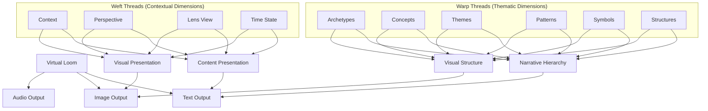
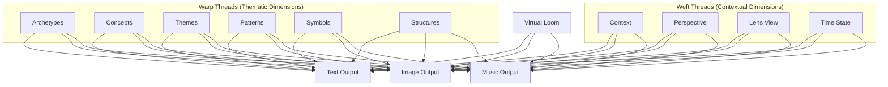

# 3.2. Machine System Books

---

```
title: "Machine System Books"
section: 3
subsection: 2
order: 0
status: "in-progress"
last_updated: "2023-07-21"
contributors: []
key_concepts:
  - "Book Outputs"
  - "Virtual Loom"
  - "Knowledge Synthesis"
  - "Adaptive Learning Rate"
  - "Hybrid Architecture"
prerequisites:
  - "Cybernetic Books Design"
  - "Virtual Loom Framework"
  - "Glass Bead Connection"
next_concepts:
  - "Machine System Implementation"
  - "Integration with Pantheon System"
summary: "This document details the enhanced Book output system in Memorativa, which transforms raw percepts, triplets, and prototypes into comprehensive knowledge artifacts through a hybrid architecture combining narrative coherence with geometric verification and multi-modal processing."
chain_of_thought:
  - "Books represent the culminating form of knowledge synthesis"
  - "Virtual Loom serves as the core organizational framework"
  - "Books maintain verifiable relationships between concepts"
  - "Books implement adaptive learning mechanisms for content evolution"
technical_components:
  - "BookLoomCurator"
  - "Spherical Merkle Tree"
  - "Multi-layered Structure"
  - "Adaptive Learning Rate Adjustment"
```

---

# 3.2. Machine System Books

Books represent the culminating form of knowledge synthesis in the Memorativa system. As the primary terminal output of the cybernetic process, they transform raw percepts, triplets, and prototypes into comprehensive, multi-dimensional knowledge artifacts that bridge human cognition and machine processing. This section details the enhanced Book output system, which implements a hybrid architecture combining narrative coherence with geometric verification, multi-modal processing, and spatial relationship preservation.

Books serve as both consumable knowledge products and active components in the knowledge generation cycle. Through their multi-layered structure and Spherical Merkle Tree integration, they maintain verifiable relationships between concepts while offering rich, contextual representations accessible through multiple lenses and temporal states. As detailed in Section 2.3, each Book is referenced by Glass Beads that serve as symbolic conceptual references to the Book's content, establishing a critical connection between the Glass Bead Game tokens and knowledge representation.

## Cybernetic Books Design Specification

The following document specifies the Book design for the cybernetic system. The following section will enhance this core cybernetic design, finally updating it with the Machine System Books.

## Virtual Loom: The Core Organizational Framework

Books in Memorativa implement the Virtual Loom as their primary organizational structure, a sophisticated framework that arranges knowledge elements along meaningful dimensions. As comprehensively detailed in [Section 2.14](../2.%20the%20cybernetic%20system/memorativa-2-14-books.md), this structure transforms Books from linear narratives to multi-dimensional knowledge landscapes that can be navigated along multiple axes.

### Knowledge Organization Framework
- **Warp Threads**: Thematic dimensions that organize concepts vertically (archetypes, themes, patterns)
- **Weft Threads**: Contextual relationships that organize concepts horizontally (cultural contexts, perspectives, time periods)
- **Intersections**: Meaningful connection points where Glass Beads are strategically positioned
- **Patterns**: Recognizable arrangements of beads that form coherent sub-narratives
- **Multi-dimensional Navigation**: Vertical, horizontal, diagonal, and zoom-based exploration pathways

### Dynamic Knowledge Structure
- **Structural Integrity**: The loom framework maintains conceptual relationships through thread tensioning
- **Collaborative Capabilities**: Multiple "weavers" can contribute to different sections of the knowledge textile
- **Knowledge Gap Visualization**: Empty intersections visually identify areas for further exploration
- **Pattern Recognition**: Connected bead positions reveal higher-order organizational structures
- **Thematic Thread Generation**: AI-assisted creation of coherent thematic structures
- **Contextual Thread Analysis**: Identification of meaningful contextual connections
- **Metadata Enhancement**: Enriched thread descriptions and relationship annotations
- **LLM-Assisted Organization**: Leverages the LLM integration from Section 2.21 to intelligently generate and organize threads based on semantic analysis

### Implementation Benefits
- **Relationship Preservation**: Angular relationships between concepts are maintained in the loom structure
- **Visual Navigation**: Clear movement pathways between related concepts
- **Thread-based Filtering**: Content filtering by specific warp or weft threads
- **Pattern Templates**: Reusable organizational patterns for knowledge curation
- **Integration with Merkle Trees**: Spherical Merkle verification of both content and thread relationships

The Virtual Loom is not merely a visualization tool but the fundamental organizational principle for all Book content, directly implementing the same hybrid spherical-hyperbolic geometry used throughout the Memorativa system. For detailed implementation, including code examples and mathematical foundations, see [Section 2.14](../2.%20the%20cybernetic%20system/memorativa-2-14-books.md).

### Virtual Loom Technical Implementation

The core Book output system implements the Virtual Loom through a structured technical architecture:

```rust
struct BookLoomCurator {
    warp_threads: Vec<ThematicDimension>,     // Vertical threads (concepts, themes)
    weft_threads: Vec<ContextualDimension>,   // Horizontal threads (contexts, perspectives)
    beads: HashMap<BeadId, LoomPosition>,     // Positioned beads from player collection
    patterns: Vec<CurationPattern>,           // Organizational templates
}
```

The implementation includes sophisticated thread management and processing controls:

```rust
fn process_book_chain(book: Book, context: ProcessingContext) -> Result<Vec<Percept>> {
    thread::Builder::new()
        .stack_size(8 * 1024 * 1024) // 8MB stack
        .spawn(move || {
            context.can_process(&book)?;
            let percepts = decompose_book(book)?;
            context.depth += 1;
            
            // Process derived books with depth checking
            process_derived_books(percepts, context)
        })?
}
```

Each warp and weft thread in the Virtual Loom runs in its own processing thread, with dedicated stack space and cycle detection. The system implements vector analysis to detect and terminate unproductive processing chains:

```rust
fn should_terminate_processing(vectors: &[Vector]) -> bool {
    // Terminate if ≥75% of vector relationships are perpendicular
    let perpendicular_count = count_perpendicular_relationships(vectors);
    perpendicular_count as f32 / vectors.len() as f32 >= 0.75
}
```

The core curation function positions beads at meaningful intersections:

```rust
fn curate_beads_as_loom(&mut self, beads: &Vec<GlassBead>) -> LoomCuration {
    // Create thematic warp threads from book structure
    let warp_threads = self.generate_thematic_warps();
    
    // Create contextual weft threads from book perspectives
    let weft_threads = self.generate_contextual_wefts();
    
    // Position beads at appropriate intersections
    let positioned_beads = self.position_beads_in_loom(beads, warp_threads, weft_threads);
    
    // Create organizational patterns
    let patterns = self.identify_organizational_patterns(positioned_beads);
    
    LoomCuration {
        warp_threads,
        weft_threads, 
        positioned_beads,
        patterns,
        metadata: self.generate_curation_metadata()
    }
}
```

#### Virtual Loom Practical Example: Cultural Analysis

To illustrate how this technical implementation manifests in practice, consider a Book analyzing cultural archetypes:

- **Warp Threads (Vertical)** represent archetypal themes like "Hero's Journey," "Trickster," "Mother," "Shadow"
- **Weft Threads (Horizontal)** represent cultural contexts like "Western Literature," "Eastern Philosophy," "Indigenous Traditions," "Modern Media"
- **Intersections** contain Glass Beads for specific manifestations: the Hero archetype in Western Literature references beads about Odysseus, King Arthur, and Luke Skywalker
- **Patterns** emerge showing how the Trickster archetype transforms across different cultures, or how Indigenous Traditions express multiple archetypes in integrated ways
- **Navigation** allows following either the evolution of a single archetype across cultures (vertical) or examining how a particular culture expresses different archetypes (horizontal)
- **Knowledge Gaps** appear as empty intersections that invite further research

This implementation ensures that Book outputs maintain structural coherence and navigational clarity while providing rich knowledge organization that extends beyond traditional linear narrative formats.

## Core Book Architecture

Books in Memorativa are multi-layered structures that serve as both human-readable narratives and machine-processable data:

### Core Layers
- **Human Layer**: Narrative text, chapters, sections, visualizations
- **Machine Layer**: Structured data (percepts, triplets, prototypes)
- **Bridge Layer**: Markup system linking narrative to data
- **Integrity Layer**: Spherical Merkle Trees for topological verification and spatial relationship preservation, using the same verification infrastructure described in Section 2.3 for Glass Beads

### Key Components
- Metadata (title, description, focus parameters, temporal context)
- Percept-Triplets and Prototypes
- Symbolic Data (aspects, MST translations)
- Narrative Content
- Visualizations
- Conceptual Index
- Attribution Data
- Validation Data
- Spherical Merkle Trees for hybrid geometric validation

### Time States
Books handle three distinct temporal contexts:
- **Mundane**: Concrete timestamps and chronological events, including past dates, future timestamps, and imagined future events
- **Quantum**: Conceptual or indeterminate time
- **Holographic**: Links to reference time frameworks, such as natal charts

### RAG Integration
Books are designed as:
- Primary corpus for RAG retrieval
- Structured templates for generation
- Vector-encodable format for embeddings
- Knowledge base enrichment source
- Spatially-verifiable data sources via Spherical Merkle Trees

### Core Features
- Version control and branching
- Content attribution system
- Privacy and access control
- MST integration for symbolic translation
- Lens system for multiple interpretations
- Glass Bead curation and organization
- Spherical-hyperbolic relationship preservation

## Structural Hierarchy

Books exist within a comprehensive three-tier knowledge hierarchy that organizes all structures in the Memorativa system:

### Hierarchical Position
- **Basic Structures**: Foundational elements (percept-triplets, angular relationships, vector encodings)
- **Composite Structures**: Intermediate constructs (prototypes, focus spaces, pattern templates)
- **Complex Structures**: Advanced formations (books, conceptual demarcations, knowledge networks)

Books operate at the Complex Structure level, integrating and synthesizing elements from the Basic and Composite levels into coherent knowledge artifacts. This hierarchical organization enables:

1. **Vertical Integration**: Books incorporate and reference elements from lower tiers
2. **Horizontal Connection**: Books connect with other Complex Structures through relationship networks
3. **Diagonal Analysis**: Books identify patterns across both hierarchical levels and related domains

By positioning Books within this formal hierarchy, the system creates clear pathways for knowledge to flow from raw perception (Basic) through conceptual organization (Composite) to comprehensive synthesis (Complex).

## Virtual Loom Integration

The Book Output system implements and extends the Virtual Loom structure described in section 2.14, providing a powerful organizational framework for both generating and presenting content. This integration ensures that output streams reflect the carefully curated relationships established in the Book's conceptual framework.

### Loom-Driven Output Generation

The Virtual Loom's warp/weft structure directly influences how content is generated and organized:


*Figure 1: Virtual Loom Integration Flow, illustrating how Warp Threads (thematic dimensions) and Weft Threads (contextual dimensions) organize and structure content across different output modalities, demonstrating the unified organizational framework across all Book outputs*

The warp threads organize content along the Archetypal/What dimension (also described as "thematic" in Section 2.23), while weft threads organize content along the Expression/How and Mundane/Where dimensions (conceptual and contextual relationships). This directly aligns with the percept-triplet vector encoding described in Section 2.23.

### Virtual Loom Thread-Based Organization System

Each output type implements the Virtual Loom's thread system in its presentation:

**1. Text Output Implementation**
- **Warp Threads (Thematic)**: Manifested as narrative flow, chapter structures, and conceptual hierarchies
- **Weft Threads (Contextual)**: Expressed through perspective shifts, lens-specific interpretations, and temporal contexts
- **Intersection Points**: Key narrative moments where specific Glass Beads are highlighted and explored in depth
- **Thread Tensioning**: Balanced exposition between thematic depth and contextual breadth

**2. Image Output Implementation**
- **Warp Threads (Thematic)**: Visualized as primary visual motifs, central symbols, and structural elements
- **Weft Threads (Contextual)**: Represented through stylistic variations, cultural interpretations, and temporal overlays
- **Intersection Points**: Visual focal points where significant beads are prominently displayed
- **Pattern Visualization**: Connected intersections form visual pathways that guide viewer attention

**3. Navigation System**
```rust
struct LoomNavigator {
    current_warp: Option<WarpThreadId>,
    current_weft: Option<WeftThreadId>,
    current_intersection: Option<(WarpThreadId, WeftThreadId)>,
    viewed_intersections: HashSet<(WarpThreadId, WeftThreadId)>,
    
    fn navigate_warp(&mut self, target_warp: WarpThreadId) -> NavigationResult {
        // Move along thematic dimension while maintaining context
        self.current_warp = Some(target_warp);
        self.update_intersection()
    }
    
    fn navigate_weft(&mut self, target_weft: WeftThreadId) -> NavigationResult {
        // Move along contextual dimension while maintaining theme
        self.current_weft = Some(target_weft);
        self.update_intersection()
    }
    
    fn update_intersection(&mut self) -> NavigationResult {
        if let (Some(warp), Some(weft)) = (self.current_warp, self.current_weft) {
            let intersection = (warp, weft);
            self.current_intersection = Some(intersection);
            self.viewed_intersections.insert(intersection);
            
            // Retrieve content at this intersection
            NavigationResult::Intersection(self.get_intersection_content(intersection))
        } else {
            NavigationResult::NoIntersection
        }
    }
    
    fn follow_pattern(&mut self, pattern_id: PatternId) -> NavigationPath {
        // Follow a predefined pattern of intersections
        let path = self.load_pattern(pattern_id);
        
        // Navigate through each intersection in pattern
        let results = path.intersections.iter()
            .map(|&(warp, weft)| {
                self.current_warp = Some(warp);
                self.current_weft = Some(weft);
                self.update_intersection()
            })
            .collect();
            
        NavigationPath {
            pattern_id,
            results
        }
    }
}
```

### Virtual Loom Visual Organization System

The Visual Output system directly reflects the Virtual Loom structure:

1. **Warp-Based Layout**
   - Thematic threads determine visual hierarchy and importance
   - Visual elements are sized proportionally to warp thread significance
   - Related concepts along the same warp thread maintain visual consistency

2. **Weft-Based Styling**
   - Contextual threads determine visual styling and presentation
   - Lens-specific visual treatments follow weft thread configurations
   - Temporal contexts (Mundane, Quantum, Holographic) are visually distinct

3. **Intersection-Based Focus**
   - Primary visual elements appear at key intersections
   - Visual weight corresponds to intersection significance
   - Navigation cues guide viewers between related intersections

4. **Pattern Visualization**
   - Connected intersections form visual pathways
   - Patterns are visually highlighted through color, line, or movement
   - Pattern density reflects conceptual density in the loom structure

### Virtual Loom Implementation Example

```rust
struct LoomVisualizer {
    virtual_loom: &VirtualLoom,
    visual_style_manager: VisualStyleManager,
    
    fn generate_visualization(&self, view_params: ViewParameters) -> Visualization {
        // Create canvas with dimensions
        let mut canvas = Canvas::new(view_params.dimensions);
        
        // Render warp threads (vertical/thematic) - corresponds to Archetypal/What dimension
        for (i, warp) in self.virtual_loom.warp_threads.iter().enumerate() {
            let x_position = self.calculate_warp_position(i, view_params);
            let style = self.visual_style_manager.get_warp_style(warp);
            canvas.draw_warp_thread(x_position, style);
        }
        
        // Render weft threads (horizontal/contextual) - corresponds to Expression/How and Mundane/Where dimensions
        for (j, weft) in self.virtual_loom.weft_threads.iter().enumerate() {
            let y_position = self.calculate_weft_position(j, view_params);
            let style = self.visual_style_manager.get_weft_style(weft);
            canvas.draw_weft_thread(y_position, style);
        }
        
        // Render beads at intersections
        for ((warp_id, weft_id), bead_id) in &self.virtual_loom.occupied_positions {
            let x = self.calculate_warp_position(*warp_id, view_params);
            let y = self.calculate_weft_position(*weft_id, view_params);
            let bead = self.virtual_loom.get_bead(*bead_id);
            
            let visual_importance = self.calculate_importance(bead, view_params);
            let style = self.visual_style_manager.get_bead_style(bead);
            
            canvas.draw_bead(x, y, visual_importance, style);
        }
        
        // Render patterns (connected beads)
        for pattern in self.virtual_loom.identify_patterns() {
            let style = self.visual_style_manager.get_pattern_style(&pattern);
            canvas.draw_pattern(pattern, style);
        }
        
        canvas.finalize()
    }
    
    fn generate_3d_loom(&self, view_params: View3DParameters) -> Visualization3D {
        // Create 3D representation of the Virtual Loom
        let mut scene = Scene3D::new();
        
        // Transform 2D loom into 3D space
        let warp_plane = view_params.warp_orientation.get_plane();
        let weft_plane = view_params.weft_orientation.get_plane();
        
        // Additional 3D transformations...
        
        Visualization3D::new(scene)
    }
}
```

This combination of text, image, and interactive visualization fosters deeper engagement with Book content, aligning with Memorativa’s emphasis on multi-dimensional knowledge representation.

## Machine Learning Integration

Books incorporate LLMs for generating narrative text, ensuring semantic coherence with the underlying percept-triplet data. The multi-modal pipeline integrates text, images, and (optionally) other modalities like music or data tables, referencing the Virtual Loom for consistent organization.

## Adaptive Learning Rate

Memorativa’s Book system supports adaptive learning mechanisms—similar to adjustable learning rates in neural networks—to regulate how new content modifies existing Books. This prevents the “catastrophic forgetting” problem by weighting novel content relative to established patterns, ensuring stable knowledge evolution.

## Conclusion

The Machine System Books introduced here form the top level of Memorativa’s knowledge ecosystem, merging the raw input from percepts and prototypes into polished, multi-layered artifacts. They blend symbolic, geometric, and linguistic approaches to create knowledge products accessible to both humans and machines, while preserving verifiability, integrity, and multi-modal depth.

# 3.2.1. Enhanced Machine System Books

Books in Memorativa generate multi-modal output streams that respect the core multi-layered architecture. This integrated system combines text, images, and music into a cohesive knowledge representation framework that engages multiple sensory modalities for enhanced understanding and exploration.

## Enhanced Machine System Books Design Specification

The following document specifies the enhanced Machine System Book design for the machine system. This design extends the cybernetic system design. Following sections will consolidate the cybernetic and machine systems design, finally updating it with the Machine System Books.

## Text, Image, and Music Output System

Books generate three synchronized output streams:

### Text Output Stream
- **Human Layer**: Narrative prose with embedded conceptual links
- **Machine Layer**: Structured data exports (JSON/XML)
- **Bridge Layer**: Markup with conceptual demarcation

### Image Output Stream
- **Human Layer**: Charts and visualizations for direct interpretation
- **Machine Layer**: Network graphs of percept-triplet relationships
- **Bridge Layer**: Interactive overlays linking visuals to data

### Music Output Stream
- **Human Layer**: Thematic musical expressions and narrative motifs
- **Machine Layer**: Sonified data patterns and system states
- **Bridge Layer**: Audio-synchronized navigation cues and markers

These three modalities work in concert to create a multi-sensory knowledge experience that preserves the core architectural principles of Memorativa while engaging different cognitive pathways. The integration between text, image, and music creates a rich knowledge environment where relationships can be understood through multiple simultaneous representations, enhancing both comprehension and retention.

## Virtual Loom Integration in the Enhanced Book System

The Enhanced Book System explicitly incorporates the Virtual Loom as its fundamental organizational framework across all output modalities. While Part 1 introduced the Virtual Loom's theoretical foundation, the Enhanced Book System implements it as the unifying architecture for coordinating text, image, and music outputs.

### Virtual Loom Cross-Modal Loom Implementation

The Virtual Loom extends beyond a conceptual framework to serve as the active integration mechanism for multi-modal outputs:

- **Warp-Weft Organization**: 
  - Text narrative flows follow warp (thematic) threads
  - Visual layouts organize along the same warp dimensions
  - Musical themes develop through identical warp progressions
  - Cross-references maintain warp thread consistency across all modalities

- **Intersection-Based Coordination**:
  - Key narrative moments in text align with focal elements in visuals
  - Musical motifs intensify at the same intersection points
  - Glass Bead positions serve as synchronization markers across modalities
  - Pattern recognition operates consistently across text, image, and sound

- **Integrated Navigation System**:
  ```rust
  struct MultiModalLoomNavigator {
      text_navigator: TextLoomNavigator,
      image_navigator: ImageLoomNavigator,
      music_navigator: MusicLoomNavigator,
      
      fn navigate_warp(&mut self, target_warp: WarpThreadId) -> NavigationResult {
          // Synchronize navigation across all modalities
          let text_result = self.text_navigator.navigate_warp(target_warp)?;
          let image_result = self.image_navigator.navigate_warp(target_warp)?;
          let music_result = self.music_navigator.navigate_warp(target_warp)?;
          
          MultiModalNavigationResult {
              text: text_result,
              image: image_result,
              music: music_result,
          }
      }
      
      fn navigate_weft(&mut self, target_weft: WeftThreadId) -> NavigationResult {
          // Similarly synchronize contextual dimension navigation
          // ... 
      }
      
      fn follow_pattern(&mut self, pattern_id: PatternId) -> MultiModalNavigationPath {
          // Navigate through predefined patterns across all modalities
          // ...
      }
  }
  ```

### Virtual Loom as Processing Framework

Beyond organization, the Virtual Loom serves as an active processing framework:

1. **Thread-Based Content Generation**:
   - Thread tensioning dynamically balances content representation
   - Warp threads determine thematic depth in all modalities
   - Weft threads control contextual breadth across outputs
   - Thread crossings serve as attention points in all media

2. **Pattern-Based Recommendation**:
   - Book system identifies related content through loom patterns
   - Navigation suggestions follow established thread connections
   - Similar patterns in other Books become recommendations
   - Pattern recognition works identically across modalities

3. **Verification Through Loom Structure**:
   - Thread structure preserves angular relationships from Spherical Merkle Trees
   - Verification of thread relationships ensures content integrity
   - Patterns receive verification across modalities
   - Loom tension metrics serve as verification confidence scores

### Virtual Loom Implementation Across Output Types

Each output type implements the Virtual Loom structure with modality-specific adaptations:

- **Text Implementation**:
  - Section organization follows warp thread hierarchy
  - Perspective shifts track weft thread positions
  - Key narrative moments appear at thread intersections
  - Navigation cues highlight related intersections

- **Image Implementation**:
  - Visual layout mirrors the loom's spatial organization
  - Element positioning respects thread intersections
  - Visual styling varies by weft thread position
  - Connected images form visual paths along threads

- **Music Implementation**:
  - Musical themes develop along warp threads
  - Instrumentation and style shift with weft threads
  - Motif intensification occurs at intersections
  - Harmonic relationships mirror thread tensions

This explicit integration ensures that the Virtual Loom operates as both the organizational principle and functional mechanism across all components of the Enhanced Book System, creating a truly unified multi-modal knowledge representation.

## Virtual Loom Text and Image Output System

Books generate output streams that respect the multi-layered architecture and align with the Virtual Loom framework:

### Virtual Loom Text Output Stream
- **Human Layer**
  - Narrative prose with embedded conceptual links
  - Commentary filtered through active Lenses
  - Cultural/philosophical context adaptations
  - **Warp Thread Organization**: Text narrative flows follow warp (thematic) threads
- **Machine Layer**
  - Structured data exports (JSON/XML)
  - Vector embeddings for RAG
  - Metadata serialization
  - Spherical Merkle proofs for verification
  - **Weft Thread Organization**: Cross-references following weft (relationship) threads
- **Bridge Layer**
  - Markup with conceptual demarcation
  - Attribution and source tracking
  - Temporal state markers
  - Angular relationship annotations
  - Intersection-Based Coordination: Key narrative moments align with focal elements across modalities

### Virtual Loom Image Output Stream

The Image Output System produces a rich variety of visual content that complements the textual elements while representing the underlying conceptual structures. These visualizations range from simple diagrams to complex holographic representations, all driven by the same data structures that power the text generation and following the same Virtual Loom patterns.

#### Core Image Types
- **Human Layer**
  - Charts and visualizations for direct interpretation
  - Cultural symbol representations
  - Narrative-supporting imagery
  - Warp Thread Organization: Visual layouts organize along the same warp dimensions as text
- **Machine Layer**
  - Network graphs of percept-triplet relationships
  - Prototype pattern visualizations
  - Focus space mappings
  - Spherical Merkle Tree visualizations
  - Weft Thread Organization: Visual elements connect using consistent weft relationships
- **Bridge Layer**
  - Interactive overlays linking visuals to data
  - Temporal state indicators
  - Attribution/permission visual markers
  - Angular relationship indicators
  - Intersection-Based Coordination: Glass Bead positions serve as synchronization markers across modalities

#### Integration with Text
Images are deeply integrated with the text content through the Virtual Loom framework:
- **Inline References**: Direct connections between narrative passages and visual elements
- **Expandable Visualizations**: Progressive disclosure of complexity
- **Interactive Elements**: When viewed in digital formats
- **Cross-Modal Verification**: Visual representations of textual verification proofs
- **Pattern Consistency**: Pattern recognition operates consistently across text and images

#### Output Formats and Delivery
The Image Output System delivers visual content in multiple formats:

- **Vector Graphics**: For diagrams, network maps, and structural visualizations
- **Raster Images**: For complex renderings and diffusion-generated content
- **Interactive SVG**: For web-based interactive exploration
- **Layered Composites**: Separating structural, symbolic, and aesthetic elements

### Loom Pattern Visualization

The system includes a specialized image modality dedicated to directly visualizing the Virtual Loom patterns themselves. Rather than representing the content organized by the loom, this modality explicitly renders the organizational framework itself.

#### Direct Loom Visualization Approach

```rust
struct LoomPatternVisualizer {
    loom_renderer: LoomRenderer,
    thread_styler: ThreadStyler,
    intersection_renderer: IntersectionRenderer,
    pattern_highlighter: PatternHighlighter,
    
    fn visualize_loom_structure(&self, book: &Book) -> LoomVisualization {
        // Extract loom structure from book
        let loom = book.get_virtual_loom();
        
        // Create base canvas with appropriate dimensions
        let mut canvas = Canvas::new(Dimensions::adaptive(loom.complexity));
        
        // Render warp threads (thematic dimensions)
        let warp_styles = self.thread_styler.style_warp_threads(loom.warp_threads);
        canvas.draw_warp_threads(loom.warp_threads, warp_styles);
        
        // Render weft threads (contextual dimensions)
        let weft_styles = self.thread_styler.style_weft_threads(loom.weft_threads);
        canvas.draw_weft_threads(loom.weft_threads, weft_styles);
        
        // Render intersections with Glass Beads
        for intersection in loom.occupied_intersections() {
            let style = self.intersection_renderer.create_style(
                intersection.warp, 
                intersection.weft,
                intersection.bead
            );
            canvas.draw_intersection(intersection, style);
        }
        
        // Highlight recognized patterns
        for pattern in loom.identified_patterns {
            let highlight = self.pattern_highlighter.create_highlight(pattern);
            canvas.apply_pattern_highlight(pattern, highlight);
        }
        
        // Add tension indicators
        canvas.apply_tension_indicators(
            self.calculate_thread_tensions(loom)
        );
        
        // Generate interactive components
        let interactions = self.create_interaction_handlers(loom);
        
        LoomVisualization {
            base_image: canvas.render(),
            interactive_elements: interactions,
            metadata: self.generate_metadata(loom),
            thread_index: self.create_thread_index(loom)
        }
    }
    
    fn calculate_thread_tensions(&self, loom: &VirtualLoom) -> ThreadTensions {
        // Calculate tension forces based on connected beads and relationships
        let mut tensions = ThreadTensions::new();
        
        // Analyze warp thread tensions
        for (i, warp) in loom.warp_threads.iter().enumerate() {
            let tension = self.analyze_warp_tension(warp, loom);
            tensions.warp_tensions.insert(i, tension);
        }
        
        // Analyze weft thread tensions
        for (j, weft) in loom.weft_threads.iter().enumerate() {
            let tension = self.analyze_weft_tension(weft, loom);
            tensions.weft_tensions.insert(j, tension);
        }
        
        // Calculate intersection tension points
        for intersection in loom.all_intersections() {
            let warp_tension = tensions.warp_tensions.get(&intersection.warp_id);
            let weft_tension = tensions.weft_tensions.get(&intersection.weft_id);
            
            if let (Some(warp_t), Some(weft_t)) = (warp_tension, weft_tension) {
                let combined = self.calculate_combined_tension(*warp_t, *weft_t);
                tensions.intersection_tensions.insert(
                    (intersection.warp_id, intersection.weft_id), 
                    combined
                );
            }
        }
        
        tensions
    }
    
    fn create_interaction_handlers(&self, loom: &VirtualLoom) -> InteractionHandlers {
        InteractionHandlers {
            thread_hover: self.create_thread_hover_handler(loom),
            thread_select: self.create_thread_select_handler(loom),
            intersection_hover: self.create_intersection_hover_handler(loom),
            intersection_select: self.create_intersection_select_handler(loom),
            pattern_hover: self.create_pattern_hover_handler(loom),
            pattern_select: self.create_pattern_select_handler(loom),
            zoom_handler: self.create_zoom_handler(),
            pan_handler: self.create_pan_handler()
        }
    }
}
```

#### Virtual Loom Visual Encoding System

The Loom Pattern Visualization implements a rich visual language to represent the organizational structure:

| Element           | Visual Representation             | Meaning                                                    |
|-------------------|-----------------------------------|------------------------------------------------------------|
| Warp Thread       | Vertical line with variable thickness | Thematic dimension strength                               |
| Weft Thread       | Horizontal line with variable thickness | Contextual dimension strength                            |
| Thread Color      | Color spectrum                    | Thread domain/category                                     |
| Thread Texture    | Line pattern (solid, dashed, etc.)| Thread stability/definition                               |
| Intersection      | Circle or node                    | Potential knowledge position                               |
| Occupied Intersection | Filled circle with glyph          | Glass Bead position                                       |
| Bead Size         | Circle diameter                   | Concept significance                                       |
| Connection Line   | Curved line between intersections | Pattern relationship                                      |
| Connection Thickness | Line weight                       | Relationship strength                                     |
| Tension Indicator | Color gradient along thread       | Balancing force in knowledge structure                     |
| Pattern Highlight | Semi-transparent overlay          | Identified knowledge pattern                               |
| Empty Region      | Unfilled space                    | Knowledge gap/opportunity                                 |

#### Virtual Loom Visualization Modes

1. **Structural View**  
   Emphasizes the grid structure of the loom

2. **Occupancy View**  
   Focuses on filled intersections (positioned Glass Beads)

3. **Pattern View**  
   Highlights recognized patterns across intersections

4. **Tension View**  
   Visualizes the tension forces throughout the loom

5. **Dynamic View**  
   Animates the loom structure with simulated physics

#### Virtual Loom Visualization Integration Benefits

1. **Structural Insight**  
2. **Meta-Knowledge Discovery**  
3. **Framework Evaluation**  
4. **Knowledge Gap Identification**  
5. **Pattern Recognition Training**  
6. **Cross-Book Comparison**  
7. **Knowledge Evolution Tracking**  

#### Virtual Loom Visualization Cross-Modal Integration

```rust
struct CrossModalLoomIntegrator {
    loom_visualizer: LoomPatternVisualizer,
    text_integrator: TextLoomIntegrator,
    music_integrator: MusicLoomIntegrator,
    
    fn generate_integrated_view(&self, book: &Book) -> IntegratedLoomView {
        // Create direct loom visualization
        let loom_visual = self.loom_visualizer.visualize_loom_structure(book);
        
        // Create text overlays that show how narrative follows the loom
        let text_overlay = self.text_integrator.create_text_mapping(book, loom_visual.clone());
        
        // Create music notation that shows how music expresses the loom
        let music_overlay = self.music_integrator.create_music_mapping(book, loom_visual.clone());
        
        // Combine into integrated view
        IntegratedLoomView {
            base_visualization: loom_visual,
            text_mapping: text_overlay,
            music_mapping: music_overlay,
            combined_controls: self.create_combined_controls(loom_visual, text_overlay, music_overlay)
        }
    }
}
```

### Image Generation Modes

The system employs three primary approaches to image generation:

#### 1. Direct Rendering
- MST-compliant symbol generation
- Precise astronomical charting
- Network/relationship visualization
- Spherical-hyperbolic space representation

#### 2. AI-Assisted Generation

The system uses a multi-stage AI pipeline combining multiple diffusion models for precise control and MST compliance:

```rust
struct AIGenerationPipeline {
    sd_xl: StableDiffusionXL,
    control_net: ControlNet,
    flux_model: FluxModel,
    stable_cascade: StableCascade,
    mst_gan: MSTSymbolGAN,
    explainer: GenerationExplainer,
    spherical_merkle_renderer: SphericalMerkleRenderer,
    cultural_neutralizer: CulturalNeutralizer, // MST component for cultural neutralization

    async fn generate(&self, prompt: &ImagePrompt) -> Result<ImageOutput> {
        // Stage 1: Basic generation with sd_xl
        let base_image = self.sd_xl.generate(prompt).await?;
        
        // Stage 2: Apply ControlNet for structural guidance
        let structured_image = self.control_net.apply(base_image, prompt.guidance).await?;
        
        // Stage 3: Merge flux patterns for dynamic geometry
        let fluxed_image = self.flux_model.apply(structured_image).await?;
        
        // ...
        
        Ok(fluxed_image)
    }
}
```

#### 3. Hybrid Approach
- Combines direct rendering with AI generation
- Verification and geometry ensured by direct pipeline
- Aesthetic variation introduced by AI

### Music Generation Modes

Like images, Books can also produce musical output via:

1. **Direct Composition**  
   Deterministic generation from conceptual data  
2. **AI-Assisted Music**  
   LLM-based or diffusion-based music generation  
3. **Hybrid**  
   Deterministic structure plus AI variation  

## Spherical Merkle Tree for Multi-Modal Verification

All modalities are integrated into a single Spherical Merkle Tree that preserves relationships between text, images, and music as well as with the underlying conceptual structure. This ensures each part of the Book is cryptographically verifiable, retaining explicit angular relationships.

## Synchronization Service

A dedicated SynchronizationService ensures that text, images, and music lines up at key intersection points in the Book’s conceptual structure:

```rust
struct SynchronizationService {
    text_map: HashMap<Intersection, TextCue>,
    image_map: HashMap<Intersection, ImageCue>,
    music_map: HashMap<Intersection, MusicCue>,
    
    fn synchronize(&self, intersection: Intersection) -> SyncPoint {
        let text_cue = self.text_map.get(&intersection);
        let image_cue = self.image_map.get(&intersection);
        let music_cue = self.music_map.get(&intersection);
        
        // Combine them into a single timeline
        SyncPoint {
            intersection,
            text_timing: text_cue.map(|c| c.timestamp),
            image_timing: image_cue.map(|c| c.timestamp),
            music_timing: music_cue.map(|c| c.timestamp),
            // ...
        }
    }
}
```

## Conclusion

Enhanced Machine System Books expand upon the core Book design by introducing synchronized text, image, and music outputs, all grounded in the Virtual Loom. This creates a powerful multi-modal knowledge artifact, enabling richer user experiences, deeper conceptual engagement, and cross-modal verification under the same Spherical Merkle framework.

# 3.2.2. Unified Machine System Books Design

This document presents the definitive design for Machine System Books in Memorativa, integrating the core knowledge architecture from section 3.2.0 with the enhanced multi-modal capabilities outlined in section 3.2.1. This unified design establishes Machine Books as comprehensive knowledge artifacts that synthesize information across text, images, and music, all organized through the Virtual Loom framework and verified via Spherical Merkle Trees.

## Core Architecture

Machine Books implement a multi-dimensional knowledge architecture that spans multiple output modalities while maintaining a consistent structural framework:

### Multi-layered Structure Across All Modalities

Each modality implements the same fundamental four-layer architecture:

| Layer               | Text Implementation                                          | Image Implementation                                       | Music Implementation                                                 |
|---------------------|-------------------------------------------------------------|------------------------------------------------------------|-----------------------------------------------------------------------|
| **Human Layer**     | Narrative prose, chapters, sections, visualizations         | Charts and visualizations for direct interpretation        | Thematic musical expressions and narrative motifs                    |
| **Machine Layer**   | Structured data exports (JSON/XML)                          | Network graphs of percept-triplet relationships            | Sonified data patterns and system states                             |
| **Bridge Layer**    | Markup with conceptual demarcation                          | Interactive overlays linking visuals to data               | Audio-synchronized navigation cues                                   |
| **Integrity Layer** | Spherical Merkle proofs for verification                   | Visual verification elements                                | Harmonic structures for verification                                |

This consistent layering ensures that knowledge is represented coherently across modalities while maintaining both human accessibility and machine processability.

### Virtual Loom as Unifying Framework



This unified organization ensures that:
- Text narrative flows follow the same warp (thematic) thread patterns as visual layouts and musical progressions
- Contextual dimensions (weft threads) consistently shape perspective across all modalities
- Glass Beads appear at the same intersections in text, visuals, and music
- Patterns are recognizable across modalities through consistent organization

### Multi-Modal Output Integration

Machine Books generate three synchronized output streams that represent knowledge through complementary modalities:

1. **Text Output Stream**
   - Primary narrative and conceptual exposition
   - Structured data for machine processing 
   - Hypertext linking and semantic markup

2. **Image Output Stream**
   - Visual representation of concepts and relationships
   - Charts, diagrams, and symbolic visualizations
   - Generated imagery through diffusion models

3. **Music Output Stream**
   - Sonic representation of knowledge structures
   - Thematic development aligned with narrative
   - Data sonification and pattern expression

These streams are synchronized through intersection-based coordination, where the Virtual Loom provides common reference points across all modalities.

## Unified Technical Implementation

### Book Data Model

```rust
struct MachineBook {
    // Core identity and metadata
    id: Uuid,
    title: String,
    description: String,
    owner_id: Uuid,
    created_at: DateTime<Utc>,
    updated_at: DateTime<Utc>,
    privacy_level: PrivacyLevel,
    current_version_id: Uuid,
    
    // Virtual Loom structure
    loom: VirtualLoom,
    
    // Multi-modal content
    text_outputs: Vec<TextOutput>,
    image_outputs: Vec<ImageOutput>,
    music_outputs: Vec<MusicOutput>,
    
    // Synchronization
    sync_points: Vec<SyncPoint>,
    
    // Verification
    merkle_root_hash: String,
    verification_status: VerificationStatus,
    
    // Time states
    mundane_time: Option<DateTime<Utc>>,
    quantum_time: Option<QuantumTimeState>,
    holographic_time: Option<HolographicTimeReference>,
    
    // Lens System
    active_lenses: Vec<Lens>,
    lens_relationships: HashMap<(LensType, LensType), Angle>,
    
    // MST integration
    mst_symbols: Vec<MSTSymbol>,
    cultural_context: Option<CulturalContext>,
    
    // Collaborators and attribution
    collaborators: Vec<Collaborator>,
    attribution_chain: AttributionChain,
}
```

### Multi-Modal Generator System

```rust
struct MultiModalGenerator {
    text_generator: TextGenerator,
    image_generator: ImageGenerator,
    music_generator: MusicGenerator,
    sync_manager: SynchronizationManager,
    loom_coordinator: LoomCoordinator,
    
    fn generate_book(&self, params: BookGenerationParams) -> Result<MachineBook> {
        // Create book instance
        let mut book = self.create_book_structure(params)?;
        
        // Generate Virtual Loom structure
        book.loom = self.loom_coordinator.generate_loom_structure(
            params.focus,
            params.triplets,
            params.glass_beads
        )?;
        
        // Extract Common Core Semantic Features for cross-modal consistency
        let core_semantics = self.extract_core_semantics(params.triplets, book.loom.clone())?;
        
        // Generate content for each modality
        let (text_outputs, image_outputs, music_outputs) = join!(
            self.generate_text_outputs(&book, &core_semantics, &params.text_options),
            self.generate_image_outputs(&book, &core_semantics, &params.image_options),
            self.generate_music_outputs(&book, &core_semantics, &params.music_options)
        )?;
        
        // Store outputs in book
        book.text_outputs = text_outputs;
        book.image_outputs = image_outputs;
        book.music_outputs = music_outputs;
        
        // Create synchronization across modalities
        book.sync_points = self.sync_manager.create_sync_points(
            &book.text_outputs,
            &book.image_outputs,
            &book.music_outputs,
            &book.loom
        )?;
        
        // Generate Spherical Merkle Tree for verification
        let merkle_info = self.generate_spherical_merkle_tree(&book)?;
        book.merkle_root_hash = merkle_info.root_hash;
        
        // Apply lens transformations
        self.apply_lens_transformations(&mut book, &params.active_lenses)?;
        
        // Finalize book
        self.finalize_book(&mut book)?;
        
        Ok(book)
    }
}
```

### Spherical Merkle Tree Integration

```rust
struct SphericalMerkleSystem {
    merkle_builder: SphericalMerkleBuilder,
    content_hasher: ContentHasher,
    spatial_verifier: SpatialVerifier,
    
    fn generate_book_merkle_tree(&self, book: &MachineBook) -> Result<MerkleInfo> {
        // Create nodes for all content
        let text_nodes = self.create_text_nodes(&book.text_outputs)?;
        let image_nodes = self.create_image_nodes(&book.image_outputs)?;
        let music_nodes = self.create_music_nodes(&book.music_outputs)?;
        
        // Create loom structure nodes
        let loom_nodes = self.create_loom_nodes(&book.loom)?;
        
        // Set up spatial coordinates based on hybrid geometry
        self.establish_spatial_coordinates(
            &mut text_nodes, 
            &mut image_nodes,
            &mut music_nodes,
            &mut loom_nodes,
            &book.loom
        )?;
        
        // Establish angular relationships
        let angular_relationships = self.establish_angular_relationships(
            &text_nodes,
            &image_nodes,
            &music_nodes,
            &loom_nodes
        )?;
        
        // Build the tree with all nodes
        let all_nodes = [
            text_nodes.as_slice(), 
            image_nodes.as_slice(), 
            music_nodes.as_slice(),
            loom_nodes.as_slice()
        ].concat();
        
        let tree = self.merkle_builder.build_tree(
            all_nodes, 
            angular_relationships
        )?;
        
        // Verify spatial integrity
        self.spatial_verifier.verify_spatial_integrity(
            &tree, 
            &book.loom
        )?;
        
        Ok(MerkleInfo {
            root_hash: tree.root_hash,
            node_count: tree.node_count,
            max_depth: tree.max_depth,
            verification_score: tree.verification_score,
        })
    }
}
```

### Cross-Modal Synchronization

Each Book contains synchronization points referencing specific intersections in the Virtual Loom:

```rust
struct SyncPoint {
    id: Uuid,
    name: Option<String>,
    timestamp_ms: u32,
    text_position: Option<TextPosition>,
    image_position: Option<ImagePosition>,
    music_position: Option<MusicPosition>,
    warp_id: Option<WarpThreadId>,
    weft_id: Option<WeftThreadId>,
    is_intersection: bool,
    is_navigation_marker: bool,
    metadata: HashMap<String, Value>,
}
```

This approach ensures text cues, visual elements, and musical motifs line up seamlessly. The system can then generate interactive “performances” of a Book, cross-referencing these cues at run time.

### Multi-Modal Book Navigation

Books leverage the same Virtual Loom approach for navigation:

1. **Warp-based Thematic Browsing**
2. **Weft-based Contextual Browsing**
3. **Intersection-based Focus**
4. **Pattern-based Recommendation**

As the user navigates, each modality updates in real time to maintain coherence, while Spherical Merkle proofs validate the structural integrity and relationships among all elements.

## Conclusion

The **Unified Machine System Books Design** merges the core architecture from 3.2.0 with the multi-modal enhancements introduced in 3.2.1 into one comprehensive specification. A Machine Book in Memorativa thus becomes a **multi-layered, multi-modal** knowledge artifact that:

- Preserves conceptual integrity via **Spherical Merkle Trees**  
- Maintains structural coherence via the **Virtual Loom**  
- Delivers synchronized text, images, and music for richer knowledge representation  
- Adheres to the **three-layer architecture** and **time state** frameworks  
- Scales through specialized microservices architecture  

This integrated system creates an environment where knowledge is produced, organized, verified, and experienced in multiple modalities—textual, visual, and musical—under a single unifying framework. The result is an advanced design that supports robust knowledge creation, collaborative synthesis, verifiable data integrity, and immersive user experiences.
