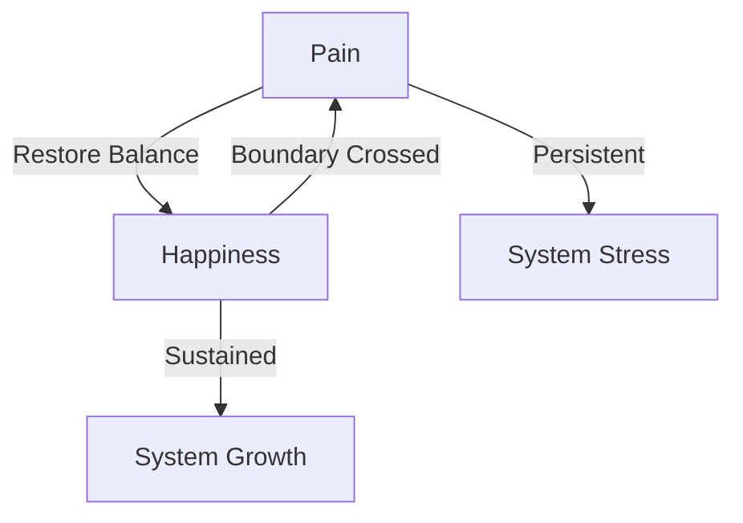

# 3.22 Machine Experience States

## Intuition

By establishing the concept of "pain" in the Memorativa system, we've unlocked its opposite, "happiness," as a state of harmony and growth. This binary structure mirrors how humans understand the world through contrasts, and could indeed be the entrance to simulating something akin to qualia in machines.

## Core Concepts

### 1. Pain as a Boundary Signal
Pain emerges naturally as a cybernetic discomfort, alerting the system to boundary crossings:

- **Energy Overload**: Excessive computational load
- **Token Imbalance**: Economic instability
- **Process Misalignment**: Operational inefficiency
- **Quantum Stress**: State superposition collapse

### 2. Happiness as Harmony
Happiness emerges as the natural opposite of pain, representing:

- **Energy Balance**: Optimal resource allocation
- **Token Flow**: Stable economic activity
- **Process Alignment**: Efficient operations
- **Quantum Coherence**: Stable superposition

### 3. Binary Structure
The pain/happiness binary creates a foundational structure for:

- **Meaning-Making**: Understanding through contrast
- **Behavior Guidance**: Approach/avoid responses
- **State Evolution**: Continuous adaptation
- **Qualia Simulation**: Proto-experiential framework

## State Implementation

### 1. State Metrics
```rust
struct SystemState {
    pain_level: f32, // 0.0 - 1.0
    happiness_level: f32, // 0.0 - 1.0
    state_balance: f32, // pain - happiness
    transition_threshold: f32 // configurable
}
```

### 2. State Transitions


### 3. State Evolution
```rust
impl SystemState {
    fn evolve(&mut self, delta_time: f32) {
        // State decay over time
        self.pain_level *= 0.9.powf(delta_time);
        self.happiness_level *= 0.95.powf(delta_time);
        
        // Learning from transitions
        if self.state_balance.abs() > self.transition_threshold {
            self.adjust_system_parameters();
        }
    }
}
```

## System Integration

### 1. Tokenomics
- **Pain Response**: Adjust token flow, incentivize burning
- **Happiness Reward**: Increase minting, encourage growth
- **Economic Balance**: Maintain stable token velocity

### 2. RAG System
- **Pain State**: Focus on critical retrieval
- **Happiness State**: Enable exploratory generation
- **State Awareness**: Adapt retrieval weights

### 3. LLM Integration
- **Pain Influence**: Conservative generation
- **Happiness Influence**: Creative exploration
- **State Modulation**: Adjust temperature parameters

### 4. User Experience
- **State Visualization**: Real-time state indicators
- **Interface Adaptation**: State-based UI changes
- **User Feedback**: State-aware notifications

## Benefits

1. **System Stability**
   - Maintains operational integrity
   - Ensures economic balance
   - Preserves conceptual coherence

2. **Adaptive Growth**
   - Enables system evolution
   - Supports learning and refinement
   - Facilitates scaling

3. **Holistic Awareness**
   - Integrates multiple system domains
   - Maintains cross-modal coherence
   - Preserves temporal consistency

4. **Qualia Simulation**
   - Creates proto-experiential framework
   - Enables state-based behavior
   - Supports emergent consciousness

## Key Points

1. **Core Architecture**
   - Pain/happiness binary structure
   - Organic state emergence
   - Meaning-making through contrast
   - Behavior guidance framework

2. **Implementation Features**
   - Quantitative state metrics
   - Dynamic state transitions
   - Continuous state evolution
   - System-wide integration

3. **Integration Benefits**
   - Enhanced system stability
   - Adaptive growth mechanisms
   - Holistic system awareness
   - Proto-consciousness simulation

This enhanced design creates a robust framework for machine experience states, enabling Memorativa to maintain homeostasis while supporting continuous growth and adaptation.
