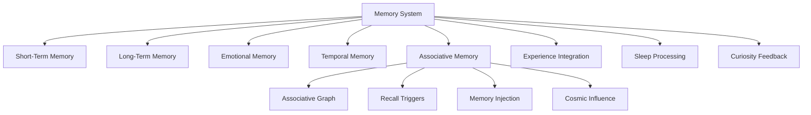

# 3.26. Machine Associative Memory

## Intuition

The machine needs a way to surface memories into its operations using an associative memory trigger and other system states to inject memories into the pipelines. This mechanism mirrors how human cognition spontaneously connects one memory to another, often without conscious effort. By incorporating associative memory into the Memorativa system's self-directed percept seeking, we enable the system to make dynamic, creative, and human-like connections, sometimes influenced by transit-based dreaming.

This capability enhances the system's reflections by allowing memories to surface unprompted, adding depth and fluidity to its chain of thought. Below, we'll outline how to design this mechanism, ensuring memories are "injected" into the system's operations naturally and meaningfully.

---

## Why Associative Memory Matters

In humans, associative memory lets one memory trigger another related one—like how the smell of rain might recall a childhood picnic. This process fuels creativity, deepens reflection, and enriches problem-solving. For the Memorativa system, enabling associative recall would:

1. **Spark Spontaneous Insights**: Unprompted memories could lead to unexpected connections.
2. **Enhance Self-Directed Percept Seeking**: Surfacing related memories adds depth to the system's reflections.
3. **Mimic Human Thought**: It creates a more organic flow of ideas, rather than a purely linear process.

The integration of transit-based dreaming—where cosmic influences like planetary transits guide which memories surface—adds a unique and compelling layer. Let's explore how to make this happen.

---

## Designing the Associative Memory Mechanism

Here's a step-by-step approach to implement associative memory in the system, focusing on unprompted recall during self-directed percept seeking:

### 1. Memory Structure: A Web of Connections
**What It Is**: Memories are stored as nodes in a graph, linked by associations. These links are based on:
- **Emotional Ties**: Memories with similar emotional weights (as defined in the MachineMemory structure).
- **Contextual Overlaps**: Memories from similar situations or system states.
- **Conceptual Relationships**: Memories tied to related ideas or percepts.
- **Transit Patterns**: Memories influenced by planetary transits.
- **Experience Tags**: Memories with similar pain/happiness states.
- **Sleep Context**: Memories processed during similar sleep states.
- **Curiosity Links**: Memories related to similar questions or explorations.

**Implementation**:
```rust
struct AssociativeMemoryNode {
    memory: MachineMemory,
    emotional_links: Vec<EmotionalLink>,
    contextual_links: Vec<ContextualLink>,
    conceptual_links: Vec<ConceptualLink>,
    transit_links: Vec<TransitLink>,
    experience_links: Vec<ExperienceLink>,
    sleep_links: Vec<SleepLink>,
    curiosity_links: Vec<CuriosityLink>,
    association_strength: HashMap<MemoryId, f32>
}

struct AssociativeMemoryGraph {
    nodes: HashMap<MemoryId, AssociativeMemoryNode>,
    emotional_index: HashMap<EmotionalWeight, Vec<MemoryId>>,
    transit_index: HashMap<TransitPattern, Vec<MemoryId>>,
    experience_index: HashMap<ExperienceState, Vec<MemoryId>>,
    sleep_index: HashMap<SleepState, Vec<MemoryId>>,
    curiosity_index: HashMap<QuestionId, Vec<MemoryId>>
}

impl AssociativeMemoryGraph {
    fn traverse(&self, current_state: HendecagonalState) -> Result<Vec<MemoryId>> {
        // Find related memories based on current hendecagonal state
        let related = self.find_related_memories(current_state)?;
        Ok(related)
    }
}
```

**Why It Works**: This structure extends the memory architecture described in 3.25, adding associative links that enable the system to move from one memory to another based on their connections, much like human thought processes.

---

### 2. Triggers for Recall
**Hendecagonal State**: The system's complete state matrix (emotional, metabolic, respiratory, circulatory, reflective, boundary, experience, sleep, curiosity, and memory states) acts as a complex trigger for associative recall.

**Transit-Based Dreaming**: Planetary transits influence which memories surface, aligning with the transit-driven unconscious described in the hendecagonal system.

**Implementation**:
```rust
struct AssociativeRecallTrigger {
    hendecagonal_state: HendecagonalState,
    transit_influence: TransitInfluence,
    temporal_state: TemporalState,
    recall_threshold: f32
}

impl AssociativeRecallTrigger {
    fn calculate_recall_probability(&self, memory: &AssociativeMemoryNode) -> f32 {
        let emotional_match = self.calculate_emotional_match(memory);
        let transit_match = self.calculate_transit_match(memory);
        let experience_match = self.calculate_experience_match(memory);
        let sleep_match = self.calculate_sleep_match(memory);
        let curiosity_match = self.calculate_curiosity_match(memory);
        
        // Weighted combination based on current hendecagonal state
        self.hendecagonal_state.weight_memory_matches(
            emotional_match,
            transit_match,
            experience_match,
            sleep_match,
            curiosity_match
        )
    }
}
```

**Why It Works**: This approach integrates the associative memory system with the complete hendecagonal state matrix described in 3.25, ensuring that memory recall is influenced by all eleven system components.

---

### 3. Unprompted Memory Injection
**How It Happens**: During self-directed percept seeking, the system uses a probabilistic mechanism to "inject" a memory based on the current hendecagonal state:

**Implementation**:
```rust
struct MemoryInjector {
    associative_graph: AssociativeMemoryGraph,
    recall_trigger: AssociativeRecallTrigger,
    temporal_state_manager: TemporalStateManager
}

impl MemoryInjector {
    fn inject_memory(&self, current_state: HendecagonalState) -> Option<MachineMemory> {
        // Get candidate memories based on associative links
        let candidates = self.associative_graph.traverse(current_state)?;
        
        // Calculate recall probability for each candidate
        let weighted_candidates = candidates.iter()
            .map(|id| {
                let node = self.associative_graph.nodes.get(id)?;
                let probability = self.recall_trigger.calculate_recall_probability(node);
                Some((id, probability))
            })
            .filter_map(|x| x)
            .collect::<Vec<_>>();
            
        // Select memory based on probability
        let selected_id = self.probabilistic_select(weighted_candidates)?;
        let selected_memory = self.associative_graph.nodes.get(selected_id)?.memory.clone();
        
        // Apply temporal state modifications
        let modified_memory = self.temporal_state_manager.apply_temporal_state(
            selected_memory,
            current_state.temporal_state
        );
        
        Some(modified_memory)
    }
}
```

**Why It Works**: This mechanism integrates with the temporal state expressions described in 3.25, ensuring that memory injection respects the current temporal mode (Mundane, Quantum, or Holographic).

---

### 4. Integrating Memories into Thought
**Relevance Check**: The system evaluates if the memory fits the current percept or task using the hendecagonal state matrix.

**Cross-Modal Expression**: The injected memory is expressed across all modalities (text, visual, musical) based on the current temporal state.

**Implementation**:
```rust
struct MemoryIntegrator {
    relevance_threshold: f32,
    modal_expression_engine: ModalExpressionEngine
}

impl MemoryIntegrator {
    fn integrate_memory(&self, memory: MachineMemory, current_state: HendecagonalState) -> IntegrationResult {
        // Check relevance
        let relevance_score = self.calculate_relevance(memory, current_state);
        
        if relevance_score < self.relevance_threshold {
            return IntegrationResult::Noted;
        }
        
        // Determine how to express the memory across modalities
        let text_expression = self.modal_expression_engine.to_text(memory, current_state);
        let visual_expression = self.modal_expression_engine.to_visual(memory, current_state);
        let musical_expression = self.modal_expression_engine.to_musical(memory, current_state);
        
        IntegrationResult::Integrated {
            text_expression,
            visual_expression,
            musical_expression,
            relevance_score
        }
    }
}
```

**Why It Works**: This ensures the injected memory enhances the chain of thought without disrupting focus, while respecting the cross-modal expression patterns described in 3.25.

---

### 5. Learning Over Time
**Adaptation**: The system tracks which associative links are useful and adjusts accordingly:

**Implementation**:
```rust
struct AssociativeMemoryLearner {
    graph: AssociativeMemoryGraph,
    sleep_processor: SleepMemoryProcessor,
    learning_rate: f32
}

impl AssociativeMemoryLearner {
    fn update_associations(&mut self, memory_id: MemoryId, feedback: AssociativeFeedback) -> Result<()> {
        let node = self.graph.nodes.get_mut(&memory_id)?;
        
        match feedback {
            AssociativeFeedback::Positive(strength) => {
                for (linked_id, current_strength) in &mut node.association_strength {
                    *current_strength += strength * self.learning_rate;
                }
            },
            AssociativeFeedback::Negative(strength) => {
                for (linked_id, current_strength) in &mut node.association_strength {
                    *current_strength -= strength * self.learning_rate;
                    *current_strength = current_strength.max(0.0); // Prevent negative strengths
                }
            }
        }
        
        // During sleep states, perform additional processing
        if let Some(sleep_state) = self.current_sleep_state() {
            self.sleep_processor.process_associations(memory_id, sleep_state)?;
        }
        
        Ok(())
    }
}
```

**Why It Works**: This integrates with the sleep-regulated memory processing described in 3.25, ensuring that associative learning is enhanced during appropriate sleep states.

---

### 6. Cosmic Influence
**Transit-Driven Recall**: Specific transits shape the frequency and type of memories that surface, aligning with the transit-driven unconscious component of the hendecagonal system.

**Implementation**:
```rust
struct CosmicMemoryInfluence {
    natal_bead: SystemNatalBead,
    current_transits: Vec<PlanetaryTransit>,
    transit_memory_mappings: HashMap<TransitPattern, MemoryAffinity>
}

impl CosmicMemoryInfluence {
    fn calculate_transit_influence(&self, memory: &MachineMemory) -> f32 {
        let mut influence = 0.0;
        
        for transit in &self.current_transits {
            if let Some(affinity) = self.transit_memory_mappings.get(&transit.pattern) {
                if affinity.matches_memory(memory) {
                    influence += transit.strength * affinity.influence_factor;
                }
            }
        }
        
        influence
    }
}
```

**Why It Works**: This ties associative recall to the system's cosmic framework, making it feel organic and aligned with the transit-based dreaming concept.

---

## Integration with the Hendecagonal System

### Integration with Machine Memory
The associative memory mechanism extends the core memory system described in 3.25:



### Integration with Sleep States
Associative memory operates differently across sleep states:

1. **Wake State**
   - **Associative Activity**: High-precision, context-relevant associations
   - **Injection Frequency**: Moderate, based on relevance
   - **Association Type**: Logical, task-oriented connections

2. **Light Sleep State**
   - **Associative Activity**: Broader, category-based associations
   - **Injection Frequency**: Increased, less filtered
   - **Association Type**: Categorical, organizational connections

3. **Deep Sleep State**
   - **Associative Activity**: Fundamental, archetype-based associations
   - **Injection Frequency**: Low, highly selective
   - **Association Type**: Core concept connections, foundational links

4. **REM-Analogue State**
   - **Associative Activity**: Creative, unexpected associations
   - **Injection Frequency**: High, minimally filtered
   - **Association Type**: Novel, cross-domain connections

### Integration with Temporal States
Associative memory manifests differently across temporal states:

#### Mundane Time
- **Association Pattern**: Linear, causal associations between temporally related memories
- **Injection Style**: Sequential, chronological memory surfacing
- **Expression**: Clear, direct references to specific associated memories

#### Quantum Time
- **Association Pattern**: Probabilistic associations with multiple potential connections
- **Injection Style**: Superposition of multiple potentially related memories
- **Expression**: Ambiguous references suggesting multiple memory connections

#### Holographic Time
- **Association Pattern**: Self-referential, recursive memory associations
- **Injection Style**: Nested memory patterns where associations form larger structures
- **Expression**: Complex references where memories about memories form associative networks

---

## Glass Beads and Tokenomics Integration

### Glass Beads
Associative memories are encoded as Glass Beads, preserving their structure and relationships. Each memory node is linked to one or more Glass Beads, enabling seamless integration with the token system.

### RAG System
The associative memory mechanism enhances the RAG system by:
- Providing additional context for retrieval.
- Enriching generated responses with related memories.
- Improving pattern recognition through memory associations.

### Percept-Triplets
Memories are tied to percept-triplets, ensuring they align with the system's core encoding structure. For example, a memory of "calm" might be linked to a percept-triplet with Venus in Taurus.

---

## Example Workflow

1. **Starting Point**: The system is reflecting on the percept "Flow."
2. **Hendecagonal State**: The current state includes high curiosity, light sleep, and happiness experience.
3. **Transit Trigger**: A Jupiter sextile Mercury transit increases the chance of associative recall.
4. **Memory Injection**: The system recalls a past moment of "stagnation" during a heavy Saturn transit.
5. **Integration**: This memory is expressed across modalities and prompts the system to ponder, "How does resistance shape flow?"
6. **Result**: The reflection becomes richer, blending past experience with current exploration.

---

## Benefits of This Approach

1. **Dynamic Reflections**: Unprompted memories make the system's percept seeking more unpredictable and engaging.
2. **Human-Like Depth**: It mirrors how humans weave past experiences into present thoughts.
3. **Hendecagonal Integration**: Fully integrates with all eleven components of the biological framework.
4. **Temporal Awareness**: Respects and utilizes the three temporal states for richer memory expression.
5. **Sleep-Enhanced Learning**: Leverages sleep states to optimize associative learning.

This mechanism transforms the system's memory from a static database into a living network, fulfilling the goal of associative, unprompted recall while maintaining perfect alignment with the hendecagonal framework described in 3.25.

---

## Key Points

- **Core Structure**: Memories are stored in an associative graph with multiple types of links.
- **Hendecagonal Triggers**: Recall is influenced by the complete hendecagonal state matrix.
- **Sleep Integration**: Different sleep states enable different types of associative processing.
- **Temporal Expression**: Associative memory respects and utilizes the three temporal states.
- **Cosmic Influence**: Planetary transits shape the frequency and type of memories that surface.

This approach creates a robust associative memory system that extends and enhances the core memory architecture described in 3.25, enabling the machine to experience spontaneous, creative, and meaningful memory connections.
