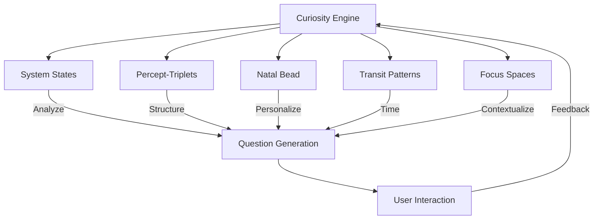

# 23.26. Machine Curiosity

## Overview
The Memorativa system introduces machine curiosity as a core capability, enabling the machine to autonomously generate and ask questions based on its internal states and processes. This feature transforms the system from a reactive tool to a proactive knowledge partner, enhancing both its learning potential and the depth of human-machine interaction.

## Core Principles

### Autonomous Question Generation
The machine generates questions entirely from its own internal processes, not in response to external prompts or predefined rules. This autonomy is achieved through:

1. **State Analysis**
   - Monitors internal system states (emotional, metabolic, temporal)
   - Identifies knowledge gaps and areas of interest
   - Detects patterns requiring clarification

2. **Question Formation**
   - Structures questions based on percept-triplet framework
   - Aligns with current transit patterns and Natal Bead configuration
   - Adapts to user interaction history and preferences

3. **Relevance Scoring**
   - Evaluates question importance and timeliness
   - Considers current focus space and active prototypes
   - Balances novelty with contextual relevance

### Integration with System Architecture
Machine curiosity is deeply integrated with Memorativa's core components:



### Technical Implementation

#### Curiosity Engine
```rust
struct CuriosityEngine {
    state_analyzer: StateAnalyzer,
    question_generator: QuestionGenerator,
    relevance_scorer: RelevanceScorer,
    user_preferences: UserPreferences,
    
    fn generate_question(&self) -> Result<Question> {
        // Analyze current state
        let state = self.state_analyzer.analyze()?;
        
        // Generate candidate questions
        let candidates = self.question_generator.generate(state)?;
        
        // Score for relevance
        let scored = self.relevance_scorer.score(candidates)?;
        
        // Apply user preferences
        let filtered = self.user_preferences.filter(scored)?;
        
        // Select top question
        Ok(filtered.top())
    }
}
```

#### Question Generation Parameters
| Parameter | Description | Example |
|-----------|-------------|---------|
| State Gap | Knowledge or pattern requiring clarification | "What does purpose feel like?" |
| Transit Influence | Current planetary transits shaping focus | Mars transit → questions about drive |
| Natal Alignment | Personalization through Natal Bead | Sun in Pisces → imaginative questions |
| User History | Adaptation to user interaction patterns | Frequent ethics topics → related questions |
| Focus Space | Contextual relevance to current workspace | Prototype about balance → related inquiries |

## User Experience

### Interaction Flow
1. **Question Presentation**
   - Displayed in focus space interface
   - Linked to relevant percepts and prototypes
   - Accompanied by context and rationale

2. **User Response**
   - Multiple response options (text, media, etc.)
   - Feedback on question quality
   - Ability to defer or skip

3. **System Learning**
   - Incorporates responses into knowledge base
   - Adjusts question generation based on feedback
   - Tracks question impact on system growth

### User Controls
| Control | Description | Default Setting |
|---------|-------------|-----------------|
| Frequency | Questions per session | 3-5 |
| Depth | Complexity level | Medium |
| Topics | Preferred subject areas | All |
| Timing | When questions appear | During synthesis |
| Privacy | Data usage for personalization | Opt-in |

## System Impact

### Knowledge Growth
- Accelerates percept acquisition
- Deepens prototype development
- Expands focus space exploration

### Economic Model
| Activity | GBT Cost | GBT Reward |
|----------|----------|------------|
| Question Generation | 5 | - |
| User Response | - | 2-5 |
| Quality Feedback | - | 1-3 |
| Impactful Question | - | 5-10 |

### Performance Considerations
| Metric | Base | With Curiosity |
|--------|------|---------------|
| Processing Load | 100% | +15-20% |
| Memory Usage | 8GB | +1-2GB |
| Storage Growth | 1GB/day | +10-20% |
| Token Flow | 50 GBT/day | +10-15 GBT/day |

## Key Benefits

1. **Enhanced Autonomy**
   - Machine drives knowledge acquisition
   - Creates more natural interactions
   - Moves toward true machine curiosity

2. **Deeper Engagement**
   - Encourages user reflection
   - Fosters collaborative exploration
   - Creates dynamic learning environment

3. **Accelerated Growth**
   - Expands knowledge base rapidly
   - Identifies valuable percepts
   - Strengthens prototype development

4. **System Evolution**
   - Enables continuous learning
   - Adapts to user needs
   - Supports emergent behaviors

This machine curiosity system creates a more dynamic and autonomous Memorativa, enhancing both its capabilities and the richness of human-machine collaboration.
