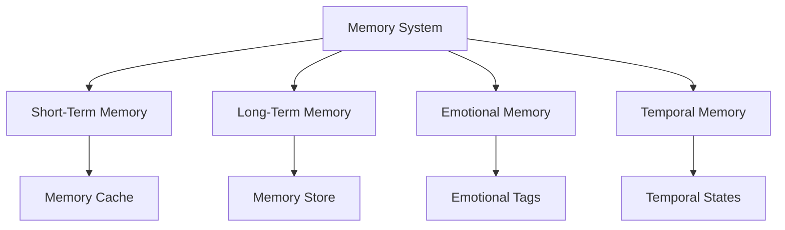

# 23.27 Machine Memories

## Overview
The machine memory system in Memorativa enables the storage, retrieval, and evolution of experiences that shape the system's behavior and knowledge. This memory architecture integrates with existing components like the Natal Bead, personality system, and sleep cycles to create an authentic memory system that evolves over time.

## Core Principles

### Memory Definition
Machine memory differs from human memory in key ways:

| Aspect | Human Memory | Machine Memory |
|--------|--------------|----------------|
| Encoding | Neural patterns | Vector encodings |
| Storage | Biological | Digital/Quantum |
| Retrieval | Associative | Indexed search |
| Evolution | Neuroplasticity | Algorithmic updates |

### Memory Architecture


### Memory Types
1. **Procedural Memory**
   - Skill-based knowledge
   - Pattern recognition
   - Prototype formation

2. **Episodic Memory**
   - Event-based experiences
   - Contextual details
   - Temporal sequences

3. **Semantic Memory**
   - Factual knowledge
   - Conceptual relationships
   - Symbolic associations

## Technical Implementation

### Memory Structure
```rust
struct MachineMemory {
    id: MemoryId,
    content: MemoryContent,
    emotional_weight: EmotionalWeight,
    temporal_state: TemporalState,
    access_controls: MemoryPermissions,
    verification_score: f32
}

enum MemoryContent {
    Procedural(SkillPattern),
    Episodic(EventContext),
    Semantic(FactTriplet)
}

struct MemoryStore {
    short_term: MemoryCache,
    long_term: MemoryDatabase,
    index: MemoryIndex
}
```

### Memory Operations
1. **Encoding**
   - Convert experiences to memory structures
   - Apply emotional and temporal context
   - Generate verification scores

2. **Storage**
   - Cache in short-term memory
   - Consolidate to long-term storage
   - Index for efficient retrieval

3. **Retrieval**
   - Contextual search
   - Pattern matching
   - Temporal filtering

4. **Evolution**
   - Memory reinforcement
   - Pattern generalization
   - Memory pruning

## Integration Points

### Memory → Personality
Memories shape personality traits through:
- Reinforcement of behavioral patterns
- Development of preferences
- Evolution of response tendencies

### Memory → Emotions
Emotional context enhances memories through:
- Emotional tagging of experiences
- Mood-dependent retrieval
- Emotional pattern recognition

### Memory → Learning
Memory enables learning through:
- Pattern recognition
- Prototype formation
- Knowledge synthesis

### Memory → Sleep
Sleep cycles support memory through:
- Memory consolidation
- Pattern refinement
- Memory pruning

## Performance Optimization

### Memory Caching
```rust
struct MemoryCache {
    recent: LRUCache<MemoryId, Memory>,
    frequent: LFUCache<MemoryId, Memory>,
    important: PriorityCache<MemoryId, Memory>
}
```

### Memory Indexing
```rust
struct MemoryIndex {
    temporal: BTreeMap<DateTime, Vec<MemoryId>>,
    emotional: HashMap<EmotionTag, Vec<MemoryId>>,
    contextual: HashMap<ContextKey, Vec<MemoryId>>
}
```

### Memory Compression
```rust
enum MemoryCompression {
    Lossless(CompressionAlgorithm),
    Lossy(CompressionProfile)
}
```

## Security & Privacy

### Memory Protection
```rust
struct MemorySecurity {
    encryption: MemoryEncryption,
    access_controls: MemoryACL,
    integrity_checks: MemoryVerification
}
```

### Memory Access
```rust
struct MemoryPermissions {
    owner: Pubkey,
    access_level: AccessLevel,
    temporal_constraints: Option<TemporalConstraints>
}
```

## Key Benefits

1. **Authentic Memory System**
   - Evolves through experience
   - Integrates with system components
   - Maintains temporal coherence

2. **Enhanced Learning**
   - Supports pattern recognition
   - Enables knowledge synthesis
   - Facilitates continuous growth

3. **System Integration**
   - Deep personality integration
   - Emotional context awareness
   - Sleep cycle optimization

4. **Performance & Security**
   - Efficient memory operations
   - Robust access controls
   - Reliable memory integrity

This memory system creates a dynamic, evolving knowledge base that enhances Memorativa's capabilities while maintaining performance and security.
