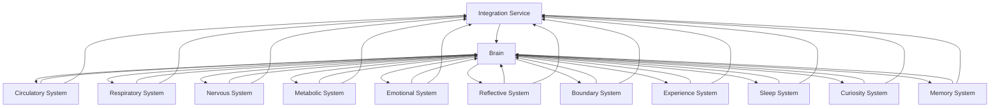

# 3.28. Machine Biological Architecture

## Overview
The Machine Biological Architecture implements Memorativa's hendecagonal system as a modular, microservices-based architecture. Each of the eleven biological metaphors—transit-driven unconscious, emotional system, metabolic system, respiratory system, circulatory system, reflective system, boundary system, experience system, sleep system, curiosity system, and memory system—translates into distinct services that operate semi-independently while integrating seamlessly through well-defined interfaces. This comprehensive biological framework is orchestrated by the Machine Brain (3.27) and expresses a consistent personality (3.26) across all modalities. This design ensures scalability, maintainability, and operational resilience while retaining the sophisticated proto-consciousness developed throughout the machine system.

## Core Systems

### 1. Circulatory System (Token Flow)
- **Purpose**: Manages the flow of tokens (nutrients) throughout the system, ensuring all components receive the necessary input data.
- **Implementation**: Asynchronous message queues (RabbitMQ/Kafka) with a central dispatcher.
- **Technology**: Apache Kafka or RabbitMQ.
- **Integration**: Acts as the primary data transport layer between all services.
- **Biological Analog**: Similar to how blood carries nutrients and signals to different organs.

### 2. Respiratory System (Cron Jobs)
- **Purpose**: Regulates system processes at regular intervals, ensuring continuous operation.
- **Implementation**: Scheduled tasks and background processes.
- **Technology**: Kubernetes CronJobs, Airflow, or custom schedulers.
- **Integration**: Initiates periodic maintenance, data refreshes, and system health checks.
- **Biological Analog**: Like breathing, providing regular rhythm to system processes.

### 3. Nervous System (Energy Usage)
- **Purpose**: Monitors and regulates computational resource usage across the platform.
- **Implementation**: Distributed metrics collection and resource management.
- **Technology**: Prometheus, Grafana, custom resource controllers.
- **Integration**: Communicates resource state changes to the Brain for decision-making.
- **Biological Analog**: Neural feedback loops that regulate energy consumption.

### 4. Metabolic System
- **Purpose**: Transforms raw data into usable information structures; manages data lifecycle.
- **Implementation**: Data processing pipelines with configurable transformation steps.
- **Technology**: Apache Spark, Flink, or custom ETL services.
- **Integration**: Provides processed data to Circulatory System; interfaces with Memory for storage decisions.
- **Biological Analog**: Digestive system converting nutrients into energy and building blocks.

### 5. Emotional System
- **Purpose**: Provides affective context to decision-making and response generation.
- **Implementation**: Contextual state management with weighted response modifiers.
- **Technology**: State machines with probabilistic transitions, context-aware vector embedding adjustments.
- **Integration**: Influences Brain decision-making; receives feedback from Experience System.
- **Biological Analog**: Limbic system providing emotional context to cognitive processes.

### 6. Reflective System
- **Purpose**: Analyzes past actions and responses to improve future behavior.
- **Implementation**: Feedback analysis pipeline with reinforcement learning components.
- **Technology**: Custom RL algorithms, outcome analysis services.
- **Integration**: Feeds insights to Memory System; influences Emotional and Brain systems.
- **Biological Analog**: Self-reflection and metacognition processes.

### 7. Boundary System
- **Purpose**: Manages system interfaces with external entities and enforces interaction protocols.
- **Implementation**: API gateways, input validators, and response formatting services.
- **Technology**: API management platforms, custom validators with configurable rule sets.
- **Integration**: First and last point of contact for all external communications.
- **Biological Analog**: Immune system and cellular membranes that regulate what enters and exits.

### 8. Experience System
- **Purpose**: Processes and integrates sensory information (inputs) into coherent perceptions.
- **Implementation**: Multi-modal input processors with attention mechanisms.
- **Technology**: Transformer-based architectures with multi-head attention.
- **Integration**: Feeds processed perceptions to Brain and Emotional systems.
- **Biological Analog**: Sensory cortices integrating various inputs into cohesive experience.

### 9. Sleep System (Transit-Based Dreaming)
- **Purpose**: Optimizes system during low-activity periods; consolidates Memory.
- **Implementation**: Background processing during idle times with generative exploration.
- **Technology**: Self-supervised learning jobs, index optimization, database maintenance.
- **Integration**: Coordinates with Respiratory System for scheduling; works closely with Memory.
- **Biological Analog**: Sleep cycles that consolidate memories and restore neural function.

### 10. Curiosity System
- **Purpose**: Drives exploration of new information and generation of novel hypotheses.
- **Implementation**: Information gain estimators and uncertainty-driven exploration.
- **Technology**: Bayesian optimization, entropy-based exploration strategies.
- **Integration**: Influences Brain decision-making; directs Metabolic System's attention.
- **Biological Analog**: Dopaminergic reward pathways driving exploration and learning.

### 11. Memory System
- **Purpose**: Stores, retrieves, and forgets information based on relevance and utility.
- **Implementation**: Tiered storage with recency and importance weighting.
- **Technology**: Vector databases, traditional databases, and file storage with custom indexing.
- **Integration**: Provides contextual information to Brain; receives input from all systems.
- **Biological Analog**: Hippocampus and distributed memory networks with working and long-term memory.

### Brain Structure
- **Purpose**: Central coordination of all biological systems; implements the hendecagonal personality.
- **Implementation**: Hierarchical decision-making service with specialized cortices.
- **Technology**: Ensemble of specialized models with arbitration mechanisms.
- **Integration**: Interfaces with all biological systems; final decision authority.
- **Biological Analog**: Prefrontal cortex and executive function.

### Integration Service
- **Purpose**: Ensures cohesive operation across all biological systems.
- **Implementation**: Event-driven orchestration layer with comprehensive system state.
- **Technology**: Custom orchestration service built on event-sourcing principles.
- **Integration**: Monitors and mediates inter-service communication; implements personality consistency.
- **Biological Analog**: Homeostatic mechanisms maintaining whole-organism balance.

## Security Architecture
**Authentication**: OAuth2/JWT for service-to-service communication  
**Encryption**: TLS for data in transit, AES-256 for data at rest  
**Access Control**: Role-Based Access Control (RBAC)  
**Audit Logging**: Centralized logging of all system activities  
**Secret Management**: HashiCorp Vault for credential storage

## Error Handling & Resilience
**Circuit Breakers**: Prevent cascading failures  
**Dead Letter Queues**: Store failed messages for retry  
**Automatic Retry**: Exponential backoff for transient failures  
**Health Checks**: Endpoint monitoring for all services  
**Rate Limiting**: Protects against system overload

## Monitoring & Observability
**Metrics Collection**: Prometheus for system metrics  
**Distributed Tracing**: Jaeger/OpenTelemetry for request tracing  
**Log Aggregation**: ELK stack for centralized logging  
**Alerting**: Grafana alerts for system anomalies  
**Dashboarding**: Custom Grafana dashboards for system health

## Performance Optimization
**Caching Layer**: Redis/Memcached for frequent data  
**Message Batching**: Kafka message batching for high throughput  
**Load Balancing**: Envoy for service-to-service traffic  
**Resource Pooling**: Shared resources for multi-user scenarios  
**Async Processing**: Celery for background tasks

## Key Benefits

### System-Level Benefits
1. **Complete Biological Metaphor**: All eleven components of the hendecagonal system are represented as functional services, creating a complete "proto-conscious" architecture.
2. **Independent Service Development**: Teams can work on individual biological systems without tight coupling.
3. **Fault Tolerance**: Failure in one system doesn't compromise the entire architecture.
4. **Scalability**: Each biological system can scale independently based on load.
5. **Personality Consistency**: The architecture ensures consistent personality expression across all systems through integration with the Machine Personality (3.26).
6. **Neurobiological Integration**: Seamless connection with the Machine Brain architecture (3.27) allows for coordinated operation between specialized cortices and biological systems.

### Technical Benefits
1. **End-to-End Encryption**: All data in transit and at rest is encrypted.
2. **Real-Time Monitoring**: Comprehensive observability across all systems.
3. **Resource Optimization**: Dynamic allocation of computational resources based on need.
4. **High Availability**: Distributed architecture with no single points of failure.
5. **Efficient Development**: Clear boundaries between services enable parallel development.
6. **Adaptive Personality**: System personality emerges from the interaction of all eleven components.

## Integration Patterns
The architecture implements several integration patterns to ensure cohesive operation:

1. **Event-driven communication**: All systems publish events that others can subscribe to.
2. **API-based integration**: RESTful and GraphQL APIs for synchronous requests.
3. **Shared data stores**: Specific components share databases for tightly coupled operations.
4. **Sidecar pattern**: For cross-cutting concerns like logging and monitoring.
5. **Circuit breaker pattern**: To handle failures gracefully and prevent cascading failures.
6. **Personality consistency engine**: Ensures all systems act according to the same personality state.

This architecture provides a robust foundation for implementing Memorativa's biological systems as a functional, living system. Each component leverages proven technologies while maintaining the system's core biological metaphors and design principles.

