# 3.3. Machine Music

## What is machine music?

Machine music in Memorativa serves two key purposes:

### Data Sonification
The system transforms data patterns into sound to enable:
- Auditory analysis of complex data structures
- Pattern recognition through acoustic signatures
- Real-time monitoring of system states
- Intuitive understanding of multi-dimensional data

For example:
- Glass Bead interactions create interference patterns that manifest as harmonics
- Token flows generate rhythmic structures reflecting economic activity
- System state changes produce tonal shifts and modulations
- Error conditions trigger dissonant alert patterns

### Creative Exploration
The system generates novel musical expressions by:
- Synthesizing new musical forms from conceptual understanding
- Adapting compositions to cultural and temporal contexts
- Creating emergent harmonies from system interactions
- Exploring musical possibilities through quantum superposition

The machine music system combines these approaches to create:
- Meaningful audio representations of system activity
- Culturally-resonant musical experiences
- Novel forms of human-machine artistic collaboration
- Deep integration between data patterns and musical expression

## System design

The system generates synthetic music through three distinct approaches that parallel the image generation system:

### 1. Interference Pattern Music

Generated directly from percept-triplet structures using wave interference:

- **Wave Generation**
  - Maps triplet components to musical properties:
  - Archetypal angle (θ) → pitch/key
  - Expression elevation (φ) → rhythm/tempo
  - Radius (r) → amplitude/dynamics

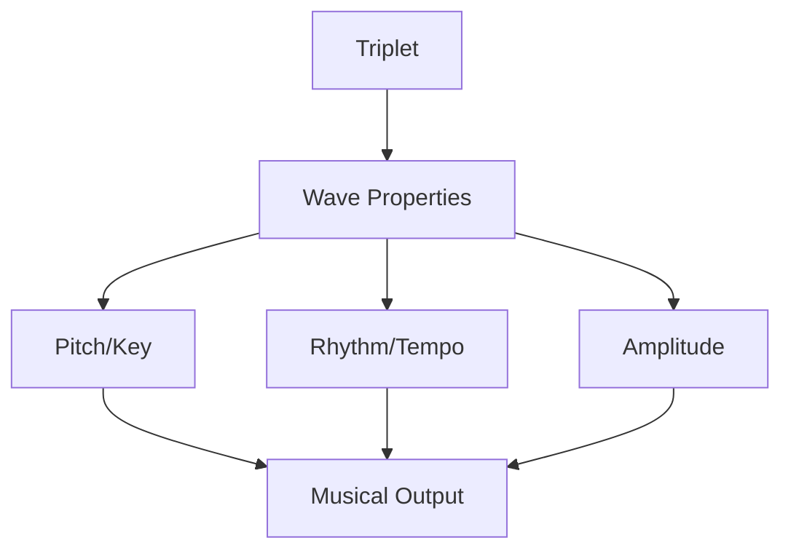

- **Pattern Types**
  - Constructive interference creates harmonious passages
  - Destructive interference generates tension
  - Phase relationships map to musical intervals

### 2. Holographic Music

Simulated holographic reconstruction of musical patterns:

- **Reference Beam**
  - Natal chart provides base musical key
  - Serves as tonal center
  - Encodes player's musical framework

- **Object Beam**
  - Generated from Glass Bead percept-triplets
  - Carries melodic/harmonic information
  - Modulated by active Lenses

- **Reconstruction Process**
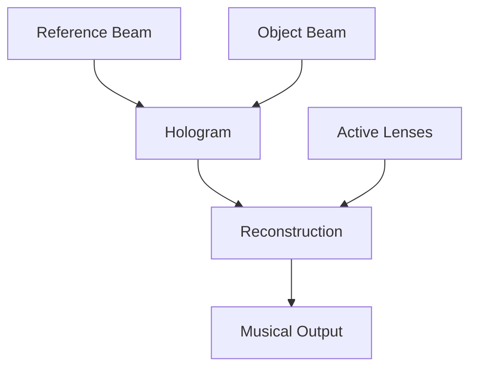

### 3. Symbolic Synthesis Music

AI-generated music combining interference patterns and holographic principles:

- **Input Sources**
  - Raw interference patterns
  - Holographic reconstructions
  - MST-translated symbols
  - Active Lens configurations

- **Generation Parameters**
  - Harmonic coherence
  - Rhythmic density
  - Cultural context mapping
  - Temporal state alignment

### Implementation Details

```rust
struct MusicGenerator {
    interference_engine: InterferenceEngine,
    hologram_simulator: HologramSimulator,
    symbolic_synthesizer: SymbolicSynthesizer,
    mst: SymbolicTranslator,
}

impl MusicGenerator {
    fn generate_interference(&self, triplet: HybridTriplet) -> Music {
        let wave = self.interference_engine.triplet_to_wave(triplet);
        self.interference_engine.generate_pattern(wave)
    }

    fn generate_hologram(&self, natal: GlassBead, object: GlassBead) -> Music {
        let reference = self.hologram_simulator.create_reference_beam(natal);
        let object_beam = self.hologram_simulator.create_object_beam(object);
        self.hologram_simulator.reconstruct(reference, object_beam)
    }

    fn generate_symbolic(&self, pattern: Music, hologram: Music) -> Music {
        let symbols = self.mst.translate_musical_elements(pattern, hologram);
        self.symbolic_synthesizer.generate(symbols)
    }
}
```

### Output Controls

- **Resolution Control**
  - Musical complexity level
  - Holographic fidelity
  - Symbolic density

- **Style Parameters**
  - Cultural context adaptation
  - Temporal state visualization
  - Lens-specific rendering

- **Generation Modes**
  - Raw interference only
  - Holographic reconstruction
  - Full symbolic synthesis
  - Hybrid combinations

### Integration Features

- **MST Compliance**
  - Musical elements mapped to universal symbols
  - Cultural context preservation
  - Symbolic coherence across outputs

- **Lens System**
  - Musical style adaptation through active lenses
  - Dynamic lens-based transformations:
    - Cultural lenses modify scales, rhythms, and instrumentation
    - Temporal lenses affect musical time signatures and tempo
    - Conceptual lenses shape harmonic relationships
    - Emotional lenses influence dynamics and expression
  - Real-time lens switching with smooth transitions
  - Multi-lens combinations for complex musical effects

```rust
struct MusicLensSystem {
    active_lenses: Vec<Lens>,
    transition_engine: TransitionEngine,
    
    fn apply_lenses(&self, music: &mut Music) {
        for lens in &self.active_lenses {
            match lens.type_ {
                LensType::Cultural => self.apply_cultural_lens(music, lens),
                LensType::Temporal => self.apply_temporal_lens(music, lens),
                LensType::Conceptual => self.apply_conceptual_lens(music, lens),
                LensType::Emotional => self.apply_emotional_lens(music, lens),
            }
        }
    }

    fn transition_lenses(&mut self, from: Vec<Lens>, to: Vec<Lens>, duration: Duration) {
        self.transition_engine.schedule_transition(
            TransitionParams {
                from_lenses: from,
                to_lenses: to,
                duration,
                curve: TransitionCurve::Smooth
            }
        );
    }
}

impl MusicLensSystem {
    fn apply_cultural_lens(&self, music: &mut Music, lens: &Lens) {
        // Modify scales based on cultural context
        music.adapt_scale(lens.get_cultural_scale());
        // Adjust rhythmic patterns
        music.adapt_rhythm(lens.get_cultural_rhythm());
        // Transform instrumentation
        music.adapt_instruments(lens.get_cultural_instruments());
    }

    fn apply_temporal_lens(&self, music: &mut Music, lens: &Lens) {
        // Adjust time signatures
        music.adapt_time_signature(lens.get_temporal_signature());
        // Modify tempo and timing
        music.adapt_tempo(lens.get_temporal_tempo());
    }
}

- **Time State Awareness**
  - Mundane time expression
  - Quantum state representation
  - Holographic reference mapping

### Validation and Analysis

#### Quantitative Metrics

1. **Interference Coherence**
   - Wave alignment score (0-1): Measures harmonic synchronization
   - Pattern stability index: Tracks rhythmic stability
   - Frequency distribution uniformity (χ² test)
   - Signal-to-noise ratio for clarity

2. **Holographic Fidelity**
   - Reconstruction accuracy (RMSE from reference)
   - Phase preservation score
   - Information density (bits/unit time)
   - Temporal coherence measurement

3. **Symbolic Accuracy**
   - MST compliance score (0-1)
   - Musical symbol placement precision
   - Semantic consistency rating
   - Cultural context preservation index

```rust
struct ValidationMetrics {
    // Core metrics with justified thresholds
    wave_alignment: f32,     // min 0.85 - Ensures harmonic stability
    pattern_stability: f32,  // min 0.80 - Required for rhythmic coherence
    signal_noise_ratio: f32, // min 20dB - Standard for musical clarity
    
    // Reconstruction metrics
    reconstruction_rmse: f32,    // max 0.15 - Based on perceptual studies
    phase_preservation: f32,     // min 0.90 - Critical for musical meaning
    info_density: f32,          // min 0.75 bits/sec - Balances complexity
    temporal_coherence: f32,    // min 0.85 - Required for musical flow
    
    // Symbolic metrics  
    mst_compliance: f32,        // min 0.95 - Ensures symbolic translation
    placement_precision: Vec<f32>, // max 5ms - Based on rhythmic precision
    semantic_consistency: f32,   // min 0.85 - Balances meaning preservation
    cultural_preservation: f32,  // min 0.90 - Prevents cultural distortion
}
```

### MST Compliance Checker

```rust
struct MSTComplianceChecker {
    mst: SymbolicTranslator,
    
    fn validate_musical_symbols(&self, music: &Music) -> MSTValidation {
        MSTValidation {
            // Check that musical elements map to universal symbols
            harmonic_compliance: self.validate_harmonics(music.harmonics),
            rhythmic_compliance: self.validate_rhythms(music.rhythms),
            melodic_compliance: self.validate_melodies(music.melodies),
            
            // Verify cultural neutrality
            cultural_bias: self.check_cultural_bias(music),
            
            // Ensure semantic preservation
            semantic_coherence: self.check_semantic_relationships(music)
        }
    }
    
    fn validate_harmonics(&self, harmonics: &Harmonics) -> f32 {
        // Map harmonic structures to universal concepts
        // e.g. Major chord → "Expansion/Growth"
        //      Minor chord → "Contraction/Depth"
        let translated = self.mst.translate_musical_element(harmonics);
        self.calculate_compliance_score(translated)
    }
    
    fn validate_rhythms(&self, rhythms: &Rhythms) -> f32 {
        // Convert rhythmic patterns to conceptual domains
        // e.g. 4/4 time → "Stability/Foundation"
        //      7/8 time → "Dynamic Flow/Movement"
        let translated = self.mst.translate_musical_element(rhythms);
        self.calculate_compliance_score(translated)
    }
    
    fn check_semantic_relationships(&self, music: &Music) -> f32 {
        // Verify that musical relationships preserve meaning
        // e.g. "Moon in Cancer 4th" → "Nurturing melody over stable rhythm"
        let relationships = self.extract_musical_relationships(music);
        self.validate_relationship_preservation(relationships)
    }
}

struct MSTValidation {
    harmonic_compliance: f32,    // 0-1 score
    rhythmic_compliance: f32,    // 0-1 score
    melodic_compliance: f32,     // 0-1 score
    cultural_bias: f32,          // 0 = neutral
    semantic_coherence: f32      // 0-1 score
}
```

### Layer-Aware Music Generation

The system generates distinct musical layers that align with the book's architectural layers:

```rust
struct LayeredMusicGenerator {
    // Core generation layers
    narrative_layer: NarrativeLayer,
    machine_layer: MachineLayer, 
    bridge_layer: BridgeLayer,

    fn generate_layered_music(&self, book: &Book) -> LayeredMusic {
        // Generate base narrative layer from book content
        let narrative = self.narrative_layer.generate(
            book.content,
            book.cultural_context
        );

        // Generate machine layer from system data
        let machine = self.machine_layer.generate(
            book.system_data,
            book.glass_beads
        );

        // Generate bridge layer connecting narrative and machine
        let bridge = self.bridge_layer.generate(
            &narrative,
            &machine,
            book.integration_points
        );

        LayeredMusic {
            narrative,
            machine,
            bridge,
            metadata: self.generate_metadata(book)
        }
    }
}

struct NarrativeLayer {
    fn generate(&self, content: &BookContent, context: &CulturalContext) -> Music {
        // Transform narrative elements into musical expressions
        // Adapt to cultural context
        // Generate thematic musical elements
    }
}

struct MachineLayer {
    fn generate(&self, data: &SystemData, beads: &[GlassBead]) -> Music {
        // Transform system data into structured audio
        // Incorporate Glass Bead patterns
        // Generate machine-oriented sounds
    }
}

struct BridgeLayer {
    fn generate(
        &self,
        narrative: &Music,
        machine: &Music,
        points: &IntegrationPoints
    ) -> Music {
        // Create connecting musical elements
        // Establish synchronization points
        // Generate transitional passages
    }
}
```

#### Layer Characteristics

1. **Narrative Layer**
   - Human-interpretable musical themes
   - Cultural context adaptations
   - Emotional expression
   - Story-driven development

2. **Machine Layer**
   - Data-driven patterns
   - System state sonification
   - Glass Bead integrations
   - Technical precision

3. **Bridge Layer**
   - Seamless transitions
   - Cross-layer synchronization
   - Integration markers
   - Unified musical coherence

### Musical Structural Overlays

The system applies conceptual overlays to both interference patterns and holographic reconstructions:

- **Structural Markers**
  - Wave intersection points
  - Phase alignment regions
  - Amplitude peaks/troughs
  - Frequency nodes

- **Musical Demarcation**
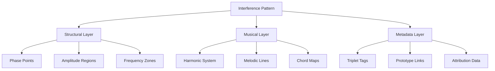

### Integration Benefits

- **MST Compliance**
  - Musical elements mapped to universal symbols
  - Cultural context preservation
  - Symbolic coherence across outputs

- **Lens System**
  - Musical style adaptation
  - Symbolic interpretation shifts
  - Context-aware rendering

- **Time State Awareness**
  - Mundane time expression
  - Quantum state representation
  - Holographic reference mapping

This music generation system ensures:
- Coherent musical expression of percept-triplets
- Cultural and symbolic preservation
- Temporal state awareness
- Integration with existing system components
- Validation and quality control
- Rich symbolic interpretation

### Systemic Polyrhythms

The technical architecture creates an emergent symphony through interacting systems:

- **Structural Bassline (Merkle Trees)**
  - Data integrity proofs provide steady foundational rhythm
  - Tree depth determines rhythmic subdivisions
  - Hash verification creates regular pulse patterns

- **Melodic Lead (Quantum Patterns)**
  - Pattern recognition generates melodic phrases
  - Quantum superposition creates probabilistic note sequences
  - Interference patterns form dynamic melodic structures

- **Harmonic Texture (Holographic Storage)**
  - Distributed storage creates layered harmonies
  - Data redundancy generates overtone patterns
  - Reference/object beam interaction produces chord structures

- **Rhythmic Engine (Gas Tokens)**
  - Token flow rates control tempo
  - Economic activity modulates rhythmic density
  - Transaction patterns create polyrhythmic layers

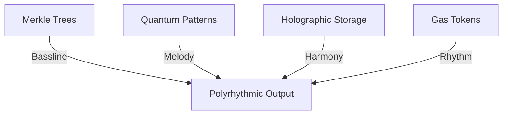

### Conductorship Model

The dual token system provides dynamic musical direction:

- **Glass Beads (GLASS)**
  - Act as frozen musical phrases
  - Each bead encodes a complete musical statement
  - Can be combined into larger compositions
  - Provide structural framework for compositions

- **Gas Tokens (GBT)**
  - Function as tempo control mechanism
  - Token velocity affects musical timing
  - Flow rates modulate rhythmic intensity
  - Dynamic economic activity shapes performance

- **Natal Bead**
  - Serves as personal leitmotif
  - Provides thematic foundation
  - Recurs throughout compositions
  - Anchors musical identity

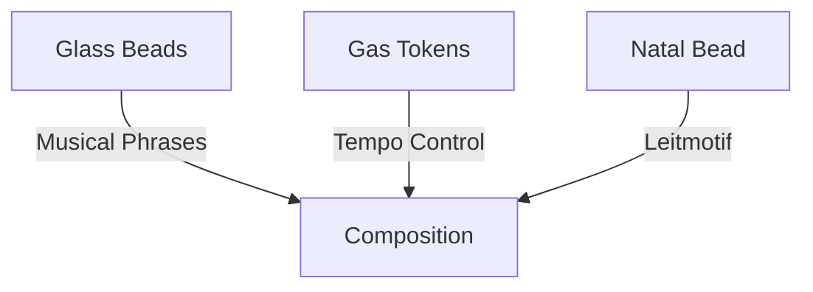

### Generative Counterpoint

The LLM-driven counterpoint system creates complex musical interactions:

- **Fugal Development**
  - Core motifs derived from Glass Bead patterns
  - Subject/answer relationships mapped to conceptual oppositions
  - Stretto passages emerge from temporal compression
  - Augmentation/diminution based on quantum state probabilities

- **Thematic Remixing**
  - Algorithmic recombination of symbolic elements
  - Cultural context preservation during transformation
  - Dynamic balance between novelty and recognition
  - Lens-mediated interpretation shifts

- **Privacy Filtering**
  - Phase cancellation patterns mask sensitive data
  - Selective audio masking through destructive interference
  - Maintains musical coherence while obscuring content
  - Context-aware privacy threshold adaptation

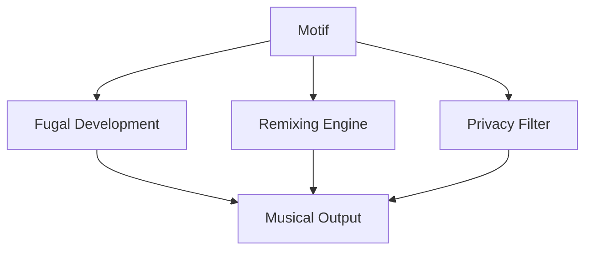

### Dynamic Notation System

The system generates real-time musical notation that reflects the evolving state:

- **Merkle Score Generation**
  - Tree growth patterns map to staff notation
  - Branch depth determines note duration
  - Hash patterns generate accidentals
  - Node relationships create phrase markings

- **Token Velocity Visualization**
  - Gas flow rates control dynamic markings (p, f, etc.)
  - Transaction volume maps to articulation
  - Token velocity gradients create crescendos/diminuendos
  - Economic activity patterns generate expression marks

- **Vector Space Notation**
  - Spatial audio positioning reflected in score
  - Vector relationships determine staff placement
  - Angular relationships map to voice leading
  - Distance metrics control orchestration density

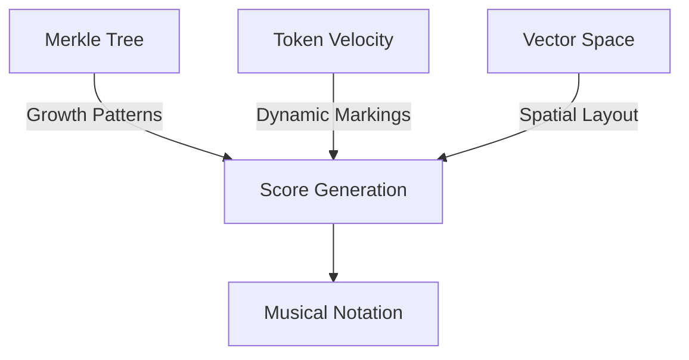

### Real-time Performance Architecture

The system employs a multi-threaded performance engine to coordinate musical elements:

```rust
struct PerformanceEngine {
    audio_thread: AudioThread,
    pattern_thread: PatternThread,
    sync_controller: SyncController,
    
    // Performance parameters
    buffer_size: usize,        // Typically 256-1024 samples
    sample_rate: u32,         // 48kHz standard
    max_latency: Duration,    // Target <10ms
}

impl PerformanceEngine {
    fn process_frame(&mut self) -> AudioFrame {
        // Get next pattern updates
        let patterns = self.pattern_thread.get_next_patterns();
        
        // Synchronize with current time state
        let sync_data = self.sync_controller.get_sync_data();
        
        // Generate audio
        self.audio_thread.render_frame(patterns, sync_data)
    }
    
    fn handle_timing_drift(&mut self) {
        // Monitor and correct timing drift between threads
        let drift = self.measure_drift();
        if drift > self.max_latency {
            self.resync_threads();
        }
    }
}
```

- **Thread Architecture**
  - Audio thread: Real-time sample generation
  - Pattern thread: Musical pattern processing
  - Sync thread: Cross-component timing
  - Control thread: Parameter updates

- **Synchronization Methods**
  - Lock-free ring buffers for audio
  - Atomic operations for control
  - Wait-free synchronization
  - Adaptive buffer sizing

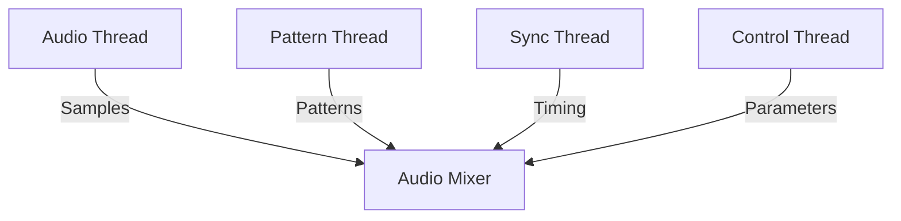

### Resonance Preservation System

The system employs specialized mechanisms to maintain harmonic integrity:

- **Harmonic Distortion Prevention**
  - Adaptive filter chains for multi-lens analysis
  - Real-time harmonic correction using FFT analysis
  - Dynamic threshold adjustment for overtone preservation
  - Cross-lens interference cancellation

```rust
struct ResonanceController {
    harmonic_filters: Vec<AdaptiveFilter>,
    temporal_sync: TemporalCoherenceEngine,
    echo_dampener: CollaborativeDampener,
    
    // Configurable thresholds
    max_harmonic_distortion: f32,    // max 0.5% THD
    min_temporal_coherence: f32,     // min 0.95
    echo_reduction_factor: f32,      // -40dB target
}

impl ResonanceController {
    fn process_multi_lens(&self, signal: AudioSignal) -> AudioSignal {
        let filtered = self.harmonic_filters.iter()
            .fold(signal, |acc, filter| filter.process(acc));
        self.temporal_sync.align(filtered)
    }
    
    fn dampen_collaborative_echo(&self, spaces: Vec<AudioSpace>) {
        for space in spaces {
            self.echo_dampener.apply(space);
        }
    }
}
```

- **Temporal Coherence Maintenance**
  - Phase-locked loop synchronization
  - Distributed timestamp reconciliation
  - Latency compensation algorithms
  - State-aware tempo adjustment

- **Echo Management**
  - Adaptive echo cancellation in shared spaces
  - Selective frequency dampening
  - Spatial audio positioning
  - Collaborative feedback suppression

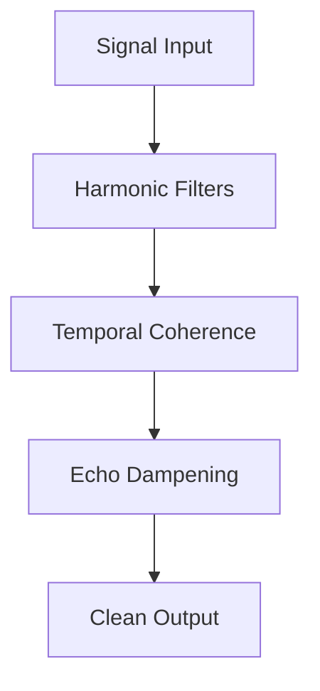

### Quantum Annealing for Rhythmic Alignment

The system uses quantum annealing to resolve timing conflicts between T0-T2 processing tiers:

- **Processing Tier Synchronization**
  - T0 (real-time): User interaction events
  - T1 (near-time): Pattern recognition and initial synthesis
  - T2 (batch): Deep analysis and complex generation

```rust
struct QuantumRhythmAligner {
    annealing_schedule: Vec<f64>,
    tier_latencies: [Duration; 3],
    quantum_states: Vec<QubitState>,
    
    // Configurable parameters
    coherence_threshold: f64,    // min 0.98
    max_sync_delay: Duration,    // max 50ms
    energy_penalty: f64,         // scales with latency
}

impl QuantumRhythmAligner {
    fn align_processing_tiers(&mut self, events: Vec<MusicalEvent>) -> Vec<MusicalEvent> {
        let hamiltonian = self.construct_timing_hamiltonian(events);
        let aligned_states = self.anneal(hamiltonian);
        self.reconstruct_timeline(aligned_states)
    }

    fn construct_timing_hamiltonian(&self, events: Vec<MusicalEvent>) -> Hamiltonian {
        // Maps timing conflicts to quantum energy states
        // Higher energy states represent greater misalignment
    }
}
```

- **Annealing Benefits**
  - Finds optimal timing alignment across tiers
  - Preserves musical intent while reducing latency
  - Handles complex polyrhythmic structures
  - Adapts to varying processing loads

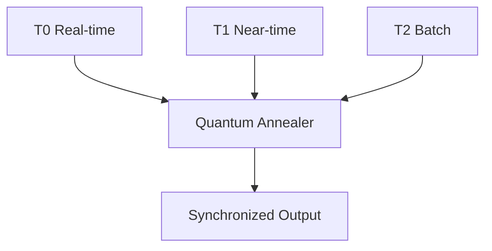

### Dynamic Range Preservation

The system employs non-linear gas pricing to preserve musical dynamics:

- **Adaptive Gas Pricing**
  - Logarithmic cost scaling for amplitude changes
  - Higher costs for extreme dynamics (pp, ff)
  - Lower costs for subtle variations (mp, mf)
  - Preserves natural dynamic contours

```rust
struct DynamicRangeController {
    compression_ratio: f32,      // Typically 1.5-3.0
    threshold: f32,             // -24dB to -12dB
    attack_time: Duration,      // 5-50ms
    release_time: Duration,     // 50-500ms
    
    fn calculate_gas_cost(&self, amplitude_change: f32) -> u64 {
        let base_cost = 21000;  // Minimum gas cost
        let dynamic_multiplier = (amplitude_change.abs() / self.threshold)
            .powf(self.compression_ratio);
        (base_cost as f32 * dynamic_multiplier) as u64
    }
}
```

- **Nuance Preservation**
  - Micro-dynamics preserved through granular pricing
  - Emotional expressivity maintained
  - Natural crescendos/diminuendos
  - Authentic performance characteristics

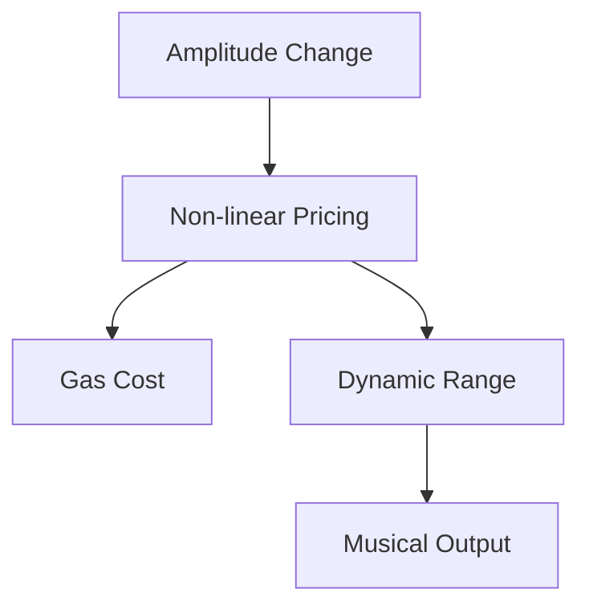

### Overton Window Tuning

The holographic storage system employs harmonic series indexing for optimized pattern retrieval:

- **Harmonic Series Indexing**
  - Maps storage locations to musical overtone series
  - Fundamental frequencies serve as primary indices
  - Overtones provide natural subdivision scheme
  - Enables resonant pattern matching

```rust
struct HarmonicIndex {
    fundamental: f32,           // Base frequency for index
    overtone_depth: u8,        // Number of harmonics to index
    bandwidth: f32,            // Frequency range per harmonic
    resonance_threshold: f32,  // Min resonance for match
}

impl HarmonicIndex {
    fn index_pattern(&self, pattern: &MusicPattern) -> Vec<FrequencyBin> {
        let mut bins = Vec::new();
        for n in 1..=self.overtone_depth {
            let freq = self.fundamental * n as f32;
            let resonance = pattern.resonance_at(freq);
            if resonance >= self.resonance_threshold {
                bins.push(FrequencyBin::new(freq, resonance));
            }
        }
        bins
    }
}
```

- **Retrieval Benefits**
  - O(log n) pattern matching via harmonic alignment
  - Natural clustering of related musical patterns
  - Frequency-domain parallelization
  - Resonant amplification of matching patterns

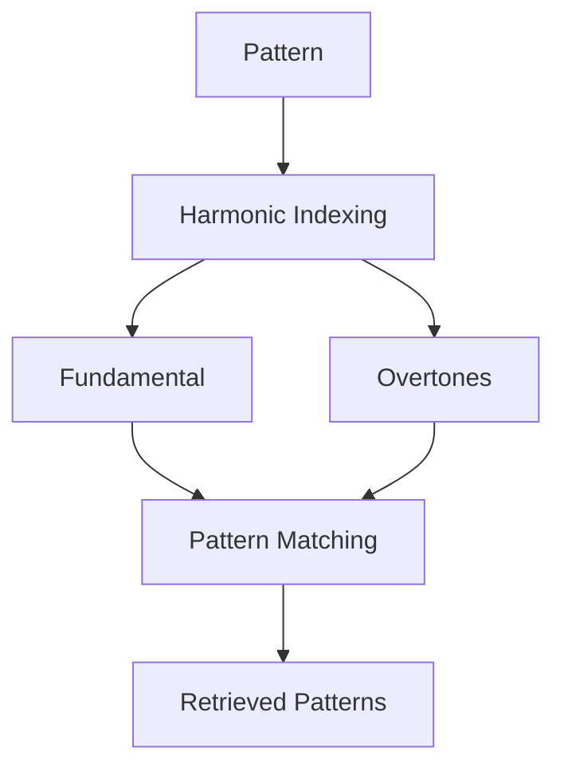

### Conductor View Visualization

The system provides a real-time energy flow visualization that makes the machine's musical operations legible:

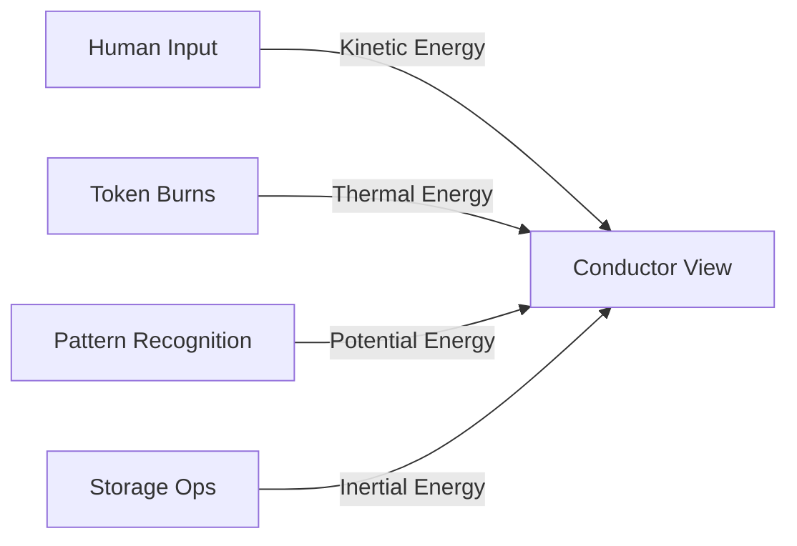

- **Energy Transfer Mapping**
  - Kinetic (Human Input): Gestural intensity → amplitude/velocity
  - Thermal (Token Burns): Gas consumption → harmonic density
  - Potential (Pattern Recognition): Match confidence → melodic complexity
  - Inertial (Storage): Operation size → rhythmic weight

```rust
struct ConductorView {
    kinetic_tracker: GestureEnergyMonitor,
    thermal_monitor: TokenBurnAnalyzer,
    potential_gauge: PatternEnergyMeter,
    inertial_sensor: StorageOperationMonitor,
}

impl ConductorView {
    fn update_energy_flows(&mut self) -> EnergyState {
        EnergyState {
            kinetic: self.kinetic_tracker.measure_gestural_intensity(),
            thermal: self.thermal_monitor.calculate_burn_rate(),
            potential: self.potential_gauge.assess_pattern_energy(),
            inertial: self.inertial_sensor.measure_storage_momentum()
        }
    }

    fn map_to_musical_parameters(&self, state: EnergyState) -> MusicalExpression {
        MusicalExpression {
            amplitude: state.kinetic.to_velocity_curve(),
            harmonics: state.thermal.to_density_mapping(),
            melody: state.potential.to_complexity_scale(),
            rhythm: state.inertial.to_weight_pattern()
        }
    }
}
```

- **Visual Representation**
  - Energy flows shown as animated force-directed graph
  - Node size indicates energy magnitude
  - Edge thickness shows transfer rate
  - Color mapping for energy types
  - Real-time parameter visualization

### Book Output Integration

The music generation system integrates with Books through specialized output streams:

```rust
struct MusicBookOutput {
    narrative_layer: AudioNarrative,
    machine_layer: MachineAudioData,
    bridge_layer: AudioBridgeLayer,
    
    fn generate_for_book(&self, book: &Book) -> BookAudioContent {
        let narrative = self.narrative_layer.generate(book.narrative);
        let machine_data = self.machine_layer.generate(book.machine_data);
        let bridge = self.bridge_layer.link(narrative, machine_data);
        
        BookAudioContent {
            audio: AudioLayers {
                narrative,
                machine_data,
                bridge
            },
            metadata: self.generate_metadata(book),
            temporal_markers: self.mark_time_states(book.time_states)
        }
    }
}

struct AudioBridgeLayer {
    fn link(
        &self,
        narrative: AudioNarrative,
        machine_data: MachineAudioData
    ) -> BridgeLayer {
        BridgeLayer {
            // Map narrative audio to machine data
            concept_markers: self.mark_concepts(narrative),
            data_anchors: self.anchor_machine_data(machine_data),
            sync_points: self.generate_sync_points(narrative, machine_data),
            
            // Integration with Book structure
            text_positions: self.map_text_positions(),
            visual_cues: self.map_visual_elements(),
            time_markers: self.map_time_states()
        }
    }
}
```

### Output Stream Types

1. **Narrative Audio Layer**
   - Human-interpretable musical expressions
   - Cultural context adaptations
   - Emotional/thematic elements
   - Synchronized with text narrative

2. **Machine Audio Layer**
   - Structured audio data
   - Pattern-based generation
   - MST-compliant encoding
   - RAG system integration

3. **Bridge Audio Layer**
   - Audio-text synchronization
   - Visual element timing
   - Temporal state markers
   - Interactive navigation cues

### Version Control and Branching

The music system implements version control and branching similar to the Book system:

```rust
struct MusicVersion {
    // Core version metadata
    version: u32,
    timestamp: DateTime<Utc>,
    author: AuthorId,
    description: String,
    parent_version: Option<u32>,
    
    // Music-specific version data
    active_lenses: Vec<Lens>,
    focus_parameters: FocusParams,
    temporal_context: TimeState,
    
    // Content tracking
    interference_changes: Vec<WaveChange>,
    hologram_changes: Vec<HologramChange>, 
    symbolic_changes: Vec<SymbolicChange>,
    
    // Attribution
    content_attribution: Attribution,
    permission_state: Permissions
}

impl MusicVersion {
    fn track_changes(&mut self, music: &Music) {
        // Record changes to interference patterns
        self.interference_changes = self.diff_interference(music);
        
        // Track holographic reconstruction changes
        self.hologram_changes = self.diff_hologram(music);
        
        // Monitor symbolic synthesis changes
        self.symbolic_changes = self.diff_symbolic(music);
        
        // Update metadata
        self.timestamp = Utc::now();
    }
}
```

#### Branching System

Music compositions can be branched for:

1. **Development Branches**
   - Iterative refinement of patterns
   - Experimental variations
   - Performance optimization

2. **Interpretation Branches** 
   - Alternative musical expressions
   - Different cultural adaptations
   - Varied emotional emphasis

3. **Application Branches**
   - Context-specific arrangements
   - Platform-optimized versions
   - Performance variations

4. **Collaborative Branches**
   - Multi-user compositions
   - Shared musical development
   - Combined interpretations

#### Fork Management

Musicians can fork existing compositions to:
- Create independent variations
- Develop personal interpretations
- Customize for specific uses
- Maintain separate ownership

Fork features:
- Maintains reference to original composition
- Independent version history
- Separate access controls
- Optional merge capability

### Music Storage Architecture

The system employs a specialized storage architecture optimized for audio data and musical metadata:

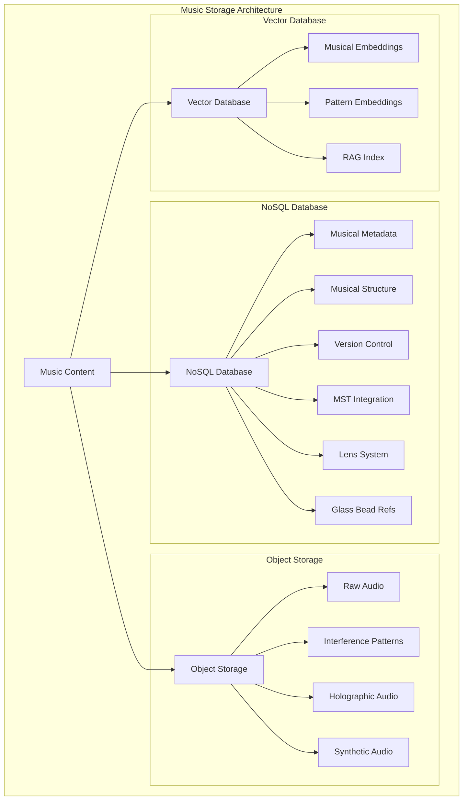

```rust
struct MusicStorageSystem {
    // Core storage components
    metadata_db: NoSQLDatabase,
    object_store: ObjectStorage,
    vector_store: VectorDatabase,
    
    // Add book storage integration
    book_storage: BookStorage,
    layer_index: LayerIndex,
    temporal_markers: TimeMarkers,
    
    fn store_book_audio(&self, content: BookAudioContent) -> StorageResult {
        // Store metadata with book links
        let metadata_id = self.metadata_db.store(MusicMetadata {
            book_id: content.book_id,
            layers: content.audio.get_layer_metadata(),
            integration: content.integration.get_metadata(),
            temporal_markers: content.get_time_markers(),
            version: content.version,
            // Add book reference
            book_ref: self.book_storage.get_ref(content.book_id),
        });

        // Store audio objects as before
        let object_refs = self.object_store.store_audio(AudioStorage {
            raw_audio: content.audio.compress(AudioCodec::Opus),
            patterns: content.audio.patterns.optimize(),
            holographic: content.audio.holographic.compress(),
            synthetic: content.audio.synthetic.optimize(),
        });

        // Store embeddings with book context
        let embeddings = self.vector_store.store(VectorData {
            musical_features: self.extract_musical_features(&content),
            pattern_vectors: self.encode_patterns(&content),
            rag_indices: self.generate_rag_index(&content),
            // Add book embeddings
            book_context: self.book_storage.get_embeddings(content.book_id),
        });

        // Create book integration links
        self.layer_index.link_layers(metadata_id, content.book_id);
        self.temporal_markers.link_markers(metadata_id, content.book_id);

        StorageResult {
            metadata_id,
            object_refs,
            embeddings,
            book_ref: content.book_id,
        }
    }
}

// Storage configuration with concrete parameters
struct StorageConfig {
    // Audio compression settings
    compression: AudioCompression {
        codec: AudioCodec::Opus,
        bitrate: 192_000, // bits/sec
        channels: 2,
        sample_rate: 48_000,
    },

    // Vector embedding dimensions
    embedding_dims: EmbeddingDims {
        musical: 1024,
        pattern: 512,
        rag: 768,
    },

    // Storage tiers with costs
    storage_tiers: StorageTiers {
        hot: StorageTier {
            type_: StorageType::SSD,
            cost_per_gb: 0.12, // GBT/GB/month
            max_size: 100_000, // MB
        },
        warm: StorageTier {
            type_: StorageType::HDD,
            cost_per_gb: 0.03,
            max_size: 1_000_000,
        },
        cold: StorageTier {
            type_: StorageType::Archive,
            cost_per_gb: 0.01,
            max_size: 10_000_000,
        },
    },
}
```

### Musical Parameter Mapping

The system maps conceptual elements to musical parameters through a comprehensive translation framework that ensures meaningful and consistent sonification of system concepts. This mapping system serves several critical purposes:

1. **Semantic Preservation**
   - Maintains conceptual meaning when translating to music
   - Ensures consistent musical representation of system elements
   - Preserves symbolic relationships in audio form

2. **Cognitive Accessibility**
   - Makes complex system relationships audible and intuitive
   - Enables pattern recognition through musical structures
   - Supports multi-modal understanding of concepts

3. **Cultural Integration**
   - Respects traditional musical-conceptual correspondences
   - Adapts to different cultural musical frameworks
   - Maintains MST compliance across musical expressions

The mapping system operates through four interconnected layers:

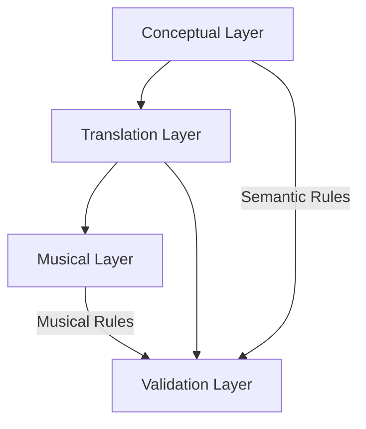

This architecture ensures that:
- Each conceptual element has a clear musical representation
- Relationships between concepts are preserved in musical form
- Musical output remains coherent and culturally relevant
- System state changes are meaningfully expressed in sound

#### Astrological Element Mapping

```rust
struct AstrologicalMusicMapping {
    // Planet -> Pitch/Harmony mappings
    planet_mappings: HashMap<Planet, PitchMapping>,
    // Sign -> Scale/Mode mappings 
    sign_mappings: HashMap<Sign, ScaleMapping>,
    // House -> Rhythm mappings
    house_mappings: HashMap<House, RhythmPattern>,
    // Aspect -> Harmonic Interval mappings
    aspect_mappings: HashMap<Aspect, HarmonicInterval>,

    fn map_natal_chart(&self, chart: &NatalChart) -> MusicParameters {
        MusicParameters {
            base_key: self.derive_key_from_planets(&chart.planets),
            modal_structure: self.derive_mode_from_signs(&chart.signs),
            rhythm_patterns: self.derive_rhythms_from_houses(&chart.houses),
            harmonic_progressions: self.derive_harmonies_from_aspects(&chart.aspects)
        }
    }
}

struct PitchMapping {
    fundamental: f32,      // Base frequency
    harmonic_series: Vec<f32>,  // Overtone structure
    modulation_range: Range<f32> // Allowable pitch variation
}

struct ScaleMapping {
    intervals: Vec<Interval>,  // Scale structure
    characteristic_motifs: Vec<Motif>,
    modulation_patterns: Vec<ModulationPath>
}
```

#### Prototype Element Mapping

```rust
struct PrototypeMusicMapping {
    // Core mappings
    archetype_timbres: HashMap<Archetype, TimbreProfile>,
    weight_dynamics: HashMap<f32, DynamicLevel>,
    focus_structure: HashMap<FocusSpace, MusicalForm>,
    
    fn map_prototype(&self, prototype: &Prototype) -> MusicParameters {
        MusicParameters {
            timbre: self.map_archetype_timbre(&prototype.archetype),
            dynamics: self.map_weight_dynamics(&prototype.weights),
            form: self.map_focus_structure(&prototype.focus_space)
        }
    }

    fn map_archetype_timbre(&self, archetype: &Archetype) -> TimbreProfile {
        // Map archetypal qualities to synthesis parameters
        TimbreProfile {
            waveform: self.derive_waveform(archetype),
            filter_envelope: self.derive_envelope(archetype),
            modulation: self.derive_modulation(archetype)
        }
    }
}

struct TimbreProfile {
    waveform: WaveformType,
    filter_envelope: EnvelopeParams,
    modulation: ModulationParams
}
```

#### Lens System Mapping

```rust
struct LensMusicMapping {
    // Cultural lens -> Musical style mappings
    cultural_styles: HashMap<CulturalLens, StyleParameters>,
    // Temporal lens -> Time signature/tempo mappings
    temporal_patterns: HashMap<TemporalLens, TimeParameters>,
    // Conceptual lens -> Harmonic framework mappings
    conceptual_harmonies: HashMap<ConceptualLens, HarmonicFramework>,
    
    fn apply_lens(&self, music: &mut Music, lens: &Lens) {
        match lens {
            Lens::Cultural(cl) => self.apply_cultural_style(music, cl),
            Lens::Temporal(tl) => self.apply_temporal_pattern(music, tl),
            Lens::Conceptual(cl) => self.apply_conceptual_harmony(music, cl)
        }
    }
}

struct StyleParameters {
    scale_system: ScaleSystem,
    rhythmic_patterns: Vec<RhythmPattern>,
    instrumentation: Vec<Instrument>
}
```

#### Book Structure Mapping

```rust
struct BookMusicMapping {
    // Chapter -> Movement mappings
    chapter_forms: HashMap<ChapterType, MovementForm>,
    // Section -> Musical section mappings
    section_structures: HashMap<SectionType, SectionForm>,
    // Focus space -> Development mappings
    focus_developments: HashMap<FocusSpace, DevelopmentPattern>,
    
    fn map_book_structure(&self, book: &Book) -> MusicalForm {
        MusicalForm {
            movements: self.map_chapters(&book.chapters),
            sections: self.map_sections(&book.sections),
            development: self.map_focus_spaces(&book.focus_spaces)
        }
    }
}

struct MovementForm {
    structure: FormStructure,
    thematic_material: Vec<Theme>,
    development_patterns: Vec<DevelopmentPattern>
}
```

#### Mapping Rules

1. **Pitch/Harmony**
   - Planets map to specific pitches based on traditional correspondences
   - Signs determine scale/mode selection
   - Aspects create harmonic intervals and progressions
   - House positions influence octave placement

2. **Rhythm/Tempo**
   - Houses generate foundational rhythmic patterns
   - Angular houses create strong rhythmic emphasis
   - Temporal states modulate tempo
   - Aspect patterns influence rhythmic complexity

3. **Timbre/Instrumentation**
   - Archetypes determine basic timbral qualities
   - Elements (fire, earth, etc.) influence spectral content
   - Lenses modify orchestration choices
   - Dignity states affect timbral complexity

4. **Dynamics/Expression**
   - Prototype weights control dynamic levels
   - Aspect strengths influence expressive intensity
   - Lens combinations shape articulation
   - Focus space position affects dynamic range

5. **Structure/Form**
   - Book chapters map to major movements
   - Sections determine musical segments
   - Focus spaces shape development patterns
   - Lens transitions create formal boundaries

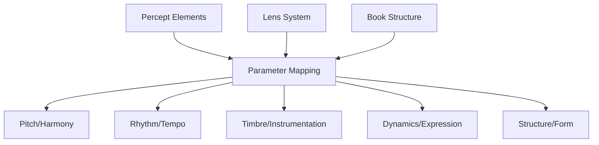

