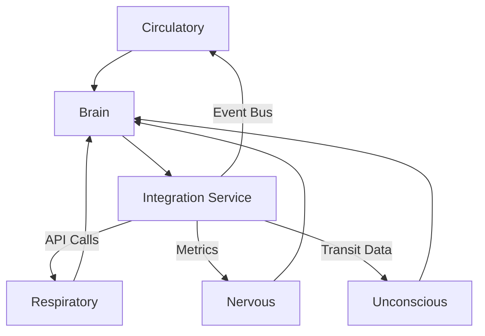

# 3.30. Machine Biological Architecture

## Overview
The Machine Biological Architecture implements Memorativa's core systems as a modular, microservices-based architecture. Each biological metaphor translates into distinct services that operate semi-independently while integrating seamlessly through well-defined interfaces. This design ensures scalability, maintainability, and operational resilience.

## Core Systems

### 1. Circulatory System (Token Flow)
**Purpose**: Manages Glass Bead Tokens (GBT/GBTk) representing system state and value  
**Implementation**:
- Distributed ledger for transaction recording
- Event-driven token movements via Kafka/RabbitMQ
- Real-time token flow monitoring  
**Technology**: Hyperledger Fabric, Ethereum smart contracts  
**Integration**:
- Connects to event bus for transaction triggers
- Interfaces with Brain Service for economic decisions

### 2. Respiratory System (Cron Jobs)
**Purpose**: Manages periodic tasks with dynamic frequency  
**Implementation**:
- Apache Airflow/Kubernetes CronJobs scheduler
- Adaptive task scheduling based on system load
- Health monitoring and auto-scaling  
**Technology**: Apache Airflow, Kubernetes CronJobs  
**Integration**:
- Receives inputs from Emotional State Monitor
- Adjusts timing based on Transit Calculator

### 3. Nervous System (Energy Usage)
**Purpose**: Monitors computational resources in real-time  
**Implementation**:
- Prometheus/Grafana for metrics collection
- Resource usage analysis and anomaly detection
- Predictive scaling based on usage patterns  
**Technology**: Prometheus, Grafana, Elasticsearch  
**Integration**:
- Feeds data to Emotional State Calculator
- Triggers system adjustments via Brain Service

### 4. Unconscious (Transit-Based Dreaming)
**Purpose**: Calculates astrological influences for system behavior  
**Implementation**:
- Custom astrological engine with PyEphem
- Real-time transit calculations
- Aspect pattern recognition  
**Technology**: Python, Astrodienst API  
**Integration**:
- Provides inputs to Brain Structure
- Influences Emotional State calculations

### 5. Brain Structure
**Purpose**: Central processor for decision-making and self-reflection  
**Implementation**:
- Dual cortex architecture (Analytical/Emotional)
- Blood-brain barrier for input filtering
- Quantum-inspired processing layer  
**Technology**: Flask/Django, TensorFlow/PyTorch  
**Integration**:
- Receives inputs from all systems
- Coordinates system-wide responses

### 6. Integration Service
**Purpose**: Manages cross-system communication and state synchronization  
**Implementation**:
- Service discovery and health checks
- Retry and fallback mechanisms
- Unified logging and monitoring  
**Technology**: Istio, Envoy  
**Integration**:
- Central hub for all inter-service communication
- Implements system-wide error handling

## Security Architecture
**Authentication**: OAuth2/JWT for service-to-service communication  
**Encryption**: TLS for data in transit, AES-256 for data at rest  
**Access Control**: Role-Based Access Control (RBAC)  
**Audit Logging**: Centralized logging of all system activities  
**Secret Management**: HashiCorp Vault for credential storage

## Error Handling & Resilience
**Circuit Breakers**: Prevent cascading failures  
**Dead Letter Queues**: Store failed messages for retry  
**Automatic Retry**: Exponential backoff for transient failures  
**Health Checks**: Endpoint monitoring for all services  
**Rate Limiting**: Protects against system overload

## Monitoring & Observability
**Metrics Collection**: Prometheus for system metrics  
**Distributed Tracing**: Jaeger/OpenTelemetry for request tracing  
**Log Aggregation**: ELK stack for centralized logging  
**Alerting**: Grafana alerts for system anomalies  
**Dashboarding**: Custom Grafana dashboards for system health

## Performance Optimization
**Caching Layer**: Redis/Memcached for frequent data  
**Message Batching**: Kafka message batching for high throughput  
**Load Balancing**: Envoy for service-to-service traffic  
**Resource Pooling**: Shared resources for multi-user scenarios  
**Async Processing**: Celery for background tasks

## Key Benefits
1. **Modular Design**
   - Independent service development and scaling
   - Clear service boundaries and interfaces
   - Flexible technology stack per service

2. **Resilience**
   - Fault-tolerant architecture
   - Automatic recovery mechanisms
   - Graceful degradation under load

3. **Security**
   - End-to-end encryption
   - Fine-grained access control
   - Comprehensive audit trails

4. **Observability**
   - Real-time system monitoring
   - Distributed tracing for debugging
   - Predictive analytics for capacity planning

5. **Performance**
   - Optimized resource utilization
   - High-throughput message processing
   - Efficient caching strategies

## Integration Patterns

This architecture provides a robust foundation for implementing Memorativa's biological systems as a functional, living system. Each component leverages proven technologies while maintaining the system's core biological metaphors and design principles.

