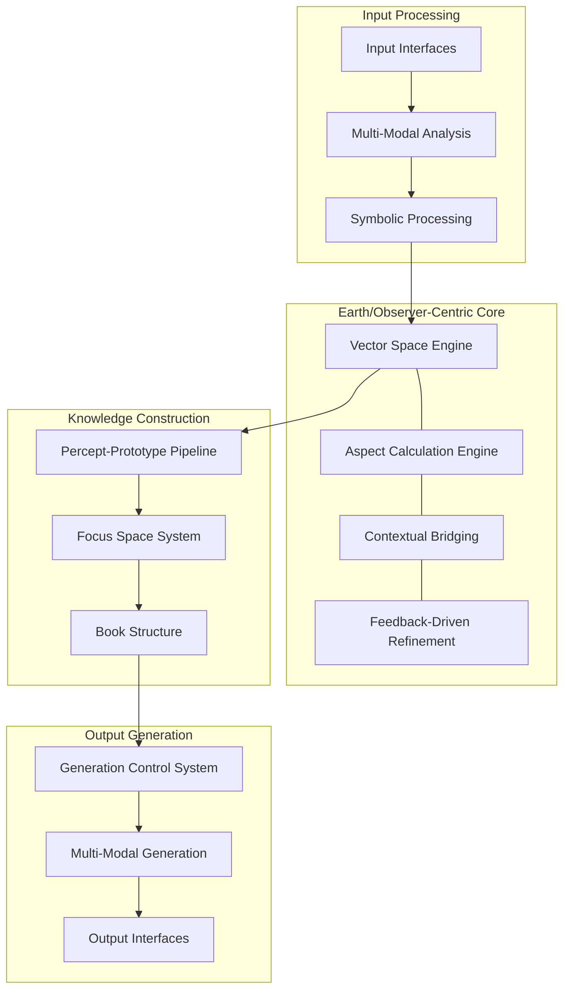
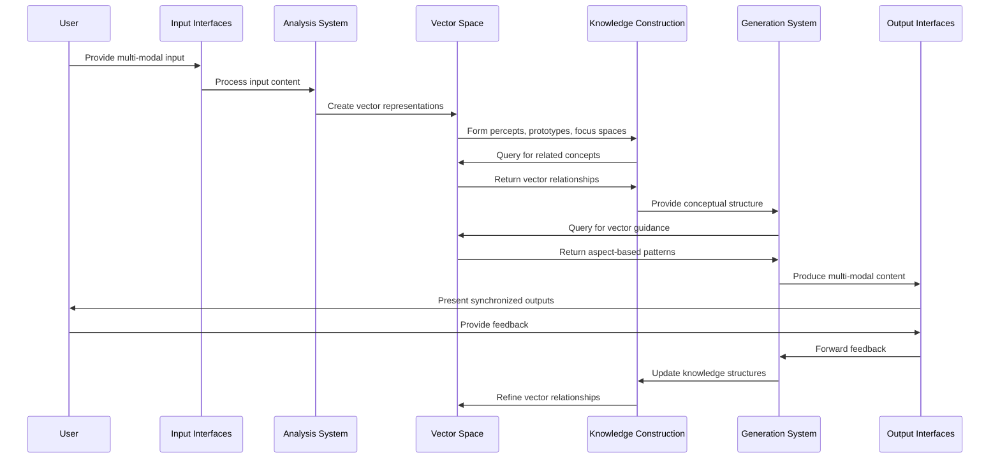
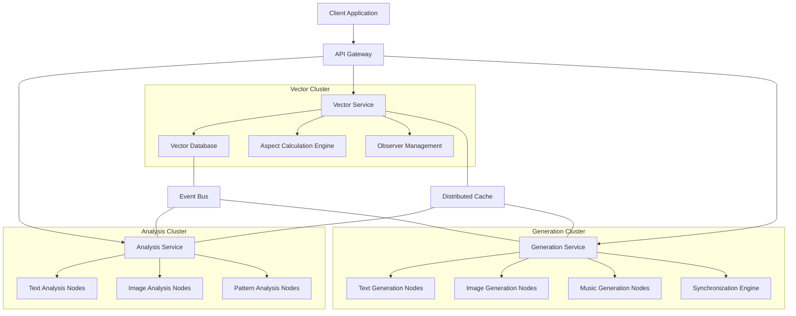

# 3.4.2. Machine System Generative AI Design

The Machine System Generative AI Design presents a unified framework that integrates the foundational architecture established in Section 3.4.0 with the multi-modal output enhancements detailed in Section 3.4.1. This comprehensive design maintains the Earth/Observer-centric perspective as its core organizing principle while enabling bidirectional information flow between input analysis and output generation across multiple modalities.

## Unified Input-Output Architecture

The integration creates a cohesive system that preserves conceptual integrity throughout the entire pipeline from perception to expression:

### Bidirectional Processing Framework



The unified architecture enables seamless flow between input analysis and output generation while maintaining the Earth/Observer-centric model throughout all operations. This bidirectional design supports both the Gathering Mode (intuitive percept collection) and Synthesis Mode (knowledge construction and expression) within a single cohesive framework.

### Core Components Integration

The system integrates components from both input and output processing to create a unified pipeline:

| Component | Input Function | Output Function | Integration Point |
|-----------|---------------|-----------------|-------------------|
| **Multi-Modal Processor** | Analyzes text/image inputs | Generates text/image/music outputs | Shared embedding space with bidirectional mapping |
| **Vector Space Engine** | Encodes percepts in 3D space | Guides generation based on spatial relationships | Observer-relative reference frame |
| **Aspect Calculator** | Identifies significant angular relationships | Translates aspects to narrative/visual/musical elements | Geocentric aspect patterns |
| **Prototype Aggregator** | Forms geocentric concept structures | Provides conceptual templates for generation | Sun/Planet triplet organization |
| **Focus Space Manager** | Organizes conceptual workspaces | Defines contextual boundaries for generation | Hybrid coordinate system |
| **Temporal Processor** | Handles different time states | Adapts generation to temporal context | State-aware processing |
| **Book Interface System** | Organizes knowledge structures | Orchestrates multi-modal output generation | Five-layer architecture |
| **Virtual Loom** | Structures knowledge relationships | Guides narrative and compositional flow | Thread intersection system |

## Enhanced Multi-Modal System

The unified design extends both analysis and generation capabilities across modalities while maintaining conceptual alignment:

### Extended Multi-Modal Processing Hub

```typescript
class UnifiedModalProcessor {
  constructor(
    private inputProcessor: MultiModalAnalyzer,
    private outputGenerator: MultiModalGenerator,
    private vectorService: VectorService,
    private observerService: ObserverService,
    private aspectCalculator: AspectCalculator
  ) {}
  
  async process(
    input: ModalInput,
    context: ProcessingContext
  ): Promise<ProcessingResult> {
    // Get observer position
    const observer = context.observerPosition || 
      await this.observerService.getCurrentObserver();
    
    // Analyze input to create percepts
    const analysisResult = await this.inputProcessor.analyze(input, {
      observer,
      mode: context.processingMode || 'gathering',
      sensitivity: context.sensitivity || 0.7,
      lensTypes: context.lensTypes || ['default']
    });
    
    // Create or retrieve vectors
    const vectors = analysisResult.percepts.map(p => p.vector);
    
    // Calculate aspects between vectors from observer perspective
    const aspects = await this.aspectCalculator.calculateAllAspects(
      vectors, observer);
    
    // Return analysis result if generation not requested
    if (!context.generateOutput) {
      return {
        percepts: analysisResult.percepts,
        vectors,
        aspects,
        observer
      };
    }
    
    // Generate output based on vectors and aspects
    const generationResult = await this.outputGenerator.generate({
      vectors,
      aspects,
      observer,
      outputTypes: context.outputTypes || ['text'],
      style: context.outputStyle,
      constraints: context.outputConstraints
    });
    
    // Return integrated result
    return {
      percepts: analysisResult.percepts,
      vectors,
      aspects,
      observer,
      generatedContent: generationResult.content,
      synchronizationMap: generationResult.synchronizationMap
    };
  }
  
  async analyzeGeneratedContent(
    content: GeneratedContent,
    options: AnalysisOptions
  ): Promise<AnalysisResult> {
    // Process generated content as input for recursive enhancement
    return this.inputProcessor.analyze(
      { content },
      {
        preserveVectors: true,
        vectorSource: content.sourceVectors,
        observer: options.observer,
        mode: 'synthesis'
      }
    );
  }
}
```

This unified processor enables seamless transitions between input analysis and output generation, supporting both one-way operations and recursive enhancement through feedback loops.

### Vector-Guided Bidirectional Mapping

The system implements sophisticated vector operations that work bidirectionally:

```typescript
class VectorSpaceEngine {
  constructor(
    private vectorStore: VectorDatabase,
    private aspectEngine: AspectEngine,
    private observerManager: ObserverManager
  ) {}
  
  async encodeToVector(
    content: any, 
    options: EncodingOptions
  ): Promise<ConceptualVector> {
    // Determine content type and apply appropriate encoder
    const contentType = this.detectContentType(content);
    const encoder = this.getEncoderForType(contentType);
    
    // Generate vector representation
    const vector = await encoder.encode(content, {
      observer: options.observer,
      dimensions: options.dimensions || 3,
      curvature: options.curvature || 0
    });
    
    return vector;
  }
  
  async generateFromVector(
    vector: ConceptualVector,
    targetType: ContentType,
    options: GenerationOptions
  ): Promise<GeneratedContent> {
    // Get generator for target content type
    const generator = this.getGeneratorForType(targetType);
    
    // Find related vectors with significant aspects
    const relatedVectors = await this.findRelatedVectors(
      vector,
      options.observer,
      options.aspectTypes || ['all'],
      options.maxResults || 10
    );
    
    // Generate content based on vector and its relationships
    return generator.generate({
      primaryVector: vector,
      relatedVectors,
      observer: options.observer,
      style: options.style,
      constraints: options.constraints
    });
  }
  
  async transformVector(
    vector: ConceptualVector,
    transformation: VectorTransformation,
    options: TransformationOptions
  ): Promise<ConceptualVector> {
    // Apply transformation based on type
    switch (transformation.type) {
      case 'rotate':
        return this.rotateVector(
          vector, 
          transformation.angles, 
          options.observer
        );
        
      case 'scale':
        return this.scaleVector(
          vector, 
          transformation.factor, 
          options.observer
        );
        
      case 'translate':
        return this.translateVector(
          vector, 
          transformation.displacement, 
          options.observer
        );
        
      case 'aspect':
        return this.moveToAspect(
          vector, 
          transformation.targetVector, 
          transformation.aspectType, 
          options.observer
        );
        
      default:
        throw new Error(`Unknown transformation type: ${transformation.type}`);
    }
  }
  
  private async moveToAspect(
    vector: ConceptualVector,
    targetVector: ConceptualVector,
    aspectType: AspectType,
    observer: Observer
  ): Promise<ConceptualVector> {
    // Get ideal angle for aspect type
    const idealAngle = this.aspectEngine.getIdealAngle(aspectType);
    
    // Calculate current angle from observer perspective
    const currentAngle = this.aspectEngine.calculateAngle(
      vector, targetVector, observer);
    
    // Calculate rotation needed
    const rotationAngle = idealAngle - currentAngle;
    
    // Rotate vector to create desired aspect
    return this.rotateVectorAroundAxis(
      vector,
      observer.position,
      targetVector,
      rotationAngle
    );
  }
}
```

This bidirectional vector engine enables both encoding of content into the vector space and generation of content from vectors, maintaining the Earth/Observer-centric perspective throughout all operations.

## Six-Tier Interface System

The unified design extends the five-tier interface system to a six-tier system that supports both input and output operations:

### Interface Tier Integration

| Tier | Input Functions | Output Functions | Integration Components |
|------|----------------|------------------|------------------------|
| **Input Interfaces** | Content capture, Initial tagging | Output configuration, Style selection | Context-aware input panels, Modal switching controls |
| **Processing Interfaces** | Vector encoding, Translation configuration | Generation parameters, Template selection | Bidirectional processing controls, Pipeline visualization |
| **Analysis Interfaces** | Pattern exploration, Relationship visualization | Content preview, Structure verification | Dual-mode viewers, Interactive editing tools |
| **Generation Interfaces** | - | Output customization, Multi-modal synchronization | Generation process controls, Modal balance adjusters |
| **Collaboration Interfaces** | Shared exploration, Co-editing | Co-generation, Review systems | Unified collaboration workspace, Role-based tools |
| **Geocentric Interfaces** | Observer positioning, Aspect visualization | Generation guidance, Relationship-driven outputs | Observer-centered workspace, Integrated chart system |

### Generation Interfaces Implementation

The new Generation Interfaces tier is implemented as follows:

```typescript
class GenerationInterfaceManager {
  constructor(
    private uiSystem: UIFramework,
    private generationService: GenerationService,
    private previewManager: PreviewManager,
    private syncController: SynchronizationController
  ) {}
  
  createGenerationInterface(
    container: HTMLElement,
    options: GenerationInterfaceOptions
  ): GenerationInterface {
    // Create container structure
    const interfaceContainer = this.uiSystem.createPanel({
      title: options.title || 'Generation Controls',
      container,
      className: 'generation-interface',
      collapsible: options.collapsible !== false,
      draggable: options.draggable !== false
    });
    
    // Create output type selection
    const outputSelector = this.createOutputTypeSelector(
      interfaceContainer,
      options.availableTypes || ['text', 'visual', 'music'],
      options.selectedTypes || ['text']
    );
    
    // Create style controls
    const styleControls = this.createStyleControls(
      interfaceContainer,
      options.stylePresets || [],
      options.initialStyle
    );
    
    // Create synchronization controls
    const syncControls = this.createSynchronizationControls(
      interfaceContainer,
      options.syncOptions
    );
    
    // Create preview area
    const previewArea = this.createPreviewArea(
      interfaceContainer,
      options.previewSize || 'medium'
    );
    
    // Create generation buttons
    const actionButtons = this.createActionButtons(
      interfaceContainer,
      options.actions || ['generate', 'cancel', 'save']
    );
    
    // Create progress indicators
    const progressDisplay = this.createProgressDisplay(
      interfaceContainer
    );
    
    // Connect event handlers
    this.connectEventHandlers(
      outputSelector,
      styleControls,
      syncControls,
      actionButtons,
      progressDisplay,
      previewArea
    );
    
    // Return interface instance
    return {
      container: interfaceContainer,
      outputSelector,
      styleControls,
      syncControls,
      previewArea,
      actionButtons,
      progressDisplay,
      
      // Interface methods
      setGenerationOptions: (newOptions) => this.updateGenerationOptions(
        interfaceContainer, newOptions
      ),
      
      startGeneration: () => this.startGeneration(
        interfaceContainer, options.contextProvider()
      ),
      
      updatePreview: (content) => this.updatePreview(
        previewArea, content
      )
    };
  }
  
  private createSynchronizationControls(
    container: HTMLElement,
    options?: SynchronizationOptions
  ): SynchronizationControls {
    const syncPanel = this.uiSystem.createPanel({
      title: 'Synchronization',
      container,
      className: 'sync-controls',
      collapsible: true
    });
    
    // Create timeline visualization
    const timeline = this.syncController.createTimelineVisualizer(
      syncPanel,
      options?.timelineOptions
    );
    
    // Create modal balance controls
    const balanceControls = this.createModalBalanceControls(
      syncPanel,
      options?.initialBalance || { text: 0.33, visual: 0.33, music: 0.33 }
    );
    
    // Create sync point markers
    const syncMarkers = this.syncController.createSyncMarkers(
      syncPanel,
      options?.initialSyncPoints || []
    );
    
    return {
      container: syncPanel,
      timeline,
      balanceControls,
      syncMarkers,
      
      setSyncPoints: (points) => this.syncController.updateSyncPoints(
        syncMarkers, points
      ),
      
      setModalBalance: (balance) => this.updateModalBalance(
        balanceControls, balance
      )
    };
  }
}
```

This Generation Interface tier complements the existing five tiers, providing specialized controls for output generation while maintaining integration with the input processing interfaces.

## Comprehensive Operational Workflow

The unified design implements a comprehensive end-to-end workflow connecting input processing to output generation:



This workflow illustrates the circular nature of the system, where input leads to knowledge construction, which drives generation, which can then be fed back into the system as new input, creating a continuous improvement loop.

### Key Integration Points

The workflow defines critical integration points that connect major subsystems:

1. **Analysis-to-Vector Bridge**: Converts diverse inputs to unified vector representations
2. **Vector-to-Knowledge Translator**: Transforms vector relationships into structured knowledge
3. **Knowledge-to-Generation Gateway**: Provides conceptual frameworks for content generation
4. **Generation-to-Output Synchronizer**: Coordinates multi-modal expression
5. **Feedback-to-Knowledge Integrator**: Refines structures based on user interaction

### Caching Strategy

The unified design implements a comprehensive caching strategy that optimizes both input and output operations:

```typescript
class UnifiedCacheManager {
  constructor(
    private vectorCache: LRUCache<string, ConceptualVector>,
    private aspectCache: LRUCache<string, AspectRelationship>,
    private perceptCache: LRUCache<string, Percept>,
    private contentCache: RedisClient,
    private cdnService: CDNService,
    private metricsService: MetricsService
  ) {}
  
  async getCachedVector(
    contentHash: string,
    observer: Observer
  ): Promise<ConceptualVector | null> {
    const cacheKey = `${contentHash}:${observer.id}`;
    const cached = this.vectorCache.get(cacheKey);
    
    if (cached) {
      this.metricsService.recordCacheHit('vector');
      return cached;
    }
    
    this.metricsService.recordCacheMiss('vector');
    return null;
  }
  
  async getCachedAspect(
    vector1Hash: string,
    vector2Hash: string,
    observer: Observer
  ): Promise<AspectRelationship | null> {
    const cacheKey = `${vector1Hash}:${vector2Hash}:${observer.id}`;
    const cached = this.aspectCache.get(cacheKey);
    
    if (cached) {
      this.metricsService.recordCacheHit('aspect');
      return cached;
    }
    
    this.metricsService.recordCacheMiss('aspect');
    return null;
  }
  
  async getCachedContent(
    vectorHashes: string[],
    outputType: string,
    options: CacheOptions
  ): Promise<GeneratedContent | null> {
    // Create deterministic key from sorted vector hashes and options
    const sortedHashes = [...vectorHashes].sort();
    const optionsHash = this.hashOptions(options);
    const cacheKey = `content:${outputType}:${sortedHashes.join(':')}:${optionsHash}`;
    
    // Try content cache first
    const cachedContent = await this.contentCache.get(cacheKey);
    if (cachedContent) {
      this.metricsService.recordCacheHit('content');
      return JSON.parse(cachedContent);
    }
    
    // For large media content, check CDN
    if (this.isMediaType(outputType) && options.checkCdn !== false) {
      const cdnContent = await this.cdnService.getContent(cacheKey);
      if (cdnContent) {
        this.metricsService.recordCacheHit('cdn');
        return cdnContent;
      }
    }
    
    this.metricsService.recordCacheMiss('content');
    return null;
  }
  
  async cacheVector(
    contentHash: string,
    observer: Observer,
    vector: ConceptualVector
  ): Promise<void> {
    const cacheKey = `${contentHash}:${observer.id}`;
    this.vectorCache.set(cacheKey, vector);
  }
  
  async cacheAspect(
    vector1Hash: string,
    vector2Hash: string,
    observer: Observer,
    aspect: AspectRelationship
  ): Promise<void> {
    const cacheKey = `${vector1Hash}:${vector2Hash}:${observer.id}`;
    this.aspectCache.set(cacheKey, aspect);
  }
  
  async cacheContent(
    vectorHashes: string[],
    outputType: string,
    options: CacheOptions,
    content: GeneratedContent
  ): Promise<void> {
    // Create deterministic key from sorted vector hashes and options
    const sortedHashes = [...vectorHashes].sort();
    const optionsHash = this.hashOptions(options);
    const cacheKey = `content:${outputType}:${sortedHashes.join(':')}:${optionsHash}`;
    
    // Get content size
    const contentSize = this.getContentSize(content);
    
    // Store in appropriate cache based on size
    if (contentSize < this.config.redisCacheMaxSize) {
      // Store in Redis for smaller content
      await this.contentCache.set(
        cacheKey,
        JSON.stringify(content),
        'EX',
        this.config.contentCacheTTL
      );
    } else {
      // Store in CDN for larger content
      await this.cdnService.storeContent(
        cacheKey,
        content,
        this.config.cdnCacheTTL
      );
    }
  }
}
```

This unified caching strategy optimizes performance across the entire pipeline, from input analysis to output generation, with specialized handling for different data types and sizes.

## Earth/Observer-Centric Mathematics

The unified design extends the mathematical foundation to support both analysis and generation operations while maintaining the Earth/Observer-centric model:

### Bidirectional Vector Transformations

For an observer located at position $\vec{o} = (\theta_o, \phi_o, r_o, \kappa_o)$, the transformation of a vector $\vec{v}$ to the observer's reference frame is given by:

$$\vec{v}' = R(\theta_o, \phi_o) \cdot (\vec{v} - \vec{o})$$

Where $R(\theta_o, \phi_o)$ is the rotation matrix:

$$
R(\theta_o, \phi_o) = \begin{pmatrix} 
\cos \theta_o \cos \phi_o & -\sin \theta_o & -\cos \theta_o \sin \phi_o \\
\sin \theta_o \cos \phi_o & \cos \theta_o & -\sin \theta_o \sin \phi_o \\
\sin \phi_o & 0 & \cos \phi_o
\end{pmatrix}
$$

For generation, we can use the inverse transformation to create vectors with specific relationships to existing ones:

$$\vec{v} = R^{-1}(\theta_o, \phi_o) \cdot \vec{v}' + \vec{o}$$

### Aspect-Driven Generation

To generate a vector $\vec{v}_2$ that forms a specific aspect $\alpha_t$ with an existing vector $\vec{v}_1$ from observer position $\vec{o}$, we use:

$$\vec{v}_2 = \vec{o} + R(\alpha_t) \cdot (\vec{v}_1 - \vec{o})$$

Where $R(\alpha_t)$ is a rotation matrix that rotates by angle $\alpha_t$ around an axis perpendicular to the plane containing $\vec{o}$ and $\vec{v}_1$.

### Cross-Modal Synchronization

For synchronizing content across modalities, we define a temporal mapping function $T$ that preserves angular relationships:

$$T(m_1, p_1, m_2) = p_2 \textrm{ such that } \angle(\vec{v}_{p_1}, \vec{o}, \vec{v}_{p_2}) = f(m_1, m_2)$$

Where $m_1$ and $m_2$ are modalities (e.g., text, visual, music), $p_1$ is a position in modality $m_1$, $p_2$ is the corresponding position in modality $m_2$, and $f$ is a function that maps modal relationships to angular relationships.

## Performance and Scaling Architecture

The unified design implements a comprehensive approach to system performance and scaling:

### Distributed Processing Architecture

The system distributes computation across specialized nodes while maintaining conceptual integrity:



This architecture enables parallel processing of different modalities while maintaining a unified vector space and observer model through the centralized Vector Service.

### Progressive Processing Strategy

The system implements a staged approach to processing complex operations:

1. **Initial Analysis**: Rapid processing of core content features
2. **Relationship Calculation**: Progressive computation of vector relationships
3. **Prototype Formation**: Incremental construction of geocentric structures
4. **Preliminary Generation**: Early content generation for immediate feedback
5. **Progressive Refinement**: Continuous improvement of generated content
6. **Cross-Modal Synchronization**: Final alignment of outputs across modalities

This staged approach ensures responsive user experiences even for complex operations, with each stage producing usable results that improve over time.

## Unified GBT Cost Structure

The generative AI design implements a comprehensive GBT cost structure that covers both input and output operations:

| Operation Category | Operation | GBT Cost | Description |
|-------------------|-----------|----------|-------------|
| **Input Processing** | Percept Creation | 5-10 GBT | Converting inputs to vector representations |
| | Multi-Modal Analysis | 12-18 GBT | Advanced text/image analysis with CLIP |
| | Symbolic Pattern Recognition | 8-15 GBT | Identifying archetypal patterns |
| | Prototype Formation | 10-20 GBT | Creating geocentric concept structures |
| | Focus Space Creation | 15-25 GBT | Establishing conceptual workspaces |
| **Vector Operations** | Vector Calculation | 2-5 GBT | Basic vector operations and transformations |
| | Aspect Calculation | 3-8 GBT | Computing angular relationships |
| | Vector Retrieval | 5-12 GBT | Finding related vectors by aspect |
| | Observer Positioning | 4-8 GBT | Adjusting the Earth/Observer reference point |
| **Temporal Operations** | Mundane State Processing | 3-6 GBT | Handling concrete timestamps |
| | Quantum State Processing | 8-15 GBT | Managing indeterminate temporal states |
| | Holographic State Processing | 10-18 GBT | Working with reference-based time |
| | State Transitions | 5-10 GBT | Converting between time states |
| **Generation Operations** | Text Generation | 15-30 GBT | Narrative text with thread guidance |
| | Visual Generation | 20-40 GBT | Images and visualizations |
| | Music Generation | 25-50 GBT | Musical compositions |
| | Multi-Modal Synchronization | 10-20 GBT | Coordinating outputs across modalities |
| **Book Operations** | Book Creation | 20-40 GBT | Establishing book structure |
| | Virtual Loom Construction | 15-30 GBT | Creating thread organization |
| | Thread-Guided Navigation | 8-15 GBT | Finding optimal paths through content |
| | Format Export | 10-30 GBT | Multi-format content export |
| **Collaborative Operations** | Shared Workspace | 5-15 GBT | Multi-user collaborative environment |
| | Real-time Synchronization | 10-20 GBT | Maintaining shared state across users |
| | Collaborative Generation | 20-40 GBT | Multi-user content creation |

Additional modifiers applied to base costs:

- **Complexity Factor**: +10-50% for high-dimensional or intricate operations
- **Speed Premium**: +25-75% for prioritized processing
- **Volume Discount**: -5% per 5 operations in a single session (max -25%)
- **Feedback Integration**: -10-20% for operations that include user feedback
- **Caching Benefit**: -30-50% for operations with high cache hit rates

This unified cost structure ensures sustainable system operation while providing clear incentives for efficient usage patterns.

## Lens System Integration

The unified design deeply integrates the Lens System into both analysis and generation processes:

### Bidirectional Lens Application

```typescript
class BidirectionalLensSystem {
  constructor(
    private lensRegistry: LensRegistry,
    private vectorService: VectorService,
    private translationSystem: SymbolicTranslationSystem
  ) {}
  
  async applyLensToInput(
    input: any,
    lens: Lens,
    options: LensApplicationOptions
  ): Promise<LensResult> {
    // Get content type and apply appropriate analyzer
    const contentType = this.detectContentType(input);
    const analyzer = this.getAnalyzerForType(contentType);
    
    // Extract base features
    const baseFeatures = await analyzer.extractFeatures(input);
    
    // Apply lens-specific interpretation
    const interpretation = await this.interpretThroughLens(
      baseFeatures,
      lens,
      options.observer
    );
    
    // Create vector representation
    const vector = await this.vectorService.createVectorFromLensInterpretation(
      interpretation,
      options.observer
    );
    
    return {
      features: baseFeatures,
      interpretation,
      vector,
      lens: lens.id,
      confidence: interpretation.confidence
    };
  }
  
  async generateThroughLens(
    vector: ConceptualVector,
    targetType: ContentType,
    lens: Lens,
    options: GenerationOptions
  ): Promise<GeneratedContent> {
    // Transform vector through lens-specific mapping
    const lensVector = await this.transformVectorThroughLens(
      vector,
      lens,
      options.observer
    );
    
    // Find related vectors through this lens
    const relatedVectors = await this.vectorService.findRelatedVectorsWithLens(
      lensVector,
      lens.id,
      options.aspectTypes || ['all'],
      options.maxResults || 10
    );
    
    // Get generator for target content type
    const generator = this.getGeneratorForType(targetType);
    
    // Generate content based on lens-specific interpretation
    return generator.generateWithLens({
      primaryVector: lensVector,
      relatedVectors,
      lens,
      observer: options.observer,
      style: options.style,
      constraints: options.constraints
    });
  }
  
  async translateBetweenLenses(
    interpretation: LensInterpretation,
    sourceLens: Lens,
    targetLens: Lens,
    options: TranslationOptions
  ): Promise<LensInterpretation> {
    // Get translation path between lenses
    const translationPath = await this.lensRegistry.findTranslationPath(
      sourceLens.id,
      targetLens.id
    );
    
    // Apply translations along path
    let currentInterpretation = interpretation;
    
    for (const step of translationPath) {
      currentInterpretation = await this.translationSystem.applyTranslation(
        currentInterpretation,
        step.sourceId,
        step.targetId,
        options
      );
    }
    
    return currentInterpretation;
  }
}
```

This bidirectional lens system enables both interpretation of inputs through specific symbolic frameworks and generation of outputs through those same frameworks, maintaining conceptual integrity throughout the process.

## Book-Centric Architecture

The unified design places the Book structure at the center of all operations, connecting input analysis with output generation:

### Five-Layer Book Integration

```typescript
class IntegratedBookSystem {
  constructor(
    private bookStore: BookRepository,
    private loomService: VirtualLoomService,
    private vectorService: VectorService,
    private generationService: MultiModalGenerationService,
    private analysisService: MultiModalAnalysisService
  ) {}
  
  async createBookFromInput(
    input: any,
    options: BookCreationOptions
  ): Promise<Book> {
    // Analyze input to create percepts
    const analysisResult = await this.analysisService.analyze(input, {
      observer: options.observer,
      mode: options.mode || 'gathering',
      lensTypes: options.lensTypes
    });
    
    // Create book structure
    const book = await this.createBookStructure(
      options.title || 'Untitled Book',
      options.description,
      options.metadata
    );
    
    // Create virtual loom
    const loom = await this.loomService.createLoom(book.id);
    
    // Generate initial threads based on analysis
    const threadStructure = await this.loomService.suggestThreadStructure(
      analysisResult.percepts,
      {
        warpCount: options.warpCount || 5,
        weftCount: options.weftCount || 7
      }
    );
    
    // Create threads
    await this.loomService.createThreads(book.id, threadStructure);
    
    // Place percepts as beads
    await this.loomService.placeBeads(
      book.id,
      analysisResult.percepts,
      options.placementStrategy || 'optimal'
    );
    
    // Update book with loom ID
    await this.bookStore.updateBook(book.id, {
      loomId: loom.id
    });
    
    return this.bookStore.getBook(book.id);
  }
  
  async generateBookContent(
    bookId: string,
    options: ContentGenerationOptions
  ): Promise<GenerationResult> {
    // Get book with loom and percepts
    const book = await this.bookStore.getBookWithLoomAndPercepts(bookId);
    
    // Find optimal path through loom
    const path = await this.loomService.findOptimalPath(
      book.loomId,
      options.startIntersection,
      options.endIntersection,
      {
        coherence: options.pathCoherence || 0.6,
        significance: options.pathSignificance || 0.3,
        brevity: options.pathBrevity || 0.1
      }
    );
    
    // Generate content along path
    const contentResult = await this.generationService.generateMultiModal({
      book,
      path,
      outputTypes: options.outputTypes || ['text'],
      style: options.style,
      observer: options.observer,
      temporalState: options.temporalState || 'mundane'
    });
    
    // Create five-layer representation
    const fiveLayerContent = await this.createFiveLayerContent(
      book,
      contentResult,
      options
    );
    
    // Store generated content
    await this.bookStore.storeGeneratedContent(
      bookId,
      fiveLayerContent
    );
    
    return {
      bookId,
      contentId: fiveLayerContent.id,
      outputTypes: contentResult.outputTypes,
      previewUrls: this.generatePreviewUrls(fiveLayerContent),
      generationStats: contentResult.stats
    };
  }
  
  private async createFiveLayerContent(
    book: Book,
    contentResult: MultiModalContent,
    options: ContentGenerationOptions
  ): Promise<FiveLayerContent> {
    return {
      id: uuidv4(),
      bookId: book.id,
      humanLayer: this.createHumanLayer(contentResult, options),
      machineLayer: this.createMachineLayer(contentResult, book),
      bridgeLayer: this.createBridgeLayer(contentResult, book),
      beadLayer: this.createBeadLayer(contentResult, book),
      loomLayer: this.createLoomLayer(contentResult, book),
      metadata: {
        generated: new Date(),
        outputTypes: contentResult.outputTypes,
        temporalState: options.temporalState || 'mundane',
        pathId: contentResult.pathId,
        observer: options.observer.id
      }
    };
  }
}
```

This Book-centric architecture ensures that all analysis and generation operations maintain conceptual alignment through the structured knowledge representation of the Book system.

## Implementation Integration Points

The unified design identifies critical integration points between major subsystems:

### Cross-Subsystem Interfaces

| Interface | Source Component | Target Component | Data Flow | Integration Type |
|-----------|------------------|------------------|-----------|------------------|
| `IVectorProvider` | Vector Service | Generator Service | Provides vectors for content generation | Synchronous API |
| `IAspectCalculator` | Aspect Engine | All Components | Calculates angular relationships | Shared Service |
| `IObserverManager` | Observer Service | All Components | Manages observer positioning | Global Context |
| `ILensTranslator` | Lens System | Generation Service | Translates vectors through symbolic lenses | Transform Service |
| `ILoomNavigator` | Virtual Loom | Content Generator | Provides paths through knowledge structure | Navigation Service |
| `ITemporalProcessor` | Time State Manager | Generator Service | Adapts generation to temporal context | Context Provider |
| `ISynchronizer` | Sync Engine | Multi-Modal Generator | Coordinates outputs across modalities | Event Coordinator |
| `IFeedbackIntegrator` | User Feedback System | All Components | Routes user feedback to appropriate systems | Event Bus |

### Event-Driven Communication

The system implements an event-driven architecture for asynchronous communication between components:

```typescript
class EventBusIntegration {
  constructor(
    private eventBus: EventBus,
    private vectorService: VectorService,
    private generationService: GenerationService,
    private analysisService: AnalysisService,
    private loomService: VirtualLoomService,
    private feedbackService: FeedbackService
  ) {}
  
  initialize(): void {
    // Register vector events
    this.eventBus.subscribe('vector.created', this.handleVectorCreated.bind(this));
    this.eventBus.subscribe('vector.updated', this.handleVectorUpdated.bind(this));
    this.eventBus.subscribe('vector.deleted', this.handleVectorDeleted.bind(this));
    
    // Register analysis events
    this.eventBus.subscribe('analysis.completed', this.handleAnalysisComplete
