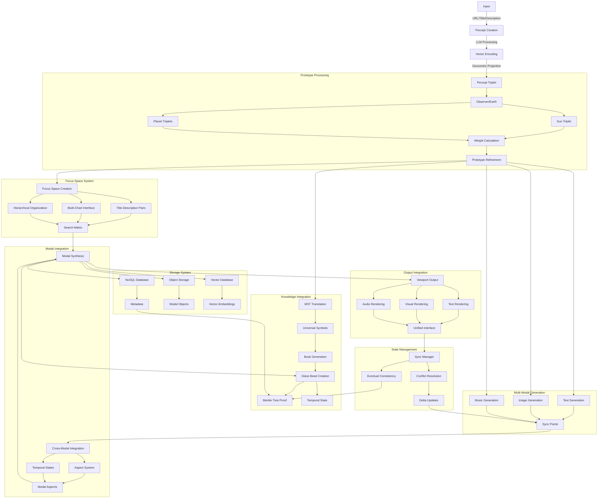
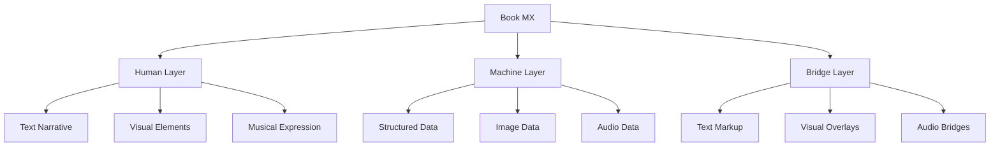
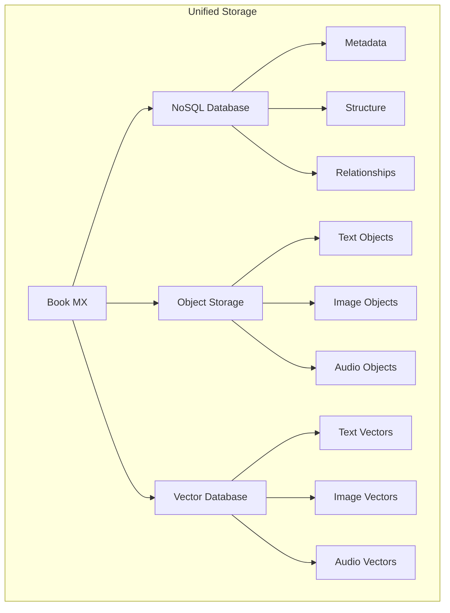

# 3.4. Enhanced Books

The enhanced Books design accounts for an updated Books Machine Experience (MX). The enhanced book design extends Memorativa's core Book architecture to create a unified, multi-modal system that seamlessly integrates text, visual, and musical outputs. Building on the established three-layer architecture (Human, Machine, and Bridge layers), Books MX enables rich cross-modal experiences while maintaining the fundamental principles of percept-triplet encoding, temporal states, and MST (Memorativa Symbolic Translator) compliance.

This design addresses several key challenges:
- Synchronizing multiple output modes (text, images, music) while preserving semantic relationships
- Implementing cross-modal aspects that create meaningful resonance between different content types
- Extending temporal state handling (Mundane, Quantum, Holographic) across all output modes
- Maintaining MST compliance and symbolic coherence across modalities
- Scaling performance and storage efficiently for multi-modal content

The result is a comprehensive system that transforms Books from pure text-and-image repositories into rich, interactive experiences that engage multiple senses while preserving the core functionality of knowledge organization and retrieval.

## Flow recap

The enhanced Books system extends the processing pipeline by adding multi-modal integration and synchronization layers:



This technical flow enables:
- Percept to prototype processing
- Focus space integration
- Parallel modal generation
- Cross-modal synchronization
- Temporal state integration
- Knowledge synthesis and persistence
- Unified viewport rendering
- State consistency through Merkle proofs
- Efficient multi-modal storage
- Eventual consistency across the system

## Core Architecture

The enhanced Books design maintains the fundamental three-layer architecture while extending it to handle all output types:



### Layer Integration

1. **Human Layer**
   - Narrative text with embedded visualizations
   - Interactive charts and diagrams
   - Musical accompaniment and sonification
   - Synchronized multi-modal presentation

2. **Machine Layer**
   - Vector-encoded structured data
   - Image generation parameters
   - Musical pattern data
   - Cross-modal relationship mappings

3. **Bridge Layer**
   - Unified markup system
   - Visual overlay system
   - Audio synchronization
   - Modal interaction handlers

## Output Integration

### Text-Image-Music Synchronization

```rust
struct IntegratedOutput {
    text: TextContent,
    images: Vec<ImageContent>,
    music: MusicContent,
    sync_points: Vec<SyncPoint>,
    temporal_states: Vec<TemporalState>,
    
    fn render_viewport(&self, viewport: ViewportState) -> ViewportContent {
        let text = self.text.get_viewport_text(viewport);
        let visuals = self.determine_relevant_visuals(viewport);
        let audio = self.get_synchronized_audio(viewport, &self.temporal_states);
        
        ViewportContent {
            text,
            visuals,
            audio,
            navigation: self.get_viewport_navigation(text, visuals, audio)
        }
    }
}

struct SyncPoint {
    text_position: TextPosition,
    image_markers: Vec<ImageMarker>,
    audio_timestamp: AudioTimestamp,
    temporal_state: TemporalState,
}

struct MusicContent {
    base_parameters: MusicParameters,
    temporal_mappings: Vec<TemporalMapping>,
    
    fn get_parameters(&self, temporal_state: &TemporalState) -> MusicParameters {
        let mut params = self.base_parameters.clone();
        
        match temporal_state {
            TemporalState::Mundane => {
                // Concrete timestamps - regular, grounded patterns
                params.rhythm = RhythmParams {
                    regularity: 0.8,  // High regularity for concrete time
                    pattern_length: 4, // Standard 4-beat patterns
                    syncopation: 0.2  // Minimal syncopation
                };
                params.harmony = HarmonyParams {
                    complexity: 0.4,   // Simple, clear harmonies
                    modulation: 0.3,   // Minimal key changes
                    consonance: 0.8    // Highly consonant
                };
                params.tempo = TempoParams {
                    stability: 0.9,    // Very stable tempo
                    base_bpm: 120,     // Standard tempo
                    variation: 0.1     // Minimal variation
                };
            },
            TemporalState::Quantum => {
                // Indeterminate time - fluid, non-linear patterns
                params.rhythm = RhythmParams {
                    regularity: 0.4,   // Less regular patterns
                    pattern_length: 7,  // Irregular lengths
                    syncopation: 0.6   // More syncopation
                };
                params.harmony = HarmonyParams {
                    complexity: 0.7,    // Complex harmonies
                    modulation: 0.6,    // More key changes
                    consonance: 0.5     // Balance of consonance/dissonance
                };
                params.tempo = TempoParams {
                    stability: 0.5,     // Variable tempo
                    base_bpm: 100,      // Slightly slower base
                    variation: 0.5      // Moderate variation
                };
            },
            TemporalState::Holographic => {
                // Reference-based time - layered, interconnected patterns
                params.rhythm = RhythmParams {
                    regularity: 0.2,    // Highly irregular
                    pattern_length: 12, // Extended patterns
                    syncopation: 0.8   // Heavy syncopation
                };
                params.harmony = HarmonyParams {
                    complexity: 0.9,    // Very complex harmonies
                    modulation: 0.8,    // Frequent modulation
                    consonance: 0.3     // More dissonant
                };
                params.tempo = TempoParams {
                    stability: 0.3,     // Fluid tempo
                    base_bpm: 80,       // Slower base tempo
                    variation: 0.8      // High variation
                };
            }
        }
        
        params
    }
}
```

### Cross-Modal Navigation

The system enables seamless navigation between different output modes:

- Text ↔ Image: Visual elements linked to narrative sections
- Text ↔ Music: Musical phrases tied to textual concepts
- Image ↔ Music: Synchronized visual and audio elements
- All ↔ All: Multi-modal concept exploration

### Cross-Modal Aspect System

The Cross-Modal Aspect System implements astrological-style angular relationships between different types of content (text, images, and music). This creates a coherent multi-sensory experience where elements resonate with each other based on their conceptual and temporal relationships.

Just as planetary aspects in astrology indicate meaningful angular relationships (like conjunction at 0° or trine at 120°), these cross-modal aspects define how different content types interact and reinforce each other. For example:

- A conjunction (0°) between text and image creates direct reinforcement
- A trine (120°) between music and text produces harmonic flow
- A square (90°) between image and music generates creative tension

This aspect-based approach enables:
- Dynamic content relationships that evolve with temporal states
- Meaningful resonance between different modes of expression
- Structured yet fluid multi-modal experiences
- Coherent integration of all content types

```rust
struct CrossModalAspect {
    angle: f32,  // 0-360 degrees
    source: ModalElement,
    target: ModalElement,
    weight: f32,
    temporal_state: TemporalState,
}

enum ModalElement {
    Text(TextPosition),
    Image(ImageMarker), 
    Music(AudioTimestamp),
}

impl CrossModalAspect {
    fn calculate_resonance(&self) -> f32 {
        match (self.angle, self.temporal_state) {
            // Conjunction (0°) - Direct reinforcement
            (a, _) if (a - 0.0).abs() < 5.0 => 1.0,
            
            // Opposition (180°) - Contrasting elements
            (a, _) if (a - 180.0).abs() < 5.0 => 0.8,
            
            // Trine (120°) - Harmonic flow
            (a, _) if (a - 120.0).abs() < 5.0 => 0.9,
            
            // Square (90°) - Creative tension
            (a, _) if (a - 90.0).abs() < 5.0 => 0.7,
            
            // Sextile (60°) - Supportive connection
            (a, _) if (a - 60.0).abs() < 5.0 => 0.6,
            
            _ => 0.3 // Weak resonance for non-major aspects
        }
    }
}

struct IntegratedOutput {
    // ... existing fields ...
    
    cross_modal_aspects: Vec<CrossModalAspect>,
    
    fn calculate_modal_relationships(&mut self) {
        self.cross_modal_aspects.clear();
        
        // Calculate text-image aspects
        for text in &self.text.sections {
            for image in &self.images {
                let angle = calculate_angular_relationship(
                    text.position, 
                    image.position
                );
                
                if is_significant_aspect(angle) {
                    self.cross_modal_aspects.push
                    (CrossModalAspect {
                        angle,
                        source: ModalElement::Text(text.
                        position),
                        target: ModalElement::Image(image.
                        position),
                        weight: 1.0,
                        temporal_state: self.temporal_states
                        [0].clone()
                    });
                }
            }
        }
        
        // Calculate text-music aspects
        for text in &self.text.sections {
            for timestamp in &self.music.timestamps {
                let angle = calculate_temporal_angle(
                    text.position,
                    timestamp
                );
                
                if is_significant_aspect(angle) {
                    self.cross_modal_aspects.push
                    (CrossModalAspect {
                        angle,
                        source: ModalElement::Text(text.
                        position),
                        target: ModalElement::Music
                        (*timestamp),
                        weight: 0.8,
                        temporal_state: self.temporal_states
                        [0].clone()
                    });
                }
            }
        }
        
        // Calculate image-music aspects
        for image in &self.images {
            for timestamp in &self.music.timestamps {
                let angle = calculate_visual_audio_angle(
                    image.position,
                    timestamp
                );
                
                if is_significant_aspect(angle) {
                    self.cross_modal_aspects.push
                    (CrossModalAspect {
                        angle,
                        source: ModalElement::Image(image.
                        position),
                        target: ModalElement::Music
                        (*timestamp),
                        weight: 0.9,
                        temporal_state: self.temporal_states
                        [0].clone()
                    });
                }
            }
        }
    }
    
    fn render_with_aspects(&self, viewport: ViewportState) -> 
    ViewportContent {
        let mut content = self.render_viewport(viewport);
        
        // Apply cross-modal aspect effects
        for aspect in &self.cross_modal_aspects {
            let resonance = aspect.calculate_resonance();
            
            match (&aspect.source, &aspect.target) {
                (ModalElement::Text(t), ModalElement::Image
                (i)) => {
                    content.apply_text_image_resonance(t, i, 
                    resonance);
                },
                (ModalElement::Text(t), ModalElement::Music
                (m)) => {
                    content.apply_text_music_resonance(t, m, 
                    resonance);
                },
                (ModalElement::Image(i), ModalElement::Music
                (m)) => {
                    content.apply_image_music_resonance(i, m, 
                    resonance);
                },
                _ => {}
            }
        }
        
        content
    }
}
```

## Temporal Integration

The enhanced Books design handles time states across all output types, mapping percept-triplet temporal vectors to specific parameters:

### Mundane Time
- Text: Chronological narratives
- Images: Time-stamped visualizations  
- Music: 
  - Regular rhythmic structures (0.8 regularity)
  - Simple harmonic patterns (0.4 complexity)
  - Stable tempo (0.9 stability)

### Quantum Time  
- Text: Conceptual relationships
- Images: Probability-based patterns
- Music:
  - Semi-regular rhythms (0.4 regularity) 
  - Complex harmonies (0.7 complexity)
  - Variable tempo (0.5 stability)

### Holographic Time
- Text: Reference frameworks  
- Images: Multi-dimensional visualizations
- Music:
  - Irregular rhythmic layers (0.2 regularity)
  - Dense harmonic structures (0.9 complexity) 
  - Fluid tempo (0.3 stability)

## MST Integration

The system ensures symbolic translation across all modes:

```rust
struct MSTIntegration {
    text_translator: TextMST,
    image_translator: ImageMST,
    music_translator: MusicMST,
    
    fn translate_concept(&self, concept: Concept) -> ModalTranslation {
        ModalTranslation {
            text: self.text_translator.translate(concept),
            image: self.image_translator.translate(concept),
            music: self.music_translator.translate(concept)
        }
    }
}
```

## Storage Architecture

The enhanced Books design employs a unified storage system:



## Performance Considerations

| Operation Type | Base Throughput | Scaling Factors |
|---------------|-----------------|-----------------|
| Text Generation | ~100 pages/min | Network bandwidth, GPU availability |
| Image Generation | ~50 images/min | GPU memory, parallel processing capacity |
| Music Generation | ~60 segments/min | Audio processing resources, model complexity |
| Multi-modal Sync | ~30 points/min | Cross-modal processing overhead, data locality |

Performance scales horizontally based on available compute resources and network conditions. The system adapts to available infrastructure without artificial limits.

## Token Integration

The enhanced Books design extends the token system to handle multi-modal content:

### Generation Costs
- Text: 5-15 GBT per page
- Images: 10-30 GBT per image
- Music: 8-25 GBT per minute
- Integration: 2-10 GBT per sync point

### Reward Structure
- Quality rewards for each mode
- Cross-modal integration bonuses
- Temporal coherence multipliers
- MST compliance rewards

## Key Benefits

1. **Unified Experience**
   - Seamless integration of all output types
   - Consistent navigation across modes
   - Synchronized temporal handling
   - Unified symbolic translation

2. **Enhanced Understanding**
   - Multi-modal concept presentation
   - Cross-modal pattern recognition
   - Integrated temporal awareness
   - Rich symbolic expression

3. **Efficient Processing**
   - Shared resource utilization
   - Optimized storage architecture
   - Scalable performance
   - Cost-effective token usage

4. **Future Extensibility**
   - Modular architecture
   - Standardized interfaces
   - Clear integration patterns
   - Scalable storage design

## Unified Interface

The unified interface provides a seamless way to interact with the multi-modal content:

```rust
struct UnifiedInterface {
    viewport: ViewportState,
    modal_controls: ModalControls,
    sync_manager: SyncManager,
    temporal_state: TemporalState,
    
    fn render_content(&self) -> InterfaceContent {
        let content = self.get_integrated_output().render_viewport(self.viewport);
        let controls = self.modal_controls.get_relevant_controls(content);
        
        InterfaceContent {
            text_view: TextView::new(content.text, controls.text),
            visual_view: VisualView::new(content.visuals, controls.visual),
            audio_view: AudioView::new(content.audio, controls.audio),
            navigation: self.build_navigation(content),
            temporal_controls: self.build_temporal_controls()
        }
    }
}

struct ModalControls {
    text: TextControls,
    visual: VisualControls,
    audio: AudioControls,
    
    fn get_relevant_controls(&self, content: ViewportContent) -> ActiveControls {
        ActiveControls {
            text: self.text.filter_active(&content.text),
            visual: self.visual.filter_active(&content.visuals),
            audio: self.audio.filter_active(&content.audio)
        }
    }
}
```

### Core Features

1. **Viewport Management**
   - Dynamic content loading based on view position
   - Smooth transitions between modal focuses
   - Automatic sync point alignment
   - Responsive layout adaptation

2. **Modal Controls**
   - Text navigation and selection
   - Visual zoom and pan controls
   - Audio playback and mixing
   - Cross-modal synchronization controls

3. **Temporal Navigation**
   - State switching (Mundane/Quantum/Holographic)
   - Timeline scrubbing and bookmarking
   - Temporal relationship visualization
   - State transition animations

4. **Integration Features**
   - Unified search across all modalities
   - Cross-modal highlighting
   - Synchronized scrolling/playback
   - Aspect relationship indicators

### Interaction Patterns

```rust
impl UnifiedInterface {
    fn handle_interaction(&mut self, event: UserEvent) -> Result<(), Error> {
        match event {
            UserEvent::ScrollText(position) => {
                self.sync_manager.sync_to_text_position(position)?;
                self.update_related_modalities(position)?;
            },
            UserEvent::SeekAudio(timestamp) => {
                self.sync_manager.sync_to_audio_timestamp(timestamp)?;
                self.align_viewport_to_timestamp(timestamp)?;
            },
            UserEvent::ZoomVisual(region) => {
                self.sync_manager.sync_to_visual_region(region)?;
                self.update_context_for_region(region)?;
            },
            UserEvent::ChangeTemporalState(state) => {
                self.transition_to_temporal_state(state)?;
                self.rerender_all_modalities()?;
            }
        }
        Ok(())
    }
}
```

### Performance Optimizations

1. **Viewport Optimization**
   - Content pre-loading for adjacent regions
   - Progressive loading of high-resolution assets
   - Intelligent caching of frequently accessed content
   - Background processing of non-visible content

2. **Sync Point Management**
   - Efficient sync point indexing
   - Lazy loading of distant sync points
   - Batched sync point updates
   - Priority-based sync processing

3. **State Management**
   - Optimistic UI updates
   - Delta-based state synchronization
   - Conflict-free replicated data types (CRDTs)
   - Background state reconciliation

The unified interface serves as the primary interaction layer for the enhanced Books design, enabling seamless navigation and manipulation of multi-modal content while maintaining consistent state and synchronization across all components.

## Privacy and Access Control Architecture

The enhanced Books design system implements comprehensive privacy preservation and access control through several key mechanisms:

### Privacy-Aware Processing

```rust
struct PrivacyAwareBook {
    // Core book components with privacy levels
    content: PrivateContent,
    metadata: PrivateMetadata,
    attribution: AttributionChain,
    access_control: AccessControl,
    
    fn process_content(&self, content: Content) -> Result<ProcessedContent> {
        // Apply privacy filtering
        let filtered = self.content.filter_sensitive_data(content)?;
        
        // Process through privacy-aware pipeline
        let processed = match filtered.privacy_level {
            PrivacyLevel::Private => self.process_private(filtered),
            PrivacyLevel::NotShared => self.process_not_shared(filtered),
            PrivacyLevel::Public => self.process_public(filtered),
            PrivacyLevel::Shared(users) => self.process_shared(filtered, users)
        }?;
        
        // Update attribution chain
        self.attribution.record_processing(processed.id)?;
        
        Ok(processed)
    }
}

impl AccessControl {
    fn verify_access(&self, user: &User, operation: Operation) -> Result<()> {
        // Check basic permissions
        if !self.can_access(user, operation)? {
            return Err(AccessError::InsufficientPermissions);
        }

        // Verify temporal constraints
        if !self.verify_temporal_access(user, operation)? {
            return Err(AccessError::TemporalConstraintViolation);
        }

        // Check collaborative permissions
        if operation.is_collaborative() {
            self.verify_collaborative_access(user, operation)?;
        }

        Ok(())
    }
}
```

### Attribution Management

```rust
struct AttributionChain {
    // Track all contributors with privacy preservation
    contributors: Vec<ContributorRecord>,
    // Maintain modification history
    history: Vec<ModificationRecord>,
    // Track inherited attribution
    parent_attribution: Option<Box<AttributionChain>>,
    
    fn add_contribution(&mut self, 
        contributor: &User, 
        contribution: &Contribution
    ) -> Result<()> {
        // Verify contributor permissions
        self.verify_contributor(contributor)?;
        
        // Record contribution with privacy settings
        let record = ContributorRecord::new(
            contributor.id,
            contribution.id,
            contribution.privacy_level
        );
        
        self.contributors.push(record);
        self.record_modification(contributor, contribution)?;
        
        Ok(())
    }
}
```

### Collaborative Access Control

For collaborative book creation and editing:

```rust
struct CollaborativeAccess {
    // Track active collaborators
    collaborators: HashMap<UserId, CollaboratorPermissions>,
    // Manage shared sections
    shared_sections: Vec<SharedSection>,
    // Control collaborative operations
    operation_control: OperationController,
    
    fn grant_access(&mut self, user: &User, permissions: Permissions) -> Result<()> {
        // Verify granting user has authority
        self.verify_grant_authority(user)?;
        
        // Set up collaborative permissions
        let collab_permissions = CollaboratorPermissions {
            user_id: user.id,
            permissions,
            granted_at: Utc::now(),
            granted_by: self.current_user.id,
        };
        
        self.collaborators.insert(user.id, collab_permissions);
        self.record_access_grant(user, permissions)?;
        
        Ok(())
    }
}

struct SharedSection {
    content_id: ContentId,
    privacy_level: PrivacyLevel,
    collaborators: Vec<CollaboratorAccess>,
    temporal_constraints: Option<TemporalConstraints>,
}
```

### Privacy Levels

Books support multiple privacy levels that affect content processing and access:

| Level | Description | Processing | Access |
|-------|-------------|------------|---------|
| Private | Owner only | Full encryption | Owner only |
| NotShared | AI training allowed | Partial encryption | Owner + AI |
| Public | Full system access | No encryption | Everyone |
| Shared | Specific users | Selective encryption | Authorized users |

### Access Control Features

1. **Granular Permissions**
   - Section-level access control
   - Operation-specific permissions
   - Temporal access constraints
   - Role-based access control

2. **Collaborative Controls**
   - Real-time collaboration management
   - Shared section tracking
   - Contribution verification
   - Access revocation handling

3. **Attribution Preservation**
   - Complete contribution history
   - Privacy-aware attribution chains
   - Modification tracking
   - Inherited attribution handling

4. **Temporal Controls**
   - Time-based access restrictions
   - Version-specific permissions
   - State-dependent access
   - History preservation

This privacy and access control architecture ensures:
- Secure collaborative book creation
- Protected attribution chains
- Granular access management
- Privacy-preserved processing
- Temporal access control
- Contribution tracking

