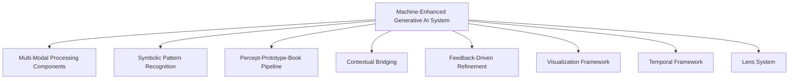
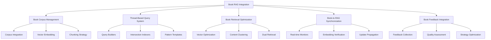

# Machine Enhanced Generative AI


# Part 1. Generative AI Design

## Base Generative AI System Architecture

The foundation of Memorativa's machine-enhanced generative AI builds upon the core architecture established in the cybernetic system, specifically the Glass Bead Game that serves as the core interactive component. This base architecture extends the prototype structure detailed in [Section 2.9: The Prototype](../2.%20the%20cybernetic%20system/memorativa-2-9-the-prototype.md), particularly its geocentric observer-centric model, by enhancing it with additional capabilities for large-scale knowledge processing and generation.

### Core Components

- **Multi-Modal Analysis**: Processes both text and images to create percepts and prototypes, fully integrated with the Input Interfaces tier
  - **CLIP-based Visual Analysis**: 
    - Advanced visual recognition models identify archetypal patterns in images
    - Multi-resolution feature extraction optimized for symbolic content
    - Specialized fine-tuning for astrological and esoteric symbolism
    - Visual feature extraction calibrated to align with textual semantic space
    - **Enhanced Visual Archetype Detection**:
      - Fine-tuned vision transformer backbones specialized for symbolic pattern recognition (ViT-L/14, CLIP-ViT-H/14)
      - Hierarchical attention mechanisms prioritizing significant archetypal elements
      - Multi-scale feature fusion for detecting nested symbolic structures (5-level pyramid)
      - Transfer learning from artistic domains to esoteric symbolism (400K+ symbolic images)
      - Perceptual hash indexing for efficient similar pattern retrieval (FP16 quantization)
      - Adversarial robustness for consistent detection despite visual noise or distortion
      - Cultural-specific pattern libraries with 3,000+ archetypal references per tradition
      - Zero-shot generalization to novel symbolic combinations through compositional reasoning
  - **Cross-Modal Alignment Controllers**:
    - Bidirectional attention mechanisms link visual and textual features
    - Shared embedding space with topology-preserving projections
    - Contrastive learning framework for symbolic correspondence
    - Dynamic weighting of modal contributions based on content quality
    - **Enhanced Modal Coordination**:
      - Parallel processing pipelines with synchronized feature extraction timings
      - Bidirectional transformers (12-layer, 768-hidden) fusing visual and textual representations
      - Multi-head cross-attention (16 heads) with spatially-aware context windows
      - Gated information flow with quality-weighted feature integration
      - Modality-specific confidence scoring with automatic prioritization
      - Angular consistency preservation across modalities (θ, φ, r coordinate alignment)
      - Selective feature augmentation for underrepresented modality inputs
      - Adaptive resolution scaling based on symbolic density detection
      - Real-time mode switching between fusion, prioritization, and segregation strategies
  - **Semantic Bridging Components**:
    - Shared vocabulary tags across modalities (3,000+ concept markers)
    - Hierarchical concept ontology with inheritance relationships
    - Geometric alignment of embedding spaces (θ, φ, r consistency)
    - Translation layers for symbolic equivalence across modalities
  - **Context-Aware Domain Adaptation**:
    - Automatic field detection across scientific and esoteric domains
    - Priority boosting for domain-specific terminology (200+ domains)
    - Contextual keyword weighting based on prototype coherence
    - Knowledge graph integration for domain relationship mapping
    - **Keyword Hints System**:
      - Dynamic domain-specific terminology banks with 12,000+ specialized terms
      - Automatic keyword extraction and prioritization based on content type
      - Personalized terminology profiles with user-specific weighting
      - Contextual boosting for keywords based on prototype coherence score
      - Semantic clustering of related terms with hierarchical organization
      - Temporal tracking of keyword relevance across session history
      - Cross-reference verification against domain-specific authority sources
      - Ambiguity resolution through multi-definition disambiguation
      - Keyword visualization with significance heat-mapping
      - Collaborative terminology refinement with expert validation workflows
      - Automated term expansion and contraction based on specificity needs
  - **Interface Integration**:
    - Direct connections to Input Interfaces for raw content ingestion
    - Configurable preprocessing through Processing Interfaces
    - Real-time feedback visualization via Analysis Interfaces
    - Multi-user analysis coordination through Collaboration Interfaces
    - Topological preservation alignment with Geocentric Interfaces
    - **Advanced Interface Coordination**:
      - Synchronized control panels across all five interface tiers
      - Modal-specific input components with adaptive layouts
      - Unified styling system with consistent visual language
      - Real-time cross-interface update propagation
      - Preference synchronization across device contexts
      - Accessibility adaptations for multi-modal content presentation
      - Customizable workspace layouts with modal-specific optimization

- **Symbolic Pattern Recognition**: Identifies archetypal patterns in player inputs, integrated with Processing and Analysis Interface tiers
  - **Memorativa Symbolic Translator (MST)**:
    - Converts astrologically encoded percept-triplets into universal symbolic language
    - Preserves conceptual relationships during symbolic translation
    - Implements bidirectional translation between symbolic systems
    - Maintains angular relationship integrity in translation processes
  - **Cultural Neutralization Layer**:
    - Removes explicit astrological terminology for universal accessibility
    - Preserves core symbolic meanings while adapting to cultural contexts
    - Calibrates symbolic language for domain-appropriate terminology
    - Implements cultural sensitivity filters with configurable thresholds
  - **Domain-Specific Recognition Components**:
    - Specialized pattern detectors for scientific, mathematical, and technical fields
    - Field-specific terminology modules for 60+ academic and professional domains
    - Cross-domain mapping for equivalent concept identification
    - Specialized symbolic dictionaries with domain-specific weightings
  - **Lens System Integration** as detailed in [Section 2.13: Lens System](../2.%20the%20cybernetic%20system/memorativa-2-13-lens-system.md):
    - Traditional Esoteric lenses (Chinese, Western Esoteric, Kabbalistic, Hermetic, Vedic)
    - Scientific & Mathematical lenses (Number theory, Sacred Geometry, Quantum Mechanics, Systems Theory)
    - Psychological & Experiential lenses (Jungian, Phenomenological, Cognitive Science)
    - Dynamic lens selection based on content and user preferences
    - Multi-lens concurrent analysis with confidence scoring
  - **Cross-System Translation Framework**:
    - Universal House System implementation for consistent symbolic mapping
    - Detailed correspondence tables for Astrological, Tarot, I Ching, Kabbalah, Musical, and Alchemical systems
    - Angular relationship preservation using the Spherical Merkle Tree structure
    - Reference to established literature (Hand, Greene, Rudhyar, etc.) for archetype verification
  - **Interface Integration Components**:
    - Processing Interface connections for symbolic translation configuration
    - Analysis Interface tools for pattern exploration and filtering
    - Lens selection controls with visualization of symbolic relationships
    - Pattern confidence indicators with interactive threshold adjustment
    - Real-time feedback on translation quality with user correction options
    - Collaborative pattern verification through shared workspaces
    - Geocentric visualization of symbolic relationships and angular patterns

- **Percept-Prototype-Book Pipeline**: Transforms raw inputs into structured knowledge through a multi-stage process that integrates across all five interface tiers
  - **Percept Creation**: Converts inputs to vector representations in 3D spherical space
    - Real-time vector encoding with dimensionality visualization
    - Parameter adjustment controls for encoding precision
    - Multi-modal fusion with relative weighting controls
    - Quality assessment metrics with confidence indicators
    - Interface integration:
      - Input Interface connections for content ingestion
      - Processing Interface tools for vector parameter tuning
      - Visual feedback through Analysis Interfaces
      - Real-time collaboration during percept creation
      - Observer positioning through Geocentric Interface
  
  - **Focus Space Generation**: Establishes conceptual workspaces for organizing percepts with the following key components:
    - **Title-Description Pairs**: MST-generated conceptual anchors that organize the focus space
      - Automatic generation with manual override controls
      - Cultural calibration settings for terminology
      - Hierarchical organization with drag-and-drop interface
      - Interface connections to Processing and Analysis tiers
    - **Hybrid Coordinate System**: Four-parameter system (θ, φ, r, κ) that combines spherical and hyperbolic geometries
      - Parameter visualization with interactive adjustment
      - Curvature controls for geometric transformation
      - Real-time topological visualization feedback
      - Interface connections to all five tiers for multi-level interaction
    - **Multi-Chart Interface**: Supports up to 12 concurrent charts (single, superimposed, progressed, specialized)
      - Chart selection menu with preview capabilities
      - Configuration controls for chart type and parameters
      - Synchronization options for comparative analysis
      - Interface integration with Analysis and Geocentric tiers
    - **Hierarchical Organization**: Nested focus spaces with inheritance up to 7 levels deep
      - Tree visualization with collapsible nodes
      - Inheritance visualization with property highlighting
      - Drag-and-drop reorganization capabilities
      - Interface connections to Processing and Analysis tiers
    - **Focus Layers**: Organized in concentric structure (Core Anchor, Secondary Anchors, Aspect Network, Hierarchical Network)
      - Layer visibility controls with transparency adjustment
      - Targeted filtering by layer type and content
      - Layer-specific interaction tools
      - Interface integration across all five tiers
  
  - **Prototype Aggregation**: Calculates spherical centroids and organizes related percepts with geocentric structure:
    - **Observer/Earth**: Central reference point for measuring all relationships (see Section 2.9)
      - Observer positioning tools with real-time feedback
      - Perspective adjustment with visual cues
      - Relationship recalculation triggers
      - Deep integration with Geocentric Interface tier
      - **Enhanced Observer Positioning System**:
        - Earth/Observer reference point controllers with 6 degrees of freedom (3 spatial, 3 rotational)
        - Precision coordinate adjustment sliders with configurable step sizes
        - Relative coordinate system visualizers with grid overlay options
        - Perspective shift tools with trajectory preview
        - Reference frame synchronization across multiple views
        - Multi-observer comparison views for collaborative analysis
        - Historical position tracking with temporal bookmarking
        - Automatic optimization suggestions for observer positioning
        - Geocentric coherence score indicators with real-time feedback
        - Template positions for common analytical perspectives
        - Guided positioning wizards for analytical use cases
        - Position save/load functionality with named configurations
    - **Sun Triplet**: Representative vector of the primary concept
      - Triplet selection tools with suggestion ranking
      - Priority weighting controls for concept emphasis
      - Visual highlighting in spatial representation
      - Interface integration with Processing and Geocentric tiers
      - **Advanced Sun Triplet Management**:
        - Primary concept vector editor with fine-grained component control
        - Representative triplet selector with AI-assisted recommendations
        - Weighted significance adjusters with numerical and visual feedback
        - Verification score indicators showing triplet conceptual coherence
        - Temporal weight controllers for time-sensitive conceptual representation
        - Drag-and-drop component reassignment for rapid reconfiguration
        - Dynamic triplet suggestion system based on context
        - Planetary significance visualization with heat mapping
        - Comparative triplet analysis with similarity metrics
        - Multi-mode selection tools (archetypal, expression, mundane)
        - Cross-prototype reference visualization
        - Backup and versioning of significant triplet configurations
    - **Planet Vectors**: Additional percept-triplets representing concept facets
      - Vector assignment tools with relationship preview
      - Orbital configuration with drag-and-drop positioning
      - Aspect visualization with significance highlighting
      - Interface connections across all five tiers
      - **Enhanced Planet Triplet Organization**:
        - Supporting vector arrangement panels with spatial relationship indicators
        - Orbital relationship visualizers showing angular connections
        - Weighted triplet sorting controllers with multiple criteria options
        - Multiple triplet selection tools for batch operations
        - Batch aspect calculation utilities with optimization controls
        - Automated triplet suggestion based on conceptual coherence
        - Aspectual relationship preview with significance prediction
        - Hierarchical triplet organization with nesting capabilities
        - Visual weight indicators using size and opacity
        - Conflict detection for contradictory triplet positions
        - Coherence optimization tools with single-click improvements
        - Detailed triplet metadata panels with relationship metrics
    - Interface integration:
      - Processing Interface controls for aggregation parameters
      - Analysis Interface tools for prototype exploration
      - Collaboration Interface for multi-user prototype development
      - Geocentric Interface for relationship visualization
  
  - **Book Generation**: Analyzes spatial patterns to create narratives and visualizations
    - Narrative structure templates with customization options
    - Content generation controls with style parameters
    - Quality assessment tools with revision suggestions
    - Multi-format export with visualization integration
    - Interface integration:
      - Processing Interface for generation parameters
      - Analysis Interface for content evaluation
      - Collaboration Interface for co-authoring and feedback
      - Geocentric Interface for spatial pattern incorporation

- **Contextual Bridging**: Maintains semantic relationships between percepts and prototypes
  - Uses aspect analysis to measure angular relationships between vectors
  - Calculates geocentric aspects from observer perspective
  - Incorporates aspect harmony and pattern coherence measures

- **Feedback-Driven Refinement**: Uses player validation to refine AI understanding
  - Incorporates AI-enhanced feedback integration
  - Adaptive learning through aspect pattern analysis
  - Multi-channel feedback processing (user, AI, temporal consistency)

#### Component-Interface Integration

The remaining core components integrate with the five-tier interface system as follows:

1. **Contextual Bridging Interface Integration**:
   - **Processing Interfaces**: Configure aspect calculation parameters and thresholds
   - **Analysis Interfaces**: Visualize angular relationships and aspect patterns
   - **Geocentric Interfaces**: Adjust observer perspective for relationship measurement
   - **Collaboration Interfaces**: Share and co-analyze relationship networks
   - Key interface elements:
     - Aspect configuration panels with orb adjustment sliders
     - Relationship visualization tools with filtering options
     - Pattern recognition controls with significance thresholds
     - Collaborative relationship analysis workspaces

2. **Feedback-Driven Refinement Interface Integration**:
   - **Input Interfaces**: Capture multi-channel feedback (explicit, implicit, temporal)
   - **Processing Interfaces**: Configure feedback weighting and integration parameters
   - **Analysis Interfaces**: Visualize feedback impact and learning progress
   - **Collaboration Interfaces**: Enable group feedback and consensus building
   - Key interface elements:
     - Feedback capture forms with structured response options
     - Learning visualization dashboards with progress metrics
     - Feedback impact analysis tools with before/after comparisons
     - Collaborative feedback workspaces with voting mechanisms

These interface integrations ensure that all core components of the machine-enhanced generative AI system are accessible through consistent, intuitive controls that adapt to user expertise levels and contextual requirements.

### Interface Integration Framework

Building on [Section 2.20: Interfaces], the machine-enhanced generative AI system implements a comprehensive five-tier interface framework that enables seamless interaction with the core knowledge structures and processing pipelines:

#### Five-Tier Interface System

1. **Input Interfaces**: Enable multi-modal data ingestion and initial processing
   - Multi-modal content capture (text, image, structured data)
   - Semantic tagging and initial vector encoding
   - Context specification and domain identification
   - Privacy control specification for input content
   - Temporal state selection (Mundane, Quantum, Holographic)

2. **Processing Interfaces**: Facilitate transformation of raw inputs into structured knowledge
   - Vector encoding controls and parameter adjustment
   - MST translation configuration and cultural calibration
   - Aspect calculation threshold configuration
   - Prototype formation and validation tools
   - Processing pipeline visualization and monitoring

3. **Analysis Interfaces**: Provide tools for exploring and deriving insights
   - Pattern recognition controls and filter settings
   - Aspect relationship visualization and manipulation
   - Focus space navigation and organization tools
   - Comparative analysis frameworks for multiple prototypes
   - Temporal analysis across different time states

4. **Collaboration Interfaces**: Enable multi-user interaction and shared exploration
   - Workspace sharing with granular permission controls
   - Real-time collaborative editing and annotation
   - Activity tracking and contribution attribution
   - Conflict resolution and version management
   - Communication channels integrated with knowledge structures

5. **Geocentric Interfaces**: Implement the observer-centric model and visualization
   - Observer positioning and perspective controls
   - Sun/planet triplet management and manipulation
   - Aspect visualization with significance highlighting
   - House and sign division configuration
   - Multi-chart display with superimposition options

#### Mapping to Structure Hierarchy

This five-tier interface system directly maps to the three-tier structure hierarchy defined in [Section 2.19: Shared Structures](../2.%20the%20cybernetic%20system/memorativa-2-19-shared-structures.md):

1. **Basic Structures** are primarily accessed through:
   - **Input Interfaces**: For initial creation of percept-triplets, vector encodings, and basic content capture
   - **Processing Interfaces**: For fundamental transformations like MST translations and vector adjustments
   - **Geocentric Interfaces**: For establishing basic angular relationships between percepts

2. **Composite Structures** are primarily managed through:
   - **Processing Interfaces**: For prototype formation, focus space creation, and pattern template assembly
   - **Analysis Interfaces**: For aspect network visualization and pattern exploration
   - **Geocentric Interfaces**: For observer-centric analysis of prototypes and their relationships

3. **Complex Structures** are primarily manipulated through:
   - **Analysis Interfaces**: For exploring books, knowledge networks, and conceptual demarcations
   - **Collaboration Interfaces**: For multi-user interaction with shared knowledge structures
   - **Geocentric Interfaces**: For interactive exploration of temporal sequences and complex relationship networks

This mapping ensures that all system capabilities are accessible through intuitive controls that adapt to user expertise levels and contextual requirements while maintaining the conceptual integrity of the underlying knowledge structures at each level of complexity.

Each interface tier integrates with the core components to provide cohesive user experiences while maintaining the conceptual integrity of the underlying knowledge structures. The interface framework ensures that all system capabilities are accessible through intuitive controls that adapt to user expertise levels and contextual requirements.

### Interface Integration Mapping

To enable clear implementation pathways and ensure proper integration across the system, the following comprehensive mapping shows how each component of the machine-enhanced generative AI system maps to the five-tier interface framework defined in Section 2.20.

#### Multi-Modal Analysis to Interface Mapping

| Component | Interface Elements |
|-----------|-------------------|
| **CLIP-based Visual Analysis** | **Input Interfaces**: CLIP-based visual archetype detection tools, Multi-modal content capture panels<br>**Processing Interfaces**: Visual feature extraction configuration panels, Multi-resolution feature tuning controls<br>**Analysis Interfaces**: Archetypal pattern matching dashboards, Symbol recognition confidence metrics |
| **Cross-Modal Alignment** | **Processing Interfaces**: Bidirectional transformers with fusion controls (12-layer, 768-hidden), Modal weight adjustment sliders<br>**Analysis Interfaces**: Cross-modal coherence monitors, Feature mapping visualizers<br>**Collaboration Interfaces**: Multi-user annotation tools, Shared multi-modal workspace |
| **Semantic Bridging** | **Processing Interfaces**: Shared vocabulary tag editors (3,000+ concept markers), Concept ontology browsers<br>**Analysis Interfaces**: Translation layer verification panels, Symbolic equivalence visualizers |
| **Keyword Hints System** | **Input Interfaces**: Domain-specific keyword hint registration panels, Contextual hint input forms<br>**Processing Interfaces**: Hint strength adjusters, Term expansion controls<br>**Analysis Interfaces**: Term usage analytics, Significance heat-mapping<br>**Collaboration Interfaces**: Collaborative terminology refinement |

#### Symbolic Pattern Recognition to Interface Mapping

| Component | Interface Elements |
|-----------|-------------------|
| **MST Translation** | **Processing Interfaces**: MST translation configuration panels, Cultural neutralization controls<br>**Analysis Interfaces**: Translation quality validators, Correspondence verification tools |
| **Cultural Neutralization** | **Processing Interfaces**: Neutralization threshold adjusters, Symbolic language calibration panels<br>**Analysis Interfaces**: Cultural sensitivity analyzers, Domain appropriateness metrics |
| **Domain-Specific Recognition** | **Processing Interfaces**: Field-specific terminology modules, Cross-domain mapping tools<br>**Analysis Interfaces**: Domain relevance scoring, Technical pattern recognition dashboards |
| **Lens System Integration** | **Lens Interfaces**: Universal House Framework Controls, Lens Selection & Management panels<br>**Geocentric Interfaces**: Angular relationship browsers, Symbolic mapping visualization |

#### Percept-Prototype-Book Pipeline to Interface Mapping

| Component | Interface Elements |
|-----------|-------------------|
| **Percept Creation** | **Input Interfaces**: Content capture tools, URL/media processors<br>**Processing Interfaces**: Vector encoding controls, Parameter adjustment sliders<br>**Analysis Interfaces**: Quality assessment metrics, Vector visualization tools |
| **Focus Space Generation** | **Processing Interfaces**: Title-description pair editors, Hybrid coordinate system visualizers (θ, φ, r, κ)<br>**Analysis Interfaces**: Focus space navigators, Layer visualization tools<br>**Collaboration Interfaces**: Shared focus spaces, Co-editing tools |
| **Prototype Aggregation** | **Processing Interfaces**: Weighted triplet aggregation tools, Geocentric projection panels<br>**Geocentric Interfaces**: Observer positioning tools, Sun triplet management panels, Planet triplet organization tools<br>**Analysis Interfaces**: Pattern quality metric displays, Refinement process controllers |
| **Book Generation** | **Book Interfaces**: Multi-layer format controllers, Virtual Loom workbench<br>**Analysis Interfaces**: Book analysis tools, Content attribution monitors<br>**RAG Interfaces**: Book corpus management panels, Book vector retrieval optimizers |

#### Contextual Bridging to Interface Mapping

| Component | Interface Elements |
|-----------|-------------------|
| **Aspect Analysis** | **Geocentric Interfaces**: Aspect visualization components, Angular relationship strength indicators<br>**Analysis Interfaces**: Aspect calculators, Pattern coherence monitors |
| **Geocentric Aspect Calculation** | **Geocentric Interfaces**: Observer positioning tools, Earth-centered coordinate system visualizers<br>**Processing Interfaces**: Aspect calculation threshold configuration, Orb adjustment controls |
| **Aspect Harmony & Pattern Coherence** | **Analysis Interfaces**: Harmony graphs, Pattern strength indicators<br>**Geocentric Interfaces**: Pattern coherence monitors, Aspect harmony visualizers |

#### Feedback-Driven Refinement to Interface Mapping

| Component | Interface Elements |
|-----------|-------------------|
| **AI-enhanced Feedback** | **Analysis Interfaces**: AI-generated synthetic feedback panels, Confidence interval visualizers<br>**Collaboration Interfaces**: Group feedback tools, Consensus building mechanisms |
| **Adaptive Learning** | **Processing Interfaces**: Learning rate controllers, Threshold adjustment interfaces<br>**Analysis Interfaces**: Learning progress visualization, Impact analysis dashboards |
| **Multi-channel Feedback** | **Input Interfaces**: Multi-channel feedback collectors, Validation control panels<br>**Collaboration Interfaces**: Collaborative feedback workspaces, Voting mechanisms |

#### Visualization Framework to Interface Mapping

| Component | Interface Elements |
|-----------|-------------------|
| **Horoscope-Style Charts** | **Geocentric Interfaces**: Circular chart rendering based on Swiss Ephemeris SDK, House and sign division visualizers<br>**Analysis Interfaces**: Chart exploration tools, Filtering controls |
| **Aspect Visualization** | **Geocentric Interfaces**: Aspect line rendering, Harmonic angle highlights<br>**Analysis Interfaces**: Aspect pattern recognition tools, Harmony visualization panels |
| **Pattern Coherence Monitoring** | **Geocentric Interfaces**: Geocentric coherence calculators, Observer-relative feedback integrators<br>**Analysis Interfaces**: Pattern strength metrics, Impact analysis tools |
| **Interactive Features** | **Geocentric Interfaces**: Zoom and pan navigation controls, Real-time aspect filtering<br>**Analysis Interfaces**: Interactive exploration tools, Tooltip configuration panels |
| **Multi-Chart Analysis** | **Geocentric Interfaces**: Superimposed chart generators, Progressed chart calculators<br>**Analysis Interfaces**: Chart comparison tools, Relationship analysis panels |

#### Lens System Integration to Interface Mapping

| Component | Interface Elements |
|-----------|-------------------|
| **Universal House System** | **Lens Interfaces**: House mapping configuration panels, System translation calibration tools<br>**Geocentric Interfaces**: House and sign division visualizers, Angular relationship browsers |
| **Cross-System Mappings** | **Lens Interfaces**: Cross-system correspondence visualizers, Symbolic mapping controls<br>**Analysis Interfaces**: Symbol system comparison visualizers, Pattern synthesis dashboards |
| **Lens Selection Framework** | **Lens Interfaces**: Lens palette with categorized symbolic systems, Cultural tradition filters<br>**Analysis Interfaces**: Lens search and discovery panels, Usage history tracking |
| **Cross-Lens Synthesis** | **Lens Interfaces**: Cross-lens pattern detection panels, Resonance visualization tools<br>**Analysis Interfaces**: Hybrid pattern formation tools, Verification redundancy checkers |

#### Temporal Processing Framework to Interface Mapping

| Component | Interface Elements |
|-----------|-------------------|
| **Mundane Time States** | **Temporal Interfaces**: Timestamp editors and managers, Historical timeline visualizers<br>**Analysis Interfaces**: Chronological relationship mappers, Date-time selector controls |
| **Quantum Time States** | **Temporal Interfaces**: Indeterminacy visualizers, Probability distribution editors<br>**Analysis Interfaces**: Quantum walk simulation panels, Conceptual time manipulation controls |
| **Holographic Time States** | **Temporal Interfaces**: Reference chart selection panels, Alignment visualization tools<br>**Analysis Interfaces**: Temporal correspondence mappers, Reference frame adjustment controls |
| **State Transition Processing** | **Temporal Interfaces**: State conversion panels, Transition rule editors<br>**Processing Interfaces**: Metadata preservation controls, Weight preservation monitors |
| **Privacy-Preserving Temporal Framework** | **Temporal Interfaces**: Privacy level selectors, Noise calibration controls<br>**Analysis Interfaces**: Differential privacy visualizers, Sensitivity configuration panels |

#### Book Interface System to Interface Mapping

| Component | Interface Elements |
|-----------|-------------------|
| **Multi-Layer Format System** | **Book Interfaces**: Multi-layer format controllers, Narrative content editors<br>**Processing Interfaces**: Content synchronization tools, Semantic integrity validation panels |
| **Virtual Loom Thread Structure** | **Book Interfaces**: Virtual Loom workbench, Thread property editors<br>**Processing Interfaces**: Thread intersection mapping tools, Bead position controllers |
| **Book RAG Integration** | **RAG Interfaces**: Book corpus integration panels, Thread-based query builders<br>**Processing Interfaces**: Book content clustering tools, Book-to-RAG synchronization monitors |
| **Book Temporal Management** | **Temporal Interfaces**: Book-specific time state selectors, Book version history viewers<br>**Analysis Interfaces**: Cross-time state Book analysis tools, Book temporal pattern detectors |

#### Privacy and Security Framework to Interface Mapping

| Component | Interface Elements |
|-----------|-------------------|
| **Granular Privacy Controls** | **Input Interfaces**: Privacy selectors, Content marking tools<br>**Collaboration Interfaces**: Permission managers, Selective sharing controls |
| **Permission-based Access** | **Collaboration Interfaces**: Access control lists, Role-based permission panels<br>**Processing Interfaces**: Temporal restrictions, Context boundary settings |

#### Spherical Merkle Trees to Interface Mapping

| Component | Interface Elements |
|-----------|-------------------|
| **Angular Relationship Storage** | **Analysis Interfaces**: Spherical Merkle Tree visualizers, Angular relationship browsers<br>**Processing Interfaces**: Relationship grouping tools, Batch processing controllers |
| **Verification Interfaces** | **Analysis Interfaces**: Merkle proof generators, Delta proof visualizers<br>**Processing Interfaces**: Coordinates authenticity checkers, Version comparators |

#### Gas Bead Token System to Interface Mapping

| Component | Interface Elements |
|-----------|-------------------|
| **Operation Cost Display** | **Processing Interfaces**: Operation cost display with specific action costs, Balance management tools<br>**Analysis Interfaces**: Resource utilization visualizers, Cost optimization panels |
| **Reward Tracking** | **Collaboration Interfaces**: Contribution tracking tools, Attribution display panels<br>**Analysis Interfaces**: Quality rating interfaces, Token reward calculators |
| **Token Economics** | **Processing Interfaces**: Burn mechanics interfaces, Staking option panels<br>**Collaboration Interfaces**: Network effects calculators, Quality incentive visualizers |



#### Implementation Guidelines

When implementing components of the machine-enhanced generative AI system, developers should:

1. **Interface Consistency**: Ensure that each component's UI elements follow the design patterns established for their corresponding interface types in Section 2.20.

2. **Cross-Component Integration**: Components that span multiple interface types should maintain consistent state and behavior across all interface contexts.

3. **Structure Hierarchy Alignment**: Verify that component implementations respect the three-tier structure hierarchy (Basic, Composite, Complex) as defined in Section 2.19.

4. **Observer-Centric Model**: All geocentric interfaces should consistently implement the observer-centric model detailed in Section 2.9.

5. **Performance Optimization**: Apply the optimization techniques relevant to each component as detailed in Section 3.4's Performance Optimizations section.

6. **Gas Token Economics**: Implement the appropriate GBT cost structure for each component operation as specified in the corresponding sections.

This comprehensive mapping provides a clear implementation roadmap for developers while ensuring that the machine-enhanced generative AI system maintains conceptual integrity with the interface framework established in Section 2.20.

### Operational Workflow

1. **Input Processing**:
   - **Interface Interactions**: 
     - Input Interfaces provide multi-modal content capture tools for text/image processing
     - Privacy selectors allow setting content access levels
     - Attribution markers track contribution sources
     - Operation cost display shows GBT burn requirements (5-10 GBT)
     - CLIP-based visual analysis panels for image processing
     - Domain-specific interface adapters for specialized content
   - Parse text/image input, calculate operation cost, burn GBT
   - CLIP-based visual analysis (12-18 GBT) processes images with specialized ViT backbones

2. **Vectorization**:
   - **Interface Interactions**: 
     - Processing Interfaces display 3D coordinate system (θ, φ, r, κ)
     - Vector control panels for manipulating archetypal/expression/mundane vectors
     - Dimensional constraint enforcers maintain valid values
     - Vector visualization tools show spatial positioning
     - Real-time vector encoding visualization with interactive feedback
   - Extract conceptual components (what/how/where) and map to 3D coordinates
   - Vector editors with fine-grained control manipulate coordinate values

3. **Contextualization**:
   - **Interface Interactions**: 
     - Domain-specific keyword hint panels with 12K+ specialized terms
     - Context-aware priority adjustment sliders
     - Terminology profile selectors for personalization
     - Cross-reference verification indicators against authority sources
     - Keyword visualization with significance heat-mapping
   - Apply domain-specific keyword hints for consistent interpretation
   - Automated term expansion and contraction based on specificity needs

4. **Vector Retrieval**:
   - **Interface Interactions**: 
     - Spatial query builders with aspect filtering controls
     - Cluster selection visualizers for efficient neighbor identification
     - Significance threshold adjusters for aspect relationships
     - Query performance monitors with cache hit indicators
     - Observer-relative query builders for perspective-specific results
   - Find spatially close documents filtered by significant angular relationships (5-8 GBT)
   - Uses KDTree spatial indexing for efficient neighbor identification
   - Filters neighbors based on significant astrological aspect thresholds (as detailed in Section 2.10)
   - Returns documents with meaningful angular relationships to the query
   - Employs geocentric aspect calculation from observer perspective as detailed in Section 2.9

5. **Pattern Recognition**:
   - **Interface Interactions**: 
     - Lens selection framework with categorized symbolic system palette
     - Cultural tradition filters for symbolic interpretation
     - Translation quality validators showing consistency metrics
     - Pattern library browsers with significance ranking
     - Cross-system pattern detection panels
   - Identify archetypal/symbolic patterns using the MST
   - Apply cultural neutralization to remove explicit astrological terminology
   - Reference structured correspondence tables for consistent symbolic mapping
   - Cross-reference across multiple cultural frameworks for universality
   - Calculate aspect patterns from observer-centric position

6. **Lens System Application**:
   - **Interface Interactions**: 
     - Universal House System controls with system translation calibration
     - Lens palette with Traditional Esoteric, Scientific, Psychological categories
     - Cross-lens synthesis tools for multi-perspective integration
     - Pattern library explorers with template matching
     - Resonance visualization tools showing symbolic harmonics
   - Apply appropriate symbolic lenses from Section 2.13 based on context
   - Select relevant lens types (Traditional Esoteric, Scientific, Psychological)
   - Transform percepts through selected lenses to generate multi-perspective interpretations
   - Preserve angular relationships between symbolic systems
   - Calculate cross-lens patterns that reveal deeper symbolic connections
   - Apply Universal House System framework for consistent cross-system translation
   - Verify lens integrity using Spherical Merkle Tree validation
   - Apply appropriate lens-specific GBT costs for operations (as detailed in Section 2.13)

7. **Focus Space Creation**:
   - **Interface Interactions**: 
     - Focus space designers with hierarchical organization tools
     - Title-description pair editors for conceptual anchoring
     - Hybrid coordinate system visualizers (θ, φ, r, κ)
     - Layer visibility controls with transparency adjustment
     - Multi-chart interface controllers for concurrent analysis
   - Generate conceptual workspace for organizing percepts
   - Creates title-description pairs using MST system
   - Establishes hybrid coordinate system (θ, φ, r, κ) for each element
   - Organizes in hierarchical layers up to 7 levels deep
   - Configures multi-chart interface with up to 12 concurrent charts
   - Establishes inheritance rules for nested focus spaces
   - Calculates significant angular relationships between elements

8. **Temporal Analysis**:
   - **Interface Interactions**: 
     - Temporal state selectors (Mundane, Quantum, Holographic)
     - Timestamp editors for concrete temporal markers
     - Indeterminacy visualizers showing probability distributions
     - Reference chart selection panels for holographic alignment
     - Privacy level selectors with differential privacy controls
     - State transition controllers with metadata preservation
   - Process time state vectors for each percept-triplet (5-10 GBT)
   - Apply appropriate time state (Mundane, Quantum, or Holographic) from Section 2.11
   - Calculate temporal relationships between percepts
   - Implement privacy-preserving noise for sensitive timestamps
   - Process state transitions when needed for analytical flexibility
   - Apply quantum walk simulation for pattern detection in indeterminate states
   - Generate temporal coherence metrics across percepts

9. **Spatial Context Generation**:
   - **Interface Interactions**: 
     - Geocentric interfaces with observer positioning tools
     - Aspect visualization components with harmonic angle highlights
     - Pattern coherence monitors with optimization suggestions
     - Multi-chart analysis tools for relationship exploration
     - Horoscope-style visualization with interactive navigation
   - Analyze aspects between query and documents for contextually rich responses (7-12 GBT)
   - Extract both classical angles and quantum interference patterns
   - Generate responses incorporating spatial relationships
   - Leverage aspect symbolism for meaningful connections (using aspect definitions from Section 2.10)
   - Apply visualization techniques to represent relationships

10. **Inner Cosmos Expansion**:
    - **Interface Interactions**: 
      - Knowledge territory maps showing conceptual neighborhoods
      - Relationship mappers for navigating semantic connections
      - Attribution trackers for contribution recognition
      - Version controllers for tracking knowledge evolution
      - Semantic zoom controllers for multi-level exploration
    - Integrate new knowledge into player's personal knowledge network
    - Update spatial clusters and relationship indices
    - Recalculate affected conceptual territories
    - Process attribution and validation metadata

11. **Content Generation**:
    - **Interface Interactions**: 
      - Book editors with multi-layer format controllers
      - Narrative content editors with semantic structure linking
      - Virtual Loom workbench for thread management
      - Thread intersection mapping tools for bead positioning
      - Book RAG integration panels for knowledge retrieval
      - Thread path tracers for narrative flow visualization
    - Create titles, descriptions, narratives using LLM and RAG
    - Utilizing Retrieval-Augmented Generation with vector database of astrological texts
    - Accessing correspondence tables for consistent symbolic references
    - Generating culturally neutral language that preserves core conceptual meaning
    - Producing dynamic English language narratives that bridge symbolic contexts
    - Incorporating aspect analysis patterns from prototype structure
    - Integrating temporal context from the appropriate time state

12. **Merkle Integration**:
    - **Interface Interactions**: 
      - Spherical Merkle Tree visualizers with angular preservation
      - Merkle proof generators for verification
      - Delta proof visualizers for efficient comparison
      - Version compression controls with snapshot management
      - Angular relationship verifiers for conceptual integrity
    - Store with data integrity verification and relationship preservation
    - Create Merkle nodes for documents with angular relationship preservation
    - Verify both content integrity and spatial consistency
    - Implement optimized batch verification for related document clusters
    - Preserve geocentric reference frame for angular relationships
    - Store time state metadata with appropriate privacy protections

13. **Visualization Generation**:
    - **Interface Interactions**: 
      - Circular chart rendering tools based on Swiss Ephemeris SDK
      - House and sign division visualizers
      - Aspect line rendering with appropriate styling
      - Zoom and pan navigation controls
      - Animation controls for temporal progression
      - Multi-chart display tools for comparative analysis
    - Create interactive horoscope-style charts for percept-triplet analysis
    - Implement the visualization methods from Section 2.10
    - Generate interactive charts with Swiss Ephemeris SDK
    - Apply multi-chart analysis techniques for relationship exploration
    - Enable real-time exploration of conceptual space
    - Visualize temporal relationships through appropriate chart techniques
    - Apply time-based filters and animation for temporal analysis

14. **Feedback Loop**:
    - **Interface Interactions**: 
      - Multi-channel feedback collectors with structured response options
      - Validation panels with quality rating aligned with token rewards
      - Learning visualization dashboards with progress metrics
      - Feedback impact analysis tools with before/after comparisons
      - Collaborative feedback workspaces with voting mechanisms
      - AI-enhanced feedback suggestion tools
    - Capture player validation for continuous improvement
    - Add validated content to the Dynamic Knowledge Base
    - Update spatial clusters and temporal indices
    - Recalculate affected relationships efficiently
    - Refine visualization representation based on feedback
    - Update time state transition weights based on user validation
    - Provide appropriate feedback interfaces based on user preference (minimal, standard, detailed)

15. **Collaborative Knowledge Building**:
    - **Interface Interactions**: 
      - Shared workspaces with granular permission controls
      - Real-time collaborative editing tools with presence indicators
      - Version merging interfaces with conflict resolution
      - Activity tracking dashboards with contribution attribution
      - Observer perspective sharing for aligned conceptualization
      - Multi-user validation mechanisms with consensus building
    - Enable multi-user interaction with conceptual structures (5-10 GBT per session)
    - Synchronize observer perspectives across multiple users
    - Manage concurrent edits with operational transforms
    - Track contributions for proper attribution and rewards
    - Implement privacy-preserving collaboration with selective disclosure
    - Support asynchronous collaboration with version control

16. **Book Temporal Management**:
    - **Interface Interactions**: 
      - Book-specific time state selectors for narrative context
      - Book version history browsers with temporal tracking
      - Book state transition controllers with metadata preservation
      - Book quantum analysis workbench for indeterminate exploration
      - Privacy-preserving Book timestamp tools with differential privacy
      - Cross-time state Book analysis dashboards
    - Process temporal aspects of Books across all three time states (5-12 GBT)
    - Maintain temporal coherence between Book layers (Human, Machine, Bridge, Bead, Loom)
    - Enable temporal navigation through Book evolution
    - Preserve temporal context during collaborative editing
    - Apply appropriate privacy measures for sensitive temporal data
    - Support cross-time state pattern recognition for deeper insights

### Privacy and Security Framework

- **Granular Privacy Controls**: At all structural levels
  - Public sharing options
  - Private content protection
  - Selective sharing with specific users
  - Permission-based access management
  - **Enhanced Privacy Interfaces**:
    - Privacy Dashboard with unified control center
    - Multi-level privacy visualizers showing information exposure
    - Content sensitivity analyzers with automated classification
    - Privacy impact predictors showing downstream effects
    - One-click privacy template application for common scenarios
    - Real-time privacy status indicators with traffic light system
    - Content-aware redaction tools with semantic preservation
    - Cross-system privacy propagation with boundary visualization
    - Privacy audit trail with actionable insights
    - Differential privacy strength visualizers with epsilon sliders
    - Context-specific privacy recommendations based on content type
    - Federated privacy mechanics with delegated trust visualization

- **Differential Privacy Framework**:
  - **Interface Components**:
    - Epsilon (ε) parameter adjustment sliders with visual impact assessment
    - Sensitivity analysis dashboards estimating data vulnerability
    - Noise preview visualizers showing information preservation
    - Privacy-utility tradeoff optimizers with interactive feedback
    - Budget allocation controls across system operations
    - Statistical accuracy monitors showing information retention
    - Query safety verification with automatic recalibration
    - Privacy guarantee certificates with mathematical verification
    - Operation cost calculators with privacy-adjusted GBT estimates
  - **Implementation Architecture**:
    - Multi-mechanism selection based on data type and query:
      - Laplace mechanism for numerical queries
      - Exponential mechanism for categorical selections
      - Gaussian mechanism for high-dimensional vectors
      - Johnson-Lindenstrauss transforms for dimension reduction
    - Composition accounting across sequential operations
    - Query rewriting for minimizing sensitivity
    - Adaptive sampling techniques for large datasets
    - Post-processing consistency enforcement
    - Auto-calibration based on data distribution characteristics
  - **Advanced Temporal Privacy**:
    - Time-series specific noise injection preserving temporal patterns
    - Temporally-aware budget management with decay functions
    - Event timing protection with variable clock precision
    - Sequential composition optimizers for temporal query streams
    - Pattern-preserving temporal perturbation with frequency domain techniques
    - Temporal resolution controllers with adaptive granularity
    - Synthetic temporal data generation for high-sensitivity queries
    - Time-slice isolation with controlled information leakage

### Collaborative Focus Space Features

Building on [Section 2.12: Focus Spaces](../2.%20the%20cybernetic%20system/memorativa-2-12-focus-spaces.md), the generative AI system extends collaborative capabilities for focus spaces:

- **Sharing Models**:
  - Read-only sharing via focus space links
  - Full collaborative access with edit permissions
  - Temporary shared sessions for real-time collaboration
  - Fork-and-merge workflow for asynchronous collaboration

- **Collaborative Features**:
  - Real-time updates of chart configurations
  - Shared prototype weighting and aspect analysis
  - Concurrent editing with conflict resolution
  - Activity tracking and change history
  - Comment threads on specific elements
  - **Enhanced Workspace Collaboration**:
    - Shared workspaces with granular permission controls
    - Real-time collaborative editing with presence indicators
    - Version merging interfaces with automatic conflict detection
    - Activity tracking dashboards with attribution metrics
    - Observer perspective sharing for aligned conceptualization
    - Multi-user validation mechanisms with consensus thresholds
    - Collaborative pattern voting with significance scoring
    - Temporal collaboration across time states
    - Session recording with playback capabilities
    - Contribution attribution with token reward integration
    - Asynchronous review queues with notification systems
    - Multi-device synchronization with state preservation
    - Break-out analysis rooms for focused group work
    - Interactive presentation mode with guided navigation
    - Cross-workspace pattern identification tools

- **Access Control**:
  - Granular permissions per hierarchy level
  - Time-limited access grants
  - Public/private visibility settings
  - Collaborative group management

- **Synchronization**:
  - Spherical Merkle Tree validation of shared state
  - Eventual consistency model
  - Conflict resolution using operational transforms
  - Bandwidth-optimized delta updates
  - Spatial relationship preservation during synchronization
  - **Advanced Synchronization**:
    - Real-time vector coordinate synchronization
    - Optimistic concurrency with conflict detection
    - State convergence with consistent observer perspective
    - Partial state updates for bandwidth optimization
    - Change propagation with causality preservation
    - Vector lock mechanism for critical operations
    - Version vector tracking for distributed consistency
    - Synchronization queues with priority handling
    - Background delta compression for efficient transmission
    - Intelligent conflict resolution with semantic understanding
    - Off-line editing with synchronized reconciliation
    - Eventual consistency monitoring with divergence metrics
    - Cross-time state synchronization with reference preservation
    - Resilient connection handling with automatic recovery
    - Cached operations with progressive transmission

- **Collaborative Workflows**:
  - Pattern discovery sessions
  - Collaborative analysis with multi-user chart manipulation
  - Teaching/presentation mode with focused attention controls
  - Real-time presence indicators and contribution tracking
  - **Extended Collaborative Workflows**:
    - Moderated brainstorming sessions with idea clustering
    - Expert review cycles with structured feedback channels
    - Peer validation networks with reputation systems
    - Dynamic role assignment for specialized analysis tasks
    - Knowledge mapping expeditions with territory discovery
    - Structured debate workflows with thesis-antithesis tracking
    - Cross-discipline integration sessions with domain experts
    - Iterative refinement protocols with staged validation
    - Pattern verification tournaments with collective scoring
    - Focus space exhibitions with guided tours
    - Co-created knowledge narratives with attribution trees
    - Collaborative lens application with perspective voting
    - Challenge-response exercises for concept validation
    - Group temporal exploration with timeline comparison
    - Multi-chart interactive presentations with annotation

These collaborative features allow multiple users to work together within the same conceptual space while maintaining both data integrity and spatial relationships, enabling richer knowledge generation and analysis than would be possible individually.

### Privacy and Permission Management

The machine-enhanced generative AI system implements comprehensive privacy and permission controls for collaborative work:

- **Granular Privacy Controls**:
  - **Access Levels**:
    - Private collections (accessible only to creator)
    - Not Shared (accessible to creator and system for AI training, but not to other users)
    - Public contributions (accessible to all users and the system)
    - Shared spaces (accessible to specific users or groups as defined by the creator)
  - **Content-Level Privacy**:
    - Element-specific privacy settings independent of container privacy
    - Selective revealing of specific percepts, prototypes, or patterns
    - Privacy inheritance with override capabilities
    - Temporal privacy windows for time-limited sharing
    - Concept-based privacy with semantic classification
  - **Observer Perspective Privacy**:
    - Private observer positions with selective sharing
    - Multi-observer configurations with limited visibility
    - Observer-relative aspect hiding for sensitive relationships
    - Perspective sharing with geometric blurring for partial anonymization
  - **Contextual Privacy**:
    - Domain-specific privacy rules with automatic classification
    - Context-dependent sharing based on semantic content
    - Cultural sensitivity filters with configurable thresholds
    - Privacy templates for common use cases

- **Permission Management**:
  - **Role-Based Access Control**:
    - Viewer (read-only access to shared elements)
    - Commentator (viewing plus comment capabilities)
    - Contributor (commenting plus new content addition)
    - Editor (contribution plus modification rights)
    - Co-owner (editing plus permission management)
    - Administrator (complete control including deletion)
  - **Hierarchy-Based Permissions**:
    - Level-specific access controls for nested structures
    - Inheritance rules with exception management
    - Automatic propagation with manual overrides
    - Role transitivity controls across hierarchy levels
  - **Temporal Permission Controls**:
    - Time-limited access grants with automatic expiration
    - Scheduled permission changes for phased collaboration
    - Historical access controls for version history
    - Time state-specific permissions across mundane/quantum/holographic states
  - **Contextual Permissions**:
    - Domain-specific role assignments for specialized expertise
    - Content-based automatic permission adjustment
    - Pattern-specific access controls for sensitive insights
    - Lens-specific permissions for interpretive frameworks

- **Collaboration Boundaries**:
  - **Workspace Isolation**:
    - Configurable information flow between workspaces
    - Cross-workspace reference without content exposure
    - Selective pattern sharing across workspace boundaries
    - Conceptual bridges with privacy-preserving interfaces
  - **Attribution Controls**:
    - Anonymous contribution options with verification
    - Pseudonymous collaboration with consistent identity
    - Attribution granularity from element to collection level
    - Contribution weighting for multi-author content
  - **Audit and Oversight**:
    - Access logging with privacy-preserving aggregation
    - Permission change history with accountability
    - Usage analytics with anonymization options
    - Compliance verification for organizational rules

- **Privacy-Preserving Collaboration**:
  - **Zero-Knowledge Proofs**:
    - Verification of relationships without revealing content
    - Pattern validation with concealed source elements
    - Attribute confirmation without data exposure
    - Angular relationship verification with hidden vectors
  - **Differential Privacy Implementation**:
    - Noise calibration for collaborative analysis
    - Privacy budget management across operations
    - Statistical property preservation with controlled distortion
    - Adaptive privacy mechanisms based on sensitivity
  - **Secure Multi-Party Computation**:
    - Distributed pattern recognition across private datasets
    - Threshold approval for sensitive operations
    - Encrypted vector operations for protected analysis
    - Split knowledge protocols for sensitive information

- **Permission Enforcement**:
  - **Real-Time Validation**:
    - Operation-level permission checking
    - Context-aware access control decisions
    - Temporal validity verification
    - Cascading permission resolution
  - **Conflict Resolution**:
    - Permission precedence rules for overlapping grants
    - Escalation procedures for permission disputes
    - Default policies for ambiguous cases
    - Emergency access protocols with retrospective approval
  - **Integration with Token System**:
    - Permission-based cost structures for operations
    - Incentivized sharing with token rewards
    - Access token economics with transferable rights
    - Permission markets for specialized expertise

These privacy and permission features enable secure, controlled collaboration while protecting sensitive information and maintaining clear boundaries between different access levels and user roles.

### Lens System Integration

Building directly on [Section 2.13: Lens System](../2.%20the%20cybernetic%20system/memorativa-2-13-lens-system.md), the generative AI incorporates the modular lens framework for analyzing and interpreting percepts through diverse cultural and scientific paradigms.

#### Core Lens Framework Integration

The generative AI system implements the complete lens framework from Section 2.13:

- **Universal House System**: Maintains the common twelve-house framework that enables consistent symbolic translations across different lens types
  - **Enhanced Universal House System Controls**:
    - House mapping configuration interface with visual correspondence visualization
    - System translation calibration tools with precision controls
    - Cross-system correspondence visualizers showing symbolic alignments
    - Angular relationship browsers for symbolic systems with significance indicators
    - Verification tools for cross-system integrity with validation metrics
    - Translation quality validators with consistency scoring
    - House property inheritance visualization across symbolic traditions
    - Multi-system overlay comparisons with transparency controls
    - House significance weighting panels with cultural calibration
    - Visual mapping matrix for cross-lens symbolic relationships
  - Preserves the four-level interpretive perspectives: Personal/Natal, Mundane Organization, Conceptual/Symbolic, and Events/Temporal
  - Implements both quality-based (Angular, Succedent, Cadent) and element-based (Fire, Earth, Air, Water) house classifications
  - Serves as the foundation for cross-lens symbolic mappings

- **Cross-System Mappings**: Implements the detailed symbolic correspondences between diverse systems
  - Maintains mappings between Astrological, Tarot, I Ching, Kabbalah, Musical, and Alchemical systems
  - Preserves symbolic integrity while enabling conceptual translation
  - Leverages these mappings for enhanced pattern recognition

- **Technical Implementation**: Incorporates the lens structure within the generative AI architecture
  - Uses the Spherical Merkle Tree structure from Section 2.13 for lens verification
  - Implements hybrid coordinates for lens positioning in conceptual space
  - Maintains both hierarchical and angular relationships between symbolic systems

#### Lens Selection Framework

The generative AI implements a comprehensive lens selection interface as described in Section 2.20:

- **Lens Palette with Categorized Symbolic Systems**:
  - Interactive lens catalog with thumbnail previews
  - Category-based navigation with hierarchical organization
  - Lens search functionality with semantic matching
  - Usage history tracking with favorites management
  - Recent lens quick-access panel
  - Recommended lens suggestions based on content analysis
  - Compatibility indicators for content types
  - Version tracking for lens updates
  - Community rating visualization for lens quality
  - Lens metadata browsers with attribution information

- **Cultural Tradition Filters**:
  - Geographic origin filters with interactive map visualization
  - Historical timeline sliders for tradition evolution
  - Cultural influence visualization showing cross-tradition connections
  - Tradition comparison tools with similarity metrics
  - Core principle highlighters for tradition foundations
  - Symbolic vocabulary comparison across traditions
  - Evolution tracking of symbols through historical periods
  - Regional variation selectors within traditions
  - Esoteric lineage visualization with transmission chains
  - Cultural context annotations with scholarly references

- **Scientific Domain Selectors**:
  - Discipline categorization with hierarchical organization
  - Interdisciplinary connection visualization
  - Mathematical foundation mapping across domains
  - Methodology comparison tools between scientific paradigms
  - Quantum-classical transition visualization
  - Scale-based organization (micro to macro)
  - Epistemic approach filters (empirical, theoretical, computational)
  - Domain-specific terminology glossaries
  - Cross-domain concept mappings with equivalence indicators
  - Scientific history timeline for conceptual evolution

- **Psychological Archetype Browsers**:
  - Jungian archetype catalog with visual representations
  - Developmental psychology stage mapping
  - Cognitive function categorization
  - Phenomenological experience taxonomy
  - Consciousness state classification system
  - Emotional spectrum visualization
  - Archetypal narrative pattern library
  - Cross-cultural archetype equivalence mapping
  - Psychological model comparison tools
  - Experiential quality dimensions with sliders

- **Custom Lens Composition Tools**:
  - Lens component library with drag-and-drop assembly
  - Dimension editors for custom symbolic axes
  - Symbol system integration validators
  - Coherence testing tools for custom lenses
  - Template-based lens creation wizards
  - Hybrid lens configuration panels
  - Dimension weighting controllers
  - Verification checkers for symbolic consistency
  - Lens export and sharing utilities
  - Version control for iterative lens development

#### Lens Types

The generative AI system incorporates all lens types described in Section 2.13:

1. **Traditional Esoteric Lenses**
   - Chinese (I Ching, Wu Xing)
   - Western Esoteric (Tarot, Alchemy)
   - Kabbalistic (Tree of Life)
   - Hermetic (Seven Principles)
   - Vedic (Chakras, Nakshatras)

2. **Scientific & Mathematical Lenses**
   - Mathematical (Number theory)
   - Sacred Geometry (Platonic solids)
   - Quantum Mechanics (Wave-particle)
   - Systems Theory (Structures)

3. **Psychological & Experiential Lenses**
   - Jungian (Archetypes)
   - Phenomenological (Experience)
   - Cognitive Science (Mental processes)

#### Pattern Recognition Enhancement

The generative AI extends its symbolic pattern recognition capabilities through multi-lens analysis as described in Section 2.13:

- **Cross-System Analysis**: Identifies patterns that span multiple symbolic systems
- **Universal Pattern Recognition**: Detects mathematical symmetries and quantum states
- **Temporal Pattern Analysis**: Recognizes cycles, progressions, and rhythms across lens types
- **Spatial Pattern Analysis**: Identifies geometric forms and structural relationships

#### Cross-Lens Synthesis

The generative AI implements sophisticated cross-lens synthesis capabilities as outlined in Section 2.20:

- **Pattern Identification Across Symbolic Systems**:
  - Cross-system pattern detectors with significance ranking
  - Universal pattern visualization tools
  - Pattern matching algorithms with threshold adjustment
  - Multi-lens synchronization for parallel analysis
  - Pattern library lookup with similarity scoring
  - Common pattern extraction from diverse symbolic systems
  - Pattern evolution tracking across lens transitions
  - Adaptive pattern recognition with learning capabilities
  - Context-sensitive pattern highlighting
  - Pattern metadata annotation with cross-references

- **Resonance Visualization Between Lens Interpretations**:
  - Harmonic resonance displays with intensity heatmaps
  - Interference pattern visualization for concept reinforcement
  - Cancellation zone identification for contradictory interpretations
  - Standing wave pattern recognition for stable concepts
  - Phase relationship visualization between symbolic systems
  - Amplitude modulation displays for significance variation
  - Frequency domain analysis tools for cyclic patterns
  - Resonance strength indicators with numerical precision
  - Multi-dimensional resonance mapping with projection tools
  - Temporal resonance evolution with animation controls

- **Symbolic Mapping Controls**:
  - One-to-many relationship visualization
  - Many-to-one aggregation tools
  - Partial correspondence indicators with strength metrics
  - Hierarchical mapping organization tools
  - Bidirectional translation verification
  - Context-dependent mapping rules
  - Symbol evolution tracking across mapping transitions
  - Conflict resolution tools for contradictory mappings
  - Dynamic mapping adjusters based on context
  - Mapping quality assessment with verification scores

- **Hybrid Pattern Formation Tools**:
  - Cross-lens pattern hybridization workbench
  - Component selection tools for pattern assembly
  - Coherence testing for hybrid patterns
  - Conceptual integrity validators
  - Mixed-system visualization with source attribution
  - Pattern strength predictors for hybrid constructions
  - Implementation suggestion generators
  - Historical precedent finders for similar hybrids
  - Domain application recommendation tools
  - Hybrid pattern sharing and collaboration utilities

#### Integration with MST

The Memorativa Symbolic Translator (MST) works in conjunction with the Lens System to provide:

- **Symbolic Translation**: Converts astrologically encoded percepts into universal symbolic language
- **Cultural Neutralization**: Removes explicit astrological terminology while preserving core symbolic relationships
- **Cross-Lens Synthesis**: Combines insights from multiple lens perspectives into coherent knowledge structures
- **Pattern Library Access**: Leverages the pattern libraries from each lens type for enhanced symbolic interpretation

#### Lens-Specific GBT Costs

Extending the GBT cost structure, the generative AI incorporates the lens-specific operation costs from Section 2.13 and 2.20:

| Lens Operation | GBT Cost | Description |
|----------------|----------|-------------|
| Lens Creation | 25.0 + 5.0/dimension | Creation of new symbolic frameworks |
| Lens Application | 3.0 + 0.5/percept | Transforming data through lens-specific symbolism |
| Pattern Recognition | 2.0 + 0.2/element | Identifying symbolic patterns |
| Angular Relationship | 1.0 + 0.1/relationship | Maintaining symbolic connections |
| Cross-Lens Synthesis | 5.0 + 1.0/lens | Knowledge integration across lens types |
| Lens Verification | 0.5 + 0.05/depth | Validating lens integrity |
| Universal House Mapping | 2.0 + 0.2/system | Cross-system house correspondence |
| Symbolic Mapping Creation | 3.0 + 0.3/symbol | Creating new symbolic correspondences |
| Resonance Analysis | 4.0 + 0.4/pattern | Analyzing pattern resonance across lenses |
| Hybrid Pattern Formation | 6.0 + 0.6/component | Creating cross-lens hybrid patterns |

Additional modifiers from Section 2.13 are also implemented:
- **Complexity Multiplier**: +10-50% for lenses with high dimensional counts
- **Novelty Bonus**: -15% for operations creating previously undiscovered patterns
- **Volume Discount**: -5% per 10 operations performed in sequence
- **Tradition Factor**: -20% for lenses that maintain classical symbolic connections
- **Hybridization Cost**: +25% for operations combining multiple lens types

#### Lens Optimization Strategies

The generative AI implements the optimization strategies from Section 2.13 to ensure efficient lens operations:

1. **Lens Sharding**
   - Partitions large lens systems into manageable shards
   - Loads only relevant lens components for specific operations
   - Maintains cross-shard references for global pattern recognition

2. **Lazy Evaluation**
   - Calculates lens transformations only when needed
   - Caches frequent transformations for reuse
   - Implements progressive loading for complex lens hierarchies

3. **Adaptive Precision**
   - Uses variable precision for angular relationships based on significance
   - Reduces coordinate precision for distant or weakly-related elements
   - Implements level-of-detail mechanisms for large lens systems

#### Collaborative Lens Features

Building on the collaborative features from Section 2.13, the generative AI enables:

- **Multi-user Lens Exploration**: Synchronized lens-based analysis across multiple users
- **Lens Pattern Co-discovery**: Collaborative identification of patterns across symbolic systems
- **Cross-cultural Synthesis**: Integration of insights from different cultural lenses
- **Shared Lens Libraries**: Collaborative development and refinement of lens frameworks
- **Distributed Lens Verification**: Crowd-sourced verification of lens integrity and relationships

These lens integration features significantly enhance the symbolic processing capabilities of the generative AI system, enabling richer pattern recognition and more nuanced interpretation of percepts, prototypes, and focus spaces through the comprehensive interface components described in Section 2.20.

### Book Interface System

Building directly on the comprehensive Book structures defined in [Section 2.14: Books](../2.%20the%20cybernetic%20system/memorativa-2-14-books.md), the machine-enhanced generative AI system implements a sophisticated Book interface framework:

#### Multi-Layer Format System

The system implements the complete five-layer format structure for Books:

- **Human Layer**: Natural language narrative content accessible to readers
  - Narrative content editors with semantic structure linking
  - Intuitive reading interface with progressive disclosure
  - Content attribution tracking with collaborative history
  - Style preference management with customizable presentation
  - Hierarchical chapter/section organization tools
  - **Advanced Narrative Structure Tools**:
    - Multi-perspective narrative generators
    - Thematic alignment visualizers connecting narrative to underlying structures
    - Coherence optimization tools for narrative flow
    - Readability analyzers with audience-specific adjustments
    - Semantic anchoring tools connecting narrative to percept-triplets
    - Narrative transformation tools for different cultural contexts
    - Version comparison visualizers with narrative evolution tracking
    - Hierarchical organization with expandable/collapsible sections
    - Contextual annotation frameworks for additional insights

- **Machine Layer**: Vector-based representations for AI processing
  - Vector embedding visualization tools
  - Semantic clustering viewers
  - RAG integration points with query preview
  - Vector relationship browsers showing conceptual proximity
  - Embedded metadata inspectors for tracing vector lineage
  - Performance optimization dashboards with cache hit metrics
  - **Enhanced Vector Processing Components**:
    - Real-time vector space visualization with dimensionality reduction
    - Semantic distance calculators with multiple metrics (cosine, L2, hybrid)
    - Dynamic clustering tools with threshold adjustments
    - Vector transformation pipelines for cross-domain mapping
    - Batch vector operations with performance monitors
    - Gradient visualization for semantic transitions
    - Vector anomaly detection with significance highlighting
    - Vector history tracking with temporal evolution
    - Multi-modal vector alignment tools for cross-modal content

- **Bridge Layer**: Translation mechanisms between Human and Machine layers
  - Cross-layer mapping visualizers
  - Bidirectional translation monitors
  - Alignment quality indicators
  - Content synchronization tools
  - Semantic integrity validation panels
  - Relationship preservation metrics
  - **Advanced Bridge Layer Components**:
    - Translation consistency monitors with deviation alerts
    - Semantic preservation scorecards with multiple metrics
    - Real-time sync verification with active monitoring
    - Cultural calibration tools for meaning preservation
    - Translation debugging interfaces with detail inspection
    - Batch translation optimizers with parallel processing
    - Context-aware translation rules with domain adaptation
    - Translation evolution tracking with version comparison
    - Translation confidence indicators with uncertainty visualization

- **Bead Layer**: Individual knowledge components (percepts and percept-triplets)
  - Percept editors with triplet visualization
  - Component relationship browsers
  - Triplet arrangement tools with geocentric visualization
  - Component reuse tracking with attribution
  - Percept-to-narrative trace visualization
  - Component quality metrics with verification status
  - **Enhanced Bead Management**:
    - Intelligent bead suggestion based on context
    - Bead relationship analysis with angular significance highlighting
    - Batch bead operations with multi-select capabilities
    - Bead evolution tracking with temporal state visualization
    - Hierarchical bead organization with inheritance visualization
    - Cross-book bead discovery with similarity metrics
    - Bead validation tools with multi-channel verification
    - Bead reputation scoring based on usage patterns and feedback
    - Bead positioning optimization for narrative coherence

- **Loom Layer**: Organizational structure for arranging Beads
  - Virtual Loom workbench with thread visualization
  - Pattern template managers with reusable structures
  - Thread-based navigation with conceptual filtering
  - Content organization tools with automated suggestions
  - Pattern coherence monitors with optimization tools
  - **Advanced Loom Management Tools**:
    - Thread tension visualization showing knowledge structure stability
    - Multi-dimensional thread space with rotation controls
    - Pattern recognition across thread intersections
    - Automatic thread suggestion based on content analysis
    - Thread inheritance visualization for hierarchical structures
    - Thread generation assistants for new knowledge domains
    - Thread alignment tools for cross-book comparison
    - Thread impact analysis showing concept distribution
    - Thread evolution tracking with temporal state integration

#### Virtual Loom Thread Structure

The system implements the complete thread-based organization system for the Loom layer, now with enhanced management capabilities:

- **Warp Threads (Thematic Dimensions)**
  - Thematic thread designers with concept mapping
  - Consistent dimension management across Books
  - Thread property editors with semantic anchoring
  - Thread visualization with conceptual gradient display
  - Thread relationship browsers for thematic mapping
  - Conceptual anchoring tools with vector alignment
  - Thematic consistency validation with feedback metrics
  - Thread templates with predefined thematic structures
  - **Enhanced Warp Thread Management**:
    - Thematic coherence calculators with validation metrics
    - Cross-domain thematic mapping with knowledge integration
    - Thematic pattern library with template matching
    - Context-sensitive thematic suggestion engines
    - Multi-level thematic hierarchy with inheritance visualization
    - Thematic strength indicators showing conceptual anchoring
    - Thematic conflict detection with resolution suggestions
    - Collaborative thematic development with multi-user editing
    - Thematic analysis dashboards with concept distribution

- **Weft Threads (Contextual Dimensions)**
  - Contextual thread designers with relationship mapping
  - Cross-cutting concern visualization
  - Thread property editors with contextual weighting
  - Context-switching visualization with state management
  - Thread relationship browsers for contextual analysis
  - Perspective management tools with observer alignment
  - Contextual consistency validation with feedback metrics
  - Thread templates with predefined contextual patterns
  - **Advanced Weft Thread Components**:
    - Context transition smoothing for narrative coherence
    - Contextual lens integration for perspective shifts
    - Context relationship network visualization
    - Cross-contextual mapping for domain transitions
    - Context-specific validation rules with custom metrics
    - Context hierarchy management with inheritance visualization
    - Context coverage analysis with gap identification
    - Adaptive context generation based on content analysis
    - Context strength visualization with significance heat maps

- **Thread Intersection Management**
  - Intersection mapping tools with matrix visualization
  - Bead position controllers with drag-and-drop placement
  - Intersection significance metrics with heat mapping
  - Multi-bead intersection management with layering
  - Empty intersection identification with suggestions
  - Intersection pattern recognition with template matching
  - Thread tension visualization with balance metrics
  - Intersection navigation with conceptual jumping
  - **Enhanced Intersection Management System**:
    - 3D intersection visualization with zoom and rotation
    - Intersection significance scoring using multiple metrics
    - Automatic bead suggestion for empty intersections
    - Intersection cluster identification for related concepts
    - Intersection pattern templates with instant application
    - Intersection conflict resolution with priority settings
    - Batch intersection operations with multi-select tools
    - Intersection validation based on theme-context coherence
    - Cross-book intersection comparison for pattern discovery
    - Intersection distribution analysis with coverage metrics
    - Adaptive intersection significance based on narrative flow
    - Temporal state visualization at intersection points
    - Observer perspective tools for intersection analysis
    - Intersection permission management for collaborative editing
    - Intersection history tracking with evolution visualization

- **Thread Path Navigation**
  - Path tracers for narrative flow visualization
  - Path optimization tools with coherence metrics
  - Bookmark management for path retention
  - Path comparison tools for alternative narratives
  - Path sharing with collaborative annotations
  - Path recording for reuse and template creation
  - Path merging tools for narrative integration
  - Path branching with decision point visualization
  - **Advanced Path Management Tools**:
    - Intelligent path suggestion based on content and user history
    - Path-based recommendation engines for knowledge discovery
    - Optimal path calculation with multiple optimization criteria
    - Path coherence scoring with semantic continuity metrics
    - Automatic narrative generation following specific paths
    - Multi-user synchronized path navigation with presence indicators
    - Path divergence analysis with comparison visualization
    - Path intersection highlighting for conceptual connection points
    - Path templates for common knowledge structures
    - Path-based query builders for content retrieval
    - Path heatmaps showing usage patterns and popularity
    - Path transformation tools for perspective shifts
    - Temporal path visualization showing concept evolution
    - Path relevance scoring based on user goals and interests

#### Thread Intersection Data Structure

The system implements a sophisticated data structure for managing thread intersections, providing rich metadata and navigation capabilities:

```typescript
interface ThreadIntersection {
  // Core identification
  id: string;
  warpThreadId: string;
  weftThreadId: string;
  
  // Content management
  beads: Percept[];
  beadOrder: string[];  // IDs in display order
  
  // Intersection properties
  significance: number;  // 0-1 significance score
  tension: number;      // Thread tension at this point
  
  // Navigational metadata
  nextIntersections: string[];  // Connected intersection IDs
  narrativePaths: string[];     // Path IDs passing through
  
  // Spatial properties
  coordinates: [number, number, number];  // 3D position
  
  // Temporal properties
  timeState: "mundane" | "quantum" | "holographic";
  temporalContext: any;  // Time state-specific data
  
  // Collaboration metadata
  contributors: string[];
  lastModified: Date;
  permissionLevel: "private" | "shared" | "public";
  
  // Validation
  validationScore: number;  // 0-1 validation quality
  validationHistory: ValidationEvent[];
  
  // Contextual information
  semanticHints: string[];  // Guiding concepts
  contextualWeighting: Record<string, number>;  // Context-specific weights
}

// Implementation of core intersection operations
class IntersectionManager {
  private intersections: Map<string, ThreadIntersection> = new Map();
  
  // Create or update an intersection
  setIntersection(warpId: string, weftId: string, data: Partial<ThreadIntersection>): string {
    const intersectionId = `${warpId}:${weftId}`;
    const existing = this.intersections.get(intersectionId) || {
      id: intersectionId,
      warpThreadId: warpId,
      weftThreadId: weftId,
      beads: [],
      beadOrder: [],
      significance: 0.5,
      tension: 0.5,
      nextIntersections: [],
      narrativePaths: [],
      coordinates: [0, 0, 0],
      timeState: "mundane",
      temporalContext: {},
      contributors: [],
      lastModified: new Date(),
      permissionLevel: "private",
      validationScore: 0,
      validationHistory: [],
      semanticHints: [],
      contextualWeighting: {}
    };
    
    // Update with new data
    const updated = { ...existing, ...data, lastModified: new Date() };
    this.intersections.set(intersectionId, updated);
    
    return intersectionId;
  }
  
  // Retrieve an intersection
  getIntersection(warpId: string, weftId: string): ThreadIntersection | null {
    const intersectionId = `${warpId}:${weftId}`;
    return this.intersections.get(intersectionId) || null;
  }
  
  // Add a bead to an intersection
  addBeadToIntersection(
    warpId: string, 
    weftId: string, 
    bead: Percept, 
    options?: { position?: number, contributor?: string }
  ): void {
    const intersectionId = `${warpId}:${weftId}`;
    const intersection = this.intersections.get(intersectionId);
    
    if (!intersection) {
      throw new Error(`Intersection ${intersectionId} not found`);
    }
    
    // Add bead
    if (!intersection.beads.some(b => b.id === bead.id)) {
      intersection.beads.push(bead);
      intersection.beadOrder.push(bead.id);
    }
    
    // Update position if specified
    if (options?.position !== undefined) {
      // Remove from current position
      const currentIndex = intersection.beadOrder.indexOf(bead.id);
      if (currentIndex >= 0) {
        intersection.beadOrder.splice(currentIndex, 1);
      }
      
      // Insert at new position
      intersection.beadOrder.splice(
        Math.min(options.position, intersection.beadOrder.length),
        0,
        bead.id
      );
    }
    
    // Add contributor if specified
    if (options?.contributor && !intersection.contributors.includes(options.contributor)) {
      intersection.contributors.push(options.contributor);
    }
    
    // Update last modified
    intersection.lastModified = new Date();
    
    // Recalculate significance based on bead count and quality
    this.recalculateSignificance(intersectionId);
  }
  
  // Calculate paths through the loom
  findPaths(startWarp: string, startWeft: string, maxLength: number = 10): string[][] {
    const paths: string[][] = [];
    const visited = new Set<string>();
    
    const dfs = (currentId: string, currentPath: string[]) => {
      // Base case: path is too long
      if (currentPath.length >= maxLength) {
        paths.push([...currentPath]);
        return;
      }
      
      // Get current intersection
      const intersection = this.intersections.get(currentId);
      if (!intersection) return;
      
      // Check connected intersections
      for (const nextId of intersection.nextIntersections) {
        if (!visited.has(nextId)) {
          visited.add(nextId);
          currentPath.push(nextId);
          
          dfs(nextId, currentPath);
          
          // Backtrack
          currentPath.pop();
          visited.delete(nextId);
        }
      }
      
      // If no next intersections or all visited, return the path
      if (intersection.nextIntersections.length === 0 || 
          intersection.nextIntersections.every(id => visited.has(id))) {
        paths.push([...currentPath]);
      }
    };
    
    const startId = `${startWarp}:${startWeft}`;
    visited.add(startId);
    dfs(startId, [startId]);
    
    return paths;
  }
  
  // Find optimal narrative path through intersections
  findOptimalPath(start: string, end: string, criteria: {
    significance?: number,
    coherence?: number,
    brevity?: number
  } = {}): string[] {
    // Default weights
    const weights = {
      significance: criteria.significance ?? 0.4,
      coherence: criteria.coherence ?? 0.4,
      brevity: criteria.brevity ?? 0.2
    };
    
    // Dijkstra's algorithm with custom weighting
    const distances: Record<string, number> = {};
    const previous: Record<string, string | null> = {};
    const unvisited = new Set<string>();
    
    // Initialize
    this.intersections.forEach((_, id) => {
      distances[id] = Infinity;
      previous[id] = null;
      unvisited.add(id);
    });
    distances[start] = 0;
    
    while (unvisited.size > 0) {
      // Find intersection with minimum distance
      let current: string | null = null;
      let minDistance = Infinity;
      
      for (const id of unvisited) {
        if (distances[id] < minDistance) {
          minDistance = distances[id];
          current = id;
        }
      }
      
      // If we can't find a next step or reached the end, break
      if (current === null || current === end) break;
      
      // Remove from unvisited
      unvisited.delete(current);
      
      // Get current intersection
      const intersection = this.intersections.get(current);
      if (!intersection) continue;
      
      // Check neighbors
      for (const neighborId of intersection.nextIntersections) {
        if (!unvisited.has(neighborId)) continue;
        
        const neighbor = this.intersections.get(neighborId);
        if (!neighbor) continue;
        
        // Calculate edge cost based on criteria
        const edgeCost =
          (1 - neighbor.significance) * weights.significance +
          this.calculateCoherenceCost(current, neighborId) * weights.coherence +
          1 * weights.brevity; // Fixed cost for path length
        
        const totalDistance = distances[current] + edgeCost;
        
        if (totalDistance < distances[neighborId]) {
          distances[neighborId] = totalDistance;
          previous[neighborId] = current;
        }
      }
    }
    
    // Reconstruct path
    const path: string[] = [];
    let current = end;
    
    while (current && current !== start) {
      path.unshift(current);
      current = previous[current] || '';
    }
    
    if (current === start) {
      path.unshift(start);
      return path;
    }
    
    // No path found
    return [];
  }
  
  // Calculate coherence cost between two intersections
  private calculateCoherenceCost(fromId: string, toId: string): number {
    const from = this.intersections.get(fromId);
    const to = this.intersections.get(toId);
    
    if (!from || !to) return 1;
    
    // Calculate semantic similarity between beads
    if (from.beads.length === 0 || to.beads.length === 0) {
      return 0.5; // Neutral cost if no beads
    }
    
    // Use the last bead in 'from' and first bead in 'to' for transition coherence
    const fromBead = from.beads[from.beads.length - 1];
    const toBead = to.beads[0];
    
    // Calculate vector similarity (simplified - would use actual vector similarity)
    const similarity = this.calculateBeadSimilarity(fromBead, toBead);
    
    // Convert to cost (higher similarity = lower cost)
    return 1 - similarity;
  }
  
  // Calculate similarity between beads (simplified implementation)
  private calculateBeadSimilarity(a: Percept, b: Percept): number {
    // In a real implementation, this would use vector similarity between triplets
    // Placeholder implementation
    return 0.5;
  }
  
  // Recalculate intersection significance
  private recalculateSignificance(intersectionId: string): void {
    const intersection = this.intersections.get(intersectionId);
    if (!intersection) return;
    
    // Simplified significance calculation based on bead count and validation
    const beadFactor = Math.min(1, intersection.beads.length / 5);
    const validationFactor = intersection.validationScore;
    
    intersection.significance = (beadFactor + validationFactor) / 2;
  }
}
```

This sophisticated intersection data structure enables advanced navigation, optimal path finding, and rich metadata management throughout the Virtual Loom.

```mermaid
graph TD
    VL[Virtual Loom System] --> WT[Warp Thread Management]
    VL --> FT[Weft Thread Management]
    VL --> IM[Intersection Management]
    VL --> PM[Path Management]
    
    WT --> WTC[Thread Creation]
    WT --> WTP[Thread Properties]
    WT --> WTR[Thread Relationships]
    WT --> WTT[Thematic Analysis]
    
    FT --> FTC[Thread Creation]
    FT --> FTP[Thread Properties]
    FT --> FTR[Thread Relationships]
    FT --> FTX[Context Management]
    
    IM --> IC[Intersection Creation]
    IM --> IB[Bead Placement]
    IM --> IS[Significance Calculation]
    IM --> IR[Relationship Mapping]
    IM --> IV[Visualization]
    
    PM --> PF[Path Finding]
    PM --> PO[Path Optimization]
    PM --> PN[Navigation Controls]
    PM --> PT[Templates]
    PM --> PR[Recommendation]
    
    IC --> ICM[Metadata Management]
    IC --> ICP[Permission Controls]
    IC --> ICT[Temporal Integration]
    
    IB --> IBD[Drag-and-Drop Interface]
    IB --> IBA[Auto-Suggestion]
    IB --> IBV[Validation]
    
    IS --> ISM[Multi-metric Scoring]
    IS --> ISH[Heat Mapping]
    IS --> ISP[Pattern Detection]
    
    IR --> IRC[Connection Management]
    IR --> IRT[Tension Visualization]
    IR --> IRN[Network Analysis]
    
    IV --> IV3[3D Visualization]
    IV --> IVZ[Zoom & Rotation]
    IV --> IVH[Hierarchy View]
    
    PF --> PFA[Algorithmic Path Finding]
    PF --> PFD[DFS/BFS Search]
    PF --> PFW[Weighted Paths]
    
    PO --> POD[Dijkstra Implementation]
    PO --> POC[Coherence Optimization]
    PO --> POS[Significance Prioritization]
    
    PN --> PNB[Bookmarking]
    PN --> PNS[Synchronized Navigation]
    PN --> PNH[History Tracking]
    
    PT --> PTC[Common Path Templates]
    PT --> PTU[User-defined Templates]
    PT --> PTR[Reuse Mechanics]
    
    PR --> PRP[Personalization]
    PR --> PRU[Usage Analytics]
    PR --> PRC[Collaborative Filtering]
```


*Figure: Comprehensive Thread Intersection Management system architecture, showing the interconnected components of the Virtual Loom's thread and intersection management subsystems, including path optimization, bead placement, and visualization elements that enable narrative coherence and knowledge organization*
 
 #### Book RAG Integration Components
 
 The system implements specialized RAG integration components for Books:
 
 - **Book Corpus Management**
   - Book corpus integration panels with inventory management
   - Vector embedding configuration for narrative content
   - Chunking strategy optimization for different content types
   - Multi-modal content indexing with cross-referencing
   - Hierarchical embedding with chapter/section structure preservation
   - Semantic versioning with differential updates
   - Update propagation monitoring with consistency checks
   - Cache warming tools for frequently accessed content
 
 - **Thread-Based Query System**
   - Thread path query builders with natural language interface
   - Warp/weft intersection indexers for targeted retrieval
   - Thread-specific vector space optimization
   - Thread inheritance resolution for hierarchical queries
   - Pattern-based retrieval with template matching
   - Path history maintenance for contextual retrieval
   - Thread combination queries with boolean operations
   - Relevance adjustment tools with threshold configuration
 
 - **Book Content Retrieval Optimization**
   - Book vector retrieval optimizers with caching strategies
   - Book content clustering tools with thematic grouping
   - Multi-level retrieval with granularity control
   - Adaptive retrieval based on interaction patterns
   - Cross-book relationship indices for related content
   - Pattern template managers with reusable query structures
   - Dual-retrieval pipelines for narrative and vector content
   - Performance monitoring dashboards with optimization tools
 
 - **Book-to-RAG Synchronization**
   - Book-to-RAG synchronization monitors with real-time updates
   - Embedding verification tools with integrity checking
   - Content update propagation with version control
   - Cache invalidation management with selective updates
   - On-demand reindexing tools for structural changes
   - Content change tracking with vector shift visualization
   - Automatic reembedding triggers for significant updates
   - Synchronization metrics with performance indicators
 
 - **Book Feedback Integration**
   - Interactive feedback collection during content generation
   - Feedback classification with multi-dimensional scoring
   - Retrieval quality assessment tools with precision/recall metrics
   - Query reformulation suggestions based on feedback
   - Content quality feedback with structured rating systems
   - User engagement metrics with heatmap visualization
   - Retrieval strategy optimization based on feedback patterns
   - A/B testing framework for retrieval approaches
 


#### Operational Integration with Generative AI

The Book Interface system enhances the generative AI capabilities through:

1. **Context-Rich Generation**
   - Leverages thread structure for contextually appropriate content generation
   - Utilizes multi-layer format to generate both human-readable and machine-processable outputs
   - Navigates thread paths to maintain narrative coherence during generation
   - Incorporates intersection patterns for structurally consistent outputs

2. **Adaptive Learning**
   - Collects feedback at multiple levels (narrative, vector, thread, intersection)
   - Updates retrieval strategies based on interaction patterns
   - Refines thread templates through usage analysis
   - Optimizes intersection significance based on user engagement

3. **Multi-Modal Synthesis**
   - Integrates text and visual content through cross-modal alignment
   - Maps visual elements to appropriate thread intersections
   - Maintains coherent thread paths across modalities
   - Provides unified visualization of multi-modal thread structures

4. **Book GBT Costs**
   - Book Generation: 20-50 GBT
   - Multi-layer Format Creation: 8-15 GBT
   - Virtual Loom Construction: 10-20 GBT
   - Thread Creation: 2.0 GBT per thread
   - Intersection Configuration: 0.5 GBT per intersection
   - Path Creation: 3.0 GBT + 0.2 per node
   - Book Corpus Indexing: 8-15 GBT
   - Thread-Based Query: 2.0 GBT + 0.1 per thread included
   - Book RAG Integration: 10-18 GBT

### Temporal Processing Framework

Building directly on the conceptual time states described in [Section 2.11: Conceptual time states](../2.%20the%20cybernetic%20system/memorativa-2-11-conceptual-time-states.md), the generative AI system incorporates a sophisticated temporal processing framework that enables analysis across different time representations.

#### Time State Integration

The system implements all three conceptual time states from Section 2.11:

- **Mundane Time States**: Concrete timestamps for anchoring percepts to specific temporal moments
  - Utilized for historical references and future projections
  - Preserves exact temporal relationships between concepts
  - Enables chronological ordering and timeline generation
  - Implements the privacy-preserving techniques from Section 2.11 with Laplace noise calibration
  - **Enhanced Mundane Time State Tools**:
    - Timestamp editors and managers with precise control over date-time values
    - Historical timeline visualizers for tracking conceptual evolution
    - Future projection tools for anticipated developments
    - Chronological relationship mappers identifying causality chains
    - Date-time selector controls with flexible granularity
    - Causal relationship visualizers showing influence networks
    - Calendar integration components for external synchronization
    - Time zone management tools for global collaboration
    - Timestamp normalization utilities for consistent representation
    - Temporal alignment validators for cross-concept coherence

- **Quantum Time States**: Indeterminate temporal representations for flexible pattern matching
  - Creates superpositions of potential temporal positions
  - Enables opportunistic placement based on aspect relationships
  - Facilitates the "tuning" of percept-triplet placement
  - Implements the quantum walk simulation from Section 2.11 for pattern detection
  - **Advanced Quantum Time State Tools**:
    - Indeterminacy visualizers showing probability distributions
    - Probability distribution editors with direct manipulation
    - Quantum walk simulation panels with parameter adjustment
    - Superposition state browsers for exploring potential positions
    - Conceptual time manipulation controls for pattern optimization
    - Pattern analysis dashboards showing emergent relationships
    - Quantum measurement simulators for state collapse scenarios
    - State vector transformation tools with Bloch sphere visualization
    - Entanglement visualization for related concepts
    - Phase relationship controllers for coherence management
    - Temporal interference pattern analyzers
    - Quantum noise calibration tools for entropy management

- **Holographic Time States**: Reference-based temporal frameworks for comparative analysis
  - Links percepts to foundational reference charts
  - Creates conceptual bridges across temporal domains
  - Enables multi-chart superimposition analysis
  - Provides context for percepts without concrete timestamps
  - **Enhanced Holographic Time State Tools**:
    - Reference chart selection panels with template previews
    - Alignment visualization tools showing correspondence patterns
    - Temporal correspondence mappers for reference-based positioning
    - Relational time browsers for navigating reference networks
    - Reference frame adjustment controls with real-time feedback
    - Comparative timeline visualizers for multi-reference analysis
    - Significance threshold controllers for alignment strength
    - Translation quality monitors for reference integrity
    - Automatic reference suggestion based on content
    - Reference template management with versioning
    - Projection visualization showing conceptual mapping
    - Holographic coherence metrics with quality indicators

#### State Transition Processing

Following the transition rules established in Section 2.11, the generative AI implements:

- **Transition Validation**: Ensures legitimate movement between temporal states
- **Lazy State Transitions**: Defers computation until needed, as described in Section 2.11
- **Batch Processing**: Handles multiple transitions efficiently for performance optimization
- **Feedback Integration**: Updates transition weights based on user validation

**Enhanced State Transition Tools**:
- State conversion panels with visualization of before/after states
- Transition rule editors with syntax validation
- Rule validation visualizers showing compliance with constraints
- Metadata preservation controls ensuring attribute retention
- Weight preservation monitors tracking significance values
- Chain transition automation tools for complex workflows
- Historical transition browsers showing past state changes
- Impact analysis dashboards predicting transition effects
- Transition batch processors for efficient operations
- Reversibility validators ensuring bidirectional integrity
- Intelligent transition suggestion based on content
- Processing directive management for transition operations

#### Privacy-Preserving Temporal Framework

The generative AI system implements comprehensive privacy controls for temporal data:

- **Privacy Level Selectors**: Configurable privacy settings for temporal data
  - Public: Fully visible timestamps with standard precision
  - Protected: Obscured timestamps with controlled noise
  - Private: Fully encrypted timestamps accessible only to owner
  
- **Noise Calibration Controls**: Fine-tuned privacy-preserving mechanisms
  - Differential privacy implementation with ε parameter adjustment
  - Adaptive noise scaling based on sensitivity requirements
  - Temporal resolution controls reducing precision as needed
  - Statistical property preservation through calibrated noise

- **Privacy-Preserving Time Tools**:
  - Noise calibration controllers with visual feedback
  - Privacy level selectors with impact visualization
  - Differential privacy visualizers showing protection level
  - Sensitivity configuration panels for precision control
  - Statistical property preservation monitors tracking accuracy
  - Anonymization strength indicators with compliance metrics
  - Protected query builders for privacy-safe operations
  - Privacy-performance balance controllers for optimization
  - Re-identification risk assessment tools
  - Temporal k-anonymity calculators
  - Privacy budget management dashboards
  - Temporal entropy visualization showing information leakage

- **Enhanced Differential Privacy for Temporal Data**:
  - **Advanced Noise Mechanisms**:
    - **Temporal Laplace**: Modified for time-series data with autocorrelation preservation
      ```
      q̃(D)_t = q(D)_t + TemporalLap(Δq, ε, α)
      ```
      where α is the autocorrelation factor preserving temporal patterns
    - **Bounded Noise**: Constrains noise to preserve time ordering
      ```
      q̃(D)_t = q(D)_t + BoundedLap(Δq, ε, [min_t, max_t])
      ```
      where [min_t, max_t] defines legal temporal boundaries
    - **Frequency-Domain Perturbation**: Applies noise in frequency space
      ```
      q̃(D)_f = IDFT(DFT(q(D)) + FreqLap(Δq_f, ε_f))
      ```
      preserving dominant temporal frequencies while obscuring details
  
  - **Composition Techniques**:
    - **Sequential Composition**: Manages cumulative privacy loss across temporal queries
      ```
      ε_total = ∑ᵢεᵢ (basic composition)
      ε_total = √(2 ln(1/δ) ∑ᵢεᵢ²) (advanced composition)
      ```
    - **Time-decay Privacy Budget**: Implements budget regeneration with temporal decay
      ```
      ε_available(t) = ε_max - ∑ᵢεᵢ·e^(-(t-tᵢ)/τ)
      ```
      where τ is the characteristic decay time
    - **Event-level vs. User-level Privacy**: 
      - Event-level protects individual temporal events
      - User-level protects entire temporal sequences with higher noise requirements
  
  - **Temporal Sensitivity Analysis**:
    - **Temporal Smoothing**: Pre-processes data to reduce sensitivity
      ```
      q̃(D)_t = q(SmoothWindow(D, w))_t + Lap(Δq_smooth/ε)
      ```
      where w is the smoothing window size
    - **Adaptive Sampling**: Varies sampling rate based on data volatility
      ```
      SampleRate(t) = BaseRate · volatility(t)^(-β)
      ```
      where β controls privacy-utility tradeoff
    - **Temporal Stability Metrics**: Measures how query sensitivity changes over time
      ```
      TemporalSensitivity(q, t) = max|q(D)_t - q(D')_t|
      ```
      for neighboring datasets D, D' differing by one record
  
  - **Implementation Optimizations**:
    - Smart caching of frequently accessed temporal aggregates
    - Pre-computed noise maps for efficient retrieval
    - JIT noise calibration based on query context
    - Parallel noise generation for batch temporal operations
    - Hierarchical temporal aggregation with privacy budget optimization
    - Adaptive precision control based on privacy requirements
    - Vector-optimized noise generation using SIMD instructions

- **Mathematical Foundation**: The privacy-preserving time query system implements:
  ```
  q̃(D) = q(D) + Lap(Δq/ε)
  ```
  where q is the query function, Δq is the sensitivity, and ε is the privacy parameter. For complex temporal operations, this extends to:
  ```
  q̃(D)_temporal = TemporalTransform(q(D), PrivacyParams(ε, δ, τ))
  ```
  where τ represents temporal coherence parameters.

#### Book Temporal Management

The generative AI integrates specialized temporal management for Books:

- **Book-Specific Time State Tools**:
  - Book-specific time state selectors for consistent temporal context
  - Book version history with temporal tracking across states
  - Multi-state Book visualization showing temporal perspectives
  - Cross-time state Book analysis tools for pattern detection
  - Book temporal pattern detectors with significance ranking
  - Book state transition controllers with metadata preservation
  - Book quantum analysis workbench for indeterminate exploration
  - Privacy-preserving Book timestamp tools with differential privacy
  - Book temporal evolution trackers showing conceptual development
  - Temporal coherence validation for Book structure integrity
  - Book temporal alignment tools for multi-Book analysis
  - Time vector visualization for Book thread paths

#### Temporal Interface Integration

All temporal processing capabilities are made accessible through dedicated temporal interfaces that integrate with the five-tier interface system described in [Section 2.20: Shared Interfaces](../2.%20the%20cybernetic%20system/memorativa-2-20-shared-interfaces.md):

- **Input Interfaces**: Time state assignment during percept creation
  - Time state selectors for initial temporal context
  - Timestamp capture tools with privacy controls
  - Temporal reference palette for holographic alignment
  - Quantum state configuration for indeterminate concepts

- **Processing Interfaces**: Temporal vector manipulation and state conversion
  - Time vector editors with spherical coordinates
  - State transition processors with rule validation
  - Temporal coherence calculators with integrity checking
  - Privacy-preserving time encoding tools with noise calibration

- **Analysis Interfaces**: Temporal pattern detection and evolution tracking
  - Temporal pattern visualizers with significance metrics
  - Time state comparators for cross-state analysis
  - Evolution tracking with temporal mapping
  - Privacy-aware temporal query builders with differential privacy

- **Collaboration Interfaces**: Multi-user temporal alignment and sharing
  - Temporal sharing controls with permission management
  - Collaborative time state editing with synchronization
  - Multi-user temporal perspective alignment
  - Privacy-preserving temporal sharing with selective disclosure

- **Geocentric Interfaces**: Observer-relative temporal analysis
  - Observer-temporal positioning with timeline visualization
  - Aspect pattern evolution through temporal lenses
  - Multi-chart temporal analysis with observer perspective
  - Time state integration with geocentric visualization

#### Temporal Tokenomics

The generative AI system's GBT costs for temporal operations align directly with those established in Section 2.11:

| Time Operation | GBT Cost | Description |
|-----------|----------|-------------|
| Time Vector Addition | 3-6 GBT | Adding a time vector to an existing percept-triplet |
| Mundane State Timestamping | 2-4 GBT | Concrete timestamp assignment |
| Quantum State Manipulation | 5-10 GBT | Operations on indeterminate time states |
| Holographic Reference Creation | 8-12 GBT | Establishing temporal reference frames |
| State Transition | 4-7 GBT | Converting between different time states |
| Temporal Pattern Analysis | 10-15 GBT | Identifying patterns across time states |
| Privacy-Preserving Time Encoding | +50% to base cost | Additional cost for enhanced privacy operations |

These costs are integrated into the broader GBT system cost structure documented earlier in this section, ensuring consistent economic policies across all system operations.

### Performance Optimizations

The generative AI implements several key optimizations to ensure efficient operation at scale:

#### Spatial Clustering
- Utilizes spherical k-means clustering to group documents by spatial proximity
- Reduces search space by 80-90% by limiting retrieval to relevant clusters
- Implements dynamic cluster selection based on query point location
- Optimizes for both spatial distance and angular relationship significance
- **Enhanced Spatial Indexing**:
  - Hierarchical clustering with multi-level organization (3-5 levels deep)
  - Balanced cluster sizing with adaptive thresholds for optimal performance
  - Geo-hash inspired angular indexing for rapid aspect filtering
  - Hybrid R-tree/KD-tree implementation for efficient spatial queries
  - Incremental cluster updates to avoid full recomputation

#### Aspect Caching
- Implements LRU caching with 10,000 entry capacity for angular relationship calculations
- Provides 35-40% reduction in computation overhead for repeated angle calculations
- Automatically invalidates cache entries when triplet temporal states change
- Uses composite keys of triplet coordinates for efficient lookup
- Caches geocentric aspects calculated from observer perspective
- Optimizes visualization rendering as detailed in Section 2.10
- **Advanced Caching Strategies**:
  - Tiered cache system with L1 (in-memory, 10K entries), L2 (persistent, 100K entries)
  - Predictive prefetching for aspect calculations based on navigation patterns
  - Observer-relative cache invalidation tracking to preserve relevant entries
  - Partial aspect recalculation with delta-based updates
  - Adaptive cache size based on system memory availability and usage patterns
  - Frequency/recency weighted eviction policy with significance boosting
  - Background cache warming for frequently accessed patterns
  - Cache compression for aspect matrices with numerical approximation
  - Aspect batch calculation for efficient cache population

#### Optimized Merkle Operations
- Implements batch verification for documents with shared relationship structures
- Groups nodes by cluster to minimize redundant calculations
- Creates combined angular relationship matrices for efficient cluster verification
- Defers hash recalculation through lazy evaluation and batching
- Uses shared relationship hashes to reduce memory and computation requirements
- **Merkle Optimization Enhancements**:
  - Progressive hash resolution with detail levels for quick approximate verification
  - Bloom filter pre-checks to skip unnecessary verification steps
  - Concurrent verification across multiple cores with work stealing
  - Hierarchical delta storage for efficient version comparison
  - Hash memoization for recurring substructures with 40-60% overhead reduction
  - Pruned verification paths based on angular relationship significance

#### Hybrid Space Optimizations
- Balances spherical and hyperbolic representations based on curvature parameter
- Implements parallel queries across both spaces with weighted result merging
- Optimizes for both hierarchical and angular relationship types
- Caches interference distances between quantum states for faster response
- **Hybrid Geometry Enhancements**:
  - Adaptive precision scaling based on distance from observer
  - Optimized coordinate transformations with precomputed matrices
  - Curvature-aware distance approximations for preliminary filtering
  - Vectorized operations for parallel processing of coordinate calculations
  - JIT compilation of critical path geometry calculations

#### Interface-Specific Optimizations

##### Input Interface Optimizations
- **Multi-modal Processing Pipeline**:
  - Parallel processing streams for text and image with asynchronous reconciliation
  - Progressive image analysis with tiered feature extraction (low-res first)
  - Dynamic batch sizing for optimal throughput based on content type
  - Content-aware compression before processing (80-95% reduction for images)
  - CLIP model quantization with minimal accuracy loss (FP16, INT8)
  - Cached embedding lookups for frequently processed entity types
  - Device-specific optimization with GPU/CPU/NPU detection and workload balancing

##### Processing Interface Optimizations
- **Vector Operation Acceleration**:
  - SIMD-optimized vector calculations with hardware acceleration
  - Sparse operation detection for efficient coordinate manipulation
  - Batched vector operations with memory locality optimization
  - Precision adaptation based on operation criticality (32-bit vs 16-bit)
  - Temporary workspace pooling to reduce allocation overhead
  - Coordinate system transformation caching for repeated operations
  - Lazy evaluation of derived vector properties

##### Analysis Interface Optimizations
- **Pattern Recognition Efficiency**:
  - Approximate Nearest Neighbor (ANN) algorithms with hierarchical navigable small worlds
  - Pattern template matching with progressive detail refinement
  - Sub-linear space partitioning through Locality Sensitive Hashing
  - Signal-to-noise adaptive threshold adjustment for pattern detection
  - Cached pattern recognition results with hierarchical invalidation
  - Workload partitioning based on angular sectors for concurrent processing

##### Collaboration Interface Optimizations
- **Real-time Synchronization**:
  - Differential state updates with vector clock reconciliation
  - Interest management zones based on observer proximity
  - Update frequency adaptation based on client interaction patterns
  - Bandwidth-aware compression with adaptive resolution
  - Predictive state transmission based on user navigation patterns
  - Batched update coalescing to minimize network overhead (40-60% reduction)
  - Background synchronization prioritization for non-visible elements

##### Geocentric Interface Optimizations
- **Observer-Relative Rendering**:
  - View frustum culling with angular significance thresholds
  - Level-of-detail rendering based on observer distance
  - Aspect line batching with WebGL instancing (80-90% render speedup)
  - Frame prediction and interpolation for smooth transitions
  - Cached observer transforms with incremental updates
  - Selective recalculation zones for partial aspect updates
  - Progressive rendering with critical path prioritization

##### Book Interface Optimizations
- **Virtual Loom Efficiency**:
  - Thread indexing with spatial locality preservation
  - Intersection-based sparse representation for large looms
  - Hierarchical thread grouping for efficient navigation
  - View-dependent thread rendering with detail culling
  - Thread path caching with LRU eviction
  - Lazy bead loading with prioritized visibility queue
  - Optimistic concurrency for collaborative editing with conflict prediction

#### Caching Strategy Details

The system implements a comprehensive multi-level caching architecture:

1. **Query Result Caching**
   - Implementation: Custom LRU with significance weighting and temporal awareness
   - Size: 5,000-20,000 entries (configurable based on memory availability)
   - Hit Rate: 45-65% for typical usage patterns
   - Invalidation: Observer-relative with selective preservation
   - Optimization: Partial result reuse for similar queries (30-40% computation savings)
   - Memory Footprint: 100-500MB depending on configuration
   - Serialization: Compressed binary format with 5:1 typical reduction
   - Metrics: Cache hit/miss monitoring with adaptive sizing

2. **Aspect Calculation Caching**
   - Implementation: Two-tier system with in-memory LRU and disk-based persistent store
   - In-Memory Size: 10,000 aspect calculations with composite triplet coordinate keys
   - Persistent Size: 100,000-1,000,000 entries with LFU eviction
   - Compression: Angular relationship matrices with 4-byte float quantization
   - Key Strategy: Geometric hashing of vector coordinates with tolerance bands
   - Update Policy: Eager calculation for critical aspects, lazy for peripheral
   - Throughput: 50,000-100,000 aspect calculations per second with 90% cache hit rate
   - Sharing: Cross-user aspect cache for common prototype patterns
   - Warm-up: Background population of cache for predicted user operations

3. **Vector Transformation Caching**
   - Implementation: Pooled matrix transformation cache with observer position keys
   - Size: 1,000 observer positions with associated transformation matrices
   - Precision: Adaptive from 16-bit to 32-bit based on distance significance
   - Optimization: Incremental updates for small observer position changes
   - Delta Tracking: Cached differential transforms for animation sequences
   - Memory Usage: 10-20MB with compressed matrix representation
   - Performance Gain: 70-80% reduction in transformation calculations

4. **Visualization Render Caching**
   - Implementation: Multi-resolution render cache with viewport-based keys
   - Frame Prediction: Motion-vector based prediction for smooth transitions
   - Cache Levels: Background (static), Midground (slow update), Foreground (real-time)
   - Resolution Scaling: Adaptive based on interaction state (50-100% resolution)
   - Texture Atlas: Dynamic packing of glyph and line textures (90% memory reduction)
   - WebGL Optimization: Instanced rendering with shared geometry
   - Draw Call Batching: Aspect line grouping by type/color (95% call reduction)
   - Occlusion Culling: Hierarchical Z-buffer for complex charts

5. **Book Layer Caching**
   - Implementation: Layer-specific caching with cross-layer dependency tracking
   - Human Layer: Rendered text fragments with style application
   - Machine Layer: Vector embedding cache with sparse update tracking
   - Bridge Layer: Translation map cache with bidirectional lookup
   - Bead Layer: Percept position cache with spatial indexing
   - Loom Layer: Thread intersection cache with path optimization
   - Invalidation: Hierarchical dirty region tracking for minimal recomputation
   - Memory Management: Adaptive unloading of distant Book sections
   - Persistence: Background serialization with resumable state

This multi-faceted caching architecture ensures optimal performance across diverse usage patterns while maintaining the symbolic and relational integrity that is core to Memorativa's knowledge representation approach. See [Section 2.7: RAG System] for detailed implementation and benchmark results.

### Mathematical Foundation Extended

Building upon the geometric foundations described in Section 2.9, the system extends several key mathematical concepts:

- **Observer-Relative Projection**: The projection of a vector v into observer-relative space:
  ```
  v_rel = R(θ_obs) · (v - p_obs)
  ```
  where R(θ_obs) is the rotation matrix based on observer orientation θ_obs, and p_obs is the observer position [4].

- **Enhanced Aspect Calculation**: Building on the geocentric aspect calculation from Section 2.10 and the observer-centric formula from [Section 2.19: Shared Structures](../2.%20the%20cybernetic%20system/memorativa-2-19-shared-structures.md):
  ```
  A(t₁, t₂, O) = arccos((Ot₁ · Ot₂)/(|Ot₁|·|Ot₂|))
  
  aspect(t₁, t₂, O) = A(t₁, t₂, O) + α · quantum_interference(t₁, t₂, ρ)
  ```
  where O is the observer position, Ot₁ and Ot₂ are vectors from observer to triplets, α is a weighting factor, and ρ is the quantum density matrix representing entanglement.

The aspect strength S is calculated as detailed in [Section 2.19: Shared Structures](../2.%20the%20cybernetic%20system/memorativa-2-19-shared-structures.md):
```
S(A, A_ideal, orb) = {
    1 - |A - A_ideal|/orb  if |A - A_ideal| ≤ orb
    0                      otherwise
}
```
where A_ideal is the ideal angle for the aspect (e.g., 0° for conjunction, 180° for opposition) and orb is the maximum allowed deviation.

- **Observer Relativity Transformations**: For an observer located at position $\vec{o} = (θ_o, φ_o, r_o, κ_o)$, the transformation of a vector $\vec{v}$ to the observer's reference frame is given by:
  ```
  \vec{v}' = R(θ_o, φ_o) \cdot \vec{v}
  ```
  where $R(θ_o, φ_o)$ is the rotation matrix:
  ```
  R(θ_o, φ_o) = \begin{pmatrix} 
  \cos θ_o \cos φ_o & -\sin θ_o & -\cos θ_o \sin φ_o \\
  \sin θ_o \cos φ_o & \cos θ_o & -\sin θ_o \sin φ_o \\
  \sin φ_o & 0 & \cos φ_o
  \end{pmatrix}
  ```
  This formulation preserves both angular relationships and spatial integrity during perspective shifts.

- **Advanced Aspect Calculation**: The angular separation $\alpha$ between two vectors $\vec{v}_1$ and $\vec{v}_2$ in the conceptual space is calculated using the geodesic distance formula adjusted for curvature:
  ```
  \alpha(\vec{v}_1, \vec{v}_2, κ) = \arccos\left(\cos φ_1 \cos φ_2 + \sin φ_1 \sin φ_2 \cos(θ_1 - θ_2)\right) \cdot \frac{1}{\sqrt{|κ|}}
  ```
  
  Aspect strength $S$ is modeled as a function of angular separation and orb tolerance $\epsilon$:
  ```
  S(\alpha, \epsilon) = \max\left(0, 1 - \frac{|\alpha - \alpha_0|}{\epsilon}\right)^2
  ```
  where $\alpha_0$ is the exact angle of the aspect (e.g., $0°, 60°, 90°, 120°, 180°$)

- **Hybrid Distance Calculation**: From Section 2.12, for two points with coordinates (θ₁, φ₁, r₁, κ₁) and (θ₂, φ₂, r₂, κ₂):
  - For κ > 0 (hyperbolic space):
    ```
    d_H(p₁, p₂) = cosh⁻¹(cosh(r₁)cosh(r₂) - sinh(r₁)sinh(r₂)cos(Δθ))
    ```
  - For κ < 0 (spherical space):
    ```
    d_S(p₁, p₂) = cos⁻¹(cos(r₁)cos(r₂) + sin(r₁)sin(r₂)cos(Δθ))
    ```
  - Where Δθ is the angular difference accounting for both θ and φ:
    ```
    Δθ = cos⁻¹(sin(φ₁)sin(φ₂) + cos(φ₁)cos(φ₂)cos(θ₁-θ₂))
    ```
  - The hybrid distance is calculated as:
    ```
    d(p₁, p₂) = w_H × d_H(p₁, p₂) + w_S × d_S(p₁, p₂)
    ```
    where weights w_H and w_S are determined by the κ values.

- **Temporal State Transitions**: The transition between temporal states is modeled as a functor T between categories:
  ```
  T: State_A → State_B
  ```
  For the transition from mundane to quantum time state, the probability distribution P(t_q|t_m) is modeled as:
  ```
  P(t_q|t_m) = (1/Z) × exp(-(||t_q - f(t_m)||²)/(2σ²))
  ```
  where f is the mapping function, σ is the uncertainty parameter, and Z is the normalization constant.

- **Multi-Modal Alignment**: The cross-modal alignment between text and visual representations is achieved through a joint embedding space using contrastive learning:
  ```
  L_align = -log(exp(s(t,v)/τ) / ∑_{v'∈B} exp(s(t,v')/τ))
  ```
  where s(t,v) is the cosine similarity between text t and visual embedding v, τ is the temperature parameter, and B is the batch of samples.

- **Privacy-Preserving Operations**: Differential privacy for time state queries is achieved through the addition of calibrated noise:
  ```
  q̃(D) = q(D) + Lap(Δq/ε)
  ```
  where q is the query function, Δq is the sensitivity, and ε is the privacy parameter.

- **Spherical Merkle Tree Verification**: For a set of vectors {v₁, v₂, ..., vₙ} in the conceptual space, the Spherical Merkle Tree node hash h at level l is recursively defined as:
  ```
  h_l(v_i, ..., v_j) = Hash(h_{l-1}(v_i, ..., v_k) || h_{l-1}(v_{k+1}, ..., v_j) || α(v_i, v_j))
  ```
  where α(v_i, v_j) is the angular separation between the first and last vectors in the range.

This mathematical foundation aligns directly with the formulations detailed in [Section 2.20: Shared Interfaces](../2.%20the%20cybernetic%20system/memorativa-2-20-shared-interfaces.md), particularly in the "Key Math" section, ensuring consistency across the system's conceptual model and implementation. The hybrid spherical-hyperbolic geometry, vector space operations, aspect calculations, observer transformations, and privacy-preserving operations all follow the same mathematical principles to maintain a coherent experience across all interfaces.

### Code Implementation Examples

Building on the implementation examples detailed in [Section 2.20: Shared Interfaces](../2.%20the%20cybernetic%20system/memorativa-2-20-shared-interfaces.md), the machine-enhanced generative AI system implements several key code components:

#### 1. Vector Operations in Hybrid Space

The system implements the `ConceptualVector` class for handling vector operations in the hybrid spherical-hyperbolic space:

```typescript
// Implementation from Section 2.20
class ConceptualVector {
  // θ: azimuthal angle (longitude), φ: polar angle (latitude), 
  // r: radial distance, κ: curvature parameter
  constructor(
    public θ: number, 
    public φ: number, 
    public r: number, 
    public κ: number
  ) {}

  // Calculate the function f_κ(r) based on curvature
  private fκ(r: number): number {
    if (this.κ > 0) {
      return Math.sin(Math.sqrt(this.κ) * r) / Math.sqrt(this.κ);
    } else if (this.κ < 0) {
      return Math.sinh(Math.sqrt(-this.κ) * r) / Math.sqrt(-this.κ);
    } else {
      return r;
    }
  }

  // Convert to Cartesian coordinates for visualization
  toCartesian(): [number, number, number] {
    const sinφ = Math.sin(this.φ);
    const cosφ = Math.cos(this.φ);
    const sinθ = Math.sin(this.θ);
    const cosθ = Math.cos(this.θ);
    const scalar = this.fκ(this.r);
    
    return [
      scalar * sinφ * cosθ,
      scalar * sinφ * sinθ,
      scalar * cosφ
    ];
  }

  // Calculate angular separation from another vector
  angularSeparation(other: ConceptualVector): number {
    // Use the geodesic distance formula adjusted for curvature
    const cosDistance = 
      Math.cos(this.φ) * Math.cos(other.φ) + 
      Math.sin(this.φ) * Math.sin(other.φ) * 
      Math.cos(this.θ - other.θ);
    
    // Ensure numerical stability
    const distance = Math.acos(Math.max(-1, Math.min(1, cosDistance)));
    
    // Scale by curvature factor
    const curvatureFactor = 1 / Math.sqrt(Math.abs(this.κ));
    return distance * curvatureFactor;
  }
}
```

This implementation is directly used in the generative AI system for all vector operations, ensuring consistency between conceptual models and implementation.

#### 2. Aspect Calculation and Visualization

The system implements the `AspectCalculator` class for computing and visualizing angular relationships:

```typescript
// Implementation from Section 2.20
class AspectCalculator {
  // Define recognized aspect angles and their orbs
  private aspectAngles = {
    conjunction: { angle: 0, orb: 10 },
    sextile: { angle: 60, orb: 6 },
    square: { angle: 90, orb: 8 },
    trine: { angle: 120, orb: 8 },
    opposition: { angle: 180, orb: 10 }
  };
  
  // Calculate aspect between two vectors
  calculateAspect(v1: ConceptualVector, v2: ConceptualVector): AspectResult {
    // Calculate the raw angular separation
    const angleDegrees = v1.angularSeparation(v2) * 180 / Math.PI;
    
    // Find the closest aspect
    let closestAspect: string | null = null;
    let minDifference = Infinity;
    let aspectStrength = 0;
    
    Object.entries(this.aspectAngles).forEach(([name, { angle, orb }]) => {
      const difference = Math.abs(angleDegrees - angle);
      
      // Check if this aspect is within orb
      if (difference < orb && difference < minDifference) {
        closestAspect = name;
        minDifference = difference;
        
        // Calculate strength based on orb (closer = stronger)
        aspectStrength = Math.pow(Math.max(0, 1 - (difference / orb)), 2);
      }
    });
    
    return {
      type: closestAspect,
      exactAngle: angleDegrees,
      strength: aspectStrength
    };
  }
  
  // Generate visual representation of aspect
  visualizeAspect(aspect: AspectResult): string {
    // Simple visualization with ASCII art
    if (!aspect.type) return "No aspect found";
    
    const strengthBar = "█".repeat(Math.round(aspect.strength * 10));
    const emptyBar = "░".repeat(10 - Math.round(aspect.strength * 10));
    
    return `${aspect.type.padEnd(12)} | ${strengthBar}${emptyBar} | ${aspect.exactAngle.toFixed(2)}°`;
  }
}
```

This implementation provides the core functionality for the aspect calculation and visualization features described in the "Geocentric Interfaces" section.

#### 3. Observer Reference Frame Transformation

The system implements the `ObserverTransform` class for handling observer-relative perspective shifts:

```typescript
// Implementation from Section 2.20
class ObserverTransform {
  constructor(private observer: ConceptualVector) {}
  
  // Create rotation matrix based on observer position
  private createRotationMatrix(): number[][] {
    const sinθ = Math.sin(this.observer.θ);
    const cosθ = Math.cos(this.observer.θ);
    const sinφ = Math.sin(this.observer.φ);
    const cosφ = Math.cos(this.observer.φ);
    
    return [
      [cosθ * cosφ, -sinθ, -cosθ * sinφ],
      [sinθ * cosφ, cosθ, -sinθ * sinφ],
      [sinφ, 0, cosφ]
    ];
  }
  
  // Transform a vector to observer's reference frame
  transformToObserverFrame(vector: ConceptualVector): ConceptualVector {
    // Get Cartesian coordinates of the vector
    const [x, y, z] = vector.toCartesian();
    
    // Apply rotation matrix
    const matrix = this.createRotationMatrix();
    const x_prime = matrix[0][0] * x + matrix[0][1] * y + matrix[0][2] * z;
    const y_prime = matrix[1][0] * x + matrix[1][1] * y + matrix[1][2] * z;
    const z_prime = matrix[2][0] * x + matrix[2][1] * y + matrix[2][2] * z;
    
    // Convert back to spherical-hyperbolic coordinates
    // (Implementation simplified - would need proper inverse transformation)
    const r_prime = Math.sqrt(x_prime * x_prime + y_prime * y_prime + z_prime * z_prime);
    const φ_prime = Math.acos(z_prime / r_prime);
    const θ_prime = Math.atan2(y_prime, x_prime);
    
    return new ConceptualVector(θ_prime, φ_prime, vector.r, vector.κ);
  }
}
```

This implementation directly supports the "Observer Positioning" functionality described in the "Geocentric Reference System" section.

#### 4. Book and Virtual Loom Implementation

The system implements the `VirtualLoom` and `Book` classes for handling complex knowledge structures:

```typescript
// Implementation from Section 2.20
class VirtualLoom {
  constructor(
    private warpThreads: Thread[] = [],
    private weftThreads: Thread[] = [],
    private beads: Map<string, Percept> = new Map()
  ) {}
  
  // Add a warp (thematic) thread
  addWarpThread(thread: Thread): void {
    this.warpThreads.push(thread);
  }
  
  // Add a weft (contextual) thread
  addWeftThread(thread: Thread): void {
    this.weftThreads.push(thread);
  }
  
  // Position a bead at a thread intersection
  positionBead(warpId: string, weftId: string, percept: Percept): void {
    const intersectionKey = `${warpId}:${weftId}`;
    this.beads.set(intersectionKey, percept);
  }
  
  // Get all intersection points
  getIntersections(): string[] {
    const intersections: string[] = [];
    
    for (const warp of this.warpThreads) {
      for (const weft of this.weftThreads) {
        intersections.push(`${warp.id}:${weft.id}`);
      }
    }
    
    return intersections;
  }
  
  // Get a 3D position for visualization
  getBeadPosition(warpId: string, weftId: string): [number, number, number] {
    // Find indices of the threads
    const warpIndex = this.warpThreads.findIndex(t => t.id === warpId);
    const weftIndex = this.weftThreads.findIndex(t => t.id === weftId);
    
    if (warpIndex === -1 || weftIndex === -1) {
      throw new Error("Thread not found");
    }
    
    // Calculate normalized positions
    const x = warpIndex / (this.warpThreads.length - 1 || 1);
    const y = weftIndex / (this.weftThreads.length - 1 || 1);
    
    // Get bead at intersection if it exists
    const intersectionKey = `${warpId}:${weftId}`;
    const bead = this.beads.get(intersectionKey);
    
    // Calculate z based on bead properties (if exists)
    const z = bead ? 0.5 : 0;
    
    return [x, y, z];
  }
}

class Book {
  constructor(
    public id: string,
    public title: string,
    public loom: VirtualLoom,
    public subBooks: Book[] = [],
    public depth: number = 0,
    public timeState: "mundane" | "quantum" | "holographic" = "mundane"
  ) {}
  
  // Recursive function to create book structure
  static createRecursive(
    depth: number, 
    percepts: Percept[]
  ): Book {
    if (depth === 0 && percepts.length > 0) {
      // Base case: create single-percept book
      const loom = new VirtualLoom();
      return new Book(`leaf-${percepts[0].id}`, `Percept: ${percepts[0].id}`, loom);
    } else {
      // Create new book with sub-books
      const loom = new VirtualLoom();
      const book = new Book(`book-${depth}-${Date.now()}`, `Book Level ${depth}`, loom, [], depth);
      
      // Divide percepts among sub-books (simplified)
      const chunkSize = Math.max(1, Math.ceil(percepts.length / 3));
      for (let i = 0; i < percepts.length; i += chunkSize) {
        const chunk = percepts.slice(i, i + chunkSize);
        const subBook = Book.createRecursive(depth - 1, chunk);
        book.subBooks.push(subBook);
      }
      
      return book;
    }
  }
}
```

This implementation supports the Book Interface System described earlier, including the Virtual Loom Thread Structure for organizing knowledge components.

#### 5. Privacy-Preserving Time State Operations

The system implements the `PrivacyPreservingTimeTools` class for secure temporal operations:

```typescript
// Implementation from Section 2.20
class PrivacyPreservingTimeTools {
  // Add Laplace noise to protect query results
  addLaplaceNoise(value: number, sensitivity: number, epsilon: number): number {
    // Generate Laplace noise
    const scale = sensitivity / epsilon;
    const u = Math.random() - 0.5;
    const noise = -scale * Math.sign(u) * Math.log(1 - 2 * Math.abs(u));
    
    return value + noise;
  }
  
  // Execute privacy-preserving time state query
  queryWithPrivacy(
    timeState: any[],
    queryFn: (data: any[]) => number,
    sensitivity: number,
    epsilon: number
  ): number {
    // Execute the query
    const result = queryFn(timeState);
    
    // Add calibrated noise
    return this.addLaplaceNoise(result, sensitivity, epsilon);
  }
  
  // Convert between time states with privacy preservation
  convertTimeState(
    mundaneTime: Date,
    targetState: "quantum" | "holographic",
    privacyLevel: number
  ): any {
    if (targetState === "quantum") {
      // Create probability distribution around the mundane time
      const mean = mundaneTime.getTime();
      const sigma = 24 * 60 * 60 * 1000 * privacyLevel; // Scaled by privacy level
      
      // Generate samples from the distribution (simplified)
      const samples = [];
      for (let i = 0; i < 10; i++) {
        // Box-Muller transform for normal distribution
        const u1 = Math.random();
        const u2 = Math.random();
        const z = Math.sqrt(-2 * Math.log(u1)) * Math.cos(2 * Math.PI * u2);
        
        const sample = new Date(mean + z * sigma);
        samples.push({
          time: sample,
          probability: Math.exp(-0.5 * Math.pow(z, 2)) / (sigma * Math.sqrt(2 * Math.PI))
        });
      }
      
      return {
        originalTime: null, // Hide the original time
        distribution: samples,
        entropy: Math.log2(samples.length * privacyLevel)
      };
    } else {
      // Implementation for holographic time state would go here
      return {
        referenceFrame: "relational",
        temporalCorrespondences: []
      };
    }
  }
}
```

This implementation directly supports the Privacy-Preserving Temporal Framework described in the Temporal Processing Framework section.

#### 6. Spherical Merkle Tree Implementation

The system implements the `SphericalMerkleTree` class for angular-preserving data structure:

```typescript
// Implementation from Section 2.20
class SphericalMerkleNode {
  hash: string;
  leftChild: SphericalMerkleNode | null = null;
  rightChild: SphericalMerkleNode | null = null;
  angularSeparation: number | null = null;
  
  constructor(hash: string) {
    this.hash = hash;
  }
}

class SphericalMerkleTree {
  root: SphericalMerkleNode | null = null;
  
  // Create a tree from a set of vectors
  createFromVectors(vectors: ConceptualVector[]): void {
    if (vectors.length === 0) {
      this.root = null;
      return;
    }
    
    // Build tree recursively
    this.root = this.buildTreeLevel(vectors, 0, vectors.length - 1);
  }
  
  private buildTreeLevel(
    vectors: ConceptualVector[],
    start: number,
    end: number
  ): SphericalMerkleNode {
    // Base case: single vector
    if (start === end) {
      const hash = this.hashVector(vectors[start]);
      return new SphericalMerkleNode(hash);
    }
    
    // Recursive case: build left and right subtrees
    const mid = Math.floor((start + end) / 2);
    const leftNode = this.buildTreeLevel(vectors, start, mid);
    const rightNode = this.buildTreeLevel(vectors, mid + 1, end);
    
    // Calculate angular separation between first and last vectors
    const angularSeparation = vectors[start].angularSeparation(vectors[end]);
    
    // Create parent node with combined hash
    const combinedHash = this.hashNodes(
      leftNode.hash,
      rightNode.hash,
      angularSeparation
    );
    
    const parentNode = new SphericalMerkleNode(combinedHash);
    parentNode.leftChild = leftNode;
    parentNode.rightChild = rightNode;
    parentNode.angularSeparation = angularSeparation;
    
    return parentNode;
  }
  
  // Hash a single vector
  private hashVector(vector: ConceptualVector): string {
    const [x, y, z] = vector.toCartesian();
    return this.sha256(`${x}:${y}:${z}:${vector.κ}`);
  }
  
  // Hash two child nodes with angular information
  private hashNodes(
    leftHash: string,
    rightHash: string,
    angularSeparation: number
  ): string {
    return this.sha256(`${leftHash}${rightHash}${angularSeparation.toFixed(8)}`);
  }
  
  // Simple SHA-256 hash function (would use actual crypto in implementation)
  private sha256(input: string): string {
    // Placeholder for actual hash implementation
    let hash = 0;
    for (let i = 0; i < input.length; i++) {
      const char = input.charCodeAt(i);
      hash = ((hash << 5) - hash) + char;
      hash = hash & hash;
    }
    return hash.toString(16).padStart(64, '0');
  }
  
  // Verify a vector against the tree
  verifyVector(vector: ConceptualVector, proof: any[]): boolean {
    // Implementation of verification with proofs
    return true;
  }
}
```

This implementation supports the Spherical Merkle Tree Interfaces described in the Integration Features section.

These code examples illustrate the practical implementation of the mathematical concepts described in the system, ensuring consistency between the conceptual model and its technical realization. All implementations align with the mathematical foundations detailed in the "Key Math" section of [Section 2.20: Shared Interfaces](../2.%20the%20cybernetic%20system/memorativa-2-20-shared-interfaces.md).

### Visualization Framework

Building on the comprehensive visualization components defined in [Section 2.20: Shared Interfaces](../2.%20the%20cybernetic%20system/memorativa-2-20-shared-interfaces.md), the machine-enhanced generative AI system implements a sophisticated visualization framework:

#### Horoscope-Style Visualization Tools

- **Circular Chart Rendering**: Based on Swiss Ephemeris SDK
  - Precise astronomical calculations for celestial positions
  - Dynamic chart generation with configurable house systems (Placidus, Equal, Whole Sign, etc.)
  - Anti-aliased vector rendering for high-quality visualization
  - Responsive design for different screen sizes and resolutions
  - Color theme customization with accessibility options
  - Print-quality export capabilities (SVG, PNG, PDF)
  - Animation framework for temporal progression visualization

- **House and Sign Division Visualizers**:
  - Interactive house boundary indicators
  - Zodiacal sign division with cultural variants
  - Rulership highlighting with traditional and modern options
  - Degree markers with Sabian symbol integration
  - House cusp labels with angular relationship indicators
  - Dignity and debility state visualizers
  - Essential and accidental dignity indicators
  - Harmonic division overlay options (3rd, 5th, 7th harmonics)

- **Planet Glyph Placement and Management**:
  - Intelligent glyph positioning to prevent overlap
  - Traditional and modern glyph sets with customization
  - Size scaling based on essential dignity or significance
  - Color coding by element, modality, or aspect pattern
  - Retrograde and stationary indicators
  - Combustion and cazimi state visualizers
  - Out-of-bounds highlighting
  - Speed indicators (fast/slow) with visual cues

- **Aspect Line Rendering**:
  - Customizable line styles by aspect type
  - Color-coded aspect lines by harmony/tension
  - Width variation based on orb precision
  - Aspect pattern highlighting (Grand Trine, T-Square, etc.)
  - Pattern-specific visualization overlays
  - Applying/separating indicators
  - Parallel/contraparallel visualization
  - Midpoint structure visualization

#### Interactive Chart Features

- **Zoom and Pan Navigation Controls**:
  - Multi-touch and mouse wheel zoom support
  - Context-aware magnification with detail enhancement
  - Focus+context visualization techniques
  - Region-of-interest selection tools
  - Bookmark capabilities for important chart regions
  - History tracking for navigation paths
  - Reset view options with animated transitions
  - Progressive detail rendering for performance optimization

- **Drag Selection for Multiple Elements**:
  - Rectangular and lasso selection tools
  - Smart selection with predictive element grouping
  - Selection expansion to related elements
  - Batch operation controls for selected elements
  - Selection comparison tools with difference highlighting
  - Selection templates for common patterns
  - Cross-chart selection synchronization
  - Selection history with undo/redo capabilities

- **Real-time Aspect Filtering**:
  - Dynamic orb adjustment with visual feedback
  - Aspect type toggling with pattern preservation
  - Harmonics-based filtering with resonance visualization
  - Element and modality filtering options
  - Essential dignity threshold filters
  - Reception-based relationship filters
  - Time-based aspect evolution filters
  - Pattern-specific isolation tools

- **Tooltip Details for Precise Information**:
  - Context-sensitive information display
  - Multi-level detail with progressive disclosure
  - Astronomical and symbolic data integration
  - Cross-reference links to semantic knowledge base
  - Historical and predictive information tabs
  - Customizable content with user preference memory
  - Comparative tooltip mode for multiple element analysis
  - Technical precision controls with decimal place selection

- **Animation Controls for Temporal Progression**:
  - Time-slider with variable speed control
  - Key event markers on timeline
  - Loop functionality for cyclic pattern recognition
  - Aspect formation highlighting
  - Transit highlighting with ingress markers
  - Progressive chart animation
  - Direction control (forward/reverse)
  - Time compression/expansion options

#### Multi-Chart Analysis Tools

- **Superimposed Chart Generators for Comparison**:
  - Bi-wheel, tri-wheel, and quad-wheel configurations
  - Layer transparency and color scheme controls
  - Differential highlighting of inter-chart aspects
  - Shared element emphasis with visual cues
  - Pattern recognition across multiple charts
  - Chart weighting for composite emphasis
  - Selective feature display across layers
  - Aspect grid companion view with cross-chart relationships

- **Progressed Chart Calculators for Evolution Tracking**:
  - Secondary progressions visualization
  - Solar arc direction charts
  - Tertiary progressions option
  - Minor progressions option
  - Progression speed controls
  - Critical date highlighting
  - Aspect timeline for progression events
  - Converse progression options for historical analysis

- **Composite Chart Creators for Relationship Analysis**:
  - Standard midpoint composite generation
  - Davison relationship chart alternative
  - Overlay comparison with source charts
  - Combined aspect pattern recognition
  - Relationship strength indicators
  - Harmonic resonance visualization between individuals
  - Time vector analysis for relationship evolution
  - Synastry grid with interactive filtering

- **Harmonic Chart Generators for Resonance Patterns**:
  - Standard harmonics (2nd through 12th)
  - Advanced harmonic calculation options
  - Custom ratio harmonic creation
  - Multi-harmonic overlay capabilities
  - Resonance pattern detection across harmonics
  - Harmonic aspect filtering
  - Derived chart relationships
  - Frequency analysis visualization

- **Relocational Chart Tools for Perspective Shifts**:
  - Geographic projection of angular shifts
  - Astrocartography integration
  - Location-based house cusp recalculation
  - Local horizon visualization
  - Mundial chart analysis for locations
  - Angular power visualization by geography
  - Interactive map integration with chart preview
  - Location comparison tools with differential analysis

#### Advanced Visualization Components

- **Curvature Indicators for Local Space Geometry**:
  - Visual representation of κ parameter (curvature)
  - Transitional visualization between spherical and hyperbolic spaces
  - Distortion field visualization for space warping
  - Geodesic path rendering in curved space
  - Curvature-aware distance metrics
  - Isometric embedding visualizations
  - Curvature gradient maps
  - Observer-relative curvature perception tools

- **Phase Coloring for Quantum Relationships**:
  - Complex phase visualization using HSL color mapping
  - Interference pattern highlights
  - Phase conjugate relationship indicators
  - Quantum entanglement visualization
  - Coherence strength indicators with color intensity
  - Phase-shifted relationship markers
  - Probability amplitude visualization
  - Quantum noise representation for uncertainty

- **Interference Pattern Visualizers**:
  - Constructive/destructive interference mapping
  - Standing wave pattern recognition
  - Node and anti-node identification
  - Resonance visualization with amplitude highlighting
  - Multi-wave interference simulation
  - Temporal evolution of interference patterns
  - Phase-locked relationship indicators
  - Coherence decay visualization

- **Amplitude Visualization Controls**:
  - Variable scaling for amplitude representation
  - Threshold controls for significance filtering
  - Peak detection with automatic highlighting
  - Resonance amplification indicators
  - Damping visualization for decaying patterns
  - Forced oscillation representations
  - Harmonic series decomposition
  - Energy distribution maps across frequencies

- **Blended Distance Displays**:
  - Hybrid metric visualization (spherical+hyperbolic)
  - Weight adjustment for distance contribution
  - Isodistance contours from reference points
  - Path cost visualization for navigation
  - Multi-metric comparison tools
  - Distance type transition visualization
  - Observer-relative distance recalculation
  - Nearest neighbor highlighting with hybrid metrics

The advanced visualization framework enables intuitive interpretation of complex conceptual relationships through familiar paradigms while extending them with quantum-inspired visualizations that reveal patterns and connections not visible with traditional approaches. Integration with the observer-centric geocentric model ensures all visualizations maintain conceptual coherence while allowing flexible perspective shifts for deeper insight.

```mermaid
graph TD
    VF[Visualization Framework] --> HSC[Horoscope-Style Charts]
    VF --> ICF[Interactive Chart Features]
    VF --> MCA[Multi-Chart Analysis]
    VF --> AVC[Advanced Visualization]
    
    HSC --> CCR[Circular Chart Rendering]
    HSC --> HSV[House & Sign Visualizers]
    HSC --> PGP[Planet Glyph Placement]
    HSC --> ALR[Aspect Line Rendering]
    
    ICF --> ZP[Zoom & Pan Navigation]
    ICF --> DS[Drag Selection]
    ICF --> RAF[Real-time Aspect Filtering]
    ICF --> TD[Tooltip Details]
    ICF --> AC[Animation Controls]
    
    MCA --> SCG[Superimposed Chart Generators]
    MCA --> PCC[Progressed Chart Calculators]
    MCA --> CCC[Composite Chart Creators]
    MCA --> HCG[Harmonic Chart Generators]
    MCA --> RCT[Relocational Chart Tools]
    
    AVC --> CI[Curvature Indicators]
    AVC --> PC[Phase Coloring]
    AVC --> IPV[Interference Pattern Visualizers]
    AVC --> AVC2[Amplitude Visualization]
    AVC --> BDD[Blended Distance Displays]
```


*Figure: Expanded Visualization Framework, showing the hierarchical organization of visualization components from traditional horoscope-style charts to quantum-inspired advanced visualization tools, enabling comprehensive representation of conceptual relationships across both classical and quantum interpretative paradigms*
