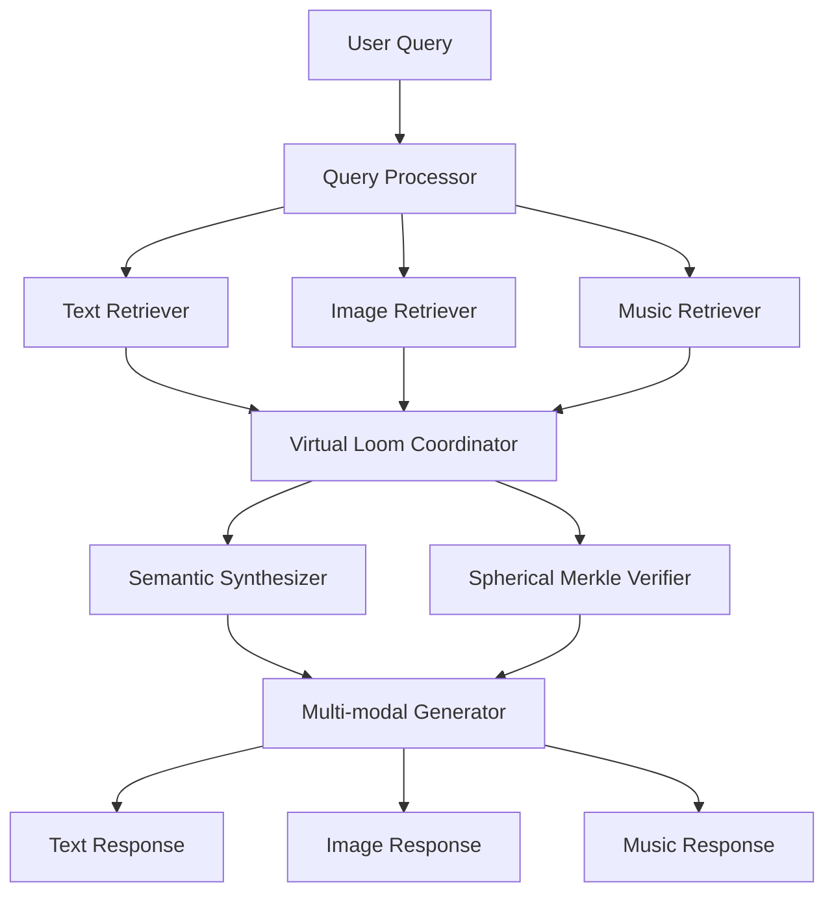
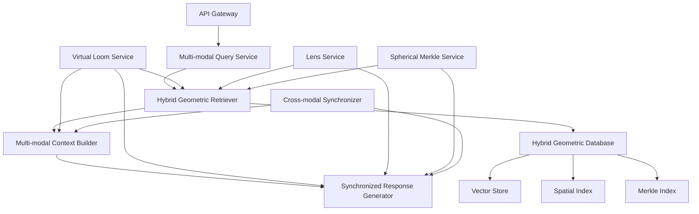
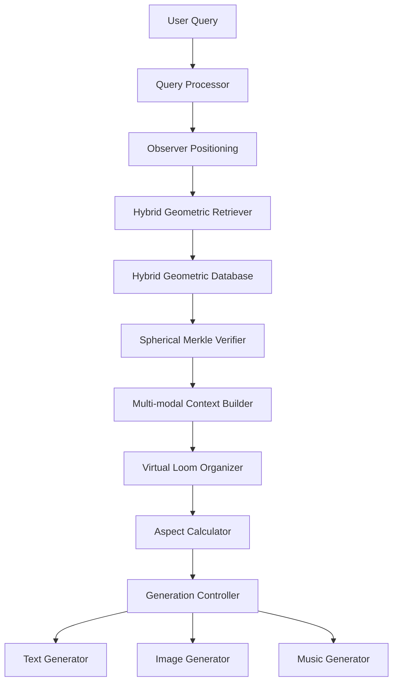
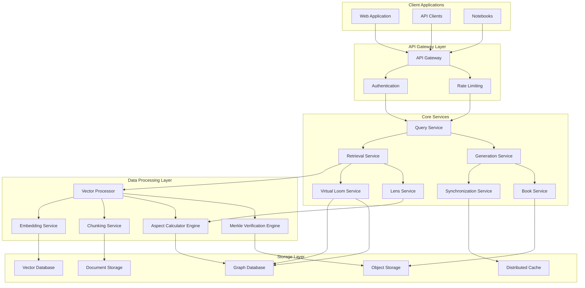

# 3.5.1 Machine System RAG Enhancements

## Enhanced Machine System RAG Design Specification

The following document specifies the enhanced Machine System RAG design for the machine system. This design extends the cybernetic system design. The following section will consolidate the cybernetic and machine systems design, finally updating it with the Machine System RAG.

## 1. Integration of Machine Book System with RAG

The Enhanced Machine System RAG design integrates the multi-modal knowledge architecture from the Machine Book System with advanced retrieval-augmented generation techniques. This integration enables a comprehensive framework for knowledge retrieval, synthesis, and representation across text, images, and music modalities.

### 1.1 Multi-modal RAG Architecture

The Enhanced RAG architecture extends traditional text-based retrieval to incorporate multi-modal content:



### 1.2 Virtual Loom Integration

The Virtual Loom serves as the unifying organizational framework for RAG operations:

| Loom Component | RAG Function | Implementation |
|----------------|--------------|----------------|
| Warp Threads | Thematic Content Retrieval | Organizes retrieved content by thematic dimensions |
| Weft Threads | Contextual Filtering | Filters content based on contextual dimensions |
| Intersections | Relevance Hotspots | Identifies high-relevance knowledge nodes |
| Glass Beads | Knowledge Artifacts | Represents retrieved multi-modal content units |

### 1.3 Spherical Merkle Verification

The RAG system employs Spherical Merkle Trees to verify the integrity and provenance of retrieved information:

- Content verification using spatial-aware hashing
- Source attribution through angular relationship tracking
- Confidence scoring via geometric distance metrics

## 2. Enhanced RAG Components

### 2.1 Multi-modal Chunking and Indexing

```rust
struct MultiModalChunker {
    text_chunker: TextChunker,
    image_chunker: ImageChunker,
    music_chunker: MusicChunker,
    cross_modal_linker: CrossModalLinker,
    
    fn chunk_machine_book(&self, book: &MachineBook) -> Result<MultiModalChunks> {
        // Process all modalities in parallel
        let (text_chunks, image_chunks, music_chunks) = join!(
            self.text_chunker.chunk_content(&book.text_outputs),
            self.image_chunker.chunk_content(&book.image_outputs),
            self.music_chunker.chunk_content(&book.music_outputs)
        )?;
        
        // Create cross-modal links based on synchronization points
        let cross_modal_links = self.cross_modal_linker.create_links(
            &text_chunks,
            &image_chunks,
            &music_chunks,
            &book.sync_points
        )?;
        
        // Organize chunks using Virtual Loom structure
        let organized_chunks = self.organize_by_loom(
            &text_chunks,
            &image_chunks,
            &music_chunks,
            &cross_modal_links,
            &book.loom
        )?;
        
        Ok(MultiModalChunks {
            text_chunks,
            image_chunks,
            music_chunks,
            cross_modal_links,
            organized_chunks,
        })
    }
}
```

### 2.2 Hybrid Geometric Vector Database

The RAG system utilizes a specialized vector database that implements the hybrid spherical-hyperbolic geometry:

```rust
struct HybridGeometricDatabase {
    vector_store: VectorStore,
    spatial_index: SpatialIndex,
    merkle_index: MerkleIndex,
    
    fn insert_chunks(&self, chunks: &MultiModalChunks) -> Result<()> {
        // Convert chunks to hybrid geometric vectors
        let text_vectors = self.chunks_to_vectors(&chunks.text_chunks, Modality::Text)?;
        let image_vectors = self.chunks_to_vectors(&chunks.image_chunks, Modality::Image)?;
        let music_vectors = self.chunks_to_vectors(&chunks.music_chunks, Modality::Music)?;
        
        // Store vectors with spatial relationship preservation
        self.vector_store.insert_batch(text_vectors)?;
        self.vector_store.insert_batch(image_vectors)?;
        self.vector_store.insert_batch(music_vectors)?;
        
        // Build spatial index for efficient similarity search
        self.spatial_index.build_index(
            &text_vectors,
            &image_vectors,
            &music_vectors,
            &chunks.cross_modal_links
        )?;
        
        // Build Merkle index for verification
        self.merkle_index.build_index(
            &text_vectors,
            &image_vectors,
            &music_vectors,
            &chunks.cross_modal_links
        )?;
        
        Ok(())
    }
    
    fn search(&self, query: &MultiModalQuery, options: &SearchOptions) -> Result<SearchResults> {
        // Process query across modalities
        let query_vector = self.process_query(query)?;
        
        // Calculate curvature for query context
        let kappa = self.calculate_query_curvature(query)?;
        
        // Perform hybrid-space search with curvature adaptation
        let raw_results = self.vector_store.search(
            &query_vector, 
            options.limit, 
            kappa
        )?;
        
        // Enhance results with spatial context
        let enhanced_results = self.spatial_index.enhance_results(
            &raw_results,
            query,
            &options.spatial_options
        )?;
        
        // Verify results integrity
        let verified_results = self.merkle_index.verify_results(
            &enhanced_results,
            &options.verification_options
        )?;
        
        Ok(verified_results)
    }
}
```

### 2.3 Multi-modal Query Processor

```rust
struct MultiModalQueryProcessor {
    text_analyzer: TextAnalyzer,
    image_analyzer: ImageAnalyzer,
    music_analyzer: MusicAnalyzer,
    loom_mapper: LoomMapper,
    
    fn process_query(&self, query: &UserQuery) -> Result<MultiModalQuery> {
        // Extract modality-specific components
        let text_components = self.text_analyzer.extract_components(&query.text)?;
        let image_components = if let Some(image) = &query.image {
            self.image_analyzer.extract_components(image)?
        } else {
            Vec::new()
        };
        let music_components = if let Some(audio) = &query.audio {
            self.music_analyzer.extract_components(audio)?
        } else {
            Vec::new()
        };
        
        // Map query components to Virtual Loom structure
        let loom_mapping = self.loom_mapper.map_query_to_loom(
            &text_components,
            &image_components,
            &music_components
        )?;
        
        // Generate hybrid geometric vector for query
        let query_vector = self.generate_hybrid_vector(
            &text_components,
            &image_components,
            &music_components,
            &loom_mapping
        )?;
        
        Ok(MultiModalQuery {
            text_components,
            image_components,
            music_components,
            loom_mapping,
            query_vector,
        })
    }
}
```

### 2.4 Cross-modal Synchronizer

```rust
struct CrossModalSynchronizer {
    text_processor: TextProcessor,
    image_processor: ImageProcessor,
    music_processor: MusicProcessor,
    
    fn synchronize_results(&self, results: &MultiModalResults) -> Result<SynchronizedResults> {
        // Identify synchronization points across modalities
        let sync_points = self.identify_sync_points(
            &results.text_results,
            &results.image_results,
            &results.music_results
        )?;
        
        // Align content by synchronization points
        let aligned_content = self.align_content(
            &results.text_results,
            &results.image_results,
            &results.music_results,
            &sync_points
        )?;
        
        // Resolve conflicts in cross-modal information
        let resolved_content = self.resolve_conflicts(
            &aligned_content,
            &sync_points
        )?;
        
        // Create temporal flow for synchronized presentation
        let temporal_flow = self.create_temporal_flow(
            &resolved_content,
            &sync_points
        )?;
        
        Ok(SynchronizedResults {
            aligned_content,
            resolved_content,
            sync_points,
            temporal_flow,
        })
    }
}
```

## 3. Advanced RAG Techniques

### 3.1 Hybrid Spherical-Hyperbolic Retrieval

The system employs advanced geometric techniques for retrieval:

```rust
struct HybridGeometricRetriever {
    hybrid_database: HybridGeometricDatabase,
    curvature_adapter: CurvatureAdapter,
    lens_selector: LensSelector,
    
    fn retrieve(&self, query: &MultiModalQuery, options: &RetrievalOptions) -> Result<RetrievalResults> {
        // Calculate optimal curvature for query context
        let optimal_curvature = self.curvature_adapter.calculate_optimal_curvature(query)?;
        
        // Select appropriate lenses for query perspective
        let lenses = self.lens_selector.select_lenses(query, &options.lens_options)?;
        
        // Apply lens transformations to query vector
        let transformed_query = self.apply_lenses(query, &lenses)?;
        
        // Perform hybrid-space search with adaptive curvature
        let search_results = self.hybrid_database.search(
            &transformed_query,
            &SearchOptions {
                limit: options.limit,
                curvature: optimal_curvature,
                lens_transforms: lenses,
                ..options.search_options.clone()
            }
        )?;
        
        // Extract and enrich results
        let enriched_results = self.enrich_results(search_results, query, &lenses)?;
        
        Ok(RetrievalResults {
            results: enriched_results,
            curvature: optimal_curvature,
            lenses,
        })
    }
    
    fn apply_lenses(&self, query: &MultiModalQuery, lenses: &[Lens]) -> Result<MultiModalQuery> {
        let mut transformed_query = query.clone();
        
        for lens in lenses {
            // Transform query vector through lens
            transformed_query.query_vector = self.curvature_adapter.apply_lens_transform(
                transformed_query.query_vector,
                lens
            )?;
            
            // Update loom mapping based on lens perspective
            transformed_query.loom_mapping = self.update_loom_mapping(
                &transformed_query.loom_mapping,
                lens
            )?;
        }
        
        Ok(transformed_query)
    }
}
```

### 3.2 Multi-modal Context Builder

```rust
struct MultiModalContextBuilder {
    text_context_builder: TextContextBuilder,
    image_context_builder: ImageContextBuilder,
    music_context_builder: MusicContextBuilder,
    cross_modal_integrator: CrossModalIntegrator,
    
    fn build_context(&self, retrieval_results: &RetrievalResults, query: &MultiModalQuery) -> Result<GenerationContext> {
        // Build modality-specific contexts
        let text_context = self.text_context_builder.build(
            &retrieval_results.text_results,
            &query.text_components
        )?;
        
        let image_context = self.image_context_builder.build(
            &retrieval_results.image_results,
            &query.image_components
        )?;
        
        let music_context = self.music_context_builder.build(
            &retrieval_results.music_results,
            &query.music_components
        )?;
        
        // Integrate contexts across modalities
        let integrated_context = self.cross_modal_integrator.integrate(
            text_context,
            image_context,
            music_context,
            &retrieval_results.sync_points
        )?;
        
        // Create Virtual Loom structure for generation
        let loom_structure = self.create_loom_for_generation(
            integrated_context,
            query,
            retrieval_results
        )?;
        
        // Apply verification context
        let verified_context = self.apply_verification_context(
            integrated_context,
            &retrieval_results.verification_data
        )?;
        
        Ok(GenerationContext {
            integrated_context,
            loom_structure,
            verification_data: retrieval_results.verification_data.clone(),
        })
    }
}
```

### 3.3 Synchronized Response Generator

```rust
struct SynchronizedResponseGenerator {
    text_generator: TextGenerator,
    image_generator: ImageGenerator,
    music_generator: MusicGenerator,
    sync_coordinator: SyncCoordinator,
    
    fn generate_response(&self, context: &GenerationContext, query: &MultiModalQuery) -> Result<MultiModalResponse> {
        // Create unified semantic core for all modalities
        let semantic_core = self.create_semantic_core(context, query)?;
        
        // Generate responses in parallel with synchronization
        let (text_response, image_response, music_response) = self.sync_coordinator.coordinate_generation(
            || self.text_generator.generate(context, query, &semantic_core),
            || self.image_generator.generate(context, query, &semantic_core),
            || self.music_generator.generate(context, query, &semantic_core)
        )?;
        
        // Create synchronization points for response
        let sync_points = self.sync_coordinator.create_response_sync_points(
            &text_response,
            &image_response,
            &music_response,
            &semantic_core
        )?;
        
        // Verify response integrity
        let verification = self.verify_response_integrity(
            &text_response,
            &image_response,
            &music_response,
            &context.verification_data
        )?;
        
        Ok(MultiModalResponse {
            text_response,
            image_response,
            music_response,
            sync_points,
            verification,
        })
    }
}
```

## 4. Implementation Architecture

### 4.1 System Architecture



### 4.2 Processing Pipeline

The enhanced RAG system implements a specialized processing pipeline:

1. **Query Processing**
   - Multi-modal query parsing
   - Hybrid vector creation
   - Virtual Loom mapping

2. **Retrieval**
   - Curvature-adaptive search
   - Lens-transformed retrieval
   - Spherical Merkle verification

3. **Context Building**
   - Cross-modal integration
   - Loom-structured organization
   - Verification context application

4. **Generation**
   - Synchronized multi-modal generation
   - Cross-modal coherence enforcement
   - Verification embedding

5. **Response Delivery**
   - Multi-layered response formatting
   - Client-adaptive presentation
   - Verification proof inclusion

## 5. Extensions and Future Work

### 5.1 Time State Integration

The RAG system supports multiple time states from the Machine Book System:

- **Mundane Time**: Standard temporal RAG with time-based filters
- **Quantum Time**: Probabilistic RAG with superposition of results
- **Holographic Time**: Reference-frame RAG with perspective shifts

### 5.2 MST-Compliant Representations

The system ensures all generated content follows MST (Machine State Transition) compliance for theoretical accuracy.

### 5.3 Token Economics Integration

The RAG system implements token economics from section 2.18:

| Operation | GBT Cost | Description |
|-----------|----------|-------------|
| Basic RAG Query | 5.0 GBT | Simple retrieval and generation |
| Multi-modal Query | 10-20 GBT | Cross-modal retrieval |
| Lens-transformed Query | +5-10 GBT | Per lens addition |
| Verified Retrieval | +3-5 GBT | With Merkle verification |
| Synchronized Response | +5-10 GBT | Cross-modal synchronization |

## 6. Conclusion

The Enhanced Machine System RAG design integrates the rich multi-modal knowledge architecture of Machine Books with advanced retrieval-augmented generation techniques. By unifying these systems through the Virtual Loom framework and Spherical Merkle verification, the enhanced RAG system enables unprecedented knowledge retrieval, synthesis, and representation capabilities across text, images, and music.

This integration addresses the limitations of traditional RAG systems by expanding beyond text-only retrieval, enabling cross-modal knowledge access, and ensuring the integrity and provenance of information through geometric verification mechanisms.

This enhanced system represents a significant advancement in knowledge retrieval and generation, creating a seamless bridge between existing knowledge and new content within a coherent conceptual framework.

## 7. Integration with Earth/Observer-Centric Generative AI System

Building on the enhanced RAG system, this section integrates the Earth/Observer-centric generative AI design to create a comprehensive framework that leverages both retrieval and generation capabilities within a unified conceptual model.

The enhanced RAG system incorporates the Earth/Observer-centric model to provide a unified reference frame for knowledge retrieval and generation:



This lens-enhanced retrieval system enables multiple perspective-based retrievals from the same knowledge space, providing rich interpretive frameworks for understanding retrieved content. By positioning the observer in different locations within the knowledge space, the system can retrieve and generate content from various perspectives, enhancing the contextual understanding of complex topics.

Key integration points include:

1. **Observer Positioning System**: Allows specification of viewpoint for retrieval
2. **Aspect-Based Retrieval**: Retrieves content based on specific aspects of knowledge
3. **Lens Transformation Pipeline**: Applies interpretive frameworks to retrieved content
4. **Multi-Modal Synchronization**: Ensures coherence across modalities from the observer's perspective

## 8. Unified GBT Cost Structure for Enhanced RAG

The enhanced RAG system integrates the generative AI GBT cost structure with RAG-specific operations:

| Operation | GBT Cost | Description |
|-----------|----------|-------------|
| Basic RAG Query | 5.0 GBT | Simple retrieval and generation |
| Multi-modal Query | 10-20 GBT | Cross-modal retrieval |
| Lens-transformed Query | +5-10 GBT | Per lens addition |
| Verified Retrieval | +3-5 GBT | With Merkle verification |
| Synchronized Response | +5-10 GBT | Cross-modal synchronization |

Additional factors affecting cost:

1. **Observer Complexity**: +10-30% for non-standard observer positions
2. **Curvature Adjustment**: +15-40% for high-curvature spaces
3. **Verification Depth**: +5-25% for deep verification chains
4. **Temporal State**: +20-50% for quantum and holographic time states
5. **Multi-user Collaboration**: +30-60% for shared workspace operations

## 9. Conclusion

The integration of the Earth/Observer-centric generative AI system with the enhanced RAG design creates a comprehensive framework that leverages both retrieval and generation capabilities within a unified conceptual model. This integration addresses the limitations of traditional RAG systems by:

1. Providing a geocentric reference frame for knowledge organization
2. Enabling aspect-based relationships between retrieved and generated content
3. Supporting multi-modal retrieval and generation with synchronized outputs
4. Organizing knowledge through the Virtual Loom and Book structure
5. Offering multiple interpretive frameworks through the Lens system
6. Ensuring integrity and provenance through Spherical Merkle verification

This enhanced system represents a significant advancement in knowledge retrieval and generation, creating a seamless bridge between existing knowledge and new content within a coherent conceptual framework.

## 10. Technical Architecture

This section outlines the technical implementation architecture for the Enhanced Machine System RAG, providing specific technology choices, system design, and implementation strategies.

### 10.1 Technology Stack

The following technology stack is recommended for implementing the Enhanced Machine System RAG:

| Component | Technology | Rationale |
|-----------|------------|-----------|
| **Backend API Framework** | FastAPI | High-performance asynchronous framework suitable for vector operations |
| **Vector Database** | Milvus/Qdrant/Pinecone | Specialized vector databases with support for hybrid searches |
| **Document Processing** | LangChain & LlamaIndex | Frameworks for document processing and RAG pipelines |
| **Graph Database** | Neo4j | For relationship mapping between entities and thread structures |
| **Cache Layer** | Redis | High-performance caching for vector retrieval results |
| **Message Broker** | Apache Kafka | Handling cross-modal synchronization events |
| **ML Framework** | PyTorch | For custom geometric embeddings and aspect calculations |
| **Merkle Implementation** | Custom + Merkle-CRDTs | Custom spherical Merkle trees with CRDT properties |
| **Cloud Infrastructure** | Kubernetes + Terraform | Scalable, reproducible infrastructure |
| **Observability** | OpenTelemetry + Grafana | Comprehensive monitoring and debugging |

### 10.2 System Architecture

The system architecture follows a microservices pattern with domain-specific services:



### 10.3 Vector Database Implementation

The hybrid geometric vector database implementation requires custom extensions to standard vector databases:

```python
class HybridGeometricVectorStore:
    def __init__(self, 
                 vector_db_client, 
                 curvature_adapter,
                 merkle_service):
        self.vector_db = vector_db_client
        self.curvature_adapter = curvature_adapter
        self.merkle_service = merkle_service
        self.index_manager = IndexManager()
        
    async def create_hybrid_index(self, 
                                 collection_name: str,
                                 dimensionality: int = 1536,
                                 metric_type: str = "COSINE",
                                 curvature_type: str = "adaptive"):
        """Create a hybrid index with curvature adaptation."""
        # Create base vector index
        await self.vector_db.create_collection(
            collection_name=collection_name,
            dimension=dimensionality,
            metric_type=metric_type
        )
        
        # Add custom parameters for curvature
        curvature_params = self.curvature_adapter.get_index_params(curvature_type)
        await self.vector_db.alter_collection(
            collection_name=collection_name,
            extra_params=curvature_params
        )
        
        # Register with Merkle service
        await self.merkle_service.register_collection(collection_name)
        
        # Track in index manager
        self.index_manager.register_index(
            collection_name, 
            dimensionality, 
            metric_type, 
            curvature_type
        )
        
    async def insert_with_merkle(self, 
                                collection_name: str, 
                                vectors: List[List[float]],
                                metadatas: List[Dict],
                                observer_positions: Optional[List[List[float]]] = None):
        """Insert vectors with Merkle verification."""
        # Generate IDs
        ids = [uuid.uuid4().hex for _ in range(len(vectors))]
        
        # Adapt vectors based on curvature if needed
        adapted_vectors = await self.curvature_adapter.adapt_vectors(
            vectors, 
            collection_name
        )
        
        # Insert into vector DB
        await self.vector_db.insert(
            collection_name=collection_name,
            vectors=adapted_vectors,
            ids=ids,
            metadatas=metadatas
        )
        
        # Update Merkle tree
        merkle_records = []
        for idx, (vector, metadata, id_val) in enumerate(zip(vectors, metadatas, ids)):
            observer_pos = observer_positions[idx] if observer_positions else None
            merkle_record = await self.merkle_service.add_vector_to_tree(
                collection_name=collection_name,
                vector_id=id_val,
                vector=vector,
                metadata=metadata,
                observer_position=observer_pos
            )
            merkle_records.append(merkle_record)
            
        return ids, merkle_records
    
    async def search_with_observer(self,
                                  collection_name: str,
                                  query_vector: List[float],
                                  observer_position: List[float],
                                  limit: int = 10,
                                  curvature: float = None,
                                  filter_expr: Optional[str] = None,
                                  verify: bool = True):
        """Search with observer position consideration."""
        # Transform query vector based on observer position
        transformed_vector = await self.curvature_adapter.transform_by_observer(
            query_vector, 
            observer_position,
            curvature
        )
        
        # Perform search
        search_results = await self.vector_db.search(
            collection_name=collection_name,
            query_vector=transformed_vector,
            limit=limit,
            filter=filter_expr
        )
        
        # Verify results if requested
        if verify:
            verified_results = []
            for result in search_results:
                verification = await self.merkle_service.verify_vector(
                    collection_name=collection_name,
                    vector_id=result.id,
                    expected_vector=result.vector
                )
                
                if verification.verified:
                    result.verification = verification
                    verified_results.append(result)
                else:
                    # Log verification failure
                    logger.warning(f"Verification failed for vector {result.id}")
            
            return verified_results
        
        return search_results
```

### 10.4 Multi-modal Chunking Implementation

The multi-modal chunking service processes various content types into appropriate chunks:

```python
class MultiModalChunkProcessor:
    def __init__(self,
                text_processor,
                image_processor,
                music_processor,
                embedding_service):
        self.text_processor = text_processor
        self.image_processor = image_processor
        self.music_processor = music_processor
        self.embedding_service = embedding_service
        
    async def process_document(self, document_id, content_type, content):
        """Process a document into chunks based on content type."""
        chunks = []
        
        if content_type == "text":
            chunks = await self.text_processor.chunk(content, {
                'chunk_size': 512,
                'chunk_overlap': 50,
                'semantic_breakpoints': True
            })
        elif content_type == "image":
            chunks = await self.image_processor.chunk(content, {
                'segmentation_model': 'segment-anything',
                'feature_extractor': 'clip-vit-large-patch14',
                'segment_overlap': 0.2
            })
        elif content_type == "music":
            chunks = await self.music_processor.chunk(content, {
                'chunk_duration': 10,  # seconds
                'overlap': 2,
                'feature_type': 'mel_spectrogram'
            })
        elif content_type == "mixed":
            # For documents with multiple modalities
            chunks = await self.process_mixed_content(content)
        else:
            raise ValueError(f"Unsupported content type: {content_type}")
            
        # Generate embeddings for each chunk
        chunk_ids = []
        for chunk in chunks:
            embedding = await self.embedding_service.generate_embedding(
                content=chunk.content,
                content_type=chunk.type
            )
            
            chunk_id = await self.store_chunk(
                document_id=document_id,
                chunk=chunk,
                embedding=embedding
            )
            chunk_ids.append(chunk_id)
            
        return chunk_ids
        
    async def process_mixed_content(self, mixed_content):
        """Process content with multiple modalities."""
        # Extract content by type
        text_parts = mixed_content.get('text', [])
        image_parts = mixed_content.get('images', [])
        music_parts = mixed_content.get('music', [])
        
        # Process each modality
        text_chunks = []
        for text in text_parts:
            text_chunks.extend(await self.text_processor.chunk(text))
            
        image_chunks = []
        for image in image_parts:
            image_chunks.extend(await self.image_processor.chunk(image))
            
        music_chunks = []
        for music in music_parts:
            music_chunks.extend(await self.music_processor.chunk(music))
            
        # Create cross-modal links
        linked_chunks = await self.create_cross_modal_links(
            text_chunks, 
            image_chunks, 
            music_chunks,
            mixed_content.get('sync_points', [])
        )
        
        return linked_chunks
        
    async def create_cross_modal_links(self, text_chunks, image_chunks, 
                                      music_chunks, sync_points):
        """Create links between chunks of different modalities."""
        all_chunks = text_chunks + image_chunks + music_chunks
        
        # Map sync points to chunks
        for sync_point in sync_points:
            text_pos = sync_point.get('text_position')
            image_pos = sync_point.get('image_position')
            music_pos = sync_point.get('music_position')
            
            matching_text_chunks = [c for c in text_chunks 
                                  if c.contains_position(text_pos)]
            matching_image_chunks = [c for c in image_chunks 
                                    if c.contains_position(image_pos)]
            matching_music_chunks = [c for c in music_chunks 
                                    if c.contains_position(music_pos)]
            
            # Create cross-modal connections
            for t_chunk in matching_text_chunks:
                for i_chunk in matching_image_chunks:
                    t_chunk.add_connection(i_chunk.id, sync_point)
                    i_chunk.add_connection(t_chunk.id, sync_point)
                    
                for m_chunk in matching_music_chunks:
                    t_chunk.add_connection(m_chunk.id, sync_point)
                    m_chunk.add_connection(t_chunk.id, sync_point)
            
            for i_chunk in matching_image_chunks:
                for m_chunk in matching_music_chunks:
                    i_chunk.add_connection(m_chunk.id, sync_point)
                    m_chunk.add_connection(i_chunk.id, sync_point)
        
        return all_chunks
```

### 10.5 Virtual Loom Technical Implementation

The Virtual Loom implementation combines graph database structures with custom spatial calculations:

```typescript
interface Thread {
    id: string;
    type: 'warp' | 'weft';
    position: number;
    theme: string;
    vectorRepresentation: number[];
}

interface Intersection {
    id: string;
    warpThreadId: string;
    weftThreadId: string;
    position: {x: number, y: number};
    significance: number;
}

interface Bead {
    id: string;
    intersectionId: string;
    contentId: string;
    contentType: 'text' | 'image' | 'music' | 'mixed';
    metadata: Record<string, any>;
    vectorRepresentation: number[];
}

class VirtualLoomService {
    private graphClient: Neo4jClient;
    private vectorClient: VectorClient;
    
    constructor(graphClient: Neo4jClient, vectorClient: VectorClient) {
        this.graphClient = graphClient;
        this.vectorClient = vectorClient;
    }
    
    async createLoom(params: {
        bookId: string;
        warpCount: number;
        weftCount: number;
        name?: string;
        description?: string;
    }): Promise<string> {
        const loomId = uuidv4();
        
        // Create loom node in graph database
        await this.graphClient.runQuery(`
            CREATE (l:Loom {
                id: $loomId,
                bookId: $bookId,
                warpCount: $warpCount,
                weftCount: $weftCount,
                name: $name,
                description: $description,
                createdAt: datetime()
            })
            RETURN l
        `, {
            loomId,
            bookId: params.bookId,
            warpCount: params.warpCount,
            weftCount: params.weftCount,
            name: params.name || `Loom ${loomId.substring(0, 8)}`,
            description: params.description || ''
        });
        
        return loomId;
    }
    
    async createThreads(loomId: string, threads: Array<{
        type: 'warp' | 'weft';
        position: number;
        theme: string;
        vectorRepresentation?: number[];
    }>): Promise<string[]> {
        const threadIds: string[] = [];
        
        // Process in batches to avoid transaction size limits
        const batches = chunk(threads, 100);
        
        for (const batch of batches) {
            const batchWithIds = batch.map(thread => ({
                ...thread,
                id: uuidv4(),
                loomId
            }));
            
            // Store vectors if provided
            const vectorsToStore = batchWithIds
                .filter(t => t.vectorRepresentation)
                .map(t => ({
                    id: t.id,
                    vector: t.vectorRepresentation,
                    metadata: {
                        type: 'thread',
                        threadType: t.type,
                        loomId,
                        theme: t.theme,
                        position: t.position
                    }
                }));
                
            if (vectorsToStore.length > 0) {
                await this.vectorClient.upsert('threads', vectorsToStore);
            }
            
            // Create thread nodes and connect to loom
            await this.graphClient.runQuery(`
                MATCH (l:Loom {id: $loomId})
                UNWIND $threads AS thread
                CREATE (t:Thread {
                    id: thread.id,
                    type: thread.type,
                    position: thread.position,
                    theme: thread.theme,
                    loomId: $loomId
                })
                CREATE (t)-[:PART_OF]->(l)
                RETURN t.id
            `, {
                loomId,
                threads: batchWithIds
            });
            
            threadIds.push(...batchWithIds.map(t => t.id));
        }
        
        // Create intersections
        await this.createIntersections(loomId);
        
        return threadIds;
    }
    
    private async createIntersections(loomId: string): Promise<void> {
        // Find all warp and weft threads
        const result = await this.graphClient.runQuery(`
            MATCH (l:Loom {id: $loomId})<-[:PART_OF]-(t:Thread)
            RETURN t.id AS id, t.type AS type, t.position AS position
        `, { loomId });
        
        const warpThreads = result.records
            .filter(r => r.get('type') === 'warp')
            .map(r => ({ id: r.get('id'), position: r.get('position') }));
            
        const weftThreads = result.records
            .filter(r => r.get('type') === 'weft')
            .map(r => ({ id: r.get('id'), position: r.get('position') }));
        
        // Create intersections for each warp-weft pair
        const intersections = [];
        
        for (const warp of warpThreads) {
            for (const weft of weftThreads) {
                intersections.push({
                    id: uuidv4(),
                    warpThreadId: warp.id,
                    weftThreadId: weft.id,
                    position: {
                        x: warp.position,
                        y: weft.position
                    },
                    loomId
                });
            }
        }
        
        // Store intersections in batches
        const batches = chunk(intersections, 1000);
        
        for (const batch of batches) {
            await this.graphClient.runQuery(`
                MATCH (w:Thread {id: $warpId})
                MATCH (f:Thread {id: $weftId})
                CREATE (i:Intersection {
                    id: $id,
                    position: $position,
                    loomId: $loomId
                })
                CREATE (i)-[:CONNECTS]->(w)
                CREATE (i)-[:CONNECTS]->(f)
                RETURN i.id
            `, batch);
        }
    }
    
    async placeBead(params: {
        loomId: string;
        intersectionId: string;
        contentId: string;
        contentType: string;
        metadata: Record<string, any>;
        vectorRepresentation: number[];
    }): Promise<string> {
        const beadId = uuidv4();
        
        // Store bead vector
        await this.vectorClient.upsert('beads', [{
            id: beadId,
            vector: params.vectorRepresentation,
            metadata: {
                type: 'bead',
                loomId: params.loomId,
                intersectionId: params.intersectionId,
                contentType: params.contentType,
                ...params.metadata
            }
        }]);
        
        // Create bead node and connect to intersection
        await this.graphClient.runQuery(`
            MATCH (i:Intersection {id: $intersectionId})
            CREATE (b:Bead {
                id: $beadId,
                contentId: $contentId,
                contentType: $contentType,
                metadata: $metadata,
                loomId: $loomId,
                createdAt: datetime()
            })
            CREATE (b)-[:PLACED_AT]->(i)
            RETURN b.id
        `, {
            beadId,
            intersectionId: params.intersectionId,
            contentId: params.contentId,
            contentType: params.contentType,
            metadata: params.metadata,
            loomId: params.loomId
        });
        
        return beadId;
    }
    
    async findBeadsAlongPath(params: {
        loomId: string;
        startThreadId: string;
        endThreadId: string;
        maxHops?: number;
    }): Promise<Bead[]> {
        const maxHops = params.maxHops || 5;
        
        // Find path through the loom
        const result = await this.graphClient.runQuery(`
            MATCH path = (start:Thread {id: $startThreadId})-[:CONNECTS*1..${maxHops}]->(end:Thread {id: $endThreadId})
            WHERE all(thread IN nodes(path) WHERE thread:Thread AND thread.loomId = $loomId)
            WITH path, length(path) AS pathLength
            ORDER BY pathLength ASC
            LIMIT 1
            WITH nodes(path) AS threadPath
            MATCH (bead:Bead)-[:PLACED_AT]->(i:Intersection)-[:CONNECTS]->(t:Thread)
            WHERE t IN threadPath AND bead.loomId = $loomId
            RETURN bead
        `, {
            loomId: params.loomId,
            startThreadId: params.startThreadId,
            endThreadId: params.endThreadId
        });
        
        return result.records.map(r => r.get('bead').properties);
    }
}
```

### 10.6 Merkle Verification Implementation

The Spherical Merkle verification system implementation:

```typescript
interface MerkleNode {
    hash: string;
    sphericalCoordinates: {
        theta: number; // azimuthal angle
        phi: number;   // polar angle
        r: number;     // radius
    };
    children: string[];
    parentHash?: string;
    metadata: {
        contentId?: string;
        contentType?: string;
        timestamp: number;
        source?: string;
    };
}

class SphericalMerkleService {
    private dataStore: DataStore;
    private hashingService: HashingService;
    
    constructor(dataStore: DataStore, hashingService: HashingService) {
        this.dataStore = dataStore;
        this.hashingService = hashingService;
    }
    
    async createTree(params: {
        name: string;
        description?: string;
        rootMetadata?: Record<string, any>;
    }): Promise<string> {
        // Create root node at center of sphere
        const rootNode: MerkleNode = {
            hash: await this.hashingService.generateRootHash(params),
            sphericalCoordinates: {
                theta: 0,
                phi: 0,
                r: 0
            },
            children: [],
            metadata: {
                timestamp: Date.now(),
                ...params.rootMetadata
            }
        };
        
        // Store root node
        await this.dataStore.storeNode(rootNode);
        
        return rootNode.hash;
    }
    
    async addNode(params: {
        treeRootHash: string;
        parentHash?: string;
        content: any;
        contentType: string;
        sphericalCoordinates?: {
            theta: number;
            phi: number;
            r?: number;
        };
        metadata?: Record<string, any>;
    }): Promise<string> {
        // Default to parent hash as tree root if not specified
        const parentHash = params.parentHash || params.treeRootHash;
        
        // Get parent node
        const parentNode = await this.dataStore.getNode(parentHash);
        if (!parentNode) {
            throw new Error(`Parent node with hash ${parentHash} not found`);
        }
        
        // Calculate node coordinates
        let coordinates = params.sphericalCoordinates;
        if (!coordinates) {
            // Auto-place node based on content and existing nodes
            coordinates = await this.calculateOptimalCoordinates(
                params.treeRootHash,
                parentHash,
                params.content,
                params.contentType
            );
        }
        
        // Set radius if not specified
        if (coordinates.r === undefined) {
            coordinates.r = parentNode.sphericalCoordinates.r + 1;
        }
        
        // Hash content with coordinates for position-dependent hashing
        const nodeHash = await this.hashingService.hashWithCoordinates(
            params.content,
            coordinates,
            parentHash
        );
        
        // Create node
        const node: MerkleNode = {
            hash: nodeHash,
            sphericalCoordinates: {
                theta: coordinates.theta,
                phi: coordinates.phi,
                r: coordinates.r
            },
            children: [],
            parentHash,
            metadata: {
                contentId: await this.dataStore.storeContent(params.content),
                contentType: params.contentType,
                timestamp: Date.now(),
                ...params.metadata
            }
        };
        
        // Store node
        await this.dataStore.storeNode(node);
        
        // Update parent's children list
        parentNode.children.push(nodeHash);
        await this.dataStore.updateNode(parentNode);
        
        return nodeHash;
    }
    
    async verifyContent(params: {
        contentId: string;
        expectedHash?: string;
        verifyAgainstRoot?: boolean;
    }): Promise<{
        verified: boolean;
        path?: MerkleNode[];
        errorReason?: string;
    }> {
        // Retrieve content
        const content = await this.dataStore.getContent(params.contentId);
        if (!content) {
            return {
                verified: false,
                errorReason: `Content with ID ${params.contentId} not found`
            };
        }
        
        // Find node containing this content
        const node = await this.dataStore.findNodeByContentId(params.contentId);
        if (!node) {
            return {
                verified: false,
                errorReason: `No Merkle node references content ID ${params.contentId}`
            };
        }
        
        // Verify hash if expected hash provided
        if (params.expectedHash && node.hash !== params.expectedHash) {
            return {
                verified: false,
                errorReason: `Hash mismatch: expected ${params.expectedHash}, got ${node.hash}`
            };
        }
        
        // Verify against root if requested
        if (params.verifyAgainstRoot) {
            return await this.verifyNodeAgainstRoot(node);
        }
        
        return { verified: true, path: [node] };
    }
    
    private async verifyNodeAgainstRoot(node: MerkleNode): Promise<{
        verified: boolean;
        path?: MerkleNode[];
        errorReason?: string;
    }> {
        const path: MerkleNode[] = [node];
        let currentNode = node;
        
        // Trace path to root
        while (currentNode.parentHash) {
            const parentNode = await this.dataStore.getNode(currentNode.parentHash);
            if (!parentNode) {
                return {
                    verified: false,
                    path,
                    errorReason: `Parent node ${currentNode.parentHash} not found`
                };
            }
            
            // Verify parent includes this node as child
            if (!parentNode.children.includes(currentNode.hash)) {
                return {
                    verified: false,
                    path,
                    errorReason: `Parent node ${parentNode.hash} does not list ${currentNode.hash} as a child`
                };
            }
            
            path.push(parentNode);
            currentNode = parentNode;
        }
        
        // Verify hashes in the path
        for (let i = 0; i < path.length - 1; i++) {
            const child = path[i];
            const parent = path[i + 1];
            
            // Get content for child node
            const content = await this.dataStore.getContent(child.metadata.contentId);
            
            // Verify hash calculation
            const calculatedHash = await this.hashingService.hashWithCoordinates(
                content,
                child.sphericalCoordinates,
                parent.hash
            );
            
            if (calculatedHash !== child.hash) {
                return {
                    verified: false,
                    path,
                    errorReason: `Hash verification failed for node ${child.hash}`
                };
            }
        }
        
        return { verified: true, path };
    }
    
    private async calculateOptimalCoordinates(
        rootHash: string,
        parentHash: string,
        content: any,
        contentType: string
    ): Promise<{ theta: number; phi: number; r: number }> {
        // Get content vector representation
        const contentVector = await this.hashingService.getVectorRepresentation(
            content, 
            contentType
        );
        
        // Get parent node and its children
        const parentNode = await this.dataStore.getNode(parentHash);
        const siblingHashes = parentNode.children;
        
        // Get sibling nodes
        const siblingNodes = await Promise.all(
            siblingHashes.map(hash => this.dataStore.getNode(hash))
        );
        
        // Avoid collisions with siblings
        const reservedPositions = siblingNodes.map(
            node => node.sphericalCoordinates
        );
        
        // Calculate optimal position based on content and existing nodes
        const optimalPosition = await this.hashingService.calculateOptimalSpherePosition(
            contentVector,
            reservedPositions,
            parentNode.sphericalCoordinates
        );
        
        return {
            theta: optimalPosition.theta,
            phi: optimalPosition.phi,
            r: parentNode.sphericalCoordinates.r + 1
        };
    }
}
```

### 10.7 Deployment and Scaling Architecture

The system deployment architecture uses Kubernetes for scalability:

```yaml
# Kubernetes deployment for RAG services
apiVersion: apps/v1
kind: Deployment
metadata:
  name: rag-api-gateway
spec:
  replicas: 3
  selector:
    matchLabels:
      app: rag-api-gateway
  template:
    metadata:
      labels:
        app: rag-api-gateway
    spec:
      containers:
      - name: api-gateway
        image: memorativa/rag-api-gateway:v1.0.0
        ports:
        - containerPort: 8000
        resources:
          requests:
            memory: "1Gi"
            cpu: "500m"
          limits:
            memory: "2Gi"
            cpu: "1000m"
        env:
        - name: LOG_LEVEL
          value: "info"
        livenessProbe:
          httpGet:
            path: /health
            port: 8000
          initialDelaySeconds: 30
          periodSeconds: 10
---
apiVersion: apps/v1
kind: Deployment
metadata:
  name: vector-service
spec:
  replicas: 5
  selector:
    matchLabels:
      app: vector-service
  template:
    metadata:
      labels:
        app: vector-service
    spec:
      containers:
      - name: vector-service
        image: memorativa/vector-service:v1.0.0
        ports:
        - containerPort: 8001
        resources:
          requests:
            memory: "4Gi"
            cpu: "1000m"
          limits:
            memory: "8Gi"
            cpu: "2000m"
        env:
        - name: VECTOR_DB_HOST
          value: "milvus-service"
        - name: VECTOR_DB_PORT
          value: "19530"
        - name: REDIS_HOST
          value: "redis-master"
        livenessProbe:
          httpGet:
            path: /health
            port: 8001
---
apiVersion: apps/v1
kind: StatefulSet
metadata:
  name: milvus-service
spec:
  serviceName: "milvus"
  replicas: 3
  selector:
    matchLabels:
      app: milvus
  template:
    metadata:
      labels:
        app: milvus
    spec:
      containers:
      - name: milvus
        image: milvusdb/milvus:v2.2.0
        ports:
        - containerPort: 19530
        - containerPort: 9091
        volumeMounts:
        - name: milvus-data
          mountPath: /var/lib/milvus
        resources:
          requests:
            memory: "8Gi"
            cpu: "2000m"
          limits:
            memory: "16Gi"
            cpu: "4000m"
  volumeClaimTemplates:
  - metadata:
      name: milvus-data
    spec:
      accessModes: [ "ReadWriteOnce" ]
      resources:
        requests:
          storage: 100Gi
---
apiVersion: autoscaling/v2
kind: HorizontalPodAutoscaler
metadata:
  name: vector-service-hpa
spec:
  scaleTargetRef:
    apiVersion: apps/v1
    kind: Deployment
    name: vector-service
  minReplicas: 3
  maxReplicas: 10
  metrics:
  - type: Resource
    resource:
      name: cpu
      target:
        type: Utilization
        averageUtilization: 75
```

### 10.8 Performance Considerations

Key performance considerations for the Enhanced RAG implementation:

1. **Vector Operations Optimization**
   - Use GPU acceleration for vector similarity computations
   - Implement approximate nearest neighbor algorithms
   - Optimize curvature transformations with parallel processing

2. **Multi-modal Processing**
   - Implement batch processing for embedding generation
   - Use specialized hardware for image and audio processing
   - Parallelize modality-specific operations

3. **Caching Strategy**
   - Implement multi-level caching:
     - L1: In-memory cache for hot vectors
     - L2: Redis for distributed access
     - L3: Persistent vector store
   - Implement adaptive cache eviction based on access patterns

4. **Query Optimization**
   - Implement query parsing and planning
   - Use predicate pushdown for filtering
   - Implement specialized indexes for aspect calculations

5. **Scaling Approach**
   - Horizontal scaling for stateless services
   - Sharded vector database with consistent hashing
   - Parallelized generation pipelines

6. **Monitoring and Tuning**
   - Implement detailed telemetry for vector operations
   - Track per-operation latency and resource usage
   - Auto-tune system parameters based on workload

Performance targets for the system:

| Operation | Latency Target | Throughput Target |
|-----------|----------------|-------------------|
| Basic RAG Query | <500ms | 100 QPS |
| Multi-modal Query | <1s | 50 QPS |
| Aspect Calculation | <200ms | 200 QPS |
| Lens Transformation | <300ms | 100 QPS |
| Vector Retrieval | <100ms | 500 QPS |
| Text Generation | <2s | 20 QPS |
| Image Generation | <5s | 10 QPS |
| Music Generation | <3s | 15 QPS |
| Cross-modal Sync | <1s | 30 QPS |
