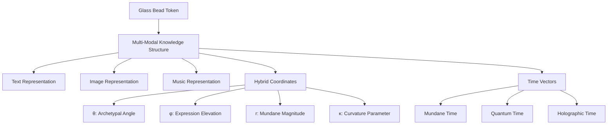
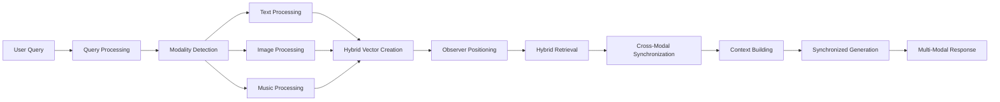
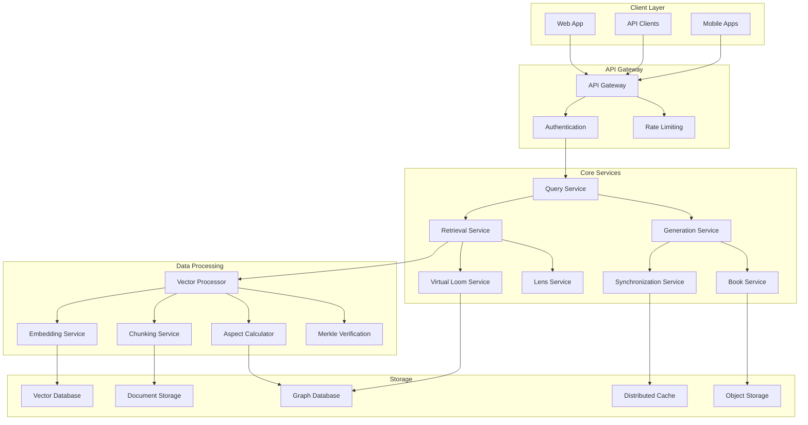

# 3.5.2. Machine System RAG Design

## 1. Core Architecture Integration

### 1.1 Unified Data Structure



### 1.2 Virtual Loom as Organizing Framework

```rust
struct VirtualLoom {
    warp_threads: Vec<WarpThread>,    // Thematic dimensions
    weft_threads: Vec<WeftThread>,    // Contextual dimensions
    intersections: HashMap<(usize, usize), Intersection>,
    beads: HashMap<String, Bead>,     // Knowledge elements at intersections
    
    fn place_bead(&mut self, warp_idx: usize, weft_idx: usize, content: MultiModalContent) -> Result<String, LoomError> {
        let intersection_key = (warp_idx, weft_idx);
        
        // Ensure intersection exists
        if !self.intersections.contains_key(&intersection_key) {
            return Err(LoomError::IntersectionNotFound);
        }
        
        // Create bead
        let bead_id = generate_uuid();
        let bead = Bead {
            id: bead_id.clone(),
            intersection: intersection_key,
            content,
            vector_representation: self.calculate_vector_representation(&content),
            timestamp: current_timestamp(),
        };
        
        // Store bead
        self.beads.insert(bead_id.clone(), bead);
        
        // Update intersection reference
        if let Some(intersection) = self.intersections.get_mut(&intersection_key) {
            intersection.beads.push(bead_id.clone());
        }
        
        Ok(bead_id)
    }
    
    fn follow_warp_thread(&self, warp_idx: usize, distance: usize) -> Vec<&Bead> {
        // Follow thematic thread
        let mut beads = Vec::new();
        
        if warp_idx >= self.warp_threads.len() {
            return beads;
        }
        
        // Gather beads along warp thread
        for weft_idx in 0..self.weft_threads.len() {
            let intersection_key = (warp_idx, weft_idx);
            if let Some(intersection) = self.intersections.get(&intersection_key) {
                for bead_id in &intersection.beads {
                    if let Some(bead) = self.beads.get(bead_id) {
                        beads.push(bead);
                        if beads.len() >= distance {
                            break;
                        }
                    }
                }
            }
            if beads.len() >= distance {
                break;
            }
        }
        
        beads
    }
}
```

## 2. Hybrid Geometric System

### 2.1 Unified Vector Database

```rust
struct HybridGeometricDatabase {
    vector_store: VectorStore,
    spatial_index: SpatialIndex,
    merkle_index: MerkleIndex,
    
    fn insert(&self, content: &MultiModalContent) -> Result<ContentId, DatabaseError> {
        // Generate hybrid coordinates
        let coordinates = self.calculate_hybrid_coordinates(content);
        
        // Create vector representation
        let vector = self.create_vector_representation(content, coordinates);
        
        // Store in vector database with spatial relationships preserved
        let content_id = self.vector_store.insert(vector, content.metadata)?;
        
        // Update spatial index
        self.spatial_index.insert(content_id, coordinates)?;
        
        // Update Merkle index for verification
        self.merkle_index.insert(content_id, content, coordinates)?;
        
        Ok(content_id)
    }
    
    fn search(&self, query: &MultiModalQuery) -> Result<Vec<SearchResult>, SearchError> {
        // Process query
        let (query_vector, curvature) = self.process_query(query)?;
        
        // Determine optimal search strategy based on curvature
        let search_strategy = if curvature > 0.0 {
            SearchStrategy::Hyperbolic
        } else if curvature < 0.0 {
            SearchStrategy::Spherical
        } else {
            SearchStrategy::Euclidean
        };
        
        // Perform search with appropriate strategy
        let results = self.vector_store.search(
            query_vector, 
            query.options.limit, 
            search_strategy,
            curvature
        )?;
        
        // Verify results if requested
        if query.options.verify {
            self.merkle_index.verify_results(&results)?;
        }
        
        // Enhance results with spatial context
        self.spatial_index.enhance_results(results, query)
    }
}
```

### 2.2 Observer-Relative Processing

```rust
struct ObserverPositioner {
    reference_frame: ReferenceFrame,
    coordinate_transformer: CoordinateTransformer,
    
    fn position_observer(&mut self, position: HybridCoordinates) {
        // Update reference frame
        self.reference_frame.update_position(position);
        
        // Update coordinate transformer
        self.coordinate_transformer.set_reference_position(position);
    }
    
    fn transform_to_observer_frame(&self, coordinates: &HybridCoordinates) -> HybridCoordinates {
        // Transform coordinates to observer's reference frame
        self.coordinate_transformer.transform_to_reference_frame(coordinates)
    }
    
    fn calculate_aspects(&self, triplets: &[ConceptTriplet]) -> Vec<AspectRelationship> {
        let mut aspects = Vec::new();
        
        // Transform all triplets to observer frame
        let transformed_triplets = triplets.iter()
            .map(|t| self.transform_triplet_to_observer_frame(t))
            .collect::<Vec<_>>();
        
        // Calculate aspects between transformed triplets
        for (i, t1) in transformed_triplets.iter().enumerate() {
            for (j, t2) in transformed_triplets.iter().enumerate() {
                if i >= j {
                    continue;
                }
                
                let angle = self.calculate_angle(t1, t2);
                if let Some(aspect) = self.detect_aspect(angle) {
                    aspects.push(AspectRelationship {
                        triplet1_id: triplets[i].id.clone(),
                        triplet2_id: triplets[j].id.clone(),
                        aspect_type: aspect.aspect_type,
                        angle: aspect.angle,
                        orb: aspect.orb,
                        strength: aspect.strength
                    });
                }
            }
        }
        
        aspects
    }
}
```

## 3. Multi-Modal Processing Pipeline

### 3.1 Processing Stages



### 3.2 Multi-Modal Query Processor

```rust
struct MultiModalQueryProcessor {
    text_analyzer: TextAnalyzer,
    image_analyzer: ImageAnalyzer,
    music_analyzer: MusicAnalyzer,
    observer_positioner: ObserverPositioner,
    lens_selector: LensSelector,
    
    fn process(&self, raw_query: &RawQuery) -> ProcessedQuery {
        // Detect modalities in query
        let modalities = self.detect_modalities(raw_query);
        
        // Process each modality
        let mut processed_components = Vec::new();
        
        if modalities.contains(Modality::Text) {
            let text_component = self.text_analyzer.analyze(&raw_query.text)?;
            processed_components.push(QueryComponent::Text(text_component));
        }
        
        if modalities.contains(Modality::Image) && raw_query.image.is_some() {
            let image_component = self.image_analyzer.analyze(raw_query.image.as_ref().unwrap())?;
            processed_components.push(QueryComponent::Image(image_component));
        }
        
        if modalities.contains(Modality::Music) && raw_query.audio.is_some() {
            let music_component = self.music_analyzer.analyze(raw_query.audio.as_ref().unwrap())?;
            processed_components.push(QueryComponent::Music(music_component));
        }
        
        // Position observer
        let observer_position = self.calculate_observer_position(&processed_components);
        self.observer_positioner.position_observer(observer_position);
        
        // Select appropriate lenses
        let lenses = self.lens_selector.select_lenses(&processed_components);
        
        // Create hybrid vector
        let hybrid_vector = self.create_hybrid_vector(&processed_components, &lenses);
        
        ProcessedQuery {
            components: processed_components,
            observer_position,
            lenses,
            hybrid_vector,
        }
    }
}
```

### 3.3 Cross-Modal Synchronizer

```rust
struct CrossModalSynchronizer {
    text_processor: TextProcessor,
    image_processor: ImageProcessor,
    music_processor: MusicProcessor,
    
    fn synchronize(&self, results: &MultiModalResults) -> SynchronizedResults {
        // Extract modality-specific results
        let text_results = results.get_text_results();
        let image_results = results.get_image_results();
        let music_results = results.get_music_results();
        
        // Identify synchronization points across modalities
        let sync_points = self.identify_sync_points(
            &text_results,
            &image_results,
            &music_results
        );
        
        // Align content by synchronization points
        let aligned_content = self.align_content(
            &text_results,
            &image_results,
            &music_results,
            &sync_points
        );
        
        // Resolve conflicts in cross-modal information
        let resolved_content = self.resolve_conflicts(
            &aligned_content,
            &sync_points
        );
        
        // Create temporal flow for synchronized presentation
        let temporal_flow = self.create_temporal_flow(
            &resolved_content,
            &sync_points
        );
        
        SynchronizedResults {
            aligned_content,
            resolved_content,
            sync_points,
            temporal_flow,
        }
    }
}
```

## 4. Implementation Architecture

### 4.1 Technology Stack

| Component | Technology | Rationale |
|-----------|------------|-----------|
| Backend API | FastAPI | High-performance async framework |
| Vector Database | Milvus/Qdrant | Specialized for hybrid vector operations |
| Processing Framework | LangChain & LlamaIndex | RAG pipeline components |
| Graph Database | Neo4j | For Virtual Loom relationships |
| Cache Layer | Redis | High-performance caching |
| Message Broker | Apache Kafka | Cross-modal synchronization |
| ML Framework | PyTorch | For custom embeddings |
| Merkle Implementation | Custom CRDT | Verification with conflict resolution |
| Infrastructure | Kubernetes | Scalable deployment |
| Monitoring | OpenTelemetry + Grafana | Comprehensive observability |

### 4.2 System Architecture



### 4.3 Scalability Strategy

```python
class ScalabilityManager:
    def __init__(self, config):
        self.vector_db_client = create_vector_db_client(config)
        self.sharding_strategy = ShardingStrategy(config.shard_count)
        self.auto_scaler = AutoScaler(config.scaling_params)
        
    async def scale_vector_indices(self, metrics):
        """Dynamically scale vector indices based on usage patterns"""
        # Analyze usage patterns
        hot_indices = self.identify_hot_indices(metrics)
        cold_indices = self.identify_cold_indices(metrics)
        
        # Scale up hot indices
        for index in hot_indices:
            new_replicas = self.calculate_optimal_replicas(index, metrics)
            await self.auto_scaler.scale_index_replicas(index, new_replicas)
        
        # Scale down cold indices
        for index in cold_indices:
            min_replicas = self.calculate_minimum_replicas(index)
            await self.auto_scaler.scale_index_replicas(index, min_replicas)
            
    async def shard_by_curvature(self):
        """Create shards based on curvature parameter for optimal performance"""
        # Define curvature ranges for sharding
        curvature_ranges = [
            (-1.0, -0.5, "strongly_spherical"),
            (-0.5, -0.1, "moderately_spherical"),
            (-0.1, 0.1, "near_euclidean"),
            (0.1, 0.5, "moderately_hyperbolic"),
            (0.5, 1.0, "strongly_hyperbolic")
        ]
        
        # Create shard for each range
        for min_k, max_k, name in curvature_ranges:
            await self.vector_db_client.create_shard(
                name=name,
                curvature_min=min_k,
                curvature_max=max_k,
                optimization_target=self.get_optimization_target(min_k, max_k)
            )
```

## 5. GBT Token Economy

### 5.1 Unified Operation Cost Structure

| Operation | GBT Cost | Description |
|-----------|----------|-------------|
| Basic Retrieval | 5-8 GBT | Single-modal retrieval with standard filtering |
| Multi-modal Retrieval | 10-20 GBT | Cross-modal retrieval with synchronization |
| Lens-transformed Query | +5-10 GBT | Additional cost per lens transformation |
| Verified Retrieval | +3-5 GBT | With Spherical Merkle verification |
| Synchronized Generation | 7-15 GBT | Cross-modal content generation |
| Book Integration | 10-20 GBT | Virtual Loom integration with Books |
| Observer Positioning | 3-8 GBT | Customized observer positioning |
| Time State Operations | 5-15 GBT | Operations across time states |

### 5.2 Economy Implementation

```typescript
class GBTEconomyManager {
    constructor(
        private balanceRepository: BalanceRepository,
        private costCalculator: OperationCostCalculator,
        private transactionLogger: TransactionLogger
    ) {}
    
    async calculateOperationCost(
        operation: RAGOperation,
        parameters: OperationParameters
    ): Promise<number> {
        // Get base cost range
        const [minCost, maxCost] = this.getBaseRange(operation);
        
        // Calculate complexity factor (0-1)
        const complexityFactor = this.calculateComplexityFactor(operation, parameters);
        
        // Calculate base cost
        const costRange = maxCost - minCost;
        const baseCost = minCost + (costRange * complexityFactor);
        
        // Apply modifiers
        let modifiedCost = baseCost;
        
        // Apply privacy multiplier
        const privacyMultiplier = this.getPrivacyMultiplier(parameters.privacyLevel);
        modifiedCost *= privacyMultiplier;
        
        // Apply batch processing discount
        if (parameters.batchSize && parameters.batchSize > 1) {
            modifiedCost = this.applyBatchDiscount(modifiedCost, parameters.batchSize);
        }
        
        // Apply observer complexity
        if (parameters.observerPosition) {
            modifiedCost *= this.calculateObserverComplexity(parameters.observerPosition);
        }
        
        return Math.round(modifiedCost);
    }
    
    async verifyAndBurnTokens(
        userId: string, 
        operation: RAGOperation, 
        parameters: OperationParameters
    ): Promise<boolean> {
        // Calculate cost
        const cost = await this.calculateOperationCost(operation, parameters);
        
        // Check balance
        const balance = await this.balanceRepository.getBalance(userId);
        if (balance < cost) {
            throw new Error("Insufficient token balance");
        }
        
        // Burn tokens
        await this.balanceRepository.updateBalance(userId, balance - cost);
        
        // Log transaction
        await this.transactionLogger.logTransaction({
            userId,
            operation,
            cost,
            parameters,
            timestamp: new Date()
        });
        
        return true;
    }
}
```

## 6. Conclusion

This unified RAG design integrates the foundational principles from 3.5.0 with the multi-modal enhancements from 3.5.1 into a coherent, implementable system. By combining the hybrid geometric retrieval with multi-modal processing and Virtual Loom organization, the design creates a powerful framework for knowledge retrieval, synthesis, and generation that preserves conceptual relationships while supporting diverse content types.

The implementation plan provides a phased approach that allows for incremental development and testing, with each phase building on the previous one to create a complete system. This approach balances the need for a comprehensive system with the practical constraints of development resources and time.
