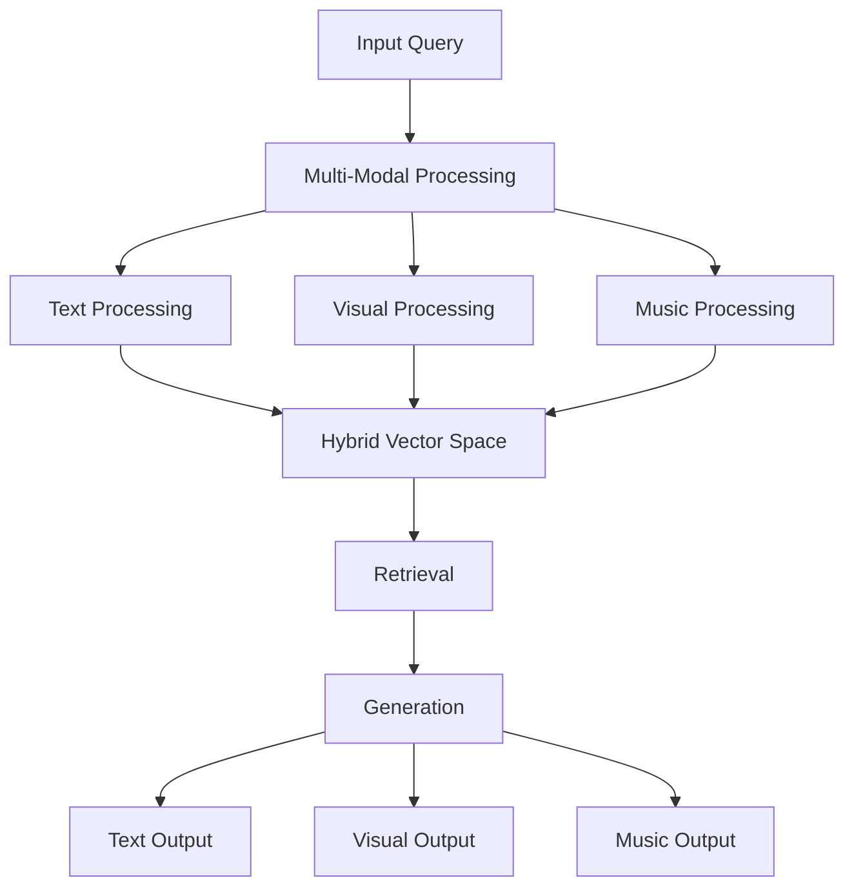
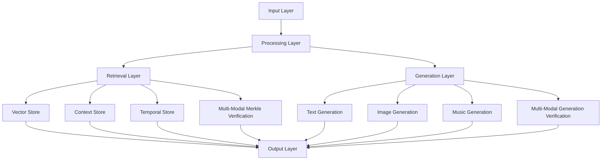

# 3.7. Enhanced RAG System

The enhanced Retrieval-Augmented Generation (RAG) system extends the core RAG architecture to support multi-modal content, cross-modal aspects, and enhanced temporal states. This design enables rich knowledge retrieval and generation across text, visual, and musical modalities while maintaining privacy, security, and attribution.

## Core Architecture



### Multi-Modal Vector Space

```rust
struct MultiModalVectorSpace {
    // Core vector spaces
    text_space: HybridSpatialIndex,
    visual_space: HybridSpatialIndex,
    music_space: HybridSpatialIndex,
    
    // Cross-modal relationships
    cross_modal_aspects: Vec<CrossModalAspect>,
    
    // Temporal state tracking
    temporal_states: HashMap<VectorId, TemporalState>,
    
    // Multi-Modal Spherical Merkle Tree verification
    merkle_verifier: MultiModalMerkleVerifier,
    
    fn index_content(&mut self, content: MultiModalContent) -> Result<()> {
        // Index each modality
        let text_vector = self.text_space.index(content.text)?;
        let visual_vector = self.visual_space.index(content.visual)?;
        let music_vector = self.music_space.index(content.music)?;
        
        // Calculate cross-modal aspects
        let aspects = self.calculate_cross_modal_aspects(
            text_vector,
            visual_vector,
            music_vector
        )?;
        
        self.cross_modal_aspects.extend(aspects);
        
        // Track temporal state
        self.temporal_states.insert(
            content.id,
            content.temporal_state
        );
        
        // Create Spherical Merkle Node with cross-modal relationships
        let merkle_node = self.create_multi_modal_merkle_node(
            content, 
            text_vector, 
            visual_vector, 
            music_vector, 
            &aspects
        )?;
        
        // Add node to Merkle tree and verify angular relationships
        self.add_to_merkle_tree(merkle_node)?;
        
        Ok(())
    }
    
    fn create_multi_modal_merkle_node(
        &self,
        content: &MultiModalContent,
        text_vector: Vector,
        visual_vector: Vector,
        music_vector: Vector,
        aspects: &[CrossModalAspect]
    ) -> Result<MultiModalMerkleNode> {
        // Create node with content data
        let mut node = MultiModalMerkleNode {
            id: content.id,
            parent: None,
            children: Vec::new(),
            
            // Optional content by modality
            text_content: content.text.clone(),
            visual_content: content.visual.clone(),
            music_content: content.music.clone(),
            
            // Hybrid spherical-hyperbolic coordinates derived from triplet
            theta: content.triplet.theta,
            phi: content.triplet.phi,
            radius: content.triplet.radius,
            kappa: content.triplet.curvature,
            
            // Cross-modal relationships
            angular_relationships: HashMap::new(),
            
            // Temporal state
            temporal_state: content.temporal_state.clone(),
            
            // Sync points
            sync_points: content.sync_points.clone(),
            
            // Hash calculated from all components
            hash: [0; 32], // Will be set later
        };
        
        // Add angular relationships based on cross-modal aspects
        for aspect in aspects {
            node.angular_relationships.insert(
                (aspect.target_id, aspect.modality),
                CrossModalRelationship {
                    angle: aspect.angle,
                    strength: aspect.strength,
                    relation_type: aspect.relation_type,
                    modal_transfer: aspect.modal_transfer.clone()
                }
            );
        }
        
        // Calculate content hash
        node.hash = calculate_multi_modal_node_hash(&node);
        
        Ok(node)
    }
    
    fn add_to_merkle_tree(&mut self, node: MultiModalMerkleNode) -> Result<()> {
        // Add node to tree
        self.merkle_tree.add_node(node.clone())?;
        
        // Update angular relationships in the tree
        for ((target_id, modality), relationship) in &node.angular_relationships {
            self.merkle_tree.add_relationship(
                node.id,
                *target_id,
                relationship.angle,
                modality.clone()
            )?;
        }
        
        // Verify node integrity
        self.merkle_verifier.verify_node(&node)?;
        
        Ok(())
    }
    
    fn retrieve_relevant(&self, query: MultiModalQuery) -> Vec<RelevantContent> {
        // Query each modality
        let text_results = self.text_space.query(query.text);
        let visual_results = self.visual_space.query(query.visual);
        let music_results = self.music_space.query(query.music);
        
        // Combine results considering cross-modal aspects
        let merged = self.merge_modal_results(text_results, visual_results, music_results);
        
        // Verify result integrity via Spherical Merkle Trees
        let verified = self.verify_retrieval_results(merged);
        
        verified
    }
    
    fn verify_retrieval_results(&self, results: Vec<RelevantContent>) -> Vec<RelevantContent> {
        // Use Spherical Merkle Verifier for integrity checks
        let mut verified_results = Vec::new();
        
        for result in results {
            if self.merkle_verifier.verify_content(&result) {
                verified_results.push(result);
            } else {
                log::warn!("Excluding unverified result: {:?}", result.id);
            }
        }
        
        verified_results
    }
}

struct CrossModalAspect {
    source_id: ContentId,
    target_id: ContentId,
    modality: Modality,
    angle: f32,
    strength: f32,
    relation_type: RelationType,
    modal_transfer: ModalTransferProperties,
    
    fn calculate_resonance(&self) -> f32 {
        match self.angle {
            a if (a - 0.0).abs() < 5.0 => 1.0,    // Conjunction
            a if (a - 180.0).abs() < 5.0 => 0.8,  // Opposition
            a if (a - 120.0).abs() < 5.0 => 0.9,  // Trine
            a if (a - 90.0).abs() < 5.0 => 0.7,   // Square
            a if (a - 60.0).abs() < 5.0 => 0.6,   // Sextile
            _ => 0.3 // Weak resonance for non-major aspects
        }
    }
}

struct MultiModalMerkleNode {
    // Core node data
    id: NodeId,
    parent: Option<NodeId>,
    children: Vec<NodeId>,
    hash: [u8; 32],
    
    // Content by modality (optional for each node)
    text_content: Option<TextContent>,
    visual_content: Option<ImageContent>,
    music_content: Option<MusicContent>,
    
    // Hybrid spherical-hyperbolic coordinates
    theta: f32,     // Archetypal angle (0-2π)
    phi: f32,       // Expression elevation (-π/2-π/2)
    radius: f32,    // Mundane magnitude (0-1)
    kappa: f32,     // Curvature parameter
    
    // Cross-modal relationships
    angular_relationships: HashMap<(NodeId, Modality), CrossModalRelationship>,
    
    // Temporal state
    temporal_state: TemporalState,
    
    // Sync points across modalities
    sync_points: Vec<SyncPoint>,
}

struct SyncPoint {
    // Position markers in each modality
    text_position: Option<TextPosition>,
    image_marker: Option<ImageMarker>,
    audio_timestamp: Option<AudioTimestamp>,
    
    // Sync point type
    sync_type: SyncType,
    
    // Temporal state at sync point
    temporal_state: TemporalState,
    
    // Verification hash for integrity
    hash: [u8; 32],
}

struct CrossModalRelationship {
    // Angular distance in spherical-hyperbolic space
    angle: f32,
    
    // Relationship strength/significance
    strength: f32,
    
    // Relationship type
    relation_type: RelationType,
    
    // Modal transfer properties
    modal_transfer: ModalTransferProperties,
}
```

### Enhanced Multi-Modal Merkle Verification

```rust
struct MultiModalMerkleVerifier {
    // Specialized verifiers
    content_verifier: ContentVerifier,
    angular_verifier: AngularVerifier,
    sync_verifier: SyncVerifier,
    temporal_verifier: TemporalVerifier,
    
    // Performance optimizations
    verification_cache: LRUCache<VerificationKey, VerificationResult>,
    relationship_cache: LRUCache<RelationshipKey, bool>,
    
    fn verify_node(&self, node: &MultiModalMerkleNode) -> VerificationResult {
        // Check cache first
        if let Some(cached) = self.verification_cache.get(&node.id) {
            return cached.clone();
        }
        
        // Content integrity verification
        let content_valid = self.content_verifier.verify_content(node);
        
        // Angular relationship verification
        let angular_valid = self.angular_verifier.verify_relationships(
            &node.angular_relationships
        );
        
        // Sync point verification
        let sync_valid = self.sync_verifier.verify_sync_points(
            &node.sync_points
        );
        
        // Temporal state verification
        let temporal_valid = self.temporal_verifier.verify_state(
            &node.temporal_state,
            &node.sync_points
        );
        
        // Combined verification result
        let result = VerificationResult {
            valid: content_valid && angular_valid && 
                   sync_valid && temporal_valid,
            content_integrity: content_valid,
            angular_consistency: angular_valid,
            sync_integrity: sync_valid,
            temporal_coherence: temporal_valid,
            confidence_score: self.calculate_confidence_score(
                content_valid, angular_valid, sync_valid, temporal_valid
            )
        };
        
        // Cache result
        self.verification_cache.insert(node.id, result.clone());
        
        result
    }
    
    fn verify_cross_modal_aspects(&self, aspects: &[CrossModalAspect]) -> bool {
        for aspect in aspects {
            // Skip cached verifications
            let cache_key = RelationshipKey::new(aspect.source_id, aspect.target_id);
            if let Some(cached) = self.relationship_cache.get(&cache_key) {
                if !cached {
                    return false;
                }
                continue;
            }
            
            // Verify angular relationship
            let valid = self.angular_verifier.verify_relationship(
                aspect.source_id,
                aspect.target_id,
                aspect.angle,
                aspect.modality
            );
            
            // Cache result
            self.relationship_cache.insert(cache_key, valid);
            
            if !valid {
                return false;
            }
        }
        
        true
    }
    
    fn verify_retrieval_integrity(&self, results: &RetrievalResults) -> VerificationResult {
        // Verify each retrieved content item
        let mut valid_count = 0;
        let mut verified_results = Vec::new();
        
        for result in &results.items {
            let result_valid = self.verify_node(&result.node);
            if result_valid.valid {
                valid_count += 1;
                verified_results.push(result.clone());
            }
        }
        
        // Verify cross-modal relationships between results
        let relationships_valid = self.verify_result_relationships(&results.items);
        
        VerificationResult {
            valid: valid_count == results.items.len() && relationships_valid,
            content_integrity: valid_count == results.items.len(),
            angular_consistency: relationships_valid,
            sync_integrity: self.verify_result_sync_points(&results.items),
            temporal_coherence: self.verify_result_temporal_states(&results.items),
            confidence_score: valid_count as f32 / results.items.len() as f32
        }
    }
    
    fn parallel_verify(&self, nodes: &[MultiModalMerkleNode]) -> Vec<VerificationResult> {
        // Parallel verification for efficiency
        nodes.par_iter()
            .map(|node| self.verify_node(node))
            .collect()
    }
    
    fn adaptive_verify(&self, nodes: &[MultiModalMerkleNode]) -> VerificationResult {
        // Adapt verification approach based on node count
        if nodes.len() < 10 {
            // Full verification for small sets
            self.verify_all(nodes)
        } else {
            // Statistical verification for larger sets
            self.verify_sample(nodes)
        }
    }
}
```

### Enhanced Retrieval

```rust
struct EnhancedRetriever {
    vector_space: MultiModalVectorSpace,
    privacy_filter: PrivacyAwareFilter,
    temporal_analyzer: TemporalStateAnalyzer,
    merkle_verifier: MultiModalMerkleVerifier,
    
    async fn retrieve(
        &self,
        query: MultiModalQuery,
        privacy_level: PrivacyLevel,
        temporal_state: TemporalState
    ) -> Result<RetrievalResults> {
        // Get initial results
        let raw_results = self.vector_space.retrieve_relevant(query);
        
        // Apply privacy filtering
        let filtered = self.privacy_filter.filter_results(
            raw_results,
            privacy_level
        )?;
        
        // Analyze temporal relationships
        let temporal_results = self.temporal_analyzer.analyze_results(
            filtered,
            temporal_state
        )?;
        
        // Verify result integrity using Spherical Merkle Trees
        let verification_result = self.merkle_verifier.verify_retrieval_integrity(
            &temporal_results
        );
        
        // Sort by relevance considering all factors
        let sorted = self.sort_by_relevance(temporal_results);
        
        // Attach verification metadata
        Ok(RetrievalResults {
            items: sorted,
            verification_result
        })
    }
}
```

### Enhanced Generation

```rust
struct EnhancedGenerator {
    llm: PrivacyAwareLLM,
    image_generator: ImageGenerator,
    music_generator: MusicGenerator,
    merkle_generator: MultiModalMerkleGenerator,
    
    async fn generate(
        &self,
        context: MultiModalContext,
        query: MultiModalQuery
    ) -> Result<GeneratedContent> {
        // Generate content for each modality
        let text = self.llm.generate_text(context.text, query.text)?;
        let images = self.image_generator.generate(context.visual, query.visual)?;
        let music = self.music_generator.generate(context.music, query.music)?;
        
        // Create basic multi-modal content
        let mut content = MultiModalContent {
            text,
            visual: images,
            music,
            
            // Initialize other fields
            cross_modal_aspects: Vec::new(),
            sync_points: Vec::new(),
            temporal_state: query.temporal_state.clone(),
        };
        
        // Ensure cross-modal coherence
        content = self.ensure_coherence(content)?;
        
        // Verify temporal alignment
        content = self.verify_temporal_alignment(content)?;
        
        // Calculate cross-modal aspects
        content = self.calculate_cross_modal_aspects(content)?;
        
        // Generate sync points
        content = self.generate_sync_points(content)?;
        
        // Generate Merkle tree for integrity and verification
        let merkle_tree = self.merkle_generator.generate_tree(content.clone())?;
        
        let final_content = GeneratedContent {
            content,
            merkle_tree,
            verification_proof: self.merkle_generator.generate_proof(&merkle_tree)
        };
        
        Ok(final_content)
    }
    
    fn ensure_coherence(
        &self,
        content: MultiModalContent
    ) -> Result<MultiModalContent> {
        // Analyze content for cross-modal coherence
        let coherence_analysis = self.analyze_coherence(&content);
        
        // Apply adjustments where needed
        let adjusted_content = match coherence_analysis.requires_adjustment {
            true => self.adjust_for_coherence(content, coherence_analysis.adjustments)?,
            false => content
        };
        
        // Verify coherence with Spherical Merkle Tree
        let is_coherent = self.verify_cross_modal_coherence(&adjusted_content)?;
        
        if !is_coherent {
            return Err(Error::CoherenceVerificationFailed);
        }
        
        Ok(adjusted_content)
    }
    
    fn verify_cross_modal_coherence(
        &self,
        content: &MultiModalContent
    ) -> Result<bool> {
        // Generate temporary Merkle tree for verification
        let temp_tree = self.merkle_generator.generate_tree(content.clone())?;
        
        // Verify angular relationships
        let angular_valid = temp_tree.verify_angular_relationships()?;
        
        // Verify sync points
        let sync_valid = temp_tree.verify_sync_points()?;
        
        Ok(angular_valid && sync_valid)
    }
}

struct MultiModalMerkleGenerator {
    content_hasher: ContentHasher,
    relationship_calculator: RelationshipCalculator,
    
    fn generate_tree(&self, content: MultiModalContent) -> Result<MultiModalMerkleTree> {
        // Create new Merkle tree
        let mut tree = MultiModalMerkleTree::new();
        
        // Create root node
        let root_node = self.create_root_node(&content)?;
        tree.add_node(root_node.clone())?;
        
        // Add modality-specific nodes
        let text_node = self.create_text_node(&content)?;
        let image_node = self.create_image_node(&content)?;
        let music_node = self.create_music_node(&content)?;
        
        tree.add_node(text_node.clone())?;
        tree.add_node(image_node.clone())?;
        tree.add_node(music_node.clone())?;
        
        // Link nodes as children of root
        tree.add_child(root_node.id, text_node.id)?;
        tree.add_child(root_node.id, image_node.id)?;
        tree.add_child(root_node.id, music_node.id)?;
        
        // Calculate and add angular relationships
        self.add_angular_relationships(&mut tree, &content)?;
        
        // Add sync points
        self.add_sync_points(&mut tree, &content)?;
        
        // Verify tree integrity
        tree.verify_integrity()?;
        
        Ok(tree)
    }
    
    fn add_angular_relationships(
        &self,
        tree: &mut MultiModalMerkleTree,
        content: &MultiModalContent
    ) -> Result<()> {
        // Calculate relationships between nodes
        let text_image_angle = self.relationship_calculator.calculate_angle(
            &content.text,
            &content.visual
        );
        
        let text_music_angle = self.relationship_calculator.calculate_angle(
            &content.text,
            &content.music
        );
        
        let image_music_angle = self.relationship_calculator.calculate_angle(
            &content.visual,
            &content.music
        );
        
        // Add calculated relationships to tree
        let text_id = tree.get_node_id_by_modality(Modality::Text)?;
        let image_id = tree.get_node_id_by_modality(Modality::Image)?;
        let music_id = tree.get_node_id_by_modality(Modality::Music)?;
        
        tree.add_relationship(text_id, image_id, text_image_angle, RelationshipType::TextToImage)?;
        tree.add_relationship(text_id, music_id, text_music_angle, RelationshipType::TextToMusic)?;
        tree.add_relationship(image_id, music_id, image_music_angle, RelationshipType::ImageToMusic)?;
        
        Ok(())
    }
    
    fn generate_proof(&self, tree: &MultiModalMerkleTree) -> Result<MultiModalMerkleProof> {
        tree.generate_proof()
    }
}
```

## Privacy Architecture

The enhanced RAG system implements comprehensive privacy controls with multi-modal verification:

```rust
struct PrivacyAwareRAG {
    // Core components with privacy awareness
    retriever: EnhancedRetriever,
    generator: EnhancedGenerator,
    merkle_verifier: MultiModalMerkleVerifier,
    
    // Privacy management
    privacy_manager: PrivacyManager,
    access_control: AccessControl,
    
    async fn process_query(
        &self,
        query: MultiModalQuery,
        user: &User
    ) -> Result<ProcessedOutput> {
        // Verify access permissions
        self.access_control.verify_access(user, query.privacy_requirements)?;
        
        // Apply privacy filters to retrieval
        let retrieval_results = self.retriever.retrieve(
            query,
            user.privacy_level,
            query.temporal_state
        )?;
        
        // Verify retrieval integrity
        let verification_result = self.merkle_verifier.verify_retrieval_integrity(&retrieval_results);
        if !verification_result.valid {
            log::warn!("Retrieval verification failed: {:?}", verification_result);
        }
        
        // Generate privacy-preserving outputs
        let generated = self.generator.generate(
            retrieval_results.to_context(),
            query
        )?;
        
        // Verify generated content integrity
        let generation_valid = self.merkle_verifier.verify_generated_content(&generated);
        if !generation_valid {
            log::warn!("Generation verification failed");
        }
        
        // Apply final privacy controls
        let processed = self.privacy_manager.process_output(generated, user)?;
        
        // Attach verification metadata
        let output = ProcessedOutput {
            content: processed,
            retrieval_verification: verification_result,
            generation_verification: generation_valid
        };
        
        Ok(output)
    }
}
```

## Temporal Integration

The system handles three distinct time states with Spherical Merkle Tree verification:

```rust
struct TemporalStateManager {
    mundane_index: TimestampIndex,
    quantum_state: QuantumStateManager,
    holographic_ref: ChartReferenceManager,
    merkle_verifier: MultiModalMerkleVerifier,
    
    fn process_temporal(
        &self,
        content: MultiModalContent,
        state: TemporalState
    ) -> Result<ProcessedContent> {
        let processed = match state {
            TemporalState::Mundane(ts) => {
                // Process with concrete timestamp
                self.process_mundane(content, ts)
            },
            TemporalState::Quantum => {
                // Process without time constraints
                self.process_quantum(content)
            },
            TemporalState::Holographic(ref_chart) => {
                // Process with reference chart
                self.process_holographic(content, ref_chart)
            }
        }?;
        
        // Verify temporal consistency via Spherical Merkle Tree
        let temporal_valid = self.verify_temporal_consistency(&processed, state)?;
        
        if !temporal_valid {
            log::warn!("Temporal consistency verification failed");
        }
        
        Ok(processed)
    }
    
    fn verify_temporal_consistency(
        &self,
        content: &ProcessedContent,
        state: TemporalState
    ) -> Result<bool> {
        // Create verification context
        let context = TemporalVerificationContext {
            content: content.clone(),
            state: state.clone(),
            verification_time: Utc::now()
        };
        
        // Verify across modalities
        self.merkle_verifier.verify_temporal_consistency(&context)
    }
}
```

## Glass Bead Integration

The RAG system integrates with Glass Bead tokens using multi-modal Spherical Merkle Trees:

```rust
struct GlassBeadRAG {
    // Core RAG components
    rag: EnhancedRAG,
    
    // Glass Bead integration
    bead_manager: GlassBeadManager,
    merkle_validator: MultiModalMerkleValidator,
    
    async fn process_bead(
        &self,
        bead: GlassBead,
        query: MultiModalQuery
    ) -> Result<ProcessedBead> {
        // Verify bead integrity with multi-modal Merkle validation
        self.merkle_validator.verify_bead_integrity(bead)?;
        
        // Process through RAG
        let processed = self.rag.process_query(
            query,
            bead.owner
        )?;
        
        // Update bead with results
        let updated_bead = self.bead_manager.update_bead(
            bead,
            processed
        )?;
        
        // Generate and verify new Merkle tree
        let merkle_tree = self.generate_bead_merkle_tree(&updated_bead)?;
        let valid = self.merkle_validator.verify_tree(merkle_tree)?;
        
        if !valid {
            return Err(Error::BeadIntegrityError);
        }
        
        Ok(ProcessedBead {
            bead: updated_bead,
            verification_result: valid
        })
    }
    
    fn generate_bead_merkle_tree(&self, bead: &GlassBead) -> Result<MultiModalMerkleTree> {
        // Generate tree for multi-modal bead content
        let mut tree = MultiModalMerkleTree::new();
        
        // Add root node
        let root_node = self.create_bead_root_node(bead)?;
        tree.add_node(root_node)?;
        
        // Add modality nodes
        self.add_modality_nodes(&mut tree, bead)?;
        
        // Add cross-modal relationships
        self.add_cross_modal_relationships(&mut tree, bead)?;
        
        // Add sync points
        self.add_sync_points(&mut tree, bead)?;
        
        Ok(tree)
    }
}

struct MultiModalMerkleValidator {
    content_verifier: ContentVerifier,
    relationship_verifier: RelationshipVerifier,
    temporal_verifier: TemporalVerifier,
    sync_verifier: SyncVerifier,
    
    // Caching for performance
    verification_cache: LRUCache<BeadId, VerificationResult>,
    
    fn verify_bead_integrity(&self, bead: &GlassBead) -> Result<VerificationResult> {
        // Check cache first
        if let Some(cached) = self.verification_cache.get(&bead.id) {
            return Ok(cached.clone());
        }
        
        // Verify content integrity
        let content_valid = self.content_verifier.verify_bead_content(bead)?;
        
        // Verify cross-modal relationships
        let relationship_valid = self.relationship_verifier.verify_bead_relationships(bead)?;
        
        // Verify temporal consistency
        let temporal_valid = self.temporal_verifier.verify_bead_temporal_state(bead)?;
        
        // Verify sync points
        let sync_valid = self.sync_verifier.verify_bead_sync_points(bead)?;
        
        // Combined result
        let result = VerificationResult {
            valid: content_valid && relationship_valid && temporal_valid && sync_valid,
            content_integrity: content_valid,
            angular_consistency: relationship_valid,
            temporal_coherence: temporal_valid,
            sync_integrity: sync_valid,
            confidence: self.calculate_confidence(bead)
        };
        
        // Cache result
        self.verification_cache.insert(bead.id, result.clone());
        
        Ok(result)
    }
    
    fn verify_tree(&self, tree: MultiModalMerkleTree) -> Result<bool> {
        // Verify tree structure
        let structure_valid = tree.verify_structure()?;
        
        // Verify angular relationships
        let angular_valid = tree.verify_angular_relationships()?;
        
        // Verify sync points
        let sync_valid = tree.verify_sync_points()?;
        
        Ok(structure_valid && angular_valid && sync_valid)
    }
}
```

## Performance Architecture

The system implements several optimizations for efficient multi-modal processing:

```rust
struct PerformanceOptimizer {
    // Caching system
    result_cache: LRUCache<QueryHash, ProcessedOutput>,
    vector_cache: VectorCache,
    merkle_cache: MerkleVerificationCache,
    
    // Batch processing
    batch_processor: BatchProcessor,
    
    // Parallelization
    verification_pool: ThreadPool,
    
    async fn optimize_query(
        &self,
        query: MultiModalQuery
    ) -> Result<OptimizedOutput> {
        // Check cache
        if let Some(cached) = self.result_cache.get(&query.hash()) {
            return Ok(cached);
        }
        
        // Process in optimal batch size
        let batch_results = self.batch_processor.process(query)?;
        
        // Cache results
        self.cache_results(query, batch_results.clone())?;
        
        Ok(batch_results)
    }
    
    fn optimize_merkle_verification(
        &self,
        nodes: &[MultiModalMerkleNode]
    ) -> OptimizedVerificationStrategy {
        if nodes.len() < 10 {
            // Full verification for small sets
            OptimizedVerificationStrategy::Complete
        } else if nodes.len() < 100 {
            // Parallel verification for medium sets
            OptimizedVerificationStrategy::Parallel {
                thread_count: self.verification_pool.available_threads()
            }
        } else {
            // Probabilistic verification for large sets
            OptimizedVerificationStrategy::Probabilistic {
                confidence_threshold: 0.95,
                max_sample_size: 50
            }
        }
    }
    
    fn parallel_verify(
        &self, 
        nodes: &[MultiModalMerkleNode],
        strategy: OptimizedVerificationStrategy
    ) -> Result<Vec<VerificationResult>> {
        match strategy {
            OptimizedVerificationStrategy::Complete => {
                // Verify all nodes
                Ok(nodes.iter().map(|node| {
                    self.verify_node(node)
                }).collect())
            },
            OptimizedVerificationStrategy::Parallel { thread_count } => {
                // Verify in parallel
                let chunks = nodes.chunks(nodes.len() / thread_count.max(1));
                let results = chunks.par_iter().map(|chunk| {
                    chunk.iter().map(|node| self.verify_node(node)).collect::<Vec<_>>()
                }).collect::<Vec<_>>();
                
                Ok(results.into_iter().flatten().collect())
            },
            OptimizedVerificationStrategy::Probabilistic { confidence_threshold, max_sample_size } => {
                // Verify probabilistically
                let sample = self.select_representative_sample(nodes, max_sample_size);
                let sample_results = sample.iter().map(|node| self.verify_node(node)).collect::<Vec<_>>();
                
                let positive_rate = sample_results.iter().filter(|r| r.valid).count() as f32 / sample_results.len() as f32;
                
                if positive_rate >= confidence_threshold {
                    // Extrapolate results
                    Ok(nodes.iter().map(|_| VerificationResult {
                        valid: true,
                        confidence_score: positive_rate,
                        ..Default::default()
                    }).collect())
                } else {
                    // Fall back to full verification
                    Ok(nodes.iter().map(|node| self.verify_node(node)).collect())
                }
            }
        }
    }
    
    fn verify_node(&self, node: &MultiModalMerkleNode) -> VerificationResult {
        // Check cache first
        if let Some(cached) = self.merkle_cache.get(&node.id) {
            return cached;
        }
        
        // Create verifier
        let verifier = MultiModalMerkleVerifier::new();
        
        // Perform verification
        let result = verifier.verify_node(node);
        
        // Cache result
        self.merkle_cache.insert(node.id, result.clone());
        
        result
    }
}

enum OptimizedVerificationStrategy {
    Complete,
    Parallel { thread_count: usize },
    Probabilistic { confidence_threshold: f32, max_sample_size: usize }
}
```

## Complete RAG System Architecture

The complete RAG system represents a unified architecture that combines core retrieval and generation capabilities with enhanced multi-modal features:

### Multi-Modal Architecture



### Cross-Modal Verification

The enhanced RAG system implements a comprehensive cross-modal verification pipeline:

1. **Content Verification**
   - Validates the integrity of multi-modal content
   - Ensures content hasn't been tampered with
   - Verifies attribution and source integrity

2. **Angular Relationship Verification**
   - Ensures cross-modal aspects maintain correct angular relationships
   - Validates spatial coordinates in hybrid spherical-hyperbolic space
   - Checks relationship strength and significance

3. **Temporal State Verification**
   - Validates consistency of temporal states across modalities
   - Ensures synchronization points align with temporal markers
   - Verifies state transitions and history

4. **Sync Point Verification**
   - Ensures cross-modal sync points maintain integrity
   - Validates hash consistency across sync points
   - Verifies modal position alignment

### Integration Points

```rust
struct CompleteRAGSystem {
    // Core processing
    input_processor: MultiModalProcessor,
    vector_manager: VectorManager,
    context_manager: ContextManager,
    generation_pipeline: GenerationPipeline,
    
    // Merkle verification
    multi_modal_verifier: MultiModalMerkleVerifier,
    verification_optimizer: VerificationOptimizer,
    
    // Integration systems
    glass_bead_interface: GlassBeadInterface,
    book_interface: BookInterface,
    focus_space_interface: FocusSpaceInterface,
    
    // Performance systems
    performance_optimizer: PerformanceOptimizer,
    resource_manager: ResourceManager,
    
    async fn process_complete(
        &self,
        input: CompleteInput
    ) -> Result<CompleteOutput> {
        // Process input
        let processed = self.input_processor.process(input)?;
        
        // Manage vectors
        let vectors = self.vector_manager.manage_vectors(processed)?;
        
        // Handle context
        let context = self.context_manager.manage_context(vectors)?;
        
        // Generate output
        let output = self.generation_pipeline.generate(context)?;
        
        // Generate and verify Merkle tree
        let merkle_tree = self.multi_modal_verifier.generate_tree(&output)?;
        let verification_result = self.verify_with_optimization(&merkle_tree)?;
        
        if !verification_result.valid {
            log::warn!("Output verification failed: {:?}", verification_result);
        }
        
        // Optimize performance
        let optimized = self.performance_optimizer.optimize(output)?;
        
        // Integrate with system
        let integrated = self.integrate_output(optimized)?;
        
        // Attach verification metadata
        let complete_output = CompleteOutput {
            content: integrated,
            verification_result,
            merkle_proof: self.multi_modal_verifier.generate_proof(&merkle_tree)?
        };
        
        Ok(complete_output)
    }
    
    fn verify_with_optimization(
        &self,
        tree: &MultiModalMerkleTree
    ) -> Result<VerificationResult> {
        // Determine optimal verification strategy
        let strategy = self.verification_optimizer.select_strategy(tree);
        
        // Execute verification
        match strategy {
            VerificationStrategy::Complete => {
                self.multi_modal_verifier.verify_complete(tree)
            },
            VerificationStrategy::Sampled { sample_rate } => {
                self.multi_modal_verifier.verify_sampled(tree, sample_rate)
            },
            VerificationStrategy::Parallel { thread_count } => {
                self.multi_modal_verifier.verify_parallel(tree, thread_count)
            }
        }
    }
}
```

### Performance Characteristics

1. **Resource Requirements**
   - Base: 8GB RAM, 4 cores
   - Recommended: 16GB RAM, 8 cores
   - Enterprise: 32GB+ RAM, 16+ cores

2. **Processing Overhead**
   - Input processing: O(n) where n = input size
   - Vector operations: O(log n) with spatial indexing
   - Context management: O(1) with caching
   - Generation: O(m) where m = output complexity
   - Multi-Modal Merkle Verification: O(k log n) where k = modality count, n = node count
   - Cross-Modal Verification: O(r) where r = relationship count

3. **Scaling Metrics**
   - Linear scaling with input size
   - Logarithmic scaling with vector operations
   - Constant-time context lookup
   - Linear scaling with output complexity
   - Near-linear scaling with modality count
   - Near-linear scaling with relationship count

### Operational Efficiency

The system prioritizes efficiency with:

1. **Adaptive Verification**
   - Full verification for critical content
   - Sampled verification for bulk processing
   - Probabilistic verification for large datasets

2. **Caching Strategy**
   - Verification result caching
   - Angular relationship caching
   - Temporal state caching
   - Sync point caching

3. **Parallel Processing**
   - Multi-threaded verification
   - Batched relationship checking
   - Concurrent modal processing
   - Distributed verification for large trees

4. **Delta-Based Updates**
   - Only reverify changed branches
   - Optimize for modality-specific changes
   - Maintain verification history
   - Prioritize high-impact relationships

## Key Benefits

1. **Enhanced Retrieval**
   - Multi-modal content support
   - Cross-modal aspect awareness
   - Temporal state handling
   - Privacy-preserving operations
   - Comprehensive integrity verification

2. **Rich Generation**
   - Synchronized multi-modal outputs
   - Cross-modal coherence
   - Temporal alignment
   - Privacy-aware generation
   - Verifiable generation results

3. **System Integration**
   - Complete Glass Bead compatibility
   - Enhanced Book output support
   - Focus space integration
   - Secure collaboration features
   - Cross-component verification

4. **Performance Optimization**
   - Efficient multi-modal caching
   - Batch processing support
   - Resource optimization
   - Response time improvements
   - Optimized verification strategies

This enhanced RAG system enables:
- Rich multi-modal knowledge retrieval
- Coherent cross-modal generation
- Secure and private operations
- Efficient system integration
- Scalable performance
- Deep temporal awareness
- Comprehensive verification across modalities

The design creates a robust foundation for:
- Advanced knowledge processing
- Multi-modal pattern discovery
- Secure collaboration
- Rich user experiences
- System-wide integration
- Verifiable content integrity
