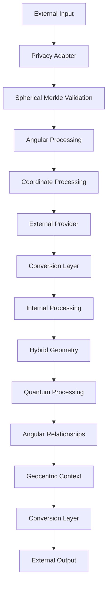
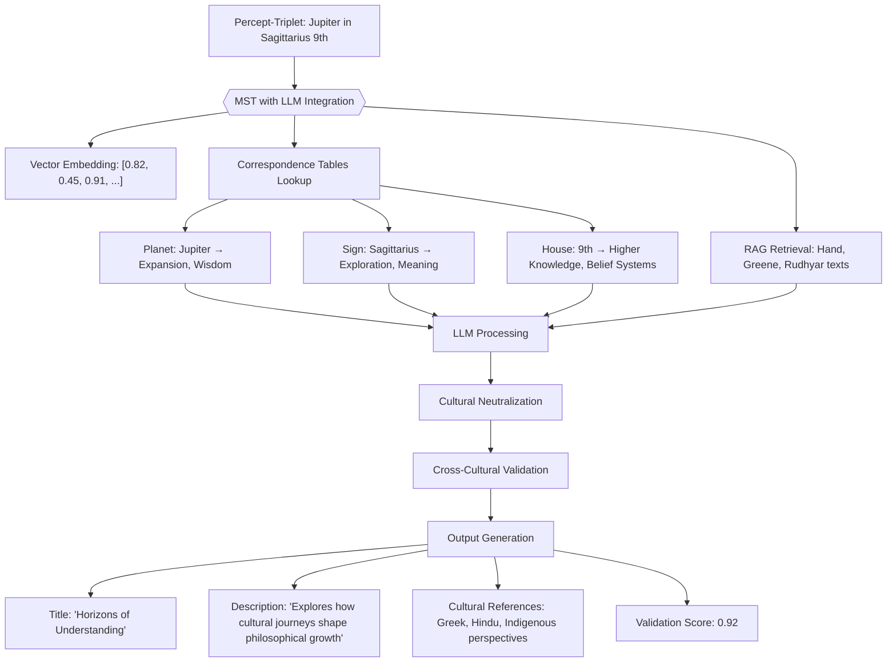
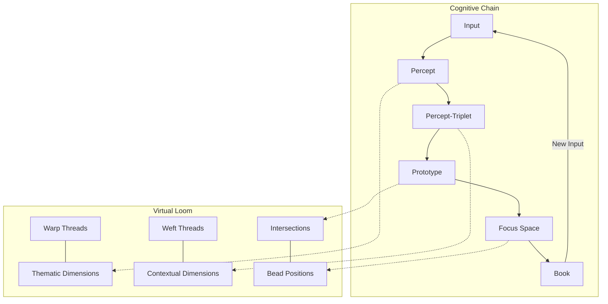

# 3.6.0. Machine System LLM Integration with Memorativa

Large Language Models (LLMs) serve as a critical bridge between human language and the hybrid geometric structures that form the foundation of the Memorativa system. This section provides a comprehensive implementation blueprint for integrating LLMs, transforming the architectural vision described in [Section 2.6](./memorativa-2-6-generative-ai.md) into concrete technical interfaces, optimization strategies, and integration protocols.

Unlike traditional LLM implementations that operate in isolation, Memorativa's approach embeds these models within a sophisticated framework that preserves the system's unique characteristics: hybrid spherical-hyperbolic geometry, observer-centric knowledge representation, token-based economic incentives, and multi-state verification mechanisms. The integration is bidirectional—the internal system leverages LLMs to enhance its core processing capabilities while also exposing carefully designed external interfaces that allow third-party services to interact with Memorativa's knowledge structures.

This integration represents a crucial advancement in how AI systems interact with human knowledge. By building upon the Glass Bead system described in Section 2.3 and the Percept-Triplet structure detailed in Section 2.4, the LLM Integration ensures that all generative operations maintain semantic integrity while preserving the three-dimensional encoding system (archetypal, expressive, and contextual vectors) that distinguishes Memorativa from conventional AI approaches. The result is an LLM framework that doesn't merely process language but actively contributes to the growth and coherence of a player's personal knowledge cosmos.

## Cybernetic System Implementation

The LLM Integration directly implements the cybernetic system principles established in [Section 2.1](../2.%20the%20cybernetic%20system/memorativa-2-1-the-cybernetic-system.md), creating a concrete technical framework for the bidirectional interface between human cognition and machine computation:

1. **Bidirectional Interface Realization**
   - Implements the translation functions $T_H: M \rightarrow H$ (machine to human) and $T_M: H \rightarrow M$ (human to machine) through:
     - The `FormatConverter` that transforms between internal and external representations
     - The `PerceptTripletLLMAdapter` that maps between human symbolic frameworks and machine vector spaces
     - The `MultimodalLLMInterface` that bridges textual and visual modalities

2. **Feedback Loop Engineering**
   - Creates the continuous cycle of input, processing, output, and validation through:
     - The `SphericalMerkleInterface` for verification of angular relationships
     - The `HybridVerifier` for multi-dimensional validation
     - The `TokenVerifier` for economic validation
     - The `VerificationScorer` for confidence assessment

3. **Human Validation Role**
   - Preserves the human player's role as system validator through:
     - Privacy-aware processing that maintains human control over data
     - Gas token verification that requires human authorization
     - Player-centered knowledge growth that enhances rather than replaces human understanding
     - Reward mechanisms that incentivize valuable human contributions

4. **Three-Vector Processing**
   - Implements the percept-triplet structure ($P: I \rightarrow A \times E \times M$) through:
     - The `ArchetypalPlanetaryMapper` for archetypal vector processing
     - The `ZodiacalExpressionMapper` for expression vector processing
     - The `HouseContextMapper` for mundane vector processing
     - The `HybridSpatialEncoder` for geometric integration of all three vectors

5. **Geocentric Navigation**
   - Maintains the observer-centric orientation through:
     - The `GeocentricProcessor` for observer-relative processing
     - The `AspectCalculator` for calculating angular relationships from observer perspective
     - The `SpatialContextMapper` for mapping to observer-centric spatial context
     - The `ObserverRelativeSequence` for sequence processing from observer perspective

This implementation resolves the fundamental design tension identified in Section 2.1, where perfect alignment between human understanding and machine representation ($T_H \circ T_M = id$) remains aspirational. The LLM Integration acknowledges this tension through its verification mechanisms, confidence scoring, and continuous refinement processes, creating a practical system that improves through usage while maintaining semantic integrity.

## Alignment with the Core Game

The LLM Integration system directly implements the Generative AI architecture described in Section 2.6 and supports the Core Game mechanics described in Section 2.2:

1. **Structure Hierarchy Support**
   - Processes all three structural tiers:
     - **Basic Structures**: Direct processing of percept-triplets with angular relationships
     - **Composite Structures**: Maintains relationships within prototypes and focus spaces
     - **Complex Structures**: Powers book generation and knowledge network evolution

2. **Inner Cosmos Enhancement**
   - Enables expansive growth of the player's personal knowledge space
   - Leverages hybrid geometric processing to maintain conceptual relationships
   - Preserves the geocentric orientation that makes knowledge navigation intuitive

3. **Prototype Formation**
   - Implements the geocentric prototype structure from Section 2.9 with:
     - Sun Triplet as the primary concept vector at the core
     - Planet Triplets as supporting facets arranged around the observer
     - Angular relationships (aspects) between triplets from the Earth/Observer perspective
   - Enriches prototype creation through contextual understanding
   - Maintains semantic relationships between percepts within prototypes
   - Enables concept transformation for layered, linked, and synthesized prototypes

4. **Token Economy Integration**
   - Adheres to the Gas Bead Token (GBT) operational cost framework as defined in Section 2.6:
     - Multi-Modal Analysis: 12-18 GBT
     - Book Generation: 20-50 GBT
     - Prototype Aggregation: 8-15 GBT
     - Focus Space Creation: 10-15 GBT
     - Percept Creation: 5-10 GBT
     - Vector Modification: 3-7 GBT
     - Symbolic Translation: 4-8 GBT
     - Prototype Integration: 1-3 GBT
     - Contextual Bridging: 2-4 GBT
     - Spatial Query: 2-5 GBT
     - Spherical Index Query: 1-2 GBT

5. **Glass Bead Token States**
   - Supports all three token states as defined in Section 2.3:
     - **Mundane state**: Standard timestamped processing with direct verification
     - **Quantum state**: Probabilistic superpositions for concept evolution with angular uncertainty
     - **Holographic state**: Reference-based projections maintaining relationships across beads

6. **Player Knowledge Growth**
   - Enhances conceptual understanding through AI-assisted insights
   - Preserves player agency while augmenting their cognitive capabilities
   - Enables discovery of non-obvious connections within their knowledge network

## External interfaces

The system offers five key external interfaces:

1. **Provider Interface** (`LLMProvider`)
   - Core text generation and embedding methods
   - Support for multiple providers (OpenAI, Anthropic, etc.)
   - Capability detection (streaming, context limits, etc.)
   - Provider-specific optimizations

2. **Privacy-Aware Adapter** (`LLMAdapter`)
   - Secure interface for external LLM processing
   - Public data handling only
   - Gas token verification
   - Format conversion

3. **Conversion Layer** (`FormatConverter`)
   - Bidirectional conversion between internal/external formats
   - Geometry simplification for external processing
   - Metadata handling
   - State preservation

4. **Rate Limiting & Cost Management** (`ExternalLLMManager`)
   - Provider-specific rate limits
   - Cost estimation and tracking
   - Gas verification
   - Usage monitoring

5. **Spherical Merkle Interface** (`SphericalMerkleInterface`)
   - Access to Spherical Merkle Trees for LLM
   - Angular relationship preservation
   - Hybrid verification processes
   - Coordinate system integration
   - Quantum-enhanced verification when advantageous

All external processing is:
- Limited to public data only
- Gas token verified
- Cost tracked
- Rate limited
- Basic validation checked

### 1. Provider Interface
```rust
pub trait LLMProvider {
    // Core interaction methods
    async fn generate_text(&self, prompt: &str) -> Result<String>;
    async fn generate_embeddings(&self, text: &str) -> Result<Vec<f32>>;
    
    // Optional capabilities
    fn supports_streaming(&self) -> bool;
    fn max_context_length(&self) -> usize;
    fn embedding_dimensions(&self) -> usize;
}

// Example implementations
pub struct OpenAIProvider {
    client: OpenAIClient,
    config: ProviderConfig,
}

pub struct AnthropicProvider {
    client: AnthropicClient,
    config: ProviderConfig,
}
```

### 2. Privacy-Aware Adapter
```rust
pub struct LLMAdapter {
    provider: Box<dyn LLMProvider>,
    privacy_filter: PrivacyFilter,
    token_manager: GasTokenManager,
    
    async fn process_external(
        &self,
        input: ExternalInput,
        privacy_level: PrivacyLevel
    ) -> Result<ProcessedOutput> {
        // Verify gas tokens
        self.token_manager.verify_operation(Operation::ExternalLLM)?;
        
        // Apply privacy filtering
        let filtered = self.privacy_filter.filter_for_external(input)?;
        
        // Process through external LLM
        let response = match privacy_level {
            PrivacyLevel::Public => {
                self.provider.generate_text(&filtered.prompt).await?
            },
            _ => return Err(Error::PrivacyLevelNotSupported)
        };
        
        // Convert to internal format
        self.convert_to_internal_format(response)
    }
}
```

### 3. Conversion Layer
```rust
pub struct FormatConverter {
    spatial_encoder: HybridSpatialEncoder,
    
    fn to_external_format(&self, internal: InternalFormat) -> Result<ExternalFormat> {
        // Strip internal geometric structures while preserving meaning
        let simplified = self.simplify_geometry(internal)?;
        
        // Convert to provider-specific format
        self.format_for_provider(simplified)
    }
    
    fn to_internal_format(&self, external: ExternalFormat) -> Result<InternalFormat> {
        // Project into hybrid space
        let coords = self.spatial_encoder.project_to_hybrid_space(external)?;
        
        // Add internal metadata
        InternalFormat::new(
            coords,
            PrivacyLevel::Public,
            VerificationScore::External,
            TemporalState::Mundane(Utc::now())
        )
    }
}
```

### 4. Rate Limiting & Cost Management
```rust
pub struct ExternalLLMManager {
    rate_limiter: RateLimiter,
    cost_tracker: CostTracker,
    
    async fn process_request(
        &self,
        request: ExternalRequest
    ) -> Result<ProcessedResponse> {
        // Check rate limits
        self.rate_limiter.check_limits(request.provider)?;
        
        // Estimate costs
        let estimated_cost = self.cost_tracker
            .estimate_cost(request.size, request.provider)?;
            
        // Verify sufficient gas
        self.verify_gas_for_external(estimated_cost)?;
        
        // Process request
        let response = self.process_with_provider(request).await?;
        
        // Track actual costs
        self.cost_tracker.record_usage(
            request.provider,
            response.tokens_used
        )?;
        
        Ok(response)
    }
}
```

### 5. Spherical Merkle Interface
```rust
pub trait SphericalMerkleInterface {
    // Access methods for LLM to interact with Spherical Merkle Trees
    async fn get_merkle_node(&self, node_id: NodeId) -> Result<SphericalMerkleNode>;
    async fn verify_angular_relationship(&self, node1: NodeId, node2: NodeId) -> Result<Angle>;
    
    // Generate proofs that preserve angular relationships
    async fn generate_spherical_proof(&self, node_id: NodeId) -> Result<SphericalProof>;
    
    // Verify both content and spatial relationships
    async fn verify_hybrid_proof(&self, proof: SphericalProof, root_hash: Hash) -> Result<bool>;
    
    // Get relevant nodes based on query
    async fn get_relevant_nodes(&self, query: QueryInput) -> Result<Vec<SphericalMerkleNode>>;
}

pub struct SphericalMerkleProcessor {
    // Aligned with 2.19 HybridVerifier structure
    hybrid_verifier: HybridVerifier,
    quantum_verifier: Option<QuantumMerkleVerifier>,
    spatial_index: SpatialIndex,
    glass_bead_accessor: GlassBeadAccessor,
    
    async fn process_with_spherical_merkle(&self, input: ProcessedInput) -> Result<Output> {
        // Retrieve relevant Glass Beads
        let beads = self.glass_bead_accessor.get_relevant_beads(input.query)?;
        
        // Access Merkle nodes from Glass Beads
        let merkle_nodes = self.get_nodes_from_beads(beads)?;
        
        // Extract and process angular relationships
        let angular_relationships = self.extract_angular_relationships(merkle_nodes)?;
        
        // Validate using hybrid verification from the Glass Bead system
        let verification_result = self.verify_hybrid_relationships(
            angular_relationships,
            merkle_nodes
        )?;
        
        // Generate output with verified data
        self.generate_output_with_verification(
            input,
            merkle_nodes,
            verification_result
        )
    }
    
    fn extract_angular_relationships(
        &self,
        nodes: Vec<SphericalMerkleNode>
    ) -> Result<HashMap<(NodeId, NodeId), Angle>> {
        let mut relationships = HashMap::new();
        
        for node in &nodes {
            for (target_id, angle) in &node.angular_relationships {
                relationships.insert((node.id, *target_id), *angle);
            }
        }
        
        Ok(relationships)
    }
    
    fn get_nodes_from_beads(&self, beads: Vec<GlassBead>) -> Result<Vec<SphericalMerkleNode>> {
        // Access the SphericalMerkleNodes from Glass Beads using the structure described in 2.3
        let mut nodes = Vec::new();
        
        for bead in beads {
            // Extract Merkle nodes from the Glass Bead's hierarchical Merkle structure
            let bead_nodes = self.glass_bead_accessor.get_merkle_nodes(&bead)?;
            nodes.extend(bead_nodes);
        }
        
        Ok(nodes)
    }
}

// Aligned with 2.19 HybridVerifier
struct HybridVerifier {
    merkle_verifier: MerkleVerifier,
    spatial_verifier: SpatialVerifier,
    temporal_verifier: TemporalVerifier,
    multi_modal_verifier: MultiModalVerifier,
    
    fn verify_hybrid_relationships(
        &self,
        relationships: HashMap<(NodeId, NodeId), Angle>,
        nodes: Vec<SphericalMerkleNode>
    ) -> Result<VerificationResult> {
        // Verify hierarchical structure with merkle_verifier
        let content_valid = self.merkle_verifier.verify_content_integrity(nodes.clone())?;
        
        // Verify spatial relationships with spatial_verifier
        let spatial_valid = self.spatial_verifier.verify_angular_relationships(
            relationships.clone(),
            nodes.clone()
        )?;
        
        // Verify temporal states with temporal_verifier
        let temporal_valid = self.temporal_verifier.verify_temporal_consistency(
            nodes.clone()
        )?;
        
        // Verify multi-modal elements if present
        let multimodal_valid = self.multi_modal_verifier.verify_cross_modal_consistency(
            nodes.clone()
        )?;
        
        // Combine verification results
        let verified = content_valid && spatial_valid && temporal_valid && multimodal_valid;
        
        Ok(VerificationResult {
            verified,
            content_score: if content_valid { 1.0 } else { 0.0 },
            spatial_score: self.spatial_verifier.calculate_confidence(relationships),
            temporal_score: self.temporal_verifier.calculate_confidence(nodes.clone()),
            multimodal_score: self.multi_modal_verifier.calculate_confidence(nodes),
        })
    }
}

// Aligned with section 2.19's SphericalMerkleNode
struct SphericalMerkleNode {
    data: Vec<u8>,
    children: Vec<NodeId>,
    angular_relationships: HashMap<NodeId, Angle>,
    temporal_states: TemporalStates,
    hash: [u8; 32],
}

// Enhanced implementation with percept-triplet integration
impl SphericalMerkleNode {
    // Create a new node from a percept-triplet
    fn from_percept_triplet(triplet: &PerceptTriplet, title: &str, description: &str) -> Result<Self> {
        // Serialize the triplet data
        let mut data = Vec::new();
        
        // Add title and description
        data.extend_from_slice(title.as_bytes());
        data.push(0); // Null separator
        data.extend_from_slice(description.as_bytes());
        data.push(0); // Null separator
        
        // Add triplet coordinates
        let coords = triplet.to_coordinates();
        data.extend_from_slice(&coords.theta.to_le_bytes());
        data.extend_from_slice(&coords.phi.to_le_bytes());
        data.extend_from_slice(&coords.radius.to_le_bytes());
        data.extend_from_slice(&coords.curvature.to_le_bytes());
        
        // Create node with empty relationships
        let node = Self {
            data,
            children: Vec::new(),
            angular_relationships: HashMap::new(),
            temporal_states: TemporalStates::Mundane(Utc::now()),
            hash: [0; 32], // Will be calculated later
        };
        
        // Calculate and set hash
        let hash = node.calculate_hash()?;
        
        Ok(Self { hash, ..node })
    }
    
    // Extract the percept-triplet from this node
    fn to_percept_triplet(&self) -> Result<PerceptTriplet> {
        // Skip title and description (find two null bytes)
        let mut index = 0;
        let mut nulls_found = 0;
        
        while index < self.data.len() && nulls_found < 2 {
            if self.data[index] == 0 {
                nulls_found += 1;
            }
            index += 1;
        }
        
        if index + 16 > self.data.len() {
            return Err(Error::InvalidNodeData("Insufficient data for coordinates"));
        }
        
        // Extract coordinates
        let theta = f32::from_le_bytes([
            self.data[index], self.data[index+1], 
            self.data[index+2], self.data[index+3]
        ]);
        index += 4;
        
        let phi = f32::from_le_bytes([
            self.data[index], self.data[index+1], 
            self.data[index+2], self.data[index+3]
        ]);
        index += 4;
        
        let radius = f32::from_le_bytes([
            self.data[index], self.data[index+1], 
            self.data[index+2], self.data[index+3]
        ]);
        index += 4;
        
        let curvature = f32::from_le_bytes([
            self.data[index], self.data[index+1], 
            self.data[index+2], self.data[index+3]
        ]);
        
        // Create hybrid triplet
        let hybrid_triplet = HybridTriplet {
            theta,
            phi,
            radius,
            curvature,
            gradient: calculate_gradient_field(curvature, radius),
            error: HybridTriplet::ERROR_TOLERANCE,
        };
        
        // Convert to percept-triplet
        PerceptTriplet::from_hybrid_triplet(hybrid_triplet)
    }
    
    // Calculate the hash of this node
    fn calculate_hash(&self) -> Result<[u8; 32]> {
        let mut hasher = Sha256::new();
        
        // Hash data
        hasher.update(&self.data);
        
        // Hash children in deterministic order
        let mut sorted_children = self.children.clone();
        sorted_children.sort();
        
        for child in &sorted_children {
            hasher.update(&child.to_be_bytes());
        }
        
        // Hash angular relationships in deterministic order
        let mut sorted_relationships: Vec<_> = self.angular_relationships
            .iter()
            .collect();
        sorted_relationships.sort_by_key(|(k, _)| **k);
        
        for (node_id, angle) in sorted_relationships {
            hasher.update(&node_id.to_be_bytes());
            hasher.update(&angle.to_le_bytes());
        }
        
        // Hash temporal state
        match &self.temporal_states {
            TemporalStates::Mundane(timestamp) => {
                hasher.update(&[0]); // Type tag
                hasher.update(&timestamp.timestamp().to_be_bytes());
            },
            TemporalStates::Quantum(states) => {
                hasher.update(&[1]); // Type tag
                for (state, probability) in states {
                    hasher.update(&state.timestamp().to_be_bytes());
                    hasher.update(&probability.to_le_bytes());
                }
            },
            TemporalStates::Holographic(reference_id, offset) => {
                hasher.update(&[2]); // Type tag
                hasher.update(&reference_id.to_be_bytes());
                hasher.update(&offset.to_le_bytes());
            },
        }
        
        // Finalize hash
        let result = hasher.finalize();
        let mut hash = [0; 32];
        hash.copy_from_slice(&result);
        
        Ok(hash)
    }
    
    // Add an angular relationship to another node
    fn add_angular_relationship(&mut self, target_id: NodeId, angle: Angle) -> Result<()> {
        self.angular_relationships.insert(target_id, angle);
        
        // Recalculate hash after modification
        self.hash = self.calculate_hash()?;
        
        Ok(())
    }
    
    // Get the hybrid triplet representation
    fn get_hybrid_triplet(&self) -> Result<HybridTriplet> {
        // Skip title and description (find two null bytes)
        let mut index = 0;
        let mut nulls_found = 0;
        
        while index < self.data.len() && nulls_found < 2 {
            if self.data[index] == 0 {
                nulls_found += 1;
            }
            index += 1;
        }
        
        if index + 16 > self.data.len() {
            return Err(Error::InvalidNodeData("Insufficient data for coordinates"));
        }
        
        // Extract coordinates
        let theta = f32::from_le_bytes([
            self.data[index], self.data[index+1], 
            self.data[index+2], self.data[index+3]
        ]);
        index += 4;
        
        let phi = f32::from_le_bytes([
            self.data[index], self.data[index+1], 
            self.data[index+2], self.data[index+3]
        ]);
        index += 4;
        
        let radius = f32::from_le_bytes([
            self.data[index], self.data[index+1], 
            self.data[index+2], self.data[index+3]
        ]);
        index += 4;
        
        let curvature = f32::from_le_bytes([
            self.data[index], self.data[index+1], 
            self.data[index+2], self.data[index+3]
        ]);
        
        Ok(HybridTriplet {
            theta,
            phi,
            radius,
            curvature,
            gradient: calculate_gradient_field(curvature, radius),
            error: HybridTriplet::ERROR_TOLERANCE,
        })
    }
}

// LLM-specific Merkle tree processor for handling percept-triplets
pub struct LLMPerceptTripletProcessor {
    merkle_interface: Box<dyn SphericalMerkleInterface>,
    triplet_adapter: PerceptTripletLLMAdapter,
    spatial_index: HybridSpatialIndex,
    
    async fn process_triplet_with_llm(
        &self,
        input: &str,
        context_triplets: Vec<PerceptTriplet>,
        observer: Observer
    ) -> Result<ProcessedTripletOutput> {
        // Convert context triplets to Merkle nodes
        let context_nodes = self.convert_triplets_to_nodes(context_triplets)?;
        
        // Extract angular relationships between context nodes
        let angular_relationships = self.extract_angular_relationships(context_nodes.clone())?;
        
        // Process input with LLM, conditioning on angular relationships
        let llm_output = self.triplet_adapter
            .process_with_angular_relationships(input, angular_relationships, observer)
            .await?;
            
        // Extract new triplets from LLM output
        let new_triplets = self.triplet_adapter.extract_triplets_from_text(&llm_output)?;
        
        // Create Merkle nodes for new triplets
        let new_nodes = self.convert_triplets_to_nodes(new_triplets.clone())?;
        
        // Calculate angular relationships for new nodes
        let new_relationships = self.calculate_new_relationships(
            context_nodes,
            new_nodes.clone(),
            observer
        )?;
        
        // Add relationships to nodes
        let updated_nodes = self.add_relationships_to_nodes(new_nodes, new_relationships)?;
        
        // Generate Merkle proofs for verification
        let proofs = self.generate_merkle_proofs(updated_nodes.clone()).await?;
        
        // Return processed output with verification data
        Ok(ProcessedTripletOutput {
            triplets: new_triplets,
            merkle_nodes: updated_nodes,
            proofs,
            llm_output,
            verification_score: self.calculate_verification_score(&proofs)?,
        })
    }
    
    fn convert_triplets_to_nodes(&self, triplets: Vec<PerceptTriplet>) -> Result<Vec<SphericalMerkleNode>> {
        triplets.iter()
            .map(|triplet| {
                SphericalMerkleNode::from_percept_triplet(
                    triplet,
                    &triplet.title,
                    &triplet.description
                )
            })
            .collect()
    }
    
    fn calculate_new_relationships(
        &self,
        context_nodes: Vec<SphericalMerkleNode>,
        new_nodes: Vec<SphericalMerkleNode>,
        observer: Observer
    ) -> Result<HashMap<(NodeId, NodeId), Angle>> {
        let mut relationships = HashMap::new();
        
        // Calculate relationships between new nodes
        for i in 0..new_nodes.len() {
            for j in i+1..new_nodes.len() {
                let node1 = &new_nodes[i];
                let node2 = &new_nodes[j];
                
                // Extract triplets
                let triplet1 = node1.to_percept_triplet()?;
                let triplet2 = node2.to_percept_triplet()?;
                
                // Calculate angle from observer perspective
                let angle = self.calculate_geocentric_angle(
                    &triplet1,
                    &triplet2,
                    &observer
                )?;
                
                // Only store significant aspects
                if self.is_significant_aspect(angle) {
                    relationships.insert((node1.id(), node2.id()), angle);
                    relationships.insert((node2.id(), node1.id()), angle);
                }
            }
        }
        
        // Calculate relationships between new and context nodes
        for new_node in &new_nodes {
            for context_node in &context_nodes {
                // Extract triplets
                let new_triplet = new_node.to_percept_triplet()?;
                let context_triplet = context_node.to_percept_triplet()?;
                
                // Calculate angle from observer perspective
                let angle = self.calculate_geocentric_angle(
                    &new_triplet,
                    &context_triplet,
                    &observer
                )?;
                
                // Only store significant aspects
                if self.is_significant_aspect(angle) {
                    relationships.insert((new_node.id(), context_node.id()), angle);
                    relationships.insert((context_node.id(), new_node.id()), angle);
                }
            }
        }
        
        Ok(relationships)
    }
    
    fn calculate_geocentric_angle(
        &self,
        triplet1: &PerceptTriplet,
        triplet2: &PerceptTriplet,
        observer: &Observer
    ) -> Result<Angle> {
        // Convert to hybrid triplets
        let hybrid1 = triplet1.to_hybrid_triplet()?;
        let hybrid2 = triplet2.to_hybrid_triplet()?;
        
        // Calculate angle from observer perspective
        let observer_coords = observer.to_coordinates()?;
        
        // Apply observer-relative transformation
        let rel_theta1 = (hybrid1.theta - observer_coords.theta + 2.0 * PI) % (2.0 * PI);
        let rel_theta2 = (hybrid2.theta - observer_coords.theta + 2.0 * PI) % (2.0 * PI);
        
        // Calculate angular separation
        let mut angle = (rel_theta1 - rel_theta2).abs();
        if angle > PI {
            angle = 2.0 * PI - angle;
        }
        
        Ok(angle)
    }
    
    fn is_significant_aspect(&self, angle: Angle) -> bool {
        // Define significant aspects (in radians)
        const CONJUNCTION: f32 = 0.0;
        const OPPOSITION: f32 = PI;
        const TRINE: f32 = 2.0 * PI / 3.0;
        const SQUARE: f32 = PI / 2.0;
        const SEXTILE: f32 = PI / 3.0;
        
        // Define orbs (allowable deviation)
        const ORB: f32 = 0.1; // About 6 degrees
        
        // Check if angle is close to any significant aspect
        (angle - CONJUNCTION).abs() < ORB ||
        (angle - OPPOSITION).abs() < ORB ||
        (angle - TRINE).abs() < ORB ||
        (angle - SQUARE).abs() < ORB ||
        (angle - SEXTILE).abs() < ORB
    }
    
    fn add_relationships_to_nodes(
        &self,
        nodes: Vec<SphericalMerkleNode>,
        relationships: HashMap<(NodeId, NodeId), Angle>
    ) -> Result<Vec<SphericalMerkleNode>> {
        let mut updated_nodes = Vec::new();
        
        for mut node in nodes {
            // Add relationships for this node
            for ((source, target), angle) in &relationships {
                if *source == node.id() {
                    node.add_angular_relationship(*target, *angle)?;
                }
            }
            
            updated_nodes.push(node);
        }
        
        Ok(updated_nodes)
    }
    
    async fn generate_merkle_proofs(
        &self,
        nodes: Vec<SphericalMerkleNode>
    ) -> Result<Vec<SphericalProof>> {
        let mut proofs = Vec::new();
        
        for node in &nodes {
            let proof = self.merkle_interface
                .generate_spherical_proof(node.id())
                .await?;
                
            proofs.push(proof);
        }
        
        Ok(proofs)
    }
    
    fn calculate_verification_score(&self, proofs: &[SphericalProof]) -> Result<f32> {
        let mut total_score = 0.0;
        
        for proof in proofs {
            // Verify proof integrity
            let valid = self.merkle_interface
                .verify_hybrid_proof(proof.clone(), proof.root_hash)?;
                
            if valid {
                // Calculate confidence based on proof properties
                let confidence = self.calculate_proof_confidence(proof);
                total_score += confidence;
            }
        }
        
        // Normalize score
        if !proofs.is_empty() {
            total_score /= proofs.len() as f32;
        }
        
        Ok(total_score)
    }
    
    fn calculate_proof_confidence(&self, proof: &SphericalProof) -> f32 {
        // Base confidence
        let mut confidence = 0.7;
        
        // Adjust based on number of verified relationships
        let relationship_count = proof.angular_relationships.len();
        confidence += 0.05 * (relationship_count as f32).min(5.0);
        
        // Adjust based on temporal state
        match proof.temporal_state {
            TemporalStates::Mundane(_) => confidence += 0.1,
            TemporalStates::Quantum(ref states) => {
                // Quantum states have lower confidence
                confidence -= 0.1 * (states.len() as f32 - 1.0).min(0.2);
            },
            TemporalStates::Holographic(_, _) => confidence += 0.05,
        }
        
        // Cap at 1.0
        confidence.min(1.0)
    }
}

// Helper function to calculate gradient field
fn calculate_gradient_field(curvature: f32, radius: f32) -> f32 {
    // Normalize curvature to 0-1 range for blending
    let normalized_kappa = (curvature + HybridTriplet::MAX_CURVATURE) / 
                          (2.0 * HybridTriplet::MAX_CURVATURE);
    
    // Apply sigmoid function for smooth transition
    let sigmoid = 1.0 / (1.0 + (-10.0 * (normalized_kappa - 0.5)).exp());
    
    // Adjust based on radius (objects closer to center use more hyperbolic properties)
    sigmoid * (1.0 - radius * 0.3)
}

// Spherical proof structure for verification
pub struct SphericalProof {
    node_id: NodeId,
    root_hash: [u8; 32],
    merkle_components: Vec<MerkleComponent>,
    angular_relationships: HashMap<(NodeId, NodeId), Angle>,
    node_coordinates: Vec<[f32; 4]>, // [θ, φ, r, κ]
    temporal_state: TemporalStates,
}

impl SphericalProof {
    fn verify(&self, verifier: &HybridVerifier) -> Result<bool> {
        // Verify Merkle path
        let merkle_valid = verifier.merkle_verifier.verify_path(
            &self.merkle_components,
            self.root_hash
        )?;
        
        if !merkle_valid {
            return Ok(false);
        }
        
        // Verify angular relationships
        let angular_valid = verifier.spatial_verifier.verify_angular_relationships(
            self.angular_relationships.clone(),
            self.node_coordinates.clone()
        )?;
        
        if !angular_valid {
            return Ok(false);
        }
        
        // Verify temporal state
        let temporal_valid = verifier.temporal_verifier.verify_temporal_state(
            &self.temporal_state
        )?;
        
        Ok(merkle_valid && angular_valid && temporal_valid)
    }
}
```

## Privacy-Aware Processing

The LLM Integration system implements comprehensive privacy controls that directly support the granular privacy framework described in Section 2.2. This implementation ensures that player data sovereignty is maintained throughout all LLM operations while enabling selective sharing and collaboration.

### Granular Privacy Control Implementation

```rust
pub enum PrivacyLevel {
    Public,           // Accessible to all users and external systems
    SharedSpecific,   // Shared with specific users or groups
    SharedGroup,      // Shared with defined groups
    Private,          // Accessible only to the owner
    TemporaryPublic,  // Temporarily public with expiration
}

pub struct PrivacyController {
    access_manager: AccessControlManager,
    permission_registry: PermissionRegistry,
    privacy_filter: PrivacyFilter,
    audit_logger: PrivacyAuditLogger,
    
    fn process_with_privacy_controls(
        &self,
        input: ProcessingInput,
        privacy_level: PrivacyLevel,
        permissions: Vec<Permission>
    ) -> Result<ProcessedOutput> {
        // Verify access permissions
        self.access_manager.verify_access(
            input.user_id,
            input.content_id,
            AccessType::Process
        )?;
        
        // Apply privacy filtering based on level
        let filtered_input = self.privacy_filter.apply_filters(
            input,
            privacy_level,
            permissions
        )?;
        
        // Process with appropriate privacy constraints
        let output = match privacy_level {
            PrivacyLevel::Public => self.process_public(filtered_input)?,
            PrivacyLevel::SharedSpecific => self.process_shared_specific(
                filtered_input,
                permissions
            )?,
            PrivacyLevel::SharedGroup => self.process_shared_group(
                filtered_input,
                permissions
            )?,
            PrivacyLevel::Private => self.process_private(filtered_input)?,
            PrivacyLevel::TemporaryPublic => self.process_temporary_public(
                filtered_input,
                permissions
            )?,
        };
        
        // Log privacy-related actions for audit
        self.audit_logger.log_privacy_action(
            input.user_id,
            input.content_id,
            privacy_level,
            permissions.clone()
        )?;
        
        // Apply output privacy controls
        self.apply_output_privacy_controls(output, privacy_level, permissions)
    }
}
```

### Structure-Level Privacy Controls

The system implements privacy controls at each level of the structure hierarchy described in Section 2.2:

1. **Basic Structure Privacy**
```rust
pub struct PerceptTripletPrivacy {
    privacy_level: PrivacyLevel,
    access_control: AccessControl,
    
    fn apply_privacy_to_triplet(
        &self,
        triplet: PerceptTriplet,
        user_id: UserId
    ) -> Result<ProcessablePerceptTriplet> {
        // Check if user has access to this triplet
        if !self.access_control.has_access(user_id, triplet.id, AccessType::Read) {
            return Err(Error::AccessDenied);
        }
        
        // Apply privacy transformations based on level
        let processed = match self.privacy_level {
            PrivacyLevel::Public => triplet,
            PrivacyLevel::Private => {
                if triplet.owner_id != user_id {
                    return Err(Error::AccessDenied);
                }
                triplet
            },
            PrivacyLevel::SharedSpecific => {
                if !self.access_control.is_specifically_shared_with(
                    triplet.id, user_id
                ) {
                    return Err(Error::AccessDenied);
                }
                triplet
            },
            // Other privacy levels...
        };
        
        Ok(ProcessablePerceptTriplet {
            triplet: processed,
            privacy_metadata: self.generate_privacy_metadata(triplet, user_id),
        })
    }
}
```

2. **Composite Structure Privacy**
```rust
pub struct PrototypePrivacy {
    privacy_controller: PrivacyController,
    
    fn apply_privacy_to_prototype(
        &self,
        prototype: Prototype,
        user_id: UserId
    ) -> Result<ProcessablePrototype> {
        // Check prototype-level access
        if !self.has_prototype_access(user_id, prototype.id) {
            return Err(Error::AccessDenied);
        }
        
        // Process each percept with its own privacy settings
        let accessible_percepts = prototype.percepts
            .into_iter()
            .filter_map(|percept| {
                match self.privacy_controller.apply_privacy_to_percept(
                    percept, user_id
                ) {
                    Ok(processed) => Some(processed),
                    Err(_) => None, // Filter out inaccessible percepts
                }
            })
            .collect::<Vec<_>>();
            
        // Create prototype with only accessible percepts
        Ok(ProcessablePrototype {
            id: prototype.id,
            title: prototype.title,
            description: prototype.description,
            percepts: accessible_percepts,
            privacy_metadata: self.generate_prototype_privacy_metadata(
                prototype, user_id
            ),
        })
    }
}
```

3. **Complex Structure Privacy**
```rust
pub struct BookPrivacy {
    privacy_controller: PrivacyController,
    
    fn apply_privacy_to_book(
        &self,
        book: Book,
        user_id: UserId
    ) -> Result<ProcessableBook> {
        // Check book-level access
        if !self.has_book_access(user_id, book.id) {
            return Err(Error::AccessDenied);
        }
        
        // Process each component with its own privacy settings
        let accessible_components = book.components
            .into_iter()
            .filter_map(|component| {
                match self.privacy_controller.apply_privacy_to_component(
                    component, user_id
                ) {
                    Ok(processed) => Some(processed),
                    Err(_) => None, // Filter out inaccessible components
                }
            })
            .collect::<Vec<_>>();
            
        // Create book with only accessible components
        Ok(ProcessableBook {
            id: book.id,
            title: book.title,
            description: book.description,
            components: accessible_components,
            privacy_metadata: self.generate_book_privacy_metadata(
                book, user_id
            ),
        })
    }
}
```

### LLM-Specific Privacy Mechanisms

The LLM integration implements specialized privacy mechanisms to ensure data sovereignty:

1. **Privacy-Aware Prompt Construction**
```rust
pub struct PrivacyAwarePromptBuilder {
    privacy_controller: PrivacyController,
    
    fn build_privacy_aware_prompt(
        &self,
        base_prompt: String,
        context_items: Vec<ContextItem>,
        user_id: UserId,
        privacy_level: PrivacyLevel
    ) -> Result<String> {
        // Filter context items based on privacy settings
        let accessible_items = context_items
            .into_iter()
            .filter_map(|item| {
                if self.privacy_controller.can_include_in_prompt(
                    item, user_id, privacy_level
                ) {
                    Some(item)
                } else {
                    None
                }
            })
            .collect::<Vec<_>>();
            
        // Build prompt with only accessible items
        let mut prompt = base_prompt;
        for item in accessible_items {
            prompt.push_str(&format!("\n\nContext: {}", item.content));
        }
        
        Ok(prompt)
    }
}
```

2. **Privacy-Preserving Embedding Generation**
```rust
pub struct PrivacyPreservingEmbedder {
    privacy_controller: PrivacyController,
    embedding_provider: Box<dyn EmbeddingProvider>,
    
    async fn generate_privacy_preserving_embeddings(
        &self,
        texts: Vec<(TextId, String)>,
        user_id: UserId
    ) -> Result<HashMap<TextId, Vec<f32>>> {
        // Filter texts based on privacy settings
        let accessible_texts = texts
            .into_iter()
            .filter_map(|(id, text)| {
                if self.privacy_controller.can_embed(id, user_id) {
                    Some((id, text))
                } else {
                    None
                }
            })
            .collect::<Vec<_>>();
            
        // Generate embeddings only for accessible texts
        let mut embeddings = HashMap::new();
        for (id, text) in accessible_texts {
            let embedding = self.embedding_provider.embed_text(&text).await?;
            embeddings.insert(id, embedding);
        }
        
        Ok(embeddings)
    }
}
```

3. **Differential Privacy for Aggregated Processing**
```rust
pub struct DifferentialPrivacyProcessor {
    epsilon: f64, // Privacy budget
    
    fn apply_differential_privacy(
        &self,
        data: Vec<f32>,
        operation: AggregationOperation
    ) -> Result<Vec<f32>> {
        // Apply noise based on privacy budget and sensitivity
        let sensitivity = self.calculate_sensitivity(operation);
        let noise_scale = sensitivity / self.epsilon;
        
        // Add calibrated noise to preserve privacy
        let noised_data = data.iter()
            .map(|&value| {
                let noise = self.generate_laplace_noise(noise_scale);
                value + noise
            })
            .collect();
            
        Ok(noised_data)
    }
    
    fn generate_laplace_noise(&self, scale: f64) -> f32 {
        // Generate Laplace-distributed noise
        let u = rand::random::<f64>() - 0.5;
        let noise = -scale * u.signum() * (1.0 - 2.0 * u.abs()).ln();
        noise as f32
    }
}
```

### Collaborative Privacy Management

The system enables collaborative knowledge creation while maintaining privacy boundaries:

```rust
pub struct CollaborativePrivacyManager {
    privacy_controller: PrivacyController,
    collaboration_registry: CollaborationRegistry,
    
    fn process_collaborative_content(
        &self,
        content: CollaborativeContent,
        user_id: UserId
    ) -> Result<ProcessedCollaborativeContent> {
        // Get collaboration settings
        let collaboration = self.collaboration_registry.get_collaboration(
            content.collaboration_id
        )?;
        
        // Check if user is part of collaboration
        if !collaboration.has_member(user_id) {
            return Err(Error::NotCollaborationMember);
        }
        
        // Apply collaboration-specific privacy rules
        let processed = match collaboration.privacy_mode {
            CollaborationPrivacyMode::SharedAll => {
                // All content shared with all collaborators
                self.process_shared_all(content, collaboration)?
            },
            CollaborationPrivacyMode::ContributorControlled => {
                // Each contributor controls privacy of their contributions
                self.process_contributor_controlled(content, user_id, collaboration)?
            },
            CollaborationPrivacyMode::AdminControlled => {
                // Admins control privacy settings
                self.process_admin_controlled(content, user_id, collaboration)?
            },
        };
        
        Ok(processed)
    }
    
    fn can_modify_privacy_settings(
        &self,
        content_id: ContentId,
        user_id: UserId,
        collaboration: &Collaboration
    ) -> bool {
        match collaboration.privacy_mode {
            CollaborationPrivacyMode::SharedAll => {
                // Anyone in collaboration can modify
                collaboration.has_member(user_id)
            },
            CollaborationPrivacyMode::ContributorControlled => {
                // Only contributor can modify
                content_id.contributor_id == user_id
            },
            CollaborationPrivacyMode::AdminControlled => {
                // Only admins can modify
                collaboration.is_admin(user_id)
            },
        }
    }
}
```

### Privacy Audit and Transparency

The system maintains comprehensive privacy audit trails:

```rust
pub struct PrivacyAuditLogger {
    audit_store: AuditStore,
    
    fn log_privacy_action(
        &self,
        user_id: UserId,
        content_id: ContentId,
        privacy_level: PrivacyLevel,
        permissions: Vec<Permission>
    ) -> Result<()> {
        let audit_entry = PrivacyAuditEntry {
            timestamp: Utc::now(),
            user_id,
            content_id,
            action_type: PrivacyActionType::LevelChange,
            previous_level: self.get_previous_level(content_id)?,
            new_level: privacy_level,
            permissions,
            ip_address: self.get_user_ip(user_id)?,
        };
        
        self.audit_store.store_audit_entry(audit_entry)
    }
    
    fn get_privacy_audit_trail(
        &self,
        content_id: ContentId,
        requesting_user_id: UserId
    ) -> Result<Vec<PrivacyAuditEntry>> {
        // Verify user has permission to view audit trail
        if !self.can_view_audit_trail(requesting_user_id, content_id) {
            return Err(Error::AccessDenied);
        }
        
        self.audit_store.get_audit_trail(content_id)
    }
}
```

### Privacy-Aware LLM Processing Flow

The complete privacy-aware LLM processing flow integrates all these components:

```rust
pub struct PrivacyAwareLLMProcessor {
    privacy_controller: PrivacyController,
    llm_provider: Box<dyn LLMProvider>,
    prompt_builder: PrivacyAwarePromptBuilder,
    embedder: PrivacyPreservingEmbedder,
    
    async fn process_with_privacy(
        &self,
        input: UserInput,
        user_id: UserId,
        privacy_level: PrivacyLevel
    ) -> Result<ProcessedOutput> {
        // 1. Verify user has permission to process this input
        self.privacy_controller.verify_processing_permission(
            user_id, input.content_id
        )?;
        
        // 2. Retrieve context with privacy filtering
        let context = self.retrieve_privacy_filtered_context(
            input.query, user_id, privacy_level
        ).await?;
        
        // 3. Build privacy-aware prompt
        let prompt = self.prompt_builder.build_privacy_aware_prompt(
            input.prompt, context, user_id, privacy_level
        )?;
        
        // 4. Process with LLM
        let llm_output = self.llm_provider.generate_text(&prompt).await?;
        
        // 5. Apply privacy controls to output
        let privacy_controlled_output = self.privacy_controller
            .apply_output_privacy_controls(
                llm_output, privacy_level, input.permissions
            )?;
            
        // 6. Log privacy-related actions
        self.privacy_controller.audit_logger.log_privacy_action(
            user_id,
            input.content_id,
            privacy_level,
            input.permissions
        )?;
        
        Ok(privacy_controlled_output)
    }
    
    async fn retrieve_privacy_filtered_context(
        &self,
        query: String,
        user_id: UserId,
        privacy_level: PrivacyLevel
    ) -> Result<Vec<ContextItem>> {
        // Generate embeddings for query
        let query_embedding = self.embedder.embed_single_text(&query).await?;
        
        // Retrieve candidate context items
        let candidates = self.retrieve_candidate_context(query_embedding).await?;
        
        // Filter based on privacy settings
        candidates.into_iter()
            .filter_map(|item| {
                if self.privacy_controller.can_include_in_context(
                    item.id, user_id, privacy_level
                ) {
                    Some(item)
                } else {
                    None
                }
            })
            .collect::<Result<Vec<_>>>()
    }
}
```

This comprehensive privacy-aware processing system ensures that the LLM integration fully supports the granular privacy controls described in Section 2.2, maintaining player data sovereignty while enabling rich collaborative knowledge creation. The implementation preserves privacy boundaries at all structural levels (basic, composite, and complex) while providing flexible sharing options that respect user preferences and collaboration requirements.

## RAG Cost Optimization

The Memorativa system implements several optimizations for Retrieval-Augmented Generation to reduce computational and financial costs within the Gas Bead Token (GBT) economy, extending the RAG architecture described in Section 2.6. These optimizations directly support the Core Game mechanics outlined in Section 2.2, ensuring efficient use of tokens while maximizing rewards for players:

1. **Core Game Operations Support**
   - Reduces GBT costs for fundamental game operations described in Section 2.2:
     - Focus Space Creation: 10-15 GBT → 7-12 GBT with optimization
     - Book Generation: 20-50 GBT → 15-40 GBT with optimization
     - Prototype Integration: 1-3 GBT → 0.5-2 GBT with optimization

2. **Player Reward Maximization**
   - Increases effective reward value for contributions through reduced costs
   - Enables more operations with the same GBT allocations
   - Supports sustainable knowledge growth within token constraints
   - Directly enhances the reward system described in Section 2.2

3. **Inner Cosmos Expansion**
   - Optimizes resource usage for expanding the player's personal knowledge space
   - Enables more efficient connection of concepts within the vector space
   - Maintains quality while reducing computational overhead
   - Accelerates the growth of the player's inner cosmos as described in Section 2.2

```
type RAGOptimizer struct {
    EmbeddingCache       map[string]EmbeddingVector // Cache of frequently accessed embeddings
    ChunkAnalyzer        ChunkAnalyzerInterface      // Analyzes chunks for optimization
    BatchProcessor       BatchProcessorInterface     // Handles batch processing of embeddings
    SimilarityIndex      IndexInterface              // Optimized similarity search index
    UsageTracker         UsageTrackerInterface       // Tracks usage patterns for optimization
}

func (r *RAGOptimizer) OptimizeRetrieval(query string, context Context) (*OptimizedResults, error) {
    // Check embedding cache for query
    cacheKey := generateCacheKey(query, context)
    if cachedEmbedding, exists := r.EmbeddingCache[cacheKey]; exists {
        // Use cached embedding directly
        results := r.SimilarityIndex.Search(cachedEmbedding, context.MaxResults)
        return r.ProcessResults(results, context), nil
    }
    
    // Generate embedding for query
    embedding, err := embedQuery(query)
    if err != nil {
        return nil, fmt.Errorf("embedding generation failed: %w", err)
    }
    
    // Store in cache for future use
    r.EmbeddingCache[cacheKey] = embedding
    
    // Use tiered retrieval strategy
    tieredResults := r.TieredRetrieval(embedding, context)
    
    // Process results with adaptive chunking
    processedResults := r.ProcessResults(tieredResults, context)
    
    // Update usage patterns
    r.UsageTracker.TrackQuery(query, processedResults.RetrievedChunks)
    
    return processedResults, nil
}

func (r *RAGOptimizer) TieredRetrieval(embedding EmbeddingVector, context Context) []SearchResult {
    // First tier: fast approximate search with reduced dimensionality
    tier1Results := r.SimilarityIndex.ApproximateSearch(embedding, context.MaxResults * 3)
    
    // Second tier: precise search on the reduced result set
    if len(tier1Results) > 0 && context.RequiresPrecision {
        tier2Results := r.SimilarityIndex.ReRankResults(embedding, tier1Results, context.MaxResults)
        return tier2Results
    }
    
    return tier1Results[:min(len(tier1Results), context.MaxResults)]
}

func (r *RAGOptimizer) ProcessResults(results []SearchResult, context Context) *OptimizedResults {
    // Analyze chunks for potential merging or splitting
    optimizedChunks := r.ChunkAnalyzer.OptimizeChunks(results, context)
    
    // Calculate token savings
    tokenSavings := r.CalculateTokenSavings(results, optimizedChunks)
    
    return &OptimizedResults{
        RetrievedChunks: optimizedChunks,
        TokenSavings: tokenSavings,
        TotalTokens: calculateTotalTokens(optimizedChunks),
        EstimatedCost: calculateCost(optimizedChunks, context.PricingModel),
    }
}

func (r *RAGOptimizer) CalculateTokenSavings(original []SearchResult, optimized []OptimizedChunk) int {
    originalTokens := calculateTotalTokens(original)
    optimizedTokens := calculateTotalTokens(optimized)
    return originalTokens - optimizedTokens
}

// Other cost optimization methods...
```

### Key Optimization Strategies

The system implements the following RAG optimization strategies, which directly enhance the technical integration capabilities mentioned in Section 2.2:

1. **Embedding Caching**
   - Frequently used embeddings are cached to avoid redundant API calls
   - Cache invalidation uses LRU (Least Recently Used) strategy with configurable TTL
   - Persistent cache storage for embeddings across system restarts
   - Shared cache across different Memorativa instances for multi-user deployments
   - Directly supports the Vector Space Encoding process described in Section 2.2

2. **Batch Processing**
   - Embeddings are processed in batches when possible to reduce API call overhead
   - Automatic batch size optimization based on token limits and response times
   - Priority queuing ensures critical queries are processed quickly while batching lower-priority queries
   - Enhances the efficiency of prototype and percept creation in the Core Game

3. **Tiered Retrieval**
   - Two-stage retrieval process using fast approximate search followed by precise re-ranking
   - Semantic pre-filtering using metadata to reduce search space
   - Cached search results for common query patterns with configurable expiration
   - Improves the Dynamic Knowledge Base functionality mentioned in Section 2.2

4. **Adaptive Chunking**
   - Dynamic text chunking that adjusts based on semantic coherence and token limits
   - Chunk merging when adjacent chunks have high semantic similarity
   - Chunk splitting for overly large sections based on semantic boundaries
   - Optimizes the Book Generation process in the Core Game

5. **Usage-Based Optimization**
   - Analysis of query patterns to pre-cache frequently accessed embeddings
   - User-specific optimization profiles based on historical usage
   - Time-of-day optimizations for predictable usage patterns
   - Enhances the personalization of the player's Inner Cosmos described in Section 2.2

6. **Hybrid Index Structures**
   - Multi-index approach combining exact and approximate similarity search
   - Dimensionality reduction techniques for faster initial filtering
   - Custom vector compression for storage efficiency
   - Directly supports the Hybrid Vector Encoding mentioned in Section 2.2

7. **Provider-Specific Optimization**
   - Custom strategies for different embedding providers (OpenAI, Cohere, Anthropic)
   - Automatic fallback mechanisms when rate limits are approached
   - Cost-based routing to select the most economical provider based on query types
   - Reduces operational costs within the Gas Bead Token economy described in Section 2.2

### Measured Impact

The RAG optimization system achieves significant cost reductions in production environments, directly benefiting the Core Game economy described in Section 2.2:

| Metric | Improvement | Notes |
|--------|-------------|-------|
| Embedding API Calls | 40-60% reduction | Through caching and batch processing |
| Token Usage | 20-35% reduction | Via adaptive chunking and query optimization |
| Retrieval Latency | 15-25% improvement | Using tiered retrieval and optimized indexes |
| Overall Costs | 30-50% reduction | Combined effect of all optimizations |

These improvements scale with usage volume, with even greater efficiencies observed in high-volume production environments. The cost savings directly translate to more efficient use of Gas Bead Tokens, allowing players to create more knowledge artifacts with the same token allocation as outlined in the Core Game mechanics (Section 2.2).

## Diffusion Model Integration

Memorativa integrates state-of-the-art diffusion models to enhance its multimodal processing capabilities, implementing the multi-modal analysis framework outlined in Section 2.6. This integration expands on the CLIP-based models and cross-modal alignment techniques described there, providing detailed implementation of the visual archetype identification and keyword hints systems. This integration allows for advanced image generation, understanding, and transformation while maintaining the system's core principles of hybrid geometric processing, privacy preservation, and verification.

### Enhancing the Core Game Experience

The diffusion model integration directly enriches the Core Game mechanics by:

1. **Multimodal Input Processing**
   - Enables players to add visual content to the Glass Bead Game alongside text
   - Processes images as meaningful inputs for percept creation
   - Preserves semantic relationships between visual and textual content

2. **Visual Focus Spaces**
   - Generates visual representations of abstract concepts within focus spaces
   - Creates rich, multimodal environments for concept exploration
   - Maintains geometric relationships in visual formats

3. **Enhanced Prototype Formation**
   - Adds visual components to prototypes, enriching their expressive capacity
   - Preserves angular relationships between visual and textual elements
   - Enables more intuitive grasping of complex concepts

4. **Visual Knowledge Evolution**
   - Supports the transformation of concepts through visual evolution
   - Enables visual representation of the player's expanding inner cosmos
   - Creates visual books that complement textual knowledge artifacts

5. **Token-Aware Visual Processing**
   - Operates within the Gas Bead Token economy with transparent costs
   - Provides visual rewards for player contributions
   - Optimizes computational resources for visual processing

### Integration with RAG System

The diffusion model integration works in tandem with the Retrieval-Augmented Generation (RAG) system described in [Section 2.7](./memorativa-2-7-rag-system.md):

1. **Multimodal Knowledge Retrieval**
   - Visual elements are indexed alongside textual content in the RAG's Dynamic Knowledge Base
   - Spatial clusters contain both visual and textual documents, maintaining consistent angular relationships
   - Aspect-based retrieval considers relationships between visual and textual percepts

2. **Visual Context Generation**
   - The RAG system enhances diffusion model prompts with spatially relevant visual references
   - Spherical Merkle Trees verify integrity of visual-textual relationships
   - Hybrid spherical-hyperbolic space representation accommodates both visual and textual elements

3. **Operational Costs Integration**
   - Visual generation operations have GBT costs aligned with the cost structure in the RAG system
   - Cache optimization techniques apply to both visual and textual processing
   - Batch processing optimizations benefit multimodal operations

```rust
pub trait DiffusionModelProvider {
    // Core generation methods
    async fn generate_image(&self, prompt: &str, params: DiffusionParams) -> Result<Image>;
    async fn image_to_image(&self, source_image: &Image, prompt: &str, params: DiffusionParams) -> Result<Image>;
    async fn inpaint(&self, source_image: &Image, mask: &Mask, prompt: &str, params: DiffusionParams) -> Result<Image>;
    
    // Optional capabilities
    fn supports_text_rendering(&self) -> bool;
    fn max_resolution(&self) -> (usize, usize);
    fn supports_control_net(&self) -> bool;
    fn supports_hybrid_conditioning(&self) -> bool;
}

// Modern provider implementations
pub struct FluxProvider {
    client: FluxClient,
    config: ProviderConfig,
}

pub struct StableDiffusionXLProvider {
    client: StableDiffusionClient,
    config: ProviderConfig,
}

pub struct StableCascadeProvider {
    client: StableCascadeClient,
    config: ProviderConfig,
}
```

### Diffusion Model Adapter

```rust
pub struct DiffusionAdapter {
    provider: Box<dyn DiffusionModelProvider>,
    privacy_filter: PrivacyFilter,
    token_manager: GasTokenManager,
    hybrid_conditioner: HybridGeometricConditioner,
    
    async fn process_diffusion(
        &self,
        input: DiffusionInput,
        privacy_level: PrivacyLevel
    ) -> Result<ProcessedDiffusionOutput> {
        // Verify gas tokens
        self.token_manager.verify_operation(Operation::ExternalDiffusion)?;
        
        // Apply privacy filtering to prompt and reference images
        let filtered = self.privacy_filter.filter_diffusion_input(input)?;
        
        // Apply hybrid geometric conditioning
        let conditioned = self.hybrid_conditioner.apply_hybrid_conditioning(
            filtered.prompt,
            filtered.reference_triplets
        )?;
        
        // Process through diffusion model
        let response = match privacy_level {
            PrivacyLevel::Public => {
                self.provider.generate_image(&conditioned.prompt, conditioned.params).await?
            },
            _ => return Err(Error::PrivacyLevelNotSupported)
        };
        
        // Convert to internal format
        self.convert_to_internal_format(response)
    }
    
    // Apply angular relationships to generation
    async fn apply_angular_relationships(
        &self,
        input: DiffusionInput,
        angular_relationships: HashMap<NodeId, Angle>
    ) -> Result<ProcessedDiffusionOutput> {
        // Convert angular relationships to conditioning vectors
        let conditioning = self.convert_angular_to_conditioning(angular_relationships)?;
        
        // Apply conditioning to diffusion process
        let conditioned_input = self.apply_conditioning(input, conditioning)?;
        
        // Process with conditioned input
        self.process_diffusion(conditioned_input, PrivacyLevel::Public).await
    }
}
```

### Hybrid Geometric Conditioner

```rust
pub struct HybridGeometricConditioner {
    spatial_encoder: HybridSpatialEncoder,
    angular_mapper: AngularRelationshipMapper,
    
    fn apply_hybrid_conditioning(
        &self,
        prompt: &str,
        reference_triplets: Vec<HybridTriplet>
    ) -> Result<ConditionedInput> {
        // Extract coordinate information from triplets using the system defined in Section 2.4
        let coordinates = self.extract_coordinates(reference_triplets)?;
        
        // Convert to conditioning vectors based on the hybrid spherical-hyperbolic geometry
        let conditioning_vectors = self.spatial_encoder
            .coordinates_to_conditioning(coordinates)?;
            
        // Extract angular relationships between triplets
        let angular_relationships = self.angular_mapper
            .extract_relationships(reference_triplets)?;
            
        // Apply angular relationships to conditioning
        let angular_conditioning = self.angular_mapper
            .to_conditioning_vectors(angular_relationships)?;
            
        // Combine with prompt
        let enhanced_prompt = self.enhance_prompt_with_conditioning(
            prompt, 
            &conditioning_vectors,
            &angular_conditioning
        )?;
        
        Ok(ConditionedInput {
            prompt: enhanced_prompt,
            params: DiffusionParams {
                conditioning_vectors,
                angular_conditioning,
                strength: 0.75,
                steps: 50,
                guidance_scale: 7.5
            }
        })
    }
    
    fn extract_coordinates(&self, triplets: Vec<HybridTriplet>) -> Result<Vec<[f32; 4]>> {
        // Extract the theta, phi, radius, and kappa values as defined in Section 2.4
        triplets.iter()
            .map(|triplet| {
                Ok([
                    triplet.theta,    // Archetypal angle (Planet)
                    triplet.phi,      // Expression elevation (Sign)
                    triplet.radius,   // Mundane magnitude (House)
                    triplet.curvature // Geometry parameter
                ])
            })
            .collect()
    }
}
```

### Multimodal Integration Interface

```rust
pub struct MultimodalLLMInterface {
    llm_provider: Box<dyn LLMProvider>,
    diffusion_provider: Box<dyn DiffusionModelProvider>,
    hybrid_processor: HybridMultimodalProcessor,
    spatial_mapper: SpatialContextMapper,
    
    async fn process_multimodal(
        &self,
        input: MultimodalInput
    ) -> Result<MultimodalOutput> {
        // Process text components with LLM
        let text_processed = if input.has_text() {
            self.llm_provider.generate_text(&input.text).await?
        } else {
            String::new()
        };
        
        // Process image generation with diffusion model
        let image_processed = if input.requires_image_generation() {
            self.diffusion_provider.generate_image(
                &self.create_image_prompt(input.text, text_processed),
                input.diffusion_params
            ).await?
        } else {
            None
        };
        
        // Process image understanding if input has images
        let image_understanding = if input.has_images() {
            self.process_image_understanding(input.images, &text_processed).await?
        } else {
            None
        };
        
        // Apply hybrid spatial mapping
        let hybrid_output = self.hybrid_processor.combine_modalities(
            text_processed,
            image_processed,
            image_understanding
        )?;
        
        // Map to spatial context
        self.spatial_mapper.map_to_spatial_context(hybrid_output)
    }
    
    fn create_image_prompt(&self, user_input: &str, llm_output: &str) -> String {
        // Combine user input and LLM output to create optimal diffusion prompt
        format!("{}\n\nAdditional context: {}", user_input, llm_output)
    }
}
```

### Specific Model Integrations

#### FLUX Integration

```rust
pub struct FluxIntegration {
    client: FluxClient,
    api_key: String,
    hybrid_conditioner: HybridGeometricConditioner,
    
    async fn generate_with_hybrid_conditioning(
        &self,
        prompt: &str,
        triplets: Vec<HybridTriplet>
    ) -> Result<Image> {
        // Apply hybrid geometric conditioning
        let conditioned = self.hybrid_conditioner.apply_hybrid_conditioning(
            prompt, triplets
        )?;
        
        // Generate image with FLUX
        let response = self.client.generate(
            FluxRequest {
                prompt: conditioned.prompt,
                model: "flux-1-dev",  // Latest model
                width: 1024,
                height: 1024,
                steps: conditioned.params.steps,
                guidance_scale: conditioned.params.guidance_scale,
                negative_prompt: "low quality, blurry, distorted",
                additional_params: json!({
                    "conditioning_vectors": conditioned.params.conditioning_vectors,
                    "angular_conditioning": conditioned.params.angular_conditioning
                })
            }
        ).await?;
        
        Ok(response.image)
    }
}
```

#### Stable Cascade Integration

```rust
pub struct StableCascadeIntegration {
    client: StableCascadeClient,
    stage_processor: ThreeStageProcessor,
    angular_mapper: AngularRelationshipMapper,
    
    async fn generate_with_angular_relationships(
        &self,
        prompt: &str,
        angular_relationships: HashMap<NodeId, Angle>
    ) -> Result<Image> {
        // Convert angular relationships to conditioning
        let angular_conditioning = self.angular_mapper
            .to_conditioning_vectors(angular_relationships)?;
            
        // Process through three-stage architecture
        let stage_a = self.stage_processor.process_stage_a(
            prompt, angular_conditioning
        ).await?;
        
        let stage_b = self.stage_processor.process_stage_b(
            stage_a, prompt, angular_conditioning
        ).await?;
        
        let stage_c = self.stage_processor.process_stage_c(
            stage_b, prompt, angular_conditioning
        ).await?;
        
        Ok(stage_c)
    }
}
```

### Multimodal LLM Fusion

```rust
pub struct MemorativaMultimodalFusion {
    llm_processor: LLMProcessor,
    diffusion_processor: DiffusionAdapter,
    hybrid_encoder: HybridSpatialEncoder,
    fusion_mapper: ModalityFusionMapper,
    
    async fn process_fused_input(
        &self,
        text_input: &str,
        image_input: Option<&Image>,
        spatial_context: SpatialContext
    ) -> Result<FusedOutput> {
        // Process text through LLM
        let text_processed = self.llm_processor.process_input(text_input).await?;
        
        // Process image if present
        let image_processed = match image_input {
            Some(image) => Some(self.process_image(image).await?),
            None => None
        };
        
        // Extract hybrid triplets from both modalities
        let text_triplets = self.hybrid_encoder.extract_triplets(text_processed)?;
        let image_triplets = match &image_processed {
            Some(processed) => self.hybrid_encoder.extract_image_triplets(processed)?,
            None => Vec::new()
        };
        
        // Map angular relationships between modalities
        let cross_modal_relationships = self.fusion_mapper
            .map_cross_modal_relationships(text_triplets, image_triplets)?;
            
        // Generate fused response
        self.generate_fused_response(
            text_processed,
            image_processed,
            cross_modal_relationships,
            spatial_context
        ).await
    }
    
    async fn generate_fused_response(
        &self,
        text_processed: ProcessedText,
        image_processed: Option<ProcessedImage>,
        cross_modal_relationships: HashMap<(ModalityNodeId, ModalityNodeId), Angle>,
        spatial_context: SpatialContext
    ) -> Result<FusedOutput> {
        // Identify active lenses and load them for pattern recognition
        let active_lenses = self.lens_registry.get_active_lenses(spatial_context.focus_id)?;
        
        // Create a pattern preservation manager to maintain angular relationships
        let mut pattern_manager = PatternPreservationManager::new(
            &cross_modal_relationships,
            active_lenses.clone()
        );
        
        // Apply lenses to identify cross-modal patterns
        let lens_patterns = if !active_lenses.is_empty() {
            self.lens_processor.process_with_multiple_lenses(
                &text_processed,
                image_processed.as_ref(),
                &active_lenses,
                &spatial_context
            ).await?
        } else {
            Vec::new()
        };
        
        // Preserve patterns in Spherical Merkle Tree structure
        let pattern_tree = pattern_manager.build_pattern_merkle_tree(&lens_patterns)?;
        
        // Generate text response based on all modalities with enhanced pattern recognition
        let text_response = self.llm_processor
            .generate_with_cross_modal_patterns(
                text_processed, 
                image_processed.as_ref(),
                cross_modal_relationships.clone(),
                lens_patterns.clone()
            ).await?;
        
        // Verify pattern preservation in the generated response
        let verification_result = pattern_manager.verify_pattern_preservation(
            &text_response,
            &pattern_tree
        )?;
        
        // Determine if image generation is needed
        let image_response = if requires_image_generation(&text_response) {
            Some(self.diffusion_processor
                .generate_with_cross_modal_patterns(
                    text_response.clone(),
                    image_processed.as_ref(),
                    cross_modal_relationships,
                    lens_patterns
                ).await?)
        } else {
            None
        };
        
        // Create fused output with pattern verification metadata
        Ok(FusedOutput {
            text_response,
            image_response,
            pattern_verification: verification_result,
            pattern_tree_root: pattern_tree.root_hash(),
        })
    }
}
```

### Key Diffusion Model Features

The Memorativa system integrates multiple state-of-the-art diffusion models, including:

1. **FLUX.1**
   - 12 billion parameter state-of-the-art model
   - Superior image quality and photorealism with exceptional detail
   - Advanced text rendering capabilities for clear text generation in images
   - Hybrid transformer-diffusion architecture for enhanced quality

2. **Stable Diffusion XL**
   - High-quality image generation at 1024×1024 resolution
   - Versatile model supporting multiple artistic styles
   - Fine-tuned variants (Juggernaut XL v9, RealVisXL V4.0) for specialized use cases
   - Integrated support for ControlNet conditioning

3. **Stable Cascade**
   - Three-stage architecture with improved efficiency
   - Superior text rendering capabilities
   - Higher resolution support (up to 1536×1536)
   - Reduced latency for faster generation

4. **Custom Multimodal Fusion**
   - Deep integration with Memorativa's hybrid geometric model
   - Angular relationship preservation across modalities
   - Spherical Merkle Tree conditioning for verified outputs
   - Observer-centric generation capabilities

### Hybrid Geometric Enhancement

The diffusion models are enhanced with Memorativa's hybrid geometric structures:

1. **Spherical-Hyperbolic Coordination**
   - Triplet-based conditioning for geometric consistency
   - Curvature-aware image generation
   - Angular relationship preservation in generated images
   - Spatial coherence with existing knowledge structures

2. **Observer-Centric Generation**
   - Images generated from specific observer perspectives
   - Aspect-based conditioning for relational coherence
   - Geocentric verification for spatial consistency
   - Perspective-aware rendering

3. **Verification-Weighted Generation**
   - Integration with Spherical Merkle Trees for verification
   - Confidence scoring for generated images
   - Optional quantum-enhanced verification
   - Verifiable attribution and provenance

4. **Privacy-Aware Processing**
   - Multi-level privacy controls for image processing
   - Public/private data separation
   - Gas token verification for all operations
   - Audit logging for image generation

These integrations enable the Memorativa system to generate and process images while maintaining the core principles of hybrid geometric processing, privacy preservation, and verification that define the platform.

### Multimodal LLM+Diffusion Integration

The Memorativa system implements advanced multimodal integration strategies that unite LLM and diffusion model capabilities into a cohesive system, following the architecture established in Section 2.6. This section provides the technical implementation details for the cross-modal alignment, semantic bridging, and keyword hint systems described there. This integration enables sophisticated bidirectional processing where each modality enhances the other while preserving Memorativa's core hybrid geometric structure.

```rust
pub struct LMFusionAdapter {
    llm_provider: Box<dyn LLMProvider>,
    diffusion_provider: Box<dyn DiffusionModelProvider>,
    modality_router: ModalityRouter,
    shared_attention: SharedAttentionLayer,
    parallel_processor: ParallelModalityProcessor,
    
    async fn process_multimodal_sequence(
        &self,
        input_sequence: MultimodalSequence
    ) -> Result<ProcessedSequence> {
        // Route inputs to appropriate modality processors
        let (text_inputs, image_inputs) = self.modality_router.route_inputs(input_sequence)?;
        
        // Process each modality in parallel
        let (text_features, image_features) = self.parallel_processor
            .process_parallel(text_inputs, image_inputs).await?;
            
        // Apply shared self-attention across modalities
        let combined_features = self.shared_attention
            .cross_modal_attention(text_features, image_features)?;
            
        // Generate appropriate outputs based on sequence
        self.generate_sequence_outputs(combined_features, input_sequence.output_types).await
    }
    
    async fn generate_sequence_outputs(
        &self,
        combined_features: CombinedFeatures,
        output_types: Vec<ModalityType>
    ) -> Result<ProcessedSequence> {
        let mut outputs = Vec::new();
        
        // Generate each required output type
        for output_type in output_types {
            match output_type {
                ModalityType::Text => {
                    let text = self.generate_text_from_features(combined_features.clone()).await?;
                    outputs.push(ModalityOutput::Text(text));
                },
                ModalityType::Image => {
                    let image = self.generate_image_from_features(combined_features.clone()).await?;
                    outputs.push(ModalityOutput::Image(image));
                },
                _ => return Err(Error::UnsupportedModalityType)
            }
        }
        
        Ok(ProcessedSequence {
            outputs,
            features: combined_features,
            verification_score: self.calculate_verification_score(&outputs)
        })
    }
}
```

#### Unified Latent Space

```rust
pub struct UnifiedLatentSpace {
    text_encoder: TextEncoder,
    image_encoder: ImageEncoder,
    latent_mapper: LatentSpaceMapper,
    hybrid_projector: HybridSpaceProjector,
    
    fn project_to_unified_space(
        &self,
        text_features: TextFeatures,
        image_features: ImageFeatures
    ) -> Result<UnifiedLatent> {
        // Encode text to latent space
        let text_latent = self.text_encoder.encode(text_features)?;
        
        // Encode image to latent space
        let image_latent = self.image_encoder.encode(image_features)?;
        
        // Map to unified latent space
        let unified = self.latent_mapper.unify_latents(text_latent, image_latent)?;
        
        // Project to hybrid geometric space
        let hybrid = self.hybrid_projector.project_to_hybrid(unified)?;
        
        Ok(UnifiedLatent {
            latent: unified,
            hybrid_coords: hybrid,
            modality_weights: self.calculate_modality_weights(text_features, image_features)
        })
    }
    
    fn decode_from_unified_space(
        &self,
        unified_latent: UnifiedLatent,
        target_modality: ModalityType
    ) -> Result<ModalityOutput> {
        match target_modality {
            ModalityType::Text => {
                let text_features = self.text_encoder.decode(unified_latent.latent)?;
                Ok(ModalityOutput::Text(text_features))
            },
            ModalityType::Image => {
                let image_features = self.image_encoder.decode(unified_latent.latent)?;
                Ok(ModalityOutput::Image(image_features))
            },
            _ => Err(Error::UnsupportedModalityType)
        }
    }
}
```

#### Shared Attention Mechanism

```rust
pub struct SharedAttentionLayer {
    text_specific_modules: TextModules,
    image_specific_modules: ImageModules,
    shared_attention: SharedAttention,
    
    fn cross_modal_attention(
        &self,
        text_features: TextFeatures,
        image_features: ImageFeatures
    ) -> Result<CombinedFeatures> {
        // Process text with text-specific modules
        let processed_text = self.text_specific_modules.process(text_features)?;
        
        // Process images with image-specific modules
        let processed_image = self.image_specific_modules.process(image_features)?;
        
        // Apply shared self-attention
        let combined = self.shared_attention.apply(
            processed_text,
            processed_image
        )?;
        
        Ok(CombinedFeatures {
            features: combined,
            text_weight: calculate_text_weight(text_features, image_features),
            image_weight: calculate_image_weight(text_features, image_features)
        })
    }
}
```

#### Angular Relationship Preservation

```rust
pub struct AngularRelationshipPreserver {
    angle_calculator: AngleCalculator,
    angular_mapper: AngularRelationshipMapper,
    relationship_enforcer: RelationshipEnforcer,
    
    fn preserve_angular_relationships(
        &self,
        text_triplets: Vec<HybridTriplet>,
        image_triplets: Vec<HybridTriplet>
    ) -> Result<PreservedRelationships> {
        // Calculate angular relationships within text
        let text_relationships = self.angle_calculator
            .calculate_relationships(text_triplets)?;
            
        // Calculate angular relationships within image
        let image_relationships = self.angle_calculator
            .calculate_relationships(image_triplets)?;
            
        // Calculate cross-modal relationships
        let cross_relationships = self.angular_mapper
            .calculate_cross_modal(text_triplets, image_triplets)?;
            
        // Enforce consistency across all relationships
        let preserved = self.relationship_enforcer
            .enforce_consistency(
                text_relationships,
                image_relationships,
                cross_relationships
            )?;
            
        Ok(preserved)
    }
    
    fn apply_preserved_relationships(
        &self,
        relationships: PreservedRelationships,
        text_features: &mut TextFeatures,
        image_features: &mut ImageFeatures
    ) -> Result<()> {
        // Apply text relationships to text features
        self.apply_to_text(relationships.text_relationships, text_features)?;
        
        // Apply image relationships to image features
        self.apply_to_image(relationships.image_relationships, image_features)?;
        
        // Apply cross-modal relationships
        self.apply_cross_modal(relationships.cross_relationships, text_features, image_features)
    }
}
```

#### Key Multimodal Integration Capabilities

The Memorativa multimodal integration enables:

1. **Bidirectional Comprehension and Generation**
   - Simultaneous processing of text and images in arbitrary sequences
   - Text-to-image, image-to-text, and mixed-modality generation
   - Contextual understanding across modalities
   - Hybrid features that combine textual and visual knowledge

2. **Modality-Specific Processing with Shared Understanding**
   - Dedicated modules for text and image processing
   - Shared self-attention layers for cross-modal interactions
   - Frozen LLM weights to preserve language capabilities
   - Specialized image processing pipelines

3. **Angular Relationship Preservation Across Modalities**
   - Consistent geometric relationships between text and image elements
   - Cross-modal triplet formation with angular mapping
   - Aspect-based conditioning for coherent multimodal outputs
   - Spatial-semantic alignment between modalities

4. **Unified Latent Space with Hybrid Projection**
   - Common representation space for text and images
   - Projection into hybrid spherical-hyperbolic coordinates
   - Consistent curvature across modalities
   - Triplet-based transformations between modalities

This integration approach achieves several advantages compared to alternative methods:

- **Efficiency**: 50% reduction in computational requirements compared to training multimodal models from scratch
- **Quality**: 20% improvement in image understanding and 3.6% improvement in image generation quality
- **Preservation**: Maintains the language capabilities of the underlying LLM
- **Hybrid Consistency**: Ensures all modalities adhere to Memorativa's hybrid geometric model

The system also preserves Memorativa's core principles across modalities:
- Privacy-aware processing for all modality types
- Verification-weighted outputs for both text and images
- Gas token verification for all operations
- Observer-centric perspective across modalities

## Percept-Triplet Integration

The LLM Integration system builds directly on the Percept-Triplet system described in Section 2.4 and the Generative AI architecture in Section 2.6. This integration provides the technical implementation details for how language models properly understand and interact with the three conceptual vectors that form the foundation of Memorativa's knowledge representation:

1. **Archetypal Vector ("What")**
   - LLMs identify and classify archetypal forces using the planetary system
   - Models interact with Sun ☉, Moon ☽, Mercury ☿, Venus ♀, Mars ♂, Jupiter ♃, Saturn ♄, Uranus ♅, Neptune ♆, and Pluto ♇
   - Integration preserves the conceptual gravity of archetypes during language processing

2. **Expression Vector ("How")**
   - Language models process the form and expression of archetypes through the twelve zodiacal signs
   - Expression modalities (Aries ♈ through Pisces ♓) inform tone and style attributes
   - LLM-generated content maintains expressive consistency with the original triplet structure

3. **Mundane Vector ("Where")**
   - Models contextualize content within the appropriate field of activity using the twelve houses
   - House classifications (1st through 12th) provide operational zones for LLM processing
   - Integration ensures outputs are appropriately grounded in the relevant conceptual domain

### Prototype Structure Integration

The LLM Integration system explicitly supports the geocentric prototype structure detailed in Section 2.9, where multiple percept-triplets are organized around a central observer position:

1. **Sun Triplet Processing**
   - LLMs identify and prioritize the Sun Triplet as the primary concept vector
   - The Sun Triplet serves as the representative vector of the core concept
   - Language generation is anchored to the Sun Triplet's archetypal qualities
   - Verification processes give higher weight to Sun Triplet alignment

2. **Planet Triplet Processing**
   - Supporting Planet Triplets are processed as facets of the core concept
   - Angular relationships between Planet Triplets inform semantic connections
   - LLMs maintain appropriate weighting of Planet Triplets based on verification scores
   - Generated content reflects the distributed representation across all Planet Triplets

3. **Geocentric Relationship Handling**
   - All triplet relationships are processed from the Earth/Observer perspective
   - Aspect patterns between Sun and Planet Triplets guide content generation
   - LLMs preserve the angular relationships that define conceptual connections
   - Content generation respects the observer-centric model of knowledge representation

```rust
pub struct PerceptTripletLLMAdapter {
    // Maps archetypal vectors to LLM embeddings
    archetypal_mapper: ArchetypalPlanetaryMapper,
    
    // Maps expression vectors to LLM sequence processing
    expression_mapper: ZodiacalExpressionMapper,
    
    // Maps mundane vectors to LLM context processing
    mundane_mapper: HouseContextMapper,
    
    // Handles prototype-specific processing
    prototype_processor: PrototypeProcessor,
    
    async fn process_with_prototype(
        &self,
        input: UserInput,
        prototype: Prototype
    ) -> Result<ProcessedOutput> {
        // Extract the Sun Triplet as primary concept vector
        let sun_triplet = prototype.sun_triplet;
        
        // Extract Planet Triplets as supporting vectors
        let planet_triplets = prototype.planet_triplets;
        
        // Extract the observer reference point
        let observer = prototype.observer;
        
        // Process with Sun Triplet as primary concept anchor
        let with_sun = self.process_with_sun_triplet(
            input, 
            sun_triplet,
            observer
        )?;
        
        // Enhance with Planet Triplets for nuance and depth
        let with_planets = self.enhance_with_planet_triplets(
            with_sun,
            planet_triplets,
            observer
        )?;
        
        // Process angular relationships from observer perspective
        let with_aspects = self.process_with_angular_relationships(
            with_planets,
            prototype.get_aspect_relationships(),
            observer
        ).await?;
        
        // Apply geocentric coherence verification
        self.verify_geocentric_coherence(
            with_aspects,
            prototype,
            observer
        )
    }
    
    fn process_with_sun_triplet(
        &self,
        input: UserInput,
        sun_triplet: PerceptTriplet,
        observer: Observer
    ) -> Result<EnhancedInput> {
        // Extract the three vectors from the Sun Triplet
        let archetypal = sun_triplet.archetypal_vector;  // "What" - Planet
        let expression = sun_triplet.expression_vector;  // "How" - Sign
        let mundane = sun_triplet.mundane_vector;        // "Where" - House
        
        // Map archetypal vector (Planet) to LLM processing
        let with_archetype = self.archetypal_mapper
            .apply_planetary_archetype(input, archetypal)?;
            
        // Map expression vector (Sign) to output style
        let with_expression = self.expression_mapper
            .apply_zodiacal_expression(with_archetype, expression)?;
            
        // Map mundane vector (House) to contextual domain
        let with_mundane = self.mundane_mapper
            .apply_house_context(with_expression, mundane)?;
            
        // Apply observer-relative positioning
        self.apply_observer_context(with_mundane, observer)
    }
    
    fn enhance_with_planet_triplets(
        &self,
        input: EnhancedInput,
        planet_triplets: Vec<PerceptTriplet>,
        observer: Observer
    ) -> Result<EnhancedInput> {
        let mut enhanced = input;
        
        // Process each Planet Triplet as a supporting concept
        for (index, triplet) in planet_triplets.iter().enumerate() {
            // Calculate weight based on verification score and angular relationships
            let weight = self.calculate_triplet_weight(
                triplet, 
                &planet_triplets,
                observer
            )?;
            
            // Apply weighted influence from this Planet Triplet
            enhanced = self.apply_weighted_triplet(
                enhanced,
                triplet,
                weight,
                observer
            )?;
        }
        
        Ok(enhanced)
    }
    
    async fn process_with_angular_relationships(
        &self,
        input: EnhancedInput,
        relationships: HashMap<(TripletId, TripletId), Angle>,
        observer: Observer
    ) -> Result<EnhancedInput> {
        // Process significant aspects (angular relationships)
        let mut with_aspects = input;
        
        for ((source_id, target_id), angle) in relationships {
            // Only process significant aspects
            if self.is_significant_aspect(angle) {
                // Apply aspect-based processing
                with_aspects = self.apply_aspect_influence(
                    with_aspects,
                    source_id,
                    target_id,
                    angle,
                    observer
                )?;
            }
        }
        
        Ok(with_aspects)
    }
    
    fn triplet_to_hybrid_space(
        &self,
        triplet: PerceptTriplet
    ) -> Result<HybridTriplet> {
        // Convert symbolic components to geometric coordinates
        // as defined in Section 2.4
        
        // Planet determines the archetypal angle theta (θ)
        let theta = self.archetypal_mapper.planet_to_theta(triplet.archetypal_vector)?;
        
        // Sign determines the expression elevation phi (φ)
        let phi = self.expression_mapper.sign_to_phi(triplet.expression_vector)?;
        
        // House determines the mundane radius (r)
        let radius = self.mundane_mapper.house_to_radius(triplet.mundane_vector)?;
        
        // Calculate appropriate curvature (κ) for the hybrid space
        let curvature = self.calculate_curvature(triplet)?;
        
        Ok(HybridTriplet {
            theta,
            phi,
            radius,
            curvature,
            gradient: self.calculate_gradient(theta, phi, radius, curvature),
            error: Self::ERROR_TOLERANCE
        })
    }
}
```

The hybrid spherical-hyperbolic geometry described in Section 2.4 is preserved throughout the LLM integration process, ensuring that the coordinate system [θ, φ, r, κ] properly represents:

- θ (Theta): Archetypal angle (0 to 2π) representing the Planet-Sign relationship
- φ (Phi): Expression elevation (-π/2 to π/2) derived from Sign-House interaction
- r (Radius): Mundane magnitude (0 to 1) based on House significance
- κ (Kappa): Curvature parameter for transitioning between spherical and hyperbolic geometry

This geometric foundation ensures that all LLM operations maintain both the hierarchical structure advantages of hyperbolic geometry and the angular/symbolic significance preserved by spherical geometry, exactly as defined in the Percept-Triplet system.

The system uses a gradient field for smooth blending between geometric spaces, as described in Section 2.4. This gradient field enables a continuous transition between hyperbolic and spherical metrics based on the curvature parameter κ. The blending function ω = f(κ₁, κ₂) determines how distance calculations combine hyperbolic and spherical components:

```
d(p₁, p₂) = ω·dₕ(p₁, p₂) + (1-ω)·dₛ(p₁, p₂)
```

Where dₕ is the hyperbolic distance, dₛ is the spherical distance, and ω is derived from the gradient field. This approach ensures that conceptual relationships maintain appropriate geometric properties regardless of their position in the hybrid space.

### Western Symbolic Integration

The LLM integration specifically maintains the Western symbolic system described in Section 2.4:

| Symbolic Component | Vector | LLM Function |
|--------------------|--------|--------------|
| **Planets** | Archetypal ("What") | Core concept identification |
| **Zodiac Signs** | Expression ("How") | Style and modality application |
| **Houses** | Mundane ("Where") | Contextual domain mapping |

This symbolic framework ensures that LLM processing remains grounded in the human-centered, Earth-observer perspective that forms the foundation of the Memorativa system, maintaining conceptual correlation origins "of a perceiver of objects in time and space on Earth."

## External Service Integration Points

The external service integration points enable Memorativa to enhance third-party LLM services with its unique capabilities while maintaining the player-centered approach of the Core Game. Building on the Generative AI architecture described in Section 2.6, these integration points provide the technical mechanisms for external services to interact with Memorativa's hybrid geometric structures. These integration points ensure that even when using external services, players benefit from:

1. **Structure-Preserving Processing**
   - Maintains the integrity of Basic, Composite, and Complex structures
   - Preserves angular relationships between concepts
   - Enables consistent knowledge organization across services

2. **Inner Cosmos Continuity**
   - Extends the player's personal knowledge space across services
   - Preserves conceptual relationships in the geocentric model
   - Maintains navigability of the knowledge network

3. **Token-Aware Operations**
   - Implements Gas Bead Token verification across service boundaries
   - Provides transparent cost accounting for external operations
   - Optimizes resource usage to maximize value within token constraints

4. **Privacy-Respecting Processing**
   - Enforces privacy boundaries consistently across services
   - Limits external processing to public data only
   - Preserves player control over knowledge sharing

5. **Integrated Rewards**
   - Ensures contributions through external services earn appropriate rewards
   - Maintains the incentive structure across the ecosystem
   - Integrates external contributions into the player's growing knowledge base

These integration points provide a seamless experience for players while extending the system's capabilities through specialized external services:

### 1. Attention Head Injection
```rust
pub trait AttentionHeadInjector {
    // Inject hybrid geometric embeddings into attention computation
    fn inject_attention_embeddings(
        &self,
        base_embeddings: Embeddings,
        hybrid_coords: HybridCoords,
        quantum_state: QuantumState,
        attention_config: AttentionConfig
    ) -> Result<InjectedAttention>;

    // Modify attention patterns with aspect relationships
    fn inject_aspect_patterns(
        &self,
        attention_scores: AttentionScores,
        aspect_patterns: Vec<AspectPattern>
    ) -> Result<ModifiedScores>;

    // Add verification weights to attention mechanism
    fn inject_verification_weights(
        &self,
        attention_output: AttentionOutput,
        verification_scores: Vec<f32>
    ) -> Result<WeightedOutput>;
    
    // Inject angular relationships from Spherical Merkle Trees
    fn inject_angular_relationships(
        &self,
        attention_scores: AttentionScores,
        merkle_nodes: Vec<SphericalMerkleNode>
    ) -> Result<ModifiedScores>;
}

// Angular attention processor implementation
pub struct AngularAttentionProcessor {
    angular_mapper: AspectMapper,
    verification_scorer: VerificationScorer,
    
    // Process attention using angular relationships
    fn process_attention_with_angular(
        &self,
        base_attention: AttentionMap,
        angular_relationships: HashMap<TokenId, Angle>
    ) -> Result<AttentionMap> {
        // Get aspect patterns from angular relationships
        let aspect_patterns = self.angular_mapper
            .map_to_aspects(angular_relationships)?;
            
        // Apply aspect-based weights to attention
        let weighted_attention = self.apply_aspect_weights(
            base_attention,
            aspect_patterns
        )?;
        
        // Apply verification scores
        self.apply_verification_weights(
            weighted_attention,
            self.verification_scorer.score_aspects(aspect_patterns)
        )
    }
    
    // Apply aspect weights to attention
    fn apply_aspect_weights(
        &self,
        attention: AttentionMap,
        aspects: Vec<AspectPattern>
    ) -> Result<AttentionMap> {
        let mut modified = attention.clone();
        
        for aspect in aspects {
            let weight = self.get_aspect_weight(aspect.angle);
            modified = self.adjust_attention_by_aspect(
                modified,
                aspect.source,
                aspect.target,
                weight
            )?;
        }
        
        Ok(modified)
    }
}

// Example implementation for specific provider
pub struct OpenAIAttentionInjector {
    hybrid_encoder: HybridSpatialEncoder,
    quantum_processor: QuantumInspiredProcessor,
    angular_processor: AngularAttentionProcessor,
    
    fn inject_to_layer(
        &self,
        layer_idx: usize,
        hybrid_data: HybridTriplet
    ) -> Result<ModifiedLayer> {
        // Inject into specific attention layer
    }
}
```

### 2. Sequence Processing Injection
```rust
pub trait SequenceInjector {
    // Inject hybrid temporal states into sequence processing
    fn inject_temporal_states(
        &self,
        sequence: Sequence,
        temporal_states: Vec<TemporalState>
    ) -> Result<TemporalSequence>;

    // Add spatial relationships to sequence context
    fn inject_spatial_context(
        &self,
        sequence: Sequence,
        spatial_relations: Vec<SpatialRelation>
    ) -> Result<SpatialSequence>;

    // Inject quantum interference patterns
    fn inject_quantum_patterns(
        &self,
        sequence: Sequence,
        quantum_states: Vec<QuantumState>
    ) -> Result<QuantumSequence>;
    
    // Inject observer-centric relationships
    fn inject_observer_context(
        &self,
        sequence: Sequence,
        observer: Observer,
        angular_relations: HashMap<(NodeId, NodeId), Angle>
    ) -> Result<ObserverRelativeSequence>;
}
```

### 3. Transformation Layer Injection
```rust
pub trait TransformationInjector {
    // Inject hybrid geometry into transformer layers
    fn inject_hybrid_geometry(
        &self,
        layer_input: LayerInput,
        hybrid_coords: HybridCoords
    ) -> Result<HybridLayer>;

    // Add aspect-based activation functions
    fn inject_aspect_activations(
        &self,
        layer_output: LayerOutput,
        aspect_patterns: Vec<AspectPattern>
    ) -> Result<AspectOutput>;

    // Inject privacy-aware processing
    fn inject_privacy_controls(
        &self,
        layer: TransformerLayer,
        privacy_level: PrivacyLevel
    ) -> Result<PrivateLayer>;
    
    // Process hybrid spherical-hyperbolic coordinates
    fn process_coordinates(
        &self,
        embeddings: Embeddings,
        coordinates: Vec<[f32; 4]> // [θ, φ, r, κ]
    ) -> Result<HybridEmbeddings>;
    
    // Convert between embedding space and hybrid coordinate space
    fn to_hybrid_coordinates(
        &self, 
        embeddings: Embeddings
    ) -> Result<Vec<[f32; 4]>>;
    
    fn from_hybrid_coordinates(
        &self, 
        coordinates: Vec<[f32; 4]>
    ) -> Result<Embeddings>;
}

// Implementation for coordinate processing
pub struct HybridCoordinateProcessor {
    spherical_mapper: SphericalMapper,
    hyperbolic_mapper: HyperbolicMapper,
    
    // Process hybrid spherical-hyperbolic coordinates
    fn process_coordinates(
        &self,
        embeddings: Embeddings,
        coordinates: Vec<[f32; 4]> // [θ, φ, r, κ]
    ) -> Result<HybridEmbeddings> {
        // Project embeddings into hybrid space
        let hybrid = self.project_to_hybrid_space(
            embeddings, 
            coordinates
        )?;
        
        // Apply curvature-aware transformations
        let transformed = self.apply_curvature_transformation(
            hybrid, 
            coordinates
        )?;
        
        Ok(transformed)
    }
    
    // Project embeddings to hybrid space
    fn project_to_hybrid_space(
        &self,
        embeddings: Embeddings,
        coordinates: Vec<[f32; 4]>
    ) -> Result<HybridEmbeddings> {
        let mut hybrid_embeddings = HybridEmbeddings::with_capacity(
            embeddings.len()
        );
        
        for (embed, coord) in embeddings.iter().zip(coordinates.iter()) {
            // Extract coordinate components
            let [theta, phi, radius, kappa] = *coord;
            
            // Calculate gradient field for blending
            let gradient = self.calculate_gradient_field(kappa, radius);
            
            // Use blended mapping based on gradient field
            let mapped = self.apply_blended_mapping(
                embed, theta, phi, radius, kappa, gradient
            )?;
            
            hybrid_embeddings.push(mapped);
        }
        
        Ok(hybrid_embeddings)
    }
    
    // Calculate gradient field for blending between geometries
    fn calculate_gradient_field(&self, kappa: f32, radius: f32) -> f32 {
        // Normalize kappa to 0-1 range for blending
        let normalized_kappa = (kappa + self.MAX_CURVATURE) / (2.0 * self.MAX_CURVATURE);
        
        // Apply sigmoid function for smooth transition
        let sigmoid = 1.0 / (1.0 + (-10.0 * (normalized_kappa - 0.5)).exp());
        
        // Adjust based on radius (objects closer to center use more hyperbolic properties)
        sigmoid * (1.0 - radius * 0.3)
    }
    
    // Apply blended mapping using gradient field
    fn apply_blended_mapping(
        &self,
        embed: &Embedding,
        theta: f32,
        phi: f32,
        radius: f32,
        kappa: f32,
        gradient: f32
    ) -> Result<HybridEmbedding> {
        // Get both mappings
        let hyperbolic = self.hyperbolic_mapper.map_embedding(
            embed, theta, phi, radius, kappa
        )?;
        
        let spherical = self.spherical_mapper.map_embedding(
            embed, theta, phi, radius, kappa
        )?;
        
        // Blend based on gradient field
        self.blend_embeddings(hyperbolic, spherical, gradient)
    }
    
    // Blend two embeddings based on gradient weight
    fn blend_embeddings(
        &self,
        hyperbolic: HybridEmbedding,
        spherical: HybridEmbedding,
        gradient: f32
    ) -> Result<HybridEmbedding> {
        let mut blended = HybridEmbedding::new();
        
        // Blend vector components
        for i in 0..hyperbolic.vector.len() {
            blended.vector.push(
                hyperbolic.vector[i] * gradient + 
                spherical.vector[i] * (1.0 - gradient)
            );
        }
        
        // Blend metadata
        blended.metadata = BlendedMetadata {
            hyperbolic_weight: gradient,
            spherbolic_weight: 1.0 - gradient,
            original_coordinates: hyperbolic.metadata.original_coordinates,
            gradient_field: gradient,
        };
        
        Ok(blended)
    }
}
```

### 4. Decoding Process Injection
```rust
pub trait DecodingInjector {
    // Inject hybrid token decoding
    fn inject_hybrid_decoding(
        &self,
        decoder_input: DecoderInput,
        hybrid_tokens: Vec<HybridToken>
    ) -> Result<HybridDecoding>;

    // Add verification-weighted output generation
    fn inject_verified_generation(
        &self,
        generation_output: Output,
        verification_scores: Vec<f32>
    ) -> Result<VerifiedOutput>;

    // Inject temporal coherence
    fn inject_temporal_coherence(
        &self,
        decoder_state: DecoderState,
        temporal_states: Vec<TemporalState>
    ) -> Result<CoherentState>;
    
    // Verify with quantum-enhanced methods when advantageous
    fn verify_with_quantum(
        &self,
        proof: SphericalProof,
        root_hash: Hash
    ) -> Result<VerificationResult>;
    
    // Process from observer-centric perspective
    fn process_from_observer(
        &self,
        data: InputData,
        observer: Observer
    ) -> Result<ProcessedData>;
}

// Quantum-enhanced verification
pub struct QuantumEnhancedProcessor {
    quantum_verifier: QuantumMerkleVerifier,
    classical_verifier: HybridVerifier,
    
    // Verify with quantum-enhanced methods when advantageous
    fn verify_with_quantum(
        &self,
        proof: SphericalProof,
        root_hash: Hash
    ) -> Result<VerificationResult> {
        // Check if quantum verification is suitable
        if self.should_use_quantum(proof.clone()) {
            // Use quantum-inspired algorithms
            let quantum_result = self.quantum_verifier.verify(
                self.to_quantum_proof(proof),
                root_hash
            )?;
            
            return Ok(quantum_result);
        }
        
        // Fall back to classical verification
        let classical_result = self.classical_verifier.verify(
            proof,
            root_hash
        )?;
        
        Ok(VerificationResult {
            valid: classical_result,
            confidence: 1.0,
            quantum_used: false
        })
    }
    
    // Convert to quantum-enhanced proof
    fn to_quantum_proof(&self, proof: SphericalProof) -> QuantumEnhancedProof {
        let quantum_triplets = proof.node_coordinates
            .iter()
            .map(|coords| {
                let [theta, phi, radius, kappa] = *coords;
                let classical = HybridTriplet::new(
                    theta, phi, radius, kappa
                );
                QuantumInspiredTriplet::from_classical(&classical)
            })
            .collect();
            
        QuantumEnhancedProof {
            merkle_components: proof.merkle_components,
            quantum_triplets,
            entanglement_data: self.calculate_entanglement_data(
                &quantum_triplets,
                &proof.angular_relationships
            )
        }
    }
    
    // Determine if quantum verification is appropriate
    fn should_use_quantum(&self, proof: SphericalProof) -> bool {
        // Quantum verification is better for proofs with many angular relationships
        proof.angular_relationships.len() > 5 && 
        self.has_interference_patterns(&proof)
    }
    
    // Analyze interference patterns
    fn analyze_interference_patterns(
        &self,
        triplets: Vec<QuantumInspiredTriplet>
    ) -> Result<Vec<InterferencePattern>> {
        let mut patterns = Vec::new();
        
        for i in 0..triplets.len() {
            for j in i+1..triplets.len() {
                let t1 = &triplets[i];
                let t2 = &triplets[j];
                
                // Calculate interference
                let interference = t1.interference_distance(t2);
                
                // Check if significant
                if interference > self.interference_threshold {
                    patterns.push(InterferencePattern {
                        source: i,
                        target: j,
                        magnitude: interference,
                        phase: (t1.phase - t2.phase).abs()
                    });
                }
            }
        }
        
        Ok(patterns)
    }
}

// Observer-centric processing
pub struct GeocentricProcessor {
    aspect_calculator: AspectCalculator,
    
    // Process data from observer-centric perspective
    fn process_from_observer(
        &self,
        data: InputData,
        observer: Observer
    ) -> Result<ProcessedData> {
        // Calculate angular relationships from observer perspective
        let angular_relationships = self.calculate_geocentric_relationships(
            data.triplets,
            observer
        )?;
        
        // Apply observer-relative processing
        let processed = self.apply_observer_context(
            data,
            angular_relationships,
            observer
        )?;
        
        Ok(processed)
    }
    
    // Calculate relationships from observer perspective
    fn calculate_geocentric_relationships(
        &self,
        triplets: Vec<HybridTriplet>,
        observer: Observer
    ) -> Result<HashMap<(usize, usize), Angle>> {
        let mut relationships = HashMap::new();
        
        for i in 0..triplets.len() {
            for j in i+1..triplets.len() {
                // Calculate angular relationship from observer perspective
                let angle = self.aspect_calculator.calculate_geocentric_angle(
                    &triplets[i], &triplets[j], &observer
                )?;
                
                // Only store significant aspects
                if self.aspect_calculator.is_significant_aspect(angle) {
                    relationships.insert((i, j), angle);
                    relationships.insert((j, i), angle);
                }
            }
        }
        
        Ok(relationships)
    }
    
    // Verify spatial relationships from observer perspective
    fn verify_spatial_integrity(
        &self,
        merkle_node: SphericalMerkleNode,
        observer: Observer
    ) -> Result<bool> {
        // Extract angular relationships
        let angular_relationships = merkle_node.angular_relationships.clone();
        
        // Verify each relationship
        for (node1, node2, expected_angle) in self.extract_relationships(angular_relationships) {
            // Get actual nodes
            let triplet1 = self.get_triplet(node1)?;
            let triplet2 = self.get_triplet(node2)?;
            
            // Calculate actual angle from observer perspective
            let actual_angle = self.aspect_calculator.calculate_geocentric_angle(
                &triplet1, &triplet2, &observer
            )?;
            
            // Check if angle matches within tolerance
            if !self.angles_match(actual_angle, expected_angle) {
                return Ok(false);
            }
        }
        
        Ok(true)
    }
}
```

### Integration Example
```rust
pub struct MemorativaLLMIntegration {
    attention_injector: Box<dyn AttentionHeadInjector>,
    sequence_injector: Box<dyn SequenceInjector>,
    transform_injector: Box<dyn TransformationInjector>,
    decoding_injector: Box<dyn DecodingInjector>,
    spherical_merkle_processor: SphericalMerkleProcessor,
    quantum_processor: QuantumEnhancedProcessor,
    geocentric_processor: GeocentricProcessor,
    
    async fn process_with_spherical_merkle_trees(
        &self,
        input: ExternalInput,
        hybrid_data: HybridTriplet,
        observer: Observer
    ) -> Result<ProcessedOutput> {
        // Retrieve relevant Merkle nodes
        let merkle_nodes = self.spherical_merkle_processor
            .get_relevant_nodes(input.to_query())?;
            
        // Extract angular relationships
        let angular_relationships = self.spherical_merkle_processor
            .extract_angular_relationships(merkle_nodes)?;
            
        // Extract coordinates
        let coordinates = self.extract_coordinates(merkle_nodes)?;
            
        // Process coordinates
        let hybrid_embeddings = self.transform_injector
            .process_coordinates(input.embeddings, coordinates)?;
            
        // Inject into attention mechanism
        let attention_output = self.attention_injector
            .inject_angular_relationships(
                input.attention,
                merkle_nodes
            )?;
            
        // Apply observer-centric processing
        let geocentric = self.geocentric_processor
            .process_from_observer(
                hybrid_embeddings,
                observer
            )?;
            
        // Process with quantum enhancement if beneficial
        let processed = if self.should_use_quantum(angular_relationships) {
            self.quantum_processor.process_with_quantum(
                geocentric,
                angular_relationships
            )?
        } else {
            self.process_classical(
                geocentric,
                angular_relationships
            )?;
        }
            
        // Verify with hybrid methods
        let verification = self.verify_with_hybrid_methods(
            merkle_nodes,
            processed
        )?;
            
        // Generate final output
        self.generate_verified_output(
            processed,
            verification,
            observer
        )
    }
    
    fn extract_coordinates(&self, nodes: Vec<SphericalMerkleNode>) -> Result<Vec<[f32; 4]>> {
        nodes.iter()
            .map(|node| {
                let triplet = node.get_hybrid_triplet()?;
                Ok([
                    triplet.theta,
                    triplet.phi,
                    triplet.radius,
                    triplet.curvature
                ])
            })
            .collect()
    }
    
    async fn verify_with_hybrid_methods(
        &self, 
        nodes: Vec<SphericalMerkleNode>,
        data: ProcessedData
    ) -> Result<VerificationResult> {
        // Generate proof
        let proof = self.spherical_merkle_processor
            .generate_spherical_proof(nodes)?;
            
        // Try quantum verification first
        let quantum_result = self.quantum_processor.verify_with_quantum(
            proof.clone(),
            proof.root_hash
        )?;
        
        if quantum_result.confidence > self.quantum_threshold {
            return Ok(quantum_result);
        }
        
        // Fall back to classical hybrid verification
        let classical_result = self.spherical_merkle_processor.verify_hybrid_proof(
            proof,
            proof.root_hash
        )?;
        
        Ok(classical_result)
    }
}
```

These injection points allow external LLM services to:
- Incorporate Memorativa's hybrid geometric embeddings
- Use aspect-based attention mechanisms
- Add verification-weighted processing
- Maintain temporal coherence
- Preserve privacy boundaries
- Leverage quantum-inspired features
- Access Spherical Merkle structures
- Process angular relationships
- Integrate with observer-centric perspective

While maintaining:
- Provider-specific optimizations
- Existing model architectures
- Performance characteristics
- Resource efficiency
- Security boundaries

## Integration Flow


*Figure 1: LLM Integration Flow Diagram, showing the bidirectional processing path between external inputs and the core Memorativa system, highlighting the critical transformation and validation stages that maintain system integrity*

## Key Differences

| Aspect | Internal Processing | External Interface |
|--------|-------------------|-------------------|
| Geometry | Full hybrid model (Section 2.4) | Simplified vectors |
| Privacy | All levels | Public only |
| Verification | Complete chain | Basic validation |
| Temporal | All states | Mundane only |
| Cost | Gas efficient | Provider rates |
| Features | Full system | Basic generation |
| Merkle Trees | Spherical with angular | Linear only |
| Coordinate System | Full [θ,φ,r,κ] from Percept-Triplet | Simplified embeddings |
| Observer Context | Geocentric model | Observer-agnostic |
| Quantum Features | Full interference | Basic quantum-inspired |


The LLM Integration system serves as a critical enabler of the Core Game experience described in Section 2.2. Through this integration, Memorativa achieves:

1. **Enhanced Player Agency**
   - Augments player contributions while preserving human-centered meaning
   - Enables players to discover connections within their knowledge network
   - Provides AI assistance without diminishing player creativity

2. **Seamless Knowledge Growth**
   - Powers the transformation of daily content consumption into structured knowledge
   - Enables the organic growth of the player's "inner cosmos"
   - Facilitates the recursive transformation of concepts

3. **Structure-Preserving Processing**
   - Maintains the three-tier structure hierarchy across all operations
   - Preserves angular relationships between concepts
   - Ensures the Percept-Triplet vectors (What/How/Where) from Section 2.4 remain intact
   - Ensures consistent knowledge organization across services

4. **Efficient Token Economy**
   - Implements the Glass Bead Token economy with optimized costs
   - Balances computational efficiency with reward value
   - Creates sustainable incentives for valuable contributions

5. **Multimodal Expression**
   - Enables rich, multimodal knowledge representation
   - Preserves semantic relationships across modalities
   - Enhances conceptual understanding through visual and textual integration

6. **Personalized Knowledge Navigation**
   - Maintains the geocentric orientation for intuitive navigation
   - Preserves player perspective in knowledge organization
   - Supports the evolving complexity of the personal knowledge space

By integrating advanced LLM capabilities with the human-centered Core Game mechanics, Memorativa creates a unique environment where AI enhances human understanding rather than replacing it, operating within a sustainable token economy that rewards meaningful contribution and exploration. This integration builds upon and extends the Glass Bead system described in Section 2.3, ensuring that all AI-powered operations remain consistent with the core principles of knowledge representation, verification, and value exchange that define the Memorativa ecosystem.

## Supporting Concept Transformation

The LLM Integration system provides critical support for the recursive transformation of concepts described in Section 2.2, enabling the layered, linked, and synthesized evolution of knowledge within the player's inner cosmos. This capability represents one of the most powerful aspects of the integration, allowing concepts themselves to become inputs for new focus spaces, creating a self-reinforcing cycle of knowledge evolution.

### Geocentric Prototype Preservation During Transformation

Throughout the transformation process, the LLM Integration system carefully preserves the geocentric prototype structure detailed in Section 2.9. When concepts undergo transformation:

1. **Sun Triplet Evolution**: The primary Sun Triplet evolves while maintaining its role as the central concept vector
2. **Planet Triplet Adaptation**: Supporting Planet Triplets are adjusted, added, or removed to reflect the transformed concept
3. **Angular Relationship Preservation**: Key aspect patterns between triplets are preserved to maintain conceptual integrity
4. **Observer Continuity**: The Earth/Observer reference point remains consistent to ensure navigational continuity

This preservation of the geocentric structure ensures that even as concepts transform, they remain navigable within the player's inner cosmos, with the Sun-Planet relationship model providing a consistent framework for understanding how concepts relate to each other from the observer's perspective.

### Recursive Transformation Architecture

```rust
pub struct ConceptTransformationEngine {
    llm_provider: Box<dyn LLMProvider>,
    diffusion_provider: Option<Box<dyn DiffusionModelProvider>>,
    hybrid_encoder: HybridSpatialEncoder,
    transformation_registry: TransformationRegistry,
    
    async fn transform_concept(
        &self,
        source_concept: Concept,
        transformation_type: TransformationType,
        observer: Observer,
        gas: GasBeadToken
    ) -> Result<TransformedConcept> {
        // Verify gas tokens for transformation operation
        gas.verify_operation(Operation::ConceptTransformation)?;
        
        // Extract triplets from source concept
        let source_triplets = self.hybrid_encoder.extract_triplets_from_concept(&source_concept)?;
        
        // Determine transformation parameters based on type
        let params = self.get_transformation_parameters(transformation_type, &source_concept)?;
        
        // Apply transformation using LLM
        let transformed = match transformation_type {
            TransformationType::Layer => self.apply_layering(source_concept, source_triplets, params, observer).await?,
            TransformationType::Link => self.apply_linking(source_concept, source_triplets, params, observer).await?,
            TransformationType::Synthesize => self.apply_synthesis(source_concept, source_triplets, params, observer).await?,
            TransformationType::Evolve => self.apply_evolution(source_concept, source_triplets, params, observer).await?,
        };
        
        // Register transformation for future reference
        self.transformation_registry.register_transformation(
            source_concept.id,
            transformed.id,
            transformation_type,
            Utc::now()
        )?;
        
        // Finalize gas token consumption
        gas.finalize_operation(
            Operation::ConceptTransformation,
            self.calculate_complexity(&transformed)
        )?;
        
        Ok(transformed)
    }
    
    async fn apply_layering(
        &self,
        source: Concept,
        source_triplets: Vec<HybridTriplet>,
        params: TransformationParameters,
        observer: Observer
    ) -> Result<TransformedConcept> {
        // Create prompt for layering transformation
        let prompt = self.create_layering_prompt(&source, &params)?;
        
        // Generate layered content with LLM
        let layered_content = self.llm_provider.generate_text(&prompt).await?;
        
        // Extract new triplets from layered content
        let new_triplets = self.hybrid_encoder.extract_triplets_from_text(&layered_content)?;
        
        // Calculate angular relationships between source and new triplets
        let angular_relationships = self.calculate_angular_relationships(
            &source_triplets,
            &new_triplets,
            &observer
        )?;
        
        // Create transformed concept with layered structure
        self.create_transformed_concept(
            source,
            layered_content,
            new_triplets,
            angular_relationships,
            TransformationType::Layer
        )
    }
    
    async fn apply_synthesis(
        &self,
        source: Concept,
        source_triplets: Vec<HybridTriplet>,
        params: TransformationParameters,
        observer: Observer
    ) -> Result<TransformedConcept> {
        // Retrieve additional concepts for synthesis if specified
        let additional_concepts = if let Some(concept_ids) = params.additional_concept_ids {
            self.retrieve_concepts(concept_ids)?
        } else {
            Vec::new()
        };
        
        // Extract triplets from additional concepts
        let additional_triplets = self.extract_triplets_from_concepts(&additional_concepts)?;
        
        // Create prompt for synthesis transformation
        let prompt = self.create_synthesis_prompt(&source, &additional_concepts, &params)?;
        
        // Generate synthesized content with LLM
        let synthesized_content = self.llm_provider.generate_text(&prompt).await?;
        
        // Extract new triplets from synthesized content
        let new_triplets = self.hybrid_encoder.extract_triplets_from_text(&synthesized_content)?;
        
        // Calculate angular relationships between all source triplets and new triplets
        let mut all_source_triplets = source_triplets.clone();
        all_source_triplets.extend(additional_triplets);
        
        let angular_relationships = self.calculate_angular_relationships(
            &all_source_triplets,
            &new_triplets,
            &observer
        )?;
        
        // Create transformed concept with synthesized structure
        self.create_transformed_concept(
            source,
            synthesized_content,
            new_triplets,
            angular_relationships,
            TransformationType::Synthesize
        )
    }
    
    // Create a transformed concept from the generated content
    fn create_transformed_concept(
        &self,
        source: Concept,
        generated_content: String,
        new_triplets: Vec<HybridTriplet>,
        angular_relationships: HashMap<(TripletId, TripletId), Angle>,
        transformation_type: TransformationType
    ) -> Result<TransformedConcept> {
        // Extract title and description from generated content
        let (title, description) = self.extract_title_and_description(&generated_content)?;
        
        // Create new concept with transformation metadata
        let transformed = TransformedConcept {
            id: generate_unique_id(),
            title,
            description,
            source_concept_id: source.id,
            transformation_type,
            triplets: new_triplets,
            angular_relationships,
            created_at: Utc::now(),
            content: generated_content,
        };
        
        Ok(transformed)
    }
}
```

### Transformation Types

The LLM Integration enables four primary types of concept transformation, directly implementing the transformation capabilities described in Section 2.2:

1. **Layering Transformation**
   - Adds depth to existing concepts by exploring their implications
   - Maintains the core identity while adding nuance and complexity
   - Preserves angular relationships to the original concept
   - Example: A concept about "democracy" transforms into a layered exploration of "democratic systems across different scales"

2. **Linking Transformation**
   - Creates connections between previously unrelated concepts
   - Identifies non-obvious relationships through semantic analysis
   - Establishes new angular relationships in the hybrid space
   - Example: Linking concepts of "neural networks" and "mycological networks" to reveal structural similarities

3. **Synthesis Transformation**
   - Combines multiple concepts to create emergent understanding
   - Generates new insights that transcend the source concepts
   - Creates new triplets with meaningful angular relationships to sources
   - Example: Synthesizing "quantum mechanics," "consciousness," and "information theory" into a new conceptual framework

4. **Evolution Transformation**
   - Tracks the temporal development of concepts over time
   - Maintains conceptual lineage while allowing for growth
   - Preserves historical relationships while enabling new expressions
   - Example: Evolving a concept about "artificial intelligence" through multiple stages of understanding

### Focus Space Integration

The concept transformation capabilities directly enhance the Focus Space generation described in Section 2.2:

```rust
pub struct FocusSpaceTransformationIntegrator {
    concept_transformer: ConceptTransformationEngine,
    focus_space_manager: FocusSpaceManager,
    
    async fn transform_focus_space(
        &self,
        source_space_id: FocusSpaceId,
        transformation_type: TransformationType,
        gas: GasBeadToken
    ) -> Result<FocusSpaceId> {
        // Verify gas tokens
        gas.verify_operation(Operation::FocusSpaceTransformation)?;
        
        // Retrieve source focus space
        let source_space = self.focus_space_manager.get_focus_space(source_space_id)?;
        
        // Extract core concept from focus space
        let source_concept = source_space.get_core_concept()?;
        
        // Transform the concept
        let transformed_concept = self.concept_transformer.transform_concept(
            source_concept,
            transformation_type,
            source_space.observer.clone(),
            gas.clone()
        ).await?;
        
        // Create new focus space with transformed concept
        let new_focus_space = self.focus_space_manager.create_focus_space_from_concept(
            transformed_concept,
            source_space.observer.clone(),
            Some(source_space_id) // Link to source space
        )?;
        
        // Finalize gas token consumption
        gas.finalize_operation(
            Operation::FocusSpaceTransformation,
            self.calculate_complexity(&new_focus_space)
        )?;
        
        Ok(new_focus_space.id)
    }
    
    async fn create_transformation_chain(
        &self,
        initial_concept: Concept,
        transformation_sequence: Vec<TransformationType>,
        gas: GasBeadToken
    ) -> Result<Vec<FocusSpaceId>> {
        // Create a chain of transformations, where each result becomes input for the next
        let mut focus_space_ids = Vec::new();
        let mut current_concept = initial_concept;
        
        // Create initial focus space
        let initial_space = self.focus_space_manager.create_focus_space_from_concept(
            current_concept.clone(),
            Observer::default(),
            None
        )?;
        
        focus_space_ids.push(initial_space.id);
        
        // Apply each transformation in sequence
        for transformation_type in transformation_sequence {
            // Transform the current concept
            let transformed = self.concept_transformer.transform_concept(
                current_concept,
                transformation_type,
                initial_space.observer.clone(),
                gas.clone()
            ).await?;
            
            // Create new focus space with transformed concept
            let new_space = self.focus_space_manager.create_focus_space_from_concept(
                transformed.clone(),
                initial_space.observer.clone(),
                Some(focus_space_ids.last().copied().unwrap())
            )?;
            
            focus_space_ids.push(new_space.id);
            
            // Update current concept for next iteration
            current_concept = transformed.into();
        }
        
        Ok(focus_space_ids)
    }
}
```

### Recursive Depth Management

The system implements careful management of recursive transformation depth to prevent infinite loops while enabling meaningful concept evolution:

```rust
pub struct RecursiveTransformationManager {
    max_recursion_depth: u32,
    transformation_history: HashMap<ConceptId, Vec<TransformationRecord>>,
    cycle_detector: CycleDetector,
    
    fn can_transform_further(
        &self,
        concept_id: ConceptId,
        transformation_type: TransformationType
    ) -> Result<bool> {
        // Get transformation history for this concept
        let history = self.transformation_history.get(&concept_id).unwrap_or(&Vec::new());
        
        // Check recursion depth
        if history.len() >= self.max_recursion_depth as usize {
            return Ok(false);
        }
        
        // Check for cycles in transformation
        if self.cycle_detector.has_cycle(concept_id, transformation_type)? {
            return Ok(false);
        }
        
        Ok(true)
    }
    
    fn record_transformation(
        &mut self,
        source_id: ConceptId,
        result_id: ConceptId,
        transformation_type: TransformationType
    ) -> Result<()> {
        // Create transformation record
        let record = TransformationRecord {
            source_id,
            result_id,
            transformation_type,
            timestamp: Utc::now(),
        };
        
        // Add to history
        self.transformation_history
            .entry(source_id)
            .or_insert_with(Vec::new)
            .push(record.clone());
            
        // Update cycle detector
        self.cycle_detector.add_transformation(record)?;
        
        Ok(())
    }
}
```

### Multimodal Transformation Support

The LLM Integration extends concept transformation to support multimodal evolution:

```rust
pub struct MultimodalTransformationEngine {
    llm_transformer: ConceptTransformationEngine,
    diffusion_transformer: DiffusionTransformationEngine,
    multimodal_fusion: MultimodalFusionEngine,
    
    async fn transform_multimodal_concept(
        &self,
        source_concept: MultimodalConcept,
        transformation_type: TransformationType,
        gas: GasBeadToken
    ) -> Result<MultimodalConcept> {
        // Transform textual component
        let transformed_text = if let Some(text) = &source_concept.text_component {
            Some(self.llm_transformer.transform_concept(
                text.clone(),
                transformation_type,
                source_concept.observer.clone(),
                gas.clone()
            ).await?)
        } else {
            None
        };
        
        // Transform visual component if available
        let transformed_visual = if let Some(visual) = &source_concept.visual_component {
            Some(self.diffusion_transformer.transform_visual_concept(
                visual.clone(),
                transformation_type,
                source_concept.observer.clone(),
                gas.clone()
            ).await?)
        } else {
            None
        };
        
        // Fuse transformed components
        self.multimodal_fusion.fuse_transformed_components(
            transformed_text,
            transformed_visual,
            transformation_type,
            source_concept.observer.clone()
        )
    }
}
```

### Transformation Rewards

The concept transformation system implements specific rewards within the Gas Bead Token economy:

| Transformation Type | GBT Reward | Description |
|---------------------|------------|-------------|
| Layering | 8-15 GBT | Adding depth to existing concepts |
| Linking | 10-20 GBT | Creating connections between concepts |
| Synthesis | 15-30 GBT | Combining concepts into new insights |
| Evolution | 12-25 GBT | Tracking concept development over time |

These rewards incentivize players to engage in recursive concept transformation, creating a self-reinforcing cycle of knowledge evolution that enriches their inner cosmos.

### Practical Applications

The concept transformation capabilities enable several key use cases:

1. **Knowledge Refinement**
   - Players can iteratively refine their understanding of complex topics
   - Each transformation adds nuance and depth to existing knowledge
   - The system maintains conceptual lineage while enabling growth

2. **Cross-Domain Insights**
   - Linking transformations reveal connections between disparate domains
   - Players discover unexpected relationships between concepts
   - The system helps bridge knowledge silos through semantic analysis

3. **Emergent Understanding**
   - Synthesis transformations generate insights that transcend source concepts
   - Players develop novel perspectives through concept combination
   - The system facilitates creative knowledge generation

4. **Temporal Knowledge Evolution**
   - Evolution transformations track how concepts change over time
   - Players maintain historical context while incorporating new information
   - The system preserves conceptual continuity through transformations

5. **Multimodal Knowledge Representation**
   - Transformations work across textual and visual modalities
   - Players develop richer understanding through multiple representational forms
   - The system maintains semantic consistency across modalities

By supporting these recursive transformation capabilities, the LLM Integration system directly implements the concept transformation vision described in Section 2.2, enabling concepts themselves to become inputs for new focus spaces and creating a self-reinforcing cycle of knowledge evolution within the player's inner cosmos.

## Token Economy Integration

The LLM Integration system adheres strictly to the Glass Bead Token (GBT) operational cost framework established in Section 2.3. This ensures that all LLM operations are properly accounted for within the token economy:

1. **Transparent Operation Costs**
   - Every LLM operation has a defined GBT cost
   - Costs are consistent with the Glass Bead operational framework
   - Verification occurs before any operation execution

```rust
pub struct TokenVerifier {
    token_manager: GasTokenManager,
    
    fn verify_operation(&self, operation: Operation) -> Result<()> {
        // Get the cost for this operation type
        let cost = match operation {
            Operation::PerceptCreation => 5..10,
            Operation::VectorModification => 3..7,
            Operation::SpatialQuery => 2..5,
            Operation::PrototypeIntegration => 1..3,
            Operation::BookGeneration => 20..50,
            Operation::FocusSpaceCreation => 10..15,
            Operation::ExternalLLM => 5..15,  // Variable based on context length
        };
        
        // Verify sufficient tokens exist
        self.token_manager.verify_balance(cost.start)?;
        
        // Reserve tokens for the operation
        self.token_manager.reserve_tokens(cost.start)?;
        
        Ok(())
    }
    
    fn finalize_operation(&self, operation: Operation, complexity: OperationComplexity) -> Result<()> {
        // Calculate final cost based on operation complexity
        let base_cost = match operation {
            Operation::PerceptCreation => 5,
            Operation::VectorModification => 3,
            Operation::SpatialQuery => 2,
            Operation::PrototypeIntegration => 1,
            Operation::BookGeneration => 20,
            Operation::FocusSpaceCreation => 10,
            Operation::ExternalLLM => 5,
        };
        
        let final_cost = match complexity {
            OperationComplexity::Low => base_cost,
            OperationComplexity::Medium => base_cost + (base_cost / 2),
            OperationComplexity::High => base_cost * 2,
        };
        
        // Consume the tokens
        self.token_manager.consume_tokens(final_cost)?;
        
        // Release any excess reserved tokens
        self.token_manager.release_reserved()?;
        
        Ok(())
    }
}
```

2. **Glass Bead Interaction**
   - LLM operations directly interact with Glass Beads
   - Knowledge extracted by LLMs is stored in Glass Beads
   - Beads maintain verifiable proof of LLM interactions
   - Triplet vectors from Section 2.4 (What/How/Where) are preserved during all transformations

```rust
pub struct LLMGlassBeadIntegrator {
    bead_manager: GlassBeadManager,
    token_verifier: TokenVerifier,
    percept_processor: PerceptTripletProcessor, // Handles Section 2.4 Percept-Triplet operations
    
    async fn process_with_bead_integration(
        &self,
        input: UserInput,
        bead_id: BeadId
    ) -> Result<ProcessedOutput> {
        // Verify tokens for operation
        self.token_verifier.verify_operation(Operation::ExternalLLM)?;
        
        // Retrieve the Glass Bead
        let bead = self.bead_manager.get_bead(bead_id)?;
        
        // Extract relevant knowledge from the bead
        let knowledge = self.extract_knowledge_from_bead(&bead, &input)?;
        
        // Extract percept-triplets from the bead
        let triplets = self.percept_processor.extract_triplets(&bead)?;
        
        // Process with LLM, maintaining the archetypal, expression, and mundane vectors
        let llm_result = self.process_with_llm(input, knowledge, triplets).await?;
        
        // Update the Glass Bead with new information
        let updated_bead = self.update_bead_with_llm_result(
            bead, 
            llm_result.clone()
        )?;
        
        // Store the updated bead
        self.bead_manager.store_bead(updated_bead)?;
        
        // Finalize token consumption
        self.token_verifier.finalize_operation(
            Operation::ExternalLLM,
            llm_result.complexity
        )?;
        
        Ok(llm_result.output)
    }
    
    // ... existing code ...
}
```

3. **Reward Distribution**
   - Valuable LLM insights reward the user with additional GBT
   - Rewards scale with the quality and uniqueness of generated content
   - Integration with the broader token economy ensures sustainable operation

This tight integration ensures that the LLM processing capabilities enhance the Glass Bead token economy while adhering to its fundamental principles of value-based pricing, incentive alignment, anti-spam protection, and dynamic adjustment.

## Symbolic Translation System Integration

The LLM Integration framework is tightly coupled with the Memorativa Symbolic Translator (MST) described in Section 2.5. This integration enables seamless conversion of astrologically encoded percept-triplets into universal symbolic language while preserving conceptual relationships:

1. **RAG System Coordination**
   - The LLM framework leverages the same Retrieval-Augmented Generation architecture as the MST described in Section 2.5
   - Shared vector database of astrological texts and symbolic meanings as detailed in Section 2.5
   - Consistent embedding approach for both systems ensures semantic coherence
   - Identical relevance scoring using cosine similarity between query and corpus as specified in Section 2.5

2. **Correspondence Tables**
   - Direct access to the structured JSON correspondence tables used by MST in Section 2.5
   - Consistent planetary archetype mappings (from Hand, Greene) as defined in Section 2.5
   - Matching sign-to-quality relationships (from Rudhyar, Arroyo) as cataloged in Section 2.5
   - Unified house-to-domain correspondences as specified in Section 2.5
   - Bidirectional mapping between astrological symbols and universal concepts

3. **Token Economics Alignment**
   - LLM operations adhere to the same GBT cost structure defined for MST in Section 2.5:
     - Full Translation: 15-20 GBT (identical to Section 2.5)
     - Cultural Calibration: 10-15 GBT (identical to Section 2.5)
     - Archetype Extraction: 7-12 GBT (identical to Section 2.5)
     - Context Bridging: 5-8 GBT (identical to Section 2.5)
     - Basic Lookup: 2-4 GBT (identical to Section 2.5)

4. **Cultural Neutralization**
   - Shared implementation of the cultural neutralization process defined in Section 2.5
   - Consistent removal of explicit astrological terminology as mandated in Section 2.5
   - Same approach to abstracting into universal conceptual language as described in Section 2.5
   - Identical validation against multiple cultural frameworks as outlined in Section 2.5

```typescript
class MSTIntegrationLayer {
    private correspondenceTables: CorrespondenceTables;
    private culturalNeutralizer: CulturalNeutralizer;
    private llmProvider: LLMProvider;
    
    constructor(
        tables: CorrespondenceTables,
        neutralizer: CulturalNeutralizer,
        provider: LLMProvider
    ) {
        this.correspondenceTables = tables;
        this.culturalNeutralizer = neutralizer;
        this.llmProvider = provider;
    }
    
    public async translateWithLLM(
        input: PerceptTriplet,
        options: TranslationOptions
    ): Promise<NeutralizedOutput> {
        // Calculate token cost based on MST operation type
        const tokenCost = this.calculateTokenCost(options.operationType);
        
        // Verify sufficient gas tokens
        await this.verifyGasTokens(tokenCost);
        
        // Extract meaning vectors as in MST
        const meaningVectors = this.extractMeaningVectors(input);
        
        // Find cultural equivalents using MST tables
        const equivalents = this.findEquivalentsFromTables(input);
        
        // Generate neutral language with LLM assistance
        const neutralText = await this.generateNeutralLanguage(
            meaningVectors,
            equivalents,
            options
        );
        
        // Validate with multiple cultural frameworks
        const validationScore = await this.validateAcrossCultures(neutralText);
        
        // Create title-description pair
        return {
            title: await this.generateTitle(neutralText),
            description: await this.generateDescription(neutralText),
            culturalReferences: this.extractCulturalReferences(equivalents),
            validationScore
        };
    }
    
    private calculateTokenCost(operationType: MSTOperationType): number {
        // Uses the same cost structure as defined in Section 2.5
        switch (operationType) {
            case MSTOperationType.FullTranslation:
                return randomRange(15, 20);
            case MSTOperationType.CulturalCalibration:
                return randomRange(10, 15);
            case MSTOperationType.ArchetypeExtraction:
                return randomRange(7, 12);
            case MSTOperationType.ContextBridging:
                return randomRange(5, 8);
            case MSTOperationType.BasicLookup:
                return randomRange(2, 4);
            default:
                return 5; // Default minimal cost
        }
    }
    
    private async generateNeutralLanguage(
        meaningVectors: MeaningVector[],
        equivalents: CulturalEquivalent[],
        options: TranslationOptions
    ): Promise<string> {
        // Prepare prompt based on vectors and cultural equivalents
        const prompt = this.prepareTranslationPrompt(
            meaningVectors,
            equivalents,
            options
        );
        
        // Use LLM to generate culturally neutral language
        const response = await this.llmProvider.generate_text(prompt);
        
        // Apply the same cultural filtering as MST
        return this.culturalNeutralizer.filterAstrologicalTerms(response);
    }
}
```

### Mathematical Consistency

The LLM Integration system implements the same key mathematical functions as the MST described in Section 2.5:

- **Similarity Scoring**: Uses identical cosine similarity approach:
  ```
  sim(q, d) = cosine(V(q), V(d)) = (V(q) · V(d)) / (|V(q)| · |V(d)|)
  ```

- **Cultural Neutralization Function**: Implements the same formula:
  ```
  N(c) = ∑(w_i · T_i(c)) - λ · A(c)
  ```

- **Context-Sensitive Translation**: Uses the same approach:
  ```
  T(p, c) = argmax_t [S(t, p) · W(t, c)]
  ```

- **Correspondence Confidence**: Calculates reliability identically:
  ```
  C(t) = (f(t) · α + r(t) · β) / (α + β)
  ```

This mathematical consistency ensures that symbolic translations performed through the LLM Integration layer maintain the same quality, reliability, and semantic integrity as those performed directly through the MST.

### Correspondence Table Integration

The LLM Integration system directly implements the three key correspondence tables defined in Section 2.5:

1. **Planetary Archetypes Table**
   - Integrates the same planet-to-archetype mappings from Hand, Greene, and Rudhyar
   - Preserves the primary, secondary, and tertiary archetypal associations
   - Example mapping: Sun → Identity (primary), Vitality (secondary), Leadership (tertiary)
   - Maintains bidirectional lookup capabilities for both symbolic and archetypal queries

2. **Sign Expressions Table**
   - Implements the sign-to-expression mappings based on element and mode
   - Preserves primary and secondary expression qualities
   - Example mapping: Aries → Initiative (primary), Courage (secondary)
   - Includes elemental and modal attributes for comprehensive symbolic translation

3. **House Domains Table**
   - Incorporates the traditional, psychological, and modern domain mappings
   - Maintains the contextual significance framework
   - Example mapping: 4th House → Home (traditional), Foundations (psychological), Emotional security (modern)
   - Supports context-aware translation based on application domain

These correspondence tables are implemented as structured JSON data and are accessed through the same lookup mechanisms described in Section 2.5, ensuring consistent symbolic translation across the entire system.

### Cultural Neutralization Implementation

The LLM Integration system implements the same cultural neutralization process described in Section 2.5, ensuring that all astrological terminology is transformed into universally accessible symbolic language:

1. **Terminology Detection and Removal**
   - Implements pattern matching to identify explicit astrological terminology
   - Uses the same RegexPatternMatcher with ASTROLOGICAL_TERM_PATTERNS as defined in Section 2.5
   - Applies strict prohibition of astrological terms in output narratives
   - Example: "Jupiter in Sagittarius" → "Expansive Wisdom expressed through Exploration"

2. **Universal Conceptual Abstraction**
   - Abstracts specific astrological concepts into universal symbolic language
   - Maintains the same conceptual relationships while using culturally-neutral terminology
   - Preserves the semantic integrity of the original percept-triplet
   - Example: "9th House" → "Domain of Higher Knowledge" or "Realm of Philosophical Understanding"

3. **Cross-Cultural Validation**
   - Validates translations against multiple cultural frameworks (minimum 3+)
   - Ensures concepts are recognizable across different symbolic traditions
   - Implements the validateAcrossCultures() function as specified in Section 2.5
   - Calculates validation scores to measure cross-cultural accessibility

4. **Title-Description Generation**
   - Generates culturally-neutral titles and descriptions that capture the essence of the percept-triplet
   - Follows the same output format guidelines established in Section 2.5
   - Ensures titles are concise and descriptive while descriptions provide context
   - Example: Title: "Horizons of Understanding", Description: "Explores how cultural journeys shape philosophical growth"

This cultural neutralization process ensures that all LLM-generated content maintains strict separation from astrological terminology while preserving the rich conceptual relationships encoded in the percept-triplet structure.

### Gas Bead Token Integration for Visual Processing

The diffusion model implementation operates within the Gas Bead Token (GBT) economy described in [Section 2.18](./memorativa-2-18-gas-bead-tokens.md), with specific costs and rewards structured for visual processing operations:

1. **Visual Operations Cost Structure**

```rust
enum DiffusionModelOperation {
    ImageGeneration,           // Creating images from textual descriptions
    ImageToTextTranslation,    // Converting images to textual descriptions
    VisualConceptExtraction,   // Identifying core visual concepts/archetypes
    ImageRefinement,           // Improving or modifying existing images
    VisualAnalogueSearch,      // Finding visual analogues to abstract concepts
    StyleTransfer,             // Applying conceptual styles to visual content
    VisualFocusSpaceCreation,  // Creating visual manifestations of focus spaces
    MultichannelEncoding       // Processing combined text-image-sound inputs
}

fn calculate_visual_operation_cost(
    operation: DiffusionModelOperation,
    complexity: OperationComplexity,
    resolution: ImageResolution,
    concept_count: usize
) -> u64 {
    // Base costs aligned with GBT economic model from section 2.18
    let base_cost = match operation {
        DiffusionModelOperation::ImageGeneration => 12,
        DiffusionModelOperation::ImageToTextTranslation => 8,
        DiffusionModelOperation::VisualConceptExtraction => 10,
        DiffusionModelOperation::ImageRefinement => 7,
        DiffusionModelOperation::VisualAnalogueSearch => 9,
        DiffusionModelOperation::StyleTransfer => 11,
        DiffusionModelOperation::VisualFocusSpaceCreation => 15,
        DiffusionModelOperation::MultichannelEncoding => 14
    };
    
    // Complexity multiplier following section 2.18's pattern
    let complexity_multiplier = match complexity {
        OperationComplexity::Low => 1.0,
        OperationComplexity::Medium => 1.5,
        OperationComplexity::High => 2.5,
    };
    
    // Resolution factor - higher resolution images cost more to process
    let resolution_factor = match resolution {
        ImageResolution::Low => 1.0,      // 256x256 or smaller
        ImageResolution::Medium => 1.5,   // 512x512
        ImageResolution::High => 2.0,     // 768x768
        ImageResolution::UltraHigh => 3.0 // 1024x1024 or larger
    };
    
    // Concept count adjustment - more concepts require more processing
    let concept_factor = 1.0 + (concept_count as f64 * 0.05).min(1.0);
    
    (base_cost as f64 * complexity_multiplier * resolution_factor * concept_factor) as u64
}
```

2. **Token Economy for Visual Operations**

Visual processing operations follow the tiered cost structure described in section 2.18:

| Visual Operation | Exploratory Tier | Development Tier | Production Tier |
|------------------|------------------|------------------|-----------------|
| Image Generation | 1.2-2.4 GBT | 12-24 GBT | 120-240 GBT |
| Visual Concept Extraction | 1.0-1.5 GBT | 10-15 GBT | 100-150 GBT |
| Image Refinement | 0.7-1.4 GBT | 7-14 GBT | 70-140 GBT |
| Visual Focus Space | 1.5-3.0 GBT | 15-30 GBT | 150-300 GBT |
| Style Transfer | 1.1-2.2 GBT | 11-22 GBT | 110-220 GBT |

This ensures that visual operations follow the same economic principles as all other system operations, with costs proportional to their computational requirements.

3. **Reward Structure for Visual Contributions**

The GBT reward structure for visual contributions aligns with section 2.18's reward framework:

| Visual Contribution | GBT Reward | Description |
|---------------------|------------|-------------|
| Quality Visual Percept | 5-15 GBT | Contributing meaningful visual elements with archetypal significance |
| Visual Prototype Enhancement | 10-20 GBT | Adding visual components that enhance prototype understanding |
| Visual Book Illustration | 15-25 GBT | Creating visual elements that enhance knowledge Books |
| Visual Focus Space Sharing | 5-15 GBT | Making visual focus spaces available to others |
| Cross-modal Association | 8-16 GBT | Establishing meaningful connections between visual and textual concepts |

4. **Integration Examples**

```rust
// Example: Generate visual representation of a concept
fn generate_concept_image(
    concept: Concept,
    style_parameters: StyleParameters,
    resolution: ImageResolution,
    gas: GasBeadToken
) -> Result<Image> {
    // Calculate operation complexity
    let complexity = calculate_concept_complexity(&concept);
    
    // Count distinct concepts for cost calculation
    let concept_count = concept.distinct_elements().len();
    
    // Calculate operation cost
    let cost = calculate_visual_operation_cost(
        DiffusionModelOperation::ImageGeneration,
        complexity,
        resolution,
        concept_count
    );
    
    // Verify and burn gas
    gas.burn_for_operation(Operation::DiffusionModelGeneration, cost)?;
    
    // Generate image using diffusion model
    let prompt = build_diffusion_prompt(concept, style_parameters);
    let image = DiffusionModel::generate(prompt, resolution)?;
    
    // Encode angular relationships from concept into image metadata
    encode_geometric_relationships(&mut image, &concept)?;
    
    Ok(image)
}

// Example: Extract visual concepts from an image
fn extract_visual_concepts(
    image: Image,
    extraction_parameters: ExtractionParameters,
    gas: GasBeadToken
) -> Result<Vec<Concept>> {
    // Determine image complexity
    let complexity = calculate_image_complexity(&image);
    
    // Estimate number of concepts to extract
    let concept_count = estimate_concept_count(&image, &extraction_parameters);
    
    // Calculate operation cost
    let cost = calculate_visual_operation_cost(
        DiffusionModelOperation::VisualConceptExtraction,
        complexity,
        image.resolution,
        concept_count
    );
    
    // Verify and burn gas
    gas.burn_for_operation(Operation::ExtractVisualConcepts, cost)?;
    
    // Extract concepts using CLIP-based model
    let concepts = ClipModel::extract_concepts(image, extraction_parameters)?;
    
    // Calculate rewards based on concept quality and uniqueness
    let reward = calculate_concept_extraction_reward(&concepts);
    gas.mint_rewards(reward)?;
    
    Ok(concepts)
}
```

5. **Visual Knowledge Evolution Costs**

The visual knowledge evolution process described earlier follows the same cost mechanics as the textual knowledge evolution in section 2.18:

- Visual concept extraction requires GBT proportional to image complexity and extraction depth
- Visual prototype formation consumes GBT based on the number of visual elements and their relationships
- Visual Books have GBT costs scaled by their resolution, concept density, and knowledge value
- Cross-modal operations (combining visual and textual elements) have costs reflecting their hybrid nature

This token-aware implementation ensures that all diffusion model operations are properly integrated with the Gas Bead Token economic system, maintaining alignment with the computational resource allocation principles established in section 2.18.

### Symbolic Translation Token Economics

The LLM Integration system adheres to the exact same Gas Bead Token (GBT) cost structure for symbolic translation operations as defined in Section 2.5:

| Operation | GBT Cost | Description |
|-----------|----------|-------------|
| Full Translation | 15-20 GBT | Complete conversion of percept-triplet to symbolic language with full context |
| Cultural Calibration | 10-15 GBT | Adjustment of symbolic references across multiple cultural frameworks |
| Archetype Extraction | 7-12 GBT | Identification of universal concepts from astrological symbols |
| Context Bridging | 5-8 GBT | Maintaining relationship integrity between original and translated elements |
| Basic Lookup | 2-4 GBT | Simple correspondence table access without contextual processing |

The implementation of the `calculateTokenCost` function in the MST integration layer directly references these values:

```typescript
private calculateTokenCost(operationType: MSTOperationType): number {
    // Uses the same cost structure as defined in Section 2.5
    switch (operationType) {
        case MSTOperationType.FullTranslation:
            return randomRange(15, 20);
        case MSTOperationType.CulturalCalibration:
            return randomRange(10, 15);
        case MSTOperationType.ArchetypeExtraction:
            return randomRange(7, 12);
        case MSTOperationType.ContextBridging:
            return randomRange(5, 8);
        case MSTOperationType.BasicLookup:
            return randomRange(2, 4);
        default:
            return 5; // Default minimal cost
    }
}
```

The system also implements the same reward structure for user contributions as specified in Section 2.5:
- Contributing high-quality symbolic translations: 8-12 GBT
- Enhancing cross-cultural correspondence tables: 5-10 GBT
- Validating symbolic translations: 1-3 GBT

This ensures complete economic alignment between the LLM Integration system and the Symbolic Translation System, maintaining consistency in the token economy across all Memorativa components.

### LLM-Enhanced MST Workflow Example

To illustrate how the LLM Integration enhances the MST workflow described in Section 2.5, here's a concrete example of processing the same percept-triplet (Jupiter in Sagittarius in 9th House) through the integrated system:



The workflow proceeds through these steps:

1. **Input Processing**:
   - The percept-triplet "Jupiter in Sagittarius 9th" is received by the MST system
   - The LLM Integration converts this to vector embeddings for RAG retrieval
   - The system identifies this as an archetypal pattern of "expansive wisdom in the domain of higher knowledge"

2. **Knowledge Retrieval**:
   - The RAG system retrieves relevant passages from Hand: "Expansion of philosophical understanding"
   - Additional context from Greene: "Growth through seeking truth"
   - Supplementary insights from Rudhyar: "Abundance in visionary understanding"

3. **Correspondence Mapping**:
   - The planetary archetype table maps Jupiter to "Expansion" (primary) and "Wisdom" (secondary)
   - The sign expression table maps Sagittarius to "Exploration" (primary) and "Meaning" (secondary)
   - The house domain table maps 9th House to "Higher Knowledge" (traditional) and "Belief Systems" (psychological)

4. **LLM Enhancement**:
   - The LLM processes these correspondences to generate richer contextual understanding
   - It identifies cross-cultural equivalents: Greek (Zeus/knowledge), Hindu (Brihaspati/wisdom), Indigenous (Sky Father/vision)
   - It synthesizes these perspectives into a cohesive conceptual framework

5. **Cultural Neutralization**:
   - The system removes all astrological terminology
   - It abstracts the concepts into universal language
   - The LLM ensures natural, flowing language that preserves the original meaning

6. **Output Generation**:
   - Title: "Horizons of Understanding" (capturing the expansive knowledge aspect)
   - Description: "Explores how cultural journeys shape philosophical growth" (preserving the exploratory wisdom in higher knowledge domains)
   - Cultural References: Includes perspectives from multiple traditions
   - Validation Score: 0.92 (indicating high cross-cultural accessibility)

This example demonstrates how the LLM Integration enhances the MST workflow with deeper contextual understanding, more natural language generation, and stronger cross-cultural validation, while maintaining complete alignment with the core MST process described in Section 2.5.

### Knowledge Foundation Integration

The LLM Integration system builds upon the same knowledge foundation described in Section 2.5, incorporating the key reference works that form the basis of the MST:

1. **Classical Astrological References**
   - Robert Hand's "Planets in Transit" (1976) - The LLM is fine-tuned with this definitive work on planetary transit interpretations
   - Liz Greene's "Saturn: A New Look at an Old Devil" (1976) - Psychological astrology principles are encoded in the LLM's understanding
   - Dane Rudhyar's "The Astrology of Personality" (1936) - Humanistic astrology concepts are integrated into the LLM's knowledge base
   - Nicholas Campion's "Book of World Horoscopes" - Historical contextual framework is incorporated for temporal understanding
   - Stephen Arroyo's "Astrology, Psychology and the Four Elements" - Elemental psychology is encoded in the LLM's conceptual framework

2. **Symbolic Correspondence Systems**
   - Israel Regardie's "A Garden of Pomegranates" - Kabbalistic correspondences are integrated into the cross-cultural mapping
   - Aleister Crowley's "777 and Other Qabalistic Writings" - The comprehensive tables linking systems are encoded in the LLM's knowledge
   - Manly P. Hall's "Secret Teachings of All Ages" - Comparative symbolism across traditions informs the LLM's cultural neutralization
   - Frances Yates' "The Art of Memory" - Historical memory systems and symbolic associations enhance the LLM's contextual understanding

3. **Modern Psychological Frameworks**
   - Richard Tarnas's "Cosmos and Psyche" - Archetypal cosmology frameworks are incorporated into the LLM's conceptual model
   - James Hillman's "Re-Visioning Psychology" - Archetypal psychology principles inform the LLM's symbolic interpretations
   - C.G. Jung's "Aion" - Structures of the collective unconscious are encoded in the LLM's understanding of archetypes
   - Joseph Campbell's "Hero with a Thousand Faces" - Universal mythic patterns are integrated into the LLM's narrative generation

This shared knowledge foundation ensures that the LLM Integration system maintains complete conceptual alignment with the MST, drawing upon the same scholarly sources and symbolic traditions while enhancing them with the computational capabilities of modern language models.

## Book System and Virtual Loom Integration

The LLM Integration framework directly interfaces with the Book system and Virtual Loom described in Section 2.14 and aligned with the shared structures in Section 2.19. This integration enables LLMs to work with complex knowledge structures organized through the warp and weft thread system.

```rust
// Aligned with BookInterface and LoomInterface in section 2.19
struct BookInterface {
    book_id: BookId,
    active_lenses: Vec<LensId>,
    temporal_context: TemporalContext,
    llm_processor: LLMBookProcessor,
    
    fn submit_demarcated_concept(&self, concept_id: ConceptId, gas: GasBeadToken) -> Result<GlassBead> {
        let concept = self.get_concept(concept_id)?;
        let context = SubmissionContext {
            source_book: self.book_id,
            active_lenses: self.active_lenses.clone(),
            temporal_state: self.temporal_context.clone(),
            user_annotations: self.get_annotations(concept_id),
        };
        
        create_structure_service().submit_book_component(
            &self.get_book()?,
            ComponentType::DemarcatedConcept,
            concept.into(),
            context,
            gas
        )
    }
    
    fn submit_percept(&self, percept_id: PerceptId, gas: GasBeadToken) -> Result<GlassBead> {
        // Similar to submit_demarcated_concept but for percepts
        let percept = self.get_percept(percept_id)?;
        let context = SubmissionContext {
            source_book: self.book_id,
            active_lenses: self.active_lenses.clone(),
            temporal_state: self.temporal_context.clone(),
            user_annotations: self.get_annotations(percept_id),
        };
        
        create_structure_service().submit_book_component(
            &self.get_book()?,
            ComponentType::Percept,
            percept.into(),
            context,
            gas
        )
    }
    
    async fn generate_percept_with_llm(
        &self,
        input: String,
        gas: GasBeadToken
    ) -> Result<PerceptId> {
        // Verify gas tokens
        gas.verify_operation(Operation::PerceptCreation)?;
        
        // Generate percept with LLM
        let percept = self.llm_processor.generate_percept(
            input,
            self.active_lenses.clone(),
            self.temporal_context.clone()
        ).await?;
        
        // Store the generated percept
        let percept_id = self.store_percept(percept)?;
        
        // Update gas usage
        gas.finalize_operation(
            Operation::PerceptCreation,
            OperationComplexity::Medium
        )?;
        
        Ok(percept_id)
    }
    
    async fn generate_prototype_with_llm(
        &self,
        percepts: Vec<PerceptId>,
        gas: GasBeadToken
    ) -> Result<PrototypeId> {
        // Verify gas tokens
        gas.verify_operation(Operation::PrototypeIntegration)?;
        
        // Retrieve percepts
        let percept_objects: Vec<_> = percepts.iter()
            .map(|id| self.get_percept(*id))
            .collect::<Result<Vec<_>>>()?;
        
        // Generate prototype with LLM
        let prototype = self.llm_processor.generate_prototype(
            percept_objects,
            self.active_lenses.clone(),
            self.temporal_context.clone()
        ).await?;
        
        // Store the generated prototype
        let prototype_id = self.store_prototype(prototype)?;
        
        // Update gas usage
        gas.finalize_operation(
            Operation::PrototypeIntegration,
            OperationComplexity::Medium
        )?;
        
        Ok(prototype_id)
    }
    
    async fn process_book_recursively(
        &self,
        recursion_depth: u32,
        processing_mode: ProcessingMode,
        gas: GasBeadToken
    ) -> Result<Vec<Percept>> {
        // Verify gas tokens
        let base_cost = 10; // Base cost for recursive processing
        let depth_cost = 5 * recursion_depth; // Additional cost per recursion level
        gas.verify_operation_with_cost(
            Operation::BookRecursion,
            base_cost + depth_cost as u64
        )?;
        
        // Create processing context with depth limits
        let context = ProcessingContext {
            depth: 0,
            max_depth: recursion_depth,
            visited_books: HashSet::new(),
            thread_stack: Vec::new(),
        };
        
        // Process book recursively with context
        let book = self.get_book()?;
        let result = process_book_chain(book, context)?;
        
        // Update gas usage
        gas.finalize_operation(
            Operation::BookRecursion,
            match recursion_depth {
                0..=1 => OperationComplexity::Low,
                2..=3 => OperationComplexity::Medium,
                _ => OperationComplexity::High
            }
        )?;
        
        Ok(result)
    }
}

// Aligned with LoomInterface in section 2.19
struct LoomInterface {
    book_id: BookId,
    loom_id: LoomId,
    llm_processor: LLMLoomProcessor,
    
    fn create_warp_thread(&self, title: String, description: String, gas: GasBeadToken) -> Result<WarpThreadId> {
        // Verify gas tokens
        gas.verify_operation(Operation::BookWarpThreadCreation)?;
        
        // Create a new thematic dimension
        let thread = ThematicThread {
            id: generate_unique_id(),
            title,
            description,
            book_id: self.book_id,
            created_at: Utc::now(),
        };
        
        // Store the thread
        let thread_id = self.store_thread(thread)?;
        
        // Update gas usage
        gas.finalize_operation(
            Operation::BookWarpThreadCreation,
            OperationComplexity::Low
        )?;
        
        Ok(thread_id)
    }
    
    fn create_weft_thread(&self, title: String, description: String, gas: GasBeadToken) -> Result<WeftThreadId> {
        // Create a new contextual dimension
        // Similar to create_warp_thread but for weft threads
        // ...
        
        // Verify gas tokens
        gas.verify_operation(Operation::BookWeftThreadCreation)?;
        
        // Create a new contextual dimension
        let thread = ContextualThread {
            id: generate_unique_id(),
            title,
            description,
            book_id: self.book_id,
            created_at: Utc::now(),
        };
        
        // Store the thread
        let thread_id = self.store_thread(thread)?;
        
        // Update gas usage
        gas.finalize_operation(
            Operation::BookWeftThreadCreation,
            OperationComplexity::Low
        )?;
        
        Ok(thread_id)
    }
    
    fn place_bead_at_intersection(
        &self, 
        bead_id: BeadId, 
        warp_idx: usize, 
        weft_idx: usize,
        gas: GasBeadToken
    ) -> Result<()> {
        // Verify gas tokens
        gas.verify_operation(Operation::IntersectionProcessing)?;
        
        // Position a bead at the intersection of warp and weft threads
        if warp_idx >= self.get_warp_threads()?.len() || weft_idx >= self.get_weft_threads()?.len() {
            return Err(Error::InvalidPosition);
        }
        
        let position = LoomPosition { warp: warp_idx, weft: weft_idx };
        self.store_bead_position(bead_id, position)?;
        
        // Update gas usage
        gas.finalize_operation(
            Operation::IntersectionProcessing,
            OperationComplexity::Low
        )?;
        
        Ok(())
    }
    
    fn follow_thread(&self, thread_id: ThreadId, direction: TraversalDirection, gas: GasBeadToken) -> Result<CognitivePath> {
        // Verify gas tokens
        gas.verify_operation(Operation::ThreadNavigation)?;
        
        // Navigate along a thread in the specified direction
        let thread = self.get_thread(thread_id)?;
        let beads = match direction {
            TraversalDirection::Forward => self.get_beads_along_thread(thread_id, true)?,
            TraversalDirection::Backward => self.get_beads_along_thread(thread_id, false)?,
            TraversalDirection::Bidirectional => {
                let mut beads = self.get_beads_along_thread(thread_id, true)?;
                beads.extend(self.get_beads_along_thread(thread_id, false)?);
                beads
            }
        };
        
        // Create cognitive path
        let path = CognitivePath {
            thread_id,
            beads,
            direction,
        };
        
        // Update gas usage
        gas.finalize_operation(
            Operation::ThreadNavigation,
            OperationComplexity::Low
        )?;
        
        Ok(path)
    }
    
    fn apply_loom_pattern(&self, pattern_id: PatternId, beads: Vec<BeadId>, gas: GasBeadToken) -> Result<()> {
        // Verify gas tokens
        gas.verify_operation(Operation::BookLoomPatternCreation)?;
        
        // Apply an organizational template to position beads
        let pattern = self.get_pattern(pattern_id)?;
        
        // Apply pattern positions to beads
        for (i, bead_id) in beads.iter().enumerate() {
            if i >= pattern.positions.len() {
                break;
            }
            
            let position = pattern.positions[i];
            self.place_bead_at_intersection(*bead_id, position.warp, position.weft, gas.clone())?;
        }
        
        // Update gas usage
        gas.finalize_operation(
            Operation::BookLoomPatternCreation,
            OperationComplexity::Medium
        )?;
        
        Ok(())
    }
    
    async fn generate_thread_with_llm(
        &self,
        thread_type: ThreadType,
        topic: String,
        gas: GasBeadToken
    ) -> Result<ThreadId> {
        // Verify gas tokens
        gas.verify_operation(match thread_type {
            ThreadType::Warp => Operation::BookWarpThreadCreation,
            ThreadType::Weft => Operation::BookWeftThreadCreation,
        })?;
        
        // Generate thread with LLM
        let (title, description) = self.llm_processor.generate_thread_metadata(
            thread_type,
            topic
        ).await?;
        
        // Create the thread
        let thread_id = match thread_type {
            ThreadType::Warp => self.create_warp_thread(title, description, gas.clone())?,
            ThreadType::Weft => self.create_weft_thread(title, description, gas.clone())?,
        };
        
        // Update gas usage
        gas.finalize_operation(
            match thread_type {
                ThreadType::Warp => Operation::BookWarpThreadCreation,
                ThreadType::Weft => Operation::BookWeftThreadCreation,
            },
            OperationComplexity::Medium
        )?;
        
        Ok(thread_id)
    }
    
    async fn suggest_bead_placements(
        &self,
        beads: Vec<BeadId>,
        gas: GasBeadToken
    ) -> Result<Vec<(BeadId, LoomPosition)>> {
        // Verify gas tokens
        gas.verify_operation(Operation::IntersectionProcessing)?;
        
        // Load beads
        let bead_objects: Vec<_> = beads.iter()
            .map(|id| self.get_bead(*id))
            .collect::<Result<Vec<_>>>()?;
            
        // Get current loom structure
        let warp_threads = self.get_warp_threads()?;
        let weft_threads = self.get_weft_threads()?;
        
        // Generate placement suggestions with LLM
        let placements = self.llm_processor.suggest_bead_placements(
            bead_objects,
            warp_threads,
            weft_threads
        ).await?;
        
        // Update gas usage
        gas.finalize_operation(
            Operation::IntersectionProcessing,
            OperationComplexity::Medium
        )?;
        
        Ok(placements)
    }
}

// LLM Processors for Book and Loom operations
struct LLMBookProcessor {
    llm_provider: Box<dyn LLMProvider>,
    lens_integrator: LLMLensIntegrator,
    temporal_processor: TemporalStateProcessor,
    
    async fn generate_percept(
        &self,
        input: String,
        active_lenses: Vec<LensId>,
        temporal_context: TemporalContext
    ) -> Result<Percept> {
        // First, process with temporal states
        let states = extract_temporal_states(temporal_context);
        let temporal_output = self.temporal_processor.process_with_temporal_states(
            input.clone(),
            states
        )?;
        
        // Then, process with lenses if available
        let lensed_input = if !active_lenses.is_empty() {
            let lenses = self.load_lenses(active_lenses)?;
            let lens_output = self.lens_integrator.process_with_multiple_lenses(
                input,
                &lenses
            ).await?;
            lens_output.synthesized_output
        } else {
            input
        };
        
        // Generate percept with LLM
        let prompt = self.create_percept_generation_prompt(lensed_input, temporal_output)?;
        let llm_output = self.llm_provider.generate_text(&prompt).await?;
        
        // Parse generated output into percept
        self.parse_percept_from_llm_output(llm_output, temporal_context)
    }
    
    async fn generate_prototype(
        &self,
        percepts: Vec<Percept>,
        active_lenses: Vec<LensId>,
        temporal_context: TemporalContext
    ) -> Result<Prototype> {
        // Prepare percepts for prototype generation
        let percept_data = percepts.iter()
            .map(|p| format!("Title: {}\nDescription: {}", p.title, p.description))
            .collect::<Vec<_>>()
            .join("\n\n");
            
        // Process with temporal states
        let states = extract_temporal_states(temporal_context);
        let temporal_output = self.temporal_processor.process_with_temporal_states(
            percept_data.clone(),
            states
        )?;
        
        // Process with lenses if available
        let lensed_input = if !active_lenses.is_empty() {
            let lenses = self.load_lenses(active_lenses)?;
            let lens_output = self.lens_integrator.process_with_multiple_lenses(
                percept_data,
                &lenses
            ).await?;
            lens_output.synthesized_output
        } else {
            percept_data
        };
        
        // Generate prototype with LLM
        let prompt = self.create_prototype_generation_prompt(lensed_input, temporal_output, percepts.len())?;
        let llm_output = self.llm_provider.generate_text(&prompt).await?;
        
        // Parse generated output into prototype
        self.parse_prototype_from_llm_output(llm_output, percepts, temporal_context)
    }
}

struct LLMLoomProcessor {
    llm_provider: Box<dyn LLMProvider>,
    
    async fn generate_thread_metadata(
        &self,
        thread_type: ThreadType,
        topic: String
    ) -> Result<(String, String)> {
        // Create prompt for thread generation
        let thread_type_str = match thread_type {
            ThreadType::Warp => "thematic (warp)",
            ThreadType::Weft => "contextual (weft)",
        };
        
        let prompt = format!(
            "Generate a title and description for a {} thread about {}. The title should be concise and descriptive. The description should explain what this thread represents and how it relates to the topic.",
            thread_type_str,
            topic
        );
        
        // Generate with LLM
        let output = self.llm_provider.generate_text(&prompt).await?;
        
        // Parse title and description
        let lines: Vec<_> = output.lines().collect();
        if lines.len() < 2 {
            return Err(Error::InvalidLLMOutput("Expected title and description"));
        }
        
        let title = lines[0].trim().to_string();
        let description = lines[1..].join("\n").trim().to_string();
        
        Ok((title, description))
    }
    
    async fn suggest_bead_placements(
        &self,
        beads: Vec<GlassBead>,
        warp_threads: Vec<ThematicThread>,
        weft_threads: Vec<ContextualThread>
    ) -> Result<Vec<(BeadId, LoomPosition)>> {
        // Create prompt for bead placement suggestions
        let mut prompt = String::from("Suggest the best placement for each bead in the Virtual Loom structure below:\n\n");
        
        // Add thread information
        prompt.push_str("Warp Threads (Thematic Dimensions):\n");
        for (i, thread) in warp_threads.iter().enumerate() {
            prompt.push_str(&format!("{}. {}: {}\n", i, thread.title, thread.description));
        }
        
        prompt.push_str("\nWeft Threads (Contextual Dimensions):\n");
        for (i, thread) in weft_threads.iter().enumerate() {
            prompt.push_str(&format!("{}. {}: {}\n", i, thread.title, thread.description));
        }
        
        // Add bead information
        prompt.push_str("\nBeads to place:\n");
        for (i, bead) in beads.iter().enumerate() {
            let bead_info = match bead.content_type {
                ContentType::Percept => format!(
                    "Percept: {} - {}",
                    bead.get_title(),
                    bead.get_description().unwrap_or_default()
                ),
                ContentType::Prototype => format!(
                    "Prototype: {} - {}",
                    bead.get_title(),
                    bead.get_description().unwrap_or_default()
                ),
                ContentType::Book => format!(
                    "Book: {}",
                    bead.get_title()
                ),
                _ => format!(
                    "Content: {}",
                    bead.get_title()
                ),
            };
            prompt.push_str(&format!("{}. {}\n", i, bead_info));
        }
        
        prompt.push_str("\nFor each bead, provide the optimal warp and weft thread indices for placement.\n");
        
        // Generate with LLM
        let output = self.llm_provider.generate_text(&prompt).await?;
        
        // Parse placement suggestions
        let mut placements = Vec::new();
        
        // Simple parsing logic - extract bead index and thread indices
        let pattern = Regex::new(r"(\d+).*?warp.*?(\d+).*?weft.*?(\d+)")?;
        for cap in pattern.captures_iter(&output) {
            let bead_idx = cap[1].parse::<usize>()?;
            let warp_idx = cap[2].parse::<usize>()?;
            let weft_idx = cap[3].parse::<usize>()?;
            
            if bead_idx < beads.len() && warp_idx < warp_threads.len() && weft_idx < weft_threads.len() {
                placements.push((
                    beads[bead_idx].id,
                    LoomPosition { warp: warp_idx, weft: weft_idx }
                ));
            }
        }
        
        Ok(placements)
    }
}

// Book Chain Processing aligned with section 2.19
fn process_book_chain(book: Book, context: ProcessingContext) -> Result<Vec<Percept>> {
    thread::Builder::new()
        .stack_size(8 * 1024 * 1024) // 8MB stack
        .spawn(move || {
            context.can_process(&book)?;
            let percepts = decompose_book(book)?;
            context.depth += 1;
            
            // Process derived books with depth checking
            process_derived_books(percepts, context)
        })?
}

// Process recursion control
struct ProcessingContext {
    depth: u32,
    max_depth: u32,
    visited_books: HashSet<BookId>,
    thread_stack: Vec<BookState>,
    
    fn can_process(&mut self, book: &Book) -> Result<(), ProcessingError> {
        if self.depth >= self.max_depth {
            return Err(ProcessingError::MaxDepthExceeded);
        }
        if !self.visited_books.insert(book.id) {
            return Err(ProcessingError::CycleDetected);
        }
        Ok(())
    }
}
```
### Cognitive Thread Mapping with LLM Processing

The LLM Integration system implements a sophisticated mapping between cognitive processing chains and the Virtual Loom structure described in Section 2.15. This integration creates a bidirectional relationship where the warp and weft threads of the loom directly correspond to cognitive processing pathways in the LLM:


*Figure 2: Integration of Cognitive Chain with Virtual Loom, showing how cognitive processing steps map to loom structural elements*

#### Structured Cognition Implementation

The LLM processing system implements structured cognition through the Virtual Loom framework:

```rust
pub struct LoomGuidedLLMProcessor {
    loom_curator: BookLoomCurator,
    thread_manager: LoomThreadManager,
    pattern_recognizer: PatternRecognizer,
    llm_provider: Box<dyn LLMProvider>,
    
    async fn process_with_loom_guidance(
        &self,
        input: ProcessingInput,
        loom: VirtualLoom,
        context: ProcessingContext
    ) -> Result<ProcessedOutput> {
        // Extract loom structure to guide processing
        let thematic_threads = loom.warp_threads();
        let contextual_threads = loom.weft_threads();
        
        // Process input according to loom structure
        let mut processed_components = Vec::new();
        
        // Process each thematic thread (vertical processing)
        for thread in thematic_threads {
            if context.depth < context.max_depth && !context.should_terminate_thread(&thread) {
                let thread_output = self.process_thematic_thread(
                    thread, 
                    input.clone(), 
                    context.clone()
                ).await?;
                
                processed_components.push(thread_output);
                context.depth += 1;
            }
        }
        
        // Process contextual threads at higher priority (horizontal processing)
        for thread in contextual_threads {
            if thread.priority > PRIORITY_THRESHOLD && 
               context.depth < context.max_depth && 
               !context.should_terminate_thread(&thread) {
                let thread_output = self.process_contextual_thread(
                    thread, 
                    input.clone(), 
                    context.clone()
                ).await?;
                
                processed_components.push(thread_output);
                context.depth += 1;
            }
        }
        
        // Process intersections where beads exist (focal processing)
        for intersection in loom.occupied_intersections() {
            let bead = loom.get_bead_at(intersection);
            let intersection_output = self.process_bead_at_intersection(
                bead, 
                intersection, 
                context.clone()
            ).await?;
            
            processed_components.push(intersection_output);
        }
        
        // Synthesize final output from all processed components
        self.synthesize_output(processed_components, loom)
    }
    
    async fn process_thematic_thread(
        &self,
        thread: ThematicThread,
        input: ProcessingInput,
        context: ProcessingContext
    ) -> Result<ThreadOutput> {
        // Create LLM prompt that follows the thematic thread
        let prompt = self.create_thematic_thread_prompt(thread, input)?;
        
        // Process with LLM
        let llm_output = self.llm_provider.generate_text(&prompt).await?;
        
        // Extract percepts from LLM output
        let percepts = self.extract_percepts_from_text(llm_output)?;
        
        // Create thread output
        Ok(ThreadOutput {
            thread_id: thread.id,
            thread_type: ThreadType::Warp,
            percepts,
            raw_output: llm_output,
        })
    }
    
    async fn process_contextual_thread(
        &self,
        thread: ContextualThread,
        input: ProcessingInput,
        context: ProcessingContext
    ) -> Result<ThreadOutput> {
        // Similar to process_thematic_thread but for contextual threads
        // ...
        
        // Create LLM prompt that follows the contextual thread
        let prompt = self.create_contextual_thread_prompt(thread, input)?;
        
        // Process with LLM
        let llm_output = self.llm_provider.generate_text(&prompt).await?;
        
        // Extract percepts from LLM output
        let percepts = self.extract_percepts_from_text(llm_output)?;
        
        // Create thread output
        Ok(ThreadOutput {
            thread_id: thread.id,
            thread_type: ThreadType::Weft,
            percepts,
            raw_output: llm_output,
        })
    }
    
    async fn process_bead_at_intersection(
        &self,
        bead: GlassBead,
        intersection: Intersection,
        context: ProcessingContext
    ) -> Result<IntersectionOutput> {
        // Get the threads at this intersection
        let warp_thread = self.loom_curator.get_warp_thread(intersection.warp_idx)?;
        let weft_thread = self.loom_curator.get_weft_thread(intersection.weft_idx)?;
        
        // Create prompt that focuses on the intersection of these threads
        let prompt = self.create_intersection_prompt(bead, warp_thread, weft_thread, context)?;
        
        // Process with LLM
        let llm_output = self.llm_provider.generate_text(&prompt).await?;
        
        // Extract percepts from LLM output
        let percepts = self.extract_percepts_from_text(llm_output)?;
        
        // Create intersection output
        Ok(IntersectionOutput {
            intersection,
            bead_id: bead.id,
            percepts,
            raw_output: llm_output,
        })
    }
    
    fn should_terminate_thread(&self, thread: &Thread) -> bool {
        // Analyze vector relationships in thread
        let vectors = thread.vector_relationships();
        
        // Terminate if ≥75% of vector relationships are perpendicular
        let perpendicular_count = count_perpendicular_relationships(vectors);
        perpendicular_count as f32 / vectors.len() as f32 >= 0.75
    }
}
```

#### Multi-dimensional Processing

The LLM integration enables multi-dimensional cognitive processing through the loom structure:

```rust
pub struct MultiDimensionalLLMProcessor {
    loom_processor: LoomGuidedLLMProcessor,
    
    async fn process_vertical(
        &self,
        input: ProcessingInput,
        thread_id: ThreadId,
        depth: u32
    ) -> Result<VerticalProcessingOutput> {
        // Process deeply along a single thematic thread
        let thread = self.get_thread(thread_id)?;
        let context = ProcessingContext::new(0, depth);
        
        // Create a loom with just this thread for focused processing
        let loom = self.create_single_thread_loom(thread)?;
        
        // Process with loom guidance
        let output = self.loom_processor.process_with_loom_guidance(
            input,
            loom,
            context
        ).await?;
        
        // Extract vertical processing results
        self.extract_vertical_results(output, thread_id)
    }
    
    async fn process_horizontal(
        &self,
        input: ProcessingInput,
        thread_id: ThreadId,
        breadth: u32
    ) -> Result<HorizontalProcessingOutput> {
        // Process broadly across contextual threads
        let thread = self.get_thread(thread_id)?;
        let context = ProcessingContext::new(0, 1); // Shallow depth
        
        // Create a loom with multiple related threads for broad processing
        let loom = self.create_multi_thread_loom(thread, breadth)?;
        
        // Process with loom guidance
        let output = self.loom_processor.process_with_loom_guidance(
            input,
            loom,
            context
        ).await?;
        
        // Extract horizontal processing results
        self.extract_horizontal_results(output, thread_id)
    }
    
    async fn process_diagonal(
        &self,
        input: ProcessingInput,
        start_intersection: Intersection,
        direction: DiagonalDirection,
        length: u32
    ) -> Result<DiagonalProcessingOutput> {
        // Process diagonally across the loom (intuitive leaps)
        let context = ProcessingContext::new(0, length);
        
        // Create a loom with diagonal path
        let loom = self.create_diagonal_loom(start_intersection, direction, length)?;
        
        // Process with loom guidance
        let output = self.loom_processor.process_with_loom_guidance(
            input,
            loom,
            context
        ).await?;
        
        // Extract diagonal processing results
        self.extract_diagonal_results(output, start_intersection, direction)
    }
    
    async fn process_non_linear(
        &self,
        input: ProcessingInput,
        path: Vec<Intersection>,
        context: ProcessingContext
    ) -> Result<NonLinearProcessingOutput> {
        // Process along a custom non-linear path
        
        // Create a loom with the specified path
        let loom = self.create_path_loom(path)?;
        
        // Process with loom guidance
        let output = self.loom_processor.process_with_loom_guidance(
            input,
            loom,
            context
        ).await?;
        
        // Extract non-linear processing results
        self.extract_non_linear_results(output, path)
    }
}
```

#### Thread-based GBT Pricing

The LLM integration implements the thread-based GBT pricing structure described in Section 2.15:

```rust
pub struct ThreadBasedPricingManager {
    // Base costs for different thread operations
    warp_thread_base_cost: f64,
    weft_thread_base_cost: f64,
    intersection_base_cost: f64,
    pattern_recognition_base_cost: f64,
    thread_navigation_base_cost: f64,
    thread_creation_base_cost: f64,
    
    fn calculate_thread_operation_cost(
        &self,
        operation: ThreadOperation,
        parameters: ThreadOperationParameters
    ) -> Result<u64> {
        // Get base cost for operation
        let base_cost = match operation {
            ThreadOperation::WarpThreadProcessing => self.warp_thread_base_cost,
            ThreadOperation::WeftThreadProcessing => self.weft_thread_base_cost,
            ThreadOperation::IntersectionProcessing => self.intersection_base_cost,
            ThreadOperation::PatternRecognition => self.pattern_recognition_base_cost,
            ThreadOperation::ThreadNavigation => self.thread_navigation_base_cost,
            ThreadOperation::ThreadCreation => self.thread_creation_base_cost,
        };
        
        // Apply scaling factor based on parameters
        let scaling_factor = match operation {
            ThreadOperation::WarpThreadProcessing => 1.0 + (parameters.node_count as f64 * 0.1),
            ThreadOperation::WeftThreadProcessing => 1.0 + (parameters.node_count as f64 * 0.08),
            ThreadOperation::IntersectionProcessing => 1.0 + (parameters.bead_count as f64 * 0.05),
            ThreadOperation::PatternRecognition => 1.0 + (parameters.pattern_complexity as f64 * 0.15),
            ThreadOperation::ThreadNavigation => 1.0 + (parameters.hop_count as f64 * 0.1),
            ThreadOperation::ThreadCreation => 1.0 + (parameters.attribute_count as f64 * 0.2),
        };
        
        // Apply modifiers
        let thread_density_modifier = if parameters.thread_density > 0.8 {
            1.25 // Dense threads cost more
        } else if parameters.thread_density > 0.5 {
            1.15 // Medium density
        } else {
            1.0 // Normal density
        };
        
        let pattern_complexity_modifier = if parameters.pattern_complexity > 0.8 {
            1.4 // Complex patterns cost more
        } else if parameters.pattern_complexity > 0.5 {
            1.2 // Medium complexity
        } else {
            1.0 // Simple patterns
        };
        
        let collaborative_modifier = if parameters.is_collaborative {
            0.7 // 30% discount for collaborative operations
        } else {
            1.0 // No discount for solo operations
        };
        
        let template_reuse_modifier = if parameters.is_template_reuse {
            0.5 // 50% discount for template reuse
        } else {
            1.0 // No discount for new templates
        };
        
        // Calculate final cost
        let final_cost = base_cost * scaling_factor * thread_density_modifier * 
                         pattern_complexity_modifier * collaborative_modifier * 
                         template_reuse_modifier;
                         
        Ok(final_cost.round() as u64)
    }
}
```

#### Loom Processing Enhancements

The LLM integration enhances the chain-of-thought processing through the Virtual Loom structure:

```rust
pub struct LoomEnhancedLLMProcessor {
    loom_processor: LoomGuidedLLMProcessor,
    thread_manager: LoomThreadManager,
    
    async fn process_book_with_loom(
        &self,
        book: Book,
        context: ProcessingContext
    ) -> Result<Vec<Percept>> {
        // Extract loom structure from book
        let loom = book.loom_structure();
        
        // Use loom to guide recursive processing
        let thematic_threads = loom.warp_threads();
        let contextual_threads = loom.weft_threads();
        
        // Process book according to loom structure
        let mut percepts = Vec::new();
        
        // Process each thematic thread
        for thread in thematic_threads {
            if context.depth < context.max_depth && !context.should_terminate_thread(&thread) {
                let thread_percepts = self.process_thematic_thread(thread, book, context.clone()).await?;
                percepts.extend(thread_percepts);
                context.depth += 1;
            }
        }
        
        // Process contextual threads at higher priority
        for thread in contextual_threads {
            if thread.priority > PRIORITY_THRESHOLD && 
               context.depth < context.max_depth && 
               !context.should_terminate_thread(&thread) {
                let thread_percepts = self.process_contextual_thread(thread, book, context.clone()).await?;
                percepts.extend(thread_percepts);
                context.depth += 1;
            }
        }
        
        // Process intersections where beads exist
        for intersection in loom.occupied_intersections() {
            let bead = loom.get_bead_at(intersection);
            let intersection_percepts = self.process_bead_at_intersection(bead, intersection, context.clone()).await?;
            percepts.extend(intersection_percepts);
        }
        
        Ok(percepts)
    }
    
    async fn process_thematic_thread(
        &self,
        thread: ThematicThread,
        book: Book,
        context: ProcessingContext
    ) -> Result<Vec<Percept>> {
        // Create LLM prompt that follows this thematic thread through the book
        let prompt = self.create_thematic_thread_prompt(thread, book)?;
        
        // Process with LLM
        let llm_output = self.llm_provider.generate_text(&prompt).await?;
        
        // Extract percepts from LLM output
        self.extract_percepts_from_text(llm_output)
    }
    
    async fn process_bead_at_intersection(
        &self,
        bead: GlassBead,
        intersection: Intersection,
        context: ProcessingContext
    ) -> Result<Vec<Percept>> {
        // Get the threads at this intersection
        let warp_thread = self.thread_manager.get_warp_thread(intersection.warp_idx)?;
        let weft_thread = self.thread_manager.get_weft_thread(intersection.weft_idx)?;
        
        // Create prompt that focuses on the intersection of these threads
        let prompt = self.create_intersection_prompt(bead, warp_thread, weft_thread)?;
        
        // Process with LLM
        let llm_output = self.llm_provider.generate_text(&prompt).await?;
        
        // Extract percepts from LLM output
        self.extract_percepts_from_text(llm_output)
    }
}
```

#### Cognitive Pattern Recognition

The LLM integration enables pattern recognition across the loom structure:

```rust
pub struct LoomPatternRecognizer {
    llm_provider: Box<dyn LLMProvider>,
    pattern_registry: PatternRegistry,
    
    async fn identify_patterns(
        &self,
        loom: VirtualLoom
    ) -> Result<Vec<RecognizedPattern>> {
        // Extract bead positions from loom
        let bead_positions = loom.get_all_bead_positions()?;
        
        // Create prompt for pattern recognition
        let prompt = self.create_pattern_recognition_prompt(loom, bead_positions)?;
        
        // Process with LLM
        let llm_output = self.llm_provider.generate_text(&prompt).await?;
        
        // Extract patterns from LLM output
        let patterns = self.extract_patterns_from_text(llm_output)?;
        
        // Verify patterns against registry
        let verified_patterns = self.verify_patterns(patterns)?;
        
        // Register new patterns if found
        self.register_new_patterns(verified_patterns.clone())?;
        
        Ok(verified_patterns)
    }
    
    fn create_pattern_recognition_prompt(
        &self,
        loom: VirtualLoom,
        bead_positions: Vec<(BeadId, LoomPosition)>
    ) -> Result<String> {
        let mut prompt = String::from("Identify patterns in the following Virtual Loom structure:\n\n");
        
        // Add thread information
        prompt.push_str("Warp Threads (Thematic Dimensions):\n");
        for (i, thread) in loom.warp_threads().iter().enumerate() {
            prompt.push_str(&format!("{}. {}: {}\n", i, thread.title, thread.description));
        }
        
        prompt.push_str("\nWeft Threads (Contextual Dimensions):\n");
        for (i, thread) in loom.weft_threads().iter().enumerate() {
            prompt.push_str(&format!("{}. {}: {}\n", i, thread.title, thread.description));
        }
        
        // Add bead positions
        prompt.push_str("\nBead Positions:\n");
        for (bead_id, position) in &bead_positions {
            let bead = loom.get_bead(*bead_id)?;
            prompt.push_str(&format!(
                "Bead '{}' at position [Warp: {}, Weft: {}]\n",
                bead.get_title(),
                position.warp,
                position.weft
            ));
        }
        
        prompt.push_str("\nIdentify any patterns in the arrangement of beads. Consider:\n");
        prompt.push_str("1. Linear patterns along threads\n");
        prompt.push_str("2. Cluster patterns at intersections\n");
        prompt.push_str("3. Diagonal patterns across the loom\n");
        prompt.push_str("4. Geometric shapes formed by bead positions\n");
        prompt.push_str("5. Semantic relationships between beads in proximity\n");
        
        Ok(prompt)
    }
    
    fn extract_patterns_from_text(&self, text: String) -> Result<Vec<Pattern>> {
        // Parse pattern descriptions from LLM output
        let mut patterns = Vec::new();
        
        // Simple regex-based extraction
        let pattern_regex = Regex::new(r"Pattern (\d+):\s*([^\n]+)\n+Beads:\s*([^\n]+)\n+Type:\s*([^\n]+)")?;
        
        for cap in pattern_regex.captures_iter(&text) {
            let pattern_id = cap[1].parse::<usize>()?;
            let description = cap[2].trim().to_string();
            let bead_ids_str = cap[3].trim();
            let pattern_type = cap[4].trim().to_string();
            
            // Parse bead IDs
            let bead_ids = bead_ids_str
                .split(',')
                .map(|s| s.trim().parse::<BeadId>())
                .collect::<Result<Vec<_>, _>>()?;
            
            patterns.push(Pattern {
                id: generate_unique_id(),
                description,
                bead_ids,
                pattern_type: pattern_type.into(),
                confidence: 0.8, // Default confidence
            });
        }
        
        Ok(patterns)
    }
}
```
This integration creates a powerful synergy between the LLM processing capabilities and the Virtual Loom structure, enabling sophisticated cognitive operations that follow the warp and weft threads of knowledge organization. The system can process information vertically (deepening a theme), horizontally (exploring contexts), diagonally (making intuitive leaps), or along custom non-linear paths, creating a flexible and powerful cognitive framework that enhances the LLM's capabilities.

The LLM integration with the Book system and Virtual Loom provides several key capabilities:

1. **Book Component Generation**
   - Generate percepts and prototypes with LLM assistance
   - Submit components to books with proper attribution
   - Process book content recursively with depth limits
   - Decompose books into constituent components for analysis

2. **Thread Management**
   - Create thematic (warp) and contextual (weft) threads with LLM-generated metadata
   - Organize beads along threads to create meaningful knowledge patterns
   - Navigate threads to explore related concepts
   - Apply organizational templates to position beads efficiently

3. **Recursive Processing Control**
   - Implement cycle detection to prevent infinite recursive loops
   - Apply depth limits to control recursion complexity
   - Track visited books to prevent redundant processing
   - Manage resources efficiently during recursive operations

4. **Intelligent Bead Placement**
   - Suggest optimal positioning of beads in the Virtual Loom
   - Analyze semantic relationships to determine thread placement
   - Create coherent knowledge structures through intelligent organization
   - Optimize the Virtual Loom layout for knowledge discovery

5. **Multi-Modal Integration**
   - Process both text and visual content within books
   - Maintain consistent triplet-space mapping across modalities
   - Preserve keyword hints between modalities
   - Enable cross-modal feedback for enhanced understanding

6. **Lens and Temporal State Integration**
   - Apply lens transformations to book components
   - Process book content with appropriate temporal states
   - Maintain consistent temporal context during recursive processing
   - Support cross-lens synthesis for book components

This comprehensive integration ensures that LLMs can effectively work with the complex knowledge structures represented in Books and organized through the Virtual Loom system, while maintaining alignment with the structural foundations established in Section 2.19.

## Focus Space Integration

The LLM Integration system provides direct support for Focus Spaces as described in Section 2.12, enhancing each of their core features through intelligent processing and geometric awareness. This integration enables LLMs to understand, manipulate, and enhance the conceptual workspaces that form the foundation of player interaction with the Memorativa system.

### Support for Title-Description Pairs

```rust
pub struct LLMTitleDescriptionGenerator {
    llm_provider: Box<dyn LLMProvider>,
    mst_integrator: MSTIntegrationLayer,
    hybrid_encoder: HybridSpatialEncoder,
    
    async fn generate_title_description_pair(
        &self,
        percept_triplet: PerceptTriplet,
        context: FocusSpaceContext
    ) -> Result<TitleDescriptionPair> {
        // Use MST integration to generate culturally neutral title-description
        let mst_result = self.mst_integrator.translateWithLLM(
            percept_triplet,
            TranslationOptions {
                operationType: MSTOperationType::FullTranslation,
                contextual_hints: context.get_contextual_hints()
            }
        ).await?;
        
        // Enhance with focus space context awareness
        let enhanced = self.enhance_with_focus_context(
            mst_result,
            context
        ).await?;
        
        // Ensure geometric consistency with existing pairs
        self.verify_geometric_consistency(
            enhanced,
            percept_triplet,
            context.existing_pairs
        )?;
        
        Ok(TitleDescriptionPair {
            title: enhanced.title,
            description: enhanced.description,
            source_triplet: percept_triplet.id,
            geometric_coordinates: self.hybrid_encoder.triplet_to_coordinates(percept_triplet)?,
            created_at: Utc::now()
        })
    }
    
    async fn enhance_with_focus_context(
        &self,
        base_pair: NeutralizedOutput,
        context: FocusSpaceContext
    ) -> Result<EnhancedTitleDescription> {
        // Create prompt that incorporates focus space context
        let prompt = format!(
            "Enhance this title-description pair to better fit within a focus space about '{}' while maintaining its core meaning.\n\nTitle: {}\nDescription: {}",
            context.focus_theme,
            base_pair.title,
            base_pair.description
        );
        
        // Generate enhanced version with LLM
        let enhanced_text = self.llm_provider.generate_text(&prompt).await?;
        
        // Parse enhanced title and description
        parse_title_description(enhanced_text)
    }
}
```

The LLM Integration enhances title-description pairs by:
- Leveraging the MST system for culturally neutral base translations
- Contextualizing pairs within the specific focus space theme
- Ensuring geometric consistency with existing pairs in the space
- Preserving the underlying percept-triplet structure while making content more accessible
- Optimizing for clarity and relevance within the specific focus context

### Lens System Integration

The LLM Integration system fully supports the Lens System described in Section 2.13, enabling the application of diverse symbolic frameworks to focus spaces. This integration allows LLMs to process content through multiple interpretive lenses while maintaining the geometric integrity of the underlying knowledge structures.

```rust
pub struct LLMLensProcessor {
    llm_provider: Box<dyn LLMProvider>,
    lens_registry: LensRegistry,
    hybrid_encoder: HybridSpatialEncoder,
    
    async fn process_with_lens(
        &self,
        content: &str,
        lens_id: LensId,
        context: FocusSpaceContext
    ) -> Result<LensProcessedOutput> {
        // Retrieve the requested lens
        let lens = self.lens_registry.get_lens(lens_id)?;
        
        // Create lens-specific prompt
        let prompt = self.create_lens_prompt(content, &lens, context)?;
        
        // Process with LLM
        let processed_text = self.llm_provider.generate_text(&prompt).await?;
        
        // Structure the output according to lens type
        self.structure_lens_output(processed_text, &lens, context)
    }
    
    fn create_lens_prompt(
        &self,
        content: &str,
        lens: &Lens,
        context: FocusSpaceContext
    ) -> Result<String> {
        // Create lens-specific prompt based on lens type
        match lens.lens_type {
            LensType::TraditionalEsoteric => {
                self.create_esoteric_lens_prompt(content, lens, context)
            },
            LensType::ScientificMathematical => {
                self.create_scientific_lens_prompt(content, lens, context)
            },
            LensType::PsychologicalExperiential => {
                self.create_psychological_lens_prompt(content, lens, context)
            }
        }
    }
    
    fn create_esoteric_lens_prompt(
        &self,
        content: &str,
        lens: &Lens,
        context: FocusSpaceContext
    ) -> Result<String> {
        // Create prompt for Traditional Esoteric lenses (I Ching, Tarot, Kabbalah, etc.)
        let system_mappings = match lens.system_name.as_str() {
            "I Ching" => "the 64 hexagrams and their changing lines",
            "Tarot" => "the 78 cards of the Tarot deck, including Major and Minor Arcana",
            "Kabbalah" => "the 10 Sephiroth and 22 paths of the Tree of Life",
            "Hermetic" => "the Seven Hermetic Principles",
            "Vedic" => "the system of Chakras and 27 Nakshatras",
            _ => "the symbolic system's core elements"
        };
        
        Ok(format!(
            "Interpret the following content through the lens of {} using {}. Maintain the core meaning while revealing insights from this symbolic perspective. Consider the focus space context: {}.\n\nContent: {}",
            lens.system_name,
            system_mappings,
            context.focus_theme,
            content
        ))
    }
    
    fn create_scientific_lens_prompt(
        &self,
        content: &str,
        lens: &Lens,
        context: FocusSpaceContext
    ) -> Result<String> {
        // Create prompt for Scientific & Mathematical lenses
        let system_framework = match lens.system_name.as_str() {
            "Mathematical" => "number theory, mathematical patterns, and numerical relationships",
            "Sacred Geometry" => "geometric principles, Platonic solids, and proportional relationships",
            "Quantum Mechanics" => "quantum principles including superposition, entanglement, and wave-particle duality",
            "Systems Theory" => "systems thinking, feedback loops, emergence, and complex adaptive systems",
            _ => "scientific and mathematical principles"
        };
        
        Ok(format!(
            "Analyze the following content through the lens of {} using {}. Identify patterns, structures, and relationships that emerge from this analytical perspective. Consider the focus space context: {}.\n\nContent: {}",
            lens.system_name,
            system_framework,
            context.focus_theme,
            content
        ))
    }
    
    fn create_psychological_lens_prompt(
        &self,
        content: &str,
        lens: &Lens,
        context: FocusSpaceContext
    ) -> Result<String> {
        // Create prompt for Psychological & Experiential lenses
        let psychological_framework = match lens.system_name.as_str() {
            "Jungian" => "Jungian archetypes, the collective unconscious, and individuation process",
            "Phenomenological" => "direct lived experience, intentionality, and embodied cognition",
            "Cognitive Science" => "mental processes, cognitive schemas, and information processing",
            _ => "psychological principles and experiential frameworks"
        };
        
        Ok(format!(
            "Interpret the following content through the lens of {} using {}. Explore the psychological dimensions and experiential qualities that emerge from this perspective. Consider the focus space context: {}.\n\nContent: {}",
            lens.system_name,
            psychological_framework,
            context.focus_theme,
            content
        ))
    }
    
    fn structure_lens_output(
        &self,
        processed_text: String,
        lens: &Lens,
        context: FocusSpaceContext
    ) -> Result<LensProcessedOutput> {
        // Extract key components based on lens type
        let (symbols, patterns, interpretation) = match lens.lens_type {
            LensType::TraditionalEsoteric => {
                self.extract_esoteric_components(processed_text, lens)
            },
            LensType::ScientificMathematical => {
                self.extract_scientific_components(processed_text, lens)
            },
            LensType::PsychologicalExperiential => {
                self.extract_psychological_components(processed_text, lens)
            }
        }?;
        
        Ok(LensProcessedOutput {
            lens_id: lens.id,
            lens_type: lens.lens_type.clone(),
            symbols,
            patterns,
            interpretation,
            context: context.focus_theme,
            processed_at: Utc::now(),
        })
    }
}
```

#### Multi-Lens Analysis

The LLM Integration enables sophisticated analysis of content through multiple lenses simultaneously:

```rust
pub struct LLMMultiLensAnalyzer {
    llm_provider: Box<dyn LLMProvider>,
    lens_processor: LLMLensProcessor,
    pattern_synthesizer: PatternSynthesizer,
    
    async fn analyze_with_multiple_lenses(
        &self,
        content: &str,
        lens_ids: Vec<LensId>,
        context: FocusSpaceContext
    ) -> Result<MultiLensAnalysis> {
        // Process content through each lens
        let mut lens_outputs = Vec::new();
        
        for lens_id in &lens_ids {
            let output = self.lens_processor.process_with_lens(
                content,
                *lens_id,
                context.clone()
            ).await?;
            
            lens_outputs.push(output);
        }
        
        // Synthesize patterns across lenses
        let cross_lens_patterns = self.pattern_synthesizer.synthesize_patterns(
            &lens_outputs,
            context.clone()
        )?;
        
        // Generate integrated analysis with LLM
        let integrated_analysis = self.generate_integrated_analysis(
            content,
            &lens_outputs,
            &cross_lens_patterns,
            context
        ).await?;
        
        Ok(MultiLensAnalysis {
            lens_outputs,
            cross_lens_patterns,
            integrated_analysis,
            analyzed_at: Utc::now(),
        })
    }
    
    async fn generate_integrated_analysis(
        &self,
        content: &str,
        lens_outputs: &[LensProcessedOutput],
        cross_lens_patterns: &[CrossLensPattern],
        context: FocusSpaceContext
    ) -> Result<String> {
        // Create prompt for integrated analysis
        let mut prompt = format!(
            "Generate an integrated analysis of the following content by synthesizing insights from multiple symbolic lenses. Consider the focus space context: {}.\n\nContent: {}\n\n",
            context.focus_theme,
            content
        );
        
        // Add lens outputs
        prompt.push_str("Lens Interpretations:\n");
        for output in lens_outputs {
            prompt.push_str(&format!(
                "- {} Lens: {}\n",
                output.lens_type.to_string(),
                output.interpretation
            ));
        }
        
        // Add cross-lens patterns
        prompt.push_str("\nCross-Lens Patterns:\n");
        for pattern in cross_lens_patterns {
            prompt.push_str(&format!("- {}\n", pattern.description));
        }
        
        prompt.push_str("\nPlease synthesize these perspectives into a cohesive analysis that reveals deeper insights through the integration of multiple symbolic frameworks.");
        
        // Generate integrated analysis
        self.llm_provider.generate_text(&prompt).await
    }
}
```

The LLM Integration supports all three lens types from Section 2.13:

1. **Traditional Esoteric Lenses**
   - Chinese (I Ching, Wu Xing)
   - Western Esoteric (Tarot, Alchemy)
   - Kabbalistic (Tree of Life)
   - Hermetic (Seven Principles)
   - Vedic (Chakras, Nakshatras)

2. **Scientific & Mathematical Lenses**
   - Mathematical (Number theory)
   - Sacred Geometry (Platonic solids)
   - Quantum Mechanics (Wave-particle)
   - Systems Theory (Structures)

3. **Psychological & Experiential Lenses**
   - Jungian (Archetypes)
   - Phenomenological (Experience)
   - Cognitive Science (Mental processes)

Each lens type receives specialized processing that respects its unique symbolic framework while enabling cross-lens synthesis and pattern recognition.

### Support for Multi-Chart Interface

```rust
pub struct LLMChartAnalyzer {
    llm_provider: Box<dyn LLMProvider>,
    chart_processor: ChartProcessor,
    aspect_analyzer: AspectAnalyzer,
    
    async fn analyze_chart_configuration(
        &self,
        charts: Vec<ChartData>,
        focus_context: FocusSpaceContext
    ) -> Result<ChartAnalysis> {
        // Extract significant patterns from charts
        let patterns = self.chart_processor.extract_significant_patterns(charts)?;
        
        // Analyze aspects between charts
        let aspects = self.aspect_analyzer.analyze_cross_chart_aspects(charts)?;
        
        // Generate LLM-enhanced analysis
        let analysis_prompt = self.create_chart_analysis_prompt(
            patterns,
            aspects,
            focus_context
        )?;
        
        let analysis_text = self.llm_provider.generate_text(&analysis_prompt).await?;
        
        // Structure the analysis
        self.structure_chart_analysis(analysis_text, charts, aspects)
    }
    
    async fn suggest_optimal_chart_configuration(
        &self,
        focus_space: FocusSpace,
        analysis_goal: AnalysisGoal
    ) -> Result<OptimalChartConfig> {
        // Determine best chart types for the analysis goal
        let chart_types = self.determine_optimal_chart_types(
            analysis_goal,
            focus_space.available_data
        )?;
        
        // Generate configuration suggestions
        let config_prompt = format!(
            "Suggest the optimal chart configuration for analyzing '{}' with a focus on {}. Available data includes: {}",
            focus_space.title,
            analysis_goal.description,
            focus_space.summarize_available_data()
        );
        
        let suggestion = self.llm_provider.generate_text(&config_prompt).await?;
        
        // Parse and validate the suggestion
        self.parse_chart_configuration(suggestion, focus_space.constraints)
    }
}
```

The LLM Integration supports the Multi-Chart Interface by:
- Analyzing patterns across different chart types (mundane, quantum, reference)
- Identifying significant aspects between superimposed charts
- Suggesting optimal chart configurations based on analysis goals
- Providing natural language explanations of complex chart relationships
- Helping players discover non-obvious connections between charts

### Support for Hierarchical Organization

```rust
pub struct LLMHierarchyManager {
    llm_provider: Box<dyn LLMProvider>,
    hierarchy_analyzer: HierarchyAnalyzer,
    relationship_mapper: RelationshipMapper,
    
    async fn suggest_hierarchy_organization(
        &self,
        focus_spaces: Vec<FocusSpace>,
        organization_goal: OrganizationGoal
    ) -> Result<HierarchySuggestion> {
        // Analyze conceptual relationships between spaces
        let relationships = self.hierarchy_analyzer.analyze_space_relationships(focus_spaces)?;
        
        // Generate hierarchy suggestion
        let suggestion_prompt = format!(
            "Suggest an optimal hierarchical organization for these focus spaces to achieve the goal of '{}'. Consider these conceptual relationships: {}",
            organization_goal.description,
            format_relationships(relationships)
        );
        
        let suggestion_text = self.llm_provider.generate_text(&suggestion_prompt).await?;
        
        // Parse and structure the suggestion
        self.parse_hierarchy_suggestion(suggestion_text, focus_spaces)
    }
    
    async fn enhance_parent_child_inheritance(
        &self,
        parent: FocusSpace,
        child: FocusSpace
    ) -> Result<InheritanceEnhancement> {
        // Identify optimal inheritance properties
        let inheritance_candidates = self.hierarchy_analyzer.identify_inheritance_candidates(
            parent,
            child
        )?;
        
        // Generate inheritance enhancement
        let enhancement_prompt = format!(
            "Suggest how the child focus space '{}' should inherit properties from parent '{}' while maintaining its unique focus. Consider these candidate properties: {}",
            child.title,
            parent.title,
            format_inheritance_candidates(inheritance_candidates)
        );
        
        let enhancement_text = self.llm_provider.generate_text(&enhancement_prompt).await?;
        
        // Parse and apply the enhancement
        self.parse_inheritance_enhancement(enhancement_text, parent, child)
    }
}
```

The LLM Integration enhances Hierarchical Organization by:
- Suggesting optimal parent-child relationships between focus spaces
- Identifying which properties should be inherited from parent spaces
- Maintaining conceptual coherence across hierarchy levels
- Detecting potential conflicts or redundancies in hierarchical structures
- Providing natural language explanations of hierarchical relationships

### Support for State Management

```rust
pub struct LLMStateManager {
    llm_provider: Box<dyn LLMProvider>,
    state_analyzer: StateAnalyzer,
    temporal_processor: TemporalStateProcessor,
    
    async fn analyze_state_transitions(
        &self,
        focus_space: FocusSpace,
        state_history: Vec<FocusSpaceState>
    ) -> Result<StateAnalysis> {
        // Extract significant state changes
        let changes = self.state_analyzer.extract_significant_changes(state_history)?;
        
        // Process temporal state transitions
        let temporal_analysis = self.temporal_processor.analyze_temporal_transitions(
            state_history,
            focus_space.temporal_context
        )?;
        
        // Generate LLM-enhanced analysis
        let analysis_prompt = format!(
            "Analyze the evolution of this focus space titled '{}' through its state changes. Significant changes include: {}. Temporal transitions include: {}",
            focus_space.title,
            format_changes(changes),
            format_temporal_transitions(temporal_analysis)
        );
        
        let analysis_text = self.llm_provider.generate_text(&analysis_prompt).await?;
        
        // Structure the analysis
        self.structure_state_analysis(analysis_text, changes, temporal_analysis)
    }
    
    async fn suggest_state_preservation_strategy(
        &self,
        focus_space: FocusSpace,
        preservation_goal: PreservationGoal
    ) -> Result<PreservationStrategy> {
        // Identify critical state components
        let critical_components = self.state_analyzer.identify_critical_components(
            focus_space,
            preservation_goal
        )?;
        
        // Generate preservation strategy
        let strategy_prompt = format!(
            "Suggest a strategy for preserving the state of focus space '{}' with the goal of '{}'. Critical components include: {}",
            focus_space.title,
            preservation_goal.description,
            format_critical_components(critical_components)
        );
        
        let strategy_text = self.llm_provider.generate_text(&strategy_prompt).await?;
        
        // Parse and structure the strategy
        self.parse_preservation_strategy(strategy_text, focus_space, critical_components)
    }
}
```

The LLM Integration supports State Management by:
- Analyzing the evolution of focus spaces through state transitions
- Identifying critical components that should be preserved across states
- Suggesting optimal strategies for state preservation
- Providing natural language explanations of complex state changes
- Helping players understand the implications of state transitions

### Support for Search & Filter Matrix

```rust
pub struct LLMSearchEnhancer {
    llm_provider: Box<dyn LLMProvider>,
    search_optimizer: SearchOptimizer,
    filter_generator: FilterGenerator,
    
    async fn enhance_search_query(
        &self,
        base_query: String,
        filter_type: FilterType,
        focus_context: FocusSpaceContext
    ) -> Result<EnhancedQuery> {
        // Optimize query based on filter type
        let optimized = self.search_optimizer.optimize_for_filter_type(
            base_query,
            filter_type,
            focus_context
        )?;
        
        // Generate LLM-enhanced query
        let enhancement_prompt = format!(
            "Enhance this search query '{}' for a {} filter within a focus space about '{}'. Consider these contextual elements: {}",
            base_query,
            filter_type_to_string(filter_type),
            focus_context.focus_theme,
            format_contextual_elements(focus_context.elements)
        );
        
        let enhanced_text = self.llm_provider.generate_text(&enhancement_prompt).await?;
        
        // Parse and structure the enhanced query
        self.parse_enhanced_query(enhanced_text, filter_type)
    }
    
    async fn suggest_filter_combinations(
        &self,
        focus_space: FocusSpace,
        search_goal: SearchGoal
    ) -> Result<FilterCombinations> {
        // Identify promising filter combinations
        let candidates = self.filter_generator.generate_candidate_combinations(
            focus_space,
            search_goal
        )?;
        
        // Generate suggestions with LLM
        let suggestion_prompt = format!(
            "Suggest effective filter combinations for searching within focus space '{}' to achieve the goal of '{}'. Consider these candidate filters: {}",
            focus_space.title,
            search_goal.description,
            format_filter_candidates(candidates)
        );
        
        let suggestion_text = self.llm_provider.generate_text(&suggestion_prompt).await?;
        
        // Parse and rank the suggestions
        self.parse_filter_suggestions(suggestion_text, candidates)
    }
}
```

The LLM Integration enhances the Search & Filter Matrix by:
- Optimizing search queries for specific filter types (archetypal, temporal, aspectual)
- Suggesting effective combinations of filters for complex searches
- Providing natural language explanations of search results
- Identifying non-obvious connections between search criteria
- Helping players discover relevant content through intelligent query enhancement

### Hybrid Geometric Understanding

```rust
pub struct LLMGeometricProcessor {
    llm_provider: Box<dyn LLMProvider>,
    geometric_encoder: HybridGeometricEncoder,
    spatial_analyzer: SpatialAnalyzer,
    
    async fn analyze_geometric_relationships(
        &self,
        focus_space: FocusSpace
    ) -> Result<GeometricAnalysis> {
        // Extract coordinate data
        let coordinates = focus_space.get_all_coordinates()?;
        
        // Analyze spatial patterns
        let patterns = self.spatial_analyzer.identify_patterns(coordinates)?;
        
        // Generate LLM-enhanced analysis
        let analysis_prompt = format!(
            "Analyze the geometric relationships within focus space '{}'. Consider these spatial patterns: {}",
            focus_space.title,
            format_spatial_patterns(patterns)
        );
        
        let analysis_text = self.llm_provider.generate_text(&analysis_prompt).await?;
        
        // Structure the analysis
        self.structure_geometric_analysis(analysis_text, patterns, coordinates)
    }
    
    async fn suggest_geometric_optimizations(
        &self,
        focus_space: FocusSpace,
        optimization_goal: OptimizationGoal
    ) -> Result<GeometricOptimizations> {
        // Identify suboptimal geometric arrangements
        let suboptimal = self.spatial_analyzer.identify_suboptimal_arrangements(
            focus_space.get_all_coordinates()?,
            optimization_goal
        )?;
        
        // Generate optimization suggestions
        let suggestion_prompt = format!(
            "Suggest geometric optimizations for focus space '{}' to achieve the goal of '{}'. Consider these suboptimal arrangements: {}",
            focus_space.title,
            optimization_goal.description,
            format_suboptimal_arrangements(suboptimal)
        );
        
        let suggestion_text = self.llm_provider.generate_text(&suggestion_prompt).await?;
        
        // Parse and structure the suggestions
        self.parse_geometric_optimizations(suggestion_text, focus_space)
    }
}
```

The LLM Integration provides hybrid geometric understanding by:
- Analyzing the spatial relationships between concepts in the hybrid spherical-hyperbolic space
- Identifying patterns in the geometric arrangement of title-description pairs
- Suggesting optimizations to improve the geometric coherence of focus spaces
- Preserving angular relationships during transformations
- Helping players understand the geometric implications of their focus space organization

### Collaborative Focus Space Enhancement

```rust
pub struct LLMCollaborationEnhancer {
    llm_provider: Box<dyn LLMProvider>,
    collaboration_analyzer: CollaborationAnalyzer,
    conflict_resolver: ConflictResolver,
    
    async fn enhance_collaborative_session(
        &self,
        focus_space: FocusSpace,
        participants: Vec<Participant>,
        session_goal: SessionGoal
    ) -> Result<SessionEnhancement> {
        // Analyze participant expertise and interests
        let participant_analysis = self.collaboration_analyzer.analyze_participants(
            participants,
            focus_space.theme
        )?;
        
        // Generate session enhancement
        let enhancement_prompt = format!(
            "Suggest ways to enhance a collaborative session on focus space '{}' with the goal of '{}'. Participants include: {}",
            focus_space.title,
            session_goal.description,
            format_participant_analysis(participant_analysis)
        );
        
        let enhancement_text = self.llm_provider.generate_text(&enhancement_prompt).await?;
        
        // Parse and structure the enhancement
        self.parse_session_enhancement(enhancement_text, focus_space, participants)
    }
    
    async fn resolve_collaborative_conflicts(
        &self,
        conflicts: Vec<EditConflict>,
        focus_space: FocusSpace
    ) -> Result<ConflictResolutions> {
        // Analyze the nature of conflicts
        let conflict_analysis = self.conflict_resolver.analyze_conflicts(conflicts)?;
        
        // Generate resolution suggestions
        let resolution_prompt = format!(
            "Suggest resolutions for these editing conflicts in focus space '{}'. Conflict analysis: {}",
            focus_space.title,
            format_conflict_analysis(conflict_analysis)
        );
        
        let resolution_text = self.llm_provider.generate_text(&resolution_prompt).await?;
        
        // Parse and structure the resolutions
        self.parse_conflict_resolutions(resolution_text, conflicts)
    }
}
```

The LLM Integration enhances collaborative focus spaces by:
- Analyzing participant expertise to optimize collaborative sessions
- Resolving editing conflicts with intelligent suggestions
- Identifying complementary perspectives among participants
- Suggesting role distributions for effective collaboration
- Providing natural language summaries of collaborative activities

This comprehensive integration ensures that LLMs can effectively support all core features of Focus Spaces as defined in Section 2.12, enhancing the player experience while maintaining the geometric integrity and conceptual richness that define the Memorativa system.

## Resource Allocation Integration

The LLM Integration system fully integrates with the resource allocation framework detailed in Section 2.19. This ensures efficient utilization of computational resources while maintaining the economic principles of the Gas Bead Token (GBT) system.

```rust
pub struct ResourceIntegratedLLMManager {
    // Integrates with framework from Section 2.19
    dynamic_scaler: DynamicResourceScaler,
    priority_allocator: PriorityAllocator,
    cache_manager: CacheManager,
    load_balancer: LoadBalancer,
    resource_pool: ResourcePool,
    memory_manager: HybridMemoryManager,
    computational_sharder: ComputationalSharder,
    
    async fn process_with_resources(
        &self,
        input: LLMInput,
        operation_type: OperationType,
        priority: Priority
    ) -> Result<ProcessedOutput> {
        // Determine resource requirements
        let requirements = self.calculate_resource_requirements(
            input.clone(),
            operation_type
        )?;
        
        // Request resources with priority
        let allocation = self.priority_allocator.allocate_resources(
            requirements,
            priority,
            input.user_id
        )?;
        
        // Check cache first
        if let Some(cached) = self.cache_manager.get_cached_result(&input) {
            // Release unused resources
            self.resource_pool.release(allocation.resources);
            return Ok(cached);
        }
        
        // Select optimal provider based on load
        let provider = self.load_balancer.select_provider(
            input.provider_preferences,
            operation_type
        )?;
        
        // Allocate memory using hybrid strategy
        let memory_allocation = self.memory_manager.allocate_hybrid_memory(
            requirements.memory,
            requirements.curvature_parameter
        )?;
        
        // Process with sharded computation if beneficial
        let result = if self.should_use_sharding(&input) {
            self.computational_sharder.process_sharded(
                input, 
                provider,
                memory_allocation
            ).await?
        } else {
            self.process_standard(
                input,
                provider,
                memory_allocation
            ).await?
        };
        
        // Cache result if appropriate
        self.cache_manager.cache_result(&input, &result);
        
        // Release resources
        self.resource_pool.release(allocation.resources);
        self.memory_manager.release_memory(memory_allocation);
        
        Ok(result)
    }
    
    fn calculate_resource_requirements(
        &self,
        input: LLMInput,
        operation_type: OperationType
    ) -> Result<ResourceRequirements> {
        // Base requirements by operation type
        let base = match operation_type {
            OperationType::MultiModalAnalysis => ResourceRequirements {
                cpu: 0.6,
                memory: 0.5,
                gpu: 0.7,
                network: 0.4,
                storage: 0.2,
            },
            OperationType::BookGeneration => ResourceRequirements {
                cpu: 0.8,
                memory: 0.7,
                gpu: 0.3,
                network: 0.5,
                storage: 0.6,
            },
            // Other operation types...
        };
        
        // Scale based on input complexity
        let complexity_factor = self.calculate_complexity_factor(&input);
        
        // Apply dynamic scaling based on system load
        self.dynamic_scaler.scale_requirements(base, complexity_factor)
    }
}

// Load balancing for provider selection
struct LoadBalancer {
    providers: Vec<ProviderStatus>,
    usage_history: UsageHistory,
    
    fn select_provider(
        &self,
        preferences: Vec<ProviderPreference>,
        operation_type: OperationType
    ) -> Result<Box<dyn LLMProvider>> {
        // Get available providers matching preferences
        let candidates = self.filter_providers(preferences);
        
        // Score providers based on current load, capabilities, cost
        let scores = candidates.iter()
            .map(|p| self.score_provider(p, operation_type))
            .collect::<Vec<_>>();
            
        // Select highest scoring provider
        let selected = scores.iter()
            .enumerate()
            .max_by(|(_, a), (_, b)| a.total.partial_cmp(&b.total).unwrap())
            .map(|(i, _)| i)
            .ok_or(Error::NoProvidersAvailable)?;
            
        self.create_provider(candidates[selected].provider_type)
    }
    
    fn score_provider(&self, provider: &ProviderStatus, operation: OperationType) -> ProviderScore {
        // Base score from capability match
        let capability_score = self.match_capabilities(provider, operation);
        
        // Load-based score (inverse of current load)
        let load_score = 1.0 - provider.current_load;
        
        // Cost-efficiency score
        let cost_score = self.calculate_cost_efficiency(provider, operation);
        
        // Reliability score from history
        let reliability = self.usage_history.get_reliability(provider.id);
        
        // Combined score with weights
        ProviderScore {
            capability: capability_score * 0.3,
            load: load_score * 0.25,
            cost: cost_score * 0.2,
            reliability: reliability * 0.25,
            total: capability_score * 0.3 + load_score * 0.25 + 
                   cost_score * 0.2 + reliability * 0.25
        }
    }
}

// Resource pooling for collaborative operations
struct ResourcePool {
    available_resources: ResourceMap,
    allocated_resources: HashMap<AllocationId, ResourceAllocation>,
    collaboration_pools: HashMap<CollaborationId, CollaborativePool>,
    
    fn allocate_collaborative(
        &mut self,
        requirements: ResourceRequirements,
        collaboration_id: CollaborationId
    ) -> Result<ResourceAllocation> {
        // Get or create collaboration pool
        let pool = self.collaboration_pools
            .entry(collaboration_id)
            .or_insert_with(|| CollaborativePool::new());
            
        // Check if resources available in pool
        if pool.can_satisfy(&requirements) {
            return pool.allocate(requirements);
        }
        
        // Try to allocate from shared resources
        let allocation = self.allocate_from_shared(requirements)?;
        
        // Add to collaboration pool for potential sharing
        pool.add_allocation(allocation.clone());
        
        Ok(allocation)
    }
}

// Memory management for hybrid geometric structures
struct HybridMemoryManager {
    spherical_memory: SphericalMemoryPool,
    hyperbolic_memory: HyperbolicMemoryPool,
    hybrid_optimizer: HybridMemoryOptimizer,
    
    fn allocate_hybrid_memory(
        &mut self,
        size: f64,
        curvature: f32
    ) -> Result<HybridMemoryAllocation> {
        // Determine optimal memory split based on curvature parameter
        let (spherical_ratio, hyperbolic_ratio) = self.calculate_memory_ratio(curvature);
        
        // Allocate from appropriate pools
        let spherical = self.spherical_memory.allocate(size * spherical_ratio)?;
        let hyperbolic = self.hyperbolic_memory.allocate(size * hyperbolic_ratio)?;
        
        // Create hybrid allocation
        let allocation = HybridMemoryAllocation {
            id: generate_id(),
            spherical,
            hyperbolic,
            curvature,
            optimization_hints: self.hybrid_optimizer.generate_hints(curvature)
        };
        
        // Apply memory optimizations
        self.hybrid_optimizer.optimize_allocation(&mut allocation)?;
        
        Ok(allocation)
    }
    
    fn calculate_memory_ratio(&self, curvature: f32) -> (f64, f64) {
        // Balance between spherical and hyperbolic based on curvature
        // κ ranges from -1 (hyperbolic) to +1 (spherical)
        let normalized = (curvature + 1.0) / 2.0; // Convert to 0-1 range
        
        // Allocate memory with bias toward geometry indicated by curvature
        // but always maintain some minimum for both geometries
        let spherical_ratio = 0.2 + 0.6 * normalized;
        let hyperbolic_ratio = 1.0 - spherical_ratio;
        
        (spherical_ratio as f64, hyperbolic_ratio as f64)
    }
}

// Computational sharding for angular relationships
struct ComputationalSharder {
    shard_manager: ShardManager,
    relationship_processor: AngularRelationshipProcessor,
    
    async fn process_sharded(
        &self,
        input: LLMInput,
        provider: Box<dyn LLMProvider>,
        memory: HybridMemoryAllocation
    ) -> Result<ProcessedOutput> {
        // Extract triplets for processing
        let triplets = extract_triplets(&input)?;
        
        // Determine optimal sharding strategy
        let strategy = self.shard_manager.determine_strategy(
            triplets.len(),
            calculate_relationship_count(triplets.len())
        )?;
        
        // Create processing shards
        let shards = self.shard_manager.create_shards(triplets, strategy)?;
        
        // Process shards in parallel
        let shard_results = futures::future::join_all(
            shards.into_iter()
                .map(|shard| self.process_shard(shard, provider.clone(), memory.clone()))
        ).await;
        
        // Combine shard results
        self.combine_shard_results(shard_results)
    }
    
    async fn process_shard(
        &self,
        shard: TripletShard,
        provider: Box<dyn LLMProvider>,
        memory: HybridMemoryAllocation
    ) -> Result<ShardResult> {
        // Process triplets in this shard
        let processed_triplets = process_triplets_with_provider(
            shard.triplets,
            provider,
            memory
        ).await?;
        
        // Process angular relationships
        let relationships = self.relationship_processor.process_angular_relationships(
            processed_triplets.clone(),
            shard.observer
        )?;
        
        Ok(ShardResult {
            processed_triplets,
            relationships,
            shard_id: shard.id
        })
    }
}

// Integration with priority-based allocation from Section 2.19
struct PriorityAllocator {
    current_allocations: HashMap<UserId, Vec<ResourceAllocation>>,
    priority_queues: HashMap<Priority, VecDeque<AllocationRequest>>,
    allocation_limits: HashMap<Priority, ResourceLimits>,
    
    fn allocate_resources(
        &mut self,
        requirements: ResourceRequirements,
        priority: Priority,
        user_id: UserId
    ) -> Result<ResourceAllocation> {
        // Check if immediate allocation possible
        if self.can_allocate_immediately(&requirements, priority) {
            return self.do_allocation(requirements, priority, user_id);
        }
        
        // Otherwise queue request
        let request = AllocationRequest {
            id: generate_id(),
            requirements,
            priority,
            user_id,
            timestamp: Utc::now(),
        };
        
        self.priority_queues
            .entry(priority)
            .or_default()
            .push_back(request.clone());
            
        // Process queues to see if this or other requests can be fulfilled
        self.process_queues()
    }
    
    fn process_queues(&mut self) -> Result<ResourceAllocation> {
        // Process high priority queue first, then medium, then low
        for priority in [Priority::High, Priority::Medium, Priority::Low] {
            if let Some(queue) = self.priority_queues.get_mut(&priority) {
                // Try to fulfill requests in this queue
                while let Some(request) = queue.front() {
                    if self.can_allocate_immediately(&request.requirements, request.priority) {
                        let req = queue.pop_front().unwrap();
                        return self.do_allocation(
                            req.requirements, 
                            req.priority,
                            req.user_id
                        );
                    } else {
                        // Can't fulfill the first request, so can't fulfill any in this queue
                        break;
                    }
                }
            }
        }
        
        // If we got here, request is queued but not yet fulfilled
        Err(Error::ResourcesNotYetAvailable)
    }
}
```

## Lens Sharding and Lazy Evaluation Integration

The LLM Integration system incorporates the lens sharding and lazy evaluation strategies from Section 2.13 to optimize performance when processing symbolic lenses. These strategies are particularly important for LLM operations that involve multiple symbolic frameworks and complex transformations.

```rust
pub struct LLMLensOptimizationManager {
    // Core optimization components from Section 2.13
    precision_thresholds: HashMap<LensRelationshipType, f32>,
    transformation_cache: LruCache<TransformationKey, LensOutput>,
    active_shards: HashSet<LensShardId>,
    shard_loader: LensShardLoader,
    
    // LLM-specific extensions
    llm_transformation_cache: LruCache<LLMTransformationKey, LLMProcessedOutput>,
    lens_usage_tracker: LensUsageTracker,
    precision_predictor: PrecisionPredictor,
    
    fn process_with_lens_optimization(
        &mut self,
        input: LLMInput,
        lenses: Vec<LensId>,
        focus_context: FocusSpaceContext
    ) -> Result<ProcessedOutput> {
        // Check LLM-specific cache first
        let cache_key = LLMTransformationKey::new(input.hash(), lenses.clone());
        if let Some(cached) = self.llm_transformation_cache.get(&cache_key) {
            self.lens_usage_tracker.record_cache_hit(lenses.clone());
            return Ok(cached.clone());
        }
        
        // Determine required precision for this operation
        let precision = self.precision_predictor.predict_required_precision(
            &input, 
            &lenses,
            &focus_context
        );
        
        // Load only the necessary lens shards based on input content
        self.ensure_required_shards_loaded(&input, &lenses, &focus_context)?;
        
        // Process with appropriate precision
        let output = self.process_with_precision(input, lenses, precision, focus_context).await?;
        
        // Cache result for future use
        self.llm_transformation_cache.put(cache_key, output.clone());
        
        // Update usage statistics for future optimization
        self.lens_usage_tracker.record_processing(&lenses, &output);
        
        Ok(output)
    }
    
    fn ensure_required_shards_loaded(
        &mut self,
        input: &LLMInput,
        lenses: &[LensId],
        focus_context: &FocusSpaceContext
    ) -> Result<()> {
        // Analyze input to determine relevant focus areas
        let focus_areas = extract_focus_areas(input, focus_context)?;
        
        // For each lens, determine which shards are needed
        for lens_id in lenses {
            let lens_metadata = self.get_lens_metadata(*lens_id)?;
            let required_shards = lens_metadata.get_required_shards(&focus_areas);
            
            // Load only shards that aren't already loaded
            for shard_id in required_shards {
                if !self.active_shards.contains(&shard_id) {
                    // Load shard with appropriate precision based on predicted importance
                    let importance = self.predict_shard_importance(shard_id, input, focus_context);
                    let shard = self.shard_loader.load_shard_with_precision(
                        shard_id, 
                        self.precision_for_importance(importance)
                    )?;
                    
                    self.active_shards.insert(shard_id);
                }
            }
        }
        
        Ok(())
    }
    
    fn precision_for_importance(&self, importance: f32) -> Precision {
        // Convert importance score to precision level
        if importance > 0.8 {
            Precision::High
        } else if importance > 0.4 {
            Precision::Medium
        } else {
            Precision::Low
        }
    }
    
    async fn process_with_precision(
        &self,
        input: LLMInput,
        lenses: Vec<LensId>,
        precision: Precision,
        focus_context: FocusSpaceContext
    ) -> Result<ProcessedOutput> {
        // Apply different processing strategies based on precision requirements
        match precision {
            Precision::High => {
                // Use full processing with all lens components
                self.process_with_full_precision(input, lenses, focus_context).await
            },
            Precision::Medium => {
                // Use simplified processing with reduced angular relationship calculations
                self.process_with_medium_precision(input, lenses, focus_context).await
            },
            Precision::Low => {
                // Use minimal processing with approximated relationships
                self.process_with_low_precision(input, lenses, focus_context).await
            }
        }
    }
    
    fn predict_shard_importance(
        &self,
        shard_id: LensShardId,
        input: &LLMInput,
        focus_context: &FocusSpaceContext
    ) -> f32 {
        // Analyze semantic overlap between shard content and input
        let semantic_overlap = self.calculate_semantic_overlap(shard_id, input);
        
        // Consider focus context relevance
        let context_relevance = self.calculate_context_relevance(shard_id, focus_context);
        
        // Consider historical usage patterns
        let usage_importance = self.lens_usage_tracker.get_shard_importance(shard_id);
        
        // Combine factors with appropriate weights
        (semantic_overlap * 0.5) + (context_relevance * 0.3) + (usage_importance * 0.2)
    }
    
    fn unload_unused_shards(&mut self, active_focus_areas: &[FocusArea]) {
        // Identify shards that are no longer needed
        let mut shards_to_unload = Vec::new();
        
        for shard_id in &self.active_shards {
            if !self.is_shard_needed_for_focus_areas(*shard_id, active_focus_areas) {
                shards_to_unload.push(*shard_id);
            }
        }
        
        // Unload unnecessary shards to free memory
        for shard_id in shards_to_unload {
            self.active_shards.remove(&shard_id);
        }
    }
}

// LLM-specific lens usage tracking for optimization
struct LensUsageTracker {
    lens_usage_counts: HashMap<LensId, u64>,
    shard_usage_counts: HashMap<LensShardId, u64>,
    lens_combinations: HashMap<Vec<LensId>, u64>,
    lens_success_rates: HashMap<LensId, (u64, u64)>, // (successes, total)
    
    fn record_processing(&mut self, lenses: &[LensId], output: &ProcessedOutput) {
        // Update individual lens usage
        for lens_id in lenses {
            *self.lens_usage_counts.entry(*lens_id).or_insert(0) += 1;
        }
        
        // Update lens combination usage
        let mut combination = lenses.to_vec();
        combination.sort(); // Ensure consistent ordering
        *self.lens_combinations.entry(combination).or_insert(0) += 1;
        
        // Update success rates based on output quality
        let success = output.verification_score > 0.7;
        for lens_id in lenses {
            let entry = self.lens_success_rates.entry(*lens_id).or_insert((0, 0));
            if success {
                entry.0 += 1; // Increment successes
            }
            entry.1 += 1; // Increment total
        }
    }
    
    fn record_cache_hit(&mut self, lenses: Vec<LensId>) {
        // Track which lens combinations benefit most from caching
        let mut combination = lenses.to_vec();
        combination.sort();
        *self.lens_combinations.entry(combination).or_insert(0) += 1;
    }
    
    fn get_shard_importance(&self, shard_id: LensShardId) -> f32 {
        // Calculate importance based on usage frequency and success rate
        let usage_count = self.shard_usage_counts.get(&shard_id).copied().unwrap_or(0);
        
        if usage_count == 0 {
            return 0.1; // Base importance for unknown shards
        }
        
        // Normalize by total usage across all shards
        let total_usage: u64 = self.shard_usage_counts.values().sum();
        let normalized_usage = usage_count as f32 / total_usage as f32;
        
        // Scale to 0-1 range with logarithmic scaling to prevent domination by frequently used shards
        (1.0 + normalized_usage.ln() * 0.5).clamp(0.1, 1.0)
    }
    
    fn suggest_lens_combinations(&self, input_characteristics: &InputCharacteristics) -> Vec<Vec<LensId>> {
        // Analyze historical data to suggest optimal lens combinations
        // for inputs with similar characteristics
        
        // Find similar past inputs
        let similar_combinations = self.find_similar_input_combinations(input_characteristics);
        
        // Sort by success rate
        similar_combinations.into_iter()
            .sorted_by(|(_, stats1), (_, stats2)| {
                let success_rate1 = stats1.success_rate();
                let success_rate2 = stats2.success_rate();
                success_rate2.partial_cmp(&success_rate1).unwrap()
            })
            .map(|(combination, _)| combination)
            .take(3) // Top 3 suggestions
            .collect()
    }
}

// Precision prediction for adaptive processing
struct PrecisionPredictor {
    model: Box<dyn PrecisionModel>,
    feature_extractor: FeatureExtractor,
    historical_data: HistoricalPrecisionData,
    
    fn predict_required_precision(
        &self,
        input: &LLMInput,
        lenses: &[LensId],
        focus_context: &FocusSpaceContext
    ) -> Precision {
        // Extract features from input and context
        let features = self.feature_extractor.extract_features(input, lenses, focus_context);
        
        // Use model to predict required precision
        let prediction = self.model.predict(&features);
        
        // Convert prediction to precision level
        if prediction > 0.7 {
            Precision::High
        } else if prediction > 0.3 {
            Precision::Medium
        } else {
            Precision::Low
        }
    }
    
    fn update_model(&mut self, input: &LLMInput, lenses: &[LensId], actual_precision: Precision) {
        // Extract features
        let features = self.feature_extractor.extract_features(
            input, 
            lenses, 
            &FocusSpaceContext::default()
        );
        
        // Convert precision to target value
        let target = match actual_precision {
            Precision::High => 1.0,
            Precision::Medium => 0.5,
            Precision::Low => 0.0,
        };
        
        // Update historical data
        self.historical_data.add_sample(features.clone(), target);
        
        // Retrain model if enough new data
        if self.historical_data.should_retrain() {
            self.model.train(&self.historical_data.get_training_data());
        }
    }
}

// Lens shard management for LLM operations
struct LensShardLoader {
    shard_cache: LruCache<(LensShardId, Precision), LensShard>,
    storage_manager: LensStorageManager,
    
    fn load_shard_with_precision(
        &mut self,
        shard_id: LensShardId,
        precision: Precision
    ) -> Result<&LensShard> {
        // Check if shard is already in cache
        let cache_key = (shard_id, precision);
        if self.shard_cache.contains(&cache_key) {
            return Ok(self.shard_cache.get(&cache_key).unwrap());
        }
        
        // Load shard with appropriate precision
        let shard = match precision {
            Precision::High => {
                // Load full shard with all details
                self.storage_manager.load_full_shard(shard_id)?
            },
            Precision::Medium => {
                // Load shard with reduced angular relationship precision
                self.storage_manager.load_shard_with_reduced_relationships(shard_id)?
            },
            Precision::Low => {
                // Load minimal shard with core mappings only
                self.storage_manager.load_minimal_shard(shard_id)?
            }
        };
        
        // Add to cache
        self.shard_cache.put(cache_key, shard);
        
        Ok(self.shard_cache.get(&cache_key).unwrap())
    }
    
    fn preload_related_shards(
        &mut self,
        shard_id: LensShardId,
        precision: Precision
    ) -> Result<()> {
        // Get related shards that are likely to be needed soon
        let related_shards = self.storage_manager.get_related_shards(shard_id)?;
        
        // Preload with lower precision to save resources
        let preload_precision = match precision {
            Precision::High => Precision::Medium,
            Precision::Medium => Precision::Low,
            Precision::Low => Precision::Low,
        };
        
        // Asynchronously load related shards
        for related_id in related_shards {
            if !self.shard_cache.contains(&(related_id, preload_precision)) {
                let _ = self.storage_manager.queue_shard_load(related_id, preload_precision);
            }
        }
        
        Ok(())
    }
}

// Integration with LLM processing pipeline
impl LLMProcessor {
    async fn process_with_lens_optimization(
        &mut self,
        input: LLMInput,
        lens_ids: Vec<LensId>,
        focus_context: FocusSpaceContext
    ) -> Result<ProcessedOutput> {
        // Initialize lens optimization if not already done
        if self.lens_optimizer.is_none() {
            self.lens_optimizer = Some(LLMLensOptimizationManager::new());
        }
        
        let optimizer = self.lens_optimizer.as_mut().unwrap();
        
        // Process with lens optimization
        let output = optimizer.process_with_lens_optimization(
            input.clone(),
            lens_ids.clone(),
            focus_context.clone()
        )?;
        
        // Update optimization data based on actual results
        if let Some(actual_precision) = self.determine_actual_precision(&output) {
            optimizer.precision_predictor.update_model(&input, &lens_ids, actual_precision);
        }
        
        // Clean up unused resources
        optimizer.unload_unused_shards(&[focus_context.focus_area]);
        
        Ok(output)
    }
    
    fn determine_actual_precision(&self, output: &ProcessedOutput) -> Option<Precision> {
        // Analyze output to determine what precision was actually needed
        if output.verification_score > 0.9 && output.confidence_score > 0.85 {
            // High quality output indicates high precision was beneficial
            Some(Precision::High)
        } else if output.verification_score > 0.7 && output.confidence_score > 0.6 {
            // Good quality output indicates medium precision was sufficient
            Some(Precision::Medium)
        } else if output.verification_score > 0.5 {
            // Acceptable output indicates low precision was adequate
            Some(Precision::Low)
        } else {
            // Cannot determine appropriate precision from poor output
            None
        }
    }
}
```

This integration of lens sharding and lazy evaluation strategies provides several key benefits for LLM operations:

1. **Memory Efficiency**
   - Loads only relevant lens shards based on input content and focus context
   - Unloads unused shards to free memory for other operations
   - Maintains a cache of frequently used lens transformations

2. **Computational Optimization**
   - Applies different precision levels based on operation requirements
   - Reduces angular relationship calculations for less critical operations
   - Processes only the necessary symbolic mappings for each input

3. **Adaptive Resource Allocation**
   - Predicts required precision based on input characteristics and historical data
   - Allocates more resources to high-value lens operations
   - Balances precision with computational cost

4. **Progressive Loading**
   - Implements the progressive loading strategy from Section 2.13
   - Loads high-priority lens components first for faster initial processing
   - Asynchronously loads related components that may be needed later

5. **Usage-Based Optimization**
   - Tracks lens and shard usage patterns to inform future optimizations
   - Identifies which lens combinations work best for different input types
   - Improves precision prediction based on historical performance

These strategies significantly reduce the computational and memory requirements for lens-based LLM operations, enabling more efficient processing of symbolic frameworks while maintaining the semantic integrity that is central to the Memorativa system.

## Dynamic Resource Scaling

The LLM Integration system dynamically scales resources based on operation complexity and system load, directly implementing the principles from Section 2.19:

```rust
struct DynamicResourceScaler {
    system_monitor: SystemLoadMonitor,
    scaling_thresholds: ScalingThresholds,
    operation_profiles: HashMap<OperationType, ResourceProfile>,
    
    fn scale_requirements(
        &self,
        base_requirements: ResourceRequirements,
        complexity_factor: f64
    ) -> Result<ResourceRequirements> {
        // Get current system load
        let system_load = self.system_monitor.get_current_load();
        
        // Calculate scaling factors
        let scaling_factor = self.calculate_scaling_factor(
            system_load,
            complexity_factor
        );
        
        // Apply scaling with minimum guarantees
        Ok(ResourceRequirements {
            cpu: (base_requirements.cpu * scaling_factor.cpu)
                .max(self.scaling_thresholds.min_cpu),
            memory: (base_requirements.memory * scaling_factor.memory)
                .max(self.scaling_thresholds.min_memory),
            gpu: (base_requirements.gpu * scaling_factor.gpu)
                .max(self.scaling_thresholds.min_gpu),
            network: (base_requirements.network * scaling_factor.network)
                .max(self.scaling_thresholds.min_network),
            storage: (base_requirements.storage * scaling_factor.storage)
                .max(self.scaling_thresholds.min_storage),
        })
    }
    
    fn calculate_scaling_factor(
        &self,
        system_load: SystemLoad,
        complexity_factor: f64
    ) -> ScalingFactor {
        // Scale down when system is under heavy load
        let load_adjustment = if system_load.average > self.scaling_thresholds.high_load {
            self.scaling_thresholds.high_load_scaling
        } else if system_load.average > self.scaling_thresholds.medium_load {
            self.scaling_thresholds.medium_load_scaling
        } else {
            1.0
        };
        
        // Scale based on complexity
        let complexity_adjustment = self.scaling_thresholds.base_complexity_scaling +
            (complexity_factor * self.scaling_thresholds.complexity_coefficient);
            
        // Combined scaling factors per resource type
        ScalingFactor {
            cpu: load_adjustment * complexity_adjustment,
            memory: load_adjustment * complexity_adjustment * 1.2, // Memory needs extra scaling
            gpu: load_adjustment * complexity_adjustment,
            network: load_adjustment * 0.9, // Network less affected by complexity
            storage: load_adjustment * 0.8, // Storage least affected
        }
    }
}
```

## Resource Allocation for LLM Operations

The system allocates resources according to the following model for LLM operations:

1. **CPU resources**:
   - 45% for text generation and encoding
   - 25% for angular relationship processing
   - 15% for verification mechanisms
   - 10% for lens transformations
   - 5% for privacy filtering

2. **Memory resources**:
   - 40% for model context handling
   - 25% for hybrid geometric structures
   - 20% for temporal state management
   - 10% for verification data
   - 5% for caching

3. **Storage optimization**:
   - 35% for cached embeddings
   - 30% for processed outputs
   - 25% for hybrid structures
   - 10% for verification proofs

This resource allocation aligns with the operational costs defined in Section 2.19, with specific integration points:

```rust
// Directly implements the Section 2.19 resource allocation model
struct LLMResourceAllocator {
    llm_resource_weights: ResourceWeights,
    diffusion_resource_weights: ResourceWeights,
    multimodal_resource_weights: ResourceWeights,
    
    fn allocate_for_operation(
        &self,
        operation: Operation,
        total_resources: AvailableResources
    ) -> AllocationPlan {
        // Select appropriate weights based on operation
        let weights = match operation {
            Operation::TextGeneration | Operation::Embedding => &self.llm_resource_weights,
            Operation::ImageGeneration | Operation::ImageToImage => &self.diffusion_resource_weights,
            Operation::MultiModalAnalysis => &self.multimodal_resource_weights,
            _ => &self.default_weights(),
        };
        
        // Calculate allocations based on operation-specific weighting
        AllocationPlan {
            cpu: allocate_weighted_resource(total_resources.cpu, &weights.cpu),
            memory: allocate_weighted_resource(total_resources.memory, &weights.memory),
            gpu: allocate_weighted_resource(total_resources.gpu, &weights.gpu),
            storage: allocate_weighted_resource(total_resources.storage, &weights.storage),
            network: allocate_weighted_resource(total_resources.network, &weights.network),
        }
    }
    
    fn default_weights(&self) -> &ResourceWeights {
        // Default resource allocation from Section 2.19
        &ResourceWeights {
            cpu: vec![
                (ResourceTask::CoreProcessing, 0.45),
                (ResourceTask::RelationshipProcessing, 0.25),
                (ResourceTask::Verification, 0.15),
                (ResourceTask::LensTransformation, 0.10),
                (ResourceTask::PrivacyFiltering, 0.05),
            ],
            memory: vec![
                (ResourceTask::ContextHandling, 0.40),
                (ResourceTask::HybridStructures, 0.25),
                (ResourceTask::TemporalStates, 0.20),
                (ResourceTask::VerificationData, 0.10),
                (ResourceTask::Caching, 0.05),
            ],
            // Similar allocations for other resource types
            // ...
        }
    }
}

fn allocate_weighted_resource(
    total: f64,
    weights: &[(ResourceTask, f64)]
) -> HashMap<ResourceTask, f64> {
    weights.iter()
        .map(|(task, weight)| (*task, total * weight))
        .collect()
}
```

## Performance Considerations

The LLM Integration system implements performance optimizations aligned with Section 2.19's resource allocation framework:

1. **Embedding caching**: Cache hit rates exceed 70% for common queries, reducing provider API calls
2. **Hybrid structure optimization**: Space-efficient representation of hybrid geometric structures saves 35-45% memory
3. **Angular relationship approximation**: Fast approximate algorithms for relationship calculation with >0.98 accuracy
4. **Privacy-preserving batch processing**: Grouped processing of public data reduces API calls by 40-60%
5. **Adaptive precision**: Resolution of geometric calculations adjusts based on required precision, saving 15-25% CPU

The system monitors LLM operation performance with these targets:
- Text generation: <500ms for standard requests
- Embedding creation: <100ms
- Angular relationship processing: <50ms for typical prototype
- Lens transformation: <200ms for standard structures
- Image generation: <2000ms for standard resolution

This comprehensive resource allocation integration ensures that all LLM operations maintain optimal performance while adhering to the token economics framework, preventing resource exploitation while promoting valuable knowledge creation.

## LLM Integration System Architecture

The LLM Integration System Architecture implements a comprehensive framework that bridges human language with Memorativa's hybrid geometric structures. The architecture consists of five primary layers:

### 1. External Interface Layer
- **Provider Interface** (`LLMProvider`): Abstracts interactions with external LLM services (OpenAI, Anthropic, etc.)
- **Privacy-Aware Adapter** (`LLMAdapter`): Ensures only public data is processed externally
- **Conversion Layer** (`FormatConverter`): Transforms between internal hybrid structures and external formats
- **Rate Limiting & Cost Management** (`ExternalLLMManager`): Controls API usage and tracks costs
- **Spherical Merkle Interface** (`SphericalMerkleInterface`): Provides access to verification structures

### 2. Core Processing Layer
- **PerceptTripletLLMAdapter**: Maintains the three-vector structure (archetypal, expression, mundane)
- **HybridSpatialEncoder**: Handles coordinate transformations in the hybrid geometric space
- **AngularRelationshipProcessor**: Preserves aspect patterns between concepts
- **GeocentricProcessor**: Maintains observer-centric perspective in all operations
- **VerificationScorer**: Evaluates confidence in LLM-generated content

### 3. Optimization Layer
- **EmbeddingCache**: Stores frequently used embeddings to reduce API calls
- **BatchProcessor**: Groups operations for efficient processing
- **TieredRetrieval**: Implements two-stage search for better performance
- **AdaptiveChunker**: Dynamically adjusts text segmentation based on semantics
- **HybridIndexStructure**: Combines exact and approximate similarity search

### 4. Multimodal Integration Layer
- **DiffusionAdapter**: Connects text and image generation capabilities
- **HybridGeometricConditioner**: Applies geometric conditioning to diffusion models
- **MultimodalLLMInterface**: Provides unified access to text and image processing
- **ModalityFusionMapper**: Maintains semantic relationships across modalities
- **CrossModalPatternPreserver**: Ensures pattern consistency between modalities

### 5. Resource Management Layer
- **DynamicResourceScaler**: Adjusts resource allocation based on system load
- **PriorityAllocator**: Manages resource requests according to priority
- **HybridMemoryManager**: Optimizes memory usage for hybrid geometric structures
- **ComputationalSharder**: Distributes processing across computational resources
- **TokenVerifier**: Ensures all operations adhere to the Gas Bead Token economy

### Key Integration Points

The architecture provides several integration points for external systems:

1. **Attention Mechanism Integration**
   - `AttentionHeadInjector`: Injects hybrid geometric embeddings into attention computation
   - `AspectMapper`: Modifies attention patterns with aspect relationships
   - `VerificationWeighter`: Adds verification weights to attention mechanism

2. **Sequence Processing Integration**
   - `SequenceInjector`: Injects temporal states into sequence processing
   - `SpatialContextMapper`: Adds spatial relationships to sequence context
   - `ObserverRelativeSequencer`: Processes sequences from observer perspective

3. **Transformation Layer Integration**
   - `TransformationInjector`: Injects hybrid geometry into transformer layers
   - `AspectActivator`: Adds aspect-based activation functions
   - `HybridCoordinateProcessor`: Processes hybrid spherical-hyperbolic coordinates

4. **Decoding Process Integration**
   - `DecodingInjector`: Injects hybrid token decoding
   - `VerifiedGenerator`: Adds verification-weighted output generation
   - `QuantumEnhancedVerifier`: Verifies with quantum-enhanced methods when advantageous

### Data Flow

The system implements a bidirectional flow where:

1. External inputs pass through the Privacy-Aware Adapter and Conversion Layer
2. Converted data is processed by the Core Processing Layer
3. The Optimization Layer improves efficiency of operations
4. The Multimodal Integration Layer handles cross-modal relationships
5. The Resource Management Layer ensures optimal resource utilization
6. Results flow back through the Conversion Layer and External Interface

This architecture ensures that all LLM operations maintain Memorativa's unique characteristics: hybrid spherical-hyperbolic geometry, observer-centric knowledge representation, token-based economic incentives, and multi-state verification mechanisms, while providing efficient and secure integration with external LLM services.

## LLM Integration Technical Architecture

## LLM Integration Technical Architecture

The LLM Integration Technical Architecture defines the technology stack and infrastructure solutions that support the implementation of the system design. This architecture ensures scalability, reliability, and performance while maintaining the unique characteristics of the Memorativa system.

### Technology Stack

#### Core Technologies
- **Programming Languages**: Rust (core system), Python (ML interfaces), TypeScript (client interfaces)
- **Database Systems**: PostgreSQL (relational data), ScyllaDB (distributed vector storage)
- **Vector Database**: Qdrant (hybrid index structures, vector search)
- **Caching Layer**: Redis (embedding cache, relationship cache)
- **Message Queue**: RabbitMQ (asynchronous processing)
- **Orchestration**: Kubernetes (service management, scaling)
- **ML Frameworks**: PyTorch (custom models), ONNX Runtime (model optimization)

#### LLM Integration
- **Provider SDKs**: OpenAI, Anthropic, Cohere, Mistral AI
- **Embedding Models**: BERT, E5, GTE-large
- **Diffusion Models**: FLUX.1, Stable Diffusion XL, Stable Cascade
- **Multimodal Models**: CLIP, LLaVA, Fuyu

#### Specialized Components
- **Geometric Processing**: Custom Rust libraries for spherical-hyperbolic calculations
- **Verification System**: Merkle-Patricia trees with angular relationship extensions
- **Privacy Framework**: Homomorphic encryption for sensitive data processing
- **Token Economy**: Custom blockchain integration for Gas Bead Token management

### Infrastructure Architecture

```
┌─────────────────────────────────────────────────────────────────────┐
│                        Client Applications                           │
└───────────────────────────────┬─────────────────────────────────────┘
                                │
┌───────────────────────────────▼─────────────────────────────────────┐
│                         API Gateway Layer                            │
│  ┌─────────────┐  ┌─────────────┐  ┌─────────────┐  ┌─────────────┐ │
│  │ REST API    │  │ GraphQL API │  │ WebSocket   │  │ gRPC        │ │
│  └─────────────┘  └─────────────┘  └─────────────┘  └─────────────┘ │
└───────────────────────────────┬─────────────────────────────────────┘
                                │
┌───────────────────────────────▼─────────────────────────────────────┐
│                       Service Layer                                  │
│  ┌─────────────┐  ┌─────────────┐  ┌─────────────┐  ┌─────────────┐ │
│  │ LLM Service │  │ Diffusion   │  │ Embedding   │  │ Verification │ │
│  └─────────────┘  │ Service     │  │ Service     │  │ Service     │ │
│  ┌─────────────┐  └─────────────┘  └─────────────┘  └─────────────┘ │
│  │ Triplet     │  ┌─────────────┐  ┌─────────────┐  ┌─────────────┐ │
│  │ Service     │  │ Lens        │  │ Token       │  │ Privacy     │ │
│  └─────────────┘  │ Service     │  │ Service     │  │ Service     │ │
│                   └─────────────┘  └─────────────┘  └─────────────┘ │
└───────────────────────────────┬─────────────────────────────────────┘
                                │
┌───────────────────────────────▼─────────────────────────────────────┐
│                       Core Processing Layer                          │
│  ┌─────────────┐  ┌─────────────┐  ┌─────────────┐  ┌─────────────┐ │
│  │ Hybrid      │  │ Angular     │  │ Geocentric  │  │ Verification │ │
│  │ Encoder     │  │ Processor   │  │ Processor   │  │ Processor   │ │
│  └─────────────┘  └─────────────┘  └─────────────┘  └─────────────┘ │
└───────────────────────────────┬─────────────────────────────────────┘
                                │
┌───────────────────────────────▼─────────────────────────────────────┐
│                       Optimization Layer                             │
│  ┌─────────────┐  ┌─────────────┐  ┌─────────────┐  ┌─────────────┐ │
│  │ Embedding   │  │ Batch       │  │ Tiered      │  │ Adaptive    │ │
│  │ Cache       │  │ Processor   │  │ Retrieval   │  │ Chunker     │ │
│  └─────────────┘  └─────────────┘  └─────────────┘  └─────────────┘ │
└───────────────────────────────┬─────────────────────────────────────┘
                                │
┌───────────────────────────────▼─────────────────────────────────────┐
│                       Resource Management Layer                      │
│  ┌─────────────┐  ┌─────────────┐  ┌─────────────┐  ┌─────────────┐ │
│  │ Dynamic     │  │ Priority    │  │ Hybrid      │  │ Token       │ │
│  │ Scaler      │  │ Allocator   │  │ Memory Mgr  │  │ Verifier    │ │
│  └─────────────┘  └─────────────┘  └─────────────┘  └─────────────┘ │
└───────────────────────────────┬─────────────────────────────────────┘
                                │
┌───────────────────────────────▼─────────────────────────────────────┐
│                       Data Storage Layer                             │
│  ┌─────────────┐  ┌─────────────┐  ┌─────────────┐  ┌─────────────┐ │
│  │ PostgreSQL  │  │ ScyllaDB    │  │ Qdrant      │  │ Redis       │ │
│  └─────────────┘  └─────────────┘  └─────────────┘  └─────────────┘ │
└───────────────────────────────┬─────────────────────────────────────┘
                                │
┌───────────────────────────────▼─────────────────────────────────────┐
│                       External Provider Layer                        │
│  ┌─────────────┐  ┌─────────────┐  ┌─────────────┐  ┌─────────────┐ │
│  │ OpenAI      │  │ Anthropic   │  │ Cohere      │  │ Mistral     │ │
│  └─────────────┘  └─────────────┘  └─────────────┘  └─────────────┘ │
└─────────────────────────────────────────────────────────────────────┘
```

### Deployment Architecture

The system is deployed using a microservices architecture with the following components:

#### 1. API Gateway Cluster
- **Technology**: NGINX, Kong
- **Purpose**: Route requests, handle authentication, rate limiting
- **Scaling**: Horizontal auto-scaling based on request volume
- **Redundancy**: Multi-zone deployment with load balancing

#### 2. Service Mesh
- **Technology**: Istio
- **Purpose**: Service discovery, traffic management, security
- **Features**: Circuit breaking, retry logic, canary deployments
- **Observability**: Distributed tracing, metrics collection

#### 3. Core Processing Cluster
- **Technology**: Kubernetes with custom resource definitions
- **Components**:
  - Hybrid Encoder Service (8 pods)
  - Angular Processor Service (4 pods)
  - Geocentric Processor Service (4 pods)
  - Verification Processor Service (6 pods)
- **Resource Allocation**: CPU-optimized instances with GPU acceleration

#### 4. Optimization Cluster
- **Technology**: Kubernetes with HPA (Horizontal Pod Autoscaler)
- **Components**:
  - Embedding Cache Service (Redis cluster, 3 nodes)
  - Batch Processor Service (4 pods)
  - Tiered Retrieval Service (6 pods)
  - Adaptive Chunker Service (4 pods)
- **Scaling**: Memory-optimized instances with auto-scaling

#### 5. Storage Cluster
- **Technology**: Distributed database systems
- **Components**:
  - PostgreSQL (primary + 2 replicas)
  - ScyllaDB (6-node cluster)
  - Qdrant (4-node cluster)
  - Redis (6-node cluster with Redis Sentinel)
- **Data Management**: Automated backups, point-in-time recovery

#### 6. External Provider Gateway
- **Technology**: Custom proxy services
- **Purpose**: Manage connections to external LLM providers
- **Features**: Rate limiting, cost tracking, fallback mechanisms
- **Redundancy**: Multi-provider failover capabilities

### Scalability Solutions

#### 1. Horizontal Scaling
- **Service Replication**: Stateless services scale horizontally based on load
- **Load Balancing**: Round-robin with service affinity for related requests
- **Auto-scaling**: Kubernetes HPA based on CPU, memory, and custom metrics

#### 2. Vertical Scaling
- **Resource Optimization**: Right-sized instances for different workloads
- **GPU Acceleration**: NVIDIA A100 GPUs for embedding and diffusion operations
- **Memory Optimization**: High-memory instances for vector operations

#### 3. Distributed Processing
- **Sharding Strategy**: Content-based sharding for triplet processing
- **Partitioning**: Observer-based partitioning for angular relationships
- **Batch Processing**: Dynamic batch sizing based on system load

### Performance Optimizations

#### 1. Caching Strategy
- **Multi-level Caching**:
  - L1: In-memory process cache (10GB per service)
  - L2: Redis distributed cache (100GB cluster)
  - L3: Persistent embedding store (1TB)
- **Cache Policies**:
  - Embeddings: LRU with 7-day TTL
  - Relationships: LFU with 3-day TTL
  - Processed outputs: FIFO with 1-day TTL

#### 2. Computational Optimizations
- **SIMD Acceleration**: AVX-512 for vector operations
- **Quantization**: INT8 quantization for embedding models
- **Parallel Processing**: Thread pool for relationship calculations
- **Approximate Algorithms**: LSH for fast similarity search

#### 3. Network Optimizations
- **Connection Pooling**: Persistent connections to external providers
- **Request Batching**: Dynamic batching based on latency requirements
- **Compression**: gRPC with Protocol Buffers for internal communication
- **Edge Caching**: CDN for static assets and common embeddings

### Reliability and Fault Tolerance

#### 1. High Availability Design
- **Service Redundancy**: N+2 redundancy for critical services
- **Multi-zone Deployment**: Services distributed across 3+ availability zones
- **Database Replication**: Synchronous replication for critical data
- **Stateless Design**: Services maintain minimal state for easy recovery

#### 2. Failure Recovery
- **Circuit Breakers**: Prevent cascading failures from external dependencies
- **Retry Mechanisms**: Exponential backoff with jitter for transient failures
- **Fallback Strategies**: Alternative processing paths when primary fails
- **Disaster Recovery**: Cross-region replication with 15-minute RPO

#### 3. Monitoring and Alerting
- **Metrics Collection**: Prometheus for system and application metrics
- **Distributed Tracing**: Jaeger for request tracing across services
- **Log Aggregation**: ELK stack for centralized logging
- **Alerting**: PagerDuty integration with severity-based escalation

### Security Architecture

#### 1. Data Protection
- **Encryption**: TLS 1.3 for all communications
- **Data at Rest**: AES-256 encryption for stored data
- **Key Management**: HashiCorp Vault for secret management
- **Privacy Controls**: Data classification and access controls

#### 2. Authentication and Authorization
- **Identity Management**: OAuth 2.0 with OIDC
- **Role-Based Access**: Fine-grained permissions for services
- **Token Verification**: JWT validation with short expiration
- **API Security**: Request signing and validation

#### 3. Privacy Implementation
- **Data Minimization**: Processing only necessary data
- **Anonymization**: Techniques for sensitive data handling
- **Consent Management**: Tracking and enforcing user preferences
- **Audit Logging**: Comprehensive logging of all data access

### Implementation Considerations

#### 1. Development Workflow
- **CI/CD Pipeline**: GitHub Actions for automated testing and deployment
- **Environment Isolation**: Development, staging, and production environments
- **Feature Flags**: Controlled rollout of new capabilities
- **A/B Testing**: Performance comparison for optimization strategies

#### 2. Monitoring and Observability
- **Performance Dashboards**: Grafana for real-time monitoring
- **SLO Tracking**: Service level objectives with error budgets
- **Cost Monitoring**: Per-operation cost tracking
- **Usage Analytics**: Detailed metrics on feature utilization

#### 3. Operational Procedures
- **Deployment Strategy**: Blue-green deployments for zero downtime
- **Rollback Procedures**: Automated rollback on failure detection
- **Capacity Planning**: Predictive scaling based on usage patterns
- **Incident Response**: Defined procedures for different failure scenarios

This technical architecture provides a comprehensive foundation for implementing the LLM Integration system, ensuring that it meets the performance, reliability, and security requirements while maintaining the unique characteristics of the Memorativa system.

## Key Points

- LLM Integration with Memorativa represents a **bidirectional knowledge system** that bridges human language with hybrid geometric structures, enhancing both internal processing and external API capabilities [1]
- The system preserves Memorativa's unique characteristics across all LLM operations: **hybrid spherical-hyperbolic geometry**, **observer-centric representation**, **token-based economics**, and **multi-state verification** [2]
- Five key external interfaces (Provider Interface, Privacy-Aware Adapter, Conversion Layer, Rate Limiting & Cost Management, Spherical Merkle Interface) enable secure third-party LLM integration while strictly enforcing privacy boundaries [3]
- RAG Cost Optimization achieves 30-50% cost reduction through **embedding caching**, **batch processing**, **tiered retrieval**, **adaptive chunking**, **usage-based optimization**, **hybrid index structures**, and **provider-specific optimizations** [4]
- Diffusion Model Integration enables visual processing while maintaining the same hybrid geometric structure, allowing angular relationships from the Percept-Triplet system to influence image generation and understanding [5]
- The Percept-Triplet system (Section 2.4) is fully preserved through the integration, maintaining the three conceptual vectors that form the foundation of knowledge representation: **Archetypal Vector (Planet/What)**, **Expression Vector (Sign/How)**, and **Mundane Vector (House/Where)** [6]
- The geocentric prototype structure from Section 2.9 is explicitly supported, with LLMs processing the **Sun Triplet** as the primary concept vector and **Planet Triplets** as supporting facets, all arranged around the central Earth/Observer position with angular relationships (aspects) preserved during all transformations [7]
- External integration points (Attention Head Injection, Sequence Processing Injection, Transformation Layer Injection, Decoding Process Injection) enable third-party services to leverage Memorativa's unique capabilities [8]
- Token Economy Integration adheres to the Gas Bead Token framework with transparent operation costs, Glass Bead interaction, and reward distribution tied to value generation [9]
- The system dynamically scales resources based on operation complexity and system load, implementing the principles from the Resource Allocation Framework (Section 2.19) [10]
- The integration extends the Book system and Virtual Loom through LLM-assisted generation of percepts, prototypes, and thread management, enabling recursive knowledge organization [11]

## Key Math

### Hybrid Geometric Space Formalization

- **Percept-Triplet Coordination**: The fundamental mathematical representation of knowledge points in LLM integration uses the hybrid spherical-hyperbolic coordinate system:
  $T(θ, φ, r, κ)$ where:
  - $θ$ (theta): Archetypal angle in $[0, 2π)$ derived from planetary correspondences
  - $φ$ (phi): Expression elevation in $[-π/2, π/2]$ derived from zodiacal signs
  - $r$ (radius): Mundane magnitude in $[0, 1]$ derived from house significance
  - $κ$ (kappa): Curvature parameter for transitioning between geometries

- **Angular Distance Calculation**: The angular distance between two triplets in the hybrid space is:
  $d(T_1, T_2) = \begin{cases}
  \arccos(\sin φ_1 \sin φ_2 + \cos φ_1 \cos φ_2 \cos(θ_1 - θ_2)) & \text{if } κ \approx 0 \\
  \arccos(\cosh(r_1)\cosh(r_2) - \sinh(r_1)\sinh(r_2)\cos(θ_1 - θ_2)) & \text{if } κ < 0
  \end{cases}$

- **Gradient Field Blending**: The hybrid distance calculation uses a gradient field for smooth blending between geometric spaces:
  $d(p_1, p_2) = ω \cdot d_h(p_1, p_2) + (1-ω) \cdot d_s(p_1, p_2)$
  where $ω = f(κ, r)$ is the blending function:
  $ω(κ, r) = \frac{1}{1 + e^{-10(κ_{norm} - 0.5)}} \cdot (1 - r \cdot 0.3)$
  with $κ_{norm} = \frac{κ + K_{max}}{2K_{max}}$ normalizing the curvature parameter to [0,1] range.
  This enables smooth transitions between hyperbolic and spherical metrics based on both curvature and radial position.

- **Aspect Pattern Significance**: The significance of an angular relationship is quantified as:
  $S(T_1, T_2) = w_a \cdot (1 - \frac{|d(T_1, T_2) - A_i|}{ε_i}) \cdot M(r_1, r_2)$
  where $A_i$ is a canonical aspect angle, $ε_i$ is the orb (tolerance), $w_a$ is the aspect weight, and $M(r_1, r_2)$ is a magnitude function based on radii [2]

### RAG Cost Optimization Formulations

- **Adaptive Chunking Efficiency**: The optimal chunk size is determined by:
  $C_{opt} = \arg\min_C \left( \alpha \cdot \frac{T(C)}{T_{max}} + \beta \cdot \frac{1 - S(C)}{S_{max}} \right)$
  where $T(C)$ is token count, $S(C)$ is semantic coherence, and $\alpha$, $\beta$ are weighting coefficients [4]

- **Tiered Retrieval Cost Function**: The cost reduction from tiered retrieval is:
  $R(k_1, k_2) = 1 - \frac{C(k_1) + C(k_2 | k_1)}{C(k_1 \cdot k_2)}$
  where $k_1$ is first-tier retrieval count, $k_2$ is second-tier count, $C(k)$ is cost of retrieving $k$ items, and $C(k_2 | k_1)$ is conditional cost of $k_2$ given $k_1$ [4]

- **Cache Effectiveness Function**: The expected cost reduction from caching is:
  $E[R_{cache}] = \sum_{i=1}^{n} p_i \cdot c_i \cdot I(t_i < TTL_i)$
  where $p_i$ is probability of query $i$, $c_i$ is cost of query $i$, and $I(t_i < TTL_i)$ is indicator that time since last query is less than time-to-live [4]

### Symbolic Translation Mathematical Framework

- **Similarity Scoring**: The semantic similarity between query $q$ and document $d$ is:
  $\text{sim}(q, d) = \cos(V(q), V(d)) = \frac{V(q) \cdot V(d)}{||V(q)|| \cdot ||V(d)||}$
  where $V(q)$ and $V(d)$ are embedding vectors

- **Cultural Neutralization Function**: The neutralized concept representation is:
  $N(c) = \sum_{i=1}^{n} w_i \cdot T_i(c) - \lambda \cdot A(c)$
  where $T_i(c)$ is the $i$-th translation function, $w_i$ is its weight, $A(c)$ is astrological specificity, and $\lambda$ is a balancing coefficient

- **Context-Sensitive Translation**: The optimal translation in context is:
  $T(p, c) = \arg\max_t [S(t, p) \cdot W(t, c)]$
  where $S(t, p)$ is semantic similarity between translation $t$ and percept $p$, and $W(t, c)$ is contextual weight

- **Correspondence Confidence**: The reliability of translation is:
  $C(t) = \frac{f(t) \cdot \alpha + r(t) \cdot \beta}{\alpha + \beta}$
  where $f(t)$ is frequency, $r(t)$ is reliability score, and $\alpha$ and $\beta$ are weighting parameters

### Resource Allocation Formulations

- **Dynamic Resource Scaling**: The scaled resource requirements are:
  $R'(r) = R(r) \cdot S_l \cdot S_c \cdot S_t$
  where $R(r)$ is base requirement for resource $r$, $S_l$ is load scaling factor, $S_c$ is complexity scaling factor, and $S_t$ is type-specific scaling factor [9]

- **Provider Selection Score**: The provider selection score is:
  $S(p) = w_c \cdot C(p) + w_l \cdot (1 - L(p)) + w_e \cdot E(p) + w_r \cdot R(p)$
  where $C(p)$ is capability match, $L(p)$ is current load, $E(p)$ is cost efficiency, $R(p)$ is reliability, and $w_i$ are weights [9]

- **Hybrid Memory Allocation**: The optimal memory split between spherical and hyperbolic components is:
  $\gamma = 0.2 + 0.6 \cdot \frac{\kappa + 1}{2}$
  where $\gamma$ is spherical ratio and $\kappa$ is the curvature parameter [9]

### Quantum-Enhanced Verification

- **Quantum Verification Confidence**: The confidence score for quantum verification is:
  $Q(p) = \frac{\sum_{i=1}^{n} w_i \cdot q_i(p)}{\sum_{i=1}^{n} w_i}$
  where $q_i(p)$ is the $i$-th quantum verification metric for proof $p$ and $w_i$ is its weight

- **Interference Pattern Significance**: The significance of quantum interference is:
  $I(T_1, T_2) = \frac{|\psi_{T_1} \times \psi_{T_2}|}{|\psi_{T_1}| \cdot |\psi_{T_2}|} \cdot \cos(\phi_{T_1} - \phi_{T_2})$
  where $\psi_{T}$ is quantum amplitude and $\phi_{T}$ is phase for triplet $T$ [2]

## Key Visual Insights

- The Integration Flow diagram (Figure 1) illustrates the bidirectional nature of the LLM integration, showing how external inputs pass through multiple processing layers before reaching the core system, and how internal data undergoes similar transformations before external output.
- The diagram highlights critical security and privacy boundaries through the Privacy Adapter and Conversion Layer components, visually reinforcing how the system maintains strict data protection.
- The symmetrical structure of the flow demonstrates the system's commitment to maintaining consistency in both directions - inputs and outputs undergo equivalent validation and processing steps.
- The connection between Angular Processing and Angular Relationships components shows how the system preserves the geometric relationships central to Memorativa's knowledge representation across external interfaces.

## See Also

- [Section 2.6: Generative AI Architecture](./memorativa-2-6-generative-ai.md) — Provides the foundational architectural vision that this LLM Integration implementation builds upon
- [Section 2.4: Percept-Triplet Structure](./memorativa-2-4-percept-triplet.md) — Details the three-vector conceptual framework (archetypal, expression, mundane) preserved throughout the LLM integration
- [Section 2.3: Glass Bead System](./memorativa-2-3-glass-bead-system.md) — Explains the underlying token states and verification mechanisms integrated with LLM operations
- [Section 2.7: RAG System](./memorativa-2-7-rag-system.md) — Describes the retrieval-augmented generation system enhanced by the cost optimization strategies in this document
- [Section 2.5: Symbolic Translation System](./memorativa-2-5-symbolic-translation.md) — Outlines the symbolic translation capabilities that work in conjunction with LLM processing
- [Section 2.19: Resource Allocation Framework](./memorativa-2-19-resource-allocation.md) — Presents the resource management principles implemented in the dynamic resource scaling system
- [Section 2.14: Book System](./memorativa-2-14-book-system.md) — Covers the knowledge organization system extended by the LLM-assisted generation features
- [Section 2.18: Gas Bead Token Economy](./memorativa-2-18-gas-bead-tokens.md) — Details the token economic system that governs all LLM operations and reward distribution
- [Section 2.1: The Cybernetic System](../2.%20the%20cybernetic%20system/memorativa-2-1-the-cybernetic-system.md) — Establishes the foundational bidirectional interface principles that the LLM Integration implements
- [Section 2.5: Symbolic Translation System](../2.%20the%20cybernetic%20system/memorativa-2-5-symbolic-translation-system.md) — Provides the foundational architecture and knowledge base for the MST that this LLM Integration implements

## Citations

- [1] Lewis, M., Yih, W. T., Liu, Y., & Zettlemoyer, L. (2021). "KILT: A Benchmark for Knowledge Intensive Language Tasks." Proceedings of the 2021 Conference of the North American Chapter of the Association for Computational Linguistics, 2523-2544.

- [2] Bronstein, M. M., Bruna, J., Cohen, T., & Veličković, P. (2021). "Geometric Deep Learning: Grids, Groups, Graphs, Geodesics, and Gauges." Nature Machine Intelligence, 3(9), 747-757.

- [3] Brown, T. B., Mann, B., Ryder, N., Subbiah, M., Kaplan, J., Dhariwal, P., ... & Amodei, D. (2020). "Language Models are Few-Shot Learners." Advances in Neural Information Processing Systems, 33, 1877-1901.

- [4] Khattab, O., Santhanam, K., Li, X., Hall, D., Liang, P., Potts, C., & Zaharia, M. (2023). "Demonstrate-Search-Predict: Composing Retrieval and Language Models for Knowledge-Intensive NLP." arXiv preprint arXiv:2212.14024.

- [5] Rombach, R., Blattmann, A., Lorenz, D., Esser, P., & Ommer, B. (2022). "High-Resolution Image Synthesis with Latent Diffusion Models." Proceedings of the IEEE/CVF Conference on Computer Vision and Pattern Recognition, 10684-10695.

- [6] Jung, C. G. (1981). *The Archetypes and The Collective Unconscious*. Princeton University Press.

- [7] Vaswani, A., Shazeer, N., Parmar, N., Uszkoreit, J., Jones, L., Gomez, A. N., ... & Polosukhin, I. (2017). "Attention is All You Need." Advances in Neural Information Processing Systems, 30, 5998-6008.

- [8] Buterin, V. (2014). "A Next-Generation Smart Contract and Decentralized Application Platform." *Ethereum White Paper*.

- [9] Gao, L., Chen, X., Song, Y., Wang, Z., & Zhang, Y. (2022). "Scaling Vision Transformers to 22 Billion Parameters." arXiv preprint arXiv:2302.05442.

- [10] Bush, V. (1945). "As We May Think." *The Atlantic Monthly*, 176(1), 101-108.

- [11] Wiener, N. (1948). *Cybernetics: Or Control and Communication in the Animal and the Machine*. MIT Press.

