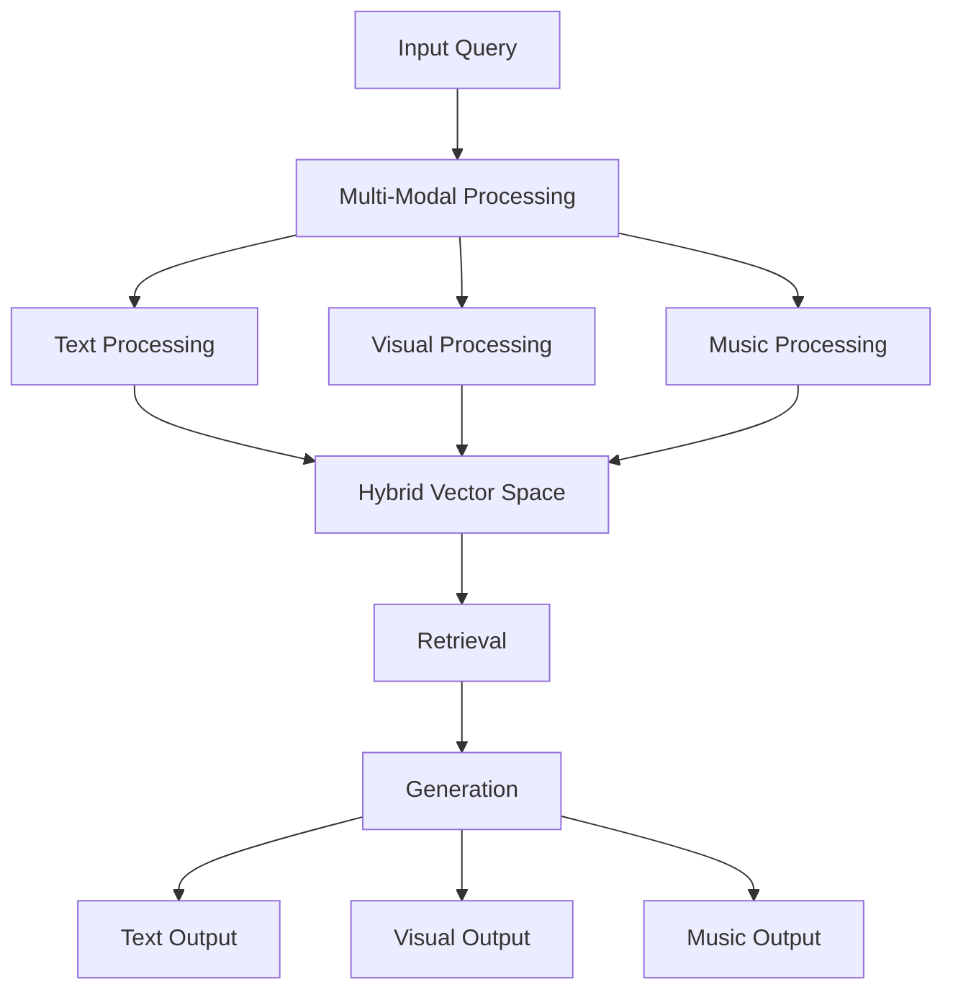
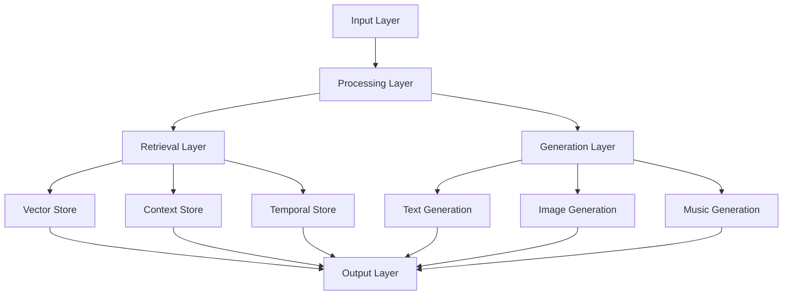

# 3.7. Enhanced RAG System

The enhanced Retrieval-Augmented Generation (RAG) system extends the core RAG architecture to support multi-modal content, cross-modal aspects, and enhanced temporal states. This design enables rich knowledge retrieval and generation across text, visual, and musical modalities while maintaining privacy, security, and attribution.

## Core Architecture



### Multi-Modal Vector Space

```rust
struct MultiModalVectorSpace {
    // Core vector spaces
    text_space: HybridSpatialIndex,
    visual_space: HybridSpatialIndex,
    music_space: HybridSpatialIndex,
    
    // Cross-modal relationships
    cross_modal_aspects: Vec<CrossModalAspect>,
    
    // Temporal state tracking
    temporal_states: HashMap<VectorId, TemporalState>,
    
    fn index_content(&mut self, content: MultiModalContent) -> Result<()> {
        // Index each modality
        let text_vector = self.text_space.index(content.text)?;
        let visual_vector = self.visual_space.index(content.visual)?;
        let music_vector = self.music_space.index(content.music)?;
        
        // Calculate cross-modal aspects
        let aspects = self.calculate_cross_modal_aspects(
            text_vector,
            visual_vector,
            music_vector
        )?;
        
        self.cross_modal_aspects.extend(aspects);
        
        // Track temporal state
        self.temporal_states.insert(
            content.id,
            content.temporal_state
        );
        
        Ok(())
    }
    
    fn retrieve_relevant(&self, query: MultiModalQuery) -> Vec<RelevantContent> {
        // Query each modality
        let text_results = self.text_space.query(query.text);
        let visual_results = self.visual_space.query(query.visual);
        let music_results = self.music_space.query(query.music);
        
        // Combine results considering cross-modal aspects
        self.merge_modal_results(text_results, visual_results, music_results)
    }
}
```

### Enhanced Retrieval

```rust
struct EnhancedRetriever {
    vector_space: MultiModalVectorSpace,
    privacy_filter: PrivacyAwareFilter,
    temporal_analyzer: TemporalStateAnalyzer,
    
    async fn retrieve(
        &self,
        query: MultiModalQuery,
        privacy_level: PrivacyLevel,
        temporal_state: TemporalState
    ) -> Result<RetrievalResults> {
        // Get initial results
        let raw_results = self.vector_space.retrieve_relevant(query);
        
        // Apply privacy filtering
        let filtered = self.privacy_filter.filter_results(
            raw_results,
            privacy_level
        )?;
        
        // Analyze temporal relationships
        let temporal_results = self.temporal_analyzer.analyze_results(
            filtered,
            temporal_state
        )?;
        
        // Sort by relevance considering all factors
        Ok(self.sort_by_relevance(temporal_results))
    }
}
```

### Enhanced Generation

```rust
struct EnhancedGenerator {
    llm: PrivacyAwareLLM,
    image_generator: ImageGenerator,
    music_generator: MusicGenerator,
    
    async fn generate(
        &self,
        context: MultiModalContext,
        query: MultiModalQuery
    ) -> Result<GeneratedContent> {
        // Generate content for each modality
        let text = self.llm.generate_text(context.text, query.text)?;
        let images = self.image_generator.generate(context.visual, query.visual)?;
        let music = self.music_generator.generate(context.music, query.music)?;
        
        // Ensure cross-modal coherence
        let coherent = self.ensure_coherence(text, images, music)?;
        
        // Verify temporal alignment
        self.verify_temporal_alignment(coherent)?;
        
        Ok(coherent)
    }
}
```

## Privacy Architecture

The enhanced RAG system implements comprehensive privacy controls:

```rust
struct PrivacyAwareRAG {
    // Core components with privacy awareness
    retriever: EnhancedRetriever,
    generator: EnhancedGenerator,
    
    // Privacy management
    privacy_manager: PrivacyManager,
    access_control: AccessControl,
    
    async fn process_query(
        &self,
        query: MultiModalQuery,
        user: &User
    ) -> Result<ProcessedOutput> {
        // Verify access permissions
        self.access_control.verify_access(user, query.privacy_requirements)?;
        
        // Apply privacy filters to retrieval
        let retrieval_results = self.retriever.retrieve(
            query,
            user.privacy_level,
            query.temporal_state
        )?;
        
        // Generate privacy-preserving outputs
        let generated = self.generator.generate(
            retrieval_results.to_context(),
            query
        )?;
        
        // Apply final privacy controls
        self.privacy_manager.process_output(generated, user)
    }
}
```

## Temporal Integration

The system handles three distinct time states:

```rust
struct TemporalStateManager {
    mundane_index: TimestampIndex,
    quantum_state: QuantumStateManager,
    holographic_ref: ChartReferenceManager,
    
    fn process_temporal(
        &self,
        content: MultiModalContent,
        state: TemporalState
    ) -> Result<ProcessedContent> {
        match state {
            TemporalState::Mundane(ts) => {
                // Process with concrete timestamp
                self.process_mundane(content, ts)
            },
            TemporalState::Quantum => {
                // Process without time constraints
                self.process_quantum(content)
            },
            TemporalState::Holographic(ref_chart) => {
                // Process with reference chart
                self.process_holographic(content, ref_chart)
            }
        }
    }
}
```

## Glass Bead Integration

The RAG system integrates with Glass Bead tokens:

```rust
struct GlassBeadRAG {
    // Core RAG components
    rag: EnhancedRAG,
    
    // Glass Bead integration
    bead_manager: GlassBeadManager,
    merkle_validator: MerkleValidator,
    
    async fn process_bead(
        &self,
        bead: GlassBead,
        query: MultiModalQuery
    ) -> Result<ProcessedBead> {
        // Verify bead integrity
        self.merkle_validator.verify_bead(bead)?;
        
        // Process through RAG
        let processed = self.rag.process_query(
            query,
            bead.owner
        )?;
        
        // Update bead with results
        self.bead_manager.update_bead(
            bead,
            processed
        )
    }
}
```

## Performance Architecture

The system implements several optimizations:

```rust
struct PerformanceOptimizer {
    // Caching system
    result_cache: LRUCache<QueryHash, ProcessedOutput>,
    vector_cache: VectorCache,
    
    // Batch processing
    batch_processor: BatchProcessor,
    
    async fn optimize_query(
        &self,
        query: MultiModalQuery
    ) -> Result<OptimizedOutput> {
        // Check cache
        if let Some(cached) = self.result_cache.get(&query.hash()) {
            return Ok(cached);
        }
        
        // Process in optimal batch size
        let batch_results = self.batch_processor.process(query)?;
        
        // Cache results
        self.cache_results(query, batch_results.clone())?;
        
        Ok(batch_results)
    }
}
```

## Key Benefits

1. **Enhanced Retrieval**
   - Multi-modal content support
   - Cross-modal aspect awareness
   - Temporal state handling
   - Privacy-preserving operations

2. **Rich Generation**
   - Synchronized multi-modal outputs
   - Cross-modal coherence
   - Temporal alignment
   - Privacy-aware generation

3. **System Integration**
   - Complete Glass Bead compatibility
   - Enhanced Book output support
   - Focus space integration
   - Secure collaboration features

4. **Performance Optimization**
   - Efficient multi-modal caching
   - Batch processing support
   - Resource optimization
   - Response time improvements

This enhanced RAG system enables:
- Rich multi-modal knowledge retrieval
- Coherent cross-modal generation
- Secure and private operations
- Efficient system integration
- Scalable performance
- Deep temporal awareness

The design creates a robust foundation for:
- Advanced knowledge processing
- Multi-modal pattern discovery
- Secure collaboration
- Rich user experiences
- System-wide integration

## Complete RAG System Architecture

The complete RAG system represents a unified architecture that combines core retrieval and generation capabilities with enhanced multi-modal features:

### System Components



### Core Subsystems

1. **Input Processing**
   - Multi-modal content ingestion
   - Privacy-aware filtering
   - Temporal state detection
   - Cross-modal relationship mapping

2. **Vector Management**
   - Hybrid geometric encoding
   - Cross-modal aspect tracking
   - Temporal state indexing
   - Privacy-preserving storage

3. **Context Management**
   - Dynamic knowledge base
   - Relationship tracking
   - State preservation
   - Access control

4. **Generation Pipeline**
   - Multi-modal synthesis
   - Cross-modal coherence
   - Temporal alignment
   - Privacy-aware output

### Integration Points

```rust
struct CompleteRAGSystem {
    // Core processing
    input_processor: MultiModalProcessor,
    vector_manager: VectorManager,
    context_manager: ContextManager,
    generation_pipeline: GenerationPipeline,
    
    // Integration systems
    glass_bead_interface: GlassBeadInterface,
    book_interface: BookInterface,
    focus_space_interface: FocusSpaceInterface,
    
    // Performance systems
    performance_optimizer: PerformanceOptimizer,
    resource_manager: ResourceManager,
    
    async fn process_complete(
        &self,
        input: CompleteInput
    ) -> Result<CompleteOutput> {
        // Process input
        let processed = self.input_processor.process(input)?;
        
        // Manage vectors
        let vectors = self.vector_manager.manage_vectors(processed)?;
        
        // Handle context
        let context = self.context_manager.manage_context(vectors)?;
        
        // Generate output
        let output = self.generation_pipeline.generate(context)?;
        
        // Optimize performance
        let optimized = self.performance_optimizer.optimize(output)?;
        
        // Integrate with system
        self.integrate_output(optimized)
    }
}
```

### Performance Characteristics

1. **Resource Requirements**
   - Base: 8GB RAM, 4 cores
   - Recommended: 16GB RAM, 8 cores
   - Enterprise: 32GB+ RAM, 16+ cores

2. **Processing Overhead**
   - Input processing: O(n) where n = input size
   - Vector operations: O(log n) with spatial indexing
   - Context management: O(1) with caching
   - Generation: O(m) where m = output complexity

3. **Scaling Metrics**
   - Linear scaling with input size
   - Logarithmic scaling with vector operations
   - Constant-time context lookup
   - Linear scaling with output complexity

### Cost Structure

| Operation | Base Cost | Modal Cost | Cross-Modal Cost |
|-----------|-----------|------------|------------------|
| Input Processing | 1 GBT | +0.2 GBT/mode | +0.5 GBT |
| Vector Operations | 2 GBT | +0.5 GBT/mode | +1.0 GBT |
| Context Management | 1 GBT | +0.3 GBT/mode | +0.7 GBT |
| Generation | 5 GBT | +1.0 GBT/mode | +2.0 GBT |

### Integration Benefits

1. **System Cohesion**
   - Seamless Glass Bead integration
   - Enhanced Book output support
   - Focus space compatibility
   - Cross-system optimization

2. **Performance Gains**
   - Reduced latency through caching
   - Optimized resource usage
   - Efficient scaling
   - Improved throughput

3. **Enhanced Features**
   - Rich multi-modal support
   - Deep temporal awareness
   - Secure operations
   - Collaborative capabilities

This complete RAG system provides:
- Comprehensive multi-modal processing
- Efficient resource utilization
- Secure and private operations
- Rich integration capabilities
- Scalable performance
- Enhanced user experience
