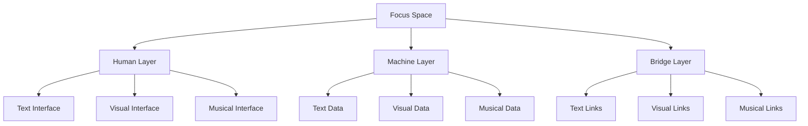

# 5.1 Enhanced Focus Spaces

The enhanced focus space design extends Memorativa's conceptual workspace to fully support multi-modal interaction through text, images, and music. Building on the established focus space architecture, this enhanced design enables rich cross-modal exploration while maintaining the core functionality of organizing and analyzing percepts, prototypes, and their symbolic relationships.

## Core Architecture

Focus spaces now integrate three distinct but interconnected layers:



### Layer Integration

1. **Human Layer**
   - Interactive text navigation
   - Visual workspace manipulation
   - Musical pattern exploration
   - Cross-modal relationship discovery

2. **Machine Layer**
   - Vector-encoded structured data
   - Image generation parameters
   - Musical pattern data
   - Cross-modal relationship mappings

3. **Bridge Layer**
   - Unified markup system
   - Visual overlay system
   - Audio synchronization
   - Modal interaction handlers

## Structural Definition

A focus space now acts as:

- **Multi-Modal Focus**: Filters prototypes through synchronized text, visual, and musical expressions
- **Temporal Scaffold**: Maintains time states across all modalities
- **Cross-Modal Matrix**: Stores angular relationships between different output types
- **Hierarchical Container**: Organizes nested spaces with multi-modal inheritance

## Core Features

### Multi-Modal Interface
```rust
struct MultiModalInterface {
    text_workspace: TextWorkspace,
    visual_workspace: VisualWorkspace,
    music_workspace: MusicWorkspace,
    sync_manager: SyncManager,
    
    fn process_interaction(&mut self, event: UserEvent) -> Result<()> {
        match event {
            UserEvent::TextSelect(range) => {
                self.sync_manager.sync_to_text(range)?;
                self.highlight_related_visuals(range)?;
                self.align_music_playback(range)?;
            },
            UserEvent::VisualSelect(region) => {
                self.sync_manager.sync_to_visual(region)?;
                self.highlight_related_text(region)?;
                self.trigger_musical_response(region)?;
            },
            UserEvent::MusicSelect(timestamp) => {
                self.sync_manager.sync_to_music(timestamp)?;
                self.highlight_related_text(timestamp)?;
                self.focus_visual_elements(timestamp)?;
            }
        }
        Ok(())
    }
}
```

### Multi-Modal Spherical Merkle Trees

Focus spaces implement specialized Multi-Modal Spherical Merkle Trees that verify content and relationship integrity across all modalities:

```rust
struct FocusSpaceMerkleTree {
    // Core components
    root: MerkleNodeId,
    nodes: HashMap<MerkleNodeId, FocusSpaceMerkleNode>,
    text_nodes: HashMap<TextElementId, MerkleNodeId>,
    visual_nodes: HashMap<VisualElementId, MerkleNodeId>,
    music_nodes: HashMap<MusicElementId, MerkleNodeId>,
    
    // Content integrity
    content_hashes: HashMap<MerkleNodeId, Hash>,
    
    // Angular relationships
    angular_relationships: HashMap<(MerkleNodeId, MerkleNodeId), AngularRelationship>,
    
    // Temporal state tracking
    temporal_states: HashMap<MerkleNodeId, TemporalState>,
    
    fn add_modal_element(&mut self, element: &ModalElement) -> Result<MerkleNodeId> {
        let node = FocusSpaceMerkleNode {
            id: generate_node_id(),
            element_type: element.element_type(),
            content_hash: hash_modal_content(element),
            temporal_state: element.temporal_state.clone(),
            
            // Hybrid spherical-hyperbolic coordinates
            theta: element.theta,
            phi: element.phi,
            radius: element.radius,
            kappa: element.curvature
        };
        
        // Add node to tree
        let node_id = node.id;
        self.nodes.insert(node_id, node);
        
        // Register node in appropriate modal index
        match &element.element_type {
            ElementType::Text(text_id) => {
                self.text_nodes.insert(*text_id, node_id);
            },
            ElementType::Visual(visual_id) => {
                self.visual_nodes.insert(*visual_id, node_id);
            },
            ElementType::Music(music_id) => {
                self.music_nodes.insert(*music_id, node_id);
            }
        }
        
        // Update content hash
        self.content_hashes.insert(node_id, node.content_hash);
        
        // Calculate and store angular relationships with existing nodes
        self.calculate_angular_relationships(node_id)?;
        
        Ok(node_id)
    }
    
    fn calculate_angular_relationships(&mut self, node_id: MerkleNodeId) -> Result<()> {
        let node = self.nodes.get(&node_id).ok_or(Error::NodeNotFound)?;
        
        for (&other_id, other_node) in &self.nodes {
            if other_id == node_id {
                continue;
            }
            
            // Calculate angular relationship between nodes
            let angle = calculate_angular_relationship(
                (node.theta, node.phi, node.radius, node.kappa),
                (other_node.theta, other_node.phi, other_node.radius, other_node.kappa)
            );
            
            // Only store significant relationships
            if is_significant_angle(angle) {
                self.angular_relationships.insert(
                    (node_id, other_id),
                    AngularRelationship {
                        angle,
                        strength: calculate_relationship_strength(angle),
                        modalities: (node.element_type.modality(), other_node.element_type.modality())
                    }
                );
            }
        }
        
        Ok(())
    }
    
    fn verify_integrity(&self) -> Result<VerificationResult> {
        // Verify content integrity
        let content_valid = self.verify_content_integrity()?;
        
        // Verify angular relationships
        let angular_valid = self.verify_angular_relationships()?;
        
        // Verify temporal consistency
        let temporal_valid = self.verify_temporal_consistency()?;
        
        Ok(VerificationResult {
            valid: content_valid && angular_valid && temporal_valid,
            content_integrity: content_valid,
            angular_consistency: angular_valid,
            temporal_consistency: temporal_valid
        })
    }
}

struct FocusSpaceMerkleVerifier {
    // Verification components for each modality
    text_verifier: TextVerifier,
    visual_verifier: VisualVerifier, 
    music_verifier: MusicVerifier,
    
    // Cross-modal verification
    aspect_verifier: AspectVerifier,
    
    fn verify_focus_space(&self, space: &FocusSpace) -> VerificationResult {
        // Content verification for each modality
        let text_valid = self.text_verifier.verify(&space.text_workspace);
        let visual_valid = self.visual_verifier.verify(&space.visual_workspace);
        let music_valid = self.music_verifier.verify(&space.music_workspace);
        
        // Cross-modal aspect verification
        let aspect_valid = self.aspect_verifier.verify_aspects(&space.cross_modal_aspects);
        
        // Temporal verification across modalities
        let temporal_valid = self.verify_temporal_consistency(space);
        
        VerificationResult {
            valid: text_valid && visual_valid && music_valid && 
                   aspect_valid && temporal_valid,
            text_integrity: text_valid,
            visual_integrity: visual_valid,
            music_integrity: music_valid,
            aspect_integrity: aspect_valid,
            temporal_integrity: temporal_valid
        }
    }
    
    fn verify_temporal_consistency(&self, space: &FocusSpace) -> bool {
        // Check temporal state consistency across modalities
        for state in &space.temporal_states {
            // Verify each modality correctly represents the state
            let text_state_valid = self.verify_text_temporal_state(&space.text_workspace, state);
            let visual_state_valid = self.verify_visual_temporal_state(&space.visual_workspace, state);
            let music_state_valid = self.verify_music_temporal_state(&space.music_workspace, state);
            
            if !(text_state_valid && visual_state_valid && music_state_valid) {
                return false;
            }
        }
        
        true
    }
}

### Cross-Modal Aspects

The system implements astrological-style angular relationships between different content types:

```rust
struct CrossModalAspect {
    source: ModalElement,
    target: ModalElement,
    angle: f32,
    weight: f32,
    temporal_state: TemporalState,
    merkle_verification: Option<AspectVerification>,
    
    fn calculate_resonance(&self) -> f32 {
        match self.angle {
            a if (a - 0.0).abs() < 5.0 => 1.0,   // Conjunction
            a if (a - 120.0).abs() < 5.0 => 0.9, // Trine
            a if (a - 90.0).abs() < 5.0 => 0.7,  // Square
            _ => 0.3
        }
    }
    
    fn has_verified_integrity(&self) -> bool {
        match &self.merkle_verification {
            Some(verification) => verification.is_valid,
            None => false
        }
    }
}

struct AspectVerification {
    is_valid: bool,
    verification_proof: SphericalMerkleProof,
    verification_timestamp: DateTime<Utc>,
    
    fn verify_aspect(&self, aspect: &CrossModalAspect) -> bool {
        // Verify aspect using Spherical Merkle proof
        let source_node = get_node_from_element(&aspect.source);
        let target_node = get_node_from_element(&aspect.target);
        
        let verified = verify_spherical_merkle_proof(
            &self.verification_proof,
            source_node,
            target_node,
            aspect.angle
        );
        
        verified
    }
}

### Temporal Integration

Focus spaces handle three distinct time states across all modalities:

```rust
struct TemporalState {
    mundane: Option<DateTime>,
    quantum: QuantumState,
    holographic: Option<ChartRef>,
    verification_state: TemporalVerificationState,
    
    fn apply_to_workspace(&self, workspace: &mut MultiModalWorkspace) {
        match self {
            TemporalState::Mundane(dt) => {
                workspace.set_concrete_time(dt);
                workspace.align_modalities_to_timestamp(dt);
                
                // Verify Merkle consistency after temporal update
                if let Err(e) = workspace.verify_merkle_consistency() {
                    log::warn!("Temporal consistency error: {}", e);
                    self.verification_state.record_inconsistency(e);
                } else {
                    self.verification_state.record_verification();
                }
            },
            TemporalState::Quantum => {
                workspace.enable_quantum_superposition();
                workspace.synchronize_probability_states();
                
                // Verify quantum state representation across modalities
                if let Err(e) = workspace.verify_quantum_consistency() {
                    log::warn!("Quantum consistency error: {}", e);
                    self.verification_state.record_inconsistency(e);
                } else {
                    self.verification_state.record_verification();
                }
            },
            TemporalState::Holographic(ref_chart) => {
                workspace.align_to_reference(ref_chart);
                workspace.synchronize_reference_states();
                
                // Verify holographic reference consistency
                if let Err(e) = workspace.verify_holographic_consistency() {
                    log::warn!("Holographic consistency error: {}", e);
                    self.verification_state.record_inconsistency(e);
                } else {
                    self.verification_state.record_verification();
                }
            }
        }
    }
}

struct TemporalVerificationState {
    last_verification: Option<DateTime<Utc>>,
    verification_count: u64,
    inconsistency_count: u64,
    inconsistency_details: Vec<TemporalInconsistency>,
    
    fn record_verification(&mut self) {
        self.last_verification = Some(Utc::now());
        self.verification_count += 1;
    }
    
    fn record_inconsistency(&mut self, error: Error) {
        self.inconsistency_count += 1;
        self.inconsistency_details.push(TemporalInconsistency {
            timestamp: Utc::now(),
            error_type: error.error_type(),
            description: error.to_string()
        });
    }
}
```

### Search & Filter Matrix

| Filter Type | Parameters | Example Use |
|-------------|------------|-------------|
| Multi-Modal | Content Type + Pattern | Find "Tension" across all modes |
| Cross-Modal | Source + Target + Angle | Show 120° text-music aspects |
| Temporal | State + Modal Pattern | Compare quantum visual patterns |
| Verification | Integrity Level + Mode | Find unverified music elements |
| Merkle | Tree Depth + Aspect Type | Search verified relationships |

## Integration with Glass Beads

Each focus space encodes as a glass bead with enhanced multi-modal support and Spherical Merkle verification:

```rust
struct EnhancedGlassBead {
    text_data: TextContent,
    visual_data: VisualContent,
    music_data: MusicContent,
    cross_modal_aspects: Vec<CrossModalAspect>,
    temporal_states: Vec<TemporalState>,
    merkle_root: [u8; 32],
    merkle_tree: Option<SphericalMerkleTree>,
    verification_proofs: Vec<SphericalMerkleProof>,
    
    fn verify_integrity(&self) -> VerificationResult {
        // Verify content integrity
        let content_valid = verify_content_integrity(
            &self.text_data,
            &self.visual_data,
            &self.music_data,
            self.merkle_root
        );
        
        // Verify angular relationships
        let angular_valid = verify_angular_relationships(
            &self.cross_modal_aspects,
            &self.merkle_tree.as_ref().unwrap()
        );
        
        // Verify temporal consistency
        let temporal_valid = verify_temporal_consistency(
            &self.temporal_states,
            &self.merkle_tree.as_ref().unwrap()
        );
        
        VerificationResult {
            valid: content_valid && angular_valid && temporal_valid,
            content_integrity: content_valid,
            angular_consistency: angular_valid,
            temporal_consistency: temporal_valid
        }
    }
    
    fn generate_verification_proof(&self) -> SphericalMerkleProof {
        // Generate a comprehensive proof for the bead
        generate_spherical_merkle_proof(
            &self.merkle_tree.as_ref().unwrap(),
            self.merkle_root
        )
    }
}
```

## Operational Model

### Focus Layers
1. **Core Layer**: Primary multi-modal expression
2. **Aspect Layer**: Cross-modal relationship network
3. **Temporal Layer**: State management across modes
4. **Integration Layer**: Modal synchronization
5. **Verification Layer**: Merkle-based integrity verification

### Inheritance Rules
- Child spaces inherit multi-modal patterns
- Cross-modal aspects propagate down
- Temporal states cascade through hierarchy
- Modal synchronization points inherit
- Merkle verification paths extend to child spaces

## Player Interactions

### Direct Manipulation
```rust
impl FocusSpaceInterface {
    async fn handle_interaction(&mut self, action: PlayerAction) -> Result<()> {
        // Capture interaction state before change
        let pre_state = self.capture_merkle_state();
        
        // Process the interaction
        match action {
            PlayerAction::DragVisual(element, position) => {
                self.update_visual_position(element, position)?;
                self.update_related_audio(element)?;
                self.sync_text_description(element)?;
            },
            PlayerAction::ModifyAudio(timestamp, change) => {
                self.update_audio_pattern(timestamp, change)?;
                self.update_related_visuals(timestamp)?;
                self.sync_text_markers(timestamp)?;
            },
            PlayerAction::EditText(range, content) => {
                self.update_text_content(range, content)?;
                self.update_related_visuals(range)?;
                self.sync_audio_markers(range)?;
            }
        }
        
        // Capture interaction state after change
        let post_state = self.capture_merkle_state();
        
        // Generate and store verification proof of change
        let proof = self.generate_change_proof(pre_state, post_state);
        self.store_verification_proof(proof)?;
        
        // Verify integrity after change
        self.verify_focus_space_integrity()?;
        
        Ok(())
    }
    
    fn verify_focus_space_integrity(&self) -> Result<VerificationResult> {
        // Create verifier
        let verifier = FocusSpaceMerkleVerifier::new();
        
        // Perform verification
        let result = verifier.verify_focus_space(self);
        
        // Log any verification failures
        if !result.valid {
            log::warn!("Focus space integrity verification failed: {:?}", result);
        }
        
        Ok(result)
    }
    
    fn capture_merkle_state(&self) -> MerkleState {
        // Capture current state of Merkle tree
        MerkleState {
            root_hash: self.merkle_tree.root_hash(),
            node_count: self.merkle_tree.node_count(),
            relationship_count: self.merkle_tree.relationship_count(),
            timestamp: Utc::now()
        }
    }
    
    fn generate_change_proof(&self, pre_state: MerkleState, post_state: MerkleState) -> ChangeProof {
        // Generate proof of state change
        ChangeProof {
            pre_state,
            post_state,
            delta_proof: self.merkle_tree.generate_delta_proof(
                pre_state.root_hash,
                post_state.root_hash
            ),
            changes: self.merkle_tree.extract_changes(
                pre_state.root_hash,
                post_state.root_hash
            )
        }
    }
}
```

### Core Interactions
1. **Multi-Modal Management**
   - Synchronize content across modes
   - Adjust cross-modal relationships
   - Manage temporal states
   - Control modal focus
   - Verify modal integrity

2. **Pattern Operations**
   - Create multi-modal patterns
   - Analyze cross-modal aspects
   - Track temporal evolution
   - Validate relationships
   - Generate verification proofs

3. **Space Organization**
   - Structure modal hierarchies
   - Manage inheritance
   - Control synchronization
   - Handle state propagation
   - Maintain Merkle consistency

### Performance Considerations

```rust
struct PerformanceOptimizer {
    cache: LRUCache<CacheKey, CachedContent>,
    batch_size: usize,
    verification_strategy: VerificationStrategy,
    
    async fn optimize_multi_modal(&self, actions: Vec<ModalAction>) -> Result<()> {
        let batches = actions.chunks(self.batch_size);
        
        for batch in batches {
            let cached = self.check_cache(batch)?;
            let uncached = self.filter_uncached(batch, &cached);
            
            if !uncached.is_empty() {
                let processed = self.process_batch(uncached).await?;
                self.update_cache(processed)?;
            }
            
            self.apply_changes(cached.chain(processed))?;
        }
        
        // Verify integrity based on verification strategy
        match self.verification_strategy {
            VerificationStrategy::VerifyAll => {
                self.verify_all_changes()?;
            },
            VerificationStrategy::VerifyBatched => {
                self.verify_batch_sample()?;
            },
            VerificationStrategy::VerifyProbabilistic => {
                self.probabilistic_verification()?;
            }
        }
        
        Ok(())
    }
    
    fn verify_all_changes(&self) -> Result<()> {
        // Comprehensive verification of all changes
        let verifier = FocusSpaceMerkleVerifier::new();
        verifier.verify_all_changes()
    }
    
    fn verify_batch_sample(&self) -> Result<()> {
        // Select representative sample from each batch
        // More efficient for large change sets
        let verifier = FocusSpaceMerkleVerifier::new();
        verifier.verify_batch_samples()
    }
    
    fn probabilistic_verification(&self) -> Result<()> {
        // Use statistical sampling for ultra-large changes
        // Trade-off between performance and certainty
        let verifier = FocusSpaceMerkleVerifier::new();
        verifier.probabilistic_verification()
    }
}
```

## Storage Integration

The enhanced focus space integrates with the specialized storage architecture for multi-modal content:

```rust
struct FocusSpaceStorage {
    // Core storage components
    metadata_db: NoSQLDatabase,
    object_store: ObjectStorage,
    vector_store: VectorDatabase,
    merkle_store: SphericalMerkleStore,
    
    fn store_focus_space(&self, space: &FocusSpace) -> Result<StorageResult> {
        // Store metadata with modal references
        let metadata_id = self.metadata_db.store(FocusSpaceMetadata {
            id: space.id,
            title: space.title.clone(),
            description: space.description.clone(),
            temporal_states: space.temporal_states.clone(),
            version: space.version,
        })?;

        // Store content objects by modality
        let object_refs = self.object_store.store_multi_modal(
            space.text_content.clone(),
            space.visual_content.clone(),
            space.audio_content.clone()
        )?;

        // Store vector embeddings for search/retrieval
        let embeddings = self.vector_store.store(VectorData {
            text_embeddings: space.text_embeddings.clone(),
            visual_embeddings: space.visual_embeddings.clone(),
            audio_embeddings: space.audio_embeddings.clone(),
            cross_modal_embeddings: space.cross_modal_embeddings.clone(),
        })?;
        
        // Store Spherical Merkle Tree with cross-modal relationships
        let merkle_id = self.merkle_store.store(
            space.build_multi_modal_merkle_tree()
        )?;

        Ok(StorageResult {
            metadata_id,
            object_refs,
            embeddings,
            merkle_id,
        })
    }
    
    fn load_focus_space(&self, id: FocusSpaceId) -> Result<FocusSpace> {
        // Load metadata
        let metadata = self.metadata_db.load(id)?;
        
        // Load content objects
        let objects = self.object_store.load_multi_modal(
            metadata.text_refs,
            metadata.visual_refs,
            metadata.audio_refs
        )?;
        
        // Load vector embeddings
        let embeddings = self.vector_store.load(
            metadata.embedding_refs
        )?;
        
        // Load Merkle tree
        let merkle_tree = self.merkle_store.load(
            metadata.merkle_id
        )?;
        
        // Construct focus space
        let space = FocusSpace::new(
            metadata,
            objects.text_content,
            objects.visual_content,
            objects.audio_content,
            embeddings,
            merkle_tree
        )?;
        
        // Verify integrity after loading
        let verification_result = space.verify_integrity()?;
        if !verification_result.valid {
            log::warn!("Loaded focus space failed integrity check: {:?}", verification_result);
        }
        
        Ok(space)
    }
}
```

## Key Points

1. **Enhanced Architecture**
   - Multi-modal workspace integration
   - Cross-modal aspect system
   - Temporal state handling across modes
   - Rich interaction patterns
   - Spherical Merkle Tree verification

2. **Integration Features**
   - Complete Glass Bead compatibility
   - Enhanced Book output support
   - RAG system integration
   - MST compliance across modes
   - Multi-modal integrity verification
   - Cross-modal relationship preservation

3. **Performance Optimization**
   - Efficient multi-modal caching
   - Batched operation processing
   - Smart resource management
   - Responsive interaction handling
   - Merkle-optimized verification strategies
   - Modal-specific performance tuning

4. **User Experience**
   - Intuitive modal navigation
   - Seamless state transitions
   - Rich pattern discovery
   - Fluid collaboration support
   - Verifiable content integrity
   - Cross-modal synchronization

5. **Verification Features**
   - Content integrity validation
   - Angular relationship verification
   - Temporal consistency checking
   - Cross-modal aspect validation
   - Delta-based verification
   - Efficient proof generation

This enhanced focus space design creates a rich multi-modal environment that:
- Enables deeper pattern recognition
- Supports intuitive knowledge exploration
- Maintains system-wide integration
- Preserves performance and scalability
- Ensures verifiable integrity across modalities

