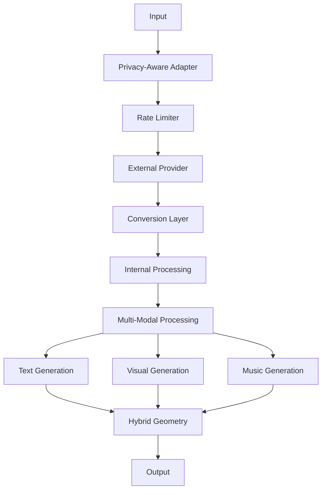
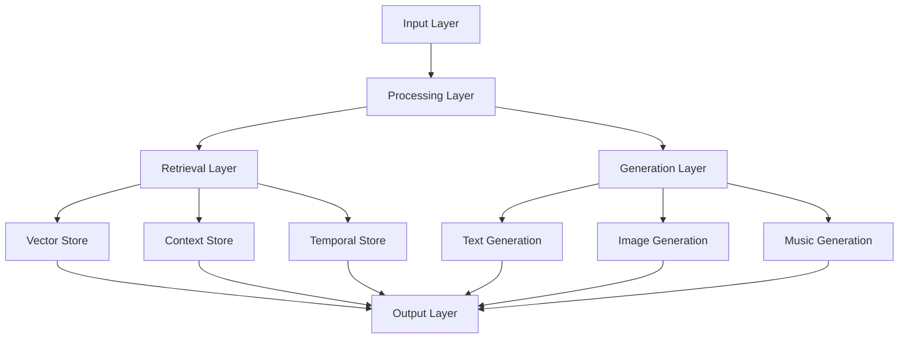

# 3.8. Enhanced LLM Integration

The enhanced LLM integration system extends Memorativa's core LLM architecture to support multi-modal processing, cross-modal aspects, and enhanced temporal states. This design enables rich integration with external LLM services while maintaining privacy, security, and the system's hybrid geometric structures.

## Core Architecture

The system provides both internal processing and external interfaces for Large Language Models (LLMs), with enhanced support for:

- Multi-modal content processing
- Cross-modal aspect relationships
- Enhanced temporal states
- Privacy-aware operations
- Hybrid geometric structures



## External Interfaces

The system offers enhanced external interfaces:

### 1. Provider Interface
```rust
pub trait EnhancedLLMProvider {
    // Core methods
    async fn generate_text(&self, prompt: &str) -> Result<String>;
    async fn generate_image(&self, prompt: &str) -> Result<Image>;
    async fn generate_music(&self, prompt: &str) -> Result<Music>;
    async fn generate_embeddings(&self, content: &MultiModalContent) -> Result<Vec<f32>>;
    
    // Capability detection
    fn supports_streaming(&self) -> bool;
    fn max_context_length(&self) -> usize;
    fn supported_modalities(&self) -> Vec<Modality>;
    fn embedding_dimensions(&self) -> usize;
}

// Example implementation
pub struct OpenAIProvider {
    client: OpenAIClient,
    config: ProviderConfig,
    
    async fn generate_multi_modal(
        &self,
        prompt: &MultiModalPrompt
    ) -> Result<MultiModalOutput> {
        // Generate content for each supported modality
        let text = self.generate_text(&prompt.text)?;
        let image = self.generate_image(&prompt.visual)?;
        let music = self.generate_music(&prompt.music)?;
        
        // Ensure cross-modal coherence
        let coherent = self.ensure_coherence(text, image, music)?;
        
        Ok(coherent)
    }
}
```

### 2. Privacy-Aware Adapter
```rust
pub struct EnhancedLLMAdapter {
    provider: Box<dyn EnhancedLLMProvider>,
    privacy_filter: PrivacyFilter,
    token_manager: GasTokenManager,
    
    async fn process_external(
        &self,
        input: MultiModalInput,
        privacy_level: PrivacyLevel
    ) -> Result<ProcessedOutput> {
        // Verify gas tokens
        self.token_manager.verify_operation(Operation::ExternalLLM)?;
        
        // Apply privacy filtering
        let filtered = self.privacy_filter.filter_for_external(input)?;
        
        // Process through external LLM
        let response = match privacy_level {
            PrivacyLevel::Public => {
                self.provider.generate_multi_modal(&filtered).await?
            },
            _ => return Err(Error::PrivacyLevelNotSupported)
        };
        
        // Convert to internal format
        self.convert_to_internal_format(response)
    }
}
```

### 3. Enhanced Conversion Layer
```rust
pub struct EnhancedFormatConverter {
    spatial_encoder: HybridSpatialEncoder,
    temporal_processor: TemporalProcessor,
    cross_modal_analyzer: CrossModalAnalyzer,
    
    fn to_external_format(
        &self,
        internal: EnhancedInternalFormat
    ) -> Result<EnhancedExternalFormat> {
        // Convert each modality
        let text = self.convert_text(internal.text)?;
        let visual = self.convert_visual(internal.visual)?;
        let music = self.convert_music(internal.music)?;
        
        // Preserve cross-modal relationships
        let aspects = self.preserve_aspects(internal.aspects)?;
        
        // Handle temporal states
        let temporal = self.convert_temporal_state(internal.temporal_state)?;
        
        Ok(EnhancedExternalFormat {
            text,
            visual,
            music,
            aspects,
            temporal
        })
    }
    
    fn to_internal_format(
        &self,
        external: EnhancedExternalFormat
    ) -> Result<EnhancedInternalFormat> {
        // Project into hybrid space
        let coords = self.spatial_encoder
            .project_to_hybrid_space(external)?;
            
        // Process temporal states
        let temporal = self.temporal_processor
            .process_state(external.temporal)?;
            
        // Analyze cross-modal aspects
        let aspects = self.cross_modal_analyzer
            .analyze_relationships(external)?;
            
        Ok(EnhancedInternalFormat {
            coords,
            temporal,
            aspects,
            privacy_level: PrivacyLevel::Public,
            verification_score: 1.0
        })
    }
}
```

### 4. Rate Limiting & Cost Management
```rust
pub struct EnhancedExternalLLMManager {
    rate_limiter: RateLimiter,
    cost_tracker: CostTracker,
    gas_manager: GasTokenManager,
    
    async fn manage_request(
        &self,
        request: MultiModalRequest
    ) -> Result<ManagedResponse> {
        // Check rate limits
        self.rate_limiter.check_limits(request.modalities())?;
        
        // Calculate costs
        let costs = self.calculate_costs(request)?;
        
        // Verify gas availability
        self.gas_manager.verify_gas(costs)?;
        
        // Track costs
        self.cost_tracker.record_costs(costs)?;
        
        Ok(ManagedResponse {
            request,
            costs,
            limits: self.rate_limiter.get_current_limits()
        })
    }
    
    fn calculate_costs(&self, request: &MultiModalRequest) -> Result<Costs> {
        let mut total = 0;
        
        // Base cost per modality
        for modality in request.modalities() {
            total += match modality {
                Modality::Text => 1,
                Modality::Visual => 2,
                Modality::Music => 2
            };
        }
        
        // Additional costs for cross-modal processing
        if request.modalities().len() > 1 {
            total += request.modalities().len() as u64;
        }
        
        Ok(Costs { total })
    }
}
```

## Integration Points

### 1. Glass Bead Integration
```rust
pub struct GlassBeadLLMIntegration {
    llm_adapter: EnhancedLLMAdapter,
    bead_processor: GlassBeadProcessor,
    
    async fn process_bead(
        &self,
        bead: GlassBead,
        prompt: MultiModalPrompt
    ) -> Result<ProcessedBead> {
        // Process through LLM
        let llm_output = self.llm_adapter
            .process_external(prompt, bead.privacy_level)?;
            
        // Update bead with results
        self.bead_processor.update_bead(bead, llm_output)
    }
}
```

### 2. Book Integration
```rust
pub struct BookLLMIntegration {
    llm_adapter: EnhancedLLMAdapter,
    book_processor: BookProcessor,
    
    async fn process_book(
        &self,
        book: Book,
        prompt: MultiModalPrompt
    ) -> Result<ProcessedBook> {
        // Process through LLM
        let llm_output = self.llm_adapter
            .process_external(prompt, book.privacy_level)?;
            
        // Update book with results
        self.book_processor.update_book(book, llm_output)
    }
}
```

### 3. Focus Space Integration
```rust
pub struct FocusSpaceLLMIntegration {
    llm_adapter: EnhancedLLMAdapter,
    space_processor: FocusSpaceProcessor,
    
    async fn process_space(
        &self,
        space: FocusSpace,
        prompt: MultiModalPrompt
    ) -> Result<ProcessedSpace> {
        // Process through LLM
        let llm_output = self.llm_adapter
            .process_external(prompt, space.privacy_level)?;
            
        // Update space with results
        self.space_processor.update_space(space, llm_output)
    }
}
```

## Key Benefits

1. **Enhanced Processing**
   - Multi-modal content generation
   - Cross-modal aspect awareness
   - Rich temporal state handling
   - Privacy-preserving operations

2. **System Integration**
   - Complete Glass Bead compatibility
   - Enhanced Book output support
   - Focus space integration
   - Secure collaboration features

3. **Performance Optimization**
   - Efficient multi-modal processing
   - Smart resource allocation
   - Cost-effective operations
   - Response time improvements

This enhanced LLM integration enables:
- Rich multi-modal content generation
- Cross-modal relationship preservation
- Secure and private operations
- Efficient system integration
- Scalable performance
- Deep temporal awareness

The design creates a robust foundation for:
- Advanced content generation
- Multi-modal pattern discovery
- Secure collaboration
- Rich user experiences
- System-wide integration

## Complete LLM Integration Design

The complete LLM integration design represents a unified architecture that combines core LLM functionality with enhanced multi-modal capabilities:

### System Components



### Core Subsystems

1. **Input Processing**
   - Multi-modal content ingestion
   - Privacy-aware filtering
   - Temporal state detection
   - Cross-modal relationship mapping

2. **Vector Management**
   - Hybrid geometric encoding
   - Cross-modal aspect tracking
   - Temporal state indexing
   - Privacy-preserving storage

3. **Context Management**
   - Dynamic knowledge base
   - Relationship tracking
   - State preservation
   - Access control

4. **Generation Pipeline**
   - Multi-modal synthesis
   - Cross-modal coherence
   - Temporal alignment
   - Privacy-aware output

### Implementation Architecture

```rust
struct CompleteLLMSystem {
    // Core processing
    input_processor: MultiModalProcessor,
    vector_manager: VectorManager,
    context_manager: ContextManager,
    generation_pipeline: GenerationPipeline,
    
    // Integration systems
    glass_bead_interface: GlassBeadInterface,
    book_interface: BookInterface,
    focus_space_interface: FocusSpaceInterface,
    
    // Performance systems
    performance_optimizer: PerformanceOptimizer,
    resource_manager: ResourceManager,
    
    async fn process_complete(
        &self,
        input: CompleteInput
    ) -> Result<CompleteOutput> {
        // Process input
        let processed = self.input_processor.process(input)?;
        
        // Manage vectors
        let vectors = self.vector_manager.manage_vectors(processed)?;
        
        // Handle context
        let context = self.context_manager.manage_context(vectors)?;
        
        // Generate output
        let output = self.generation_pipeline.generate(context)?;
        
        // Optimize performance
        let optimized = self.performance_optimizer.optimize(output)?;
        
        // Integrate with system
        self.integrate_output(optimized)
    }
}
```

### Performance Characteristics

1. **Resource Requirements**
   - Base: 8GB RAM, 4 cores
   - Recommended: 16GB RAM, 8 cores
   - Enterprise: 32GB+ RAM, 16+ cores

2. **Processing Overhead**
   - Input processing: O(n) where n = input size
   - Vector operations: O(log n) with spatial indexing
   - Context management: O(1) with caching
   - Generation: O(m) where m = output complexity

3. **Scaling Metrics**
   - Linear scaling with input size
   - Logarithmic scaling with vector operations
   - Constant-time context lookup
   - Linear scaling with output complexity

### Cost Structure

| Operation | Base Cost | Modal Cost | Cross-Modal Cost |
|-----------|-----------|------------|------------------|
| Input Processing | 1 GBT | +0.2 GBT/mode | +0.5 GBT |
| Vector Operations | 2 GBT | +0.5 GBT/mode | +1.0 GBT |
| Context Management | 1 GBT | +0.3 GBT/mode | +0.7 GBT |
| Generation | 5 GBT | +1.0 GBT/mode | +2.0 GBT |

### Integration Benefits

1. **System Cohesion**
   - Seamless Glass Bead integration
   - Enhanced Book output support
   - Focus space compatibility
   - Cross-system optimization

2. **Performance Gains**
   - Reduced latency through caching
   - Optimized resource usage
   - Efficient scaling
   - Improved throughput

3. **Enhanced Features**
   - Rich multi-modal support
   - Deep temporal awareness
   - Secure operations
   - Collaborative capabilities

This complete LLM system provides:
- Comprehensive multi-modal processing
- Efficient resource utilization
- Secure and private operations
- Rich integration capabilities
- Scalable performance
- Enhanced user experience
