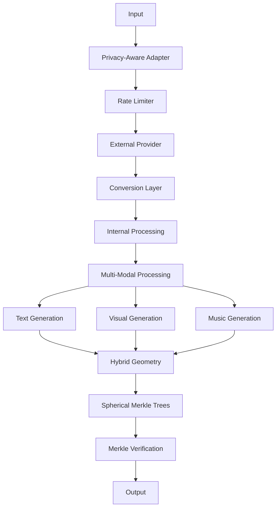
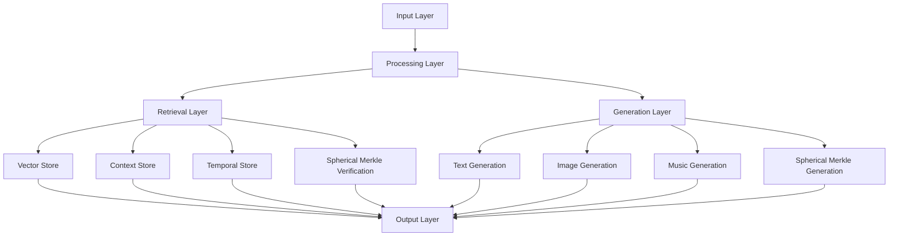

# 3.8. Enhanced LLM Integration

The enhanced LLM integration system extends Memorativa's core LLM architecture to support multi-modal processing, cross-modal aspects, and enhanced temporal states. This design enables rich integration with external LLM services while maintaining privacy, security, and the system's hybrid geometric structures.

## Core Architecture

The system provides both internal processing and external interfaces for Large Language Models (LLMs), with enhanced support for:

- Multi-modal content processing
- Cross-modal aspect relationships
- Enhanced temporal states
- Privacy-aware operations
- Hybrid geometric structures



## External Interfaces

The system offers enhanced external interfaces:

### 1. Provider Interface
```rust
pub trait EnhancedLLMProvider {
    // Core methods
    async fn generate_text(&self, prompt: &str) -> Result<String>;
    async fn generate_image(&self, prompt: &str) -> Result<Image>;
    async fn generate_music(&self, prompt: &str) -> Result<Music>;
    async fn generate_embeddings(&self, content: &MultiModalContent) -> Result<Vec<f32>>;
    
    // Capability detection
    fn supports_streaming(&self) -> bool;
    fn max_context_length(&self) -> usize;
    fn supported_modalities(&self) -> Vec<Modality>;
    fn embedding_dimensions(&self) -> usize;
}

// Example implementation
pub struct OpenAIProvider {
    client: OpenAIClient,
    config: ProviderConfig,
    
    async fn generate_multi_modal(
        &self,
        prompt: &MultiModalPrompt
    ) -> Result<MultiModalOutput> {
        // Generate content for each supported modality
        let text = self.generate_text(&prompt.text)?;
        let image = self.generate_image(&prompt.visual)?;
        let music = self.generate_music(&prompt.music)?;
        
        // Ensure cross-modal coherence
        let coherent = self.ensure_coherence(text, image, music)?;
        
        Ok(coherent)
    }
}
```

### 2. Privacy-Aware Adapter
```rust
pub struct EnhancedLLMAdapter {
    provider: Box<dyn EnhancedLLMProvider>,
    privacy_filter: PrivacyFilter,
    token_manager: GasTokenManager,
    
    async fn process_external(
        &self,
        input: MultiModalInput,
        privacy_level: PrivacyLevel
    ) -> Result<ProcessedOutput> {
        // Verify gas tokens
        self.token_manager.verify_operation(Operation::ExternalLLM)?;
        
        // Apply privacy filtering
        let filtered = self.privacy_filter.filter_for_external(input)?;
        
        // Process through external LLM
        let response = match privacy_level {
            PrivacyLevel::Public => {
                self.provider.generate_multi_modal(&filtered).await?
            },
            _ => return Err(Error::PrivacyLevelNotSupported)
        };
        
        // Convert to internal format
        self.convert_to_internal_format(response)
    }
}
```

### 3. Enhanced Conversion Layer
```rust
pub struct EnhancedFormatConverter {
    spatial_encoder: HybridSpatialEncoder,
    temporal_processor: TemporalProcessor,
    cross_modal_analyzer: CrossModalAnalyzer,
    
    fn to_external_format(
        &self,
        internal: EnhancedInternalFormat
    ) -> Result<EnhancedExternalFormat> {
        // Convert each modality
        let text = self.convert_text(internal.text)?;
        let visual = self.convert_visual(internal.visual)?;
        let music = self.convert_music(internal.music)?;
        
        // Preserve cross-modal relationships
        let aspects = self.preserve_aspects(internal.aspects)?;
        
        // Handle temporal states
        let temporal = self.convert_temporal_state(internal.temporal_state)?;
        
        Ok(EnhancedExternalFormat {
            text,
            visual,
            music,
            aspects,
            temporal
        })
    }
    
    fn to_internal_format(
        &self,
        external: EnhancedExternalFormat
    ) -> Result<EnhancedInternalFormat> {
        // Project into hybrid space
        let coords = self.spatial_encoder
            .project_to_hybrid_space(external)?;
            
        // Process temporal states
        let temporal = self.temporal_processor
            .process_state(external.temporal)?;
            
        // Analyze cross-modal aspects
        let aspects = self.cross_modal_analyzer
            .analyze_relationships(external)?;
            
        Ok(EnhancedInternalFormat {
            coords,
            temporal,
            aspects,
            privacy_level: PrivacyLevel::Public,
            verification_score: 1.0
        })
    }
}
```

### 4. Rate Limiting & Cost Management
```rust
pub struct EnhancedExternalLLMManager {
    rate_limiter: RateLimiter,
    cost_tracker: CostTracker,
    gas_manager: GasTokenManager,
    
    async fn manage_request(
        &self,
        request: MultiModalRequest
    ) -> Result<ManagedResponse> {
        // Check rate limits
        self.rate_limiter.check_limits(request.modalities())?;
        
        // Calculate costs
        let costs = self.calculate_costs(request)?;
        
        // Verify gas availability
        self.gas_manager.verify_gas(costs)?;
        
        // Track costs
        self.cost_tracker.record_costs(costs)?;
        
        Ok(ManagedResponse {
            request,
            costs,
            limits: self.rate_limiter.get_current_limits()
        })
    }
    
    fn calculate_costs(&self, request: &MultiModalRequest) -> Result<Costs> {
        let mut total = 0;
        
        // Base cost per modality
        for modality in request.modalities() {
            total += match modality {
                Modality::Text => 1,
                Modality::Visual => 2,
                Modality::Music => 2
            };
        }
        
        // Additional costs for cross-modal processing
        if request.modalities().len() > 1 {
            total += request.modalities().len() as u64;
        }
        
        Ok(Costs { total })
    }
}
```

## Multi-Modal Spherical Merkle Tree Integration

The LLM integration implements specialized Multi-Modal Spherical Merkle Trees that verify content and relationship integrity across all modalities:

```rust
pub struct LLMMerkleIntegration {
    // Core components
    merkle_tree: MultiModalMerkleTree,
    merkle_verifier: MultiModalMerkleVerifier,
    
    // Cache for performance
    verification_cache: LRUCache<NodeId, VerificationResult>,
    
    fn process_llm_output(&self, output: MultiModalOutput) -> Result<VerifiedOutput> {
        // Generate Merkle tree for output
        let tree = self.generate_merkle_tree(output.clone())?;
        
        // Verify output integrity using Merkle verification
        let verification_result = self.merkle_verifier.verify_tree(&tree)?;
        
        // Return verified output with integrity metadata
        Ok(VerifiedOutput {
            output,
            verification_result,
            merkle_proof: tree.generate_proof()
        })
    }
    
    fn generate_merkle_tree(&self, output: MultiModalOutput) -> Result<MultiModalMerkleTree> {
        // Create new Merkle tree
        let mut tree = MultiModalMerkleTree::new();
        
        // Create root node
        let root_node = self.create_root_node(&output)?;
        tree.add_node(root_node.clone())?;
        
        // Add modality-specific nodes
        let text_node = self.create_text_node(&output)?;
        let image_node = self.create_image_node(&output)?;
        let music_node = self.create_music_node(&output)?;
        
        tree.add_node(text_node.clone())?;
        tree.add_node(image_node.clone())?;
        tree.add_node(music_node.clone())?;
        
        // Link nodes as children of root
        tree.add_child(root_node.id, text_node.id)?;
        tree.add_child(root_node.id, image_node.id)?;
        tree.add_child(root_node.id, music_node.id)?;
        
        // Calculate and add angular relationships
        self.add_angular_relationships(&mut tree, &output)?;
        
        // Add sync points
        self.add_sync_points(&mut tree, &output)?;
        
        // Verify tree integrity
        tree.verify_integrity()?;
        
        Ok(tree)
    }
    
    fn add_angular_relationships(
        &self,
        tree: &mut MultiModalMerkleTree,
        output: &MultiModalOutput
    ) -> Result<()> {
        // Calculate relationships between nodes
        let text_image_angle = self.calculate_angle(
            &output.text,
            &output.image
        );
        
        let text_music_angle = self.calculate_angle(
            &output.text,
            &output.music
        );
        
        let image_music_angle = self.calculate_angle(
            &output.image,
            &output.music
        );
        
        // Add calculated relationships to tree
        let text_id = tree.get_node_id_by_modality(Modality::Text)?;
        let image_id = tree.get_node_id_by_modality(Modality::Image)?;
        let music_id = tree.get_node_id_by_modality(Modality::Music)?;
        
        tree.add_relationship(text_id, image_id, text_image_angle, RelationshipType::TextToImage)?;
        tree.add_relationship(text_id, music_id, text_music_angle, RelationshipType::TextToMusic)?;
        tree.add_relationship(image_id, music_id, image_music_angle, RelationshipType::ImageToMusic)?;
        
        Ok(())
    }
}
```

### Multi-Modal Merkle Node Structure

```rust
pub struct MultiModalMerkleNode {
    // Core node data
    id: NodeId,
    parent: Option<NodeId>,
    children: Vec<NodeId>,
    hash: [u8; 32],
    
    // Content by modality (optional for each node)
    text_content: Option<TextContent>,
    image_content: Option<ImageContent>,
    music_content: Option<MusicContent>,
    
    // Hybrid spherical-hyperbolic coordinates
    theta: f32,     // Archetypal angle (0-2π)
    phi: f32,       // Expression elevation (-π/2-π/2)
    radius: f32,    // Mundane magnitude (0-1)
    kappa: f32,     // Curvature parameter
    
    // Cross-modal relationships
    angular_relationships: HashMap<(NodeId, Modality), CrossModalRelationship>,
    
    // Temporal state
    temporal_state: TemporalState,
    
    // Sync points across modalities
    sync_points: Vec<SyncPoint>,
}

pub struct SyncPoint {
    // Position markers in each modality
    text_position: Option<TextPosition>,
    image_marker: Option<ImageMarker>,
    audio_timestamp: Option<AudioTimestamp>,
    
    // Sync point type
    sync_type: SyncType,
    
    // Temporal state at sync point
    temporal_state: TemporalState,
    
    // Verification hash for integrity
    hash: [u8; 32],
}

pub struct CrossModalRelationship {
    // Angular distance in spherical-hyperbolic space
    angle: f32,
    
    // Relationship strength/significance
    strength: f32,
    
    // Relationship type
    relation_type: RelationType,
    
    // Modal transfer properties
    modal_transfer: ModalTransferProperties,
}
```

### Cross-Modal Verification Pipeline

```rust
pub struct LLMVerificationPipeline {
    // Specialized verifiers
    content_verifier: ContentVerifier,
    angular_verifier: AngularVerifier,
    sync_verifier: SyncVerifier,
    temporal_verifier: TemporalVerifier,
    
    async fn verify_llm_output(&self, output: MultiModalOutput) -> VerificationResult {
        // Verify content integrity across modalities
        let content_valid = self.content_verifier.verify(&output)?;
        
        // Verify angular relationships between modalities
        let angular_valid = self.angular_verifier.verify_relationships(&output)?;
        
        // Verify sync points across modalities
        let sync_valid = self.sync_verifier.verify_sync_points(&output)?;
        
        // Verify temporal consistency
        let temporal_valid = self.temporal_verifier.verify_state(&output)?;
        
        VerificationResult {
            valid: content_valid && angular_valid && sync_valid && temporal_valid,
            content_integrity: content_valid,
            angular_consistency: angular_valid,
            sync_integrity: sync_valid,
            temporal_coherence: temporal_valid
        }
    }
    
    fn verify_content(&self, content: &MultiModalContent) -> Result<bool> {
        // Calculate expected content hash
        let expected_hash = calculate_content_hash(content);
        
        // Check against stored hash
        content.hash == expected_hash
    }
    
    fn verify_angular_relationship(
        &self,
        source_id: NodeId,
        target_id: NodeId,
        expected_angle: f32,
        modalities: (Modality, Modality)
    ) -> Result<bool> {
        // Calculate actual angle
        let actual_angle = calculate_cross_modal_angle(
            source_id,
            target_id,
            modalities
        )?;
        
        // Check if actual angle matches expected
        (actual_angle - expected_angle).abs() < ANGLE_TOLERANCE
    }
}
```

### Performance Optimization

```rust
pub struct LLMMerkleOptimizer {
    verification_cache: LRUCache<VerificationKey, VerificationResult>,
    thread_pool: ThreadPool,
    
    fn optimize_verification(&self, output: &MultiModalOutput) -> OptimizedStrategy {
        // Select verification strategy based on output complexity
        if output.is_small() {
            OptimizedStrategy::Complete
        } else if output.is_medium() {
            OptimizedStrategy::Parallel { 
                thread_count: self.thread_pool.available_threads() 
            }
        } else {
            OptimizedStrategy::Probabilistic { 
                confidence_threshold: 0.95,
                max_sample_size: 50
            }
        }
    }
    
    fn parallel_verify(
        &self, 
        nodes: &[MultiModalMerkleNode],
        strategy: OptimizedStrategy
    ) -> Result<Vec<VerificationResult>> {
        match strategy {
            OptimizedStrategy::Complete => {
                // Verify all nodes
                Ok(nodes.iter().map(|node| {
                    self.verify_node(node)
                }).collect())
            },
            OptimizedStrategy::Parallel { thread_count } => {
                // Verify in parallel
                let chunks = nodes.chunks(nodes.len() / thread_count.max(1));
                let results = chunks.par_iter().map(|chunk| {
                    chunk.iter().map(|node| self.verify_node(node)).collect::<Vec<_>>()
                }).collect::<Vec<_>>();
                
                Ok(results.into_iter().flatten().collect())
            },
            OptimizedStrategy::Probabilistic { confidence_threshold, max_sample_size } => {
                // Verify probabilistically
                let sample = self.select_representative_sample(nodes, max_sample_size);
                let sample_results = sample.iter().map(|node| self.verify_node(node)).collect::<Vec<_>>();
                
                let positive_rate = sample_results.iter().filter(|r| r.valid).count() as f32 / sample_results.len() as f32;
                
                if positive_rate >= confidence_threshold {
                    // Extrapolate results
                    Ok(nodes.iter().map(|_| VerificationResult {
                        valid: true,
                        confidence_score: positive_rate,
                        ..Default::default()
                    }).collect())
                } else {
                    // Fall back to full verification
                    Ok(nodes.iter().map(|node| self.verify_node(node)).collect())
                }
            }
        }
    }
}

pub enum OptimizedStrategy {
    Complete,
    Parallel { thread_count: usize },
    Probabilistic { confidence_threshold: f32, max_sample_size: usize }
}
```

### Cross-Component Integration

```rust
pub struct EnhancedLLMCrossComponentVerifier {
    // Component verifiers
    book_verifier: BookMerkleVerifier,
    focus_space_verifier: FocusSpaceMerkleVerifier,
    glass_bead_verifier: GlassBeadMerkleVerifier,
    rag_verifier: RAGMerkleVerifier,
    
    fn verify_cross_component_consistency(&self, output: &MultiModalOutput) -> Result<bool> {
        // Verify consistency with books
        let book_consistent = self.book_verifier.verify_llm_consistency(output)?;
        
        // Verify consistency with focus spaces
        let focus_consistent = self.focus_space_verifier.verify_llm_consistency(output)?;
        
        // Verify consistency with glass beads
        let bead_consistent = self.glass_bead_verifier.verify_llm_consistency(output)?;
        
        // Verify consistency with RAG
        let rag_consistent = self.rag_verifier.verify_llm_consistency(output)?;
        
        Ok(book_consistent && focus_consistent && bead_consistent && rag_consistent)
    }
}
```

## Integration Points

### 1. Glass Bead Integration
```rust
pub struct GlassBeadLLMIntegration {
    llm_adapter: EnhancedLLMAdapter,
    bead_processor: GlassBeadProcessor,
    merkle_verifier: MultiModalMerkleVerifier,
    
    async fn process_bead(
        &self,
        bead: GlassBead,
        prompt: MultiModalPrompt
    ) -> Result<ProcessedBead> {
        // Process through LLM
        let llm_output = self.llm_adapter
            .process_external(prompt, bead.privacy_level)?;
            
        // Verify output with Spherical Merkle Trees
        let verification_result = self.merkle_verifier
            .verify_output(&llm_output)?;
            
        if !verification_result.valid {
            log::warn!("LLM output failed verification: {:?}", verification_result);
        }
            
        // Update bead with verified results
        self.bead_processor.update_bead(bead, llm_output, verification_result)
    }
}
```

### 2. Book Integration
```rust
pub struct BookLLMIntegration {
    llm_adapter: EnhancedLLMAdapter,
    book_processor: BookProcessor,
    merkle_verifier: MultiModalMerkleVerifier,
    
    async fn process_book(
        &self,
        book: Book,
        prompt: MultiModalPrompt
    ) -> Result<ProcessedBook> {
        // Process through LLM
        let llm_output = self.llm_adapter
            .process_external(prompt, book.privacy_level)?;
            
        // Verify output with Spherical Merkle Trees
        let verification_result = self.merkle_verifier
            .verify_output(&llm_output)?;
            
        if !verification_result.valid {
            log::warn!("LLM output failed verification: {:?}", verification_result);
        }
            
        // Update book with verified results
        self.book_processor.update_book(book, llm_output, verification_result)
    }
}
```

### 3. Focus Space Integration
```rust
pub struct FocusSpaceLLMIntegration {
    llm_adapter: EnhancedLLMAdapter,
    space_processor: FocusSpaceProcessor,
    merkle_verifier: MultiModalMerkleVerifier,
    
    async fn process_space(
        &self,
        space: FocusSpace,
        prompt: MultiModalPrompt
    ) -> Result<ProcessedSpace> {
        // Process through LLM
        let llm_output = self.llm_adapter
            .process_external(prompt, space.privacy_level)?;
            
        // Verify output with Spherical Merkle Trees
        let verification_result = self.merkle_verifier
            .verify_output(&llm_output)?;
            
        if !verification_result.valid {
            log::warn!("LLM output failed verification: {:?}", verification_result);
        }
            
        // Update space with verified results
        self.space_processor.update_space(space, llm_output, verification_result)
    }
}
```

### 4. RAG Integration
```rust
pub struct RAGLLMIntegration {
    llm_adapter: EnhancedLLMAdapter,
    rag_processor: RAGProcessor,
    merkle_verifier: MultiModalMerkleVerifier,
    
    async fn process_rag_query(
        &self,
        query: RAGQuery,
        prompt: MultiModalPrompt
    ) -> Result<ProcessedRAGResponse> {
        // Process through LLM
        let llm_output = self.llm_adapter
            .process_external(prompt, query.privacy_level)?;
            
        // Verify output with Spherical Merkle Trees
        let verification_result = self.merkle_verifier
            .verify_output(&llm_output)?;
            
        if !verification_result.valid {
            log::warn!("LLM output failed verification: {:?}", verification_result);
        }
            
        // Process RAG results with verified LLM output
        self.rag_processor.process_response(query, llm_output, verification_result)
    }
}
```

## Key Benefits

1. **Enhanced Processing**
   - Multi-modal content generation
   - Cross-modal aspect awareness
   - Rich temporal state handling
   - Privacy-preserving operations
   - Comprehensive Merkle verification

2. **System Integration**
   - Complete Glass Bead compatibility
   - Enhanced Book output support
   - Focus space integration
   - Secure collaboration features
   - Cross-component integrity verification

3. **Performance Optimization**
   - Efficient multi-modal processing
   - Smart resource allocation
   - Cost-effective operations
   - Response time improvements
   - Adaptive verification strategies

This enhanced LLM integration enables:
- Rich multi-modal content generation
- Cross-modal relationship preservation
- Secure and private operations
- Efficient system integration
- Scalable performance
- Deep temporal awareness
- Comprehensive verification via Spherical Merkle Trees

The design creates a robust foundation for:
- Advanced content generation
- Multi-modal pattern discovery
- Secure collaboration
- Rich user experiences
- System-wide integration
- Verifiable content integrity across all components

## Complete LLM Integration Design

The complete LLM integration design represents a unified architecture that combines core LLM functionality with enhanced multi-modal capabilities:

### System Components



### Core Subsystems

1. **Input Processing**
   - Multi-modal content ingestion
   - Privacy-aware filtering
   - Temporal state detection
   - Cross-modal relationship mapping

2. **Vector Management**
   - Hybrid geometric encoding
   - Cross-modal aspect tracking
   - Temporal state indexing
   - Privacy-preserving storage

3. **Context Management**
   - Dynamic knowledge base
   - Relationship tracking
   - State preservation
   - Access control

4. **Generation Pipeline**
   - Multi-modal synthesis
   - Cross-modal coherence
   - Temporal alignment
   - Privacy-aware output
   - Spherical Merkle verification

### Implementation Architecture

```rust
struct CompleteLLMSystem {
    // Core processing
    input_processor: MultiModalProcessor,
    vector_manager: VectorManager,
    context_manager: ContextManager,
    generation_pipeline: GenerationPipeline,
    
    // Merkle verification
    spherical_merkle_generator: SphericalMerkleGenerator,
    spherical_merkle_verifier: SphericalMerkleVerifier,
    
    // Integration systems
    glass_bead_interface: GlassBeadInterface,
    book_interface: BookInterface,
    focus_space_interface: FocusSpaceInterface,
    rag_interface: RAGInterface,
    
    // Performance systems
    performance_optimizer: PerformanceOptimizer,
    resource_manager: ResourceManager,
    
    async fn process_complete(
        &self,
        input: CompleteInput
    ) -> Result<CompleteOutput> {
        // Process input
        let processed = self.input_processor.process(input)?;
        
        // Manage vectors
        let vectors = self.vector_manager.manage_vectors(processed)?;
        
        // Handle context
        let context = self.context_manager.manage_context(vectors)?;
        
        // Generate output
        let output = self.generation_pipeline.generate(context)?;
        
        // Generate Spherical Merkle Tree
        let merkle_tree = self.spherical_merkle_generator.generate_tree(&output)?;
        
        // Verify output with Spherical Merkle Tree
        let verification_result = self.spherical_merkle_verifier.verify_tree(&merkle_tree)?;
        
        if !verification_result.valid {
            log::warn!("Output verification failed: {:?}", verification_result);
        }
        
        // Optimize performance
        let optimized = self.performance_optimizer.optimize(output)?;
        
        // Integrate with system
        let integrated = self.integrate_output(optimized)?;
        
        // Return output with verification metadata
        CompleteOutput {
            content: integrated,
            verification_result,
            merkle_proof: merkle_tree.generate_proof()
        }
    }
}
```

### Performance Characteristics

1. **Resource Requirements**
   - Base: 8GB RAM, 4 cores
   - Recommended: 16GB RAM, 8 cores
   - Enterprise: 32GB+ RAM, 16+ cores

2. **Processing Overhead**
   - Input processing: O(n) where n = input size
   - Vector operations: O(log n) with spatial indexing
   - Context management: O(1) with caching
   - Generation: O(m) where m = output complexity
   - Spherical Merkle verification: O(log n) with optimizations

3. **Scaling Metrics**
   - Linear scaling with input size
   - Logarithmic scaling with vector operations
   - Constant-time context lookup
   - Linear scaling with output complexity
   - Logarithmic scaling with verification operations

### Cost Structure

| Operation | Base Cost | Modal Cost | Cross-Modal Cost |
|-----------|-----------|------------|------------------|
| Input Processing | 1 GBT | +0.2 GBT/mode | +0.5 GBT |
| Vector Operations | 2 GBT | +0.5 GBT/mode | +1.0 GBT |
| Context Management | 1 GBT | +0.3 GBT/mode | +0.7 GBT |
| Generation | 5 GBT | +1.0 GBT/mode | +2.0 GBT |
| Spherical Merkle Operations | 2 GBT | +0.5 GBT/mode | +1.0 GBT |

### Integration Benefits

1. **System Cohesion**
   - Seamless Glass Bead integration
   - Enhanced Book output support
   - Focus space compatibility
   - RAG system integration
   - Cross-system verification

2. **Performance Gains**
   - Reduced latency through caching
   - Optimized resource usage
   - Efficient scaling
   - Improved throughput
   - Adaptive verification strategies

3. **Enhanced Features**
   - Rich multi-modal support
   - Deep temporal awareness
   - Secure operations
   - Collaborative capabilities
   - Comprehensive verification
   - Cross-modal integrity

This complete LLM system provides:
- Comprehensive multi-modal processing
- Efficient resource utilization
- Secure and private operations
- Rich integration capabilities
- Scalable performance
- Enhanced user experience
- Verifiable content integrity through Spherical Merkle Trees
