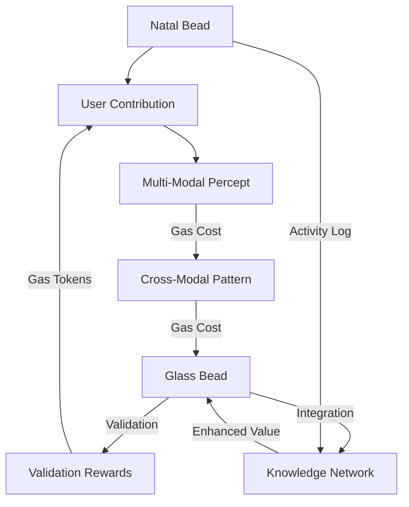

# 3.9. Enhanced Tokenomics

The enhanced tokenomics model extends Memorativa's dual token system to fully support multi-modal content, cross-modal aspects, and enhanced temporal states. This design maintains the core economic principles while enabling richer token utility across the expanded system capabilities.

## Token Model Overview

The system maintains two primary token types:

1. **Glass Bead Tokens (GBTk)**
   - Knowledge artifacts representing verified human thought
   - Enhanced multi-modal content support
   - Cross-modal aspect relationships
   - Rich temporal state handling

2. **Gas Bead Tokens (GBT)**
   - Utility tokens powering system operations
   - Multi-modal processing costs
   - Cross-modal aspect calculations
   - Enhanced temporal state transitions

## Glass Bead Token Economy

Glass Bead Tokens represent verified knowledge artifacts in the enhanced system:

### Token Types
- **Natal Glass Beads (NGB)**: Core identity and reference tokens
- **Standard Glass Beads (GBTk)**: Multi-modal knowledge artifacts
- **Gas Bead Tokens (GBT)**: Enhanced utility tokens

### Natal Glass Bead Properties
- One-time minting cost: 1000 GBT
- Non-fungible identity token
- Rare transfer capability (500 GBT)
- Multi-modal activity logging (1 GBT per action)
- Enhanced template updates (10-20 GBT)
- 5D crystal archival storage (50 GBT)
- Required for system participation

### Enhanced Token Properties
- Multi-modal content encapsulation
- Cross-modal aspect support
- Rich temporal state handling
- Enhanced privacy controls
- Advanced verification systems

### Value Generation
- Multi-modal content creation
- Cross-modal pattern discovery
- Temporal state mastery
- Collaborative synthesis
- Enhanced verification

### Token Utility
- Multi-modal artifact ownership
- Enhanced RAG contribution
- Cross-modal pattern templates
- Rich focus space development
- Enhanced book generation
- Collaborative synthesis

## Gas Bead Token Economy

Gas Bead Tokens power all enhanced system operations:

### Core Operations
| Operation | Cost | Description |
|-----------|------|-------------|
| Natal Bead Creation | 1000 GBT | One-time identity token |
| Natal Bead Transfer | 500 GBT | Identity transfer ritual |
| Natal Template Update | 10-20 GBT | Reference modification |
| Crystal Archival | 50 GBT | 5D storage encoding |
| Multi-Modal Percept | 1-5 GBT | Adding new percepts |
| Cross-Modal Pattern | 5-15 GBT | Creating patterns |
| Enhanced Focus Space | 10-30 GBT | Opening workspaces |
| Enhanced Book | 20-50 GBT | Synthesizing knowledge |
| Template Updates | 10-20 GBT | Reference modification |

### Enhanced Reward Structure
| Activity | Reward | Description |
|----------|--------|-------------|
| Multi-Modal Percepts | 5-10 GBT | Rich content contributions |
| Cross-Modal Patterns | 2-5 GBT | Pattern verification |
| Enhanced Books | 20-50 GBT | Multi-modal synthesis |
| System Validation | 1-3 GBT | Basic maintenance |
| Focus Space Sharing | 5-15 GBT | Public space creation |
| Knowledge Synthesis | 10-30 GBT | Pattern combination |

### Daily Allocation
- Basic activities earn 15-30 GBT
- Active contributors earn 50-100 GBT
- Monthly active users maintain positive flow
- Bonus rewards for first-time operations
- Community rewards for collaboration

## Enhanced Economic Flow



### Value Creation Cycle
1. Users spend Gas Beads to create multi-modal content
2. Quality contributions generate enhanced Glass Beads
3. Validation activities earn Gas Bead rewards
4. Knowledge synthesis creates additional value
5. Collaboration amplifies token utility

## Enhanced Collaborative Economics

### Sharing Models
| Model | Gas Cost | Reward | Description |
|-------|----------|---------|-------------|
| Multi-Modal View | 1 GBT/mode | 0.1 GBT/viewer | Modal-specific access |
| Full Access | 5 GBT/user | 2 GBT/contribution | Complete permissions |
| Temporal Access | 3 GBT/state | Split by metrics | State-specific access |
| Fork-Merge | 10 GBT fork | 15 GBT merge | Async collaboration |

### Group Rewards
- Multi-modal challenges: 20-50 GBT pool
- Cross-modal discoveries: 15-30 GBT split
- Enhanced validation: 5-15 GBT distributed

### Bonus Multipliers
- Multi-modal mastery: 1.5x
- Cross-modal patterns: 2x
- Temporal mastery: 1.8x
- Community impact: 1.3x

## DAO Governance Integration

The enhanced token system integrates with the Waldzell DAO governance framework:

### Multi-Modal Governance
| Governance Type | GBT Cost | GBTk Stake | Description |
|----------------|----------|------------|-------------|
| Text-Based Proposals | 50 GBT | 1 GBTk | Standard governance |
| Visual Proposals | 60 GBT | 1 GBTk | Includes visual models |
| Musical Proposals | 60 GBT | 1 GBTk | Includes audio patterns |
| Cross-Modal Proposals | 75 GBT | 2 GBTk | Multi-dimensional governance |

### Temporal State Governance
- **Mundane**: Standard 3-day voting period
- **Quantum**: Adaptive voting with 2-5 day variability
- **Holographic**: Reference-frame voting with nested timeframes

### Voting Power Calculation
```python
def calculate_voting_power(natal_bead, proposal):
    # Base power from reputation
    base_power = natal_bead.reputation_score
    
    # Modal expertise multipliers
    modal_multipliers = {
        "text": natal_bead.text_expertise / 100,
        "visual": natal_bead.visual_expertise / 100,
        "music": natal_bead.music_expertise / 100
    }
    
    # Apply modal-specific multipliers based on proposal type
    if proposal.is_multi_modal():
        power = base_power * sum([
            modal_multipliers[mode] for mode in proposal.modalities
        ]) / len(proposal.modalities)
    else:
        power = base_power * modal_multipliers[proposal.primary_modality]
    
    # Apply temporal state adjustments
    power *= get_temporal_multiplier(proposal.temporal_state)
    
    return power
```

### Proposal Execution
- Cross-modal verification requirements
- Temporal state-appropriate timelocks
- Multi-modal output validation
- Enhanced Spherical Merkle verification

## Reputation System Integration

The enhanced token system deeply integrates with the reputation system:

### Multi-Modal Reputation

| Modality | Reputation Impact | Expertise Domain |
|----------|------------------|------------------|
| Text | +0.5-2.0 points/contribution | Linguistic/Conceptual |
| Visual | +0.5-2.0 points/contribution | Spatial/Symbolic |
| Music | +0.5-2.0 points/contribution | Temporal/Pattern |
| Cross-Modal | +1.0-3.0 points/contribution | Synthetic/Integrative |

### Expertise Domains
- **Technical**: Implementation skills across modalities
- **Conceptual**: Abstract pattern recognition
- **Aesthetic**: Modal-specific quality assessment
- **Collaborative**: Cross-modal integration ability
- **Verification**: Multi-modal validation competency

### Reputation Calculation
```python
def calculate_multi_modal_reputation(natal_bead):
    # Base reputation from contribution quality
    base_rep = sum([
        contribution.quality_score * contribution.complexity
        for contribution in natal_bead.contributions
    ])
    
    # Apply modality-specific weights
    modal_rep = {
        "text": sum([c.quality_score for c in natal_bead.text_contributions]),
        "visual": sum([c.quality_score for c in natal_bead.visual_contributions]),
        "music": sum([c.quality_score for c in natal_bead.music_contributions])
    }
    
    # Add cross-modal bonuses
    cross_modal_bonus = calculate_cross_modal_synergy(natal_bead)
    
    # Apply time decay and consistency factors
    time_factor = calculate_time_decay(natal_bead)
    consistency = calculate_contribution_consistency(natal_bead)
    
    return (base_rep + sum(modal_rep.values()) + cross_modal_bonus) * time_factor * consistency
```

### Qualification Requirements
- **Magister Ludi**: 90+ reputation with expertise in all modalities
- **Knowledge Worker**: 70+ reputation with expertise in at least two modalities
- **Specialized Contributor**: 60+ reputation with high expertise in one modality

## Emergency Systems Integration

The enhanced token system includes specialized emergency features:

### Circuit Breakers
| Emergency Condition | GBT Threshold | Response |
|--------------------|--------------|----------|
| Modal Anomaly | 200 GBT | Pause affected modality processing |
| Cross-Modal Inconsistency | 300 GBT | Freeze aspect calculations |
| Temporal State Violation | 250 GBT | Lock state transitions |
| Verification Failure | 350 GBT | Halt related verifications |

### Emergency Action Authentication
```python
def authenticate_emergency_action(natal_bead, action_type):
    # Verify Magister Ludi status
    if not natal_bead.has_role(Role.MAGISTER_LUDI):
        return False
        
    # Check modality-specific expertise requirements
    if action_type.affected_modality and natal_bead.get_expertise(action_type.affected_modality) < 85:
        return False
        
    # Verify minimum cross-modal expertise for multi-modal emergencies
    if action_type.is_cross_modal and natal_bead.cross_modal_expertise < 80:
        return False
        
    # Confirm temporal state handling capability
    if action_type.affects_temporal_state and natal_bead.temporal_expertise < 85:
        return False
        
    return True
```

### Recovery Procedures
- Modality-specific verification sequences
- Cross-modal relationship reestablishment
- Temporal state reconciliation
- Progressive system reactivation
- Enhanced verification requirements

## Enhanced System Sustainability

### Economic Balance
- Multi-modal operation costs
- Cross-modal verification incentives
- Enhanced collaboration rewards
- Rich value creation paths
- Sustainable token velocity

### Token Distribution
- Multi-modal participation rewards
- Cross-modal contribution bonuses
- Enhanced quality incentives
- Rich collaboration rewards
- System maintenance incentives

### Value Preservation
- Multi-modal token burning
- Cross-modal quality metrics
- Enhanced verification requirements
- Rich privacy preservation
- Attribution protection

## Key Benefits

1. **Enhanced Token Synergy**
   - Rich multi-modal Glass Beads
   - Enhanced Gas Bead utility
   - Combined value drivers
   - Balanced incentives
   - Sustainable velocity

2. **Quality Incentives**
   - Multi-modal verification
   - Cross-modal quality metrics
   - Enhanced collaboration rewards
   - Community validation
   - Attribution preservation

3. **Economic Sustainability**
   - Balanced cost structure
   - Multiple earning paths
   - Enhanced value preservation
   - Rich collaboration incentives
   - System maintenance rewards

4. **Growth Mechanics**
   - Multi-modal network effects
   - Cross-modal amplification
   - Enhanced pattern evolution
   - Rich synthesis opportunities
   - Community development

## Key points

1. **Enhanced Token Architecture**
   - Multi-modal Glass Beads for rich knowledge artifacts
   - Enhanced Gas Beads for system operations
   - Complementary token utilities
   - Clear value flows
   - Balanced incentives

2. **Economic Mechanisms**
   - Operation costs from 1-100 GBT
   - Daily rewards of 15-100 GBT
   - Enhanced quality multipliers
   - Multi-modal token burning
   - Value preservation

3. **Collaborative Framework**
   - Multiple sharing models
   - Enhanced group rewards
   - Rich bonus multipliers
   - Fair attribution
   - Privacy preservation

4. **Value Generation**
   - Multi-modal content creation
   - Enhanced system operations
   - Quality validation
   - Rich knowledge synthesis
   - Network effects

5. **System Sustainability**
   - Self-balancing velocity
   - Enhanced quality metrics
   - Multiple earning paths
   - Rich collaboration
   - Value preservation

The enhanced tokenomics model establishes a sustainable knowledge economy that:
- Rewards rich multi-modal contributions
- Enables enhanced system operations
- Encourages deep collaboration
- Preserves privacy and attribution
- Supports continuous growth
- Maintains economic balance

## Complete Tokenomics Design

The complete tokenomics design represents a unified economic model that combines core token functionality with enhanced multi-modal capabilities:

### Token Architecture

1. **Glass Bead Types**
   - **Natal Glass Beads (NGB)**
     - Core identity and reference tokens
     - Personal temporal anchoring
     - Quantum state tuning
     - Crystal storage archival
     - Limited transferability
     - Activity logging

   - **Standard Glass Beads (GBTk)**
     - Multi-modal knowledge artifacts
     - Cross-modal aspect support
     - Temporal state flexibility
     - Rich privacy controls
     - Enhanced verification

   - **Gas Bead Tokens (GBT)**
     - Utility tokens for operations
     - Cost structure for modal operations
     - Multi-modal processing fees
     - Cross-modal aspect calculations
     - Storage and retrieval costs

### Economic Model

1. **Base Costs**
   - Storage: 0.01-0.03 GBT/MB/month
   - Operations: 0.05-0.2 GBT per operation
   - Volume discounts: 5-25% based on usage
   - Collaboration discounts: 15-25% for shared resources
   - Maintenance: 23-26 GBT/month

2. **Modal Costs**
   | Operation Type | Text | Visual | Music | Cross-Modal |
   |---------------|------|---------|--------|-------------|
   | Creation | 1 GBT | 2 GBT | 2 GBT | +1 GBT/mode |
   | Processing | 0.5 GBT | 1 GBT | 1 GBT | +0.5 GBT/mode |
   | Storage | 0.1 GBT | 0.2 GBT | 0.2 GBT | +0.1 GBT/mode |
   | Retrieval | 0.2 GBT | 0.4 GBT | 0.4 GBT | +0.2 GBT/mode |

3. **Reward Scaling**
   | Contribution Type | Base | Quality | Collaboration | Network Effect |
   |------------------|------|----------|---------------|----------------|
   | Single Modal | 1x | +0.5x | +0.3x | +0.2x |
   | Dual Modal | 1.5x | +0.7x | +0.4x | +0.3x |
   | Triple Modal | 2x | +1.0x | +0.5x | +0.4x |
   | Cross-Modal | 2.5x | +1.2x | +0.6x | +0.5x |

### Performance Characteristics

1. **Storage Requirements**
   - Base token: 1-2 KB
   - Per modality: 0.5-1 KB
   - Cross-modal data: 1-2 KB
   - State history: 0.1-0.2 KB/state

2. **Processing Overhead**
   - Base operations: O(1)
   - Modal operations: O(m) where m = number of modes
   - Cross-modal operations: O(m²)
   - State transitions: O(log n) where n = state history size

3. **Retrieval Performance**
   - Single mode: 50-100ms
   - Multi-modal: 100-200ms
   - Cross-modal: 200-400ms
   - Cached results: 10-20ms

### Integration Features

1. **RAG System**
   - Multi-modal vector stores
   - Cross-modal retrieval
   - Privacy-aware querying
   - Cached results management
   - Performance optimization

2. **Book Integration**
   - Multi-modal content mapping
   - Cross-modal relationship preservation
   - Temporal state alignment
   - Permission inheritance
   - Attribution tracking

3. **Focus Space Integration**
   - Multi-modal workspace support
   - Cross-modal aspect visualization
   - Interactive temporal navigation
   - Collaborative features
   - Real-time synchronization

### Security Features

1. **Privacy Protection**
   - Modal-level encryption
   - Cross-modal access control
   - Temporal state protection
   - Collaboration security
   - Attribution preservation

2. **Verification System**
   - Multi-modal content verification
   - Cross-modal relationship validation
   - Temporal state verification
   - Permission verification
   - Attribution verification

This complete design creates a robust token system that:
- Enables rich multi-modal knowledge representation
- Supports complex cross-modal relationships
- Maintains temporal coherence
- Ensures privacy and security
- Enables efficient collaboration
- Scales effectively with system growth
- Integrates seamlessly with DAO governance
- Provides comprehensive emergency safeguards
