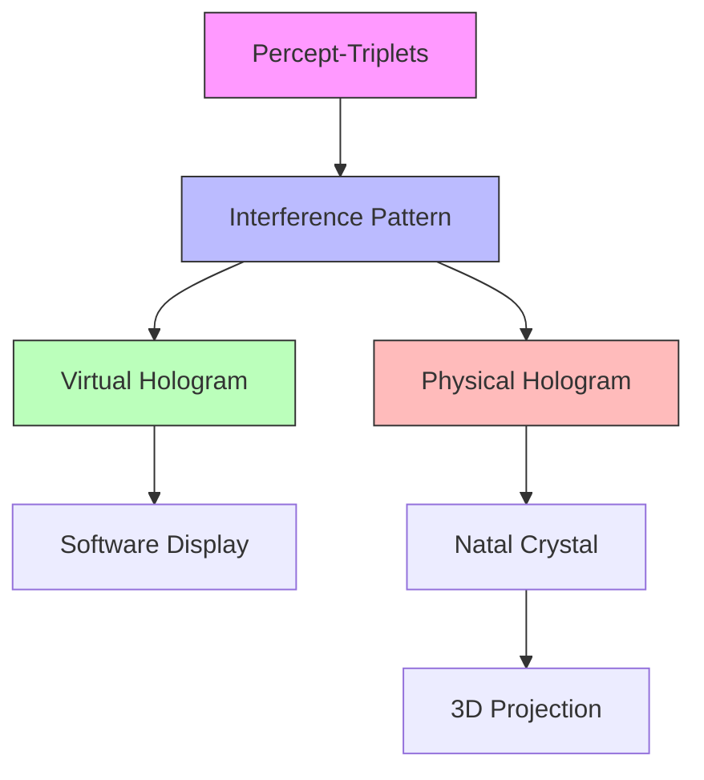
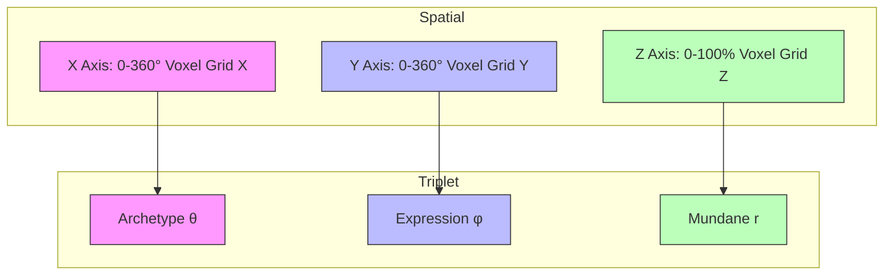

# Holographic Image Generation

The holographic system generates three types of outputs from percept-triplets, conceptually related to the internal representation of player identity within Natal Glass Beads through shared voxel encoding and spatial-optical dimension mapping:

1. Interference Patterns - Default mathematical representation used by Books
2. Virtual Holograms - Default visualization displayed in software
3. Physical Holograms - Quantum storage and holographic projection using natal bead crystals that can project true 3D holograms when illuminated

## Core Architecture



## Interactive Visualization System

```rust
pub struct HologramViewer {
    // Core rendering components
    renderer: VoxelRenderer,
    interaction_handler: InteractionHandler,
    filter_system: FilterManager,
    
    // View state
    camera: Camera3D,
    current_slice: Option<SliceView>,
    active_filters: FilterSet,
    
    fn render_hologram(&mut self, hologram: &InterferencePattern) -> Result<()> {
        // Convert interference pattern to 3D voxel data
        let voxels = self.renderer.pattern_to_voxels(hologram)?;
        
        // Apply active filters
        let filtered = self.filter_system.apply_filters(
            voxels,
            &self.active_filters
        )?;
        
        // Render with current camera view
        self.renderer.render_frame(
            &filtered,
            &self.camera,
            self.current_slice.as_ref()
        )
    }
    
    fn handle_interaction(&mut self, event: InteractionEvent) -> Result<()> {
        match event {
            // Rotation controls
            InteractionEvent::Rotate(delta) => {
                self.camera.rotate(delta);
            },
            
            // Zoom controls
            InteractionEvent::Zoom(delta) => {
                self.camera.zoom(delta);
            },
            
            // Slice controls
            InteractionEvent::SetSlice(plane) => {
                self.current_slice = Some(SliceView::new(plane));
            },
            
            // Voxel selection
            InteractionEvent::SelectVoxel(pos) => {
                if let Some(voxel) = self.renderer.get_voxel_at(pos) {
                    self.show_voxel_details(voxel)?;
                }
            },
            
            // Filter controls
            InteractionEvent::UpdateFilter(filter) => {
                self.active_filters.update(filter);
            }
        }
        
        Ok(())
    }
}
```

## Data Compression & Efficiency

```rust
impl InterferencePattern {
    fn compress(&self) -> Result<CompressedPattern> {
        // Analyze pattern density
        let density_map = self.analyze_density()?;
        
        // Choose optimal compression strategy
        let strategy = match density_map.characteristics() {
            // Sparse data -> Octree compression
            Characteristics::Sparse => CompressionStrategy::SparseOctree,
            // Uniform regions -> Run-length encoding
            Characteristics::Uniform => CompressionStrategy::RLE,
            // Complex data -> Wavelet transform
            Characteristics::Complex => CompressionStrategy::Wavelet,
        };

        // Apply compression
        let compressed = match strategy {
            CompressionStrategy::SparseOctree => self.compress_octree()?,
            CompressionStrategy::RLE => self.compress_rle()?,
            CompressionStrategy::Wavelet => self.compress_wavelet()?,
        };

        Ok(compressed)
    }
}

// Sparse Voxel Octree implementation
struct OctreeNode {
    children: Option<Box<[OctreeNode; 8]>>,
    value: Option<VoxelData>,
}

impl OctreeNode {
    fn compress(&self, tolerance: f32) -> Result<Self> {
        // If leaf node, return as is
        if self.children.is_none() {
            return Ok(self.clone());
        }

        // Check if children can be merged
        let children = self.children.as_ref().unwrap();
        if children.iter().all(|c| c.is_uniform(tolerance)) {
            // Merge children into single value
            return Ok(Self {
                children: None,
                value: Some(children[0].value.unwrap()),
            });
        }

        // Recursively compress children
        let compressed_children = children.map(|c| c.compress(tolerance)?);
        Ok(Self {
            children: Some(Box::new(compressed_children)),
            value: None,
        })
    }
}

// Run-length encoding for uniform regions
struct RLECompressor {
    fn compress(&self, data: &[VoxelData]) -> Result<Vec<(VoxelData, usize)>> {
        let mut compressed = Vec::new();
        let mut current = data[0];
        let mut count = 1;

        for &value in &data[1..] {
            if value == current {
                count += 1;
            } else {
                compressed.push((current, count));
                current = value;
                count = 1;
            }
        }
        compressed.push((current, count));
        Ok(compressed)
    }
}

// Wavelet transform for complex patterns
struct WaveletCompressor {
    fn compress(&self, data: &[VoxelData]) -> Result<WaveletCoefficients> {
        // Apply wavelet transform
        let coefficients = self.wavelet_transform(data)?;
        
        // Threshold small coefficients
        let significant = self.threshold_coefficients(coefficients)?;
        
        // Quantize remaining coefficients
        let quantized = self.quantize(significant)?;
        
        Ok(quantized)
    }
}
```

### Compression Strategies

1. **Sparse Voxel Octrees**
- Efficient for non-uniform density
- Hierarchical space partitioning
- Adaptive resolution
- Memory-efficient for sparse data

2. **Run-Length Encoding**
- Optimal for uniform regions
- Simple and fast compression
- Good for temporal coherence
- Low computational overhead

3. **Wavelet Transform**
- Suited for complex patterns
- Multi-resolution analysis
- Frequency-domain compression
- Configurable quality levels

## Spatial-Triplet Mapping



### Dimension Mapping

These X, Y, and Z axes correspond to the voxel coordinates within the Interference Pattern's 3D grid, providing a direct spatial mapping between the triplet components and the holographic representation.

```rust
struct SpatialMapping {
    // Archetype mapping (X-axis)
    // 0-360° maps to zodiacal positions
    archetype_angle: f32, // θ
    
    // Expression mapping (Y-axis)
    // 0-360° maps to expression phases
    expression_angle: f32, // φ
    
    // Mundane mapping (Z-axis)
    // 0-100% maps to manifestation level
    mundane_radius: f32, // r
}

impl SpatialMapping {
    fn to_triplet(&self) -> PerceptTriplet {
        PerceptTriplet {
            archetype: map_archetype(self.archetype_angle),
            expression: map_expression(self.expression_angle), 
            mundane: map_mundane(self.mundane_radius)
        }
    }
}

// Mapping functions
fn map_archetype(theta: f32) -> Archetype {
    // 0° = Aries point
    // 30° segments for each zodiac sign
    let sign = (theta / 30.0).floor() as u8;
    Archetype::from_zodiac_position(sign, theta % 30.0)
}

fn map_expression(phi: f32) -> Expression {
    // 0° = Seed phase
    // 90° = Growth phase  
    // 180° = Flowering phase
    // 270° = Harvest phase
    Expression::from_phase_angle(phi)
}

fn map_mundane(radius: f32) -> Mundane {
    // 0% = Pure potential
    // 50% = Partially manifested
    // 100% = Fully manifested
    Mundane::from_manifestation_level(radius)
}
```

## Optical Data Encoding

The optical encoding system uses three primary properties to encode data:

1. **Intensity**: Encoded using 256 discrete steps from 0.0 to 1.0:
   - 0.0-0.33 (84 steps): Mundane temporal states
   - 0.34-0.66 (84 steps): Quantum temporal states
   - 0.67-1.0 (88 steps): Holographic temporal states

2. **Polarization Angle**: Encoded from 0° to 180° with 0.1° precision:
   - 0°-60° (600 steps): Unverified confidence
   - 61°-120° (600 steps): Partially verified confidence
   - 121°-180° (600 steps): Fully verified confidence

3. **Wavelength**: Encoded from 380nm to 700nm with 1nm precision:
   - 380-450nm (70 steps): Private data
   - 451-580nm (129 steps): Protected data
   - 581-700nm (119 steps): Public data

```rust
#[derive(Debug, Clone)]
struct OpticalEncoding {
    // Intensity levels (0.0-1.0) with 256 discrete steps
    // Maps to temporal states:
    // 0.0-0.33 = Mundane (84 steps)
    // 0.34-0.66 = Quantum (84 steps) 
    // 0.67-1.0 = Holographic (88 steps)
    intensity: f32,
    
    // Polarization angle (0°-180°) with 0.1° precision
    // Maps to verification confidence:
    // 0°-60° = Unverified (600 steps)
    // 61°-120° = Partially verified (600 steps)
    // 121°-180° = Fully verified (600 steps)
    polarization_angle: f32,
    
    // Wavelength bands (380-700nm) with 1nm precision
    // Maps to privacy levels:
    // 380-450nm = Private (70 steps)
    // 451-580nm = Protected (129 steps)
    // 581-700nm = Public (119 steps) 
    wavelength_nm: u16,
}

impl OpticalEncoding {
    const INTENSITY_STEPS: u16 = 256;
    const ANGLE_PRECISION: f32 = 0.1;
    const WAVELENGTH_PRECISION: u16 = 1;

    fn validate(&self) -> Result<()> {
        // Validate intensity is within range and step boundaries
        if !self.is_valid_intensity() {
            return Err(Error::InvalidIntensity);
        }

        // Validate angle has proper precision and range
        if !self.is_valid_angle() {
            return Err(Error::InvalidPolarization);
        }

        // Validate wavelength is within bands
        if !self.is_valid_wavelength() {
            return Err(Error::InvalidWavelength);
        }

        Ok(())
    }
}

impl InterferencePattern {
    fn encode_optical_properties(
        &mut self,
        triplet: &PerceptTriplet
    ) -> Result<()> {
        let encoding = OpticalEncoding {
            intensity: triplet.temporal_state.to_intensity()?,
            polarization_angle: triplet.verification_level.to_angle()?,
            wavelength_nm: triplet.metadata.privacy_level.to_wavelength()?,
        };
        
        self.apply_optical_encoding(encoding)?;
        Ok(())
    }
}
```

### Optical Properties

1. **Intensity Encoding**
- Maps temporal states to light intensity
- Higher intensity = more holographic/active state
- Enables temporal state visualization
- Quantum coherence tracking

2. **Polarization Encoding** 
- Verification level representation
- Angular encoding of confidence
- Multi-dimensional validation
- Trust level visualization

3. **Wavelength Encoding**
- Privacy level categorization
- Metadata classification
- Access control visualization
- Multi-spectral analysis

## Output Types

### 1. Interference Patterns

The default Book output that encodes triplet relationships mathematically using a base resolution of 256x256x256 (16M voxels), matching Book::BASE_RESOLUTION:

```rust
impl Book {
    // Base resolution for interference pattern voxel grid
    const BASE_RESOLUTION: (u32, u32, u32) = (256, 256, 256); // 16M voxels
    const ADAPTIVE_THRESHOLD: f32 = 0.01; // Minimum detail level for subdivision

    fn generate_interference_pattern(
        &self,
        triplets: &[PerceptTriplet]
    ) -> Result<InterferencePattern> {
        // Initialize voxel grid at base resolution
        let mut pattern = VoxelGrid::new(Self::BASE_RESOLUTION);
        
        // Convert triplets to wave functions
        let waves = triplets.iter().map(|t| t.to_wave())?;
        
        // Calculate interference between waves
        pattern.calculate_interference(waves, Self::ADAPTIVE_THRESHOLD)?;
        
        // Encode quantum correlations
        pattern.add_quantum_encoding()?;
        
        Ok(pattern)
    }
}
```

#### Pattern Features
- Mathematical representation using 256³ voxel grid (16M voxels)
- Adaptive resolution refinement based on detail threshold
- Quantum correlation encoding
- Basis for both virtual and physical visualizations 
- Default storage format for Books

### 2. Virtual Holograms 

Default visualization displayed in software:

```rust
impl InterferencePattern {
    fn to_virtual_hologram(&self) -> Result<VirtualHologram> {
        // Generate 3D model from pattern
        let model = self.generate_3d_model()?;
        
        // Add interaction handlers for standard 3D controls
        let interactive = model
            .add_rotation_control()?
            .add_zoom_control()?
            .add_pan_control()?
            .add_slice_viewer()?
            .add_voxel_selector()?;
            
        // Add advanced analysis features
        let analysis = interactive
            .add_temporal_flow_analyzer()?
            .with_quantum_correlation_overlay()?;
        
        // Enable real-time collaboration features
        let collaborative = analysis
            .enable_shared_view()?
            .enable_concurrent_analysis()?
            .enable_annotation_sync()?;
        
        Ok(collaborative)
    }
}
```

#### Virtual Features
- Real-time 3D visualization
- Interactive manipulation:
  - Rotation, zoom, pan controls
  - Slice viewing tools
  - Voxel selection and analysis
  - Annotation capabilities
- Pattern analysis tools:
  - Density mapping
  - Correlation detection
  - Temporal tracking
- Integration with Book UI
- Dynamic updates
- Multi-user collaboration:
  - Shared viewports
  - Synchronized annotations
  - Concurrent analysis

```
// Advanced temporal flow analysis
struct TemporalFlowAnalyzer {
    fn analyze_flow(&self, pattern: &InterferencePattern) -> Result<TemporalFlow> {
        // Track intensity changes across temporal sequence
        let mut flow = TemporalFlow::new();
        
        for frame in pattern.temporal_sequence() {
            // Map intensity gradients to flow vectors
            let vectors = frame.calculate_intensity_gradients()?;
            
            // Identify coherent temporal structures
            let structures = frame.detect_coherent_structures(vectors)?;
            
            flow.add_frame(structures);
        }
        
        Ok(flow)
    }
    
    fn generate_flow_visualization(&self, flow: &TemporalFlow) -> Result<FlowOverlay> {
        // Create animated streamlines showing temporal evolution
        let streamlines = flow.generate_streamlines()?;
        
        // Color-code by temporal state (mundane/quantum/holographic)
        let colored = streamlines.apply_temporal_coloring()?;
        
        Ok(FlowOverlay::new(colored))
    }
}
```

### 3. Physical Holograms

- Optional projection into real 3D space using natal bead crystals
- Quantum storage and holographic projection using natal bead crystals

```rust
impl Book {
    async fn store_physical_hologram(
        &self,
        pattern: &InterferencePattern
    ) -> Result<PhysicalStorageRef> {
        // Prepare crystal inscription request
        let inscription = InscriptionRequest {
            pattern: pattern.clone(),
            crystal_type: CrystalType::NatalBead,
            quantum_params: self.get_quantum_parameters()?,
        };
        
        // Submit to crystal inscription service
        let service = CrystalInscriptionService::connect().await?;
        let job_id = service.submit_inscription(inscription).await?;
        
        // Monitor inscription progress
        let status = service.monitor_inscription(job_id).await?;
        
        // Register completed crystal with Book
        if status.is_complete() {
            let crystal_ref = self.register_inscribed_crystal(
                job_id,
                status.crystal_id()
            )?;
            Ok(crystal_ref)
        } else {
            Err(Error::InscriptionFailed(status))
        }
    }
}

// Crystal inscription service interface
#[async_trait]
impl CrystalInscriptionService {
    async fn submit_inscription(
        &self,
        request: InscriptionRequest
    ) -> Result<JobId>;

    async fn monitor_inscription(
        &self,
        job_id: JobId
    ) -> Result<InscriptionStatus>;
}

// Physical inscription process
struct InscriptionProcess {
    laser_system: LaserSystem,
    crystal_mount: CrystalMount,
    quantum_monitor: QuantumStateMonitor,
}

impl InscriptionProcess {
    async fn inscribe_pattern(
        &mut self,
        pattern: &InterferencePattern
    ) -> Result<CrystalId> {
        // Position crystal in mount
        self.crystal_mount.load_crystal()?;
        
        // Configure laser parameters
        self.laser_system.configure_for_pattern(pattern)?;
        
        // Perform layer-by-layer inscription
        for layer in pattern.layers() {
            // Write quantum state
            self.laser_system.write_quantum_layer(layer)?;
            
            // Verify quantum coherence
            self.quantum_monitor.verify_layer_coherence(layer)?;
            
            // Move to next layer
            self.crystal_mount.advance_layer()?;
        }
        
        // Final coherence verification
        self.quantum_monitor.verify_full_coherence()?;
        
        // Return crystal ID
        Ok(self.crystal_mount.get_crystal_id())
    }
}
```

The physical storage process involves:

1. **Inscription Request**
- Pattern conversion to quantum states
- Crystal type selection
- Quantum parameter configuration

2. **Hardware Control**
- Precision laser system control
- Crystal mounting and positioning
- Layer-by-layer inscription

3. **Quality Verification**
- Real-time coherence monitoring
- Layer-by-layer verification
- Final quantum state validation

#### Physical Features
- 13.8B year quantum state preservation
- Lossless pattern storage
  - True 3D spatial projection
- - Long-term quantum storage
- Coherent light projection
  - Physical interaction capability
  - Natal bead integration

## Pattern Analysis

Each digital output type enables different forms of analysis:

```rust
impl Book {
    fn analyze_pattern(&self, pattern: &InterferencePattern) -> Result<Analysis> {
        // Core pattern analysis
        let relationships = pattern.analyze_relationships()?;
        let correlations = pattern.analyze_quantum_correlations()?;
        let temporal = pattern.analyze_temporal_states()?;
        
        Ok(Analysis {
            relationships,
            correlations,
            temporal
        })
    }

    fn analyze_virtual(&self, hologram: &VirtualHologram) -> Result<VirtualAnalysis> {
        // Virtual visualization analysis
        let spatial = hologram.analyze_3d_structure()?;
        let interactive = hologram.analyze_user_interactions()?;
        let overlays = hologram.analyze_visualization_layers()?;
        
        Ok(VirtualAnalysis {
            spatial,
            interactive,
            overlays
        })
    }
}
```

### Analysis Features

1. **Pattern Analysis**
- Relationship mapping
- Quantum correlation detection
- Temporal state tracking
- Pattern matching

2. **Virtual Analysis**
- 3D structure analysis
- User interaction tracking
- Layer composition study
- Real-time metrics

## Storage & Persistence

The three output types have different storage characteristics:

```rust
impl Book {
    fn store_outputs(&self, outputs: &Outputs) -> Result<StorageRefs> {
        // Store interference pattern
        let pattern_ref = self.store_pattern(&outputs.pattern)?;
        
        // Cache virtual hologram state
        let virtual_ref = self.cache_virtual_state(&outputs.virtual_holo)?;
        
        // Physical storage if available
        let physical_ref = if let Some(physical) = &outputs.physical {
            Some(self.store_physical(physical)?)
        } else {
            None
        };
        
        Ok(StorageRefs {
            pattern: pattern_ref,
            virtual_holo: virtual_ref,
            physical: physical_ref
        })
    }
}
```

### Storage Characteristics

1. **Interference Patterns**
- Mathematical data structures
- Digital storage in Book system
- Lossless conversion between formats
- Efficient transmission

2. **Virtual Holograms**
- Real-time rendering data
- Cached visualization states
- User interaction history
- Analysis metadata

3. **Physical Holograms**
- - 5D crystal storage
- - Quantum state preservation
- - 13.8B year persistence
- - Physical robustness
- 5D crystal quantum storage (13.8B year persistence)
- Interference pattern preservation
- Holographic projection capability
- Physical and quantum robustness

## Integration Features

Each output type integrates differently with the Book system:

```rust
impl Book {
    fn integrate_outputs(&self, outputs: &Outputs) -> Result<()> {
        // Integrate interference pattern
        self.integrate_pattern(&outputs.pattern)?;
        
        // Integrate virtual hologram
        self.integrate_virtual(&outputs.virtual_holo)?;
        
        // Integrate physical hologram if available
        if let Some(physical) = &outputs.physical {
            self.integrate_physical(physical)?;
        }
        
        Ok(())
    }
}
```

### Integration Methods

1. **Pattern Integration**
```rust
impl Book {
    fn integrate_pattern(&self, pattern: &InterferencePattern) -> Result<()> {
        // Link to Book's conceptual structure
        self.link_pattern_concepts(pattern)?;
        
        // Index for pattern matching
        self.index_interference_pattern(pattern)?;
        
        // Enable quantum correlations
        self.enable_quantum_features(pattern)?;
        
        Ok(())
    }
}
```

2. **Virtual Integration**
```rust
impl Book {
    fn integrate_virtual(&self, hologram: &VirtualHologram) -> Result<()> {
        // Add to UI visualization system
        self.add_to_visualizer(hologram)?;
        
        // Enable interactive features
        self.setup_interactions(hologram)?;
        
        // Connect analysis tools
        self.connect_analysis_tools(hologram)?;
        
        Ok(())
    }
}
```

3. **Physical Integration**
```rust
impl Book {
    fn integrate_physical(&self, projection: &PhysicalHologram) -> Result<()> {
        // Connect to natal bead system
        self.connect_natal_bead(projection)?;
        
        // Setup projection controls
        self.setup_projection_controls(projection)?;
        
        // Enable physical interactions
        self.enable_physical_interface(projection)?;
        
        Ok(())
    }
}
```

## Benefits

Each output type provides unique advantages:

1. **Interference Patterns**
- Complete mathematical representation
- Quantum correlation preservation
- Efficient processing and analysis
- Basis for all visualizations

2. **Virtual Holograms**
- Interactive real-time visualization
- Multi-user collaboration
- Dynamic analysis tools
- Integration with Book UI

3. **Physical Holograms**
- - True 3D spatial projection
- - Long-term quantum storage
- Permanent quantum storage with projection capability
- True 3D holographic display when illuminated
  - Physical interaction capability
  - Natal bead integration

This three-tiered system provides a complete framework for representing, analyzing, and interacting with triplet structures across mathematical, virtual, and physical domains.
