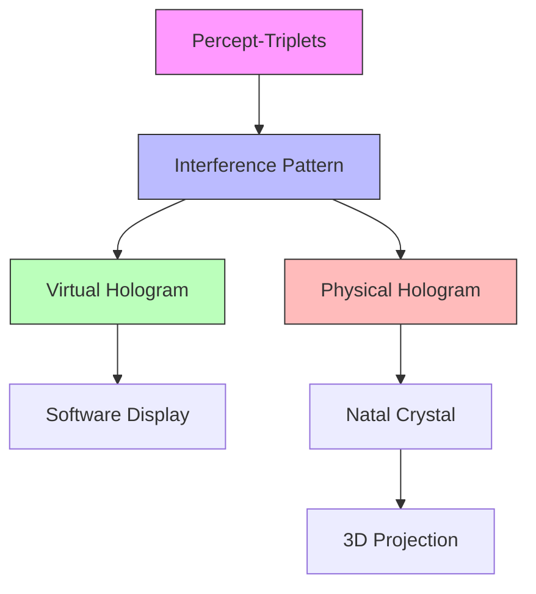
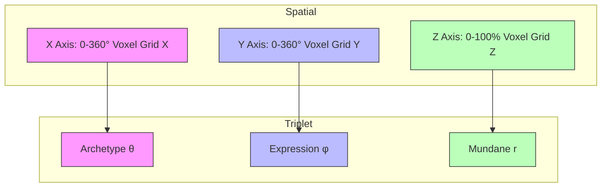

# Holographic Image Generation

The holographic system is a core component of Memorativa that transforms abstract percept-triplets into tangible, interactive visualizations. It serves three key functions:

1. **Mathematical Representation**: Converts triplets into interference patterns that preserve quantum correlations and temporal states
2. **Interactive Visualization**: Provides real-time 3D visualization tools for analysis and collaboration
3. **Physical Storage**: Enables permanent quantum storage and true holographic projection using natal bead crystals

The system uses a unified spatial-optical encoding scheme that maps triplet components (Archetype, Expression, Mundane) to physical dimensions while preserving their quantum relationships. This encoding enables seamless conversion between mathematical, virtual, and physical representations.

## Core Architecture



## Interactive Visualization System

The visualization system provides a real-time, interactive interface for exploring and analyzing holographic data. It combines high-performance voxel rendering with an intuitive interaction model that supports both individual analysis and collaborative research. The system dynamically adapts its rendering approach based on data complexity and user interaction patterns.

```rust
pub struct HologramViewer {
    // Core rendering components
    renderer: VoxelRenderer,
    interaction_handler: InteractionHandler,
    filter_system: FilterManager,
    
    // View state
    camera: Camera3D,
    current_slice: Option<SliceView>,
    active_filters: FilterSet,
    
    fn render_hologram(&mut self, hologram: &InterferencePattern) -> Result<()> {
        // Convert interference pattern to 3D voxel data
        let voxels = self.renderer.pattern_to_voxels(hologram)?;
        
        // Apply active filters
        let filtered = self.filter_system.apply_filters(
            voxels,
            &self.active_filters
        )?;
        
        // Render with current camera view
        self.renderer.render_frame(
            &filtered,
            &self.camera,
            self.current_slice.as_ref()
        )
    }
    
    fn handle_interaction(&mut self, event: InteractionEvent) -> Result<()> {
        match event {
            // Rotation controls
            InteractionEvent::Rotate(delta) => {
                self.camera.rotate(delta);
            },
            
            // Zoom controls
            InteractionEvent::Zoom(delta) => {
                self.camera.zoom(delta);
            },
            
            // Slice controls
            InteractionEvent::SetSlice(plane) => {
                self.current_slice = Some(SliceView::new(plane));
            },
            
            // Voxel selection
            InteractionEvent::SelectVoxel(pos) => {
                if let Some(voxel) = self.renderer.get_voxel_at(pos) {
                    self.show_voxel_details(voxel)?;
                }
            },
            
            // Filter controls
            InteractionEvent::UpdateFilter(filter) => {
                self.active_filters.update(filter);
            }
        }
        
        Ok(())
    }
}
```

## Data Compression & Efficiency

The holographic system employs adaptive compression strategies to efficiently handle the massive data volumes inherent in 3D interference patterns. Rather than using a one-size-fits-all approach, the system analyzes pattern characteristics to dynamically select the optimal compression method: sparse octrees for non-uniform data, run-length encoding for homogeneous regions, and wavelet transforms for complex patterns. This adaptive approach ensures both storage efficiency and fast access times while preserving the quantum correlations essential to the system.

```rust
impl InterferencePattern {
    fn compress(&self) -> Result<CompressedPattern> {
        // Analyze pattern density
        let density_map = self.analyze_density()?;
        
        // Choose optimal compression strategy
        let strategy = match density_map.characteristics() {
            // Sparse data -> Octree compression
            Characteristics::Sparse => CompressionStrategy::SparseOctree,
            // Uniform regions -> Run-length encoding
            Characteristics::Uniform => CompressionStrategy::RLE,
            // Complex data -> Wavelet transform
            Characteristics::Complex => CompressionStrategy::Wavelet,
        };

        // Apply compression
        let compressed = match strategy {
            CompressionStrategy::SparseOctree => self.compress_octree()?,
            CompressionStrategy::RLE => self.compress_rle()?,
            CompressionStrategy::Wavelet => self.compress_wavelet()?,
        };

        Ok(compressed)
    }
}

// Sparse Voxel Octree implementation
struct OctreeNode {
    children: Option<Box<[OctreeNode; 8]>>,
    value: Option<VoxelData>,
}

impl OctreeNode {
    fn compress(&self, tolerance: f32) -> Result<Self> {
        // If leaf node, return as is
        if self.children.is_none() {
            return Ok(self.clone());
        }

        // Check if children can be merged
        let children = self.children.as_ref().unwrap();
        if children.iter().all(|c| c.is_uniform(tolerance)) {
            // Merge children into single value
            return Ok(Self {
                children: None,
                value: Some(children[0].value.unwrap()),
            });
        }

        // Recursively compress children
        let compressed_children = children.map(|c| c.compress(tolerance)?);
        Ok(Self {
            children: Some(Box::new(compressed_children)),
            value: None,
        })
    }
}

// Run-length encoding for uniform regions
struct RLECompressor {
    fn compress(&self, data: &[VoxelData]) -> Result<Vec<(VoxelData, usize)>> {
        let mut compressed = Vec::new();
        let mut current = data[0];
        let mut count = 1;

        for &value in &data[1..] {
            if value == current {
                count += 1;
            } else {
                compressed.push((current, count));
                current = value;
                count = 1;
            }
        }
        compressed.push((current, count));
        Ok(compressed)
    }
}

// Wavelet transform for complex patterns
struct WaveletCompressor {
    fn compress(&self, data: &[VoxelData]) -> Result<WaveletCoefficients> {
        // Apply wavelet transform
        let coefficients = self.wavelet_transform(data)?;
        
        // Threshold small coefficients
        let significant = self.threshold_coefficients(coefficients)?;
        
        // Quantize remaining coefficients
        let quantized = self.quantize(significant)?;
        
        Ok(quantized)
    }
}
```

### Compression Strategies

1. **Sparse Voxel Octrees**
- Efficient for non-uniform density
- Hierarchical space partitioning
- Adaptive resolution
- Memory-efficient for sparse data

2. **Run-Length Encoding**
- Optimal for uniform regions
- Simple and fast compression
- Good for temporal coherence
- Low computational overhead

3. **Wavelet Transform**
- Suited for complex patterns
- Multi-resolution analysis
- Frequency-domain compression
- Configurable quality levels

## Spatial-Triplet Mapping

This section details the spatial mapping strategy used to encode percept-triplets into the holographic representation. It establishes a direct correspondence between the three axes of the 3D voxel grid and the three components of a percept-triplet: Archetype, Expression, and Mundane. This mapping ensures that each triplet component is spatially encoded within the holographic structure, allowing for targeted analysis and manipulation of specific aspects of the percept.




### Dimension Mapping

These X, Y, and Z axes correspond to the voxel coordinates within the Interference Pattern's 3D grid, providing a direct spatial mapping between the triplet components and the holographic representation.

```rust
struct SpatialMapping {
    // Archetype mapping (X-axis)
    // 0-360° maps to zodiacal positions
    archetype_angle: f32, // θ
    
    // Expression mapping (Y-axis)
    // 0-360° maps to expression phases
    expression_angle: f32, // φ
    
    // Mundane mapping (Z-axis)
    // 0-100% maps to manifestation level
    mundane_radius: f32, // r
}

impl SpatialMapping {
    fn to_triplet(&self) -> PerceptTriplet {
        PerceptTriplet {
            archetype: map_archetype(self.archetype_angle),
            expression: map_expression(self.expression_angle), 
            mundane: map_mundane(self.mundane_radius)
        }
    }
}

// Mapping functions
fn map_archetype(theta: f32) -> Archetype {
    // 0° = Aries point
    // 30° segments for each zodiac sign
    let sign = (theta / 30.0).floor() as u8;
    Archetype::from_zodiac_position(sign, theta % 30.0)
}

fn map_expression(phi: f32) -> Expression {
    // 0° = Seed phase
    // 90° = Growth phase  
    // 180° = Flowering phase
    // 270° = Harvest phase
    Expression::from_phase_angle(phi)
}

fn map_mundane(radius: f32) -> Mundane {
    // 0% = Pure potential
    // 50% = Partially manifested
    // 100% = Fully manifested
    Mundane::from_manifestation_level(radius)
}
```

## Optical Data Encoding

The optical encoding system uses three primary properties to encode data: intensity, polarization angle, and wavelength. Each property is divided into discrete steps or bands that map to different aspects of the percept-triplet, such as temporal states, verification confidence, and privacy levels. This multi-layered encoding scheme allows for rich data representation within the holographic medium.

The optical encoding system uses three primary properties to encode data:

1. **Intensity**: Encoded using 256 discrete steps from 0.0 to 1.0:
   - 0.0-0.33 (84 steps): Mundane temporal states
   - 0.34-0.66 (84 steps): Quantum temporal states
   - 0.67-1.0 (88 steps): Holographic temporal states

2. **Polarization Angle**: Encoded from 0° to 180° with 0.1° precision:
   - 0°-60° (600 steps): Unverified confidence
   - 61°-120° (600 steps): Partially verified confidence
   - 121°-180° (600 steps): Fully verified confidence

3. **Wavelength**: Encoded from 380nm to 700nm with 1nm precision:
   - 380-450nm (70 steps): Private data
   - 451-580nm (129 steps): Protected data
   - 581-700nm (119 steps): Public data

```rust
#[derive(Debug, Clone)]
struct OpticalEncoding {
    // Intensity levels (0.0-1.0) with 256 discrete steps
    // Maps to temporal states:
    // 0.0-0.33 = Mundane (84 steps)
    // 0.34-0.66 = Quantum (84 steps) 
    // 0.67-1.0 = Holographic (88 steps)
    intensity: f32,
    
    // Polarization angle (0°-180°) with 0.1° precision
    // Maps to verification confidence:
    // 0°-60° = Unverified (600 steps)
    // 61°-120° = Partially verified (600 steps)
    // 121°-180° = Fully verified (600 steps)
    polarization_angle: f32,
    
    // Wavelength bands (380-700nm) with 1nm precision
    // Maps to privacy levels:
    // 380-450nm = Private (70 steps)
    // 451-580nm = Protected (129 steps)
    // 581-700nm = Public (119 steps) 
    wavelength_nm: u16,
}

impl OpticalEncoding {
    const INTENSITY_STEPS: u16 = 256;
    const ANGLE_PRECISION: f32 = 0.1;
    const WAVELENGTH_PRECISION: u16 = 1;

    fn validate(&self) -> Result<()> {
        // Validate intensity is within range and step boundaries
        if !self.is_valid_intensity() {
            return Err(Error::InvalidIntensity);
        }

        // Validate angle has proper precision and range
        if !self.is_valid_angle() {
            return Err(Error::InvalidPolarization);
        }

        // Validate wavelength is within bands
        if !self.is_valid_wavelength() {
            return Err(Error::InvalidWavelength);
        }

        Ok(())
    }
}

impl InterferencePattern {
    fn encode_optical_properties(
        &mut self,
        triplet: &PerceptTriplet
    ) -> Result<()> {
        let encoding = OpticalEncoding {
            intensity: triplet.temporal_state.to_intensity()?,
            polarization_angle: triplet.verification_level.to_angle()?,
            wavelength_nm: triplet.metadata.privacy_level.to_wavelength()?,
        };
        
        self.apply_optical_encoding(encoding)?;
        Ok(())
    }
}
```