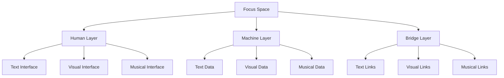

# 5.1 Enhanced Focus Spaces

The enhanced focus space design extends Memorativa's conceptual workspace to fully support multi-modal interaction through text, images, and music. Building on the established focus space architecture, this enhanced design enables rich cross-modal exploration while maintaining the core functionality of organizing and analyzing percepts, prototypes, and their symbolic relationships.

## Core Architecture

Focus spaces now integrate three distinct but interconnected layers:



### Layer Integration

1. **Human Layer**
   - Interactive text navigation
   - Visual workspace manipulation
   - Musical pattern exploration
   - Cross-modal relationship discovery

2. **Machine Layer**
   - Vector-encoded structured data
   - Image generation parameters
   - Musical pattern data
   - Cross-modal relationship mappings

3. **Bridge Layer**
   - Unified markup system
   - Visual overlay system
   - Audio synchronization
   - Modal interaction handlers

## Structural Definition

A focus space now acts as:

- **Multi-Modal Focus**: Filters prototypes through synchronized text, visual, and musical expressions
- **Temporal Scaffold**: Maintains time states across all modalities
- **Cross-Modal Matrix**: Stores angular relationships between different output types
- **Hierarchical Container**: Organizes nested spaces with multi-modal inheritance

## Core Features

### Multi-Modal Interface
```rust
struct MultiModalInterface {
    text_workspace: TextWorkspace,
    visual_workspace: VisualWorkspace,
    music_workspace: MusicWorkspace,
    sync_manager: SyncManager,
    
    fn process_interaction(&mut self, event: UserEvent) -> Result<()> {
        match event {
            UserEvent::TextSelect(range) => {
                self.sync_manager.sync_to_text(range)?;
                self.highlight_related_visuals(range)?;
                self.align_music_playback(range)?;
            },
            UserEvent::VisualSelect(region) => {
                self.sync_manager.sync_to_visual(region)?;
                self.highlight_related_text(region)?;
                self.trigger_musical_response(region)?;
            },
            UserEvent::MusicSelect(timestamp) => {
                self.sync_manager.sync_to_music(timestamp)?;
                self.highlight_related_text(timestamp)?;
                self.focus_visual_elements(timestamp)?;
            }
        }
        Ok(())
    }
}
```

### Cross-Modal Aspects

The system implements astrological-style angular relationships between different content types:

```rust
struct CrossModalAspect {
    source: ModalElement,
    target: ModalElement,
    angle: f32,
    weight: f32,
    temporal_state: TemporalState,
    
    fn calculate_resonance(&self) -> f32 {
        match self.angle {
            a if (a - 0.0).abs() < 5.0 => 1.0,   // Conjunction
            a if (a - 120.0).abs() < 5.0 => 0.9, // Trine
            a if (a - 90.0).abs() < 5.0 => 0.7,  // Square
            _ => 0.3
        }
    }
}
```

### Temporal Integration

Focus spaces handle three distinct time states across all modalities:

```rust
struct TemporalState {
    mundane: Option<DateTime>,
    quantum: QuantumState,
    holographic: Option<ChartRef>,
    
    fn apply_to_workspace(&self, workspace: &mut MultiModalWorkspace) {
        match self {
            TemporalState::Mundane(dt) => {
                workspace.set_concrete_time(dt);
                workspace.align_modalities_to_timestamp(dt);
            },
            TemporalState::Quantum => {
                workspace.enable_quantum_superposition();
                workspace.synchronize_probability_states();
            },
            TemporalState::Holographic(ref_chart) => {
                workspace.align_to_reference(ref_chart);
                workspace.synchronize_reference_states();
            }
        }
    }
}
```

### Search & Filter Matrix

| Filter Type | Parameters | Example Use |
|-------------|------------|-------------|
| Multi-Modal | Content Type + Pattern | Find "Tension" across all modes |
| Cross-Modal | Source + Target + Angle | Show 120° text-music aspects |
| Temporal | State + Modal Pattern | Compare quantum visual patterns |

## Integration with Glass Beads

Each focus space encodes as a glass bead with enhanced multi-modal support:

```rust
struct EnhancedGlassBead {
    text_data: TextContent,
    visual_data: VisualContent,
    music_data: MusicContent,
    cross_modal_aspects: Vec<CrossModalAspect>,
    temporal_states: Vec<TemporalState>,
    merkle_root: [u8; 32],
}
```

## Operational Model

### Focus Layers
1. **Core Layer**: Primary multi-modal expression
2. **Aspect Layer**: Cross-modal relationship network
3. **Temporal Layer**: State management across modes
4. **Integration Layer**: Modal synchronization

### Inheritance Rules
- Child spaces inherit multi-modal patterns
- Cross-modal aspects propagate down
- Temporal states cascade through hierarchy
- Modal synchronization points inherit

## Player Interactions

### Direct Manipulation
```rust
impl FocusSpaceInterface {
    async fn handle_interaction(&mut self, action: PlayerAction) {
        match action {
            PlayerAction::DragVisual(element, position) => {
                self.update_visual_position(element, position)?;
                self.update_related_audio(element)?;
                self.sync_text_description(element)?;
            },
            PlayerAction::ModifyAudio(timestamp, change) => {
                self.update_audio_pattern(timestamp, change)?;
                self.update_related_visuals(timestamp)?;
                self.sync_text_markers(timestamp)?;
            },
            PlayerAction::EditText(range, content) => {
                self.update_text_content(range, content)?;
                self.update_related_visuals(range)?;
                self.sync_audio_markers(range)?;
            }
        }
    }
}
```

### Core Interactions
1. **Multi-Modal Management**
   - Synchronize content across modes
   - Adjust cross-modal relationships
   - Manage temporal states
   - Control modal focus

2. **Pattern Operations**
   - Create multi-modal patterns
   - Analyze cross-modal aspects
   - Track temporal evolution
   - Validate relationships

3. **Space Organization**
   - Structure modal hierarchies
   - Manage inheritance
   - Control synchronization
   - Handle state propagation

### Performance Considerations

```rust
struct PerformanceOptimizer {
    cache: LRUCache<CacheKey, CachedContent>,
    batch_size: usize,
    
    async fn optimize_multi_modal(&self, actions: Vec<ModalAction>) -> Result<()> {
        let batches = actions.chunks(self.batch_size);
        
        for batch in batches {
            let cached = self.check_cache(batch)?;
            let uncached = self.filter_uncached(batch, &cached);
            
            if !uncached.is_empty() {
                let processed = self.process_batch(uncached).await?;
                self.update_cache(processed)?;
            }
            
            self.apply_changes(cached.chain(processed))?;
        }
        
        Ok(())
    }
}
```

## Key Points

1. **Enhanced Architecture**
   - Multi-modal workspace integration
   - Cross-modal aspect system
   - Temporal state handling across modes
   - Rich interaction patterns

2. **Integration Features**
   - Complete Glass Bead compatibility
   - Enhanced Book output support
   - RAG system integration
   - MST compliance across modes

3. **Performance Optimization**
   - Efficient multi-modal caching
   - Batched operation processing
   - Smart resource management
   - Responsive interaction handling

4. **User Experience**
   - Intuitive modal navigation
   - Seamless state transitions
   - Rich pattern discovery
   - Fluid collaboration support

This enhanced focus space design creates a rich multi-modal environment that:
- Enables deeper pattern recognition
- Supports intuitive knowledge exploration
- Maintains system-wide integration
- Preserves performance and scalability

