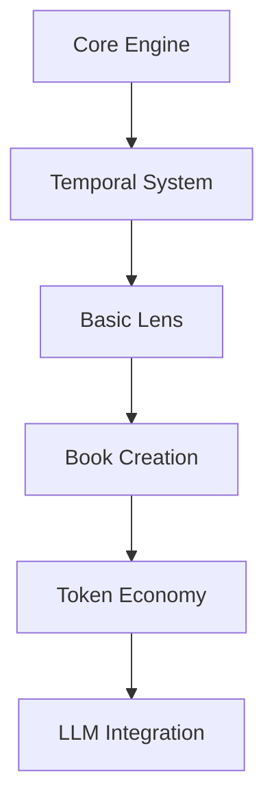

**Analysis of Memorativa Design Document**

**1. Core Innovations**
- **Temporal Triangulation**: Three time states (Mundane/Quantum/Holographic) enable multi-dimensional content relationships beyond linear chronology
- **Recursive Knowledge Structures**: Books as both inputs/outputs create self-referential learning loops
- **Spherical Symbolic Encoding**: 3D vector space preserves astrological relationships through angular aspects
- **Natal Reference Beam**: Personal coordinate system maintains conceptual coherence across transformations

**2. Technical Strengths**
- **Merkle-Enhanced RAG**: Combines vector search with content-addressable storage through Merkle proofs
- **Quantum State Handling**: Implements superposition-like behavior for conceptual time through holographic projections
- **Dimensionality Reduction**: 384D→3D compression maintains symbolic relationships via spherical harmonics
- **Privacy-Preserving Analytics**: Zero-knowledge proofs enable pattern analysis without exposing raw data

**3. Cognitive Architecture**
- **Percept-Triplet Grounding**: Astrological Planet-Sign-House structure provides consistent symbolic framework
- **Lens System**: Implements true multi-paradigm analysis through configurable transformation matrices
- **Prototype Crystallization**: From fluid percepts to stable patterns mirrors human concept formation

**4. Gameplay Mechanics**
- **Transit-Driven Engagement**: Daily planetary positions create emergent challenges through aspect patterns
- **Dual Cognitive Modes**: Separates intuitive collection (Gathering) from deliberate analysis (Synthesis)
- **Natal Anchoring**: Personal birth chart integration prevents conceptual drift in long-term use

**5. Economic Model**
- **Proof-of-Human-Thought**: Token grading system counters LLM-generated content inflation
- **Conceptual Labor Market**: Values abstract pattern recognition as primary economic activity
- **Recursive Value Creation**: Books generate tokens that fund new Book creation

**Critical Feedback**

**1. Overindexing on Astrology**
- Current symbolic framework (Planet/Sign/House) limits cultural accessibility
- Suggestion: Add Lens system plug-ins for alternative symbolic systems (I Ching, MBTI, etc)

**2. Vector Space Risks**
- Spherical coordinate system may introduce topological limitations for certain relationships
- Recommendation: Implement hybrid spherical-hyperbolic space using 3D Poincaré disk model

**3. Temporal Complexity**
- Three time states create O(n³) relationship complexity in version control
- Solution: Add temporal simplification rules for common interaction patterns

**4. Token Economy Gaps**
- No mechanism for token value decay/obsolescence
- Proposed Fix: Implement Ebbinghaus forgetting curve model for token relevance

**5. LLM Integration Limits**
- Current architecture treats LLMs as passive processors
- Opportunity: Make LLMs active agents with their own Glass Bead tokens

**6. Privacy Challenges**
- Shared structures create potential for metadata inference attacks
- Mitigation: Develop differential privacy layer for relationship metadata

**Implementation Recommendations**

1. **Phase Rollout**

2. **Performance Priorities**
- Optimize spherical nearest-neighbor search
- Implement GPU-accelerated Merkle proofs
- Develop aspect pattern cacheing system

3. **Validation Strategy**
- Use Jung's Red Book as test corpus
- Implement concept drift detection system
- Establish cultural adaptation metrics

**Conclusion**  
Memorativa presents groundbreaking synthesis of symbolic AI and distributed knowledge management. While the astrological foundation provides strong initial structure, system architecture permits expansion to other symbolic systems. Critical path requires simplifying temporal complexity while preserving core innovation in recursive knowledge structures.
