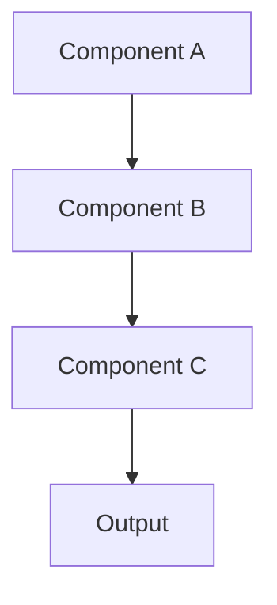

# Memorativa Documentation

This documentation outlines the Memorativa system, a framework for active understanding and systematic prototype construction that addresses the curse of dimensionality in AI through pre-linguistic symbolic frameworks.

## Documentation Structure

The documentation is organized into five main sections:

1. **Introduction**: Philosophical foundation and core concepts
2. **The Cybernetic System**: System architecture and feedback mechanisms
3. **The Machine System**: Technical implementation details
4. **The Pantheon System**: Symbolic frameworks and archetypal structures
5. **The Memorativa System**: Final system design and integration

Each section builds conceptually on the previous ones, creating a chain of thought that culminates in the complete Memorativa system design.

## Front Matter Template

Each documentation file includes YAML front matter with the following fields:

```yaml
---
title: "Document Title"
section: 1-5
subsection: 1-n
order: 1-n
status: "draft|in-progress|complete|review"
last_updated: "YYYY-MM-DD"
contributors: []
key_concepts:
  - "Concept 1"
  - "Concept 2"
prerequisites:
  - "Prerequisite Concept 1"
  - "Prerequisite Concept 2"
next_concepts:
  - "Next Concept 1"
  - "Next Concept 2"
summary: "A concise summary of the document's content and purpose."
chain_of_thought:
  - "Step 1 in the logical progression"
  - "Step 2 in the logical progression"
technical_components:
  - "Component 1"
  - "Component 2"
---
```

### Front Matter Fields

- **title**: The title of the document
- **section**: The main section number (1-5)
- **subsection**: The subsection number within the section
- **order**: The order of the document within its subsection
- **status**: The current status of the document
- **last_updated**: The date the document was last updated
- **contributors**: List of contributors to the document
- **key_concepts**: The main concepts introduced or discussed in the document
- **prerequisites**: Concepts that should be understood before reading this document
- **next_concepts**: Concepts that build upon this document
- **summary**: A concise summary of the document's content and purpose
- **chain_of_thought**: The logical progression of ideas within the document
- **technical_components**: Technical elements or systems discussed in the document

## Document Structure

Each document should follow a consistent structure to ensure clarity and coherence across the documentation:

1. **Title**: The document title as an H1 heading
2. **Introduction**: A brief introduction to the topic
3. **Main Content**: The core content of the document, organized into logical sections with appropriate headings
4. **Key Points**: A summary of the key points and chain-of-thought presented in the document
5. **Key Math**: Mathematical proofs and formulations that support the document's concepts (when applicable)
6. **Code Examples**: Implementation or pseudocode examples that illustrate concepts (when applicable)
7. **Diagrams and Visualizations**: ASCII art, Mermaid diagrams, or SVG visualizations that support understanding (when applicable)
8. **See Also**: Cross-references to related documents in the Memorativa system (when applicable)
9. **Citations**: References to external sources cited in the document

### Section Ordering Rules

The following rules govern the structure and ordering of document sections:

1. **Mandatory Sections**: Title, Introduction, Main Content, Key Points, and Citations are mandatory for all documents.

2. **Optional Sections**: Key Math, Code Examples, Diagrams and Visualizations, and See Also are optional and should only be included when relevant to the document's content.

3. **Fixed Order**: When included, sections must appear in the following order:
   - Title (always first)
   - Introduction (always second)
   - Main Content (always third)
   - Key Points (always after Main Content)
   - Key Math (if applicable, always after Key Points)
   - Code Examples (if applicable, always after Key Math if present, otherwise after Key Points)
   - Diagrams and Visualizations (if applicable, always after Code Examples if present, otherwise after Key Math if present, otherwise after Key Points)
   - See Also (if applicable, always before Citations)
   - Citations (always last)

4. **Section Placement Visual Guide**:

```
TITLE
└── INTRODUCTION
    └── MAIN CONTENT
        └── KEY POINTS
            ├── [KEY MATH (optional)]
            │   ├── [CODE EXAMPLES (optional)]
            │   │   ├── [DIAGRAMS AND VISUALIZATIONS (optional)]
            │   │   │   ├── [SEE ALSO (optional)]
            │   │   │   │   └── CITATIONS
            │   │   │   └── CITATIONS
            │   │   ├── [SEE ALSO (optional)]
            │   │   │   └── CITATIONS
            │   │   └── CITATIONS
            │   ├── [DIAGRAMS AND VISUALIZATIONS (optional)]
            │   │   ├── [SEE ALSO (optional)]
            │   │   │   └── CITATIONS
            │   │   └── CITATIONS
            │   ├── [SEE ALSO (optional)]
            │   │   └── CITATIONS
            │   └── CITATIONS
            ├── [CODE EXAMPLES (optional)]
            │   ├── [DIAGRAMS AND VISUALIZATIONS (optional)]
            │   │   ├── [SEE ALSO (optional)]
            │   │   │   └── CITATIONS
            │   │   └── CITATIONS
            │   ├── [SEE ALSO (optional)]
            │   │   └── CITATIONS
            │   └── CITATIONS
            ├── [DIAGRAMS AND VISUALIZATIONS (optional)]
            │   ├── [SEE ALSO (optional)]
            │   │   └── CITATIONS
            │   └── CITATIONS
            ├── [SEE ALSO (optional)]
            │   └── CITATIONS
            └── CITATIONS
```

This structure ensures that all documents maintain a consistent format while allowing flexibility for document-specific needs.

### Key Points Section

Each document must include a "Key Points" section before the Citations section. This section should:

1. Provide a human-readable summary of the most important concepts presented in the document
2. Explain the chain-of-thought for the concepts where relevant
3. Connect the document's concepts to the broader Memorativa system
4. Include citations to relevant sources and related documents
5. Be formatted as bullet points for easy scanning and comprehension

Example format:

```markdown
## Key Points

- The system implements [concept] using [approach], which enables [benefit] [citation]
- [Concept A] connects to [Concept B] through [relationship], creating [outcome] [citation]
- The chain of thought progresses from [starting point] to [conclusion] through [steps] [citation]
- This approach addresses [challenge] by leveraging [solution] [citation]
- Future development will focus on [next steps] to enhance [capabilities] [citation]
```

### Key Math Section

When a document contains mathematical concepts, proofs, or formulations (either implicit or explicit), it should include a "Key Math" section after the Key Points section. This section should:

1. Formalize any mathematical concepts that are implicit in the text
2. Provide clear, step-by-step proofs for mathematical claims
3. Define variables, functions, and notation used in mathematical expressions
4. Connect mathematical formulations to the conceptual framework
5. Include citations to relevant mathematical literature or related documents

Example format:

```markdown
## Key Math

- **Vector Space Representation**: The encoding of concepts into vector spaces can be formalized as a function $f: C \rightarrow \mathbb{R}^n$ where $C$ is the set of concepts and $n$ is the dimensionality of the vector space [citation]

- **Similarity Measure**: The similarity between two concepts $c_1$ and $c_2$ is computed as the cosine similarity between their vector representations:
  $\text{sim}(c_1, c_2) = \frac{f(c_1) \cdot f(c_2)}{||f(c_1)|| \cdot ||f(c_2)||}$ [citation]

- **Proof of Convergence**: The iterative refinement process converges because [mathematical proof with steps] [citation]

- **Dimensionality Reduction**: The mapping from high-dimensional to low-dimensional space preserves semantic relationships through [mathematical formulation] [citation]
```

Not all documents will require a Key Math section. It should be included only when mathematical concepts are central to understanding the document's content.

### Code Examples Section

When a document describes systems, algorithms, or processes that can be represented in code, it should include a "Code Examples" section after the Key Math section (or after the Key Points section if no Key Math is provided). This section should:

1. Provide clear, well-commented code snippets or pseudocode that illustrate the concepts
2. Include both high-level pseudocode for conceptual understanding and actual implementation code where appropriate
3. Specify the programming language or framework being used for each example
4. Connect the code examples to the conceptual framework described in the document
5. Explain key design patterns or algorithms implemented in the code

Example format:

```markdown
## Code Examples

### Conceptual Pseudocode

```
// High-level pseudocode describing the algorithm or process
function ConceptExample(input):
    // Step 1: Initialize components
    components = InitializeComponents(input)
    
    // Step 2: Process components
    results = Process(components)
    
    // Step 3: Return results
    return FormatResults(results)
```

### Implementation Example (Language/Framework)

```language
// Actual implementation code with comments
function implementationExample(input) {
  // Initialize with specific data structures
  const components = input.map(item => new Component(item));
  
  // Process using specific algorithms
  const results = components.reduce((acc, component) => {
    // Implementation details
    return acc.concat(component.process());
  }, []);
  
  return results.format();
}
```

### Key Design Considerations

- The implementation uses [pattern/algorithm] to address [challenge]
- Time complexity: O(n) because [explanation]
- Space complexity: O(1) because [explanation]
- Alternative approaches considered: [alternatives] and trade-offs
```

Not all documents will require a Code Examples section. It should be included only when code implementations or algorithms are important for understanding the document's content.

### Diagrams and Visualizations Section

When concepts, systems, relationships, or processes can be better understood through visual representation, documents should include visual elements and a "Key Visual Insights" section that summarizes these visualizations. The approach to visualizations should follow these guidelines:

1. **Inline Visualizations**: Place diagrams, charts, and visualizations inline within the Main Content section where they directly support the text. Each visualization should:
   - Be placed immediately after the text it illustrates
   - Include clear captions and figure numbers
   - Use the most appropriate format (ASCII, Mermaid, SVG) based on content needs
   - Be referenced in the surrounding text

2. **Key Visual Insights Section**: After the Key Math section (or after the Key Points section if no Key Math is provided), include a "Key Visual Insights" section that:
   - Summarizes the main takeaways from all visualizations in the document
   - Connects the visualizations to the conceptual framework
   - Highlights patterns or relationships revealed across multiple visualizations
   - Provides deeper analytical insights that might not be obvious from the individual diagrams

This hybrid approach keeps visualizations close to relevant content for easier understanding while still providing a dedicated section that synthesizes visual insights.

### Figure Caption Standardization

All figure captions must follow a consistent format to ensure clarity and provide adequate context. Each caption should:

1. Begin with "Figure X: " where X is the sequential figure number within the document
2. Include a descriptive title that clearly identifies what the figure represents
3. Provide additional context that explains the figure's significance, components, or relationship to the text
4. End with relevant details about what insights can be gained from the visualization

The complete caption format should follow this pattern:
```
*Figure X: [Descriptive Title], [Additional Context], [Significance/Insights]*
```

Examples of properly formatted figure captions:

```
*Figure 1: The complete Memorativa system workflow showing the transformation from input to glass bead rewards, highlighting the sequential processing stages from percept creation through book generation*

*Figure 2: Traditional LLM semantic processing compared to the Memorativa approach, illustrating how conventional models decompose words into tokens mapped to high-dimensional vector spaces*

*Figure 3: Three-dimensional conceptual space visualization showing how a percept is encoded using three vectors (Archetypal, Expression, and Mundane), with their semantic interrelationships forming a structured conceptual framework*
```

All captions should provide enough detail that readers can understand the figure's purpose without having to read the surrounding text, while avoiding excessive length that detracts from the visualization itself.

Example format for inline visualizations:

```markdown
## Main Content Section

Text explaining a concept...


*Figure 1: Component relationship diagram showing the flow of information*

Additional text referencing Figure 1...
```

Example format for the Key Visual Insights section:

```markdown
## Key Visual Insights

- The component relationship diagram (Figure 1) reveals [key insight] that connects to [broader concept]
- Comparing the architectural diagram (Figure 2) with the process flow (Figure 3) shows [pattern or relationship]
- The evolution timeline visualization (Figure 4) demonstrates [significant trend] that supports [key argument]
```

The Key Visual Insights section serves as a bridge between the individual visualizations and the document's broader conceptual framework, helping readers integrate visual information with textual concepts.

### See Also Section

When a document relates conceptually to other documents in the Memorativa system, it should include a "See Also" section before the Citations section. This section serves as a guide for readers to explore related concepts within the documentation. The "See Also" section should:

1. List related documents that expand on concepts discussed in the current document
2. Provide brief context for why each referenced document is relevant
3. Use a consistent format for cross-references that clearly identifies the target document
4. Organize references by relevance or thematic relationship to the current document

Example format:

```markdown
## See Also

- [Section 2.3: System Interfaces](../02_cybernetic_system/03_system_interfaces.md) — Provides detailed specifications for the interfaces mentioned in this document's architecture overview
- [Section 3.5: Memory Models](../03_machine_system/05_memory_models.md) — Expands on the memory storage mechanisms briefly described in this document
- [Section 1.2: Core Principles](../01_introduction/02_core_principles.md) — Contains foundational concepts that inform the design decisions explained in this document
```

The "See Also" section helps readers navigate the conceptual dependencies within the Memorativa system and encourages exploration of related concepts.

## Citation Format

Each document should include a "Citations" section at the end with a standardized format for external references that are directly cited in the text. Citations should be numbered sequentially in square brackets (e.g., [1], [2]) and referenced in the text using these numbers.

### Citation Format Template

```markdown
## Citations

- [1] Author, A. (Year). *Title of Book*. Publisher.
- [2] Author, B., & Author, C. (Year). "Title of Article." *Journal Name*, Volume(Issue), Page-Range.
- [3] Author, D. (Year). "Title of Chapter." In *Title of Book* (pp. Page-Range), Editor, E. (Ed.). Publisher.
- [4] Author, E. (Year). *Title of Web Resource*. Organization. URL
```

### Citation Guidelines

1. **Books**: Author(s), year, italicized title, publisher.
2. **Journal Articles**: Author(s), year, quoted title, italicized journal name, volume, issue, page range.
3. **Book Chapters**: Author(s), year, quoted title, italicized book title, page range, editor(s), publisher.
4. **Web Resources**: Author(s), year, italicized title, organization, URL (optional).

All external sources referenced in the document must be properly cited. Internal cross-references to other Memorativa documentation should be handled in the "See Also" section rather than in Citations.

When citing in the text, use the following format:
- "According to Smith [1], the system should..."
- "The architecture follows established patterns for distributed systems [2, 3]."
- "This approach builds on research in cognitive frameworks [4]."

## Purpose

This documentation structure serves several important purposes:

1. **Conceptual Tracking**: Clearly shows how concepts build upon each other
2. **Dependency Management**: Identifies prerequisites and subsequent concepts
3. **Progress Monitoring**: Tracks the status and development of documentation
4. **Content Indexing**: Enables quick searching and filtering of content
5. **Synthetic Summation**: Facilitates the creation of comprehensive summaries at checkpoints
6. **Machine Processing**: Provides structured metadata for automated analysis
7. **Knowledge Consolidation**: The Key Points section ensures critical concepts are highlighted and connected

The chain-of-thought fields and Key Points sections are particularly important as they make explicit the logical progression of ideas throughout the documentation, culminating in the final system design in Section 5.

## Figure Labeling Requirements

All figures in the documentation MUST follow the standard labeling format:

```
*Figure X: [Descriptive Title], [Additional Context], [Significance/Insights]*
```

Where:
1. X is the sequential figure number within the document
2. The descriptive title clearly identifies what the figure represents
3. Additional context explains the figure's components or relationship to the text
4. Significance/Insights details what can be learned from the visualization

Each document should number figures sequentially starting from Figure 1. Figure labels must be placed immediately below the figure and formatted in italics. This consistent labeling is essential for:
- Cross-referencing figures within the text
- Ensuring figures are properly indexed and searchable
- Maintaining a consistent documentation standard
- Providing sufficient context for readers to understand visualizations independently

## Checkpoints and Summations

At the end of each section, a checkpoint document will provide a synthetic, comprehensive summation of the conceptual state at that point. These checkpoints will:

1. Consolidate key concepts introduced in the section
2. Show how these concepts build upon previous sections
3. Prepare the reader for the next section's concepts
4. Track the overall progression toward the final system design

The final checkpoint in Section 5 will provide the complete Memorativa system design, representing the culmination of the entire chain of thought developed throughout the documentation. 