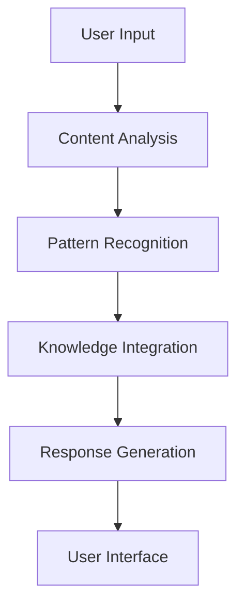
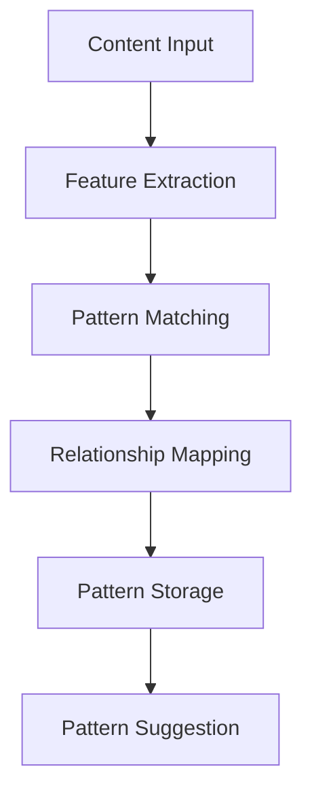
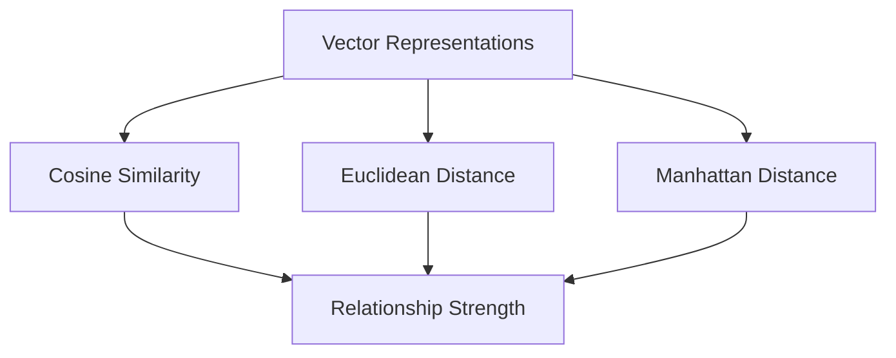

# AI Concepts Reference

## Core AI Systems

### Large Language Models (LLMs)
| Component | Description | Application in Memorativa |
|-----------|-------------|-------------------------|
| Transformer Architecture | Neural network design that processes sequences of data using attention mechanisms | Powers core interaction and analysis capabilities |
| Context Window | Amount of text/tokens model can process at once | Determines depth of analysis possible for content |
| Token Processing | Breaking text into smaller units for model processing | Handles user input and content analysis |
| Few-Shot Learning | Ability to learn from small number of examples | Enables personalized pattern recognition |
| Zero-Shot Learning | Ability to handle novel tasks without specific training | Supports flexible prompt generation |

### Natural Language Processing (NLP)
| Capability | Description | Application in Memorativa |
|------------|-------------|-------------------------|
| Semantic Analysis | Understanding meaning and context of text | Content categorization and relationship mapping |
| Named Entity Recognition | Identifying key objects, people, concepts | Pattern identification in user content |
| Sentiment Analysis | Detecting emotional tone and intent | Understanding user engagement patterns |
| Topic Modeling | Identifying themes and subjects | House categorization and content organization |
| Text Embeddings | Converting text to numerical vectors | Enabling semantic search and relationships |

### Neural Networks
| Type | Description | Application in Memorativa |
|------|-------------|-------------------------|
| Convolutional (CNN) | Processing grid-like data (images) | Visual content analysis and generation |
| Recurrent (RNN) | Processing sequential data | Temporal pattern analysis |
| Graph Neural Networks | Processing relationship data | Mapping content relationships |
| Attention Networks | Focusing on relevant information | Core pattern recognition |

## Key AI Integration Points

### Retrieval Augmented Generation (RAG)
- Combines knowledge base with LLM capabilities
- Enables fact-grounded responses
- Supports personalized content integration
- Maintains context across interactions
- Enables pattern recognition across user content

### Pattern Recognition Systems
- Identifies relationships between content
- Maps conceptual similarities
- Tracks temporal patterns
- Recognizes symbolic connections
- Supports cross-domain insights

### Semantic Analysis Framework
- Deep content understanding
- Context-aware processing
- Relationship mapping
- Theme identification
- Meaning extraction

## AI System Architecture

### Core Components
1. **Input Processing**
   - Content analysis
   - Context extraction
   - Pattern identification
   - Relationship mapping

2. **Knowledge Integration**
   - User content database
   - Pattern repository
   - Relationship graphs
   - Temporal tracking

3. **Output Generation**
   - Response synthesis
   - Pattern suggestions
   - Relationship recommendations
   - Visual generation

### System Interactions

#### Content Flow


#### Pattern Recognition Flow


## AI Implementation Considerations

### Ethical Guidelines
- Privacy protection
- Data security
- Bias mitigation
- Transparency
- User control

### Technical Constraints
- Processing limitations
- Resource management
- Scalability requirements
- Integration complexity
- Performance optimization

### Quality Assurance
- Accuracy monitoring
- Pattern validation
- Response verification
- System calibration
- Performance tracking

## Vector Spaces and Embeddings

### Vector Space Fundamentals
| Concept | Description | Application in Memorativa |
|---------|-------------|-------------------------|
| Vector Representation | Mathematical representation of content in multi-dimensional space | Core representation of glass bead content |
| Dimensionality | Number of features/dimensions in the vector space | Determines richness of semantic representation |
| Distance Metrics | Methods for measuring similarity between vectors | Used for relationship mapping and pattern detection |
| Vector Operations | Mathematical operations on vectors (addition, dot product) | Enables semantic composition and comparison |

### Embedding Types
| Type | Description | Application in Memorativa |
|------|-------------|-------------------------|
| Semantic Embeddings | Dense vectors representing meaning | Core content representation |
| House Embeddings | Position-aware representations | Spatial organization of content |
| Temporal Embeddings | Time-aware vector representations | Tracking concept evolution |
| Relationship Embeddings | Graph-based vector representations | Mapping bead connections |

### Similarity Metrics


### Integration with Astrological Framework
- House positions as natural vector coordinates
- Aspect angles as similarity metrics
- Planetary positions as temporal markers
- House cusps as semantic boundaries

### Dimensionality Management
| Technique | Purpose | Implementation |
|-----------|---------|----------------|
| PCA | Dimension reduction | Pattern analysis |
| t-SNE | Visualization | Interface display |
| UMAP | Clustering | Pattern discovery |
| Autoencoders | Feature extraction | Content processing |

### Vector Operations in Practice
```rust
pub struct VectorOperations {
    // Basic Operations
    pub vector_addition: fn(Vec<f32>, Vec<f32>) -> Vec<f32>,
    pub vector_multiplication: fn(Vec<f32>, f32) -> Vec<f32>,
    pub dot_product: fn(Vec<f32>, Vec<f32>) -> f32,
    
    // Similarity Computations
    pub cosine_similarity: fn(Vec<f32>, Vec<f32>) -> f32,
    pub euclidean_distance: fn(Vec<f32>, Vec<f32>) -> f32,
    
    // Specialized Operations
    pub house_position_encoding: fn(HousePosition) -> Vec<f32>,
    pub temporal_encoding: fn(DateTime) -> Vec<f32>,
    pub relationship_encoding: fn(Relationship) -> Vec<f32>
}
```

### Quality Metrics
- Vector normalization standards
- Embedding coherence measures
- Relationship strength metrics
- Pattern significance scores

This vector space framework provides the mathematical foundation for:
- Content representation
- Relationship mapping
- Pattern detection
- Semantic search
- Quality assessment

This reference provides a foundation for understanding the AI systems integrated throughout Memorativa, supporting both technical implementation and user interaction design.
