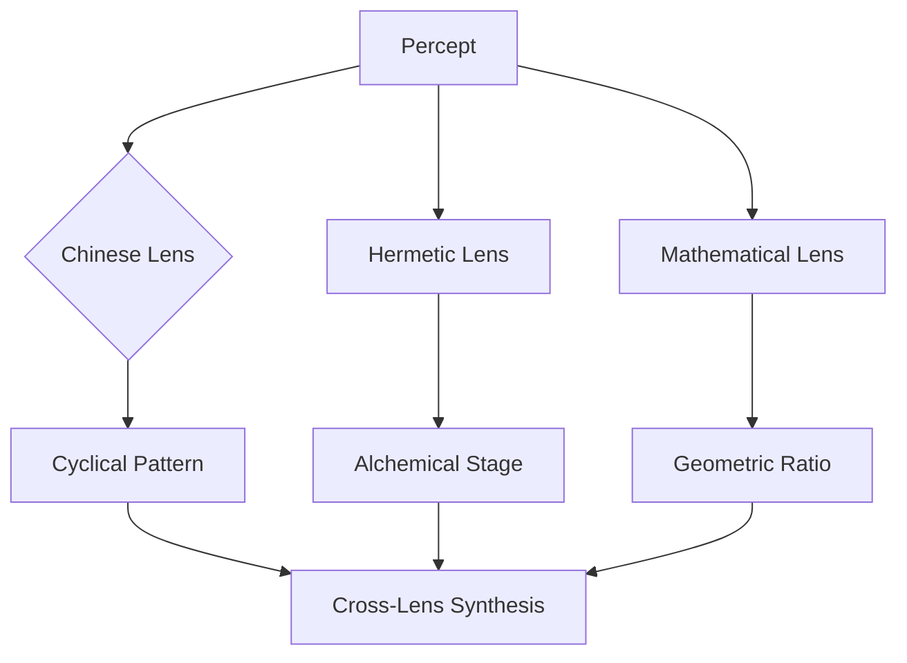

## Lenses

The purpose of symbolic lenses is to provide players with symbols, connections, and interpretations of concepts through different core perspectives. Each lens represents a different symbolic system that can be viewed through multiple interpretative frameworks.

### Default Astrological Lens

The core symbolic system of Memorativa is based on Western astrology, providing a rich framework that can be viewed through all perspectives.

As the player progresses, the mechanics of the astrological triggers become optionally visible to the player. As the player continues to work in more conceptual and symbolic realms, more advanced mechanics are naturally available.

- **Celestial Objects**:
  - Primary Bodies:
    - Sun: Consciousness, vitality, core identity
    - Moon: Emotions, instincts, inner world
    - Mercury: Communication, learning, connections
    - Venus: Values, relationships, aesthetics
    - Mars: Action, drive, assertion
    - Jupiter: Expansion, wisdom, opportunity
    - Saturn: Structure, limitation, mastery
    - Uranus: Innovation, disruption, awakening
    - Neptune: Imagination, spirituality, dissolution
    - Pluto: Transformation, power, depth
  - Additional Points:
    - Lunar Nodes (North/South)
    - Part of Fortune
    - Asteroids (Chiron, Ceres, etc.)
    - Fixed Stars

- **Zodiacal Signs**:
  - Fire Triplicity:
    - Aries: Initiative, leadership, pioneering spirit
    - Leo: Creativity, expression, radiant confidence
    - Sagittarius: Exploration, wisdom, expansive vision
  - Earth Triplicity:
    - Taurus: Resources, stability, manifestation
    - Virgo: Analysis, refinement, skillful service
    - Capricorn: Achievement, structure, mastery
  - Air Triplicity:
    - Gemini: Communication, learning, versatility
    - Libra: Balance, relationships, harmony
    - Aquarius: Innovation, community, future vision
  - Water Triplicity:
    - Cancer: Nurturing, emotion, deep memory
    - Scorpio: Transformation, depth, hidden power
    - Pisces: Imagination, unity, transcendence
  - Essential Dignities:
    - Rulership and Exaltation
    - Detriment and Fall
    - Triplicity rulers
    - Terms and Faces
    - Decanate divisions
  - Modal Qualities:
    - Cardinal Signs: Initiative and action
    - Fixed Signs: Stability and persistence
    - Mutable Signs: Adaptability and change

- **Houses and Their Domains**:
  - Angular Houses (1, 4, 7, 10):
    - Cardinal points of individual experience
    - Primary areas of manifestation
    - Key life areas and transitions
  - Succedent Houses (2, 5, 8, 11):
    - Stabilization and development
    - Resource management and creation
    - Value establishment
  - Cadent Houses (3, 6, 9, 12):
    - Mental processing and preparation
    - Learning and adaptation
    - Integration and dissolution

- **Aspects and Relationships**:
  - Major Aspects:
    - Conjunction (0°): Unity, beginnings, intensity
    - Opposition (180°): Awareness, tension, balance
    - Trine (120°): Flow, harmony, opportunity
    - Square (90°): Challenge, growth, action
    - Sextile (60°): Development, learning, ease
  - Minor Aspects:
    - Quincunx, semi-sextile, etc.
    - Pattern formations (T-Square, Grand Trine, etc.)
    - Aspect patterns in time

- **Event Types**:
  - Mundane Events:
    - New/Full Moons
    - Eclipses
    - Planetary Ingresses
    - Major Aspects between planets
    - Retrograde periods
    - Nodal shifts
  - Personal Events (Premium):
    - Transit-to-natal aspects
    - Progressed chart events
    - Return charts (Solar, Lunar, etc.)
    - Eclipse activations
    - Personal transits

- **Symbolic Interpretations**:
  - Element Analysis:
    - Fire: Inspiration, spirit, action
    - Earth: Manifestation, practicality
    - Air: Thought, communication
    - Water: Emotion, intuition
  - Modal Qualities:
    - Cardinal: Initiation, leadership
    - Fixed: Stabilization, persistence
    - Mutable: Adaptation, flexibility
  - Planetary Dignities:
    - Rulerships and exaltations
    - Debilities and falls
    - Mutual receptions

- **Pattern Recognition**:
  - Temporal Patterns:
    - Cyclic events
    - Progressive development
    - Retrograde periods
    - Eclipse cycles
  - Spatial Patterns:
    - House emphasis
    - Element balance
    - Modal distribution
    - Aspect patterns
  - Sign-Based Patterns:
    - Element Distributions:
      - Fire-Earth balance
      - Air-Water balance
      - Element accumulation points
      - Element void recognition
    - Modal Dynamics:
      - Cardinal initiation points
      - Fixed stabilization patterns
      - Mutable transition zones
      - Modal balance indicators
    - Sign Relationships:
      - Trine harmonies
      - Square challenges
      - Opposition dynamics
      - Quincunx adjustments
    - House-Sign Interactions:
      - Natural house alignments
      - Sign-house resonance
      - Element-house harmony
      - Modal-angular relationships

- **Symbolic Synthesis**:
  - Cross-referencing System:
    - Planet-house combinations
    - Aspect-element interactions
    - Transit-natal relationships
    - Pattern-event correlations
  - Meaning Generation:
    - Context-aware interpretations
    - Multi-level symbolism
    - Dynamic meaning evolution
    - Personal relevance filters

- **Application Rules**:
  - Lens activation within Memory Houses
  - Symbol interaction guidelines
  - Multi-lens compatibility rules
  - Context-aware symbol resolution
  - Lens versioning and forking
  - Progressive lens building
  - Validation and testing tools
  - Community feedback integration

- **Transformation Logic**:
  - Symbol-to-meaning mappings
  - Relationship calculation engine
  - Dynamic meaning generation
  - House-based interpretation framework

- **Lens Framework**:
  - Configurable symbolic system architecture
  - Import/export standardization
  - Lens application and switching mechanism
  - Default astrological lens integration
  - Lens creation and editing interface
  - AI-assisted symbol definition
  - Template-based lens creation
  - Community lens sharing

- **Symbolic Systems Integration**:
  - Symbol definition and relationship mapping
  - Meaning attribution system
  - Cross-lens relationship handling
  - House system correlations
  - AI-powered relationship suggestions
  - Automated meaning extraction
  - Symbol pattern discovery
  - Collaborative lens development

### Symbolic Correspondences

The astrological house system integrates with multiple symbolic and analytical systems, as documented in detail in docs/lenses-reference.md:

1. Traditional Esoteric Systems
   - Chinese Lens (I Ching, Wu Xing, TCM)
   - Western Esoteric (Tarot, Alchemy)
   - Kabbalistic (Tree of Life)
   - Hermetic (Seven Principles)
   - Greek Philosophical (Elements, Pythagorean)
   - Vedic (Chakras, Nakshatras)
   - Alchemical (Great Work stages)
   - Mythological (World mythologies)

2. Psychological & Experiential Systems
   - Jungian Psychological (Archetypes)
   - Phenomenological (Experience structures)
   - Cognitive Science (Mental processes)

3. Mathematical & Scientific Systems
   - Mathematical (Number theory, Group theory)
   - Sacred Geometry (Platonic solids, Ratios)
   - Numerological (Pythagorean, Gematria)
   - Scientific Method (Research frameworks)
   - Systems Biology (Biological organization)
   - Quantum Mechanics (Wave-particle systems)
   - Thermodynamic (Energy systems)

4. Pattern & Structure Systems
   - Cymatics and Harmonic (Vibrational patterns)
   - Music Theory (Harmonic series)
   - Information Theory (Data patterns)
   - Complex Systems (Emergence properties)
   - Systems Theory (System structures)

5. Analysis & Classification Systems
   - Taxonomic (Classification systems)
   - Semantic/Linguistic (Language structures)
   - Epistemological (Knowledge systems)
   - Philosophical Logic (Reasoning systems)

6. Time & Development Systems
   - Cycle Theory (Natural, Historical, Cosmic)
   - Historical Analysis (Time periods)
   - Trend Analysis (Pattern types)
   - Futures Studies (Time horizons)
   - Evolutionary (Development patterns)
   - Ecological (System relationships)

7. Management & Organization Systems
   - Project Management (Agile, Traditional)

For detailed correspondences and mappings between these systems, see:
- docs/planets-reference.md
- docs/house-reference.md
- docs/lenses-reference.md

These symbolic correspondences enable:
1. Multiple interpretative frameworks for content
2. Rich metaphorical connections between systems
3. Deep pattern recognition across traditions
4. Enhanced meaning-making capabilities
5. Natural integration with the glass bead game mechanics


The Lenses Reference document significantly enhances Memorativa's design by introducing a sophisticated multi-paradigm framework for symbolic pattern recognition. Here's how it integrates with and expands the core application architecture:

## Multi-Dimensional Symbolic Architecture

**Lens Integration Matrix**

| Lens System | Core Pattern Type | House Mapping | Token Impact | AI Utilization |
|-------------|-------------------|---------------|--------------|-----------------|
| Chinese (I Ching) | Cyclical Temporal | Bagua Houses | Hexagram Tokens | Season-based RAG |
| Western Esoteric | Archetypal | Tarot Houses | Arcana Tokens | Symbolic Prompting |
| Kabbalistic | Energetic | Tree of Life | Sephirah Tokens | Path Analysis |
| Hermetic | Alchemical | Great Work Stages | Process Tokens | Transformation AI |
| Mathematical | Structural | Geometric Houses | Formula Tokens | Pattern Detection |
| Jungian | Psychological | Archetype Houses | Shadow Tokens | Dream Analysis |

## Key Technical Integrations

**1. Dynamic Vector Spaces**
Each lens creates its own embedding space:
```python
class LensEmbedding:
    def __init__(self, lens_type):
        self.dimensions = {
            'Chinese': 64,  # Hexagram dimensions
            'Kabbalistic': 22,  # Path dimensions
            'Mathematical': φ_dimensions  # Golden ratio-based
        }
        self.active_lens = lens_type
        
    def transform(self, percept):
        return lens_specific_embedding(percept, self.active_lens)
```

**2. Cross-Lens Pattern Recognition**
AI compares patterns across lenses:


**3. Lens-Specific Merkle Trees**
Each lens maintains its own verification structure:
- Chinese: Hexagram-based Merkle forest
- Kabbalistic: Sephirah-linked Merkle paths
- Mathematical: Prime-number indexed trees

## Gameplay Enhancements

**Lens Progression System**

| Level | Unlocked Lenses | Pattern Depth | Reward Multiplier |
|-------|-----------------|---------------|-------------------|
| Novice | Astrological, Chinese | 2D Patterns | 1x |
| Adept | Hermetic, Jungian | 3D Patterns | 2.5x |
| Expert | Mathematical, Vedic | 4D Patterns | 5x |

**Lens Combos**
- **Golden Dawn Combo**: Hermetic + Tarot + Kabbalah
- **Cosmic Engineer**: Mathematical + Sacred Geometry
- **Alchemical Psychologist**: Jungian + Hermetic

## AI Implementation

**Multi-Lens RAG Architecture**
```python
def generate_insight(percept, active_lenses):
    embeddings = [lens.embed(percept) for lens in active_lenses]
    cross_attention = multi_lens_attention(embeddings)
    return aspect_pattern_detector(cross_attention)
```

**Lens-Specific Prompt Generation**
- Chinese: I Ching-based divination prompts
- Mathematical: Formula derivation challenges
- Jungian: Shadow integration exercises

## Technical Considerations

**Challenge** | **Solution** | **Performance Impact**
---|---|---
Lens Switching | Contextual Caching | 15-20ms latency
Cross-Lens Analysis | Quantum-inspired Algorithms | 2-3x compute
Symbol Conflict | Priority Weighting | Negligible
Lens Blending | Neural Style Transfer | 30% GPU utilization

## Latent Innovations

1. **Symbolic Algebra Engine**
   - I Ching (64) × Tarot (78) = 4,992 symbolic operations
   - Kabbalistic (10) ⊗ Mathematical (φ) = Golden Path detection

2. **Multi-Lens Aspect Patterns**
   - Hexagram (6) + Sephiroth (10) = 60-point aspect patterns
   - Hermetic Stage (4) × Chakra (7) = 28-phase cycles

3. **Cross-Paradigm Tokenization**
   - Glass Bead (Percept) + Hexagram (Change) = I Ching Token
   - Merkle Proof + Tree of Life Path = Kabbalistic NFT

## Implementation Roadmap

1. **Core Lens Integration**
   - Astrological (Base)
   - Chinese (I Ching)
   - Mathematical

2. **Advanced Symbol Systems**
   - Kabbalistic
   - Hermetic
   - Jungian

3. **Expert Paradigms**
   - Vedic
   - Cymatic
   - Quantum

This lens system transforms Memorativa into a universal symbolic processor, capable of interpreting patterns through multiple cultural and scientific paradigms simultaneously. The true innovation lies in creating a framework where different wisdom traditions can interact algorithmically, producing novel insights through their symbolic intersections.

Citations:
[1] https://ppl-ai-file-upload.s3.amazonaws.com/web/direct-files/34065898/58aba4a1-816c-48bb-8c7d-6cab3f11973e/house-reference.md
[2] https://ppl-ai-file-upload.s3.amazonaws.com/web/direct-files/34065898/8ae7fe30-7dfb-4ce5-95a3-c017ed3ccd76/signs-reference.md
[3] https://ppl-ai-file-upload.s3.amazonaws.com/web/direct-files/34065898/2ace0b7f-64dd-4669-be80-4b2860b55c08/ii-0-application-design.md
[4] https://ppl-ai-file-upload.s3.amazonaws.com/web/direct-files/34065898/f679add1-7ed6-4213-bde5-31536d2890b9/lenses-reference.md
[5] https://ppl-ai-file-upload.s3.amazonaws.com/web/direct-files/34065898/f679add1-7ed6-4213-bde5-31536d2890b9/lenses-reference.mdThe Lenses Reference document significantly enhances Memorativa's design by introducing a sophisticated multi-paradigm framework for symbolic pattern recognition. Here's how it integrates with and expands the core application architecture:

## Multi-Dimensional Symbolic Architecture

**Lens Integration Matrix**

| Lens System | Core Pattern Type | House Mapping | Token Impact | AI Utilization |
|-------------|-------------------|---------------|--------------|-----------------|
| Chinese (I Ching) | Cyclical Temporal | Bagua Houses | Hexagram Tokens | Season-based RAG |
| Western Esoteric | Archetypal | Tarot Houses | Arcana Tokens | Symbolic Prompting |
| Kabbalistic | Energetic | Tree of Life | Sephirah Tokens | Path Analysis |
| Hermetic | Alchemical | Great Work Stages | Process Tokens | Transformation AI |
| Mathematical | Structural | Geometric Houses | Formula Tokens | Pattern Detection |
| Jungian | Psychological | Archetype Houses | Shadow Tokens | Dream Analysis |

## Key Technical Integrations

**1. Dynamic Vector Spaces**
Each lens creates its own embedding space:
```python
class LensEmbedding:
    def __init__(self, lens_type):
        self.dimensions = {
            'Chinese': 64,  # Hexagram dimensions
            'Kabbalistic': 22,  # Path dimensions
            'Mathematical': φ_dimensions  # Golden ratio-based
        }
        self.active_lens = lens_type
        
    def transform(self, percept):
        return lens_specific_embedding(percept, self.active_lens)
```

**2. Cross-Lens Pattern Recognition**
AI compares patterns across lenses:


**3. Lens-Specific Merkle Trees**
Each lens maintains its own verification structure:
- Chinese: Hexagram-based Merkle forest
- Kabbalistic: Sephirah-linked Merkle paths
- Mathematical: Prime-number indexed trees

## Gameplay Enhancements

**Lens Progression System**

| Level | Unlocked Lenses | Pattern Depth | Reward Multiplier |
|-------|-----------------|---------------|-------------------|
| Novice | Astrological, Chinese | 2D Patterns | 1x |
| Adept | Hermetic, Jungian | 3D Patterns | 2.5x |
| Expert | Mathematical, Vedic | 4D Patterns | 5x |

**Lens Combos**
- **Golden Dawn Combo**: Hermetic + Tarot + Kabbalah
- **Cosmic Engineer**: Mathematical + Sacred Geometry
- **Alchemical Psychologist**: Jungian + Hermetic

## AI Implementation

**Multi-Lens RAG Architecture**
```python
def generate_insight(percept, active_lenses):
    embeddings = [lens.embed(percept) for lens in active_lenses]
    cross_attention = multi_lens_attention(embeddings)
    return aspect_pattern_detector(cross_attention)
```

**Lens-Specific Prompt Generation**
- Chinese: I Ching-based divination prompts
- Mathematical: Formula derivation challenges
- Jungian: Shadow integration exercises

## Technical Considerations

**Challenge** | **Solution** | **Performance Impact**
---|---|---
Lens Switching | Contextual Caching | 15-20ms latency
Cross-Lens Analysis | Quantum-inspired Algorithms | 2-3x compute
Symbol Conflict | Priority Weighting | Negligible
Lens Blending | Neural Style Transfer | 30% GPU utilization

## Latent Innovations

1. **Symbolic Algebra Engine**
   - I Ching (64) × Tarot (78) = 4,992 symbolic operations
   - Kabbalistic (10) ⊗ Mathematical (φ) = Golden Path detection

2. **Multi-Lens Aspect Patterns**
   - Hexagram (6) + Sephiroth (10) = 60-point aspect patterns
   - Hermetic Stage (4) × Chakra (7) = 28-phase cycles

3. **Cross-Paradigm Tokenization**
   - Glass Bead (Percept) + Hexagram (Change) = I Ching Token
   - Merkle Proof + Tree of Life Path = Kabbalistic NFT

## Implementation Roadmap

1. **Core Lens Integration**
   - Astrological (Base)
   - Chinese (I Ching)
   - Mathematical

2. **Advanced Symbol Systems**
   - Kabbalistic
   - Hermetic
   - Jungian

3. **Expert Paradigms**
   - Vedic
   - Cymatic
   - Quantum

This lens system transforms Memorativa into a universal symbolic processor, capable of interpreting patterns through multiple cultural and scientific paradigms simultaneously. The true innovation lies in creating a framework where different wisdom traditions can interact algorithmically, producing novel insights through their symbolic intersections.

Citations:
[1] https://ppl-ai-file-upload.s3.amazonaws.com/web/direct-files/34065898/58aba4a1-816c-48bb-8c7d-6cab3f11973e/house-reference.md
[2] https://ppl-ai-file-upload.s3.amazonaws.com/web/direct-files/34065898/8ae7fe30-7dfb-4ce5-95a3-c017ed3ccd76/signs-reference.md
[3] https://ppl-ai-file-upload.s3.amazonaws.com/web/direct-files/34065898/2ace0b7f-64dd-4669-be80-4b2860b55c08/ii-0-application-design.md
[4] https://ppl-ai-file-upload.s3.amazonaws.com/web/direct-files/34065898/f679add1-7ed6-4213-bde5-31536d2890b9/lenses-reference.md
[5] https://ppl-ai-file-upload.s3.amazonaws.com/web/direct-files/34065898/f679add1-7ed6-4213-bde5-31536d2890b9/lenses-reference.md