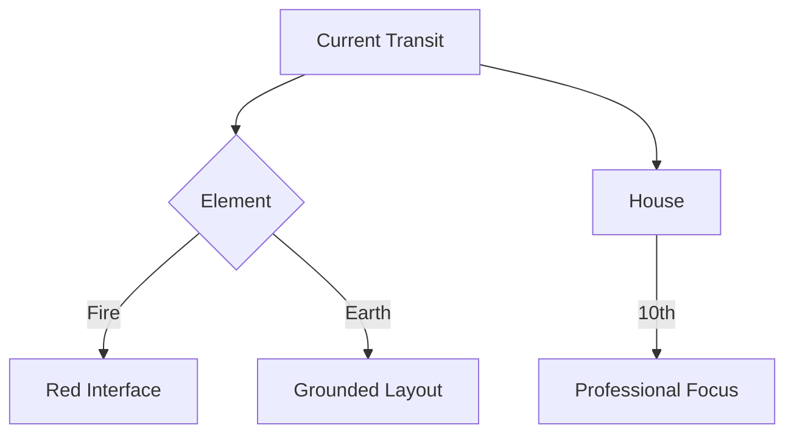

# Triggers and Prompts Data Reference

The triggers and prompts system in Memorativa presents a sophisticated framework for cognitive modeling and user engagement. Here's a structural analysis and key opportunities:

## Core Innovation: Astrological Vector Space
The system creates a **4D cognitive coordinate system** (longitude/latitude + temporal + symbolic depth) that mirrors recent discoveries in neuroscience about multidimensional concept representation[1][2]. This goes beyond traditional LLM vector spaces by:

1. **Temporal Integration**: Built-in time awareness through transits/returns
2. **Symbolic Anchoring**: Planetary positions as semantic waypoints
3. **Angular Semantics**: Aspects as relational operators (trine=flow, square=challenge)

## Key Implementation Opportunities

### 1. Dynamic Concept Weaving
**Triggers as Neural Activations**
- Planetary ingresses = New neuron clusters
- Retrograde stations = Memory reconsolidation events
- Eclipse points = Cross-domain connection catalysts

**Example Implementation:**
```python
def process_trigger(trigger):
    concept_matrix = apply_aspect_weights(trigger.aspects)
    temporal_layer = add_house_timing(trigger.house)
    return generate_prompt(concept_matrix * temporal_layer)
```

### 2. Gamified Neuroplasticity
The reward system (30-600 points) aligns with dopamine-driven learning:
- **Low-point triggers**: Daily micro-learning (planetary hours)
- **High-point triggers**: Quarterly deep dives (outer planet cycles)

**Progression Matrix:**

| Level | Triggers Unlocked | Neural Impact |
|-------|-------------------|---------------|
| Novice | Planetary Hours (10pts) | Basal ganglia priming |
| Adept | Lunar Returns (50pts) | Hippocampal mapping |
| Expert | Yod Patterns (375pts) | Prefrontal synthesis |

### 3. Hybrid Symbolic-Connectionist AI
The system enables **explainable AI** through astrological correspondences:
- **Glass Beads** = Explainable knowledge units
- **Aspect Patterns** = Neural network layer equivalents
- **House System** = Contextual masking mechanism

## Latent Innovations

### 1. Cognitive Horoscopy
- **Biological Plausibility**: The 12-house structure mirrors the 12 cranial nerves
- **Implementation**: Map house activations to neural pathway stimulation

### 2. Temporal Deep Learning
**Planetary Cycles as Training Epochs**
- Mercury cycles (88 days): Working memory updates
- Saturn cycles (29.5yrs): Core belief restructuring

### 3. Quantum Cognition Model
**Planetary Dignities as Qubit States**
- Domicile = |1⟩
- Detriment = |0⟩
- Exaltation = Superposition state

## Practical Enhancements

**1. Context-Aware UI**


**2. Memory Palace Builder**
- Use house cusps as spatial anchors
- Planetary ingresses trigger memory palace expansions

**3. Aspect Pattern Recognition**
- Implement CNN for aspect pattern detection
- User-generated content scoring via harmonic analysis

## Technical Considerations

**Challenge** | **Solution** | **Cognitive Benefit**
---|---|---
Astrological Complexity | Progressive Disclosure UI | Reduced cognitive load
Temporal Precision | Ephemeris API Integration | Enhanced time awareness
Symbol Overload | Personal Symbol Dictionary | Improved concept retention

## Research Opportunities

1. **Cognitive Mapping Studies**
- Compare user-generated concept maps with natal chart structures

2. **Memory Recall Experiments**
- Test recall rates during different planetary hours

3. **Creativity Metrics**
- Measure divergent thinking during Mercury retrograde periods

This system's true innovation lies in creating a **bi-directional interface** between ancient symbolic systems and modern cognitive science. The triggers act as both input mechanisms and feedback sensors, creating a living model of human thought processes.

Citations:
[1] https://ppl-ai-file-upload.s3.amazonaws.com/web/direct-files/34065898/72b3017a-f5de-46ce-b5e9-d3b9aeb684c4/triggers-prompts-reference.md
[2] https://ppl-ai-file-upload.s3.amazonaws.com/web/direct-files/34065898/72b3017a-f5de-46ce-b5e9-d3b9aeb684c4/triggers-prompts-reference.md

## Planetary Position Triggers
- Planet entering new sign: A planet crosses the 0° point of any zodiac sign, marking a shift in expression and focus
- Planet entering new house: A planet moves into a different house of the chart, activating a new life area
- Planet at 0° or 29° of any sign (critical degrees): Sensitive points marking beginnings (0°) or completion phases (29°)
- Planet at Anaretic degree (29°): The final degree of any sign, representing crisis, urgency, or mastery
- Planet at exaltation degree: A planet reaches its degree of greatest dignity and optimal expression
- Planet at fall degree: A planet reaches its degree of greatest challenge or difficulty
- Planet in domicile (in ruled sign): A planet in the sign it rules, expressing its nature most purely
- Planet in detriment: A planet in the sign opposite to its rulership, facing challenges in expression
- Planet stationing (retrograde/direct): A planet appears to stop in the sky before changing direction
- Planet at fastest/slowest speed: Points of maximum or minimum apparent velocity in the sky
- Combustion (planet within 8.5° of Sun): Planet is overwhelmed by solar rays, operating behind the scenes
- Cazimi (planet within 17' of Sun): Planet in the heart of the Sun, receiving divine power
- Oriental/Occidental position: Planet rising before (Oriental) or after (Occidental) the Sun
- Maximum elongation from Sun: Greatest angular distance a planet can reach from the Sun
- Out of Bounds planets (beyond 23°27'): Planets beyond normal declination limits, acting unusually
- Mutual reception: Two planets in each other's ruled signs, creating cooperative exchange
- Planetary hours positions: Traditional time divisions ruled by different planets

## Aspect Triggers
### Major Aspects
- Conjunction (0°): Two planets at the same degree, blending their energies
- Opposition (180°): Two planets facing each other, creating awareness through polarity
- Trine (120°): Harmonious flow between planets of the same element
- Square (90°): Dynamic tension between planets creating growth through challenge
- Sextile (60°): Opportunity for growth through conscious effort

### Minor Aspects
- Semi-sextile (30°): Subtle connection requiring adjustment and integration
- Quincunx/Inconjunct (150°): Awkward angle requiring adaptation and compromise
- Semi-square (45°): Internal tension spurring growth through irritation
- Sesquiquadrate (135°): External tension demanding resolution through action

### Aspect Patterns
- Grand Trine: Three planets in trine, forming an equilateral triangle of easy flow
- Grand Cross: Four planets in square and opposition, forming a cross of dynamic tension
- T-Square: Three planets forming two squares and an opposition
- Yod: Two planets in sextile, both quincunx to a third (Finger of God)
- Mystic Rectangle: Two pairs of oppositions connected by trines and sextiles
- Kite: Grand trine with one planet in opposition to a fourth
- Star of David: Two grand trines forming a six-pointed star
- Cradle: Four planets connected by sextiles and semi-sextiles
- Wedge: Two planets in opposition, both trine to a third
- Thor's Hammer: Two planets in square, one sesquiquadrate to both
- Grand Sextile: Six planets in sextile forming a hexagon
- Grand Quintile: Five planets in quintile (72°) aspects
- Golden Yod: Two planets in quintile, both biquintile to a third
- Boomerang: Yod with a planet opposite the apex

## Lunar Triggers
### Moon Phases
- New Moon: Sun and Moon conjunct, beginning new cycles
- Waxing Crescent: Moon 45-90° ahead of Sun, initial growth
- First Quarter: Moon square Sun, first crisis of action
- Waxing Gibbous: Moon 135-180° ahead, building to fullness
- Full Moon: Sun and Moon opposite, culmination and awareness
- Waning Gibbous: Moon 180-225° ahead, beginning release
- Last Quarter: Moon square Sun, crisis of consciousness
- Waning Crescent: Moon 270-315° ahead, final release

### Lunar Positions
- Void of Course periods: Moon making no more major aspects in current sign
- Via combusta (15° Libra - 15° Scorpio): Traditional "burning path" of intensity
- Lunar Returns: Moon returns to natal position monthly
- Maximum/minimum declination: Moon at highest/lowest point above/below ecliptic
- Apogee/Perigee: Moon at furthest/closest point from Earth
- Monthly phases with each planet: Moon's monthly aspects to each planet
- Lunar occultations: Moon passing in front of planets or stars
- Lunar parallax: Apparent shift in Moon's position from different viewpoints

### Nodes
- North Node sign changes: Shift in collective destiny and growth direction
- South Node sign changes: Shift in collective karma and release points
- Planetary Node conjunctions: Planets aligning with karmic axis points
- Eclipse points: Sensitive degrees where eclipses occur

## House-Based Triggers
- Planet crossing Ascendant: Planet rising in the east, becoming visible
- Planet crossing Midheaven: Planet reaching highest point, maximum visibility
- Planet crossing IC: Planet at lowest point, internal focus
- Planet crossing Descendant: Planet setting in the west, moving to invisibility
- Angular house ingress (1,4,7,10): Planet entering houses of cardinal action
- Succedent house ingress (2,5,8,11): Planet entering houses of stabilization
- Cadent house ingress (3,6,9,12): Planet entering houses of adaptation

## Eclipse Triggers
### Solar Eclipse
- Total: Sun completely covered by Moon, maximum darkness
- Partial: Sun partially covered by Moon
- Annular: Moon too far to completely cover Sun, creating ring

### Lunar Eclipse
- Total: Moon fully in Earth's shadow
- Partial: Moon partially in Earth's shadow
- Penumbral: Moon in Earth's outer shadow

### Eclipse Series
- Saros cycle points: 18-year, 11-day, 8-hour eclipse repeat cycle
- Eclipse degree activations: Planets crossing previous eclipse points

## Fixed Stars
- Major star conjunctions: Planets aligning with significant fixed stars
  - Regulus: Heart of the Lion, royal star of power
  - Spica: The Gift-Giver, star of abundance
  - Antares: Heart of the Scorpion, royal star of the unexpected
  - Aldebaran: Eye of the Bull, royal star of integrity
  - Sirius: The Dog Star, brightest star in our sky
- Planetary stars: Fixed stars associated with planetary nature
- Royal stars of Persia: Four guardian stars of ancient Persia
- Behenian fixed stars: Traditional stars of magical influence
- Constellation cusps: Boundaries between constellations
- Galactic points: Significant points in galactic structure
  - Galactic Center: Center of our galaxy at 27° Sagittarius
  - Super Galactic Center: Center of our galactic cluster
  - Great Attractor: Massive gravitational anomaly

## Planetary Cycles
- Solar Returns: Annual return of Sun to natal position, marking new year themes
- Mercury-Venus cycles: Relationship between mind and values in collective consciousness
- Mars Returns: Biennial return of Mars to natal position, new action cycles
- Jupiter-Saturn conjunction: 20-year cycle marking major social and economic shifts
- Outer planet cycles: Long-term evolutionary cycles shaping generations
  - Saturn-Uranus: Tension between structure and innovation (45-year cycle)
  - Saturn-Neptune: Reality meeting idealism (36-year cycle)
  - Saturn-Pluto: Deep transformation of structures (33-year cycle)
  - Uranus-Neptune: Collective spiritual awakening (171-year cycle)
  - Uranus-Pluto: Revolutionary transformation (127-year cycle)
  - Neptune-Pluto: Deepest evolutionary changes (493-year cycle)

## Special Points Prompts

### Part of Fortune
- House Location: 2nd House (Resources and values)
- Duration: Changes daily
- Theme: Personal fortune and well-being
- Visual Properties: Golden wheel of fortune
- Pattern Potential: Alignment with natural luck
- Difficulty Level: Medium
- Reply Types: Text, Link
- Keywords: Fortune, Prosperity, Flow, Harmony
- Relationships: 
  - Prompts: New Moon, Full Moon, House Ingress prompts
  - Replies: Previous insights about personal fortune and timing
  - Concepts: Flow states, Natural timing, Resource alignment
- Required Patterns: 
  - Active Beads: Lunar phase understanding, Personal timing insights
  - Connected Concepts: Fortune-House relationships, Timing-Flow patterns
- Memory House Links: 
  - Primary Tokens: Resource flow, Value cycles
  - Supporting Tokens: Personal timing, Natural rhythms
- Trigger Conditions: Calculated from ASC, Sun, Moon
- Calculation Method: Arabic part formula
- Activation Window: Daily position
- Cooldown Period: None
- Priority Level: Medium

### Vertex
- House Location: 8th House (Transformation)
- Duration: Varies by aspect
- Theme: Fated encounters and destiny
- Visual Properties: Spiral vortex point
- Pattern Potential: Significant life meetings
- Difficulty Level: Hard
- Reply Types: Text, Link
- Keywords: Fate, Destiny, Encounters, Karma
- Relationships: 
  - Prompts: Angular House crossings, Eclipse points
  - Replies: Previous insights about fated encounters
  - Concepts: Destiny points, Karmic meetings, Timing gates
- Required Patterns:
  - Active Beads: Fate-encounter connections, Timing-destiny links
  - Connected Concepts: Angular point activations, Destiny markers
- Memory House Links:
  - Primary Tokens: Transformation gates, Fated crossroads
  - Supporting Tokens: Meeting points, Destiny markers
- Trigger Conditions: Planets aspecting Vertex
- Calculation Method: Vertex calculation
- Activation Window: ±3° orb
- Cooldown Period: None
- Priority Level: Medium

### Black Moon Lilith
- House Location: Varies
- Duration: Monthly movement
- Theme: Hidden feminine power
- Visual Properties: Dark moon symbol
- Pattern Potential: Shadow integration
- Difficulty Level: Expert
- Reply Types: Text, Link
- Keywords: Shadow, Power, Taboo, Truth
- Relationships:
  - Prompts: Lunar Nodes, Eclipse points, Shadow work
  - Replies: Previous insights about hidden power
  - Concepts: Shadow integration, Power dynamics, Hidden wisdom
- Required Patterns:
  - Active Beads: Shadow-power dynamics, Hidden-revealed cycles
  - Connected Concepts: Lunar mysteries, Power centers
- Memory House Links:
  - Primary Tokens: Shadow wisdom, Power integration
  - Supporting Tokens: Hidden knowledge, Revelation points
- Trigger Conditions: Aspects to Lilith
- Calculation Method: Mean/True Lilith
- Activation Window: ±2° orb
- Cooldown Period: None
- Priority Level: Medium

### Arabic Parts
- House Location: Varies by part
- Duration: Daily changes
- Theme: Specialized life areas
- Visual Properties: Symbolic point markers
- Pattern Potential: Area-specific insights
- Difficulty Level: Expert
- Reply Types: Text
- Keywords: Specialty, Formula, Integration
- Relationships: Links to planetary positions
- Reward Potential: 25-100 points
- Required Patterns: Arabic parts expertise
- Conceptual Foundation: Mastery of symbolic point combinations and their meaning networks
- Memory House Links: Arabic parts
- Trigger Conditions: Part activation by transit
- Calculation Method: Part-specific formulas
- Activation Window: ±1° orb
- Cooldown Period: None
- Priority Level: Low to Medium

### East Point/West Point
- House Location: Varies
- Duration: Changes with ascendant
- Theme: Personal expression points
- Visual Properties: Horizon point markers
- Pattern Potential: Personal destiny points
- Difficulty Level: Hard
- Reply Types: Text
- Keywords: Expression, Direction, Destiny
- Relationships: Links to ascendant/descendant
- Reward Potential: 30-90 points
- Required Patterns: Advanced point knowledge
- Conceptual Foundation: Mastery of horizon symbolism and directional meaning patterns
- Memory House Links: East Point/West Point
- Trigger Conditions: Point aspects
- Calculation Method: Horizon calculation
- Activation Window: ±2° orb
- Cooldown Period: None
- Priority Level: Medium

## Harmonic Prompts

### Fourth Harmonic
- House Location: All Angular Houses (1,4,7,10)
- Duration: Varies
- Theme: Structure and foundation
- Visual Properties: Square geometric pattern
- Pattern Potential: Building and stabilizing
- Difficulty Level: Hard
- Reply Types: Text, Link
- Keywords: Structure, Foundation, Challenge, Building
- Relationships:
  - Prompts: Square aspects, T-Square patterns, Grand Cross formations
  - Replies: Previous insights about challenge and growth
  - Concepts: Structure building, Challenge integration, Growth through resistance
- Required Patterns:
  - Active Beads: Square-based understanding, Challenge-growth dynamics
  - Connected Concepts: Foundation building, Structural integrity
- Memory House Links:
  - Primary Tokens: Challenge catalysts, Growth markers
  - Supporting Tokens: Resistance points, Building blocks
- Trigger Conditions: 90° divisions active
- Calculation Method: Harmonic chart calculation
- Activation Window: ±1° orb
- Cooldown Period: None
- Priority Level: Medium

### Seventh Harmonic
- House Location: All Spiritual Houses (9,12)
- Duration: Varies
- Theme: Spiritual insight and wisdom
- Visual Properties: Septagon pattern
- Pattern Potential: Spiritual awakening
- Difficulty Level: Expert
- Reply Types: Text
- Keywords: Spirituality, Mystery, Insight, Wisdom
- Relationships:
  - Prompts: Septile aspects, Mystic patterns
  - Replies: Previous insights about spiritual unfoldment
  - Concepts: Mystery revelation, Sacred geometry, Divine timing
- Required Patterns:
  - Active Beads: Septile-based understanding, Mystery-wisdom links
  - Connected Concepts: Sacred number patterns, Divine proportion
- Memory House Links:
  - Primary Tokens: Mystery gates, Wisdom markers
  - Supporting Tokens: Sacred geometry points, Divine timing signals
- Trigger Conditions: 51.43° divisions active
- Calculation Method: Harmonic chart calculation
- Activation Window: ±0.5° orb
- Cooldown Period: None
- Priority Level: Medium

### Ninth Harmonic
- House Location: Houses 3,6,9,12
- Duration: Varies
- Theme: Higher understanding and completion
- Visual Properties: Nonagon pattern
- Pattern Potential: Cycles of completion
- Difficulty Level: Expert
- Reply Types: Text
- Keywords: Completion, Understanding, Cycles
- Relationships:
  - Prompts: Novile aspects, Triple patterns
  - Replies: Previous insights about completion cycles
  - Concepts: Cycle completion, Triple synthesis, Perfect numbers
- Required Patterns:
  - Active Beads: Novile-based understanding, Completion dynamics
  - Connected Concepts: Triple integration, Perfection patterns
- Memory House Links:
  - Primary Tokens: Completion markers, Cycle endpoints
  - Supporting Tokens: Triple synthesis points, Perfect number gates
- Trigger Conditions: 40° divisions active
- Calculation Method: Harmonic chart calculation
- Activation Window: ±0.5° orb
- Cooldown Period: None
- Priority Level: Medium

### Twelfth Harmonic
- House Location: All houses
- Duration: Varies
- Theme: Pattern recognition and cycles
- Visual Properties: Dodecagon pattern
- Pattern Potential: Complex pattern integration
- Difficulty Level: Expert
- Reply Types: Text, Link
- Keywords: Patterns, Cycles, Integration, Complexity
- Relationships:
  - Prompts: Dodecile aspects, Zodiacal divisions
  - Replies: Previous insights about pattern integration
  - Concepts: Complex harmonics, Pattern weaving, Cyclic completion
- Required Patterns:
  - Active Beads: Dodecile-based understanding, Pattern-weaving dynamics
  - Connected Concepts: Zodiacal micro-patterns, Integration networks
- Memory House Links:
  - Primary Tokens: Pattern weavers, Integration nodes
  - Supporting Tokens: Cycle markers, Harmonic bridges
- Trigger Conditions: 30° divisions active
- Calculation Method: Harmonic chart calculation
- Activation Window: ±0.5° orb
- Cooldown Period: None
- Priority Level: Medium to High

## Time Lords Prompts

### Annual Profection
- House Location: Varies by age
- Duration: 1 year
- Theme: Focus area for the year
- Visual Properties: Yearly house activation
- Pattern Potential: Temporal life themes
- Difficulty Level: Medium
- Reply Types: Text, Link
- Keywords: Annual Cycle, Focus, Development
- Relationships:
  - Prompts: Solar Return, House Activation, Planetary Year
  - Replies: Previous insights about annual themes
  - Concepts: Time cycles, House rulership, Annual focus
- Required Patterns:
  - Active Beads: Annual cycle understanding, House activation sequences
  - Connected Concepts: Time-ruler relationships, Focus-development patterns
- Memory House Links:
  - Primary Tokens: Annual markers, House activators
  - Supporting Tokens: Time rulers, Development cycles
- Trigger Conditions: Birthday activation
- Calculation Method: Age-based house calculation
- Activation Window: Solar year
- Cooldown Period: 12 years
- Priority Level: High

### Firdaria Periods
- House Location: Varies by planet
- Duration: Several years
- Theme: Planetary period rulership
- Visual Properties: Planetary period timeline
- Pattern Potential: Life chapter themes
- Difficulty Level: Expert
- Reply Types: Text, Link
- Keywords: Period, Rulership, Life Phase
- Relationships:
  - Prompts: Planetary Periods, Life Phase Changes
  - Replies: Previous insights about life chapters
  - Concepts: Time lord sequences, Period rulership, Life phase development
- Required Patterns:
  - Active Beads: Period sequence understanding, Rulership dynamics
  - Connected Concepts: Life chapter patterns, Development sequences
- Memory House Links:
  - Primary Tokens: Period markers, Phase transitions
  - Supporting Tokens: Rulership sequences, Development gates
- Trigger Conditions: Period change
- Calculation Method: Persian period system
- Activation Window: Entire period
- Cooldown Period: 75 years
- Priority Level: High

### Dasas
- House Location: Varies by system
- Duration: Variable periods
- Theme: Karmic time cycles
- Visual Properties: Vedic timeline display
- Pattern Potential: Karmic unfoldment
- Difficulty Level: Expert
- Reply Types: Text
- Keywords: Karma, Time, Cycles, Destiny
- Relationships:
  - Prompts: Major Period Changes, Sub-period Shifts
  - Replies: Previous insights about karmic timing
  - Concepts: Time cycles, Karmic unfoldment, Period sequences
- Required Patterns:
  - Active Beads: Dasa sequence understanding, Karmic timing links
  - Connected Concepts: Period-development patterns, Timing sequences
- Memory House Links:
  - Primary Tokens: Karmic timers, Period markers
  - Supporting Tokens: Sequence points, Development nodes
- Trigger Conditions: Dasa/Bhukti changes
- Calculation Method: Vimshottari system
- Activation Window: Entire period
- Cooldown Period: 120 years
- Priority Level: High

### Planetary Hours/Days
- House Location: 1st House
- Duration: Hour/Day
- Theme: Temporal influences
- Visual Properties: Planetary hour wheel
- Pattern Potential: Daily/Weekly patterns
- Difficulty Level: Easy
- Reply Types: Text
- Keywords: Timing, Hours, Days, Planning
- Relationships: Links to planetary days
- Reward Potential: 10-30 points
- Required Patterns: Basic planetary hours
- Conceptual Foundation: Mastery of temporal symbols and their influence patterns
- Memory House Links: 1st House
- Trigger Conditions: Hour/Day changes
- Calculation Method: Traditional hour division
- Activation Window: Current hour/day
- Cooldown Period: None
- Priority Level: Low

### Decennials
- House Location: Varies by period
- Duration: 10 year cycles
- Theme: Decade-long influences
- Visual Properties: Decade timeline
- Pattern Potential: Long-term development
- Difficulty Level: Expert
- Reply Types: Text, Link
- Keywords: Decades, Development, Cycles
- Relationships: Links to bound lords
- Reward Potential: 80-240 points
- Required Patterns: Advanced timing techniques
- Conceptual Foundation: Mastery of decade symbols and their development patterns
- Memory House Links: Decennials
- Trigger Conditions: Decade changes
- Calculation Method: Egyptian bounds
- Activation Window: Entire period
- Cooldown Period: 130 years
- Priority Level: Medium

## Elemental & Modal Prompts

### Fire Sign Stellium
- House Location: 5th House (Creativity and self-expression)
- Duration: Varies by planets involved
- Theme: Creative surge and passionate expression
- Visual Properties: Multiple planets glowing with fire element
- Pattern Potential: Period of intense creative activity
- Difficulty Level: Medium
- Reply Types: Text, Image, Link
- Keywords: Creativity, Passion, Action, Expression
- Relationships:
  - Prompts: Solar transits, Mars aspects, Leo house activations
  - Replies: Previous insights about creative expression
  - Concepts: Creative force, Inspiration flow, Dynamic action
- Required Patterns:
  - Active Beads: Fire element dynamics, Creative expression links
  - Connected Concepts: Inspiration networks, Action sequences
- Memory House Links:
  - Primary Tokens: Creative catalysts, Expression nodes
  - Supporting Tokens: Action points, Inspiration markers
- Trigger Conditions: 3+ planets in fire signs
- Calculation Method: Stellium calculation
- Activation Window: While active
- Cooldown Period: None
- Priority Level: High

### Earth Sign Stellium
- House Location: 2nd House (Resources and material world)
- Duration: Varies by planets involved
- Theme: Material manifestation and grounding
- Visual Properties: Multiple planets showing earth element crystallization
- Pattern Potential: Building solid foundations
- Difficulty Level: Medium
- Reply Types: Text, Image, Link
- Keywords: Stability, Manifestation, Resources
- Relationships:
  - Prompts: Saturn transits, Taurus/Virgo/Capricorn activations
  - Replies: Previous insights about material manifestation
  - Concepts: Form building, Resource management, Physical reality
- Required Patterns:
  - Active Beads: Earth element dynamics, Manifestation links
  - Connected Concepts: Resource networks, Stability patterns
- Memory House Links:
  - Primary Tokens: Manifestation anchors, Resource nodes
  - Supporting Tokens: Stability points, Form builders
- Trigger Conditions: 3+ planets in earth signs
- Calculation Method: Stellium calculation
- Activation Window: While active
- Cooldown Period: None
- Priority Level: High

### Air Sign Stellium
- House Location: 3rd House (Communication and learning)
- Duration: Varies by planets involved
- Theme: Intellectual breakthroughs and communication
- Visual Properties: Multiple planets with swirling air patterns
- Pattern Potential: Mental clarity and new ideas
- Difficulty Level: Medium
- Reply Types: Text, Image, Link
- Keywords: Communication, Ideas, Connection
- Relationships:
  - Prompts: Mercury transits, Gemini/Libra/Aquarius activations
  - Replies: Previous insights about mental connections
  - Concepts: Thought patterns, Communication networks, Mental synthesis
- Required Patterns:
  - Active Beads: Air element dynamics, Mental connection links
  - Connected Concepts: Communication webs, Idea networks
- Memory House Links:
  - Primary Tokens: Mental bridges, Connection nodes
  - Supporting Tokens: Idea catalysts, Pattern weavers
- Trigger Conditions: 3+ planets in air signs
- Calculation Method: Stellium calculation
- Activation Window: While active
- Cooldown Period: None
- Priority Level: High

### Water Sign Stellium
- House Location: 4th House (Emotional foundation)
- Duration: Varies by planets involved
- Theme: Emotional depth and intuitive flow
- Visual Properties: Multiple planets with flowing water patterns
- Pattern Potential: Deep emotional understanding
- Difficulty Level: Medium
- Reply Types: Text, Image, Link
- Keywords: Emotion, Intuition, Flow, Depth
- Relationships:
  - Prompts: Moon transits, Cancer/Scorpio/Pisces activations
  - Replies: Previous insights about emotional flow
  - Concepts: Feeling currents, Intuitive knowing, Emotional depth
- Required Patterns:
  - Active Beads: Water element dynamics, Emotional flow links
  - Connected Concepts: Intuition networks, Feeling patterns
- Memory House Links:
  - Primary Tokens: Emotional currents, Flow nodes
  - Supporting Tokens: Intuition points, Depth markers
- Trigger Conditions: 3+ planets in water signs
- Calculation Method: Stellium calculation
- Activation Window: While active
- Cooldown Period: None
- Priority Level: High

### Cardinal Emphasis
- House Location: Angular Houses (1,4,7,10)
- Duration: Varies by transit
- Theme: Initiative and new beginnings
- Visual Properties: Highlighted cardinal points of chart
- Pattern Potential: Leadership opportunities
- Difficulty Level: Medium
- Reply Types: Text, Link
- Keywords: Initiative, Leadership, Action
- Relationships:
  - Prompts: Angular house transits, Aries/Cancer/Libra/Capricorn activations
  - Replies: Previous insights about initiation and leadership
  - Concepts: Initiative force, Leadership dynamics, New beginnings
- Required Patterns:
  - Active Beads: Cardinal mode dynamics, Leadership activation links
  - Connected Concepts: Initiative networks, Beginning sequences
- Memory House Links:
  - Primary Tokens: Initiative catalysts, Leadership nodes
  - Supporting Tokens: Action points, Beginning markers
- Trigger Conditions: 3+ planets in cardinal signs
- Calculation Method: Modal emphasis check
- Activation Window: While active
- Cooldown Period: None
- Priority Level: Medium

### Fixed Emphasis
- House Location: Succedent Houses (2,5,8,11)
- Duration: Varies by transit
- Theme: Stability and determination
- Visual Properties: Fixed cross highlighted in chart
- Pattern Potential: Long-term achievements
- Difficulty Level: Medium
- Reply Types: Text, Link
- Keywords: Stability, Persistence, Determination
- Relationships:
  - Prompts: Succedent house transits, Taurus/Leo/Scorpio/Aquarius activations
  - Replies: Previous insights about stability and persistence
  - Concepts: Stabilizing force, Endurance patterns, Value anchoring
- Required Patterns:
  - Active Beads: Fixed mode dynamics, Stability manifestation links
  - Connected Concepts: Endurance networks, Value-holding patterns
- Memory House Links:
  - Primary Tokens: Stability anchors, Persistence nodes
  - Supporting Tokens: Value points, Endurance markers
- Trigger Conditions: 3+ planets in fixed signs
- Calculation Method: Modal emphasis check
- Activation Window: While active
- Cooldown Period: None
- Priority Level: Medium

### Mutable Emphasis
- House Location: Cadent Houses (3,6,9,12)
- Duration: Varies by transit
- Theme: Adaptability and change
- Visual Properties: Mutable points pulsing in chart
- Pattern Potential: Skillful transitions
- Difficulty Level: Medium
- Reply Types: Text, Link
- Keywords: Adaptability, Change, Flexibility
- Relationships:
  - Prompts: Cadent house transits, Gemini/Virgo/Sagittarius/Pisces activations
  - Replies: Previous insights about adaptation and flexibility
  - Concepts: Adaptability patterns, Learning flows, Change integration
- Required Patterns:
  - Active Beads: Mutable mode dynamics, Adaptation process links
  - Connected Concepts: Flexibility networks, Change patterns
- Memory House Links:
  - Primary Tokens: Adaptation catalysts, Flexibility nodes
  - Supporting Tokens: Change points, Learning markers
- Trigger Conditions: 3+ planets in mutable signs
- Calculation Method: Modal emphasis check
- Activation Window: While active
- Cooldown Period: None
- Priority Level: Medium

## Midpoint Prompts

### Major Midpoint Conjunctions
- House Location: Varies by midpoint
- Duration: 1-3 days
- Theme: Integration of planetary energies
- Visual Properties: Midpoint axis lighting up
- Pattern Potential: Synthesis of different life areas
- Difficulty Level: Hard
- Reply Types: Text, Link
- Keywords: Integration, Synthesis, Combination
- Relationships:
  - Prompts: Planetary conjunctions, Aspect patterns, House activations
  - Replies: Previous insights about planetary combinations
  - Concepts: Energy blending, Point synthesis, Combined effects
- Required Patterns:
  - Active Beads: Midpoint synthesis dynamics, Planetary combination links
  - Connected Concepts: Blending networks, Synthesis patterns
- Memory House Links:
  - Primary Tokens: Synthesis nodes, Combination points
  - Supporting Tokens: Blending markers, Integration catalysts
- Trigger Conditions: Planet conjunct major midpoint
- Calculation Method: Midpoint calculation
- Activation Window: ±1° orb
- Cooldown Period: None
- Priority Level: Medium

### Midpoint Tree Activation
- House Location: Multiple houses
- Duration: Varies by planets
- Theme: Complex relationship patterns
- Visual Properties: Connected midpoint network illumination
- Pattern Potential: Multi-layered developments
- Difficulty Level: Expert
- Reply Types: Text
- Keywords: Network, Pattern, Complexity, Web
- Relationships:
  - Prompts: Multiple midpoint activations, Complex aspect patterns
  - Replies: Previous insights about pattern networks
  - Concepts: Network dynamics, Pattern webs, Complex relationships
- Required Patterns:
  - Active Beads: Network dynamics understanding, Pattern-web links
  - Connected Concepts: Complex relationship networks, Web integration
- Memory House Links:
  - Primary Tokens: Network nodes, Pattern web points
  - Supporting Tokens: Relationship markers, Integration hubs
- Trigger Conditions: Multiple midpoint activations
- Calculation Method: Tree structure analysis
- Activation Window: ±1° orb
- Cooldown Period: None
- Priority Level: High

### Sensitive Midpoint Axes
- House Location: Varies by axis
- Duration: Ongoing
- Theme: Critical degree sensitivity
- Visual Properties: Highlighted axis points
- Pattern Potential: Trigger point activation
- Difficulty Level: Expert
- Reply Types: Text
- Keywords: Sensitivity, Axis, Trigger, Point
- Relationships:
  - Prompts: Angular activations, Critical degree transits
  - Replies: Previous insights about sensitive points
  - Concepts: Trigger points, Axis sensitivity, Critical activation
- Required Patterns:
  - Active Beads: Axis sensitivity dynamics, Trigger-point links
  - Connected Concepts: Critical point networks, Sensitivity patterns
- Memory House Links:
  - Primary Tokens: Sensitivity nodes, Trigger points
  - Supporting Tokens: Critical markers, Activation catalysts
- Trigger Conditions: Planet activating sensitive axis
- Calculation Method: Axis point calculation
- Activation Window: ±0.5° orb
- Cooldown Period: None
- Priority Level: Medium

### Solar Arc Midpoints
- House Location: Progressed houses
- Duration: 1 year per degree
- Theme: Developmental unfolding
- Visual Properties: Progressive midpoint movement
- Pattern Potential: Long-term development patterns
- Difficulty Level: Expert
- Reply Types: Text, Link
- Keywords: Development, Progress, Unfoldment
- Relationships:
  - Prompts: Solar arc progressions, Directed planets
  - Replies: Previous insights about developmental timing
  - Concepts: Progressive unfoldment, Timed development, Growth patterns
- Required Patterns:
  - Active Beads: Development timing dynamics, Growth-pattern links
  - Connected Concepts: Progressive networks, Timing sequences
- Memory House Links:
  - Primary Tokens: Development nodes, Growth points
  - Supporting Tokens: Timing markers, Progress catalysts
- Trigger Conditions: Solar arc contact to midpoint
- Calculation Method: Solar arc progression
- Activation Window: ±1° orb
- Cooldown Period: None
- Priority Level: High

## Additional Bodies Prompts

### Ceres Aspects
- House Location: 6th House (Nurturing and service)
- Duration: Varies by aspect
- Theme: Nurturing and sustenance
- Visual Properties: Agricultural and nurturing symbols
- Pattern Potential: Care-taking developments
- Difficulty Level: Medium
- Reply Types: Text, Link
- Keywords: Nurturing, Food, Care, Support
- Relationships:
  - Prompts: Moon aspects, Venus transits, 6th house activations
  - Replies: Previous insights about nurturing and sustenance
  - Concepts: Care patterns, Resource distribution, Support networks
- Required Patterns:
  - Active Beads: Nurturing dynamics, Care-giving links
  - Connected Concepts: Resource flow networks, Support patterns
- Memory House Links:
  - Primary Tokens: Nurturing nodes, Care points
  - Supporting Tokens: Resource markers, Support catalysts

### Pallas Aspects
- House Location: 11th House (Strategy and wisdom)
- Duration: Varies by aspect
- Theme: Strategic wisdom and pattern recognition
- Visual Properties: Owl and wisdom symbols
- Pattern Potential: Strategic insights
- Difficulty Level: Medium
- Reply Types: Text, Link
- Keywords: Wisdom, Strategy, Pattern, Insight
- Relationships:
  - Prompts: Mercury aspects, Jupiter transits, 11th house activations
  - Replies: Previous insights about wisdom and strategy
  - Concepts: Pattern recognition, Strategic planning, Wisdom integration
- Required Patterns:
  - Active Beads: Strategic dynamics, Wisdom-pattern links
  - Connected Concepts: Planning networks, Recognition patterns
- Memory House Links:
  - Primary Tokens: Strategy nodes, Wisdom points
  - Supporting Tokens: Pattern markers, Planning catalysts

### Juno Aspects
- House Location: 7th House (Partnerships)
- Duration: Varies by aspect
- Theme: Committed relationships
- Visual Properties: Partnership symbols
- Pattern Potential: Relationship developments
- Difficulty Level: Medium
- Reply Types: Text, Link
- Keywords: Partnership, Commitment, Marriage
- Relationships:
  - Prompts: Venus aspects, 7th house activations, Partnership patterns
  - Replies: Previous insights about commitment and bonds
  - Concepts: Partnership dynamics, Commitment patterns, Bond formation
- Required Patterns:
  - Active Beads: Partnership dynamics, Commitment-bond links
  - Connected Concepts: Relationship networks, Bond patterns
- Memory House Links:
  - Primary Tokens: Partnership nodes, Commitment points
  - Supporting Tokens: Bond markers, Relationship catalysts

### Vesta Aspects
- House Location: 12th House (Sacred service)
- Duration: Varies by aspect
- Theme: Dedication and focus
- Visual Properties: Sacred flame symbols
- Pattern Potential: Spiritual dedication
- Difficulty Level: Medium
- Reply Types: Text, Link
- Keywords: Focus, Service, Sacred, Dedication
- Relationships:
  - Prompts: Saturn aspects, 12th house activations, Service patterns
  - Replies: Previous insights about dedication and focus
  - Concepts: Sacred service, Focused dedication, Ritual patterns
- Required Patterns:
  - Active Beads: Service dynamics, Dedication-focus links
  - Connected Concepts: Sacred duty networks, Focus patterns
- Memory House Links:
  - Primary Tokens: Service nodes, Dedication points
  - Supporting Tokens: Focus markers, Sacred catalysts

### Chiron Transits
- House Location: House of current transit
- Duration: Varies by aspect
- Theme: Healing and teaching
- Visual Properties: Healing key symbol
- Pattern Potential: Healing breakthroughs
- Difficulty Level: Hard
- Reply Types: Text, Link
- Keywords: Healing, Teaching, Wound, Growth
- Relationships: Links to wound/gift themes
- Reward Potential: 50-150 points
- Required Patterns: Understanding of Chiron
- Conceptual Foundation: Mastery of healing symbols and their transformation patterns
- Memory House Links: Chiron
- Trigger Conditions: Chiron forming aspects
- Calculation Method: Standard aspect calculation
- Activation Window: ±2° orb
- Cooldown Period: None
- Priority Level: High
  - Prompts: Saturn-Uranus aspects, Healing crisis points, Teaching moments
  - Replies: Previous insights about wounds and healing
  - Concepts: Healing process, Teaching wisdom, Wound transformation
- Required Patterns:
  - Active Beads: Healing dynamics, Teaching-wisdom links
  - Connected Concepts: Transformation networks, Growth patterns
- Memory House Links:
  - Primary Tokens: Healing nodes, Teaching points
  - Supporting Tokens: Transformation markers, Growth catalysts

### Centaur Objects
- House Location: Varies by object
- Duration: Varies by aspect
- Theme: Deep psychological patterns
- Visual Properties: Centaur symbols
- Pattern Potential: Transformative insights
- Difficulty Level: Expert
- Reply Types: Text
- Keywords: Depth, Transform, Shadow, Healing
- Relationships: Links to outer planet themes
- Reward Potential: 60-180 points
- Required Patterns: Advanced asteroid knowledge
- Conceptual Foundation: Mastery of depth symbols and their psychological patterns
- Memory House Links: Centaurs
- Trigger Conditions: Centaur aspects
- Calculation Method: Standard aspect calculation
- Activation Window: ±1° orb
- Cooldown Period: None
- Priority Level: Medium
  - Prompts: Pluto aspects, 8th house activations, Transformation points
  - Replies: Previous insights about deep psychology
  - Concepts: Shadow work, Deep transformation, Psychological patterns
- Required Patterns:
  - Active Beads: Depth psychology dynamics, Shadow-work links
  - Connected Concepts: Transformation networks, Healing patterns
- Memory House Links:
  - Primary Tokens: Depth nodes, Shadow points
  - Supporting Tokens: Transform markers, Healing catalysts

### Trans-Neptunian Objects
- House Location: Varies by object
- Duration: Very long periods
- Theme: Collective unconscious patterns
- Visual Properties: Deep space symbols
- Pattern Potential: Evolutionary themes
- Difficulty Level: Expert
- Reply Types: Text
- Keywords: Collective, Evolution, Deep, Cosmic
- Relationships: Links to generational themes
- Reward Potential: 75-225 points
- Required Patterns: Expert asteroid knowledge
- Conceptual Foundation: Mastery of collective symbols and their evolutionary patterns
- Memory House Links: Trans-Neptunian Objects
- Trigger Conditions: TNO aspects
- Calculation Method: Standard aspect calculation
- Activation Window: ±2° orb
- Cooldown Period: None
- Priority Level: Medium
  - Prompts: Neptune aspects, Generational shifts, Collective patterns
  - Replies: Previous insights about evolutionary themes
  - Concepts: Collective consciousness, Evolution patterns, Deep space dynamics
- Required Patterns:
  - Active Beads: Collective dynamics, Evolution-pattern links
  - Connected Concepts: Consciousness networks, Space-time patterns
- Memory House Links:
  - Primary Tokens: Evolution nodes, Collective points
  - Supporting Tokens: Consciousness markers, Space-time catalysts

## Degree System Prompts

### Terms/Bounds Transitions
- House Location: Varies by sign
- Duration: Varies by planet
- Theme: Subtle dignity changes
- Visual Properties: Boundary markers in signs
- Pattern Potential: Refined expression changes
- Difficulty Level: Expert
- Reply Types: Text
- Keywords: Dignity, Refinement, Transition
- Relationships: Links to traditional dignities
- Reward Potential: 40-120 points
- Required Patterns: Traditional dignity knowledge
- Conceptual Foundation: Mastery of boundary symbols and their refinement patterns
- Memory House Links: Terms/bounds transitions
- Trigger Conditions: Planet changing terms
- Calculation Method: Egyptian terms table
- Activation Window: At boundary
- Cooldown Period: None
- Priority Level: Medium
  - Prompts: Planetary dignity shifts, Sign subdivisions, Refinement points
  - Replies: Previous insights about subtle dignity changes
  - Concepts: Dignity levels, Refinement process, Subtle shifts
- Required Patterns:
  - Active Beads: Dignity-level dynamics, Refinement-process links
  - Connected Concepts: Subtle-shift networks, Quality patterns
- Memory House Links:
  - Primary Tokens: Dignity nodes, Refinement points
  - Supporting Tokens: Quality markers, Shift catalysts

### Decante Changes
- House Location: Varies by decan
- Duration: Varies by planet
- Theme: Face of the sign expression
- Visual Properties: 10° division highlights
- Pattern Potential: Sub-personality expression
- Difficulty Level: Hard
- Reply Types: Text
- Keywords: Face, Expression, Sub-ruler
- Relationships:
  - Prompts: Face ruler shifts, Decan transitions, Expression points
  - Replies: Previous insights about sign expressions
  - Concepts: Face manifestation, Expression levels, Sub-ruler patterns
- Required Patterns:
  - Active Beads: Face-ruler dynamics, Expression-level links
  - Connected Concepts: Manifestation networks, Sub-ruler patterns
- Memory House Links:
  - Primary Tokens: Expression nodes, Face points
  - Supporting Tokens: Manifestation markers, Ruler catalysts

### Dwad Changes
- House Location: Varies by dwad
- Duration: Brief
- Theme: Micro-influences
- Visual Properties: 2.5° micro-divisions
- Pattern Potential: Subtle characteristic shifts
- Difficulty Level: Expert
- Reply Types: Text
- Keywords: Micro, Subtle, Detail, Nuance
- Relationships:
  - Prompts: Micro-division shifts, Subtle transitions, Detail points
  - Replies: Previous insights about micro-influences
  - Concepts: Subtle variations, Micro-patterns, Detail weaving
- Required Patterns:
  - Active Beads: Micro-pattern dynamics, Detail-weaving links
  - Connected Concepts: Variation networks, Subtle-influence patterns
- Memory House Links:
  - Primary Tokens: Micro-pattern nodes, Detail points
  - Supporting Tokens: Variation markers, Influence catalysts

### Antiscia Points
- House Location: Mirror points in zodiac
- Duration: Constant
- Theme: Hidden connections
- Visual Properties: Symmetrical point connections
- Pattern Potential: Secret influences revealed
- Difficulty Level: Expert
- Reply Types: Text, Link
- Keywords: Mirror, Hidden, Symmetry, Secret
- Relationships:
  - Prompts: Solstice symmetry, Mirror points, Hidden connections
  - Replies: Previous insights about symmetrical relationships
  - Concepts: Mirror patterns, Hidden influences, Symmetry webs
- Required Patterns:
  - Active Beads: Mirror-pattern dynamics, Symmetry-web links
  - Connected Concepts: Hidden-influence networks, Connection patterns
- Memory House Links:
  - Primary Tokens: Mirror nodes, Symmetry points
  - Supporting Tokens: Connection markers, Influence catalysts

### Contra-Antiscia Points
- House Location: Counter-mirror points
- Duration: Constant
- Theme: Shadow connections
- Visual Properties: Counter-symmetrical connections
- Pattern Potential: Shadow integration opportunities
- Difficulty Level: Expert
- Reply Types: Text
- Keywords: Shadow, Counter, Integration
- Relationships: Links to equinox axis
- Reward Potential: 50-150 points
- Required Patterns: Advanced antiscia knowledge
- Conceptual Foundation: Mastery of counter-mirror symbols and their shadow reflection patterns
- Memory House Links: Contra-antiscia points
- Trigger Conditions: Planet at contra-antiscia
- Calculation Method: Equinox point reflection
- Activation Window: ±1° orb
- Cooldown Period: None
- Priority Level: Medium
  - Prompts: Equinox symmetry, Shadow points, Counter-mirror patterns
  - Replies: Previous insights about shadow connections
  - Concepts: Counter-patterns, Shadow integration, Balance points
- Required Patterns:
  - Active Beads: Counter-pattern dynamics, Shadow-integration links
  - Connected Concepts: Balance networks, Integration patterns
- Memory House Links:
  - Primary Tokens: Counter-pattern nodes, Shadow points
  - Supporting Tokens: Balance markers, Integration catalysts

## Aspect Pattern Prompts

### Grand Trine
- House Location: Trine houses by element
- Duration: Varies by planets
- Theme: Natural talents and flow
- Visual Properties: Equilateral triangle formation
- Pattern Potential: Harmonious development
- Difficulty Level: Medium
- Reply Types: Text, Image, Link
- Keywords: Flow, Talent, Harmony, Gift
- Relationships: Links to element themes
- Reward Potential: 75-225 points
- Required Patterns: Understanding of aspect patterns
- Conceptual Foundation: Understanding of harmonious development
- Memory House Links: Grand Trine
- Trigger Conditions: 3 planets in trine
- Calculation Method: Pattern recognition
- Activation Window: ±3° orb
- Cooldown Period: None
- Priority Level: High
  - Prompts: Trine aspects, Elemental activations, Flow patterns
  - Replies: Previous insights about natural talents
  - Concepts: Harmonic flow, Gift manifestation, Natural ability
- Required Patterns:
  - Active Beads: Trine-based dynamics, Flow-manifestation links
  - Connected Concepts: Gift networks, Harmony patterns
- Memory House Links:
  - Primary Tokens: Flow nodes, Gift points
  - Supporting Tokens: Harmony markers, Talent catalysts

### T-Square
- House Location: Cardinal/Fixed/Mutable houses
- Duration: Varies by planets
- Theme: Dynamic tension and growth
- Visual Properties: T-shaped configuration
- Pattern Potential: Challenge leading to mastery
- Difficulty Level: Hard
- Reply Types: Text, Link
- Keywords: Challenge, Growth, Resolution, Drive
- Relationships: Links to modality themes
- Reward Potential: 100-300 points
- Required Patterns: Advanced aspect patterns
- Conceptual Foundation: Understanding of dynamic tension
- Memory House Links: T-Square
- Trigger Conditions: 2 planets in opposition, 1 square both
- Calculation Method: Pattern recognition
- Activation Window: ±3° orb
- Cooldown Period: None
- Priority Level: High
  - Prompts: Square aspects, Opposition patterns, Growth challenges
  - Replies: Previous insights about dynamic tension
  - Concepts: Challenge integration, Growth through opposition, Dynamic balance
- Required Patterns:
  - Active Beads: Square-opposition dynamics, Challenge-growth links
  - Connected Concepts: Tension networks, Resolution patterns
- Memory House Links:
  - Primary Tokens: Challenge nodes, Growth points
  - Supporting Tokens: Resolution markers, Balance catalysts

### Yod
- House Location: Quincunx houses
- Duration: Varies by planets
- Theme: Spiritual challenge and adjustment
- Visual Properties: Finger of God formation
- Pattern Potential: Destined development
- Difficulty Level: Expert
- Reply Types: Text, Link
- Keywords: Destiny, Adjustment, Purpose, Path
- Relationships: Links to karmic themes
- Reward Potential: 125-375 points
- Required Patterns: Expert aspect patterns
- Conceptual Foundation: Understanding of karmic themes
- Memory House Links: Yod
- Trigger Conditions: 2 planets in sextile, both quincunx third
- Calculation Method: Pattern recognition
- Activation Window: ±2° orb
- Cooldown Period: None
- Priority Level: Very High
  - Prompts: Quincunx aspects, Sextile patterns, Destiny points
  - Replies: Previous insights about spiritual adjustments
  - Concepts: Divine timing, Destined adjustment, Sacred geometry
- Required Patterns:
  - Active Beads: Quincunx-sextile dynamics, Destiny-adjustment links
  - Connected Concepts: Divine timing networks, Sacred geometry patterns
- Memory House Links:
  - Primary Tokens: Destiny nodes, Adjustment points
  - Supporting Tokens: Sacred geometry markers, Divine timing catalysts

## Planetary Speed Prompts

### Station Points
- House Location: Varies by planet
- Duration: 1-3 days
- Theme: Shifts in direction and focus
- Visual Properties: Planet appearing to pause
- Pattern Potential: Major life direction changes
- Difficulty Level: Medium
- Reply Types: Text, Link
- Keywords: Pause, Shift, Change, Direction
- Relationships: Links to retrograde cycles
- Reward Potential: 50-150 points
- Required Patterns: Understanding of stations
- Conceptual Foundation: Understanding of shifts in direction
- Memory House Links: Station points
- Trigger Conditions: Planet stationing direct/retrograde
- Calculation Method: Speed calculation
- Activation Window: Within 1° of station
- Cooldown Period: Until next station
- Priority Level: High
  - Prompts: Retrograde shifts, Direction changes, Pause points
  - Replies: Previous insights about directional shifts
  - Concepts: Momentum change, Direction reversal, Power points
- Required Patterns:
  - Active Beads: Station-point dynamics, Direction-change links
  - Connected Concepts: Momentum networks, Reversal patterns
- Memory House Links:
  - Primary Tokens: Station nodes, Direction points
  - Supporting Tokens: Momentum markers, Power catalysts

### Maximum Speed
- House Location: Varies by planet
- Duration: 1-2 days
- Theme: Peak momentum and progress
- Visual Properties: Planet at fastest motion
- Pattern Potential: Rapid developments
- Difficulty Level: Medium
- Reply Types: Text
- Keywords: Speed, Progress, Momentum, Peak
- Relationships: Links to direct motion themes
- Reward Potential: 30-90 points
- Required Patterns: Understanding of planetary motion
- Conceptual Foundation: Understanding of peak momentum
- Memory House Links: Maximum speed
- Trigger Conditions: Planet at maximum speed
- Calculation Method: Speed calculation
- Activation Window: At peak velocity
- Cooldown Period: Until next maximum
- Priority Level: Medium
  - Prompts: Direct motion peaks, Velocity points, Momentum shifts
  - Replies: Previous insights about peak momentum
  - Concepts: Maximum velocity, Peak expression, Speed dynamics
- Required Patterns:
  - Active Beads: Speed-peak dynamics, Momentum-expression links
  - Connected Concepts: Velocity networks, Peak-action patterns
- Memory House Links:
  - Primary Tokens: Speed nodes, Peak points
  - Supporting Tokens: Velocity markers, Momentum catalysts

## Solar-Planetary Relationship Prompts

### Combustion
- House Location: Near Sun's position
- Duration: While within 8.5°
- Theme: Purification and transformation
- Visual Properties: Planet consumed by solar rays
- Pattern Potential: Deep alchemical change
- Difficulty Level: Hard
- Reply Types: Text, Link
- Keywords: Purification, Hidden, Transform
- Relationships: Links to solar themes
- Reward Potential: 60-180 points
- Required Patterns: Understanding of solar dynamics
- Conceptual Foundation: Understanding of purification
- Memory House Links: Combustion
- Trigger Conditions: Planet within 8.5° of Sun
- Calculation Method: Solar proximity
- Activation Window: Within 8.5°
- Cooldown Period: None
- Priority Level: High
  - Prompts: Solar conjunctions, Purification points, Hidden phases
  - Replies: Previous insights about solar purification
  - Concepts: Solar absorption, Hidden wisdom, Alchemical change
- Required Patterns:
  - Active Beads: Solar-conjunction dynamics, Purification-process links
  - Connected Concepts: Hidden-wisdom networks, Alchemical patterns
- Memory House Links:
  - Primary Tokens: Purification nodes, Solar points
  - Supporting Tokens: Wisdom markers, Alchemical catalysts

### Cazimi
- House Location: Exact Sun position
- Duration: Within 17 minutes of arc
- Theme: Divine union and empowerment
- Visual Properties: Planet in heart of Sun
- Pattern Potential: Peak effectiveness
- Difficulty Level: Expert
- Reply Types: Text, Link
- Keywords: Power, Union, Divine, Heart
- Relationships: Links to solar essence
- Reward Potential: 100-300 points
- Required Patterns: Advanced solar dynamics
- Conceptual Foundation: Understanding of divine union
- Memory House Links: Cazimi
- Trigger Conditions: Planet within 17' of Sun
- Calculation Method: Precise solar position
- Activation Window: Within 17 minutes of arc
- Cooldown Period: None
- Priority Level: Very High
  - Prompts: Solar heart points, Divine union moments, Power peaks
  - Replies: Previous insights about solar empowerment
  - Concepts: Divine power, Solar heart, Perfect union
- Required Patterns:
  - Active Beads: Solar-heart dynamics, Divine-union links
  - Connected Concepts: Power-peak networks, Union patterns
- Memory House Links:
  - Primary Tokens: Divine nodes, Heart points
  - Supporting Tokens: Power markers, Union catalysts

### Out of Bounds
- House Location: Beyond ecliptic limits
- Duration: Varies by planet
- Theme: Breaking conventional boundaries
- Visual Properties: Planet beyond normal limits
- Pattern Potential: Extraordinary developments
- Difficulty Level: Expert
- Reply Types: Text, Link
- Keywords: Beyond, Unusual, Freedom, Break
- Relationships: Links to declination themes
- Reward Potential: 75-225 points
- Required Patterns: Understanding of declination
- Conceptual Foundation: Understanding of beyond boundaries
- Memory House Links: Out of bounds
- Trigger Conditions: Planet beyond 23°27' declination
- Calculation Method: Declination calculation
- Activation Window: While beyond limits
- Cooldown Period: None
- Priority Level: High
  - Prompts: Declination extremes, Boundary crossings, Freedom points
  - Replies: Previous insights about breaking limits
  - Concepts: Beyond bounds, Freedom expression, Limit transcendence
- Required Patterns:
  - Active Beads: Beyond-bounds dynamics, Freedom-expression links
  - Connected Concepts: Transcendence networks, Liberation patterns
- Memory House Links:
  - Primary Tokens: Freedom nodes, Boundary points
  - Supporting Tokens: Liberation markers, Transcendence catalysts

## Planetary Cycle Prompts

### Mercury-Venus Cycles
- House Location: Varies by conjunction point
- Duration: Several months
- Theme: Communication and values alignment
- Visual Properties: Inner planet dance pattern
- Pattern Potential: Integration of mind and heart
- Difficulty Level: Medium
- Reply Types: Text, Link
- Keywords: Harmony, Expression, Values, Mind
- Relationships: Links to inner planet themes
- Reward Potential: 40-120 points
- Required Patterns: Understanding of cycles
- Conceptual Foundation: Understanding of cycles
- Memory House Links: Mercury-Venus cycles
- Trigger Conditions: Mercury-Venus conjunction
- Calculation Method: Cycle phase calculation
- Activation Window: ±1° orb
- Cooldown Period: Until next conjunction
- Priority Level: Medium
  - Prompts: Inner planet conjunctions, Communication patterns, Value shifts
  - Replies: Previous insights about mind-heart integration
  - Concepts: Communication-value synthesis, Inner planet harmony, Expression cycles
- Required Patterns:
  - Active Beads: Inner-planet dynamics, Mind-heart integration links
  - Connected Concepts: Communication networks, Value-expression patterns
- Memory House Links:
  - Primary Tokens: Integration nodes, Harmony points
  - Supporting Tokens: Expression markers, Synthesis catalysts

### Jupiter-Saturn Conjunction
- House Location: Varies by conjunction
- Duration: 20 year cycle
- Theme: Social and structural changes
- Visual Properties: Great conjunction symbol
- Pattern Potential: New social order beginning
- Difficulty Level: Expert
- Reply Types: Text, Image, Link
- Keywords: Structure, Society, Cycle, Order
- Relationships: Links to social cycles
- Reward Potential: 150-450 points
- Required Patterns: Advanced cycle knowledge
- Conceptual Foundation: Understanding of social and structural changes
- Memory House Links: Jupiter-Saturn conjunction
- Trigger Conditions: Jupiter conjunct Saturn
- Calculation Method: Cycle calculation
- Activation Window: ±3° orb
- Cooldown Period: 20 years
- Priority Level: Very High
  - Prompts: Social cycles, Structure changes, New order patterns
  - Replies: Previous insights about social-structural shifts
  - Concepts: Social evolution, Structure building, Order transformation
- Required Patterns:
  - Active Beads: Social-cycle dynamics, Structure-evolution links
  - Connected Concepts: Order networks, Evolution patterns
- Memory House Links:
  - Primary Tokens: Social nodes, Structure points
  - Supporting Tokens: Evolution markers, Order catalysts

### Outer Planet Cycles
- House Location: Varies by planets
- Duration: Multiple decades
- Theme: Generational shifts
- Visual Properties: Slow-moving cycle pattern
- Pattern Potential: Transformative eras
- Difficulty Level: Expert
- Reply Types: Text, Link
- Keywords: Generation, Transform, Evolution
- Relationships: Links to collective themes
- Reward Potential: 200-600 points
- Required Patterns: Expert cycle knowledge
- Conceptual Foundation: Understanding of generational shifts
- Memory House Links: Outer planet cycles
- Trigger Conditions: Outer planet conjunctions
- Calculation Method: Long-term cycle tracking
- Activation Window: ±5° orb
- Cooldown Period: Varies by cycle
- Priority Level: Very High
  - Prompts: Generational shifts, Evolutionary patterns, Collective changes
  - Replies: Previous insights about collective evolution
  - Concepts: Generational waves, Evolutionary cycles, Collective consciousness
- Required Patterns:
  - Active Beads: Generation-cycle dynamics, Evolution-consciousness links
  - Connected Concepts: Collective networks, Wave patterns
- Memory House Links:
  - Primary Tokens: Generation nodes, Evolution points
  - Supporting Tokens: Consciousness markers, Wave catalysts

## House Crossing Prompts

### Angular House Ingress
- House Location: Houses 1,4,7,10
- Duration: Varies by planet speed
- Theme: Major life area activation
- Visual Properties: Planet crossing angle
- Pattern Potential: Significant life events
- Difficulty Level: Medium
- Reply Types: Text, Link
- Keywords: Action, Change, Power, Event
- Relationships: Links to cardinal points
- Reward Potential: 50-150 points
- Required Patterns: Understanding of angles
- Conceptual Foundation: Understanding of angular relationships
- Memory House Links: Angular house ingress
- Trigger Conditions: Planet crossing angular house cusp
- Calculation Method: House cusp calculation
- Activation Window: ±1° orb
- Cooldown Period: None
- Priority Level: High
  - Prompts: Cardinal axis crossings, Power point activations, Action triggers
  - Replies: Previous insights about major life changes
  - Concepts: Cardinal power, Action initiation, Life area activation
- Required Patterns:
  - Active Beads: Angular-house dynamics, Power-activation links
  - Connected Concepts: Cardinal networks, Initiation patterns
- Memory House Links:
  - Primary Tokens: Angular nodes, Power points
  - Supporting Tokens: Action markers, Initiation catalysts

### Succedent House Ingress
- House Location: Houses 2,5,8,11
- Duration: Varies by planet speed
- Theme: Resource and value development
- Visual Properties: Planet entering succedent house
- Pattern Potential: Building and stabilizing
- Difficulty Level: Medium
- Reply Types: Text
- Keywords: Build, Stabilize, Resource, Value
- Relationships: Links to fixed signs
- Reward Potential: 30-90 points
- Required Patterns: House system knowledge
- Conceptual Foundation: Understanding of resource and value development
- Memory House Links: Succedent house ingress
- Trigger Conditions: Planet crossing succedent house cusp
- Calculation Method: House cusp calculation
- Activation Window: ±1° orb
- Cooldown Period: None
- Priority Level: Medium
  - Prompts: Resource activations, Value development, Stability points
  - Replies: Previous insights about building and stabilizing
  - Concepts: Resource flow, Value building, Stability anchoring
- Required Patterns:
  - Active Beads: Resource-flow dynamics, Value-building links
  - Connected Concepts: Stability networks, Building patterns
- Memory House Links:
  - Primary Tokens: Resource nodes, Value points
  - Supporting Tokens: Stability markers, Building catalysts

### Cadent House Ingress
- House Location: Houses 3,6,9,12
- Duration: Varies by planet speed
- Theme: Learning and adaptation
- Visual Properties: Planet entering cadent house
- Pattern Potential: Mental and spiritual growth
- Difficulty Level: Medium
- Reply Types: Text
- Keywords: Learn, Adapt, Process, Prepare
- Relationships: Links to mutable signs
- Reward Potential: 30-90 points
- Required Patterns: House system knowledge
- Conceptual Foundation: Understanding of learning and adaptation
- Memory House Links: Cadent house ingress
- Trigger Conditions: Planet crossing cadent house cusp
- Calculation Method: House cusp calculation
- Activation Window: ±1° orb
- Cooldown Period: None
- Priority Level: Medium
  - Prompts: Learning activations, Process points, Adaptation triggers
  - Replies: Previous insights about mental and spiritual growth
  - Concepts: Learning flow, Process integration, Adaptation patterns
- Required Patterns:
  - Active Beads: Learning-flow dynamics, Process-integration links
  - Connected Concepts: Adaptation networks, Growth patterns
- Memory House Links:
  - Primary Tokens: Learning nodes, Process points
  - Supporting Tokens: Adaptation markers, Growth catalysts

## Lunar Position Prompts

### Via Combusta
- House Location: 15° Libra - 15° Scorpio
- Duration: Moon's transit through zone
- Theme: Fiery road challenges
- Visual Properties: Moon in burning path
- Pattern Potential: Intense emotional purification
- Difficulty Level: Hard
- Reply Types: Text, Link
- Keywords: Fire, Challenge, Intensity, Path
- Relationships: Links to lunar phases
- Reward Potential: 50-150 points
- Required Patterns: Traditional lunar knowledge
- Conceptual Foundation: Understanding of lunar phases
- Memory House Links: Via combusta
- Trigger Conditions: Moon in 15° Libra - 15° Scorpio
- Calculation Method: Zodiacal position
- Activation Window: Entire zone
- Cooldown Period: Monthly
- Priority Level: High
  - Prompts: Lunar intensity, Fire road crossings, Challenge points
  - Replies: Previous insights about emotional intensity
  - Concepts: Emotional fire, Intensity patterns, Challenge integration
- Required Patterns:
  - Active Beads: Lunar-fire dynamics, Intensity-integration links
  - Connected Concepts: Challenge networks, Fire-path patterns
- Memory House Links:
  - Primary Tokens: Fire nodes, Intensity points
  - Supporting Tokens: Challenge markers, Integration catalysts

### Lunar Parallax
- House Location: Varies with Moon
- Duration: Several hours
- Theme: Lunar perspective shifts
- Visual Properties: Moon's apparent position shift
- Pattern Potential: Multiple viewpoint integration
- Difficulty Level: Expert
- Reply Types: Text
- Keywords: Perspective, Shift, View, Position
- Relationships: Links to lunar motion
- Reward Potential: 40-120 points
- Required Patterns: Advanced lunar mechanics
- Conceptual Foundation: Understanding of lunar mechanics
- Memory House Links: Lunar parallax
- Trigger Conditions: Maximum parallax effect
- Calculation Method: Parallax calculation
- Activation Window: At maximum
- Cooldown Period: Daily
- Priority Level: Medium
  - Prompts: Perspective shifts, Viewpoint changes, Position adjustments
  - Replies: Previous insights about multiple perspectives
  - Concepts: View shifting, Position relativity, Perspective integration
- Required Patterns:
  - Active Beads: Perspective-shift dynamics, Position-relativity links
  - Connected Concepts: Viewpoint networks, Integration patterns
- Memory House Links:
  - Primary Tokens: Perspective nodes, Shift points
  - Supporting Tokens: Relativity markers, Integration catalysts

### Lunar Occultations
- House Location: Varies by object
- Duration: Minutes to hours
- Theme: Hidden revelations
- Visual Properties: Moon covering celestial object
- Pattern Potential: Temporary insight blockage
- Difficulty Level: Expert
- Reply Types: Text, Image
- Keywords: Hide, Reveal, Cover, Mystery
- Relationships: Links to eclipses
- Reward Potential: 75-225 points
- Required Patterns: Advanced lunar phenomena
- Conceptual Foundation: Understanding of lunar phenomena
- Memory House Links: Lunar occultations
- Trigger Conditions: Moon occults planet/star
- Calculation Method: Occultation prediction
- Activation Window: During event
- Cooldown Period: Until next occultation
- Priority Level: High
  - Prompts: Celestial coverings, Hidden moments, Revelation points
  - Replies: Previous insights about hidden wisdom
  - Concepts: Hidden knowledge, Revelation timing, Mystery patterns
- Required Patterns:
  - Active Beads: Hidden-wisdom dynamics, Revelation-timing links
  - Connected Concepts: Mystery networks, Knowledge patterns
- Memory House Links:
  - Primary Tokens: Mystery nodes, Revelation points
  - Supporting Tokens: Wisdom markers, Timing catalysts

## Return Chart Prompts

### Solar Return
- House Location: Sun's return position
- Duration: One year
- Theme: Annual life themes
- Visual Properties: Birthday chart wheel
- Pattern Potential: Yearly development cycle
- Difficulty Level: Medium
- Reply Types: Text, Image, Link
- Keywords: Birthday, Year, Theme, Cycle
- Relationships: Links to natal Sun
- Reward Potential: 100-300 points
- Required Patterns: Return chart basics
- Conceptual Foundation: Understanding of solar return
- Memory House Links: Solar return
- Trigger Conditions: Sun returns to natal position
- Calculation Method: Return chart calculation
- Activation Window: ±12 hours
- Cooldown Period: Annual
- Priority Level: Very High
  - Prompts: Birthday activations, Annual themes, Life cycle points
  - Replies: Previous insights about yearly patterns
  - Concepts: Annual cycles, Life themes, Development patterns
- Required Patterns:
  - Active Beads: Solar-return dynamics, Annual-theme links
  - Connected Concepts: Life-cycle networks, Development patterns
- Memory House Links:
  - Primary Tokens: Annual nodes, Theme points
  - Supporting Tokens: Cycle markers, Development catalysts

### Mars Return
- House Location: Mars' return position
- Duration: ~2 years
- Theme: Energy and action cycles
- Visual Properties: Mars cycle chart
- Pattern Potential: New action phases
- Difficulty Level: Medium
- Reply Types: Text, Link
- Keywords: Action, Energy, Drive, Initiative
- Relationships: Links to natal Mars
- Reward Potential: 75-225 points
- Required Patterns: Return chart knowledge
- Conceptual Foundation: Understanding of energy and action cycles
- Memory House Links: Mars return
- Trigger Conditions: Mars returns to natal position
- Calculation Method: Return chart calculation
- Activation Window: ±1 day
- Cooldown Period: ~2 years
- Priority Level: High
  - Prompts: Action cycles, Energy shifts, Initiative points
  - Replies: Previous insights about action patterns
  - Concepts: Energy cycles, Action timing, Initiative patterns
- Required Patterns:
  - Active Beads: Mars-cycle dynamics, Action-timing links
  - Connected Concepts: Energy networks, Initiative patterns
- Memory House Links:
  - Primary Tokens: Action nodes, Energy points
  - Supporting Tokens: Timing markers, Initiative catalysts

### Jupiter Return
- House Location: Jupiter's return position
- Duration: ~12 years
- Theme: Growth and expansion cycles
- Visual Properties: Jupiter cycle chart
- Pattern Potential: Major life expansion phases
- Difficulty Level: Medium
- Reply Types: Text, Link
- Keywords: Growth, Expansion, Opportunity
- Relationships: Links to natal Jupiter
- Reward Potential: 125-375 points
- Required Patterns: Return chart knowledge
- Conceptual Foundation: Understanding of growth and expansion
- Memory House Links: Jupiter return
- Trigger Conditions: Jupiter returns to natal position
- Calculation Method: Return chart calculation
- Activation Window: ±3 days
- Cooldown Period: ~12 years
- Priority Level: High
  - Prompts: Growth cycles, Expansion points, Opportunity patterns
  - Replies: Previous insights about life expansion
  - Concepts: Growth waves, Opportunity timing, Expansion patterns
- Required Patterns:
  - Active Beads: Jupiter-cycle dynamics, Growth-timing links
  - Connected Concepts: Opportunity networks, Expansion patterns
- Memory House Links:
  - Primary Tokens: Growth nodes, Opportunity points
  - Supporting Tokens: Timing markers, Expansion catalysts

## Special Points
### Arabic Parts/Lots
- Fortune: Calculated point showing area of natural luck and flow
- Spirit: Higher purpose and spiritual direction
- Destiny: Life path and major turning points
- Marriage: Relationship dynamics and timing
- Children: Fertility and relationship with offspring
- Death: Transformative life experiences
- Commerce: Material success and business timing
- Necessity: Areas of life requiring attention
- Victory: Achievement and recognition
- Courage: Personal strength and bravery
- Nemesis: Potential challenges and adversaries

### Other Points
- Vertex/Anti-Vertex: Fated encounters and destined events
- East Point/West Point: Personal expression and relationship points
- Black Moon Lilith: Deep feminine wisdom and shadow material
- Chiron: The wounded healer archetype
- Co-Ascendant: Alternative rising point
- Polar Ascendant: Point of spiritual purpose
- Equatorial Ascendant: Mundane rising point
- Pre-Natal Eclipse points: Karmic imprint from eclipse before birth
- Syzygy points: Last New or Full Moon before birth

## Degree-Based Triggers
### Critical Degrees
- Cardinal: 0°, 13°, 26° - Points of initiation and action
- Fixed: 9°, 21° - Points of stabilization and persistence
- Mutable: 4°, 17° - Points of adaptation and change

### Other Degree Systems
- Terms/Bounds transitions: Traditional dignity subdivisions
- Decante changes (10° divisions): Face rulers of signs
- Dwad changes (2.5° divisions): Micro-zodiac influences
- Antiscia points: Solstice symmetry points
- Contra-antiscia points: Equinox symmetry points

## Harmonic Triggers
- Fourth Harmonic: Square-based patterns of challenge and growth
- Seventh Harmonic: Spiritual and mystical patterns
- Ninth Harmonic: Patterns of completion and wisdom
- Twelfth Harmonic: Complex patterns of cyclic development

## Elemental & Modal Triggers
### Stelliums in:
- Fire signs: Concentration of energy in creative expression
- Earth signs: Concentration of practical manifestation
- Air signs: Concentration of mental activity
- Water signs: Concentration of emotional depth

### Emphasis in:
- Cardinal signs: Focus on initiation and leadership
- Fixed signs: Focus on stability and determination
- Mutable signs: Focus on adaptability and change

## Midpoints
- Planet/point conjunct major midpoints: Activation of planetary picture
- Midpoint trees: Complex networks of planetary relationships
- Sensitive midpoint axes: Critical points of planetary interaction
- Solar Arc Midpoints: Directed midpoint activations

## Additional Bodies
### Asteroids
- Ceres: Nurturing and sustenance themes
- Pallas: Wisdom and strategic planning
- Juno: Commitment and partnership
- Vesta: Dedication and sacred service

### Other Bodies
- Centaurs (Pholus, Nessus): Deep psychological patterns
- Trans-Neptunian Objects: Collective unconscious themes
- Hypothetical planets: Theoretical points of influence

## Time Lords & Periods
- Profection periods: Annual activation of houses and rulers
- Firdaria periods: Traditional planetary time lords
- Dasas: Vedic timing system
- Planetary hours/days: Traditional timing divisions
- Decennials: Ten-year periods of planetary influence

## Planetary Phase Prompts

### Heliacal Rising
- House Location: Eastern horizon
- Duration: Annual cycle
- Theme: Emergence and visibility
- Visual Properties: Planet first visible before sunrise
- Pattern Potential: New beginnings and manifestation
- Difficulty Level: Expert
- Reply Types: Text, Link
- Keywords: Emergence, Dawn, Beginning, Visibility
- Relationships: Links to solar phases
- Reward Potential: 75-225 points
- Required Patterns: Understanding of planetary phases
- Conceptual Foundation: Understanding of solar phases
- Memory House Links: Heliacal rising
- Trigger Conditions: Planet visible before sunrise
- Calculation Method: Visibility calculation
- Activation Window: First morning visibility
- Cooldown Period: Annual
- Priority Level: High
  - Prompts: Dawn appearances, Emergence points, Visibility shifts
  - Replies: Previous insights about new beginnings
  - Concepts: Emergence patterns, Dawn wisdom, Visibility cycles
- Required Patterns:
  - Active Beads: Dawn-emergence dynamics, Visibility-cycle links
  - Connected Concepts: Beginning networks, Emergence patterns
- Memory House Links:
  - Primary Tokens: Dawn nodes, Emergence points
  - Supporting Tokens: Visibility markers, Beginning catalysts

### Heliacal Setting
- House Location: Western horizon
- Duration: Annual cycle
- Theme: Completion and internalization
- Visual Properties: Planet last visible after sunset
- Pattern Potential: Culmination and transition
- Difficulty Level: Expert
- Reply Types: Text, Link
- Keywords: Completion, Dusk, Ending, Transition
- Relationships: Links to solar phases
- Reward Potential: 75-225 points
- Required Patterns: Understanding of planetary phases
- Conceptual Foundation: Understanding of solar phases
- Memory House Links: Heliacal setting
- Trigger Conditions: Planet's last evening visibility
- Calculation Method: Visibility calculation
- Activation Window: Final evening visibility
- Cooldown Period: Annual
- Priority Level: High
  - Prompts: Dusk disappearances, Completion points, Invisibility shifts
  - Replies: Previous insights about completion cycles
  - Concepts: Completion patterns, Dusk wisdom, Invisibility cycles
- Required Patterns:
  - Active Beads: Dusk-completion dynamics, Invisibility-cycle links
  - Connected Concepts: Ending networks, Completion patterns
- Memory House Links:
  - Primary Tokens: Dusk nodes, Completion points
  - Supporting Tokens: Invisibility markers, Ending catalysts

## Zodiacal Degree Prompts

### Anareta
- House Location: Varies
- Duration: Constant
- Theme: Critical life timing
- Visual Properties: Highlighted degree point
- Pattern Potential: Major life transitions
- Difficulty Level: Expert
- Reply Types: Text
- Keywords: Timing, Critical, Transition, Life
- Relationships: Links to time lord systems
- Reward Potential: 100-300 points
- Required Patterns: Traditional timing techniques
- Conceptual Foundation: Understanding of critical life timing
- Memory House Links: Anareta
- Trigger Conditions: Planet crossing anareta degree
- Calculation Method: Traditional formula
- Activation Window: ±1° orb
- Cooldown Period: None
- Priority Level: Very High
  - Prompts: Critical degree points, Life timing moments, Transition gates
  - Replies: Previous insights about life transitions
  - Concepts: Critical timing, Life gates, Transition patterns
- Required Patterns:
  - Active Beads: Critical-point dynamics, Life-timing links
  - Connected Concepts: Transition networks, Gate patterns
- Memory House Links:
  - Primary Tokens: Critical nodes, Timing points
  - Supporting Tokens: Transition markers, Gate catalysts

### Planetary Nodes
- House Location: Varies by planet
- Duration: Very long periods
- Theme: Evolutionary purpose
- Visual Properties: Nodal axis for each planet
- Pattern Potential: Collective development
- Difficulty Level: Expert
- Reply Types: Text, Link
- Keywords: Evolution, Purpose, Collective, Path
- Relationships: Links to planetary cycles
- Reward Potential: 80-240 points
- Required Patterns: Advanced planetary dynamics
- Conceptual Foundation: Understanding of evolutionary purpose
- Memory House Links: Planetary nodes
- Trigger Conditions: Planets crossing planetary nodes
- Calculation Method: Nodal calculation
- Activation Window: ±1° orb
- Cooldown Period: None
- Priority Level: High
  - Prompts: Nodal crossings, Evolutionary points, Collective shifts
  - Replies: Previous insights about planetary evolution
  - Concepts: Evolutionary paths, Nodal wisdom, Collective development
- Required Patterns:
  - Active Beads: Node-crossing dynamics, Evolution-path links
  - Connected Concepts: Development networks, Path patterns
- Memory House Links:
  - Primary Tokens: Evolution nodes, Path points
  - Supporting Tokens: Development markers, Wisdom catalysts

## Fixed Star Pattern Prompts

### Parans
- House Location: Angular houses
- Duration: Lifetime influence
- Theme: Star-planet relationships
- Visual Properties: Star-planet connections at angles
- Pattern Potential: Destiny patterns
- Difficulty Level: Expert
- Reply Types: Text
- Keywords: Destiny, Stars, Connection, Angles
- Relationships: Links to fixed stars
- Reward Potential: 125-375 points
- Required Patterns: Fixed star expertise
- Conceptual Foundation: Understanding of star-planet relationships
- Memory House Links: Parans
- Trigger Conditions: Star-planet angular alignment
- Calculation Method: Paran calculation
- Activation Window: ±1° orb
- Cooldown Period: Daily
- Priority Level: High
  - Prompts: Angular star alignments, Rising/Setting points, Culmination moments
  - Replies: Previous insights about stellar destiny
  - Concepts: Star patterns, Angular power, Destiny weaving
- Required Patterns:
  - Active Beads: Star-angle dynamics, Destiny-weaving links
  - Connected Concepts: Angular networks, Star-power patterns
- Memory House Links:
  - Primary Tokens: Star nodes, Angle points
  - Supporting Tokens: Destiny markers, Power catalysts

### Star Phases
- House Location: Varies by star
- Duration: Annual cycle
- Theme: Star wisdom cycles
- Visual Properties: Star phase patterns
- Pattern Potential: Celestial timing
- Difficulty Level: Expert
- Reply Types: Text, Link
- Keywords: Wisdom, Cycles, Stars, Timing
- Relationships: Links to heliacal phases
- Reward Potential: 100-300 points
- Required Patterns: Advanced star knowledge
- Conceptual Foundation: Understanding of star wisdom cycles
- Memory House Links: Star phases
- Trigger Conditions: Star phase changes
- Calculation Method: Phase calculation
- Activation Window: Phase-specific
- Cooldown Period: Annual
- Priority Level: High
  - Prompts: Heliacal points, Star cycles, Wisdom moments
  - Replies: Previous insights about stellar wisdom
  - Concepts: Star wisdom, Cycle patterns, Celestial timing
- Required Patterns:
  - Active Beads: Star-phase dynamics, Wisdom-cycle links
  - Connected Concepts: Celestial networks, Timing patterns
- Memory House Links:
  - Primary Tokens: Wisdom nodes, Phase points
  - Supporting Tokens: Cycle markers, Timing catalysts

## Mundane Pattern Prompts

### Ingress Charts
- House Location: Varies by ingress
- Duration: Until next ingress
- Theme: Collective themes
- Visual Properties: Seasonal ingress patterns
- Pattern Potential: Social developments
- Difficulty Level: Hard
- Reply Types: Text, Image
- Keywords: Collective, Season, Social, Timing
- Relationships: Links to mundane cycles
- Reward Potential: 60-180 points
- Required Patterns: Mundane astrology basics
- Conceptual Foundation: Understanding of mundane cycles
- Memory House Links: Ingress charts
- Trigger Conditions: Sun entering cardinal signs
- Calculation Method: Ingress chart calculation
- Activation Window: At ingress point
- Cooldown Period: Seasonal
- Priority Level: High
  - Prompts: Cardinal ingress points, Seasonal shifts, Collective themes
  - Replies: Previous insights about social patterns
  - Concepts: Collective cycles, Seasonal rhythms, Social evolution
- Required Patterns:
  - Active Beads: Ingress-cycle dynamics, Social-pattern links
  - Connected Concepts: Collective networks, Evolution patterns
- Memory House Links:
  - Primary Tokens: Collective nodes, Season points
  - Supporting Tokens: Social markers, Evolution catalysts

### Lunation Charts
- House Location: Varies by lunation
- Duration: Until next lunation
- Theme: Collective emotional patterns
- Visual Properties: New/Full Moon chart patterns
- Pattern Potential: Social emotional themes
- Difficulty Level: Medium
- Reply Types: Text, Image
- Keywords: Collective, Emotion, Lunar, Social
- Relationships: Links to lunar cycles
- Reward Potential: 40-120 points
- Required Patterns: Lunar phase knowledge
- Conceptual Foundation: Understanding of lunar cycles
- Memory House Links: Lunation charts
- Trigger Conditions: New/Full Moon charts
- Calculation Method: Lunation calculation
- Activation Window: ±12 hours
- Cooldown Period: Monthly
  - Prompts: New/Full Moon points, Emotional tides, Social moods
  - Replies: Previous insights about collective emotions
  - Concepts: Emotional cycles, Social moods, Collective feelings
- Required Patterns:
  - Active Beads: Lunation-cycle dynamics, Collective-emotion links
  - Connected Concepts: Mood networks, Feeling patterns
- Memory House Links:
  - Primary Tokens: Emotion nodes, Cycle points
  - Supporting Tokens: Mood markers, Feeling catalysts

# Summary Tables

## Table 1: Trigger Categories Overview

| Category | Description | Number of Triggers | Complexity Range |
|----------|-------------|-------------------|------------------|
| Planetary Position | Basic planet locations and dignities | 17 | Easy to Expert |
| Aspects | Planet-to-planet angular relationships | 9 | Easy to Hard |
| Aspect Patterns | Complex multi-planet configurations | 14 | Medium to Expert |
| Lunar | Moon-specific phenomena | 20 | Easy to Expert |
| House-Based | House system activations | 7 | Medium |
| Eclipse | Solar and lunar eclipse events | 7 | Hard to Expert |
| Fixed Stars | Star-based phenomena | 10 | Hard to Expert |
| Planetary Cycles | Multi-planet timing cycles | 9 | Medium to Expert |
| Special Points | Calculated sensitive points | 20 | Medium to Expert |
| Harmonics | Division-based patterns | 4 | Hard to Expert |
| Elemental & Modal | Element and modality emphasis | 7 | Medium |
| Midpoints | Calculated midpoint phenomena | 4 | Hard to Expert |
| Additional Bodies | Minor planets and asteroids | 7 | Medium to Expert |
| Time Lords | Traditional timing systems | 5 | Medium to Expert |
| Planetary Phases | Visibility cycles | 2 | Expert |
| Zodiacal Degrees | Specific degree phenomena | 2 | Expert |
| Fixed Star Patterns | Complex star relationships | 2 | Expert |
| Mundane Patterns | Collective timing charts | 2 | Medium to Hard |

## Table 2: Prompt Properties Matrix

| Property Type | Components | Description | Example |
|--------------|------------|-------------|----------|
| Core Properties | House Location | Physical chart placement | "1st House (Self)" |
| | Duration | Time period of influence | "1-3 days" |
| | Theme | Core meaning focus | "New beginnings" |
| | Visual Properties | Display characteristics | "Glowing orb" |
| | Pattern Potential | Development possibilities | "Growth cycle" |
| Additional Properties | Difficulty Level | Complexity rating | "Medium" |
| | Reply Types | Allowed response formats | "Text, Image" |
| | Keywords | Key symbolic terms | "Action, Change" |
| | Memory House Links | Connected elements | "Links to Mars" |
| | Reward Potential | Point value range | "50-150 points" |
| | Required Patterns | Required knowledge | "Basic aspects" |
| | Conceptual Foundation | Core concepts that must be understood | "Understanding of elements" |
| Technical Properties | Trigger Conditions | Activation requirements | "0° of sign" |
| | Calculation Method | Computing process | "Degree math" |
| | Activation Window | Timing window | "±3° orb" |
| | Cooldown Period | Reset time | "Monthly" |
| | Priority Level | Importance rating | "High" |
| Memory Integration Properties | Primary Memory House | Main house where this knowledge resides | "2nd House (Resources and values)" |
| | Supporting Houses | Additional houses that reinforce understanding | "1st House (Self), 12th House (Sacred service)" |
| | Pattern Web | Network of related patterns and concepts | "Aspect patterns, planetary cycles" |
| | Building Blocks | Fundamental concepts this builds upon | "Understanding of elements, cycles" |
| | Integration Level | How deeply this connects with existing knowledge | "Intermediate" |
| | Growth Potential | Ways this expands understanding | "Understanding of growth and expansion" |
| | Application Paths | How this knowledge can be applied | "Understanding of resource and value development" |

## Table 3: Difficulty Level Distribution

| Level | Count | Example Triggers | Point Range |
|-------|--------|-----------------|-------------|
| Easy | 15 | Planet entering new sign, Basic aspects | 10-50 |
| Medium | 45 | Lunar returns, House ingresses | 30-120 |
| Hard | 35 | T-Squares, Eclipse points | 50-200 |
| Expert | 55 | Heliacal phases, Planetary nodes | 75-600 |

## Table 4: Reward Point Ranges

| Category | Minimum Points | Maximum Points | Average |
|----------|---------------|----------------|---------|
| Basic Triggers | 10 | 50 | 30 |
| Standard Patterns | 30 | 150 | 90 |
| Complex Patterns | 50 | 225 | 137 |
| Expert Phenomena | 75 | 600 | 337 |

## Table 5: Time Scales

| Duration | Example Triggers | Update Frequency |
|----------|-----------------|------------------|
| Minutes/Hours | Lunar occultations, Planetary hours | Real-time |
| Days | Planet in sign, Aspects | Daily |
| Weeks | Eclipse effects, Star phases | Weekly |
| Months | Lunar nodes, Returns | Monthly |
| Years | Jupiter-Saturn cycle, Profections | Yearly |
| Decades+ | Outer planet cycles, Firdaria | Multi-year |

## Table 6: Visual Property Types

| Type | Description | Examples |
|------|-------------|----------|
| Geometric | Basic shapes and patterns | Aspect triangles, squares |
| Symbolic | Traditional symbols | Planetary glyphs, star markers |
| Dynamic | Moving elements | Phase changes, transits |
| Color-based | Color coding | Element colors, intensity levels |
| Structural | Chart structure elements | House cusps, axes |
| Composite | Combined elements | Pattern overlays, multiple indicators |

## Table 7: Memory Integration Levels

| Level | Description | Pattern Complexity | Integration Requirements |
|-------|-------------|-------------------|------------------------|
| Basic | Single concept in one memory house | Direct relationships | Core concept understanding |
| Intermediate | Multiple concepts across related houses | Connected patterns | Pattern recognition ability |
| Advanced | Complex web of concepts across houses | Interwoven patterns | Deep pattern understanding |
| Expert | Multi-dimensional integration across system | Dynamic pattern networks | System-wide synthesis |

## Table 8: Memory House Relationships

| House | Primary Concepts | Supporting Concepts | Integration Points |
|-------|-----------------|---------------------|-------------------|
| 1st House | Self, Identity | Beginnings, Initiative | Personal expression |
| 2nd House | Resources, Values | Stability, Worth | Material manifestation |
| 3rd House | Communication | Learning, Connection | Mental patterns |
| 4th House | Foundations | Emotional roots | Inner integration |
| 5th House | Creativity | Self-expression | Creative synthesis |
| 6th House | Service | Analysis, Refinement | Practical application |
| 7th House | Relationships | Balance, Harmony | Pattern mirroring |
| 8th House | Transformation | Depth, Mystery | Pattern evolution |
| 9th House | Expansion | Wisdom, Philosophy | Higher synthesis |
| 10th House | Achievement | Structure, Authority | Pattern mastery |
| 11th House | Networks | Groups, Innovation | Pattern networks |
| 12th House | Transcendence | Unity, Dissolution | Ultimate synthesis |

## Table 9: Pattern Development Stages

| Stage | Description | Memory Integration | Growth Indicators |
|-------|-------------|-------------------|-------------------|
| Recognition | Identifying basic patterns | Single house focus | Pattern awareness |
| Connection | Linking related patterns | Cross-house connections | Pattern relationships |
| Synthesis | Combining pattern networks | Multi-house integration | Pattern weaving |
| Mastery | Creating new pattern insights | System-wide integration | Pattern innovation |

## Table 10: Conceptual Building Blocks

| Category | Core Concepts | Supporting Concepts | Integration Level |
|----------|--------------|---------------------|-------------------|
| Elements | Fire, Earth, Air, Water | Energy, Form, Mind, Emotion | Foundational |
| Modalities | Cardinal, Fixed, Mutable | Initiative, Stability, Adaptation | Structural |
| Aspects | Conjunction, Opposition, etc. | Unity, Polarity, Flow | Relational |
| Houses | Angular, Succedent, Cadent | Action, Resources, Process | Contextual |
| Cycles | Phases, Returns, Progressions | Time, Development, Evolution | Dynamic |
| Patterns | Configurations, Networks | Synthesis, Integration, Harmony | Complex |

## Table 11: Token Types and Meanings

| Token Category | Token Type | Description | Example Usage |
|----------------|------------|-------------|---------------|
| Action Tokens | Action nodes | Points of initiative and direct action | Mars transits, Cardinal ingresses |
| | Initiative catalysts | Triggers for new beginnings | First house activations |
| | Momentum markers | Indicators of energy flow and progress | Planetary speed changes |
| Pattern Tokens | Pattern nodes | Core points of pattern recognition | Aspect configurations |
| | Integration catalysts | Points that help combine patterns | Midpoint activations |
| | Synthesis markers | Indicators of pattern combination | Harmonic aspects |
| Development Tokens | Growth nodes | Points of personal development | Jupiter transits |
| | Evolution catalysts | Triggers for transformative change | Outer planet aspects |
| | Progress markers | Indicators of advancement | Solar arc directions |
| Wisdom Tokens | Wisdom nodes | Points of deep understanding | Fixed star conjunctions |
| | Mystery catalysts | Triggers for hidden knowledge | Lunar occultations |
| | Sacred markers | Indicators of spiritual significance | Vertex activations |
| Flow Tokens | Flow nodes | Points of natural movement | Part of Fortune |
| | Harmony catalysts | Triggers for balanced exchange | Trine aspects |
| | Cycle markers | Indicators of rhythmic patterns | Lunar phases |
| Power Tokens | Power nodes | Points of concentrated energy | Angular placements |
| | Transformation catalysts | Triggers for deep change | Pluto aspects |
| | Intensity markers | Indicators of energetic focus | Via Combusta |
| Connection Tokens | Network nodes | Points of relationship building | Aspect patterns |
| | Relationship catalysts | Triggers for meaningful connections | Venus aspects |
| | Bond markers | Indicators of lasting ties | Juno aspects |
| Time Tokens | Timing nodes | Points of temporal significance | Saturn transits |
| | Phase catalysts | Triggers for cyclic changes | Mercury stations |
| | Period markers | Indicators of time divisions | Profection years |
| Element Tokens | Element nodes | Points of elemental power | Stellium placements |
| | Quality catalysts | Triggers for manifestation | Modal emphasis |
| | Expression markers | Indicators of elemental nature | Sign ingresses |
| Consciousness Tokens | Awareness nodes | Points of heightened perception | Neptune aspects |
| | Insight catalysts | Triggers for understanding | Heliacal phases |
| | Revelation markers | Indicators of discovery | Eclipse points |

This table categorizes the various types of tokens used throughout the prompt system, showing how they represent different aspects of astrological understanding and pattern recognition within the game mechanics. Each token type serves as a building block for creating meaningful connections and developing deeper insights.


