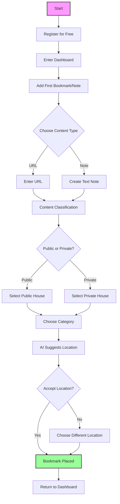

```mermaid
flowchart TD
    A[Start] --> B[Register for Free]
    B --> C[Enter Dashboard]
    
    C --> D[Add First Bookmark/Note]
    D --> E{Choose Content Type}
    E -->|URL| F[Enter URL]
    E -->|Note| G[Create Text Note]
    
    F --> H[Content Classification]
    G --> H
    
    H --> I{Public or Private?}
    I -->|Public| J[Select Public House]
    I -->|Private| K[Select Private House]
    
    J --> L[Choose Category]
    K --> L
    
    L --> M[AI Suggests Location]
    M --> N{Accept Location?}
    N -->|Yes| O[Bookmark Placed]
    N -->|No| P[Choose Different Location]
    P --> O
    
    O --> Q[Return to Dashboard]
    
    style A fill:#f9f,stroke:#333,stroke-width:2px
    style O fill:#9f9,stroke:#333,stroke-width:2px
``` 