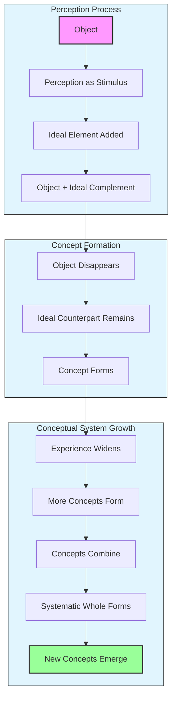
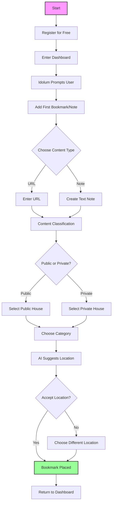
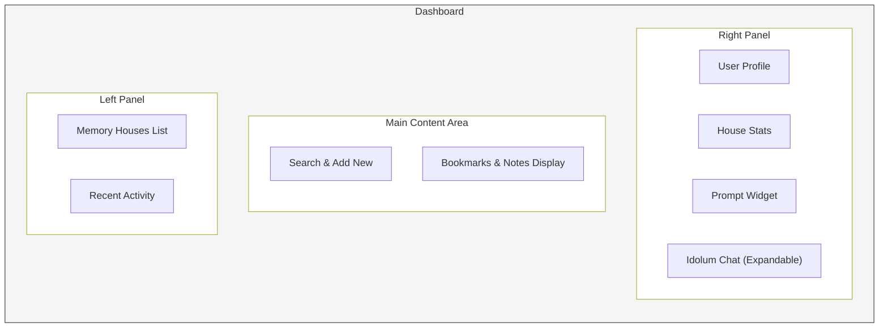
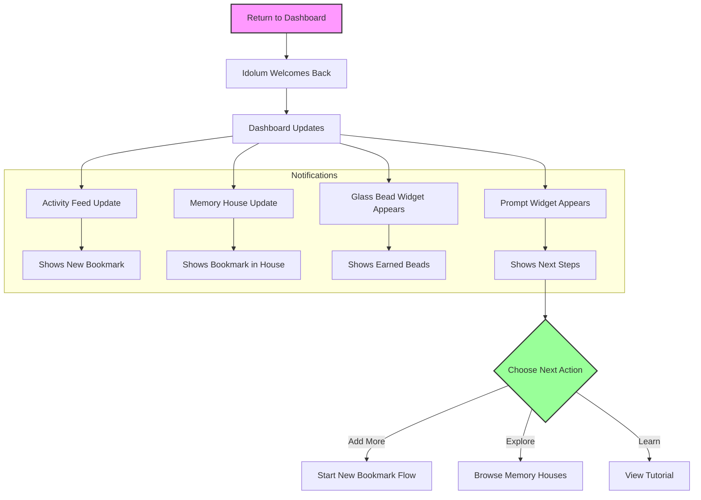
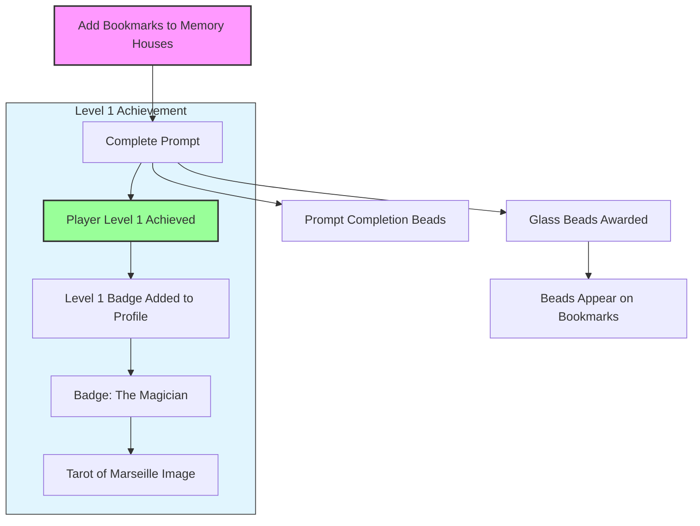

# Memorativa: A Game of Glass Beads and Memory Houses
# I. Introduction

## 1. Vision and background

> Signs and symbols rule the world, not words nor laws.

Humans are animals who think, using both intellect and imagination. The products of thinking activity are ideas and concepts.

A working model for thought(1):

1. What a concept is cannot be expressed in words. Words can do no more than draw our attention to the fact that we have concepts. 

2. When someone perceives an object (e.g. a tree or a memory), the perception acts as a stimulus for thought.

3. An **ideal element** is then added to the perceived object, and the perceiver regards the object and its ideal complement as belonging together. 

4. When the object disappears from the field of his perception, the ideal counterpart alone remains. 

5. This remaining ideal counterpart is the concept of the object. 

6. The wider the range of our experience, the larger becomes the number of our concepts. 

7. Moreover, concepts are not by any means found in isolation one from the other. They combine to form an ordered and systematic whole. 

8. The concept "organism," e.g., combines with those of "development according to law," "growth," and others. 

9. Other concepts based on particular objects fuse completely with one another.

10. All concepts formed from particular lions fuse in the universal concept "lion." 

11. In this way, all the separate concepts combine to form a closed, conceptual system within which each has its special place. 

12. Ideas do not differ qualitatively from concepts. They are but fuller, more saturated, more comprehensive concepts. 

With this "mental model", we can begin to design a system that reflects this inner ecosystem of thinking, so that we may be better regard and attend to this "systematic whole" that serves as our interior cosmos(2).

### 1.2. Content

Content is understood as a consumable unit of "something" represented online. Consumption is akin to eating, digesting, and excreting. Anything consumed is processed automatically, without conscious awareness.  

### 1.3. Symbols

Humans can chose to consume or to perceive.

- A symbol is a mark, sign, or word that represents an idea, object, or relationship. 

- Symbols can be used to create connections between different concepts and experiences. 

- Symbols both reveal and conceal at once.

- Symbols serve as a bridge between the conscious and unconscious mind, and also as a ferment and muse for the development of new concepts and ideas.

- Symbols can deepen, widen, and enrich the complimentary "ideal element" that arises from the perception of an object.

- Symbolic systems and languages can help rarify and clarify the process of thinking that generates concepts and ideas.

### 1.4. The ideal element, relationships, and analogy

The mysteriousness of the ideal element --like consciousness-- remains a topic to be explored, as does the formation of percepts, concepts, ideas, and memories. Regardless of the metaphysical nature or knowability of the ideal element as a process or even itself as a concept, its use can be treated as a human capacity related to memory and imagination. Love, or the attraction between two objects, can be playfully used to describe the mysteriousness of the mechanism and calling forth of the ideal element.

Relationships between objects can arise because we can perceive (internally) something of the "ideal element" between them. This perception of a conceptual relationship is the key to all analogical thinking. Pattern recognition depends on a foundational perception of the "ideal element" between objects.

Analogy presumes and relies upon the knowability of the unknown.

- The procedure of classification of objects on the basis of their resemblance is the first step on the way of research by the inductive method.

- Analogy (argument by analogy) can constitute the basis of hypothesis.

- Scientific method, indeed, is mainly devoted to discovering means of so heightening the known analogy that we may dispense as far as possible with the methods of pure induction(3).

### 1.5. Social media, its limitations, and the need for a new model

The current social media model collects "content" from users but prioritizes the maximization of various metrics based on various definitions of engagement. Because the system monetizes user content, users become stuck in roles that simply perform to maximize engagement, regardless of the meaning, value, intent, or worth of the content.

This is not to say that interesting content is not created or available:

- Symbols arises from people who, rather than react to content, chose to think, produce new ideas, and then artistically reflect the concept that arose form the initial content.

- Other signs or tokens that represent memories, placeholders for future ideas and other concepts, art, and previously unknown facts, concepts, and ideas are also available.

But two issues remain with the social media model:

- The system is also designed for you not to reflect on the content, but to react to it.
- The content is not discoverable nor workable.

Workable means that social media models are mostly centered around a dynamic feed of content, which is not conducive to meaningful reflection but dopamine hits.

In contrast, an opportunity presents for a system that is designed to cultivate an internal cosmos of ideas, concepts, and relationships. 

Such a system would use the raw material of content, liberating it from the social media model to create a workshop of ideas, concepts, and relationships.

Such work requires: 

- a space
- tools
- a playful approach

Such play may be facilitated by:

- a system of symbols
- a system of rules
- a system of rewards

**Memorativa** is the name of the system.

### 1.6. Ars Memorativa

The art of memory (Latin: *ars memoriae*) is any of a number of loosely associated mnemonic principles and techniques used to organize memory impressions, improve recall, and assist in the combination and 'invention' of ideas. An alternative term is "Ars Memorativa" which is also translated as "art of memory" although its more literal meaning is "Memorative Art".(4)

Memorativa takes inspiration from this ancient art, especially with regard to "the combination and 'invention' of ideas".

Within Memorativa, **Memory houses** are the spaces where the game is played.

Within each house, **Concepts** are organized, regarded, and combined into an ordered and systematic whole. 

### 1.7. The computer, AI, and automated thinking

Even now the world has moved on from social media and into the age of AI. Memorativa is not here to challenge or debate the merits of AI, but in fact use it to its advantage.

A word of caution will be given concerning the automation of thinking. One can discern from social media, AI, and general trends going back to Newton, that human thinking (reasoning and imagination) can be easily externalized in exchange for speed and efficiency. One can also perceive that externalized thinking can be an effort to capture the "ideal element" for the machines.

Memorativa is a remedial trend towards human thinking and an hygienic force in the culture. 

### 1.8. The Glass Bead Game

Author Hermann Hesse's novel *The Glass Bead Game* (1943) is a fictionalized account of a game of memory and imagination. The game is essentially an abstract synthesis of all arts and sciences. It proceeds by players making deep connections between seemingly unrelated topics. Though alluded to, the game is never fully described.(5)

Memorativa takes inspiration from The Glass Bead Game.

Within Memorativa, **Glass Beads** are game tokens that represent ideas, concepts, and relationships. **The Glass Bead Game** is the rules and play of the game.

---

This introduction provides the vision, approach, context, concepts, and goals for the system of Memorativa.

The rest of the document describes the system in detail.

## 2. Application Description

This section provides a wholistic, high-level description of the application, what it does, how it works, and its purpose. Further details for the application and technical designs are provided in additional chapters.

---

### 2.1. Application overview

Memorativa is a web application that users register to play and use as both a game and a tool. 

At its simplest, Memorativa is a bookmark manager for URLs, and a user can derive great benefit from this feature alone. 

At its most ambitious, Memorativa is a grand game of ideas, concepts, and relationships, a workshop for synchronicity, and a utility for Proof of Human Thought (PoHT).

### 2.2. How it works

#### Step 1: Register for free.

You can register and use the application as a free service. Once registered, you enter a web-based application and are greeted by a dashboard. 

#### Step 2: Add a bookmark.

From the dashboard, you can start the game by adding a bookmark to a *memory house*.

- A **bookmark** is a URL that you to want to remember.
- A **memory house** is a space where you can organize bookmarks.

You can also create a note, which is a text-based bookmark.

#### Step 3: Interact with the **Idolum**.

You'll notice an AI agent named **Idolum** that will help you add the bookmark. The agent lives in a simple chat-based interface on the dashboard. You'll see a **Prompt Widget** in the **Right Panel** of the dashboard. Your first prompt from the Idolum (to add your first bookmark) appears in the **Prompt Widget**.

#### Step 4: Find a location for your bookmark.

After you add your bookmark, you'll be asked to find a location for it within one of the memory houses. The application will guess a default location, but you can also choose a different location.

To help you decide where to place your bookmark, you'll be asked if your bookmark is **public** or **private**. Then you'll pick a category for the bookmark. Based on this, the application will place your bookmark in the appropriate memory house. You'll then return to the dashboard.

Here are the categories that organize your bookmarks in the memory houses:

  - First House: Self-concept and new beginnings
    - Profiles, bios, personal goals
    - Self-reflections, aspirations
    - Personal brand content, social media presence
    - Style, fashion, self-expression
  - Second House: Values and resources
    - Digital assets, documents
    - Personal libraries, inventories
    - Financial content, investment info
    - Product reviews, wishlists
  - Third House: Communication and learning
    - Notes, correspondence
    - Study materials, daily logs
    - News feeds, trending topics
    - Social media discussions, forums
  - Fourth House: Foundations and origins
    - Family history, traditions
    - Core documentation, origins
    - Home and living spaces
    - Cultural content, traditions
  - Fifth House: Creativity and expression
    - Original content, projects
    - Art, entertainment, hobbies
    - Games, sports, recreation
    - Music, movies, media
  - Sixth House: Analysis and improvement
    - Workflows, processes
    - Technical guides, procedures
    - Health and wellness content
    - Productivity tools, life hacks
  - Seventh House: Relationships and connections
    - Shared projects
    - Partnerships, agreements
    - Relationship content
    - Public discourse, debates
  - Eighth House: Transformation and depth
    - Deep investigations
    - Complex systems, transformations
    - World events analysis
    - Conspiracy theories, mysteries
  - Ninth House: Higher learning and philosophy
    - Educational content
    - Philosophy, teachings
    - Travel, exploration
    - Current affairs, global trends
  - Tenth House: Achievement and structure
    - Career materials
    - Public achievements
    - Industry news, market trends
    - Professional development
  - Eleventh House: Community and innovation
    - Group initiatives
    - Social projects, future plans
    - Technology trends
    - Social movements, activism
  - Twelfth House: Private archives
    - Personal journals
    - Private collections, reflections
    - Saved content for later
    - Inspirational content
  
  - Public Houses:
    - First House: Self-concept and new beginnings (Public persona)
    - Third House: Communication and learning (Public discourse)
    - Seventh House: Relationships and connections (Public interactions)
    - Ninth House: Higher learning and philosophy (Public knowledge)
    - Tenth House: Achievement and structure (Public achievements)
    - Eleventh House: Community and innovation (Public collaboration)
  
  - Private Houses:
    - Second House: Values and resources (Private resources)
    - Fourth House: Foundations and origins (Private foundations)
    - Fifth House: Creativity and expression (Private creation)
    - Sixth House: Analysis and improvement (Private work)
    - Eighth House: Transformation and depth (Private transformation)
    - Twelfth House: Private archives (Private reflection)

#### First-time user flow #1: register and add a bookmark

### 2.2.5. Navigation and assistance

The dashboard is the main interface for the application. It is a workspace where you can add and organize bookmarks and notes.

The dashboard shows bookmarks, memory houses, your user profile, and the Idolum agent interface.

The dashboard layout consists of three main sections:

1. **Left Panel - Memory Houses Navigation**
   - Organized list of the 12 houses
   - Visual indicators for public/private houses
   - Recent activity feed

2. **Main Content Area**
   - Clean, minimalist design
   - Toggle between grid/list views
   - Clear visual distinction between bookmarks and notes
   - Quick-add button for new content
   - Search functionality
   - Visual representation of the systematic whole of concepts

3. **Right Panel**
   - User profile at the top
   - Quick stats about your memory houses
   - Prompt Widget
   - Expandable Idolum chat interface at the bottom
   - A Help button toggle adjacent to the Idolum chat

Following the first-time user flow #1 (register and add a bookmark), you'll be greeted by the dashboard.

- You'll see your bookmark in listed in the activity feed.
- You'll see your bookmark in the appropriate memory house.
- You'll see a **Prompt Widget** appear on the dashboard in the **Right Panel**.
- You'll see a **Glass Bead widget** appear in the dashboard in the **Left Panel**.
- The Idolum will inform you of the following:
  - The bookmark has been added to your memory house.
  - You've been awarded *glass beads* for adding your bookmark and completing the prompt. 
  - The Idolum will present a new prompt for you to add more bookmarks. You'll be asked to add bookmarks to each of the Public Houses and Private Houses.

#### First time user flow #2: view your bookmark in the dashboard

#### Bookmark details

The bookmark details are shown when you select a bookmark in the dashboard.

The player will see that the Idolum has extracted the following information from the bookmark:

- The title of the bookmark
- The URL of the bookmark
- The description of the bookmark
- The category of the bookmark
- The memory house the bookmark is placed in
- Metadata about the bookmark, such as the date and time it was added, the date and time it was last updated, the number of times it has been viewed, and the number of times it has been interacted with.
- The glass beads that were generated from the bookmark
- Permissions for the bookmark, such as whether it is public or private
- The content type represented by the bookmark, such as text, video, image, audio, etc.
- [NOTE FOR FUTURE]: paid accounts can store the original bookmark content (if legal, allowed, etc.)
- [NOTE FOR FUTURE]: start implementing LLM data extraction from the bookmark

The player may edit the bookmark details, and ask the Idolum to adjust or fine tune how it extracts information from the bookmark.

### 2.2.6. Levels and player progression

After you've completed the prompt from the Idolum (to add more bookmarks to your memory houses), the following will happen:

- You'll be awarded more *glass beads* for each bookmark you add.
- You'll be awarded glass beads for completing the prompt.
- You'll achieve player level 1.
- A *level 1* badge appears in your profile.
- The badge and rank for level 1 is the *Magician*.
- The image for the *Magician* badge is a *Magician* card from the *Tarot of Marseille*.
- The level system is based on the *Tarot of Marseille*, specifically the *Major Arcana* and on the work of Poncet, Christophe(6) in how the deck symbols relate to Ficino's planetary symbolism and art of memory(7).

#### Player levels

- Level 1, rank: The Magician
- Level 2, rank: The High Priestess
- Level 3, rank: The Empress
- Level 4, rank: The Emperor
- Level 5, rank: The Hierophant
- Level 6, rank: The Lovers
- Level 7, rank: The Chariot
- Level 8, rank: Strength
- Level 9, rank: The Hermit
- Level 10, rank: Wheel of Fortune
- Level 11, rank: Justice
- Level 12, rank: The Hanged Man
- Level 13, rank: Death
- Level 14, rank: Temperance
- Level 15, rank: The Devil
- Level 16, rank: The Tower
- Level 17, rank: The Star
- Level 18, rank: The Moon
- Level 19, rank: The Sun
- Level 20, rank: Judgment
- Level 21, rank: The Fool
- Level 22, rank: The World

#### First time user flow #3: level 1 unlocked

With level 1 unlocked, the Idolum presents a series of prompts in your Prompt Widget that guide you through the new rules and features of the game.

#### Level 1, rank: The Magician

The level one player rank is the *Magician*. The goal of the Magician is to master the arts of play and analogy.

The Idolum informs the player that can create relationships between bookmarks.

This unlocks a new dashboard display in the **Main Content Area** that shows an overhead view of the memory houses arranged inside a circle like a pie chart.

The player sees that he can now place a bookmark into multiple memory houses. The Idolum identifies the memory houses that could be most relevant to the secondary bookmark classification.

In order to create the relationship, the Idolum explains that the relationship requires glass beads that "belong" to the houses in the relationship. That is, the connection can built using glass beads that were generated from the memory houses that the player has selected. For example, if the player adds a bookmark to the *First House* and the *Third House*, the Idolum will look for the glass beads that were generated from the *First House* and the *Third House* and use them to create the relationship.

The Idolum will look for the specific glass beads and use them to create the relationship.

The player will see that his glass bead widget shows minus two original glass beads and plus one new glass bead.

If players run out of or does not have glass beads that belong to a given house, they need to add more bookmarks to the house to be awarded more eligible glass beads. 

In this way the player learns:

- Glass beads are created by adding bookmarks to memory houses.
- The glass beads generated from the memory houses are used to create relationships between bookmarks.
- To create a relationship between two bookmarks, the player needs to have glass beads that belong to the memory houses that the bookmarks are placed in.
- New glass beads are created when a relationship is created.

The player can choose to follow the AI analyzed prompts to create relationships between bookmarks, or to explore the memory houses and create relationships manually.

It does not cost anything to move (not duplicate) a bookmark between memory houses. The action will however destroy the original glass bead generated from the house the bookmark was originally placed in, and create a new glass bead for the new house.

Along the way, the player may ask the Idolum any questions about the game, the rules, the memory houses, or the glass beads. He may ask about the kinds of glass beads available in inventory, or how to create a relationship between two bookmarks, or suggestions for new bookmarks to add to the memory houses that could follow a long-term exploration or curation strategy.

In this way, the Idolum prompts guide the player through advanced curation of bookmarks and exploration of the classification system of the memory houses.

The player will be reminded that notes are also bookmarks, and can be used to create relationships. Notes enable the player to more thoughtfully reflect on the content of the bookmark and create more meaningful relationships. 

The Idolum will also question the player and passively monitor the player's decisions to better understand the kind of vision the player has for the game. What kinds of content is the player interested in? What kinds of relationships is the player interested in? What kinds of bookmarks are the player interested in?

After completing the prompts required to unlock level 2, the player is awarded a new badge, new glass beads, and a new prompt.

#### Level 2, rank: The High Priestess

The goal of level 2 is to master the art of the "ideal element" in producing concepts.

Now that the player has accumulated different types of glass beads from level one, he will find use for the glass beads generated from creating relationships between bookmarks.

These glass beads are used to create the "ideal element" between bookmarks, which is represented by a third concept that arises from the relationship between the two bookmarks.

The player learns from the Idolum that he has now learned the rules to the Glass Bead Game. This new order of synthesis signals that the player is now working with concepts. The player is to synthesize the concepts and ideas that arise from the relationships between bookmarks. As the player cultivates the memory houses, the Idolum will prompt the player to continue to create new concepts as an act of reflection that represents a high confidence of Proof of Human Thought (PoHT). 

Creating concepts generate new glass beads. These glass beads are "synthesis" beads. They denote successfully synthesized concepts in the game.

As play progresses, the Idolum will continue to guide the player with AI analysis to help the player synthesize concepts and ideas that arise from the relationships between bookmarks. It will also ensure that the player attends to the entire ecosystem of the game.

#### Level 3, rank: The Empress

The goal of level 3 is to master the arts love and magic, which is to study the relationships on a higher symbolic plane. The goal of sacred magic is to liberate the player from mechanistic thinking and to enable the player to think in a more creative and generative way. At this level, mere "content" has also been liberated from social media into a creative and generative space, a "systematic whole" of concepts.

At this level the player now sees that **Symbolic Lenses** are available to better understand his memory houses and their concepts and relationships.

The first Symbolic Lens to unlock is the **Astrological Lens**.

The player also unlocks the before latent and hidden properties of the glass beads. The beads are revealed to have grades related to their generative process:

- Adding bookmarks to memory houses generates *first grade*, *perception* glass beads.
- Creating relationships between bookmarks generates *second grade*, *relationship* glass beads.
- Creating concepts from relationships generates *third grade*, *synthesis* glass beads.

Additionally, beads store and contain the following information:

- The bookmark that generated the glass bead.
- The memory house that generated the glass bead.
- The relationship that generated the glass bead.
- The concept that generated the glass bead.
- Where the glass bead is located in the memory house.
- Where the glass bead is located in the relationship.
- Where the glass bead is located in the concept.
- When the glass bead was created.
- When the glass bead was used for what purpose.
- The number of times the glass bead has been used.

### 2.2.7 Symbolic Lenses

## 3. References

1. [The Philosophy of Freedom, by Rudolf Steiner](https://en.wikipedia.org/wiki/The_Philosophy_of_Freedom)
2. [Cosmos and Psyche, by Richard Tarnas](https://en.wikipedia.org/wiki/Cosmos_and_Psyche)
3. [Meditations on the Tarot, by Anonymous](https://en.wikipedia.org/wiki/Meditations_on_the_Tarot) 
4. [The Art of Memory, by Francis A. Yates](https://en.wikipedia.org/wiki/Art_of_memory)
5. [The Glass Bead Game, by Hermann Hesse](https://en.wikipedia.org/wiki/The_Glass_Bead_Game)
6. [The Tarot of Marsilio, by Christophe Poncet](https://scarletimprint.com/christophe-poncet)
7. [The Planets Within: The Astrological Psychology of Marsilio Ficino, by Thomas Moore](https://en.wikipedia.org/wiki/Thomas_Moore_(spiritual_writer))

